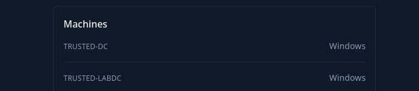

# Introduction

Trusted is a small Active Directory scenario that has you perform an internal red team engagement on Trusted Inc. You are provided access to the internal network with no credentials, and your goal is to assess the security posture of the AD environment.

This Red Team Operator Level 1 lab will expose players to:

- Basic Web Vulnerability
- Active Directory enumeration and attacks
- DLL Hijacking
- Abusing Active Directory Trusts

# Entry points

The challenge gives you 1 private IP as entry point:

Plus it is also aware that the challenge involves only 2 Windows based servers:

Without further due I will start drilling down the IPs.

&nbsp;