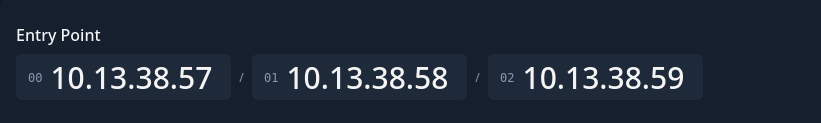
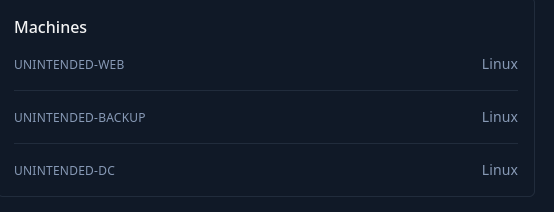

# Introduction

Unintended is a company that has recently migrated its infrastructure to Active Directory. Management is concerned that legacy practices and overlooked misconfigurations could expose the environment to external threats. Your firm has been contracted to conduct a penetration test, with the objective of determining whether an attacker can move from initial access to full control of the domain.

Unintended provides a hands-on experience with common missteps in Active Directory deployments, demonstrating how attackers can pivot between services to escalate privileges. It blends Linux privilege escalation techniques with Active Directory attack paths, making it a valuable practice ground for both offensive and defensive security practitioners.

Unintended is designed for individuals looking to expand their knowledge of Active Directory exploitation in a Linux-centric environment. It is well-suited for those seeking to understand real-world misconfigurations in hybrid infrastructure.

This **Red Team Operator I** lab will expose players to:

- Active Directory backup enumeration
- Lateral movement
- Network Pivoting
- Linux privilege escalation
- Backup Forensics
- Web Application attacks

# Entry Points

As usual i get some private IPs that will be used on this mini-challenge.

Plus, a quick insight of the tech-stack, that spoiler(will be Linux all the way).

