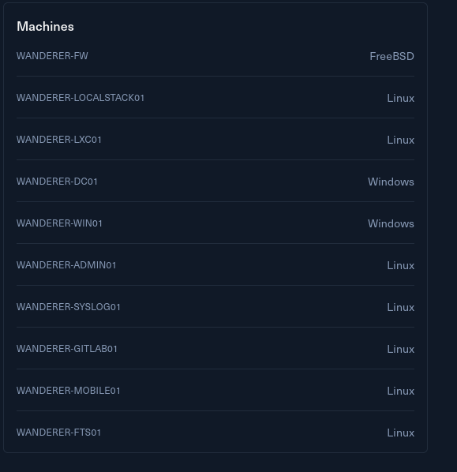

# Introduction

In a post-apocalyptic wasteland, there is not much that is left. One of the few core IT Systems left offers a mobile application to aid in calling the remaining survivors and uploading status reports to unknown leaders. It is believed that ZAX whom used to go by the pseudonym WOPR set this network up, but they went missing. You are tasked with wandering form machine to machine, collecting as much information as you can on the users who set this network up.

Wanderer is designed to test how well-rounded your skills are, you may find yourself having to perform some DFIR after exploiting a box in order to progress to the next step.

Wanderer is designed for intermediate red teamers, with a primary focus on enumeration and building attack chains. While the attacks themselves are not technically complex, they can be challenging to discover.

This Red Team Operator II lab will expose players to:

&nbsp;   Enumeration  
    SQL Injection and Filter Evasion  
    Web Application attacks  
    Basic Mobile Application Analysis  
    Basic WiFi Attacks  
    Asterisk Attacks

# Entry Points

As usual I am provided a single /24 subnet as entry point for this challenge:  


But I can see the whole tech-stack is using a mixed pool of Windows machines together with a majority of them being Linux of some sort:  


Now without further do I will get into it and start by fuzzing all the alive hosts in this pool in the following chapter.

# Hosts Enumeration

I like to start easy by running fping and checking all the alive hosts and if I ommit the first 2 hosts in the list(usually part of the network devices ergo out of the scope) I see only 4 devices?

```bash
─$ fping -asqg 10.10.110.0/24
10.10.110.2
10.10.110.3
10.10.110.20
10.10.110.22
10.10.110.25
10.10.110.254

     254 targets
       6 alive
     248 unreachable
       0 unknown addresses

     992 timeouts (waiting for response)
     998 ICMP Echos sent
       6 ICMP Echo Replies received
      11 other ICMP received

 21.7 ms (min round trip time)
 22.2 ms (avg round trip time)
 22.8 ms (max round trip time)
        9.806 sec (elapsed real time)


```

To be on the safe side I like to run Netexec as well as it can quickly assets presence of SSH services and footprint all the Linux based machines running on the common SSH port:

```bash
─$ netexec ssh 10.10.110.0/24
SSH         10.10.110.3     22     10.10.110.3      [*] SSH-2.0-OpenSSH_9.4
SSH         10.10.110.20    22     10.10.110.20     [*] SSH-2.0-OpenSSH_8.9p1 Ubuntu-3ubuntu0.11
SSH         10.10.110.25    22     10.10.110.25     [*] SSH-2.0-OpenSSH_8.9p1 Ubuntu-3ubuntu0.11
SSH         10.10.110.22    22     10.10.110.22     [*] SSH-2.0-OpenSSH_8.9p1 Ubuntu-3ubuntu0.11
SSH         10.10.110.254   22     10.10.110.254    [*] SSH-2.0-OpenSSH_8.9p1 Ubuntu-3ubuntu0.11
Running nxc against 256 targets ━━━━━━━━━━━━━━━━━━━━━━━━━━━━━━━━━━━━━━━━ 100% 0:00:00

```

Another quick check on the Windows side did not show traces of any open services at the moment.

&nbsp;