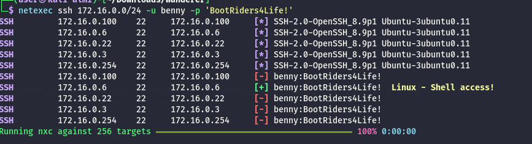

Now from the FTS01 I am aware that this is the machine from where Lenny is making a cron login to that server; as soon i can gain root then i can modify the PAM file to export the credetnials from the ssh service but right now I can't do much... But as usual I will start by performing a network scan of open services over all the TCP services:

```bash
PORT   STATE SERVICE REASON         VERSION
22/tcp open  ssh     syn-ack ttl 64 OpenSSH 8.9p1 Ubuntu 3ubuntu0.11 (Ubuntu Linux; protocol 2.0)
| ssh-hostkey: 
|   256 16:d4:81:b7:6d:e5:ea:a1:c5:4c:37:d6:23:2f:26:e5 (ECDSA)
| ecdsa-sha2-nistp256 AAAAE2VjZHNhLXNoYTItbmlzdHAyNTYAAAAIbmlzdHAyNTYAAABBBLEKL7QqTmfMJVxZUHe5GlRw8oIJVd+DB6Oy9pXr6fM9/qos6wuCi2icAL9HiMDXa03OU3Nb7J6TxPOEfUjkK9E=
|   256 32:e1:6e:f3:d1:01:86:55:b5:ec:34:ef:03:ab:be:b5 (ED25519)
|_ssh-ed25519 AAAAC3NzaC1lZDI1NTE5AAAAIB7dAlGFnzyk7NApf3kmnn9yJ1KVNilXOmu1le/C6fD1
Warning: OSScan results may be unreliable because we could not find at least 1 open and 1 closed port
Device type: general purpose
Running (JUST GUESSING): IBM z/OS 1.12.X (85%)
OS CPE: cpe:/o:ibm:zos:1.12
OS fingerprint not ideal because: Missing a closed TCP port so results incomplete
Aggressive OS guesses: IBM z/OS 1.12 (85%)
No exact OS matches for host (test conditions non-ideal).
TCP/IP fingerprint:
SCAN(V=7.98%E=4%D=4/13%OT=22%CT=%CU=%PV=Y%G=N%TM=69DCC282%P=x86_64-pc-linux-gnu)
SEQ(SP=100%GCD=1%ISR=10F%TI=I%CI=RD%II=RI%TS=A)
SEQ(SP=105%GCD=1%ISR=107%TI=I%CI=RD%II=RI%TS=A)
OPS(O1=M5B4NNT11NW7%O2=M5B4NNT11NW7%O3=M5B4NNT11NW7%O4=M5B4NNT11NW7%O5=M5B4NNT11NW7%O6=M5B4NNT11)
WIN(W1=7200%W2=7200%W3=7200%W4=7200%W5=7200%W6=7200)
ECN(R=Y%DF=N%TG=40%W=7200%O=M5B4NW7%CC=N%Q=)
T1(R=Y%DF=N%TG=40%S=O%A=S+%F=AS%RD=0%Q=)
T2(R=Y%DF=N%TG=40%W=0%S=Z%A=S%F=AR%O=%RD=0%Q=)
T3(R=Y%DF=N%TG=40%W=7200%S=O%A=S+%F=AS%O=M5B4NNT11NW7%RD=0%Q=)
T4(R=Y%DF=N%TG=40%W=0%S=A%A=Z%F=R%O=%RD=0%Q=)
T5(R=Y%DF=N%TG=40%W=0%S=Z%A=S+%F=AR%O=%RD=0%Q=)
T6(R=Y%DF=N%TG=40%W=0%S=A%A=Z%F=R%O=%RD=0%Q=)
T7(R=Y%DF=N%TG=40%W=0%S=Z%A=S+%F=AR%O=%RD=0%Q=)
U1(R=N)
IE(R=Y%DFI=S%TG=40%CD=S)

```

# Still not working

With the credentials obtained by the PAM abusing on FTS01 server I can see that even if these credentials worked on FTS01 those do not work at all on SSH:



Honestly, I can only guess this might be the ***WANDERER-LXC01*** but it's just a wild guessing.