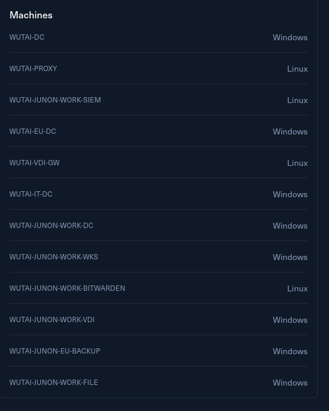

# **Introduction**

The Wutai Group has tasked you with performing a penetration test on its networks. This includes the Wutai Parent Company & its subsidiary Junon. Wutai is concerned about its security posture since a leak of domain usernames was found online on pastebin.

**Leaked Usernames in 2023**

- Katie.Shaw@work.junon.vl
- Marion.Green@work.junon.vl
- Abdul.Evans@work.junon.vl
- Hollie.Dodd@work.junon.vl
- Stanley.Lee@work.junon.vl
- Julia.Harvey@work.junon.vl
- Jacqueline.Harrison@work.junon.vl
- Rachael.Winter@work.junon.vl
- Martyn.Mason@work.junon.vl
- Elliott.Nixon@work.junon.vl
- Leonard.Chandler@work.junon.vl
- Gillian.Baldwin@work.junon.vl
- Justin.Thompson@work.junon.vl
- Sharon.Wilkinson@work.junon.vl
- Abdul.Bell@work.junon.vl
- Wendy.Vincent@work.junon.vl
- Terry.James@work.junon.vl
- Danny.Houghton@work.junon.vl
- Lorraine.Wright@work.junon.vl
- Kate.Morris@work.junon.vl
- Glenn.Wood@work.junon.vl
- Sandra.Hopkins@work.junon.vl
- Leslie.Brown@work.junon.vl
- Geraldine.Shaw@work.junon.vl
- Jay.Griffin@work.junon.vl
- Carolyn.Mitchell@work.junon.vl
- Fiona.Stewart@work.junon.vl
- Dylan.Mills@work.junon.vl
- Roger.Ball@work.junon.vl
- Connor.Hancock@work.junon.vl
- Stephen.Mitchell@work.junon.vl
- Francis.Ellis@work.junon.vl
- Katherine.Carter@work.junon.vl
- Anne.Bevan@work.junon.vl
- Sharon.Evans@work.junon.vl
- Katherine.Harvey@work.junon.vl
- Leigh.Adams@work.junon.vl
- Glen.Banks@work.junon.vl
- Sharon.Grant@work.junon.vl
- Pauline.Grant@work.junon.vl
- Carly.Adams@work.junon.vl
- Danielle.Howarth@work.junon.vl
- Sara.Lambert@work.junon.vl
- Gerald.Webster@work.junon.vl
- Joel.Gibbons@work.junon.vl
- Stacey.Francis@work.junon.vl
- Daniel.Campbell@work.junon.vl
- Teresa.Watson@work.junon.vl
- Garry.Smith@work.junon.vl
- Melissa.Hutchinson@work.junon.vl
- Melanie.Mueller@work.junon.vl
- Lindsey.Campbell@work.junon.vl
- Anthony.Marsh@work.junon.vl
- Kenneth.Harvey@work.junon.vl
- Rosemary.O'Connor@work.junon.vl
- Graeme.Williams@work.junon.vl
- John.Gibbons@work.junon.vl
- Sheila.Nicholls@work.junon.vl
- Jeremy.Williams@work.junon.vl
- Terry.Lowe@work.junon.vl
- Maureen.Jones@work.junon.vl
- Rachel.Shaw@work.junon.vl
- Dylan.Hill@work.junon.vl
- Deborah.Knowles@work.junon.vl
- Rebecca.Lee@work.junon.vl
- Francis.Jones@work.junon.vl
- Louise.Walsh@work.junon.vl
- Grace.Ingram@work.junon.vl
- Megan.Wall@work.junon.vl
- Denise.French@work.junon.vl
- Keith.Hall@work.junon.vl
- Rita.Townsend@work.junon.vl
- Kerry.Richardson@work.junon.vl
- Lesley.Price@work.junon.vl
- Debra.White@work.junon.vl
- Frederick.Jackson@work.junon.vl
- Jeffrey.Ball@work.junon.vl
- Rachel.Kennedy@work.junon.vl
- Sarah.Allen@work.junon.vl
- Colin.Akhtar@work.junon.vl
- Jade.Watson@work.junon.vl
- Adrian.Lane@work.junon.vl
- Rosie.Mahmood@work.junon.vl
- Mitchell.Roberts@work.junon.vl
- Leslie.Vincent@work.junon.vl
- Elliott.Taylor@work.junon.vl
- Hazel.Simpson@work.junon.vl
- Bruce.Davies@work.junon.vl
- Albert.Williams@work.junon.vl
- Kerry.Walker@work.junon.vl
- Hollie.Parker@work.junon.vl
- Kevin.Wood@work.junon.vl
- Gerald.Powell@work.junon.vl
- Dale.West@work.junon.vl
- Marion.Jones@work.junon.vl
- Carly.Roberts@work.junon.vl
- Melanie.Barnett@work.junon.vl
- Tom.Perkins@work.junon.vl
- Toby.Wright@work.junon.vl
- Michael.Moore@work.junon.vl
- Lynda.Graham@work.junon.vl
- Tony.Mitchell@work.junon.vl
- Chloe.Parkin@work.junon.vl
- Sam.Ward@work.junon.vl
- Kelly.Jones@work.junon.vl
- Patrick.Davison@work.junon.vl
- Brett.Roberts@work.junon.vl
- Amber.Barnes@work.junon.vl
- Rebecca.Bray@work.junon.vl
- Hugh.Lees@work.junon.vl
- Dylan.Stanley@work.junon.vl
- Max.Rees@work.junon.vl
- Elaine.Smith@work.junon.vl
- Gordon.Bishop@work.junon.vl
- Tina.Clayton@work.junon.vl
- Brenda.Jones@work.junon.vl
- Abbie.O'Brien@work.junon.vl
- Tracey.Carpenter@work.junon.vl
- Sam.Collins@work.junon.vl
- Julie.Smith@work.junon.vl
- Shaun.Phillips@work.junon.vl
- Julie.Parker@work.junon.vl
- Barbara.Clarke@work.junon.vl
- Amber.Metcalfe@work.junon.vl
- Jenna.Wallace@work.junon.vl
- Deborah.Fuller@work.junon.vl
- Victoria.Moran@work.junon.vl
- Scott.Marshall@work.junon.vl
- Gavin.Long@work.junon.vl
- Vanessa.Adams@work.junon.vl
- Lydia.Slater@work.junon.vl
- Francis.Chambers@work.junon.vl
- Georgina.Smart@work.junon.vl
- Sophie.Richards@work.junon.vl
- Mohamed.Forster@work.junon.vl
- Sharon.Ward@work.junon.vl
- Deborah.Martin@work.junon.vl
- John.Lewis@work.junon.vl
- Thomas.Yates@work.junon.vl
- Ricky.Cooke@work.junon.vl
- Rachel.Pollard@work.junon.vl
- Gail.Brown@work.junon.vl
- Emily.Brown@work.junon.vl
- Kayleigh.Coleman@work.junon.vl
- Lewis.Begum@work.junon.vl
- Ben.White@work.junon.vl
- Irene.Smith@work.junon.vl
- Bradley.Taylor@work.junon.vl
- Beverley.Moss@work.junon.vl
- Rosemary.Parsons@work.junon.vl
- Lauren.Hall@work.junon.vl
- Allan.Patel@work.junon.vl
- Danny.Ryan@work.junon.vl
- Max.Curtis@work.junon.vl
- Gregory.Hobbs@work.junon.vl
- Tom.Ross@work.junon.vl
- Shirley.Rogers@work.junon.vl
- Bruce.Williams@work.junon.vl
- Lorraine.Johnson@work.junon.vl
- Frank.Hicks@work.junon.vl
- Jade.Parsons@work.junon.vl
- Sam.Pearson@work.junon.vl
- Melanie.Bradley@work.junon.vl
- Janet.Taylor@work.junon.vl
- Darren.Mitchell@work.junon.vl
- Billy.Woods@work.junon.vl
- Katie.James@work.junon.vl
- Oliver.Sinclair@work.junon.vl
- Brett.Duncan@work.junon.vl
- Amanda.Atkinson@work.junon.vl
- Marion.Davies@work.junon.vl
- Kieran.Patel@work.junon.vl
- Duncan.Jones@work.junon.vl
- Lynne.Hudson@work.junon.vl
- Elliott.Storey@work.junon.vl
- Julie.Baker@work.junon.vl
- Nigel.Parker@work.junon.vl
- Adrian.Baldwin@work.junon.vl
- Sian.Smith@work.junon.vl
- Anne.Curtis@work.junon.vl
- Norman.Thompson@work.junon.vl
- Kathleen.Smith@work.junon.vl
- Victor.Edwards@work.junon.vl
- Paul.Stanley@work.junon.vl
- Brett.Austin@work.junon.vl
- Leslie.White@work.junon.vl
- Malcolm.Smith@work.junon.vl
- Kimberley.Cooke@work.junon.vl
- Gemma.Higgins@work.junon.vl
- Bryan.Ward@work.junon.vl
- Jeffrey.Jenkins@work.junon.vl
- Douglas.Webb@work.junon.vl
- Louise.Morgan@work.junon.vl
- Wayne.Jones@work.junon.vl
- Debra.Wright@work.junon.vl
- Brandon.Price@work.junon.vl
- Linda.Hayes@work.junon.vl
- Brian.Marsden@work.junon.vl
- Lynda.Pollard@work.junon.vl
- Jean.Quinn@work.junon.vl
- Charlene.Patel@work.junon.vl
- Iain.Richards@work.junon.vl
- Brian.Kent@work.junon.vl
- Sarah.Smith@work.junon.vl
- Anna.Scott@work.junon.vl
- Ricky.Marshall@work.junon.vl
- Catherine.Jones@work.junon.vl
- Bethan.Taylor@work.junon.vl
- Marc.Mann@work.junon.vl
- Ben.Brown@work.junon.vl
- Dominic.Payne@work.junon.vl
- Carol.Steele@work.junon.vl
- Harry.Roberts@work.junon.vl
- Dale.Gibson@work.junon.vl
- Hugh.Morley@work.junon.vl
- Pamela.Swift@work.junon.vl
- Lynne.Law@work.junon.vl
- Dale.Metcalfe@work.junon.vl
- Lesley.Middleton@work.junon.vl
- Ashley.Bibi@work.junon.vl
- Norman.Webb@work.junon.vl
- Nicola.Franklin@work.junon.vl
- Keith.Townsend@work.junon.vl
- Matthew.Clarke@work.junon.vl
- Charles.Pearson@work.junon.vl
- Jay.Norman@work.junon.vl
- Paula.Hughes@work.junon.vl
- Amber.Robinson@work.junon.vl
- Dale.Ali@work.junon.vl
- Martyn.Khan@work.junon.vl
- Sean.Walker@work.junon.vl
- Rosemary.Norton@work.junon.vl
- Martin.Williams@work.junon.vl
- Amelia.Page@work.junon.vl
- Marilyn.Webster@work.junon.vl
- Dean.Hobbs@work.junon.vl
- Trevor.Fisher@work.junon.vl
- Jodie.Burton@work.junon.vl
- Jacqueline.Roberts@work.junon.vl
- Patrick.King@work.junon.vl
- Deborah.Kelly@work.junon.vl
- Angela.Patterson@work.junon.vl
- Janice.Warren@work.junon.vl
- Keith.Fitzgerald@work.junon.vl
- Antony.Atkins@work.junon.vl
- Graeme.Jones@work.junon.vl
- Clare.Jones@work.junon.vl
- Victoria.Barnes@work.junon.vl
- Rosemary.Richardson@work.junon.vl
- Bradley.Payne@work.junon.vl
- Karen.Lynch@work.junon.vl
- Colin.Carr@work.junon.vl
- Amanda.Jones@work.junon.vl
- Frances.Clarke@work.junon.vl
- Carolyn.Lee@work.junon.vl
- Harriet.Turner@work.junon.vl
- Sandra.Roberts@work.junon.vl
- Stephen.Harrison@work.junon.vl
- Elaine.Williams@work.junon.vl
- Gerald.Smith@work.junon.vl
- Jeffrey.Hurst@work.junon.vl
- Emma.Ahmed@work.junon.vl
- Jane.Brooks@work.junon.vl
- Gemma.Morris@work.junon.vl
- Brandon.Evans@work.junon.vl
- Julian.Cooke@work.junon.vl
- Lynn.Barnes@work.junon.vl
- Samantha.Hanson@work.junon.vl
- Judith.Harrison@work.junon.vl
- Alan.Gill@work.junon.vl
- Karl.Kent@work.junon.vl
- Sean.Sinclair@work.junon.vl
- Jessica.Duffy@work.junon.vl
- Elliot.Moss@work.junon.vl
- Stewart.Davies@work.junon.vl
- Sylvia.Bell@work.junon.vl
- Alexander.Allan@work.junon.vl
- Nicola.Jackson@work.junon.vl
- Lynne.May@work.junon.vl
- Bernard.Baker@work.junon.vl
- Josh.Conway@work.junon.vl
- Conor.Bennett@work.junon.vl
- Hugh.Dixon@work.junon.vl
- Joanne.Ball@work.junon.vl
- Gillian.Sinclair@work.junon.vl
- Kieran.Smith@work.junon.vl
- Amy.Ball@work.junon.vl
- Laura.Patel@work.junon.vl
- Alexander.Brown@work.junon.vl
- Duncan.Green@work.junon.vl
- Adam.Henderson@work.junon.vl
- Elliot.Brown@work.junon.vl
- Clive.Ellis@work.junon.vl
- Chloe.Hill@work.junon.vl
- Paul.Smith@work.junon.vl
- Malcolm.Brown@work.junon.vl
- Clifford.Bradley@work.junon.vl
- Daniel.Yates@work.junon.vl
- Emily.Conway@work.junon.vl
- Damien.Howell@work.junon.vl

**SIEM Access**  
Additionally, you have been provided with a read-only account viewer:eeDB364ed41# to the company's SIEM at http://172.16.21.15 to watch for alerts in real time.

**Video Walkthrough**  
You can also find a video walkthrough for a significant part of the lab at https://www.youtube.com/playlist?list=PLPBVZbjvnjVkOHMqB39eiqSdNLdezIw1X. Some parts of the lab have changed, but it should still give you a good idea on how to approach this lab and such engagements in general.

The goal of this test is to reach Enterprise Administrator in the wutai.vl domain. Wutai employs a small SOC, but its blue team capabilities are still on a rather basic level.

Wutai is a typical real world environment, designed to put your red team skills to the test. This lab is focused on operating covertly without triggering detection mechanisms. You will be able to see detections in near real time and be able to tune your actions accordingly.

Wutai is for people who already have basic knowledge in AD topics and pentesting and want to dive into red teaming. This **Red Team Operator Level 2** lab will expose players to:

- Network & Active Directory Enumeration
- Active Directory & Custom Exploitation
- Active Directory Certificate Services
- Lateral Movement across multiple Forests
- Bypassing EDR Solutions
- Reverse Engineering
- Operating covertly

# Entry Points

As usual I am provided only of a subnet I am allowed to test as part of the ROE:


Plus I can take a peek at the tech-stack used by the challege with a mix of Linux and mostly Windows machines.



# Initial Enumeration

As usuail I need to identify all the running hosts on this subnet that will serve as entry point here:

```bash
└─$ fping -asqg 10.10.110.0/24
10.10.110.2
10.10.110.3
10.10.110.15
10.10.110.100
^[[A
     254 targets
       4 alive
     250 unreachable
       0 unknown addresses

    1000 timeouts (waiting for response)
    1004 ICMP Echos sent
       4 ICMP Echo Replies received
       2 other ICMP received

 23.7 ms (min round trip time)
 24.4 ms (avg round trip time)
 25.9 ms (max round trip time)
        9.422 sec (elapsed real time)

```

And additionally I do not see any Windows hosts at this stage?

```bash
└─$ netexec smb 10.10.110.0/24
Running nxc against 256 targets ━━━━━━━━━━━━━━━━━━━━━━━━━━━━━━━━━━━ 100% 0:00:00
                                                                                
┌──(user㉿kali-almi)-[~/Downloads/Wutai]
└─$ netexec winrm 10.10.110.0/24
Running nxc against 256 targets ━━━━━━━━━━━━━━━━━━━━━━━━━━━━━━━━━━━━━━━━ 100% 0:00:00
                                                                                                                                                                                                                                                                                                                               
┌──(user㉿kali-almi)-[~/Downloads/Wutai]
└─$ netexec rdp 10.10.110.0/24
Running nxc against 256 targets ━━━━━━━━━━━━━━━━━━━━━━━━━━━━━━━━━━━━━━━━ 100% 0:00:00
                                                                                                                                                               ┌──(user㉿kali-almi)-[~/Downloads/Wutai]
└─$ netexec ssh 10.10.110.0/24
SSH         10.10.110.15    22     10.10.110.15     [*] SSH-2.0-OpenSSH_8.9p1 Ubuntu-3ubuntu0.13
SSH         10.10.110.3     22     10.10.110.3      [*] SSH-2.0-OpenSSH_8.9p1 Ubuntu-3ubuntu0.13
SSH         10.10.110.100   22     10.10.110.100    [*] SSH-2.0-OpenSSH_8.9p1 Ubuntu-3ubuntu0.13
Running nxc against 256 targets ━━━━━━━━━━━━━━━━━━━━━━━━━━━━━━━━━━━━━━━━ 100% 0:00:00
                                                                                                                                                               
┌──(user㉿kali-almi)-[~/Downloads/Wutai]
└─$ netexec mssql 10.10.110.0/24
Running nxc against 256 targets ━━━━━━━━━━━━━━━━━━━━━━━━━━━━━━━━━━━━━━━━ 100% 0:00:00

```