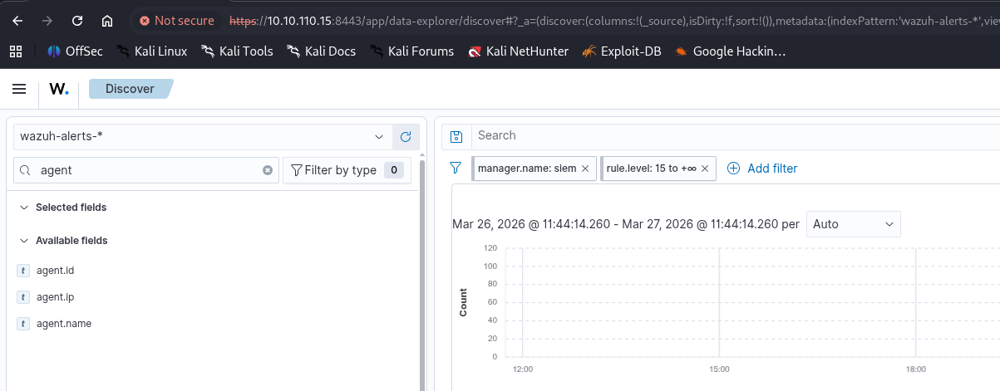

As usual I will start by checking presence of open services on TCP and I suspoect this is the SIEM machine, which means it should be out of the test:

```bash
PORT      STATE SERVICE        REASON         VERSION
22/tcp    open  ssh            syn-ack ttl 63 OpenSSH 8.9p1 Ubuntu 3ubuntu0.13 (Ubuntu Linux; protocol 2.0)
| ssh-hostkey: 
|   256 2d:3b:7c:64:1b:0a:2c:d3:99:a3:b3:71:0d:bd:ae:48 (ECDSA)
| ecdsa-sha2-nistp256 AAAAE2VjZHNhLXNoYTItbmlzdHAyNTYAAAAIbmlzdHAyNTYAAABBBClHOCqYfCmr445HgyhMDlqjaJvGjlp3g8JoRNUZxXBQ32LRL+kJ3W6WTIE0NeoU2nrdZzEppIyNR2CNa7poa8w=
|   256 c8:0d:26:af:f2:49:00:75:0d:1f:e0:d3:76:ac:bc:c2 (ED25519)
|_ssh-ed25519 AAAAC3NzaC1lZDI1NTE5AAAAIPRnijCsJMteblAV3w553CY4BT2H2nVuwvYWVCK58PkF
1514/tcp  open  fujitsu-dtcns? syn-ack ttl 63
1515/tcp  open  tcpwrapped     syn-ack ttl 63
8443/tcp  open  ssl/https-alt  syn-ack ttl 63
| http-methods: 
|_  Supported Methods: GET HEAD POST OPTIONS
|_ssl-date: TLS randomness does not represent time
| tls-alpn: 
|_  http/1.1
| http-title: Wazuh
|_Requested resource was /app/login?
| ssl-cert: Subject: commonName=wazuh-dashboard/organizationName=Wazuh/countryName=US/organizationalUnitName=Wazuh/localityName=California
| Subject Alternative Name: IP Address:127.0.0.1
| Issuer: organizationName=Wazuh/localityName=California/organizationalUnitName=Wazuh
| Public Key type: rsa
| Public Key bits: 2048
| Signature Algorithm: sha256WithRSAEncryption
| Not valid before: 2023-04-01T09:29:26
| Not valid after:  2033-03-29T09:29:26
| MD5:     126c 1b74 988b 2618 7b77 8099 57c1 d6ca
| SHA-1:   caed dc24 72ae 5ce9 9f94 542f 8b73 182f 7ad0 09a8
| SHA-256: 7b56 1571 c802 f4fa 22de aff8 01e8 3169 ff6f e11b 1624 9ccd 2812 9782 fb21 4f2e
| -----BEGIN CERTIFICATE-----
| MIIDijCCAnKgAwIBAgIUPL/EldjDD5pEbxflcIb62/OLax8wDQYJKoZIhvcNAQEL
| BQAwNTEOMAwGA1UECwwFV2F6dWgxDjAMBgNVBAoMBVdhenVoMRMwEQYDVQQHDApD
| YWxpZm9ybmlhMB4XDTIzMDQwMTA5MjkyNloXDTMzMDMyOTA5MjkyNlowXDELMAkG
| A1UEBhMCVVMxEzARBgNVBAcMCkNhbGlmb3JuaWExDjAMBgNVBAoMBVdhenVoMQ4w
| DAYDVQQLDAVXYXp1aDEYMBYGA1UEAwwPd2F6dWgtZGFzaGJvYXJkMIIBIjANBgkq
| hkiG9w0BAQEFAAOCAQ8AMIIBCgKCAQEA21ecy1N3J8hJyDfvSmTuhYGwFWWAdQTE
| 2bwsTOtuqK3fD+zExB9Y3Wy52fauUnX5iSE4fdzXUmk+dju1ncTVwq19y+Ro//+e
| cRu8iOPrfe2Zg4kbTxVznboGViG1Lue2ZNB3qpm4GXFrTVLDH08TK1QH7H5xnH3u
| dSBydymMVm/puJe/F2+v6LhPzuqxaclsnXdgiNdlnGAcR5hJSotXBJVjH+KiUnEO
| OxVn1etMKkWbjHeW8boCikoZnIAFnpWrHS9vlCaG8x6eS2Wx2QZ85QZ6OeJOdRDI
| vMLbh86djkNmxyE6LtVniNh7AiccvssQ2VuDCLzJvL4BXQoekzENPQIDAQABo2sw
| aTAfBgNVHSMEGDAWgBRTmRyi6cDbnOqnsT9HSaIeU2rdZjAJBgNVHRMEAjAAMAsG
| A1UdDwQEAwIE8DAPBgNVHREECDAGhwR/AAABMB0GA1UdDgQWBBRvXxibXvDWPVzH
| AiSgUQtzj+cmgjANBgkqhkiG9w0BAQsFAAOCAQEAtT5wcbpX8VLdpRIto/2II7aC
| SGjmUp3bwfvHstJMumfit8XMgIG1BZFeJZX2QcuFgQwhx8YOzEeagH6vdDO7ZxgC
| PErZLGnBQ6Fcr6mdD7CaGrzaXZfulDcZCP8OWvDxEXth5IaL9W6OamXibSrf7gvp
| rnvU3Fy5CYJKTvG0iMhBbUsn7QNjkx0RJyOO56V5sWVIZuFJ3q6/tCO00Ss3rTVk
| 3PHFMcOzXIzRkFRjQP/JYC+FYVbONl98I/n1yVga/8X7THBSbw7kqHUbRTT8Fp1Q
| Z9NXIkAltxxzYBdUSa9dIeKpBCZ8OoQl18cnJWc/d09E72ruKoj7KVXX4gfKUg==
|_-----END CERTIFICATE-----
| fingerprint-strings: 
|   FourOhFourRequest: 
|     HTTP/1.1 401 Unauthorized
|     osd-name: siem
|     x-frame-options: sameorigin
|     content-type: application/json; charset=utf-8
|     cache-control: private, no-cache, no-store, must-revalidate
|     set-cookie: security_authentication=; Max-Age=0; Expires=Thu, 01 Jan 1970 00:00:00 GMT; Secure; HttpOnly; Path=/
|     content-length: 77
|     Date: Fri, 27 Mar 2026 10:13:45 GMT
|     Connection: close
|     {"statusCode":401,"error":"Unauthorized","message":"Authentication required"}
|   GetRequest: 
|     HTTP/1.1 302 Found
|     location: /app/login?
|     osd-name: siem
|     x-frame-options: sameorigin
|     cache-control: private, no-cache, no-store, must-revalidate
|     set-cookie: security_authentication=; Max-Age=0; Expires=Thu, 01 Jan 1970 00:00:00 GMT; Secure; HttpOnly; Path=/
|     content-length: 0
|     Date: Fri, 27 Mar 2026 10:13:44 GMT
|     Connection: close
|   HTTPOptions: 
|     HTTP/1.1 404 Not Found
|     osd-name: siem
|     x-frame-options: sameorigin
|     content-type: application/json; charset=utf-8
|     cache-control: private, no-cache, no-store, must-revalidate
|     content-length: 60
|     Date: Fri, 27 Mar 2026 10:13:45 GMT
|     Connection: close
|     {"statusCode":404,"error":"Not Found","message":"Not Found"}
|   RTSPRequest: 
|     HTTP/1.1 404 Not Found
|     osd-name: siem
|     x-frame-options: sameorigin
|     content-type: application/json; charset=utf-8
|     cache-control: private, no-cache, no-store, must-revalidate
|     content-length: 60
|     Date: Fri, 27 Mar 2026 10:13:50 GMT
|     Connection: close
|_    {"statusCode":404,"error":"Not Found","message":"Not Found"}
55000/tcp open  unknown        syn-ack ttl 63
1 service unrecognized despite returning data. If you know the service/version, please submit the following fingerprint at https://nmap.org/cgi-bin/submit.cgi?new-service :
SF-Port8443-TCP:V=7.98%T=SSL%I=7%D=3/27%Time=69C65858%P=x86_64-pc-linux-gn
SF:u%r(GetRequest,154,"HTTP/1\.1\x20302\x20Found\r\nlocation:\x20/app/logi
SF:n\?\r\nosd-name:\x20siem\r\nx-frame-options:\x20sameorigin\r\ncache-con
SF:trol:\x20private,\x20no-cache,\x20no-store,\x20must-revalidate\r\nset-c
SF:ookie:\x20security_authentication=;\x20Max-Age=0;\x20Expires=Thu,\x2001
SF:\x20Jan\x201970\x2000:00:00\x20GMT;\x20Secure;\x20HttpOnly;\x20Path=/\r
SF:\ncontent-length:\x200\r\nDate:\x20Fri,\x2027\x20Mar\x202026\x2010:13:4
SF:4\x20GMT\r\nConnection:\x20close\r\n\r\n")%r(HTTPOptions,13B,"HTTP/1\.1
SF:\x20404\x20Not\x20Found\r\nosd-name:\x20siem\r\nx-frame-options:\x20sam
SF:eorigin\r\ncontent-type:\x20application/json;\x20charset=utf-8\r\ncache
SF:-control:\x20private,\x20no-cache,\x20no-store,\x20must-revalidate\r\nc
SF:ontent-length:\x2060\r\nDate:\x20Fri,\x2027\x20Mar\x202026\x2010:13:45\
SF:x20GMT\r\nConnection:\x20close\r\n\r\n{\"statusCode\":404,\"error\":\"N
SF:ot\x20Found\",\"message\":\"Not\x20Found\"}")%r(FourOhFourRequest,1C1,"
SF:HTTP/1\.1\x20401\x20Unauthorized\r\nosd-name:\x20siem\r\nx-frame-option
SF:s:\x20sameorigin\r\ncontent-type:\x20application/json;\x20charset=utf-8
SF:\r\ncache-control:\x20private,\x20no-cache,\x20no-store,\x20must-revali
SF:date\r\nset-cookie:\x20security_authentication=;\x20Max-Age=0;\x20Expir
SF:es=Thu,\x2001\x20Jan\x201970\x2000:00:00\x20GMT;\x20Secure;\x20HttpOnly
SF:;\x20Path=/\r\ncontent-length:\x2077\r\nDate:\x20Fri,\x2027\x20Mar\x202
SF:026\x2010:13:45\x20GMT\r\nConnection:\x20close\r\n\r\n{\"statusCode\":4
SF:01,\"error\":\"Unauthorized\",\"message\":\"Authentication\x20required\
SF:"}")%r(RTSPRequest,13B,"HTTP/1\.1\x20404\x20Not\x20Found\r\nosd-name:\x
SF:20siem\r\nx-frame-options:\x20sameorigin\r\ncontent-type:\x20applicatio
SF:n/json;\x20charset=utf-8\r\ncache-control:\x20private,\x20no-cache,\x20
SF:no-store,\x20must-revalidate\r\ncontent-length:\x2060\r\nDate:\x20Fri,\
SF:x2027\x20Mar\x202026\x2010:13:50\x20GMT\r\nConnection:\x20close\r\n\r\n
SF:{\"statusCode\":404,\"error\":\"Not\x20Found\",\"message\":\"Not\x20Fou
SF:nd\"}");
Warning: OSScan results may be unreliable because we could not find at least 1 open and 1 closed port
Device type: general purpose|router
Running: Linux 4.X|5.X, MikroTik RouterOS 7.X
OS CPE: cpe:/o:linux:linux_kernel:4 cpe:/o:linux:linux_kernel:5 cpe:/o:mikrotik:routeros:7 cpe:/o:linux:linux_kernel:5.6.3
OS details: Linux 4.15 - 5.19, Linux 5.0 - 5.14, MikroTik RouterOS 7.2 - 7.5 (Linux 5.6.3)
TCP/IP fingerprint:
OS:SCAN(V=7.98%E=4%D=3/27%OT=22%CT=%CU=32072%PV=Y%DS=2%DC=T%G=N%TM=69C65883
OS:%P=x86_64-pc-linux-gnu)SEQ(SP=103%GCD=1%ISR=10E%TI=Z%CI=Z%II=I%TS=A)OPS(
OS:O1=M552ST11NW7%O2=M552ST11NW7%O3=M552NNT11NW7%O4=M552ST11NW7%O5=M552ST11
OS:NW7%O6=M552ST11)WIN(W1=FE88%W2=FE88%W3=FE88%W4=FE88%W5=FE88%W6=FE88)ECN(
OS:R=Y%DF=Y%T=40%W=FAF0%O=M552NNSNW7%CC=Y%Q=)T1(R=Y%DF=Y%T=40%S=O%A=S+%F=AS
OS:%RD=0%Q=)T2(R=N)T3(R=N)T4(R=Y%DF=Y%T=40%W=0%S=A%A=Z%F=R%O=%RD=0%Q=)T5(R=
OS:Y%DF=Y%T=40%W=0%S=Z%A=S+%F=AR%O=%RD=0%Q=)T6(R=Y%DF=Y%T=40%W=0%S=A%A=Z%F=
OS:R%O=%RD=0%Q=)U1(R=Y%DF=N%T=40%IPL=164%UN=0%RIPL=G%RID=G%RIPCK=G%RUCK=G%R
OS:UD=G)IE(R=Y%DFI=N%T=40%CD=S)

```

# Out of Scope

Judging by the login on the SIEM page I really think this must be out of the scoping:

