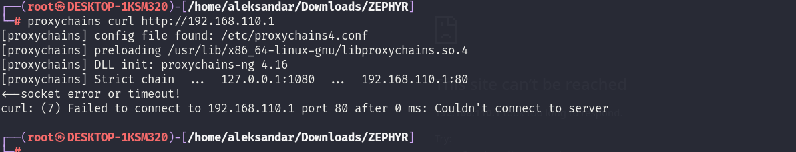
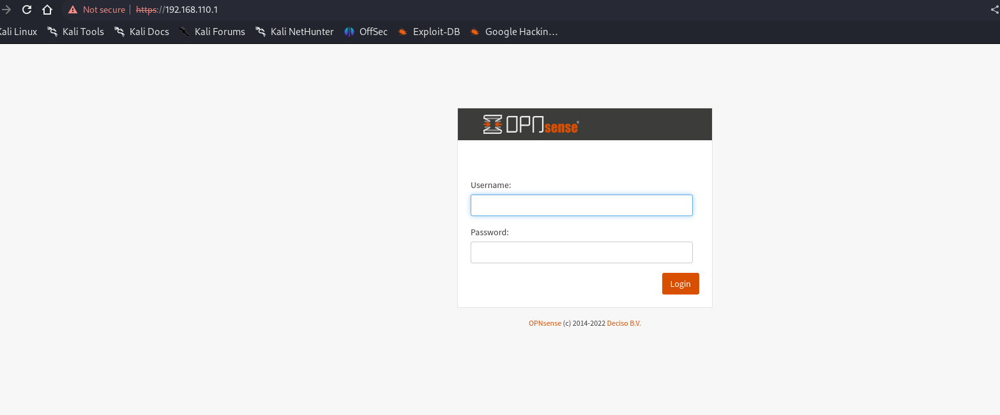

Usually the .1 is either the local firewall or might just be a Gateway which always responds back to a PING.

If we run a  Enum4linux shows that all the standard Windows services are closed:

```
┌──(root㉿DESKTOP-1KSM320)-[/home/aleksandar/Downloads/ZEPHYR]
└─# proxychains enum4linux-ng -A 192.168.110.1                                                                                                                                       
[proxychains] config file found: /etc/proxychains4.conf
[proxychains] preloading /usr/lib/x86_64-linux-gnu/libproxychains.so.4
[proxychains] DLL init: proxychains-ng 4.16
ENUM4LINUX - next generation (v1.3.1)

[proxychains] DLL init: proxychains-ng 4.16
 ==========================
|    Target Information    |
 ==========================
[*] Target ........... 192.168.110.1
[*] Username ......... ''
[*] Random Username .. 'ylumxkhz'
[*] Password ......... ''
[*] Timeout .......... 5 second(s)

 ======================================
|    Listener Scan on 192.168.110.1    |
 ======================================
[*] Checking LDAP
[proxychains] Strict chain  ...  127.0.0.1:1080  ...  192.168.110.1:389 
<--socket error or timeout!
[-] Could not connect to LDAP on 389/tcp: connection refused
[*] Checking LDAPS
[proxychains] Strict chain  ...  127.0.0.1:1080  ...  192.168.110.1:636 <--socket error or timeout!
[-] Could not connect to LDAPS on 636/tcp: connection refused
[*] Checking SMB
[proxychains] Strict chain  ...  127.0.0.1:1080  ...  192.168.110.1:445 <--socket error or timeout!
[-] Could not connect to SMB on 445/tcp: connection refused
[*] Checking SMB over NetBIOS
[proxychains] Strict chain  ...  127.0.0.1:1080  ...  192.168.110.1:139 <--socket error or timeout!
[-] Could not connect to SMB over NetBIOS on 139/tcp: connection refused

 ============================================================
|    NetBIOS Names and Workgroup/Domain for 192.168.110.1    |
 ============================================================
[-] Could not get NetBIOS names information via 'nmblookup': timed out

[!] Aborting remainder of tests since neither SMB nor LDAP are accessible

Completed after 65.09 seconds
```

Where even curl fails:



If we run NMAP we get in return that DNS is open but that must be a Gateway:

```
riley@mail:/tmp$ ./nmap 192.168.110.1

Starting Nmap 6.49BETA1 ( http://nmap.org ) at 2023-09-08 13:02 UTC
Unable to find nmap-services!  Resorting to /etc/services
Cannot find nmap-payloads. UDP payloads are disabled.
Stats: 0:00:01 elapsed; 0 hosts completed (1 up), 1 undergoing Connect Scan
Connect Scan Timing: About 0.68% done
Stats: 0:00:02 elapsed; 0 hosts completed (1 up), 1 undergoing Connect Scan
Connect Scan Timing: About 8.88% done; ETC: 13:03 (0:00:21 remaining)
Stats: 0:00:02 elapsed; 0 hosts completed (1 up), 1 undergoing Connect Scan
Connect Scan Timing: About 21.79% done; ETC: 13:03 (0:00:07 remaining)
Stats: 0:00:03 elapsed; 0 hosts completed (1 up), 1 undergoing Connect Scan
Connect Scan Timing: About 43.99% done; ETC: 13:02 (0:00:04 remaining)
Stats: 0:00:04 elapsed; 0 hosts completed (1 up), 1 undergoing Connect Scan
Connect Scan Timing: About 66.54% done; ETC: 13:02 (0:00:02 remaining)
Stats: 0:00:04 elapsed; 0 hosts completed (1 up), 1 undergoing Connect Scan
Connect Scan Timing: About 86.08% done; ETC: 13:02 (0:00:01 remaining)
Stats: 0:00:05 elapsed; 0 hosts completed (1 up), 1 undergoing Connect Scan
Connect Scan Timing: About 99.99% done; ETC: 13:02 (0:00:00 remaining)
Nmap scan report for _gateway (192.168.110.1)
Host is up (0.00037s latency).
Not shown: 1179 filtered ports
PORT    STATE SERVICE
53/tcp  open  domain
80/tcp  open  http
443/tcp open  https

Nmap done: 1 IP address (1 host up) scanned in 5.34 seconds
```

And trying again but this time from the inside it shows that this is the main Firewall:

```
riley@mail:/tmp$ curl -k https://192.168.110.1
<!doctype html>
<!--[if IE 8 ]><html lang="en" class="ie ie8 lte9 lte8 no-js"><![endif]-->
<!--[if IE 9 ]><html lang="en" class="ie ie9 lte9 no-js"><![endif]-->
<!--[if (gt IE 9)|!(IE)]><!--><html lang="en" class="no-js"><!--<![endif]-->
  <head>
    <meta charset="UTF-8" />
    <meta http-equiv="X-UA-Compatible" content="IE=edge">

    <meta name="robots" content="noindex, nofollow, noodp, noydir" />
    <meta name="keywords" content="" />
    <meta name="description" content="" />
    <meta name="copyright" content="" />
    <meta name="viewport" content="width=device-width, initial-scale=1, minimum-scale=1" />

    <title>Login | OPNsense</title>

    <link href="/ui/themes/opnsense/build/css/main.css?v=9e3c21238ba1c15d" rel="stylesheet">
    <link href="/ui/themes/opnsense/build/images/favicon.png?v=9e3c21238ba1c15d" rel="shortcut icon">

    <script src="/ui/js/jquery-3.5.1.min.js"></script>

    
    <!--[if lt IE 9]><script src="//cdnjs.cloudflare.com/ajax/libs/html5shiv/3.7.2/html5shiv.min.js"></script><![endif]-->

  
            <script>
              $( document ).ready(function() {
                  $.ajaxSetup({
                  'beforeSend': function(xhr) {
                      xhr.setRequestHeader("X-CSRFToken", "MGxiNjVxQm5taElYQTJFcDRBL3RjZz09" );
                  }
                });
              });
            </script>
            </head>
  <body class="page-login">

  <div class="container">
    
    <main class="login-modal-container">
      <header class="login-modal-head" style="height:50px;">
        <div class="navbar-brand">
              
            </div>
      </header>

      <div class="login-modal-content">
        <div id="inputerrors" class="text-danger">&nbsp;</div><br />

            <form class="clearfix" id="iform" name="iform" method="post" autocomplete="off"><input type="hidden" name="NHdsSi8vUnV4ZXAwUThQcFBmck91Zz09" value="MGxiNjVxQm5taElYQTJFcDRBL3RjZz09" autocomplete="new-password" />

        <div class="form-group">
          <label for="usernamefld">Username:</label>
          <input id="usernamefld" type="text" name="usernamefld" class="form-control user" tabindex="1" autofocus="autofocus" autocapitalize="off" autocorrect="off" />
        </div>

        <div class="form-group">
          <label for="passwordfld">Password:</label>
          <input id="passwordfld" type="password" name="passwordfld" class="form-control pwd" tabindex="2" />
        </div>

        <button type="submit" name="login" value="1" class="btn btn-primary pull-right">Login</button>

      </form>

      
          </div>

      </main>
      <div class="login-foot text-center">
        <a target="_blank" href="https://opnsense.org/">OPNsense</a> (c) 2014-2022        <a target="_blank" href="https://www.deciso.com/">Deciso B.V.</a>
      </div>

    </div>

    </body>
  </html>
```



I don't think we can do that much right know on this machine without a set of valid credentials.