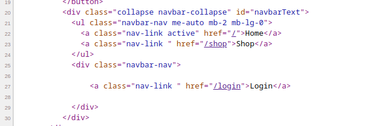

## Rustscan:

```Bash
PORT   STATE SERVICE REASON         VERSION
22/tcp open  ssh     syn-ack ttl 63 OpenSSH 8.2p1 Ubuntu 4ubuntu0.7 (Ubuntu Linux; protocol 2.0)
| ssh-hostkey: 
|   3072 811d2235dd2115644a1fdc5c9c66e5e2 (RSA)
| ssh-rsa AAAAB3NzaC1yc2EAAAADAQABAAABgQDJFj5rM4cLScsJ6ppJO9IxEYpw0bXXh9woF65DRqAjYu0/zJDURGEjP5B7YjB/J/HS4KsCtxSpvfLeO+PRNPlDkEkXyqNK2ZA8Vl+pHUyYFgYM/GYsIwFPg+Du2NU80GAg/qA+QMagKyhBDcUyhxWCFsb5n27xiGk+s8wQzJu82BBU2mRbN+fS9Z6Vu+ien9iAB7gwFlNC6vVGrl6AZbopuzDj2KD5TVB5qF9jG2kaKKftH7xZ2G/1Ql+VNQZ3XB/TJZS/wtUTgpsNNZfFGfAmzruSqmAhy6rmnl9qV6D/8JX+Fnie84iuURHT/uSHyQmEtjYeYxNhulaXs3iKm+A+E0RpbhQiuxEHmlAEmN78lGpNeDvaqWzM88G4bonMiAbJqHh3FX7E5wlsYE0G3qGV8Khk2jdMydLvqbJB2xMbYE1HE5tek/2g/OmUudWBWXWhk/uNMSRr3U8s/WEu0kGhbrFUkGbQHu4+Fui4Gm1TRwk2Mv+Jyi72pOHi2j43bHc=
|   256 01f90d3c221d948306a4967a011c9ea1 (ECDSA)
| ecdsa-sha2-nistp256 AAAAE2VjZHNhLXNoYTItbmlzdHAyNTYAAAAIbmlzdHAyNTYAAABBBGgMJ/I1ptV34IVNgJcPqNq9N9IDAKSGVknIXSeLjxwtgbYXJCcPaxIaoKrUySxDakTdPX69Xm5cqzAe1tt/wLA=
|   256 647d17179179f6d7c48774f8a216f7cf (ED25519)
|_ssh-ed25519 AAAAC3NzaC1lZDI1NTE5AAAAIKJXHOUfa1ZogImXoMvvAgO9Y9QN0st0mrynZutcKR+A
80/tcp open  http    syn-ack ttl 63 nginx 1.18.0 (Ubuntu)
|_http-title: Did not follow redirect to http://bookworm.htb
|_http-server-header: nginx/1.18.0 (Ubuntu)
| http-methods: 
|_  Supported Methods: GET HEAD POST OPTIONS
Warning: OSScan results may be unreliable because we could not find at least 1 open and 1 closed port
OS fingerprint not ideal because: Missing a closed TCP port so results incomplete
Aggressive OS guesses: Linux 2.6.32 (96%), Linux 4.15 - 5.6 (95%), Linux 5.0 - 5.3 (95%), Linux 3.1 (94%), Linux 3.2 (94%), Linux 5.3 - 5.4 (94%), AXIS 210A or 211 Network Camera (Linux 2.6.17) (94%), ASUS RT-N56U WAP (Linux 3.4) (93%), Linux 3.16 (93%), Linux 2.6.38 (92%)
No exact OS matches for host (test conditions non-ideal).
TCP/IP fingerprint:
```

* * *

## SSH - Port 22:

As usual we can't do much about SSH service since the main version is pretty new and no relevant Exploit are available in the wild. Bruteforce is not contempted in this challenge so we have to move forward untill we find a proper set of credentials.

* * *

## HTTP - Port 80:

From our first scan we found the potential FQDN of the website hosted on port 80, and good idea is always to add that to our hosts file to make it easier for evenual Domain fuzzing etc.

As usual I will start by checking for leftovers in the HTML source code but nothing came out so far, but eventually we can see some referrals to a Login and shop page:



I will run Dirsearch and check for extra directories, but had to stop it cause it was slow and unstable:

```Bash
┌──(root㉿kali)-[/home/aleksandar/Downloads]
└─# dirsearch -u "http://bookworm.htb"

  _|. _ _  _  _  _ _|_    v0.4.3
 (_||| _) (/_(_|| (_| )

Extensions: php, aspx, jsp, html, js | HTTP method: GET | Threads: 25 | Wordlist size: 11712

Output: /home/aleksandar/Downloads/reports/http_bookworm.htb/_23-05-30_13-27-48.txt

Target: http://bookworm.htb/

[13:27:48] Starting: 
CTRL+C detected: Pausing threads, please wait...
[q]uit / [c]ontinue: q
[s]ave / [q]uit without saving: q

Canceled by the user
```

Then I tried same with FFUF and fuzzing for eventual subdomains on the host but same here nothing special:

```Bash
──(root㉿kali)-[/home/aleksandar/Downloads]
└─# ffuf -w /usr/share/seclists/Discovery/DNS/subdomains-top1million-20000.txt -u http://bookworm.htb -H "Host:FUZZ.bookworm.htb" -fl 8

        /'___\  /'___\           /'___\       
       /\ \__/ /\ \__/  __  __  /\ \__/       
       \ \ ,__\\ \ ,__\/\ \/\ \ \ \ ,__\      
        \ \ \_/ \ \ \_/\ \ \_\ \ \ \ \_/      
         \ \_\   \ \_\  \ \____/  \ \_\       
          \/_/    \/_/   \/___/    \/_/       

       v2.0.0-dev
________________________________________________

 :: Method           : GET
 :: URL              : http://bookworm.htb
 :: Wordlist         : FUZZ: /usr/share/seclists/Discovery/DNS/subdomains-top1million-20000.txt
 :: Header           : Host: FUZZ.bookworm.htb
 :: Follow redirects : false
 :: Calibration      : false
 :: Timeout          : 10
 :: Threads          : 40
 :: Matcher          : Response status: 200,204,301,302,307,401,403,405,500
 :: Filter           : Response lines: 8
________________________________________________

:: Progress: [19966/19966] :: Job [1/1] :: 230 req/sec :: Duration: [0:01:03] :: Errors: 0 ::
```

Now here I guess is good idea to Launch a Burpsuite instance and try to catch all the traffic for possible attack vectors on the website page.

* * *