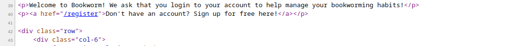
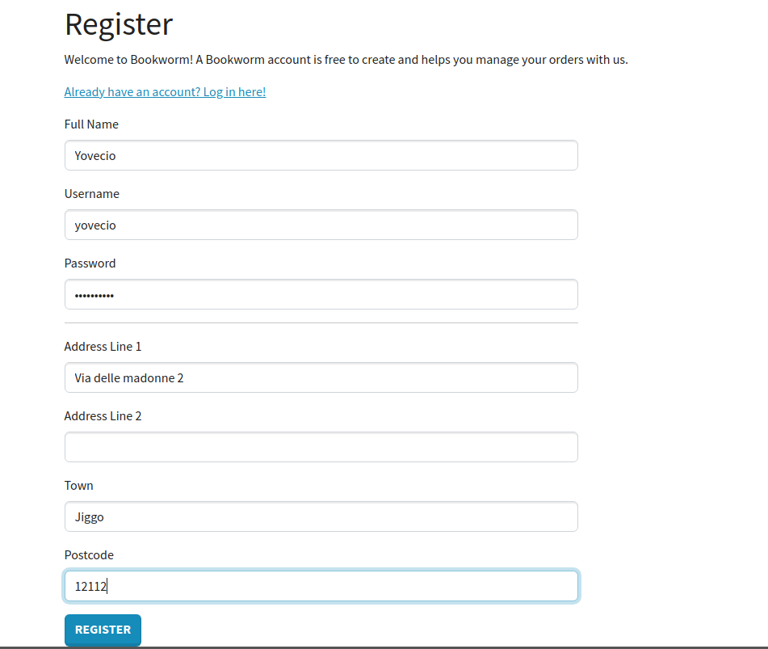
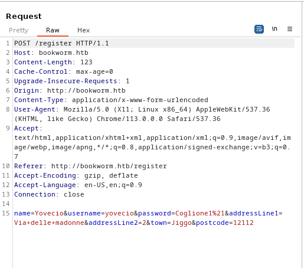
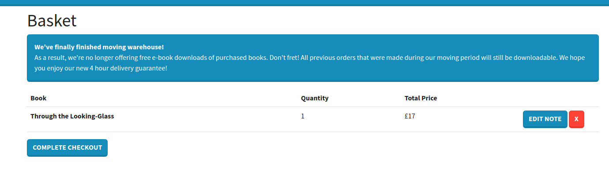
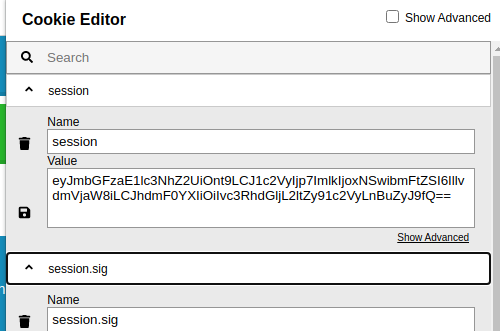
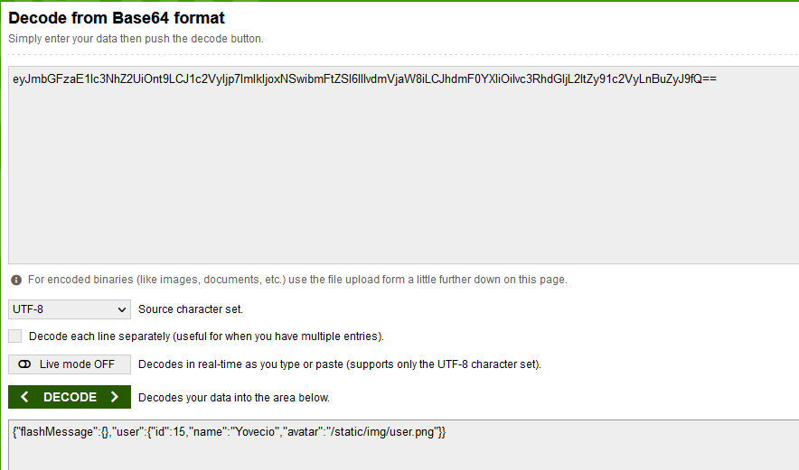
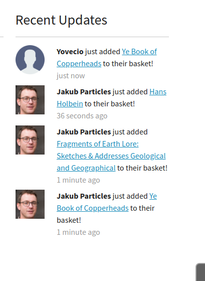
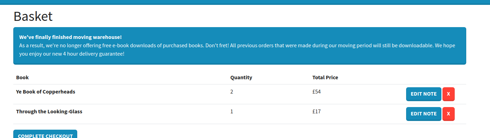
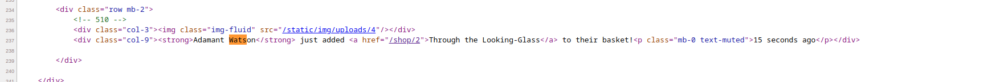

Knowing from our intial enumeration that all the automatical tolls didn't unveil anything interesting we decided to move forward and engage a manual enumeration togeter with Burpsuite.

Nothing came out from HTMl source code on Shop, but on Login portal seems like we could create ourself a user?

And going thru the formular we can se how we can send a user creation:

And seems like we have a account to login:

Then playing around on the website I did all the major tasks like add book to basket, add comment etc and saved the requests in burpsuite for future analysys:

Checking session token we can see is Base64 encoded:

And decoding we can see how the token are constructed:

Which makes me wonder if we can maybe craft a token with another id, but would require a right matching name as well... Then checking for tips seems like we are supposed to check for "lastly updated stuff"

Here can we see the other username "Jakub Particles" that added some books to himself.. Wondering if we can use his id?

But no guess no so far, I'm wondering if there is something I am missing?

Maybe that ebook is a folder? But no nothing like that...

The tips is to check the HTML source code and more specifically this one: 

That comment should be the ID of the user's basked, and knowing that we should be able to use that basket and more specifically the "Comment" field to inject a XSS.